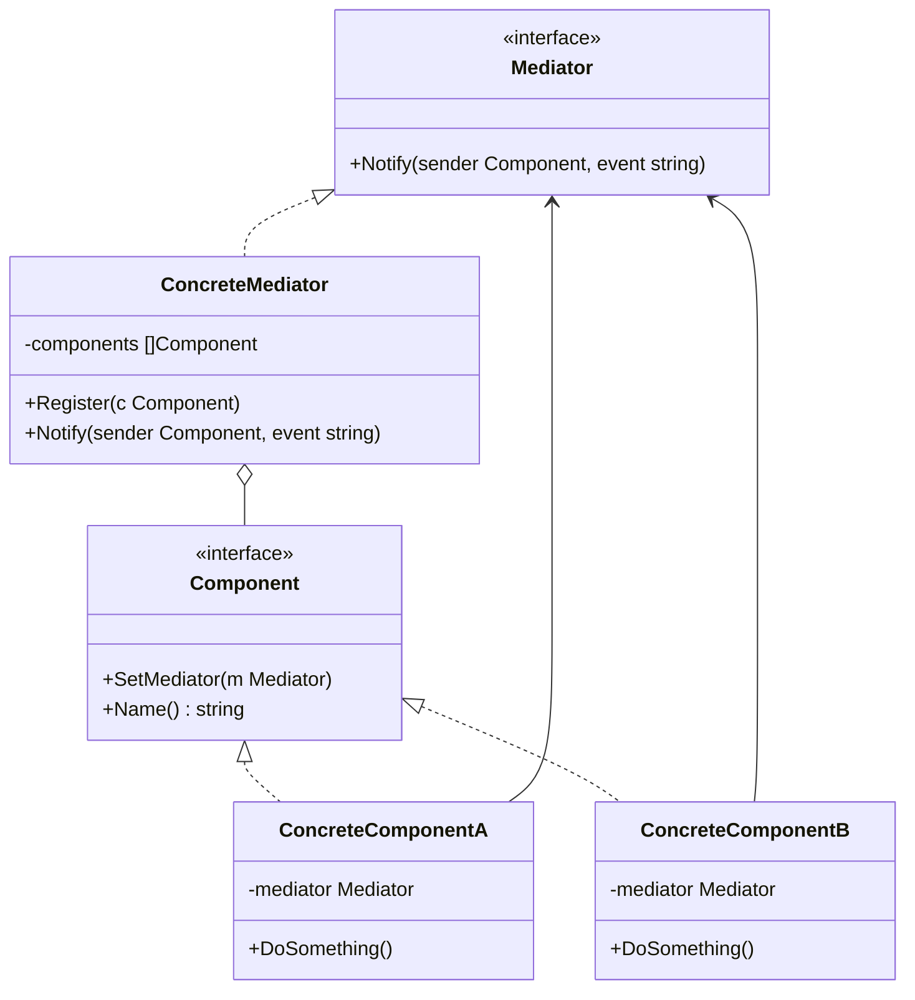

# Mediator / 中介者模式

## Intent / 意圖
> 定義一個中介物件來封裝一組物件之間的互動，使物件之間不需直接參照，從而降低耦合度並可獨立地改變它們的互動方式。

## Problem / 問題情境
在一個機場塔台系統中，每架飛機如果要直接與其他所有飛機通訊來協調起降順序，N 架飛機之間會產生 N*(N-1)/2 條通訊通道。每新增一架飛機就要修改所有既有飛機的通訊邏輯，系統變得極其複雜且難以維護。

## Solution / 解決方案
引入一個中介者（如塔台），所有飛機只與塔台通訊。塔台統一協調起降順序、跑道分配等決策。飛機之間完全解耦，新增飛機只需向塔台註冊即可。

## Structure / 結構



## Participants / 參與者
- **Mediator**：定義與各 Component 通訊的介面。
- **ConcreteMediator**：實作協調邏輯，管理所有 Component 的參照。
- **Component**：每個元件只知道 Mediator，透過 Mediator 與其他元件間接通訊。

## Go 實作

```go
package main

import "fmt"

// Airplane 代表一架飛機
type Airplane struct {
	name    string
	mediator *ControlTower
}

func NewAirplane(name string) *Airplane {
	return &Airplane{name: name}
}

func (a *Airplane) RequestLanding() {
	fmt.Printf("[%s] 請求降落\n", a.name)
	a.mediator.RequestLanding(a)
}

func (a *Airplane) RequestTakeoff() {
	fmt.Printf("[%s] 請求起飛\n", a.name)
	a.mediator.RequestTakeoff(a)
}

func (a *Airplane) NotifyLanded() {
	fmt.Printf("[%s] 已降落\n", a.name)
	a.mediator.NotifyRunwayClear()
}

// ControlTower 是中介者（塔台）
// 使用 channel 協調（Go 慣用法）
type ControlTower struct {
	airplanes   []*Airplane
	runwayFree  bool
	waitingQueue []*Airplane
}

func NewControlTower() *ControlTower {
	return &ControlTower{
		runwayFree: true,
	}
}

func (ct *ControlTower) Register(a *Airplane) {
	a.mediator = ct
	ct.airplanes = append(ct.airplanes, a)
	fmt.Printf("[塔台] %s 已註冊\n", a.name)
}

func (ct *ControlTower) RequestLanding(a *Airplane) {
	if ct.runwayFree {
		ct.runwayFree = false
		fmt.Printf("[塔台] 允許 %s 降落，跑道已佔用\n", a.name)
	} else {
		ct.waitingQueue = append(ct.waitingQueue, a)
		fmt.Printf("[塔台] 跑道忙碌，%s 請等待\n", a.name)
	}
}

func (ct *ControlTower) RequestTakeoff(a *Airplane) {
	if ct.runwayFree {
		ct.runwayFree = false
		fmt.Printf("[塔台] 允許 %s 起飛，跑道已佔用\n", a.name)
	} else {
		ct.waitingQueue = append(ct.waitingQueue, a)
		fmt.Printf("[塔台] 跑道忙碌，%s 請等待\n", a.name)
	}
}

func (ct *ControlTower) NotifyRunwayClear() {
	ct.runwayFree = true
	fmt.Println("[塔台] 跑道已清空")
	if len(ct.waitingQueue) > 0 {
		next := ct.waitingQueue[0]
		ct.waitingQueue = ct.waitingQueue[1:]
		ct.runwayFree = false
		fmt.Printf("[塔台] 通知 %s 可以使用跑道\n", next.name)
	}
}

func main() {
	tower := NewControlTower()

	flight1 := NewAirplane("CI-101")
	flight2 := NewAirplane("BR-202")
	flight3 := NewAirplane("JL-303")

	tower.Register(flight1)
	tower.Register(flight2)
	tower.Register(flight3)

	fmt.Println()
	flight1.RequestLanding()
	flight2.RequestLanding()
	flight3.RequestTakeoff()

	fmt.Println()
	flight1.NotifyLanded()
}

// Output:
// [塔台] CI-101 已註冊
// [塔台] BR-202 已註冊
// [塔台] JL-303 已註冊
//
// [CI-101] 請求降落
// [塔台] 允許 CI-101 降落，跑道已佔用
// [BR-202] 請求降落
// [塔台] 跑道忙碌，BR-202 請等待
// [JL-303] 請求起飛
// [塔台] 跑道忙碌，JL-303 請等待
//
// [CI-101] 已降落
// [塔台] 跑道已清空
// [塔台] 通知 BR-202 可以使用跑道
```

## Rust 實作

```rust
use std::cell::RefCell;
use std::rc::Rc;

#[derive(Debug, Clone)]
struct Airplane {
    name: String,
}

impl Airplane {
    fn new(name: &str) -> Self {
        Self {
            name: name.to_string(),
        }
    }
}

struct ControlTower {
    runway_free: bool,
    waiting_queue: Vec<Airplane>,
}

impl ControlTower {
    fn new() -> Self {
        Self {
            runway_free: true,
            waiting_queue: Vec::new(),
        }
    }

    fn request_landing(&mut self, airplane: &Airplane) {
        println!("[{}] 請求降落", airplane.name);
        if self.runway_free {
            self.runway_free = false;
            println!("[塔台] 允許 {} 降落，跑道已佔用", airplane.name);
        } else {
            self.waiting_queue.push(airplane.clone());
            println!("[塔台] 跑道忙碌，{} 請等待", airplane.name);
        }
    }

    fn request_takeoff(&mut self, airplane: &Airplane) {
        println!("[{}] 請求起飛", airplane.name);
        if self.runway_free {
            self.runway_free = false;
            println!("[塔台] 允許 {} 起飛，跑道已佔用", airplane.name);
        } else {
            self.waiting_queue.push(airplane.clone());
            println!("[塔台] 跑道忙碌，{} 請等待", airplane.name);
        }
    }

    fn notify_runway_clear(&mut self, airplane: &Airplane) {
        println!("[{}] 已降落", airplane.name);
        self.runway_free = true;
        println!("[塔台] 跑道已清空");
        if !self.waiting_queue.is_empty() {
            let next = self.waiting_queue.remove(0);
            self.runway_free = false;
            println!("[塔台] 通知 {} 可以使用跑道", next.name);
        }
    }
}

// 使用 mpsc channel 的版本
use std::sync::mpsc;
use std::thread;

#[derive(Debug)]
enum TowerMessage {
    RequestLanding(String),
    RequestTakeoff(String),
    RunwayClear(String),
    Shutdown,
}

fn channel_based_tower() {
    let (tx, rx) = mpsc::channel::<TowerMessage>();

    // 塔台執行緒
    let tower_handle = thread::spawn(move || {
        let mut runway_free = true;
        let mut waiting: Vec<String> = Vec::new();

        for msg in rx {
            match msg {
                TowerMessage::RequestLanding(name) => {
                    if runway_free {
                        runway_free = false;
                        println!("[塔台-channel] 允許 {} 降落", name);
                    } else {
                        waiting.push(name.clone());
                        println!("[塔台-channel] {} 請等待", name);
                    }
                }
                TowerMessage::RunwayClear(name) => {
                    println!("[塔台-channel] {} 已降落，跑道清空", name);
                    runway_free = true;
                    if !waiting.is_empty() {
                        let next = waiting.remove(0);
                        runway_free = false;
                        println!("[塔台-channel] 通知 {} 可以使用跑道", next);
                    }
                }
                TowerMessage::RequestTakeoff(name) => {
                    if runway_free {
                        runway_free = false;
                        println!("[塔台-channel] 允許 {} 起飛", name);
                    } else {
                        waiting.push(name.clone());
                        println!("[塔台-channel] {} 請等待", name);
                    }
                }
                TowerMessage::Shutdown => break,
            }
        }
    });

    tx.send(TowerMessage::RequestLanding("CI-101".into())).unwrap();
    tx.send(TowerMessage::RequestLanding("BR-202".into())).unwrap();
    tx.send(TowerMessage::RunwayClear("CI-101".into())).unwrap();
    tx.send(TowerMessage::Shutdown).unwrap();

    tower_handle.join().unwrap();
}

fn main() {
    // 直接呼叫版本
    let mut tower = ControlTower::new();

    let flight1 = Airplane::new("CI-101");
    let flight2 = Airplane::new("BR-202");
    let flight3 = Airplane::new("JL-303");

    tower.request_landing(&flight1);
    tower.request_landing(&flight2);
    tower.request_takeoff(&flight3);
    println!();
    tower.notify_runway_clear(&flight1);

    println!("\n=== Channel-based Mediator ===");
    channel_based_tower();
}

// Output:
// [CI-101] 請求降落
// [塔台] 允許 CI-101 降落，跑道已佔用
// [BR-202] 請求降落
// [塔台] 跑道忙碌，BR-202 請等待
// [JL-303] 請求起飛
// [塔台] 跑道忙碌，JL-303 請等待
//
// [CI-101] 已降落
// [塔台] 跑道已清空
// [塔台] 通知 BR-202 可以使用跑道
//
// === Channel-based Mediator ===
// [塔台-channel] 允許 CI-101 降落
// [塔台-channel] BR-202 請等待
// [塔台-channel] CI-101 已降落，跑道清空
// [塔台-channel] 通知 BR-202 可以使用跑道
```

## Go vs Rust 對照表

| 面向 | Go | Rust |
|------|----|----|
| 中介者持有元件 | 指標 slice `[]*Component`，GC 管理 | `Rc<RefCell<T>>` 或集中管理所有狀態 |
| 非同步協調 | goroutine + channel 非常自然 | `mpsc::channel` + `thread::spawn` 或 async/await |
| 元件間通訊 | 透過 Mediator 的方法呼叫或 channel | 透過 Mediator 方法或 mpsc sender |
| 循環參照 | GC 處理，不需特別注意 | 需用 `Rc<RefCell<T>>` + `Weak` 避免 |

## When to Use / 適用場景
- 多個物件之間有複雜的相互依賴關係，形成「蜘蛛網」式耦合。
- 想要集中管理一組物件的通訊協定，使其可獨立修改。
- GUI 表單中多個控件之間的互動邏輯。

## When NOT to Use / 不適用場景
- 物件之間的互動很簡單且穩定，不需要集中管理。
- 中介者本身變成「上帝物件」（God Object），承擔過多職責。

## Real-World Examples / 真實世界案例
- **Go `sync.WaitGroup` / channel 協調**：Go 的 channel 天然是一種中介者模式，goroutine 之間透過 channel 通訊而非直接呼叫。
- **Rust `tokio::sync::broadcast`**：廣播 channel 可作為事件中介者，多個 subscriber 接收同一 publisher 的訊息。

## Related Patterns / 相關模式
- [Observer](18_observer.md)：Observer 是單向通知，Mediator 是雙向協調。Mediator 常取代分散的 Observer 網路。
- [Chain of Responsibility](13_chain_of_responsibility.md)：Chain of Responsibility 沿鏈傳遞請求，Mediator 則是集中式協調。
- [Facade](../structural/10_facade.md)：Facade 簡化子系統的介面但不協調互動，Mediator 主動協調元件之間的通訊。

## Pitfalls / 常見陷阱
- **God Object 反模式**：中介者承擔過多邏輯，變得臃腫難以維護。應將不同的協調職責拆分為多個小型中介者。
- **隱藏的依賴關係**：元件看似解耦，但實際上仍然依賴中介者的特定行為。修改中介者可能意外破壞多個元件。
- **測試困難**：中介者需要所有元件就位才能測試完整流程，應為中介者提供 mock 元件的能力。

## References / 參考資料
- *Design Patterns: Elements of Reusable Object-Oriented Software* — GoF
- [Refactoring Guru — Mediator](https://refactoring.guru/design-patterns/mediator)
