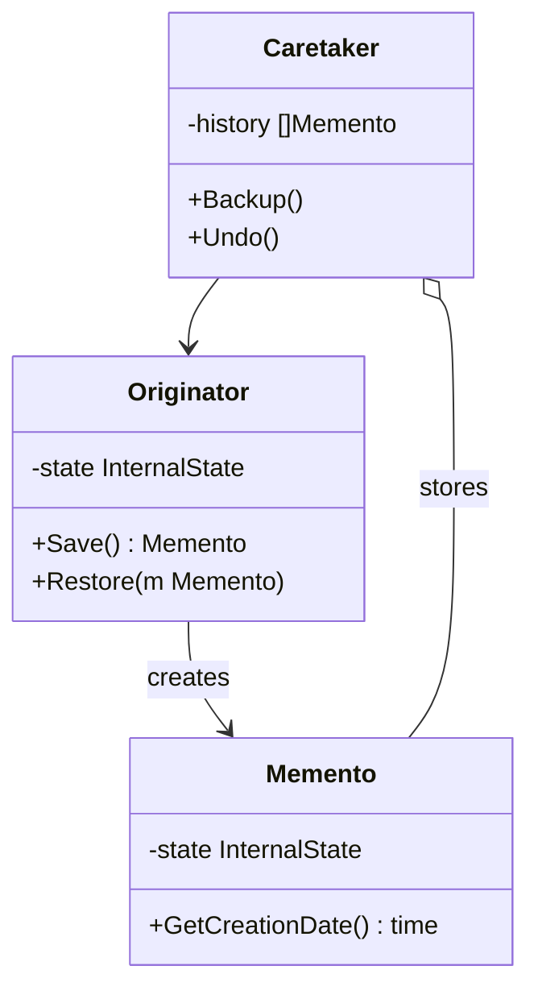

# Memento / 備忘錄模式

## Intent / 意圖
> 在不破壞封裝性的前提下，捕獲並外部化物件的內部狀態，使該物件之後能恢復到先前的狀態。

## Problem / 問題情境
在一個繪圖軟體中，使用者需要能夠撤銷多步操作回到先前的畫布狀態。如果直接將畫布的所有內部屬性（圖層、顏色、座標等）暴露給撤銷管理器，會嚴重破壞封裝性，且任何內部結構的改變都會影響撤銷機制。

## Solution / 解決方案
讓物件自己負責建立狀態快照（Memento），快照物件對外不透露內部細節。只有建立快照的原始物件能存取 Memento 的內容來恢復狀態。外部的 Caretaker 只負責保管 Memento，不需要理解其內容。

## Structure / 結構



## Participants / 參與者
- **Originator**：擁有需要被保存的內部狀態的物件，能建立和恢復 Memento。
- **Memento**：儲存 Originator 的內部狀態快照，不允許外部直接存取。
- **Caretaker**：負責保管 Memento 的歷史紀錄，觸發備份與恢復，但不檢視 Memento 的內容。

## Go 實作

```go
package main

import (
	"fmt"
	"strings"
	"time"
)

// Memento 儲存編輯器狀態快照
type Memento struct {
	content   string
	cursorPos int
	timestamp time.Time
}

func (m *Memento) GetTimestamp() time.Time {
	return m.timestamp
}

// TextEditor 是 Originator
type TextEditor struct {
	content   string
	cursorPos int
}

func NewTextEditor() *TextEditor {
	return &TextEditor{}
}

func (e *TextEditor) Type(text string) {
	before := e.content[:e.cursorPos]
	after := e.content[e.cursorPos:]
	e.content = before + text + after
	e.cursorPos += len(text)
}

func (e *TextEditor) MoveCursor(pos int) {
	if pos < 0 {
		pos = 0
	}
	if pos > len(e.content) {
		pos = len(e.content)
	}
	e.cursorPos = pos
}

func (e *TextEditor) String() string {
	// 用 | 表示游標位置
	return fmt.Sprintf("%s|%s", e.content[:e.cursorPos], e.content[e.cursorPos:])
}

// Save 建立狀態快照
func (e *TextEditor) Save() *Memento {
	return &Memento{
		content:   e.content,
		cursorPos: e.cursorPos,
		timestamp: time.Now(),
	}
}

// Restore 從快照恢復狀態
func (e *TextEditor) Restore(m *Memento) {
	e.content = m.content
	e.cursorPos = m.cursorPos
}

// History 是 Caretaker
type History struct {
	snapshots []*Memento
	editor    *TextEditor
}

func NewHistory(editor *TextEditor) *History {
	return &History{editor: editor}
}

func (h *History) Backup() {
	h.snapshots = append(h.snapshots, h.editor.Save())
}

func (h *History) Undo() bool {
	if len(h.snapshots) == 0 {
		fmt.Println("Nothing to undo")
		return false
	}
	last := h.snapshots[len(h.snapshots)-1]
	h.snapshots = h.snapshots[:len(h.snapshots)-1]
	h.editor.Restore(last)
	return true
}

func (h *History) ShowHistory() {
	fmt.Printf("History has %d snapshots\n", len(h.snapshots))
}

func main() {
	editor := NewTextEditor()
	history := NewHistory(editor)

	// 輸入文字，每次操作前備份
	history.Backup()
	editor.Type("Hello")
	fmt.Printf("After typing 'Hello': %s\n", editor)

	history.Backup()
	editor.Type(", World")
	fmt.Printf("After typing ', World': %s\n", editor)

	history.Backup()
	editor.MoveCursor(5)
	editor.Type(" Beautiful")
	fmt.Printf("After inserting ' Beautiful': %s\n", editor)

	history.ShowHistory()

	// 撤銷
	fmt.Println("\n--- Undo ---")
	history.Undo()
	fmt.Printf("After undo: %s\n", editor)

	history.Undo()
	fmt.Printf("After undo: %s\n", editor)

	history.Undo()
	fmt.Printf("After undo: %s\n", editor)

	_ = strings.TrimSpace // suppress unused import
}

// Output:
// After typing 'Hello': Hello|
// After typing ', World': Hello, World|
// After inserting ' Beautiful': Hello Beautiful|, World
// History has 3 snapshots
//
// --- Undo ---
// After undo: Hello, World|
// After undo: Hello|
// After undo: |
```

## Rust 實作

```rust
use std::time::SystemTime;

// Memento 儲存快照（使用 Clone + 序列化概念）
#[derive(Clone)]
struct EditorMemento {
    content: String,
    cursor_pos: usize,
    timestamp: SystemTime,
}

// TextEditor 是 Originator
#[derive(Clone)]
struct TextEditor {
    content: String,
    cursor_pos: usize,
}

impl TextEditor {
    fn new() -> Self {
        Self {
            content: String::new(),
            cursor_pos: 0,
        }
    }

    fn type_text(&mut self, text: &str) {
        self.content.insert_str(self.cursor_pos, text);
        self.cursor_pos += text.len();
    }

    fn move_cursor(&mut self, pos: usize) {
        self.cursor_pos = pos.min(self.content.len());
    }

    fn display(&self) -> String {
        format!(
            "{}|{}",
            &self.content[..self.cursor_pos],
            &self.content[self.cursor_pos..]
        )
    }

    // 建立快照
    fn save(&self) -> EditorMemento {
        EditorMemento {
            content: self.content.clone(),
            cursor_pos: self.cursor_pos,
            timestamp: SystemTime::now(),
        }
    }

    // 從快照恢復
    fn restore(&mut self, memento: &EditorMemento) {
        self.content = memento.content.clone();
        self.cursor_pos = memento.cursor_pos;
    }
}

// History 是 Caretaker
struct History {
    snapshots: Vec<EditorMemento>,
}

impl History {
    fn new() -> Self {
        Self {
            snapshots: Vec::new(),
        }
    }

    fn backup(&mut self, editor: &TextEditor) {
        self.snapshots.push(editor.save());
    }

    fn undo(&mut self, editor: &mut TextEditor) -> bool {
        if let Some(memento) = self.snapshots.pop() {
            editor.restore(&memento);
            true
        } else {
            println!("Nothing to undo");
            false
        }
    }

    fn len(&self) -> usize {
        self.snapshots.len()
    }
}

fn main() {
    let mut editor = TextEditor::new();
    let mut history = History::new();

    // 每次操作前備份
    history.backup(&editor);
    editor.type_text("Hello");
    println!("After typing 'Hello': {}", editor.display());

    history.backup(&editor);
    editor.type_text(", World");
    println!("After typing ', World': {}", editor.display());

    history.backup(&editor);
    editor.move_cursor(5);
    editor.type_text(" Beautiful");
    println!("After inserting ' Beautiful': {}", editor.display());

    println!("History has {} snapshots", history.len());

    // 撤銷
    println!("\n--- Undo ---");
    history.undo(&mut editor);
    println!("After undo: {}", editor.display());

    history.undo(&mut editor);
    println!("After undo: {}", editor.display());

    history.undo(&mut editor);
    println!("After undo: {}", editor.display());
}

// Output:
// After typing 'Hello': Hello|
// After typing ', World': Hello, World|
// After inserting ' Beautiful': Hello Beautiful|, World
// History has 3 snapshots
//
// --- Undo ---
// After undo: Hello, World|
// After undo: Hello|
// After undo: |
```

## Go vs Rust 對照表

| 面向 | Go | Rust |
|------|----|----|
| 快照建立 | struct literal 複製所有欄位 | 實作 `Clone` trait，呼叫 `.clone()` |
| 封裝性 | 用小寫欄位名（unexported）限制外部存取 | 用 `pub(crate)` 或私有欄位限制存取 |
| 序列化 | `encoding/json` marshaling | `serde` crate 的 `Serialize` / `Deserialize` |
| 記憶體管理 | GC 回收不再被引用的 Memento | Caretaker 擁有 `Vec<Memento>`，drop 時自動釋放 |

## When to Use / 適用場景
- 需要實作撤銷/重做功能，且要保持物件的封裝性。
- 需要定期建立 checkpoint，以便在錯誤發生時回滾到安全狀態。
- 需要記錄物件的歷史狀態以供偵錯或稽核。

## When NOT to Use / 不適用場景
- 物件狀態非常大（如包含大型圖片），頻繁建立快照會消耗大量記憶體。
- 物件的狀態變更可以用命令模式的反向操作來撤銷，不需要完整快照。

## Real-World Examples / 真實世界案例
- **資料庫事務日誌（WAL）**：資料庫在每次寫入前記錄 undo/redo log，概念上就是 Memento 模式。PostgreSQL 的 WAL 和 SQLite 的 rollback journal 都是典型範例。
- **Git 版本控制**：每次 commit 是一個 snapshot（Memento），可以隨時 checkout 回到任意歷史版本。

## Related Patterns / 相關模式
- [Command](14_command.md)：Command 記錄操作，Memento 記錄狀態。兩者常搭配實作撤銷功能。
- [Iterator](15_iterator.md)：可以用 Iterator 遍歷 Memento 歷史。

## Pitfalls / 常見陷阱
- **記憶體消耗**：每個快照都是完整的狀態複本，如果狀態很大或快照頻率很高，記憶體會快速增長。可用差量快照（只記錄變更部分）來優化。
- **深拷貝問題**：如果狀態包含指標或參照，淺拷貝會導致 Memento 與 Originator 共享可變狀態。Go 中需手動深拷貝，Rust 的 Clone derive 會自動處理 owned 型別。
- **快照一致性**：建立快照時如果有並行修改，可能捕獲到不一致的中間狀態。需要在快照時加鎖或使用 copy-on-write。

## References / 參考資料
- *Design Patterns: Elements of Reusable Object-Oriented Software* — GoF
- [Refactoring Guru — Memento](https://refactoring.guru/design-patterns/memento)
