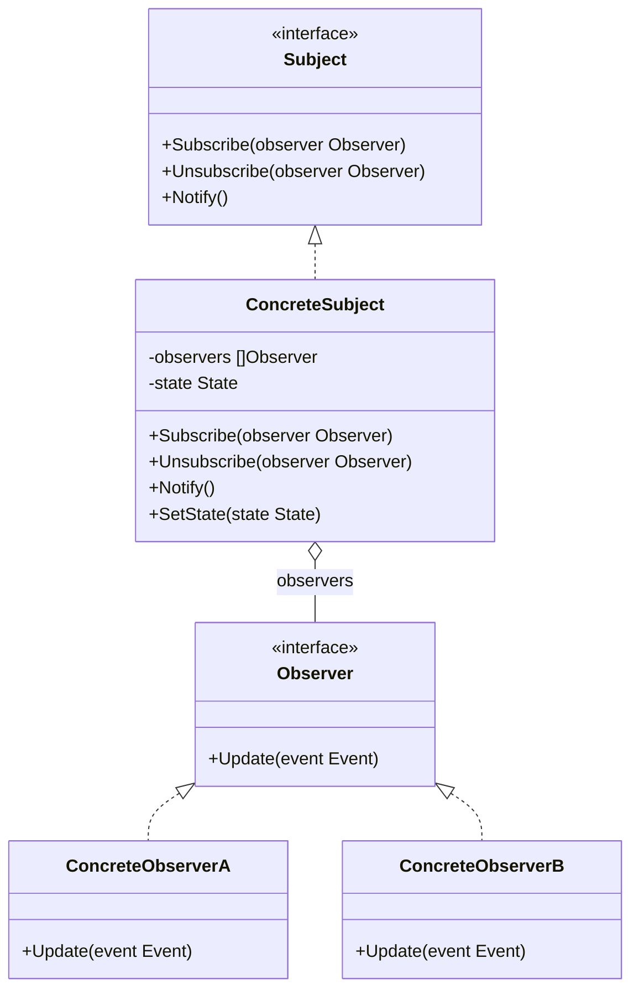

# Observer / 觀察者模式

## Intent / 意圖
> 定義物件之間一對多的依賴關係，當一個物件狀態改變時，所有依賴它的物件都會自動收到通知並更新。

## Problem / 問題情境
在一個電商平台中，當商品庫存狀態改變（如到貨、缺貨）時，需要通知多個系統：Email 通知系統要寄信給訂閱的客戶、庫存儀表板要即時更新、推薦系統要調整推薦權重。如果庫存模組直接呼叫這三個系統，庫存模組就與它們緊密耦合，每新增一個訂閱者就要修改庫存模組。

## Solution / 解決方案
讓庫存模組（Subject）維護一份訂閱者清單，當狀態改變時遍歷清單通知所有訂閱者。訂閱者只需實作統一的通知介面即可註冊。新增或移除訂閱者不需要修改 Subject 的程式碼。

## Structure / 結構



## Participants / 參與者
- **Subject**：維護訂閱者清單，提供註冊/取消註冊的方法，狀態改變時通知所有訂閱者。
- **Observer**：定義接收通知的介面。
- **ConcreteSubject**：持有實際狀態，狀態改變時呼叫 Notify()。
- **ConcreteObserver**：實作 Update 方法，收到通知後執行對應的業務邏輯。

## Go 實作

```go
package main

import (
	"fmt"
	"sync"
)

// Event 代表庫存事件
type Event struct {
	ProductName string
	Action      string // "in_stock", "out_of_stock", "low_stock"
	Quantity    int
}

// Observer 介面
type Observer interface {
	OnEvent(event Event)
	ID() string
}

// InventorySubject 庫存主題（使用 channel pub/sub — Go 慣用法）
type InventorySubject struct {
	mu          sync.RWMutex
	subscribers map[string]chan Event
}

func NewInventorySubject() *InventorySubject {
	return &InventorySubject{
		subscribers: make(map[string]chan Event),
	}
}

func (s *InventorySubject) Subscribe(id string) <-chan Event {
	s.mu.Lock()
	defer s.mu.Unlock()
	ch := make(chan Event, 10) // buffered channel
	s.subscribers[id] = ch
	return ch
}

func (s *InventorySubject) Unsubscribe(id string) {
	s.mu.Lock()
	defer s.mu.Unlock()
	if ch, ok := s.subscribers[id]; ok {
		close(ch)
		delete(s.subscribers, id)
	}
}

func (s *InventorySubject) Publish(event Event) {
	s.mu.RLock()
	defer s.mu.RUnlock()
	for _, ch := range s.subscribers {
		// non-blocking send
		select {
		case ch <- event:
		default:
			// subscriber 來不及消費，丟棄事件（或可改用 log 紀錄）
		}
	}
}

func main() {
	inventory := NewInventorySubject()

	var wg sync.WaitGroup

	// Email 通知訂閱者
	emailCh := inventory.Subscribe("email-notifier")
	wg.Add(1)
	go func() {
		defer wg.Done()
		for event := range emailCh {
			fmt.Printf("[Email] 通知客戶: %s %s (數量: %d)\n",
				event.ProductName, event.Action, event.Quantity)
		}
	}()

	// 儀表板訂閱者
	dashCh := inventory.Subscribe("dashboard")
	wg.Add(1)
	go func() {
		defer wg.Done()
		for event := range dashCh {
			fmt.Printf("[Dashboard] 更新顯示: %s %s (數量: %d)\n",
				event.ProductName, event.Action, event.Quantity)
		}
	}()

	// 推薦系統訂閱者
	recCh := inventory.Subscribe("recommender")
	wg.Add(1)
	go func() {
		defer wg.Done()
		for event := range recCh {
			fmt.Printf("[Recommender] 調整權重: %s %s\n",
				event.ProductName, event.Action)
		}
	}()

	// 發布事件
	inventory.Publish(Event{ProductName: "MacBook Pro", Action: "in_stock", Quantity: 50})
	inventory.Publish(Event{ProductName: "iPhone 17", Action: "low_stock", Quantity: 3})

	// 取消推薦系統的訂閱
	inventory.Unsubscribe("recommender")

	inventory.Publish(Event{ProductName: "AirPods", Action: "out_of_stock", Quantity: 0})

	// 清理
	inventory.Unsubscribe("email-notifier")
	inventory.Unsubscribe("dashboard")
	wg.Wait()
}

// Output (順序可能因 goroutine 排程而異):
// [Email] 通知客戶: MacBook Pro in_stock (數量: 50)
// [Dashboard] 更新顯示: MacBook Pro in_stock (數量: 50)
// [Recommender] 調整權重: MacBook Pro in_stock
// [Email] 通知客戶: iPhone 17 low_stock (數量: 3)
// [Dashboard] 更新顯示: iPhone 17 low_stock (數量: 3)
// [Recommender] 調整權重: iPhone 17 low_stock
// [Email] 通知客戶: AirPods out_of_stock (數量: 0)
// [Dashboard] 更新顯示: AirPods out_of_stock (數量: 0)
```

## Rust 實作

```rust
use std::collections::HashMap;

// Event 代表庫存事件
#[derive(Debug, Clone)]
struct InventoryEvent {
    product_name: String,
    action: String, // "in_stock", "out_of_stock", "low_stock"
    quantity: u32,
}

// Observer 使用 callback Vec
type ObserverFn = Box<dyn Fn(&InventoryEvent)>;

struct InventorySubject {
    observers: HashMap<String, ObserverFn>,
}

impl InventorySubject {
    fn new() -> Self {
        Self {
            observers: HashMap::new(),
        }
    }

    fn subscribe(&mut self, id: &str, callback: ObserverFn) {
        self.observers.insert(id.to_string(), callback);
    }

    fn unsubscribe(&mut self, id: &str) {
        self.observers.remove(id);
    }

    fn notify(&self, event: &InventoryEvent) {
        for (id, callback) in &self.observers {
            callback(event);
        }
    }
}

// 使用 mpsc channel 的版本（適合多執行緒）
use std::sync::mpsc;
use std::thread;

fn channel_based_observer() {
    let (tx, rx) = mpsc::channel::<InventoryEvent>();

    // 多個 subscriber 各拿一個 sender clone
    let tx_email = tx.clone();
    let tx_dash = tx.clone();
    drop(tx); // drop 原始 sender

    // 模擬發布事件
    thread::spawn(move || {
        tx_email
            .send(InventoryEvent {
                product_name: "MacBook Pro".into(),
                action: "in_stock".into(),
                quantity: 50,
            })
            .unwrap();
    });

    thread::spawn(move || {
        tx_dash
            .send(InventoryEvent {
                product_name: "iPhone 17".into(),
                action: "low_stock".into(),
                quantity: 3,
            })
            .unwrap();
    });

    // 接收端（集中處理）
    for event in rx {
        println!(
            "[Channel] 收到事件: {} {} (數量: {})",
            event.product_name, event.action, event.quantity
        );
    }
}

fn main() {
    let mut subject = InventorySubject::new();

    // 註冊 observer callbacks
    subject.subscribe(
        "email",
        Box::new(|event| {
            println!(
                "[Email] 通知客戶: {} {} (數量: {})",
                event.product_name, event.action, event.quantity
            );
        }),
    );

    subject.subscribe(
        "dashboard",
        Box::new(|event| {
            println!(
                "[Dashboard] 更新顯示: {} {} (數量: {})",
                event.product_name, event.action, event.quantity
            );
        }),
    );

    subject.subscribe(
        "recommender",
        Box::new(|event| {
            println!(
                "[Recommender] 調整權重: {} {}",
                event.product_name, event.action
            );
        }),
    );

    // 發布事件
    let event1 = InventoryEvent {
        product_name: "MacBook Pro".into(),
        action: "in_stock".into(),
        quantity: 50,
    };
    subject.notify(&event1);

    println!();

    // 取消推薦系統的訂閱
    subject.unsubscribe("recommender");

    let event2 = InventoryEvent {
        product_name: "AirPods".into(),
        action: "out_of_stock".into(),
        quantity: 0,
    };
    subject.notify(&event2);

    println!("\n=== Channel-based Observer ===");
    channel_based_observer();
}

// Output:
// [Email] 通知客戶: MacBook Pro in_stock (數量: 50)
// [Dashboard] 更新顯示: MacBook Pro in_stock (數量: 50)
// [Recommender] 調整權重: MacBook Pro in_stock
//
// [Email] 通知客戶: AirPods out_of_stock (數量: 0)
// [Dashboard] 更新顯示: AirPods out_of_stock (數量: 0)
//
// === Channel-based Observer ===
// [Channel] 收到事件: MacBook Pro in_stock (數量: 50)
// [Channel] 收到事件: iPhone 17 low_stock (數量: 3)
```

## Go vs Rust 對照表

| 面向 | Go | Rust |
|------|----|----|
| 通知機制 | channel pub/sub（最地道），goroutine 消費 | callback `Vec<Box<dyn Fn>>` 或 mpsc channel |
| 並行安全 | `sync.RWMutex` 保護 subscriber map | `Arc<Mutex<T>>` 或直接用 channel 避免共享狀態 |
| 動態訂閱 | channel 隨時建立/關閉 | `HashMap` 動態增刪 callback |
| 生命週期 | GC 管理，不需擔心 dangling reference | callback 的 `'static` 生命週期約束，或用 `Weak` 避免循環 |

## When to Use / 適用場景
- 一個物件的狀態變更需要通知多個其他物件，且不希望硬編碼通知對象。
- 需要支援動態的訂閱和取消訂閱機制。
- 事件驅動架構中的事件分發。

## When NOT to Use / 不適用場景
- 觀察者的更新順序很重要，Observer 模式不保證通知順序。
- 通知可能引發連鎖反應（observer A 收到通知後修改 subject，又觸發通知），導致無限迴圈。

## Real-World Examples / 真實世界案例
- **Go `context.Context`**：當父 context 被 cancel 時，所有子 context 和監聽 `Done()` channel 的 goroutine 都會收到通知。
- **Rust `tokio::sync::watch`**：一個 sender 多個 receiver 的 broadcast channel，receiver 會在值變更時被通知。

## Related Patterns / 相關模式
- [Mediator](16_mediator.md)：Mediator 集中管理雙向通訊，Observer 是單向通知。有時用 Mediator 取代複雜的 Observer 網路。
- [Singleton](../creational/05_singleton.md)：Subject 常以 Singleton 形式存在（如全域事件匯流排）。

## Pitfalls / 常見陷阱
- **記憶體洩漏**：忘記取消訂閱會導致 observer 一直被 subject 持有而無法被回收。Go 中要確保 close channel，Rust 中用 `Weak` 參照。
- **更新風暴**：一次狀態變更導致大量 observer 同時更新，可能造成效能瓶頸。可用 debounce/throttle 機制緩解。
- **通知順序不確定**：`map` 的遍歷順序在 Go 和 Rust 中都不保證，如果需要特定順序應改用有序結構。

## References / 參考資料
- *Design Patterns: Elements of Reusable Object-Oriented Software* — GoF
- [Refactoring Guru — Observer](https://refactoring.guru/design-patterns/observer)
