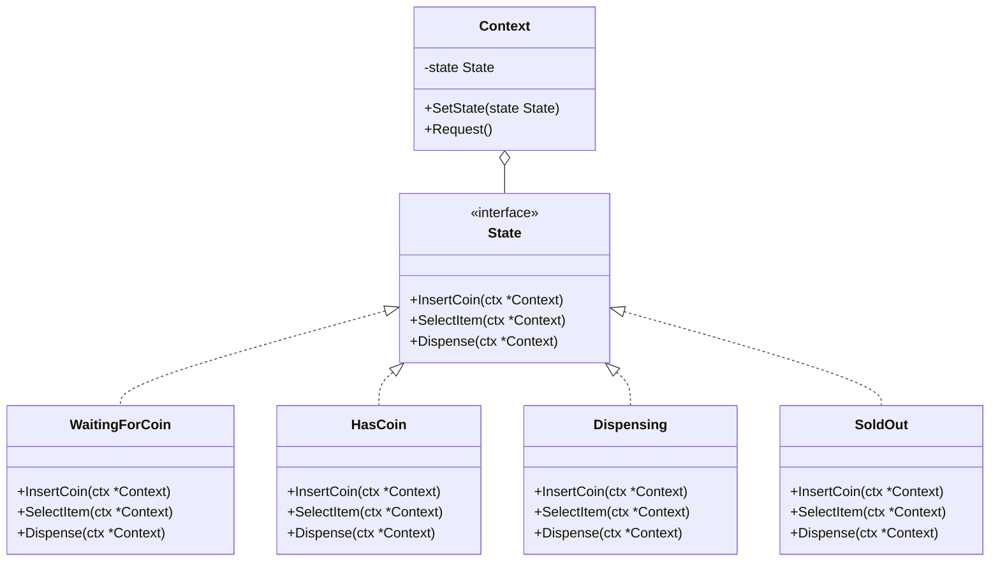

# State / 狀態模式

## Intent / 意圖
> 允許物件在其內部狀態改變時改變其行為，物件看起來像是改變了其類別。

## Problem / 問題情境
在一個自動販賣機系統中，販賣機有多種狀態：等待投幣、已投幣、出貨中、售罄。每個狀態下同一操作（如投幣、按下選擇鈕、取回零錢）有完全不同的行為。如果用大量 if-else 或 switch 判斷當前狀態，程式碼會變得龐大、難以維護，且新增狀態時需要修改每個條件分支。

## Solution / 解決方案
將每個狀態封裝為獨立的物件（或 enum variant），每個狀態物件實作相同的介面但提供不同的行為。Context 持有當前狀態物件，將操作委派給當前狀態。狀態轉換由狀態物件自行決定。

## Structure / 結構



## Participants / 參與者
- **Context**：持有當前狀態的參照，將客戶端的請求委派給當前狀態。
- **State**：定義所有狀態共用的行為介面。
- **ConcreteState**：實作特定狀態下的行為，並負責狀態轉換。

## Go 實作

```go
package main

import "fmt"

// State 介面：定義販賣機在各狀態下的行為
type State interface {
	InsertCoin(v *VendingMachine)
	SelectItem(v *VendingMachine)
	Dispense(v *VendingMachine)
	String() string
}

// VendingMachine 是 Context
type VendingMachine struct {
	state State
	stock int
}

func NewVendingMachine(stock int) *VendingMachine {
	vm := &VendingMachine{stock: stock}
	if stock > 0 {
		vm.state = &WaitingForCoin{}
	} else {
		vm.state = &SoldOut{}
	}
	return vm
}

func (v *VendingMachine) SetState(s State) {
	fmt.Printf("  狀態轉換: %s -> %s\n", v.state, s)
	v.state = s
}

func (v *VendingMachine) InsertCoin() {
	v.state.InsertCoin(v)
}

func (v *VendingMachine) SelectItem() {
	v.state.SelectItem(v)
}

func (v *VendingMachine) Dispense() {
	v.state.Dispense(v)
}

// --- 具體狀態 ---

// WaitingForCoin 等待投幣
type WaitingForCoin struct{}

func (s *WaitingForCoin) InsertCoin(v *VendingMachine) {
	fmt.Println("已投幣，請選擇商品")
	v.SetState(&HasCoin{})
}

func (s *WaitingForCoin) SelectItem(v *VendingMachine) {
	fmt.Println("請先投幣")
}

func (s *WaitingForCoin) Dispense(v *VendingMachine) {
	fmt.Println("請先投幣並選擇商品")
}

func (s *WaitingForCoin) String() string { return "WaitingForCoin" }

// HasCoin 已投幣
type HasCoin struct{}

func (s *HasCoin) InsertCoin(v *VendingMachine) {
	fmt.Println("已經投過幣了")
}

func (s *HasCoin) SelectItem(v *VendingMachine) {
	fmt.Println("已選擇商品，出貨中...")
	v.SetState(&Dispensing{})
	v.Dispense()
}

func (s *HasCoin) Dispense(v *VendingMachine) {
	fmt.Println("請先選擇商品")
}

func (s *HasCoin) String() string { return "HasCoin" }

// Dispensing 出貨中
type Dispensing struct{}

func (s *Dispensing) InsertCoin(v *VendingMachine) {
	fmt.Println("出貨中，請稍候")
}

func (s *Dispensing) SelectItem(v *VendingMachine) {
	fmt.Println("出貨中，請稍候")
}

func (s *Dispensing) Dispense(v *VendingMachine) {
	v.stock--
	fmt.Printf("商品已取出！剩餘庫存: %d\n", v.stock)
	if v.stock > 0 {
		v.SetState(&WaitingForCoin{})
	} else {
		fmt.Println("商品已售罄")
		v.SetState(&SoldOut{})
	}
}

func (s *Dispensing) String() string { return "Dispensing" }

// SoldOut 售罄
type SoldOut struct{}

func (s *SoldOut) InsertCoin(v *VendingMachine) {
	fmt.Println("已售罄，退回硬幣")
}

func (s *SoldOut) SelectItem(v *VendingMachine) {
	fmt.Println("已售罄")
}

func (s *SoldOut) Dispense(v *VendingMachine) {
	fmt.Println("已售罄，無法出貨")
}

func (s *SoldOut) String() string { return "SoldOut" }

func main() {
	vm := NewVendingMachine(2)

	fmt.Println("=== 第一次購買 ===")
	vm.InsertCoin()
	vm.SelectItem()

	fmt.Println("\n=== 第二次購買 ===")
	vm.InsertCoin()
	vm.SelectItem()

	fmt.Println("\n=== 售罄後嘗試 ===")
	vm.InsertCoin()
}

// Output:
// === 第一次購買 ===
// 已投幣，請選擇商品
//   狀態轉換: WaitingForCoin -> HasCoin
// 已選擇商品，出貨中...
//   狀態轉換: HasCoin -> Dispensing
// 商品已取出！剩餘庫存: 1
//   狀態轉換: Dispensing -> WaitingForCoin
//
// === 第二次購買 ===
// 已投幣，請選擇商品
//   狀態轉換: WaitingForCoin -> HasCoin
// 已選擇商品，出貨中...
//   狀態轉換: HasCoin -> Dispensing
// 商品已取出！剩餘庫存: 0
// 商品已售罄
//   狀態轉換: Dispensing -> SoldOut
//
// === 售罄後嘗試 ===
// 已售罄，退回硬幣
```

## Rust 實作

```rust
// State 模式在 Rust 中用 enum 實作比 trait object 更地道

#[derive(Debug, Clone)]
enum VendingState {
    WaitingForCoin,
    HasCoin,
    Dispensing,
    SoldOut,
}

struct VendingMachine {
    state: VendingState,
    stock: u32,
}

impl VendingMachine {
    fn new(stock: u32) -> Self {
        let state = if stock > 0 {
            VendingState::WaitingForCoin
        } else {
            VendingState::SoldOut
        };
        Self { state, stock }
    }

    fn set_state(&mut self, new_state: VendingState) {
        println!("  狀態轉換: {:?} -> {:?}", self.state, new_state);
        self.state = new_state;
    }

    fn insert_coin(&mut self) {
        match self.state {
            VendingState::WaitingForCoin => {
                println!("已投幣，請選擇商品");
                self.set_state(VendingState::HasCoin);
            }
            VendingState::HasCoin => {
                println!("已經投過幣了");
            }
            VendingState::Dispensing => {
                println!("出貨中，請稍候");
            }
            VendingState::SoldOut => {
                println!("已售罄，退回硬幣");
            }
        }
    }

    fn select_item(&mut self) {
        match self.state {
            VendingState::WaitingForCoin => {
                println!("請先投幣");
            }
            VendingState::HasCoin => {
                println!("已選擇商品，出貨中...");
                self.set_state(VendingState::Dispensing);
                self.dispense();
            }
            VendingState::Dispensing => {
                println!("出貨中，請稍候");
            }
            VendingState::SoldOut => {
                println!("已售罄");
            }
        }
    }

    fn dispense(&mut self) {
        match self.state {
            VendingState::Dispensing => {
                self.stock -= 1;
                println!("商品已取出！剩餘庫存: {}", self.stock);
                if self.stock > 0 {
                    self.set_state(VendingState::WaitingForCoin);
                } else {
                    println!("商品已售罄");
                    self.set_state(VendingState::SoldOut);
                }
            }
            VendingState::WaitingForCoin => {
                println!("請先投幣並選擇商品");
            }
            VendingState::HasCoin => {
                println!("請先選擇商品");
            }
            VendingState::SoldOut => {
                println!("已售罄，無法出貨");
            }
        }
    }
}

fn main() {
    let mut vm = VendingMachine::new(2);

    println!("=== 第一次購買 ===");
    vm.insert_coin();
    vm.select_item();

    println!("\n=== 第二次購買 ===");
    vm.insert_coin();
    vm.select_item();

    println!("\n=== 售罄後嘗試 ===");
    vm.insert_coin();
}

// Output:
// === 第一次購買 ===
// 已投幣，請選擇商品
//   狀態轉換: WaitingForCoin -> HasCoin
// 已選擇商品，出貨中...
//   狀態轉換: HasCoin -> Dispensing
// 商品已取出！剩餘庫存: 1
//   狀態轉換: Dispensing -> WaitingForCoin
//
// === 第二次購買 ===
// 已投幣，請選擇商品
//   狀態轉換: WaitingForCoin -> HasCoin
// 已選擇商品，出貨中...
//   狀態轉換: HasCoin -> Dispensing
// 商品已取出！剩餘庫存: 0
// 商品已售罄
//   狀態轉換: Dispensing -> SoldOut
//
// === 售罄後嘗試 ===
// 已售罄，退回硬幣
```

## Go vs Rust 對照表

| 面向 | Go | Rust |
|------|----|----|
| 狀態表示 | interface + 多個 struct 實作 | enum variants + match 表達式 |
| 狀態轉換 | 建立新的 state struct 指派給 context | 更改 enum variant，zero-cost 抽象 |
| 窮舉檢查 | 無法在編譯期確保所有狀態都被處理 | `match` 強制窮舉，遺漏會編譯失敗 |
| 新增狀態 | 新增 struct 實作 interface，不需改既有程式碼 | 新增 enum variant，所有 match 都要補上（編譯器提醒） |

## When to Use / 適用場景
- 物件的行為隨其狀態變化，且狀態數量有限但行為差異大。
- 現有程式碼中有大量的條件判斷來根據狀態決定行為。
- 需要明確的狀態機建模（如通訊協定、工作流引擎、遊戲角色狀態）。

## When NOT to Use / 不適用場景
- 狀態很少（2-3 個）且行為差異不大，簡單的 if-else 就夠了。
- 狀態轉換規則複雜到需要外部狀態機框架，此時應考慮 table-driven 狀態機。

## Real-World Examples / 真實世界案例
- **TCP 連線狀態機**：TCP 連線有 LISTEN、SYN_SENT、ESTABLISHED、FIN_WAIT 等多種狀態，每個狀態下收到封包的處理方式不同。Go 的 `net` 套件和 Rust 的 `tokio` 內部都使用狀態模式管理連線狀態。
- **Rust `std::future::Future`**：async/await 編譯後會生成狀態機 enum，每個 await point 是一個狀態。

## Related Patterns / 相關模式
- [Strategy](20_strategy.md)：Strategy 讓客戶端選擇演算法，State 讓物件根據內部狀態自動切換行為。兩者的結構相似但意圖不同。
- [Singleton](../creational/05_singleton.md)：State 物件通常可以做成 Singleton，因為狀態本身不帶實例資料。

## Pitfalls / 常見陷阱
- **狀態爆炸**：如果狀態和事件的組合太多，每個狀態都要處理所有事件，程式碼會膨脹。可考慮層級式狀態機（Hierarchical State Machine）。
- **狀態轉換散落各處**：狀態轉換邏輯分散在各個 ConcreteState 中，難以看出完整的狀態轉換圖。應維護獨立的狀態轉換圖文件。
- **Rust enum 的 Open/Closed 取捨**：enum 是封閉的（新增 variant 會破壞所有 match），interface/trait 是開放的。根據是否經常新增狀態來選擇。

## References / 參考資料
- *Design Patterns: Elements of Reusable Object-Oriented Software* — GoF
- [Refactoring Guru — State](https://refactoring.guru/design-patterns/state)
- [Rust Design Patterns — State](https://rust-unofficial.github.io/patterns/patterns/behavioural/newtype.html)
