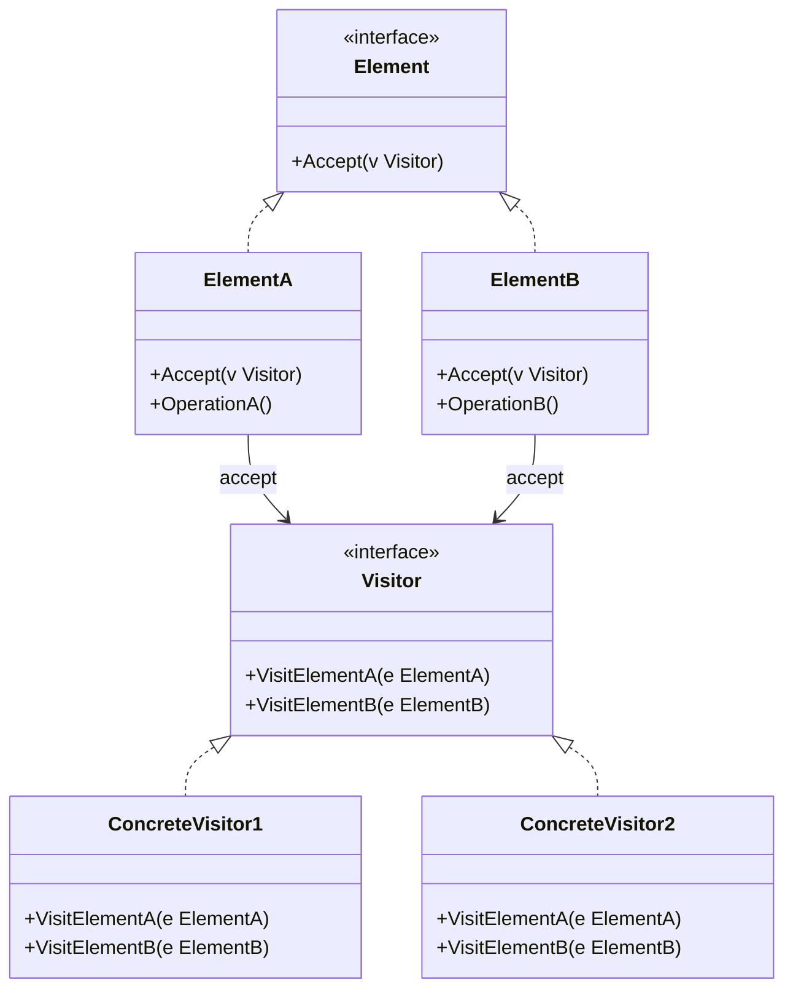

# Visitor / 訪問者模式

## Intent / 意圖
> 在不修改既有類別結構的前提下，定義作用於這些類別的新操作。將資料結構與操作分離。

## Problem / 問題情境
在一個文件處理系統中，文件由不同類型的節點組成（段落、圖片、表格）。需要對這些節點執行多種操作：匯出 HTML、計算字數、生成摘要。如果將每個操作都加到節點類別中，每新增一種操作就要修改所有節點類別，違反開閉原則。

## Solution / 解決方案
定義一個 Visitor 介面，為每種節點類型提供一個 Visit 方法。每個節點類別實作 Accept 方法，接收 Visitor 並呼叫對應的 Visit 方法（double dispatch）。新增操作只需建立新的 Visitor 實作，不需修改節點類別。

## Structure / 結構



## Participants / 參與者
- **Visitor**：為每種 Element 類型宣告一個 Visit 方法。
- **ConcreteVisitor**：實作對每種 Element 的具體操作。
- **Element**：宣告 Accept 方法，接收 Visitor。
- **ConcreteElement**：實作 Accept，呼叫 Visitor 的對應 Visit 方法。

## Go 實作

```go
package main

import (
	"fmt"
	"strings"
)

// DocumentNode 是 Element 介面
type DocumentNode interface {
	Accept(v Visitor)
}

// Visitor 介面：為每種節點類型定義 visit 方法（double dispatch）
type Visitor interface {
	VisitParagraph(p *Paragraph)
	VisitImage(img *Image)
	VisitTable(t *Table)
}

// --- 具體節點 ---

type Paragraph struct {
	Text string
}

func (p *Paragraph) Accept(v Visitor) {
	v.VisitParagraph(p)
}

type Image struct {
	URL string
	Alt string
}

func (img *Image) Accept(v Visitor) {
	v.VisitImage(img)
}

type Table struct {
	Headers []string
	Rows    [][]string
}

func (t *Table) Accept(v Visitor) {
	v.VisitTable(t)
}

// --- 具體 Visitor ---

// HTMLExporter 將文件匯出為 HTML
type HTMLExporter struct {
	result strings.Builder
}

func (e *HTMLExporter) VisitParagraph(p *Paragraph) {
	e.result.WriteString(fmt.Sprintf("<p>%s</p>\n", p.Text))
}

func (e *HTMLExporter) VisitImage(img *Image) {
	e.result.WriteString(fmt.Sprintf(``+"\n", img.URL, img.Alt))
}

func (e *HTMLExporter) VisitTable(t *Table) {
	e.result.WriteString("<table>\n<tr>")
	for _, h := range t.Headers {
		e.result.WriteString(fmt.Sprintf("<th>%s</th>", h))
	}
	e.result.WriteString("</tr>\n")
	for _, row := range t.Rows {
		e.result.WriteString("<tr>")
		for _, cell := range row {
			e.result.WriteString(fmt.Sprintf("<td>%s</td>", cell))
		}
		e.result.WriteString("</tr>\n")
	}
	e.result.WriteString("</table>\n")
}

func (e *HTMLExporter) Result() string {
	return e.result.String()
}

// WordCounter 計算文件總字數
type WordCounter struct {
	count int
}

func (w *WordCounter) VisitParagraph(p *Paragraph) {
	w.count += len(strings.Fields(p.Text))
}

func (w *WordCounter) VisitImage(img *Image) {
	w.count += len(strings.Fields(img.Alt))
}

func (w *WordCounter) VisitTable(t *Table) {
	for _, row := range t.Rows {
		for _, cell := range row {
			w.count += len(strings.Fields(cell))
		}
	}
}

func (w *WordCounter) Count() int {
	return w.count
}

func main() {
	// 建構文件
	document := []DocumentNode{
		&Paragraph{Text: "Welcome to the design patterns guide"},
		&Image{URL: "diagram.png", Alt: "Pattern structure diagram"},
		&Table{
			Headers: []string{"Pattern", "Type"},
			Rows: [][]string{
				{"Visitor", "Behavioral"},
				{"Observer", "Behavioral"},
			},
		},
		&Paragraph{Text: "Each pattern solves a specific problem"},
	}

	// 使用 HTML Exporter visitor
	htmlExporter := &HTMLExporter{}
	for _, node := range document {
		node.Accept(htmlExporter)
	}
	fmt.Println("=== HTML Export ===")
	fmt.Print(htmlExporter.Result())

	// 使用 Word Counter visitor
	counter := &WordCounter{}
	for _, node := range document {
		node.Accept(counter)
	}
	fmt.Printf("\n=== Word Count ===\n")
	fmt.Printf("Total words: %d\n", counter.Count())
}

// Output:
// === HTML Export ===
// <p>Welcome to the design patterns guide</p>
// 
// <table>
// <tr><th>Pattern</th><th>Type</th></tr>
// <tr><td>Visitor</td><td>Behavioral</td></tr>
// <tr><td>Observer</td><td>Behavioral</td></tr>
// </table>
// <p>Each pattern solves a specific problem</p>
//
// === Word Count ===
// Total words: 17
```

## Rust 實作

```rust
// Visitor 模式在 Rust 中用 enum match 更地道

#[derive(Debug)]
enum DocumentNode {
    Paragraph { text: String },
    Image { url: String, alt: String },
    Table { headers: Vec<String>, rows: Vec<Vec<String>> },
}

// 使用 enum match 取代 double dispatch
// 新增操作只需新增函式，不需修改 enum

fn export_html(nodes: &[DocumentNode]) -> String {
    let mut result = String::new();
    for node in nodes {
        match node {
            DocumentNode::Paragraph { text } => {
                result.push_str(&format!("<p>{}</p>\n", text));
            }
            DocumentNode::Image { url, alt } => {
                result.push_str(&format!("\n", url, alt));
            }
            DocumentNode::Table { headers, rows } => {
                result.push_str("<table>\n<tr>");
                for h in headers {
                    result.push_str(&format!("<th>{}</th>", h));
                }
                result.push_str("</tr>\n");
                for row in rows {
                    result.push_str("<tr>");
                    for cell in row {
                        result.push_str(&format!("<td>{}</td>", cell));
                    }
                    result.push_str("</tr>\n");
                }
                result.push_str("</table>\n");
            }
        }
    }
    result
}

fn count_words(nodes: &[DocumentNode]) -> usize {
    let mut count = 0;
    for node in nodes {
        match node {
            DocumentNode::Paragraph { text } => {
                count += text.split_whitespace().count();
            }
            DocumentNode::Image { alt, .. } => {
                count += alt.split_whitespace().count();
            }
            DocumentNode::Table { rows, .. } => {
                for row in rows {
                    for cell in row {
                        count += cell.split_whitespace().count();
                    }
                }
            }
        }
    }
    count
}

// 如果確實需要 trait-based double dispatch，也可以這樣寫：
trait Visitor {
    fn visit_paragraph(&mut self, text: &str);
    fn visit_image(&mut self, url: &str, alt: &str);
    fn visit_table(&mut self, headers: &[String], rows: &[Vec<String>]);
}

struct MarkdownExporter {
    result: String,
}

impl MarkdownExporter {
    fn new() -> Self {
        Self { result: String::new() }
    }
}

impl Visitor for MarkdownExporter {
    fn visit_paragraph(&mut self, text: &str) {
        self.result.push_str(&format!("{}\n\n", text));
    }

    fn visit_image(&mut self, url: &str, alt: &str) {
        self.result.push_str(&format!("\n\n", alt, url));
    }

    fn visit_table(&mut self, headers: &[String], rows: &[Vec<String>]) {
        self.result.push_str(&format!("| {} |\n", headers.join(" | ")));
        self.result.push_str(&format!("|{}|\n", " --- |".repeat(headers.len())));
        for row in rows {
            self.result.push_str(&format!("| {} |\n", row.join(" | ")));
        }
        self.result.push('\n');
    }
}

fn accept(node: &DocumentNode, visitor: &mut dyn Visitor) {
    match node {
        DocumentNode::Paragraph { text } => visitor.visit_paragraph(text),
        DocumentNode::Image { url, alt } => visitor.visit_image(url, alt),
        DocumentNode::Table { headers, rows } => visitor.visit_table(headers, rows),
    }
}

fn main() {
    let document = vec![
        DocumentNode::Paragraph {
            text: "Welcome to the design patterns guide".to_string(),
        },
        DocumentNode::Image {
            url: "diagram.png".to_string(),
            alt: "Pattern structure diagram".to_string(),
        },
        DocumentNode::Table {
            headers: vec!["Pattern".to_string(), "Type".to_string()],
            rows: vec![
                vec!["Visitor".to_string(), "Behavioral".to_string()],
                vec!["Observer".to_string(), "Behavioral".to_string()],
            ],
        },
        DocumentNode::Paragraph {
            text: "Each pattern solves a specific problem".to_string(),
        },
    ];

    // enum match 方式
    println!("=== HTML Export (enum match) ===");
    print!("{}", export_html(&document));

    println!("\n=== Word Count (enum match) ===");
    println!("Total words: {}", count_words(&document));

    // trait-based visitor 方式
    println!("\n=== Markdown Export (trait visitor) ===");
    let mut md_exporter = MarkdownExporter::new();
    for node in &document {
        accept(node, &mut md_exporter);
    }
    print!("{}", md_exporter.result);
}

// Output:
// === HTML Export (enum match) ===
// <p>Welcome to the design patterns guide</p>
// 
// <table>
// <tr><th>Pattern</th><th>Type</th></tr>
// <tr><td>Visitor</td><td>Behavioral</td></tr>
// <tr><td>Observer</td><td>Behavioral</td></tr>
// </table>
// <p>Each pattern solves a specific problem</p>
//
// === Word Count (enum match) ===
// Total words: 17
//
// === Markdown Export (trait visitor) ===
// Welcome to the design patterns guide
//
// 
//
// | Pattern | Type |
// | --- | --- |
// | Visitor | Behavioral |
// | Observer | Behavioral |
```

## Go vs Rust 對照表

| 面向 | Go | Rust |
|------|----|----|
| Double dispatch | interface 方法呼叫，Accept 委派給 Visitor | enum match 直接分派，或 trait-based double dispatch |
| 新增操作 | 新增 Visitor struct 實作 interface | 新增函式對 enum match，或新增 trait 實作 |
| 新增節點類型 | 新增 struct 並在所有 Visitor 中補方法 | 新增 enum variant，所有 match 都要補（編譯器檢查） |
| 慣用做法 | interface double dispatch | enum match（更地道），trait visitor 也可 |

## When to Use / 適用場景
- 資料結構穩定但經常需要新增操作。
- 需要對複雜物件結構執行多種不相關的操作，又不想污染這些類別。
- 需要在遍歷異質集合時對不同型別執行不同操作。

## When NOT to Use / 不適用場景
- 元素類型經常變動，每次新增類型都要修改所有 Visitor。
- 元素類別的內部狀態高度封裝，Visitor 無法存取足夠的資訊來執行操作。

## Real-World Examples / 真實世界案例
- **Go `ast.Walk()`**：Go 標準庫的 `go/ast` 套件提供 `ast.Walk()` 函式搭配 `ast.Visitor` 介面，用於遍歷和操作 Go 原始碼的 AST。
- **Rust `syn` crate**：`syn::visit` 和 `syn::visit_mut` 模組提供了完整的 Visitor trait，用於遍歷 Rust 的語法樹。

## Related Patterns / 相關模式
- [Iterator](15_iterator.md)：Iterator 負責遍歷順序，Visitor 負責對每個元素執行操作。兩者常搭配使用。
- [Composite](../structural/08_composite.md)：Visitor 常用於遍歷 Composite 結構的所有節點。

## Pitfalls / 常見陷阱
- **Breaking changes**：新增 Element 類型時，必須修改所有 Visitor 實作。在 Rust 中，enum 的封閉性讓編譯器能捕獲遺漏；在 Go 中可能只在執行時期發現。
- **封裝性破壞**：Visitor 需要存取 Element 的內部資料才能執行操作，可能導致 Element 不得不暴露本不應公開的欄位。
- **複雜度高**：Double dispatch 機制不直觀，對不熟悉此模式的開發者來說難以理解和維護。

## References / 參考資料
- *Design Patterns: Elements of Reusable Object-Oriented Software* — GoF
- [Refactoring Guru — Visitor](https://refactoring.guru/design-patterns/visitor)
- [Go `ast` package](https://pkg.go.dev/go/ast)
