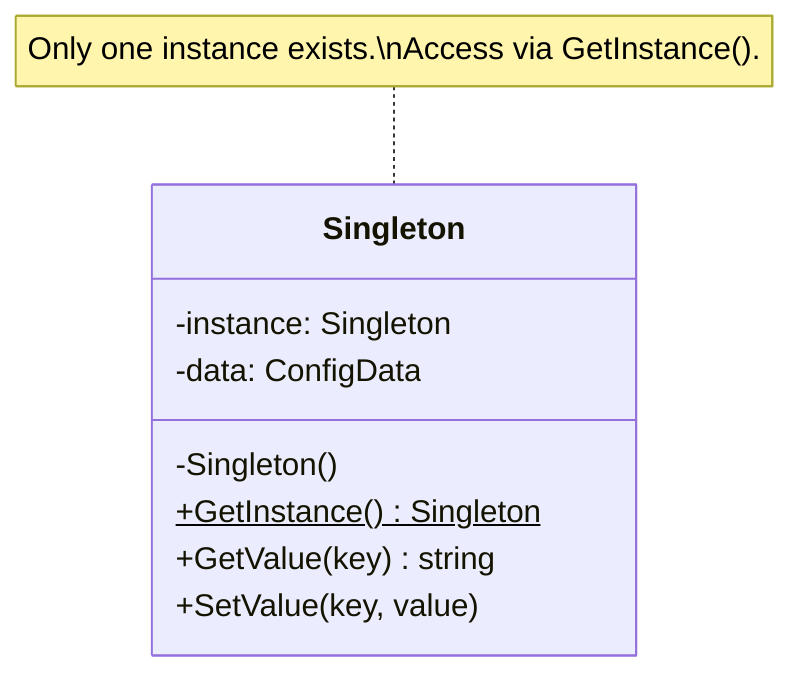

# Singleton / 單例模式

## Intent / 意圖
> 確保一個類別在整個程式生命週期中只有一個實例，並提供全域存取點。

## Problem / 問題情境
你的應用程式需要一個全域的設定管理器（Configuration Manager），所有模組都讀取相同的設定資料。如果每個模組各自建立設定實例，不僅浪費記憶體，更會導致設定修改不一致 -- 模組 A 改了設定，模組 B 卻還在用舊值。你需要一個機制保證整個程式只有一份設定實例，且任何地方存取到的都是同一份。

## Solution / 解決方案
將建構函式設為私有（或不匯出），提供一個靜態方法 / 全域函式來取得唯一實例。首次呼叫時建立實例，後續呼叫直接回傳已建立的實例。在並行環境下，需要搭配同步原語確保執行緒安全的延遲初始化。Go 使用 `sync.Once` 保證只初始化一次；Rust 使用 `std::sync::OnceLock` 或 `std::sync::LazyLock` 達成相同效果。

## Structure / 結構



## Participants / 參與者

| 角色 | 職責 |
|------|------|
| Singleton | 持有唯一實例的參照，提供全域存取方法，封裝私有建構邏輯 |
| Client | 透過 `GetInstance()` 取得唯一實例並操作 |

## Go 實作

```go
package main

import (
	"fmt"
	"sync"
)

// Config is the singleton that holds application configuration.
type Config struct {
	values map[string]string
}

var (
	instance *Config
	once     sync.Once
)

// GetConfig returns the singleton Config instance.
// sync.Once guarantees thread-safe lazy initialization.
func GetConfig() *Config {
	once.Do(func() {
		instance = &Config{
			values: make(map[string]string),
		}
		instance.values["app_name"] = "MyApp"
		instance.values["version"] = "1.0.0"
	})
	return instance
}

func (c *Config) Get(key string) string {
	return c.values[key]
}

func (c *Config) Set(key, value string) {
	c.values[key] = value
}

func main() {
	cfg1 := GetConfig()
	cfg2 := GetConfig()

	fmt.Println(cfg1.Get("app_name")) // MyApp
	cfg1.Set("app_name", "UpdatedApp")
	fmt.Println(cfg2.Get("app_name")) // UpdatedApp
	fmt.Println(cfg1 == cfg2)         // true
}

// Output:
// MyApp
// UpdatedApp
// true
```

## Rust 實作

```rust
use std::collections::HashMap;
use std::sync::{LazyLock, Mutex};

static CONFIG: LazyLock<Mutex<HashMap<String, String>>> = LazyLock::new(|| {
    let mut map = HashMap::new();
    map.insert("app_name".to_string(), "MyApp".to_string());
    map.insert("version".to_string(), "1.0.0".to_string());
    Mutex::new(map)
});

fn get_config() -> &'static Mutex<HashMap<String, String>> {
    &CONFIG
}

fn main() {
    // First access — triggers LazyLock initialization
    {
        let config = get_config().lock().unwrap();
        println!("{}", config.get("app_name").unwrap()); // MyApp
    }

    // Mutate through the same singleton
    {
        let mut config = get_config().lock().unwrap();
        config.insert("app_name".to_string(), "UpdatedApp".to_string());
    }

    // Verify mutation is visible everywhere
    {
        let config = get_config().lock().unwrap();
        println!("{}", config.get("app_name").unwrap()); // UpdatedApp
    }

    // Same pointer — it is indeed the same instance
    let ptr1 = get_config() as *const _;
    let ptr2 = get_config() as *const _;
    println!("{}", ptr1 == ptr2); // true
}

// Output:
// MyApp
// UpdatedApp
// true
```

## Go vs Rust 對照表

| 面向 | Go | Rust |
|------|----|------|
| 延遲初始化原語 | `sync.Once` + 全域變數 | `LazyLock` (or `OnceLock`) 靜態變數 |
| 執行緒安全 | `sync.Once` 內建保證；但後續讀寫需自行加 `sync.RWMutex` | `LazyLock` 保證初始化安全；`Mutex` 保證讀寫安全，編譯期強制 |
| 可變性 | 指標直接修改，無編譯期保護 | 必須透過 `Mutex` / `RwLock` 取得可變借用，編譯期阻擋 data race |
| 慣用寫法 | 匯出 `GetXxx()` 函式，不匯出 struct 建構 | `static` + `LazyLock`，模組私有建構 |
| 測試友善度 | 需手動 reset 全域狀態或注入 interface | 可透過 trait object 抽象，但靜態生命週期較難 mock |

## When to Use / 適用場景

- 整個應用程式只需要一份共享資源（設定、日誌、連線池、快取）。
- 需要控制資源初始化時機（延遲初始化），避免啟動時耗費不必要成本。
- 多個模組需要協調存取同一份狀態，且不想透過層層傳參。

## When NOT to Use / 不適用場景

- 單元測試需要隔離狀態時 -- 全域 Singleton 會讓測試互相污染，改用依賴注入更佳。
- 需要多個獨立實例的場景（如多租戶環境，每個租戶有自己的設定）。
- 物件本身無狀態或狀態極輕量，建立成本低 -- 直接建立新實例比維護全域鎖更簡單。

## Real-World Examples / 真實世界案例

- **Go `database/sql`**：`sql.Open()` 回傳的 `*sql.DB` 本質上就是連線池 Singleton -- 官方建議整個應用程式只建立一個 `*sql.DB`，內部自行管理連線池。
- **Rust `tracing` / `log`**：日誌框架透過全域 subscriber / logger 實現 Singleton，`tracing::subscriber::set_global_default()` 只能呼叫一次。
- **Go `slog`（標準庫）**：`slog.SetDefault()` 設定全域 logger，後續 `slog.Info()` 等函式都使用同一個 handler。

## Related Patterns / 相關模式

- [Factory Method](02_factory_method.md) -- Singleton 的建構邏輯可委託給 Factory Method。
- [Builder](04_builder.md) -- 複雜的 Singleton 初始化可搭配 Builder 模式組裝。

## Pitfalls / 常見陷阱

- **Go：忘記保護後續讀寫**。`sync.Once` 只保證初始化執行一次，但初始化後的欄位讀寫仍需 `sync.RWMutex`，否則會產生 data race（`go test -race` 可偵測）。
- **Rust：Mutex 中毒（poisoning）**。若持有 `Mutex` 鎖的執行緒 panic，鎖會進入 poisoned 狀態，後續 `lock()` 回傳 `Err`。需決定是用 `unwrap()` 直接 panic 還是 `lock().unwrap_or_else(|e| e.into_inner())` 恢復。
- **測試困難**。全域可變狀態讓平行測試互相干擾。Go 中可透過 interface 抽象 + 依賴注入替代直接使用 Singleton；Rust 中可透過 trait object 或泛型參數達成相同目的。
- **隱藏依賴**。程式碼直接呼叫 `GetConfig()` 會隱藏對設定的依賴關係，讓模組邊界模糊。建議在函式簽章中明確接收依賴，Singleton 僅在組裝層（main / DI container）使用。

## References / 參考資料

- Gamma, E., Helm, R., Johnson, R., Vlissides, J. *Design Patterns: Elements of Reusable Object-Oriented Software*, 1994. Chapter 3: Creational Patterns — Singleton.
- Go 標準庫 `sync.Once` 文件：https://pkg.go.dev/sync#Once
- Rust 標準庫 `LazyLock` 文件：https://doc.rust-lang.org/std/sync/struct.LazyLock.html
- Rust 標準庫 `OnceLock` 文件：https://doc.rust-lang.org/std/sync/struct.OnceLock.html
