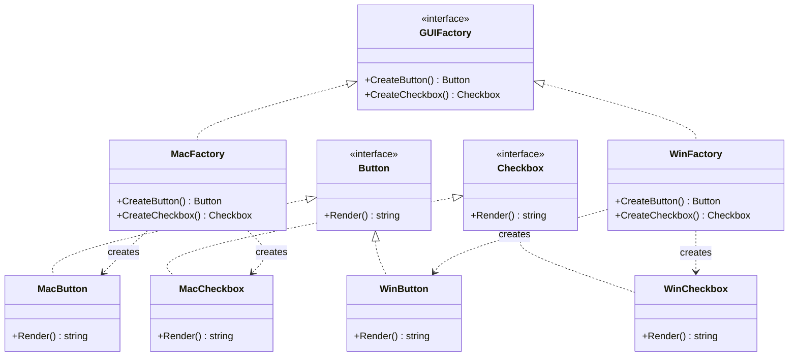

# Abstract Factory / 抽象工廠模式

## Intent / 意圖
> 提供一個介面來建立一系列相關或互相依賴的物件，而不需指定它們的具體類別。

## Problem / 問題情境
你正在開發一個跨平台 UI 框架，需要同時支援 macOS 和 Windows 風格的元件。每種平台有自己的 Button 和 Checkbox 實作，且同一平台的元件需要視覺風格一致。如果在每個使用處用 `if platform == "macos"` 來分支建立，程式碼會充斥平台判斷邏輯，新增 Linux 平台時要修改所有分支。你需要一個機制：一次決定平台 -> 自動取得整組風格一致的元件。

## Solution / 解決方案
定義 Abstract Factory 介面，包含建立每種產品的 Factory Method（`CreateButton()`、`CreateCheckbox()`）。每個平台提供一個 Concrete Factory 實作，負責建立該平台整組元件。呼叫端只依賴 Abstract Factory 和 Product 介面，運行時注入正確的 Concrete Factory 即可切換平台。Go 使用 interface 組合多個產品建立方法；Rust 使用 trait 組合。

## Structure / 結構



## Participants / 參與者

| 角色 | 職責 |
|------|------|
| AbstractFactory (GUIFactory) | 宣告建立一系列產品的介面 |
| ConcreteFactory (MacFactory, WinFactory) | 實作建立特定平台整組產品的邏輯 |
| AbstractProduct (Button, Checkbox) | 定義產品的抽象介面 |
| ConcreteProduct (MacButton, WinButton, MacCheckbox, WinCheckbox) | 實作各平台的具體產品 |
| Client | 只透過 AbstractFactory 和 AbstractProduct 操作，不直接依賴具體類別 |

## Go 實作

```go
package main

import "fmt"

// --- Abstract Products ---

type Button interface {
	Render() string
}

type Checkbox interface {
	Render() string
}

// --- Concrete Products: macOS ---

type MacButton struct{}

func (b *MacButton) Render() string { return "[macOS Button]" }

type MacCheckbox struct{}

func (c *MacCheckbox) Render() string { return "[macOS Checkbox]" }

// --- Concrete Products: Windows ---

type WinButton struct{}

func (b *WinButton) Render() string { return "[Windows Button]" }

type WinCheckbox struct{}

func (c *WinCheckbox) Render() string { return "[Windows Checkbox]" }

// --- Abstract Factory ---

type GUIFactory interface {
	CreateButton() Button
	CreateCheckbox() Checkbox
}

// --- Concrete Factories ---

type MacFactory struct{}

func (f *MacFactory) CreateButton() Button     { return &MacButton{} }
func (f *MacFactory) CreateCheckbox() Checkbox { return &MacCheckbox{} }

type WinFactory struct{}

func (f *WinFactory) CreateButton() Button     { return &WinButton{} }
func (f *WinFactory) CreateCheckbox() Checkbox { return &WinCheckbox{} }

// --- Factory selector ---

func NewGUIFactory(platform string) GUIFactory {
	switch platform {
	case "macos":
		return &MacFactory{}
	case "windows":
		return &WinFactory{}
	default:
		panic(fmt.Sprintf("unsupported platform: %s", platform))
	}
}

// --- Client code ---

func renderUI(factory GUIFactory) {
	button := factory.CreateButton()
	checkbox := factory.CreateCheckbox()
	fmt.Println(button.Render())
	fmt.Println(checkbox.Render())
}

func main() {
	fmt.Println("=== macOS ===")
	renderUI(NewGUIFactory("macos"))

	fmt.Println("=== Windows ===")
	renderUI(NewGUIFactory("windows"))
}

// Output:
// === macOS ===
// [macOS Button]
// [macOS Checkbox]
// === Windows ===
// [Windows Button]
// [Windows Checkbox]
```

## Rust 實作

```rust
// --- Abstract Products ---

trait Button {
    fn render(&self) -> String;
}

trait Checkbox {
    fn render(&self) -> String;
}

// --- Concrete Products: macOS ---

struct MacButton;
impl Button for MacButton {
    fn render(&self) -> String {
        "[macOS Button]".to_string()
    }
}

struct MacCheckbox;
impl Checkbox for MacCheckbox {
    fn render(&self) -> String {
        "[macOS Checkbox]".to_string()
    }
}

// --- Concrete Products: Windows ---

struct WinButton;
impl Button for WinButton {
    fn render(&self) -> String {
        "[Windows Button]".to_string()
    }
}

struct WinCheckbox;
impl Checkbox for WinCheckbox {
    fn render(&self) -> String {
        "[Windows Checkbox]".to_string()
    }
}

// --- Abstract Factory ---

trait GUIFactory {
    fn create_button(&self) -> Box<dyn Button>;
    fn create_checkbox(&self) -> Box<dyn Checkbox>;
}

// --- Concrete Factories ---

struct MacFactory;
impl GUIFactory for MacFactory {
    fn create_button(&self) -> Box<dyn Button> {
        Box::new(MacButton)
    }
    fn create_checkbox(&self) -> Box<dyn Checkbox> {
        Box::new(MacCheckbox)
    }
}

struct WinFactory;
impl GUIFactory for WinFactory {
    fn create_button(&self) -> Box<dyn Button> {
        Box::new(WinButton)
    }
    fn create_checkbox(&self) -> Box<dyn Checkbox> {
        Box::new(WinCheckbox)
    }
}

// --- Factory selector ---

fn new_gui_factory(platform: &str) -> Box<dyn GUIFactory> {
    match platform {
        "macos" => Box::new(MacFactory),
        "windows" => Box::new(WinFactory),
        other => panic!("unsupported platform: {other}"),
    }
}

// --- Client code ---

fn render_ui(factory: &dyn GUIFactory) {
    let button = factory.create_button();
    let checkbox = factory.create_checkbox();
    println!("{}", button.render());
    println!("{}", checkbox.render());
}

fn main() {
    println!("=== macOS ===");
    render_ui(new_gui_factory("macos").as_ref());

    println!("=== Windows ===");
    render_ui(new_gui_factory("windows").as_ref());
}

// Output:
// === macOS ===
// [macOS Button]
// [macOS Checkbox]
// === Windows ===
// [Windows Button]
// [Windows Checkbox]
```

## Go vs Rust 對照表

| 面向 | Go | Rust |
|------|----|------|
| 多型回傳 | 回傳 interface 值，呼叫端自動持有 vtable | 回傳 `Box<dyn Trait>`，明確的 heap 配置 + vtable |
| 產品家族一致性 | 靠 ConcreteFactory 實作約束，無編譯期保證 | 同上，但可透過 associated types 強化型別關聯 |
| 型別安全 | interface 不支援 associated types，產品間關聯靠慣例 | 可用 associated types (`type Btn: Button`) 在 trait 層級綁定產品型別 |
| enum 替代方案 | 無 sum type，需用 interface + type switch | 可用 `enum` 替代 trait objects，避免 heap 配置 |
| 錯誤處理 | `panic` 或回傳 `error` | `panic!` 或回傳 `Result` |

## When to Use / 適用場景

- 系統需要支援多組風格一致的產品家族（如跨平台 UI、多資料庫後端）。
- 需要確保同一家族的產品不會混用（macOS Button + Windows Checkbox 不該同時出現）。
- 產品家族可能擴充（新增 Linux 平台），且希望新增時只要加一個 ConcreteFactory。

## When NOT to Use / 不適用場景

- 只有一種產品，不存在產品家族 -- 用 [Factory Method](02_factory_method.md) 即可。
- 產品之間沒有必須一致的約束 -- 強制用 Abstract Factory 只會增加不必要的抽象層。
- 產品組合是動態的（用戶自選 Button A + Checkbox B），此時用獨立 Factory Method 更靈活。

## Real-World Examples / 真實世界案例

- **Go `database/sql` driver 體系**：每個 database driver（如 `lib/pq`、`go-sql-driver/mysql`）本質上是一個 Concrete Factory，實作 `driver.Driver` 介面來建立 `driver.Conn`、`driver.Stmt` 等一系列相關產品。
- **Rust `std::io` 跨平台抽象**：`std::io` 在不同 OS 上有不同底層實作（Unix fd / Windows HANDLE），但對外提供一致的 `Read`、`Write` trait 介面。

## Related Patterns / 相關模式

- [Factory Method](02_factory_method.md) -- Abstract Factory 由多個 Factory Method 組成，是 Factory Method 的升級版。
- [Builder](04_builder.md) -- 產品建構邏輯複雜時，ConcreteFactory 內部可使用 Builder 模式。
- [Prototype](05_prototype.md) -- 可用 Prototype 替代部分 Factory 邏輯，透過複製原型建立新產品。
- [Singleton](01_singleton.md) -- ConcreteFactory 通常只需一個實例，可搭配 Singleton。

## Pitfalls / 常見陷阱

- **Go：interface 爆炸**。Abstract Factory 的 interface 方法數 = 產品種類數。Go 社群偏好小 interface（1-3 方法），當產品種類超過 3-4 個時，考慮拆分為多個 Factory interface 或改用 registry / config 模式。
- **Rust：trait object 限制**。若 Product trait 含有泛型方法或回傳 `Self`，則該 trait 不是 object-safe，無法用 `Box<dyn Trait>` 回傳。需移除非 object-safe 方法或改用 enum dispatch。
- **過度抽象**。在只有一個平台（一組產品）的情況下建立 Abstract Factory，是典型的過度工程。等到確定需要第二組產品家族時再重構。
- **新增產品類型代價高**。如果要新增一種產品（如 `Slider`），所有 ConcreteFactory 都要修改。Abstract Factory 適合產品種類穩定、家族數量會增長的場景。

## References / 參考資料

- Gamma, E., Helm, R., Johnson, R., Vlissides, J. *Design Patterns: Elements of Reusable Object-Oriented Software*, 1994. Chapter 3: Creational Patterns — Abstract Factory.
- Go 官方 `database/sql` driver 設計：https://pkg.go.dev/database/sql/driver
- Rust Reference — Trait Objects：https://doc.rust-lang.org/reference/types/trait-object.html
