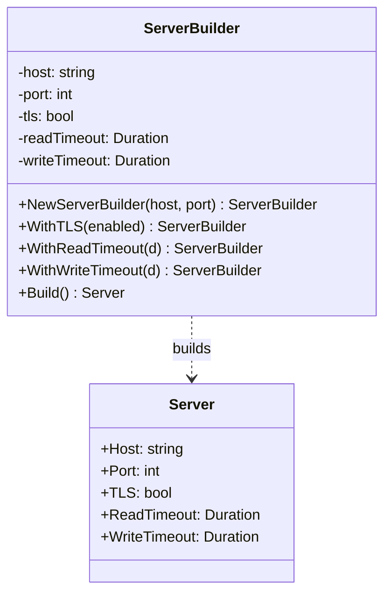

# Builder / 建造者模式

## Intent / 意圖
> 將複雜物件的建構過程與其表示分離，使同一個建構流程可以產生不同的表示。

## Problem / 問題情境
你需要建立一個 HTTP Server 設定物件，它有十幾個可選參數：Host、Port、TLS 證書路徑、ReadTimeout、WriteTimeout、MaxHeaderBytes、Logger 等。如果用一個巨型建構函式 `NewServer(host, port, certPath, readTimeout, writeTimeout, maxHeader, logger, ...)`，參數太多容易搞混順序。如果用 struct literal 直接賦值，又無法區分「使用者刻意設為零值」和「使用者沒設定、應使用預設值」。你需要一種方式讓使用者只設定自己關心的欄位，其餘自動套用合理預設值。

## Solution / 解決方案
提供一個 Builder 物件，透過鏈式方法（method chaining）逐步設定各參數，最後呼叫 `Build()` 產生最終物件。Builder 內部維護建構中的狀態，`Build()` 時驗證必填欄位並套用預設值。Go 慣用 method chaining（回傳 `*Builder`）；Rust 則可進一步使用 typestate pattern，在型別層級強制建構順序，讓不合法的建構在編譯期就被擋下。

## Structure / 結構



## Participants / 參與者

| 角色 | 職責 |
|------|------|
| Product (Server) | 最終要建構的複雜物件 |
| Builder (ServerBuilder) | 提供逐步設定介面，維護建構中狀態，最終產出 Product |
| Director (可選) | 定義固定的建構步驟順序，呼叫 Builder 的方法組裝 Product |
| Client | 使用 Builder 設定參數並呼叫 Build() |

## Go 實作

```go
package main

import (
	"fmt"
	"time"
)

// Server is the product — the complex object we want to build.
type Server struct {
	Host         string
	Port         int
	TLS          bool
	ReadTimeout  time.Duration
	WriteTimeout time.Duration
}

func (s *Server) String() string {
	return fmt.Sprintf("Server{Host: %s, Port: %d, TLS: %v, ReadTimeout: %s, WriteTimeout: %s}",
		s.Host, s.Port, s.TLS, s.ReadTimeout, s.WriteTimeout)
}

// ServerBuilder provides a fluent API to construct Server.
type ServerBuilder struct {
	host         string
	port         int
	tls          bool
	readTimeout  time.Duration
	writeTimeout time.Duration
}

func NewServerBuilder(host string, port int) *ServerBuilder {
	return &ServerBuilder{
		host: host,
		port: port,
	}
}

func (b *ServerBuilder) WithTLS(enabled bool) *ServerBuilder {
	b.tls = enabled
	return b
}

func (b *ServerBuilder) WithReadTimeout(d time.Duration) *ServerBuilder {
	b.readTimeout = d
	return b
}

func (b *ServerBuilder) WithWriteTimeout(d time.Duration) *ServerBuilder {
	b.writeTimeout = d
	return b
}

func (b *ServerBuilder) Build() (*Server, error) {
	if b.host == "" {
		return nil, fmt.Errorf("host is required")
	}
	if b.port <= 0 || b.port > 65535 {
		return nil, fmt.Errorf("port must be between 1 and 65535, got %d", b.port)
	}

	// Apply defaults
	readTimeout := b.readTimeout
	if readTimeout == 0 {
		readTimeout = 5 * time.Second
	}
	writeTimeout := b.writeTimeout
	if writeTimeout == 0 {
		writeTimeout = 10 * time.Second
	}

	return &Server{
		Host:         b.host,
		Port:         b.port,
		TLS:          b.tls,
		ReadTimeout:  readTimeout,
		WriteTimeout: writeTimeout,
	}, nil
}

func main() {
	server, err := NewServerBuilder("localhost", 8080).
		WithTLS(true).
		WithReadTimeout(3 * time.Second).
		Build()
	if err != nil {
		panic(err)
	}
	fmt.Println(server)

	// Minimal build — uses all defaults
	server2, err := NewServerBuilder("0.0.0.0", 3000).Build()
	if err != nil {
		panic(err)
	}
	fmt.Println(server2)
}

// Output:
// Server{Host: localhost, Port: 8080, TLS: true, ReadTimeout: 3s, WriteTimeout: 10s}
// Server{Host: 0.0.0.0, Port: 3000, TLS: false, ReadTimeout: 5s, WriteTimeout: 10s}
```

## Rust 實作

```rust
use std::time::Duration;

// --- Product ---

#[derive(Debug)]
struct Server {
    host: String,
    port: u16,
    tls: bool,
    read_timeout: Duration,
    write_timeout: Duration,
}

// --- Typestate markers ---

struct NoHost;
struct HasHost;
struct NoPort;
struct HasPort;

// --- Builder with typestate ---

struct ServerBuilder<H, P> {
    host: Option<String>,
    port: Option<u16>,
    tls: bool,
    read_timeout: Option<Duration>,
    write_timeout: Option<Duration>,
    _host_state: std::marker::PhantomData<H>,
    _port_state: std::marker::PhantomData<P>,
}

impl ServerBuilder<NoHost, NoPort> {
    fn new() -> Self {
        ServerBuilder {
            host: None,
            port: None,
            tls: false,
            read_timeout: None,
            write_timeout: None,
            _host_state: std::marker::PhantomData,
            _port_state: std::marker::PhantomData,
        }
    }
}

impl<P> ServerBuilder<NoHost, P> {
    fn host(self, host: impl Into<String>) -> ServerBuilder<HasHost, P> {
        ServerBuilder {
            host: Some(host.into()),
            port: self.port,
            tls: self.tls,
            read_timeout: self.read_timeout,
            write_timeout: self.write_timeout,
            _host_state: std::marker::PhantomData,
            _port_state: std::marker::PhantomData,
        }
    }
}

impl<H> ServerBuilder<H, NoPort> {
    fn port(self, port: u16) -> ServerBuilder<H, HasPort> {
        ServerBuilder {
            host: self.host,
            port: Some(port),
            tls: self.tls,
            read_timeout: self.read_timeout,
            write_timeout: self.write_timeout,
            _host_state: std::marker::PhantomData,
            _port_state: std::marker::PhantomData,
        }
    }
}

impl<H, P> ServerBuilder<H, P> {
    fn tls(mut self, enabled: bool) -> Self {
        self.tls = enabled;
        self
    }

    fn read_timeout(mut self, d: Duration) -> Self {
        self.read_timeout = Some(d);
        self
    }

    fn write_timeout(mut self, d: Duration) -> Self {
        self.write_timeout = Some(d);
        self
    }
}

// Build is ONLY available when both host and port are set.
impl ServerBuilder<HasHost, HasPort> {
    fn build(self) -> Server {
        Server {
            host: self.host.unwrap(),
            port: self.port.unwrap(),
            tls: self.tls,
            read_timeout: self.read_timeout.unwrap_or(Duration::from_secs(5)),
            write_timeout: self.write_timeout.unwrap_or(Duration::from_secs(10)),
        }
    }
}

fn main() {
    let server = ServerBuilder::new()
        .host("localhost")
        .port(8080)
        .tls(true)
        .read_timeout(Duration::from_secs(3))
        .build();
    println!("{server:?}");

    // Minimal build — uses all defaults
    let server2 = ServerBuilder::new()
        .host("0.0.0.0")
        .port(3000)
        .build();
    println!("{server2:?}");

    // The following would NOT compile — host and port are required:
    // ServerBuilder::new().host("localhost").build(); // Error: build() not available on ServerBuilder<HasHost, NoPort>
}

// Output:
// Server { host: "localhost", port: 8080, tls: true, read_timeout: 3s, write_timeout: 10s }
// Server { host: "0.0.0.0", port: 3000, tls: false, read_timeout: 5s, write_timeout: 10s }
```

## Go vs Rust 對照表

| 面向 | Go | Rust |
|------|----|------|
| 必填欄位驗證 | 運行期在 `Build()` 中回傳 `error` | Typestate 在編譯期阻擋，`build()` 只在所有必填欄位設定後才可呼叫 |
| Method chaining | 回傳 `*Builder`（可變指標），所有方法共用同一物件 | 回傳 `Self`（move semantics），每次呼叫消耗前一狀態 |
| 預設值 | 在 `Build()` 中用 `if field == zeroValue` 判斷 | 使用 `Option<T>` + `unwrap_or()` 或 `Default` trait |
| 泛型型別狀態 | Go 1.24 有泛型但社群不常用於 Builder | PhantomData + 泛型參數實現 typestate，社群慣用模式 |
| 錯誤處理 | `Build()` 回傳 `(*Product, error)` | Typestate 消除大部分錯誤，或回傳 `Result<Product, Error>` |

## When to Use / 適用場景

- 物件有大量可選參數（超過 3-4 個），constructor 參數列過長。
- 建構過程有多個步驟，且步驟順序可能影響結果（如 SQL query builder）。
- 需要同一個建構流程產生不同表示（如 HTML builder vs Markdown builder）。

## When NOT to Use / 不適用場景

- 物件只有 1-2 個欄位，直接用 struct literal 或 constructor function 更清晰。
- 所有欄位都是必填且無預設值 -- Builder 的價值在於「可選參數 + 預設值」，全部必填時 Builder 只是多餘的包裝。

## Real-World Examples / 真實世界案例

- **Go `net/http` Server**：雖然 `http.Server` 使用 struct literal 而非 Builder，但社群中 `grpc.NewServer(opts...)` 使用 Functional Options 模式（Builder 的變體）。
- **Rust `reqwest::ClientBuilder`**：HTTP 客戶端 `reqwest` 提供 `Client::builder().timeout(...).proxy(...).build()?` 的典型 Builder API。
- **Rust `std::thread::Builder`**：`std::thread::Builder::new().name("worker".into()).stack_size(4096).spawn(...)` 用 Builder 設定執行緒屬性。

## Related Patterns / 相關模式

- [Singleton](01_singleton.md) -- Builder 可用於建構 Singleton 的複雜初始化邏輯。
- [Abstract Factory](03_abstract_factory.md) -- Abstract Factory 的產品建構可委託給 Builder。
- [Prototype](05_prototype.md) -- 可先用 Builder 建立原型，再用 Prototype 複製多份。

## Pitfalls / 常見陷阱

- **Go：忘記回傳 error**。`Build()` 只回傳 `*Product` 而不回傳 `error`，遇到必填欄位缺失時只能 panic。正確做法是 `Build() (*Product, error)`，讓呼叫端處理。
- **Rust：typestate 過度複雜**。當必填欄位超過 3-4 個時，泛型參數組合爆炸（`ServerBuilder<H, P, T, R, W>`），程式碼變得難以閱讀。此時考慮退回運行期驗證（`build() -> Result<Server, BuildError>`）或使用 derive macro（如 `typed-builder` crate）。
- **Go：Builder 非 thread-safe**。如果多個 goroutine 同時呼叫同一個 `*Builder` 的方法，會產生 data race。Builder 實例應在單一 goroutine 中使用，建好後再分享 Product。
- **混淆 Builder 與 Functional Options**。Go 社群更常用 Functional Options 模式（`func WithTimeout(d) Option`），它在 Go 中比 Builder 更慣用。Builder 在 Rust 中更自然，因為 typestate 能提供編譯期保證。

## References / 參考資料

- Gamma, E., Helm, R., Johnson, R., Vlissides, J. *Design Patterns: Elements of Reusable Object-Oriented Software*, 1994. Chapter 3: Creational Patterns — Builder.
- Rust `reqwest::ClientBuilder` 文件：https://docs.rs/reqwest/latest/reqwest/struct.ClientBuilder.html
- Rust `std::thread::Builder` 文件：https://doc.rust-lang.org/std/thread/struct.Builder.html
- Go Functional Options 模式：https://dave.cheney.net/2014/10/17/functional-options-for-friendly-apis
