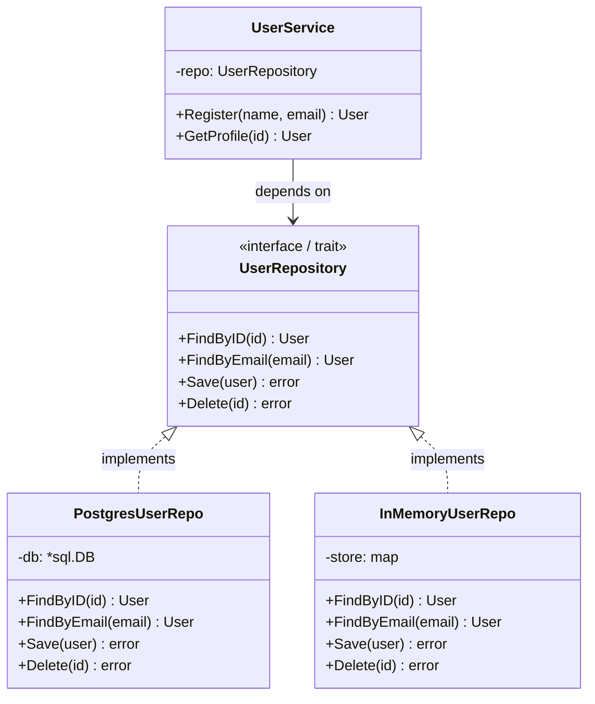

# Repository / 儲存庫模式

## Intent / 意圖
> 在業務邏輯和資料存取之間建立抽象層，讓業務層不依賴具體的資料儲存技術，同時便於測試和替換資料來源。

## Problem / 問題情境
直接在業務邏輯中嵌入資料庫查詢會導致多個問題：

1. **強耦合**：業務邏輯與特定資料庫（PostgreSQL、MongoDB）綁死，更換資料庫需要修改大量程式碼
2. **難以測試**：單元測試需要真實的資料庫連線，測試速度慢且不穩定
3. **職責混淆**：SQL 語句散落在業務函數中，難以維護和最佳化
4. **重複查詢**：相同的查詢邏輯可能在多處重複出現

## Solution / 解決方案
定義一個 Repository interface/trait，宣告資料存取的操作（CRUD）。業務邏輯僅依賴此抽象介面。具體的資料庫實作（如 PostgresUserRepo）實現此介面。測試時可注入 in-memory 的假實作。這讓業務邏輯與資料存取技術完全解耦。

## Structure / 結構



## Participants / 參與者

| 角色 | 職責 |
|------|------|
| **Repository Interface** | 定義資料存取操作的抽象契約 |
| **Concrete Repository** | 實作特定資料庫的存取邏輯 |
| **Entity / Model** | 業務領域物件，Repository 操作的對象 |
| **Service** | 業務邏輯層，依賴 Repository 抽象 |
| **In-Memory Repository** | 測試用的假實作，用 map/HashMap 存資料 |

## Go 實作

```go
package main

import (
	"errors"
	"fmt"
	"sync"
)

// --- Entity ---

type User struct {
	ID    int64
	Name  string
	Email string
}

// --- Repository Interface ---

var ErrNotFound = errors.New("not found")

type UserRepository interface {
	FindByID(id int64) (*User, error)
	FindByEmail(email string) (*User, error)
	Save(user *User) error
	Delete(id int64) error
}

// --- In-Memory 實作（也適用於測試）---

type InMemoryUserRepo struct {
	mu     sync.RWMutex
	store  map[int64]*User
	nextID int64
}

func NewInMemoryUserRepo() *InMemoryUserRepo {
	return &InMemoryUserRepo{
		store:  make(map[int64]*User),
		nextID: 1,
	}
}

func (r *InMemoryUserRepo) FindByID(id int64) (*User, error) {
	r.mu.RLock()
	defer r.mu.RUnlock()
	user, ok := r.store[id]
	if !ok {
		return nil, fmt.Errorf("user id=%d: %w", id, ErrNotFound)
	}
	// 回傳副本避免外部修改
	copy := *user
	return &copy, nil
}

func (r *InMemoryUserRepo) FindByEmail(email string) (*User, error) {
	r.mu.RLock()
	defer r.mu.RUnlock()
	for _, user := range r.store {
		if user.Email == email {
			copy := *user
			return &copy, nil
		}
	}
	return nil, fmt.Errorf("user email=%s: %w", email, ErrNotFound)
}

func (r *InMemoryUserRepo) Save(user *User) error {
	r.mu.Lock()
	defer r.mu.Unlock()
	if user.ID == 0 {
		user.ID = r.nextID
		r.nextID++
	}
	copy := *user
	r.store[user.ID] = &copy
	return nil
}

func (r *InMemoryUserRepo) Delete(id int64) error {
	r.mu.Lock()
	defer r.mu.Unlock()
	if _, ok := r.store[id]; !ok {
		return fmt.Errorf("user id=%d: %w", id, ErrNotFound)
	}
	delete(r.store, id)
	return nil
}

// --- Service 層（依賴 Repository 抽象）---

type UserService struct {
	repo UserRepository
}

func NewUserService(repo UserRepository) *UserService {
	return &UserService{repo: repo}
}

func (s *UserService) Register(name, email string) (*User, error) {
	// 檢查 email 是否已存在
	if _, err := s.repo.FindByEmail(email); err == nil {
		return nil, fmt.Errorf("email %s already registered", email)
	}

	user := &User{Name: name, Email: email}
	if err := s.repo.Save(user); err != nil {
		return nil, fmt.Errorf("save user: %w", err)
	}
	return user, nil
}

func (s *UserService) GetProfile(id int64) (*User, error) {
	return s.repo.FindByID(id)
}

func main() {
	// 注入 in-memory 實作（正式環境換成 PostgresUserRepo）
	repo := NewInMemoryUserRepo()
	svc := NewUserService(repo)

	// 註冊使用者
	alice, err := svc.Register("Alice", "alice@example.com")
	if err != nil {
		panic(err)
	}
	fmt.Printf("Registered: %+v\n", alice)

	bob, err := svc.Register("Bob", "bob@example.com")
	if err != nil {
		panic(err)
	}
	fmt.Printf("Registered: %+v\n", bob)

	// 重複註冊
	_, err = svc.Register("Alice2", "alice@example.com")
	fmt.Printf("Duplicate:  %v\n", err)

	// 查詢
	profile, err := svc.GetProfile(alice.ID)
	if err != nil {
		panic(err)
	}
	fmt.Printf("Profile:    %+v\n", profile)

	// 刪除
	err = repo.Delete(bob.ID)
	if err != nil {
		panic(err)
	}
	_, err = svc.GetProfile(bob.ID)
	fmt.Printf("After del:  %v\n", err)
}

// Output:
// Registered: &{ID:1 Name:Alice Email:alice@example.com}
// Registered: &{ID:2 Name:Bob Email:bob@example.com}
// Duplicate:  email alice@example.com already registered
// Profile:    &{ID:1 Name:Alice Email:alice@example.com}
// After del:  user id=2: not found
```

## Rust 實作

```rust
use std::collections::HashMap;
use std::fmt;
use std::sync::{Arc, Mutex};

// --- Entity ---

#[derive(Debug, Clone)]
struct User {
    id: i64,
    name: String,
    email: String,
}

// --- Error ---

#[derive(Debug)]
enum RepoError {
    NotFound(String),
    AlreadyExists(String),
}

impl fmt::Display for RepoError {
    fn fmt(&self, f: &mut fmt::Formatter<'_>) -> fmt::Result {
        match self {
            RepoError::NotFound(msg) => write!(f, "not found: {msg}"),
            RepoError::AlreadyExists(msg) => write!(f, "already exists: {msg}"),
        }
    }
}

// --- Repository Trait ---

trait UserRepository {
    fn find_by_id(&self, id: i64) -> Result<User, RepoError>;
    fn find_by_email(&self, email: &str) -> Result<User, RepoError>;
    fn save(&self, user: &mut User) -> Result<(), RepoError>;
    fn delete(&self, id: i64) -> Result<(), RepoError>;
}

// --- In-Memory 實作 ---

struct InMemoryUserRepo {
    store: Mutex<HashMap<i64, User>>,
    next_id: Mutex<i64>,
}

impl InMemoryUserRepo {
    fn new() -> Self {
        Self {
            store: Mutex::new(HashMap::new()),
            next_id: Mutex::new(1),
        }
    }
}

impl UserRepository for InMemoryUserRepo {
    fn find_by_id(&self, id: i64) -> Result<User, RepoError> {
        let store = self.store.lock().unwrap();
        store
            .get(&id)
            .cloned()
            .ok_or_else(|| RepoError::NotFound(format!("user id={id}")))
    }

    fn find_by_email(&self, email: &str) -> Result<User, RepoError> {
        let store = self.store.lock().unwrap();
        store
            .values()
            .find(|u| u.email == email)
            .cloned()
            .ok_or_else(|| RepoError::NotFound(format!("user email={email}")))
    }

    fn save(&self, user: &mut User) -> Result<(), RepoError> {
        let mut store = self.store.lock().unwrap();
        if user.id == 0 {
            let mut next_id = self.next_id.lock().unwrap();
            user.id = *next_id;
            *next_id += 1;
        }
        store.insert(user.id, user.clone());
        Ok(())
    }

    fn delete(&self, id: i64) -> Result<(), RepoError> {
        let mut store = self.store.lock().unwrap();
        store
            .remove(&id)
            .map(|_| ())
            .ok_or_else(|| RepoError::NotFound(format!("user id={id}")))
    }
}

// --- Service 層 ---

struct UserService<R: UserRepository> {
    repo: Arc<R>,
}

impl<R: UserRepository> UserService<R> {
    fn new(repo: Arc<R>) -> Self {
        Self { repo }
    }

    fn register(&self, name: &str, email: &str) -> Result<User, String> {
        // 檢查 email 是否已存在
        if self.repo.find_by_email(email).is_ok() {
            return Err(format!("email {email} already registered"));
        }

        let mut user = User {
            id: 0,
            name: name.to_string(),
            email: email.to_string(),
        };
        self.repo.save(&mut user).map_err(|e| e.to_string())?;
        Ok(user)
    }

    fn get_profile(&self, id: i64) -> Result<User, String> {
        self.repo.find_by_id(id).map_err(|e| e.to_string())
    }
}

fn main() {
    let repo = Arc::new(InMemoryUserRepo::new());
    let svc = UserService::new(repo.clone());

    // 註冊使用者
    let alice = svc.register("Alice", "alice@example.com").unwrap();
    println!("Registered: {:?}", alice);

    let bob = svc.register("Bob", "bob@example.com").unwrap();
    println!("Registered: {:?}", bob);

    // 重複註冊
    let err = svc.register("Alice2", "alice@example.com").unwrap_err();
    println!("Duplicate:  {err}");

    // 查詢
    let profile = svc.get_profile(alice.id).unwrap();
    println!("Profile:    {:?}", profile);

    // 刪除
    repo.delete(bob.id).unwrap();
    let err = svc.get_profile(bob.id).unwrap_err();
    println!("After del:  {err}");
}

// Output:
// Registered: User { id: 1, name: "Alice", email: "alice@example.com" }
// Registered: User { id: 2, name: "Bob", email: "bob@example.com" }
// Duplicate:  email alice@example.com already registered
// Profile:    User { id: 1, name: "Alice", email: "alice@example.com" }
// After del:  not found: user id=2
```

## Go vs Rust 對照表

| 面向 | Go | Rust |
|------|----|----|
| 抽象方式 | `interface` 隱式實作 | `trait` 顯式 `impl Trait for Struct` |
| 泛型依賴注入 | 直接用 interface 值 | `<R: UserRepository>` 泛型參數或 `dyn Trait` |
| 並行安全 | `sync.RWMutex` + 手動加鎖 | `Mutex` + `Arc` 共享所有權 |
| 錯誤處理 | `error` interface + `errors.Is/As` | `enum` error + `Result<T, E>` |
| 測試替身 | 直接傳入 `InMemoryRepo` | 泛型參數或 mock trait |
| 非同步支援 | 原生支援（goroutine） | `async_trait` crate 包裝 |

## When to Use / 適用場景

- 需要隔離業務邏輯和資料存取技術，便於未來更換資料庫
- 需要為業務邏輯撰寫不依賴外部服務的快速單元測試
- 專案有多個資料來源（SQL、NoSQL、API、檔案），需要統一介面
- 領域驅動設計（DDD）架構中，Repository 是核心建構區塊

## When NOT to Use / 不適用場景

- 小型 CRUD 應用，只有一個簡單的資料庫 -- 額外的抽象層是不必要的間接性
- 需要大量利用資料庫特有功能（如 PostgreSQL 的 JSONB 查詢、全文搜尋） -- 抽象層會限制這些能力
- 查詢邏輯極度複雜且高度客製化，無法用通用 interface 表達

## Real-World Examples / 真實世界案例

- **Go `go-kit`**：Service 層透過 Repository interface 存取資料，middleware 可以在 Repository 層級加入 logging、metrics
- **Rust `diesel` + `domain` crate 架構**：在 DDD 專案中，domain 層定義 trait，infrastructure 層用 diesel 實作
- **Martin Fowler's Patterns of Enterprise Application Architecture**：Repository 是核心 pattern 之一，被所有主流框架（Spring、Rails、Django）採用

## Related Patterns / 相關模式

- **Strategy (GoF)**：Repository interface 本質上是 Strategy pattern -- 業務邏輯依賴抽象策略，具體策略可替換
- **Factory Method (GoF)**：常與 Repository 搭配使用，用 Factory 決定建立哪種 Repository 實作
- **Unit of Work**：管理 Repository 操作的 transaction 邊界，確保多個 Repository 操作的原子性

## Pitfalls / 常見陷阱

1. **過度抽象**：為每個 entity 都建立 Repository interface，即使該 entity 只有一種資料來源且不需要替換。應根據實際需求決定是否抽象
2. **洩漏抽象**：Repository interface 的方法簽名暴露底層實作細節（如 `FindBySQL(query string)`），破壞了抽象的目的
3. **N+1 查詢問題**：Repository 的簡單 `FindByID` 在迴圈中呼叫會產生大量查詢。應提供 `FindByIDs(ids []int64)` 批量方法
4. **Transaction 管理困難**：跨多個 Repository 的 transaction 需要額外的 Unit of Work 或 Transaction Manager 模式

## References / 參考資料

- Martin Fowler, "Patterns of Enterprise Application Architecture" (2002) - Repository pattern
- Eric Evans, "Domain-Driven Design" (2003) - Repository as an aggregate boundary
- Go Standard Project Layout: https://github.com/golang-standards/project-layout
- Rust API Guidelines: https://rust-lang.github.io/api-guidelines/
