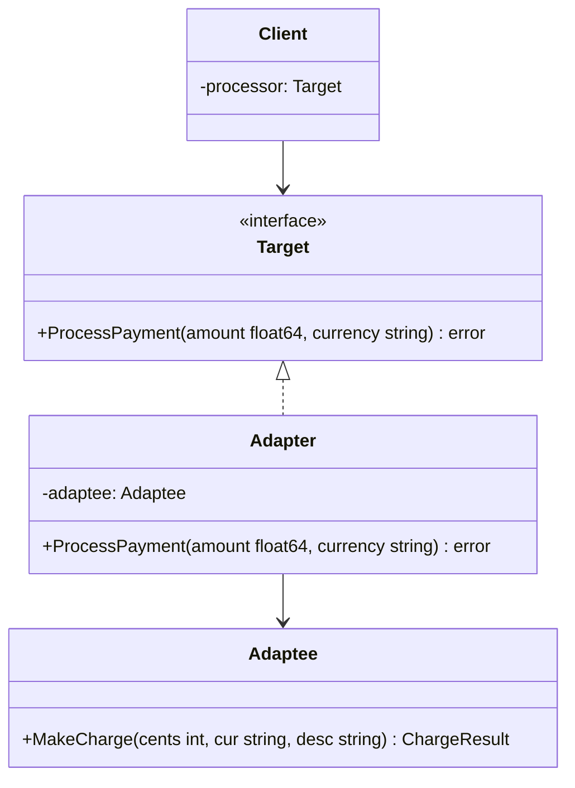

# Adapter / 適配器模式

## Intent / 意圖
> 將一個既有類別的介面轉換為客戶端期望的另一種介面，使原本因介面不相容而無法協作的類別能夠一起運作。

## Problem / 問題情境
你的系統使用統一的 `PaymentProcessor` 介面來處理付款，但現在需要整合一個第三方支付 SDK（例如 Stripe），而該 SDK 的 API 方法簽章與你的介面完全不同。若不使用 Adapter，你必須修改所有呼叫端的程式碼來適應新 SDK，這會導致：
- 客戶端程式碼與第三方 SDK 強耦合
- 每次更換支付供應商都要大規模重構
- 違反 Open-Closed Principle

## Solution / 解決方案
建立一個 Adapter 結構體，讓它實作目標介面，內部持有被適配物件（Adaptee）的參考，在介面方法中將呼叫委派給 Adaptee 的對應方法，必要時進行參數轉換與結果映射。客戶端只需依賴目標介面，完全不知道底層是哪個實作。

## Structure / 結構



## Participants / 參與者
- **Target（目標介面）**：客戶端期望使用的介面，定義統一的付款處理方法。
- **Adaptee（被適配者）**：既有的第三方 SDK，擁有不同的 API 簽章。
- **Adapter（適配器）**：實作 Target 介面，內部持有 Adaptee 並負責轉換呼叫。
- **Client（客戶端）**：透過 Target 介面操作，不直接依賴 Adaptee。

## Go 實作

```go
package main

import "fmt"

// Target: 系統統一的付款處理介面
type PaymentProcessor interface {
	ProcessPayment(amount float64, currency string) error
}

// Adaptee: 第三方支付 SDK（介面不相容）
type StripeSDK struct{}

type ChargeResult struct {
	Success bool
	TxnID   string
}

func (s *StripeSDK) MakeCharge(cents int, cur string, desc string) ChargeResult {
	fmt.Printf("Stripe: charging %d %s — %s\n", cents, cur, desc)
	return ChargeResult{Success: true, TxnID: "txn_abc123"}
}

// Adapter: 將 StripeSDK 適配為 PaymentProcessor
type StripeAdapter struct {
	sdk *StripeSDK
}

func NewStripeAdapter(sdk *StripeSDK) *StripeAdapter {
	return &StripeAdapter{sdk: sdk}
}

func (a *StripeAdapter) ProcessPayment(amount float64, currency string) error {
	// 轉換參數：float64 美元 → int 美分
	cents := int(amount * 100)
	result := a.sdk.MakeCharge(cents, currency, "order payment")
	if !result.Success {
		return fmt.Errorf("stripe charge failed")
	}
	fmt.Printf("Transaction ID: %s\n", result.TxnID)
	return nil
}

// Client 只依賴 PaymentProcessor 介面
func checkout(p PaymentProcessor, amount float64) {
	if err := p.ProcessPayment(amount, "USD"); err != nil {
		fmt.Println("Payment failed:", err)
		return
	}
	fmt.Println("Payment succeeded!")
}

func main() {
	sdk := &StripeSDK{}
	adapter := NewStripeAdapter(sdk)
	checkout(adapter, 49.99)
}

// Output:
// Stripe: charging 4999 USD — order payment
// Transaction ID: txn_abc123
// Payment succeeded!
```

## Rust 實作

```rust
use std::fmt;

// Target: 系統統一的付款處理 trait
trait PaymentProcessor {
    fn process_payment(&self, amount: f64, currency: &str) -> Result<(), String>;
}

// Adaptee: 第三方支付 SDK
struct StripeSDK;

struct ChargeResult {
    success: bool,
    txn_id: String,
}

impl StripeSDK {
    fn make_charge(&self, cents: i64, cur: &str, desc: &str) -> ChargeResult {
        println!("Stripe: charging {} {} — {}", cents, cur, desc);
        ChargeResult {
            success: true,
            txn_id: "txn_abc123".to_string(),
        }
    }
}

// Adapter: 將 StripeSDK 適配為 PaymentProcessor
struct StripeAdapter {
    sdk: StripeSDK,
}

impl StripeAdapter {
    fn new(sdk: StripeSDK) -> Self {
        Self { sdk }
    }
}

impl PaymentProcessor for StripeAdapter {
    fn process_payment(&self, amount: f64, currency: &str) -> Result<(), String> {
        let cents = (amount * 100.0) as i64;
        let result = self.sdk.make_charge(cents, currency, "order payment");
        if !result.success {
            return Err("stripe charge failed".to_string());
        }
        println!("Transaction ID: {}", result.txn_id);
        Ok(())
    }
}

// Client 只依賴 PaymentProcessor trait
fn checkout(processor: &dyn PaymentProcessor, amount: f64) {
    match processor.process_payment(amount, "USD") {
        Ok(()) => println!("Payment succeeded!"),
        Err(e) => println!("Payment failed: {}", e),
    }
}

fn main() {
    let sdk = StripeSDK;
    let adapter = StripeAdapter::new(sdk);
    checkout(&adapter, 49.99);
}

// Output:
// Stripe: charging 4999 USD — order payment
// Transaction ID: txn_abc123
// Payment succeeded!
```

## Go vs Rust 對照表

| 面向 | Go | Rust |
|------|----|----|
| 適配機制 | struct embedding 或 composition 持有 Adaptee | struct 包裝 Adaptee，為 wrapper 實作 trait |
| 介面實作 | implicit interface satisfaction | explicit `impl Trait for Struct` |
| 錯誤處理 | 回傳 `error` | 回傳 `Result<T, E>` |
| 多型呼叫 | interface 值 | `&dyn Trait`（trait object）或泛型 |

## When to Use / 適用場景
- 需要整合第三方函式庫或 legacy 系統，其 API 與現有介面不相容時。
- 想在不修改既有程式碼的前提下，讓多個不同介面的實作統一在同一個抽象之下。
- 系統需要支援多種外部服務供應商的切換（如不同的支付 / 通知 / 儲存服務）。

## When NOT to Use / 不適用場景
- 當你能控制 Adaptee 的原始碼並直接修改其介面時，直接重構更簡單。
- 當轉換邏輯過於複雜，Adapter 變成一個龐大的翻譯層——此時可能需要重新設計介面或考慮 Anti-Corruption Layer。

## Real-World Examples / 真實世界案例
- **Go `io.Reader` / `io.Writer`**：`bytes.NewReader` 將 `[]byte` 適配為 `io.Reader` 介面，讓任何需要 Reader 的函式都能直接使用 byte slice。
- **Rust `From` / `Into` trait**：標準庫中大量使用 `From<T>` 來將一種型別適配為另一種，例如 `String::from(&str)`。
- **database/sql**：Go 的 `database/sql` 定義統一介面，各資料庫 driver（如 `lib/pq`、`go-sqlite3`）透過 Adapter 模式實作 `driver.Driver` 介面。

## Related Patterns / 相關模式
- [Bridge](07_bridge.md)：Bridge 在設計階段分離抽象與實作，Adapter 在事後修補介面不相容。
- [Decorator](09_decorator.md)：Decorator 不改變介面而是增加行為，Adapter 改變介面而不增加行為。
- [Proxy](12_proxy.md)：Proxy 提供相同介面的替身，Adapter 提供不同介面的橋接。

## Pitfalls / 常見陷阱
- **過度適配**：為每一個微小的介面差異都建立 Adapter，導致類別爆炸。應先評估是否能統一介面設計。
- **隱藏語意差異**：Adapter 只轉換了方法簽章，但忽略了語意差異（如錯誤碼的含義不同、事務一致性的保證不同），導致執行期出現意外行為。
- **效能損耗**：多層 Adapter 嵌套會增加間接呼叫開銷，在高頻路徑上需注意。

## References / 參考資料
- *Design Patterns: Elements of Reusable Object-Oriented Software* — Gamma et al. (GoF), Chapter: Adapter
- *Head First Design Patterns* — Freeman & Robson, Chapter 7
- [Refactoring Guru — Adapter](https://refactoring.guru/design-patterns/adapter)
- [Go Effective Go — Interfaces](https://go.dev/doc/effective_go#interfaces)
- [Rust Book — Traits](https://doc.rust-lang.org/book/ch10-02-traits.html)
