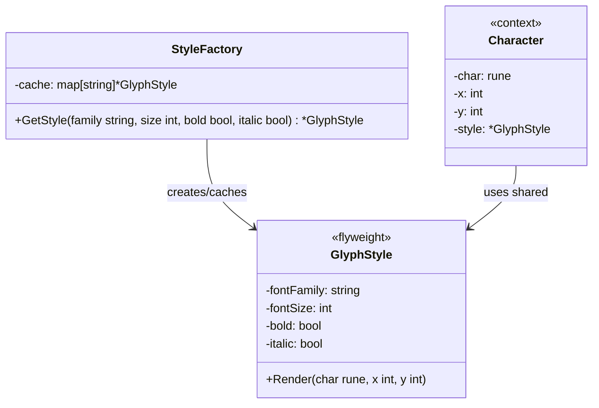

# Flyweight / 享元模式

## Intent / 意圖
> 透過共享細粒度物件來有效支援大量物件，將共用的內在狀態（intrinsic state）從可變的外在狀態（extrinsic state）中分離出來。

## Problem / 問題情境
你正在開發一個文字編輯器的渲染引擎。文件中可能有上百萬個字元，每個字元都有字型（font family、size、style）和位置（x, y）等屬性。如果為每個字元都建立完整的物件，記憶體使用量會高達數 GB。但觀察後發現，文件中使用的字型組合通常只有十幾種，大量字元共用相同的字型設定。

## Solution / 解決方案
將物件的狀態分為：
- **內在狀態（Intrinsic）**：可共享的不變資料（如字型設定），存放在 Flyweight 物件中。
- **外在狀態（Extrinsic）**：每個實例獨有的資料（如位置），由客戶端在使用時傳入。

使用 Flyweight Factory 管理共享物件的建立與快取，確保相同的內在狀態只建立一次。

## Structure / 結構



## Participants / 參與者
- **Flyweight（享元）**：儲存可共享的內在狀態，提供接受外在狀態的方法。
- **Flyweight Factory（享元工廠）**：管理 Flyweight 物件的快取池，確保相同內在狀態只有一個實例。
- **Context（情境）**：持有外在狀態，並參考共享的 Flyweight。
- **Client（客戶端）**：透過 Factory 取得 Flyweight，將外在狀態傳入 Flyweight 的方法。

## Go 實作

```go
package main

import (
	"fmt"
	"strings"
	"sync"
)

// Flyweight: 字型樣式（內在狀態，不可變）
type GlyphStyle struct {
	FontFamily string
	FontSize   int
	Bold       bool
	Italic     bool
}

func (s *GlyphStyle) Render(char rune, x, y int) {
	style := ""
	if s.Bold {
		style += "B"
	}
	if s.Italic {
		style += "I"
	}
	if style == "" {
		style = "R" // Regular
	}
	fmt.Printf("  '%c' at (%d,%d) [%s %dpt %s]\n",
		char, x, y, s.FontFamily, s.FontSize, style)
}

// Flyweight Factory: 管理共享的 GlyphStyle
type StyleFactory struct {
	mu    sync.RWMutex
	cache map[string]*GlyphStyle
}

func NewStyleFactory() *StyleFactory {
	return &StyleFactory{
		cache: make(map[string]*GlyphStyle),
	}
}

func (f *StyleFactory) makeKey(family string, size int, bold, italic bool) string {
	return fmt.Sprintf("%s-%d-%t-%t", family, size, bold, italic)
}

func (f *StyleFactory) GetStyle(family string, size int, bold, italic bool) *GlyphStyle {
	key := f.makeKey(family, size, bold, italic)

	f.mu.RLock()
	if style, ok := f.cache[key]; ok {
		f.mu.RUnlock()
		return style
	}
	f.mu.RUnlock()

	f.mu.Lock()
	defer f.mu.Unlock()

	// Double-check after acquiring write lock
	if style, ok := f.cache[key]; ok {
		return style
	}

	style := &GlyphStyle{
		FontFamily: family,
		FontSize:   size,
		Bold:       bold,
		Italic:     italic,
	}
	f.cache[key] = style
	return style
}

func (f *StyleFactory) Stats() int {
	f.mu.RLock()
	defer f.mu.RUnlock()
	return len(f.cache)
}

// Context: 文件中的一個字元（外在狀態 + flyweight 參考）
type Character struct {
	Char  rune
	X, Y  int
	Style *GlyphStyle // 共享的 flyweight
}

func main() {
	factory := NewStyleFactory()

	// 模擬一段文件：大量字元共用少數幾種樣式
	text := "Hello, World!"
	var chars []Character

	for i, ch := range text {
		var style *GlyphStyle
		if ch == ',' || ch == '!' {
			// 標點用 italic
			style = factory.GetStyle("Noto Sans", 12, false, true)
		} else if strings.ToUpper(string(ch)) == string(ch) && ch != ' ' {
			// 大寫用 bold
			style = factory.GetStyle("Noto Sans", 12, true, false)
		} else {
			// 一般字元用 regular
			style = factory.GetStyle("Noto Sans", 12, false, false)
		}
		chars = append(chars, Character{
			Char:  ch,
			X:     i * 10,
			Y:     0,
			Style: style,
		})
	}

	fmt.Println("Rendered characters:")
	for _, c := range chars {
		c.Style.Render(c.Char, c.X, c.Y)
	}

	fmt.Printf("\nTotal characters: %d\n", len(chars))
	fmt.Printf("Unique styles (flyweights): %d\n", factory.Stats())
	fmt.Printf("Memory saved: shared %d style objects instead of %d\n",
		factory.Stats(), len(chars))
}

// Output:
// Rendered characters:
//   'H' at (0,0) [Noto Sans 12pt B]
//   'e' at (10,0) [Noto Sans 12pt R]
//   'l' at (20,0) [Noto Sans 12pt R]
//   'l' at (30,0) [Noto Sans 12pt R]
//   'o' at (40,0) [Noto Sans 12pt R]
//   ',' at (50,0) [Noto Sans 12pt I]
//   ' ' at (60,0) [Noto Sans 12pt R]
//   'W' at (70,0) [Noto Sans 12pt B]
//   'o' at (80,0) [Noto Sans 12pt R]
//   'r' at (90,0) [Noto Sans 12pt R]
//   'l' at (100,0) [Noto Sans 12pt R]
//   'd' at (110,0) [Noto Sans 12pt R]
//   '!' at (120,0) [Noto Sans 12pt I]
//
// Total characters: 13
// Unique styles (flyweights): 3
// Memory saved: shared 3 style objects instead of 13
```

## Rust 實作

```rust
use std::collections::HashMap;
use std::rc::Rc;

// Flyweight: 字型樣式（內在狀態，不可變）
#[derive(Debug, Clone, PartialEq, Eq, Hash)]
struct GlyphStyle {
    font_family: String,
    font_size: u32,
    bold: bool,
    italic: bool,
}

impl GlyphStyle {
    fn render(&self, ch: char, x: i32, y: i32) {
        let style = match (self.bold, self.italic) {
            (true, true) => "BI",
            (true, false) => "B",
            (false, true) => "I",
            (false, false) => "R",
        };
        println!(
            "  '{}' at ({},{}) [{} {}pt {}]",
            ch, x, y, self.font_family, self.font_size, style
        );
    }
}

// Flyweight Factory
struct StyleFactory {
    cache: HashMap<GlyphStyle, Rc<GlyphStyle>>,
}

impl StyleFactory {
    fn new() -> Self {
        Self {
            cache: HashMap::new(),
        }
    }

    fn get_style(
        &mut self,
        font_family: &str,
        font_size: u32,
        bold: bool,
        italic: bool,
    ) -> Rc<GlyphStyle> {
        let key = GlyphStyle {
            font_family: font_family.to_string(),
            font_size,
            bold,
            italic,
        };

        self.cache
            .entry(key.clone())
            .or_insert_with(|| Rc::new(key))
            .clone()
    }

    fn stats(&self) -> usize {
        self.cache.len()
    }
}

// Context: 文件中的一個字元
struct Character {
    ch: char,
    x: i32,
    y: i32,
    style: Rc<GlyphStyle>, // 共享的 flyweight（透過 Rc 引用計數）
}

fn main() {
    let mut factory = StyleFactory::new();
    let text = "Hello, World!";
    let mut chars: Vec<Character> = Vec::new();

    for (i, ch) in text.chars().enumerate() {
        let style = if ch == ',' || ch == '!' {
            factory.get_style("Noto Sans", 12, false, true)
        } else if ch.is_uppercase() {
            factory.get_style("Noto Sans", 12, true, false)
        } else {
            factory.get_style("Noto Sans", 12, false, false)
        };

        chars.push(Character {
            ch,
            x: (i as i32) * 10,
            y: 0,
            style,
        });
    }

    println!("Rendered characters:");
    for c in &chars {
        c.style.render(c.ch, c.x, c.y);
    }

    println!("\nTotal characters: {}", chars.len());
    println!("Unique styles (flyweights): {}", factory.stats());
    println!(
        "Memory saved: shared {} style objects instead of {}",
        factory.stats(),
        chars.len()
    );
}

// Output:
// Rendered characters:
//   'H' at (0,0) [Noto Sans 12pt B]
//   'e' at (10,0) [Noto Sans 12pt R]
//   'l' at (20,0) [Noto Sans 12pt R]
//   'l' at (30,0) [Noto Sans 12pt R]
//   'o' at (40,0) [Noto Sans 12pt R]
//   ',' at (50,0) [Noto Sans 12pt I]
//   ' ' at (60,0) [Noto Sans 12pt R]
//   'W' at (70,0) [Noto Sans 12pt B]
//   'o' at (80,0) [Noto Sans 12pt R]
//   'r' at (90,0) [Noto Sans 12pt R]
//   'l' at (100,0) [Noto Sans 12pt R]
//   'd' at (110,0) [Noto Sans 12pt R]
//   '!' at (120,0) [Noto Sans 12pt I]
//
// Total characters: 13
// Unique styles (flyweights): 3
// Memory saved: shared 3 style objects instead of 13
```

## Go vs Rust 對照表

| 面向 | Go | Rust |
|------|----|----|
| 共享機制 | `*GlyphStyle` 指標共享 + `sync.Pool` 或 map cache | `Rc<GlyphStyle>` 引用計數共享 |
| 並行安全 | `sync.RWMutex` 保護 cache map | 單線程用 `Rc`，多線程用 `Arc` |
| 不可變性 | convention（不暴露修改方法） | 天然不可變，需要 `RefCell` 才能可變 |
| Factory 實作 | `map[string]*T` 作為快取 | `HashMap<K, Rc<T>>` 作為快取 |

## When to Use / 適用場景
- 系統需要建立大量相似物件，且記憶體是瓶頸（如遊戲中的粒子系統、文字編輯器中的字元渲染）。
- 物件的大部分狀態可以抽取為共享的不可變部分，且外在狀態的傳遞成本低。

## When NOT to Use / 不適用場景
- 物件數量不多，記憶體不是問題時，Flyweight 的額外複雜度不值得。
- 物件的狀態幾乎都是可變且獨有的，沒有明顯的共享部分。

## Real-World Examples / 真實世界案例
- **Go `sync.Pool`**：Go 標準庫的 `sync.Pool` 就是一種 Flyweight 的變體，用於重複使用臨時物件（如 `bytes.Buffer`），減少 GC 壓力。
- **Java `String.intern()`**：JVM 的 String interning 將相同內容的字串指向同一個物件。
- **Rust `string interning` crate**：如 `string-interner` crate，用於在 compiler 或 parser 中避免重複儲存相同的識別符字串。
- **遊戲引擎中的 Texture/Sprite 快取**：大量遊戲物件共用相同的 texture 資源。

## Related Patterns / 相關模式
- [Composite](08_composite.md)：Composite 樹中的 Leaf 節點經常用 Flyweight 來共享，以節省大量葉節點的記憶體開銷。
- [Singleton](../creational/singleton.md)：Singleton 確保全域只有一個實例，Flyweight 確保相同狀態的物件只有一個實例。兩者都涉及共享，但動機不同。

## Pitfalls / 常見陷阱
- **可變狀態混入 Flyweight**：如果 Flyweight 物件被意外修改，所有共享該 Flyweight 的地方都會受影響。必須確保 Flyweight 是不可變的。
- **過早最佳化**：在記憶體尚未成為瓶頸時就套用 Flyweight，增加了程式碼複雜度但沒有實際收益。應先 profiling 確認記憶體是問題。
- **Factory 記憶體洩漏**：如果 Flyweight Factory 永遠不清除快取，在長時間運行的應用中可能累積大量不再使用的 Flyweight。Go 中可搭配 `sync.Pool`（自動 GC），Rust 中可用 `Weak` 引用。

## References / 參考資料
- *Design Patterns: Elements of Reusable Object-Oriented Software* — Gamma et al. (GoF), Chapter: Flyweight
- [Refactoring Guru — Flyweight](https://refactoring.guru/design-patterns/flyweight)
- [Go `sync.Pool` documentation](https://pkg.go.dev/sync#Pool)
- [Rust `Rc` documentation](https://doc.rust-lang.org/std/rc/struct.Rc.html)
