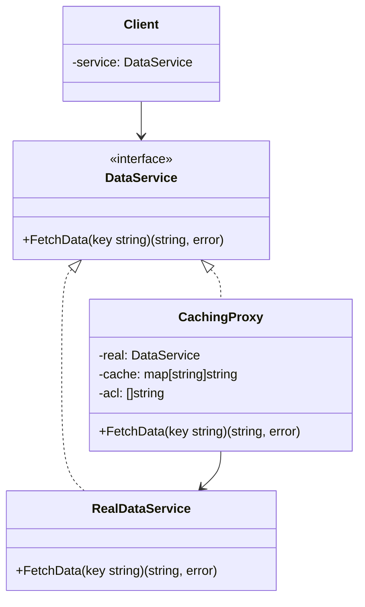

# Proxy / 代理模式

## Intent / 意圖
> 為另一個物件提供替身或佔位符，以控制對原始物件的存取。

## Problem / 問題情境
你正在開發一個 API Gateway，需要在呼叫後端微服務之前執行存取控制、請求快取和請求計量。如果在每個微服務客戶端中都加上這些邏輯，會導致大量重複程式碼，且每次新增一個橫切關注點都要修改所有客戶端。你需要一個透明的中間層來攔截和控制對真實服務的存取。

## Solution / 解決方案
建立一個 Proxy 物件，它實作與真實服務相同的介面。Proxy 內部持有真實服務的參考，在轉發請求前後執行額外邏輯（如權限檢查、快取查詢、記錄 metrics）。客戶端透過相同介面操作，不知道自己是在使用 Proxy 還是真實服務。

## Structure / 結構



## Participants / 參與者
- **Subject（主題介面）**：定義 Proxy 和 RealSubject 共用的介面。
- **RealSubject（真實主題）**：實際執行工作的物件。
- **Proxy（代理）**：持有 RealSubject 的參考，實作相同介面，在委派前後加入控制邏輯。
- **Client（客戶端）**：透過 Subject 介面操作，不區分 Proxy 和 RealSubject。

## Go 實作

```go
package main

import (
	"fmt"
	"slices"
	"time"
)

// Subject: 資料服務介面
type DataService interface {
	FetchData(key string) (string, error)
}

// RealSubject: 實際的資料服務（模擬慢速查詢）
type RealDataService struct{}

func (s *RealDataService) FetchData(key string) (string, error) {
	fmt.Printf("  [RealService] Querying database for key=%s...\n", key)
	time.Sleep(100 * time.Millisecond) // 模擬延遲
	return fmt.Sprintf("data_for_%s", key), nil
}

// Proxy: 帶有快取 + 存取控制 + 計量的代理
type SmartProxy struct {
	real       DataService
	cache      map[string]string
	allowedIPs []string
	callCount  int
}

func NewSmartProxy(real DataService, allowedIPs []string) *SmartProxy {
	return &SmartProxy{
		real:       real,
		cache:      make(map[string]string),
		allowedIPs: allowedIPs,
	}
}

func (p *SmartProxy) FetchData(key string) (string, error) {
	// 1. 存取控制（Protection Proxy）
	callerIP := "192.168.1.10" // 模擬呼叫者 IP
	if !slices.Contains(p.allowedIPs, callerIP) {
		return "", fmt.Errorf("access denied for IP %s", callerIP)
	}
	fmt.Printf("  [Proxy] Access granted for %s\n", callerIP)

	// 2. 快取檢查（Caching Proxy）
	if cached, ok := p.cache[key]; ok {
		fmt.Printf("  [Proxy] Cache HIT for key=%s\n", key)
		p.callCount++
		return cached, nil
	}
	fmt.Printf("  [Proxy] Cache MISS for key=%s\n", key)

	// 3. 委派給真實服務
	result, err := p.real.FetchData(key)
	if err != nil {
		return "", err
	}

	// 4. 快取結果
	p.cache[key] = result
	p.callCount++

	// 5. 計量（Logging Proxy）
	fmt.Printf("  [Proxy] Total requests served: %d\n", p.callCount)

	return result, nil
}

func main() {
	real := &RealDataService{}
	proxy := NewSmartProxy(real, []string{"192.168.1.10", "10.0.0.1"})

	// 客戶端透過相同介面操作
	var service DataService = proxy

	fmt.Println("--- First request (cache miss) ---")
	data, err := service.FetchData("user:42")
	if err != nil {
		fmt.Println("Error:", err)
		return
	}
	fmt.Printf("  Result: %s\n", data)

	fmt.Println("\n--- Second request (cache hit) ---")
	data, err = service.FetchData("user:42")
	if err != nil {
		fmt.Println("Error:", err)
		return
	}
	fmt.Printf("  Result: %s\n", data)

	fmt.Println("\n--- Different key (cache miss) ---")
	data, err = service.FetchData("user:99")
	if err != nil {
		fmt.Println("Error:", err)
		return
	}
	fmt.Printf("  Result: %s\n", data)
}

// Output:
// --- First request (cache miss) ---
//   [Proxy] Access granted for 192.168.1.10
//   [Proxy] Cache MISS for key=user:42
//   [RealService] Querying database for key=user:42...
//   [Proxy] Total requests served: 1
//   Result: data_for_user:42
//
// --- Second request (cache hit) ---
//   [Proxy] Access granted for 192.168.1.10
//   [Proxy] Cache HIT for key=user:42
//   Result: data_for_user:42
//
// --- Different key (cache miss) ---
//   [Proxy] Access granted for 192.168.1.10
//   [Proxy] Cache MISS for key=user:99
//   [RealService] Querying database for key=user:99...
//   [Proxy] Total requests served: 3
//   Result: data_for_user:99
```

## Rust 實作

```rust
use std::collections::HashMap;
use std::thread;
use std::time::Duration;

// Subject: 資料服務 trait
trait DataService {
    fn fetch_data(&mut self, key: &str) -> Result<String, String>;
}

// RealSubject: 實際的資料服務
struct RealDataService;

impl DataService for RealDataService {
    fn fetch_data(&mut self, key: &str) -> Result<String, String> {
        println!("  [RealService] Querying database for key={}...", key);
        thread::sleep(Duration::from_millis(100));
        Ok(format!("data_for_{}", key))
    }
}

// Proxy: 帶有快取 + 存取控制 + 計量的代理
struct SmartProxy {
    real: Box<dyn DataService>,
    cache: HashMap<String, String>,
    allowed_ips: Vec<String>,
    call_count: u64,
}

impl SmartProxy {
    fn new(real: Box<dyn DataService>, allowed_ips: Vec<String>) -> Self {
        Self {
            real,
            cache: HashMap::new(),
            allowed_ips,
            call_count: 0,
        }
    }
}

impl DataService for SmartProxy {
    fn fetch_data(&mut self, key: &str) -> Result<String, String> {
        // 1. 存取控制
        let caller_ip = "192.168.1.10";
        if !self.allowed_ips.iter().any(|ip| ip == caller_ip) {
            return Err(format!("access denied for IP {}", caller_ip));
        }
        println!("  [Proxy] Access granted for {}", caller_ip);

        // 2. 快取檢查
        if let Some(cached) = self.cache.get(key) {
            println!("  [Proxy] Cache HIT for key={}", key);
            self.call_count += 1;
            return Ok(cached.clone());
        }
        println!("  [Proxy] Cache MISS for key={}", key);

        // 3. 委派給真實服務
        let result = self.real.fetch_data(key)?;

        // 4. 快取結果
        self.cache.insert(key.to_string(), result.clone());
        self.call_count += 1;

        // 5. 計量
        println!("  [Proxy] Total requests served: {}", self.call_count);

        Ok(result)
    }
}

fn main() {
    let real = Box::new(RealDataService);
    let mut service: SmartProxy = SmartProxy::new(
        real,
        vec!["192.168.1.10".to_string(), "10.0.0.1".to_string()],
    );

    println!("--- First request (cache miss) ---");
    match service.fetch_data("user:42") {
        Ok(data) => println!("  Result: {}", data),
        Err(e) => println!("  Error: {}", e),
    }

    println!("\n--- Second request (cache hit) ---");
    match service.fetch_data("user:42") {
        Ok(data) => println!("  Result: {}", data),
        Err(e) => println!("  Error: {}", e),
    }

    println!("\n--- Different key (cache miss) ---");
    match service.fetch_data("user:99") {
        Ok(data) => println!("  Result: {}", data),
        Err(e) => println!("  Error: {}", e),
    }
}

// Output:
// --- First request (cache miss) ---
//   [Proxy] Access granted for 192.168.1.10
//   [Proxy] Cache MISS for key=user:42
//   [RealService] Querying database for key=user:42...
//   [Proxy] Total requests served: 1
//   Result: data_for_user:42
//
// --- Second request (cache hit) ---
//   [Proxy] Access granted for 192.168.1.10
//   [Proxy] Cache HIT for key=user:42
//   Result: data_for_user:42
//
// --- Different key (cache miss) ---
//   [Proxy] Access granted for 192.168.1.10
//   [Proxy] Cache MISS for key=user:99
//   [RealService] Querying database for key=user:99...
//   [Proxy] Total requests served: 3
//   Result: data_for_user:99
```

## Go vs Rust 對照表

| 面向 | Go | Rust |
|------|----|----|
| 介面替換 | Proxy 實作相同 interface，呼叫端無感 | Proxy 實作相同 trait，可透過 `Deref` trait 透明轉發 |
| 內部可變性 | Proxy struct 欄位自由修改 | 需要 `&mut self` 或 `RefCell` 處理內部狀態更新 |
| 快取實作 | `map[string]string` | `HashMap<String, String>` |
| 動態代理 | `reflect.Proxy`（非官方）或 code generation | 可用 proc macro 生成 |

## When to Use / 適用場景
- **Protection Proxy**：需要在存取真實物件前做權限檢查。
- **Caching Proxy**：需要快取昂貴操作的結果，避免重複計算或網路請求。
- **Virtual Proxy / Lazy Loading**：真實物件的建立成本高（如大型檔案、資料庫連線），只在真正需要時才初始化。
- **Logging / Monitoring Proxy**：需要記錄對真實物件的存取紀錄或計量指標。

## When NOT to Use / 不適用場景
- 只需要簡單的函式包裝（如加個 log），用 Decorator 或 middleware 更直接。
- Proxy 的存取控制邏輯過於複雜，變成了業務邏輯的一部分——此時應該將邏輯放在 service 層而非 Proxy。

## Real-World Examples / 真實世界案例
- **Go `httputil.ReverseProxy`**：Go 標準庫的反向代理，代理 HTTP 請求到後端伺服器，支援修改請求/回應。
- **Rust 的 `Deref` trait**：`Box<T>`、`Rc<T>`、`Arc<T>` 透過 `Deref` 實現 smart pointer，是一種 Virtual Proxy。
- **ORM Lazy Loading**：如 Hibernate 的 lazy-loaded associations，在第一次存取關聯物件時才發出 SQL 查詢。
- **gRPC interceptors**：gRPC 的 client/server interceptors 就是 Proxy 模式的應用，攔截 RPC 呼叫以加入 auth、logging 等功能。

## Related Patterns / 相關模式
- [Adapter](06_adapter.md)：Adapter 提供不同的介面，Proxy 提供相同的介面。
- [Decorator](09_decorator.md)：Decorator 動態增加行為，Proxy 控制存取。兩者結構非常相似，差異在於意圖——Decorator 的目的是增強功能，Proxy 的目的是控制存取。

## Pitfalls / 常見陷阱
- **透明性假設**：客戶端假設 Proxy 與真實物件行為完全一致，但 Proxy 可能引入延遲、快取不一致或存取限制，導致意外行為。
- **快取失效**：Caching Proxy 如果沒有適當的 invalidation 策略，會回傳過期資料。需要明確定義 TTL 或 event-driven invalidation。
- **單一職責違反**：一個 Proxy 同時做快取、auth、logging，職責過多。應考慮用多個 Proxy 層層包裝（此時接近 Decorator 的用法）。

## References / 參考資料
- *Design Patterns: Elements of Reusable Object-Oriented Software* — Gamma et al. (GoF), Chapter: Proxy
- [Refactoring Guru — Proxy](https://refactoring.guru/design-patterns/proxy)
- [Go `httputil.ReverseProxy`](https://pkg.go.dev/net/http/httputil#ReverseProxy)
- [Rust `Deref` trait](https://doc.rust-lang.org/std/ops/trait.Deref.html)
