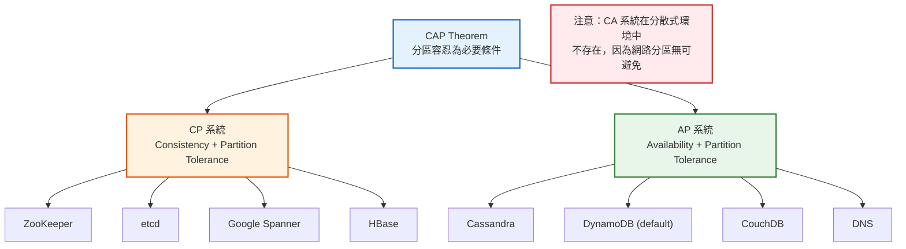
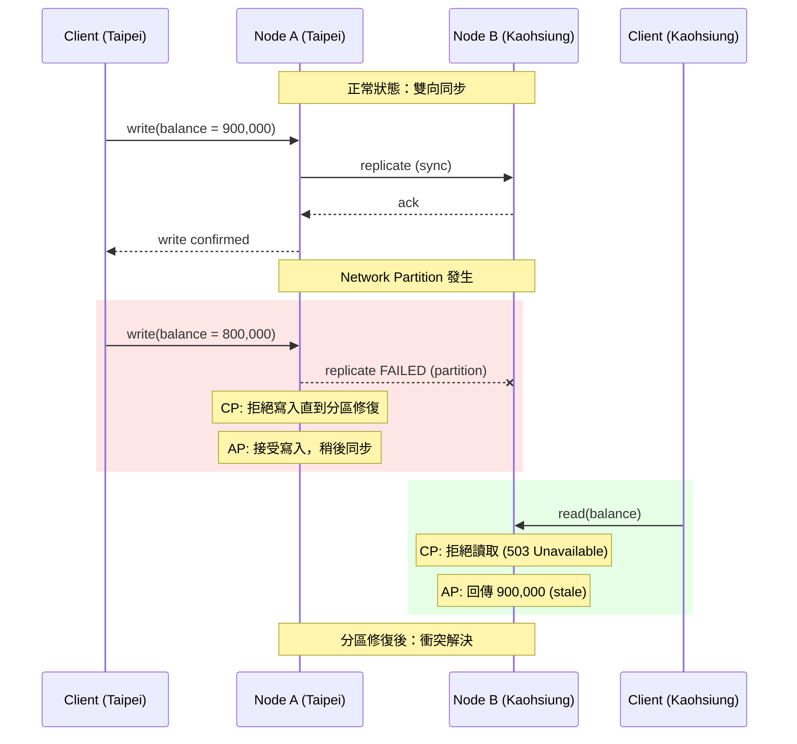

# CAP Theorem & Consistency Models / CAP 定理與一致性模型

## Intent / 意圖

理解分散式系統中最根本的取捨框架——CAP 定理，以及從線性化到最終一致性的完整一致性模型光譜。掌握這些概念是設計任何分散式服務的先決條件，決定了系統在網路分區（network partition）發生時的行為語意。

核心問題：**當網路分區無可避免時，我們的系統應該選擇拒絕服務（犧牲可用性）還是回傳可能過時的資料（犧牲一致性）？**

---

## Problem / 問題情境

**場景：跨區域部署的銀行轉帳系統**

某銀行將帳務系統部署在台北與高雄兩個資料中心。某日兩個資料中心之間的網路鏈路中斷（network partition）：

1. 客戶 Alice 在台北 ATM 從帳戶 A 轉出 100,000 元到帳戶 B，台北節點處理成功。
2. 同一時刻，客戶 Bob 在高雄分行查詢帳戶 A 餘額——高雄節點尚未收到台北的更新。
3. **如果系統選擇可用性（AP）**：高雄回傳舊餘額，Bob 基於錯誤餘額再次轉帳，造成帳戶透支。
4. **如果系統選擇一致性（CP）**：高雄節點拒絕服務，Bob 無法進行任何操作，但不會產生錯誤資料。

這個場景揭示了 CAP 定理的本質——在網路分區發生時，一致性和可用性不可兼得。銀行系統選擇 CP 是因為資料正確性的代價遠高於暫時的服務中斷。

---

## Core Concepts / 核心概念

### CAP Theorem / CAP 定理

由 Eric Brewer 於 2000 年提出，2002 年由 Gilbert 與 Lynch 正式證明。在分散式系統中，以下三個屬性最多只能同時滿足兩個：

- **Consistency（一致性）**：所有節點在同一時間看到相同的資料（等同於 linearizability）。
- **Availability（可用性）**：每個請求都能收到非錯誤的回應（不保證是最新資料）。
- **Partition Tolerance（分區容忍）**：系統在任意網路分區情況下仍能繼續運作。

由於網路分區在真實世界中不可避免，實際上的選擇是在分區發生時選擇 CP 或 AP。

### PACELC Extension / PACELC 延伸

Daniel Abadi 提出的 CAP 延伸框架：在網路分區（**P**artition）發生時選擇 **A**vailability 或 **C**onsistency；否則（**E**lse），在正常運作時選擇 **L**atency 或 **C**onsistency。這補充了 CAP 未涵蓋的「正常狀態下的延遲 vs 一致性」權衡。

### CP Systems / CP 系統

在網路分區發生時選擇一致性，犧牲可用性。分區期間，無法確認資料一致性的節點會拒絕服務。典型代表：ZooKeeper、etcd、Google Spanner。

### AP Systems / AP 系統

在網路分區發生時選擇可用性，犧牲一致性。所有節點持續回應請求，但可能回傳過時資料。典型代表：Cassandra、DynamoDB（預設模式）、DNS。

### Linearizability / 線性化

最強的一致性保證（strongest consistency model）。所有操作看起來像是在某個全域時間線上原子地執行。一旦寫入被任何 client 觀察到，後續所有讀取都必須回傳該寫入或更新的值。系統表現得彷彿只有一份資料副本。

### Sequential Consistency / 順序一致性

比線性化弱。所有節點觀察到的操作順序一致，但該順序不需要對應真實時間。換言之，操作可以被重新排列，只要每個 process 自己的操作順序被保留。不保證即時性（recency）。

### Causal Consistency / 因果一致性

保證有因果關係（causally related）的操作按正確順序被觀察到。例如：A 發了一篇文章，B 回覆了 A——所有節點都必須先看到 A 的文章再看到 B 的回覆。沒有因果關係的並行操作（concurrent operations）可以任意排序。

### Eventual Consistency / 最終一致性

最弱的有用保證。如果不再有新的寫入，所有副本最終會收斂到相同的值。不保證收斂的時間上限，也不保證中間狀態的讀取結果。適合對即時性要求不高的場景。

### Raft Consensus / Raft 共識演算法

由 Diego Ongaro 於 2014 年提出，目標是比 Paxos 更易理解的共識演算法。核心機制包含 Leader Election（領導者選舉）、Log Replication（日誌複製）、Safety（安全性保證）。etcd、CockroachDB、TiKV 皆使用 Raft。

### Paxos / Paxos 共識演算法

由 Leslie Lamport 於 1989 年提出的經典共識演算法。理論上最早被證明正確的共識協議，但以難以理解和實作聞名。Google Chubby 和 Spanner 的早期版本使用 Multi-Paxos。現代系統多傾向使用 Raft 作為替代。

### Vector Clock / 向量時鐘

一種邏輯時鐘機制，用於追蹤分散式系統中事件的因果關係（causal ordering）。每個節點維護一個向量，記錄自己和所知其他節點的邏輯時間。透過比較向量可判斷兩個事件是否有因果關係或為並行事件。Amazon DynamoDB 的早期版本使用向量時鐘解決衝突。

### Quorum / 法定人數

在 N 個副本中，寫入需要 W 個節點確認，讀取需要從 R 個節點取得回應。當 `W + R > N` 時，讀寫集合必然有交集，保證至少能讀到最新的寫入。常見配置：`N=3, W=2, R=2`。

---

## Architecture / 架構

### CAP 取捨視覺化



### 網路分區場景示意



### 一致性模型強度光譜


---

## How It Works / 運作原理

### Raft Leader Election + Log Replication（簡化版）

1. **初始狀態**：所有節點以 Follower 角色啟動，每個 Follower 設定一個隨機的選舉超時計時器（election timeout，通常 150-300ms）。

2. **選舉觸發**：當某個 Follower 的計時器到期且未收到 Leader 的心跳，該節點轉為 Candidate，將自己的 term（任期號）加 1，投自己一票，並向所有其他節點發送 `RequestVote` RPC。

3. **投票規則**：每個節點在同一個 term 中只能投一票。收到 `RequestVote` 的節點會比較 Candidate 的日誌是否至少和自己一樣新（比較最後一筆 log entry 的 term 和 index），只有日誌夠新才會投票。

4. **當選條件**：Candidate 獲得多數票（majority，即 N/2 + 1）後成為 Leader。Leader 立即開始發送心跳（AppendEntries RPC）以維持權威，阻止其他節點觸發新選舉。

5. **Log Replication**：Client 的寫入請求只能由 Leader 處理。Leader 將寫入作為新的 log entry 追加到自己的日誌，然後透過 `AppendEntries` RPC 發送給所有 Follower。

6. **Commit 條件**：當多數節點成功複製了某筆 log entry，Leader 將其標記為 committed，並回覆 Client 成功。Committed 的 entry 保證不會丟失。

7. **狀態機套用**：所有節點按照相同順序將 committed 的 log entries 套用到本地狀態機，確保所有節點最終擁有相同的狀態。

### Quorum 讀寫運作原理

假設 `N=5, W=3, R=3`（`W + R = 6 > 5 = N`）：

1. **寫入流程**：Coordinator 將寫入請求發送給所有 5 個副本，等待至少 3 個確認回覆即視為成功。未能及時回覆的節點稍後透過 read repair 或 anti-entropy 機制補齊。

2. **讀取流程**：Coordinator 向所有 5 個副本發送讀取請求，等待至少 3 個回覆。比較回傳值的版本號（或時間戳記），取最新版本作為讀取結果。

3. **交集保證**：寫入的 3 個節點與讀取的 3 個節點，在 5 個節點的集合中必然有至少 1 個交集。該交集節點持有最新值，因此讀取一定能看到最新寫入。

4. **Read Repair**：讀取過程中若發現某些副本持有舊版本，Coordinator 會將最新值回寫給這些落後的副本，逐步修復不一致。

---

## Rust 實作

以下範例模擬 quorum-based 的讀寫操作，示範 `W + R > N` 如何保證讀取新鮮度。

```rust
// quorum_simulation.rs
// Quorum-based read/write simulation demonstrating W + R > N guarantee

use std::collections::HashMap;
use std::sync::Arc;
use tokio::sync::RwLock;
use tokio::time::{sleep, Duration};

/// 每筆資料附帶版本號與值
#[derive(Debug, Clone)]
struct VersionedEntry {
    value: String,
    version: u64,
    written_by: String,
}

/// 模擬單一副本節點
#[derive(Debug, Clone)]
struct ReplicaNode {
    node_id: String,
    store: Arc<RwLock<HashMap<String, VersionedEntry>>>,
    is_healthy: Arc<RwLock<bool>>,
}

impl ReplicaNode {
    fn new(node_id: &str) -> Self {
        Self {
            node_id: node_id.to_string(),
            store: Arc::new(RwLock::new(HashMap::new())),
            is_healthy: Arc::new(RwLock::new(true)),
        }
    }

    async fn write(&self, key: &str, entry: &VersionedEntry) -> Result<(), String> {
        if !*self.is_healthy.read().await {
            return Err(format!("{} is unreachable", self.node_id));
        }
        let mut store = self.store.write().await;
        // 只接受版本號更高的寫入（防止舊資料覆蓋新資料）
        if let Some(existing) = store.get(key) {
            if existing.version >= entry.version {
                return Ok(()); // 忽略過時的寫入
            }
        }
        store.insert(key.to_string(), entry.clone());
        Ok(())
    }

    async fn read(&self, key: &str) -> Result<Option<VersionedEntry>, String> {
        if !*self.is_healthy.read().await {
            return Err(format!("{} is unreachable", self.node_id));
        }
        let store = self.store.read().await;
        Ok(store.get(key).cloned())
    }

    async fn set_healthy(&self, healthy: bool) {
        *self.is_healthy.write().await = healthy;
    }
}

/// Quorum 參數配置
struct QuorumConfig {
    total_nodes: usize,    // N
    write_quorum: usize,   // W
    read_quorum: usize,    // R
}

impl QuorumConfig {
    fn new(n: usize, w: usize, r: usize) -> Self {
        assert!(
            w + r > n,
            "W({}) + R({}) must be > N({}) for quorum overlap guarantee",
            w, r, n
        );
        Self {
            total_nodes: n,
            write_quorum: w,
            read_quorum: r,
        }
    }
}

/// Quorum 協調者，負責分發讀寫請求並收集回應
struct QuorumCoordinator {
    nodes: Vec<ReplicaNode>,
    config: QuorumConfig,
    version_counter: Arc<RwLock<u64>>,
}

impl QuorumCoordinator {
    fn new(nodes: Vec<ReplicaNode>, config: QuorumConfig) -> Self {
        assert_eq!(nodes.len(), config.total_nodes);
        Self {
            nodes,
            config,
            version_counter: Arc::new(RwLock::new(0)),
        }
    }

    /// Quorum Write：至少 W 個節點確認才算成功
    async fn quorum_write(&self, key: &str, value: &str) -> Result<u64, String> {
        let version = {
            let mut ver = self.version_counter.write().await;
            *ver += 1;
            *ver
        };

        let entry = VersionedEntry {
            value: value.to_string(),
            version,
            written_by: "coordinator".to_string(),
        };

        let mut success_count = 0usize;
        let mut errors = Vec::new();

        for node in &self.nodes {
            match node.write(key, &entry).await {
                Ok(()) => {
                    success_count += 1;
                    println!(
                        "  [WRITE-ACK] {} accepted version {}",
                        node.node_id, version
                    );
                }
                Err(err) => {
                    errors.push(err.clone());
                    println!("  [WRITE-ERR] {}", err);
                }
            }
        }

        if success_count >= self.config.write_quorum {
            println!(
                "[WRITE-OK] key={}, value={}, version={} (acks={}/W={})",
                key, value, version, success_count, self.config.write_quorum
            );
            Ok(version)
        } else {
            Err(format!(
                "write quorum not met: got {} acks, need {} (errors: {:?})",
                success_count, self.config.write_quorum, errors
            ))
        }
    }

    /// Quorum Read：從至少 R 個節點讀取，取最高版本
    async fn quorum_read(&self, key: &str) -> Result<Option<String>, String> {
        let mut responses: Vec<(String, VersionedEntry)> = Vec::new();
        let mut errors = Vec::new();

        for node in &self.nodes {
            match node.read(key).await {
                Ok(Some(entry)) => {
                    println!(
                        "  [READ-RESP] {} returned version {}",
                        node.node_id, entry.version
                    );
                    responses.push((node.node_id.clone(), entry));
                }
                Ok(None) => {
                    println!("  [READ-RESP] {} returned (empty)", node.node_id);
                }
                Err(err) => {
                    errors.push(err.clone());
                    println!("  [READ-ERR] {}", err);
                }
            }
        }

        if responses.len() < self.config.read_quorum {
            return Err(format!(
                "read quorum not met: got {} responses, need {}",
                responses.len(),
                self.config.read_quorum
            ));
        }

        // 取版本號最高的回應
        let best = responses
            .iter()
            .max_by_key(|(_, entry)| entry.version);

        match best {
            Some((node_id, entry)) => {
                println!(
                    "[READ-OK] key={}, value={}, version={} (from {}, responses={}/R={})",
                    key, entry.value, entry.version, node_id,
                    responses.len(), self.config.read_quorum
                );

                // Read Repair：將最新值回寫給持有舊版本的節點
                self.read_repair(key, entry).await;

                Ok(Some(entry.value.clone()))
            }
            None => Ok(None),
        }
    }

    /// Read Repair：讀取時發現不一致，主動修復落後的副本
    async fn read_repair(&self, key: &str, latest: &VersionedEntry) {
        for node in &self.nodes {
            if let Ok(Some(entry)) = node.read(key).await {
                if entry.version < latest.version {
                    if node.write(key, latest).await.is_ok() {
                        println!(
                            "  [READ-REPAIR] {} updated from v{} to v{}",
                            node.node_id, entry.version, latest.version
                        );
                    }
                }
            }
        }
    }
}

#[tokio::main]
async fn main() {
    println!("=== Quorum Simulation (N=5, W=3, R=3) ===\n");

    let nodes: Vec<ReplicaNode> = (1..=5)
        .map(|i| ReplicaNode::new(&format!("node-{}", i)))
        .collect();

    let config = QuorumConfig::new(5, 3, 3);
    let coordinator = QuorumCoordinator::new(nodes.clone(), config);

    // 1. 正常寫入：所有節點可用
    println!("--- Step 1: Normal quorum write ---");
    let version = coordinator
        .quorum_write("account:alice", "balance=100000")
        .await
        .expect("write should succeed");
    println!("Assigned version: {}\n", version);

    // 2. 模擬部分節點故障（node-4, node-5 不可用）
    println!("--- Step 2: Simulate node-4 and node-5 failure ---");
    nodes[3].set_healthy(false).await;
    nodes[4].set_healthy(false).await;

    // 寫入仍然成功（3 個健康節點 >= W=3）
    let version2 = coordinator
        .quorum_write("account:alice", "balance=80000")
        .await
        .expect("write should still succeed with 3 healthy nodes");
    println!("Assigned version: {}\n", version2);

    // 3. 讀取：即使 node-4, node-5 不可用，仍可 quorum read
    println!("--- Step 3: Quorum read with partial failure ---");
    let result = coordinator.quorum_read("account:alice").await;
    println!("Read result: {:?}\n", result);

    // 4. 恢復節點後 read repair 會修復落後的副本
    println!("--- Step 4: Recover nodes and read (triggers read repair) ---");
    nodes[3].set_healthy(true).await;
    nodes[4].set_healthy(true).await;

    // node-4 和 node-5 仍持有 version 1 的舊資料
    let result2 = coordinator.quorum_read("account:alice").await;
    println!("Read result: {:?}", result2);
}

// Output:
// === Quorum Simulation (N=5, W=3, R=3) ===
//
// --- Step 1: Normal quorum write ---
//   [WRITE-ACK] node-1 accepted version 1
//   [WRITE-ACK] node-2 accepted version 1
//   [WRITE-ACK] node-3 accepted version 1
//   [WRITE-ACK] node-4 accepted version 1
//   [WRITE-ACK] node-5 accepted version 1
// [WRITE-OK] key=account:alice, value=balance=100000, version=1 (acks=5/W=3)
// Assigned version: 1
//
// --- Step 2: Simulate node-4 and node-5 failure ---
//   [WRITE-ACK] node-1 accepted version 2
//   [WRITE-ACK] node-2 accepted version 2
//   [WRITE-ACK] node-3 accepted version 2
//   [WRITE-ERR] node-4 is unreachable
//   [WRITE-ERR] node-5 is unreachable
// [WRITE-OK] key=account:alice, value=balance=80000, version=2 (acks=3/W=3)
// Assigned version: 2
//
// --- Step 3: Quorum read with partial failure ---
//   [READ-RESP] node-1 returned version 2
//   [READ-RESP] node-2 returned version 2
//   [READ-RESP] node-3 returned version 2
//   [READ-ERR] node-4 is unreachable
//   [READ-ERR] node-5 is unreachable
// [READ-OK] key=account:alice, value=balance=80000, version=2 (from node-1, responses=3/R=3)
// Read result: Ok(Some("balance=80000"))
//
// --- Step 4: Recover nodes and read (triggers read repair) ---
//   [READ-RESP] node-1 returned version 2
//   [READ-RESP] node-2 returned version 2
//   [READ-RESP] node-3 returned version 2
//   [READ-RESP] node-4 returned version 1
//   [READ-RESP] node-5 returned version 1
// [READ-OK] key=account:alice, value=balance=80000, version=2 (from node-1, responses=5/R=3)
//   [READ-REPAIR] node-4 updated from v1 to v2
//   [READ-REPAIR] node-5 updated from v1 to v2
// Read result: Ok(Some("balance=80000"))
```

---

## Go 實作

以 Go 1.24+ 實作相同的 quorum-based 讀寫模擬。

```go
// quorum_simulation.go
// Quorum-based read/write simulation demonstrating W + R > N guarantee

package main

import (
	"fmt"
	"sync"
)

// VersionedEntry 每筆資料附帶版本號與值
type VersionedEntry struct {
	Value     string
	Version   uint64
	WrittenBy string
}

// ReplicaNode 模擬單一副本節點
type ReplicaNode struct {
	NodeID    string
	mu        sync.RWMutex
	store     map[string]VersionedEntry
	isHealthy bool
}

func NewReplicaNode(nodeID string) *ReplicaNode {
	return &ReplicaNode{
		NodeID:    nodeID,
		store:     make(map[string]VersionedEntry),
		isHealthy: true,
	}
}

func (n *ReplicaNode) Write(key string, entry VersionedEntry) error {
	n.mu.Lock()
	defer n.mu.Unlock()

	if !n.isHealthy {
		return fmt.Errorf("%s is unreachable", n.NodeID)
	}

	// 只接受版本號更高的寫入
	if existing, exists := n.store[key]; exists {
		if existing.Version >= entry.Version {
			return nil
		}
	}
	n.store[key] = entry
	return nil
}

func (n *ReplicaNode) Read(key string) (VersionedEntry, bool, error) {
	n.mu.RLock()
	defer n.mu.RUnlock()

	if !n.isHealthy {
		return VersionedEntry{}, false, fmt.Errorf("%s is unreachable", n.NodeID)
	}

	entry, exists := n.store[key]
	return entry, exists, nil
}

func (n *ReplicaNode) SetHealthy(healthy bool) {
	n.mu.Lock()
	defer n.mu.Unlock()
	n.isHealthy = healthy
}

// QuorumConfig 儲存法定人數參數
type QuorumConfig struct {
	TotalNodes  int // N
	WriteQuorum int // W
	ReadQuorum  int // R
}

func NewQuorumConfig(n, w, r int) QuorumConfig {
	if w+r <= n {
		panic(fmt.Sprintf("W(%d) + R(%d) must be > N(%d) for quorum overlap guarantee", w, r, n))
	}
	return QuorumConfig{TotalNodes: n, WriteQuorum: w, ReadQuorum: r}
}

// QuorumCoordinator 負責分發讀寫請求並收集回應
type QuorumCoordinator struct {
	nodes          []*ReplicaNode
	config         QuorumConfig
	mu             sync.Mutex
	versionCounter uint64
}

func NewQuorumCoordinator(nodes []*ReplicaNode, config QuorumConfig) *QuorumCoordinator {
	if len(nodes) != config.TotalNodes {
		panic("node count must match config.TotalNodes")
	}
	return &QuorumCoordinator{
		nodes:  nodes,
		config: config,
	}
}

// QuorumWrite 至少 W 個節點確認才算成功
func (c *QuorumCoordinator) QuorumWrite(key, value string) (uint64, error) {
	c.mu.Lock()
	c.versionCounter++
	version := c.versionCounter
	c.mu.Unlock()

	entry := VersionedEntry{
		Value:     value,
		Version:   version,
		WrittenBy: "coordinator",
	}

	successCount := 0
	var errors []string

	for _, node := range c.nodes {
		if err := node.Write(key, entry); err != nil {
			errors = append(errors, err.Error())
			fmt.Printf("  [WRITE-ERR] %s\n", err)
		} else {
			successCount++
			fmt.Printf("  [WRITE-ACK] %s accepted version %d\n", node.NodeID, version)
		}
	}

	if successCount >= c.config.WriteQuorum {
		fmt.Printf("[WRITE-OK] key=%s, value=%s, version=%d (acks=%d/W=%d)\n",
			key, value, version, successCount, c.config.WriteQuorum)
		return version, nil
	}

	return 0, fmt.Errorf(
		"write quorum not met: got %d acks, need %d (errors: %v)",
		successCount, c.config.WriteQuorum, errors,
	)
}

// readResponse 儲存單一節點的讀取回應
type readResponse struct {
	nodeID string
	entry  VersionedEntry
}

// QuorumRead 從至少 R 個節點讀取，取最高版本
func (c *QuorumCoordinator) QuorumRead(key string) (string, error) {
	var responses []readResponse
	var errors []string

	for _, node := range c.nodes {
		entry, exists, err := node.Read(key)
		if err != nil {
			errors = append(errors, err.Error())
			fmt.Printf("  [READ-ERR] %s\n", err)
			continue
		}
		if !exists {
			fmt.Printf("  [READ-RESP] %s returned (empty)\n", node.NodeID)
			continue
		}
		fmt.Printf("  [READ-RESP] %s returned version %d\n", node.NodeID, entry.Version)
		responses = append(responses, readResponse{nodeID: node.NodeID, entry: entry})
	}

	if len(responses) < c.config.ReadQuorum {
		return "", fmt.Errorf(
			"read quorum not met: got %d responses, need %d",
			len(responses), c.config.ReadQuorum,
		)
	}

	// 取版本號最高的回應
	best := responses[0]
	for _, resp := range responses[1:] {
		if resp.entry.Version > best.entry.Version {
			best = resp
		}
	}

	fmt.Printf("[READ-OK] key=%s, value=%s, version=%d (from %s, responses=%d/R=%d)\n",
		key, best.entry.Value, best.entry.Version, best.nodeID,
		len(responses), c.config.ReadQuorum)

	// Read Repair：將最新值回寫給持有舊版本的節點
	c.readRepair(key, best.entry)

	return best.entry.Value, nil
}

// readRepair 讀取時發現不一致，主動修復落後的副本
func (c *QuorumCoordinator) readRepair(key string, latest VersionedEntry) {
	for _, node := range c.nodes {
		entry, exists, err := node.Read(key)
		if err != nil || !exists {
			continue
		}
		if entry.Version < latest.Version {
			if err := node.Write(key, latest); err == nil {
				fmt.Printf("  [READ-REPAIR] %s updated from v%d to v%d\n",
					node.NodeID, entry.Version, latest.Version)
			}
		}
	}
}

func main() {
	fmt.Println("=== Quorum Simulation (N=5, W=3, R=3) ===")
	fmt.Println()

	nodes := make([]*ReplicaNode, 5)
	for i := range nodes {
		nodes[i] = NewReplicaNode(fmt.Sprintf("node-%d", i+1))
	}

	config := NewQuorumConfig(5, 3, 3)
	coordinator := NewQuorumCoordinator(nodes, config)

	// 1. 正常寫入
	fmt.Println("--- Step 1: Normal quorum write ---")
	version, err := coordinator.QuorumWrite("account:alice", "balance=100000")
	if err != nil {
		fmt.Printf("Write failed: %s\n", err)
		return
	}
	fmt.Printf("Assigned version: %d\n\n", version)

	// 2. 模擬部分節點故障
	fmt.Println("--- Step 2: Simulate node-4 and node-5 failure ---")
	nodes[3].SetHealthy(false)
	nodes[4].SetHealthy(false)

	version2, err := coordinator.QuorumWrite("account:alice", "balance=80000")
	if err != nil {
		fmt.Printf("Write failed: %s\n", err)
		return
	}
	fmt.Printf("Assigned version: %d\n\n", version2)

	// 3. 讀取
	fmt.Println("--- Step 3: Quorum read with partial failure ---")
	result, err := coordinator.QuorumRead("account:alice")
	if err != nil {
		fmt.Printf("Read failed: %s\n", err)
		return
	}
	fmt.Printf("Read result: %s\n\n", result)

	// 4. 恢復節點，read repair 修復落後副本
	fmt.Println("--- Step 4: Recover nodes and read (triggers read repair) ---")
	nodes[3].SetHealthy(true)
	nodes[4].SetHealthy(true)

	result2, err := coordinator.QuorumRead("account:alice")
	if err != nil {
		fmt.Printf("Read failed: %s\n", err)
		return
	}
	fmt.Printf("Read result: %s\n", result2)
}

// Output:
// === Quorum Simulation (N=5, W=3, R=3) ===
//
// --- Step 1: Normal quorum write ---
//   [WRITE-ACK] node-1 accepted version 1
//   [WRITE-ACK] node-2 accepted version 1
//   [WRITE-ACK] node-3 accepted version 1
//   [WRITE-ACK] node-4 accepted version 1
//   [WRITE-ACK] node-5 accepted version 1
// [WRITE-OK] key=account:alice, value=balance=100000, version=1 (acks=5/W=3)
// Assigned version: 1
//
// --- Step 2: Simulate node-4 and node-5 failure ---
//   [WRITE-ACK] node-1 accepted version 2
//   [WRITE-ACK] node-2 accepted version 2
//   [WRITE-ACK] node-3 accepted version 2
//   [WRITE-ERR] node-4 is unreachable
//   [WRITE-ERR] node-5 is unreachable
// [WRITE-OK] key=account:alice, value=balance=80000, version=2 (acks=3/W=3)
// Assigned version: 2
//
// --- Step 3: Quorum read with partial failure ---
//   [READ-RESP] node-1 returned version 2
//   [READ-RESP] node-2 returned version 2
//   [READ-RESP] node-3 returned version 2
//   [READ-ERR] node-4 is unreachable
//   [READ-ERR] node-5 is unreachable
// [READ-OK] key=account:alice, value=balance=80000, version=2 (from node-1, responses=3/R=3)
// Read result: balance=80000
//
// --- Step 4: Recover nodes and read (triggers read repair) ---
//   [READ-RESP] node-1 returned version 2
//   [READ-RESP] node-2 returned version 2
//   [READ-RESP] node-3 returned version 2
//   [READ-RESP] node-4 returned version 1
//   [READ-RESP] node-5 returned version 1
// [READ-OK] key=account:alice, value=balance=80000, version=2 (from node-1, responses=5/R=3)
//   [READ-REPAIR] node-4 updated from v1 to v2
//   [READ-REPAIR] node-5 updated from v1 to v2
// Read result: balance=80000
```

---

## Rust vs Go 對照表

| 面向 | Rust (tokio) | Go 1.24+ |
|---|---|---|
| **並行安全保證** | `Arc<RwLock<T>>` 搭配所有權系統，編譯器在編譯期杜絕 data race。若 `RwLock` 的 guard 被錯誤持有跨越 `.await`，編譯器直接報錯，適合需要精確控制副本狀態的共識邏輯 | `sync.RWMutex` 需開發者自行確保 lock/unlock 配對正確，忘記加鎖只有在 `-race` flag 下執行才能偵測到。`go vet` 可靜態檢查部分問題，但不如 Rust 編譯期保證完整 |
| **錯誤傳播模式** | `Result<T, E>` + `?` 運算子強制處理每條路徑。quorum 操作中「部分節點失敗」的結果必須被明確處理，不可能被忽略，特別適合需要精確追蹤 ack 數量的場景 | 多值回傳 `(value, error)` 搭配慣例檢查。語法簡潔但 `err` 可以被忽略不處理，在複雜的 quorum 邏輯中可能遺漏某些錯誤路徑 |
| **記憶體模型與效能** | 零成本抽象，無 GC。版本號比較、read repair 等熱路徑不會被 GC pause 打斷，延遲更可預測。適合延遲敏感的共識協議實作（如 Raft heartbeat） | GC 管理記憶體，開發速度快但可能產生 stop-the-world pause。Go 1.19+ 的 GC 改善顯著，但在極低延遲場景（<1ms）仍可能受影響 |
| **泛型與抽象能力** | trait + generics 可定義通用的 `ConsensusProtocol<T>` trait，讓 Raft 和 Paxos 共享相同的介面抽象，編譯期單態化（monomorphization）無額外開銷 | Go 1.18+ generics 可用但表達力較受限，介面（interface）搭配 type assertion 是更常見的抽象方式，有少量執行期開銷 |

---

## When to Use / 適用場景

### CP 系統的適用場景

1. **金融交易與帳務系統**：帳戶餘額、轉帳紀錄必須精確一致。短暫的不可用（例如分區期間拒絕交易）遠比資料不一致（超額提款、重複扣款）可接受。使用 Raft-based 系統如 etcd 實作分散式鎖來協調交易順序。

2. **分散式鎖與 Leader Election**：微服務中的任務排程器、分散式 cron job 需要確保同一時間只有一個 instance 持有鎖。如果多個 instance 同時認為自己持有鎖（split-brain），會導致重複執行。ZooKeeper 或 etcd 提供的 CP 保證在此場景至關重要。

3. **設定管理與服務發現**：Kubernetes 使用 etcd 儲存叢集狀態。所有 API server 必須看到一致的叢集配置，否則可能調度衝突的 Pod 或路由到已下線的服務。

### AP 系統的適用場景

1. **社群媒體動態與按讚計數**：Facebook 的 News Feed、Twitter 的 Timeline 可以容忍短暫的不一致。使用者在不同裝置看到稍微不同的按讚數不會造成業務損失，最終收斂即可。

2. **DNS 系統**：DNS 天生就是 AP 的。更新一筆 DNS 記錄後，全球數百萬 resolver 不可能同時看到新值。TTL 機制讓快取自然過期更新，最終一致性在此場景完全足夠。

3. **購物車與使用者偏好設定**：Amazon DynamoDB 最初就是為購物車設計的 AP 系統。即使分區導致兩個資料中心各自修改購物車，合併（merge）時取聯集即可——寧可多顯示商品也不要遺失使用者的選擇。

---

## When NOT to Use / 不適用場景

1. **不要對庫存扣減使用純 AP 系統**：電商庫存在搶購場景下若採用最終一致性，多個節點各自認為庫存充足而接受訂單，最終會超賣（overselling）。庫存扣減需要至少使用 quorum write 搭配 conditional update（compare-and-swap），或直接使用 CP 系統保證一致性。

2. **不要對所有場景一律使用 CP 系統**：如果一個社群媒體平台把每筆貼文的讀取都走強一致性路徑，延遲和吞吐量會劇烈下降。全球用戶的讀取請求都要等待 leader 確認，leader 成為瓶頸。應該根據資料的重要性分級——金流走 CP，動態走 AP。

3. **不要假設 "CA" 系統存在於分散式環境**：單機資料庫（如單節點 PostgreSQL）可以同時提供一致性和可用性，但它沒有分區容忍——節點當機就全部不可用。一旦擴展為多節點分散式部署，網路分區就不可避免，必須在 CP 和 AP 之間做選擇。

---

## Real-World Examples / 真實世界案例

### ZooKeeper (CP)

Apache ZooKeeper 使用 ZAB（ZooKeeper Atomic Broadcast）協議，本質上是 Paxos 的變體。所有寫入都經由 Leader 排序並廣播給多數 Follower 確認。在網路分區時，少數派的節點會拒絕服務（犧牲可用性），確保 client 永遠讀到一致的資料。典型用途：分散式鎖、設定管理、Leader Election。Hadoop、Kafka（舊版）、HBase 皆依賴 ZooKeeper。

### Cassandra (AP)

Apache Cassandra 採用 leaderless 架構，所有節點對等。使用 consistent hashing 決定資料歸屬的節點，寫入時可調整 consistency level（ONE, QUORUM, ALL）。預設模式下優先保證可用性——即使部分節點不可達，仍接受讀寫。衝突透過 last-write-wins（LWW）解決。適合高寫入量、跨區域部署的場景，如 Netflix 的使用紀錄、Apple 的 iMessage 後端。

### etcd (CP)

etcd 是 Kubernetes 的核心資料儲存，使用 Raft 共識演算法。所有寫入必須經由 Raft leader，並在多數節點確認後才 commit。提供 linearizable read（需經 leader 確認）和 serializable read（可從 follower 讀取，較快但可能過時）兩種讀取模式。在網路分區時，只有包含多數節點的分區能繼續服務。

### DynamoDB (AP with Tunable Consistency)

Amazon DynamoDB 預設使用 eventually consistent reads，延遲最低、吞吐量最高。同時提供 strongly consistent reads 選項，消耗兩倍的讀取容量單位（RCU）。Global Tables 跨區域複製採用最終一致性，衝突以 last-writer-wins 解決。這種「可調一致性（tunable consistency）」的設計讓開發者根據不同 use case 在同一系統內選擇適當的一致性等級。

---

## Interview Questions / 面試常見問題

### Q1: 請簡述 CAP 定理的證明思路（proof sketch）

**A:** 考慮最簡單的情況：兩個節點 N1、N2 之間發生網路分區。Client 向 N1 寫入 `v1`，隨後另一個 Client 從 N2 讀取。如果系統保證可用性（A），N2 必須回應——但它無法與 N1 通訊確認最新值，所以只能回傳舊值，違反一致性（C）。如果系統保證一致性（C），N2 必須等到能與 N1 通訊才回應——但分區期間無法通訊，所以 N2 無法回應，違反可用性（A）。因此在分區（P）存在時，C 和 A 不可兼得。

### Q2: PACELC 比 CAP 多了什麼資訊？

**A:** CAP 只描述分區發生時的權衡，但現實中大部分時間系統是正常運作的。PACELC 補充了「正常狀態下的延遲（Latency）vs 一致性（Consistency）」權衡。例如 DynamoDB 是 PA/EL（分區時選可用性，正常時選低延遲），而 Spanner 是 PC/EC（分區時選一致性，正常時也選一致性但付出延遲代價）。這讓我們更精確地描述系統行為。

### Q3: 為什麼說 "CA" 系統在分散式環境中不存在？

**A:** 因為在多節點的分散式環境中，網路分區（partition）不是一個可以選擇避免的屬性——它是物理現實。交換器故障、光纖斷裂、雲端 AZ 隔離都會導致分區。CAP 中的 P 不是可選的，它是必須容忍的前提。所以真正的選擇只有 CP 和 AP。單機資料庫看似 CA，但它不是分散式系統，節點故障時完全不可用。

### Q4: Raft 如何保證 leader 唯一性？

**A:** 透過兩個機制：(1) **任期號（term）**：每次選舉產生新的 term，term 單調遞增。節點發現更高 term 的訊息時會自動降級為 Follower。(2) **每 term 只投一票**：每個節點在同一 term 中只會投給第一個向它請求投票的 Candidate。加上需要多數票才能當選，而多數的定義保證在同一 term 中最多只有一個 Candidate 能獲得多數票。這些機制共同保證了在同一 term 中最多只有一個 leader。

### Q5: Vector Clock 如何判斷兩個事件的因果關係？

**A:** 每個節點維護一個長度為 N 的向量（N 為節點數）。節點 i 每次執行本地事件時，將自己位置的計數器 +1。發送訊息時附帶當前向量；接收訊息時，取接收到的向量與本地向量的逐位最大值（element-wise max），再將自己位置 +1。比較兩個向量時：如果 A 的每個分量都 <= B 的對應分量，則 A happens-before B（A 因果地先於 B）。如果兩者互相都不小於等於對方，則是並行事件（concurrent），需要衝突解決機制。

---

## Pitfalls / 常見陷阱

### 1. 誤以為 CAP 定理要求永遠放棄 C 或 A

許多人將 CAP 理解為「系統必須是 CP 或 AP」，這是過度簡化。CAP 的取捨只在網路分區發生的那段時間內成立。正常運作時，系統可以同時提供一致性和可用性。更精確的理解是 PACELC：分區時選 C 或 A，正常時選延遲或一致性。此外，不同的資料可以有不同的策略——同一個系統中金流資料走 CP，日誌資料走 AP。

### 2. 認為 Quorum（W + R > N）等同於 Strong Consistency

`W + R > N` 只保證讀寫集合有交集，不保證線性化。原因包括：(1) **Sloppy quorum**：當 home node 不可用時，寫入導向替代節點（hinted handoff），破壞交集保證。(2) **並行寫入衝突**：兩個並行的寫入可能各自達到 quorum 但值不同，需要額外的衝突解決（如 LWW 或 vector clock）。(3) **Read repair 的時間差**：讀取到最新值和修復舊副本之間存在窗口。要達到真正的線性化需要額外機制如 Raft 共識。

### 3. 忽略「一致性」一詞在不同語境的含義差異

CAP 的 Consistency 指的是 linearizability（線性化），ACID 的 Consistency 指的是資料庫約束條件（constraints）的維護，而 Eventual Consistency 中的 consistency 指的是副本收斂。面試中混淆這三者會給面試官留下不佳印象。精確用語：CAP 談的是 linearizability，ACID 談的是 integrity constraints，replica convergence 談的是 eventual consistency。

### 4. Rust：`tokio::sync::RwLock` 跨 await 的隱微 deadlock

在 Rust 中使用 `tokio::sync::RwLock` 時，若在持有讀鎖的 scope 內呼叫需要寫鎖的操作（即使是不同的 `RwLock`），可能因為 tokio 的協作式排程導致 task 被掛起而 deadlock。在 quorum coordinator 的 `read_repair` 邏輯中特別容易踩到——先讀取所有副本（持有讀鎖），再嘗試寫入修復（需要寫鎖）。

```rust
// 危險：read_repair 中同時讀寫同一個 RwLock
async fn bad_read_repair(store: &RwLock<HashMap<String, u64>>) {
    let guard = store.read().await;
    let value = guard.get("key").copied();
    // guard 仍然存活！
    if value.unwrap_or(0) < 10 {
        store.write().await; // deadlock：讀鎖未釋放就請求寫鎖
    }
}

// 正確：先釋放讀鎖再請求寫鎖
async fn safe_read_repair(store: &RwLock<HashMap<String, u64>>) {
    let value = {
        let guard = store.read().await;
        guard.get("key").copied()
    }; // guard 在此 drop
    if value.unwrap_or(0) < 10 {
        let mut guard = store.write().await; // 安全
        guard.insert("key".to_string(), 10);
    }
}
```

### 5. Go：map 的並行讀寫在 quorum 邏輯中的 fatal error

Go 的 `map` 不是 goroutine-safe 的。在 quorum coordinator 中，如果多個 goroutine 同時讀寫副本節點的 store map——例如一個 goroutine 在做 read repair 寫入，另一個在處理新的讀取請求——會觸發 `fatal error: concurrent map read and map write`，程式直接 crash 而非產生 data race。

```go
// 危險：quorum read 和 read repair 並行操作同一個 map
func (n *ReplicaNode) UnsafeRead(key string) string {
    return n.store[key].Value // 若此時另一 goroutine 在寫入，fatal error
}

// 正確：所有 map 操作都加 RWMutex
func (n *ReplicaNode) SafeRead(key string) (VersionedEntry, bool) {
    n.mu.RLock()
    defer n.mu.RUnlock()
    entry, exists := n.store[key]
    return entry, exists
}
```

### 6. 混淆 Raft 的 committed 與 applied

Raft 中 log entry 被 committed（多數節點已複製）不代表已經 applied（套用到狀態機）。Client 在收到 leader 的 commit 確認後，可能立即從 follower 讀取卻發現 follower 尚未 apply 該 entry。解決方案：(1) 所有讀取都經由 leader（ReadIndex 或 LeaseRead）。(2) 等待 follower 的 applied index 追上 committed index 才回應讀取。etcd 的 `--consistency` flag 就是控制這個行為。

---

## Cross-references / 交叉引用

- [[../system_design/03_consistency_trade_offs|Consistency Trade-offs / 一致性權衡]] — 本篇專注 CAP 定理層面的取捨，而 03 篇深入探討不同一致性模型（Read-Your-Writes、Monotonic Reads）的實作模式。兩篇互補：先理解 CAP 的理論框架，再學習具體的一致性保證實作。
- [[../database/isolation_levels|Isolation Levels / 隔離等級]] — 資料庫的隔離等級（Read Committed、Repeatable Read、Serializable）與分散式一致性模型密切相關。Serializable isolation 在單節點上接近 linearizability 的保證，而跨節點的 serializable 則需要分散式共識協議。

---

## References / 參考資料

1. **Designing Data-Intensive Applications (DDIA)** — Martin Kleppmann
   - Chapter 8: The Trouble with Distributed Systems — 網路分區、時鐘偏移、Byzantine faults 等分散式系統的根本挑戰
   - Chapter 9: Consistency and Consensus — 線性化、因果一致性、全序廣播、Raft/Paxos 共識演算法的完整論述
2. **Brewer's CAP Theorem (original conjecture)** — Eric Brewer, "Towards Robust Distributed Systems", ACM PODC Keynote, 2000. 以及 Gilbert & Lynch 的正式證明 "Brewer's Conjecture and the Feasibility of Consistent, Available, Partition-Tolerant Web Services", ACM SIGACT News, 2002
3. **Jepsen** (https://jepsen.io) — Kyle Kingsbury 的分散式系統正確性測試專案。針對 etcd、Cassandra、CockroachDB、DynamoDB 等系統進行嚴格的一致性驗證，是理解真實系統在故障場景下行為的最佳資源
4. **In Search of an Understandable Consensus Algorithm (Extended Version)** — Diego Ongaro & John Ousterhout, USENIX ATC 2014. Raft 共識演算法的原始論文，以可理解性為設計目標
5. **PACELC** — Daniel Abadi, "Consistency Tradeoffs in Modern Distributed Database System Design", IEEE Computer, 2012. 提出 PACELC 作為 CAP 的實用延伸
6. **Dynamo: Amazon's Highly Available Key-value Store** — DeCandia et al., SOSP 2007. 描述 vector clock、sloppy quorum、hinted handoff 等 AP 系統的經典設計
