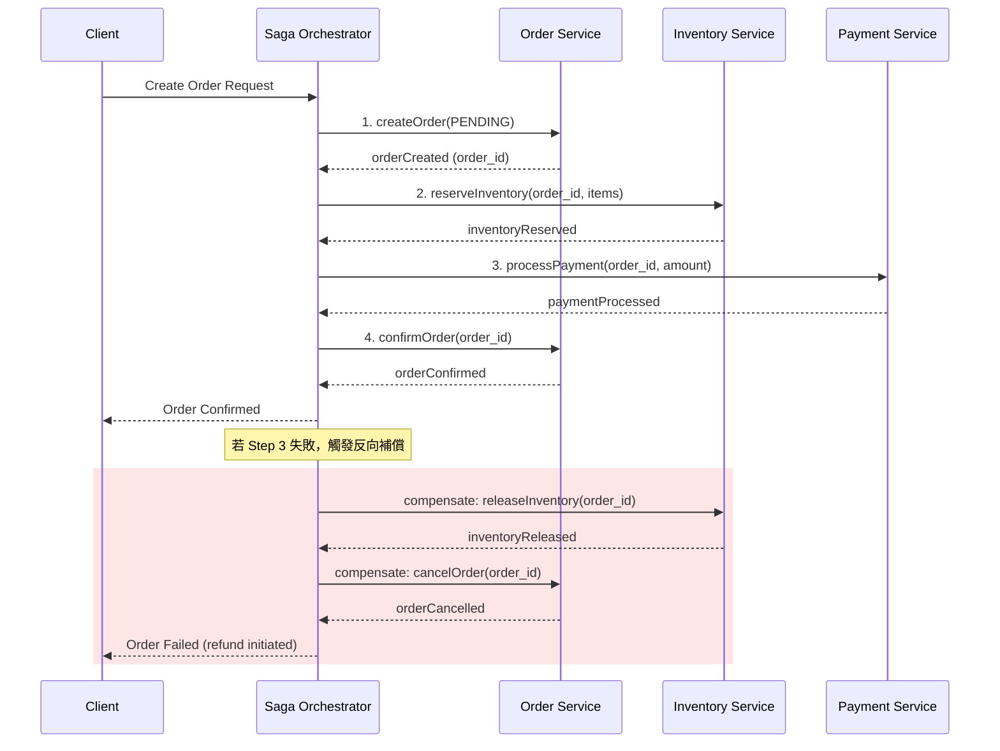
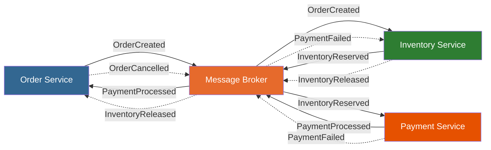
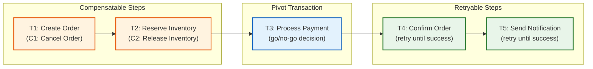

# Saga Pattern / Saga 分散式交易

## Intent / 意圖

在微服務架構下管理跨多個服務的分散式交易，而不依賴傳統的兩階段提交（Two-Phase Commit, 2PC）。Saga 將一個長時間運行的分散式交易拆解為一系列本地交易（local transactions），每個本地交易都有對應的補償交易（compensating transaction）。當某一步驟失敗時，依序執行已完成步驟的補償操作來回滾整個業務流程，最終保證跨服務的資料語意一致性。

核心問題：**當一個業務流程橫跨多個微服務且各自擁有獨立資料庫時，如何在不使用分散式鎖的前提下保證「全部成功或全部回滾」的交易語意？**

---

## Problem / 問題情境

**場景：電商結帳流程橫跨訂單、庫存、支付三個獨立微服務**

某電商平台將系統拆分為 `OrderService`（訂單）、`InventoryService`（庫存）、`PaymentService`（支付）三個微服務，各自擁有獨立的 PostgreSQL 資料庫。客戶下單的完整流程需要：

1. `OrderService` 建立訂單（狀態為 `PENDING`）。
2. `InventoryService` 為訂單中的商品保留庫存（reserve inventory）。
3. `PaymentService` 對客戶信用卡進行扣款。
4. 全部成功後，`OrderService` 將訂單狀態更新為 `CONFIRMED`。

問題核心：

- **2PC 不可行**：三個服務使用不同的資料庫實例，無法共用同一個分散式交易協調者。即使技術上可行，2PC 的 blocking protocol 在任一參與者不可用時會使所有參與者陷入等待，嚴重影響系統可用性。
- **部分失敗難以處理**：庫存已保留但支付失敗時，必須釋放庫存。訂單已建立但庫存不足時，必須取消訂單。散落各處的補償邏輯難以維護且容易遺漏。
- **超時與網路故障**：呼叫 `PaymentService` 超時，不確定扣款是否成功。直接重試可能導致重複扣款，不處理則可能遺漏。
- **無法使用資料庫交易回滾**：每個服務的本地交易已經 commit，跨服務無法「ROLLBACK」——只能透過業務層面的補償操作來「語意回滾」。

---

## Core Concepts / 核心概念

### Saga

由 Hector Garcia-Molina 與 Kenneth Salem 於 1987 年提出。一個 Saga 是一系列有序的本地交易 T1, T2, ..., Tn，每個交易 Ti 都有對應的補償交易 Ci。當 Saga 的第 k 步失敗時，系統依序執行 Ck-1, Ck-2, ..., C1 來回滾已完成的步驟。Saga 保證的是「最終一致性（eventual consistency）」而非 ACID 中的隔離性。

### Orchestration / 編排式

由一個中央協調者（Saga Execution Coordinator, SEC）負責驅動整個 Saga 流程。SEC 依序呼叫各服務執行本地交易，若某步驟失敗則依序呼叫補償操作。優點是流程邏輯集中、容易追蹤與除錯；缺點是 SEC 成為中心化節點，需處理其自身的高可用與狀態持久化。

### Choreography / 協作式

無中央協調者。每個服務在完成本地交易後發佈事件，下游服務訂閱事件並觸發自己的本地交易。失敗時反向發佈補償事件。優點是去中心化、低耦合；缺點是流程邏輯散落在各服務中，隨著步驟增加，事件鏈路難以追蹤與維護。

### Compensating Transaction / 補償交易

撤銷已 commit 的本地交易的業務效果。注意：補償交易不是資料庫層面的 ROLLBACK，而是業務語意上的反向操作。例如「保留庫存」的補償是「釋放庫存」，「扣款」的補償是「退款」。補償交易本身也必須是冪等的，因為可能被重複執行。

### Pivot Transaction / 樞紐交易

Saga 中的轉折點——一旦 pivot transaction 成功 commit，後續步驟保證可以完成（透過重試）。Pivot 之前的步驟是 compensatable（可補償的），之後的步驟是 retryable（可重試的）。Pivot transaction 本身既不需要補償也不需要重試——它是 go/no-go 的決定點。

### Retryable Step / 可重試步驟

位於 pivot transaction 之後的步驟。這些步驟保證最終會成功（可能需要多次重試），因此不需要補償交易。設計上這些操作必須是冪等的，且失敗只是暫時性的（如網路抖動、服務暫時不可用）。

### Compensatable Step / 可補償步驟

位於 pivot transaction 之前的步驟。這些步驟已經 commit 但可能需要被「撤銷」。每個 compensatable step 都必須有對應的補償交易。

### Saga Execution Coordinator (SEC)

在 orchestration 模式中，SEC 是負責驅動 Saga 生命週期的元件。SEC 必須持久化 Saga 的當前狀態（進行到哪一步、各步驟結果），以便在自身故障重啟後能夠恢復執行。常用 state machine 或 process manager 模式實作。

### Forward Recovery vs Backward Recovery

- **Forward Recovery（前向恢復）**：當某步驟失敗時，透過重試讓它最終成功，繼續完成剩餘的 Saga 步驟。適用於 pivot 之後的 retryable steps。
- **Backward Recovery（反向恢復）**：當某步驟失敗時，依序執行已完成步驟的補償交易來回滾。適用於 pivot 之前的 compensatable steps。

---

## Architecture / 架構

### Orchestration Saga 序列圖



### Choreography Saga 事件流



### Saga 步驟分類：Compensatable / Pivot / Retryable



---

## How It Works / 運作原理

以 Orchestration Saga 為例，完整描述一個電商結帳 Saga 在成功路徑與失敗路徑下的運作流程：

### 成功路徑（Happy Path）

1. **SEC 啟動 Saga**：接收到客戶的下單請求後，SEC 建立一筆 Saga 實例記錄（持久化至資料庫），初始狀態為 `STARTED`。

2. **Step 1 — 建立訂單（Compensatable）**：SEC 呼叫 `OrderService.createOrder()`，訂單以 `PENDING` 狀態寫入 orders 資料庫。SEC 記錄 Step 1 完成。

3. **Step 2 — 保留庫存（Compensatable）**：SEC 呼叫 `InventoryService.reserveInventory()`，該服務在庫存資料庫中將對應商品標記為「已保留」（扣減可用庫存但不扣減實際庫存）。SEC 記錄 Step 2 完成。

4. **Step 3 — 處理支付（Pivot Transaction）**：SEC 呼叫 `PaymentService.processPayment()`。這是 pivot transaction——成功代表商業承諾已確立（金流已扣），失敗則需要全面回滾。SEC 記錄 Step 3 結果。

5. **Step 4 — 確認訂單（Retryable）**：SEC 呼叫 `OrderService.confirmOrder()`，將訂單狀態從 `PENDING` 更新為 `CONFIRMED`。此步驟位於 pivot 之後，若暫時失敗會自動重試直到成功。

6. **Saga 完成**：SEC 將 Saga 狀態更新為 `COMPLETED`，回覆客戶訂單確認。

### 失敗路徑（支付失敗觸發反向補償）

1. **Steps 1-2 成功**：訂單已建立（PENDING），庫存已保留。

2. **Step 3 失敗**：`PaymentService` 回傳信用卡餘額不足。SEC 將 Saga 狀態標記為 `COMPENSATING`。

3. **補償 Step 2 — 釋放庫存**：SEC 呼叫 `InventoryService.releaseInventory()`，將已保留的庫存釋放回可用狀態。此補償操作必須是冪等的——重複呼叫不會釋放超過原先保留的數量。

4. **補償 Step 1 — 取消訂單**：SEC 呼叫 `OrderService.cancelOrder()`，將訂單狀態從 `PENDING` 更新為 `CANCELLED`，並記錄取消原因。

5. **Saga 回滾完成**：SEC 將 Saga 狀態更新為 `COMPENSATED`，回覆客戶訂單失敗及原因。

### SEC 自身故障恢復

SEC 將每一步的執行結果持久化至資料庫。若 SEC 在執行中途崩潰並重啟，它會查詢所有狀態為 `IN_PROGRESS` 或 `COMPENSATING` 的 Saga 實例，根據已記錄的步驟結果決定繼續前進（forward recovery）或繼續補償（backward recovery）。

---

## Rust 實作

以 Rust（Axum + sqlx）實作完整的 Saga Orchestrator，管理「建立訂單 -> 保留庫存 -> 處理支付」的三步驟 Saga，包含失敗時的反向補償。

```rust
// saga_orchestrator.rs
// Complete Saga Orchestrator for e-commerce order creation
// Dependencies: tokio, serde, serde_json, uuid, thiserror

use serde::{Deserialize, Serialize};
use std::fmt;
use uuid::Uuid;

// ─── Saga State Machine ───

#[derive(Debug, Clone, PartialEq, Serialize, Deserialize)]
enum SagaStatus {
    Started,
    OrderCreated,
    InventoryReserved,
    PaymentProcessed,
    Completed,
    Compensating,
    Compensated,
    Failed,
}

impl fmt::Display for SagaStatus {
    fn fmt(&self, f: &mut fmt::Formatter<'_>) -> fmt::Result {
        write!(f, "{:?}", self)
    }
}

#[derive(Debug, Clone, Serialize, Deserialize)]
struct SagaState {
    saga_id: Uuid,
    order_id: Uuid,
    customer_id: Uuid,
    items: Vec<OrderLineItem>,
    total_amount: i64,
    status: SagaStatus,
    failure_reason: Option<String>,
}

#[derive(Debug, Clone, Serialize, Deserialize)]
struct OrderLineItem {
    product_id: Uuid,
    quantity: i32,
    unit_price: i64,
}

// ─── Service Error ───

#[derive(Debug, thiserror::Error)]
enum SagaError {
    #[error("order service error: {0}")]
    OrderService(String),
    #[error("inventory service error: {0}")]
    InventoryService(String),
    #[error("payment service error: {0}")]
    PaymentService(String),
    #[error("compensation failed: {0}")]
    CompensationFailed(String),
}

// ─── Service Traits (abstractions for external services) ───

#[async_trait::async_trait]
trait OrderService: Send + Sync {
    async fn create_order(&self, order_id: Uuid, customer_id: Uuid, items: &[OrderLineItem]) -> Result<(), String>;
    async fn confirm_order(&self, order_id: Uuid) -> Result<(), String>;
    async fn cancel_order(&self, order_id: Uuid, reason: &str) -> Result<(), String>;
}

#[async_trait::async_trait]
trait InventoryService: Send + Sync {
    async fn reserve_inventory(&self, order_id: Uuid, items: &[OrderLineItem]) -> Result<(), String>;
    async fn release_inventory(&self, order_id: Uuid, items: &[OrderLineItem]) -> Result<(), String>;
}

#[async_trait::async_trait]
trait PaymentService: Send + Sync {
    async fn process_payment(&self, order_id: Uuid, customer_id: Uuid, amount: i64) -> Result<(), String>;
    async fn refund_payment(&self, order_id: Uuid, amount: i64) -> Result<(), String>;
}

// ─── Saga Orchestrator ───

struct CreateOrderSaga<O, I, P> {
    order_service: O,
    inventory_service: I,
    payment_service: P,
}

impl<O, I, P> CreateOrderSaga<O, I, P>
where
    O: OrderService,
    I: InventoryService,
    P: PaymentService,
{
    fn new(order_service: O, inventory_service: I, payment_service: P) -> Self {
        Self {
            order_service,
            inventory_service,
            payment_service,
        }
    }

    /// 執行完整的 Saga 流程：forward steps + compensation on failure
    async fn execute(
        &self,
        customer_id: Uuid,
        items: Vec<OrderLineItem>,
    ) -> Result<SagaState, SagaError> {
        let saga_id = Uuid::new_v4();
        let order_id = Uuid::new_v4();
        let total_amount: i64 = items.iter().map(|i| i.unit_price * i.quantity as i64).sum();

        let mut state = SagaState {
            saga_id,
            order_id,
            customer_id,
            items: items.clone(),
            total_amount,
            status: SagaStatus::Started,
            failure_reason: None,
        };

        println!("[SAGA-{}] Started for order {}", saga_id, order_id);

        // Step 1: Create Order (compensatable)
        match self.order_service.create_order(order_id, customer_id, &items).await {
            Ok(()) => {
                state.status = SagaStatus::OrderCreated;
                println!("[SAGA-{}] Step 1 OK: Order created", saga_id);
            }
            Err(err) => {
                state.status = SagaStatus::Failed;
                state.failure_reason = Some(err.clone());
                println!("[SAGA-{}] Step 1 FAILED: {}", saga_id, err);
                return Err(SagaError::OrderService(err));
            }
        }

        // Step 2: Reserve Inventory (compensatable)
        match self.inventory_service.reserve_inventory(order_id, &items).await {
            Ok(()) => {
                state.status = SagaStatus::InventoryReserved;
                println!("[SAGA-{}] Step 2 OK: Inventory reserved", saga_id);
            }
            Err(err) => {
                println!("[SAGA-{}] Step 2 FAILED: {} — starting compensation", saga_id, err);
                state.failure_reason = Some(err.clone());
                self.compensate_from_step(&mut state, 1).await;
                return Err(SagaError::InventoryService(err));
            }
        }

        // Step 3: Process Payment (pivot transaction)
        match self.payment_service.process_payment(order_id, customer_id, total_amount).await {
            Ok(()) => {
                state.status = SagaStatus::PaymentProcessed;
                println!("[SAGA-{}] Step 3 OK: Payment processed (pivot)", saga_id);
            }
            Err(err) => {
                println!("[SAGA-{}] Step 3 FAILED: {} — starting compensation", saga_id, err);
                state.failure_reason = Some(err.clone());
                self.compensate_from_step(&mut state, 2).await;
                return Err(SagaError::PaymentService(err));
            }
        }

        // Step 4: Confirm Order (retryable — retry until success)
        let max_retries = 3;
        for attempt in 1..=max_retries {
            match self.order_service.confirm_order(order_id).await {
                Ok(()) => {
                    state.status = SagaStatus::Completed;
                    println!("[SAGA-{}] Step 4 OK: Order confirmed", saga_id);
                    break;
                }
                Err(err) if attempt < max_retries => {
                    println!(
                        "[SAGA-{}] Step 4 RETRY {}/{}: {}",
                        saga_id, attempt, max_retries, err
                    );
                    tokio::time::sleep(std::time::Duration::from_millis(100 * attempt as u64)).await;
                }
                Err(err) => {
                    // Retryable step exhausted — still mark completed since payment succeeded
                    println!("[SAGA-{}] Step 4 WARN: retries exhausted ({}), needs manual intervention", saga_id, err);
                    state.status = SagaStatus::Completed;
                }
            }
        }

        println!("[SAGA-{}] Saga completed successfully", saga_id);
        Ok(state)
    }

    /// 從指定步驟開始反向補償（backward recovery）
    async fn compensate_from_step(&self, state: &mut SagaState, last_completed_step: u8) {
        state.status = SagaStatus::Compensating;
        let saga_id = state.saga_id;
        println!("[SAGA-{}] Compensating from step {}", saga_id, last_completed_step);

        // 反向執行補償，從最後完成的步驟往回
        for step in (1..=last_completed_step).rev() {
            match step {
                2 => {
                    // Compensate: Release Inventory
                    match self.inventory_service.release_inventory(state.order_id, &state.items).await {
                        Ok(()) => println!("[SAGA-{}] Compensated step 2: inventory released", saga_id),
                        Err(err) => println!("[SAGA-{}] WARN: compensation step 2 failed: {}", saga_id, err),
                    }
                }
                1 => {
                    // Compensate: Cancel Order
                    let reason = state.failure_reason.as_deref().unwrap_or("saga compensation");
                    match self.order_service.cancel_order(state.order_id, reason).await {
                        Ok(()) => println!("[SAGA-{}] Compensated step 1: order cancelled", saga_id),
                        Err(err) => println!("[SAGA-{}] WARN: compensation step 1 failed: {}", saga_id, err),
                    }
                }
                _ => {}
            }
        }

        state.status = SagaStatus::Compensated;
        println!("[SAGA-{}] All compensations completed", saga_id);
    }
}

// ─── Mock Service Implementations (for demonstration) ───

struct MockOrderService;
struct MockInventoryService { should_fail: bool }
struct MockPaymentService { should_fail: bool }

#[async_trait::async_trait]
impl OrderService for MockOrderService {
    async fn create_order(&self, order_id: Uuid, _customer_id: Uuid, _items: &[OrderLineItem]) -> Result<(), String> {
        println!("  [OrderSvc] Creating order {} with status PENDING", order_id);
        Ok(())
    }
    async fn confirm_order(&self, order_id: Uuid) -> Result<(), String> {
        println!("  [OrderSvc] Confirming order {} -> CONFIRMED", order_id);
        Ok(())
    }
    async fn cancel_order(&self, order_id: Uuid, reason: &str) -> Result<(), String> {
        println!("  [OrderSvc] Cancelling order {} -> CANCELLED (reason: {})", order_id, reason);
        Ok(())
    }
}

#[async_trait::async_trait]
impl InventoryService for MockInventoryService {
    async fn reserve_inventory(&self, order_id: Uuid, items: &[OrderLineItem]) -> Result<(), String> {
        if self.should_fail {
            return Err("insufficient stock for product".to_string());
        }
        let total_qty: i32 = items.iter().map(|i| i.quantity).sum();
        println!("  [InventorySvc] Reserved {} units for order {}", total_qty, order_id);
        Ok(())
    }
    async fn release_inventory(&self, order_id: Uuid, items: &[OrderLineItem]) -> Result<(), String> {
        let total_qty: i32 = items.iter().map(|i| i.quantity).sum();
        println!("  [InventorySvc] Released {} units for order {}", total_qty, order_id);
        Ok(())
    }
}

#[async_trait::async_trait]
impl PaymentService for MockPaymentService {
    async fn process_payment(&self, order_id: Uuid, _customer_id: Uuid, amount: i64) -> Result<(), String> {
        if self.should_fail {
            return Err("insufficient credit card balance".to_string());
        }
        println!("  [PaymentSvc] Charged {} for order {}", amount, order_id);
        Ok(())
    }
    async fn refund_payment(&self, order_id: Uuid, amount: i64) -> Result<(), String> {
        println!("  [PaymentSvc] Refunded {} for order {}", amount, order_id);
        Ok(())
    }
}

#[tokio::main]
async fn main() {
    println!("=== Saga Pattern: Order Creation ===\n");

    // Scenario 1: All steps succeed
    println!("--- Scenario 1: Happy Path (all steps succeed) ---");
    let saga_ok = CreateOrderSaga::new(
        MockOrderService,
        MockInventoryService { should_fail: false },
        MockPaymentService { should_fail: false },
    );
    let items = vec![
        OrderLineItem { product_id: Uuid::new_v4(), quantity: 2, unit_price: 15000 },
        OrderLineItem { product_id: Uuid::new_v4(), quantity: 1, unit_price: 30000 },
    ];
    match saga_ok.execute(Uuid::new_v4(), items).await {
        Ok(state) => println!("Result: {} (order={})\n", state.status, state.order_id),
        Err(err) => println!("Result: {}\n", err),
    }

    // Scenario 2: Payment fails -> compensate inventory + order
    println!("--- Scenario 2: Payment Failure (triggers compensation) ---");
    let saga_fail = CreateOrderSaga::new(
        MockOrderService,
        MockInventoryService { should_fail: false },
        MockPaymentService { should_fail: true },
    );
    let items = vec![
        OrderLineItem { product_id: Uuid::new_v4(), quantity: 3, unit_price: 10000 },
    ];
    match saga_fail.execute(Uuid::new_v4(), items).await {
        Ok(state) => println!("Result: {}\n", state.status),
        Err(err) => println!("Result: {}\n", err),
    }
}

// Output:
// === Saga Pattern: Order Creation ===
//
// --- Scenario 1: Happy Path (all steps succeed) ---
// [SAGA-a1b2c3d4-...] Started for order e5f6a7b8-...
//   [OrderSvc] Creating order e5f6a7b8-... with status PENDING
// [SAGA-a1b2c3d4-...] Step 1 OK: Order created
//   [InventorySvc] Reserved 3 units for order e5f6a7b8-...
// [SAGA-a1b2c3d4-...] Step 2 OK: Inventory reserved
//   [PaymentSvc] Charged 60000 for order e5f6a7b8-...
// [SAGA-a1b2c3d4-...] Step 3 OK: Payment processed (pivot)
//   [OrderSvc] Confirming order e5f6a7b8-... -> CONFIRMED
// [SAGA-a1b2c3d4-...] Step 4 OK: Order confirmed
// [SAGA-a1b2c3d4-...] Saga completed successfully
// Result: Completed (order=e5f6a7b8-...)
//
// --- Scenario 2: Payment Failure (triggers compensation) ---
// [SAGA-f9e8d7c6-...] Started for order b5a4c3d2-...
//   [OrderSvc] Creating order b5a4c3d2-... with status PENDING
// [SAGA-f9e8d7c6-...] Step 1 OK: Order created
//   [InventorySvc] Reserved 3 units for order b5a4c3d2-...
// [SAGA-f9e8d7c6-...] Step 2 OK: Inventory reserved
// [SAGA-f9e8d7c6-...] Step 3 FAILED: insufficient credit card balance — starting compensation
// [SAGA-f9e8d7c6-...] Compensating from step 2
//   [InventorySvc] Released 3 units for order b5a4c3d2-...
// [SAGA-f9e8d7c6-...] Compensated step 2: inventory released
//   [OrderSvc] Cancelling order b5a4c3d2-... -> CANCELLED (reason: insufficient credit card balance)
// [SAGA-f9e8d7c6-...] Compensated step 1: order cancelled
// [SAGA-f9e8d7c6-...] All compensations completed
// Result: payment service error: insufficient credit card balance
```

---

## Go 實作

以 Go 1.24+ 實作等價的 Saga Orchestrator。

```go
// saga_orchestrator.go
// Complete Saga Orchestrator for e-commerce order creation

package main

import (
	"context"
	"fmt"
	"time"

	"github.com/google/uuid"
)

// ─── Saga State Machine ───

type SagaStatus string

const (
	SagaStarted           SagaStatus = "STARTED"
	SagaOrderCreated      SagaStatus = "ORDER_CREATED"
	SagaInventoryReserved SagaStatus = "INVENTORY_RESERVED"
	SagaPaymentProcessed  SagaStatus = "PAYMENT_PROCESSED"
	SagaCompleted         SagaStatus = "COMPLETED"
	SagaCompensating      SagaStatus = "COMPENSATING"
	SagaCompensated       SagaStatus = "COMPENSATED"
	SagaFailed            SagaStatus = "FAILED"
)

type SagaState struct {
	SagaID        uuid.UUID      `json:"saga_id"`
	OrderID       uuid.UUID      `json:"order_id"`
	CustomerID    uuid.UUID      `json:"customer_id"`
	Items         []OrderLineItem `json:"items"`
	TotalAmount   int64          `json:"total_amount"`
	Status        SagaStatus     `json:"status"`
	FailureReason string         `json:"failure_reason,omitempty"`
}

type OrderLineItem struct {
	ProductID uuid.UUID `json:"product_id"`
	Quantity  int32     `json:"quantity"`
	UnitPrice int64     `json:"unit_price"`
}

// ─── Service Interfaces ───

type OrderService interface {
	CreateOrder(ctx context.Context, orderID, customerID uuid.UUID, items []OrderLineItem) error
	ConfirmOrder(ctx context.Context, orderID uuid.UUID) error
	CancelOrder(ctx context.Context, orderID uuid.UUID, reason string) error
}

type InventoryService interface {
	ReserveInventory(ctx context.Context, orderID uuid.UUID, items []OrderLineItem) error
	ReleaseInventory(ctx context.Context, orderID uuid.UUID, items []OrderLineItem) error
}

type PaymentService interface {
	ProcessPayment(ctx context.Context, orderID, customerID uuid.UUID, amount int64) error
	RefundPayment(ctx context.Context, orderID uuid.UUID, amount int64) error
}

// ─── Saga Orchestrator ───

type CreateOrderSaga struct {
	orderSvc     OrderService
	inventorySvc InventoryService
	paymentSvc   PaymentService
}

func NewCreateOrderSaga(
	orderSvc OrderService,
	inventorySvc InventoryService,
	paymentSvc PaymentService,
) *CreateOrderSaga {
	return &CreateOrderSaga{
		orderSvc:     orderSvc,
		inventorySvc: inventorySvc,
		paymentSvc:   paymentSvc,
	}
}

// Execute runs the full saga: forward steps + compensation on failure.
func (s *CreateOrderSaga) Execute(
	ctx context.Context,
	customerID uuid.UUID,
	items []OrderLineItem,
) (*SagaState, error) {
	sagaID := uuid.New()
	orderID := uuid.New()
	var totalAmount int64
	for _, item := range items {
		totalAmount += item.UnitPrice * int64(item.Quantity)
	}

	state := &SagaState{
		SagaID:      sagaID,
		OrderID:     orderID,
		CustomerID:  customerID,
		Items:       items,
		TotalAmount: totalAmount,
		Status:      SagaStarted,
	}

	fmt.Printf("[SAGA-%s] Started for order %s\n", sagaID, orderID)

	// Step 1: Create Order (compensatable)
	if err := s.orderSvc.CreateOrder(ctx, orderID, customerID, items); err != nil {
		state.Status = SagaFailed
		state.FailureReason = err.Error()
		fmt.Printf("[SAGA-%s] Step 1 FAILED: %v\n", sagaID, err)
		return state, fmt.Errorf("create order: %w", err)
	}
	state.Status = SagaOrderCreated
	fmt.Printf("[SAGA-%s] Step 1 OK: Order created\n", sagaID)

	// Step 2: Reserve Inventory (compensatable)
	if err := s.inventorySvc.ReserveInventory(ctx, orderID, items); err != nil {
		fmt.Printf("[SAGA-%s] Step 2 FAILED: %v — starting compensation\n", sagaID, err)
		state.FailureReason = err.Error()
		s.compensateFromStep(ctx, state, 1)
		return state, fmt.Errorf("reserve inventory: %w", err)
	}
	state.Status = SagaInventoryReserved
	fmt.Printf("[SAGA-%s] Step 2 OK: Inventory reserved\n", sagaID)

	// Step 3: Process Payment (pivot transaction)
	if err := s.paymentSvc.ProcessPayment(ctx, orderID, customerID, totalAmount); err != nil {
		fmt.Printf("[SAGA-%s] Step 3 FAILED: %v — starting compensation\n", sagaID, err)
		state.FailureReason = err.Error()
		s.compensateFromStep(ctx, state, 2)
		return state, fmt.Errorf("process payment: %w", err)
	}
	state.Status = SagaPaymentProcessed
	fmt.Printf("[SAGA-%s] Step 3 OK: Payment processed (pivot)\n", sagaID)

	// Step 4: Confirm Order (retryable — retry until success)
	const maxRetries = 3
	for attempt := 1; attempt <= maxRetries; attempt++ {
		if err := s.orderSvc.ConfirmOrder(ctx, orderID); err != nil {
			if attempt < maxRetries {
				fmt.Printf("[SAGA-%s] Step 4 RETRY %d/%d: %v\n", sagaID, attempt, maxRetries, err)
				time.Sleep(time.Duration(attempt*100) * time.Millisecond)
				continue
			}
			fmt.Printf("[SAGA-%s] Step 4 WARN: retries exhausted (%v), needs manual intervention\n", sagaID, err)
		} else {
			fmt.Printf("[SAGA-%s] Step 4 OK: Order confirmed\n", sagaID)
		}
		break
	}

	state.Status = SagaCompleted
	fmt.Printf("[SAGA-%s] Saga completed successfully\n", sagaID)
	return state, nil
}

// compensateFromStep performs backward recovery from the given step.
func (s *CreateOrderSaga) compensateFromStep(ctx context.Context, state *SagaState, lastCompletedStep int) {
	state.Status = SagaCompensating
	sagaID := state.SagaID
	fmt.Printf("[SAGA-%s] Compensating from step %d\n", sagaID, lastCompletedStep)

	for step := lastCompletedStep; step >= 1; step-- {
		switch step {
		case 2:
			if err := s.inventorySvc.ReleaseInventory(ctx, state.OrderID, state.Items); err != nil {
				fmt.Printf("[SAGA-%s] WARN: compensation step 2 failed: %v\n", sagaID, err)
			} else {
				fmt.Printf("[SAGA-%s] Compensated step 2: inventory released\n", sagaID)
			}
		case 1:
			reason := state.FailureReason
			if reason == "" {
				reason = "saga compensation"
			}
			if err := s.orderSvc.CancelOrder(ctx, state.OrderID, reason); err != nil {
				fmt.Printf("[SAGA-%s] WARN: compensation step 1 failed: %v\n", sagaID, err)
			} else {
				fmt.Printf("[SAGA-%s] Compensated step 1: order cancelled\n", sagaID)
			}
		}
	}

	state.Status = SagaCompensated
	fmt.Printf("[SAGA-%s] All compensations completed\n", sagaID)
}

// ─── Mock Service Implementations ───

type mockOrderService struct{}

func (m *mockOrderService) CreateOrder(_ context.Context, orderID, _ uuid.UUID, _ []OrderLineItem) error {
	fmt.Printf("  [OrderSvc] Creating order %s with status PENDING\n", orderID)
	return nil
}

func (m *mockOrderService) ConfirmOrder(_ context.Context, orderID uuid.UUID) error {
	fmt.Printf("  [OrderSvc] Confirming order %s -> CONFIRMED\n", orderID)
	return nil
}

func (m *mockOrderService) CancelOrder(_ context.Context, orderID uuid.UUID, reason string) error {
	fmt.Printf("  [OrderSvc] Cancelling order %s -> CANCELLED (reason: %s)\n", orderID, reason)
	return nil
}

type mockInventoryService struct{ shouldFail bool }

func (m *mockInventoryService) ReserveInventory(_ context.Context, orderID uuid.UUID, items []OrderLineItem) error {
	if m.shouldFail {
		return fmt.Errorf("insufficient stock for product")
	}
	var totalQty int32
	for _, item := range items {
		totalQty += item.Quantity
	}
	fmt.Printf("  [InventorySvc] Reserved %d units for order %s\n", totalQty, orderID)
	return nil
}

func (m *mockInventoryService) ReleaseInventory(_ context.Context, orderID uuid.UUID, items []OrderLineItem) error {
	var totalQty int32
	for _, item := range items {
		totalQty += item.Quantity
	}
	fmt.Printf("  [InventorySvc] Released %d units for order %s\n", totalQty, orderID)
	return nil
}

type mockPaymentService struct{ shouldFail bool }

func (m *mockPaymentService) ProcessPayment(_ context.Context, orderID, _ uuid.UUID, amount int64) error {
	if m.shouldFail {
		return fmt.Errorf("insufficient credit card balance")
	}
	fmt.Printf("  [PaymentSvc] Charged %d for order %s\n", amount, orderID)
	return nil
}

func (m *mockPaymentService) RefundPayment(_ context.Context, orderID uuid.UUID, amount int64) error {
	fmt.Printf("  [PaymentSvc] Refunded %d for order %s\n", amount, orderID)
	return nil
}

func main() {
	fmt.Println("=== Saga Pattern: Order Creation ===")
	fmt.Println()
	ctx := context.Background()

	// Scenario 1: All steps succeed
	fmt.Println("--- Scenario 1: Happy Path (all steps succeed) ---")
	sagaOK := NewCreateOrderSaga(
		&mockOrderService{},
		&mockInventoryService{shouldFail: false},
		&mockPaymentService{shouldFail: false},
	)
	items := []OrderLineItem{
		{ProductID: uuid.New(), Quantity: 2, UnitPrice: 15000},
		{ProductID: uuid.New(), Quantity: 1, UnitPrice: 30000},
	}
	state, err := sagaOK.Execute(ctx, uuid.New(), items)
	if err != nil {
		fmt.Printf("Result: %v\n\n", err)
	} else {
		fmt.Printf("Result: %s (order=%s)\n\n", state.Status, state.OrderID)
	}

	// Scenario 2: Payment fails -> compensate
	fmt.Println("--- Scenario 2: Payment Failure (triggers compensation) ---")
	sagaFail := NewCreateOrderSaga(
		&mockOrderService{},
		&mockInventoryService{shouldFail: false},
		&mockPaymentService{shouldFail: true},
	)
	items2 := []OrderLineItem{
		{ProductID: uuid.New(), Quantity: 3, UnitPrice: 10000},
	}
	state2, err := sagaFail.Execute(ctx, uuid.New(), items2)
	if err != nil {
		fmt.Printf("Result: %v\n", err)
	} else {
		fmt.Printf("Result: %s\n", state2.Status)
	}
}

// Output:
// === Saga Pattern: Order Creation ===
//
// --- Scenario 1: Happy Path (all steps succeed) ---
// [SAGA-a1b2c3d4-...] Started for order e5f6a7b8-...
//   [OrderSvc] Creating order e5f6a7b8-... with status PENDING
// [SAGA-a1b2c3d4-...] Step 1 OK: Order created
//   [InventorySvc] Reserved 3 units for order e5f6a7b8-...
// [SAGA-a1b2c3d4-...] Step 2 OK: Inventory reserved
//   [PaymentSvc] Charged 60000 for order e5f6a7b8-...
// [SAGA-a1b2c3d4-...] Step 3 OK: Payment processed (pivot)
//   [OrderSvc] Confirming order e5f6a7b8-... -> CONFIRMED
// [SAGA-a1b2c3d4-...] Step 4 OK: Order confirmed
// [SAGA-a1b2c3d4-...] Saga completed successfully
// Result: COMPLETED (order=e5f6a7b8-...)
//
// --- Scenario 2: Payment Failure (triggers compensation) ---
// [SAGA-f9e8d7c6-...] Started for order b5a4c3d2-...
//   [OrderSvc] Creating order b5a4c3d2-... with status PENDING
// [SAGA-f9e8d7c6-...] Step 1 OK: Order created
//   [InventorySvc] Reserved 3 units for order b5a4c3d2-...
// [SAGA-f9e8d7c6-...] Step 2 OK: Inventory reserved
// [SAGA-f9e8d7c6-...] Step 3 FAILED: insufficient credit card balance — starting compensation
// [SAGA-f9e8d7c6-...] Compensating from step 2
//   [InventorySvc] Released 3 units for order b5a4c3d2-...
// [SAGA-f9e8d7c6-...] Compensated step 2: inventory released
//   [OrderSvc] Cancelling order b5a4c3d2-... -> CANCELLED (reason: insufficient credit card balance)
// [SAGA-f9e8d7c6-...] Compensated step 1: order cancelled
// [SAGA-f9e8d7c6-...] All compensations completed
// Result: process payment: insufficient credit card balance
```

---

## Rust vs Go 對照表

| 面向 | Rust (Axum + async-trait) | Go 1.24+ (interface) |
|------|--------------------------|----------------------|
| **服務抽象** | `#[async_trait]` trait 定義非同步服務介面，編譯器在編譯期透過泛型單態化（monomorphization）確保每個 Saga 實例使用具體型別，無虛擬函式呼叫開銷。但 `async_trait` 需要 heap allocation（`Box<dyn Future>`） | Go interface 天然支援，無需額外巨集。方法集合在執行期透過 vtable dispatch，有少量間接呼叫開銷。介面定義簡潔，mock 實作直觀 |
| **補償安全性** | `enum SagaStatus` 搭配 `match` 窮舉檢查，遺漏任何狀態分支會導致編譯失敗。Saga 的狀態轉換路徑在型別系統層面被強制覆蓋，適合需要嚴謹狀態機保證的補償邏輯 | `const` 字串型別無法在編譯期強制窮舉檢查。`switch` 不加 `default` 時遺漏 case 不會報錯。需要靠 linter（如 `exhaustive`）輔助，但非語言內建保證 |
| **錯誤鏈與診斷** | `thiserror` 巨集生成結構化錯誤型別，`#[error]` 屬性定義訊息模板。每個 Saga 步驟的錯誤型別明確，呼叫端可用 `match` 精確區分是哪個服務失敗 | `fmt.Errorf("...: %w", err)` 搭配 `errors.Is/As` 做錯誤鏈包裝與拆解。語法簡潔但錯誤型別資訊在編譯期不如 Rust 精確，需要執行期 type assertion |
| **並行重試** | `tokio::time::sleep` 搭配 `async/await`，重試邏輯在非同步 runtime 中不會阻塞其他 task。可用 `tokio::select!` 搭配 timeout 實作截止時間控制 | `time.Sleep` 阻塞當前 goroutine 但不阻塞 OS thread（Go scheduler 會切換）。`context.WithTimeout` 提供優雅的截止時間與取消傳播機制 |

---

## When to Use / 適用場景

### 1. 跨多個微服務的業務交易

當一個業務流程（如電商結帳、旅行預訂、保險理賠）橫跨 3 個以上微服務且各自擁有獨立資料庫時，Saga 是取代 2PC 的首選方案。每個服務只需實作自己的本地交易與對應的補償操作，SEC 負責協調整體流程。相比 2PC，Saga 不需要所有參與者同時可用，更適合高可用性需求的場景。

### 2. 長時間運行的業務流程

業務流程持續時間從數分鐘到數天（如跨境匯款需要多重合規檢查、保險理賠需要多階段審批），2PC 要求所有參與者在整個交易期間持有鎖，這在長時間流程中完全不可行。Saga 讓每個步驟獨立 commit，不持有跨服務鎖，適合這類 long-lived transaction。

### 3. 需要精確追蹤與稽核的交易流程

Orchestration Saga 的 SEC 自然地記錄每一步的執行狀態與結果，提供完整的交易稽核軌跡（audit trail）。在金融、醫療、法規合規等需要交易可追溯性的領域特別有價值。

---

## When NOT to Use / 不適用場景

### 1. 需要 ACID 隔離性保證的場景

Saga 犧牲了隔離性（Isolation）——在 Saga 執行過程中，中間狀態對其他交易是可見的。例如：訂單已建立但支付尚未完成時，其他使用者可以查詢到這筆 PENDING 狀態的訂單。如果業務邏輯嚴格要求「要嘛看到完整交易結果，要嘛什麼都看不到」，則需要使用支援分散式交易的資料庫（如 Google Spanner、CockroachDB），而非 Saga。

### 2. 服務數量少且可共用資料庫的場景

如果只有 2-3 個服務且它們可以共用同一個資料庫（shared database pattern），直接使用資料庫的 ACID 交易遠比實作 Saga 簡單。Saga 引入的狀態管理、補償邏輯、冪等性要求等複雜度只有在「各服務必須有獨立資料庫」的場景下才值得。

### 3. 補償操作不可能或代價極高的場景

某些操作本質上不可逆——例如已發送的電子郵件、已觸發的物理設備動作、已提交的第三方 API 呼叫（如國際匯款已到帳）。如果 Saga 中存在無法補償的步驟，則應將該步驟設計為最後一步（或 pivot 之後的 retryable step），或者重新審視是否適合使用 Saga。

---

## Real-World Examples / 真實世界案例

### Uber Cadence / Temporal

Uber 開發了 Cadence（後演化為開源專案 Temporal）作為通用的 Workflow Engine，其核心就是 Saga 模式的泛化。Temporal 提供 durable execution 保證——workflow 的每一步執行結果都被持久化至 Temporal Server，即使 worker 程序崩潰，workflow 也能從中斷處恢復。Uber 的行程（trip）建立流程就是一個典型的 Saga：配對司機 -> 設定路線 -> 預授權扣款 -> 確認行程，任一步驟失敗都有對應的補償。Temporal 將 SEC 的狀態管理完全抽象化，開發者只需用程式語言（Go/Java/TypeScript）撰寫 workflow 邏輯，無需手動管理 Saga 狀態表。

### AWS Step Functions

AWS Step Functions 是 Amazon 的託管型 workflow orchestration 服務。它使用 Amazon States Language（ASL，JSON-based DSL）定義 Saga 流程，內建支援 `Catch` 和 `Compensate` 語意。典型使用場景是電商訂單處理：Step Functions 依序呼叫 Lambda 函式執行建立訂單、扣庫存、扣款等步驟，並在 `Catch` 區塊中定義各步驟的補償 Lambda。所有 Saga 狀態由 Step Functions 管理，開發者無需維護 SEC 基礎設施。搭配 EventBridge 可實現 choreography 風格的 Saga，但 AWS 官方推薦 orchestration 模式以維持流程可見性。

---

## Interview Questions / 面試常見問題

### Q1: Saga Pattern 與 Two-Phase Commit (2PC) 有何區別？各自適用什麼場景？

**A:** 2PC 是一個同步阻塞協議——Coordinator 先向所有參與者發送 prepare，等所有人回覆 ready 後再發送 commit。期間所有參與者持有鎖等待 Coordinator 的決定。優點是提供 ACID 保證（尤其是隔離性）；缺點是任一參與者或 Coordinator 故障會導致所有人阻塞（blocking protocol），在微服務架構中嚴重影響可用性。Saga 是非同步的——每個步驟獨立 commit，不持有跨服務鎖。透過補償交易實現語意回滾，只保證最終一致性。2PC 適合對一致性要求極高且參與者數量少的場景（如同一資料庫叢集內的跨分片交易）。Saga 適合微服務架構中跨多個獨立資料庫的長時間交易。

### Q2: Orchestration 與 Choreography 如何選擇？

**A:** Orchestration 有中央 SEC 控制流程，優點是邏輯集中、容易追蹤、除錯與監控方便，適合步驟多且有複雜分支的流程。缺點是 SEC 成為中心化節點，需額外維護其高可用。Choreography 透過事件驅動，無中央節點，優點是去中心化、低耦合、無單點故障。缺點是流程散落在各服務中，步驟增加後事件鏈路難以追蹤（尤其是補償路徑）。經驗法則：3-4 個步驟以內且不太會變動的流程可用 Choreography；步驟多、有條件分支、或需要精確監控的流程建議用 Orchestration。

### Q3: 如何保證補償交易的冪等性？

**A:** 補償交易可能因網路重試、SEC 故障恢復等原因被重複執行，因此必須設計為冪等。常見做法：(1) 使用狀態機保護——檢查資源當前狀態，只有在預期狀態時才執行補償（如只有 `RESERVED` 狀態的庫存才能被 `RELEASE`）。(2) 使用唯一冪等鍵——以 `saga_id + step_id` 作為冪等鍵，在補償操作的資料庫中記錄已執行的補償，重複呼叫直接回傳成功。(3) 業務操作本身冪等——如 `releaseInventory` 內部使用 `UPDATE inventory SET reserved = reserved - $qty WHERE order_id = $oid AND reserved >= $qty`，重複執行不會釋放超過保留的數量。

### Q4: Saga 如何處理缺乏隔離性帶來的 anomaly？

**A:** Saga 的中間狀態對外部可見，可能導致 dirty read（讀到最終會被補償的資料）和 lost update（並行 Saga 互相覆蓋）。對策包括：(1) **Semantic Lock**：在 compensatable step 中將資源標記為「進行中」狀態（如訂單的 PENDING 狀態），防止其他 Saga 操作該資源。(2) **Commutative Update**：設計操作為可交換的——如庫存以增減量操作而非設定絕對值。(3) **Pessimistic View**：重新排列 Saga 步驟，將不可逆或高風險的步驟放在最後。(4) **Version / Reread Value**：在補償時重新讀取最新值並驗證，避免基於過時資料操作。

### Q5: 如果補償交易本身失敗該怎麼辦？

**A:** 這是 Saga 實務中最棘手的問題。策略包括：(1) **重試**：補償操作失敗時自動重試（指數退避 + 最大重試次數），大多數暫時性故障可透過重試解決。(2) **Dead Letter Queue**：重試耗盡後將失敗的補償操作放入 DLQ，由運維團隊人工介入。(3) **Saga Log / 事件溯源**：SEC 記錄完整的 Saga 執行日誌，運維可據此手動執行補償。(4) **告警與監控**：補償失敗必須觸發高優先級告警，因為它代表系統處於不一致狀態。設計原則：補償操作應盡可能簡單且成功率高——越簡單的操作越不容易失敗。

---

## Pitfalls / 常見陷阱

### 1. 忽略 Saga 的隔離性缺失導致「髒讀」問題

Saga 不提供 ACID 的 Isolation 保證。在 Step 2（保留庫存）已完成但 Step 3（支付）尚未完成的窗口期內，其他使用者可能看到庫存已被扣減但訂單尚未確認。更嚴重的是，若 Step 3 失敗觸發補償，外部觀察者會看到「庫存先減後增」的異常波動。

**解法：** 使用 semantic lock——在 compensatable step 中將資源標記為「暫時保留」狀態，而非直接扣減。例如 inventory 分為 `available`（可用）和 `reserved`（保留中）兩個欄位，Saga 期間只操作 `reserved`，確認後才扣減 `available`。外部查詢應只參考 `available` 欄位。

### 2. 補償操作設計不冪等導致「過度補償」

SEC 在呼叫補償操作後可能因網路超時而不確定是否成功，重試時會再次執行補償。若 `releaseInventory` 不是冪等的——例如每次呼叫都盲目地 `UPDATE inventory SET stock = stock + reserved_qty`——重複呼叫會釋放超過原先保留的數量，導致庫存數字膨脹。

**解法：** 補償操作必須基於唯一識別符（如 `saga_id` + `order_id`）做去重。在執行補償前檢查該筆保留是否存在且尚未被釋放：`UPDATE inventory SET stock = stock + $qty WHERE order_id = $oid AND reservation_status = 'RESERVED'`。受影響列數為 0 代表已補償過，直接回傳成功。

### 3. Orchestrator（SEC）未持久化狀態導致故障後「孤兒 Saga」

SEC 在記憶體中追蹤 Saga 進度但未持久化至資料庫。SEC 重啟後所有進行中的 Saga 狀態遺失，造成已保留的庫存與已扣的款項永遠不會被確認或補償——形成「孤兒交易」。

**解法：** SEC 必須在每個步驟變更前將 Saga 狀態持久化（通常寫入 `saga_instances` 與 `saga_step_results` 資料表）。重啟後掃描所有 `IN_PROGRESS` 或 `COMPENSATING` 的 Saga，根據記錄的步驟結果繼續前進或繼續補償。使用 Temporal 或 AWS Step Functions 等 workflow engine 可將此問題完全交由基礎設施處理。

### 4. Choreography 模式下的循環事件與事件風暴

在 choreography 模式中，若事件訂閱關係設計不當，可能形成事件循環——Service A 的事件觸發 Service B，Service B 的事件又觸發 Service A，無限迴圈。或者一個失敗事件觸發多個服務同時發出補償事件，補償事件又觸發更多反應，形成事件風暴（event storm）。

**解法：** (1) 事件流設計為 DAG（有向無環圖），避免循環訂閱。(2) 每個事件攜帶 `correlation_id`（即 `saga_id`），服務以此做去重。(3) 補償事件使用獨立的 topic/channel，與正向事件分離，避免互相觸發。(4) 超過一定步驟數的 Saga 強烈建議改用 orchestration 模式。

### 5. 未區分暫時性錯誤與永久性錯誤

Saga step 失敗時，SEC 盲目地開始反向補償。但失敗原因可能只是暫時性的網路抖動——如果重試幾次就能成功，不必要的補償反而增加系統負擔且影響使用者體驗。

**解法：** 區分錯誤類型——暫時性錯誤（`503 Service Unavailable`、timeout、connection refused）應先重試（指數退避，通常 3-5 次），只有重試耗盡或遇到永久性錯誤（`400 Bad Request`、`402 Payment Required`、業務規則違反）才觸發補償。在 Rust 中可用 enum variant 區分錯誤類型，在 Go 中可用自定義 error type 搭配 `errors.As` 判斷。

---

## Cross-references / 交叉引用

- [[../database/transactions|Transactions / 交易]] — Saga 的每個 step 依賴本地資料庫交易的原子性保證。理解 ACID 屬性（尤其是 Atomicity 和 Isolation）有助於理解 Saga 犧牲了什麼、保留了什麼。
- [[../system_design/08_event_driven_architecture|Event-Driven Architecture / 事件驅動架構]] — Choreography Saga 本質上就是 EDA 的應用。Transactional Outbox Pattern 確保 Saga 步驟完成後的事件可靠發佈，是 choreography 模式的基礎設施保障。
- [[../system_design/09_cqrs_event_sourcing|CQRS & Event Sourcing]] — Saga 的 SEC 狀態持久化可使用 Event Sourcing 模式，將每個步驟的結果記錄為不可變事件序列，支援完整的稽核與重播。
- [[./12_cap_consistency_models|CAP Theorem & Consistency Models / CAP 定理與一致性模型]] — Saga 選擇了最終一致性而非強一致性，是 AP 取向的分散式交易策略。理解 CAP 有助於理解 Saga 在一致性光譜上的位置。

---

## References / 參考資料

1. **Microservices Patterns** — Chris Richardson. Chapter 4: Managing Transactions with Sagas. 完整涵蓋 Saga 的 orchestration 與 choreography 模式、compensating transactions、以及處理隔離性缺失的 countermeasures
2. **Designing Data-Intensive Applications (DDIA)** — Martin Kleppmann. Chapter 9: Consistency and Consensus, Chapter 12: The Future of Data Systems. 從理論角度探討分散式交易的限制與替代方案
3. **Original Saga Paper** — Hector Garcia-Molina & Kenneth Salem, "Sagas", ACM SIGMOD 1987. Saga 概念的原始學術論文
4. **Temporal Documentation** (https://docs.temporal.io) — Temporal workflow engine 的官方文件，包含 Saga Pattern 的最佳實踐與 SDK 範例
5. **AWS Step Functions Developer Guide** (https://docs.aws.amazon.com/step-functions/) — 使用 Step Functions 實作 Saga 的官方指南，包含 error handling 與 compensation 範例
6. **Chris Richardson - Saga Pattern** (https://microservices.io/patterns/data/saga.html) — microservices.io 上的 Saga 模式定義與範例
7. **Caitie McCaffrey - "Applying the Saga Pattern"** (https://www.youtube.com/watch?v=xDuwrtwYHu8) — 微軟工程師在 Strange Loop 2015 的經典演講，深入探討 Saga 在生產環境中的實踐挑戰
