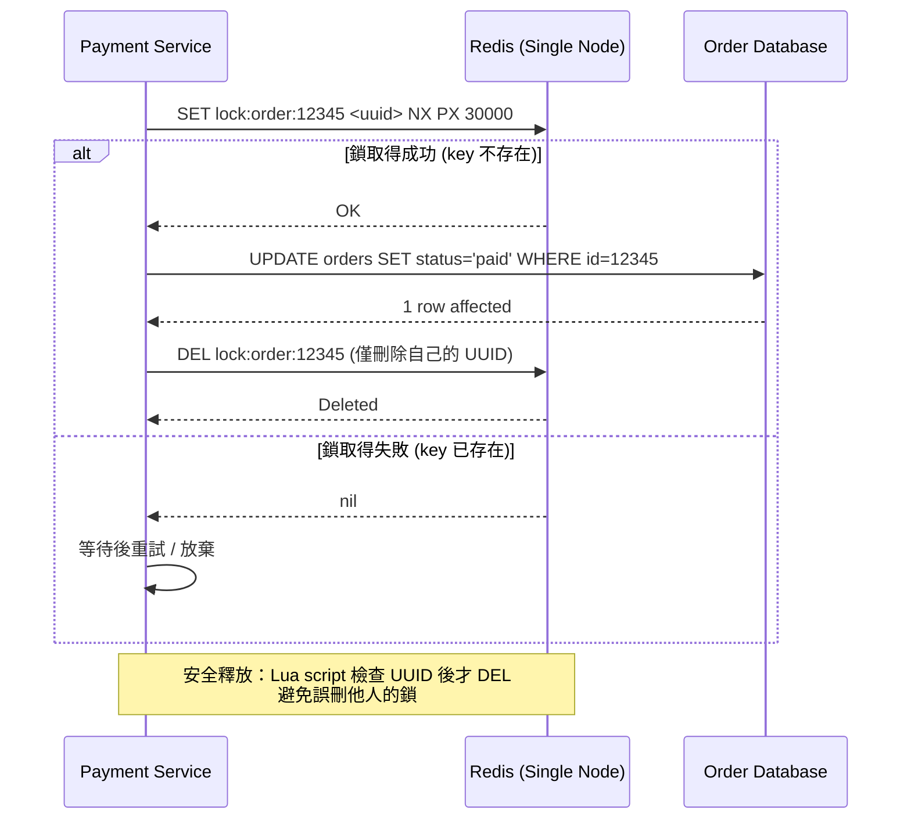
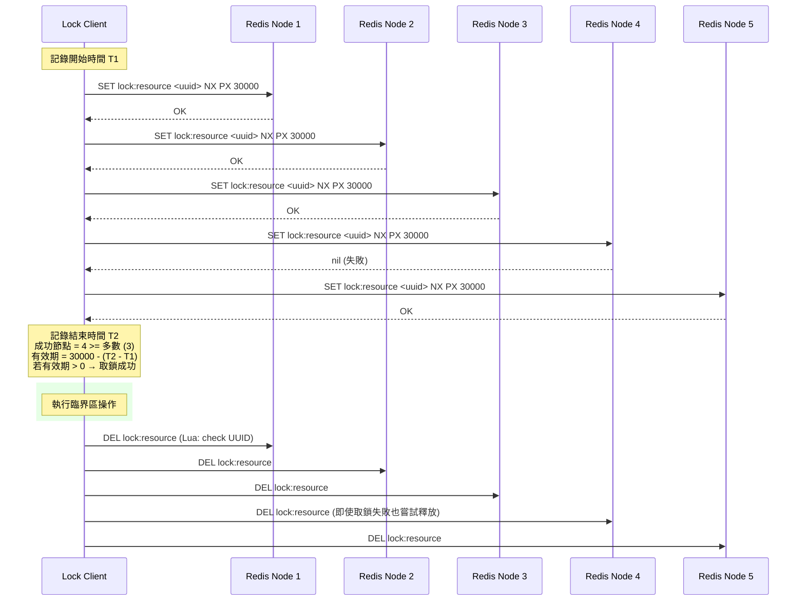
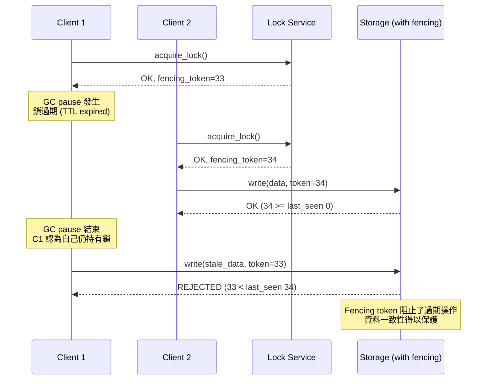

# Distributed Locking / 分散式鎖

## Intent / 意圖

在分散式環境中實現互斥（mutual exclusion），確保同一時間只有一個程序能存取共享資源或執行臨界區（critical section）邏輯。分散式鎖是跨多個節點協調併發操作的基礎機制，解決的是「多個獨立程序如何就『誰擁有控制權』達成一致」的問題。

核心問題：**當多個獨立的服務實例同時嘗試操作同一份共享資源時，如何保證互斥語意，避免資料損壞或業務邏輯錯誤？**

---

## Problem / 問題情境

**場景一：電商平台的重複扣款**

某電商平台有三個 payment service 實例。使用者下單後，因為前端重試或訊息佇列重複投遞，兩個實例幾乎同時收到相同的支付請求：

1. 實例 A 查詢訂單狀態為「待付款」，開始執行扣款流程。
2. 實例 B 同時查詢到訂單狀態仍為「待付款」（A 尚未更新狀態），也開始扣款。
3. 結果：使用者被扣款兩次，客訴湧入，退款流程啟動，品牌信任受損。

**場景二：庫存超賣**

黑色星期五促銷，某商品庫存剩 5 件，但有 10 個服務實例同時處理搶購請求。每個實例各自讀到庫存為 5，各自認為可以扣減，最終賣出了 10 件——實際庫存只有 5 件。若有分散式鎖保護庫存扣減操作，同一時間只有一個實例能進行 check-and-decrement，其餘實例排隊等待，超賣問題就不會發生。

---

## Core Concepts / 核心概念

### Mutual Exclusion / 互斥

分散式鎖最核心的保證：在任意時刻，最多只有一個 client 持有鎖。如果兩個 client 同時認為自己持有鎖（split-brain），互斥語意就被打破，等同於沒有鎖。

### Deadlock Freedom / 無死鎖

即使持有鎖的 client crash 或網路斷開，鎖最終仍能被釋放。Redis 透過 TTL（Time-To-Live）實現自動過期；etcd 透過 lease 機制實現；ZooKeeper 透過 ephemeral node 在 session 斷開後自動刪除。

### Liveness / 活性

系統最終能讓某個 client 成功取得鎖。如果所有等待鎖的 client 永遠無法取得鎖（例如因為 stale lock 永不過期），系統就失去了活性。TTL 和 lease 的設計就是為了保證活性。

### Fencing Token / 隔離令牌

由鎖服務頒發的單調遞增數字。client 取得鎖時獲得一個 fencing token，操作共享資源時附帶此 token。資源端（如資料庫）檢查 token 是否大於等於上一次接受的 token，拒絕持有舊 token 的過期請求。這是 Martin Kleppmann 提出的防護機制，用來解決「client 認為自己仍持有鎖但實際上鎖已過期」的問題。

### Redis SETNX / Redis 原子設定

`SET key value NX PX milliseconds`——Redis 的原子操作，只在 key 不存在時設定值並附帶過期時間。這是 Redis 單節點分散式鎖的基礎。`NX`（Not eXists）保證互斥，`PX`（毫秒級過期）保證 deadlock freedom。

### Redlock Algorithm / Redlock 演算法

由 Redis 作者 Salvatore Sanfilippo（antirez）提出的分散式鎖演算法。使用 N 個（通常 5 個）獨立的 Redis master 節點，client 嘗試依序在所有節點上取鎖，在多數節點（N/2 + 1）成功取得鎖且總耗時小於鎖的有效期時，視為成功取得分散式鎖。

### etcd Lease-Based Lock / etcd 租約鎖

etcd 透過 lease（租約）機制實現分散式鎖。client 建立一個帶有 TTL 的 lease，然後以該 lease 建立一個 key。如果 client crash 或未能及時續約（keepalive），lease 過期後 key 自動刪除，鎖自動釋放。etcd 的 Raft 共識保證了鎖的強一致性。

### ZooKeeper Sequential Ephemeral Nodes / ZooKeeper 順序臨時節點

ZooKeeper 的分散式鎖實作方式。每個 client 在指定路徑下建立一個順序臨時節點（sequential ephemeral znode）。序號最小的節點持有鎖，其他 client watch 前一個節點。當持有鎖的 client 斷線，ephemeral node 自動刪除，下一個 client 獲得鎖。此「羊群效應（herd effect）」的優化避免了所有 client 同時 watch 同一個節點。

### Lock Expiry and Renewal / 鎖過期與續約

鎖的 TTL 必須大於臨界區操作的最長預期時間。如果操作耗時超過 TTL，鎖過期被其他 client 取得，導致互斥失敗。解決方案：(1) 鎖續約（lock renewal / watchdog）——在持有鎖期間定期延長 TTL；(2) fencing token——即使鎖過期，資源端仍能拒絕過期的操作。

### Martin Kleppmann's Critique of Redlock / Martin Kleppmann 對 Redlock 的批評

Martin Kleppmann 在其文章 "How to do distributed locking" 中指出 Redlock 的根本問題：(1) 依賴系統時鐘的準確性——如果某個 Redis 節點發生時鐘跳躍（clock jump），鎖可能提前過期；(2) GC pause、網路延遲等 process pause 會讓 client 在鎖已過期後仍認為自己持有鎖；(3) Redlock 無法提供 fencing token 機制。Kleppmann 建議：如果需要正確性（correctness），使用基於共識的系統（如 ZooKeeper、etcd）；如果只需要效率（efficiency），單節點 Redis 就夠了。

---

## Architecture / 架構

### Redis SETNX 鎖流程



### Redlock 多節點鎖流程



### Fencing Token 防護機制



---

## How It Works / 運作原理

### Redis 單節點鎖

1. **取得鎖**：Client 執行 `SET lock_key <random_uuid> NX PX <ttl_ms>`。`NX` 保證原子性——只有在 key 不存在時才設定成功。`random_uuid` 用來標識鎖的擁有者，避免誤刪他人的鎖。

2. **執行臨界區**：取鎖成功後，Client 執行需要互斥保護的業務邏輯。操作時間應明顯小於鎖的 TTL。

3. **安全釋放鎖**：使用 Lua script 原子地檢查 UUID 並刪除 key。直接用 `DEL` 有風險——如果鎖已過期被其他 Client 取得，`DEL` 會誤刪新擁有者的鎖。Lua script 保證 check-and-delete 的原子性。

4. **鎖過期保護**：如果 Client crash 或網路斷開，TTL 過期後 Redis 自動刪除 key，保證 deadlock freedom。

### Redlock 演算法步驟

1. **取得當前時間**：Client 記錄操作開始的毫秒級時間戳 T1。

2. **依序請求鎖**：Client 嘗試在 N 個獨立的 Redis master 上取鎖（使用相同的 key、相同的 UUID、相同的 TTL）。對每個節點設定一個較短的 timeout（例如 5-50ms），避免某個節點不可用時阻塞太久。

3. **計算結果**：取鎖結束後記錄時間 T2。成功取得鎖的節點數 >= N/2 + 1（多數），且總耗時 `T2 - T1` 小於鎖的 TTL——兩個條件都滿足時才視為取鎖成功。鎖的實際有效時間為 `TTL - (T2 - T1)`。

4. **失敗處理**：如果未達到多數或有效時間已耗盡，Client 向所有節點發送釋放鎖的請求（包括取鎖失敗的節點），然後在隨機延遲後重試。

5. **釋放鎖**：操作完成後，Client 向所有 N 個節點發送釋放鎖的 Lua script。

### Fencing Token 機制

1. **鎖服務維護計數器**：每次成功授予鎖時，遞增一個全域計數器，將計數器當前值作為 fencing token 回傳給 Client。

2. **Client 攜帶 token 操作資源**：Client 對共享資源的每次寫入都附帶 fencing token。

3. **資源端驗證 token**：資源端（例如資料庫）記錄最後一次接受的 token。收到新請求時，只有 token >= last_accepted_token 才接受操作，否則拒絕。

4. **防護效果**：即使 Client A 因為 GC pause 導致鎖過期，Client B 取得新鎖（token 更大），Client A 從 pause 中恢復後的操作會攜帶舊 token，被資源端拒絕。資料一致性得以保護。

---

## Rust 實作

以下實作基於 `redis-rs` 與 `tokio`，包含 TTL 自動過期、重試機制、安全釋放（Lua script），以及 fencing token 支援。

```rust
// distributed_lock.rs
// Redis distributed lock with TTL, retry, fencing token, and safe release

use redis::AsyncCommands;
use std::time::{Duration, Instant};
use tokio::time::sleep;
use uuid::Uuid;

/// 分散式鎖的取得結果
#[derive(Debug)]
struct LockGuard {
    resource_key: String,
    owner_id: String,
    fencing_token: u64,
    acquired_at: Instant,
    ttl: Duration,
}

impl LockGuard {
    fn is_valid(&self) -> bool {
        self.acquired_at.elapsed() < self.ttl
    }
}

/// 分散式鎖管理器
struct DistributedLockManager {
    client: redis::Client,
    fencing_key: String,
}

impl DistributedLockManager {
    fn new(redis_url: &str) -> Result<Self, redis::RedisError> {
        let client = redis::Client::open(redis_url)?;
        Ok(Self {
            client,
            fencing_key: "global:fencing_counter".to_string(),
        })
    }

    /// 取得鎖，支援重試與 fencing token
    async fn acquire(
        &self,
        resource: &str,
        ttl: Duration,
        max_retries: u32,
        retry_delay: Duration,
    ) -> Result<LockGuard, String> {
        let owner_id = Uuid::new_v4().to_string();
        let lock_key = format!("lock:{}", resource);
        let ttl_ms = ttl.as_millis() as u64;

        let mut conn = self
            .client
            .get_multiplexed_async_connection()
            .await
            .map_err(|err| format!("Redis connection failed: {}", err))?;

        for attempt in 0..=max_retries {
            if attempt > 0 {
                println!(
                    "  [RETRY] attempt {}/{} for lock:{}",
                    attempt, max_retries, resource
                );
                sleep(retry_delay).await;
            }

            // 原子操作：SET key value NX PX ttl_ms
            let acquired: bool = redis::cmd("SET")
                .arg(&lock_key)
                .arg(&owner_id)
                .arg("NX")
                .arg("PX")
                .arg(ttl_ms)
                .query_async::<bool>(&mut conn)
                .await
                .unwrap_or(false);

            if acquired {
                // 遞增 fencing token（原子 INCR）
                let fencing_token: u64 = conn
                    .incr(&self.fencing_key, 1u64)
                    .await
                    .map_err(|err| format!("Fencing token INCR failed: {}", err))?;

                println!(
                    "[LOCK-ACQUIRED] resource={}, owner={}, token={}, ttl={}ms",
                    resource,
                    &owner_id[..8],
                    fencing_token,
                    ttl_ms
                );

                return Ok(LockGuard {
                    resource_key: lock_key,
                    owner_id,
                    fencing_token,
                    acquired_at: Instant::now(),
                    ttl,
                });
            }
        }

        Err(format!(
            "Failed to acquire lock:{} after {} retries",
            resource, max_retries
        ))
    }

    /// 安全釋放鎖：Lua script 確保只刪除自己擁有的鎖
    async fn release(&self, guard: &LockGuard) -> Result<(), String> {
        let mut conn = self
            .client
            .get_multiplexed_async_connection()
            .await
            .map_err(|err| format!("Redis connection failed: {}", err))?;

        // Lua script: 檢查 value 是否為自己的 UUID，是才刪除
        let unlock_script = redis::Script::new(
            r#"
            if redis.call("GET", KEYS[1]) == ARGV[1] then
                return redis.call("DEL", KEYS[1])
            else
                return 0
            end
            "#,
        );

        let result: i32 = unlock_script
            .key(&guard.resource_key)
            .arg(&guard.owner_id)
            .invoke_async(&mut conn)
            .await
            .map_err(|err| format!("Unlock script failed: {}", err))?;

        if result == 1 {
            println!(
                "[LOCK-RELEASED] resource={}, owner={}",
                guard.resource_key,
                &guard.owner_id[..8]
            );
            Ok(())
        } else {
            println!(
                "[LOCK-EXPIRED] resource={}, owner={} (lock already expired or stolen)",
                guard.resource_key,
                &guard.owner_id[..8]
            );
            Err("Lock was already released or expired".to_string())
        }
    }
}

/// 模擬受 fencing token 保護的資源端
struct FencedStorage {
    last_accepted_token: u64,
    data: std::collections::HashMap<String, String>,
}

impl FencedStorage {
    fn new() -> Self {
        Self {
            last_accepted_token: 0,
            data: std::collections::HashMap::new(),
        }
    }

    fn write(&mut self, key: &str, value: &str, fencing_token: u64) -> Result<(), String> {
        if fencing_token < self.last_accepted_token {
            println!(
                "  [STORAGE-REJECT] token={} < last_accepted={}, write rejected",
                fencing_token, self.last_accepted_token
            );
            return Err(format!(
                "Stale fencing token: {} < {}",
                fencing_token, self.last_accepted_token
            ));
        }
        self.last_accepted_token = fencing_token;
        self.data.insert(key.to_string(), value.to_string());
        println!(
            "  [STORAGE-ACCEPT] token={}, key={}, value={}",
            fencing_token, key, value
        );
        Ok(())
    }
}

#[tokio::main]
async fn main() {
    println!("=== Distributed Lock with Fencing Token (Rust) ===\n");

    // 模擬場景：兩個 payment service 實例競爭處理同一筆訂單
    let lock_mgr = DistributedLockManager::new("redis://127.0.0.1:6379/")
        .expect("Failed to create lock manager");

    let ttl = Duration::from_secs(30);
    let retry_delay = Duration::from_millis(100);

    // Service A 取得鎖
    println!("--- Service A: attempting to acquire lock ---");
    let guard_a = lock_mgr
        .acquire("order:98765", ttl, 3, retry_delay)
        .await
        .expect("Service A should acquire lock");

    // Service B 嘗試取鎖（應失敗並重試直到放棄）
    println!("\n--- Service B: attempting to acquire lock (will fail) ---");
    let result_b = lock_mgr
        .acquire("order:98765", ttl, 2, retry_delay)
        .await;
    println!("Service B result: {:?}\n", result_b.err());

    // Service A 使用 fencing token 寫入資料
    let mut storage = FencedStorage::new();
    println!("--- Service A: writing with fencing token ---");
    storage
        .write(
            "order:98765:status",
            "paid",
            guard_a.fencing_token,
        )
        .unwrap();

    // 模擬過期的操作（使用舊 token）
    println!("\n--- Simulating stale write with old token ---");
    let stale_result = storage.write(
        "order:98765:status",
        "paid_duplicate",
        guard_a.fencing_token - 1,
    );
    println!("Stale write result: {:?}\n", stale_result.err());

    // Service A 釋放鎖
    println!("--- Service A: releasing lock ---");
    lock_mgr
        .release(&guard_a)
        .await
        .expect("Release should succeed");

    // 鎖釋放後 Service B 可以取得
    println!("\n--- Service B: retrying after lock released ---");
    let guard_b = lock_mgr
        .acquire("order:98765", ttl, 3, retry_delay)
        .await
        .expect("Service B should now acquire lock");

    println!("\nService B fencing token: {}", guard_b.fencing_token);
    println!("Lock is valid: {}", guard_b.is_valid());

    lock_mgr.release(&guard_b).await.unwrap();
}

// Output:
// === Distributed Lock with Fencing Token (Rust) ===
//
// --- Service A: attempting to acquire lock ---
// [LOCK-ACQUIRED] resource=order:98765, owner=a1b2c3d4, token=1, ttl=30000ms
//
// --- Service B: attempting to acquire lock (will fail) ---
//   [RETRY] attempt 1/2 for lock:order:98765
//   [RETRY] attempt 2/2 for lock:order:98765
// Service B result: Some("Failed to acquire lock:order:98765 after 2 retries")
//
// --- Service A: writing with fencing token ---
//   [STORAGE-ACCEPT] token=1, key=order:98765:status, value=paid
//
// --- Simulating stale write with old token ---
//   [STORAGE-REJECT] token=0 < last_accepted=1, write rejected
// Stale write result: Some("Stale fencing token: 0 < 1")
//
// --- Service A: releasing lock ---
// [LOCK-RELEASED] resource=lock:order:98765, owner=a1b2c3d4
//
// --- Service B: retrying after lock released ---
// [LOCK-ACQUIRED] resource=order:98765, owner=e5f6g7h8, token=2, ttl=30000ms
//
// Service B fencing token: 2
// Lock is valid: true
```

---

## Go 實作

以 Go 1.24+ 與 `go-redis/redis/v9` 實作等價的分散式鎖，包含 TTL、重試、Lua script 安全釋放與 fencing token。

```go
// distributed_lock.go
// Redis distributed lock with TTL, retry, fencing token, and safe release

package main

import (
	"context"
	"fmt"
	"sync"
	"time"

	"github.com/google/uuid"
	"github.com/redis/go-redis/v9"
)

// LockGuard 封裝鎖取得結果
type LockGuard struct {
	ResourceKey  string
	OwnerID      string
	FencingToken uint64
	AcquiredAt   time.Time
	TTL          time.Duration
}

// IsValid 檢查鎖是否仍在有效期內
func (g *LockGuard) IsValid() bool {
	return time.Since(g.AcquiredAt) < g.TTL
}

// DistributedLockManager 管理 Redis 分散式鎖
type DistributedLockManager struct {
	client     *redis.Client
	fencingKey string
}

// NewDistributedLockManager 建立鎖管理器
func NewDistributedLockManager(redisAddr string) *DistributedLockManager {
	client := redis.NewClient(&redis.Options{
		Addr: redisAddr,
	})
	return &DistributedLockManager{
		client:     client,
		fencingKey: "global:fencing_counter",
	}
}

// Acquire 取得鎖，支援重試與 fencing token
func (m *DistributedLockManager) Acquire(
	ctx context.Context,
	resource string,
	ttl time.Duration,
	maxRetries int,
	retryDelay time.Duration,
) (*LockGuard, error) {
	ownerID := uuid.New().String()
	lockKey := fmt.Sprintf("lock:%s", resource)

	for attempt := 0; attempt <= maxRetries; attempt++ {
		if attempt > 0 {
			fmt.Printf("  [RETRY] attempt %d/%d for lock:%s\n",
				attempt, maxRetries, resource)
			time.Sleep(retryDelay)
		}

		// 原子操作：SET key value NX PX ttl_ms
		acquired, err := m.client.SetNX(ctx, lockKey, ownerID, ttl).Result()
		if err != nil {
			return nil, fmt.Errorf("redis SET NX failed: %w", err)
		}

		if acquired {
			// 遞增 fencing token（原子 INCR）
			fencingToken, err := m.client.Incr(ctx, m.fencingKey).Result()
			if err != nil {
				// 取鎖成功但 fencing token 失敗，需釋放鎖
				m.client.Del(ctx, lockKey)
				return nil, fmt.Errorf("fencing token INCR failed: %w", err)
			}

			fmt.Printf("[LOCK-ACQUIRED] resource=%s, owner=%s, token=%d, ttl=%v\n",
				resource, ownerID[:8], fencingToken, ttl)

			return &LockGuard{
				ResourceKey:  lockKey,
				OwnerID:      ownerID,
				FencingToken: uint64(fencingToken),
				AcquiredAt:   time.Now(),
				TTL:          ttl,
			}, nil
		}
	}

	return nil, fmt.Errorf("failed to acquire lock:%s after %d retries",
		resource, maxRetries)
}

// Release 安全釋放鎖：Lua script 確保只刪除自己擁有的鎖
func (m *DistributedLockManager) Release(
	ctx context.Context,
	guard *LockGuard,
) error {
	// Lua script: 檢查 value 是否為自己的 UUID，是才刪除
	unlockScript := redis.NewScript(`
		if redis.call("GET", KEYS[1]) == ARGV[1] then
			return redis.call("DEL", KEYS[1])
		else
			return 0
		end
	`)

	result, err := unlockScript.Run(ctx, m.client,
		[]string{guard.ResourceKey}, guard.OwnerID).Int()
	if err != nil {
		return fmt.Errorf("unlock script failed: %w", err)
	}

	if result == 1 {
		fmt.Printf("[LOCK-RELEASED] resource=%s, owner=%s\n",
			guard.ResourceKey, guard.OwnerID[:8])
		return nil
	}

	fmt.Printf("[LOCK-EXPIRED] resource=%s, owner=%s (already expired or stolen)\n",
		guard.ResourceKey, guard.OwnerID[:8])
	return fmt.Errorf("lock was already released or expired")
}

// FencedStorage 模擬受 fencing token 保護的資源端
type FencedStorage struct {
	mu                sync.Mutex
	lastAcceptedToken uint64
	data              map[string]string
}

// NewFencedStorage 建立 fenced storage
func NewFencedStorage() *FencedStorage {
	return &FencedStorage{
		data: make(map[string]string),
	}
}

// Write 寫入資料，驗證 fencing token
func (s *FencedStorage) Write(key, value string, fencingToken uint64) error {
	s.mu.Lock()
	defer s.mu.Unlock()

	if fencingToken < s.lastAcceptedToken {
		fmt.Printf("  [STORAGE-REJECT] token=%d < last_accepted=%d, write rejected\n",
			fencingToken, s.lastAcceptedToken)
		return fmt.Errorf("stale fencing token: %d < %d",
			fencingToken, s.lastAcceptedToken)
	}

	s.lastAcceptedToken = fencingToken
	s.data[key] = value
	fmt.Printf("  [STORAGE-ACCEPT] token=%d, key=%s, value=%s\n",
		fencingToken, key, value)
	return nil
}

func main() {
	fmt.Println("=== Distributed Lock with Fencing Token (Go) ===")
	fmt.Println()

	ctx := context.Background()
	lockMgr := NewDistributedLockManager("127.0.0.1:6379")

	ttl := 30 * time.Second
	retryDelay := 100 * time.Millisecond

	// Service A 取得鎖
	fmt.Println("--- Service A: attempting to acquire lock ---")
	guardA, err := lockMgr.Acquire(ctx, "order:98765", ttl, 3, retryDelay)
	if err != nil {
		fmt.Printf("Service A failed: %s\n", err)
		return
	}

	// Service B 嘗試取鎖（應失敗）
	fmt.Println()
	fmt.Println("--- Service B: attempting to acquire lock (will fail) ---")
	_, errB := lockMgr.Acquire(ctx, "order:98765", ttl, 2, retryDelay)
	fmt.Printf("Service B result: %v\n", errB)
	fmt.Println()

	// Service A 使用 fencing token 寫入
	storage := NewFencedStorage()
	fmt.Println("--- Service A: writing with fencing token ---")
	storage.Write("order:98765:status", "paid", guardA.FencingToken)

	// 模擬過期操作
	fmt.Println()
	fmt.Println("--- Simulating stale write with old token ---")
	staleErr := storage.Write("order:98765:status", "paid_duplicate",
		guardA.FencingToken-1)
	fmt.Printf("Stale write result: %v\n", staleErr)
	fmt.Println()

	// Service A 釋放鎖
	fmt.Println("--- Service A: releasing lock ---")
	if err := lockMgr.Release(ctx, guardA); err != nil {
		fmt.Printf("Release failed: %s\n", err)
		return
	}

	// Service B 重試取鎖
	fmt.Println()
	fmt.Println("--- Service B: retrying after lock released ---")
	guardB, err := lockMgr.Acquire(ctx, "order:98765", ttl, 3, retryDelay)
	if err != nil {
		fmt.Printf("Service B still failed: %s\n", err)
		return
	}

	fmt.Printf("\nService B fencing token: %d\n", guardB.FencingToken)
	fmt.Printf("Lock is valid: %v\n", guardB.IsValid())

	lockMgr.Release(ctx, guardB)
}

// Output:
// === Distributed Lock with Fencing Token (Go) ===
//
// --- Service A: attempting to acquire lock ---
// [LOCK-ACQUIRED] resource=order:98765, owner=a1b2c3d4, token=1, ttl=30s
//
// --- Service B: attempting to acquire lock (will fail) ---
//   [RETRY] attempt 1/2 for lock:order:98765
//   [RETRY] attempt 2/2 for lock:order:98765
// Service B result: failed to acquire lock:order:98765 after 2 retries
//
// --- Service A: writing with fencing token ---
//   [STORAGE-ACCEPT] token=1, key=order:98765:status, value=paid
//
// --- Simulating stale write with old token ---
//   [STORAGE-REJECT] token=0 < last_accepted=1, write rejected
// Stale write result: stale fencing token: 0 < 1
//
// --- Service A: releasing lock ---
// [LOCK-RELEASED] resource=lock:order:98765, owner=a1b2c3d4
//
// --- Service B: retrying after lock released ---
// [LOCK-ACQUIRED] resource=order:98765, owner=e5f6g7h8, token=2, ttl=30s
//
// Service B fencing token: 2
// Lock is valid: true
```

---

## Rust vs Go 對照表

| 面向 | Rust (redis-rs + tokio) | Go 1.24+ (go-redis) |
|---|---|---|
| **鎖釋放安全性** | `LockGuard` 可搭配 `Drop` trait 實現 RAII 自動釋放——當 guard 離開 scope 時自動觸發 Lua script 釋放鎖。編譯器保證 guard 不會被意外 clone 或遺忘（透過不實作 `Clone`），從型別系統層面防止 double-release 或忘記 release | Go 沒有 RAII 機制，必須依賴 `defer lockMgr.Release(ctx, guard)` 確保釋放。如果 `defer` 寫在函式開頭之前就 panic，鎖不會被釋放。開發者需要養成習慣在 `Acquire` 成功後立即 `defer Release` |
| **TTL 時間處理** | `std::time::Duration` 和 `Instant` 提供型別安全的時間操作。`Duration::from_secs(30)` 和 `Duration::from_millis(100)` 在編譯期就保證了時間單位正確，不可能因為「秒」和「毫秒」混淆而設定錯誤的 TTL | `time.Duration` 以 nanosecond 為基本單位，`30 * time.Second` 語義清楚。但 `time.Sleep(100)` 這種省略單位的寫法只是 sleep 100 奈秒而非毫秒，是常見的 bug 來源。Go 的 `time.Now()` 使用 wall clock 而非 monotonic clock，在 NTP 調整時可能造成 TTL 計算偏差（Go 1.9+ 的 `time.Since` 已修正此問題使用 monotonic reading） |
| **並行重試的錯誤聚合** | `Result<T, E>` 搭配 `?` 運算子可以精確傳播每一步的錯誤。多個 Redlock 節點的取鎖結果可以用 `Vec<Result<_, _>>` 收集，再用 iterator 的 `filter`/`count` 判斷是否達到多數，型別系統保證每個錯誤路徑都被處理 | 多值回傳 `(result, error)` 配合 `if err != nil` 檢查。在 Redlock 多節點場景中，需要手動維護 `successCount` 和 `errors` slice，邏輯正確但較為冗長。Go 1.20+ 的 `errors.Join` 可以合併多個 error |
| **Lua script 嵌入** | `redis::Script::new(r#"..."#)` 使用 raw string literal，Lua script 可以直接嵌入不需要轉義引號。Script 物件可以在多個 connection 間重用（Script 內部會快取 SHA1 hash） | `redis.NewScript()` 接受 backtick raw string，同樣不需要轉義。go-redis 的 Script 也支援 EVALSHA 快取，行為與 Rust 版本等價 |

---

## When to Use / 適用場景

### 1. Leader Election / 領導者選舉

在微服務架構中，排程任務（如每小時一次的報表生成、過期訂單清理）只能由一個實例執行。多個實例透過分散式鎖競爭成為 leader：持有鎖的實例負責執行任務，其他實例待命。如果 leader crash，鎖過期後由其他實例接手。etcd 的 election recipe 和 Redis 的 Redlock 都是常見選擇。

### 2. Resource Deduplication / 資源去重

支付系統中的冪等性保證。當同一筆支付請求因為重試而多次到達不同服務實例時，分散式鎖確保只有第一個請求能執行扣款邏輯。鎖的 key 以訂單 ID 為唯一標識（如 `lock:payment:order-12345`），後續的重複請求因無法取鎖而跳過。

### 3. Distributed Rate Limiting / 分散式限流

多實例部署的 API gateway 需要跨節點協調限流計數。雖然可以用 Redis INCR 原子計數，但在需要精確控制的場景（如嚴格的每秒 100 次限制），分散式鎖保護的 check-and-increment 能提供更強的保證。

---

## When NOT to Use / 不適用場景

### 1. 極低延遲的效能關鍵路徑

分散式鎖本質上引入了一次（或多次）網路往返。Redis 單節點鎖至少需要一次 RTT（通常 0.5-2ms），Redlock 需要 N 次 RTT。如果臨界區操作本身只需要微秒級時間（如記憶體內的計數器遞增），鎖的開銷遠大於操作本身。此時應考慮無鎖演算法（lock-free）如 CAS（Compare-And-Swap）、或基於分片（sharding）的設計避免競爭。

### 2. 單節點環境或單一程序

如果應用只有一個實例或只部署在單一節點上，使用語言內建的互斥機制（Rust 的 `Mutex<T>`、Go 的 `sync.Mutex`）即可，無需引入外部依賴。分散式鎖的價值在於跨程序、跨機器的協調——單程序內使用是殺雞用牛刀，還增加了對 Redis/etcd 的可用性依賴。

### 3. 需要嚴格正確性但只使用 Redis

如果業務場景對正確性要求極高（如金融交易、醫療紀錄），單靠 Redis（包括 Redlock）可能不夠。Redis 不提供共識保證——主從切換時鎖可能丟失，Redlock 依賴系統時鐘。此時應使用基於 Raft/Paxos 共識的系統（etcd、ZooKeeper、Consul），它們在網路分區和節點故障時仍能提供強一致性保證。

---

## Real-World Examples / 真實世界案例

### Redis 官方 Redlock

Redis 官方文件中描述的 Redlock 演算法被廣泛應用於需要「比單節點更可靠但不需要共識級正確性」的場景。Redisson（Java）、redsync（Go）等客戶端程式庫實作了 Redlock。典型應用：分散式排程器的 leader election、跨實例的冪等性保護。但自 Martin Kleppmann 的批評後，社群對 Redlock 的信任度下降，越來越多團隊在需要正確性時轉向 etcd。

### etcd 在 Kubernetes 中的應用

Kubernetes 的所有叢集狀態（Pod、Service、ConfigMap 等）儲存在 etcd 中。kube-apiserver 透過 etcd 的 lease 機制實現 leader election——多個 apiserver 實例競爭一個 lease，持有 lease 的實例成為 leader 負責處理 watch 和 mutation。etcd 基於 Raft 的強一致性保證了在任意時刻最多只有一個 leader，避免了 split-brain。

### ZooKeeper 在 Kafka 中的應用

Apache Kafka（3.0 之前的版本）使用 ZooKeeper 管理 broker 的 controller election、partition leadership 分配、consumer group 的 offset 協調。ZooKeeper 的 ephemeral node 自動在 broker 斷線時觸發重新選舉，保證叢集的高可用性。Kafka 3.0+ 引入 KRaft 模式，用內建的 Raft 實作替代了 ZooKeeper 依賴，但原理相同——透過共識演算法實現分散式鎖和 leader election。

---

## Interview Questions / 面試常見問題

### Q1: Redlock 演算法的核心假設是什麼？Martin Kleppmann 的批評要點為何？

**A:** Redlock 假設：(1) 各 Redis 節點的時鐘以相近的速率運行（bounded clock drift）；(2) 程序不會在持有鎖期間發生長時間 pause。Kleppmann 的批評指出這兩個假設在真實環境中不可靠——NTP 時鐘調整可能導致某節點上的鎖提前過期，GC pause 或 page fault 可能讓 client 在鎖過期後仍認為自己持有鎖。Kleppmann 的建議是：用共識系統（etcd/ZooKeeper）獲得正確性，或用單節點 Redis 獲得效率，Redlock 「兩者都不是」。

### Q2: 為什麼不能直接用 DEL 釋放鎖？需要 Lua script 做什麼？

**A:** 直接 DEL 存在一個 race condition：Client A 的鎖已過期，Client B 取得了新鎖。此時 Client A 的業務邏輯才完成，執行 DEL 會刪除 Client B 的鎖。Lua script 先 `GET` 檢查 key 的值是否等於自己的 UUID，是才 `DEL`——這兩步在 Redis 中是原子執行的（Redis 的 Lua 執行是 single-threaded 且不可中斷），避免了 TOCTOU（Time-of-Check-to-Time-of-Use）問題。

### Q3: Fencing token 如何防止已過期鎖的操作汙染資料？

**A:** 鎖服務每次授予鎖時頒發一個單調遞增的 token。Client 操作共享資源時必須附帶此 token。資源端（如資料庫）維護 `last_accepted_token`，只接受 token >= last_accepted_token 的操作。即使 Client A 因 GC pause 導致鎖過期，Client B 取得新鎖（token 更大）後操作資源，Client A 恢復後帶著舊 token 的操作會被拒絕。前提是資源端必須支援 fencing token 驗證。

### Q4: Redis 主從架構中，分散式鎖可能遇到什麼問題？

**A:** Redis 的主從複製是非同步的。Client 在 master 上成功取鎖後，如果 master 在將鎖複製到 slave 之前 crash，slave 升級為新 master 後該鎖不存在。另一個 Client 可以在新 master 上取得相同的鎖——互斥被打破。這正是 Redlock 試圖解決的問題（使用多個獨立的 master），但 Kleppmann 認為 Redlock 也未能完全解決。

### Q5: etcd 的 lease-based lock 與 Redis SETNX lock 的本質差異是什麼？

**A:** 核心差異在於一致性保證。etcd 基於 Raft 共識——鎖的建立和續約都經過多數節點確認並寫入 WAL，即使 leader crash 也不會丟失。Redis SETNX 是單節點操作，master crash 時鎖可能丟失。etcd 的 lease keepalive 是透過共識確認的續約，而 Redis 的 TTL 延長（`PEXPIRE`）僅在單節點生效。代價是 etcd 的延遲更高（每次操作都走 Raft），吞吐量也低於 Redis。

---

## Pitfalls / 常見陷阱

### 1. 時鐘偏移（Clock Skew）破壞 Redlock 安全性

Redlock 演算法假設所有 Redis 節點的系統時鐘以相近速率運行。如果某個節點因為 NTP 時鐘跳躍（clock jump）使得鎖的 TTL 提前到期，Client A 可能仍認為自己持有鎖（根據本地計算的有效期），但該節點上的鎖已被刪除，Client B 可以在該節點上取鎖成功。當受影響的節點恰好構成了 B 的多數，互斥就被打破了。

**對策**：在需要正確性的場景使用基於共識的鎖（etcd/ZooKeeper），或搭配 fencing token。

### 2. GC Pause 導致鎖持有者在鎖過期後仍執行操作

無論使用哪種語言，JVM 的 Full GC、Go 的 GC、甚至 Rust 中調用的外部 C 程式庫的 memory allocator 都可能導致程序暫停。在暫停期間，鎖的 TTL 持續倒數。暫停結束後，Client 檢查本地的鎖狀態（可能快取了取鎖時間和 TTL），認為鎖仍有效——但實際上鎖已過期。

```rust
// 危險模式：只檢查本地時間判斷鎖是否有效
async fn process_payment(guard: &LockGuard) {
    // 假設此處發生了 3 秒的 pause（外部 C FFI 呼叫阻塞）
    // 鎖的 TTL 為 5 秒，pause 結束後鎖已過期但 is_valid() 仍可能回傳 true
    // （如果 pause 發生在 is_valid 檢查之前）
    if guard.is_valid() {
        // 此時鎖可能已被他人取得
        execute_deduction().await; // 危險：可能與持有新鎖的 client 併發執行
    }
}
```

**對策**：搭配 fencing token，讓資源端（而非 client）做最終裁決。

### 3. 未使用 Fencing Token 導致的資料損壞

許多分散式鎖的實作教學只展示了 SETNX + TTL + Lua DEL，沒有提到 fencing token。這種鎖只提供「best-effort」的互斥——在大多數情況下有效，但在 process pause、網路延遲等極端情況下會失敗。如果業務場景對正確性有要求（如支付、庫存），沒有 fencing token 的鎖方案是不完整的。

**對策**：在鎖服務中加入 fencing token 機制，並在所有共享資源的寫入路徑上驗證 token。

### 4. Rust：跨 `.await` 持有 `MutexGuard` 導致的非 `Send` 錯誤

Rust 的 `std::sync::MutexGuard` 不是 `Send` 的，不能跨 `.await` 點持有。在分散式鎖場景中，如果將 Redis 操作結果暫存在 `std::sync::Mutex` 保護的變數中，並在持有 guard 時 `.await` Redis 呼叫，編譯器會報錯。

```rust
use std::sync::Mutex;

struct LockState {
    active_locks: Mutex<Vec<String>>,
}

async fn bad_acquire(state: &LockState) {
    let mut locks = state.active_locks.lock().unwrap();
    // 編譯錯誤：MutexGuard 不是 Send，不能跨 await
    // redis_client.set_nx("key", "value").await;
    locks.push("new_lock".to_string());
}

// 正確：使用 tokio::sync::Mutex 或縮小 guard scope
async fn good_acquire(state: &LockState) {
    // 先完成 async 操作
    let lock_result = redis_set_nx("key", "value").await;
    // 再持有 guard 更新本地狀態
    let mut locks = state.active_locks.lock().unwrap();
    if lock_result {
        locks.push("new_lock".to_string());
    }
}

async fn redis_set_nx(_key: &str, _value: &str) -> bool { true }
```

### 5. Go：context 取消後仍嘗試操作 Redis 導致的靜默失敗

在 Go 中，如果 `context` 已被取消（例如 HTTP request timeout），`go-redis` 的操作會立即回傳 `context canceled` 錯誤。如果釋放鎖的 `Release` 方法使用了已取消的 context，鎖不會被釋放，只能等待 TTL 過期——這會阻塞其他 client 取鎖。

```go
func handlePayment(w http.ResponseWriter, r *http.Request) {
    ctx := r.Context() // 此 context 會在 request timeout 時被取消

    guard, err := lockMgr.Acquire(ctx, "order:123", 30*time.Second, 3, 100*time.Millisecond)
    if err != nil {
        http.Error(w, "lock failed", http.StatusConflict)
        return
    }
    // 危險：如果 processOrder 超時導致 ctx 被取消，
    // defer 中的 Release 會因為 context canceled 而失敗
    defer lockMgr.Release(ctx, guard)

    processOrder(ctx)
}

// 正確：釋放鎖時使用獨立的 background context
func handlePaymentSafe(w http.ResponseWriter, r *http.Request) {
    ctx := r.Context()

    guard, err := lockMgr.Acquire(ctx, "order:123", 30*time.Second, 3, 100*time.Millisecond)
    if err != nil {
        http.Error(w, "lock failed", http.StatusConflict)
        return
    }
    // 正確：釋放鎖使用 background context，不受 request 取消影響
    defer lockMgr.Release(context.Background(), guard)

    processOrder(ctx)
}

func processOrder(ctx context.Context) {}
```

### 6. 鎖的粒度太粗導致吞吐量崩潰

對整張表或整個服務加一把鎖（如 `lock:payments`）會把所有操作序列化。應該根據業務實體設計鎖的粒度——例如 `lock:payment:order-12345` 只鎖定單筆訂單，不同訂單可以並行處理。過粗的鎖粒度等同於把分散式系統退化為單執行緒系統。

---

## Cross-references / 交叉引用

- [[../../database/postgres_lock_troubleshooting|PostgreSQL Lock Troubleshooting / PostgreSQL 鎖問題排查]] — 分散式鎖解決的是跨程序、跨節點的互斥問題，而 PostgreSQL 的 advisory lock 和 row-level lock 解決的是單一資料庫內的併發控制。兩者互補：當多個服務實例共用同一個 PostgreSQL 時，可以考慮用 `pg_advisory_lock` 替代 Redis 分散式鎖——減少外部依賴。排查 PostgreSQL 的鎖等待和死鎖問題時，理解分散式鎖的 TTL 和 fencing token 概念有助於設計更健壯的重試邏輯。
- [[12_cap_consistency_models|CAP Theorem & Consistency Models / CAP 定理與一致性模型]] — 分散式鎖的選型本質上是 CAP 取捨：Redis 單節點鎖在效率端（AP 傾向），etcd/ZooKeeper 在正確性端（CP 傾向）。理解 CAP 定理能幫助判斷何時需要 Redlock 以上的保證、何時單節點 Redis 就足夠。

---

## References / 參考資料

1. **How to do distributed locking** — Martin Kleppmann, 2016. (https://martin.kleppmann.com/2016/02/08/how-to-do-distributed-locking.html) 對 Redlock 演算法的深入分析與批評，提出 fencing token 作為正確性保證的關鍵機制。分散式鎖必讀文章。
2. **Distributed Locks with Redis (Redlock)** — Redis 官方文件. (https://redis.io/docs/manual/patterns/distributed-locks/) antirez 提出的 Redlock 演算法規格，包含單節點鎖和多節點 Redlock 的完整描述。
3. **Designing Data-Intensive Applications (DDIA)** — Martin Kleppmann
   - Chapter 8: The Trouble with Distributed Systems — 討論 process pause、clock skew 等對分散式鎖的影響
   - Chapter 9: Consistency and Consensus — 深入探討基於共識的鎖與 leader election
4. **etcd Documentation: Distributed Locks** — (https://etcd.io/docs/v3.5/dev-guide/api_concurrency_reference_v3/) etcd 的 concurrency API，包含 Lock、Election、STM（Software Transactional Memory）等分散式協調原語的使用方式。
5. **Is Redlock Safe?** — antirez 對 Kleppmann 批評的回應. (http://antirez.com/news/101) 提供了 Redlock 設計者的視角，有助於全面理解兩方的論點。
6. **ZooKeeper Recipes: Locks** — Apache ZooKeeper 官方文件. 描述基於 sequential ephemeral node 的分散式鎖實作，包含避免羊群效應的最佳實踐。
