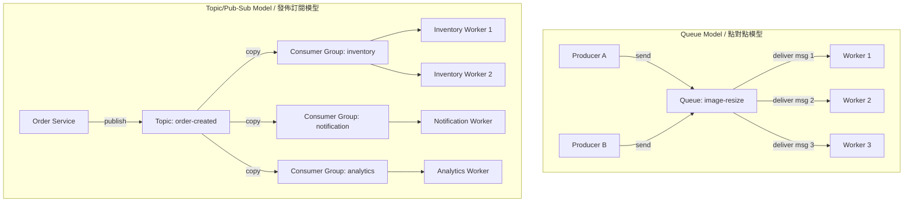
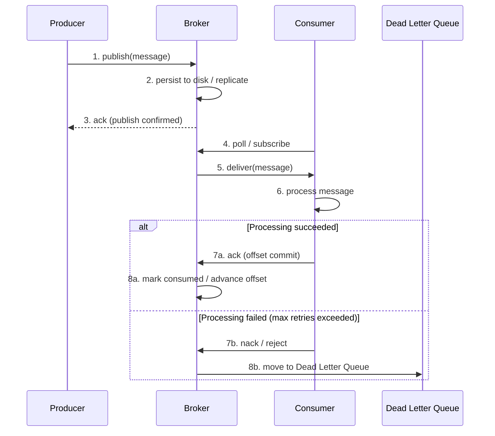

# Message Queue Fundamentals / 訊息佇列基礎

## Intent / 意圖

將訊息的生產者（producer）與消費者（consumer）解耦，透過中介的 broker 實現非同步通訊，提升系統的可靠性、可擴展性與容錯能力。當一個服務需要通知另一個服務「某件事發生了」，但不需要（也不應該）等待對方處理完畢時，訊息佇列是最自然的解決方案。

核心問題：**當服務之間存在速度差異、可用性差異、或需要將瞬間流量削峰填谷時，如何在不丟失訊息的前提下實現可靠的非同步通訊？**

---

## Problem / 問題情境

**場景一：同步處理瓶頸**

電商平台的訂單服務在使用者下單後，需要同步呼叫庫存服務、支付服務、通知服務、物流服務。每個下游服務的回應時間約 200ms，四個服務串聯就是 800ms 以上。如果任一下游服務暫時不可用，整筆訂單就失敗——即使訂單本身已通過驗證。使用者體驗極差，系統耦合度極高。

**場景二：服務崩潰時訊息遺失**

促銷活動期間，通知服務因流量暴增而崩潰。所有在崩潰期間產生的「訂單成功」事件永遠遺失——使用者付了錢卻收不到任何確認通知。系統恢復後也無法補發，因為事件根本沒有被記錄。如果訂單服務與通知服務之間有訊息佇列，事件會被持久化在 broker 中，通知服務重啟後可以從上次的消費位點繼續處理，不會遺漏任何訊息。

---

## Core Concepts / 核心概念

### Queue vs Topic / 佇列與主題

**Queue（點對點模型）**：一條訊息只被一個消費者處理。多個消費者從同一個 queue 拉取訊息時，broker 保證每條訊息只投遞給其中一個——適合任務分派（work distribution）。例如：多個 worker 處理圖片壓縮任務。

**Topic（發佈/訂閱模型）**：一條訊息被所有訂閱者接收。每個訂閱者都收到訊息的完整副本——適合事件廣播（event broadcasting）。例如：「訂單建立」事件同時通知庫存服務、通知服務、分析服務。

### Producer / Consumer / Broker

- **Producer（生產者）**：發送訊息到 broker 的應用程式。負責序列化訊息、選擇目標 queue/topic、處理發送失敗的重試。
- **Consumer（消費者）**：從 broker 接收並處理訊息的應用程式。負責反序列化、業務處理、回報處理結果（ack/nack）。
- **Broker（代理/伺服器）**：訊息的中介，負責接收、儲存、路由與投遞訊息。是系統中的有狀態元件，需要關注其持久化、複製與可用性。

### Delivery Semantics / 投遞語意

- **At-Most-Once（最多一次）**：訊息發送後不重試，消費者不回報確認。最快但可能丟失訊息。適合可容忍遺失的場景（如即時指標統計）。
- **At-Least-Once（至少一次）**：broker 持久化訊息並等待消費者確認。未收到 ack 則重新投遞。不會丟訊息但可能重複——消費者必須實作冪等性（idempotency）。這是最常見的生產環境選擇。
- **Exactly-Once（恰好一次）**：每條訊息被且僅被處理一次。需要 broker 與消費者之間的事務性協調（如 Kafka 的 transactional API + idempotent producer）。代價最高、實作最複雜，在分散式系統中通常透過「at-least-once + 消費端冪等」來逼近。

### Message Ordering / 訊息排序

全域排序（global ordering）代價極高——所有訊息必須通過單一 partition。實務上使用 partition-level ordering：同一個 partition key（如 user ID、order ID）的訊息保證有序，不同 key 的訊息可以並行處理。Kafka 透過 partition、RabbitMQ 透過 consistent hash exchange 實現。

### Consumer Groups / 消費者群組

同一個 consumer group 中的消費者共同消費一個 topic——每條訊息只被 group 內的一個成員處理。不同 consumer group 各自獨立消費，互不影響。這結合了 queue（group 內）和 topic（group 間）的語意，是 Kafka 的核心設計。

### Dead Letter Queue (DLQ) / 死信佇列

消費者無法成功處理的訊息（重試多次後仍失敗）被移至 DLQ。DLQ 保留了失敗訊息的完整內容與 metadata，方便人工排查或自動化修復後重新投遞。沒有 DLQ 的系統，poison message（毒訊息）會無限重試，阻塞後續正常訊息的處理。

### Backpressure / 背壓

當消費者處理速度趕不上生產速度時，系統需要一種機制來回饋壓力。常見策略：(1) broker 端限流——拒絕超出容量的新訊息（producer 收到錯誤後降速）；(2) consumer 端拉取模式（pull-based）——消費者按自身能力主動拉取，不被 broker push 淹沒；(3) 動態調整 consumer group 的成員數量（auto-scaling）。

### Message Acknowledgment / 訊息確認

消費者處理完訊息後向 broker 回報 ack，broker 才將訊息標記為已消費。如果消費者在 ack 前 crash，broker 會將訊息重新投遞給其他消費者。ack 機制是 at-least-once 語意的基礎。Kafka 使用 offset commit（消費者主動提交消費位點），RabbitMQ 使用 explicit ack/nack。

### Fan-Out / Fan-In

- **Fan-Out（扇出）**：一條訊息觸發多個下游處理。Producer 發送一條事件到 topic，多個 consumer group 各自收到並獨立處理——例如「訂單建立」同時觸發庫存扣減、郵件通知、資料分析。
- **Fan-In（扇入）**：多個 producer 的訊息匯聚到同一個 queue/topic。例如多個微服務的 log 都寫入同一個 log topic，由集中式的 log processor 消費。

---

## Architecture / 架構

### Queue Model（點對點）vs Topic/Pub-Sub Model（發佈訂閱）



### Message Lifecycle / 訊息生命週期



---

## How It Works / 運作原理

訊息從產生到最終被消費，經歷以下五個階段：

### 1. Produce / 生產

Producer 將業務事件序列化（JSON、Protobuf、Avro 等）後發送給 broker。Producer 可以指定目標 queue/topic、partition key（決定訊息落入哪個 partition）、以及訊息屬性（headers、priority、TTL）。在 Kafka 中，producer 還可以選擇 acks 級別：`acks=0`（不等確認）、`acks=1`（leader 確認）、`acks=all`（所有 ISR 確認）。

### 2. Broker Persist / Broker 持久化

Broker 收到訊息後寫入持久化儲存（磁碟、WAL）。Kafka 使用 append-only log 寫入 segment file，利用 OS page cache 實現高吞吐的順序寫入。RabbitMQ 將持久化訊息寫入 Mnesia/Khepri 資料庫。持久化完成後（根據 acks 設定），broker 回覆 producer 確認。

### 3. Deliver / 投遞

消費者透過 pull（Kafka）或 push（RabbitMQ 預設）模式接收訊息。Pull 模式讓消費者控制消費速率，天然具備 backpressure 能力；push 模式降低延遲但需要額外的流控機制（prefetch count）。Broker 根據 consumer group 的 partition 分配策略，決定哪個消費者負責哪些 partition。

### 4. Acknowledge / 確認

消費者成功處理訊息後向 broker 發送 ack。Kafka 中是 commit offset——告訴 broker「我已成功處理到 offset N」；RabbitMQ 中是 basic.ack——確認特定的 delivery tag。如果消費者在 ack 前 crash，broker 會在 session timeout 後將訊息重新分配給其他消費者。

### 5. Delete or Commit / 刪除或提交

RabbitMQ 在收到 ack 後刪除訊息，釋放儲存空間。Kafka 不刪除訊息——使用 retention policy（時間或大小）定期清理舊 segment。這意味著 Kafka 的消費者可以「重播」歷史訊息（透過 reset offset），而 RabbitMQ 的訊息一旦 ack 就不可恢復。

---

## Rust 實作

以下使用 `tokio::sync::mpsc` 和 `tokio::sync::broadcast` 模擬 queue 和 topic 兩種模型，包含 consumer group、ack 機制、DLQ 和 backpressure。這不是生產級 MQ，而是用 Rust 的 channel 語意來展示核心概念。

```rust
// message_queue.rs
// In-memory message queue demonstrating queue model, topic model,
// consumer groups, acknowledgment, DLQ, and backpressure

use std::collections::HashMap;
use std::sync::Arc;
use tokio::sync::{mpsc, broadcast, Mutex};
use tokio::time::{sleep, Duration, timeout};

/// 訊息結構：包含 ID、payload 與已重試次數
#[derive(Debug, Clone)]
struct Message {
    id: u64,
    topic: String,
    payload: String,
    retry_count: u32,
}

/// 處理結果：成功或失敗
enum ProcessResult {
    Ack,
    Nack(String),
}

/// Queue 模型：點對點，多個 worker 競爭消費
struct TaskQueue {
    sender: mpsc::Sender<Message>,
    receiver: Arc<Mutex<mpsc::Receiver<Message>>>,
    dlq: Arc<Mutex<Vec<Message>>>,
    max_retries: u32,
}

impl TaskQueue {
    fn new(buffer_size: usize, max_retries: u32) -> Self {
        let (sender, receiver) = mpsc::channel(buffer_size);
        Self {
            sender,
            receiver: Arc::new(Mutex::new(receiver)),
            dlq: Arc::new(Mutex::new(Vec::new())),
            max_retries,
        }
    }

    /// Producer 發送訊息，buffer 滿時回傳背壓錯誤
    async fn publish(&self, message: Message) -> Result<(), String> {
        self.sender
            .try_send(message)
            .map_err(|err| format!("[BACKPRESSURE] queue full, rejected: {}", err))
    }

    /// Worker 消費訊息：從 queue 拉取、處理、ack/nack
    async fn consume_loop(
        &self,
        worker_name: &str,
        handler: impl Fn(&Message) -> ProcessResult,
    ) {
        let receiver = Arc::clone(&self.receiver);
        let dlq = Arc::clone(&self.dlq);
        let max_retries = self.max_retries;
        let sender = self.sender.clone();

        loop {
            let mut rx = receiver.lock().await;
            let msg_opt = timeout(Duration::from_millis(500), rx.recv()).await;
            drop(rx); // 立即釋放鎖，讓其他 worker 可以競爭

            match msg_opt {
                Ok(Some(msg)) => {
                    println!("  [{worker_name}] received msg_id={}, payload={}",
                        msg.id, msg.payload);

                    match handler(&msg) {
                        ProcessResult::Ack => {
                            println!("  [{worker_name}] ACK msg_id={}", msg.id);
                        }
                        ProcessResult::Nack(reason) => {
                            if msg.retry_count < max_retries {
                                println!("  [{worker_name}] NACK msg_id={}, retry {}/{}: {}",
                                    msg.id, msg.retry_count + 1, max_retries, reason);
                                let retry_msg = Message {
                                    retry_count: msg.retry_count + 1,
                                    ..msg
                                };
                                let _ = sender.send(retry_msg).await;
                            } else {
                                println!("  [{worker_name}] DLQ msg_id={}, max retries exceeded",
                                    msg.id);
                                dlq.lock().await.push(msg);
                            }
                        }
                    }
                }
                Ok(None) => {
                    println!("  [{worker_name}] channel closed, shutting down");
                    break;
                }
                Err(_) => break, // timeout — 用於演示結束
            }
        }
    }
}

/// Topic 模型：pub/sub，每個 subscriber 都收到訊息副本
struct EventTopic {
    sender: broadcast::Sender<Message>,
}

impl EventTopic {
    fn new(capacity: usize) -> Self {
        let (sender, _) = broadcast::channel(capacity);
        Self { sender }
    }

    fn publish(&self, message: Message) -> Result<(), String> {
        self.sender
            .send(message)
            .map(|_| ())
            .map_err(|err| format!("[TOPIC] no subscribers: {}", err))
    }

    fn subscribe(&self, group_name: &str) -> broadcast::Receiver<Message> {
        println!("[TOPIC] {} subscribed", group_name);
        self.sender.subscribe()
    }
}

/// Consumer group 消費 topic 的訊息
async fn consumer_group_loop(
    group_name: &str,
    mut receiver: broadcast::Receiver<Message>,
) {
    loop {
        match timeout(Duration::from_millis(500), receiver.recv()).await {
            Ok(Ok(msg)) => {
                println!("  [{}] received event: topic={}, id={}, payload={}",
                    group_name, msg.topic, msg.id, msg.payload);
            }
            Ok(Err(broadcast::error::RecvError::Closed)) => {
                println!("  [{}] topic closed, shutting down", group_name);
                break;
            }
            Ok(Err(broadcast::error::RecvError::Lagged(count))) => {
                println!("  [{}] WARNING: lagged by {} messages (backpressure)",
                    group_name, count);
            }
            Err(_) => break, // timeout
        }
    }
}

#[tokio::main]
async fn main() {
    println!("=== Message Queue Fundamentals (Rust) ===\n");

    // --- Part 1: Queue Model (Point-to-Point) ---
    println!("--- Queue Model: Task Distribution ---");
    let task_queue = Arc::new(TaskQueue::new(4, 2)); // buffer=4, max_retries=2

    // 發送任務訊息
    for order_number in 1..=6 {
        let msg = Message {
            id: order_number,
            topic: "image-resize".to_string(),
            payload: format!("resize order_{} image to 800x600", order_number),
            retry_count: 0,
        };
        match task_queue.publish(msg).await {
            Ok(()) => println!("[PRODUCER] published msg_id={}", order_number),
            Err(err) => println!("[PRODUCER] {}", err),
        }
    }

    println!();
    // 啟動 worker 消費（模擬 msg_id=3 處理失敗）
    let queue_ref = Arc::clone(&task_queue);
    let worker_handle = tokio::spawn(async move {
        queue_ref.consume_loop("worker-1", |msg| {
            if msg.id == 3 && msg.retry_count < 2 {
                ProcessResult::Nack("image codec error".to_string())
            } else {
                ProcessResult::Ack
            }
        }).await;
    });

    let queue_ref2 = Arc::clone(&task_queue);
    let worker_handle2 = tokio::spawn(async move {
        queue_ref2.consume_loop("worker-2", |_msg| ProcessResult::Ack).await;
    });

    let _ = tokio::join!(worker_handle, worker_handle2);

    // 檢查 DLQ
    let dlq_messages = task_queue.dlq.lock().await;
    println!("\n[DLQ] {} messages in dead letter queue", dlq_messages.len());
    for msg in dlq_messages.iter() {
        println!("[DLQ] msg_id={}, retries={}, payload={}",
            msg.id, msg.retry_count, msg.payload);
    }
    drop(dlq_messages);

    // --- Part 2: Topic Model (Pub/Sub with Consumer Groups) ---
    println!("\n--- Topic Model: Event Broadcasting ---");
    let order_topic = EventTopic::new(16);

    // 三個 consumer group 訂閱同一個 topic
    let inventory_rx = order_topic.subscribe("inventory-group");
    let notification_rx = order_topic.subscribe("notification-group");
    let analytics_rx = order_topic.subscribe("analytics-group");

    // 發佈事件
    for order_id in 101..=103 {
        let event = Message {
            id: order_id,
            topic: "order-created".to_string(),
            payload: format!("order_{} created, amount=2500", order_id),
            retry_count: 0,
        };
        order_topic.publish(event).unwrap();
        println!("[PUBLISHER] published order event id={}", order_id);
    }

    println!();
    // 每個 consumer group 獨立消費
    let inv = tokio::spawn(consumer_group_loop("inventory-group", inventory_rx));
    let notif = tokio::spawn(consumer_group_loop("notification-group", notification_rx));
    let anal = tokio::spawn(consumer_group_loop("analytics-group", analytics_rx));

    let _ = tokio::join!(inv, notif, anal);

    println!("\n=== Done ===");
}

// Output:
// === Message Queue Fundamentals (Rust) ===
//
// --- Queue Model: Task Distribution ---
// [PRODUCER] published msg_id=1
// [PRODUCER] published msg_id=2
// [PRODUCER] published msg_id=3
// [PRODUCER] published msg_id=4
// [PRODUCER] [BACKPRESSURE] queue full, rejected: ...msg_id=5
// [PRODUCER] [BACKPRESSURE] queue full, rejected: ...msg_id=6
//
//   [worker-1] received msg_id=1, payload=resize order_1 image to 800x600
//   [worker-1] ACK msg_id=1
//   [worker-2] received msg_id=2, payload=resize order_2 image to 800x600
//   [worker-2] ACK msg_id=2
//   [worker-1] received msg_id=3, payload=resize order_3 image to 800x600
//   [worker-1] NACK msg_id=3, retry 1/2: image codec error
//   [worker-2] received msg_id=4, payload=resize order_4 image to 800x600
//   [worker-2] ACK msg_id=4
//   [worker-1] received msg_id=3, payload=resize order_3 image to 800x600
//   [worker-1] NACK msg_id=3, retry 2/2: image codec error
//   [worker-2] received msg_id=3, payload=resize order_3 image to 800x600
//   [worker-2] DLQ msg_id=3, max retries exceeded
//
// [DLQ] 1 messages in dead letter queue
// [DLQ] msg_id=3, retries=2, payload=resize order_3 image to 800x600
//
// --- Topic Model: Event Broadcasting ---
// [TOPIC] inventory-group subscribed
// [TOPIC] notification-group subscribed
// [TOPIC] analytics-group subscribed
// [PUBLISHER] published order event id=101
// [PUBLISHER] published order event id=102
// [PUBLISHER] published order event id=103
//
//   [inventory-group] received event: topic=order-created, id=101, payload=order_101 created, amount=2500
//   [notification-group] received event: topic=order-created, id=101, payload=order_101 created, amount=2500
//   [analytics-group] received event: topic=order-created, id=101, payload=order_101 created, amount=2500
//   [inventory-group] received event: topic=order-created, id=102, payload=...
//   [notification-group] received event: topic=order-created, id=102, payload=...
//   [analytics-group] received event: topic=order-created, id=102, payload=...
//   ...
//
// === Done ===
```

---

## Go 實作

以 Go channel 實作等價的 queue 與 topic 模型，包含 consumer group、ack/nack、DLQ 與 backpressure。

```go
// message_queue.go
// In-memory message queue demonstrating queue model, topic model,
// consumer groups, acknowledgment, DLQ, and backpressure

package main

import (
	"fmt"
	"sync"
	"time"
)

// Message 訊息結構
type Message struct {
	ID         uint64
	Topic      string
	Payload    string
	RetryCount uint32
}

// ProcessResult 處理結果
type ProcessResult struct {
	Acked  bool
	Reason string
}

// TaskQueue 點對點佇列模型
type TaskQueue struct {
	ch         chan Message
	dlq        []Message
	dlqMu      sync.Mutex
	maxRetries uint32
}

// NewTaskQueue 建立任務佇列，bufferSize 控制 backpressure
func NewTaskQueue(bufferSize int, maxRetries uint32) *TaskQueue {
	return &TaskQueue{
		ch:         make(chan Message, bufferSize),
		maxRetries: maxRetries,
	}
}

// Publish 發送訊息，buffer 滿時回傳背壓錯誤
func (q *TaskQueue) Publish(msg Message) error {
	select {
	case q.ch <- msg:
		return nil
	default:
		return fmt.Errorf("[BACKPRESSURE] queue full, rejected msg_id=%d", msg.ID)
	}
}

// ConsumeLoop worker 消費迴圈
func (q *TaskQueue) ConsumeLoop(
	workerName string,
	handler func(Message) ProcessResult,
	done <-chan struct{},
	wg *sync.WaitGroup,
) {
	defer wg.Done()

	for {
		select {
		case msg, ok := <-q.ch:
			if !ok {
				fmt.Printf("  [%s] channel closed, shutting down\n", workerName)
				return
			}

			fmt.Printf("  [%s] received msg_id=%d, payload=%s\n",
				workerName, msg.ID, msg.Payload)

			result := handler(msg)
			if result.Acked {
				fmt.Printf("  [%s] ACK msg_id=%d\n", workerName, msg.ID)
			} else if msg.RetryCount < q.maxRetries {
				fmt.Printf("  [%s] NACK msg_id=%d, retry %d/%d: %s\n",
					workerName, msg.ID, msg.RetryCount+1,
					q.maxRetries, result.Reason)
				msg.RetryCount++
				// 重新放回 queue（非阻塞以避免死鎖）
				select {
				case q.ch <- msg:
				default:
					fmt.Printf("  [%s] retry queue full, sending to DLQ\n", workerName)
					q.addToDLQ(msg)
				}
			} else {
				fmt.Printf("  [%s] DLQ msg_id=%d, max retries exceeded\n",
					workerName, msg.ID)
				q.addToDLQ(msg)
			}

		case <-done:
			return

		case <-time.After(500 * time.Millisecond):
			return
		}
	}
}

func (q *TaskQueue) addToDLQ(msg Message) {
	q.dlqMu.Lock()
	defer q.dlqMu.Unlock()
	q.dlq = append(q.dlq, msg)
}

// DLQMessages 取得 DLQ 中的訊息
func (q *TaskQueue) DLQMessages() []Message {
	q.dlqMu.Lock()
	defer q.dlqMu.Unlock()
	result := make([]Message, len(q.dlq))
	copy(result, q.dlq)
	return result
}

// EventTopic pub/sub 主題模型
type EventTopic struct {
	mu          sync.RWMutex
	subscribers map[string]chan Message
}

// NewEventTopic 建立事件主題
func NewEventTopic() *EventTopic {
	return &EventTopic{
		subscribers: make(map[string]chan Message),
	}
}

// Subscribe 訂閱主題，回傳接收 channel
func (t *EventTopic) Subscribe(groupName string, bufferSize int) <-chan Message {
	t.mu.Lock()
	defer t.mu.Unlock()
	ch := make(chan Message, bufferSize)
	t.subscribers[groupName] = ch
	fmt.Printf("[TOPIC] %s subscribed\n", groupName)
	return ch
}

// Publish 發佈事件到所有訂閱者（fan-out）
func (t *EventTopic) Publish(msg Message) {
	t.mu.RLock()
	defer t.mu.RUnlock()
	for groupName, ch := range t.subscribers {
		select {
		case ch <- msg:
		default:
			fmt.Printf("[TOPIC] WARNING: %s lagging, message dropped (backpressure)\n",
				groupName)
		}
	}
}

// Close 關閉所有訂閱者的 channel
func (t *EventTopic) Close() {
	t.mu.Lock()
	defer t.mu.Unlock()
	for _, ch := range t.subscribers {
		close(ch)
	}
}

// ConsumerGroupLoop 消費者群組消費迴圈
func ConsumerGroupLoop(groupName string, ch <-chan Message, wg *sync.WaitGroup) {
	defer wg.Done()
	for {
		select {
		case msg, ok := <-ch:
			if !ok {
				fmt.Printf("  [%s] topic closed, shutting down\n", groupName)
				return
			}
			fmt.Printf("  [%s] received event: topic=%s, id=%d, payload=%s\n",
				groupName, msg.Topic, msg.ID, msg.Payload)
		case <-time.After(500 * time.Millisecond):
			return
		}
	}
}

func main() {
	fmt.Println("=== Message Queue Fundamentals (Go) ===")
	fmt.Println()

	// --- Part 1: Queue Model ---
	fmt.Println("--- Queue Model: Task Distribution ---")
	taskQueue := NewTaskQueue(4, 2) // buffer=4, maxRetries=2

	for orderNum := uint64(1); orderNum <= 6; orderNum++ {
		msg := Message{
			ID:      orderNum,
			Topic:   "image-resize",
			Payload: fmt.Sprintf("resize order_%d image to 800x600", orderNum),
		}
		if err := taskQueue.Publish(msg); err != nil {
			fmt.Printf("[PRODUCER] %s\n", err)
		} else {
			fmt.Printf("[PRODUCER] published msg_id=%d\n", orderNum)
		}
	}

	fmt.Println()
	done := make(chan struct{})
	var wg sync.WaitGroup

	// 啟動兩個 worker
	wg.Add(2)
	go taskQueue.ConsumeLoop("worker-1", func(msg Message) ProcessResult {
		if msg.ID == 3 && msg.RetryCount < 2 {
			return ProcessResult{Acked: false, Reason: "image codec error"}
		}
		return ProcessResult{Acked: true}
	}, done, &wg)

	go taskQueue.ConsumeLoop("worker-2", func(msg Message) ProcessResult {
		return ProcessResult{Acked: true}
	}, done, &wg)

	wg.Wait()

	dlqMessages := taskQueue.DLQMessages()
	fmt.Printf("\n[DLQ] %d messages in dead letter queue\n", len(dlqMessages))
	for _, msg := range dlqMessages {
		fmt.Printf("[DLQ] msg_id=%d, retries=%d, payload=%s\n",
			msg.ID, msg.RetryCount, msg.Payload)
	}

	// --- Part 2: Topic Model ---
	fmt.Println()
	fmt.Println("--- Topic Model: Event Broadcasting ---")
	orderTopic := NewEventTopic()

	inventoryRx := orderTopic.Subscribe("inventory-group", 16)
	notificationRx := orderTopic.Subscribe("notification-group", 16)
	analyticsRx := orderTopic.Subscribe("analytics-group", 16)

	for orderID := uint64(101); orderID <= 103; orderID++ {
		event := Message{
			ID:      orderID,
			Topic:   "order-created",
			Payload: fmt.Sprintf("order_%d created, amount=2500", orderID),
		}
		orderTopic.Publish(event)
		fmt.Printf("[PUBLISHER] published order event id=%d\n", orderID)
	}

	fmt.Println()
	var wg2 sync.WaitGroup
	wg2.Add(3)
	go ConsumerGroupLoop("inventory-group", inventoryRx, &wg2)
	go ConsumerGroupLoop("notification-group", notificationRx, &wg2)
	go ConsumerGroupLoop("analytics-group", analyticsRx, &wg2)

	wg2.Wait()
	orderTopic.Close()

	fmt.Println("\n=== Done ===")
}

// Output:
// === Message Queue Fundamentals (Go) ===
//
// --- Queue Model: Task Distribution ---
// [PRODUCER] published msg_id=1
// [PRODUCER] published msg_id=2
// [PRODUCER] published msg_id=3
// [PRODUCER] published msg_id=4
// [PRODUCER] [BACKPRESSURE] queue full, rejected msg_id=5
// [PRODUCER] [BACKPRESSURE] queue full, rejected msg_id=6
//
//   [worker-1] received msg_id=1, payload=resize order_1 image to 800x600
//   [worker-1] ACK msg_id=1
//   [worker-2] received msg_id=2, payload=resize order_2 image to 800x600
//   [worker-2] ACK msg_id=2
//   [worker-1] received msg_id=3, payload=resize order_3 image to 800x600
//   [worker-1] NACK msg_id=3, retry 1/2: image codec error
//   [worker-2] received msg_id=4, payload=resize order_4 image to 800x600
//   [worker-2] ACK msg_id=4
//   [worker-1] received msg_id=3, payload=resize order_3 image to 800x600
//   [worker-1] NACK msg_id=3, retry 2/2: image codec error
//   [worker-2] received msg_id=3, payload=resize order_3 image to 800x600
//   [worker-2] DLQ msg_id=3, max retries exceeded
//
// [DLQ] 1 messages in dead letter queue
// [DLQ] msg_id=3, retries=2, payload=resize order_3 image to 800x600
//
// --- Topic Model: Event Broadcasting ---
// [TOPIC] inventory-group subscribed
// [TOPIC] notification-group subscribed
// [TOPIC] analytics-group subscribed
// [PUBLISHER] published order event id=101
// [PUBLISHER] published order event id=102
// [PUBLISHER] published order event id=103
//
//   [inventory-group] received event: topic=order-created, id=101, payload=order_101 created, amount=2500
//   [notification-group] received event: topic=order-created, id=101, payload=order_101 created, amount=2500
//   [analytics-group] received event: topic=order-created, id=101, payload=order_101 created, amount=2500
//   ...
//
// === Done ===
```

---

## Rust vs Go 對照表

| 面向 | Rust (tokio) | Go 1.24+ |
|---|---|---|
| **Channel 語意與背壓** | `mpsc::channel(n)` 提供 bounded channel，`try_send` 在 buffer 滿時立即回傳 `Err`（非阻塞背壓）。`broadcast::channel(n)` 實現 pub/sub——當 subscriber 消費太慢時回傳 `RecvError::Lagged(n)` 告知遺漏了幾條訊息，subscriber 可自行決定是否接受資料遺失。型別系統保證 `Message` 在 broadcast 中必須實作 `Clone` | `make(chan T, n)` 提供 buffered channel，搭配 `select` + `default` 分支實現非阻塞發送。Go 沒有內建的 broadcast channel——需要手動維護 subscriber map 並 fan-out。`select` 的隨機公平排程保證多個 case 不會飢餓，但也意味著消費順序不確定 |
| **並行消費者的鎖競爭** | 多個 tokio task 共享 `Arc<Mutex<mpsc::Receiver<T>>>` 時，每次 recv 都需要先取得 mutex。`tokio::sync::Mutex` 允許跨 `.await` 持有但效能不如 `std::sync::Mutex`。更好的做法是使用 work-stealing 或為每個 consumer 分配獨立的 receiver（類似 Kafka partition 分配） | Go 的 channel 天然支援多 goroutine 並行 recv——runtime 內部的 sudog 佇列保證了無鎖的公平排程。多個 goroutine 從同一個 channel recv 不需要額外的 mutex，Go runtime 自動處理競爭。這是 Go 在 MQ worker pool 場景中更簡潔的原因 |
| **錯誤處理與 DLQ 流程** | `Result<T, E>` 配合 `match` 明確處理每一個分支。重試次數作為 `Message` 的欄位在型別層面可見。`mpsc::Sender::send` 的 `Err` 包含了被拒絕的訊息本體，可以直接轉入 DLQ，不會遺失 | 多值回傳 `(T, bool)` 用 `ok` 檢查 channel 是否關閉。DLQ 的 append 需要 `sync.Mutex` 保護（channel recv 本身不需要但 DLQ slice 不是 channel）。Go 的 `recover` 可以攔截 panic 避免單條 poison message 導致整個 worker crash |
| **Graceful Shutdown** | `drop(sender)` 會讓所有 receiver 的 `recv()` 回傳 `None`，自然觸發關閉流程。搭配 `tokio::select!` 和 `tokio::signal` 可以優雅處理 SIGTERM。`broadcast::Sender` 的 drop 同樣會讓所有 subscriber 收到 `Closed` | `close(ch)` 讓所有 `range ch` 或 `<-ch` 的 goroutine 收到零值並結束。搭配 `context.WithCancel` 或 `done` channel 實現 graceful shutdown。需注意 close 一個已關閉的 channel 會 panic |

---

## When to Use / 適用場景

### 1. Asynchronous Task Processing / 非同步任務處理

使用者上傳影片後，系統需要轉碼為多種格式（720p、1080p、4K）。轉碼耗時數分鐘到數十分鐘，不可能讓使用者同步等待。將轉碼任務以訊息形式發送到 queue，由專門的轉碼 worker pool 非同步處理。使用者立即收到「上傳成功，處理中」的回應。worker 可以根據負載動態擴縮容，且某個 worker crash 不會影響其他任務。

### 2. Cross-Service Event Notification / 跨服務事件通知

微服務架構中，訂單服務建立訂單後，庫存服務、支付服務、物流服務、通知服務都需要知道這個事件。如果訂單服務直接呼叫每個下游服務，耦合度極高——新增一個下游服務就要改訂單服務的程式碼。透過 topic/pub-sub 模型，訂單服務只需發佈「order-created」事件，各下游服務自行訂閱。新增服務只需新增 consumer group，零改動上游。

### 3. Traffic Spike Buffering / 流量削峰

秒殺活動瞬間湧入數萬筆訂單請求。直接打到資料庫會導致連線池耗盡、timeout、甚至 crash。將訂單請求先寫入 MQ，後端的訂單處理服務以穩定的速率從 queue 消費。MQ 扮演 buffer 的角色，將瞬間流量平攤到較長的時間區間內處理。即使處理速度暫時跟不上，訊息也不會遺失——只是使用者等待時間稍長。

---

## When NOT to Use / 不適用場景

### 1. 需要同步回應的即時互動

使用者在電商平台查詢商品價格，期望在 100ms 內收到回應。如果把查詢請求送入 MQ 再等消費者回覆，round-trip 延遲會從微秒級（直接 RPC）增加到毫秒甚至秒級（MQ 的 enqueue + dequeue + 回覆路徑）。MQ 的價值在於解耦，而同步查詢需要的是低延遲——直接用 gRPC 或 HTTP 呼叫更合適。

### 2. 資料量極小且服務數量少的簡單系統

一個只有兩個服務的小型系統，服務間互動簡單且穩定。引入 MQ 增加了運維負擔（需要部署、監控、維護 broker）、增加了認知複雜度（非同步流程比同步流程更難 debug）、增加了延遲。如果服務間的直接呼叫能滿足需求，沒有必要為了「未來可能的擴展」而提前引入 MQ——這是過度工程（over-engineering）。YAGNI 原則。

### 3. 強一致性的同步事務

轉帳操作需要「A 帳戶扣款」和「B 帳戶入帳」原子性地完成——要嘛都成功，要嘛都失敗。如果把扣款結果透過 MQ 發送給入帳服務，中間的任何失敗（MQ crash、consumer crash）都會導致不一致狀態。雖然可以用 Saga pattern + MQ 實現最終一致性，但直接在同一個資料庫事務中完成（或使用 2PC）更直觀也更安全。MQ 天生是非同步的，不適合需要同步事務保證的場景。

---

## Real-World Examples / 真實世界案例

| 面向 | Apache Kafka | RabbitMQ | Redis Streams | AWS SQS |
|---|---|---|---|---|
| **核心模型** | 分散式 commit log，append-only。Consumer 透過 offset 控制消費位置，可重播歷史 | AMQP broker，支援 direct/topic/fanout/headers exchange。傳統的訊息佇列語意 | Redis 內建的 log 資料結構，類似簡化版 Kafka。支援 consumer group 和 offset 追蹤 | AWS 全託管佇列服務，分為 Standard（at-least-once，高吞吐）和 FIFO（exactly-once，保序） |
| **投遞語意** | At-least-once（預設），Exactly-once（搭配 transactional API + idempotent producer） | At-most-once（auto ack）或 at-least-once（manual ack）。不支援原生 exactly-once | At-least-once（需手動 XACK）。無內建 exactly-once | Standard: at-least-once，FIFO: exactly-once（搭配 deduplication ID） |
| **訊息保留** | 依 retention policy 保留（預設 7 天），消費後不刪除，可重播 | 消費者 ack 後即刪除，不可重播 | 依 MAXLEN 或 MINID 裁剪。消費後不自動刪除 | Standard: 最長 14 天。FIFO: 最長 14 天。消費後進入 visibility timeout，ack 後刪除 |
| **吞吐量** | 百萬級 msg/s（單叢集），適合大規模事件流 | 萬到十萬級 msg/s，適合傳統企業訊息場景 | 十萬級 msg/s，受 Redis 單執行緒限制 | Standard: 近乎無限（分散式）。FIFO: 3000 msg/s（per group） |
| **排序保證** | Partition 內有序，跨 partition 無序 | 單一 queue 內 FIFO。多 consumer 時需 consistent hash exchange 保序 | 全域有序（單一 stream）。多 consumer group 各自維護 offset | Standard: best-effort FIFO。FIFO queue: 嚴格 FIFO（per message group） |
| **適用場景** | 大規模事件流、log 聚合、CDC（Change Data Capture）、流式處理 | 微服務間的任務佇列、RPC over MQ、複雜路由邏輯 | 輕量級事件流、已有 Redis 基礎設施不想引入新元件 | 無需自建 broker、AWS 生態整合、Serverless 架構（搭配 Lambda） |
| **運維複雜度** | 高（需管理 ZooKeeper/KRaft、broker、partition rebalance） | 中（Erlang 生態、叢集管理、quorum queue 設定） | 低（Redis 本身的運維，但大規模場景受限） | 極低（全託管，AWS 負責可用性與擴展） |

---

## Interview Questions / 面試常見問題

### Q1: At-least-once 和 exactly-once delivery 的差異是什麼？為什麼 exactly-once 這麼難實現？

**A:** At-least-once 保證訊息不丟——broker 持久化訊息並在消費者 ack 前保留重新投遞的能力。代價是當消費者處理完但 ack 丟失（網路問題、consumer crash）時，broker 會重新投遞，導致重複處理。Exactly-once 要求每條訊息恰好被處理一次。難點在於分散式系統的 Two Generals' Problem——你無法同時保證「業務處理」和「ack 回報」都成功。Kafka 的 exactly-once 透過 idempotent producer（producer 端去重）+ transactional API（將 produce 和 offset commit 綁定在同一個事務）實現，但只限於 Kafka-to-Kafka 的流水線。一旦涉及外部系統（如資料庫），仍需消費端的冪等機制配合。

### Q2: Consumer group 的 rebalance 是什麼？會造成什麼問題？

**A:** 當 consumer group 的成員數量變化（新增/移除/crash consumer）或 topic 的 partition 數量變化時，broker 需要重新分配 partition 給 consumer——這個過程叫 rebalance。問題在於 rebalance 期間，受影響的 partition 暫停消費（stop-the-world），可能持續數秒到數十秒。如果 consumer 在 rebalance 前處理了訊息但尚未 commit offset，rebalance 後新的 consumer 會重複處理這些訊息。Kafka 2.4+ 引入 incremental cooperative rebalancing 減少影響範圍——只重新分配需要變更的 partition，而非全部。

### Q3: 如何處理 poison message（毒訊息）？

**A:** Poison message 是指消費者永遠無法成功處理的訊息（如格式錯誤、業務邏輯 bug）。如果沒有處理機制，consumer 會無限重試，阻塞後續正常訊息。解法：(1) 設定最大重試次數，超過後移至 DLQ（dead letter queue）；(2) DLQ 中的訊息由運維人員手動排查或自動化修復腳本處理；(3) 消費者在每次 nack 時記錄 structured log（包含訊息 ID、錯誤原因、重試次數），方便事後分析。關鍵原則是不讓一條壞訊息影響整個消費流程。

### Q4: Kafka 的 partition 和 consumer 數量的關係是什麼？

**A:** 一個 partition 在同一個 consumer group 中最多只能被一個 consumer 消費。因此 consumer 數量超過 partition 數量時，多餘的 consumer 閒置（idle）。最佳實踐：partition 數量 >= 預期的最大 consumer 數量。但 partition 數量不是越多越好——每個 partition 佔用 broker 的文件描述符和記憶體，過多 partition 會增加 leader election 時間和 rebalance 開銷。經驗法則：先估算目標吞吐量，除以單一 partition 的吞吐量，得出所需的 partition 數量。

### Q5: 訊息佇列如何實現背壓（backpressure）？為什麼背壓很重要？

**A:** 背壓防止生產速度遠超消費速度時的 OOM 或磁碟耗盡。常見機制：(1) Producer 端——Kafka 的 `max.block.ms` 在 buffer 滿時阻塞 producer；RabbitMQ 的 connection.blocked 通知 producer 暫停發送。(2) Broker 端——設定 queue 的 max length，超出時拒絕新訊息或丟棄最舊的。(3) Consumer 端——pull-based 模型（Kafka）讓 consumer 按自身能力拉取；push-based 模型（RabbitMQ）透過 prefetch count 限制未 ack 訊息數量。沒有背壓的系統在流量洪峰時會雪崩——broker 磁碟寫滿後整個叢集不可用，影響所有服務。

---

## Pitfalls / 常見陷阱

### 1. 消費者未實作冪等，at-least-once 變成「至少扣款兩次」

At-least-once delivery 意味著訊息可能被重複投遞。如果消費者的處理邏輯不是冪等的（如直接執行 `INSERT` 或 `balance -= amount`），重複訊息會導致資料不一致。常見於：消費者處理完訊息，在 commit offset 前 crash，重啟後重新消費同一條訊息。

```rust
// 非冪等：重複消費會插入兩筆記錄
async fn bad_handler(msg: &OrderEvent) {
    db.execute("INSERT INTO payments (order_id, amount) VALUES ($1, $2)",
        &[&msg.order_id, &msg.amount]).await;
}

// 冪等：使用 UPSERT 或唯一約束，重複消費不會產生副作用
async fn idempotent_handler(msg: &OrderEvent) {
    db.execute(
        "INSERT INTO payments (order_id, amount) VALUES ($1, $2) \
         ON CONFLICT (order_id) DO NOTHING",
        &[&msg.order_id, &msg.amount]).await;
}
```

**對策**：在消費者端維護已處理訊息的 ID 紀錄（deduplication table），或使用資料庫的唯一約束。

### 2. Consumer Group Rebalance 風暴

頻繁的 consumer 加入/離開（如 Kubernetes Pod 的滾動更新）會觸發連續的 rebalance，每次 rebalance 都暫停消費。在極端情況下，消費者永遠在 rebalance 中而無法實際處理訊息。

**對策**：(1) 設定合理的 `session.timeout.ms` 和 `heartbeat.interval.ms`，避免短暫的 GC pause 被誤判為 consumer 離線；(2) 使用 static group membership（Kafka 2.3+），每個 consumer 有固定的 member ID，短暫離線後回歸不觸發 rebalance；(3) 滾動更新時控制速率，確保同一時間只有少量 consumer 重啟。

### 3. 訊息順序假設導致的邏輯錯誤

開發者假設訊息的消費順序等同於發送順序，但在多 partition 的 topic 中，不同 partition 的訊息沒有全域順序保證。例如「建立訂單」和「取消訂單」被分配到不同 partition，消費者可能先收到「取消」再收到「建立」，導致狀態機錯亂。

```go
// 危險：未指定 partition key，訊息可能分散到不同 partition
producer.Publish("order-events", Message{Payload: "order_123 created"})
producer.Publish("order-events", Message{Payload: "order_123 cancelled"})
// 消費者可能先收到 "cancelled" 再收到 "created"

// 正確：使用 order_id 作為 partition key，同一訂單的事件必定在同一 partition
producer.PublishWithKey("order-events", "order_123",
    Message{Payload: "order_123 created"})
producer.PublishWithKey("order-events", "order_123",
    Message{Payload: "order_123 cancelled"})
// 同一 partition 內保證 FIFO
```

**對策**：需要順序保證的訊息必須使用相同的 partition key，確保它們落入同一個 partition。

### 4. DLQ 無人監控，問題靜默累積

設定了 DLQ 但沒有監控和告警——失敗的訊息安靜地堆積在 DLQ 中，直到某天客訴湧入才發現。DLQ 不是「丟進去就好」的垃圾桶，它是需要主動關注的異常信號。

**對策**：(1) DLQ 深度的監控與告警（如 DLQ 訊息數 > 0 立即告警）；(2) 定期自動化處理腳本嘗試重新投遞 DLQ 訊息；(3) DLQ 訊息必須包含原始訊息、失敗原因、重試歷史等 metadata，方便排查。

### 5. Broker 成為單點故障

所有服務的通訊都依賴 MQ broker——如果 broker 不可用，所有非同步流程停擺。更糟的是，如果 producer 端沒有本地緩衝或重試機制，broker 停機期間的訊息直接丟失。

**對策**：(1) Broker 叢集部署，跨可用區（AZ）複製；(2) Producer 端實作 local buffer 和 retry with exponential backoff；(3) 關鍵路徑設計 fallback——當 MQ 不可用時降級為同步呼叫或寫入本地暫存。

---

## Cross-references / 交叉引用

- [[13_saga_pattern|Saga Pattern / Saga 模式]] — Saga pattern 的每一步通常透過訊息佇列串聯：每個服務完成本地事務後發佈事件到 MQ，下一個服務訂閱該事件觸發下一步操作。如果某一步失敗，補償事件也透過 MQ 傳遞。理解 MQ 的 at-least-once 語意與冪等性，是正確實作 Saga 的前提。
- [[14_two_phase_commit|Two-Phase Commit / 兩階段提交]] — 2PC 和 MQ 是分散式事務的兩種截然不同的取捨：2PC 追求強一致性（所有參與者同時 commit 或 rollback），MQ 追求可用性與最終一致性。當 2PC 的阻塞性和單點故障問題不可接受時，團隊通常改用「MQ + Saga」的最終一致性方案。
- [[15_distributed_locking|Distributed Locking / 分散式鎖]] — MQ 的消費者在處理需要互斥的操作時（如扣減庫存），可能需要搭配分散式鎖。例如同一個 consumer group 內的兩個消費者同時處理同一使用者的訂單，需要對 user_id 加鎖避免併發衝突。理解鎖的 TTL 與 fencing token 機制有助於設計更健壯的消費者邏輯。
- [[12_cap_consistency_models|CAP Theorem & Consistency Models / CAP 定理與一致性模型]] — MQ 系統的選型本質上是 CAP 取捨。Kafka 傾向 CP（leader 不可用時 partition 暫停寫入以保證一致性），RabbitMQ 的 quorum queue 也是 CP 傾向，而 AWS SQS Standard 傾向 AP（高可用但可能重複投遞或亂序）。理解 CAP 定理有助於根據業務需求選擇合適的 MQ 產品。

---

## References / 參考資料

1. **Designing Data-Intensive Applications (DDIA)** — Martin Kleppmann
   - Chapter 11: Stream Processing — 深入探討 message broker 的設計取捨，比較 log-based（Kafka）與 traditional（RabbitMQ）的差異，討論 exactly-once 語意的實現方式。
2. **Kafka: The Definitive Guide, 2nd Edition** — Gwen Shapira, Todd Palino, Rajini Sivaram, Krit Petty. O'Reilly, 2021. Kafka 的架構、partition 設計、consumer group 機制、transactional API 的權威參考。
3. **RabbitMQ in Depth** — Gavin M. Roy. Manning, 2017. 涵蓋 AMQP 協議、exchange/queue 綁定、消費者 ack 機制、叢集與高可用設定。
4. **Apache Kafka Documentation** — (https://kafka.apache.org/documentation/) 官方文件，包含 producer/consumer API、配置參數、exactly-once 語意的完整說明。
5. **RabbitMQ Documentation: Reliability Guide** — (https://www.rabbitmq.com/docs/reliability) 涵蓋 publisher confirms、consumer acknowledgments、quorum queues 等可靠性機制。
6. **AWS SQS Developer Guide** — (https://docs.aws.amazon.com/AWSSimpleQueueService/latest/SQSDeveloperGuide/) Standard vs FIFO queue 的差異、dead-letter queue 設定、Lambda 觸發器整合。
7. **Redis Streams Documentation** — (https://redis.io/docs/data-types/streams/) Redis Streams 的 XADD/XREAD/XACK 指令、consumer group 機制、與 Kafka 的設計對比。
