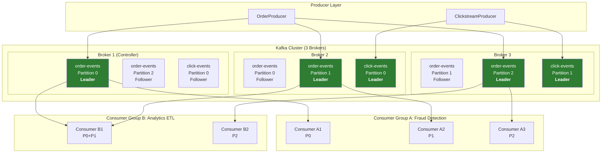
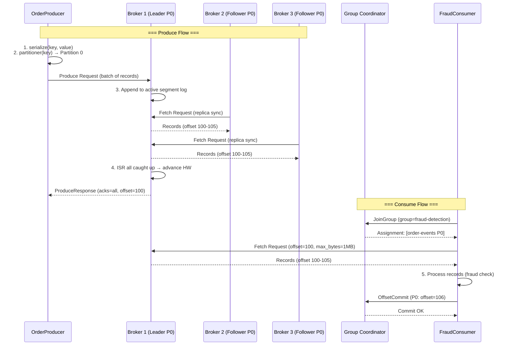

# Kafka Deep Dive / Kafka 深入

## Intent / 意圖

理解 Apache Kafka 的內部架構，以建構可靠、高吞吐量的事件串流（event streaming）系統。Kafka 不只是一個訊息佇列（message queue），而是一個分散式提交日誌（distributed commit log）——它將所有事件以不可變的、有序的方式持久化至磁碟，消費者可以從任意位置重播歷史事件。這個特性使 Kafka 成為事件驅動架構、資料管線（data pipeline）、串流處理（stream processing）、以及跨系統資料同步的核心基礎設施。

核心問題：**當系統需要每秒處理數百萬筆事件、保證分區內的嚴格順序、支持多個消費者獨立消費同一份資料、且事件不會因為消費而消失時，如何設計一個兼顧吞吐量、持久性、與水平擴展性的事件串流平台？**

---

## Problem / 問題情境

**場景：電商平台的即時事件處理瓶頸**

某電商平台每日產生超過 5 億筆事件——使用者點擊、商品瀏覽、加入購物車、下單、支付、物流更新。這些事件需要同時供給多個下游系統消費：

1. **即時推薦引擎**需要使用者行為事件來更新推薦模型。
2. **風控系統**需要在 200ms 內判斷交易是否為詐欺。
3. **資料倉儲**需要所有事件進行批次 ETL 分析。
4. **通知服務**需要訂單狀態變更事件觸發 SMS/Email。
5. **搜尋索引**需要商品更新事件同步至 Elasticsearch。

直接使用傳統訊息佇列（如 RabbitMQ）的問題：

- **單一消費者消費後訊息即消失**：推薦引擎消費完事件後，風控系統和資料倉儲就拿不到同一份資料。要嘛每個下游系統配一個獨立佇列（扇出成本高），要嘛引入複雜的路由邏輯。
- **無法重播歷史事件**：風控系統新增一條規則後，想回溯過去 30 天的交易事件重新判斷——傳統佇列做不到，因為訊息已被消費刪除。
- **順序保證困難**：同一個使用者的「加入購物車 -> 下單 -> 支付」事件必須按順序處理，但傳統佇列在多消費者並行消費時難以保證。
- **吞吐量瓶頸**：單一 broker 每秒處理能力有限，而且水平擴展不像 Kafka 的 partition 機制那樣原生支援。

---

## Core Concepts / 核心概念

### Broker / 代理節點

Kafka 叢集中的單一伺服器程序。每個 broker 負責存儲與服務一組 partition 的讀寫請求。Kafka 叢集通常由 3 到數百個 broker 組成。每個 broker 以唯一的 `broker.id` 標識，broker 之間透過 controller（或 KRaft 模式下的 quorum）協調 partition leadership 和 replica assignment。

### Topic / 主題

事件的邏輯分類名稱（如 `order-events`、`user-clicks`）。Producer 寫入指定 topic，consumer 訂閱指定 topic。Topic 本身不存儲資料——資料實際存儲在 topic 的 partition 中。

### Partition / 分區

Topic 的物理分片單位。每個 partition 是一個有序的、不可變的訊息序列（append-only log）。Partition 是 Kafka 水平擴展的核心——更多 partition 意味著更多 broker 可以並行處理讀寫。同一個 partition 內的訊息嚴格有序，跨 partition 則無順序保證。

### Offset / 偏移量

Partition 內每筆訊息的唯一遞增序號（從 0 開始）。Consumer 透過追蹤自己在每個 partition 的 offset 來記錄消費進度。Offset 是 Kafka 實現「消費者可以從任意位置重播」的關鍵——回溯 offset 即可重新消費歷史訊息。

### Consumer Group / 消費者群組

一組共享同一個 `group.id` 的 consumer 實例。Kafka 保證同一個 partition 在同一時間只會被 consumer group 中的一個 consumer 消費。不同 consumer group 之間完全獨立——各自維護自己的 offset，互不干擾。這就是 Kafka 如何讓多個下游系統（推薦引擎、風控、資料倉儲）各自以自己的速度消費同一份資料。

### Rebalancing / 重平衡

當 consumer group 的成員發生變動（consumer 加入、離開、crash）時，Kafka 的 group coordinator 重新分配 partition 給存活的 consumer。Rebalancing 期間所有 consumer 暫停消費，頻繁的 rebalancing 會嚴重影響吞吐量。

### ISR (In-Sync Replicas) / 同步副本集

與 leader replica 保持同步的 replica 集合。一個 replica 被視為 "in-sync" 的條件是：(1) 與 leader 的 offset 差距在 `replica.lag.time.max.ms` 內，(2) 持續向 leader 發送 fetch 請求。只有 ISR 中的 replica 才有資格被選舉為新的 leader。ISR 的大小直接影響資料安全性——`acks=all` 意味著訊息被所有 ISR 成員確認才算寫入成功。

### acks (Acknowledgement) / 確認機制

Producer 寫入訊息時要求的確認等級：

- **`acks=0`**：Producer 不等待任何確認（fire-and-forget），最高吞吐量但可能丟失訊息。
- **`acks=1`**：等待 leader 確認寫入本地 log，leader crash 後可能丟失未複製的訊息。
- **`acks=all`（等同 `acks=-1`）**：等待所有 ISR 成員確認，搭配 `min.insync.replicas=2`，只要不是所有 replica 同時故障就不會丟失訊息。

### Producer Idempotence / 生產者冪等性

啟用 `enable.idempotence=true` 後，Producer 為每筆訊息附帶 `ProducerID` 和 `SequenceNumber`。Broker 端對每個 `<ProducerID, Partition>` 追蹤已接收的最大 sequence number，重複的訊息會被自動去重。這保證了 exactly-once 語意在 producer 端的實現，即使 producer 因 timeout 而重試也不會產生重複訊息。

### Transactions / 交易

Kafka 的交易機制允許 producer 將多個寫入操作（跨多個 partition、跨多個 topic）包裝在一個原子操作中——要麼全部可見，要麼全部不可見。搭配 consumer 的 `isolation.level=read_committed`，可以實現端到端的 exactly-once 語意。交易由 `transactional.id` 標識的 Transaction Coordinator 管理。

### Compacted Topics / 壓縮主題

Log compaction 保留每個 key 的最新值，刪除同一 key 的舊版本。適用於 changelog 場景——例如使用者個人資料變更，只需保留最新版本。與基於時間或大小的 retention 不同，compacted topic 保留的是「每個 key 的最後狀態」，而非「最近 N 天的所有事件」。

### Retention / 保留策略

控制 Kafka 保留訊息多久。可以基於時間（`retention.ms`，預設 7 天）、基於大小（`retention.bytes`）、或基於 compaction。過期的 segment 會被 Kafka 的 log cleaner 背景刪除。

### Segment / 區段

Partition 的物理存儲單位。每個 partition 由多個 segment 檔案組成，每個 segment 包含一個 `.log`（訊息資料）、`.index`（offset 索引）、`.timeindex`（時間戳索引）。Active segment 是當前正在寫入的 segment，只有已關閉的 segment 才會被 retention 策略清理。

### Controller / 控制器

負責管理叢集元資料的特殊 broker：partition leadership 選舉、broker 上下線偵測、replica reassignment。在傳統模式下，controller 透過 ZooKeeper 選舉產生；在 KRaft 模式下（Kafka 3.0+），controller 由內建的 Raft 共識實現，不再依賴 ZooKeeper。

---

## Architecture / 架構

### Kafka 叢集拓撲



### Produce 與 Consume 流程



---

## How It Works / 運作原理

### Produce Flow / 生產流程

1. **序列化與分區選擇**：Producer 將 key 和 value 序列化為 byte array。接著由 partitioner 決定目標 partition——如果 key 不為 null，使用 `murmur2(key) % numPartitions` 確保相同 key 的訊息落入同一個 partition（保證 key 級別的順序）。Key 為 null 時，Kafka 2.4+ 使用 sticky partitioner，將同一 batch 的訊息送往同一個 partition 以提高壓縮效率。

2. **批次累積**：Producer 將訊息累積在記憶體中的 RecordAccumulator，按 partition 分組成 batch。`linger.ms`（等待時間）和 `batch.size`（batch 大小）控制何時發送——在延遲和吞吐量之間取捨。

3. **Leader 寫入**：Producer 將 batch 發送給 partition 的 leader broker。Leader 將訊息追加至 active segment 的 `.log` 檔案（sequential write，利用 OS page cache 實現接近記憶體的寫入速度）。

4. **ISR 複製**：Follower replicas 主動向 leader 發送 fetch request 拉取新訊息。當所有 ISR 成員都已拉取至相同 offset 時，leader 推進 HW（High Watermark）。HW 之前的訊息才對 consumer 可見。

5. **確認回傳**：根據 `acks` 設定回傳確認——`acks=all` 在 HW 推進後才回傳；`acks=1` 在 leader 本地寫入後就回傳；`acks=0` 不等待。

### Consume Flow / 消費流程

1. **Group Coordinator 分配**：Consumer 啟動時向叢集的 Group Coordinator（由 `group.id` 的 hash 決定哪個 broker 擔任）發送 JoinGroup 請求。Coordinator 執行 partition assignment（預設使用 RangeAssignor 或 CooperativeStickyAssignor），將 partition 分配給 group 內的各 consumer。

2. **Partition 分配策略**：每個 partition 在同一個 consumer group 內只分配給一個 consumer。如果 consumer 數量 > partition 數量，多餘的 consumer 處於閒置狀態。常見策略有 RangeAssignor（按 topic 的 partition 範圍分配）和 CooperativeStickyAssignor（增量式 rebalancing，減少全面暫停）。

3. **Poll 拉取訊息**：Consumer 向 partition leader 發送 FetchRequest，帶上自己的 offset 和 `max.poll.records`。Leader 回傳從該 offset 開始的訊息（最多到 HW）。Consumer 處理完一批訊息後再次 poll。

4. **Offset Commit**：Consumer 處理完訊息後，將已消費的 offset commit 至 `__consumer_offsets` 這個內部 topic。自動 commit（`enable.auto.commit=true`，預設每 5 秒）或手動 commit。手動 commit 可以精確控制 at-least-once 語意——在業務邏輯成功後才 commit，確保訊息不會因為 consumer crash 而遺失。

---

## Rust 實作

以下使用 `rdkafka`（librdkafka 的 Rust binding）實作完整的 producer 與 consumer，包含 `acks=all`、手動 offset commit、以及錯誤處理。

```rust
// kafka_producer_consumer.rs
// Kafka producer with acks=all + consumer with manual offset commit
// Dependencies: rdkafka = { version = "0.36", features = ["cmake-build"] }
//               tokio = { version = "1", features = ["full"] }
//               serde = { version = "1", features = ["derive"] }
//               serde_json = "1"

use rdkafka::config::ClientConfig;
use rdkafka::consumer::{CommitMode, Consumer, StreamConsumer};
use rdkafka::message::{Header, Headers, OwnedHeaders};
use rdkafka::producer::{FutureProducer, FutureRecord};
use rdkafka::Message;
use serde::{Deserialize, Serialize};
use std::time::Duration;

// ─── Domain Event ───

#[derive(Debug, Serialize, Deserialize)]
struct OrderEvent {
    order_id: String,
    customer_id: String,
    event_type: String, // "created", "paid", "shipped"
    total_amount_cents: i64,
    timestamp_ms: i64,
}

// ─── Producer: 寫入訊息至 Kafka ───

async fn run_producer(brokers: &str, topic: &str) -> Result<(), Box<dyn std::error::Error>> {
    let producer: FutureProducer = ClientConfig::new()
        .set("bootstrap.servers", brokers)
        .set("acks", "all") // 等待所有 ISR 確認
        .set("enable.idempotence", "true") // 開啟冪等性，避免重試導致重複
        .set("retries", "3")
        .set("linger.ms", "5") // 等待 5ms 累積 batch
        .set("compression.type", "lz4") // 壓縮節省頻寬與磁碟
        .set("message.timeout.ms", "10000")
        .create()?;

    let events = vec![
        OrderEvent {
            order_id: "ORD-20260217-001".to_string(),
            customer_id: "CUST-8839".to_string(),
            event_type: "created".to_string(),
            total_amount_cents: 459900,
            timestamp_ms: 1739750400000,
        },
        OrderEvent {
            order_id: "ORD-20260217-001".to_string(),
            customer_id: "CUST-8839".to_string(),
            event_type: "paid".to_string(),
            total_amount_cents: 459900,
            timestamp_ms: 1739750460000,
        },
        OrderEvent {
            order_id: "ORD-20260217-002".to_string(),
            customer_id: "CUST-1024".to_string(),
            event_type: "created".to_string(),
            total_amount_cents: 128000,
            timestamp_ms: 1739750520000,
        },
    ];

    for event in &events {
        let payload = serde_json::to_string(event)?;

        // 使用 order_id 作為 key，保證同一訂單的事件進入同一 partition（順序保證）
        let record = FutureRecord::to(topic)
            .key(&event.order_id)
            .payload(&payload)
            .headers(
                OwnedHeaders::new()
                    .insert(Header {
                        key: "event_type",
                        value: Some(event.event_type.as_bytes()),
                    })
                    .insert(Header {
                        key: "source",
                        value: Some(b"order-service"),
                    }),
            );

        match producer.send(record, Duration::from_secs(5)).await {
            Ok((partition, offset)) => {
                println!(
                    "[PRODUCER] Sent order={} type={} -> partition={} offset={}",
                    event.order_id, event.event_type, partition, offset
                );
            }
            Err((err, _)) => {
                eprintln!(
                    "[PRODUCER] Failed to send order={}: {}",
                    event.order_id, err
                );
            }
        }
    }

    // 等待所有 in-flight 訊息發送完成
    producer.flush(Duration::from_secs(10))?;
    println!("[PRODUCER] All messages flushed");
    Ok(())
}

// ─── Consumer: 手動 offset commit 確保 at-least-once ───

async fn run_consumer(brokers: &str, topic: &str, group_id: &str) -> Result<(), Box<dyn std::error::Error>> {
    let consumer: StreamConsumer = ClientConfig::new()
        .set("bootstrap.servers", brokers)
        .set("group.id", group_id)
        .set("enable.auto.commit", "false") // 手動 commit，確保處理完成後才提交
        .set("auto.offset.reset", "earliest") // 新 group 從最早的 offset 開始
        .set("max.poll.interval.ms", "300000") // 處理超過 5 分鐘視為失敗
        .set("session.timeout.ms", "45000")
        .set("isolation.level", "read_committed") // 只讀取已 commit 的交易訊息
        .create()?;

    consumer.subscribe(&[topic])?;
    println!("[CONSUMER] Subscribed to '{}' as group '{}'", topic, group_id);

    let mut processed_count: u64 = 0;
    let commit_interval = 10; // 每處理 10 筆 commit 一次

    loop {
        match consumer.recv().await {
            Ok(message) => {
                let key = message
                    .key()
                    .map(|k| String::from_utf8_lossy(k).to_string())
                    .unwrap_or_else(|| "<null>".to_string());

                let payload = message
                    .payload()
                    .map(|p| String::from_utf8_lossy(p).to_string())
                    .unwrap_or_else(|| "<empty>".to_string());

                // 解析 header 中的 event_type
                let event_type = message
                    .headers()
                    .and_then(|headers| {
                        (0..headers.count()).find_map(|i| {
                            let header = headers.get(i);
                            if header.key == "event_type" {
                                header
                                    .value
                                    .map(|v| String::from_utf8_lossy(v).to_string())
                            } else {
                                None
                            }
                        })
                    })
                    .unwrap_or_else(|| "unknown".to_string());

                println!(
                    "[CONSUMER] partition={} offset={} key={} type={} | {}",
                    message.partition(),
                    message.offset(),
                    key,
                    event_type,
                    &payload[..payload.len().min(80)]
                );

                // 模擬業務處理（風控檢查）
                if let Ok(event) = serde_json::from_str::<OrderEvent>(&payload) {
                    if event.total_amount_cents > 500000 {
                        println!(
                            "  [FRAUD-CHECK] HIGH VALUE order={} amount={}",
                            event.order_id, event.total_amount_cents
                        );
                    }
                }

                processed_count += 1;

                // 定期手動 commit offset（批次 commit 提高效能）
                if processed_count % commit_interval == 0 {
                    consumer.commit_message(&message, CommitMode::Async)?;
                    println!(
                        "  [COMMIT] offset committed at partition={} offset={}",
                        message.partition(),
                        message.offset()
                    );
                }
            }
            Err(err) => {
                eprintln!("[CONSUMER] Error receiving message: {}", err);
            }
        }
    }
}

#[tokio::main]
async fn main() -> Result<(), Box<dyn std::error::Error>> {
    let brokers = "localhost:9092";
    let topic = "order-events";

    println!("=== Kafka Producer + Consumer (Rust / rdkafka) ===\n");

    // 先執行 producer 發送事件
    println!("--- Producing events ---");
    run_producer(brokers, topic).await?;

    // 再啟動 consumer 消費事件
    println!("\n--- Consuming events ---");
    run_consumer(brokers, topic, "fraud-detection-group").await?;

    Ok(())
}

// Output:
// === Kafka Producer + Consumer (Rust / rdkafka) ===
//
// --- Producing events ---
// [PRODUCER] Sent order=ORD-20260217-001 type=created -> partition=2 offset=0
// [PRODUCER] Sent order=ORD-20260217-001 type=paid -> partition=2 offset=1
// [PRODUCER] Sent order=ORD-20260217-002 type=created -> partition=0 offset=0
// [PRODUCER] All messages flushed
//
// --- Consuming events ---
// [CONSUMER] Subscribed to 'order-events' as group 'fraud-detection-group'
// [CONSUMER] partition=2 offset=0 key=ORD-20260217-001 type=created | {"order_id":"ORD-20260217-001",...}
// [CONSUMER] partition=2 offset=1 key=ORD-20260217-001 type=paid | {"order_id":"ORD-20260217-001",...}
//   [FRAUD-CHECK] HIGH VALUE order=ORD-20260217-001 amount=459900
// [CONSUMER] partition=0 offset=0 key=ORD-20260217-002 type=created | {"order_id":"ORD-20260217-002",...}
```

---

## Go 實作

以 `segmentio/kafka-go` 實作等價的 producer 與 consumer。

```go
// kafka_producer_consumer.go
// Kafka producer with acks=all + consumer with manual offset commit
// Dependencies: github.com/segmentio/kafka-go v0.4+

package main

import (
	"context"
	"encoding/json"
	"fmt"
	"log"
	"time"

	"github.com/segmentio/kafka-go"
)

// ─── Domain Event ───

type OrderEvent struct {
	OrderID          string `json:"order_id"`
	CustomerID       string `json:"customer_id"`
	EventType        string `json:"event_type"`
	TotalAmountCents int64  `json:"total_amount_cents"`
	TimestampMs      int64  `json:"timestamp_ms"`
}

// ─── Producer: 寫入訊息至 Kafka ───

func runProducer(ctx context.Context, brokerAddr, topic string) error {
	writer := &kafka.Writer{
		Addr:         kafka.TCP(brokerAddr),
		Topic:        topic,
		Balancer:     &kafka.Hash{}, // 依據 key hash 選擇 partition
		RequiredAcks: kafka.RequireAll, // acks=all，等待所有 ISR 確認
		BatchTimeout: 5 * time.Millisecond, // 等待 5ms 累積 batch
		Compression:  kafka.Lz4,
		WriteTimeout: 10 * time.Second,
		// 開啟冪等性需搭配 confluent-kafka-go 或 server 端設定
	}
	defer writer.Close()

	events := []OrderEvent{
		{
			OrderID:          "ORD-20260217-001",
			CustomerID:       "CUST-8839",
			EventType:        "created",
			TotalAmountCents: 459900,
			TimestampMs:      1739750400000,
		},
		{
			OrderID:          "ORD-20260217-001",
			CustomerID:       "CUST-8839",
			EventType:        "paid",
			TotalAmountCents: 459900,
			TimestampMs:      1739750460000,
		},
		{
			OrderID:          "ORD-20260217-002",
			CustomerID:       "CUST-1024",
			EventType:        "created",
			TotalAmountCents: 128000,
			TimestampMs:      1739750520000,
		},
	}

	var messages []kafka.Message
	for _, event := range events {
		payload, err := json.Marshal(event)
		if err != nil {
			return fmt.Errorf("marshal event: %w", err)
		}

		messages = append(messages, kafka.Message{
			// 使用 order_id 作為 key，保證同一訂單進入同一 partition
			Key:   []byte(event.OrderID),
			Value: payload,
			Headers: []kafka.Header{
				{Key: "event_type", Value: []byte(event.EventType)},
				{Key: "source", Value: []byte("order-service")},
			},
		})
	}

	// 批次寫入（WriteMessages 內部按 partition 分組）
	if err := writer.WriteMessages(ctx, messages...); err != nil {
		return fmt.Errorf("write messages: %w", err)
	}

	for _, event := range events {
		fmt.Printf("[PRODUCER] Sent order=%s type=%s\n",
			event.OrderID, event.EventType)
	}

	fmt.Println("[PRODUCER] All messages flushed")
	return nil
}

// ─── Consumer: 手動 offset commit 確保 at-least-once ───

func runConsumer(ctx context.Context, brokerAddr, topic, groupID string) error {
	reader := kafka.NewReader(kafka.ReaderConfig{
		Brokers:        []string{brokerAddr},
		Topic:          topic,
		GroupID:        groupID,
		StartOffset:    kafka.FirstOffset,   // 新 group 從最早的 offset 開始
		MaxWait:        500 * time.Millisecond,
		CommitInterval: 0, // 0 = 手動 commit（不自動 commit）
		SessionTimeout: 45 * time.Second,
		IsolationLevel: kafka.ReadCommitted, // 只讀取已 commit 的交易訊息
	})
	defer reader.Close()

	fmt.Printf("[CONSUMER] Subscribed to '%s' as group '%s'\n", topic, groupID)

	var processedCount uint64
	const commitInterval uint64 = 10

	for {
		msg, err := reader.FetchMessage(ctx)
		if err != nil {
			if ctx.Err() != nil {
				fmt.Println("[CONSUMER] Context cancelled, shutting down")
				return nil
			}
			log.Printf("[CONSUMER] Error fetching message: %v", err)
			continue
		}

		// 解析 header 中的 event_type
		eventType := "unknown"
		for _, header := range msg.Headers {
			if header.Key == "event_type" {
				eventType = string(header.Value)
				break
			}
		}

		payloadPreview := string(msg.Value)
		if len(payloadPreview) > 80 {
			payloadPreview = payloadPreview[:80]
		}

		fmt.Printf("[CONSUMER] partition=%d offset=%d key=%s type=%s | %s\n",
			msg.Partition, msg.Offset, string(msg.Key), eventType, payloadPreview)

		// 模擬業務處理（風控檢查）
		var event OrderEvent
		if err := json.Unmarshal(msg.Value, &event); err == nil {
			if event.TotalAmountCents > 500000 {
				fmt.Printf("  [FRAUD-CHECK] HIGH VALUE order=%s amount=%d\n",
					event.OrderID, event.TotalAmountCents)
			}
		}

		processedCount++

		// 定期手動 commit offset（批次 commit 提高效能）
		if processedCount%commitInterval == 0 {
			if err := reader.CommitMessages(ctx, msg); err != nil {
				log.Printf("  [COMMIT] Failed: %v", err)
			} else {
				fmt.Printf("  [COMMIT] offset committed at partition=%d offset=%d\n",
					msg.Partition, msg.Offset)
			}
		}
	}
}

func main() {
	brokerAddr := "localhost:9092"
	topic := "order-events"
	ctx := context.Background()

	fmt.Println("=== Kafka Producer + Consumer (Go / kafka-go) ===")
	fmt.Println()

	// 先執行 producer 發送事件
	fmt.Println("--- Producing events ---")
	if err := runProducer(ctx, brokerAddr, topic); err != nil {
		log.Fatalf("Producer error: %v", err)
	}

	// 再啟動 consumer 消費事件
	fmt.Println()
	fmt.Println("--- Consuming events ---")
	if err := runConsumer(ctx, brokerAddr, topic, "fraud-detection-group"); err != nil {
		log.Fatalf("Consumer error: %v", err)
	}
}

// Output:
// === Kafka Producer + Consumer (Go / kafka-go) ===
//
// --- Producing events ---
// [PRODUCER] Sent order=ORD-20260217-001 type=created
// [PRODUCER] Sent order=ORD-20260217-001 type=paid
// [PRODUCER] Sent order=ORD-20260217-002 type=created
// [PRODUCER] All messages flushed
//
// --- Consuming events ---
// [CONSUMER] Subscribed to 'order-events' as group 'fraud-detection-group'
// [CONSUMER] partition=2 offset=0 key=ORD-20260217-001 type=created | {"order_id":"ORD-20260217-001",...}
// [CONSUMER] partition=2 offset=1 key=ORD-20260217-001 type=paid | {"order_id":"ORD-20260217-001",...}
// [CONSUMER] partition=0 offset=0 key=ORD-20260217-002 type=created | {"order_id":"ORD-20260217-002",...}
```

---

## Rust vs Go 對照表

| 面向 | Rust (rdkafka / librdkafka) | Go (segmentio/kafka-go) |
|------|----------------------------|-------------------------|
| **底層實作** | `rdkafka` 是 librdkafka（C 語言）的 FFI binding，繼承了 librdkafka 多年的效能優化與完整的 Kafka protocol 支援（包含 idempotent producer、transactions、SASL 認證）。缺點是需要連結 C 程式庫（`cmake-build` feature），cross-compile 較複雜 | `segmentio/kafka-go` 是純 Go 實作，不依賴 cgo，cross-compile 和部署極為簡單。但功能覆蓋度不如 librdkafka——例如 idempotent producer 和 transaction API 在 kafka-go 中尚未完整支援，需改用 `confluent-kafka-go`（也是 librdkafka binding） |
| **Consumer 生命週期管理** | `StreamConsumer` 實作 `Stream` trait，可搭配 `tokio::select!` 同時監聽多個 event source（如 Kafka 訊息 + graceful shutdown signal + health check）。Consumer 的 rebalancing callback 透過 `ConsumerContext` trait 自訂，但 API 較為底層，需要理解 librdkafka 的 callback 機制 | `kafka.Reader` 提供簡潔的 `FetchMessage` + `CommitMessages` API，搭配 `context.Context` 天然支援 timeout 和 cancellation。Rebalancing 由 Reader 內部處理，開發者介入點較少但也較不靈活。Graceful shutdown 只需 cancel context 即可 |
| **錯誤處理與背壓** | `FutureProducer.send()` 回傳 `Result<(partition, offset), (KafkaError, OwnedMessage)>`，失敗時可取回原始訊息進行重試或記錄至 DLQ。Consumer 的 `recv()` 回傳 `Result<BorrowedMessage>`，開發者可在 `Err` 分支中根據 `KafkaError` variant 判斷是暫時性還是永久性故障 | `Writer.WriteMessages` 的錯誤是整批失敗，無法得知哪一筆訊息成功哪一筆失敗——需要外部重試整批或改用逐筆寫入（犧牲效能）。`Reader.FetchMessage` 的錯誤處理較直覺，但缺乏細粒度的 `KafkaError` 分類 |

---

## When to Use / 適用場景

### 1. Event Sourcing 與跨系統資料同步

當多個微服務需要消費同一份事件流，且各自以不同的速度和邏輯處理時——例如訂單事件同時供給搜尋索引更新、推薦引擎訓練、資料倉儲 ETL。Kafka 的 consumer group 機制讓每個下游系統獨立消費、獨立管理 offset，互不干擾。搭配 compacted topic 可以維護實體的最新狀態快照。

### 2. 高吞吐量資料管線與串流處理

需要每秒處理數十萬到數百萬筆事件的場景——使用者行為追蹤、IoT 感測器資料、金融交易流水。Kafka 的 partition 機制天然支援水平擴展（增加 partition 和 broker 即可線性提升吞吐量），sequential write 和 zero-copy 技術（`sendfile` syscall）使其在磁碟持久化的同時仍能達到極高的吞吐量。搭配 Kafka Streams 或 Flink 可以實現即時串流處理。

### 3. 解耦生產者與消費者的速率差異

當 producer 的寫入速率遠高於 consumer 的處理速率時（如促銷高峰期訂單爆量），Kafka 作為緩衝層吸收流量尖峰。Consumer 可以按自己的能力消費，不會因為來不及處理而導致 producer 被 back-pressure 阻塞。Kafka 的 retention 機制保證訊息在被消費前不會丟失。

---

## When NOT to Use / 不適用場景

### 1. 低延遲的請求-回應（Request-Reply）模式

Kafka 的設計目標是高吞吐量的非同步通訊，不適合需要毫秒級回應的同步 RPC。一筆訊息從 producer 到 consumer 的端到端延遲通常在 5-50ms（取決於 `linger.ms`、batch 大小、replication），遠高於 gRPC 的亞毫秒延遲。如果業務需要「發送請求後立即取得回應」，使用 gRPC 或 HTTP，而非 Kafka。

### 2. 少量訊息但需要複雜路由的場景

每秒只有數十到數百筆訊息，且需要基於訊息內容的複雜路由（如根據 header 中的 priority 路由到不同 queue、支援 dead letter queue 和 delay queue 的原生機制）。這類場景用 RabbitMQ 或 Amazon SQS 更合適——它們原生支援 exchange/routing key、TTL、DLQ、priority queue 等功能，而 Kafka 需要在應用層實作這些邏輯。

### 3. 嚴格的單一訊息順序處理且不可水平擴展

如果業務要求所有訊息在全域範圍內嚴格有序（而非僅在 partition 內有序），只能使用單一 partition——這完全放棄了 Kafka 的水平擴展優勢，吞吐量退化為單一 broker 的上限。此場景用單一 Redis Stream 或資料庫 queue table 可能更簡單。

---

## Real-World Examples / 真實世界案例

### LinkedIn（Kafka 的發源地）

Kafka 於 2011 年在 LinkedIn 內部誕生，最初用於解決 LinkedIn 的活動流（activity stream）資料管線問題——使用者的每一次頁面瀏覽、連結點擊、搜尋查詢都需要即時傳輸至多個下游系統（推薦引擎、A/B 測試框架、Hadoop 叢集）。在 Kafka 之前，LinkedIn 使用點對點的 TCP 連接在服務間傳輸資料，隨著服務數量增長到數百個，連接拓撲變成了不可維護的 mesh。Kafka 作為中央事件匯流排（event bus）解耦了生產者和消費者。截至 2025 年，LinkedIn 的 Kafka 叢集每天處理超過 7 兆（trillion）筆訊息，跨數千個 topic，是全球最大的 Kafka 部署之一。

### Uber

Uber 使用 Kafka 作為其即時資料基礎設施的核心。每一次叫車請求、司機位置更新、行程狀態變更、費率計算結果都以事件形式寫入 Kafka。下游的即時定價引擎（surge pricing）、ETA 預測服務、反詐欺系統各自作為獨立的 consumer group 消費這些事件。Uber 還開發了 uReplicator（Kafka MirrorMaker 的替代品），用於跨資料中心的 Kafka topic 複製，確保全球多個區域的服務都能消費到相同的事件流。

### Spotify

Spotify 使用 Kafka 處理超過每天 5000 億筆事件的音樂串流分析管線。每一次使用者播放、跳過、加入播放清單、搜尋，都作為事件寫入 Kafka。下游的推薦系統（Discover Weekly）、版稅計算系統（向音樂人支付播放費）、以及即時儀表板都從同一份 Kafka 事件流消費。Spotify 特別依賴 Kafka 的 retention 機制和 consumer group 獨立性——版稅計算系統可以以每小時一次的批次速度消費事件，而即時推薦引擎則以秒級延遲消費，兩者互不干擾。

---

## Interview Questions / 面試常見問題

### Q1: Kafka 如何保證消息不丟失？`acks=all` 搭配 `min.insync.replicas` 的具體語意是什麼？

**A:** Kafka 的不丟失保證由 producer 端的 `acks` 和 broker 端的 `min.insync.replicas`（MIR）共同實現。`acks=all` 要求訊息被所有 ISR 成員確認才算寫入成功。但如果 ISR 只剩 leader 一個節點，`acks=all` 等同於 `acks=1`——leader crash 後訊息就丟了。因此需要搭配 `min.insync.replicas=2`（設定在 topic 或 broker 層級）：當 ISR 成員數量少於 MIR 時，broker 拒絕寫入（回傳 `NotEnoughReplicasException`），寧可讓 producer 收到錯誤也不讓資料面臨丟失風險。典型的生產配置是 `replication.factor=3` + `acks=all` + `min.insync.replicas=2`，容許一個 replica 故障而不影響可用性或資料安全。

### Q2: Consumer group rebalancing 是什麼？為什麼頻繁 rebalancing 是問題？如何緩解？

**A:** Rebalancing 是 consumer group 重新分配 partition 給 consumer 的過程，由以下事件觸發：consumer 加入或離開 group、consumer crash（session timeout）、topic 的 partition 數量變更。在 Eager Rebalancing（預設）期間，所有 consumer 停止消費、釋放所有 partition、重新分配——期間整個 consumer group 無法處理任何訊息。頻繁的 rebalancing 導致吞吐量驟降。緩解方式：(1) 使用 `CooperativeStickyAssignor` 實現 incremental rebalancing——只重新分配必要的 partition，其餘 partition 不受影響；(2) 增大 `session.timeout.ms`（預設 10s → 45s）和 `max.poll.interval.ms` 避免因短暫的 GC pause 或處理延遲觸發不必要的 rebalancing；(3) 使用 static membership（`group.instance.id`），consumer 重啟時不觸發 rebalancing。

### Q3: Kafka 的 partition 數量該如何決定？設定後能否修改？

**A:** Partition 數量決定了 consumer group 的最大並行度（一個 partition 同一時間只能被一個 consumer 消費）。經驗法則：目標吞吐量 / 單個 consumer 的處理能力 = 最小 partition 數量。例如目標 100K msg/s，單個 consumer 處理 10K msg/s，需要至少 10 個 partition。過多的 partition 也有副作用：(1) 每個 partition 佔用 broker 的記憶體和 file descriptor；(2) leader election 時間與 partition 數量成正比；(3) 端到端延遲增加（更多 partition 意味著 producer batch 分散到更多目標）。Partition 數量可以增加但不能減少——增加後，基於 key hash 的 partition 分配會改變（相同的 key 可能被路由到不同的 partition），破壞順序保證。因此應在初期根據未來 1-2 年的預估吞吐量設定足夠的 partition 數量。

### Q4: Exactly-once 語意在 Kafka 中如何實現？

**A:** Kafka 的 exactly-once 由三個機制組成：(1) **Producer idempotence**（`enable.idempotence=true`）——broker 透過 `<ProducerID, SequenceNumber>` 自動去重，保證即使 producer 重試也不會產生重複訊息。(2) **Transactions**——producer 可以將多筆寫入（跨 partition、跨 topic）包裝在一個原子交易中，搭配 `transactional.id` 和 Transaction Coordinator 管理。(3) **Consumer `isolation.level=read_committed`**——consumer 只讀取已 commit 的交易訊息，看不到 abort 的交易。端到端的 exactly-once 需要 consume-transform-produce 模式（如 Kafka Streams 的 `processing.guarantee=exactly_once_v2`）：consumer 讀取訊息、處理、寫入結果至另一個 topic，三者在同一個交易中完成。

### Q5: Compacted topic 與一般 topic 的 retention 有何不同？何時使用？

**A:** 一般 topic 的 retention 基於時間（`retention.ms`）或大小（`retention.bytes`），超過閾值的 segment 被整段刪除，不管其中的 key 是什麼。Compacted topic（`cleanup.policy=compact`）的保留策略是：對於每個 key，只保留最新的 value，刪除該 key 的所有舊版本。Log cleaner 在背景執行 compaction——掃描已關閉的 segment，合併並移除重複 key。典型使用場景包括：(1) 資料庫變更事件（CDC）——Debezium 將 MySQL/PostgreSQL 的 row-level change 寫入 compacted topic，新的 consumer 加入時可以從 compacted topic 中讀取每個 row 的最新狀態，而不必重播所有歷史變更；(2) 設定管理——服務的設定以 key-value 形式存入 compacted topic，服務啟動時讀取全量設定。

---

## Pitfalls / 常見陷阱

### 1. Consumer Lag 持續增長導致資料過期被刪除

Consumer 的處理速度跟不上 producer 的寫入速度，consumer lag（consumer 的 committed offset 與 partition 的 latest offset 之差）持續增長。當 lag 大到 consumer 尚未消費的最早 offset 所在的 segment 被 retention 策略刪除時，consumer 的 offset 指向了一個不存在的位置。此時 consumer 會根據 `auto.offset.reset` 的設定行為跳轉——`earliest` 跳到最早的可用 offset（可能重複消費大量資料），`latest` 跳到最新 offset（中間的訊息永久遺失），`none` 直接拋出異常。

```rust
// 危險：consumer 處理太慢，lag 持續增長
// 解法：監控 consumer lag，設定告警閾值
// rdkafka 可透過 consumer.position() 和 consumer.committed() 計算 lag

async fn monitor_consumer_lag(consumer: &StreamConsumer) {
    // 取得每個 partition 的 committed offset 與 high watermark
    // 差值即為 lag，超過閾值應告警
    let metadata = consumer
        .fetch_metadata(Some("order-events"), Duration::from_secs(5))
        .expect("Failed to fetch metadata");
    for topic in metadata.topics() {
        for partition in topic.partitions() {
            let (_low, high) = consumer
                .fetch_watermarks(topic.name(), partition.id(), Duration::from_secs(5))
                .unwrap_or((-1, -1));
            println!(
                "  partition={} high_watermark={} (compare with committed offset to get lag)",
                partition.id(),
                high
            );
        }
    }
}
```

**對策**：(1) 監控 consumer lag（Burrow、Kafka Exporter + Prometheus），設定告警閾值；(2) 提升 consumer 並行度——增加 consumer 實例（不超過 partition 數量）；(3) 調大 `retention.ms` 給 consumer 更多時間追上。

### 2. Rebalancing Storm（重平衡風暴）

某個 consumer 因為 GC pause 或長時間的訊息處理超過了 `max.poll.interval.ms`，被 group coordinator 踢出 group 觸發 rebalancing。Rebalancing 期間其他 consumer 暫停消費，pending 的訊息堆積。Rebalancing 完成後，被踢出的 consumer 重新加入又觸發一次 rebalancing，形成連鎖反應。更嚴重的是，每次 rebalancing 都導致短暫的停頓，積壓的訊息越來越多，consumer 更容易超時，陷入惡性循環。

```go
// 危險：處理時間過長導致 rebalancing
func processMessage(msg kafka.Message) {
    // 如果這裡的處理時間超過 max.poll.interval.ms（預設 5 分鐘）
    // consumer 會被踢出 group，觸發 rebalancing
    result := callExternalAPI(msg) // 外部 API 可能 timeout
    saveToDatabase(result)          // DB 可能 slow query
}

// 對策：將耗時操作異步化，快速 commit offset
func processMessageSafe(ctx context.Context, msg kafka.Message, workCh chan<- kafka.Message) {
    // 快速將訊息放入 channel，由 worker pool 異步處理
    // 確保 FetchMessage -> channel send 的時間遠小於 max.poll.interval.ms
    select {
    case workCh <- msg:
        // 訊息已交給 worker，可以繼續 poll
    case <-ctx.Done():
        return
    }
}
```

**對策**：(1) 使用 `CooperativeStickyAssignor` 減少 rebalancing 影響範圍；(2) 設定 `group.instance.id` 啟用 static membership；(3) 將耗時的業務邏輯異步化，確保 `poll` 間隔遠小於 `max.poll.interval.ms`。

### 3. Partition 數量設定不當——過少或過多

**過少**：Partition 數量是 consumer group 並行度的上限。如果 topic 只有 3 個 partition，即使部署 10 個 consumer 實例也只有 3 個能消費，其餘 7 個閒置。隨著流量增長，無法透過增加 consumer 來提升消費能力。

**過多**：每個 partition 在 broker 端佔用一個 file descriptor、一段記憶體（index cache），過多的 partition 會增加 broker 的資源消耗。更重要的是，controller 在執行 leader election 時（如 broker 故障），需要為該 broker 上的所有 partition 選舉新的 leader——partition 數量越多，failover 時間越長。Kafka 官方建議單個 broker 的 partition 數量不超過 4000 個。

**對策**：根據「目標吞吐量 / 單個 consumer 的處理能力」計算最小 partition 數，再預留 2-3 倍增長空間。Partition 數量可以增加但不能減少，且增加後會影響 key-based routing。

### 4. 未處理 Poison Pill Message（毒藥訊息）

Consumer 收到一筆格式錯誤或業務邏輯無法處理的訊息（如 JSON 解析失敗、版本不相容的 schema），每次處理都拋出異常但不 commit offset。Consumer 反覆重試這筆訊息，永遠無法前進——後續所有正常訊息也被堵塞。

**對策**：(1) 實作 Dead Letter Queue（DLQ）——處理失敗的訊息寫入另一個 topic（如 `order-events-dlq`），然後 commit offset 繼續處理後續訊息；(2) 設定最大重試次數，超過後記錄錯誤並跳過；(3) 使用 Schema Registry 強制 producer 和 consumer 遵循相同的 schema 版本。

---

## Cross-references / 交叉引用

- [[13_saga_pattern|Saga Pattern / Saga 分散式交易]] — Kafka 經常作為 Choreography Saga 的事件傳輸層。每個微服務在完成本地交易後將事件發佈至 Kafka topic，下游服務訂閱並觸發後續步驟。Kafka 的 consumer group 和 offset 機制保證了事件的可靠投遞，而 compacted topic 可以用來維護 Saga 的狀態快照。
- [[12_cap_consistency_models|CAP Theorem & Consistency Models / CAP 定理與一致性模型]] — Kafka 的 `acks=all` + `min.insync.replicas` 是 CP 傾向的配置——在 ISR 不足時拒絕寫入，犧牲可用性保正確性。`acks=1` 是 AP 傾向——可用性優先但可能丟失訊息。理解 CAP 有助於選擇適合業務場景的 Kafka 配置。
- [[15_distributed_locking|Distributed Locking / 分散式鎖]] — Kafka 的 controller election（KRaft 模式）本質上是分散式鎖的應用——多個 broker 透過 Raft 共識競爭 controller 角色。理解分散式鎖的 leader election 原理有助於理解 Kafka 叢集的 failover 機制。
- [[14_two_phase_commit|Two-Phase Commit / 兩階段提交]] — Kafka 的 transaction protocol 在設計上受到 2PC 的啟發，Transaction Coordinator 扮演 coordinator 角色，各 partition leader 扮演 participant。但 Kafka 的實作透過 transaction log 持久化避免了傳統 2PC 的 blocking 問題。

---

## References / 參考資料

1. **Kafka: The Definitive Guide (2nd Edition)** — Gwen Shapira, Todd Palino, Rajini Sivaram, Krit Petty, O'Reilly 2021. 涵蓋 Kafka 的架構設計、producer/consumer 最佳實踐、叢集運維、以及 KRaft 模式。從入門到進階的權威參考書。
2. **Apache Kafka Documentation** (https://kafka.apache.org/documentation/) — 官方文件，包含所有配置參數的詳細說明、設計原理（design section）、以及 Kafka protocol 的規格。
3. **Designing Data-Intensive Applications (DDIA)** — Martin Kleppmann
   - Chapter 11: Stream Processing — 深入探討 Kafka 作為串流處理平台的設計理念，包含 log-based messaging 與傳統 message broker 的比較。
4. **Kafka Improvement Proposals (KIPs)** (https://cwiki.apache.org/confluence/display/KAFKA/Kafka+Improvement+Proposals) — KIP-500（替換 ZooKeeper）、KIP-447（exactly-once v2）、KIP-848（新 consumer group protocol）等關鍵設計決策的原始提案。
5. **Confluent Developer Documentation** (https://docs.confluent.io/) — Confluent（Kafka 的商業公司）提供的開發者文件，包含 Schema Registry、Kafka Connect、ksqlDB 的整合教學。
6. **Jay Kreps - "The Log: What every software engineer should know about real-time data's unifying abstraction"** (https://engineering.linkedin.com/distributed-systems/log-what-every-software-engineer-should-know-about-real-time-datas-unifying) — LinkedIn 首席架構師（Kafka 共同創始人）的經典文章，闡述分散式 commit log 如何統一資料整合、串流處理、與資料庫複製的抽象。
7. **rdkafka crate documentation** (https://docs.rs/rdkafka/) — Rust rdkafka 的 API 文件與範例。
8. **segmentio/kafka-go** (https://github.com/segmentio/kafka-go) — Go 的純 Go Kafka 客戶端程式庫，README 包含完整的 producer/consumer/group API 範例。
