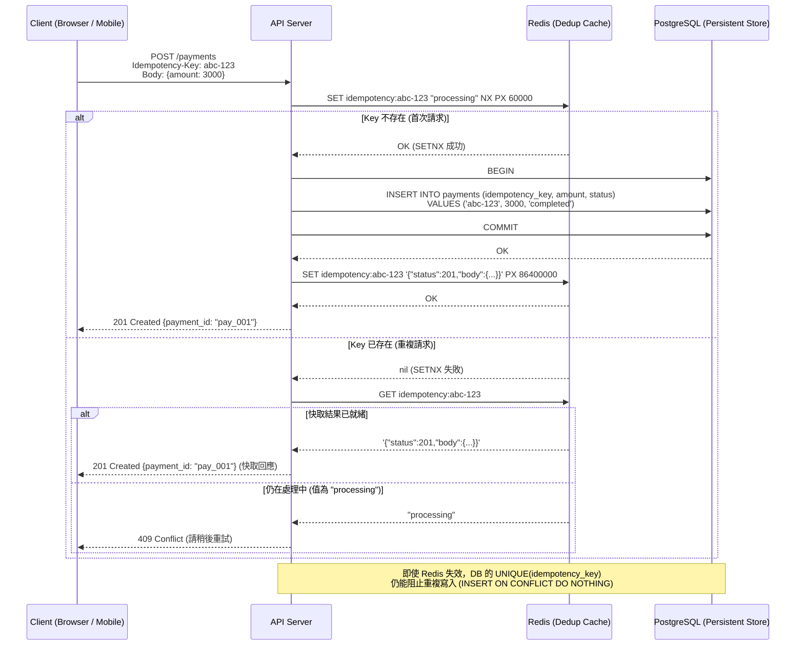
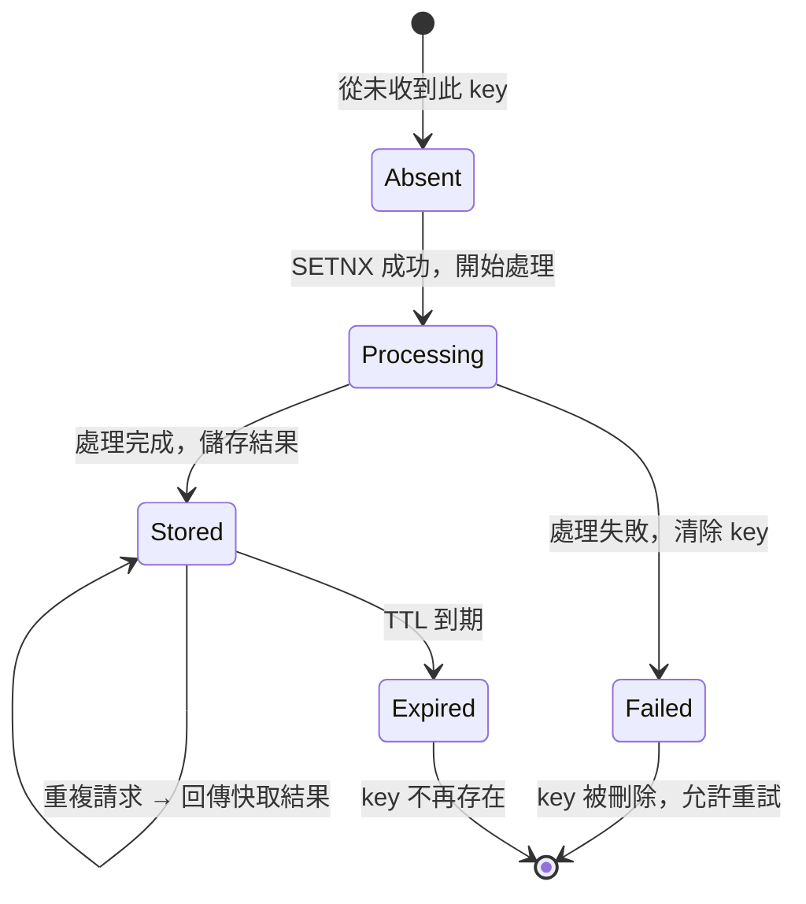

# Idempotency Design / 冪等設計

## Intent / 意圖

確保相同的請求被重複執行多次後，系統狀態與回應結果與只執行一次完全相同。冪等性是分散式系統中處理網路不確定性（request timeout、重試、重複投遞）的基礎保障機制——它讓「安全重試」成為可能，而不需要呼叫端判斷上一次請求是否已經成功。

核心問題：**當一個請求因為網路超時、客戶端重試、訊息佇列重複投遞等原因被送達多次時，如何保證系統只執行一次副作用（side effect），並對每次重複請求回傳相同的結果？**

---

## Problem / 問題情境

**場景一：使用者雙擊支付按鈕導致重複扣款**

某電商平台的結帳頁面，使用者點擊「確認付款」按鈕後，因網路延遲未立即收到回應，於是再次點擊按鈕。兩次點擊各自發送了一個 POST `/payments` 請求，兩個請求幾乎同時到達後端：

1. 第一個請求成功建立支付記錄並扣款 NT$3,000。
2. 第二個請求也通過了所有驗證（訂單存在、餘額充足），再次建立支付記錄並扣款 NT$3,000。
3. 結果：使用者被扣款 NT$6,000，客訴湧入，退款流程啟動。

**場景二：網路超時觸發自動重試導致重複建立訂單**

API gateway 設定了 3 秒超時與自動重試。使用者提交訂單後，後端花了 4 秒處理（扣庫存 + 建立訂單），但 gateway 在 3 秒時認為請求失敗，自動發送第二次請求。第一次請求實際上已成功執行，第二次請求又建立了一筆相同內容的訂單——使用者收到兩筆訂單、被扣兩次庫存。

---

## Core Concepts / 核心概念

### Idempotency / 冪等性

數學定義：`f(f(x)) = f(x)`。在 API 語境中，對同一個請求執行 N 次（N >= 1），系統的最終狀態與執行 1 次完全相同，且每次回傳的 response 也相同。冪等性保證的是「結果」而非「行為」——系統可以在內部檢測到重複請求並跳過實際處理，但回傳的結果必須與首次執行時一致。

### Idempotency Key / 冪等鍵

由客戶端生成的唯一識別符（通常為 UUID v4），隨請求一起送達伺服端。伺服端以此 key 判斷請求是否為重複——若 key 已存在於儲存中，直接回傳先前快取的 response；若不存在，執行正常邏輯並將結果與 key 綁定儲存。Key 必須由客戶端生成（而非伺服端），因為只有客戶端知道哪些請求是「同一個意圖」的重試。

### Deduplication / 去重

在收到請求時，根據冪等鍵查詢是否已處理過該請求。去重分為兩層：(1) 快速路徑——Redis `SETNX` 在毫秒級完成查詢，攔截大部分重複請求；(2) 持久路徑——資料庫 unique constraint 作為最後防線，即使 Redis 故障也能防止重複。

### Natural Idempotency / 天然冪等

HTTP 規範中，`GET`、`PUT`、`DELETE` 是天然冪等的——`GET` 不改變狀態，`PUT` 以完整資源覆蓋（多次覆蓋結果相同），`DELETE` 刪除已不存在的資源回傳 404 或 204（結果相同）。`POST` 和 `PATCH` 不是天然冪等的——每次 `POST` 可能建立新資源，每次 `PATCH` 可能基於當前狀態做增量修改。冪等設計主要針對非天然冪等的操作。

### Conditional Write — INSERT ON CONFLICT / 條件寫入

PostgreSQL 的 `INSERT ... ON CONFLICT DO NOTHING`（或 `DO UPDATE`）提供資料庫層級的冪等保障。以冪等鍵為 unique constraint 的目標欄位，重複的 INSERT 會被自動忽略或轉為 UPDATE，不會產生重複記錄。這是防止重複寫入的最後防線。

### Redis SETNX for Dedup / Redis 原子去重

`SET key value NX PX milliseconds`——只在 key 不存在時設定值並附帶過期時間。在冪等設計中，用冪等鍵作為 Redis key，首次請求 SETNX 成功代表此請求尚未處理，SETNX 失敗代表已處理過。Redis 的亞毫秒回應速度讓去重檢查不會成為效能瓶頸。

### Database Unique Constraint / 資料庫唯一約束

在關鍵業務表（如 payments、orders）上建立以冪等鍵為目標的 unique index。即使 Redis 去重層失效（如 Redis 故障、快取過期後的延遲重試），資料庫的 unique constraint 仍能阻止重複寫入。這是 defense-in-depth（縱深防禦）策略的體現。

### Optimistic Locking with Version / 樂觀鎖與版本號

每筆記錄維護一個 `version` 欄位。更新時以 `WHERE version = $expected_version` 作為條件，成功則 `version += 1`，失敗（affected rows = 0）代表記錄已被其他請求修改。樂觀鎖不是直接的冪等機制，但能防止並行請求導致的 lost update，是冪等設計的輔助工具。

---

## Architecture / 架構

### Idempotency Key 完整流程



### 冪等鍵生命週期狀態圖



---

## How It Works / 運作原理

### Idempotency Key 生命週期

1. **Client 生成 Key**：Client 在發送非冪等請求前，生成一個 UUID v4 作為冪等鍵，儲存在本地（localStorage / 記憶體），並放入 HTTP header `Idempotency-Key` 中。同一個業務意圖的所有重試都使用相同的 key。

2. **Server 檢查 Key 是否存在**：API Server 收到請求後，以 `SET idempotency:<key> "processing" NX PX <lock_ttl>` 原子地檢查並鎖定此 key。`NX` 保證只有第一個請求能成功設定，`PX` 設定處理超時（防止程序 crash 後 key 永久存在）。

3. **首次請求：處理業務邏輯**：SETNX 成功代表此 key 從未被處理。Server 執行完整業務邏輯（驗證、扣款、寫入資料庫等）。資料庫中的冪等鍵欄位有 unique constraint 作為最後防線。

4. **儲存結果**：業務邏輯完成後，將完整的 HTTP response（status code + body）序列化後存回 Redis（覆蓋 "processing" 值），設定較長的 TTL（如 24 小時）。

5. **重複請求：回傳快取結果**：SETNX 失敗代表 key 已存在。Server 用 `GET` 讀取快取的 response。若值為 "processing"，代表首次請求尚在處理中——回傳 `409 Conflict` 或 `425 Too Early`，告知 client 稍後重試。若值為完整的 response，直接回傳此快取結果。

6. **Key 過期**：Redis TTL 到期後 key 自動刪除。若 client 在過期後再次送來相同的 key，系統會視為新請求重新處理——但因為資料庫的 unique constraint，INSERT 會觸發 `ON CONFLICT`，不會產生重複記錄。

---

## Rust 實作

以 Axum 0.8+ middleware 實作完整的冪等性保護，結合 Redis 去重與 PostgreSQL 持久化。

```rust
// idempotency_middleware.rs
// Axum 0.8+ idempotency middleware with Redis dedup + PostgreSQL persistence
// Dependencies: axum 0.8, tokio, serde, serde_json, redis, sqlx, uuid, http

use axum::{
    body::Body,
    extract::State,
    http::{HeaderMap, Request, Response, StatusCode},
    middleware::Next,
    response::IntoResponse,
    routing::post,
    Json, Router,
};
use redis::AsyncCommands;
use serde::{Deserialize, Serialize};
use sqlx::PgPool;
use std::sync::Arc;
use uuid::Uuid;

// ─── Application State ───

#[derive(Clone)]
struct AppState {
    redis: redis::Client,
    db: PgPool,
}

// ─── Idempotency Record (stored in Redis and PostgreSQL) ───

#[derive(Debug, Serialize, Deserialize)]
struct CachedResponse {
    status_code: u16,
    body: String,
}

// ─── Idempotency Middleware ───

const IDEMPOTENCY_HEADER: &str = "idempotency-key";
const PROCESSING_SENTINEL: &str = "__processing__";
const LOCK_TTL_MS: u64 = 60_000;       // 60 seconds for processing lock
const RESULT_TTL_MS: u64 = 86_400_000; // 24 hours for cached result

async fn idempotency_middleware(
    State(state): State<Arc<AppState>>,
    headers: HeaderMap,
    request: Request<Body>,
    next: Next,
) -> Response<Body> {
    // Step 1: Extract idempotency key from header
    let idempotency_key = match headers.get(IDEMPOTENCY_HEADER) {
        Some(value) => match value.to_str() {
            Ok(key) => key.to_string(),
            Err(_) => {
                return (StatusCode::BAD_REQUEST, "Invalid Idempotency-Key header")
                    .into_response();
            }
        },
        None => {
            // No idempotency key — pass through without dedup
            return next.run(request).await;
        }
    };

    let redis_key = format!("idempotency:{}", idempotency_key);

    // Step 2: Attempt to acquire processing lock via SETNX
    let mut conn = match state.redis.get_multiplexed_async_connection().await {
        Ok(conn) => conn,
        Err(err) => {
            eprintln!("[IDEMPOTENCY] Redis connection failed: {}, proceeding without dedup", err);
            return next.run(request).await;
        }
    };

    let lock_acquired: bool = redis::cmd("SET")
        .arg(&redis_key)
        .arg(PROCESSING_SENTINEL)
        .arg("NX")
        .arg("PX")
        .arg(LOCK_TTL_MS)
        .query_async::<bool>(&mut conn)
        .await
        .unwrap_or(false);

    if lock_acquired {
        // Step 3: First request — execute handler
        println!("[IDEMPOTENCY] key={} — first request, processing", idempotency_key);

        let response = next.run(request).await;
        let status = response.status();

        // Step 4: Capture response body for caching
        let (parts, body) = response.into_parts();
        let body_bytes = axum::body::to_bytes(body, usize::MAX).await.unwrap_or_default();
        let body_string = String::from_utf8_lossy(&body_bytes).to_string();

        // Step 5: Cache the response in Redis (overwrite processing sentinel)
        let cached = CachedResponse {
            status_code: status.as_u16(),
            body: body_string.clone(),
        };

        if let Ok(serialized) = serde_json::to_string(&cached) {
            let _: Result<(), _> = conn
                .set_ex(&redis_key, &serialized, RESULT_TTL_MS / 1000)
                .await;
            println!(
                "[IDEMPOTENCY] key={} — result cached (status={})",
                idempotency_key, status
            );
        }

        // Reconstruct the response
        Response::from_parts(parts, Body::from(body_bytes))
    } else {
        // Step 6: Duplicate request — check cached result
        let cached_value: Option<String> = conn.get(&redis_key).await.unwrap_or(None);

        match cached_value.as_deref() {
            Some(PROCESSING_SENTINEL) => {
                // Still processing — tell client to retry later
                println!(
                    "[IDEMPOTENCY] key={} — still processing, returning 409",
                    idempotency_key
                );
                (StatusCode::CONFLICT, "Request is still being processed. Retry later.")
                    .into_response()
            }
            Some(serialized) => {
                // Return cached response
                match serde_json::from_str::<CachedResponse>(serialized) {
                    Ok(cached) => {
                        println!(
                            "[IDEMPOTENCY] key={} — returning cached response (status={})",
                            idempotency_key, cached.status_code
                        );
                        let status = StatusCode::from_u16(cached.status_code)
                            .unwrap_or(StatusCode::OK);
                        (status, cached.body).into_response()
                    }
                    Err(_) => {
                        (StatusCode::INTERNAL_SERVER_ERROR, "Corrupted cached response")
                            .into_response()
                    }
                }
            }
            None => {
                // Key existed momentarily but expired — fallback to DB unique constraint
                println!(
                    "[IDEMPOTENCY] key={} — cache miss, relying on DB constraint",
                    idempotency_key
                );
                next.run(request).await
            }
        }
    }
}

// ─── Payment Handler (with DB-level idempotency as last resort) ───

#[derive(Debug, Deserialize)]
struct CreatePaymentRequest {
    order_id: Uuid,
    amount: i64,
    currency: String,
    idempotency_key: String,
}

#[derive(Debug, Serialize)]
struct PaymentResponse {
    payment_id: Uuid,
    order_id: Uuid,
    amount: i64,
    currency: String,
    status: String,
}

async fn create_payment(
    State(state): State<Arc<AppState>>,
    Json(payload): Json<CreatePaymentRequest>,
) -> impl IntoResponse {
    let payment_id = Uuid::new_v4();

    // INSERT with ON CONFLICT — DB-level idempotency guarantee
    let result = sqlx::query_as::<_, (Uuid, String)>(
        r#"
        INSERT INTO payments (payment_id, order_id, amount, currency, idempotency_key, status)
        VALUES ($1, $2, $3, $4, $5, 'completed')
        ON CONFLICT (idempotency_key) DO NOTHING
        RETURNING payment_id, status
        "#,
    )
    .bind(payment_id)
    .bind(payload.order_id)
    .bind(payload.amount)
    .bind(&payload.currency)
    .bind(&payload.idempotency_key)
    .fetch_optional(&state.db)
    .await;

    match result {
        Ok(Some((pid, status))) => {
            // New payment created
            println!(
                "[PAYMENT] Created payment {} for order {}",
                pid, payload.order_id
            );
            (
                StatusCode::CREATED,
                Json(PaymentResponse {
                    payment_id: pid,
                    order_id: payload.order_id,
                    amount: payload.amount,
                    currency: payload.currency,
                    status,
                }),
            )
                .into_response()
        }
        Ok(None) => {
            // ON CONFLICT DO NOTHING — duplicate idempotency key
            // Fetch the existing payment to return consistent response
            let existing = sqlx::query_as::<_, (Uuid, i64, String, String)>(
                "SELECT payment_id, amount, currency, status FROM payments WHERE idempotency_key = $1",
            )
            .bind(&payload.idempotency_key)
            .fetch_one(&state.db)
            .await
            .expect("Existing payment must exist after ON CONFLICT");

            println!(
                "[PAYMENT] Duplicate key {}, returning existing payment {}",
                payload.idempotency_key, existing.0
            );
            (
                StatusCode::CREATED,
                Json(PaymentResponse {
                    payment_id: existing.0,
                    order_id: payload.order_id,
                    amount: existing.1,
                    currency: existing.2,
                    status: existing.3,
                }),
            )
                .into_response()
        }
        Err(err) => {
            eprintln!("[PAYMENT] Database error: {}", err);
            (StatusCode::INTERNAL_SERVER_ERROR, "Payment processing failed").into_response()
        }
    }
}

// ─── App Setup ───

#[tokio::main]
async fn main() {
    let redis_client = redis::Client::open("redis://127.0.0.1:6379/")
        .expect("Invalid Redis URL");
    let db_pool = PgPool::connect("postgresql://localhost/payments_db")
        .await
        .expect("Failed to connect to PostgreSQL");

    let state = Arc::new(AppState {
        redis: redis_client,
        db: db_pool,
    });

    let app = Router::new()
        .route("/payments", post(create_payment))
        .layer(axum::middleware::from_fn_with_state(
            state.clone(),
            idempotency_middleware,
        ))
        .with_state(state);

    let listener = tokio::net::TcpListener::bind("0.0.0.0:3000").await.unwrap();
    println!("Listening on :3000");
    axum::serve(listener, app).await.unwrap();
}

// Output:
// Listening on :3000
//
// --- First request ---
// [IDEMPOTENCY] key=abc-123 — first request, processing
// [PAYMENT] Created payment pay_001 for order ord_555
// [IDEMPOTENCY] key=abc-123 — result cached (status=201 Created)
// -> 201 Created {"payment_id":"pay_001","status":"completed",...}
//
// --- Duplicate request (same key) ---
// [IDEMPOTENCY] key=abc-123 — returning cached response (status=201)
// -> 201 Created {"payment_id":"pay_001","status":"completed",...}
//
// --- Duplicate while still processing ---
// [IDEMPOTENCY] key=def-456 — still processing, returning 409
// -> 409 Conflict "Request is still being processed. Retry later."
```

---

## Go 實作

以 Go 1.24+ 與 `net/http` 標準庫實作等價的冪等性 middleware，結合 Redis 去重與 PostgreSQL 持久化。

```go
// idempotency_middleware.go
// net/http idempotency middleware with Redis dedup + PostgreSQL persistence
// Dependencies: go-redis/redis/v9, jackc/pgx/v5, google/uuid

package main

import (
	"bytes"
	"context"
	"database/sql"
	"encoding/json"
	"fmt"
	"io"
	"net/http"
	"time"

	"github.com/google/uuid"
	"github.com/jackc/pgx/v5/pgxpool"
	"github.com/redis/go-redis/v9"
)

// ─── Application State ───

type AppState struct {
	Redis *redis.Client
	DB    *pgxpool.Pool
}

// ─── Cached Response ───

type CachedResponse struct {
	StatusCode int    `json:"status_code"`
	Body       string `json:"body"`
}

// ─── Idempotency Middleware ───

const (
	idempotencyHeader = "Idempotency-Key"
	processingSentinel = "__processing__"
	lockTTL           = 60 * time.Second
	resultTTL         = 24 * time.Hour
)

func IdempotencyMiddleware(state *AppState, next http.Handler) http.Handler {
	return http.HandlerFunc(func(w http.ResponseWriter, r *http.Request) {
		idempotencyKey := r.Header.Get(idempotencyHeader)
		if idempotencyKey == "" {
			// No idempotency key — pass through
			next.ServeHTTP(w, r)
			return
		}

		ctx := r.Context()
		redisKey := fmt.Sprintf("idempotency:%s", idempotencyKey)

		// Step 1: Attempt to acquire processing lock via SETNX
		lockAcquired, err := state.Redis.SetNX(ctx, redisKey, processingSentinel, lockTTL).Result()
		if err != nil {
			fmt.Printf("[IDEMPOTENCY] Redis error: %v, proceeding without dedup\n", err)
			next.ServeHTTP(w, r)
			return
		}

		if lockAcquired {
			// Step 2: First request — execute handler and capture response
			fmt.Printf("[IDEMPOTENCY] key=%s — first request, processing\n", idempotencyKey)

			recorder := &responseRecorder{
				ResponseWriter: w,
				statusCode:     http.StatusOK,
				body:           &bytes.Buffer{},
			}
			next.ServeHTTP(recorder, r)

			// Step 3: Cache the response in Redis
			cached := CachedResponse{
				StatusCode: recorder.statusCode,
				Body:       recorder.body.String(),
			}
			serialized, marshalErr := json.Marshal(cached)
			if marshalErr == nil {
				state.Redis.Set(ctx, redisKey, string(serialized), resultTTL)
				fmt.Printf("[IDEMPOTENCY] key=%s — result cached (status=%d)\n",
					idempotencyKey, recorder.statusCode)
			}
		} else {
			// Step 4: Duplicate request — check cached result
			cachedValue, err := state.Redis.Get(ctx, redisKey).Result()
			if err != nil {
				fmt.Printf("[IDEMPOTENCY] key=%s — cache miss, relying on DB constraint\n",
					idempotencyKey)
				next.ServeHTTP(w, r)
				return
			}

			if cachedValue == processingSentinel {
				fmt.Printf("[IDEMPOTENCY] key=%s — still processing, returning 409\n",
					idempotencyKey)
				http.Error(w, "Request is still being processed. Retry later.",
					http.StatusConflict)
				return
			}

			var cached CachedResponse
			if err := json.Unmarshal([]byte(cachedValue), &cached); err != nil {
				http.Error(w, "Corrupted cached response",
					http.StatusInternalServerError)
				return
			}

			fmt.Printf("[IDEMPOTENCY] key=%s — returning cached response (status=%d)\n",
				idempotencyKey, cached.StatusCode)
			w.WriteHeader(cached.StatusCode)
			io.WriteString(w, cached.Body)
		}
	})
}

// responseRecorder captures the response for caching while writing to the client
type responseRecorder struct {
	http.ResponseWriter
	statusCode int
	body       *bytes.Buffer
}

func (r *responseRecorder) WriteHeader(code int) {
	r.statusCode = code
	r.ResponseWriter.WriteHeader(code)
}

func (r *responseRecorder) Write(b []byte) (int, error) {
	r.body.Write(b)
	return r.ResponseWriter.Write(b)
}

// ─── Payment Handler ───

type CreatePaymentRequest struct {
	OrderID        uuid.UUID `json:"order_id"`
	Amount         int64     `json:"amount"`
	Currency       string    `json:"currency"`
	IdempotencyKey string    `json:"idempotency_key"`
}

type PaymentResponse struct {
	PaymentID uuid.UUID `json:"payment_id"`
	OrderID   uuid.UUID `json:"order_id"`
	Amount    int64     `json:"amount"`
	Currency  string    `json:"currency"`
	Status    string    `json:"status"`
}

func CreatePaymentHandler(state *AppState) http.HandlerFunc {
	return func(w http.ResponseWriter, r *http.Request) {
		var req CreatePaymentRequest
		if err := json.NewDecoder(r.Body).Decode(&req); err != nil {
			http.Error(w, "Invalid request body", http.StatusBadRequest)
			return
		}

		ctx := r.Context()
		paymentID := uuid.New()

		// INSERT with ON CONFLICT — DB-level idempotency guarantee
		var resultID uuid.UUID
		var resultStatus string
		err := state.DB.QueryRow(ctx, `
			INSERT INTO payments (payment_id, order_id, amount, currency, idempotency_key, status)
			VALUES ($1, $2, $3, $4, $5, 'completed')
			ON CONFLICT (idempotency_key) DO NOTHING
			RETURNING payment_id, status
		`, paymentID, req.OrderID, req.Amount, req.Currency, req.IdempotencyKey,
		).Scan(&resultID, &resultStatus)

		var resp PaymentResponse

		if err == sql.ErrNoRows {
			// ON CONFLICT DO NOTHING — fetch existing payment
			err = state.DB.QueryRow(ctx, `
				SELECT payment_id, amount, currency, status
				FROM payments WHERE idempotency_key = $1
			`, req.IdempotencyKey).Scan(&resultID, &resp.Amount, &resp.Currency, &resp.Status)
			if err != nil {
				http.Error(w, "Failed to fetch existing payment",
					http.StatusInternalServerError)
				return
			}
			fmt.Printf("[PAYMENT] Duplicate key %s, returning existing payment %s\n",
				req.IdempotencyKey, resultID)
			resp.PaymentID = resultID
			resp.OrderID = req.OrderID
		} else if err != nil {
			fmt.Printf("[PAYMENT] Database error: %v\n", err)
			http.Error(w, "Payment processing failed",
				http.StatusInternalServerError)
			return
		} else {
			fmt.Printf("[PAYMENT] Created payment %s for order %s\n",
				resultID, req.OrderID)
			resp = PaymentResponse{
				PaymentID: resultID,
				OrderID:   req.OrderID,
				Amount:    req.Amount,
				Currency:  req.Currency,
				Status:    resultStatus,
			}
		}

		w.Header().Set("Content-Type", "application/json")
		w.WriteHeader(http.StatusCreated)
		json.NewEncoder(w).Encode(resp)
	}
}

// ─── App Setup ───

func main() {
	redisClient := redis.NewClient(&redis.Options{
		Addr: "127.0.0.1:6379",
	})

	dbPool, err := pgxpool.New(context.Background(),
		"postgresql://localhost/payments_db")
	if err != nil {
		panic(fmt.Sprintf("Failed to connect to PostgreSQL: %v", err))
	}
	defer dbPool.Close()

	state := &AppState{
		Redis: redisClient,
		DB:    dbPool,
	}

	mux := http.NewServeMux()
	mux.Handle("POST /payments", CreatePaymentHandler(state))

	handler := IdempotencyMiddleware(state, mux)

	fmt.Println("Listening on :3000")
	http.ListenAndServe(":3000", handler)
}

// Output:
// Listening on :3000
//
// --- First request ---
// [IDEMPOTENCY] key=abc-123 — first request, processing
// [PAYMENT] Created payment pay_001 for order ord_555
// [IDEMPOTENCY] key=abc-123 — result cached (status=201)
// -> 201 Created {"payment_id":"pay_001","status":"completed",...}
//
// --- Duplicate request (same key) ---
// [IDEMPOTENCY] key=abc-123 — returning cached response (status=201)
// -> 201 Created {"payment_id":"pay_001","status":"completed",...}
//
// --- Duplicate while still processing ---
// [IDEMPOTENCY] key=def-456 — still processing, returning 409
// -> 409 Conflict "Request is still being processed. Retry later."
```

---

## Rust vs Go 對照表

| 面向 | Rust (Axum 0.8 + redis-rs + sqlx) | Go 1.24+ (net/http + go-redis + pgx) |
|---|---|---|
| **Middleware 設計** | `axum::middleware::from_fn_with_state` 搭配 async function，middleware 透過 `Next` 呼叫下游 handler。State 以 `Arc<T>` 共享，Rust 的 ownership 與 `Send + Sync` 約束在編譯期保證跨 task 共享的安全性。middleware 的 signature 由型別系統強制（必須回傳 `Response<Body>`） | `func(http.Handler) http.Handler` 經典裝飾器模式，直覺且零抽象成本。但 `responseRecorder` 需要手動實作 `http.ResponseWriter` 介面來攔截回應——Go 標準庫未提供內建的 response capture 機制，需要開發者自行維護 status code 和 body buffer |
| **Response 攔截與快取** | `axum::body::to_bytes` 消費 response body 後需重建 `Response<Body>`——Axum 的 body 是 streaming 設計（實作 `http_body::Body` trait），一旦消費不可重讀。需要 `Response::from_parts` 重組，型別系統確保不會遺漏 headers 或 status | `responseRecorder` 使用 `io.MultiWriter` 概念（同時寫入 client 和 buffer）。但 `WriteHeader` 只能呼叫一次——如果 handler 內部多次寫入 header（如先設 Content-Type 再設 status），recorder 需要正確處理順序，否則快取的 status code 可能不正確 |
| **Redis 錯誤處理策略** | `unwrap_or(false)` 讓 Redis 失敗時退化為「不去重」模式——Rust 的 `Result` 型別強制開發者在每個 Redis 呼叫點決定錯誤策略。編譯器不允許忽略 `Result`，確保 degradation 行為是刻意的設計而非遺漏 | `if err != nil` 在 Redis 失敗時 fallthrough 到 handler——邏輯上等價，但 Go 不會在忽略 error 時警告（除非用 `errcheck` linter）。容易出現未檢查 `Set` 回傳值的情況，導致快取靜默失敗而開發者不知情 |

---

## When to Use / 適用場景

### 1. 支付與金融交易

支付操作是冪等設計最經典且最關鍵的應用場景。信用卡扣款、銀行轉帳、電子錢包扣款等操作絕不能重複執行。每筆支付請求必須攜帶冪等鍵，Server 端結合 Redis 去重與資料庫 unique constraint 雙重保護。支付閘道（如 Stripe、PayPal）在 API 層級強制要求冪等鍵。

### 2. 訂單建立與資源分配

建立訂單、分配座位、預約會議室等操作，每次執行都會產生新資源。重複執行會導致多筆重複訂單或多重佔位。以 `user_id + product_id + timestamp_window` 或客戶端生成的 UUID 作為冪等鍵，確保同一意圖只產生一筆記錄。

### 3. 非冪等的 API mutation

任何 `POST` 請求、涉及狀態變更的 `PATCH` 請求，以及觸發副作用的操作（發送通知、觸發工作流程）都應考慮冪等保護。特別是當 API 暴露於不可靠的網路環境（行動裝置、IoT 設備）時，重試是常態而非例外。

---

## When NOT to Use / 不適用場景

### 1. GET 請求與純查詢操作

`GET` 請求不改變伺服端狀態，天然冪等。為 GET 加入冪等鍵檢查只會增加不必要的 Redis 查詢延遲和儲存開銷。HTTP 快取機制（`ETag`、`Cache-Control`）才是處理重複 GET 的正確工具。

### 2. 天然冪等的操作

`PUT`（以完整資源覆蓋）和 `DELETE`（刪除已不存在的資源回傳 204/404）是天然冪等的。`UPDATE users SET email = 'new@example.com' WHERE id = 123` 執行多次結果相同。為這些操作加入冪等鍵層是過度設計（over-engineering），增加複雜度但無實質效益。

### 3. 高頻率的分析與日誌寫入

每秒數萬次的事件追蹤、日誌寫入、metrics 回報等操作，若為每個請求都檢查 Redis 冪等鍵，Redis 的 QPS 壓力與延遲會成為瓶頸。這類場景通常可以容忍少量重複（at-least-once delivery），或在下游用批次去重（如 Kafka consumer 的 offset commit）處理。

---

## Real-World Examples / 真實世界案例

### Stripe Idempotency-Key Header

Stripe 是冪等設計的業界標竿。所有會產生副作用的 API 請求都支援 `Idempotency-Key` header。Stripe 的實作細節：(1) Key 與第一次請求的參數綁定——若相同 key 搭配不同的 request body，Stripe 回傳 `400 Bad Request` 而非靜默忽略差異，防止 key 誤用。(2) 結果快取 24 小時。(3) 正在處理中的請求回傳 `409 Conflict`。(4) Stripe 內部使用 Lua script 在 Redis 中原子地執行 check-and-set。其 API 文件明確建議：「在任何網路請求失敗時，都應使用相同的 Idempotency-Key 重試」。

### AWS Request Tokens

AWS 的多個服務（EC2 `RunInstances`、SQS `SendMessage`、DynamoDB `TransactWriteItems`）使用 `ClientRequestToken` 或 `MessageDeduplicationId` 實現冪等。EC2 的 `ClientRequestToken` 有效期為 48 小時，在此期間重複的 `RunInstances` 呼叫不會建立額外的 EC2 實例。SQS FIFO Queue 的 `MessageDeduplicationId` 在 5 分鐘窗口內去重，確保消費者不會收到重複訊息。AWS 的設計哲學是讓所有具有副作用的 API 都「可安全重試」。

### Google Cloud Pub/Sub Exactly-Once Delivery

Google Cloud Pub/Sub 在 2022 年推出 exactly-once delivery 功能，底層依賴冪等性機制。Subscriber 對每條訊息的 ack 操作是冪等的——重複 ack 不會產生副作用。對於需要 exactly-once 語意的消費者，Pub/Sub 在 server 端為每個 subscription 維護一個去重窗口（基於 message ID），在窗口內的重複投遞會被自動過濾。

---

## Interview Questions / 面試常見問題

### Q1: POST API 如何實現冪等性？請描述完整的 Idempotency-Key 處理流程。

**A:** (1) 客戶端在發送 POST 請求前生成 UUID v4 作為 Idempotency-Key，放入 HTTP header。重試時沿用相同的 key。(2) Server 收到請求後，以 `SET idempotency:<key> "processing" NX PX 60000` 原子地嘗試鎖定此 key。SETNX 成功代表首次請求，執行完整業務邏輯後將 response 序列化存回 Redis（覆蓋 "processing"）並設定 24 小時 TTL。(3) SETNX 失敗代表重複請求——GET 快取值。若為 "processing" 回傳 409；若為完整 response 直接回傳。(4) 資料庫層的 `INSERT ON CONFLICT (idempotency_key) DO NOTHING` 作為最後防線，即使 Redis 失效也不會產生重複記錄。

### Q2: 為什麼冪等鍵必須由客戶端生成，而不能由伺服端生成？

**A:** 因為只有客戶端知道哪些請求代表「同一個業務意圖」的重試。如果由伺服端生成，客戶端在第一次請求 timeout 時不知道伺服端是否已生成 key——無法在重試時附帶相同的 key。客戶端生成 key 後保存在本地（如 localStorage），所有重試都帶相同 key，伺服端才能做去重判斷。這也是 Stripe 和 AWS 的設計：key 由客戶端負責生成和管理。

### Q3: Redis 快取過期後，如果客戶端再次重試，如何防止重複處理？

**A:** 這是 defense-in-depth 的設計。Redis 是第一層快速去重（攔截 99%+ 的重複請求），資料庫的 unique constraint 是第二層持久化保障。當 Redis key 過期後客戶端帶相同 key 重試，SETNX 成功但後續 INSERT 觸發 `ON CONFLICT DO NOTHING`——資料庫阻止了重複寫入。handler 收到 RETURNING 無結果後，查詢已存在的記錄回傳給客戶端。兩層防護確保在 Redis 故障、快取過期、網路分區等場景下仍然安全。

### Q4: 如何處理「相同冪等鍵但不同的 request body」的情況？

**A:** 這代表客戶端的 key 管理有 bug——同一個 key 不應搭配不同的請求參數。正確的做法是（如 Stripe）：第一次請求時，將 request body 的 hash 與 key 一起存入 Redis。後續請求帶相同 key 時，先比對 body hash——若不同，回傳 `422 Unprocessable Entity` 告知客戶端 key 已被綁定到不同的請求參數。這防止了客戶端誤用 key（如硬編碼一個固定 key 給所有請求）。

### Q5: 冪等設計與分散式鎖有什麼關係？什麼場景需要兩者結合使用？

**A:** 冪等設計解決的是「重複請求不產生重複副作用」，分散式鎖解決的是「併發請求只有一個能執行」。兩者互補而非替代。例如支付場景：冪等鍵的 SETNX 本身就充當了一個輕量級分散式鎖（processing sentinel），防止相同 key 的並行處理。但在更複雜的場景——如扣庫存（多個不同訂單競爭同一商品的庫存），需要分散式鎖保護 check-and-decrement 的原子性，同時每個訂單自身的重試用冪等鍵保護。一句話：冪等鍵是 per-request 的去重，分散式鎖是 per-resource 的互斥。

---

## Pitfalls / 常見陷阱

### 1. Key 過期時間（TTL）設定過短導致重複處理

如果 Redis 中冪等鍵的 TTL 設為 5 分鐘，但客戶端在 10 分鐘後才重試（例如使用者關閉 App 後重開），key 已過期，SETNX 成功，業務邏輯重新執行。若資料庫層沒有 unique constraint 作為後備，就會產生重複記錄。

**對策**：Redis TTL 應足夠長（Stripe 用 24 小時）。更重要的是，資料庫的 `UNIQUE(idempotency_key)` 是必須的最後防線——即使 Redis 過期，INSERT 也會被 ON CONFLICT 攔截。設計原則：Redis 是效能優化層，資料庫才是正確性保障層。

### 2. 並行請求的競態條件：SETNX 與業務處理之間的窗口

兩個完全相同的請求幾乎同時到達。Request A 的 SETNX 成功並設定 "processing"，開始處理業務邏輯。Request B 的 SETNX 失敗，GET 到 "processing"，回傳 409。客戶端收到 409 後立刻重試——但 Request A 仍在處理中，又收到 409。若客戶端的重試策略沒有退避（backoff），會形成忙等迴圈（busy loop），浪費資源。

```go
// 危險：無退避的重試策略
for i := 0; i < maxRetries; i++ {
    resp, err := httpClient.Do(req) // 立刻重試
    if resp.StatusCode != http.StatusConflict {
        break
    }
    // 沒有 sleep → 忙等迴圈
}

// 正確：指數退避重試
for attempt := 0; attempt < maxRetries; attempt++ {
    resp, err := httpClient.Do(req)
    if resp.StatusCode != http.StatusConflict {
        break
    }
    backoff := time.Duration(1<<attempt) * 100 * time.Millisecond // 100ms, 200ms, 400ms...
    time.Sleep(backoff)
}
```

**對策**：(1) Server 在 409 response 中加入 `Retry-After` header 提示客戶端等待時間。(2) 客戶端實作指數退避（exponential backoff）。(3) processing sentinel 的 TTL 不應過長（60 秒足夠），避免 crash 後 key 長時間阻塞。

### 3. 儲存部分結果（partial result）導致後續請求收到不完整的 response

業務邏輯分為多個步驟：扣款成功 -> 更新訂單狀態 -> 發送通知。若在「扣款成功」後、「更新訂單狀態」前 crash，Redis 中仍為 "processing"。TTL 過期後客戶端重試，SETNX 成功，但扣款已經執行過——若扣款操作本身沒有冪等保護，就會重複扣款。

```rust
// 危險：非原子的多步驟操作
async fn process_payment(state: &AppState, order_id: Uuid, amount: i64) -> Result<(), String> {
    // Step 1: 扣款 (外部 API 呼叫)
    charge_credit_card(order_id, amount).await?;
    // ← 此處 crash → Redis key 過期 → 重試 → 重複扣款

    // Step 2: 更新訂單
    update_order_status(state, order_id, "paid").await?;

    Ok(())
}

// 正確：外部 API 呼叫本身也需要冪等鍵
async fn process_payment_safe(state: &AppState, order_id: Uuid, amount: i64) -> Result<(), String> {
    // 用 order_id 作為支付閘道的冪等鍵
    charge_credit_card_idempotent(order_id, amount).await?;

    update_order_status(state, order_id, "paid").await?;

    Ok(())
}

async fn charge_credit_card(_order_id: Uuid, _amount: i64) -> Result<(), String> { Ok(()) }
async fn charge_credit_card_idempotent(_order_id: Uuid, _amount: i64) -> Result<(), String> { Ok(()) }
async fn update_order_status(_state: &AppState, _order_id: Uuid, _status: &str) -> Result<(), String> { Ok(()) }
```

**對策**：(1) 將業務邏輯包裝在資料庫交易中，確保原子性。(2) 對外部 API 呼叫（如支付閘道）也傳遞冪等鍵，讓外部服務自身做去重。(3) 只在所有步驟成功完成後才將結果寫入 Redis 快取。失敗時清除 processing key，允許客戶端安全重試。

### 4. 冪等鍵粒度設計不當：過粗或過細

過粗：以 `user_id` 作為冪等鍵——同一使用者的所有請求共用同一個 key，第二次下單會被誤判為重複。過細：以 `request_body_hash` 作為冪等鍵——body 中包含 timestamp 或 random nonce，每次重試都產生不同的 hash，冪等機制完全失效。

**對策**：冪等鍵應代表一個「業務意圖」的唯一識別。由客戶端生成 UUID v4 是最通用的方案。若需要 server 端自動去重（不依賴客戶端提供 key），可以用業務自然鍵組合：`order_id + payment_method`（同一訂單同一付款方式只能付一次）。

### 5. 未考慮 Redis 故障時的降級策略

冪等 middleware 完全依賴 Redis 做去重。Redis 不可用時，SETNX 呼叫失敗，如果 middleware 直接回傳 500，所有請求都會失敗——可用性降為零。

**對策**：Redis 故障時應降級為「不去重」模式——讓請求直接通過 middleware 到達 handler，依賴資料庫的 unique constraint 做最後防護。上文 Rust 和 Go 的實作中已體現這個模式：Redis 連線失敗時 `proceed without dedup`。

---

## Cross-references / 交叉引用

- [[15_distributed_locking|Distributed Locking / 分散式鎖]] — 冪等鍵的 SETNX 本質上是一個輕量級的分散式鎖（processing sentinel 階段）。當冪等性需求升級為「跨多個請求的資源互斥」（如庫存扣減），就需要正式的分散式鎖。兩者的核心差異：冪等鍵是 per-request 去重（相同請求不重複），分散式鎖是 per-resource 互斥（不同請求不併發）。
- [[13_saga_pattern|Saga Pattern / Saga 分散式交易]] — Saga 的每個 step 和 compensating transaction 都必須設計為冪等的，因為 SEC 故障恢復時可能重複執行已完成的步驟。冪等設計是 Saga 可靠運行的前提條件。
- [[12_cap_consistency_models|CAP Theorem & Consistency Models / CAP 定理與一致性模型]] — 冪等設計是在 AP 取向的系統中維持安全性的關鍵策略。在網路分區（Partition）期間，客戶端的重試行為會產生重複請求——冪等機制確保這些重複請求不會導致資料不一致。
- [[16_message_queue_fundamentals|Message Queue Fundamentals / 訊息佇列基礎]] — 訊息佇列的 at-least-once delivery 語意意味著消費者可能收到重複訊息。消費者端的冪等處理（以 message ID 或業務唯一鍵做去重）是實現 exactly-once 語意的標準做法。

---

## References / 參考資料

1. **Stripe API Idempotent Requests** — (https://stripe.com/docs/api/idempotent_requests) Stripe 官方文件，冪等設計的業界標竿實作。詳細描述 Idempotency-Key header 的使用方式、行為規則與最佳實踐。
2. **Designing Data-Intensive Applications (DDIA)** — Martin Kleppmann. Chapter 11: Stream Processing — 討論 exactly-once semantics 與冪等性在 stream processing 中的應用。Chapter 8: The Trouble with Distributed Systems — 網路不確定性為何使冪等設計成為必須。
3. **Implementing Stripe-like Idempotency Keys in Postgres** — Brandur Leach, 2017. (https://brandur.org/idempotency-keys) 深入分析如何在 PostgreSQL 中實作 Stripe 風格的冪等鍵系統，包含 atomic phase、recovery point 等進階概念。
4. **AWS Best Practices: Idempotency** — (https://docs.aws.amazon.com/wellarchitected/latest/reliability-pillar/idempotency.html) AWS Well-Architected Framework 中關於冪等性的最佳實踐指南。
5. **HTTP Semantics — RFC 9110, Section 9.2.2** — (https://www.rfc-editor.org/rfc/rfc9110#section-9.2.2) HTTP 規範中關於方法冪等性的定義，是理解 GET/PUT/DELETE 天然冪等性的權威來源。
6. **You Cannot Have Exactly-Once Delivery** — Tyler Treat, 2015. (https://bravenewgeek.com/you-cannot-have-exactly-once-delivery/) 深入解釋為什麼分散式系統中不存在真正的 exactly-once delivery，以及冪等性如何在 at-least-once 基礎上模擬 exactly-once 語意。
