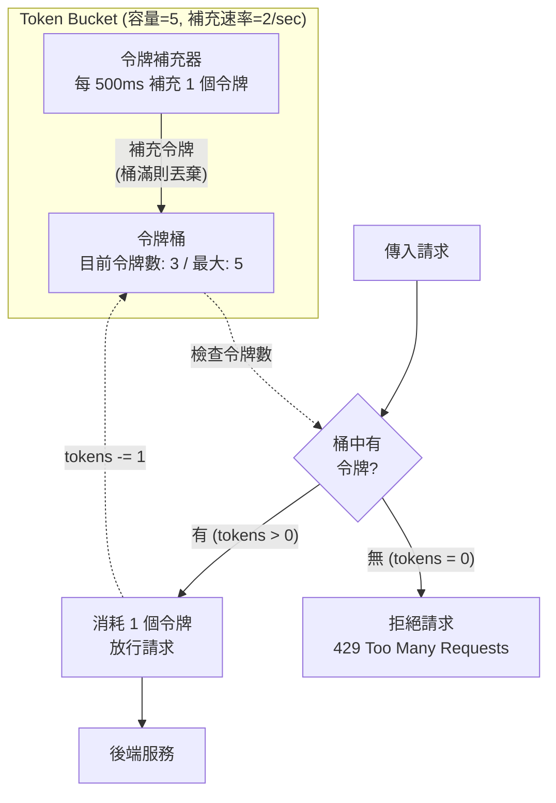
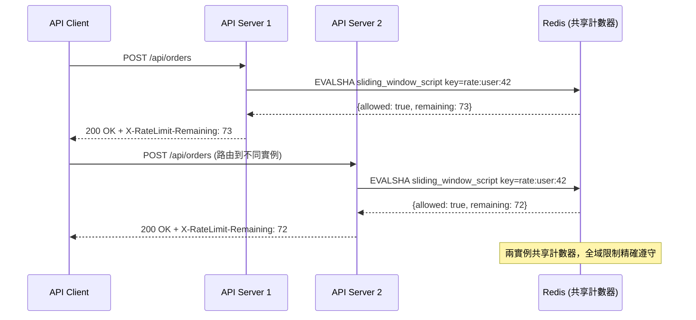

# Rate Limiting & Throttling / 速率限制與節流

## Intent / 意圖

保護服務免受過量請求衝擊，在請求進入業務邏輯之前將超量流量攔截，避免下游服務被壓垮。核心問題：**當請求速率超過系統承載能力時，如何公平且高效地控制流量，並對合法使用者提供清楚的回饋？**

---

## Problem / 問題情境

**場景一：API 濫用** — SaaS 客戶腳本因 bug 進入無限迴圈，每秒 5,000 次請求耗盡連線池，所有其他客戶逾時。有限流的話超過配額後立即收到 `429 Too Many Requests`，其他客戶不受影響。

**場景二：DDoS 攻擊** — 電商促銷遭殭屍網路攻擊，偽裝合法請求穿透 CDN/WAF。多層速率限制（IP + 使用者 + 全域）能在不同粒度攔截異常流量。

**場景三：Noisy Neighbor** — 多租戶平台上，免費方案客戶在生產環境跑壓測，消耗大量共享資源。基於租戶的速率限制確保每個租戶只能使用配額內的資源。

---

## Core Concepts / 核心概念

### Token Bucket / 令牌桶

桶以固定速率填入令牌，每個請求消耗一個。桶有最大容量（burst capacity），桶滿時新令牌丟棄，桶空時拒絕。允許短暫突發流量。Amazon API Gateway 和 NGINX 預設使用此演算法。

### Leaky Bucket / 漏桶

請求以任意速率進入桶，以固定速率流出處理。桶滿時丟棄新請求。與 token bucket 的差異：輸出速率恆定，不允許突發。適合需要平滑處理速率的場景。

### Fixed Window Counter / 固定窗口計數器

時間切成固定窗口（如每分鐘），每窗口維護計數器。實作簡單（Redis `INCR` + `EXPIRE`），但有邊界問題：窗口尾端和下一窗口開端各發送接近閾值的請求，短時間內可達閾值兩倍。

### Sliding Window Log / 滑動窗口日誌

每個請求的精確時間戳記錄到 Redis `ZSET`，統計窗口內記錄數。精確度最高但記憶體消耗大，不適合高 QPS。

### Sliding Window Counter / 滑動窗口計數器

結合 fixed window 和 sliding window log。維護當前窗口和前窗口的計數器，依比例加權：`estimated = prev_count * (1 - elapsed_ratio) + curr_count`。記憶體效率高，生產環境最常見。

### Rate Limit Headers / 速率限制回應標頭

- `X-RateLimit-Limit`：窗口內最大請求數 / `X-RateLimit-Remaining`：剩餘請求數
- `X-RateLimit-Reset`：窗口重置的 Unix 時間戳 / `Retry-After`：應等待秒數（RFC 7231）

### Distributed Rate Limiting / 分散式速率限制

單實例本地限流無法保護系統——10 個實例各限 100 req/s，全域實際允許 1,000 req/s。分散式限流使用 Redis 等共享計數器跨實例協調。

### Local vs Global Rate Limiting / 本地 vs 全域速率限制

- **本地**：獨立計數，無網路開銷，但無法精確控制全域總量。
- **全域**：透過 Redis 計數，每請求多一次往返（0.5-2ms），限額精確共享。
- **混合**：本地粗粒度快速拒絕（IP 級別），全域精確限流（API key 級別）。Envoy 採用此策略。

---

## Architecture / 架構

### Token Bucket 演算法視覺化



### 分散式速率限制架構（Redis）



---

## How It Works / 運作原理

### Token Bucket 逐步說明

1. **初始化**：設定桶容量（burst size）和補充速率（rate），初始桶裝滿。
2. **Lazy refill**：每次請求到來時根據時間差一次性補充令牌，無需背景執行緒。
3. **請求處理**：有令牌則消耗一個放行，無則回傳 429。
4. **突發容忍**：容量 50、速率 10 req/s = 允許瞬間 50 個突發，之後每秒 10 個。

### Sliding Window Counter — Redis Lua Script

Lua script 保證原子性。Rust 和 Go 實作中均嵌入此 script。

```lua
-- sliding_window_counter.lua
-- KEYS[1] = rate limit key prefix  ARGV[1] = window_size  ARGV[2] = max_requests  ARGV[3] = now_ms

local key_prefix = KEYS[1]
local window_size = tonumber(ARGV[1])
local max_requests = tonumber(ARGV[2])
local now_ms = tonumber(ARGV[3])

local current_window = math.floor(now_ms / 1000 / window_size) * window_size
local previous_window = current_window - window_size
local elapsed_ratio = (now_ms - current_window * 1000) / (window_size * 1000)

local prev_count = tonumber(redis.call("GET", key_prefix..":"..previous_window) or "0")
local curr_count = tonumber(redis.call("GET", key_prefix..":"..current_window) or "0")
local estimated = prev_count * (1 - elapsed_ratio) + curr_count

if estimated >= max_requests then
    return {0, max_requests - math.ceil(estimated), current_window + window_size}
end

local curr_key = key_prefix..":"..current_window
curr_count = redis.call("INCR", curr_key)
redis.call("EXPIRE", curr_key, window_size * 2)
local remaining = max_requests - math.ceil(prev_count * (1 - elapsed_ratio) + curr_count)
return {1, remaining, current_window + window_size}
```

---

## Rust 實作

Axum middleware + Redis sliding window counter。包含 fail-open、rate limit headers、API key / IP 提取。

```rust
// rate_limiter.rs — Axum middleware with Redis sliding window counter

use axum::{
    Router, body::Body, extract::State,
    http::{HeaderMap, HeaderValue, Request, StatusCode},
    middleware::{self, Next}, response::{IntoResponse, Response}, routing::get,
};
use redis::aio::MultiplexedConnection;
use std::{sync::Arc, time::{SystemTime, UNIX_EPOCH}};

#[derive(Clone)]
struct RateLimitConfig { window_seconds: u64, max_requests: u64 }

#[derive(Clone)]
struct AppState {
    redis_conn: MultiplexedConnection,
    config: RateLimitConfig,
    script: Arc<redis::Script>,
}

const SLIDING_WINDOW_LUA: &str = r#"
local key_prefix=KEYS[1] local ws=tonumber(ARGV[1]) local mx=tonumber(ARGV[2])
local now=tonumber(ARGV[3]) local cw=math.floor(now/1000/ws)*ws local pw=cw-ws
local er=(now-cw*1000)/(ws*1000)
local pc=tonumber(redis.call("GET",key_prefix..":"..pw) or "0")
local cc=tonumber(redis.call("GET",key_prefix..":"..cw) or "0")
local est=pc*(1-er)+cc
if est>=mx then return {0,mx-math.ceil(est),cw+ws} end
local ck=key_prefix..":"..cw cc=redis.call("INCR",ck) redis.call("EXPIRE",ck,ws*2)
return {1,mx-math.ceil(pc*(1-er)+cc),cw+ws}
"#;

fn extract_rate_limit_key(headers: &HeaderMap) -> String {
    if let Some(api_key) = headers.get("X-API-Key").and_then(|v| v.to_str().ok()) {
        return format!("rate:apikey:{}", api_key);
    }
    if let Some(ip) = headers.get("X-Forwarded-For").and_then(|v| v.to_str().ok()) {
        return format!("rate:ip:{}", ip.split(',').next().unwrap_or("unknown").trim());
    }
    "rate:ip:unknown".to_string()
}

async fn rate_limit_middleware(
    State(state): State<AppState>, request: Request<Body>, next: Next,
) -> Response {
    let key = extract_rate_limit_key(request.headers());
    let mut conn = state.redis_conn.clone();
    let now_ms = SystemTime::now().duration_since(UNIX_EPOCH).unwrap().as_millis() as u64;

    // 執行 Lua script 取得限流結果
    let result: Result<Vec<i64>, _> = state.script.key(&key)
        .arg(state.config.window_seconds).arg(state.config.max_requests).arg(now_ms)
        .invoke_async(&mut conn).await;

    let vals = match result {
        Ok(v) => v,
        Err(err) => {
            // fail-open：Redis 故障時放行
            eprintln!("[RATE-LIMIT-ERROR] Redis: {}, allowing request", err);
            return next.run(request).await;
        }
    };
    let (allowed, remaining, reset_at) = (vals[0] == 1, vals[1].max(0) as u64, vals[2] as u64);

    let mut headers = HeaderMap::new();
    headers.insert("X-RateLimit-Limit", HeaderValue::from(state.config.max_requests));
    headers.insert("X-RateLimit-Remaining", HeaderValue::from(remaining));
    headers.insert("X-RateLimit-Reset", HeaderValue::from(reset_at));

    if !allowed {
        let now_s = SystemTime::now().duration_since(UNIX_EPOCH).unwrap().as_secs();
        headers.insert("Retry-After", HeaderValue::from(reset_at.saturating_sub(now_s)));
        return (StatusCode::TOO_MANY_REQUESTS, headers, "Rate limit exceeded").into_response();
    }
    let mut response = next.run(request).await;
    response.headers_mut().extend(headers);
    response
}

#[tokio::main]
async fn main() {
    let client = redis::Client::open("redis://127.0.0.1:6379/").unwrap();
    let conn = client.get_multiplexed_async_connection().await.unwrap();
    let state = AppState {
        redis_conn: conn,
        config: RateLimitConfig { window_seconds: 60, max_requests: 100 },
        script: Arc::new(redis::Script::new(SLIDING_WINDOW_LUA)),
    };
    let handler = get(|| async { (StatusCode::OK, r#"{"orders":[]}"#) });
    let app = Router::new()
        .route("/api/orders", handler)
        .layer(middleware::from_fn_with_state(state.clone(), rate_limit_middleware))
        .with_state(state);
    let listener = tokio::net::TcpListener::bind("0.0.0.0:3000").await.unwrap();
    axum::serve(listener, app).await.unwrap();
}
// Output:
// Listening on :3000, rate limit: 100 req / 60s
// (req) -> 200 OK  X-RateLimit-Remaining: 99
// (req) -> 429 Too Many Requests  Retry-After: 42
```

---

## Go 實作

等價的 `net/http` middleware，相同 Lua script。

```go
// rate_limiter.go — net/http middleware with Redis sliding window counter
package main

import (
	"context"; "fmt"; "log"; "net/http"; "strconv"; "strings"; "time"
	"github.com/redis/go-redis/v9"
)

type RateLimitConfig struct{ WindowSeconds, MaxRequests int64 }
type RateLimitResult struct{ Allowed bool; Limit, Remaining, ResetAt int64 }

type RateLimiter struct {
	client *redis.Client
	config RateLimitConfig
	script *redis.Script
}

const slidingWindowLua = `
local kp=KEYS[1] local ws=tonumber(ARGV[1]) local mx=tonumber(ARGV[2])
local now=tonumber(ARGV[3]) local cw=math.floor(now/1000/ws)*ws local pw=cw-ws
local er=(now-cw*1000)/(ws*1000)
local pc=tonumber(redis.call("GET",kp..":"..pw) or "0")
local cc=tonumber(redis.call("GET",kp..":"..cw) or "0")
local est=pc*(1-er)+cc
if est>=mx then return {0,mx-math.ceil(est),cw+ws} end
local ck=kp..":"..cw cc=redis.call("INCR",ck) redis.call("EXPIRE",ck,ws*2)
return {1,mx-math.ceil(pc*(1-er)+cc),cw+ws}
`

func NewRateLimiter(addr string, cfg RateLimitConfig) *RateLimiter {
	return &RateLimiter{
		client: redis.NewClient(&redis.Options{Addr: addr, PoolSize: 20}),
		config: cfg,
		script: redis.NewScript(slidingWindowLua),
	}
}

func extractKey(r *http.Request) string {
	if k := r.Header.Get("X-API-Key"); k != "" {
		return "rate:apikey:" + k
	}
	if f := r.Header.Get("X-Forwarded-For"); f != "" {
		return "rate:ip:" + strings.TrimSpace(strings.SplitN(f, ",", 2)[0])
	}
	return "rate:ip:unknown"
}

func (rl *RateLimiter) Check(ctx context.Context, key string) (*RateLimitResult, error) {
	res, err := rl.script.Run(ctx, rl.client,
		[]string{key}, rl.config.WindowSeconds, rl.config.MaxRequests, time.Now().UnixMilli(),
	).Int64Slice()
	if err != nil {
		return nil, fmt.Errorf("rate limit script: %w", err)
	}
	remaining := res[1]
	if remaining < 0 { remaining = 0 }
	return &RateLimitResult{
		Allowed: res[0] == 1, Limit: rl.config.MaxRequests,
		Remaining: remaining, ResetAt: res[2],
	}, nil
}

func (rl *RateLimiter) Middleware(next http.Handler) http.Handler {
	return http.HandlerFunc(func(w http.ResponseWriter, r *http.Request) {
		result, err := rl.Check(r.Context(), extractKey(r))
		if err != nil {
			// fail-open：Redis 故障時放行請求
			log.Printf("[RATE-LIMIT-ERROR] %v, allowing request", err)
			next.ServeHTTP(w, r)
			return
		}
		w.Header().Set("X-RateLimit-Limit", strconv.FormatInt(result.Limit, 10))
		w.Header().Set("X-RateLimit-Remaining", strconv.FormatInt(result.Remaining, 10))
		w.Header().Set("X-RateLimit-Reset", strconv.FormatInt(result.ResetAt, 10))

		if !result.Allowed {
			retryAfter := result.ResetAt - time.Now().Unix()
			if retryAfter < 1 { retryAfter = 1 }
			w.Header().Set("Retry-After", strconv.FormatInt(retryAfter, 10))
			http.Error(w, "Rate limit exceeded", http.StatusTooManyRequests)
			return
		}
		next.ServeHTTP(w, r)
	})
}

func main() {
	limiter := NewRateLimiter("127.0.0.1:6379", RateLimitConfig{WindowSeconds: 60, MaxRequests: 100})
	mux := http.NewServeMux()
	mux.HandleFunc("GET /api/orders", func(w http.ResponseWriter, _ *http.Request) {
		fmt.Fprint(w, `{"orders":[]}`)
	})
	server := &http.Server{Addr: ":3000", Handler: limiter.Middleware(mux)}
	log.Fatal(server.ListenAndServe())
}
// Output:
// Listening on :3000, rate limit: 100 req / 60s
// (req) -> 200 OK  X-RateLimit-Remaining: 99
// (req) -> 429 Too Many Requests  Retry-After: 42
```

---

## Rust vs Go 對照表

| 面向 | Rust (Axum + redis-rs) | Go 1.24+ (net/http + go-redis) |
|---|---|---|
| **Middleware 整合** | `middleware::from_fn_with_state` 型別安全，編譯期確認狀態類型。需理解 `tower::Layer` 抽象層 | `func(http.Handler) http.Handler` 極為直覺。共享狀態透過閉包捕獲，無編譯期驗證 |
| **Redis 連線管理** | `MultiplexedConnection` 多工共享單條 TCP 連線。極端 QPS（>100K）需手動建連線池 | `go-redis` 內建連線池（`PoolSize` 預設 10），池化模型高並發下更穩定，但取用歸還有鎖開銷 |
| **Fail-Open 安全性** | `Result<T,E>` + `match` 強制處理 Redis 故障，忘記即編譯錯誤 | `if err != nil` 簡潔但忘記不會編譯錯誤。`result, _ := rl.Check(...)` 危險程式碼會 panic |

---

## When to Use / 適用場景

### 1. Public API Protection / 公開 API 保護

任何公開 API 都應有限流。GitHub（5,000/hr）、Stripe（100/s）、Twitter（900/15min）都實施嚴格限流。

### 2. Multi-Tenant Fairness / 多租戶公平性

依訂閱等級分配配額（Free: 100/min, Pro: 1,000/min, Enterprise: 10,000/min）。限流既保護系統也驅動升級。

### 3. Downstream Cost Protection / 下游成本保護

調用付費第三方 API（OpenAI、Twilio）時防止失控迴圈造成成本爆炸。

---

## When NOT to Use / 不適用場景

### 1. Internal Trusted Services / 內部受信任的服務間通訊

微服務間同步呼叫流量可預測，加限流只增加延遲。應用 circuit breaker 和 bulkhead。

### 2. Latency-Critical Hot Paths / 延遲敏感的關鍵路徑

分散式限流每請求需 Redis 往返（0.5-2ms），對高頻交易不可接受。用純本地 in-memory 限流（Go: `golang.org/x/time/rate`、Rust: `governor`）。

---

## Real-World Examples / 真實世界案例

**GitHub API** — 已認證 5,000/hr，未認證 60/hr（依 IP）。標準 rate limit headers，被限流回傳 `403`（歷史原因）。GraphQL 使用點數系統，依查詢複雜度消耗不同點數。

**Cloudflare** — CDN edge 攔截，支援 IP/ASN/國家/URL pattern 多維度規則。全球分散式計數器容忍短暫不一致換取極低延遲。

**Stripe** — Live mode 100/s。429 附帶 `Retry-After`；SDK 內建指數退避 + jitter；webhook 獨立重試（最多 7 天）；高流量 endpoint 可申請提高。

---

## Interview Questions / 面試常見問題

### Q1: Token bucket 和 sliding window counter 有何差異？

**A:** Token bucket 允許突發（桶中有令牌就可瞬間處理大量請求），適合使用者互動型 API。Sliding window counter 更均勻分配配額，適合成本控制場景。

### Q2: 分散式速率限制的一致性挑戰？

**A:** 核心是 CAP 取捨。嚴格一致（每請求查 Redis）保證精確但增加延遲。實務上採 fail-open——Redis 不可用時放行，寧可短暫超額也不因限流故障拒絕所有請求。

### Q3: 如何防止窗口重置的 thundering herd？

**A:** (1) Sliding window counter 配額漸進恢復，無硬性重置；(2) `Retry-After` 加隨機 jitter；(3) 連續被限流時指數退避。

### Q4: Redis 掛了應 fail-open 還是 fail-closed？

**A:** 幾乎全部選 fail-open。fail-closed = Redis 掛時自己 DDoS 自己。例外：安全場景（防暴力破解）可 fail-closed + in-memory fallback。

### Q5: 如何設計多租戶分層限流？

**A:** 三層：(1) 全域——系統總容量；(2) 租戶——依訂閱等級；(3) 端點——高成本 endpoint 額外限制。順序：全域 -> 租戶 -> 端點，任一觸發即拒絕。

---

## Pitfalls / 常見陷阱

### 1. Race Condition：非原子的 Check-and-Increment

```go
// 危險：check 和 increment 之間存在 race condition
count, _ := client.Get(ctx, "rate:user:42").Int64()
if count < maxRequests {
    client.Incr(ctx, "rate:user:42")  // 多個請求同時通過 check
}
```

高並發下多請求讀到相同 `count` 全部通過——處理數遠超限額。必須用 Lua script 封裝為原子操作。

### 2. Clock Drift / 時鐘偏移

多個 API server 時鐘不同步時計算出不同窗口，計數分散在不同 Redis key，限額被放大。對策：Lua script 中用 `redis.call('TIME')` 取 Redis 時間。

### 3. Thundering Herd at Reset / 窗口重置羊群效應

Fixed window 結束瞬間所有被限流客戶端同時重試。用 sliding window（漸進恢復）加 `Retry-After` 隨機 jitter 緩解。

### 4. Fail-Closed 自我 DDoS

Redis 故障時回傳 429 等於自己製造中斷，客戶端重試形成惡性循環。應 fail-open + 監控告警，搭配本地 in-memory 令牌桶後備。

---

## Cross-references / 交叉引用

- [[15_distributed_locking|Distributed Locking / 分散式鎖]] — 共享 Redis / Lua script 基礎設施，但鎖保證互斥、限流保證速率。
- [[12_cap_consistency_models|CAP Theorem / CAP 定理]] — 分散式限流是 CAP 取捨典型案例：嚴格一致偏 CP，fail-open 偏 AP。
- [[16_message_queue_fundamentals|Message Queue Fundamentals / 訊息佇列基礎]] — Leaky bucket 與消費端限流高度相似，恆定速率處理工作項。

---

## References / 參考資料

1. **System Design: Rate Limiter** — Alex Xu, *System Design Interview* Vol.1 Ch.4. 五種演算法比較與分散式部署。
2. **IETF draft-ietf-httpapi-ratelimit-headers** — (https://datatracker.ietf.org/doc/draft-ietf-httpapi-ratelimit-headers/) Rate limit HTTP 標頭標準化提案。
3. **Redis Patterns: Rate Limiting** — (https://redis.io/docs/manual/patterns/) Token bucket / sliding window 的 Redis 實作。
4. **Envoy Rate Limit Filter** — (https://www.envoyproxy.io/docs/envoy/latest/configuration/http/http_filters/rate_limit_filter) Local + global 混合策略。
5. **Rate Limiting Strategies** — Stripe Engineering Blog. 多層限流架構實務。
6. **DDIA** — Martin Kleppmann. Ch.12 背壓（backpressure）與流量控制。
