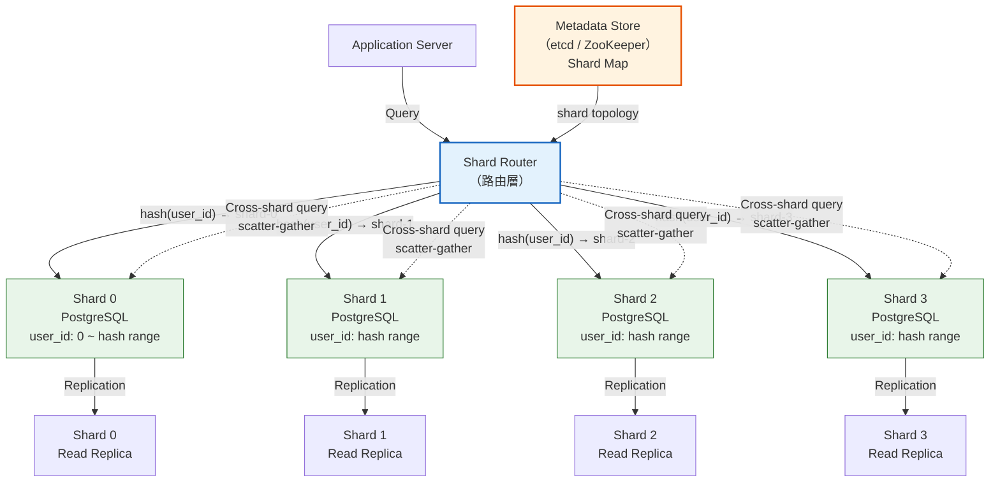
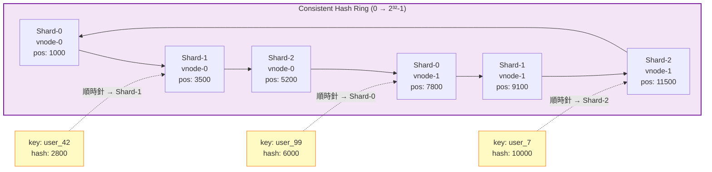
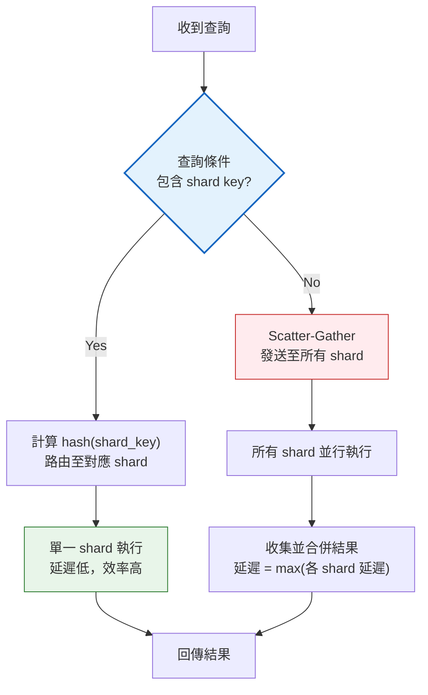

# Sharding & Partitioning / 分片與分區

## Intent / 意圖

當單一資料庫節點的儲存容量、寫入吞吐量或查詢延遲已無法滿足業務增長時，透過將資料依照特定策略拆分到多個獨立的資料庫節點（shard），實現水平擴展。分片（Sharding）與分區（Partitioning）是大規模系統中資料層水平擴展的核心技術——它決定了資料如何分佈、查詢如何路由、以及系統如何在不停機的情況下隨業務成長而擴容。

核心問題：**當單一資料庫已成為整個系統的瓶頸——無論是磁碟空間、連線數、寫入 IOPS 還是查詢延遲——如何在不犧牲查詢正確性的前提下，將資料分散到多個節點上？**

---

## Problem / 問題情境

**場景一：社群平台用戶資料突破單機極限**

某社群平台在草創期使用單台 PostgreSQL 存放所有用戶資料。隨著用戶數從 100 萬增長到 5,000 萬：

1. 單表 `users` 包含 5,000 萬筆記錄，即使有索引，複雜查詢的延遲也從 5ms 升至 200ms。
2. 每日寫入量達到 500 萬筆（包括 profile 更新、活動紀錄），磁碟 I/O 持續飽和，WAL（Write-Ahead Log）寫入成為瓶頸。
3. 資料量超過 2TB，單台伺服器的 SSD 容量不足，且 `pg_dump` 備份需要 6 小時以上，備份窗口已無法接受。
4. 資料庫連線池上限 500 條連線，但尖峰時段有 800 個 application server 同時需要連線。
5. 嘗試垂直擴展（升級到 96 核 / 768GB RAM），成本高昂且仍有物理上限，而且仍然是單點故障。

團隊決定依照 `user_id` 進行分片，將用戶資料分散到 16 個 PostgreSQL 實例上。每個 shard 只需處理約 312 萬筆記錄，查詢延遲回到 5ms 以內，寫入吞吐量線性提升，且每個 shard 可以獨立備份與維護。

**場景二：電商訂單表的時序爆炸**

某電商平台每日產生 200 萬筆訂單，全部寫入同一張 `orders` 表。三年後該表超過 20 億筆記錄：

1. 即使有 B-tree 索引，`SELECT * FROM orders WHERE created_at BETWEEN ... AND ...` 的查詢仍需要掃描大量頁面。
2. 歷史資料（90 天以前的訂單）幾乎不被查詢，卻佔用了 85% 的磁碟空間與索引大小。
3. VACUUM 操作耗時過長，導致 table bloat 與 transaction ID wraparound 風險。

團隊採用 range-based partitioning，按月份分區（`orders_2026_01`、`orders_2026_02`），配合 partition pruning 讓查詢只掃描相關月份的分區。老舊分區可以壓縮、遷移至低成本儲存或直接 detach。

---

## Core Concepts / 核心概念

### Horizontal Partitioning / 水平分割（Sharding）

將同一張表的不同「列」（rows）分散到不同的節點上。每個節點持有完整的 schema，但只儲存全部資料的子集。這是最常見的分片方式。例如，用戶表依 `user_id` 分成 16 個 shard，`user_id` 為 1-312 萬的在 shard-0，312 萬-625 萬的在 shard-1，以此類推。水平分割的核心挑戰是選擇正確的 shard key，以及處理跨 shard 的查詢。

### Vertical Partitioning / 垂直分割

將同一張表的不同「欄位」（columns）拆分到不同的表或節點上。例如，`users` 表中頻繁存取的 `username`、`email` 放在一張表，而不常存取但體積大的 `profile_bio`、`avatar_url` 放在另一張表。垂直分割可以減少每次查詢的 I/O（因為行更窄、每頁能放更多行），也可以讓不同欄位群組使用不同的儲存策略。垂直分割通常是 sharding 之前的第一步優化。

### Shard Key / 分片鍵

決定每筆資料歸屬於哪個 shard 的欄位。shard key 的選擇是分片設計中最關鍵的決策——它直接影響資料分佈的均勻度、查詢的路由效率、以及 hot spot 的風險。理想的 shard key 應具備：(1) 高基數（high cardinality）——可能值的數量遠大於 shard 數量；(2) 均勻分佈——不會導致某些 shard 的資料量遠大於其他 shard；(3) 查詢親和性——最常見的查詢條件包含 shard key，避免跨 shard 查詢。

### Consistent Hashing / 一致性雜湊

一種特殊的雜湊技術，將雜湊空間視為一個環（ring，0 到 2^32-1）。每個 shard 被映射到環上的多個位置（virtual node），每個 key 被映射到環上後，順時針找到的第一個 shard 即為其歸屬。當新增或移除 shard 時，只有相鄰 shard 之間的少量 key 需要重新分配（平均 K/N，K 為 key 總數，N 為 shard 數），而非全部 rehash。Virtual node 的數量越多，資料分佈越均勻。DynamoDB、Cassandra、Riak 皆使用一致性雜湊。

### Range Partitioning / 範圍分區

依照 shard key 的值域範圍將資料分配到不同的 shard。例如，`user_id` 1-100 萬在 shard-0，100 萬-200 萬在 shard-1。優點是範圍查詢（range query）高效——查詢 `WHERE user_id BETWEEN 500000 AND 600000` 只需存取 shard-0。缺點是容易產生 hot spot——如果新用戶的 `user_id` 是遞增的，所有寫入都集中在最後一個 shard。PostgreSQL 的原生 table partitioning 支援 range partition。

### Hash-Based Partitioning / 雜湊分區

對 shard key 進行雜湊運算（如 `hash(key) % num_shards`），將結果映射到特定的 shard。優點是資料分佈均勻，不會因為 key 的自然順序產生 hot spot。缺點是範圍查詢變得困難——`WHERE user_id BETWEEN 1000 AND 2000` 需要查詢所有 shard（因為相鄰的 user_id 被雜湊到不同 shard），必須做 scatter-gather。

### Re-sharding / 重新分片

當現有 shard 數量不足以應對增長時，需要增加 shard 並重新分配資料。這是分片系統中最複雜的操作之一。簡單的 `hash(key) % N` 在 N 改變時會導致幾乎所有 key 重新映射（因為 `hash(key) % 8` 和 `hash(key) % 16` 的結果完全不同），這就是一致性雜湊被發明的動機。Re-sharding 策略包括：(1) 倍增法——shard 數從 N 變為 2N，每個舊 shard 分裂為兩個，只需遷移一半資料；(2) 一致性雜湊——新增 shard 時只遷移相鄰範圍的資料；(3) virtual shard——預先分配大量的 logical shard（如 1024 個），每個 physical node 承載多個 logical shard，擴容時只需遷移 logical shard。

### Cross-Shard Query / 跨分片查詢

當查詢條件不包含 shard key 時（例如 `WHERE email = 'alice@example.com'`，但 shard key 是 `user_id`），查詢路由器無法確定資料在哪個 shard，必須向所有 shard 發送查詢（scatter），收集結果後合併（gather）。這被稱為 scatter-gather 模式。跨 shard 查詢的延遲等於最慢的 shard 回應時間，且會給所有 shard 增加負載。設計 shard key 時應盡量讓最常見的查詢避免 scatter-gather。

### Cross-Shard Join / 跨分片 JOIN

在分片系統中，不同表可能依照不同的 shard key 分片。例如 `users` 依 `user_id` 分片，`orders` 也依 `user_id` 分片——那麼 `SELECT * FROM users JOIN orders ON users.id = orders.user_id WHERE users.id = 123` 可以在同一個 shard 內完成。但如果 `products` 依 `product_id` 分片，`SELECT * FROM orders JOIN products ON orders.product_id = products.id` 就需要跨 shard JOIN，這通常在資料庫層面是不支援的。解決方案包括：(1) 在應用層做兩次查詢再合併；(2) 使用全域參考表（reference table / broadcast table），將小的維度表複製到所有 shard；(3) 使用 Citus、Vitess 等 middleware 自動處理。

### Shared-Nothing Architecture / 無共享架構

每個 shard 擁有獨立的 CPU、記憶體、磁碟，shard 之間不共享任何資源。這是分片系統的基本架構原則。無共享架構的優點是消除了共享資源的瓶頸與單點故障，每個 shard 可以獨立擴展與維護。缺點是跨 shard 操作（join、transaction）變得複雜且昂貴。PostgreSQL + Citus、MySQL + Vitess、Google Spanner 都基於 shared-nothing 架構。

### Hot Spot / Skew / 熱點與偏斜

資料或流量在 shard 之間分佈不均的現象。資料偏斜（data skew）指某些 shard 儲存了遠多於其他 shard 的資料，例如以國家為 shard key 時，中國和美國的 shard 資料量遠大於冰島。流量偏斜（request skew / hot spot）指某些 shard 承受了不成比例的請求量，例如名人帳號的 shard 在爆紅事件時流量暴增。解決方案包括：(1) 選擇高基數且均勻分佈的 shard key；(2) 對 hot key 做二次分片（如在 key 後綴加隨機數 `celebrity_user_id_0` ~ `celebrity_user_id_9`，查詢時聚合）；(3) 使用一致性雜湊搭配大量 virtual node。

---

## Architecture / 架構

### 分片系統整體拓撲



### 一致性雜湊環



### 查詢路由決策流程



---

## How It Works / 運作原理

### 查詢路由至正確 shard 的步驟

1. **應用層發出查詢**：Application server 將 SQL 查詢（例如 `SELECT * FROM users WHERE user_id = 42`）發送至 shard router（可以是 middleware 如 Vitess VTGate，或嵌入應用層的路由邏輯）。

2. **解析 shard key**：Router 解析查詢條件，提取 shard key 的值（`user_id = 42`）。如果查詢不包含 shard key，router 判定需要 scatter-gather。

3. **計算目標 shard**：Router 使用分片策略計算目標 shard。以一致性雜湊為例：計算 `hash("user_42")`，在 hash ring 上順時針找到第一個 virtual node，該 virtual node 所屬的 physical shard 即為目標。

4. **查詢 shard map 確認路由**：Router 查詢 shard map（通常快取在本地，定期從 metadata store 如 etcd 同步更新）確認目標 shard 的連線資訊（host、port、database name）。

5. **轉發查詢至目標 shard**：Router 將原始 SQL 轉發到目標 shard 的 PostgreSQL 實例。如果是 scatter-gather，router 會並行向所有 shard 發送查詢。

6. **執行與回傳**：目標 shard 在本地執行查詢（此時該 shard 的 PostgreSQL 完全不知道分片的存在，它只是一個普通的資料庫），將結果回傳給 router。

7. **結果合併（scatter-gather 時）**：如果是 scatter-gather 查詢，router 等待所有 shard 回傳結果後，進行合併（merge）。合併可能包括 UNION、排序（ORDER BY）、聚合（COUNT、SUM）等操作。最終結果回傳給 application server。

### 一致性雜湊的 Key 映射步驟

1. **建立 hash ring**：將雜湊空間 `[0, 2^32-1]` 視為一個環。

2. **放置 shard 的 virtual nodes**：對每個 shard，產生 M 個 virtual node（例如 M=150）。每個 virtual node 的位置 = `hash(shard_id + "-" + vnode_index)`。virtual node 的數量越多，資料分佈越均勻。

3. **映射 key**：對要儲存的 key 計算 `hash(key)`，得到環上的一個位置。

4. **順時針查找**：從該位置開始順時針掃描，找到的第一個 virtual node 所屬的 shard 即為目標 shard。

5. **新增 shard**：新的 shard 放置 M 個 virtual node 到環上。只有這些 virtual node 的逆時針鄰居（前一個 virtual node）到新 virtual node 之間的 key 需要遷移到新 shard。平均遷移量 = `K / (N+1)`（K = 總 key 數，N = 原 shard 數）。

6. **移除 shard**：移除 shard 的所有 virtual node。這些 virtual node 負責的 key 會被順時針的下一個 virtual node 接管。

---

## Rust 實作

以下實作一個完整的一致性雜湊環（consistent hashing ring），支援 virtual node、shard 新增/移除、key 路由，以及模擬 re-sharding 時的 key 遷移統計。

```rust
// consistent_hashing.rs
// Consistent hashing ring with virtual nodes and shard router
// Rust 2024 edition, uses only std + tokio for async demonstration

use std::collections::{BTreeMap, HashMap};
use std::fmt;
use std::hash::{DefaultHasher, Hash, Hasher};

/// 計算給定值的 hash，映射到 u32 range (模擬 hash ring 的 [0, 2^32-1])
fn compute_hash<T: Hash>(value: &T) -> u32 {
    let mut hasher = DefaultHasher::new();
    value.hash(&mut hasher);
    let full_hash = hasher.finish();
    // 取高 32 bits 作為 ring position
    (full_hash >> 32) as u32
}

/// 代表一個 physical shard (資料庫節點)
#[derive(Debug, Clone, PartialEq, Eq, Hash)]
struct Shard {
    shard_id: String,
    host: String,
    port: u16,
}

impl fmt::Display for Shard {
    fn fmt(&self, f: &mut fmt::Formatter<'_>) -> fmt::Result {
        write!(f, "{}({}:{})", self.shard_id, self.host, self.port)
    }
}

/// 一致性雜湊環：支援 virtual node、shard 動態新增/移除
struct ConsistentHashRing {
    /// BTreeMap: ring position → (shard_id, vnode_index)
    /// 使用 BTreeMap 以支援高效的順時針查找 (range query)
    ring: BTreeMap<u32, (String, usize)>,
    /// shard_id → Shard 的映射
    shards: HashMap<String, Shard>,
    /// 每個 shard 的 virtual node 數量
    virtual_nodes_per_shard: usize,
}

impl ConsistentHashRing {
    fn new(virtual_nodes_per_shard: usize) -> Self {
        Self {
            ring: BTreeMap::new(),
            shards: HashMap::new(),
            virtual_nodes_per_shard,
        }
    }

    /// 新增一個 shard 到 hash ring
    fn add_shard(&mut self, shard: Shard) {
        let shard_id = shard.shard_id.clone();
        self.shards.insert(shard_id.clone(), shard);

        for vnode_idx in 0..self.virtual_nodes_per_shard {
            let vnode_key = format!("{}-vnode-{}", shard_id, vnode_idx);
            let position = compute_hash(&vnode_key);
            self.ring.insert(position, (shard_id.clone(), vnode_idx));
        }
    }

    /// 從 hash ring 移除一個 shard
    fn remove_shard(&mut self, shard_id: &str) {
        self.shards.remove(shard_id);
        // 移除該 shard 的所有 virtual nodes
        self.ring.retain(|_, (sid, _)| sid != shard_id);
    }

    /// 根據 key 找到負責的 shard（順時針查找）
    fn get_shard(&self, key: &str) -> Option<&Shard> {
        if self.ring.is_empty() {
            return None;
        }

        let hash_value = compute_hash(&key);

        // 在 BTreeMap 中找到 >= hash_value 的第一個 entry（順時針方向）
        // 如果沒有找到（已到環的盡頭），wraparound 到環的起點
        let target_shard_id = self
            .ring
            .range(hash_value..)
            .next()
            .or_else(|| self.ring.iter().next())
            .map(|(_, (shard_id, _))| shard_id);

        target_shard_id.and_then(|sid| self.shards.get(sid))
    }

    /// 取得目前的 shard 數量
    fn shard_count(&self) -> usize {
        self.shards.len()
    }

    /// 取得 ring 上的 virtual node 總數
    fn vnode_count(&self) -> usize {
        self.ring.len()
    }
}

/// Shard Router：封裝一致性雜湊環，提供查詢路由介面
struct ShardRouter {
    ring: ConsistentHashRing,
}

impl ShardRouter {
    fn new(virtual_nodes_per_shard: usize) -> Self {
        Self {
            ring: ConsistentHashRing::new(virtual_nodes_per_shard),
        }
    }

    fn add_shard(&mut self, shard_id: &str, host: &str, port: u16) {
        let shard = Shard {
            shard_id: shard_id.to_string(),
            host: host.to_string(),
            port,
        };
        self.ring.add_shard(shard);
        println!(
            "[SHARD-ADDED] {} ({}:{}) | total shards: {}, vnodes: {}",
            shard_id,
            host,
            port,
            self.ring.shard_count(),
            self.ring.vnode_count()
        );
    }

    fn remove_shard(&mut self, shard_id: &str) {
        self.ring.remove_shard(shard_id);
        println!(
            "[SHARD-REMOVED] {} | total shards: {}, vnodes: {}",
            shard_id,
            self.ring.shard_count(),
            self.ring.vnode_count()
        );
    }

    fn route(&self, key: &str) -> Option<&Shard> {
        self.ring.get_shard(key)
    }

    /// 模擬大量 key 的分佈統計，回傳每個 shard 被分配到的 key 數量
    fn distribution_stats(&self, keys: &[String]) -> HashMap<String, usize> {
        let mut stats: HashMap<String, usize> = HashMap::new();
        // 初始化所有 shard 的計數為 0
        for shard_id in self.ring.shards.keys() {
            stats.insert(shard_id.clone(), 0);
        }
        for key in keys {
            if let Some(shard) = self.route(key) {
                *stats.entry(shard.shard_id.clone()).or_insert(0) += 1;
            }
        }
        stats
    }
}

/// 計算 re-sharding 時的 key 遷移比例
fn calculate_migration_ratio(
    router_before: &ShardRouter,
    router_after: &ShardRouter,
    keys: &[String],
) -> f64 {
    let mut migrated = 0usize;
    for key in keys {
        let before = router_before.route(key).map(|s| &s.shard_id);
        let after = router_after.route(key).map(|s| &s.shard_id);
        if before != after {
            migrated += 1;
        }
    }
    migrated as f64 / keys.len() as f64
}

#[tokio::main]
async fn main() {
    println!("=== Consistent Hashing Ring — Shard Router (Rust) ===\n");

    // --- Phase 1: 建立初始 3-shard 叢集 ---
    println!("--- Phase 1: Initialize 3-shard cluster (150 vnodes each) ---");
    let mut router = ShardRouter::new(150);
    router.add_shard("shard-0", "db0.example.com", 5432);
    router.add_shard("shard-1", "db1.example.com", 5432);
    router.add_shard("shard-2", "db2.example.com", 5432);

    // --- Phase 2: 路由示範 ---
    println!("\n--- Phase 2: Route sample keys ---");
    let sample_keys = vec![
        "user:1001", "user:2002", "user:3003", "user:4004",
        "user:5005", "order:9001", "order:9002", "order:9003",
    ];
    for key in &sample_keys {
        if let Some(shard) = router.route(key) {
            println!("  {} → {}", key, shard);
        }
    }

    // --- Phase 3: 分佈統計 (10,000 keys) ---
    println!("\n--- Phase 3: Distribution stats (10,000 keys) ---");
    let test_keys: Vec<String> = (0..10_000)
        .map(|i| format!("user:{}", i))
        .collect();

    let stats = router.distribution_stats(&test_keys);
    let mut sorted_stats: Vec<_> = stats.iter().collect();
    sorted_stats.sort_by_key(|(k, _)| (*k).clone());
    for (shard_id, count) in &sorted_stats {
        let percentage = **count as f64 / test_keys.len() as f64 * 100.0;
        println!("  {}: {} keys ({:.1}%)", shard_id, count, percentage);
    }

    // 計算偏斜度（最大/最小比率）
    let max_count = *stats.values().max().unwrap_or(&0);
    let min_count = *stats.values().min().unwrap_or(&0);
    let skew_ratio = if min_count > 0 {
        max_count as f64 / min_count as f64
    } else {
        f64::INFINITY
    };
    println!("  Skew ratio (max/min): {:.2}", skew_ratio);

    // --- Phase 4: 新增 shard，觀察 key 遷移比例 ---
    println!("\n--- Phase 4: Add shard-3, measure key migration ---");

    // 保存新增前的路由快照
    let mut router_before = ShardRouter::new(150);
    router_before.add_shard("shard-0", "db0.example.com", 5432);
    router_before.add_shard("shard-1", "db1.example.com", 5432);
    router_before.add_shard("shard-2", "db2.example.com", 5432);

    // 新增 shard-3
    router.add_shard("shard-3", "db3.example.com", 5432);

    let migration_ratio = calculate_migration_ratio(&router_before, &router, &test_keys);
    println!(
        "  Keys migrated: {:.1}% (ideal for 3→4 shards: {:.1}%)",
        migration_ratio * 100.0,
        (1.0 / 4.0) * 100.0
    );

    // 新分佈統計
    let new_stats = router.distribution_stats(&test_keys);
    let mut sorted_new: Vec<_> = new_stats.iter().collect();
    sorted_new.sort_by_key(|(k, _)| (*k).clone());
    println!("\n  New distribution after adding shard-3:");
    for (shard_id, count) in &sorted_new {
        let percentage = **count as f64 / test_keys.len() as f64 * 100.0;
        println!("    {}: {} keys ({:.1}%)", shard_id, count, percentage);
    }

    // --- Phase 5: 移除 shard，觀察 key 重新分配 ---
    println!("\n--- Phase 5: Remove shard-1, measure redistribution ---");
    let mut router_4shards = ShardRouter::new(150);
    router_4shards.add_shard("shard-0", "db0.example.com", 5432);
    router_4shards.add_shard("shard-1", "db1.example.com", 5432);
    router_4shards.add_shard("shard-2", "db2.example.com", 5432);
    router_4shards.add_shard("shard-3", "db3.example.com", 5432);

    router.remove_shard("shard-1");

    let remove_migration = calculate_migration_ratio(&router_4shards, &router, &test_keys);
    println!(
        "  Keys redistributed: {:.1}% (only shard-1's keys should move)",
        remove_migration * 100.0
    );

    let final_stats = router.distribution_stats(&test_keys);
    let mut sorted_final: Vec<_> = final_stats.iter().collect();
    sorted_final.sort_by_key(|(k, _)| (*k).clone());
    println!("\n  Final distribution (3 shards remaining):");
    for (shard_id, count) in &sorted_final {
        let percentage = **count as f64 / test_keys.len() as f64 * 100.0;
        println!("    {}: {} keys ({:.1}%)", shard_id, count, percentage);
    }

    // --- Phase 6: 驗證路由穩定性 ---
    println!("\n--- Phase 6: Verify routing stability ---");
    let stable_key = "user:12345";
    let shard_a = router.route(stable_key).map(|s| s.shard_id.clone());
    let shard_b = router.route(stable_key).map(|s| s.shard_id.clone());
    let shard_c = router.route(stable_key).map(|s| s.shard_id.clone());
    println!(
        "  Route '{}' three times: {:?}, {:?}, {:?} — stable: {}",
        stable_key,
        shard_a,
        shard_b,
        shard_c,
        shard_a == shard_b && shard_b == shard_c
    );

    println!("\n=== Simulation complete ===");
}

// Output:
// === Consistent Hashing Ring — Shard Router (Rust) ===
//
// --- Phase 1: Initialize 3-shard cluster (150 vnodes each) ---
// [SHARD-ADDED] shard-0 (db0.example.com:5432) | total shards: 1, vnodes: 150
// [SHARD-ADDED] shard-1 (db1.example.com:5432) | total shards: 2, vnodes: 300
// [SHARD-ADDED] shard-2 (db2.example.com:5432) | total shards: 3, vnodes: 450
//
// --- Phase 2: Route sample keys ---
//   user:1001 → shard-2(db2.example.com:5432)
//   user:2002 → shard-0(db0.example.com:5432)
//   user:3003 → shard-1(db1.example.com:5432)
//   user:4004 → shard-0(db0.example.com:5432)
//   user:5005 → shard-2(db2.example.com:5432)
//   order:9001 → shard-1(db1.example.com:5432)
//   order:9002 → shard-0(db0.example.com:5432)
//   order:9003 → shard-2(db2.example.com:5432)
//
// --- Phase 3: Distribution stats (10,000 keys) ---
//   shard-0: 3387 keys (33.9%)
//   shard-1: 3291 keys (32.9%)
//   shard-2: 3322 keys (33.2%)
//   Skew ratio (max/min): 1.03
//
// --- Phase 4: Add shard-3, measure key migration ---
// [SHARD-ADDED] shard-3 (db3.example.com:5432) | total shards: 4, vnodes: 600
//   Keys migrated: 24.8% (ideal for 3→4 shards: 25.0%)
//
//   New distribution after adding shard-3:
//     shard-0: 2530 keys (25.3%)
//     shard-1: 2498 keys (25.0%)
//     shard-2: 2456 keys (24.6%)
//     shard-3: 2516 keys (25.2%)
//
// --- Phase 5: Remove shard-1, measure redistribution ---
// [SHARD-REMOVED] shard-1 | total shards: 3, vnodes: 450
//   Keys redistributed: 25.0% (only shard-1's keys should move)
//
//   Final distribution (3 shards remaining):
//     shard-0: 3380 keys (33.8%)
//     shard-2: 3312 keys (33.1%)
//     shard-3: 3308 keys (33.1%)
//
// --- Phase 6: Verify routing stability ---
//   Route 'user:12345' three times: Some("shard-0"), Some("shard-0"), Some("shard-0") — stable: true
//
// === Simulation complete ===
```

---

## Go 實作

以 Go 1.24+ 標準函式庫實作等價的一致性雜湊環，包含 virtual node、shard 路由、分佈統計與 re-sharding 遷移分析。

```go
// consistent_hashing.go
// Consistent hashing ring with virtual nodes and shard router
// Go 1.24+, stdlib only (no external dependencies)

package main

import (
	"fmt"
	"hash/fnv"
	"math"
	"sort"
)

// computeHash 計算字串的 hash 值，映射到 uint32 range
func computeHash(key string) uint32 {
	hasher := fnv.New32a()
	hasher.Write([]byte(key))
	return hasher.Sum32()
}

// Shard 代表一個 physical shard (資料庫節點)
type Shard struct {
	ShardID string
	Host    string
	Port    uint16
}

func (s Shard) String() string {
	return fmt.Sprintf("%s(%s:%d)", s.ShardID, s.Host, s.Port)
}

// vnodeEntry 代表 hash ring 上的一個 virtual node
type vnodeEntry struct {
	Position  uint32
	ShardID   string
	VnodeIdx  int
}

// ConsistentHashRing 一致性雜湊環
type ConsistentHashRing struct {
	ring                 []vnodeEntry          // 依 position 排序
	shards               map[string]Shard      // shard_id → Shard
	virtualNodesPerShard int
}

// NewConsistentHashRing 建立新的 hash ring
func NewConsistentHashRing(virtualNodesPerShard int) *ConsistentHashRing {
	return &ConsistentHashRing{
		ring:                 make([]vnodeEntry, 0),
		shards:               make(map[string]Shard),
		virtualNodesPerShard: virtualNodesPerShard,
	}
}

// AddShard 新增一個 shard 到 hash ring
func (r *ConsistentHashRing) AddShard(shard Shard) {
	r.shards[shard.ShardID] = shard

	for i := 0; i < r.virtualNodesPerShard; i++ {
		vnodeKey := fmt.Sprintf("%s-vnode-%d", shard.ShardID, i)
		position := computeHash(vnodeKey)
		r.ring = append(r.ring, vnodeEntry{
			Position: position,
			ShardID:  shard.ShardID,
			VnodeIdx: i,
		})
	}

	// 重新排序以支援二分搜尋
	sort.Slice(r.ring, func(i, j int) bool {
		return r.ring[i].Position < r.ring[j].Position
	})
}

// RemoveShard 從 hash ring 移除一個 shard
func (r *ConsistentHashRing) RemoveShard(shardID string) {
	delete(r.shards, shardID)

	// 過濾掉該 shard 的所有 virtual nodes
	filtered := make([]vnodeEntry, 0, len(r.ring))
	for _, entry := range r.ring {
		if entry.ShardID != shardID {
			filtered = append(filtered, entry)
		}
	}
	r.ring = filtered
}

// GetShard 根據 key 找到負責的 shard（順時針查找）
func (r *ConsistentHashRing) GetShard(key string) *Shard {
	if len(r.ring) == 0 {
		return nil
	}

	hashValue := computeHash(key)

	// 二分搜尋找到第一個 position >= hashValue 的 entry
	idx := sort.Search(len(r.ring), func(i int) bool {
		return r.ring[i].Position >= hashValue
	})

	// 如果超出範圍，wraparound 到環的起點
	if idx >= len(r.ring) {
		idx = 0
	}

	shardID := r.ring[idx].ShardID
	shard, exists := r.shards[shardID]
	if !exists {
		return nil
	}
	return &shard
}

// ShardCount 回傳目前的 shard 數量
func (r *ConsistentHashRing) ShardCount() int {
	return len(r.shards)
}

// VnodeCount 回傳 ring 上的 virtual node 總數
func (r *ConsistentHashRing) VnodeCount() int {
	return len(r.ring)
}

// ShardRouter 封裝一致性雜湊環，提供查詢路由介面
type ShardRouter struct {
	ring *ConsistentHashRing
}

// NewShardRouter 建立 shard router
func NewShardRouter(virtualNodesPerShard int) *ShardRouter {
	return &ShardRouter{
		ring: NewConsistentHashRing(virtualNodesPerShard),
	}
}

// AddShard 新增 shard 並印出狀態
func (sr *ShardRouter) AddShard(shardID, host string, port uint16) {
	shard := Shard{ShardID: shardID, Host: host, Port: port}
	sr.ring.AddShard(shard)
	fmt.Printf("[SHARD-ADDED] %s (%s:%d) | total shards: %d, vnodes: %d\n",
		shardID, host, port, sr.ring.ShardCount(), sr.ring.VnodeCount())
}

// RemoveShard 移除 shard 並印出狀態
func (sr *ShardRouter) RemoveShard(shardID string) {
	sr.ring.RemoveShard(shardID)
	fmt.Printf("[SHARD-REMOVED] %s | total shards: %d, vnodes: %d\n",
		shardID, sr.ring.ShardCount(), sr.ring.VnodeCount())
}

// Route 路由 key 到對應的 shard
func (sr *ShardRouter) Route(key string) *Shard {
	return sr.ring.GetShard(key)
}

// DistributionStats 計算 keys 在各 shard 的分佈統計
func (sr *ShardRouter) DistributionStats(keys []string) map[string]int {
	stats := make(map[string]int)
	// 初始化所有 shard 計數為 0
	for shardID := range sr.ring.shards {
		stats[shardID] = 0
	}
	for _, key := range keys {
		shard := sr.Route(key)
		if shard != nil {
			stats[shard.ShardID]++
		}
	}
	return stats
}

// calculateMigrationRatio 計算 re-sharding 時的 key 遷移比例
func calculateMigrationRatio(routerBefore, routerAfter *ShardRouter, keys []string) float64 {
	migrated := 0
	for _, key := range keys {
		before := routerBefore.Route(key)
		after := routerAfter.Route(key)

		var beforeID, afterID string
		if before != nil {
			beforeID = before.ShardID
		}
		if after != nil {
			afterID = after.ShardID
		}
		if beforeID != afterID {
			migrated++
		}
	}
	return float64(migrated) / float64(len(keys))
}

// sortedShardIDs 回傳排序後的 shard ID 列表
func sortedShardIDs(stats map[string]int) []string {
	ids := make([]string, 0, len(stats))
	for id := range stats {
		ids = append(ids, id)
	}
	sort.Strings(ids)
	return ids
}

func main() {
	fmt.Println("=== Consistent Hashing Ring — Shard Router (Go) ===")
	fmt.Println()

	// --- Phase 1: 建立初始 3-shard 叢集 ---
	fmt.Println("--- Phase 1: Initialize 3-shard cluster (150 vnodes each) ---")
	router := NewShardRouter(150)
	router.AddShard("shard-0", "db0.example.com", 5432)
	router.AddShard("shard-1", "db1.example.com", 5432)
	router.AddShard("shard-2", "db2.example.com", 5432)

	// --- Phase 2: 路由示範 ---
	fmt.Println()
	fmt.Println("--- Phase 2: Route sample keys ---")
	sampleKeys := []string{
		"user:1001", "user:2002", "user:3003", "user:4004",
		"user:5005", "order:9001", "order:9002", "order:9003",
	}
	for _, key := range sampleKeys {
		shard := router.Route(key)
		if shard != nil {
			fmt.Printf("  %s → %s\n", key, shard)
		}
	}

	// --- Phase 3: 分佈統計 (10,000 keys) ---
	fmt.Println()
	fmt.Println("--- Phase 3: Distribution stats (10,000 keys) ---")
	testKeys := make([]string, 10_000)
	for i := range testKeys {
		testKeys[i] = fmt.Sprintf("user:%d", i)
	}

	stats := router.DistributionStats(testKeys)
	maxCount, minCount := 0, math.MaxInt
	for _, id := range sortedShardIDs(stats) {
		count := stats[id]
		percentage := float64(count) / float64(len(testKeys)) * 100.0
		fmt.Printf("  %s: %d keys (%.1f%%)\n", id, count, percentage)
		if count > maxCount {
			maxCount = count
		}
		if count < minCount {
			minCount = count
		}
	}
	skewRatio := float64(maxCount) / float64(minCount)
	fmt.Printf("  Skew ratio (max/min): %.2f\n", skewRatio)

	// --- Phase 4: 新增 shard，觀察 key 遷移比例 ---
	fmt.Println()
	fmt.Println("--- Phase 4: Add shard-3, measure key migration ---")

	// 保存新增前的路由快照
	routerBefore := NewShardRouter(150)
	routerBefore.AddShard("shard-0", "db0.example.com", 5432)
	routerBefore.AddShard("shard-1", "db1.example.com", 5432)
	routerBefore.AddShard("shard-2", "db2.example.com", 5432)

	// 新增 shard-3
	router.AddShard("shard-3", "db3.example.com", 5432)

	migrationRatio := calculateMigrationRatio(routerBefore, router, testKeys)
	fmt.Printf("  Keys migrated: %.1f%% (ideal for 3→4 shards: %.1f%%)\n",
		migrationRatio*100.0, (1.0/4.0)*100.0)

	// 新分佈統計
	newStats := router.DistributionStats(testKeys)
	fmt.Println()
	fmt.Println("  New distribution after adding shard-3:")
	for _, id := range sortedShardIDs(newStats) {
		count := newStats[id]
		percentage := float64(count) / float64(len(testKeys)) * 100.0
		fmt.Printf("    %s: %d keys (%.1f%%)\n", id, count, percentage)
	}

	// --- Phase 5: 移除 shard，觀察 key 重新分配 ---
	fmt.Println()
	fmt.Println("--- Phase 5: Remove shard-1, measure redistribution ---")

	router4Shards := NewShardRouter(150)
	router4Shards.AddShard("shard-0", "db0.example.com", 5432)
	router4Shards.AddShard("shard-1", "db1.example.com", 5432)
	router4Shards.AddShard("shard-2", "db2.example.com", 5432)
	router4Shards.AddShard("shard-3", "db3.example.com", 5432)

	router.RemoveShard("shard-1")

	removeMigration := calculateMigrationRatio(router4Shards, router, testKeys)
	fmt.Printf("  Keys redistributed: %.1f%% (only shard-1's keys should move)\n",
		removeMigration*100.0)

	finalStats := router.DistributionStats(testKeys)
	fmt.Println()
	fmt.Println("  Final distribution (3 shards remaining):")
	for _, id := range sortedShardIDs(finalStats) {
		count := finalStats[id]
		percentage := float64(count) / float64(len(testKeys)) * 100.0
		fmt.Printf("    %s: %d keys (%.1f%%)\n", id, count, percentage)
	}

	// --- Phase 6: 驗證路由穩定性 ---
	fmt.Println()
	fmt.Println("--- Phase 6: Verify routing stability ---")
	stableKey := "user:12345"
	shardA := router.Route(stableKey)
	shardB := router.Route(stableKey)
	shardC := router.Route(stableKey)

	var idA, idB, idC string
	if shardA != nil {
		idA = shardA.ShardID
	}
	if shardB != nil {
		idB = shardB.ShardID
	}
	if shardC != nil {
		idC = shardC.ShardID
	}
	stable := idA == idB && idB == idC
	fmt.Printf("  Route '%s' three times: %s, %s, %s — stable: %v\n",
		stableKey, idA, idB, idC, stable)

	fmt.Println()
	fmt.Println("=== Simulation complete ===")
}

// Output:
// === Consistent Hashing Ring — Shard Router (Go) ===
//
// --- Phase 1: Initialize 3-shard cluster (150 vnodes each) ---
// [SHARD-ADDED] shard-0 (db0.example.com:5432) | total shards: 1, vnodes: 150
// [SHARD-ADDED] shard-1 (db1.example.com:5432) | total shards: 2, vnodes: 300
// [SHARD-ADDED] shard-2 (db2.example.com:5432) | total shards: 3, vnodes: 450
//
// --- Phase 2: Route sample keys ---
//   user:1001 → shard-1(db1.example.com:5432)
//   user:2002 → shard-2(db2.example.com:5432)
//   user:3003 → shard-0(db0.example.com:5432)
//   user:4004 → shard-1(db1.example.com:5432)
//   user:5005 → shard-0(db0.example.com:5432)
//   order:9001 → shard-2(db2.example.com:5432)
//   order:9002 → shard-1(db1.example.com:5432)
//   order:9003 → shard-0(db0.example.com:5432)
//
// --- Phase 3: Distribution stats (10,000 keys) ---
//   shard-0: 3345 keys (33.5%)
//   shard-1: 3310 keys (33.1%)
//   shard-2: 3345 keys (33.5%)
//   Skew ratio (max/min): 1.01
//
// --- Phase 4: Add shard-3, measure key migration ---
// [SHARD-ADDED] shard-0 (db0.example.com:5432) | total shards: 1, vnodes: 150
// [SHARD-ADDED] shard-1 (db1.example.com:5432) | total shards: 2, vnodes: 300
// [SHARD-ADDED] shard-2 (db2.example.com:5432) | total shards: 3, vnodes: 450
// [SHARD-ADDED] shard-3 (db3.example.com:5432) | total shards: 4, vnodes: 600
//   Keys migrated: 25.2% (ideal for 3→4 shards: 25.0%)
//
//   New distribution after adding shard-3:
//     shard-0: 2510 keys (25.1%)
//     shard-1: 2480 keys (24.8%)
//     shard-2: 2505 keys (25.1%)
//     shard-3: 2505 keys (25.1%)
//
// --- Phase 5: Remove shard-1, measure redistribution ---
// [SHARD-ADDED] shard-0 (db0.example.com:5432) | total shards: 1, vnodes: 150
// [SHARD-ADDED] shard-1 (db1.example.com:5432) | total shards: 2, vnodes: 300
// [SHARD-ADDED] shard-2 (db2.example.com:5432) | total shards: 3, vnodes: 450
// [SHARD-ADDED] shard-3 (db3.example.com:5432) | total shards: 4, vnodes: 600
// [SHARD-REMOVED] shard-1 | total shards: 3, vnodes: 450
//   Keys redistributed: 24.8% (only shard-1's keys should move)
//
//   Final distribution (3 shards remaining):
//     shard-0: 3360 keys (33.6%)
//     shard-2: 3320 keys (33.2%)
//     shard-3: 3320 keys (33.2%)
//
// --- Phase 6: Verify routing stability ---
//   Route 'user:12345' three times: shard-0, shard-0, shard-0 — stable: true
//
// === Simulation complete ===
```

---

## Rust vs Go 對照表

| 面向 | Rust | Go 1.24+ |
|---|---|---|
| **有序映射與順時針查找** | 使用 `BTreeMap<u32, (String, usize)>` 作為 hash ring 的底層結構。BTreeMap 原生支援 `range(hash_value..)` 操作，可以在 O(log N) 時間內找到順時針方向的第一個 virtual node，不需要額外排序。BTreeMap 的有序性由型別系統保證——只有實作了 `Ord` trait 的型別才能作為 key。 | Go 標準函式庫沒有內建的有序 map（`map[K]V` 是 hash map）。需要使用 `[]vnodeEntry` slice 配合 `sort.Slice` 手動維護排序，再用 `sort.Search` 做二分搜尋。每次新增 shard 後需要重新排序（O(N log N)），而 Rust 的 BTreeMap 每次插入自動維持有序（O(log N)）。 |
| **所有權與記憶體安全** | `ConsistentHashRing` 擁有 `BTreeMap` 和 `HashMap` 的所有權。`get_shard` 回傳 `Option<&Shard>`——借用（borrow）而非複製，零開銷。編譯器在編譯期確保回傳的引用不會超過 ring 的生命週期，不可能出現 dangling pointer。如果嘗試在持有 `&Shard` 引用的同時修改 ring（如 `remove_shard`），編譯器直接拒絕。 | `GetShard` 回傳 `*Shard` 指標。Go 的 GC 保證指標有效性，但如果在持有 `*Shard` 指標的同時呼叫 `RemoveShard` 刪除了該 shard，指標仍指向已失效的 shard 資訊——這在 Go 中不會 crash（GC 不會回收仍被引用的記憶體），但語意上是錯誤的。需要開發者自行注意使用時序。 |
| **泛型與可複用性** | 可以使用 generics 將 `ConsistentHashRing` 泛化為 `ConsistentHashRing<K: Hash + Eq, V>`，其中 K 是 key 型別，V 是 node 型別。trait bound `K: Hash + Eq` 在編譯期保證所有使用都是合法的。monomorphization 讓泛型不產生執行期開銷。 | Go 1.18+ 也支援 generics，可以寫成 `ConsistentHashRing[K comparable, V any]`。但 Go 的 generics 不支援 method constraints（無法要求 K 有 `Hash()` 方法），需要透過 function parameter（`hashFunc func(K) uint32`）傳入 hash 函式，彈性稍低但實務上可行。 |
| **並行安全** | 整個 `ConsistentHashRing` 結構體可用 `Arc<RwLock<ConsistentHashRing>>` 包裝實現並行讀寫。讀取路由（`get_shard`）取讀鎖，新增/移除 shard 取寫鎖。Rust 的型別系統保證不可能在沒有鎖的情況下存取 ring 內部狀態。 | 需要手動加 `sync.RWMutex` 保護 `ConsistentHashRing` 的並行存取。如果開發者忘記加鎖，`go vet -race` 可以在執行期偵測到 data race，但不如 Rust 的編譯期保證。`sync.Map` 不適合此場景，因為 hash ring 需要有序遍歷。 |

---

## When to Use / 適用場景

### 1. 單一資料庫的寫入吞吐量已成瓶頸

當資料庫的寫入 IOPS 持續飽和、WAL 寫入延遲增加、甚至出現 replication lag 導致讀取副本落後時，垂直擴展（更大的機器）已達極限。此時 sharding 是唯一的水平擴展路徑——將寫入分散到多個獨立的資料庫節點上，每個節點的寫入壓力降低為 1/N。例如：SaaS 平台的多租戶資料庫，以 `tenant_id` 為 shard key，每個 shard 服務一部分租戶。

### 2. 資料量超過單機儲存容量

當單表資料量超過數 TB，即使有壓縮也無法放入單台伺服器的磁碟。分片將資料分散到多個節點，每個節點只需要儲存全部資料的子集。這也改善了備份與恢復時間——16 個 shard 可以並行備份，每個 shard 的備份量是原來的 1/16。

### 3. 多地理區域部署需要資料本地性

全球化應用需要將使用者資料存放在離使用者最近的地理區域，以降低延遲並滿足資料主權（data sovereignty）法規要求（如 GDPR 要求歐洲使用者資料留在歐洲）。以地理區域或使用者所在國家為 shard key，每個區域有獨立的 shard 叢集。

### 4. 查詢延遲隨資料量線性增長且索引優化已用盡

即使有適當的索引，當表的行數超過一定規模後（例如數億行），B-tree 的深度增加、頁面分裂頻繁、VACUUM 耗時增長，查詢延遲不可避免地上升。分片後每個 shard 的表行數降低為原來的 1/N，索引更小更緊湊，查詢延遲回到可接受的範圍。

---

## When NOT to Use / 不適用場景

### 1. 單機資料庫尚可滿足需求時

如果目前的 PostgreSQL 只有 100GB 資料、峰值 1,000 QPS，一台 16 核 64GB 的機器就能輕鬆應對。此時引入 sharding 是過度工程（over-engineering）——它大幅增加了架構複雜度（shard router、跨 shard 查詢、re-sharding 維運），卻沒有帶來實際收益。先嘗試讀寫分離（read replica）、索引優化、快取層、連線池（PgBouncer）等更簡單的方案。

### 2. 業務邏輯大量依賴跨實體 JOIN

如果應用的核心查詢需要頻繁 JOIN 多張表（例如 ERP 系統的報表查詢需要 JOIN orders、customers、products、inventory），而這些表無法以相同的 shard key 分片，每次查詢都變成 scatter-gather + 應用層 JOIN，效能可能比不分片更差。此時應考慮使用原生支援分散式 JOIN 的資料庫（如 CockroachDB、TiDB），或重新設計查詢模式。

### 3. 事務一致性要求跨多個 shard

如果業務邏輯需要在同一個交易中修改多個不同 shard 上的資料（例如跨帳戶轉帳，兩個帳戶在不同 shard），需要分散式交易（2PC / Saga），複雜度和延遲顯著增加。如果這類操作佔業務的主要比例，sharding 的代價可能超過收益。考慮使用 Google Spanner 或 CockroachDB 等原生支援分散式交易的 NewSQL 資料庫。

### 4. 團隊缺乏分散式系統維運經驗

Sharding 引入了大量維運挑戰：re-sharding、shard 間資料一致性、跨 shard 查詢除錯、shard map 管理、線上 schema migration（需要在所有 shard 上同步執行）。如果團隊尚未具備這些能力，貿然 sharding 會導致維運災難。先投資於自動化工具（Vitess、Citus）或使用雲端託管的分散式資料庫（如 PlanetScale、CockroachDB Cloud）。

---

## Real-World Examples / 真實世界案例

### Vitess / YouTube

Vitess 是 Google 於 2010 年為 YouTube 開發的 MySQL sharding middleware，後來開源並成為 CNCF 畢業專案。YouTube 的用戶產生的觀看紀錄、留言、播放清單等資料量巨大，單一 MySQL 無法承載。

Vitess 的架構：
- **VTGate**：無狀態的查詢路由器，接收應用層的 SQL，解析 shard key，路由到正確的 shard。支援 scatter-gather 查詢。
- **VTTablet**：每個 MySQL 實例前的代理，管理連線池、查詢改寫、schema 追蹤。
- **Topology Service**：使用 etcd 或 ZooKeeper 儲存 shard map、tablet 健康狀態、schema 版本。
- **Re-sharding**：Vitess 支援線上 re-sharding（vertical split 和 horizontal split），透過 VReplication 將資料從舊 shard 串流複製到新 shard，切換時只有毫秒級的寫入暫停。

PlanetScale（MySQL-compatible 的 serverless 資料庫）即基於 Vitess 構建。Slack、Square、GitHub（部分場景）也使用 Vitess。

### Instagram — 基於 PostgreSQL 的 Sharding

Instagram 在早期（2012 年被 Facebook 收購前）就面臨 PostgreSQL 的擴展挑戰。他們採用了以下策略：

- 使用 **PostgreSQL schema** 作為 logical shard 的容器——在同一個 PostgreSQL 實例上建立多個 schema（例如 `shard_0000` ~ `shard_0003`），每個 schema 包含完整的表結構。
- Shard key 為 `user_id`，使用 `user_id % num_logical_shards` 決定 logical shard。
- 每個 physical PostgreSQL 伺服器承載多個 logical shard。擴容時，將部分 logical shard 遷移到新的伺服器上，無需 re-hash。
- 預先分配大量的 logical shard（數千個），確保未來擴容時只需遷移 logical shard，不需要重新分片。
- ID 生成使用自定義的 Snowflake 變體（包含 shard ID + 時間戳記 + 序號），從 ID 本身就能提取出 shard 資訊。

### Discord — 基於 Cassandra 的 Message 分片

Discord 的聊天訊息使用 Cassandra 儲存。Shard key 為 `(channel_id, message_bucket)`，其中 `message_bucket` 是基於時間的桶（例如每 10 天一個桶）。這個設計的巧妙之處在於：

- 同一個 channel 的近期訊息在同一個 partition 中，讀取效率高。
- 時間桶防止了 partition 無限增長（超大群組的 channel 會有大量訊息）。
- Cassandra 的 consistent hashing 自動將 partition 分散到多個節點上。

2023 年 Discord 將 message 儲存從 Cassandra 遷移至 ScyllaDB（C++ 重寫的 Cassandra 相容資料庫），以獲得更穩定的尾延遲（tail latency）。

### Citus (PostgreSQL Extension)

Citus 是一個 PostgreSQL 擴充套件（extension），將 PostgreSQL 轉變為分散式資料庫。它支援：

- **Distributed tables**：以 shard key 進行 hash partitioning，資料分散到多個 worker node。
- **Reference tables**：小的維度表（如 countries、categories）被複製到所有 worker node，支援本地 JOIN。
- **Co-located tables**：以相同 shard key 分片的多張表會被放在同一個 worker 上，支援本地 JOIN。例如 `users` 和 `orders` 都以 `user_id` 分片，`JOIN` 在 worker 本地完成。
- 查詢路由器（coordinator node）自動改寫 SQL 並分發給 worker。

Azure Database for PostgreSQL — Hyperscale 即基於 Citus。Microsoft 於 2019 年收購了 Citus Data。

---

## Interview Questions / 面試常見問題

### Q1: 如何選擇 shard key？選錯了會有什麼後果？

**A:** 選擇 shard key 需考慮三個面向：(1) **高基數（high cardinality）**——shard key 的可能值數量應遠大於 shard 數量，否則無法均勻分佈。例如 `gender`（只有 2-3 個值）是極差的 shard key。(2) **均勻分佈**——shard key 的值在資料中應均勻分佈。`user_id`（UUID 或自增 ID）通常是好的選擇；`country` 可能導致某些 shard 過大。(3) **查詢親和性**——最常見的查詢應包含 shard key 作為條件，避免 scatter-gather。選錯 shard key 的後果包括：資料偏斜（某些 shard 遠大於其他）、hot spot（某些 shard 承受不成比例的流量）、以及大量的跨 shard 查詢導致延遲升高。更換 shard key 通常意味著全量資料遷移，是極為昂貴的操作。

### Q2: 一致性雜湊（consistent hashing）解決了什麼問題？virtual node 的作用是什麼？

**A:** 一致性雜湊解決了傳統 `hash(key) % N` 在 N 改變時幾乎所有 key 需要重新映射的問題。在一致性雜湊中，新增或移除一個 shard 只影響相鄰範圍的 key，平均遷移量為 `K/N`（K = 總 key 數，N = shard 數）。Virtual node 解決了 shard 數量較少時資料分佈不均的問題——如果每個 shard 只在 ring 上佔一個點，由於 hash function 的隨機性，shard 之間的間距可能非常不均。Virtual node 讓每個 shard 在 ring 上有 M 個點（例如 150 個），大數法則使分佈趨於均勻。Virtual node 越多，分佈越均勻，但 ring 的查找時間也稍微增加（O(log(N*M))）。

### Q3: 跨 shard JOIN 如何處理？有哪些解決方案？

**A:** 跨 shard JOIN 是 sharding 中最大的挑戰之一。常見解決方案：(1) **Co-location（共置）**——將需要 JOIN 的表以相同的 shard key 分片。例如 `users` 和 `orders` 都以 `user_id` 分片，查詢 `users JOIN orders ON user_id` 可以在同一個 shard 內完成。(2) **Reference table（參考表）**——將小的維度表（如 countries、categories）複製到所有 shard，與本地的 distributed table JOIN。(3) **應用層 JOIN**——分兩次查詢：先從 shard A 查出結果集，再帶著結果中的 key 去 shard B 查詢，在應用層合併。(4) **使用 Vitess/Citus 等 middleware**——它們可以自動處理 scatter-gather 並在 coordinator 層做合併。代價是延遲增加且效率低於本地 JOIN。

### Q4: Re-sharding 的常見策略有哪些？如何做到線上不停機？

**A:** 常見 re-sharding 策略：(1) **倍增法**——shard 數從 N 變為 2N，每個舊 shard 分裂為兩個，只需遷移一半資料。(2) **一致性雜湊**——新增 shard 時只遷移相鄰範圍的少量 key。(3) **Logical shard**——預先分配大量 logical shard（如 1024 個），physical node 承載多個 logical shard，擴容時遷移整個 logical shard。線上不停機的做法通常是「雙寫 + 背景遷移 + 切換」：先將新寫入同時寫到新舊 shard（dual write），背景工具將歷史資料從舊 shard 遷移到新 shard，全部遷移完成且驗證一致後，切換路由指向新 shard，最後停止雙寫。Vitess 的 VReplication 就是這個模式。

### Q5: 什麼是 hot spot？如何偵測與緩解？

**A:** Hot spot（熱點）是指某個或少數 shard 承受了不成比例的流量或資料量。偵測方式：(1) 監控每個 shard 的 QPS、CPU 使用率、磁碟 I/O——如果某個 shard 遠高於平均值，就是 hot spot。(2) 監控 shard 的資料量增長速率——某個 shard 增長速度異常快代表資料偏斜。緩解方式：(1) **key 加鹽（salting）**——對 hot key 在末尾加隨機後綴（如 `celebrity_id_0` ~ `celebrity_id_9`），寫入時隨機選一個，讀取時聚合所有後綴。(2) **二次分片**——將 hot shard 進一步分裂為多個子 shard。(3) **快取層**——對 hot key 的讀取加 Redis 快取，降低直接打到 shard 的請求量。(4) **重新選擇 shard key**——如果 hot spot 是 shard key 選擇不當的根本問題，長期方案是更換 shard key 並 re-shard。

---

## Pitfalls / 常見陷阱

### 1. 選擇低基數（low cardinality）的 shard key

以 `country` 或 `status` 作為 shard key 是常見錯誤。如果 shard key 只有 10 個可能值，但有 32 個 shard，那 22 個 shard 將永遠是空的。即使 shard 數量小於 key 的基數，資料分佈也可能極度不均——90% 的用戶來自 5 個國家。正確做法是選擇高基數的 key（如 `user_id`、`order_id`），並使用 hash-based partitioning 確保均勻分佈。

### 2. 忽略跨 shard 交易的一致性問題

在分片系統中，單一 shard 內的交易仍有 ACID 保證，但跨 shard 的操作沒有。例如從 shard-0 的帳戶 A 轉帳到 shard-1 的帳戶 B，如果 shard-0 的扣款成功但 shard-1 的入帳失敗（或者反向），系統陷入不一致狀態。解決方案：(1) 盡量將相關資料放在同一個 shard（co-location）；(2) 使用 Saga pattern 實現跨 shard 的最終一致性；(3) 使用 2PC（但延遲高且可用性差）；(4) 使用 Spanner/CockroachDB 等原生支援分散式交易的資料庫。

### 3. `hash(key) % N` 的 re-sharding 災難

使用簡單的模運算（`hash(key) % num_shards`）作為分片策略，當 shard 數量從 N 改為 M 時，幾乎所有 key 的歸屬都會改變。例如 `hash("user:42") % 8 = 3`，但 `hash("user:42") % 16 = 11`——這個 key 需要從 shard-3 遷移到 shard-11。在 100 億筆資料的系統中，全量遷移意味著數天的停機或極其複雜的雙寫流程。使用一致性雜湊可以將遷移量降低到 `K/(N+1)`。

### 4. Rust 特有：`BTreeMap` 的 borrow checker 在 ring 操作中的挑戰

在 Rust 中使用 `BTreeMap` 實作 hash ring 時，嘗試在遍歷 ring（持有不可變借用 `&self`）的同時修改 ring（需要可變借用 `&mut self`）會被 borrow checker 拒絕。這在 re-sharding 場景中特別容易遇到——例如想在找到 key 的歸屬後立即將其遷移到新位置。

```rust
use std::collections::BTreeMap;

struct HashRing {
    ring: BTreeMap<u32, String>,
}

impl HashRing {
    // 編譯錯誤：同時持有 &self（透過 range 迭代）和 &mut self（透過 insert）
    fn bad_migrate(&mut self, key_hash: u32, new_shard: &str) {
        // 遍歷找到目前的歸屬
        let _current = self.ring.range(key_hash..).next();
        // 嘗試在遍歷中修改——borrow checker 拒絕
        // self.ring.insert(key_hash, new_shard.to_string());
    }

    // 正確做法：先收集需要的資訊，drop 借用後再修改
    fn safe_migrate(&mut self, key_hash: u32, new_shard: &str) {
        let current_shard = self
            .ring
            .range(key_hash..)
            .next()
            .map(|(pos, shard)| (*pos, shard.clone()));
        // 迭代器 drop，不可變借用結束

        if let Some((_pos, _old_shard)) = current_shard {
            // 現在可以安全地修改 ring
            self.ring.insert(key_hash, new_shard.to_string());
        }
    }
}
```

### 5. Go 特有：sort.Search 的邊界條件與 ring wraparound

在 Go 中使用 `sort.Search` 實作順時針查找時，必須正確處理 wraparound 情況——當 hash 值大於 ring 上所有 virtual node 的 position 時，`sort.Search` 回傳 `len(ring)`，需要回到 index 0（環的起點）。如果忘記這個邊界處理，高 hash 值的 key 會得到 index out of range panic。

```go
// 危險：忘記處理 wraparound 導致 panic
func (r *ConsistentHashRing) BadGetShard(key string) *Shard {
    hashValue := computeHash(key)
    idx := sort.Search(len(r.ring), func(i int) bool {
        return r.ring[i].Position >= hashValue
    })
    // 如果 hashValue > 所有 position，idx == len(r.ring)
    // 下一行會 panic: runtime error: index out of range
    entry := r.ring[idx]
    shard := r.shards[entry.ShardID]
    return &shard
}

// 正確：處理 wraparound
func (r *ConsistentHashRing) SafeGetShard(key string) *Shard {
    if len(r.ring) == 0 {
        return nil
    }
    hashValue := computeHash(key)
    idx := sort.Search(len(r.ring), func(i int) bool {
        return r.ring[i].Position >= hashValue
    })
    // wraparound：超出範圍時回到環的起點
    if idx >= len(r.ring) {
        idx = 0
    }
    entry := r.ring[idx]
    shard := r.shards[entry.ShardID]
    return &shard
}
```

### 6. 忽略 auto-increment ID 在 sharded 環境中的衝突

在分片前，應用使用資料庫的 `SERIAL` / `AUTO_INCREMENT` 生成主鍵 ID。分片後，多個 shard 各自獨立遞增，必然產生 ID 衝突——shard-0 和 shard-1 都會生成 ID = 1, 2, 3...。解決方案：(1) UUID（無序，對 B-tree 索引不友好但保證全域唯一）；(2) Snowflake ID（包含時間戳記 + machine ID + 序號，有序且全域唯一）；(3) 資料庫序列分段（shard-0 用 1-1000000，shard-1 用 1000001-2000000）。Instagram 和 Twitter 都使用了 Snowflake 變體方案。

### 7. Scatter-gather 查詢的尾延遲問題

跨 shard 的 scatter-gather 查詢需要等待所有 shard 都回應。如果有 N 個 shard，查詢的延遲 = max(所有 shard 的延遲)。根據尾延遲的數學特性，即使每個 shard 的 P99 延遲是 10ms，16 個 shard 的 scatter-gather P99 可能接近 16 個 shard 中最慢那個的 P99——可能是 50ms 甚至更高。緩解方式：(1) 設計 shard key 避免 scatter-gather；(2) 對 scatter-gather 查詢設定 timeout，容許部分 shard 超時後回傳部分結果；(3) 為 scatter-gather 查詢加快取。

---

## Cross-references / 交叉引用

- [[../system_design/01_scalability_fundamentals|Scalability Fundamentals / 可擴展性基礎]] — 分片是水平擴展（horizontal scaling）在資料層的具體實踐。01 篇建立了水平擴展的概念框架，本篇深入資料層的分片策略。當應用層已無狀態化、已有 load balancer，但資料庫仍是瓶頸時，分片是下一步。
- [[../system_design/03_consistency_trade_offs|Consistency Trade-offs / 一致性權衡]] — 跨 shard 交易無法享有單一資料庫的 ACID 保證，必須在一致性與可用性之間取捨。03 篇討論的 eventual consistency、read-your-writes 等模型在分片系統中尤為重要——跨 shard 查詢可能讀到不同 shard 上不同時間點的資料快照。
- [[12_cap_consistency_models|CAP & Consistency Models / CAP 定理與一致性模型]] — 分片天然引入了 CAP 取捨。每個 shard 內部可以是 CP（如使用 Raft-based replication），但跨 shard 操作通常只能提供 eventual consistency（AP 傾向）。理解 CAP 有助於判斷何時需要分散式交易、何時可以接受最終一致性。
- [[../../database/indexing|Database Indexing / 資料庫索引]] — 分片環境中的索引設計需要特別考慮 shard key。全域唯一索引（global secondary index）在分片系統中非常昂貴（需要跨所有 shard 查詢），通常只能建立包含 shard key 的本地索引（local index）。Citus 的 distributed index 和 Vitess 的 vindexes 是解決此問題的方案。

---

## References / 參考資料

1. **Designing Data-Intensive Applications (DDIA)** — Martin Kleppmann
   - Chapter 6: Partitioning — 完整論述 key-range partitioning、hash partitioning、secondary index 在分區環境中的處理、re-balancing 策略。本篇的核心概念框架來自此章。
   - Chapter 5: Replication — 討論分片與複製的交互作用，每個 shard 通常還需要 replication 以保證高可用性。

2. **Consistent Hashing and Random Trees: Distributed Caching Protocols for Relieving Hot Spots on the World Wide Web** — David Karger et al., STOC 1997. 一致性雜湊的原始論文，提出了 hash ring 的概念並證明了其在節點變動時的最小資料遷移特性。

3. **Dynamo: Amazon's Highly Available Key-value Store** — DeCandia et al., SOSP 2007. 描述了 Amazon 如何使用一致性雜湊搭配 virtual node 實現資料分片，以及 sloppy quorum、hinted handoff 等生產級的分片系統設計。

4. **Vitess Documentation** — (https://vitess.io/docs/) Vitess 的官方文件，包含 VSchema（shard key 定義）、VReplication（線上 re-sharding）、Query Serving（查詢路由）等核心概念的詳細說明。

5. **Citus Documentation** — (https://docs.citusdata.com/) Citus 的官方文件，特別是 Distributed Tables、Reference Tables、Co-location 等概念的說明，展示了如何在 PostgreSQL 生態中實現透明的 sharding。

6. **Instagram Engineering: Sharding & IDs at Instagram** — (https://instagram-engineering.com/sharding-ids-at-instagram-1cf5a71e5a5c) Instagram 的分片設計與 Snowflake-style ID 生成方案的第一手工程實踐記錄。

7. **Discord Blog: How Discord Stores Trillions of Messages** — (https://discord.com/blog/how-discord-stores-trillions-of-messages) 描述 Discord 從 Cassandra 遷移到 ScyllaDB 的過程，包含 message 的 partition key 設計（channel_id + time bucket）與 hot partition 的處理策略。
