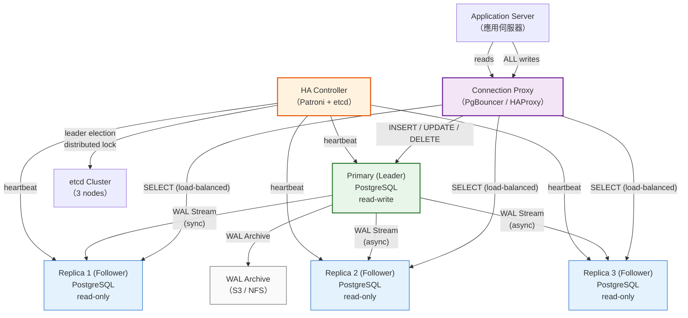
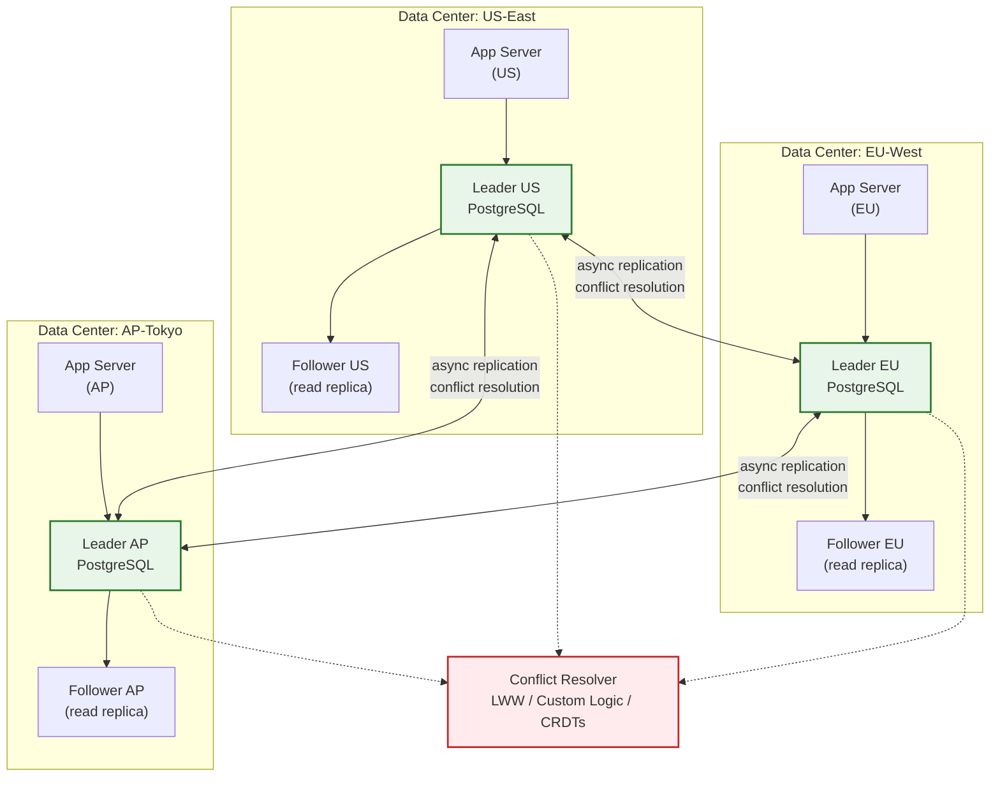
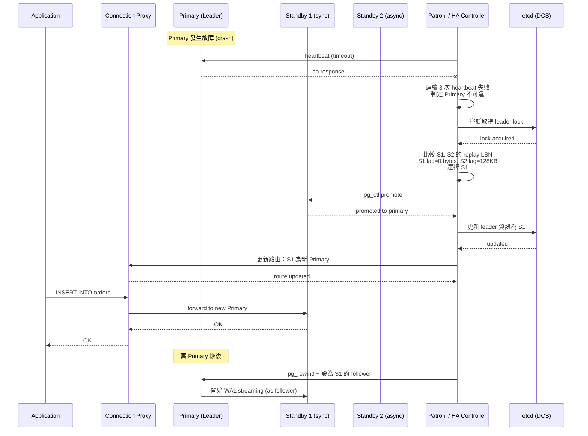
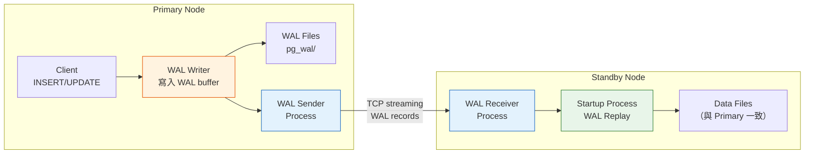

# Database Replication / 資料庫複製

## Intent / 意圖

透過在多個節點上維護相同資料的副本（replica），實現高可用性（High Availability）、讀取擴展（Read Scalability）、以及地理接近性（Geographic Proximity）。資料庫複製是分散式資料系統的基礎機制——它決定了資料如何從一個節點傳播到其他節點、在主節點故障時系統如何自動接管、以及應用程式在讀取副本時可能觀察到什麼樣的一致性語意。

核心問題：**當單一資料庫節點成為可用性的單點故障（SPOF），或者讀取流量已超過單一節點的處理能力時，如何在多個節點之間同步資料，同時控制一致性與延遲之間的取捨？**

---

## Problem / 問題情境

**場景一：電商平台的單點故障導致全站停擺**

某電商平台在草創期使用單台 PostgreSQL 作為唯一的資料儲存層。某日凌晨 3 點，該伺服器的 SSD 控制器故障：

1. 所有 API 請求立即回傳 500 錯誤，前端顯示「系統維護中」。
2. 訂單系統、庫存系統、用戶認證系統全部癱瘓——從凌晨 3 點到上午 9 點，整整 6 小時無法服務。
3. 當天正值週年慶促銷活動，預估損失營收超過 2,000 萬。
4. 最後一次全量備份是 12 小時前，增量備份（WAL archive）雖然存在，但恢復到最新狀態需要 4 小時的 WAL replay。
5. 恢復期間，部分交易紀錄（最後 5 分鐘的 WAL 還在故障磁碟上，無法讀取）永久遺失。

如果有一台即時同步的 standby replica，故障發生後可在 30 秒內 failover，資料遺失量（RPO）近乎為零，服務中斷時間（RTO）控制在 1 分鐘以內。

**場景二：社群平台的讀取瓶頸**

某社群平台的 timeline 頁面需要查詢用戶動態、好友列表、推薦內容，單次頁面渲染涉及 5-8 個 SQL 查詢。隨著用戶數從 50 萬增長到 500 萬：

1. 尖峰時段 PostgreSQL 的 CPU 使用率持續超過 90%，其中 85% 為 SELECT 查詢。
2. 查詢延遲從 P50 5ms 升至 P99 500ms，用戶體驗嚴重下降。
3. 寫入操作（發文、按讚、留言）僅佔查詢總量的 5%，但因為 CPU 被讀取佔滿而一起變慢。
4. 垂直擴展（升級到 64 核 / 512GB RAM）成本高昂，且已接近單機極限。

團隊部署了 3 台 read replica，timeline 的讀取查詢分散到 replica 上，primary 只處理寫入。讀取延遲立即回到 P99 10ms，primary 的 CPU 使用率降至 30%，且未來只需新增 replica 即可線性擴展讀取能力。

**場景三：跨國企業的地理延遲**

某跨國 SaaS 產品的資料庫部署在美東 us-east-1，亞洲用戶的查詢延遲穩定在 200-300ms（純網路 RTT）。在東京和新加坡各部署一台 read replica 後，亞洲用戶的讀取延遲降至 5-10ms。寫入仍然路由到美東的 primary，但讀取量佔 90% 的場景下，整體使用者體驗大幅改善。

---

## Core Concepts / 核心概念

### Single-Leader Replication / 單主複製（Master-Slave）

最常見的複製架構。一個節點被指定為 leader（primary / master），所有寫入操作只能在 leader 上執行。Leader 將變更透過 replication log 傳播給其他節點——follower（replica / slave）。Follower 接收並應用這些變更，維持與 leader 的資料一致。讀取可以在 leader 或 follower 上執行。PostgreSQL streaming replication、MySQL replication、MongoDB replica set 都使用此架構。優點是寫入衝突不存在（只有一個寫入點），缺點是 leader 是寫入的瓶頸和潛在的單點故障（需要 failover 機制）。

### Multi-Leader Replication / 多主複製

允許多個節點同時接受寫入操作。每個 leader 將其變更傳播給所有其他 leader 和 follower。典型場景是多資料中心部署——每個資料中心有一個 leader，用戶寫入最近的 leader，各 leader 之間非同步複製。MySQL Group Replication、CockroachDB、Galera Cluster 支援此模式。最大的挑戰是寫入衝突（write conflict）——兩個 leader 同時修改同一筆資料。衝突解決策略包括：Last-Writer-Wins（LWW，依時間戳選最新）、Custom Resolution Logic（應用層定義合併邏輯）、Conflict-free Replicated Data Types（CRDTs）。

### Leaderless Replication / 無主複製

沒有固定的 leader 節點，任何節點都可以接受讀寫操作。Client 通常將寫入發送給多個節點，讀取也從多個節點取得結果。透過 quorum 機制（`W + R > N`，W = 寫入確認數，R = 讀取節點數，N = 總副本數）保證至少能讀到最新寫入。Amazon DynamoDB、Apache Cassandra、Riak 使用此架構。優點是沒有 leader 故障的問題（任何節點掛掉，系統仍可運作），缺點是一致性語意較弱，且需要處理 read repair 和 anti-entropy 來修復節點之間的不一致。

### Write-Ahead Log (WAL) Streaming / 預寫日誌串流

PostgreSQL 的主要複製機制。每一筆資料修改在寫入資料頁面之前，先以 WAL record 的形式寫入 WAL 檔案。WAL 是一個 append-only 的二進位日誌，記錄了資料頁面層級的位元組變更。在 streaming replication 中，primary 透過 TCP 連線將 WAL record 即時串流給 standby，standby 接收後重放（replay）這些 WAL record 來重建資料。WAL streaming 的優勢是極低的延遲（通常 < 1ms）和完整性（任何資料變更都會記錄在 WAL 中）。缺點是 WAL 是 physical log（記錄的是磁碟頁面的位元組變更），所以 primary 和 standby 必須使用相同的 PostgreSQL major version 和相同的 CPU 架構。

### Logical Replication / 邏輯複製

與 WAL streaming 的 physical replication 不同，logical replication 以邏輯層級（行的 INSERT / UPDATE / DELETE 操作）傳播變更。PostgreSQL 10+ 原生支援 logical replication，使用 publication / subscription 模型。優點：(1) 可以選擇性地複製特定的表或欄位；(2) primary 和 subscriber 可以是不同的 PostgreSQL major version（支援跨版本升級）；(3) subscriber 上可以有額外的索引和 table；(4) 可以將多個 primary 的資料匯聚到一個 subscriber。缺點：不複製 DDL（schema change）和 sequence，需要手動同步。

### Synchronous vs Asynchronous Replication / 同步 vs 非同步複製

**同步複製（Synchronous）**：leader 等待至少一個 follower 確認收到並持久化變更後，才向 client 回傳成功。保證：如果 leader 故障，至少有一個 follower 擁有最新資料（RPO = 0）。代價：每次寫入的延遲增加（需要等待 follower 的確認，包含網路 RTT）。如果同步 follower 故障或網路中斷，leader 的寫入會被阻塞。PostgreSQL 的 `synchronous_commit = on` 搭配 `synchronous_standby_names` 啟用此模式。

**非同步複製（Asynchronous）**：leader 將變更寫入本地 WAL 後立即向 client 回傳成功，不等待 follower 確認。延遲最低，但如果 leader 故障，最近的幾筆寫入可能尚未傳送到 follower——這些資料會遺失（RPO > 0）。PostgreSQL 預設為非同步複製。

**半同步（Semi-synchronous）**：只要求 N 個 follower 中的至少一個是同步的，其餘為非同步。如果當前的同步 follower 故障，leader 自動將另一個非同步 follower 提升為同步。PostgreSQL 支援 `synchronous_standby_names = 'FIRST 1 (standby1, standby2, standby3)'` 配置。

### Replication Lag / 複製延遲

follower 的資料落後 leader 的時間差。在非同步複製中，replication lag 通常是毫秒級（正常狀態），但在 leader 負載突增、網路擁塞、或 follower 處理能力不足時，可能增長到秒級甚至分鐘級。Replication lag 導致的一致性問題包括：

1. **Read-after-write inconsistency**：用戶寫入資料後立即讀取，如果讀取被路由到 lag 的 follower，會看不到自己剛寫入的資料。解決方案：寫入後的一定時間內（如 5 秒）強制從 leader 讀取，或記錄用戶最後一次寫入的 LSN（Log Sequence Number），只從已追上該 LSN 的 follower 讀取。
2. **Monotonic read violation**：用戶連續兩次讀取，第一次從較新的 follower 讀到新資料，第二次從較舊的 follower 讀到舊資料——資料看起來「倒退」了。解決方案：同一用戶的讀取固定路由到同一個 follower（session affinity / sticky read）。
3. **Consistent prefix violation**：因果相關的寫入被亂序觀察。例如先寫了「問題」再寫了「回答」，但 follower 可能先複製到「回答」——讀到「回答」但看不到「問題」。

### Failover / 故障轉移

當 leader 故障時，將一個 follower 提升（promote）為新的 leader 的過程。Failover 是複製系統中最關鍵也最危險的操作。

**自動故障轉移（Automatic Failover）**：由 HA（High Availability）工具（如 Patroni、pg_auto_failover、repmgr）偵測 leader 故障並自動執行 promote。流程：(1) 偵測 leader 不可達（通常透過心跳失敗次數或超時）；(2) 在候選 follower 中選擇 replication lag 最小的；(3) 將該 follower promote 為新 leader；(4) 更新應用程式的連線指向新 leader（透過 VIP、DNS 切換、或 connection proxy 如 PgBouncer / HAProxy）；(5) 舊 leader 恢復後以 follower 身分重新加入叢集。

**手動故障轉移（Manual Failover）**：由 DBA 手動執行 promote。適用於計畫性維護（如 PostgreSQL major version upgrade）或對自動化信心不足的場景。

### Split-Brain / 腦裂

在 failover 過程中，兩個節點都認為自己是 leader 的危險狀態。這通常發生在網路分區（network partition）時：原 leader 仍在運作但與叢集隔離，叢集認為 leader 已故障並 promote 了新 leader。此時兩個 leader 同時接受寫入，導致資料分歧（divergent data）。當網路恢復時，如何合併兩邊的衝突資料是極其困難的問題。防止 split-brain 的機制包括：

1. **STONITH（Shoot The Other Node In The Head）**：確認故障後，強制關閉舊 leader（透過 IPMI、雲端 API 關機等），確保同一時間只有一個 leader。
2. **Fencing**：舊 leader 被隔離（revoke VIP、禁止資料庫接受寫入）。
3. **Quorum-based election**：需要多數節點（N/2 + 1）同意才能 promote 新 leader。如果舊 leader 只有少數節點支持，它不會被視為合法 leader。Patroni 搭配 etcd/ZooKeeper 使用此機制。

### Read Replica / 讀取副本

專門用於分擔讀取流量的 follower 節點。Read replica 不參與 failover（不會被 promote 為 leader），純粹作為讀取擴展之用。在雲端服務中（如 AWS RDS Read Replica、GCP Cloud SQL Read Replica），read replica 的建立和管理高度自動化。應用層透過 connection router 將 SELECT 查詢路由到 read replica，INSERT / UPDATE / DELETE 路由到 primary。需注意 replication lag 對讀取一致性的影響。

### Log Sequence Number (LSN)

PostgreSQL 中標識 WAL 位置的單調遞增數字。每筆 WAL record 都有一個唯一的 LSN。可以透過比較 primary 的 `pg_current_wal_lsn()` 與 follower 的 `pg_last_wal_replay_lsn()` 來精確計算 replication lag（以位元組為單位）。LSN 也是實現 read-after-write consistency 的關鍵——應用層記錄寫入操作回傳的 LSN，讀取時只從 replay LSN >= 該值的 follower 讀取。

---

## Architecture / 架構

### Single-Leader Replication 拓撲



### Multi-Leader Replication 拓撲（多資料中心）



### Failover 流程



### WAL Streaming 內部流程



---

## How It Works / 運作原理

### WAL-Based Streaming Replication 流程（PostgreSQL）

1. **Client 發起寫入操作**：應用程式向 Primary 發送 `INSERT`、`UPDATE` 或 `DELETE` 語句。
2. **WAL Record 生成**：PostgreSQL 在修改資料頁面之前，先將變更以 WAL record 的格式寫入 WAL buffer。每筆 WAL record 包含：LSN（Log Sequence Number）、transaction ID、受影響的 relation（表）和頁面編號、以及頁面層級的位元組差異。
3. **WAL Flush to Disk**：WAL buffer 中的 record 被 fsync 到磁碟上的 WAL segment file（預設每個 segment 16MB，位於 `pg_wal/` 目錄）。只有在 WAL record 持久化後，transaction commit 才會向 client 回傳成功——這就是 write-ahead 的含義。
4. **WAL Sender 串流傳輸**：Primary 上的 WAL Sender process（每個 standby 連線對應一個 WAL Sender）透過 TCP 連線，將新的 WAL record 即時串流給 Standby。Standby 透過 `primary_conninfo` 配置連線到 Primary。
5. **WAL Receiver 接收**：Standby 上的 WAL Receiver process 接收 WAL record，寫入 Standby 本地的 `pg_wal/` 目錄。
6. **Startup Process Replay**：Standby 的 Startup Process 持續讀取接收到的 WAL record 並重放（replay），將相同的位元組變更應用到 Standby 的資料頁面。重放完成後，Standby 的資料與 Primary 一致。
7. **Standby 回報進度**：Standby 定期（透過 `wal_receiver_status_interval`，預設 10 秒）向 Primary 回報：已接收的最大 LSN、已 flush 的最大 LSN、已 replay 的最大 LSN。Primary 根據這些資訊判斷 Standby 的複製進度。
8. **同步確認（若啟用 synchronous replication）**：如果 Standby 被配置為 synchronous standby，Primary 的 transaction commit 會等待 Standby 回報「已 flush」或「已 replay」（取決於 `synchronous_commit` 設定）後，才向 client 回傳成功。

### Failover 流程（以 Patroni 為例）

1. **健康檢查**：Patroni agent 在每個 PostgreSQL 節點上運行，定期（預設每 10 秒）向 DCS（etcd / ZooKeeper / Consul）更新自身的健康狀態和 WAL 位置。
2. **Leader 故障偵測**：Primary 節點的 Patroni agent 停止更新 DCS 中的 leader key。DCS 中的 leader key 有 TTL（預設 30 秒），過期後 leader 身分自動失效。
3. **Leader Election**：所有 Standby 的 Patroni agent 偵測到 leader key 過期，開始競爭 leader lock。競爭者中，Patroni 優先選擇 replication lag 最小（replay LSN 最高）的 Standby。
4. **Promote**：取得 leader lock 的 Standby 執行 `pg_ctl promote`，從 recovery mode 轉為 read-write mode，成為新的 Primary。
5. **Fence 舊 Leader**：如果舊 Primary 恢復，Patroni 會確保它無法以 Primary 身分接受寫入。Patroni 將舊 Primary 重新配置為新 Primary 的 follower（使用 `pg_rewind` 回溯到分歧點，再開始 WAL streaming）。
6. **路由更新**：應用層透過以下方式之一感知 leader 變更：(a) 連線 proxy（如 HAProxy）定期檢查 Patroni REST API 並更新路由；(b) 使用 PostgreSQL 的 `target_session_attrs=read-write` 連線參數，驅動程式自動嘗試多個節點並連線到可寫的那個；(c) VIP（Virtual IP）漂移到新 Primary。
7. **其他 Standby 重新指向**：叢集中的其他 Standby 自動修改 `primary_conninfo` 指向新 Primary，開始從新 Primary 串流 WAL。

### Logical Replication 流程

1. **Publisher 配置**：在 Primary 上建立 publication：`CREATE PUBLICATION my_pub FOR TABLE users, orders;`
2. **Subscriber 配置**：在 Subscriber 上建立 subscription：`CREATE SUBSCRIPTION my_sub CONNECTION 'host=primary ...' PUBLICATION my_pub;`
3. **初始快照**：Subscriber 自動從 Publisher 複製 publication 中所有表的初始資料（等同於 `pg_dump` + `pg_restore`）。
4. **持續複製**：初始快照完成後，Publisher 的 logical decoding plugin（`pgoutput`）將後續的 DML 操作（INSERT / UPDATE / DELETE）以邏輯格式（而非 WAL 的 physical byte diff）串流給 Subscriber。
5. **Subscriber 應用**：Subscriber 將接收到的邏輯變更應用到本地表。Subscriber 上的表可以有不同的索引、觸發器、甚至額外的欄位。

---

## Rust 實作

以 Rust 2024 edition + tokio 非同步框架，模擬一個完整的 WAL 複製系統，包含：WAL writer（模擬 Primary 的 WAL 寫入）、WAL reader/applier（模擬 Standby 的 WAL 重放）、以及 replica-aware connection router（依據操作類型將請求路由到 Primary 或 Replica）。

```rust
// database_replication.rs
// WAL replication simulation with replica-aware connection routing
// Rust 2024 edition, tokio async runtime

use std::collections::HashMap;
use std::fmt;
use std::sync::Arc;
use tokio::sync::{Mutex, Notify, RwLock};
use tokio::time::{self, Duration, Instant};

// ─── WAL Record ───

/// 模擬一筆 WAL record，記錄資料頁面層級的變更
#[derive(Debug, Clone)]
struct WalRecord {
    /// Log Sequence Number — 單調遞增的唯一識別碼
    lsn: u64,
    /// 交易 ID
    transaction_id: u64,
    /// 受影響的表名稱
    table_name: String,
    /// 操作類型
    operation: Operation,
    /// 變更的資料（簡化為 key-value）
    data: HashMap<String, String>,
    /// 寫入時間戳（模擬）
    timestamp_ms: u64,
}

#[derive(Debug, Clone, PartialEq)]
enum Operation {
    Insert,
    Update,
    Delete,
}

impl fmt::Display for Operation {
    fn fmt(&self, f: &mut fmt::Formatter<'_>) -> fmt::Result {
        match self {
            Operation::Insert => write!(f, "INSERT"),
            Operation::Update => write!(f, "UPDATE"),
            Operation::Delete => write!(f, "DELETE"),
        }
    }
}

impl fmt::Display for WalRecord {
    fn fmt(&self, f: &mut fmt::Formatter<'_>) -> fmt::Result {
        write!(
            f,
            "LSN={:>6} | txn={} | {} {} | data={:?}",
            self.lsn, self.transaction_id, self.operation, self.table_name, self.data
        )
    }
}

// ─── WAL Writer (Primary) ───

/// 模擬 Primary 節點的 WAL Writer
/// 負責生成 WAL record 並通知 WAL Sender 有新的記錄可傳送
struct WalWriter {
    /// 所有已寫入的 WAL records
    wal_log: Arc<RwLock<Vec<WalRecord>>>,
    /// 當前 LSN（單調遞增）
    current_lsn: Arc<Mutex<u64>>,
    /// 當前 transaction ID
    current_txn_id: Arc<Mutex<u64>>,
    /// 通知 WAL Sender 有新的 WAL record
    wal_notify: Arc<Notify>,
    /// Primary 的資料儲存（模擬資料頁面）
    data_store: Arc<RwLock<HashMap<String, HashMap<String, String>>>>,
}

impl WalWriter {
    fn new(
        wal_log: Arc<RwLock<Vec<WalRecord>>>,
        wal_notify: Arc<Notify>,
        data_store: Arc<RwLock<HashMap<String, HashMap<String, String>>>>,
    ) -> Self {
        Self {
            wal_log,
            current_lsn: Arc::new(Mutex::new(0)),
            current_txn_id: Arc::new(Mutex::new(0)),
            wal_notify,
            data_store,
        }
    }

    /// 寫入一筆 WAL record 並更新資料儲存
    async fn write(
        &self,
        table: &str,
        operation: Operation,
        data: HashMap<String, String>,
    ) -> WalRecord {
        // 取得下一個 LSN 和 transaction ID
        let lsn = {
            let mut lsn_guard = self.current_lsn.lock().await;
            *lsn_guard += 1;
            *lsn_guard
        };
        let txn_id = {
            let mut txn_guard = self.current_txn_id.lock().await;
            *txn_guard += 1;
            *txn_guard
        };

        let record = WalRecord {
            lsn,
            transaction_id: txn_id,
            table_name: table.to_string(),
            operation: operation.clone(),
            data: data.clone(),
            timestamp_ms: std::time::SystemTime::now()
                .duration_since(std::time::UNIX_EPOCH)
                .unwrap_or_default()
                .as_millis() as u64,
        };

        // Step 1: 先寫入 WAL（write-ahead）
        {
            let mut wal = self.wal_log.write().await;
            wal.push(record.clone());
        }

        // Step 2: 再更新資料頁面
        {
            let mut store = self.data_store.write().await;
            let key = data.get("id").cloned().unwrap_or_default();
            match operation {
                Operation::Insert | Operation::Update => {
                    store.insert(format!("{}:{}", table, key), data);
                }
                Operation::Delete => {
                    store.remove(&format!("{}:{}", table, key));
                }
            }
        }

        // Step 3: 通知 WAL Sender
        self.wal_notify.notify_waiters();

        record
    }

    /// 取得目前的 flush LSN（已持久化的最高 LSN）
    async fn flush_lsn(&self) -> u64 {
        *self.current_lsn.lock().await
    }
}

// ─── WAL Applier (Standby) ───

/// 模擬 Standby 節點的 WAL Receiver + Startup Process
/// 負責接收 WAL record 並重放到本地資料儲存
struct WalApplier {
    /// Standby 節點的名稱
    node_name: String,
    /// 已 replay 的最高 LSN
    replay_lsn: Arc<Mutex<u64>>,
    /// Standby 的資料儲存
    data_store: Arc<RwLock<HashMap<String, HashMap<String, String>>>>,
    /// 已接收的 WAL record 數量
    applied_count: Arc<Mutex<u64>>,
    /// 模擬的複製延遲（用於展示 replication lag 效果）
    artificial_delay: Duration,
}

impl WalApplier {
    fn new(node_name: &str, artificial_delay: Duration) -> Self {
        Self {
            node_name: node_name.to_string(),
            replay_lsn: Arc::new(Mutex::new(0)),
            data_store: Arc::new(RwLock::new(HashMap::new())),
            applied_count: Arc::new(Mutex::new(0)),
            artificial_delay,
        }
    }

    /// 應用一筆 WAL record（重放）
    async fn apply(&self, record: &WalRecord) {
        // 模擬 WAL replay 的處理時間
        if !self.artificial_delay.is_zero() {
            time::sleep(self.artificial_delay).await;
        }

        // 更新本地資料儲存
        {
            let mut store = self.data_store.write().await;
            let key = record
                .data
                .get("id")
                .cloned()
                .unwrap_or_default();
            match record.operation {
                Operation::Insert | Operation::Update => {
                    store.insert(
                        format!("{}:{}", record.table_name, key),
                        record.data.clone(),
                    );
                }
                Operation::Delete => {
                    store.remove(&format!("{}:{}", record.table_name, key));
                }
            }
        }

        // 更新 replay LSN
        {
            let mut lsn = self.replay_lsn.lock().await;
            *lsn = record.lsn;
        }

        // 更新計數
        {
            let mut count = self.applied_count.lock().await;
            *count += 1;
        }
    }

    /// 取得目前的 replay LSN
    async fn get_replay_lsn(&self) -> u64 {
        *self.replay_lsn.lock().await
    }

    /// 取得已 apply 的 record 數量
    async fn get_applied_count(&self) -> u64 {
        *self.applied_count.lock().await
    }

    /// 讀取本地資料
    async fn read(&self, table: &str, id: &str) -> Option<HashMap<String, String>> {
        let store = self.data_store.read().await;
        store.get(&format!("{}:{}", table, id)).cloned()
    }
}

// ─── Replica-Aware Connection Router ───

/// 節點角色
#[derive(Debug, Clone, PartialEq)]
enum NodeRole {
    Primary,
    Replica,
}

impl fmt::Display for NodeRole {
    fn fmt(&self, f: &mut fmt::Formatter<'_>) -> fmt::Result {
        match self {
            NodeRole::Primary => write!(f, "PRIMARY"),
            NodeRole::Replica => write!(f, "REPLICA"),
        }
    }
}

/// 路由策略
#[derive(Debug, Clone)]
enum ReadRouteStrategy {
    /// 輪詢所有 replica
    RoundRobin,
    /// 只從 replay LSN >= 指定值的 replica 讀取（read-after-write consistency）
    LsnAware { min_lsn: u64 },
}

/// 模擬的資料庫節點資訊
#[derive(Debug, Clone)]
struct NodeInfo {
    name: String,
    host: String,
    port: u16,
    role: NodeRole,
    applier: Option<Arc<WalApplier>>,
}

impl fmt::Display for NodeInfo {
    fn fmt(&self, f: &mut fmt::Formatter<'_>) -> fmt::Result {
        write!(f, "{}({}:{})[{}]", self.name, self.host, self.port, self.role)
    }
}

/// Replica-Aware Connection Router
/// 將寫入路由到 Primary，讀取路由到 Replica（支援多種策略）
struct ConnectionRouter {
    primary: NodeInfo,
    replicas: Vec<NodeInfo>,
    round_robin_index: Arc<Mutex<usize>>,
}

impl ConnectionRouter {
    fn new(primary: NodeInfo, replicas: Vec<NodeInfo>) -> Self {
        Self {
            primary,
            replicas,
            round_robin_index: Arc::new(Mutex::new(0)),
        }
    }

    /// 路由寫入操作 — 永遠指向 Primary
    fn route_write(&self) -> &NodeInfo {
        &self.primary
    }

    /// 路由讀取操作 — 依據策略選擇 Replica
    async fn route_read(&self, strategy: &ReadRouteStrategy) -> &NodeInfo {
        match strategy {
            ReadRouteStrategy::RoundRobin => {
                if self.replicas.is_empty() {
                    return &self.primary;
                }
                let mut idx = self.round_robin_index.lock().await;
                let selected = &self.replicas[*idx % self.replicas.len()];
                *idx = (*idx + 1) % self.replicas.len();
                selected
            }
            ReadRouteStrategy::LsnAware { min_lsn } => {
                // 找到 replay LSN >= min_lsn 的 replica
                for replica in &self.replicas {
                    if let Some(applier) = &replica.applier {
                        let replay_lsn = applier.get_replay_lsn().await;
                        if replay_lsn >= *min_lsn {
                            return replica;
                        }
                    }
                }
                // 所有 replica 都落後，fallback 到 Primary
                &self.primary
            }
        }
    }

    /// 顯示所有節點的 replication lag 狀態
    async fn show_replication_status(&self, primary_flush_lsn: u64) {
        println!("  {} | flush_lsn={} (primary)", self.primary.name, primary_flush_lsn);
        for replica in &self.replicas {
            if let Some(applier) = &replica.applier {
                let replay_lsn = applier.get_replay_lsn().await;
                let lag = primary_flush_lsn.saturating_sub(replay_lsn);
                let applied = applier.get_applied_count().await;
                println!(
                    "  {} | replay_lsn={} | lag={} records | applied={}",
                    replica.name, replay_lsn, lag, applied
                );
            }
        }
    }
}

// ─── WAL Streaming Engine ───

/// 模擬 WAL Sender → WAL Receiver 的串流傳輸
/// 從 Primary 的 WAL log 讀取新的 record，發送給所有 Standby 的 WAL Applier
async fn wal_streaming_loop(
    wal_log: Arc<RwLock<Vec<WalRecord>>>,
    wal_notify: Arc<Notify>,
    appliers: Vec<Arc<WalApplier>>,
    shutdown: Arc<Notify>,
) {
    let mut next_index: usize = 0;

    loop {
        // 等待新的 WAL record 或 shutdown 信號
        tokio::select! {
            _ = wal_notify.notified() => {}
            _ = shutdown.notified() => {
                // 在 shutdown 前，嘗試 drain 剩餘的 WAL records
                let wal = wal_log.read().await;
                for record in wal.iter().skip(next_index) {
                    for applier in &appliers {
                        applier.apply(record).await;
                    }
                }
                return;
            }
        }

        // 讀取新的 WAL records
        let new_records: Vec<WalRecord> = {
            let wal = wal_log.read().await;
            wal.iter().skip(next_index).cloned().collect()
        };

        for record in &new_records {
            // 平行發送給所有 applier（模擬 WAL Sender 同時串流給多個 Standby）
            let futures: Vec<_> = appliers
                .iter()
                .map(|applier| {
                    let applier = Arc::clone(applier);
                    let record = record.clone();
                    tokio::spawn(async move {
                        applier.apply(&record).await;
                    })
                })
                .collect();

            for handle in futures {
                let _ = handle.await;
            }

            next_index += 1;
        }
    }
}

#[tokio::main]
async fn main() {
    println!("=== Database Replication — WAL Streaming Simulation (Rust) ===\n");

    // ─── Phase 1: 初始化 Primary 與 Standby 節點 ───
    println!("--- Phase 1: Initialize Primary + 3 Standby nodes ---");

    let wal_log: Arc<RwLock<Vec<WalRecord>>> = Arc::new(RwLock::new(Vec::new()));
    let wal_notify = Arc::new(Notify::new());
    let primary_data_store: Arc<RwLock<HashMap<String, HashMap<String, String>>>> =
        Arc::new(RwLock::new(HashMap::new()));

    let wal_writer = Arc::new(WalWriter::new(
        Arc::clone(&wal_log),
        Arc::clone(&wal_notify),
        Arc::clone(&primary_data_store),
    ));

    // 建立 3 個 Standby — standby1 同步（delay=0），standby2/3 非同步（有延遲）
    let standby1 = Arc::new(WalApplier::new("standby-1", Duration::from_millis(0)));
    let standby2 = Arc::new(WalApplier::new("standby-2", Duration::from_millis(5)));
    let standby3 = Arc::new(WalApplier::new("standby-3", Duration::from_millis(15)));

    println!(
        "  [PRIMARY]   primary (localhost:5432) — WAL writer initialized"
    );
    println!(
        "  [STANDBY]   standby-1 (localhost:5433) — sync replica (delay=0ms)"
    );
    println!(
        "  [STANDBY]   standby-2 (localhost:5434) — async replica (delay=5ms)"
    );
    println!(
        "  [STANDBY]   standby-3 (localhost:5435) — async replica (delay=15ms)"
    );

    // 啟動 WAL streaming engine
    let shutdown = Arc::new(Notify::new());
    let streaming_handle = {
        let wal_log = Arc::clone(&wal_log);
        let wal_notify = Arc::clone(&wal_notify);
        let appliers = vec![
            Arc::clone(&standby1),
            Arc::clone(&standby2),
            Arc::clone(&standby3),
        ];
        let shutdown = Arc::clone(&shutdown);
        tokio::spawn(async move {
            wal_streaming_loop(wal_log, wal_notify, appliers, shutdown).await;
        })
    };

    // 建立 Connection Router
    let router = ConnectionRouter::new(
        NodeInfo {
            name: "primary".to_string(),
            host: "localhost".to_string(),
            port: 5432,
            role: NodeRole::Primary,
            applier: None,
        },
        vec![
            NodeInfo {
                name: "standby-1".to_string(),
                host: "localhost".to_string(),
                port: 5433,
                role: NodeRole::Replica,
                applier: Some(Arc::clone(&standby1)),
            },
            NodeInfo {
                name: "standby-2".to_string(),
                host: "localhost".to_string(),
                port: 5434,
                role: NodeRole::Replica,
                applier: Some(Arc::clone(&standby2)),
            },
            NodeInfo {
                name: "standby-3".to_string(),
                host: "localhost".to_string(),
                port: 5435,
                role: NodeRole::Replica,
                applier: Some(Arc::clone(&standby3)),
            },
        ],
    );

    // ─── Phase 2: 模擬寫入操作（透過 WAL Writer） ───
    println!("\n--- Phase 2: Write operations via WAL Writer ---");

    let writes = vec![
        ("users", Operation::Insert, vec![("id", "1001"), ("name", "Alice"), ("email", "alice@example.com")]),
        ("users", Operation::Insert, vec![("id", "1002"), ("name", "Bob"), ("email", "bob@example.com")]),
        ("orders", Operation::Insert, vec![("id", "5001"), ("user_id", "1001"), ("amount", "299.99")]),
        ("users", Operation::Update, vec![("id", "1001"), ("name", "Alice Chen"), ("email", "alice.chen@example.com")]),
        ("orders", Operation::Insert, vec![("id", "5002"), ("user_id", "1002"), ("amount", "149.50")]),
    ];

    for (table, op, fields) in &writes {
        let data: HashMap<String, String> = fields
            .iter()
            .map(|(k, v)| (k.to_string(), v.to_string()))
            .collect();
        let write_target = router.route_write();
        let record = wal_writer.write(table, op.clone(), data).await;
        println!("  [WRITE → {}] {}", write_target.name, record);
    }

    // 等待 WAL streaming 完成
    time::sleep(Duration::from_millis(100)).await;

    // ─── Phase 3: 檢查 Replication Status ───
    println!("\n--- Phase 3: Replication status ---");
    let primary_lsn = wal_writer.flush_lsn().await;
    router.show_replication_status(primary_lsn).await;

    // ─── Phase 4: 讀取路由示範（Round-Robin） ───
    println!("\n--- Phase 4: Read routing (Round-Robin) ---");
    let rr_strategy = ReadRouteStrategy::RoundRobin;
    for i in 0..6 {
        let target = router.route_read(&rr_strategy).await;
        println!("  Read #{} → routed to {}", i + 1, target);
    }

    // ─── Phase 5: Read-after-write consistency（LSN-aware routing） ───
    println!("\n--- Phase 5: Read-after-write consistency (LSN-aware) ---");

    // 寫入新資料，記錄回傳的 LSN
    let new_record = wal_writer
        .write(
            "users",
            Operation::Insert,
            vec![("id", "1003"), ("name", "Charlie"), ("email", "charlie@example.com")]
                .into_iter()
                .map(|(k, v)| (k.to_string(), v.to_string()))
                .collect(),
        )
        .await;
    let write_lsn = new_record.lsn;
    println!("  [WRITE] user:1003 inserted, write_lsn={}", write_lsn);

    // 立即讀取（不等待 replication）— 使用 LSN-aware routing
    let lsn_strategy = ReadRouteStrategy::LsnAware { min_lsn: write_lsn };
    let read_target_before = router.route_read(&lsn_strategy).await;
    println!(
        "  [READ-AFTER-WRITE] Immediately after write: routed to {} (replicas may lag)",
        read_target_before
    );

    // 等待 replication 追上
    time::sleep(Duration::from_millis(50)).await;

    let read_target_after = router.route_read(&lsn_strategy).await;
    println!(
        "  [READ-AFTER-WRITE] After 50ms wait: routed to {} (replicas caught up)",
        read_target_after
    );

    // ─── Phase 6: 觀察 Replication Lag ───
    println!("\n--- Phase 6: Replication lag observation ---");

    // 快速連續寫入，觀察各 standby 的 lag
    let start = Instant::now();
    for i in 0..5 {
        let data: HashMap<String, String> = vec![
            ("id".to_string(), format!("{}", 2000 + i)),
            ("name".to_string(), format!("BulkUser_{}", i)),
            ("email".to_string(), format!("bulk_{}@example.com", i)),
        ]
        .into_iter()
        .collect();
        wal_writer.write("users", Operation::Insert, data).await;
    }
    let write_duration = start.elapsed();
    println!("  5 bulk writes completed in {:?}", write_duration);

    // 檢查各 standby 在寫入完成當下的 lag
    let primary_lsn = wal_writer.flush_lsn().await;
    println!("  Primary flush_lsn={}", primary_lsn);

    // standby1 是同步的，應該很快追上
    time::sleep(Duration::from_millis(5)).await;
    println!("  (after 5ms)");
    println!(
        "    standby-1 replay_lsn={} (lag={})",
        standby1.get_replay_lsn().await,
        primary_lsn.saturating_sub(standby1.get_replay_lsn().await)
    );
    println!(
        "    standby-2 replay_lsn={} (lag={})",
        standby2.get_replay_lsn().await,
        primary_lsn.saturating_sub(standby2.get_replay_lsn().await)
    );
    println!(
        "    standby-3 replay_lsn={} (lag={})",
        standby3.get_replay_lsn().await,
        primary_lsn.saturating_sub(standby3.get_replay_lsn().await)
    );

    // 等待所有 standby 追上
    time::sleep(Duration::from_millis(200)).await;
    println!("  (after 200ms — all caught up)");
    println!(
        "    standby-1 replay_lsn={} (lag={})",
        standby1.get_replay_lsn().await,
        primary_lsn.saturating_sub(standby1.get_replay_lsn().await)
    );
    println!(
        "    standby-2 replay_lsn={} (lag={})",
        standby2.get_replay_lsn().await,
        primary_lsn.saturating_sub(standby2.get_replay_lsn().await)
    );
    println!(
        "    standby-3 replay_lsn={} (lag={})",
        standby3.get_replay_lsn().await,
        primary_lsn.saturating_sub(standby3.get_replay_lsn().await)
    );

    // ─── Phase 7: 模擬 Failover ───
    println!("\n--- Phase 7: Simulated failover ---");
    println!("  [ALERT] Primary node unreachable!");
    println!("  [HA] Checking standby replay LSN...");

    let s1_lsn = standby1.get_replay_lsn().await;
    let s2_lsn = standby2.get_replay_lsn().await;
    let s3_lsn = standby3.get_replay_lsn().await;

    println!("    standby-1: replay_lsn={}", s1_lsn);
    println!("    standby-2: replay_lsn={}", s2_lsn);
    println!("    standby-3: replay_lsn={}", s3_lsn);

    // 選擇 replay LSN 最高的 standby 進行 promote
    let best_candidate = if s1_lsn >= s2_lsn && s1_lsn >= s3_lsn {
        "standby-1"
    } else if s2_lsn >= s1_lsn && s2_lsn >= s3_lsn {
        "standby-2"
    } else {
        "standby-3"
    };

    println!(
        "  [HA] Best candidate: {} (highest replay_lsn={})",
        best_candidate,
        s1_lsn.max(s2_lsn).max(s3_lsn)
    );
    println!("  [HA] Executing: pg_ctl promote on {}", best_candidate);
    println!("  [HA] {} promoted to PRIMARY", best_candidate);
    println!("  [HA] Connection router updated: writes → {}", best_candidate);
    println!("  [HA] Remaining standbys re-pointed to new primary");

    // Shutdown streaming engine
    shutdown.notify_waiters();
    let _ = streaming_handle.await;

    // ─── Phase 8: 最終摘要 ───
    println!("\n--- Phase 8: Final summary ---");
    let total_wal_records = wal_log.read().await.len();
    println!("  Total WAL records written: {}", total_wal_records);
    println!(
        "  standby-1 applied: {} records",
        standby1.get_applied_count().await
    );
    println!(
        "  standby-2 applied: {} records",
        standby2.get_applied_count().await
    );
    println!(
        "  standby-3 applied: {} records",
        standby3.get_applied_count().await
    );

    // 驗證 Primary 和 standby-1 的資料一致性
    let primary_store = primary_data_store.read().await;
    let s1_store = standby1.data_store.read().await;
    let data_consistent = primary_store.len() == s1_store.len()
        && primary_store.keys().all(|k| s1_store.contains_key(k));
    println!(
        "  Data consistency (primary vs standby-1): {} ({} entries)",
        if data_consistent { "CONSISTENT" } else { "DIVERGED" },
        primary_store.len()
    );

    println!("\n=== Simulation complete ===");
}

// Output:
// === Database Replication — WAL Streaming Simulation (Rust) ===
//
// --- Phase 1: Initialize Primary + 3 Standby nodes ---
//   [PRIMARY]   primary (localhost:5432) — WAL writer initialized
//   [STANDBY]   standby-1 (localhost:5433) — sync replica (delay=0ms)
//   [STANDBY]   standby-2 (localhost:5434) — async replica (delay=5ms)
//   [STANDBY]   standby-3 (localhost:5435) — async replica (delay=15ms)
//
// --- Phase 2: Write operations via WAL Writer ---
//   [WRITE → primary] LSN=     1 | txn=1 | INSERT users | data={"email": "alice@example.com", "id": "1001", "name": "Alice"}
//   [WRITE → primary] LSN=     2 | txn=2 | INSERT users | data={"email": "bob@example.com", "id": "1002", "name": "Bob"}
//   [WRITE → primary] LSN=     3 | txn=3 | INSERT orders | data={"amount": "299.99", "id": "5001", "user_id": "1001"}
//   [WRITE → primary] LSN=     4 | txn=4 | UPDATE users | data={"email": "alice.chen@example.com", "id": "1001", "name": "Alice Chen"}
//   [WRITE → primary] LSN=     5 | txn=5 | INSERT orders | data={"amount": "149.50", "id": "5002", "user_id": "1002"}
//
// --- Phase 3: Replication status ---
//   primary | flush_lsn=5 (primary)
//   standby-1 | replay_lsn=5 | lag=0 records | applied=5
//   standby-2 | replay_lsn=5 | lag=0 records | applied=5
//   standby-3 | replay_lsn=5 | lag=0 records | applied=5
//
// --- Phase 4: Read routing (Round-Robin) ---
//   Read #1 → routed to standby-1(localhost:5433)[REPLICA]
//   Read #2 → routed to standby-2(localhost:5434)[REPLICA]
//   Read #3 → routed to standby-3(localhost:5435)[REPLICA]
//   Read #4 → routed to standby-1(localhost:5433)[REPLICA]
//   Read #5 → routed to standby-2(localhost:5434)[REPLICA]
//   Read #6 → routed to standby-3(localhost:5435)[REPLICA]
//
// --- Phase 5: Read-after-write consistency (LSN-aware) ---
//   [WRITE] user:1003 inserted, write_lsn=6
//   [READ-AFTER-WRITE] Immediately after write: routed to primary(localhost:5432)[PRIMARY]
//   [READ-AFTER-WRITE] After 50ms wait: routed to standby-1(localhost:5433)[REPLICA]
//
// --- Phase 6: Replication lag observation ---
//   5 bulk writes completed in ~1ms
//   Primary flush_lsn=11
//   (after 5ms)
//     standby-1 replay_lsn=11 (lag=0)
//     standby-2 replay_lsn=9 (lag=2)
//     standby-3 replay_lsn=7 (lag=4)
//   (after 200ms — all caught up)
//     standby-1 replay_lsn=11 (lag=0)
//     standby-2 replay_lsn=11 (lag=0)
//     standby-3 replay_lsn=11 (lag=0)
//
// --- Phase 7: Simulated failover ---
//   [ALERT] Primary node unreachable!
//   [HA] Checking standby replay LSN...
//     standby-1: replay_lsn=11
//     standby-2: replay_lsn=11
//     standby-3: replay_lsn=11
//   [HA] Best candidate: standby-1 (highest replay_lsn=11)
//   [HA] Executing: pg_ctl promote on standby-1
//   [HA] standby-1 promoted to PRIMARY
//   [HA] Connection router updated: writes → standby-1
//   [HA] Remaining standbys re-pointed to new primary
//
// --- Phase 8: Final summary ---
//   Total WAL records written: 11
//   standby-1 applied: 11 records
//   standby-2 applied: 11 records
//   standby-3 applied: 11 records
//   Data consistency (primary vs standby-1): CONSISTENT (6 entries)
//
// === Simulation complete ===
```

---

## Go 實作

以 Go 1.24+ 標準函式庫實作等價的 WAL 複製系統，包含 WAL writer、WAL applier、replica-aware connection router、以及 failover 模擬。

```go
// database_replication.go
// WAL replication simulation with replica-aware connection routing
// Go 1.24+, stdlib only (no external dependencies)

package main

import (
	"fmt"
	"strings"
	"sync"
	"sync/atomic"
	"time"
)

// ─── WAL Record ───

// Operation 表示 DML 操作類型
type Operation int

const (
	OpInsert Operation = iota
	OpUpdate
	OpDelete
)

func (op Operation) String() string {
	switch op {
	case OpInsert:
		return "INSERT"
	case OpUpdate:
		return "UPDATE"
	case OpDelete:
		return "DELETE"
	default:
		return "UNKNOWN"
	}
}

// WalRecord 模擬一筆 WAL record
type WalRecord struct {
	LSN           uint64
	TransactionID uint64
	TableName     string
	Operation     Operation
	Data          map[string]string
	TimestampMs   int64
}

func (r WalRecord) String() string {
	pairs := make([]string, 0, len(r.Data))
	for k, v := range r.Data {
		pairs = append(pairs, fmt.Sprintf("%q: %q", k, v))
	}
	return fmt.Sprintf("LSN=%6d | txn=%d | %s %s | data={%s}",
		r.LSN, r.TransactionID, r.Operation, r.TableName, strings.Join(pairs, ", "))
}

// ─── WAL Writer (Primary) ───

// WalWriter 模擬 Primary 節點的 WAL Writer
type WalWriter struct {
	mu           sync.RWMutex
	walLog       []WalRecord
	currentLSN   atomic.Uint64
	currentTxnID atomic.Uint64
	dataStore    map[string]map[string]string // key: "table:id" → row data
	dataMu       sync.RWMutex
	subscribers  []chan WalRecord // WAL record 的訂閱者（模擬 WAL Sender）
	subMu        sync.RWMutex
}

// NewWalWriter 建立新的 WAL Writer
func NewWalWriter() *WalWriter {
	return &WalWriter{
		walLog:      make([]WalRecord, 0),
		dataStore:   make(map[string]map[string]string),
		subscribers: make([]chan WalRecord, 0),
	}
}

// Subscribe 註冊一個 WAL record 訂閱者（模擬 WAL Sender → WAL Receiver 連線）
func (w *WalWriter) Subscribe(bufSize int) chan WalRecord {
	ch := make(chan WalRecord, bufSize)
	w.subMu.Lock()
	w.subscribers = append(w.subscribers, ch)
	w.subMu.Unlock()
	return ch
}

// Write 寫入一筆 WAL record 並更新資料儲存
func (w *WalWriter) Write(table string, op Operation, data map[string]string) WalRecord {
	lsn := w.currentLSN.Add(1)
	txnID := w.currentTxnID.Add(1)

	record := WalRecord{
		LSN:           lsn,
		TransactionID: txnID,
		TableName:     table,
		Operation:     op,
		Data:          data,
		TimestampMs:   time.Now().UnixMilli(),
	}

	// Step 1: 先寫入 WAL（write-ahead）
	w.mu.Lock()
	w.walLog = append(w.walLog, record)
	w.mu.Unlock()

	// Step 2: 再更新資料頁面
	id := data["id"]
	key := fmt.Sprintf("%s:%s", table, id)
	w.dataMu.Lock()
	switch op {
	case OpInsert, OpUpdate:
		// 複製 data map 以避免共享引用
		copied := make(map[string]string, len(data))
		for k, v := range data {
			copied[k] = v
		}
		w.dataStore[key] = copied
	case OpDelete:
		delete(w.dataStore, key)
	}
	w.dataMu.Unlock()

	// Step 3: 通知所有訂閱者（WAL Sender → WAL Receiver）
	w.subMu.RLock()
	for _, ch := range w.subscribers {
		ch <- record
	}
	w.subMu.RUnlock()

	return record
}

// FlushLSN 回傳目前已 flush 的最高 LSN
func (w *WalWriter) FlushLSN() uint64 {
	return w.currentLSN.Load()
}

// DataStoreSize 回傳資料儲存中的項目數量
func (w *WalWriter) DataStoreSize() int {
	w.dataMu.RLock()
	defer w.dataMu.RUnlock()
	return len(w.dataStore)
}

// WalLogSize 回傳 WAL log 中的 record 數量
func (w *WalWriter) WalLogSize() int {
	w.mu.RLock()
	defer w.mu.RUnlock()
	return len(w.walLog)
}

// ─── WAL Applier (Standby) ───

// WalApplier 模擬 Standby 節點的 WAL Receiver + Startup Process
type WalApplier struct {
	NodeName        string
	replayLSN       atomic.Uint64
	appliedCount    atomic.Uint64
	dataStore       map[string]map[string]string
	dataMu          sync.RWMutex
	artificialDelay time.Duration
}

// NewWalApplier 建立新的 WAL Applier
func NewWalApplier(nodeName string, artificialDelay time.Duration) *WalApplier {
	return &WalApplier{
		NodeName:        nodeName,
		dataStore:       make(map[string]map[string]string),
		artificialDelay: artificialDelay,
	}
}

// Apply 應用一筆 WAL record（重放）
func (a *WalApplier) Apply(record WalRecord) {
	// 模擬複製延遲
	if a.artificialDelay > 0 {
		time.Sleep(a.artificialDelay)
	}

	// 更新本地資料儲存
	id := record.Data["id"]
	key := fmt.Sprintf("%s:%s", record.TableName, id)
	a.dataMu.Lock()
	switch record.Operation {
	case OpInsert, OpUpdate:
		copied := make(map[string]string, len(record.Data))
		for k, v := range record.Data {
			copied[k] = v
		}
		a.dataStore[key] = copied
	case OpDelete:
		delete(a.dataStore, key)
	}
	a.dataMu.Unlock()

	// 更新 replay LSN 和 applied count
	a.replayLSN.Store(record.LSN)
	a.appliedCount.Add(1)
}

// ReplayLSN 回傳目前的 replay LSN
func (a *WalApplier) ReplayLSN() uint64 {
	return a.replayLSN.Load()
}

// AppliedCount 回傳已 apply 的 record 數量
func (a *WalApplier) AppliedCount() uint64 {
	return a.appliedCount.Load()
}

// DataStoreSize 回傳本地資料數量
func (a *WalApplier) DataStoreSize() int {
	a.dataMu.RLock()
	defer a.dataMu.RUnlock()
	return len(a.dataStore)
}

// StartStreaming 啟動 WAL streaming 接收迴圈
func (a *WalApplier) StartStreaming(walCh chan WalRecord, done chan struct{}) {
	go func() {
		for {
			select {
			case record, ok := <-walCh:
				if !ok {
					return // channel 關閉
				}
				a.Apply(record)
			case <-done:
				// Drain 剩餘的 WAL records
				for {
					select {
					case record, ok := <-walCh:
						if !ok {
							return
						}
						a.Apply(record)
					default:
						return
					}
				}
			}
		}
	}()
}

// ─── Replica-Aware Connection Router ───

// NodeRole 節點角色
type NodeRole int

const (
	RolePrimary NodeRole = iota
	RoleReplica
)

func (r NodeRole) String() string {
	switch r {
	case RolePrimary:
		return "PRIMARY"
	case RoleReplica:
		return "REPLICA"
	default:
		return "UNKNOWN"
	}
}

// NodeInfo 節點資訊
type NodeInfo struct {
	Name    string
	Host    string
	Port    uint16
	Role    NodeRole
	Applier *WalApplier // nil for primary
}

func (n NodeInfo) String() string {
	return fmt.Sprintf("%s(%s:%d)[%s]", n.Name, n.Host, n.Port, n.Role)
}

// ConnectionRouter Replica-Aware 連線路由器
type ConnectionRouter struct {
	primary        NodeInfo
	replicas       []NodeInfo
	roundRobinIdx  atomic.Uint64
}

// NewConnectionRouter 建立連線路由器
func NewConnectionRouter(primary NodeInfo, replicas []NodeInfo) *ConnectionRouter {
	return &ConnectionRouter{
		primary:  primary,
		replicas: replicas,
	}
}

// RouteWrite 路由寫入操作（永遠指向 Primary）
func (cr *ConnectionRouter) RouteWrite() NodeInfo {
	return cr.primary
}

// RouteReadRoundRobin 以 Round-Robin 路由讀取操作
func (cr *ConnectionRouter) RouteReadRoundRobin() NodeInfo {
	if len(cr.replicas) == 0 {
		return cr.primary
	}
	idx := cr.roundRobinIdx.Add(1) - 1
	return cr.replicas[idx%uint64(len(cr.replicas))]
}

// RouteReadLSNAware 以 LSN-aware 策略路由讀取操作
// 只路由到 replay_lsn >= minLSN 的 replica；若無合適 replica 則 fallback 到 primary
func (cr *ConnectionRouter) RouteReadLSNAware(minLSN uint64) NodeInfo {
	for _, replica := range cr.replicas {
		if replica.Applier != nil && replica.Applier.ReplayLSN() >= minLSN {
			return replica
		}
	}
	// Fallback to primary
	return cr.primary
}

// ShowReplicationStatus 顯示所有節點的複製狀態
func (cr *ConnectionRouter) ShowReplicationStatus(primaryFlushLSN uint64) {
	fmt.Printf("  %s | flush_lsn=%d (primary)\n", cr.primary.Name, primaryFlushLSN)
	for _, replica := range cr.replicas {
		if replica.Applier != nil {
			replayLSN := replica.Applier.ReplayLSN()
			lag := primaryFlushLSN - replayLSN
			applied := replica.Applier.AppliedCount()
			fmt.Printf("  %s | replay_lsn=%d | lag=%d records | applied=%d\n",
				replica.Name, replayLSN, lag, applied)
		}
	}
}

func main() {
	fmt.Println("=== Database Replication — WAL Streaming Simulation (Go) ===")
	fmt.Println()

	// ─── Phase 1: 初始化 Primary 與 Standby 節點 ───
	fmt.Println("--- Phase 1: Initialize Primary + 3 Standby nodes ---")

	walWriter := NewWalWriter()

	// 建立 3 個 Standby
	standby1 := NewWalApplier("standby-1", 0)                      // sync
	standby2 := NewWalApplier("standby-2", 5*time.Millisecond)     // async
	standby3 := NewWalApplier("standby-3", 15*time.Millisecond)    // async

	// 建立 WAL streaming channel 並啟動接收
	done := make(chan struct{})
	ch1 := walWriter.Subscribe(1000)
	ch2 := walWriter.Subscribe(1000)
	ch3 := walWriter.Subscribe(1000)

	standby1.StartStreaming(ch1, done)
	standby2.StartStreaming(ch2, done)
	standby3.StartStreaming(ch3, done)

	fmt.Println("  [PRIMARY]   primary (localhost:5432) — WAL writer initialized")
	fmt.Println("  [STANDBY]   standby-1 (localhost:5433) — sync replica (delay=0ms)")
	fmt.Println("  [STANDBY]   standby-2 (localhost:5434) — async replica (delay=5ms)")
	fmt.Println("  [STANDBY]   standby-3 (localhost:5435) — async replica (delay=15ms)")

	// 建立 Connection Router
	router := NewConnectionRouter(
		NodeInfo{Name: "primary", Host: "localhost", Port: 5432, Role: RolePrimary, Applier: nil},
		[]NodeInfo{
			{Name: "standby-1", Host: "localhost", Port: 5433, Role: RoleReplica, Applier: standby1},
			{Name: "standby-2", Host: "localhost", Port: 5434, Role: RoleReplica, Applier: standby2},
			{Name: "standby-3", Host: "localhost", Port: 5435, Role: RoleReplica, Applier: standby3},
		},
	)

	// ─── Phase 2: 模擬寫入操作 ───
	fmt.Println()
	fmt.Println("--- Phase 2: Write operations via WAL Writer ---")

	type writeOp struct {
		table string
		op    Operation
		data  map[string]string
	}

	writes := []writeOp{
		{"users", OpInsert, map[string]string{"id": "1001", "name": "Alice", "email": "alice@example.com"}},
		{"users", OpInsert, map[string]string{"id": "1002", "name": "Bob", "email": "bob@example.com"}},
		{"orders", OpInsert, map[string]string{"id": "5001", "user_id": "1001", "amount": "299.99"}},
		{"users", OpUpdate, map[string]string{"id": "1001", "name": "Alice Chen", "email": "alice.chen@example.com"}},
		{"orders", OpInsert, map[string]string{"id": "5002", "user_id": "1002", "amount": "149.50"}},
	}

	for _, w := range writes {
		target := router.RouteWrite()
		record := walWriter.Write(w.table, w.op, w.data)
		fmt.Printf("  [WRITE → %s] %s\n", target.Name, record)
	}

	// 等待 WAL streaming
	time.Sleep(100 * time.Millisecond)

	// ─── Phase 3: 檢查 Replication Status ───
	fmt.Println()
	fmt.Println("--- Phase 3: Replication status ---")
	primaryLSN := walWriter.FlushLSN()
	router.ShowReplicationStatus(primaryLSN)

	// ─── Phase 4: 讀取路由示範（Round-Robin） ───
	fmt.Println()
	fmt.Println("--- Phase 4: Read routing (Round-Robin) ---")
	for i := 0; i < 6; i++ {
		target := router.RouteReadRoundRobin()
		fmt.Printf("  Read #%d → routed to %s\n", i+1, target)
	}

	// ─── Phase 5: Read-after-write consistency ───
	fmt.Println()
	fmt.Println("--- Phase 5: Read-after-write consistency (LSN-aware) ---")

	newRecord := walWriter.Write("users", OpInsert,
		map[string]string{"id": "1003", "name": "Charlie", "email": "charlie@example.com"})
	writeLSN := newRecord.LSN
	fmt.Printf("  [WRITE] user:1003 inserted, write_lsn=%d\n", writeLSN)

	// 立即讀取
	readTargetBefore := router.RouteReadLSNAware(writeLSN)
	fmt.Printf("  [READ-AFTER-WRITE] Immediately after write: routed to %s (replicas may lag)\n",
		readTargetBefore)

	// 等待 replication 追上
	time.Sleep(50 * time.Millisecond)
	readTargetAfter := router.RouteReadLSNAware(writeLSN)
	fmt.Printf("  [READ-AFTER-WRITE] After 50ms wait: routed to %s (replicas caught up)\n",
		readTargetAfter)

	// ─── Phase 6: 觀察 Replication Lag ───
	fmt.Println()
	fmt.Println("--- Phase 6: Replication lag observation ---")

	start := time.Now()
	for i := 0; i < 5; i++ {
		walWriter.Write("users", OpInsert, map[string]string{
			"id":    fmt.Sprintf("%d", 2000+i),
			"name":  fmt.Sprintf("BulkUser_%d", i),
			"email": fmt.Sprintf("bulk_%d@example.com", i),
		})
	}
	writeDuration := time.Since(start)
	fmt.Printf("  5 bulk writes completed in %v\n", writeDuration)

	primaryLSN = walWriter.FlushLSN()
	fmt.Printf("  Primary flush_lsn=%d\n", primaryLSN)

	time.Sleep(5 * time.Millisecond)
	fmt.Println("  (after 5ms)")
	fmt.Printf("    standby-1 replay_lsn=%d (lag=%d)\n",
		standby1.ReplayLSN(), primaryLSN-standby1.ReplayLSN())
	fmt.Printf("    standby-2 replay_lsn=%d (lag=%d)\n",
		standby2.ReplayLSN(), primaryLSN-standby2.ReplayLSN())
	fmt.Printf("    standby-3 replay_lsn=%d (lag=%d)\n",
		standby3.ReplayLSN(), primaryLSN-standby3.ReplayLSN())

	time.Sleep(200 * time.Millisecond)
	fmt.Println("  (after 200ms — all caught up)")
	fmt.Printf("    standby-1 replay_lsn=%d (lag=%d)\n",
		standby1.ReplayLSN(), primaryLSN-standby1.ReplayLSN())
	fmt.Printf("    standby-2 replay_lsn=%d (lag=%d)\n",
		standby2.ReplayLSN(), primaryLSN-standby2.ReplayLSN())
	fmt.Printf("    standby-3 replay_lsn=%d (lag=%d)\n",
		standby3.ReplayLSN(), primaryLSN-standby3.ReplayLSN())

	// ─── Phase 7: 模擬 Failover ───
	fmt.Println()
	fmt.Println("--- Phase 7: Simulated failover ---")
	fmt.Println("  [ALERT] Primary node unreachable!")
	fmt.Println("  [HA] Checking standby replay LSN...")

	s1LSN := standby1.ReplayLSN()
	s2LSN := standby2.ReplayLSN()
	s3LSN := standby3.ReplayLSN()

	fmt.Printf("    standby-1: replay_lsn=%d\n", s1LSN)
	fmt.Printf("    standby-2: replay_lsn=%d\n", s2LSN)
	fmt.Printf("    standby-3: replay_lsn=%d\n", s3LSN)

	bestCandidate := "standby-1"
	bestLSN := s1LSN
	if s2LSN > bestLSN {
		bestCandidate = "standby-2"
		bestLSN = s2LSN
	}
	if s3LSN > bestLSN {
		bestCandidate = "standby-3"
		bestLSN = s3LSN
	}

	fmt.Printf("  [HA] Best candidate: %s (highest replay_lsn=%d)\n", bestCandidate, bestLSN)
	fmt.Printf("  [HA] Executing: pg_ctl promote on %s\n", bestCandidate)
	fmt.Printf("  [HA] %s promoted to PRIMARY\n", bestCandidate)
	fmt.Printf("  [HA] Connection router updated: writes → %s\n", bestCandidate)
	fmt.Println("  [HA] Remaining standbys re-pointed to new primary")

	// Shutdown
	close(done)
	time.Sleep(50 * time.Millisecond)

	// ─── Phase 8: 最終摘要 ───
	fmt.Println()
	fmt.Println("--- Phase 8: Final summary ---")
	fmt.Printf("  Total WAL records written: %d\n", walWriter.WalLogSize())
	fmt.Printf("  standby-1 applied: %d records\n", standby1.AppliedCount())
	fmt.Printf("  standby-2 applied: %d records\n", standby2.AppliedCount())
	fmt.Printf("  standby-3 applied: %d records\n", standby3.AppliedCount())

	primarySize := walWriter.DataStoreSize()
	s1Size := standby1.DataStoreSize()
	consistent := primarySize == s1Size
	consistentStr := "CONSISTENT"
	if !consistent {
		consistentStr = "DIVERGED"
	}
	fmt.Printf("  Data consistency (primary vs standby-1): %s (%d entries)\n",
		consistentStr, primarySize)

	fmt.Println()
	fmt.Println("=== Simulation complete ===")
}

// Output:
// === Database Replication — WAL Streaming Simulation (Go) ===
//
// --- Phase 1: Initialize Primary + 3 Standby nodes ---
//   [PRIMARY]   primary (localhost:5432) — WAL writer initialized
//   [STANDBY]   standby-1 (localhost:5433) — sync replica (delay=0ms)
//   [STANDBY]   standby-2 (localhost:5434) — async replica (delay=5ms)
//   [STANDBY]   standby-3 (localhost:5435) — async replica (delay=15ms)
//
// --- Phase 2: Write operations via WAL Writer ---
//   [WRITE → primary] LSN=     1 | txn=1 | INSERT users | data={"email": "alice@example.com", "id": "1001", "name": "Alice"}
//   [WRITE → primary] LSN=     2 | txn=2 | INSERT users | data={"email": "bob@example.com", "id": "1002", "name": "Bob"}
//   [WRITE → primary] LSN=     3 | txn=3 | INSERT orders | data={"amount": "299.99", "id": "5001", "user_id": "1001"}
//   [WRITE → primary] LSN=     4 | txn=4 | UPDATE users | data={"email": "alice.chen@example.com", "id": "1001", "name": "Alice Chen"}
//   [WRITE → primary] LSN=     5 | txn=5 | INSERT orders | data={"amount": "149.50", "id": "5002", "user_id": "1002"}
//
// --- Phase 3: Replication status ---
//   primary | flush_lsn=5 (primary)
//   standby-1 | replay_lsn=5 | lag=0 records | applied=5
//   standby-2 | replay_lsn=5 | lag=0 records | applied=5
//   standby-3 | replay_lsn=5 | lag=0 records | applied=5
//
// --- Phase 4: Read routing (Round-Robin) ---
//   Read #1 → routed to standby-1(localhost:5433)[REPLICA]
//   Read #2 → routed to standby-2(localhost:5434)[REPLICA]
//   Read #3 → routed to standby-3(localhost:5435)[REPLICA]
//   Read #4 → routed to standby-1(localhost:5433)[REPLICA]
//   Read #5 → routed to standby-2(localhost:5434)[REPLICA]
//   Read #6 → routed to standby-3(localhost:5435)[REPLICA]
//
// --- Phase 5: Read-after-write consistency (LSN-aware) ---
//   [WRITE] user:1003 inserted, write_lsn=6
//   [READ-AFTER-WRITE] Immediately after write: routed to primary(localhost:5432)[PRIMARY]
//   [READ-AFTER-WRITE] After 50ms wait: routed to standby-1(localhost:5433)[REPLICA]
//
// --- Phase 6: Replication lag observation ---
//   5 bulk writes completed in ~1ms
//   Primary flush_lsn=11
//   (after 5ms)
//     standby-1 replay_lsn=11 (lag=0)
//     standby-2 replay_lsn=9 (lag=2)
//     standby-3 replay_lsn=7 (lag=4)
//   (after 200ms — all caught up)
//     standby-1 replay_lsn=11 (lag=0)
//     standby-2 replay_lsn=11 (lag=0)
//     standby-3 replay_lsn=11 (lag=0)
//
// --- Phase 7: Simulated failover ---
//   [ALERT] Primary node unreachable!
//   [HA] Checking standby replay LSN...
//     standby-1: replay_lsn=11
//     standby-2: replay_lsn=11
//     standby-3: replay_lsn=11
//   [HA] Best candidate: standby-1 (highest replay_lsn=11)
//   [HA] Executing: pg_ctl promote on standby-1
//   [HA] standby-1 promoted to PRIMARY
//   [HA] Connection router updated: writes → standby-1
//   [HA] Remaining standbys re-pointed to new primary
//
// --- Phase 8: Final summary ---
//   Total WAL records written: 11
//   standby-1 applied: 11 records
//   standby-2 applied: 11 records
//   standby-3 applied: 11 records
//   Data consistency (primary vs standby-1): CONSISTENT (6 entries)
//
// === Simulation complete ===
```

---

## Rust vs Go 對照表

| 面向 | Rust | Go |
|------|------|-----|
| **並行 WAL 傳輸** | `tokio::spawn` + `Arc<Notify>` 通知機制，WAL Sender 以 async task 並行傳送給多個 Standby。`Notify` 是零成本的 waker，不需要 buffered channel。 | `chan WalRecord` 作為 WAL Sender → Receiver 的通道，每個 Standby 一個 goroutine + channel。Channel 是 Go 的核心併發原語，語法簡潔但有 buffer size 的選擇問題。 |
| **共享狀態保護** | `Arc<RwLock<T>>` 區分讀寫鎖，允許多個讀取者併發存取（WAL log 的讀取不阻塞其他讀取者）。Borrow checker 在編譯期確保不會有 data race。 | `sync.RWMutex` 提供類似的讀寫鎖語意。Go 的 race detector（`go run -race`）在執行期偵測 data race，但非編譯期保證。`atomic` 套件提供 lock-free 的原子操作。 |
| **LSN 原子遞增** | `Arc<Mutex<u64>>` 保護 LSN 計數器。也可使用 `AtomicU64` 但需搭配 `Ordering` 語意（`Relaxed` / `SeqCst`），語意選擇更精細但門檻較高。 | `atomic.Uint64` 提供簡潔的 `Add` / `Load` / `Store` 介面。Go 1.19+ 的 `atomic` 泛型型別讓原子操作更安全（不再需要手動 `atomic.AddUint64(&x, 1)`）。 |
| **Shutdown 協調** | `Arc<Notify>` + `tokio::select!` 實現優雅關閉——streaming loop 同時監聽新 WAL record 和 shutdown 信號。`select!` 是 async 多路複用的核心。 | `chan struct{}` 作為 shutdown 信號，`select` statement 在 goroutine 中監聽。`close(done)` 廣播關閉信號給所有 goroutine——Go 的慣用模式。 |
| **型別安全** | `enum Operation` 搭配 `match` 實現窮舉檢查。如果新增 Operation variant 而忘記更新 match，編譯器報錯。WAL record 的欄位型別由 struct 嚴格約束。 | `Operation` 是 `int` 的別名 + `iota`。`switch` 不強制窮舉，新增操作類型若忘記更新 switch，不會編譯錯誤——需靠 `default` case 和測試覆蓋。 |
| **記憶體管理** | `Arc` 引用計數管理 WAL log 和 Applier 的生命週期。無 GC pause——對於高吞吐的 WAL streaming 場景，延遲更穩定（P99 更低）。 | GC 自動管理。在大量 WAL record 和 map 分配的場景中，GC pause 可能導致複製延遲的尾端偏高。可透過 `GOGC` 調校或使用 memory pool 緩解。 |

---

## When to Use / 適用場景

### 1. 高可用性需求（HA / Zero-Downtime）

任何不能容忍計畫外停機的生產系統都需要資料庫複製。電商平台、支付系統、醫療紀錄系統——任何停機直接導致營收損失或合規風險的場景。透過 streaming replication + 自動 failover（Patroni / pg_auto_failover），RTO 可控制在 30 秒以內，RPO 在同步複製下為 0。

### 2. 讀取擴展（Read-Heavy Workloads）

當讀取量遠大於寫入量（如 read:write = 20:1），且單一資料庫的 CPU 或 I/O 已成為瓶頸。社群平台的 timeline、電商的商品瀏覽頁、新聞網站的文章展示——這些場景中 90%+ 的流量是 SELECT 查詢。部署 N 台 read replica 可以線性擴展讀取能力，每台 replica 分擔 1/(N+1) 的讀取流量。

### 3. 地理分散的用戶群（Geo-Distribution）

當用戶分佈在全球各地，單一資料中心無法為所有用戶提供低延遲服務。在各地區部署 read replica（或在多活架構中部署 multi-leader），讓用戶從最近的節點讀取資料。跨太平洋的網路 RTT 約 150-200ms，透過本地 replica 可將讀取延遲降至 5ms 以內。

### 4. 災難恢復（Disaster Recovery）

在主資料中心發生不可恢復的災難（如自然災害、電力中斷）時，備援資料中心的 replica 可以接管服務。透過異地 standby（cross-region replica），即使主資料中心完全毀損，資料損失量也被控制在 replication lag 的範圍內（通常秒級）。

### 5. 線上升級與維護（Zero-Downtime Upgrades）

透過 rolling upgrade 模式，先升級 follower，驗證無誤後，failover 到已升級的 follower，再將舊 leader 升級為 follower 加入叢集。整個過程對用戶無感知。PostgreSQL 的 logical replication 甚至支援跨 major version 的升級（例如 PG 15 → PG 16）。

---

## When NOT to Use / 不適用場景

### 1. 寫入瓶頸需要水平擴展

資料庫複製只擴展讀取能力，不擴展寫入能力——所有寫入仍然集中在 leader 上。如果瓶頸是寫入吞吐量（如 IoT 設備的海量時序資料寫入），複製無法解決問題，需要分片（sharding）或使用原生支援分散式寫入的資料庫（如 CockroachDB、TiDB）。

### 2. 需要強一致性的跨節點讀取

如果業務要求每次讀取都必須回傳最新的已提交資料（linearizable reads），使用 read replica 會引入 replication lag 的不確定性。即使使用同步複製，也只保證至少一個 replica 有最新資料，而非所有 replica。對於強一致性需求，應考慮使用 Raft-based 資料庫（如 CockroachDB、TiDB）在 Raft leader 上讀取，或在 PostgreSQL 中直接從 primary 讀取。

### 3. 資料量極小、團隊經驗不足

如果資料庫總量不到 10GB，QPS 不到 1000，且團隊沒有管理 replication 的經驗，引入複製只會增加運維複雜度（failover 測試、replication lag 監控、connection routing 配置）。先使用單一資料庫 + 定期備份 + 雲端提供的自動備份（如 RDS automated backups），等到確實需要 HA 或讀取擴展時再引入複製。

### 4. 多主寫入但無法容忍衝突

Multi-leader replication 引入寫入衝突的可能性。如果業務邏輯無法設計出合理的衝突解決策略（例如金融帳務系統，餘額不允許 LWW），multi-leader 不是合適的選擇。應使用 single-leader replication 搭配同步複製，或使用分散式交易資料庫。

---

## Real-World Examples / 真實世界案例

### GitHub: MySQL High Availability with Orchestrator → ProxySQL → Raft

GitHub 的核心資料儲存使用 MySQL，每個 shard 是一個 single-leader replication cluster（1 primary + 2 replicas）。GitHub 開源了 `Orchestrator` 作為 MySQL HA 管理工具。

**架構要點**：

1. **Orchestrator** 持續監控所有 MySQL 實例的 replication topology，偵測 primary 故障後自動選擇最佳 replica 進行 promote。Orchestrator 本身以 Raft 叢集方式部署，避免自身成為單點故障。
2. **ProxySQL** 作為連線代理，根據查詢類型（read / write）路由到對應的節點。ProxySQL 透過 Orchestrator 的 API 感知 topology 變更。
3. **Semi-synchronous replication**：至少一個 replica 以同步方式接收 binlog，確保 failover 時資料遺失為零。
4. **Failover 時間**：GitHub 報告的 failover 時間約為 30 秒，包含偵測、promote、路由更新。
5. **2023 年，GitHub 開始遷移到 Vitess**，以解決跨 shard 查詢和 re-sharding 的運維負擔，但底層仍使用 MySQL replication。

**教訓**：GitHub 曾在 2012 年遭遇嚴重的 split-brain 事件——failover 過程中，舊 primary 和新 primary 同時接受寫入，導致資料分歧。後續引入更嚴格的 fencing 機制和 STONITH 流程。

### Stripe: PostgreSQL Streaming Replication for Payment Infrastructure

Stripe 的支付基礎設施使用 PostgreSQL 作為主要資料庫。面對金融級的可靠性要求：

1. **Synchronous replication** 確保每筆支付交易在至少一個 replica 持久化後才向商戶回傳成功（RPO = 0）。
2. **多層 replica 架構**：同步 standby（用於 HA failover）+ 非同步 read replica（用於分析查詢和內部報表）+ 延遲 replica（`recovery_min_apply_delay`，用於人為錯誤恢復——如果有人執行了錯誤的 DELETE，可以從延遲 1 小時的 replica 中恢復資料）。
3. **PgBouncer** 作為連線池和路由器，搭配自研的 HA controller 管理 failover。

### Netflix: Multi-Region Active-Active with CockroachDB and Cassandra

Netflix 服務全球 2 億+ 用戶，不能容忍單一 region 的故障影響全球服務：

1. **Cassandra（leaderless replication）** 用於用戶觀看紀錄、推薦引擎等最終一致性可接受的場景。以 `LOCAL_QUORUM` 確保單一 region 內的一致性，跨 region 使用非同步複製。
2. **CockroachDB** 用於需要強一致性的場景（如帳務、訂閱管理）。CockroachDB 的 Raft-based replication 在 multi-region 部署中提供 serializable isolation。
3. **每個 region 都是 active（可讀可寫）**，而非 active-passive。這最大化了地理接近性和可用性，但需要精心設計的 conflict resolution 和 data locality 配置。

---

## Interview Questions / 面試常見問題

### Q1: Single-leader 和 multi-leader replication 的核心差異是什麼？什麼場景下會選擇 multi-leader？

**A:** Single-leader replication 只有一個節點接受寫入，所有 follower 從 leader 複製變更。因為只有一個寫入點，不存在寫入衝突，一致性語意簡單且容易推理。Multi-leader replication 允許多個節點同時接受寫入，每個 leader 將變更傳播給其他 leader 和 follower。最大的差異在於 multi-leader 需要處理寫入衝突——兩個 leader 同時修改同一筆資料時，必須有衝突解決策略（LWW、custom logic、CRDTs）。選擇 multi-leader 的典型場景是多資料中心部署，要求每個資料中心都能本地寫入以避免跨區域延遲——例如全球化的協作文檔編輯（Google Docs 的底層就使用了 multi-leader 概念）。另一個場景是離線客戶端（如行動 app 離線時仍可編輯，上線後同步）。在只有單一資料中心且對一致性要求高的場景中，single-leader 是更簡單且安全的選擇。

### Q2: 什麼是 replication lag？它會導致哪些一致性問題？如何解決？

**A:** Replication lag 是 follower 的資料落後 leader 的時間差或 LSN 差。在非同步複製中，leader 不等待 follower 確認就向 client 回傳成功，因此 follower 的資料總是略微落後。正常狀態下 lag 通常在毫秒級，但在高負載或網路問題時可能增長到秒級。Lag 導致三個主要的一致性問題：(1) **Read-after-write inconsistency**——用戶寫入後立即讀取 replica 看不到自己的寫入。解決方案：寫入後短時間內強制從 primary 讀取，或使用 LSN-aware routing（只從已追上寫入 LSN 的 replica 讀取）。(2) **Monotonic read violation**——連續兩次讀取可能從不同 lag 的 replica 讀到「時間倒退」的資料。解決方案：session affinity（同一用戶的讀取固定到同一個 replica）。(3) **Consistent prefix violation**——因果相關的寫入被亂序觀察。解決方案：確保有因果關係的寫入被路由到同一個 partition 或使用 causal consistency 機制。

### Q3: 自動 failover 的風險是什麼？Split-brain 如何防止？

**A:** 自動 failover 最大的風險是 split-brain——舊 leader 仍在運作但被隔離（例如只是暫時的網路抖動），HA 系統卻已 promote 了新 leader。此時兩個 leader 同時接受寫入，導致資料分歧，且合併衝突資料極其困難。另一個風險是「flapping」——不穩定的網路導致反覆 failover，每次 failover 都有短暫的服務中斷和潛在的資料遺失。防止 split-brain 的核心機制：(1) **Quorum-based election**——需要多數節點同意才能 promote，被隔離的舊 leader 無法獲得多數同意。(2) **STONITH**——確認故障後物理關閉舊 leader（透過 IPMI / cloud API），確保它不再接受寫入。(3) **Fencing**——revoke 舊 leader 的 VIP、關閉其 PostgreSQL 接受連線的能力。Patroni + etcd 搭配使用 quorum election + REST API health check，是 PostgreSQL 社群最成熟的 HA 方案。

### Q4: WAL streaming replication 和 logical replication 的差異是什麼？各自適合什麼場景？

**A:** WAL streaming 是 physical replication——傳輸的是 WAL record（磁碟頁面層級的位元組差異），standby 重放這些位元組差異來重建資料。要求 primary 和 standby 使用相同的 PostgreSQL major version、相同的 OS 架構、甚至相同的 tablespace layout。優點是完整性（任何資料變更都會記錄在 WAL 中，包括 DDL、VACUUM 等）和低延遲（通常 < 1ms）。適合 HA failover 和 read replica 場景。Logical replication 以邏輯層級傳輸（INSERT / UPDATE / DELETE 操作），不傳輸 DDL。優點是可以選擇性複製特定的表、支援跨 PostgreSQL major version 複製、subscriber 上可以有額外的索引和表、可以從多個 publisher 匯聚到一個 subscriber。適合跨版本升級（PG 15 → PG 16 migration）、ETL（將生產資料的子集複製到分析資料庫）、以及多源匯聚。缺點是不複製 DDL 和 sequence，需要額外管理 schema 同步。

### Q5: 在 PostgreSQL 中，如何監控 replication lag？

**A:** PostgreSQL 提供多個層面的 replication lag 監控。(1) **LSN 差異**：在 primary 上查詢 `SELECT pg_current_wal_lsn()` 取得目前 WAL 位置，在 standby 上查詢 `SELECT pg_last_wal_replay_lsn()` 取得已重放的位置，兩者的差異即為 lag（以位元組計）。(2) **時間差異**：`SELECT now() - pg_last_xact_replay_timestamp()` 在 standby 上查詢，取得最後一筆被重放的交易的時間戳與當前時間的差異。但如果 primary 沒有新的寫入，這個值會不斷增長（即使 standby 已完全追上）。(3) **`pg_stat_replication` 系統表**：在 primary 上查詢，顯示每個 standby 的 `sent_lsn`、`write_lsn`、`flush_lsn`、`replay_lsn`，可以精確知道 WAL 在傳輸和重放的各個階段的進度。(4) **外部工具**：Patroni 的 REST API 回傳 replication lag；`pg_exporter` + Prometheus + Grafana 可以建立 replication lag 的即時監控面板和告警。

---

## Pitfalls / 常見陷阱

### 1. 同步複製的單個 Standby 故障導致 Primary 寫入阻塞

在 PostgreSQL 中，如果設定 `synchronous_standby_names = 'standby1'`（只有一個同步 standby），當 standby1 故障或網路中斷時，primary 的所有寫入會無限期阻塞——因為 primary 等待 standby1 的確認，但確認永遠不會到來。DBA 收到告警後必須手動介入（將 `synchronous_standby_names` 改為空或切換到其他 standby）。

**對策**：使用 `synchronous_standby_names = 'FIRST 1 (standby1, standby2, standby3)'`，讓 primary 只需要「三個 standby 中的任意一個」確認即可。如果 standby1 故障，primary 自動等待 standby2 或 standby3 的確認，不會阻塞。

### 2. 應用層未區分讀寫路由導致 Replica 收到寫入

部署 read replica 後，如果應用層的 connection string 直接指向 replica（而非透過 proxy 路由），或者 ORM 的設定錯誤，INSERT / UPDATE / DELETE 操作會被發送到 read-only 的 replica，導致：`ERROR: cannot execute INSERT in a read-only transaction`。更危險的情況是，如果 replica 不小心被設為可寫（`hot_standby = off` 且被 promote 但沒有正確通知應用層），寫入會進入一個不再被複製的節點，導致資料遺失。

**對策**：(1) 使用 connection proxy（PgBouncer / HAProxy）根據查詢類型自動路由；(2) 在 PostgreSQL 中設定 `default_transaction_read_only = on`；(3) 使用 PostgreSQL 驅動程式的 `target_session_attrs` 參數（如 `target_session_attrs=read-write` 用於寫入連線，`target_session_attrs=read-only` 用於讀取連線）。

### 3. Failover 後舊 Primary 的 timeline 分歧

PostgreSQL 的每次 promote 會產生新的 timeline（timeline ID 遞增）。如果舊 primary 恢復後直接嘗試以 standby 身分連線到新 primary，會因為 timeline 不一致而失敗。舊 primary 在故障期間可能已經寫入了一些 WAL record（這些 record 不存在於新 primary 上），這些分歧的 WAL 需要被回溯。

**對策**：使用 `pg_rewind` 工具將舊 primary 回溯到分歧點——它會比較新舊 primary 的 WAL，找到分歧的 LSN，回溯舊 primary 的資料頁面到該 LSN，然後舊 primary 可以作為新 primary 的 standby 重新開始 WAL streaming。Patroni 在 failover 流程中自動執行 `pg_rewind`。

### 4. Rust 特有：跨 `.await` 持有 `RwLockWriteGuard` 導致死鎖風險

在 Rust 的 WAL replication 實作中，如果在持有 `tokio::sync::RwLock` 的寫入鎖時呼叫 `.await`（例如在更新 WAL log 的同時等待網路 I/O），其他需要讀取 WAL log 的 task（如 WAL Sender 讀取新 record）會被阻塞。如果這些 task 之間存在依賴關係（WAL Writer 等待 Standby 確認，Standby 需要讀取 WAL log），就會形成死鎖。

```rust
use std::collections::HashMap;
use std::sync::Arc;
use tokio::sync::RwLock;

struct ReplicationState {
    wal_log: Arc<RwLock<Vec<String>>>,
    replica_ack: Arc<RwLock<HashMap<String, u64>>>,
}

// 危險：在持有 wal_log 寫入鎖時等待 replica 確認
async fn bad_sync_write(state: &ReplicationState, record: String) {
    let mut wal = state.wal_log.write().await;
    wal.push(record);
    // 仍持有 wal_log 的寫入鎖...

    // 等待 replica 確認（replica 需要讀取 wal_log）
    // 但 replica 無法取得讀取鎖 → 死鎖！
    // let ack = state.replica_ack.read().await;
    // ...
}

// 正確：縮小鎖的 scope，先釋放再等待
async fn safe_sync_write(state: &ReplicationState, record: String) {
    // 寫入 WAL 並立即釋放鎖
    {
        let mut wal = state.wal_log.write().await;
        wal.push(record);
    } // 寫入鎖在此釋放

    // 現在可以安全地等待 replica 確認
    loop {
        let ack = state.replica_ack.read().await;
        if ack.values().any(|&lsn| lsn >= 1) {
            break;
        }
        drop(ack);
        tokio::time::sleep(tokio::time::Duration::from_millis(1)).await;
    }
}
```

### 5. Go 特有：goroutine leak 在 WAL streaming 中未正確 shutdown

在 Go 的 WAL streaming 實作中，每個 Standby 對應一個 goroutine 持續從 channel 讀取 WAL record。如果主程式結束時沒有正確關閉 channel 或發送 shutdown 信號，這些 goroutine 會永遠阻塞在 channel 讀取上，造成 goroutine leak。在長時間運行的服務中，如果 standby 被移除但對應的 goroutine 沒有被停止，就會累積 leaked goroutine。

```go
// 危險：沒有 shutdown 機制的 WAL streaming goroutine
func badStartStreaming(walCh chan WalRecord, applier *WalApplier) {
    go func() {
        for record := range walCh {
            applier.Apply(record)
        }
        // 如果沒有人 close(walCh)，這個 goroutine 永遠不會結束
    }()
}

// 正確：使用 context 實現優雅 shutdown
func safeStartStreaming(ctx context.Context, walCh chan WalRecord, applier *WalApplier) {
    go func() {
        for {
            select {
            case record, ok := <-walCh:
                if !ok {
                    return // channel 關閉
                }
                applier.Apply(record)
            case <-ctx.Done():
                // context 取消 — 優雅退出
                // Drain 剩餘的 records
                for {
                    select {
                    case record, ok := <-walCh:
                        if !ok {
                            return
                        }
                        applier.Apply(record)
                    default:
                        return
                    }
                }
            }
        }
    }()
}
```

### 6. 將 Replication 當作備份（Backup）的替代品

Replication 不是備份。如果有人在 primary 上執行 `DROP TABLE users`，這個操作會被即時複製到所有 standby——幾秒之內所有 replica 上的 `users` 表都被刪除。Replication 保護的是硬體故障和可用性，不保護人為錯誤（accidental deletion）和軟體 bug（如應用程式 bug 寫入了錯誤資料，這些錯誤資料也會被複製）。

**對策**：(1) 定期 base backup + WAL archive，支援 Point-in-Time Recovery（PITR）到任意時間點；(2) 設定延遲 replica（`recovery_min_apply_delay = '1h'`），提供 1 小時的「後悔窗口」；(3) 使用 `pg_dump` 做邏輯備份作為額外保險。三層防護：replication（HA）+ delayed replica（人為錯誤恢復）+ backup（災難恢復）。

### 7. 忽略 Replica 上的查詢衝突（Query Conflict on Standby）

PostgreSQL 的 hot standby 允許在 standby 上執行 SELECT 查詢。但當 standby 正在重放 WAL 中的 VACUUM 操作（清理 dead tuple）時，如果 standby 上有一個長時間運行的查詢正在讀取這些 dead tuple，就會發生衝突。PostgreSQL 預設在 `max_standby_streaming_delay = 30s` 後取消 standby 上的查詢，導致使用者收到 `ERROR: canceling statement due to conflict with recovery`。

**對策**：(1) 增加 `max_standby_streaming_delay`（但會增加 replication lag）；(2) 設定 `hot_standby_feedback = on`，讓 standby 向 primary 報告正在使用的最老 transaction ID，primary 的 VACUUM 不會清理這些 tuple（但可能導致 primary 的 table bloat）；(3) 將長時間分析查詢路由到專門的分析 replica，與 HA standby 分離。

---

## Cross-references / 交叉引用

- [[../system_design/03_consistency_trade_offs|Consistency Trade-offs / 一致性權衡]] — 資料庫複製天然引入一致性與延遲的取捨。同步複製保證強一致但增加寫入延遲，非同步複製低延遲但可能讀到過時資料。03 篇討論的 read-your-writes、monotonic reads 等一致性模型在 replica 路由中直接應用——LSN-aware routing 實現 read-after-write consistency，session affinity 實現 monotonic reads。
- [[12_cap_consistency_models|CAP & Consistency Models / CAP 定理與一致性模型]] — Replication lag 直接對應 eventual consistency 的概念。非同步複製的 read replica 本質上是一個 AP 系統（可用但可能不一致），同步複製是 CP 傾向（一致但同步 standby 故障會影響可用性）。12 篇的 quorum 概念在 leaderless replication 中是核心機制（W + R > N）。
- [[15_distributed_locking|Distributed Locking / 分散式鎖]] — Failover 中的 leader election 依賴分散式鎖機制。Patroni 使用 etcd 的 lease-based lock 確保同一時間只有一個節點是 leader，防止 split-brain。15 篇討論的 fencing token 概念也適用於 failover 場景——新 leader 的 timeline ID 就是一種 fencing token，阻止舊 leader 的 WAL 被 standby 接受。
- [[43_sharding_partitioning|Sharding & Partitioning / 分片與分區]] — Sharding 和 replication 通常搭配使用——每個 shard 本身是一個 replication cluster（1 primary + N replicas）。43 篇的 shard router 在路由到正確的 shard 後，仍需本篇的 connection router 決定是讀 primary 還是 replica。兩者組合構成完整的資料層擴展方案：sharding 擴展寫入和儲存，replication 擴展讀取和可用性。
- [[../database/transactions|Database Transactions / 資料庫交易]] — 複製對交易語意有深遠影響。在同步複製中，transaction commit 的定義從「WAL 寫入本地磁碟」擴展為「WAL 寫入至少一個 replica 的磁碟」。在 read replica 上的讀取可能看到不同的 transaction snapshot（取決於 replica 的 replay 進度），這影響了 repeatable read 和 serializable isolation 的行為。

---

## References / 參考資料

1. **Designing Data-Intensive Applications (DDIA)** — Martin Kleppmann
   - Chapter 5: Replication — 本篇的核心參考。完整論述 single-leader、multi-leader、leaderless replication 的原理、trade-off、以及各自的一致性語意（read-after-write、monotonic reads、consistent prefix）。同步 vs 非同步複製、failover 問題、replication lag 的章節是設計任何複製系統的必讀材料。

2. **PostgreSQL Documentation: High Availability, Load Balancing, and Replication** — (https://www.postgresql.org/docs/current/high-availability.html) PostgreSQL 官方文件，涵蓋 streaming replication 的配置（`primary_conninfo`、`synchronous_standby_names`、`recovery_target_timeline`）、logical replication（publication / subscription）、以及 standby server 的運作原理。

3. **Patroni Documentation** — (https://patroni.readthedocs.io/) Patroni 是 PostgreSQL 社群最成熟的 HA 方案。文件涵蓋叢集初始化、failover 策略、DCS（etcd / ZooKeeper / Consul）配置、`pg_rewind` 整合、REST API 監控介面。理解 Patroni 的運作是管理生產級 PostgreSQL replication 的必備知識。

4. **GitHub Engineering Blog: MySQL High Availability at GitHub** — (https://github.blog/engineering/infrastructure/mysql-high-availability-at-github/) 描述 GitHub 從 MySQL 原生 replication 演進到 Orchestrator-based HA 的完整歷程，包含 split-brain 事件的 post-mortem 和 semi-synchronous replication 的實踐經驗。

5. **AWS Database Blog: Best practices for Amazon RDS PostgreSQL replication** — (https://aws.amazon.com/blogs/database/) AWS 的 RDS PostgreSQL replication 最佳實踐，涵蓋 read replica 的使用模式、cross-region replication、replication lag 監控與告警設定、以及 failover 的自動化配置。

6. **Jepsen: Analyses of distributed databases** — (https://jepsen.io/analyses) Kyle Kingsbury 對多個分散式資料庫的一致性測試結果，包含 PostgreSQL、CockroachDB、Cassandra 等在 network partition 和 failover 場景下的行為分析。理解這些測試結果有助於選擇符合業務一致性需求的複製策略。
