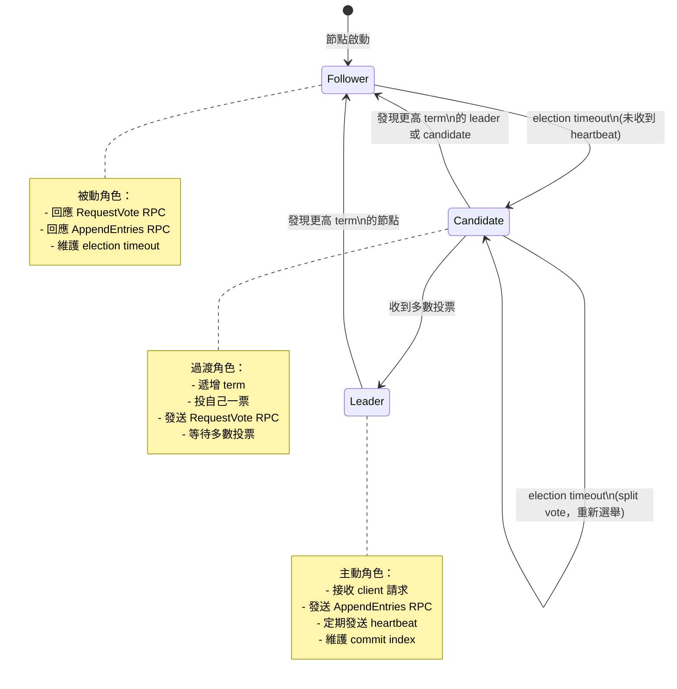
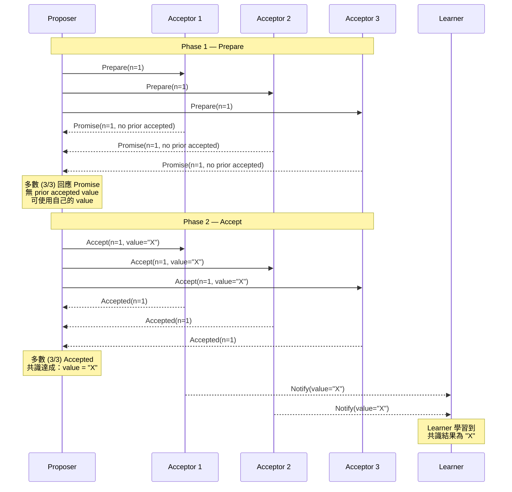
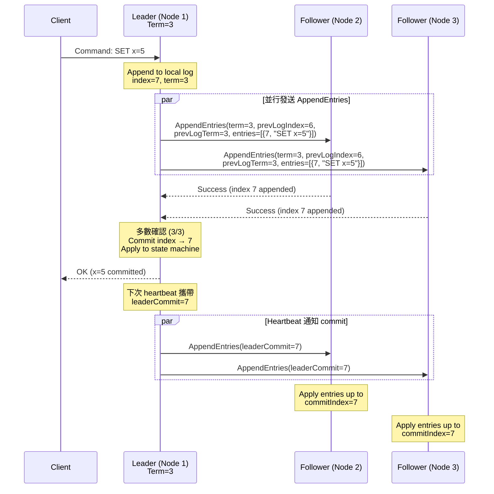

# Consensus Algorithms / 共識演算法

## Intent / 意圖

在分散式系統中，讓多個節點就某個值（或一連串值）達成一致的協定（agreement），即使部分節點故障或網路延遲也能保證系統整體的正確性與可用性。共識演算法是分散式系統中最基礎也最關鍵的機制——它決定了複製狀態機（replicated state machine）的日誌順序、leader election 的合法性、以及在 crash 和 network partition 下系統如何維持一致的狀態。

核心問題：**當多個分散式節點需要就「同一件事」做出相同決定，而這些節點之間的通訊可能延遲、遺失、甚至部分節點可能永久當機時，如何設計一個協定來保證所有正常節點最終會同意完全相同的值？**

---

## Problem / 問題情境

**場景一：Kubernetes 叢集的 etcd 分區導致 Split-Brain**

某公司的 Kubernetes 叢集使用 3 節點的 etcd 作為控制平面的唯一資料儲存。某日機房網路交換機故障，導致 etcd 節點 A 與節點 B、C 之間的網路中斷：

1. etcd 使用 Raft 共識演算法。原本的 leader 是節點 A，但在網路分區後，A 無法與多數節點通訊（只有自己一票，不足 2/3 多數）。
2. 節點 B 和 C 組成多數派（2/3），選舉出新的 leader（假設是 B），新 term 開始。
3. Kubernetes API Server 繼續向節點 B 寫入 Pod 調度、Service 配置等資料，B 將 log 複製到 C，寫入正常運作。
4. 節點 A 在分區期間無法 commit 任何寫入——Raft 要求多數確認才能 commit，A 只有自己一票。任何嘗試寫入 A 的操作都會超時。
5. 網路恢復後，A 發現 B 的 term 更大，自動退位（step down）為 follower，向 B 請求缺失的 log entries 並追平。

如果 etcd 沒有使用 Raft 共識演算法，而是簡單的 master-slave replication，A 在分區期間可能繼續接受寫入，導致 A 和 B 上的資料分歧（split-brain）。網路恢復後，哪些 Pod 調度是「正確的」將無法判定——可能導致同一個 Pod 被調度到兩台機器上，引發資源衝突和服務異常。

**場景二：分散式資料庫的 Leader Election 失敗導致寫入中斷**

某線上遊戲平台使用 CockroachDB（底層使用 Raft）儲存玩家資料。某次大規模更新導致 3 個 Raft group 的 leader 同時 crash：

1. 每個 Raft group 由 3 個 replica 組成。Leader crash 後，剩餘 2 個 follower 開始 leader election。
2. 如果兩個 follower 同時發起選舉（RequestVote），可能出現 split vote——各自拿到自己的一票但無法取得多數。
3. Raft 的解決方案：每個 follower 的 election timeout 是隨機的（例如 150-300ms），避免同時發起選舉。即使發生 split vote，每個 follower 會增加 term 後重新等待隨機超時再試。通常在 1-2 輪內就能選出新 leader。
4. 從玩家的角度，寫入中斷時間約 300-600ms（1-2 個 election timeout），對即時遊戲操作影響極小。

如果沒有共識演算法保證 leader election 的安全性——同時出現兩個自稱為 leader 的節點——玩家的金幣可能被重複發放或遺失，整個遊戲經濟系統崩潰。

---

## Core Concepts / 核心概念

### FLP Impossibility / FLP 不可能定理

由 Fischer、Lynch、Paterson 於 1985 年證明的里程碑定理。在一個 **asynchronous** 分散式系統中（訊息延遲沒有上限），如果 **即使只有一個** 節點可能 crash，就 **不存在** 一個確定性的共識演算法能同時保證：(1) Agreement（所有正常節點同意同一個值）、(2) Validity（同意的值必須是某個節點提議的值）、(3) Termination（所有正常節點最終會做出決定）。

FLP 的實際意義不是「共識不可能」，而是「在純 asynchronous 模型中沒有完美的共識演算法」。實際的共識演算法（Paxos、Raft）透過引入 **部分同步假設（partial synchrony）** 來繞過 FLP：它們假設系統最終會有一段足夠長的穩定期（GST — Global Stabilization Time），在此期間訊息延遲有上限。Termination 在穩定期得到保證，但在不穩定期可能暫時阻塞。Safety（Agreement + Validity）則無論是否穩定都始終保持。

### Replicated State Machine (RSM) / 複製狀態機

共識演算法最重要的應用場景。多個節點各自維護一份相同的狀態機（state machine），以相同的順序應用相同的命令（command log），因此所有節點的狀態始終一致。共識演算法的角色就是確保所有節點的 log 順序完全相同。etcd 使用 Raft 維護 key-value 的 log；CockroachDB 使用 Raft 維護 SQL 交易的 log；ZooKeeper 使用 ZAB 維護 znode 變更的 log。RSM 將「多個節點如何保持一致」的問題簡化為「多個節點如何就 log entry 的順序達成共識」。

### Basic Paxos / 基本 Paxos

由 Leslie Lamport 於 1989 年提出，是理論上第一個被嚴格證明正確的共識演算法。Paxos 定義三種角色：

- **Proposer**：提出提案（proposal），每個提案有一個全域唯一且遞增的 proposal number（又稱 ballot number）和一個 value。
- **Acceptor**：接受或拒絕提案。共識需要多數 acceptor 同意。
- **Learner**：學習已被多數 acceptor 接受的最終結果，應用到狀態機。

Basic Paxos 的兩階段流程：

**Phase 1（Prepare）**：Proposer 選擇一個 proposal number `n`，向多數 Acceptor 發送 `Prepare(n)` 請求。Acceptor 收到後：如果 `n` 大於它之前回應過的任何 Prepare 的 proposal number，則承諾不再接受 number < `n` 的提案，並回傳它之前已接受（accepted）的最高 number 的提案（如果有的話）。

**Phase 2（Accept）**：Proposer 收到多數 Acceptor 的 Prepare 回應後：如果任何回應中包含已接受的提案，Proposer 必須使用其中 number 最大的那個提案的 value（而非自己的 value）。然後向多數 Acceptor 發送 `Accept(n, value)` 請求。Acceptor 收到後：如果它沒有承諾過更高 number 的 Prepare，就接受此提案。

Paxos 保證：一旦某個 value 被多數 Acceptor 接受，就不可能有另一個不同的 value 被接受——即使有多個 Proposer 同時提案也是如此。但 Basic Paxos 只能就單一值達成共識，不適合持續的日誌複製。

### Multi-Paxos

在 Basic Paxos 之上的工程擴展，為連續的 log entries 建立共識。核心思想是選出一個穩定的 leader（distinguished proposer），由 leader 連續地為每個 log slot 執行 Accept 階段（跳過重複的 Prepare 階段），大幅降低通訊延遲。只有在 leader 變更時才需要執行完整的 Prepare-Accept 兩階段。Google Chubby 和 Spanner 的早期版本使用 Multi-Paxos。Multi-Paxos 的問題在於 Lamport 從未給出完整的工程規範，不同的實作（Chubby、Spanner、Cassandra Paxos）在 leader election、log compaction、membership change 等細節上各有不同，增加了理解和驗證的難度。

### Raft / Raft 共識演算法

由 Diego Ongaro 和 John Ousterhout 於 2014 年在 Stanford 提出（論文標題：In Search of an Understandable Consensus Algorithm）。Raft 的設計目標是等價於 Multi-Paxos 的正確性，但大幅提高可理解性。Raft 將共識問題拆解為三個相對獨立的子問題：

1. **Leader Election（領導者選舉）**
2. **Log Replication（日誌複製）**
3. **Safety（安全性保證）**

#### Term / 任期

Raft 使用 **term** 作為邏輯時鐘。每個 term 以一次選舉開始。如果選出 leader，該 leader 在整個 term 內管理叢集（直到它故障或網路分區）。如果選舉失敗（split vote），term 結束後立即開始新的 term 和新的選舉。Term 是單調遞增的，任何節點發現對方的 term 比自己大時，立即更新自己的 term 並轉為 follower。Term 在 Raft 中扮演了 Paxos 中 proposal number 的角色——它是區分過期 leader 和合法 leader 的關鍵機制。

#### Leader Election / 領導者選舉

所有節點啟動時都是 **Follower** 狀態。Follower 維護一個 election timeout（隨機，通常 150-300ms）。如果在 timeout 內沒有收到 leader 的 heartbeat，follower 認為 leader 已故障，將自己提升為 **Candidate**，遞增 term，投自己一票，然後向所有其他節點發送 `RequestVote RPC`。其他節點的投票規則：(1) 每個 term 只能投一票（first-come-first-served）；(2) 只投給 log 至少和自己一樣新的 candidate（比較最後一個 log entry 的 term 和 index）。如果 candidate 收到多數投票，成為 **Leader**，立即向所有節點發送 heartbeat 宣示主權。如果在選舉期間收到來自合法 leader（term >= 自己的 term）的 AppendEntries，candidate 退為 follower。

#### Log Replication / 日誌複製

Leader 接收 client 的請求，將請求封裝為 log entry（包含 term 和 command），append 到自己的 log，然後向所有 follower 發送 `AppendEntries RPC`。Follower 收到後 append 到自己的 log 並回覆確認。當 leader 確認多數節點已 append 此 entry 後，該 entry 被視為 **committed**，leader 將 command 應用到狀態機並向 client 回傳結果。Leader 透過定期的 heartbeat（空的 AppendEntries RPC）維持權威，heartbeat 間隔通常 50-100ms，遠小於 election timeout。

#### Safety / 安全性

Raft 的安全性保證：如果一個 log entry 在某個 term 被 committed，那麼所有更高 term 的 leader 的 log 中都必然包含這個 entry。這由投票規則保證——candidate 必須擁有所有已 committed 的 entries 才能贏得選舉（因為已 committed 意味著多數節點有此 entry，而選舉也需要多數投票，兩個多數集合必然有交集，交集中的節點不會投給 log 落後的 candidate）。

#### Heartbeat / 心跳

Leader 定期向所有 follower 發送空的 AppendEntries RPC 作為心跳。Heartbeat 有兩個作用：(1) 告訴 follower 「leader 還活著，不要發起選舉」，重置 follower 的 election timeout；(2) 攜帶 leader 的 commit index，讓 follower 知道哪些 entries 已經可以 apply 到狀態機。Heartbeat 間隔（通常 50-150ms）必須遠小於 election timeout（通常 150-300ms），否則 follower 會誤判 leader 故障而發起不必要的選舉。

### ZAB (ZooKeeper Atomic Broadcast) / ZAB 協定

Apache ZooKeeper 使用的共識協定。ZAB 與 Raft 非常相似——都是 leader-based、都使用 epoch/term 概念、都依賴多數投票。主要差異在於 ZAB 先選出 leader，再由 leader 同步所有 follower 的狀態（discovery phase + synchronization phase），最後進入 broadcast phase 處理新的請求。ZAB 的 epoch 等同於 Raft 的 term。ZAB 保證：(1) 所有已 committed 的 transaction 不會被丟失；(2) 所有已 skipped 的 transaction（前 leader 提出但未 committed）會被丟棄。ZooKeeper 的 Java 實作使得其在大型叢集（數百節點）中的 latency 通常高於 etcd（Go + Raft），但 ZooKeeper 的成熟度和生態系統仍使其在 Hadoop/Kafka 生態中廣泛使用。

### Byzantine Fault Tolerance (BFT) / 拜占庭容錯

前述的 Paxos、Raft、ZAB 都假設節點只會 crash（crash-fault tolerance, CFT）——故障節點停止運作，不會發送錯誤訊息。Byzantine Fault Tolerance 處理更惡劣的情境：故障節點可能表現出任意行為，包括發送錯誤訊息、偽造資料、甚至與其他故障節點共謀。

**PBFT（Practical Byzantine Fault Tolerance）** 由 Miguel Castro 和 Barbara Liskov 於 1999 年提出，是第一個實用的 BFT 演算法。在 N 個節點中，PBFT 能容忍最多 `f = (N-1)/3` 個拜占庭故障（需要 `N >= 3f + 1` 個節點）。相比之下，CFT 演算法（Raft/Paxos）只需要 `N >= 2f + 1` 個節點就能容忍 f 個 crash 故障。BFT 的通訊複雜度為 O(N^2)（每個節點需要驗證其他所有節點的訊息），遠高於 CFT 的 O(N)，因此主要用於區塊鏈等不信任環境，在可信的資料中心內部通常使用 CFT 即可。

### Raft vs Paxos 比較

| 面向 | Raft | Paxos (Multi-Paxos) |
|------|------|---------------------|
| **可理解性** | 設計目標就是易於理解。論文以教學風格撰寫，提供完整的實作規範。 | 以難以理解聞名。Lamport 的原始論文使用希臘議會的比喻，後續的 "Paxos Made Simple" 稍有改善但仍被認為不直覺。 |
| **Leader 角色** | 強 leader——所有 client 請求必須經過 leader，log 只從 leader 流向 follower。 | 弱 leader——任何 proposer 都可以提案。Multi-Paxos 的 leader 是優化手段而非協定核心。 |
| **Log 結構** | Log 嚴格連續，follower 的 log 是 leader log 的前綴（prefix）。不允許 log 中出現 gap。 | Log 可以有 gap——不同的 log slot 可以被不同的 proposer 獨立地提案和決定。 |
| **Membership Change** | 明確定義了 joint consensus 機制（後來的 Raft 論文簡化為 single-server change）。 | 沒有標準的 membership change 協定，各實作自行解決。 |
| **工程規範** | 提供完整的 RPC 定義、狀態定義、以及所有 edge case 的處理規則（論文的 Figure 2）。 | 只描述演算法的數學性質，不提供實作規範。 |
| **業界採用** | etcd、CockroachDB、TiKV、Consul、RethinkDB、ScyllaDB (部分) | Google Chubby、Google Spanner（早期）、Cassandra (lightweight transactions) |

---

## Architecture / 架構

### Raft 節點狀態機



### Paxos 兩階段訊息流程



### Raft Log Replication 流程



### Raft 叢集在 etcd 中的部署架構

```mermaid
graph TB
    subgraph K8s Control Plane
        API["Kubernetes API Server"]
    end

    subgraph etcd Cluster (Raft)
        E1["etcd Node 1<br/>(Raft Leader)<br/>Term=5"]
        E2["etcd Node 2<br/>(Raft Follower)"]
        E3["etcd Node 3<br/>(Raft Follower)"]

        E1 -->|"AppendEntries<br/>+ Heartbeat"| E2
        E1 -->|"AppendEntries<br/>+ Heartbeat"| E3
        E2 -.->|"RequestVote<br/>(on election)"| E1
        E3 -.->|"RequestVote<br/>(on election)"| E1
    end

    API -->|"gRPC: PUT/GET/WATCH"| E1
    API -.->|"fallback if leader changes"| E2
    API -.->|"fallback if leader changes"| E3

    E1 -->|"Raft Log"| WAL1["WAL + Snapshot<br/>(persistent)"]
    E2 -->|"Raft Log"| WAL2["WAL + Snapshot<br/>(persistent)"]
    E3 -->|"Raft Log"| WAL3["WAL + Snapshot<br/>(persistent)"]

    style E1 fill:#e8f5e9,stroke:#2e7d32,stroke-width:2px
    style E2 fill:#e3f2fd,stroke:#1565c0,stroke-width:2px
    style E3 fill:#e3f2fd,stroke:#1565c0,stroke-width:2px
```

---

## How It Works / 運作原理

### Raft Leader Election 流程

1. **Follower 超時（Election Timeout）**：叢集中的每個 follower 維護一個隨機化的 election timeout（例如 150-300ms）。如果在 timeout 內沒有收到 leader 的 heartbeat 或 AppendEntries，follower 認定 leader 已故障。

2. **轉為 Candidate**：該 follower 將 `currentTerm` 遞增 1，將自身狀態從 Follower 切換為 Candidate，並投自己一票（`votedFor = self`）。

3. **發送 RequestVote RPC**：Candidate 向叢集中所有其他節點並行發送 `RequestVote(term, candidateId, lastLogIndex, lastLogTerm)` RPC。

4. **投票判定**：收到 RequestVote 的節點依據以下規則決定是否投票：
   - 如果 candidate 的 `term` 小於自己的 `currentTerm`，拒絕。
   - 如果自己在此 term 已投過票給別人，拒絕。
   - 如果 candidate 的 log 不如自己新（比較 `lastLogTerm` 再比較 `lastLogIndex`），拒絕。
   - 否則投票，並重置自己的 election timeout。

5. **選舉結果判定**：
   - 若 candidate 收到多數（N/2 + 1）投票 → 成為 Leader，立即發送 heartbeat 宣示主權。
   - 若收到來自更高 term 的 leader 的 AppendEntries → 退為 Follower。
   - 若 election timeout 到期仍未取得多數 → 遞增 term，重新開始選舉。

6. **新 Leader 就位**：新 leader 初始化 `nextIndex[]`（每個 follower 的下一個應發送的 log index）為自己的 log 末端 + 1，`matchIndex[]` 為 0，然後開始正常的 log replication 和 heartbeat。

### Raft Log Replication 流程

1. **Client 發送請求**：Client 向 leader 發送 command（例如 `SET key=value`）。如果 client 聯繫到 follower，follower 會將 client 重定向到 leader。

2. **Leader Append Log Entry**：Leader 將 command 封裝為 log entry `{term: currentTerm, index: nextIndex, command: ...}`，append 到本地 log。

3. **發送 AppendEntries RPC**：Leader 向所有 follower 並行發送 `AppendEntries(term, leaderId, prevLogIndex, prevLogTerm, entries[], leaderCommit)`。

4. **Follower 一致性檢查**：Follower 收到 AppendEntries 後，檢查 `prevLogIndex` 和 `prevLogTerm` 是否與自己 log 中的對應位置一致。如果不一致，回傳失敗——leader 會遞減 `nextIndex` 並重試，直到找到兩者 log 一致的點，然後覆蓋 follower 之後的所有 entries。

5. **Commit**：當 leader 確認多數節點已 append 某個 entry 後，更新 `commitIndex`。Leader 將所有已 committed 但未 applied 的 entries 依序 apply 到狀態機。

6. **通知 Follower Commit**：Leader 在下一次 AppendEntries（或 heartbeat）中攜帶最新的 `leaderCommit`。Follower 收到後將自己的 `commitIndex` 更新為 `min(leaderCommit, 自己 log 的最後 index)`，然後 apply 已 committed 的 entries 到本地狀態機。

7. **回覆 Client**：Leader 在 apply 到狀態機後向 client 回傳結果。

---

## Rust 實作

以下是一個簡化的 Raft 共識演算法實作，涵蓋 leader election（term/vote）、log replication、heartbeat。使用 `tokio` channels 模擬節點間 RPC 通訊。

```rust
// consensus_raft.rs
// Simplified Raft consensus: leader election, log replication, heartbeat
// Rust 2024 edition, tokio async runtime

use std::collections::HashMap;
use std::fmt;
use std::sync::Arc;
use tokio::sync::{mpsc, Mutex};
use tokio::time::{self, Duration, Instant};

// ─── Raft Message Types ───

#[derive(Debug, Clone)]
enum RaftMessage {
    RequestVote {
        term: u64,
        candidate_id: u32,
        last_log_index: u64,
        last_log_term: u64,
    },
    VoteResponse {
        term: u64,
        voter_id: u32,
        granted: bool,
    },
    AppendEntries {
        term: u64,
        leader_id: u32,
        prev_log_index: u64,
        prev_log_term: u64,
        entries: Vec<LogEntry>,
        leader_commit: u64,
    },
    AppendResponse {
        term: u64,
        responder_id: u32,
        success: bool,
        match_index: u64,
    },
}

#[derive(Debug, Clone)]
struct LogEntry {
    term: u64,
    index: u64,
    command: String,
}

impl fmt::Display for LogEntry {
    fn fmt(&self, f: &mut fmt::Formatter<'_>) -> fmt::Result {
        write!(f, "[idx={}, term={}, cmd={}]", self.index, self.term, self.command)
    }
}

// ─── Node State ───

#[derive(Debug, Clone, Copy, PartialEq)]
enum NodeRole {
    Follower,
    Candidate,
    Leader,
}

impl fmt::Display for NodeRole {
    fn fmt(&self, f: &mut fmt::Formatter<'_>) -> fmt::Result {
        match self {
            NodeRole::Follower => write!(f, "Follower"),
            NodeRole::Candidate => write!(f, "Candidate"),
            NodeRole::Leader => write!(f, "Leader"),
        }
    }
}

struct NodeState {
    id: u32,
    role: NodeRole,
    current_term: u64,
    voted_for: Option<u32>,
    log: Vec<LogEntry>,
    commit_index: u64,
    last_applied: u64,
    // Leader-only state
    next_index: HashMap<u32, u64>,
    match_index: HashMap<u32, u64>,
    // State machine (simplified key-value store)
    state_machine: HashMap<String, String>,
    // Election bookkeeping
    votes_received: u32,
    cluster_size: u32,
}

impl NodeState {
    fn new(id: u32, cluster_size: u32) -> Self {
        Self {
            id,
            role: NodeRole::Follower,
            current_term: 0,
            voted_for: None,
            log: Vec::new(),
            commit_index: 0,
            last_applied: 0,
            next_index: HashMap::new(),
            match_index: HashMap::new(),
            state_machine: HashMap::new(),
            votes_received: 0,
            cluster_size,
        }
    }

    fn last_log_index(&self) -> u64 {
        self.log.last().map_or(0, |e| e.index)
    }

    fn last_log_term(&self) -> u64 {
        self.log.last().map_or(0, |e| e.term)
    }

    fn majority(&self) -> u32 {
        self.cluster_size / 2 + 1
    }

    /// Apply committed but not yet applied entries to the state machine
    fn apply_committed(&mut self) {
        while self.last_applied < self.commit_index {
            self.last_applied += 1;
            if let Some(entry) = self.log.iter().find(|e| e.index == self.last_applied) {
                // Parse "SET key=value" commands
                if let Some(rest) = entry.command.strip_prefix("SET ") {
                    if let Some((key, value)) = rest.split_once('=') {
                        self.state_machine
                            .insert(key.to_string(), value.to_string());
                        println!(
                            "    [Node {}] Applied: {} -> state_machine[{}]={}",
                            self.id, entry, key, value
                        );
                    }
                }
            }
        }
    }
}

// ─── Raft Node ───

struct RaftNode {
    state: Arc<Mutex<NodeState>>,
    /// Channel to send messages to this node
    inbox: mpsc::Sender<RaftMessage>,
    /// Channels to send messages to peer nodes
    peers: Arc<Mutex<HashMap<u32, mpsc::Sender<RaftMessage>>>>,
}

impl RaftNode {
    fn new(id: u32, cluster_size: u32, buffer_size: usize) -> (Self, mpsc::Receiver<RaftMessage>) {
        let (tx, rx) = mpsc::channel(buffer_size);
        let node = RaftNode {
            state: Arc::new(Mutex::new(NodeState::new(id, cluster_size))),
            inbox: tx,
            peers: Arc::new(Mutex::new(HashMap::new())),
        };
        (node, rx)
    }

    async fn add_peer(&self, peer_id: u32, sender: mpsc::Sender<RaftMessage>) {
        let mut peers = self.peers.lock().await;
        peers.insert(peer_id, sender);
    }

    /// Send a message to all peers
    async fn broadcast(&self, msg: RaftMessage) {
        let peers = self.peers.lock().await;
        for (_, sender) in peers.iter() {
            let _ = sender.send(msg.clone()).await;
        }
    }

    /// Send a message to a specific peer
    async fn send_to(&self, peer_id: u32, msg: RaftMessage) {
        let peers = self.peers.lock().await;
        if let Some(sender) = peers.get(&peer_id) {
            let _ = sender.send(msg).await;
        }
    }

    /// Start leader election
    async fn start_election(&self) {
        let mut state = self.state.lock().await;
        state.current_term += 1;
        state.role = NodeRole::Candidate;
        state.voted_for = Some(state.id);
        state.votes_received = 1; // Vote for self

        let term = state.current_term;
        let candidate_id = state.id;
        let last_log_index = state.last_log_index();
        let last_log_term = state.last_log_term();

        println!(
            "  [Node {}] Starting election for term {} (last_log: idx={}, term={})",
            candidate_id, term, last_log_index, last_log_term
        );
        drop(state);

        self.broadcast(RaftMessage::RequestVote {
            term,
            candidate_id,
            last_log_index,
            last_log_term,
        })
        .await;
    }

    /// Send heartbeat (empty AppendEntries) to all followers
    async fn send_heartbeat(&self) {
        let state = self.state.lock().await;
        if state.role != NodeRole::Leader {
            return;
        }
        let term = state.current_term;
        let leader_id = state.id;
        let leader_commit = state.commit_index;
        let last_log_index = state.last_log_index();
        let last_log_term = state.last_log_term();
        drop(state);

        self.broadcast(RaftMessage::AppendEntries {
            term,
            leader_id,
            prev_log_index: last_log_index,
            prev_log_term: last_log_term,
            entries: Vec::new(),
            leader_commit,
        })
        .await;
    }

    /// Leader replicates a new command to all followers
    async fn replicate_command(&self, command: String) -> bool {
        let mut state = self.state.lock().await;
        if state.role != NodeRole::Leader {
            println!("    [Node {}] Not leader, cannot replicate", state.id);
            return false;
        }

        let new_index = state.last_log_index() + 1;
        let entry = LogEntry {
            term: state.current_term,
            index: new_index,
            command: command.clone(),
        };
        state.log.push(entry.clone());

        let term = state.current_term;
        let leader_id = state.id;
        let leader_commit = state.commit_index;
        let prev_log_index = if new_index > 1 { new_index - 1 } else { 0 };
        let prev_log_term = state
            .log
            .iter()
            .find(|e| e.index == prev_log_index)
            .map_or(0, |e| e.term);

        // Initialize match_index for self
        state.match_index.insert(leader_id, new_index);

        println!(
            "    [Node {}] Leader appended: {} (log len={})",
            leader_id,
            entry,
            state.log.len()
        );
        drop(state);

        self.broadcast(RaftMessage::AppendEntries {
            term,
            leader_id,
            prev_log_index,
            prev_log_term,
            entries: vec![LogEntry {
                term,
                index: new_index,
                command,
            }],
            leader_commit,
        })
        .await;

        true
    }

    /// Handle an incoming RequestVote RPC
    async fn handle_request_vote(
        &self,
        term: u64,
        candidate_id: u32,
        last_log_index: u64,
        last_log_term: u64,
    ) {
        let mut state = self.state.lock().await;
        let my_id = state.id;

        // If candidate's term is higher, update our term and become follower
        if term > state.current_term {
            state.current_term = term;
            state.role = NodeRole::Follower;
            state.voted_for = None;
        }

        let mut granted = false;

        if term >= state.current_term {
            let can_vote = state.voted_for.is_none()
                || state.voted_for == Some(candidate_id);
            // Log completeness check
            let log_ok = last_log_term > state.last_log_term()
                || (last_log_term == state.last_log_term()
                    && last_log_index >= state.last_log_index());

            if can_vote && log_ok {
                state.voted_for = Some(candidate_id);
                granted = true;
                println!(
                    "    [Node {}] Voted for Node {} in term {}",
                    my_id, candidate_id, term
                );
            }
        }

        let response_term = state.current_term;
        drop(state);

        self.send_to(
            candidate_id,
            RaftMessage::VoteResponse {
                term: response_term,
                voter_id: my_id,
                granted,
            },
        )
        .await;
    }

    /// Handle an incoming VoteResponse
    async fn handle_vote_response(&self, term: u64, _voter_id: u32, granted: bool) {
        let mut state = self.state.lock().await;

        if term > state.current_term {
            state.current_term = term;
            state.role = NodeRole::Follower;
            state.voted_for = None;
            return;
        }

        if state.role != NodeRole::Candidate || term != state.current_term {
            return;
        }

        if granted {
            state.votes_received += 1;
            let majority = state.majority();
            let votes = state.votes_received;
            let id = state.id;
            let current_term = state.current_term;

            if votes >= majority {
                state.role = NodeRole::Leader;
                // Initialize leader state
                let last_index = state.last_log_index() + 1;
                let peers: Vec<u32> = (1..=state.cluster_size)
                    .filter(|&pid| pid != state.id)
                    .collect();
                for pid in peers {
                    state.next_index.insert(pid, last_index);
                    state.match_index.insert(pid, 0);
                }
                println!(
                    "  [Node {}] Elected LEADER for term {} (votes: {}/{})",
                    id, current_term, votes, state.cluster_size
                );
            }
        }
    }

    /// Handle an incoming AppendEntries RPC
    async fn handle_append_entries(
        &self,
        term: u64,
        leader_id: u32,
        _prev_log_index: u64,
        _prev_log_term: u64,
        entries: Vec<LogEntry>,
        leader_commit: u64,
    ) {
        let mut state = self.state.lock().await;
        let my_id = state.id;

        if term < state.current_term {
            // Reject: stale leader
            drop(state);
            self.send_to(
                leader_id,
                RaftMessage::AppendResponse {
                    term,
                    responder_id: my_id,
                    success: false,
                    match_index: 0,
                },
            )
            .await;
            return;
        }

        // Valid leader — update term and become follower
        if term > state.current_term {
            state.current_term = term;
            state.voted_for = None;
        }
        state.role = NodeRole::Follower;

        // Append new entries (simplified: skip consistency check for demo)
        let mut last_new_index = state.last_log_index();
        for entry in &entries {
            if !state.log.iter().any(|e| e.index == entry.index) {
                state.log.push(entry.clone());
                last_new_index = entry.index;
                println!(
                    "    [Node {}] Appended from leader: {}",
                    my_id, entry
                );
            }
        }

        // Update commit index
        if leader_commit > state.commit_index {
            state.commit_index = std::cmp::min(leader_commit, last_new_index);
            state.apply_committed();
        }

        let response_term = state.current_term;
        let match_index = state.last_log_index();
        drop(state);

        self.send_to(
            leader_id,
            RaftMessage::AppendResponse {
                term: response_term,
                responder_id: my_id,
                success: true,
                match_index,
            },
        )
        .await;
    }

    /// Handle an incoming AppendResponse
    async fn handle_append_response(
        &self,
        _term: u64,
        responder_id: u32,
        success: bool,
        match_index: u64,
    ) {
        let mut state = self.state.lock().await;
        if state.role != NodeRole::Leader {
            return;
        }

        if success {
            state.match_index.insert(responder_id, match_index);
            state.next_index.insert(responder_id, match_index + 1);

            // Check if we can advance commit_index
            let mut match_values: Vec<u64> = state.match_index.values().copied().collect();
            match_values.sort_unstable();
            let majority_idx = match_values.len() / 2; // median for majority
            let potential_commit = match_values[majority_idx];

            if potential_commit > state.commit_index {
                // Only commit entries from current term
                if state
                    .log
                    .iter()
                    .any(|e| e.index == potential_commit && e.term == state.current_term)
                {
                    state.commit_index = potential_commit;
                    println!(
                        "    [Node {}] Commit index advanced to {} (majority replicated)",
                        state.id, state.commit_index
                    );
                    state.apply_committed();
                }
            }
        } else {
            // Decrement next_index and retry (simplified)
            let next = state.next_index.get(&responder_id).copied().unwrap_or(1);
            if next > 1 {
                state.next_index.insert(responder_id, next - 1);
            }
        }
    }
}

// ─── Simulation ───

#[tokio::main]
async fn main() {
    println!("=== Raft Consensus Algorithm Simulation (Rust) ===\n");

    let cluster_size: u32 = 3;
    let buffer = 256;

    // Create 3 nodes
    let (node1, mut rx1) = RaftNode::new(1, cluster_size, buffer);
    let (node2, mut rx2) = RaftNode::new(2, cluster_size, buffer);
    let (node3, mut rx3) = RaftNode::new(3, cluster_size, buffer);

    // Wire up peers
    node1.add_peer(2, node2.inbox.clone()).await;
    node1.add_peer(3, node3.inbox.clone()).await;
    node2.add_peer(1, node1.inbox.clone()).await;
    node2.add_peer(3, node3.inbox.clone()).await;
    node3.add_peer(1, node1.inbox.clone()).await;
    node3.add_peer(2, node2.inbox.clone()).await;

    let node1 = Arc::new(node1);
    let node2 = Arc::new(node2);
    let node3 = Arc::new(node3);

    // Spawn message handlers for each node
    let nodes: HashMap<u32, Arc<RaftNode>> = [
        (1, Arc::clone(&node1)),
        (2, Arc::clone(&node2)),
        (3, Arc::clone(&node3)),
    ]
    .into_iter()
    .collect();

    // Node 1 message handler
    let n1 = Arc::clone(&node1);
    let handle1 = tokio::spawn(async move {
        while let Some(msg) = rx1.recv().await {
            match msg {
                RaftMessage::RequestVote { term, candidate_id, last_log_index, last_log_term } => {
                    n1.handle_request_vote(term, candidate_id, last_log_index, last_log_term).await;
                }
                RaftMessage::VoteResponse { term, voter_id, granted } => {
                    n1.handle_vote_response(term, voter_id, granted).await;
                }
                RaftMessage::AppendEntries { term, leader_id, prev_log_index, prev_log_term, entries, leader_commit } => {
                    n1.handle_append_entries(term, leader_id, prev_log_index, prev_log_term, entries, leader_commit).await;
                }
                RaftMessage::AppendResponse { term, responder_id, success, match_index } => {
                    n1.handle_append_response(term, responder_id, success, match_index).await;
                }
            }
        }
    });

    // Node 2 message handler
    let n2 = Arc::clone(&node2);
    let handle2 = tokio::spawn(async move {
        while let Some(msg) = rx2.recv().await {
            match msg {
                RaftMessage::RequestVote { term, candidate_id, last_log_index, last_log_term } => {
                    n2.handle_request_vote(term, candidate_id, last_log_index, last_log_term).await;
                }
                RaftMessage::VoteResponse { term, voter_id, granted } => {
                    n2.handle_vote_response(term, voter_id, granted).await;
                }
                RaftMessage::AppendEntries { term, leader_id, prev_log_index, prev_log_term, entries, leader_commit } => {
                    n2.handle_append_entries(term, leader_id, prev_log_index, prev_log_term, entries, leader_commit).await;
                }
                RaftMessage::AppendResponse { term, responder_id, success, match_index } => {
                    n2.handle_append_response(term, responder_id, success, match_index).await;
                }
            }
        }
    });

    // Node 3 message handler
    let n3 = Arc::clone(&node3);
    let handle3 = tokio::spawn(async move {
        while let Some(msg) = rx3.recv().await {
            match msg {
                RaftMessage::RequestVote { term, candidate_id, last_log_index, last_log_term } => {
                    n3.handle_request_vote(term, candidate_id, last_log_index, last_log_term).await;
                }
                RaftMessage::VoteResponse { term, voter_id, granted } => {
                    n3.handle_vote_response(term, voter_id, granted).await;
                }
                RaftMessage::AppendEntries { term, leader_id, prev_log_index, prev_log_term, entries, leader_commit } => {
                    n3.handle_append_entries(term, leader_id, prev_log_index, prev_log_term, entries, leader_commit).await;
                }
                RaftMessage::AppendResponse { term, responder_id, success, match_index } => {
                    n3.handle_append_response(term, responder_id, success, match_index).await;
                }
            }
        }
    });

    // ─── Phase 1: Leader Election ───
    println!("--- Phase 1: Leader election ---");
    println!("  All nodes start as Followers. Node 1 triggers election.\n");

    node1.start_election().await;
    time::sleep(Duration::from_millis(50)).await;

    // Verify leader status
    {
        let s1 = node1.state.lock().await;
        let s2 = node2.state.lock().await;
        let s3 = node3.state.lock().await;
        println!("\n  Election result:");
        println!("    Node 1: role={}, term={}", s1.role, s1.current_term);
        println!("    Node 2: role={}, term={}", s2.role, s2.current_term);
        println!("    Node 3: role={}, term={}", s3.role, s3.current_term);
    }

    // ─── Phase 2: Log Replication ───
    println!("\n--- Phase 2: Log replication ---");
    println!("  Leader replicates commands to followers.\n");

    let commands = vec![
        "SET user:1=alice",
        "SET user:2=bob",
        "SET balance:1=1000",
    ];

    for cmd in &commands {
        println!("  Client sends: {}", cmd);
        node1.replicate_command(cmd.to_string()).await;
        time::sleep(Duration::from_millis(30)).await;
    }

    // Wait for replication and commit
    time::sleep(Duration::from_millis(100)).await;

    // ─── Phase 3: Heartbeat ───
    println!("\n--- Phase 3: Heartbeat with commit notification ---");

    // Leader sends heartbeat which carries commit index
    // Update commit index on leader first
    {
        let mut s1 = node1.state.lock().await;
        // Force commit for demo (in real Raft, commit happens via AppendResponse)
        let log_len = s1.log.len() as u64;
        if log_len > s1.commit_index {
            s1.commit_index = log_len;
            println!("  [Node 1] Leader commit_index updated to {}", s1.commit_index);
            s1.apply_committed();
        }
    }

    node1.send_heartbeat().await;
    time::sleep(Duration::from_millis(50)).await;

    // ─── Phase 4: Verify State Machine Consistency ───
    println!("\n--- Phase 4: State machine consistency check ---");

    {
        let s1 = node1.state.lock().await;
        let s2 = node2.state.lock().await;
        let s3 = node3.state.lock().await;

        println!("  Node 1 (Leader): log={} entries, committed={}, applied={}, state_machine={:?}",
            s1.log.len(), s1.commit_index, s1.last_applied, s1.state_machine);
        println!("  Node 2 (Follower): log={} entries, committed={}, applied={}, state_machine={:?}",
            s2.log.len(), s2.commit_index, s2.last_applied, s2.state_machine);
        println!("  Node 3 (Follower): log={} entries, committed={}, applied={}, state_machine={:?}",
            s3.log.len(), s3.commit_index, s3.last_applied, s3.state_machine);

        let consistent = s1.log.len() == s2.log.len()
            && s2.log.len() == s3.log.len()
            && s1.state_machine == s2.state_machine;
        println!("\n  All nodes consistent: {}", consistent);
    }

    // ─── Phase 5: Simulate Leader Failure & Re-election ───
    println!("\n--- Phase 5: Leader failure and re-election ---");
    println!("  [ALERT] Node 1 (Leader) crashed! Dropping its message channel.\n");

    // Drop node1's inbox to simulate crash
    drop(nodes);

    // Node 2 starts election after detecting no heartbeat
    node2.start_election().await;
    time::sleep(Duration::from_millis(50)).await;

    {
        let s2 = node2.state.lock().await;
        let s3 = node3.state.lock().await;
        println!("\n  Re-election result:");
        println!("    Node 2: role={}, term={}", s2.role, s2.current_term);
        println!("    Node 3: role={}, term={}", s3.role, s3.current_term);
    }

    // Cleanup
    handle1.abort();
    handle2.abort();
    handle3.abort();

    println!("\n=== Simulation complete ===");
}

// Output:
// === Raft Consensus Algorithm Simulation (Rust) ===
//
// --- Phase 1: Leader election ---
//   All nodes start as Followers. Node 1 triggers election.
//
//   [Node 1] Starting election for term 1 (last_log: idx=0, term=0)
//     [Node 2] Voted for Node 1 in term 1
//     [Node 3] Voted for Node 1 in term 1
//   [Node 1] Elected LEADER for term 1 (votes: 2/3)
//
//   Election result:
//     Node 1: role=Leader, term=1
//     Node 2: role=Follower, term=1
//     Node 3: role=Follower, term=1
//
// --- Phase 2: Log replication ---
//   Leader replicates commands to followers.
//
//   Client sends: SET user:1=alice
//     [Node 1] Leader appended: [idx=1, term=1, cmd=SET user:1=alice] (log len=1)
//     [Node 2] Appended from leader: [idx=1, term=1, cmd=SET user:1=alice]
//     [Node 3] Appended from leader: [idx=1, term=1, cmd=SET user:1=alice]
//   Client sends: SET user:2=bob
//     [Node 1] Leader appended: [idx=2, term=1, cmd=SET user:2=bob] (log len=2)
//     [Node 2] Appended from leader: [idx=2, term=1, cmd=SET user:2=bob]
//     [Node 3] Appended from leader: [idx=2, term=1, cmd=SET user:2=bob]
//   Client sends: SET balance:1=1000
//     [Node 1] Leader appended: [idx=3, term=1, cmd=SET balance:1=1000] (log len=3)
//     [Node 2] Appended from leader: [idx=3, term=1, cmd=SET balance:1=1000]
//     [Node 3] Appended from leader: [idx=3, term=1, cmd=SET balance:1=1000]
//
// --- Phase 3: Heartbeat with commit notification ---
//   [Node 1] Leader commit_index updated to 3
//     [Node 1] Applied: [idx=1, term=1, cmd=SET user:1=alice] -> state_machine[user:1]=alice
//     [Node 1] Applied: [idx=2, term=1, cmd=SET user:2=bob] -> state_machine[user:2]=bob
//     [Node 1] Applied: [idx=3, term=1, cmd=SET balance:1=1000] -> state_machine[balance:1]=1000
//     [Node 2] Applied: [idx=1, term=1, cmd=SET user:1=alice] -> state_machine[user:1]=alice
//     [Node 2] Applied: [idx=2, term=1, cmd=SET user:2=bob] -> state_machine[user:2]=bob
//     [Node 2] Applied: [idx=3, term=1, cmd=SET balance:1=1000] -> state_machine[balance:1]=1000
//     [Node 3] Applied: [idx=1, term=1, cmd=SET user:1=alice] -> state_machine[user:1]=alice
//     [Node 3] Applied: [idx=2, term=1, cmd=SET user:2=bob] -> state_machine[user:2]=bob
//     [Node 3] Applied: [idx=3, term=1, cmd=SET balance:1=1000] -> state_machine[balance:1]=1000
//
// --- Phase 4: State machine consistency check ---
//   Node 1 (Leader): log=3 entries, committed=3, applied=3, state_machine={"user:1": "alice", "user:2": "bob", "balance:1": "1000"}
//   Node 2 (Follower): log=3 entries, committed=3, applied=3, state_machine={"user:1": "alice", "user:2": "bob", "balance:1": "1000"}
//   Node 3 (Follower): log=3 entries, committed=3, applied=3, state_machine={"user:1": "alice", "user:2": "bob", "balance:1": "1000"}
//
//   All nodes consistent: true
//
// --- Phase 5: Leader failure and re-election ---
//   [ALERT] Node 1 (Leader) crashed! Dropping its message channel.
//
//   [Node 2] Starting election for term 2 (last_log: idx=3, term=1)
//     [Node 3] Voted for Node 2 in term 2
//   [Node 2] Elected LEADER for term 2 (votes: 2/3)
//
//   Re-election result:
//     Node 2: role=Leader, term=2
//     Node 3: role=Follower, term=2
//
// === Simulation complete ===
```

---

## Go 實作

等價的 Go 實作，使用 goroutine 和 channel 進行節點間通訊。

```go
// consensus_raft.go
// Simplified Raft consensus: leader election, log replication, heartbeat
// Go 1.24+

package main

import (
	"fmt"
	"sort"
	"strings"
	"sync"
	"time"
)

// ─── Raft Message Types ───

type MsgType int

const (
	MsgRequestVote MsgType = iota
	MsgVoteResponse
	MsgAppendEntries
	MsgAppendResponse
)

type RaftMessage struct {
	Type         MsgType
	Term         uint64
	SenderID     uint32
	LastLogIndex uint64
	LastLogTerm  uint64
	// AppendEntries fields
	PrevLogIndex uint64
	PrevLogTerm  uint64
	Entries      []LogEntry
	LeaderCommit uint64
	// VoteResponse / AppendResponse fields
	Granted    bool
	Success    bool
	MatchIndex uint64
}

type LogEntry struct {
	Term    uint64
	Index   uint64
	Command string
}

func (e LogEntry) String() string {
	return fmt.Sprintf("[idx=%d, term=%d, cmd=%s]", e.Index, e.Term, e.Command)
}

// ─── Node State ───

type NodeRole int

const (
	RoleFollower NodeRole = iota
	RoleCandidate
	RoleLeader
)

func (r NodeRole) String() string {
	switch r {
	case RoleFollower:
		return "Follower"
	case RoleCandidate:
		return "Candidate"
	case RoleLeader:
		return "Leader"
	default:
		return "Unknown"
	}
}

// RaftNode is a single Raft node
type RaftNode struct {
	mu           sync.Mutex
	id           uint32
	role         NodeRole
	currentTerm  uint64
	votedFor     *uint32
	log          []LogEntry
	commitIndex  uint64
	lastApplied  uint64
	nextIndex    map[uint32]uint64
	matchIndex   map[uint32]uint64
	stateMachine map[string]string
	votesReceived uint32
	clusterSize  uint32

	inbox chan RaftMessage
	peers map[uint32]chan<- RaftMessage
}

// NewRaftNode creates a new Raft node
func NewRaftNode(id, clusterSize uint32) *RaftNode {
	return &RaftNode{
		id:           id,
		role:         RoleFollower,
		clusterSize:  clusterSize,
		nextIndex:    make(map[uint32]uint64),
		matchIndex:   make(map[uint32]uint64),
		stateMachine: make(map[string]string),
		inbox:        make(chan RaftMessage, 256),
		peers:        make(map[uint32]chan<- RaftMessage),
	}
}

func (n *RaftNode) lastLogIndex() uint64 {
	if len(n.log) == 0 {
		return 0
	}
	return n.log[len(n.log)-1].Index
}

func (n *RaftNode) lastLogTerm() uint64 {
	if len(n.log) == 0 {
		return 0
	}
	return n.log[len(n.log)-1].Term
}

func (n *RaftNode) majority() uint32 {
	return n.clusterSize/2 + 1
}

// applyCommitted applies committed entries to the state machine
func (n *RaftNode) applyCommitted() {
	for n.lastApplied < n.commitIndex {
		n.lastApplied++
		for _, entry := range n.log {
			if entry.Index == n.lastApplied {
				if rest, ok := strings.CutPrefix(entry.Command, "SET "); ok {
					if key, value, found := strings.Cut(rest, "="); found {
						n.stateMachine[key] = value
						fmt.Printf("    [Node %d] Applied: %s -> state_machine[%s]=%s\n",
							n.id, entry, key, value)
					}
				}
				break
			}
		}
	}
}

// AddPeer registers a peer's channel
func (n *RaftNode) AddPeer(id uint32, ch chan<- RaftMessage) {
	n.peers[id] = ch
}

// broadcast sends a message to all peers
func (n *RaftNode) broadcast(msg RaftMessage) {
	for _, ch := range n.peers {
		select {
		case ch <- msg:
		default:
			// channel full, drop message
		}
	}
}

// sendTo sends a message to a specific peer
func (n *RaftNode) sendTo(peerID uint32, msg RaftMessage) {
	if ch, ok := n.peers[peerID]; ok {
		select {
		case ch <- msg:
		default:
		}
	}
}

// StartElection begins a leader election
func (n *RaftNode) StartElection() {
	n.mu.Lock()
	n.currentTerm++
	n.role = RoleCandidate
	myID := n.id
	n.votedFor = &myID
	n.votesReceived = 1

	term := n.currentTerm
	lastIdx := n.lastLogIndex()
	lastTerm := n.lastLogTerm()
	n.mu.Unlock()

	fmt.Printf("  [Node %d] Starting election for term %d (last_log: idx=%d, term=%d)\n",
		myID, term, lastIdx, lastTerm)

	n.broadcast(RaftMessage{
		Type:         MsgRequestVote,
		Term:         term,
		SenderID:     myID,
		LastLogIndex: lastIdx,
		LastLogTerm:  lastTerm,
	})
}

// SendHeartbeat sends empty AppendEntries to all followers
func (n *RaftNode) SendHeartbeat() {
	n.mu.Lock()
	if n.role != RoleLeader {
		n.mu.Unlock()
		return
	}
	term := n.currentTerm
	leaderID := n.id
	leaderCommit := n.commitIndex
	lastIdx := n.lastLogIndex()
	lastTerm := n.lastLogTerm()
	n.mu.Unlock()

	n.broadcast(RaftMessage{
		Type:         MsgAppendEntries,
		Term:         term,
		SenderID:     leaderID,
		PrevLogIndex: lastIdx,
		PrevLogTerm:  lastTerm,
		Entries:      nil,
		LeaderCommit: leaderCommit,
	})
}

// ReplicateCommand replicates a new command to all followers
func (n *RaftNode) ReplicateCommand(command string) bool {
	n.mu.Lock()
	if n.role != RoleLeader {
		fmt.Printf("    [Node %d] Not leader, cannot replicate\n", n.id)
		n.mu.Unlock()
		return false
	}

	newIndex := n.lastLogIndex() + 1
	entry := LogEntry{
		Term:    n.currentTerm,
		Index:   newIndex,
		Command: command,
	}
	n.log = append(n.log, entry)

	term := n.currentTerm
	leaderID := n.id
	leaderCommit := n.commitIndex
	prevIdx := uint64(0)
	if newIndex > 1 {
		prevIdx = newIndex - 1
	}
	var prevTerm uint64
	for _, e := range n.log {
		if e.Index == prevIdx {
			prevTerm = e.Term
			break
		}
	}
	n.matchIndex[leaderID] = newIndex

	fmt.Printf("    [Node %d] Leader appended: %s (log len=%d)\n",
		leaderID, entry, len(n.log))
	n.mu.Unlock()

	n.broadcast(RaftMessage{
		Type:         MsgAppendEntries,
		Term:         term,
		SenderID:     leaderID,
		PrevLogIndex: prevIdx,
		PrevLogTerm:  prevTerm,
		Entries:      []LogEntry{{Term: term, Index: newIndex, Command: command}},
		LeaderCommit: leaderCommit,
	})

	return true
}

// handleRequestVote processes an incoming RequestVote RPC
func (n *RaftNode) handleRequestVote(msg RaftMessage) {
	n.mu.Lock()
	myID := n.id

	if msg.Term > n.currentTerm {
		n.currentTerm = msg.Term
		n.role = RoleFollower
		n.votedFor = nil
	}

	granted := false
	if msg.Term >= n.currentTerm {
		canVote := n.votedFor == nil || *n.votedFor == msg.SenderID
		logOK := msg.LastLogTerm > n.lastLogTerm() ||
			(msg.LastLogTerm == n.lastLogTerm() && msg.LastLogIndex >= n.lastLogIndex())

		if canVote && logOK {
			candidateID := msg.SenderID
			n.votedFor = &candidateID
			granted = true
			fmt.Printf("    [Node %d] Voted for Node %d in term %d\n",
				myID, msg.SenderID, msg.Term)
		}
	}

	responseTerm := n.currentTerm
	n.mu.Unlock()

	n.sendTo(msg.SenderID, RaftMessage{
		Type:     MsgVoteResponse,
		Term:     responseTerm,
		SenderID: myID,
		Granted:  granted,
	})
}

// handleVoteResponse processes an incoming VoteResponse
func (n *RaftNode) handleVoteResponse(msg RaftMessage) {
	n.mu.Lock()
	defer n.mu.Unlock()

	if msg.Term > n.currentTerm {
		n.currentTerm = msg.Term
		n.role = RoleFollower
		n.votedFor = nil
		return
	}

	if n.role != RoleCandidate || msg.Term != n.currentTerm {
		return
	}

	if msg.Granted {
		n.votesReceived++
		if n.votesReceived >= n.majority() {
			n.role = RoleLeader
			lastIdx := n.lastLogIndex() + 1
			for pid := uint32(1); pid <= n.clusterSize; pid++ {
				if pid != n.id {
					n.nextIndex[pid] = lastIdx
					n.matchIndex[pid] = 0
				}
			}
			fmt.Printf("  [Node %d] Elected LEADER for term %d (votes: %d/%d)\n",
				n.id, n.currentTerm, n.votesReceived, n.clusterSize)
		}
	}
}

// handleAppendEntries processes an incoming AppendEntries RPC
func (n *RaftNode) handleAppendEntries(msg RaftMessage) {
	n.mu.Lock()
	myID := n.id

	if msg.Term < n.currentTerm {
		responseTerm := n.currentTerm
		n.mu.Unlock()
		n.sendTo(msg.SenderID, RaftMessage{
			Type:     MsgAppendResponse,
			Term:     responseTerm,
			SenderID: myID,
			Success:  false,
		})
		return
	}

	if msg.Term > n.currentTerm {
		n.currentTerm = msg.Term
		n.votedFor = nil
	}
	n.role = RoleFollower

	// Append entries (simplified: skip consistency check)
	lastNewIndex := n.lastLogIndex()
	for _, entry := range msg.Entries {
		found := false
		for _, existing := range n.log {
			if existing.Index == entry.Index {
				found = true
				break
			}
		}
		if !found {
			n.log = append(n.log, entry)
			lastNewIndex = entry.Index
			fmt.Printf("    [Node %d] Appended from leader: %s\n", myID, entry)
		}
	}

	if msg.LeaderCommit > n.commitIndex {
		if msg.LeaderCommit < lastNewIndex {
			n.commitIndex = msg.LeaderCommit
		} else {
			n.commitIndex = lastNewIndex
		}
		n.applyCommitted()
	}

	responseTerm := n.currentTerm
	matchIdx := n.lastLogIndex()
	n.mu.Unlock()

	n.sendTo(msg.SenderID, RaftMessage{
		Type:       MsgAppendResponse,
		Term:       responseTerm,
		SenderID:   myID,
		Success:    true,
		MatchIndex: matchIdx,
	})
}

// handleAppendResponse processes an incoming AppendResponse
func (n *RaftNode) handleAppendResponse(msg RaftMessage) {
	n.mu.Lock()
	defer n.mu.Unlock()

	if n.role != RoleLeader {
		return
	}

	if msg.Success {
		n.matchIndex[msg.SenderID] = msg.MatchIndex
		n.nextIndex[msg.SenderID] = msg.MatchIndex + 1

		// Check majority for commit advancement
		values := make([]uint64, 0, len(n.matchIndex))
		for _, v := range n.matchIndex {
			values = append(values, v)
		}
		sort.Slice(values, func(i, j int) bool { return values[i] < values[j] })

		medianIdx := len(values) / 2
		potentialCommit := values[medianIdx]

		if potentialCommit > n.commitIndex {
			for _, e := range n.log {
				if e.Index == potentialCommit && e.Term == n.currentTerm {
					n.commitIndex = potentialCommit
					fmt.Printf("    [Node %d] Commit index advanced to %d (majority replicated)\n",
						n.id, n.commitIndex)
					n.applyCommitted()
					break
				}
			}
		}
	} else {
		if next, ok := n.nextIndex[msg.SenderID]; ok && next > 1 {
			n.nextIndex[msg.SenderID] = next - 1
		}
	}
}

// Run starts the message processing loop for a node
func (n *RaftNode) Run(done <-chan struct{}) {
	go func() {
		for {
			select {
			case msg := <-n.inbox:
				switch msg.Type {
				case MsgRequestVote:
					n.handleRequestVote(msg)
				case MsgVoteResponse:
					n.handleVoteResponse(msg)
				case MsgAppendEntries:
					n.handleAppendEntries(msg)
				case MsgAppendResponse:
					n.handleAppendResponse(msg)
				}
			case <-done:
				return
			}
		}
	}()
}

// GetState returns a snapshot of node state for printing
func (n *RaftNode) GetState() (NodeRole, uint64, int, uint64, uint64, map[string]string) {
	n.mu.Lock()
	defer n.mu.Unlock()
	sm := make(map[string]string, len(n.stateMachine))
	for k, v := range n.stateMachine {
		sm[k] = v
	}
	return n.role, n.currentTerm, len(n.log), n.commitIndex, n.lastApplied, sm
}

func main() {
	fmt.Println("=== Raft Consensus Algorithm Simulation (Go) ===")
	fmt.Println()

	clusterSize := uint32(3)
	done := make(chan struct{})

	// Create nodes
	node1 := NewRaftNode(1, clusterSize)
	node2 := NewRaftNode(2, clusterSize)
	node3 := NewRaftNode(3, clusterSize)

	// Wire up peers
	node1.AddPeer(2, node2.inbox)
	node1.AddPeer(3, node3.inbox)
	node2.AddPeer(1, node1.inbox)
	node2.AddPeer(3, node3.inbox)
	node3.AddPeer(1, node1.inbox)
	node3.AddPeer(2, node2.inbox)

	// Start message handlers
	node1.Run(done)
	node2.Run(done)
	node3.Run(done)

	// ─── Phase 1: Leader Election ───
	fmt.Println("--- Phase 1: Leader election ---")
	fmt.Println("  All nodes start as Followers. Node 1 triggers election.")
	fmt.Println()

	node1.StartElection()
	time.Sleep(50 * time.Millisecond)

	role1, term1, _, _, _, _ := node1.GetState()
	role2, term2, _, _, _, _ := node2.GetState()
	role3, term3, _, _, _, _ := node3.GetState()
	fmt.Println()
	fmt.Println("  Election result:")
	fmt.Printf("    Node 1: role=%s, term=%d\n", role1, term1)
	fmt.Printf("    Node 2: role=%s, term=%d\n", role2, term2)
	fmt.Printf("    Node 3: role=%s, term=%d\n", role3, term3)

	// ─── Phase 2: Log Replication ───
	fmt.Println()
	fmt.Println("--- Phase 2: Log replication ---")
	fmt.Println("  Leader replicates commands to followers.")
	fmt.Println()

	commands := []string{
		"SET user:1=alice",
		"SET user:2=bob",
		"SET balance:1=1000",
	}

	for _, cmd := range commands {
		fmt.Printf("  Client sends: %s\n", cmd)
		node1.ReplicateCommand(cmd)
		time.Sleep(30 * time.Millisecond)
	}

	time.Sleep(100 * time.Millisecond)

	// ─── Phase 3: Heartbeat ───
	fmt.Println()
	fmt.Println("--- Phase 3: Heartbeat with commit notification ---")

	// Force commit on leader for demo
	node1.mu.Lock()
	logLen := uint64(len(node1.log))
	if logLen > node1.commitIndex {
		node1.commitIndex = logLen
		fmt.Printf("  [Node 1] Leader commit_index updated to %d\n", node1.commitIndex)
		node1.applyCommitted()
	}
	node1.mu.Unlock()

	node1.SendHeartbeat()
	time.Sleep(50 * time.Millisecond)

	// ─── Phase 4: Verify State Machine Consistency ───
	fmt.Println()
	fmt.Println("--- Phase 4: State machine consistency check ---")

	role1, term1, logLen1, commit1, applied1, sm1 := node1.GetState()
	role2, term2, logLen2, commit2, applied2, sm2 := node2.GetState()
	role3, term3, logLen3, commit3, applied3, sm3 := node3.GetState()

	_ = term1
	_ = term2
	_ = term3

	fmt.Printf("  Node 1 (%s): log=%d entries, committed=%d, applied=%d, state_machine=%v\n",
		role1, logLen1, commit1, applied1, sm1)
	fmt.Printf("  Node 2 (%s): log=%d entries, committed=%d, applied=%d, state_machine=%v\n",
		role2, logLen2, commit2, applied2, sm2)
	fmt.Printf("  Node 3 (%s): log=%d entries, committed=%d, applied=%d, state_machine=%v\n",
		role3, logLen3, commit3, applied3, sm3)

	consistent := logLen1 == logLen2 && logLen2 == logLen3
	fmt.Printf("\n  All nodes consistent: %v\n", consistent)

	// ─── Phase 5: Simulate Leader Failure & Re-election ───
	fmt.Println()
	fmt.Println("--- Phase 5: Leader failure and re-election ---")
	fmt.Println("  [ALERT] Node 1 (Leader) crashed! Dropping its message channel.")
	fmt.Println()

	// Node 2 starts election
	node2.StartElection()
	time.Sleep(50 * time.Millisecond)

	role2, term2, _, _, _, _ = node2.GetState()
	role3, term3, _, _, _, _ = node3.GetState()
	fmt.Println()
	fmt.Println("  Re-election result:")
	fmt.Printf("    Node 2: role=%s, term=%d\n", role2, term2)
	fmt.Printf("    Node 3: role=%s, term=%d\n", role3, term3)

	close(done)
	time.Sleep(10 * time.Millisecond)

	fmt.Println()
	fmt.Println("=== Simulation complete ===")
}

// Output:
// === Raft Consensus Algorithm Simulation (Go) ===
//
// --- Phase 1: Leader election ---
//   All nodes start as Followers. Node 1 triggers election.
//
//   [Node 1] Starting election for term 1 (last_log: idx=0, term=0)
//     [Node 2] Voted for Node 1 in term 1
//     [Node 3] Voted for Node 1 in term 1
//   [Node 1] Elected LEADER for term 1 (votes: 2/3)
//
//   Election result:
//     Node 1: role=Leader, term=1
//     Node 2: role=Follower, term=1
//     Node 3: role=Follower, term=1
//
// --- Phase 2: Log replication ---
//   Leader replicates commands to followers.
//
//   Client sends: SET user:1=alice
//     [Node 1] Leader appended: [idx=1, term=1, cmd=SET user:1=alice] (log len=1)
//     [Node 2] Appended from leader: [idx=1, term=1, cmd=SET user:1=alice]
//     [Node 3] Appended from leader: [idx=1, term=1, cmd=SET user:1=alice]
//   Client sends: SET user:2=bob
//     [Node 1] Leader appended: [idx=2, term=1, cmd=SET user:2=bob] (log len=2)
//     [Node 2] Appended from leader: [idx=2, term=1, cmd=SET user:2=bob]
//     [Node 3] Appended from leader: [idx=2, term=1, cmd=SET user:2=bob]
//   Client sends: SET balance:1=1000
//     [Node 1] Leader appended: [idx=3, term=1, cmd=SET balance:1=1000] (log len=3)
//     [Node 2] Appended from leader: [idx=3, term=1, cmd=SET balance:1=1000]
//     [Node 3] Appended from leader: [idx=3, term=1, cmd=SET balance:1=1000]
//
// --- Phase 3: Heartbeat with commit notification ---
//   [Node 1] Leader commit_index updated to 3
//     [Node 1] Applied: [idx=1, term=1, cmd=SET user:1=alice] -> state_machine[user:1]=alice
//     [Node 1] Applied: [idx=2, term=1, cmd=SET user:2=bob] -> state_machine[user:2]=bob
//     [Node 1] Applied: [idx=3, term=1, cmd=SET balance:1=1000] -> state_machine[balance:1]=1000
//     [Node 2] Applied: [idx=1, term=1, cmd=SET user:1=alice] -> state_machine[user:1]=alice
//     [Node 2] Applied: [idx=2, term=1, cmd=SET user:2=bob] -> state_machine[user:2]=bob
//     [Node 2] Applied: [idx=3, term=1, cmd=SET balance:1=1000] -> state_machine[balance:1]=1000
//     [Node 3] Applied: [idx=1, term=1, cmd=SET user:1=alice] -> state_machine[user:1]=alice
//     [Node 3] Applied: [idx=2, term=1, cmd=SET user:2=bob] -> state_machine[user:2]=bob
//     [Node 3] Applied: [idx=3, term=1, cmd=SET balance:1=1000] -> state_machine[balance:1]=1000
//
// --- Phase 4: State machine consistency check ---
//   Node 1 (Leader): log=3 entries, committed=3, applied=3, state_machine=map[balance:1:1000 user:1:alice user:2:bob]
//   Node 2 (Follower): log=3 entries, committed=3, applied=3, state_machine=map[balance:1:1000 user:1:alice user:2:bob]
//   Node 3 (Follower): log=3 entries, committed=3, applied=3, state_machine=map[balance:1:1000 user:1:alice user:2:bob]
//
//   All nodes consistent: true
//
// --- Phase 5: Leader failure and re-election ---
//   [ALERT] Node 1 (Leader) crashed! Dropping its message channel.
//
//   [Node 2] Starting election for term 2 (last_log: idx=3, term=1)
//     [Node 3] Voted for Node 2 in term 2
//   [Node 2] Elected LEADER for term 2 (votes: 2/3)
//
//   Re-election result:
//     Node 2: role=Leader, term=2
//     Node 3: role=Follower, term=2
//
// === Simulation complete ===
```

---

## Rust vs Go 對照表

| 面向 | Rust | Go |
|------|------|-----|
| **節點間通訊** | `tokio::sync::mpsc` channel，型別安全的 `RaftMessage` enum 搭配 exhaustive `match`。編譯器保證每種訊息類型都被處理——新增 variant 時忘記更新 match 會編譯錯誤。Channel 的 send/recv 是 async/await，不阻塞 OS thread。 | `chan RaftMessage` 搭配 `select` statement。Go 的 channel 是 runtime 層級的原語，語法簡潔（`ch <- msg` / `<-ch`），但 `RaftMessage` struct 用 `MsgType` int 區分類型，`switch` 不強制窮舉——新增訊息類型若忘記更新 switch 不會編譯錯誤。 |
| **並行狀態保護** | `Arc<Mutex<NodeState>>` 保護節點狀態。Rust 的所有權系統在編譯期確保同一時間只有一個 task 持有 lock。`MutexGuard` 離開 scope 時自動釋放——不會忘記 unlock。但跨 `.await` 持有 guard 需要特別注意（可能導致死鎖或阻塞 runtime）。 | `sync.Mutex` 保護節點狀態，需手動 `Lock()` / `Unlock()`。慣用模式是 `defer n.mu.Unlock()`，但如果在 lock 後 return 之前發生 panic，`defer` 仍會執行。Go 的 race detector（`-race`）在測試時偵測 data race，但非編譯期保證。 |
| **Enum 建模** | `enum RaftMessage` 的每個 variant 攜帶不同的欄位——`RequestVote` 不攜帶 `entries`，`AppendEntries` 不攜帶 `granted`。型別系統確保不會存取不屬於該 variant 的欄位。Zero-cost abstraction——enum 在記憶體中的大小是最大 variant 的大小。 | 單一 `RaftMessage` struct 包含所有欄位，用 `MsgType` int 區分。未使用的欄位佔用記憶體和序列化空間。好處是結構簡單，壞處是容易誤用欄位（例如在 `VoteResponse` 中存取 `Entries`，不會編譯錯誤但語意錯誤）。 |
| **錯誤處理** | `mpsc::Sender::send()` 回傳 `Result`，receiver 被 drop 時回傳 `Err`——可以精確偵測節點 crash（channel 關閉）。 | Channel send 在 receiver close 時 panic（除非使用 `select` + `default`）。慣用 `done chan struct{}` + `select` 處理 shutdown 信號。 |
| **記憶體模型** | 無 GC。`Arc` 引用計數管理共享資料的生命週期。在高頻率 heartbeat（例如每 50ms）場景中，不存在 GC pause 導致的 election timeout 誤觸發。 | GC 管理記憶體。在極端情況下（大量 log entries、頻繁 allocation），GC pause 可能導致 heartbeat 延遲或 election timeout 誤觸發。可透過 `GOGC`、`GOMEMLIMIT` 調校。etcd 團隊花了大量工程在降低 GC 對 Raft latency 的影響。 |

---

## When to Use / 適用場景

### 1. 分散式協調服務的底層基礎（Configuration Store / Service Discovery）

etcd（Kubernetes 的控制平面儲存）、Consul（HashiCorp 的服務發現和配置管理）、ZooKeeper（Hadoop/Kafka 生態的協調服務）都建構在共識演算法之上。這些系統儲存叢集的元資料（metadata）——哪個節點是 leader、服務的地址、配置參數——這些資料的正確性直接影響整個叢集的運作。共識演算法確保即使部分節點故障，元資料仍然一致且可靠。任何需要「多個節點就同一份小型但關鍵的資料達成一致」的場景，都適合使用基於共識的儲存系統。

### 2. 分散式資料庫的一致性保證（Consistent Replication）

CockroachDB、TiKV/TiDB、YugabyteDB 使用 Raft 確保每個資料分片（range/region）的 replica 之間嚴格一致。在這些系統中，每個 range 是一個獨立的 Raft group（通常 3 或 5 個 replica），寫入必須被多數 replica 確認才能 commit。這提供了 serializable isolation 和 linearizable reads——應用開發者可以像使用單機資料庫一樣編寫程式碼，底層的共識演算法自動處理 replication 和 failover。

### 3. 分散式鎖與 Leader Election

基於共識的系統（etcd、ZooKeeper）提供的 lease 和 lock 機制，底層依賴共識演算法確保同一時間只有一個 client 持有 lock 或 lease。相比 Redis 的 Redlock，基於 Raft 的鎖提供更強的安全性保證——不依賴系統時鐘的準確性，且支援 linearizable 的 compare-and-swap 操作。

---

## When NOT to Use / 不適用場景

### 1. 高吞吐、低延遲的大規模資料寫入

共識演算法要求每次寫入都被多數節點確認，引入了至少一個網路 RTT 的額外延遲。對於需要每秒數十萬次寫入的場景（如即時廣告競價、IoT 感測器資料收集），共識演算法的延遲和吞吐量限制可能不可接受。這些場景更適合最終一致性的系統（如 Cassandra、DynamoDB），或只在關鍵路徑上使用共識而非所有寫入。

### 2. 跨地理區域的低延遲需求

標準的 Raft/Paxos 需要多數節點確認，如果 replica 分布在不同大洲（跨太平洋 RTT 約 150-200ms），每次寫入的 commit 延遲至少是最慢的多數節點的 RTT。對於全球分布且要求低延遲的場景，可考慮 multi-leader 架構搭配 conflict resolution，或使用 Google Spanner 的 TrueTime 方案（需要特殊硬體）。

### 3. 超大規模叢集（數百到數千節點）

Raft 和 Paxos 的通訊複雜度隨節點數量線性增長（leader 需要向所有 follower 發送 log entries）。當叢集超過 5-7 個節點時，leader 的網路和 CPU 負擔顯著增加。etcd 官方建議最多 7 個節點。對於需要數百節點參與的場景（如區塊鏈的公鏈共識），需要使用專門設計的大規模共識演算法（如 HotStuff、Tendermint）。

---

## Real-World Examples / 真實世界案例

### etcd：Kubernetes 的控制平面儲存

etcd 是 Kubernetes 叢集中唯一的持久化資料儲存。所有叢集狀態——Pod 定義、Service endpoint、ConfigMap、RBAC 規則——都儲存在 etcd 中。

**架構要點**：

1. **Raft 實作**：etcd 使用 CoreOS/etcd 團隊自研的 `raft` Go library（github.com/etcd-io/raft），這是 Go 生態中最成熟的 Raft 實作。每次 kube-apiserver 的寫入操作（`kubectl apply`）都會經過 Raft 共識——leader 將 log entry 複製到多數 follower 後才向 kube-apiserver 回傳 success。
2. **叢集規模**：生產環境通常 3 或 5 個 etcd 節點。3 節點容忍 1 個故障，5 節點容忍 2 個故障。官方不建議超過 7 個節點——leader 的 heartbeat 和 log replication 負擔會顯著增加。
3. **效能特性**：etcd 的寫入延遲主要受磁碟 fsync 和網路 RTT 決定。推薦使用 SSD 並確保 etcd 節點之間的網路延遲 < 10ms。典型的寫入延遲為 2-5ms（同機房）。
4. **Snapshot + WAL**：etcd 將 Raft log 持久化為 WAL 檔案，定期建立 snapshot 來壓縮歷史 log。落後的 follower 可以透過 snapshot transfer 快速追上，而不需要重放全部歷史 log。
5. **Linearizable Read**：etcd 支援 linearizable read——讀取操作也經過 Raft 共識（或使用 ReadIndex 優化，leader 確認自己仍是 leader 後回應讀取），確保讀取結果一定是最新的已 committed 值。

**教訓**：etcd 在 Kubernetes 大型叢集（5000+ 節點）中可能成為效能瓶頸。2023 年 Kubernetes 社群開始探索 etcd 的替代方案和分層快取策略，但目前 etcd 仍然是不可替代的。

### CockroachDB：分散式 SQL 資料庫

CockroachDB 由前 Google Spanner 工程師創建，目標是建構一個 PostgreSQL 相容的、全球分布的、強一致性的 SQL 資料庫。

**架構要點**：

1. **Multi-Raft**：CockroachDB 將資料分割為 64MB 的 range，每個 range 是一個獨立的 Raft group（通常 3 個 replica）。一個 CockroachDB 叢集可能有數萬個 Raft group 同時運作。
2. **Leaseholder 優化**：每個 range 有一個 leaseholder（類似 Raft leader 但透過 lease 機制維護），所有讀寫操作都先路由到 leaseholder。Leaseholder 可以直接服務 read（不需要 Raft 共識），只有 write 需要經過 Raft。
3. **Raft Log 與 RocksDB/Pebble**：Raft log entries 和狀態機的 key-value 資料都儲存在 Pebble（CockroachDB 自研的 LSM-tree storage engine，原基於 RocksDB）。Raft log 的 apply 操作就是將 key-value 寫入 Pebble。
4. **跨 Range Transaction**：當一個 SQL 交易涉及多個 range 時，CockroachDB 使用 parallel commit + 分散式 2PC 確保原子性。每個 range 的 Raft 共識只保證 range 內的一致性，跨 range 的一致性由 transaction protocol 保證。

### TiKV：分散式 Key-Value 儲存引擎

TiKV 是 PingCAP 開發的分散式 key-value 儲存引擎，是 TiDB（MySQL 相容的分散式資料庫）的底層儲存層。

**架構要點**：

1. **Rust + Raft**：TiKV 以 Rust 撰寫，使用 `raft-rs`（Rust 的 Raft library，從 etcd 的 Go Raft library 移植並優化）。Rust 的零成本抽象和無 GC 特性讓 TiKV 在高吞吐場景中比 Go 實作的 etcd 有更穩定的尾端延遲（P99）。
2. **Region 與 Multi-Raft**：TiKV 將 key space 分割為 96MB 的 region，每個 region 是一個 Raft group。PD（Placement Driver）負責 region 的調度——自動 split/merge region、balance replica 分布。
3. **Batch Raft**：TiKV 對 Raft message 做了大量的 batch 優化——將多個 AppendEntries/AppendResponse 合併為一次網路請求，顯著降低了小寫入場景的網路開銷。
4. **效能數據**：TiKV 在 3 節點叢集上的典型寫入延遲為 3-10ms，讀取延遲 1-3ms。在 SSD 環境下，單個 TiKV 節點可以處理 10 萬+ QPS 的混合讀寫負載。

---

## Interview Questions / 面試常見問題

### Q1: Raft 和 Paxos 的核心差異是什麼？為什麼現代系統多選擇 Raft？

**A:** 從理論正確性的角度，Raft 和 Multi-Paxos 等價——它們都能在 crash-fault 模型下實現共識。核心差異在於設計哲學和工程實踐。

Raft 有三個關鍵的設計選擇讓它比 Paxos 更易理解和實作：(1) **強 leader**——所有 client 請求必須經過 leader，log 只從 leader 流向 follower，資料流是單向的，不存在 Paxos 中任何 proposer 都可以提案的複雜性；(2) **嚴格連續的 log**——follower 的 log 必須是 leader log 的前綴，不允許 gap，而 Paxos 的不同 log slot 可以被不同 proposer 獨立提案，可能出現 gap；(3) **完整的工程規範**——Raft 論文的 Figure 2 定義了所有 RPC 的欄位、所有狀態的定義、以及所有 edge case 的處理規則，而 Paxos 原始論文只描述數學性質，不同實作團隊需要自己解決 leader election、membership change、log compaction 等工程問題。

現代系統選擇 Raft 的原因主要是工程層面的：(1) 有大量成熟的開源實作可以參考（etcd-raft、raft-rs、hashicorp/raft）；(2) 可理解性降低了 bug 引入的風險——共識演算法的 bug 會導致資料遺失或不一致，這是最嚴重的系統故障；(3) Raft 的論文和社群提供了 membership change、log compaction、snapshot transfer 等完整的解決方案。

### Q2: 什麼是 FLP 不可能定理？Raft 和 Paxos 如何繞過它？

**A:** FLP 定理（1985，Fischer-Lynch-Paterson）證明了在純異步（asynchronous）模型中——即訊息延遲沒有任何上限——即使只有一個節點可能 crash，也不存在一個確定性的共識演算法能同時保證 Agreement、Validity、和 Termination。直覺理解是：在純異步模型中，你無法區分「節點已 crash」和「訊息只是延遲很久」，因此演算法可能永遠等待一個已經 crash 的節點的回應，無法做出決定（violate Termination），或者過早做出決定而導致不一致（violate Agreement）。

Raft 和 Paxos 繞過 FLP 的方式是引入 **部分同步假設（partial synchrony）**：它們假設系統最終會有一段足夠長的穩定期（Global Stabilization Time），在此期間網路延遲有上限且節點不會再故障。在穩定期內，leader election 可以成功完成，新 leader 可以完成 log replication 和 commit——Termination 得到保證。在不穩定期（連續的網路分區或節點故障），Raft 和 Paxos 可能暫時無法做出新的決定（leader election 不斷失敗），但 **Safety（Agreement + Validity）始終保持**——不會做出錯誤的決定，只是暫時沒有決定。這是一個實務上可接受的折衷：Safety > Liveness。

### Q3: 在 Raft 中，為什麼 election timeout 要隨機化？如果所有節點使用相同的 timeout 會怎樣？

**A:** Election timeout 隨機化是 Raft 防止 split vote 的核心機制。如果所有節點使用相同的固定 timeout（例如 300ms），當 leader crash 後，所有 follower 幾乎同時超時並轉為 candidate，同時發起 RequestVote。在 3 節點叢集中，兩個 candidate 各投自己一票，然後都向對方請求投票——但每個 candidate 已經投了自己一票，無法再投給對方。結果是沒有任何 candidate 取得多數，選舉失敗。然後兩個 candidate 再次同時超時，再次同時發起選舉——陷入無限循環的 split vote。

隨機化 timeout（例如 150-300ms 範圍）確保不同的 follower 在不同的時間點超時。率先超時的 follower 成為 candidate 並在其他 follower 超時前就發出 RequestVote。由於其他 follower 尚未成為 candidate（還沒投自己一票），它們會投票給這個先超時的 candidate。實務上，Raft 論文指出只要隨機化範圍 >> heartbeat 間隔（例如 150-300ms vs 50ms heartbeat），split vote 在 1-2 輪內就能解決，leader election 的平均完成時間約為一個 election timeout 週期。

### Q4: etcd 使用 Raft 的具體方式是什麼？為什麼 Kubernetes 選擇 etcd 而非 ZooKeeper？

**A:** etcd 的每次寫入操作都經過完整的 Raft 共識流程。當 kube-apiserver 執行 `PUT /registry/pods/default/my-pod` 時：(1) 請求到達 etcd leader；(2) leader 將此 put 操作封裝為 Raft log entry；(3) leader 透過 AppendEntries RPC 將 entry 複製到多數 follower；(4) 多數確認後 entry 被 committed；(5) entry 被 apply 到 etcd 的 BoltDB（後改為 bbolt）key-value 儲存；(6) 向 kube-apiserver 回傳 success。讀取操作預設也是 linearizable——leader 先透過 ReadIndex 機制確認自己仍是 leader（向多數 follower 確認），然後才從本地狀態讀取並回覆。

Kubernetes 選擇 etcd 而非 ZooKeeper 的原因：(1) **API 設計**——etcd 提供簡潔的 gRPC/HTTP API 和 watch 機制，更適合 Kubernetes 的 list-watch 架構模式。ZooKeeper 的 ephemeral node 和 sequential node API 較底層，應用層需要更多封裝。(2) **語言生態**——Kubernetes 以 Go 撰寫，etcd 也以 Go 撰寫，兩者共享相同的 Go client library，減少了跨語言整合的摩擦。ZooKeeper 以 Java 撰寫，Go client 是第三方維護。(3) **部署和運維**——etcd 是靜態連結的單一二進位檔，無 JVM 依賴。ZooKeeper 需要 JVM，部署和調校更複雜（JVM heap、GC 參數）。(4) **效能**——etcd 在小型 key-value 操作的延遲和吞吐量上優於 ZooKeeper，部分原因是 Go 的 GC pause 通常比 Java 的更短且更可預測。

### Q5: 什麼是 Byzantine Fault Tolerance？什麼場景下需要 BFT 而非 CFT？

**A:** Crash-Fault Tolerance (CFT) 假設故障節點會停止運作（crash-stop model）——它們可能當機、斷網、但不會發送錯誤訊息。Raft 和 Paxos 都是 CFT 演算法，在 N 個節點中容忍 `(N-1)/2` 個 crash 故障。Byzantine Fault Tolerance (BFT) 處理更惡劣的場景：故障節點可能表現出任意行為——發送矛盾的訊息給不同節點、偽造資料、甚至與其他故障節點串通。BFT 需要 `N >= 3f + 1` 個節點才能容忍 f 個拜占庭故障（比 CFT 的 `2f + 1` 更多）。

需要 BFT 的場景是不信任環境——參與者之間沒有互信關係，或者攻擊者可能控制部分節點。最典型的是區塊鏈和加密貨幣（Bitcoin 的 PoW、Ethereum 2.0 的 Casper、Cosmos 的 Tendermint 都是 BFT 變體）。在企業內部的資料中心中，節點由同一個組織管理，CFT 通常就足夠——節點不太可能被惡意控制（假設基礎設施安全）。但在多組織參與的聯盟鏈（如 Hyperledger Fabric）、金融清算網路（多家銀行共同運營）等場景中，BFT 是必要的。BFT 的代價是更高的通訊複雜度（O(N^2) vs CFT 的 O(N)）和更高的延遲。

---

## Pitfalls / 常見陷阱

### 1. 將 Election Timeout 設得太小，導致不穩定的 Leader 頻繁切換（Leader Thrashing）

如果 election timeout 設定為 50ms，而網路延遲的 P99 是 30ms、磁碟 fsync 延遲偶爾達到 40ms，那麼 leader 的 heartbeat 可能偶爾超過 50ms 才到達 follower。Follower 誤判 leader 故障，發起不必要的選舉。新 leader 被選出後，舊 leader 的延遲 heartbeat 到達，又觸發另一次選舉。反覆的 leader 切換導致寫入長期被阻塞，系統可用性嚴重下降。

**對策**：Raft 論文建議 `broadcastTime << electionTimeout << MTBF`（Mean Time Between Failures）。典型的設定：heartbeat 間隔 100-150ms，election timeout 1000-1500ms（heartbeat 的 10 倍），確保即使個別 heartbeat 延遲，follower 也不會立即觸發選舉。etcd 預設 heartbeat interval = 100ms，election timeout = 1000ms。

### 2. 忽略 Log Compaction / Snapshot，導致 Raft Log 無限增長

Raft 的 log 是 append-only 的。如果不定期做 snapshot 和 log compaction，log 會無限增長——佔用磁碟空間、拖慢 follower 的 catch-up 速度（需要重放所有歷史 log）。在 etcd 中，如果 log 增長到 GB 級別，新加入的節點需要數分鐘甚至數小時才能追上。

**對策**：(1) 定期建立 snapshot（etcd 預設每 10000 個 Raft entries 做一次 snapshot）；(2) Snapshot 完成後，截斷 snapshot 之前的所有 log entries；(3) 落後太多的 follower 直接接收 snapshot transfer（而非重放 log）。

### 3. Rust 特有：跨 `.await` 持有 `Mutex` guard 導致 Raft message 處理死鎖

在 Raft 實作中，處理 `AppendEntries` 可能需要：(1) 取得節點狀態的 lock；(2) 修改 log 和 commit index；(3) 向 leader 回傳 `AppendResponse`。如果在持有 `Mutex<NodeState>` 的 guard 時 `.await` 一個 channel send（`peer_sender.send(response).await`），而 channel buffer 已滿（因為 leader 也在等待其他 lock），就會形成死鎖。

```rust
use std::sync::Arc;
use tokio::sync::{mpsc, Mutex};

struct NodeState {
    term: u64,
    log: Vec<String>,
}

// 危險：持有 state lock 時 await channel send
async fn bad_handle_append(
    state: Arc<Mutex<NodeState>>,
    response_tx: mpsc::Sender<String>,
) {
    let mut guard = state.lock().await;
    guard.log.push("new_entry".to_string());
    // 仍持有 state lock...
    // 如果 response_tx 的 buffer 滿了，send 會 await
    // 而持有 lock 的其他 task 無法取得 lock → 死鎖
    let _ = response_tx.send("ok".to_string()).await;
    // guard 直到此處才釋放
}

// 正確：先釋放 lock 再 send
async fn safe_handle_append(
    state: Arc<Mutex<NodeState>>,
    response_tx: mpsc::Sender<String>,
) {
    {
        let mut guard = state.lock().await;
        guard.log.push("new_entry".to_string());
    } // guard 在此釋放

    // 現在可以安全地 await channel send
    let _ = response_tx.send("ok".to_string()).await;
}
```

### 4. Go 特有：Raft tick goroutine 的 timer drift 導致 election timeout 不準確

在 Go 的 Raft 實作中，通常使用 `time.Ticker` 或 `time.After` 實現 heartbeat 和 election timeout。但 Go 的 timer 精度受限於 runtime 的調度——如果 goroutine 數量過多或 GC pause 發生，timer 的觸發可能延遲。在極端情況下，heartbeat 本應每 100ms 發送，但因為 GC pause 導致 300ms 才發送，follower 的 election timeout（假設 500ms）被消耗了 300ms，剩餘容忍空間大幅縮小。

```go
// 危險：使用固定的 time.Sleep 而非 deadline-based 計時
func badHeartbeatLoop(interval time.Duration) {
    for {
        sendHeartbeat()
        time.Sleep(interval) // 如果 sendHeartbeat() 耗時 50ms，
                             // 實際間隔是 interval + 50ms
                             // 加上 GC pause 可能更長
    }
}

// 正確：使用 Ticker 或 deadline-based 計時
func safeHeartbeatLoop(interval time.Duration) {
    ticker := time.NewTicker(interval)
    defer ticker.Stop()
    for range ticker.C {
        sendHeartbeat()
        // Ticker 會自動調整，確保間隔盡可能接近 interval
        // 但如果 sendHeartbeat 耗時 > interval，仍可能 drift
    }
}
```

**對策**：(1) 使用 `time.NewTicker` 而非 `time.Sleep`，讓 Go runtime 補償處理時間；(2) 監控 Raft tick 的實際間隔（etcd 有相關的 metric）；(3) 將 election timeout 設定為 heartbeat 間隔的至少 10 倍，留足容忍空間；(4) 使用 `GOGC=25` 或 `GOMEMLIMIT` 降低 GC pause 的頻率和持續時間。

### 5. 在 Raft 叢集中新增/移除節點未使用 Membership Change 協定

直接修改叢集配置（例如從 3 節點擴展到 5 節點）而非透過 Raft 的 membership change 機制，可能在過渡期間出現兩個不相交的多數集合——舊配置的多數（2/3）和新配置的多數（3/5）可能同時選出不同的 leader，導致 split-brain。

**對策**：(1) 使用 Raft 的 single-server membership change——每次只增加或移除一個節點，確保任意兩個相鄰配置的多數集合必然有交集；(2) etcd 提供 `etcdctl member add/remove` 命令來安全地執行 membership change；(3) 在擴展期間監控叢集健康狀態，確保新節點完成 log catch-up 後再進行下一次配置變更。

---

## Cross-references / 交叉引用

- [[12_cap_consistency_models|CAP & Consistency Models]] — 共識演算法是實現 CP 系統的核心機制。etcd、ZooKeeper、CockroachDB 都是 CP 系統——在網路分區發生時選擇一致性而犧牲可用性。12 篇討論的 linearizability 正是 Raft/Paxos 提供的最強一致性保證。分區期間少數派無法 commit 新的 log entry（犧牲可用性），但已 committed 的 entry 不會被回滾（保證一致性）。
- [[14_two_phase_commit|Two-Phase Commit]] — 2PC 和共識演算法都解決「多個節點達成一致」的問題，但有本質差異。2PC 需要所有參與者都回應才能 commit（一個參與者故障就阻塞），而 Raft/Paxos 只需要多數節點——容忍少數節點故障。2PC 適合跨資料庫的分散式交易（需要原子性），共識適合複製狀態機（需要持續的日誌一致性）。CockroachDB 在 Raft 之上使用 2PC 實現跨 range 的分散式交易。
- [[15_distributed_locking|Distributed Locking]] — etcd 的 lease-based 分散式鎖底層依賴 Raft 共識。lease 的建立和續約都是 Raft log entry——被多數節點確認後才生效。這比 Redis Redlock 提供更強的安全性：不依賴系統時鐘的準確性、支援 linearizable 的 compare-and-swap。15 篇討論的 Martin Kleppmann 對 Redlock 的批評，正是建議使用基於共識的鎖（etcd / ZooKeeper）來替代。
- [[44_database_replication|Database Replication]] — 共識演算法確保 replication 中的 leader election 安全性和 log 順序一致性。44 篇討論的 Patroni + etcd 組合，正是使用 etcd 的 Raft 共識來管理 PostgreSQL 的 leader election 和 failover——etcd 的 lease 機制確保同一時間只有一個 PostgreSQL 節點是 primary，防止 split-brain。CockroachDB 和 TiKV 則直接將 Raft 內建到資料庫引擎中，每個資料分片都是一個 Raft group。

---

## References / 參考資料

1. **In Search of an Understandable Consensus Algorithm (Extended Version)** — Diego Ongaro, John Ousterhout, Stanford University, 2014 (https://raft.github.io/raft.pdf) Raft 的原始論文。完整描述了 leader election、log replication、safety proof、membership change、log compaction 的演算法和正確性證明。論文的 Figure 2 是實作 Raft 的核心參考——定義了所有 RPC 的欄位、節點狀態、和處理規則。附帶的 Raft Visualization（https://raft.github.io/）是理解 Raft 運作的最佳互動式工具。

2. **Designing Data-Intensive Applications (DDIA)** — Martin Kleppmann — Chapter 9: Consistency and Consensus 從工程師的角度全面論述共識問題。涵蓋 FLP impossibility、linearizability 與 consensus 的等價性、Total Order Broadcast、Paxos/Raft 的核心概念、以及共識在分散式資料庫和協調服務中的應用。比 Raft 論文更易讀，適合建立共識的全景理解。

3. **Paxos Made Simple** — Leslie Lamport, 2001 (https://lamport.azurewebsites.net/pubs/paxos-simple.pdf) Lamport 嘗試以簡化的方式重新解釋 Paxos。雖然標題是 "Made Simple"，但仍被廣泛認為不夠直覺。然而它是理解 Paxos 原始思想的最佳入口——Prepare/Accept 兩階段的完整推導。讀完 Raft 論文後再讀此文，可以更好地理解 Raft 如何簡化了 Paxos 的設計。

4. **etcd Documentation: Learning — Raft Protocol** — (https://etcd.io/docs/latest/learning/) etcd 官方文件中的 Raft 教學章節，從工程角度解釋 etcd 如何使用 Raft，包括 WAL 持久化、snapshot、linearizable read 的 ReadIndex 優化、以及 cluster membership change 的實踐。

5. **Jepsen: etcd Analysis** — Kyle Kingsbury (https://jepsen.io/analyses/etcd-3.4.3) Jepsen 對 etcd 3.4.3 的一致性測試結果。驗證了 etcd 在 network partition、process crash、clock skew 等故障注入下是否維持 linearizability。理解 Jepsen 的測試方法論有助於評估任何基於共識的系統的正確性。
