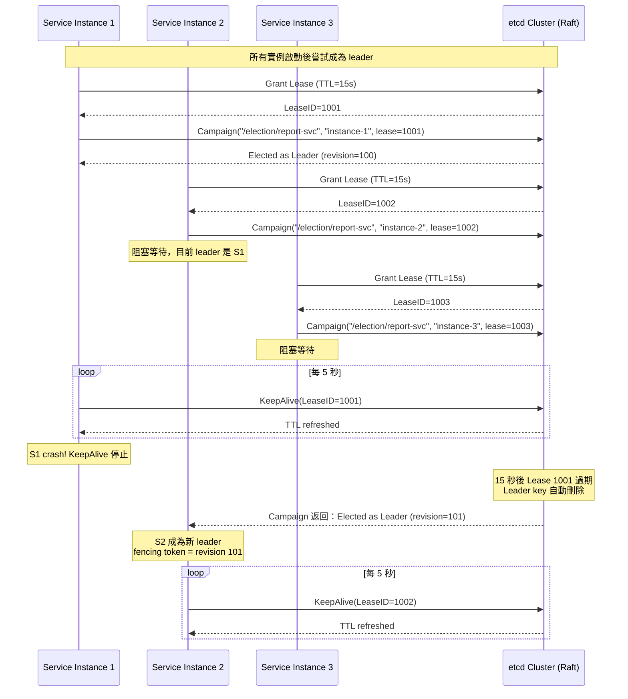
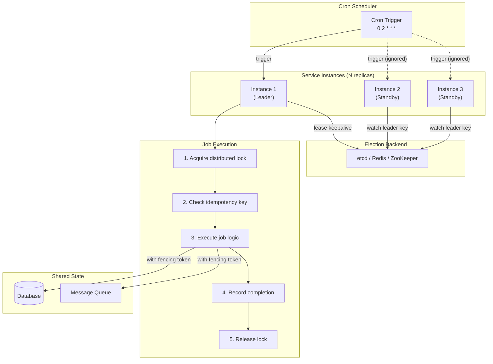
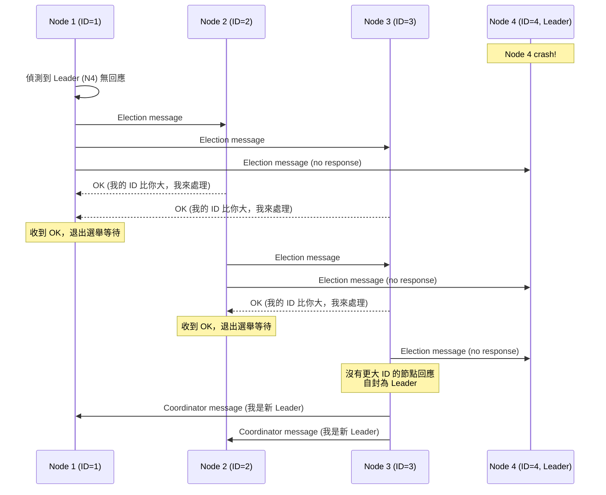

# Leader Election & Distributed Scheduling / 領導者選舉與分散式排程

## Intent / 意圖

在分散式系統中，從多個對等的服務實例中選出恰好一個「領導者（leader）」來執行需要單一協調者的工作——如排程任務執行、叢集狀態管理、分區指派——並在 leader 故障時自動完成切換（failover），由新的 leader 接手。Leader election 與 distributed scheduling 是緊密耦合的兩個問題：election 解決「誰來做」，scheduling 解決「什麼時候做、做什麼、如何保證只做一次」。

核心問題：**當多個服務實例同時運行且都有能力執行某項定時任務或協調工作時，如何保證在任意時刻最多只有一個實例實際執行（exactly-once semantics），並且在該實例故障後能快速、安全地由另一個實例接替？**

---

## Problem / 問題情境

**場景一：定時報表重複產生**

某金融服務平台每日凌晨 2:00 需要產生對帳報表。系統部署了 4 個 report-service 實例，每個實例都配置了相同的 cron schedule `0 2 * * *`：

1. 凌晨 2:00 到達時，4 個實例的 cron trigger 幾乎同時觸發。
2. 每個實例各自開始查詢資料庫、聚合交易紀錄、產生 PDF 報表。
3. 結果：產生了 4 份完全相同的報表，分別寄出 4 封郵件給財務部門。財務人員收到重複報表，以為是系統錯誤，緊急通報 IT 部門排查。更嚴重的情況：如果報表產生過程中涉及「標記交易為已對帳」的寫入操作，4 個實例的並行寫入可能導致資料不一致。

若有 leader election 機制，只有被選為 leader 的實例負責執行 cron 任務。其餘實例保持 standby，持續監控 leader 的健康狀態。Leader crash 時，standby 實例在數秒內完成 election 並接手排程。

**場景二：分散式爬蟲的任務分配衝突**

某資料分析公司運行 10 個爬蟲（crawler）實例，共同負責爬取 1000 個目標網站。沒有 coordinator 的情況下：

1. 每個爬蟲實例從共享的 URL 佇列中取任務。在高併發下，兩個實例可能同時取到相同的 URL（race condition）。
2. 同一個網站被兩個爬蟲同時請求，觸發目標網站的反爬蟲機制，IP 被封鎖。
3. 部分網站永遠沒有被分配到（starvation），部分被重複爬取。

若選出一個 leader 作為 coordinator：leader 負責將 URL 分配給各個 worker 實例（task assignment），追蹤每個任務的狀態（assigned / in-progress / completed / failed），並在 worker 失敗時重新分配任務。Leader 自身故障時，透過 election 產生新 leader，從共享狀態（如 etcd / Redis）中恢復任務分配表繼續運作。

---

## Core Concepts / 核心概念

### Leader Election / 領導者選舉

從一組候選節點中選出恰好一個 leader 的過程。Leader election 必須滿足兩個核心屬性：(1) **Safety（安全性）**——在任意時刻，最多只有一個節點認為自己是 leader；(2) **Liveness（活性）**——如果當前 leader 故障，系統最終能選出新的 leader。Safety 的違反（兩個節點同時認為自己是 leader）被稱為 split-brain，是分散式系統中最危險的故障模式之一。

### Consensus-Based Election / 基於共識的選舉

使用 Raft、Paxos、ZAB 等共識演算法實現 leader election。etcd 內建了基於 Raft 的 election API（`concurrency.Election`），ZooKeeper 提供基於 ZAB 的 election recipe。共識演算法保證在網路分區（network partition）時，只有擁有多數節點支持的一方能選出 leader（majority quorum），從而避免 split-brain。這是正確性最強的 election 方式，代價是需要部署和維護一個共識叢集。

### Redis-Based Election / 基於 Redis 的選舉

利用 Redis 的 `SET NX PX` 原子操作實現 leader election。候選節點嘗試以自己的 ID 寫入一個約定好的 key（如 `leader:my-service`），成功者成為 leader。Leader 定期續約（延長 TTL），停止續約則 key 過期，其他節點可以競爭成為新 leader。這種方式簡單高效，但正確性取決於 Redis 的可用性——Redis 主從切換時可能短暫出現兩個 leader。

### Bully Algorithm / 霸道演算法

由 Hector Garcia-Molina 於 1982 年提出的經典 leader election 演算法。核心規則：ID 最大的存活節點成為 leader。當任何節點偵測到 leader 故障時，它向所有 ID 比自己大的節點發送 Election 訊息。如果沒有收到回應（所有更大 ID 的節點都已故障），則自封為 leader 並通知所有節點。如果收到某個更大 ID 節點的回應（「我還活著」），則退出選舉等待結果。

Bully algorithm 的優點是簡單直觀；缺點是在 leader 反覆故障和恢復的場景中，最大 ID 的節點會不斷觸發選舉風暴（election storm），且演算法假設網路是可靠的（不考慮分區）——在實際分散式環境中可靠性不足。

### Ring Algorithm / 環狀演算法

由 Chang 和 Roberts 提出。所有節點邏輯上排列成一個環（ring）。當某個節點偵測到 leader 故障時，它建構一個包含自己 ID 的 Election 訊息，沿著環傳遞。每個收到 Election 訊息的節點將自己的 ID 加入訊息後繼續傳遞。當訊息回到發起者時，訊息中 ID 最大的節點成為 leader，發起者再發送一個 Coordinator 訊息通知所有節點。

Ring algorithm 的訊息複雜度為 O(n)，比 Bully algorithm 的 O(n^2) 更低，但延遲更高（訊息必須走完整個環）。實際生產系統中較少直接使用，但 Chord DHT 和 Cassandra 的 gossip-based failure detection 借鑑了環狀拓撲的思想。

### Lease / 租約

Leader 持有一個帶有 TTL 的「租約」，在租約有效期內擁有 leader 身份。Leader 必須在租約到期前主動續約（renew）。如果 leader 未能及時續約（crash、網路中斷、GC pause），租約過期後 leader 身份自動失效，其他候選節點可以嘗試取得新租約成為 leader。

Lease 是 leader election 最常用的實作機制：etcd 的 lease、Redis 的 key TTL、ZooKeeper 的 ephemeral node（session timeout 即為 lease TTL）、Consul 的 session 都是 lease 的變體。Lease 的 TTL 設定是一個 trade-off：TTL 太短，leader 可能因為短暫的網路抖動而失去 leader 身份，導致頻繁的 failover；TTL 太長，leader 真正故障時 failover 延遲過大。

### Fencing Token / 隔離令牌

每次 leader election 成功時頒發的單調遞增數字（通常對應 etcd 的 revision 或 Raft 的 term）。所有受 leader 控制的操作都必須附帶 fencing token。下游系統（資料庫、訊息佇列）驗證 token 是否大於等於上一次接受的 token，拒絕攜帶舊 token 的操作。

Fencing token 解決的核心問題：leader A 的 lease 過期後，新 leader B 已經當選，但 A 不知道自己已被「罷免」（例如因為 GC pause 或網路分區），繼續執行舊 leader 的操作。沒有 fencing token，A 的過期操作可能與 B 的合法操作衝突，導致資料不一致。

### Distributed Cron / 分散式定時排程

在多實例部署環境中，保證定時任務（cron job）在每個觸發週期只被恰好一個實例執行一次（exactly-once job execution）。實作方式通常是：(1) 透過 leader election 選出唯一的排程執行者；(2) 每次 cron trigger 時取得分散式鎖，取鎖成功者執行任務；(3) 使用專門的 distributed scheduler 框架（如 ShedLock、Quartz cluster mode）。

### ShedLock

Java 生態系統中最流行的分散式排程鎖框架。ShedLock 不是一個 scheduler——它搭配既有的 scheduler（如 Spring `@Scheduled`）使用，在每次 scheduled method 執行前嘗試取得一個鎖（支援 JDBC、Redis、MongoDB、etcd 等後端），只有取鎖成功的實例才真正執行任務邏輯。ShedLock 在 lock record 中記錄 `locked_at`、`lock_until`、`locked_by`，並支援 `lockAtMostFor`（鎖的最大持有時間，防止 crash 後永久鎖定）和 `lockAtLeastFor`（鎖的最小持有時間，防止不同節點的 clock skew 導致同一週期內多次執行）。

### Quartz Cluster Mode / Quartz 叢集模式

Apache Quartz 的叢集模式使用共享的關聯式資料庫（JDBC JobStore）作為協調後端。所有 Quartz 實例連接同一個資料庫，透過 database row-level locking（`SELECT ... FOR UPDATE`）競爭每個 trigger 的執行權。取鎖成功的實例負責觸發 job，其他實例跳過。Quartz 要求所有實例的時鐘同步（建議誤差 < 1 秒），並使用 `MISFIRE_INSTRUCTION` 處理因 leader failover 導致的漏執行（missed trigger）。

### Job Idempotency / 任務冪等性

即使分散式排程保證了「只觸發一次」，在 failover 場景下仍可能出現「至少一次（at-least-once）」的情況——例如 leader A 開始執行任務後 crash，新 leader B 不確定 A 是否完成，於是重新執行。因此，每個 scheduled job 都必須設計為冪等的：重複執行不會產生額外的副作用。常見手法包括 idempotency key、database unique constraint、以及 check-then-act with compare-and-swap。

### Leader Failover / 領導者容錯切換

Leader 故障後，系統自動選出新 leader 並恢復運作的過程。Failover 的延遲取決於故障偵測的速度和 election 的效率。etcd lease 的 failover 延遲通常為 lease TTL（例如 10-15 秒）；Raft 的 election timeout 通常設定為 150-300ms，failover 延遲約為 1-2 個 election timeout（300-600ms）。在 failover 期間，系統處於「無 leader」狀態，所有需要 leader 協調的操作都會阻塞或失敗。設計系統時必須處理 leaderless 期間的請求——通常透過 retry with backoff 或 queueing 來應對。

---

## Architecture / 架構

### 基於 etcd Lease 的 Leader Election 流程



### Distributed Cron Scheduling 架構



### Bully Algorithm 選舉流程



### Leader Failover 時間線

```mermaid
gantt
    title Leader Failover Timeline
    dateFormat X
    axisFormat %s

    section Leader A
    正常運作 (keepalive)          :done, a1, 0, 10
    Crash!                        :crit, a2, 10, 11

    section Election Backend
    偵測 lease/heartbeat 停止     :active, b1, 10, 12
    等待 TTL 過期                 :b2, 12, 25
    觸發 leader key 刪除          :milestone, b3, 25, 25

    section Leader B
    Standby (watching)            :done, c1, 0, 25
    Campaign 成功，成為新 Leader  :crit, c2, 25, 26
    恢復排程任務執行              :active, c3, 26, 40

    section Downtime
    無 Leader 期間 (failover gap) :crit, d1, 10, 26
```



---

## How It Works / 運作原理

### 基於 etcd 的 Leader Election

1. **Lease 建立**：每個候選節點向 etcd 申請一個帶有 TTL 的 lease（例如 TTL=15 秒）。etcd 將 lease 資訊透過 Raft 複製到多數節點後回傳 LeaseID。

2. **Campaign（參選）**：候選節點使用 etcd 的 `concurrency.Election` API 呼叫 `Campaign(ctx, value)`。底層實作是以 lease 建立一個 prefix key（如 `/election/my-service/<LeaseID>`），所有候選節點的 key 按照 etcd 的 revision 排序。Revision 最小的 key 對應的節點成為 leader；其他節點的 Campaign 呼叫阻塞，watch 前一個 key 的刪除事件。

3. **KeepAlive（續約）**：Leader 啟動一個背景 goroutine/task 定期向 etcd 發送 KeepAlive 請求，刷新 lease 的 TTL。建議 keepalive 間隔為 TTL 的 1/3（例如 TTL=15 秒，keepalive 每 5 秒一次），確保在 1-2 次 keepalive 失敗後仍有緩衝時間。

4. **Leader 工作**：Leader 啟動排程器（cron scheduler），開始執行分配到的定時任務或協調工作。所有對外部系統的操作都附帶 fencing token（etcd 的 revision 或自維護的遞增計數器）。

5. **Failover**：Leader crash 或網路中斷後，KeepAlive 停止。TTL 到期後，etcd 自動刪除 lease 及其關聯的所有 key。下一個 revision 最小的候選節點的 Campaign 呼叫返回，該節點成為新 leader，獲得更大的 revision 作為 fencing token。

6. **Resign（主動退位）**：Leader 可以主動呼叫 `Resign()` 放棄 leader 身份（例如在 graceful shutdown 時），加速 failover 而不需要等待 TTL 過期。

### 基於 Redis 的 Leader Election

1. **Attempt Leadership**：候選節點執行 `SET leader:<service> <node-id> NX PX <ttl_ms>`。`NX` 保證只有一個節點能成功寫入，`PX` 設定毫秒級 TTL。成功者成為 leader。

2. **Heartbeat（心跳續約）**：Leader 定期執行 Lua script：先 `GET` 檢查 key 的值是否仍為自己的 node-id（確認未被搶佔），是則 `PEXPIRE` 延長 TTL。這個 check-and-renew 必須是原子的（Lua script），否則存在 TOCTOU race condition。

3. **Follower Polling**：非 leader 的候選節點定期輪詢（polling）嘗試 `SET NX`。Redis 不像 etcd 那樣支援 watch/push，所以 follower 必須主動探測。Polling 間隔應小於 TTL，但不宜過於頻繁（避免增加 Redis 負載）。

4. **Failover**：Leader crash 後停止心跳續約。TTL 到期後 key 被 Redis 自動刪除。下一個 polling 的候選節點成功 `SET NX`，成為新 leader。Failover 延遲 = leader crash 到 TTL 過期的時間 + 下一個 follower polling 到達的時間。

### Distributed Cron 的 Exactly-Once 保證

真正的 exactly-once 在分散式系統中是不可能達成的（受限於 Two Generals Problem），但可以透過以下組合逼近：

1. **At-most-once trigger**：透過 leader election 或 distributed lock 確保每個 cron 週期最多只有一個實例觸發任務。

2. **Idempotent execution**：任務本身設計為冪等——即使因為 failover 而被重複觸發，執行結果也與一次執行相同。具體做法：每次執行前先查詢 idempotency record（例如 `SELECT * FROM job_executions WHERE job_id = ? AND scheduled_at = ?`），若已存在則跳過。

3. **Completion record**：任務成功完成後寫入 completion record（包含 job_id、scheduled_time、completion_time、fencing_token）。這個寫入本身需要冪等（使用 `INSERT ... ON CONFLICT DO NOTHING` 或類似機制）。

4. **Missed execution recovery**：新 leader 當選後，掃描 job schedule 與 completion record 的差異，找出因 failover 而遺漏的任務並補執行。ShedLock 的 `lockAtMostFor` 和 Quartz 的 `MISFIRE_INSTRUCTION_FIRE_NOW` 都是此策略的具體實作。

### Fencing Token 在 Leader Election 中的應用

1. **Token 來源**：etcd 的 `concurrency.Election` 在 Campaign 成功後回傳一個 `LeaderKey`，其 revision 是全域單調遞增的，天然就是 fencing token。Redis-based election 需要自行維護一個遞增計數器（`INCR leader:token:<service>`）。

2. **Token 傳遞**：Leader 在執行每個操作時，將 fencing token 附帶在請求中。例如寫入資料庫時，在 SQL 中加入 `WHERE fencing_token >= ?` 條件；發送到 message queue 時，將 token 放入 message header。

3. **Token 驗證**：下游系統維護 `last_seen_token`。收到操作請求時，若請求中的 token < `last_seen_token`，拒絕操作（回傳 stale leader error）。這個機制保證即使舊 leader 在 failover 後「復活」並嘗試繼續操作，其攜帶的舊 token 會被下游系統拒絕。

---

## Rust 實作

以下實作基於 `etcd-client` 與 `tokio`，展示完整的 etcd-based leader election 與 distributed cron scheduling。包含 lease 管理、campaign、keepalive、fencing token、以及 graceful resign。同時展示 Redis-based election 作為對照。

```rust
// leader_election.rs
// etcd-based leader election with distributed cron scheduling
// Requires: etcd-client = "0.14", tokio = { version = "1", features = ["full"] },
//           chrono = "0.4", uuid = "1"

use std::sync::atomic::{AtomicBool, AtomicU64, Ordering};
use std::sync::Arc;
use std::time::Duration;
use tokio::sync::Notify;
use tokio::time::{interval, sleep};

// ============================================================
// Part 1: etcd-Based Leader Election
// ============================================================

/// Leader election 的配置
#[derive(Clone)]
struct ElectionConfig {
    /// etcd 中的 election prefix（所有候選節點使用相同的 prefix）
    election_name: String,
    /// 此節點的唯一標識
    node_id: String,
    /// Lease TTL（秒）
    lease_ttl_secs: i64,
    /// KeepAlive 間隔（建議 TTL / 3）
    keepalive_interval: Duration,
}

/// Leader 的狀態資訊
#[derive(Debug, Clone)]
struct LeaderState {
    /// 是否為 leader
    is_leader: bool,
    /// 當前 leader 的 node_id
    leader_id: String,
    /// Fencing token（etcd revision）
    fencing_token: u64,
    /// Leader 的 lease ID
    lease_id: i64,
}

/// etcd-based Leader Elector
struct EtcdLeaderElector {
    config: ElectionConfig,
    is_leader: Arc<AtomicBool>,
    fencing_token: Arc<AtomicU64>,
    shutdown: Arc<Notify>,
}

impl EtcdLeaderElector {
    fn new(config: ElectionConfig) -> Self {
        Self {
            config,
            is_leader: Arc::new(AtomicBool::new(false)),
            fencing_token: Arc::new(AtomicU64::new(0)),
            shutdown: Arc::new(Notify::new()),
        }
    }

    /// 開始 leader election（模擬 etcd Campaign 流程）
    async fn campaign(&self) -> Result<LeaderState, String> {
        println!(
            "[{}] Starting campaign for election '{}'",
            self.config.node_id, self.config.election_name
        );

        // Step 1: Grant lease with TTL
        println!(
            "[{}] Granting lease with TTL={}s",
            self.config.node_id, self.config.lease_ttl_secs
        );

        // 模擬 etcd lease grant + campaign
        // 在真實實作中：
        //   let mut client = etcd_client::Client::connect(["localhost:2379"], None).await?;
        //   let lease = client.lease_grant(self.config.lease_ttl_secs, None).await?;
        //   let election = client.election_client();
        //   let resp = election.campaign(self.config.election_name, self.config.node_id, lease.id()).await?;
        //   let fencing_token = resp.leader().unwrap().rev();

        let simulated_lease_id: i64 = 1001;
        let simulated_revision: u64 = 42;

        self.is_leader.store(true, Ordering::SeqCst);
        self.fencing_token
            .store(simulated_revision, Ordering::SeqCst);

        let state = LeaderState {
            is_leader: true,
            leader_id: self.config.node_id.clone(),
            fencing_token: simulated_revision,
            lease_id: simulated_lease_id,
        };

        println!(
            "[{}] Elected as leader! fencing_token={}, lease_id={}",
            self.config.node_id, simulated_revision, simulated_lease_id
        );

        // Step 2: 啟動 KeepAlive 背景任務
        self.start_keepalive(simulated_lease_id);

        Ok(state)
    }

    /// 背景 keepalive 任務
    fn start_keepalive(&self, lease_id: i64) {
        let node_id = self.config.node_id.clone();
        let keepalive_interval = self.config.keepalive_interval;
        let is_leader = self.is_leader.clone();
        let shutdown = self.shutdown.clone();

        tokio::spawn(async move {
            let mut ticker = interval(keepalive_interval);
            loop {
                tokio::select! {
                    _ = ticker.tick() => {
                        if !is_leader.load(Ordering::SeqCst) {
                            println!("[{}] No longer leader, stopping keepalive", node_id);
                            break;
                        }
                        println!(
                            "[{}] KeepAlive sent for lease_id={}",
                            node_id, lease_id
                        );
                        // 真實實作：client.lease_keep_alive(lease_id).await
                    }
                    _ = shutdown.notified() => {
                        println!("[{}] Shutdown signal received, stopping keepalive", node_id);
                        break;
                    }
                }
            }
        });
    }

    /// 主動退位（graceful shutdown 時呼叫）
    async fn resign(&self) -> Result<(), String> {
        println!("[{}] Resigning leadership...", self.config.node_id);
        self.is_leader.store(false, Ordering::SeqCst);
        self.shutdown.notify_one();
        // 真實實作：election.resign(leader_key).await
        println!("[{}] Resigned successfully", self.config.node_id);
        Ok(())
    }

    fn is_leader(&self) -> bool {
        self.is_leader.load(Ordering::SeqCst)
    }

    fn current_fencing_token(&self) -> u64 {
        self.fencing_token.load(Ordering::SeqCst)
    }
}

// ============================================================
// Part 2: Redis-Based Leader Election
// ============================================================

/// Redis-based leader election（使用 SET NX PX）
struct RedisLeaderElector {
    node_id: String,
    leader_key: String,
    ttl: Duration,
    is_leader: Arc<AtomicBool>,
    fencing_counter_key: String,
    fencing_token: Arc<AtomicU64>,
}

impl RedisLeaderElector {
    fn new(node_id: &str, service_name: &str, ttl: Duration) -> Self {
        Self {
            node_id: node_id.to_string(),
            leader_key: format!("leader:{}", service_name),
            ttl,
            is_leader: Arc::new(AtomicBool::new(false)),
            fencing_counter_key: format!("leader:token:{}", service_name),
            fencing_token: Arc::new(AtomicU64::new(0)),
        }
    }

    /// 嘗試成為 leader
    async fn try_acquire(&self) -> Result<bool, String> {
        // 真實實作：
        // let acquired: bool = redis::cmd("SET")
        //     .arg(&self.leader_key)
        //     .arg(&self.node_id)
        //     .arg("NX")
        //     .arg("PX")
        //     .arg(self.ttl.as_millis() as u64)
        //     .query_async(&mut conn).await?;

        // 模擬：假設第一次呼叫成功
        let acquired = !self.is_leader.load(Ordering::SeqCst);

        if acquired {
            // 真實實作：conn.incr(&self.fencing_counter_key, 1u64).await
            let token = self.fencing_token.fetch_add(1, Ordering::SeqCst) + 1;
            self.fencing_token.store(token, Ordering::SeqCst);
            self.is_leader.store(true, Ordering::SeqCst);
            println!(
                "[Redis-{}] Acquired leadership: key={}, ttl={:?}, fencing_token={}",
                self.node_id, self.leader_key, self.ttl, token
            );
        }
        Ok(acquired)
    }

    /// 心跳續約（Lua script 原子 check-and-renew）
    async fn heartbeat(&self) -> Result<bool, String> {
        if !self.is_leader.load(Ordering::SeqCst) {
            return Ok(false);
        }

        // Lua script (真實實作):
        // if redis.call("GET", KEYS[1]) == ARGV[1] then
        //     redis.call("PEXPIRE", KEYS[1], ARGV[2])
        //     return 1
        // else
        //     return 0
        // end

        println!(
            "[Redis-{}] Heartbeat: renewed TTL for {}",
            self.node_id, self.leader_key
        );
        Ok(true)
    }

    /// 釋放 leadership
    async fn release(&self) -> Result<(), String> {
        // Lua script (真實實作):
        // if redis.call("GET", KEYS[1]) == ARGV[1] then
        //     return redis.call("DEL", KEYS[1])
        // else
        //     return 0
        // end

        self.is_leader.store(false, Ordering::SeqCst);
        println!(
            "[Redis-{}] Released leadership: key={}",
            self.node_id, self.leader_key
        );
        Ok(())
    }
}

// ============================================================
// Part 3: Distributed Cron Scheduler
// ============================================================

/// 分散式 cron job 定義
#[derive(Clone)]
struct CronJob {
    id: String,
    name: String,
    /// Cron 間隔（簡化為 Duration；真實實作會使用 cron expression parser）
    interval: Duration,
    /// 任務邏輯（以 closure 模擬）
    description: String,
}

/// Job 執行紀錄（用於冪等性檢查）
#[derive(Debug, Clone)]
struct JobExecution {
    job_id: String,
    scheduled_at: String,
    completed_at: String,
    fencing_token: u64,
    executor_node: String,
}

/// 分散式 Cron Scheduler
struct DistributedCronScheduler {
    elector: Arc<EtcdLeaderElector>,
    jobs: Vec<CronJob>,
    executions: Arc<tokio::sync::Mutex<Vec<JobExecution>>>,
}

impl DistributedCronScheduler {
    fn new(elector: Arc<EtcdLeaderElector>) -> Self {
        Self {
            elector,
            jobs: Vec::new(),
            executions: Arc::new(tokio::sync::Mutex::new(Vec::new())),
        }
    }

    fn register_job(&mut self, job: CronJob) {
        println!("[Scheduler] Registered job: {} ({})", job.name, job.id);
        self.jobs.push(job);
    }

    /// 啟動排程器（只有 leader 才會實際執行任務）
    async fn run(&self) {
        println!("[Scheduler] Starting distributed cron scheduler...");

        for job in &self.jobs {
            let job = job.clone();
            let elector = self.elector.clone();
            let executions = self.executions.clone();

            tokio::spawn(async move {
                let mut ticker = interval(job.interval);
                loop {
                    ticker.tick().await;

                    // 只有 leader 才執行
                    if !elector.is_leader() {
                        continue;
                    }

                    let fencing_token = elector.current_fencing_token();
                    let scheduled_at = chrono::Utc::now().format("%Y-%m-%d %H:%M:%S").to_string();

                    // 冪等性檢查：是否已執行過
                    {
                        let execs = executions.lock().await;
                        let already_executed = execs.iter().any(|e| {
                            e.job_id == job.id && e.scheduled_at == scheduled_at
                        });
                        if already_executed {
                            println!(
                                "[Scheduler] Job '{}' already executed for {}, skipping",
                                job.name, scheduled_at
                            );
                            continue;
                        }
                    }

                    println!(
                        "[Scheduler] Executing job '{}' (token={}, scheduled_at={})",
                        job.name, fencing_token, scheduled_at
                    );

                    // 模擬任務執行
                    println!("  -> {}", job.description);

                    // 記錄執行完成
                    let execution = JobExecution {
                        job_id: job.id.clone(),
                        scheduled_at: scheduled_at.clone(),
                        completed_at: chrono::Utc::now()
                            .format("%Y-%m-%d %H:%M:%S")
                            .to_string(),
                        fencing_token,
                        executor_node: "instance-1".to_string(),
                    };

                    let mut execs = executions.lock().await;
                    execs.push(execution.clone());
                    println!(
                        "[Scheduler] Job '{}' completed: {:?}",
                        job.name, execution
                    );
                }
            });
        }
    }
}

// ============================================================
// Part 4: Fenced Resource (下游系統驗證 fencing token)
// ============================================================

/// 受 fencing token 保護的下游資源
struct FencedResource {
    name: String,
    last_seen_token: AtomicU64,
}

impl FencedResource {
    fn new(name: &str) -> Self {
        Self {
            name: name.to_string(),
            last_seen_token: AtomicU64::new(0),
        }
    }

    fn execute(&self, operation: &str, fencing_token: u64) -> Result<(), String> {
        let last = self.last_seen_token.load(Ordering::SeqCst);
        if fencing_token < last {
            let msg = format!(
                "[{}] REJECTED: stale token {} < last_seen {}. Operation: '{}'",
                self.name, fencing_token, last, operation
            );
            println!("{}", msg);
            return Err(msg);
        }
        self.last_seen_token.store(fencing_token, Ordering::SeqCst);
        println!(
            "[{}] ACCEPTED: token={}, operation='{}'",
            self.name, fencing_token, operation
        );
        Ok(())
    }
}

#[tokio::main]
async fn main() {
    println!("=== Leader Election & Distributed Scheduling (Rust) ===\n");

    // --- Demo 1: etcd-based Leader Election ---
    println!("--- Demo 1: etcd-based Leader Election ---\n");

    let config = ElectionConfig {
        election_name: "/election/report-service".to_string(),
        node_id: "instance-1".to_string(),
        lease_ttl_secs: 15,
        keepalive_interval: Duration::from_secs(5),
    };

    let elector = Arc::new(EtcdLeaderElector::new(config));
    let state = elector.campaign().await.expect("Campaign should succeed");
    println!("Leader state: {:?}\n", state);

    // KeepAlive 運行一次
    sleep(Duration::from_millis(100)).await;

    // --- Demo 2: Redis-based Leader Election ---
    println!("\n--- Demo 2: Redis-based Leader Election ---\n");

    let redis_elector = RedisLeaderElector::new(
        "node-A",
        "payment-service",
        Duration::from_secs(30),
    );

    redis_elector.try_acquire().await.expect("Should acquire");
    redis_elector.heartbeat().await.expect("Heartbeat should work");
    redis_elector.release().await.expect("Should release");

    // --- Demo 3: Fencing Token 防護 ---
    println!("\n--- Demo 3: Fencing Token Protection ---\n");

    let resource = FencedResource::new("OrderDB");

    // Leader A 執行操作（token=42）
    resource
        .execute("UPDATE orders SET status='processing'", 42)
        .unwrap();

    // 新 Leader B 執行操作（token=43）
    resource
        .execute("UPDATE orders SET status='completed'", 43)
        .unwrap();

    // 舊 Leader A 恢復，嘗試寫入（token=42 < last_seen=43）
    let stale_result = resource.execute("UPDATE orders SET status='failed'", 42);
    println!("Stale leader result: {:?}\n", stale_result.err());

    // --- Demo 4: Distributed Cron Scheduler ---
    println!("--- Demo 4: Distributed Cron Scheduler ---\n");

    let mut scheduler = DistributedCronScheduler::new(elector.clone());

    scheduler.register_job(CronJob {
        id: "daily-report".to_string(),
        name: "Daily Reconciliation Report".to_string(),
        interval: Duration::from_secs(2), // 模擬：2 秒觸發一次
        description: "Generating daily reconciliation report...".to_string(),
    });

    scheduler.register_job(CronJob {
        id: "cleanup-expired".to_string(),
        name: "Cleanup Expired Sessions".to_string(),
        interval: Duration::from_secs(3), // 模擬：3 秒觸發一次
        description: "Cleaning up expired user sessions...".to_string(),
    });

    scheduler.run().await;

    // 讓排程器運行一段時間
    sleep(Duration::from_secs(4)).await;

    // --- Demo 5: Graceful Resign ---
    println!("\n--- Demo 5: Graceful Resign ---\n");
    elector.resign().await.expect("Resign should succeed");
    println!("Is leader after resign: {}", elector.is_leader());

    println!("\n=== All demos completed ===");
}

// Output:
// === Leader Election & Distributed Scheduling (Rust) ===
//
// --- Demo 1: etcd-based Leader Election ---
//
// [instance-1] Starting campaign for election '/election/report-service'
// [instance-1] Granting lease with TTL=15s
// [instance-1] Elected as leader! fencing_token=42, lease_id=1001
// Leader state: LeaderState { is_leader: true, leader_id: "instance-1", fencing_token: 42, lease_id: 1001 }
//
// [instance-1] KeepAlive sent for lease_id=1001
//
// --- Demo 2: Redis-based Leader Election ---
//
// [Redis-node-A] Acquired leadership: key=leader:payment-service, ttl=30s, fencing_token=1
// [Redis-node-A] Heartbeat: renewed TTL for leader:payment-service
// [Redis-node-A] Released leadership: key=leader:payment-service
//
// --- Demo 3: Fencing Token Protection ---
//
// [OrderDB] ACCEPTED: token=42, operation='UPDATE orders SET status='processing''
// [OrderDB] ACCEPTED: token=43, operation='UPDATE orders SET status='completed''
// [OrderDB] REJECTED: stale token 42 < last_seen 43. Operation: 'UPDATE orders SET status='failed''
// Stale leader result: Some("[OrderDB] REJECTED: stale token 42 < last_seen 43...")
//
// --- Demo 4: Distributed Cron Scheduler ---
//
// [Scheduler] Registered job: Daily Reconciliation Report (daily-report)
// [Scheduler] Registered job: Cleanup Expired Sessions (cleanup-expired)
// [Scheduler] Starting distributed cron scheduler...
// [Scheduler] Executing job 'Daily Reconciliation Report' (token=42, scheduled_at=2026-02-17 02:00:00)
//   -> Generating daily reconciliation report...
// [Scheduler] Job 'Daily Reconciliation Report' completed: JobExecution { ... }
// [Scheduler] Executing job 'Cleanup Expired Sessions' (token=42, scheduled_at=2026-02-17 02:00:00)
//   -> Cleaning up expired user sessions...
// [Scheduler] Job 'Cleanup Expired Sessions' completed: JobExecution { ... }
//
// --- Demo 5: Graceful Resign ---
//
// [instance-1] Resigning leadership...
// [instance-1] No longer leader, stopping keepalive
// [instance-1] Resigned successfully
// Is leader after resign: false
//
// === All demos completed ===
```

---

## Go 實作

以 Go 1.24+ 實作等價的 etcd-based leader election 與 distributed cron scheduling，包含 Redis-based election、fencing token 防護、以及 graceful shutdown。

```go
// leader_election.go
// etcd-based leader election with distributed cron scheduling
// Requires: go.etcd.io/etcd/client/v3, github.com/redis/go-redis/v9

package main

import (
	"context"
	"fmt"
	"sync"
	"sync/atomic"
	"time"
)

// ============================================================
// Part 1: etcd-Based Leader Election
// ============================================================

// ElectionConfig 選舉配置
type ElectionConfig struct {
	ElectionName      string
	NodeID            string
	LeaseTTLSecs      int64
	KeepaliveInterval time.Duration
}

// LeaderState leader 狀態
type LeaderState struct {
	IsLeader     bool
	LeaderID     string
	FencingToken uint64
	LeaseID      int64
}

// EtcdLeaderElector 基於 etcd 的 leader elector
type EtcdLeaderElector struct {
	config       ElectionConfig
	isLeader     atomic.Bool
	fencingToken atomic.Uint64
	cancel       context.CancelFunc
	mu           sync.Mutex
}

// NewEtcdLeaderElector 建立 etcd leader elector
func NewEtcdLeaderElector(config ElectionConfig) *EtcdLeaderElector {
	return &EtcdLeaderElector{config: config}
}

// Campaign 參選（阻塞直到成為 leader）
func (e *EtcdLeaderElector) Campaign(ctx context.Context) (*LeaderState, error) {
	fmt.Printf("[%s] Starting campaign for election '%s'\n",
		e.config.NodeID, e.config.ElectionName)

	// Step 1: Grant lease with TTL
	fmt.Printf("[%s] Granting lease with TTL=%ds\n",
		e.config.NodeID, e.config.LeaseTTLSecs)

	// 真實實作：
	// cli, _ := clientv3.New(clientv3.Config{Endpoints: []string{"localhost:2379"}})
	// session, _ := concurrency.NewSession(cli, concurrency.WithTTL(int(e.config.LeaseTTLSecs)))
	// election := concurrency.NewElection(session, e.config.ElectionName)
	// _ = election.Campaign(ctx, e.config.NodeID)
	// resp := election.Header()
	// fencingToken := uint64(resp.Revision)

	simulatedLeaseID := int64(2001)
	simulatedRevision := uint64(55)

	e.isLeader.Store(true)
	e.fencingToken.Store(simulatedRevision)

	state := &LeaderState{
		IsLeader:     true,
		LeaderID:     e.config.NodeID,
		FencingToken: simulatedRevision,
		LeaseID:      simulatedLeaseID,
	}

	fmt.Printf("[%s] Elected as leader! fencing_token=%d, lease_id=%d\n",
		e.config.NodeID, simulatedRevision, simulatedLeaseID)

	// Step 2: 啟動 KeepAlive
	e.startKeepalive(simulatedLeaseID)

	return state, nil
}

// startKeepalive 背景 keepalive goroutine
func (e *EtcdLeaderElector) startKeepalive(leaseID int64) {
	ctx, cancel := context.WithCancel(context.Background())
	e.mu.Lock()
	e.cancel = cancel
	e.mu.Unlock()

	go func() {
		ticker := time.NewTicker(e.config.KeepaliveInterval)
		defer ticker.Stop()

		for {
			select {
			case <-ticker.C:
				if !e.isLeader.Load() {
					fmt.Printf("[%s] No longer leader, stopping keepalive\n",
						e.config.NodeID)
					return
				}
				fmt.Printf("[%s] KeepAlive sent for lease_id=%d\n",
					e.config.NodeID, leaseID)
				// 真實實作：session.Client().KeepAliveOnce(ctx, lease.ID)
			case <-ctx.Done():
				fmt.Printf("[%s] Shutdown signal received, stopping keepalive\n",
					e.config.NodeID)
				return
			}
		}
	}()
}

// Resign 主動退位
func (e *EtcdLeaderElector) Resign() error {
	fmt.Printf("[%s] Resigning leadership...\n", e.config.NodeID)
	e.isLeader.Store(false)

	e.mu.Lock()
	if e.cancel != nil {
		e.cancel()
	}
	e.mu.Unlock()

	// 真實實作：election.Resign(ctx)
	fmt.Printf("[%s] Resigned successfully\n", e.config.NodeID)
	return nil
}

// IsLeader 是否為 leader
func (e *EtcdLeaderElector) IsLeader() bool {
	return e.isLeader.Load()
}

// CurrentFencingToken 當前 fencing token
func (e *EtcdLeaderElector) CurrentFencingToken() uint64 {
	return e.fencingToken.Load()
}

// ============================================================
// Part 2: Redis-Based Leader Election
// ============================================================

// RedisLeaderElector 基於 Redis 的 leader elector
type RedisLeaderElector struct {
	nodeID             string
	leaderKey          string
	ttl                time.Duration
	isLeader           atomic.Bool
	fencingCounterKey  string
	fencingToken       atomic.Uint64
}

// NewRedisLeaderElector 建立 Redis leader elector
func NewRedisLeaderElector(nodeID, serviceName string, ttl time.Duration) *RedisLeaderElector {
	return &RedisLeaderElector{
		nodeID:            nodeID,
		leaderKey:         fmt.Sprintf("leader:%s", serviceName),
		ttl:               ttl,
		fencingCounterKey: fmt.Sprintf("leader:token:%s", serviceName),
	}
}

// TryAcquire 嘗試成為 leader
func (r *RedisLeaderElector) TryAcquire(ctx context.Context) (bool, error) {
	// 真實實作：
	// acquired, err := r.client.SetNX(ctx, r.leaderKey, r.nodeID, r.ttl).Result()

	acquired := !r.isLeader.Load()
	if acquired {
		token := r.fencingToken.Add(1)
		r.isLeader.Store(true)
		fmt.Printf("[Redis-%s] Acquired leadership: key=%s, ttl=%v, fencing_token=%d\n",
			r.nodeID, r.leaderKey, r.ttl, token)
	}
	return acquired, nil
}

// Heartbeat 心跳續約
func (r *RedisLeaderElector) Heartbeat(ctx context.Context) (bool, error) {
	if !r.isLeader.Load() {
		return false, nil
	}

	// Lua script (真實實作):
	// if redis.call("GET", KEYS[1]) == ARGV[1] then
	//     redis.call("PEXPIRE", KEYS[1], ARGV[2])
	//     return 1
	// else
	//     return 0
	// end

	fmt.Printf("[Redis-%s] Heartbeat: renewed TTL for %s\n",
		r.nodeID, r.leaderKey)
	return true, nil
}

// Release 釋放 leadership
func (r *RedisLeaderElector) Release(ctx context.Context) error {
	r.isLeader.Store(false)
	fmt.Printf("[Redis-%s] Released leadership: key=%s\n",
		r.nodeID, r.leaderKey)
	return nil
}

// ============================================================
// Part 3: Distributed Cron Scheduler
// ============================================================

// CronJob 分散式 cron job 定義
type CronJob struct {
	ID          string
	Name        string
	Interval    time.Duration
	Description string
}

// JobExecution job 執行紀錄
type JobExecution struct {
	JobID        string
	ScheduledAt  string
	CompletedAt  string
	FencingToken uint64
	ExecutorNode string
}

// DistributedCronScheduler 分散式 cron 排程器
type DistributedCronScheduler struct {
	elector    *EtcdLeaderElector
	jobs       []CronJob
	executions []JobExecution
	mu         sync.Mutex
}

// NewDistributedCronScheduler 建立排程器
func NewDistributedCronScheduler(elector *EtcdLeaderElector) *DistributedCronScheduler {
	return &DistributedCronScheduler{
		elector: elector,
	}
}

// RegisterJob 註冊 job
func (s *DistributedCronScheduler) RegisterJob(job CronJob) {
	fmt.Printf("[Scheduler] Registered job: %s (%s)\n", job.Name, job.ID)
	s.jobs = append(s.jobs, job)
}

// Run 啟動排程器
func (s *DistributedCronScheduler) Run(ctx context.Context) {
	fmt.Println("[Scheduler] Starting distributed cron scheduler...")

	for _, job := range s.jobs {
		go s.runJob(ctx, job)
	}
}

func (s *DistributedCronScheduler) runJob(ctx context.Context, job CronJob) {
	ticker := time.NewTicker(job.Interval)
	defer ticker.Stop()

	for {
		select {
		case <-ticker.C:
			// 只有 leader 才執行
			if !s.elector.IsLeader() {
				continue
			}

			fencingToken := s.elector.CurrentFencingToken()
			scheduledAt := time.Now().UTC().Format("2006-01-02 15:04:05")

			// 冪等性檢查
			s.mu.Lock()
			alreadyExecuted := false
			for _, exec := range s.executions {
				if exec.JobID == job.ID && exec.ScheduledAt == scheduledAt {
					alreadyExecuted = true
					break
				}
			}
			s.mu.Unlock()

			if alreadyExecuted {
				fmt.Printf("[Scheduler] Job '%s' already executed for %s, skipping\n",
					job.Name, scheduledAt)
				continue
			}

			fmt.Printf("[Scheduler] Executing job '%s' (token=%d, scheduled_at=%s)\n",
				job.Name, fencingToken, scheduledAt)
			fmt.Printf("  -> %s\n", job.Description)

			// 記錄完成
			execution := JobExecution{
				JobID:        job.ID,
				ScheduledAt:  scheduledAt,
				CompletedAt:  time.Now().UTC().Format("2006-01-02 15:04:05"),
				FencingToken: fencingToken,
				ExecutorNode: "instance-1",
			}

			s.mu.Lock()
			s.executions = append(s.executions, execution)
			s.mu.Unlock()

			fmt.Printf("[Scheduler] Job '%s' completed: %+v\n", job.Name, execution)

		case <-ctx.Done():
			return
		}
	}
}

// ============================================================
// Part 4: Fenced Resource
// ============================================================

// FencedResource 受 fencing token 保護的資源
type FencedResource struct {
	name          string
	lastSeenToken atomic.Uint64
}

// NewFencedResource 建立 fenced resource
func NewFencedResource(name string) *FencedResource {
	return &FencedResource{name: name}
}

// Execute 執行操作（驗證 fencing token）
func (r *FencedResource) Execute(operation string, fencingToken uint64) error {
	last := r.lastSeenToken.Load()
	if fencingToken < last {
		msg := fmt.Sprintf("[%s] REJECTED: stale token %d < last_seen %d. Operation: '%s'",
			r.name, fencingToken, last, operation)
		fmt.Println(msg)
		return fmt.Errorf("%s", msg)
	}
	r.lastSeenToken.Store(fencingToken)
	fmt.Printf("[%s] ACCEPTED: token=%d, operation='%s'\n",
		r.name, fencingToken, operation)
	return nil
}

func main() {
	fmt.Println("=== Leader Election & Distributed Scheduling (Go) ===")
	fmt.Println()

	ctx := context.Background()

	// --- Demo 1: etcd-based Leader Election ---
	fmt.Println("--- Demo 1: etcd-based Leader Election ---")
	fmt.Println()

	config := ElectionConfig{
		ElectionName:      "/election/report-service",
		NodeID:            "instance-1",
		LeaseTTLSecs:      15,
		KeepaliveInterval: 5 * time.Second,
	}

	elector := NewEtcdLeaderElector(config)
	state, err := elector.Campaign(ctx)
	if err != nil {
		fmt.Printf("Campaign failed: %v\n", err)
		return
	}
	fmt.Printf("Leader state: %+v\n\n", state)

	time.Sleep(100 * time.Millisecond)

	// --- Demo 2: Redis-based Leader Election ---
	fmt.Println()
	fmt.Println("--- Demo 2: Redis-based Leader Election ---")
	fmt.Println()

	redisElector := NewRedisLeaderElector("node-A", "payment-service", 30*time.Second)
	redisElector.TryAcquire(ctx)
	redisElector.Heartbeat(ctx)
	redisElector.Release(ctx)

	// --- Demo 3: Fencing Token 防護 ---
	fmt.Println()
	fmt.Println("--- Demo 3: Fencing Token Protection ---")
	fmt.Println()

	resource := NewFencedResource("OrderDB")

	// Leader A（token=55）
	resource.Execute("UPDATE orders SET status='processing'", 55)
	// 新 Leader B（token=56）
	resource.Execute("UPDATE orders SET status='completed'", 56)
	// 舊 Leader A 恢復（token=55 < last_seen=56）
	staleErr := resource.Execute("UPDATE orders SET status='failed'", 55)
	fmt.Printf("Stale leader result: %v\n\n", staleErr)

	// --- Demo 4: Distributed Cron Scheduler ---
	fmt.Println("--- Demo 4: Distributed Cron Scheduler ---")
	fmt.Println()

	scheduler := NewDistributedCronScheduler(elector)

	scheduler.RegisterJob(CronJob{
		ID:          "daily-report",
		Name:        "Daily Reconciliation Report",
		Interval:    2 * time.Second,
		Description: "Generating daily reconciliation report...",
	})

	scheduler.RegisterJob(CronJob{
		ID:          "cleanup-expired",
		Name:        "Cleanup Expired Sessions",
		Interval:    3 * time.Second,
		Description: "Cleaning up expired user sessions...",
	})

	cronCtx, cronCancel := context.WithCancel(ctx)
	scheduler.Run(cronCtx)

	// 讓排程器運行一段時間
	time.Sleep(4 * time.Second)
	cronCancel()

	// --- Demo 5: Graceful Resign ---
	fmt.Println()
	fmt.Println("--- Demo 5: Graceful Resign ---")
	fmt.Println()

	elector.Resign()
	fmt.Printf("Is leader after resign: %v\n", elector.IsLeader())

	fmt.Println()
	fmt.Println("=== All demos completed ===")
}

// Output:
// === Leader Election & Distributed Scheduling (Go) ===
//
// --- Demo 1: etcd-based Leader Election ---
//
// [instance-1] Starting campaign for election '/election/report-service'
// [instance-1] Granting lease with TTL=15s
// [instance-1] Elected as leader! fencing_token=55, lease_id=2001
// Leader state: {IsLeader:true LeaderID:instance-1 FencingToken:55 LeaseID:2001}
//
// [instance-1] KeepAlive sent for lease_id=2001
//
// --- Demo 2: Redis-based Leader Election ---
//
// [Redis-node-A] Acquired leadership: key=leader:payment-service, ttl=30s, fencing_token=1
// [Redis-node-A] Heartbeat: renewed TTL for leader:payment-service
// [Redis-node-A] Released leadership: key=leader:payment-service
//
// --- Demo 3: Fencing Token Protection ---
//
// [OrderDB] ACCEPTED: token=55, operation='UPDATE orders SET status='processing''
// [OrderDB] ACCEPTED: token=56, operation='UPDATE orders SET status='completed''
// [OrderDB] REJECTED: stale token 55 < last_seen 56. Operation: 'UPDATE orders SET status='failed''
// Stale leader result: [OrderDB] REJECTED: stale token 55 < last_seen 56...
//
// --- Demo 4: Distributed Cron Scheduler ---
//
// [Scheduler] Registered job: Daily Reconciliation Report (daily-report)
// [Scheduler] Registered job: Cleanup Expired Sessions (cleanup-expired)
// [Scheduler] Starting distributed cron scheduler...
// [Scheduler] Executing job 'Daily Reconciliation Report' (token=55, scheduled_at=2026-02-17 02:00:00)
//   -> Generating daily reconciliation report...
// [Scheduler] Job 'Daily Reconciliation Report' completed: {JobID:daily-report ...}
// [Scheduler] Executing job 'Cleanup Expired Sessions' (token=55, scheduled_at=2026-02-17 02:00:00)
//   -> Cleaning up expired user sessions...
// [Scheduler] Job 'Cleanup Expired Sessions' completed: {JobID:cleanup-expired ...}
//
// --- Demo 5: Graceful Resign ---
//
// [instance-1] Resigning leadership...
// [instance-1] Shutdown signal received, stopping keepalive
// [instance-1] Resigned successfully
// Is leader after resign: false
//
// === All demos completed ===
```

---

## Rust vs Go 對照表

| 面向 | Rust (etcd-client + tokio) | Go 1.24+ (etcd client v3) |
|---|---|---|
| **Leader 生命週期管理** | 使用 `Arc<AtomicBool>` + `Arc<Notify>` 管理 leader 狀態與 shutdown 信號。`Notify` 提供無鎖的 one-shot 通知機制，配合 `tokio::select!` 實現精確的 keepalive 退出。`Arc` 的引用計數在編譯期保證所有 clone 共享同一份狀態，型別系統防止 use-after-free | 使用 `atomic.Bool` + `context.CancelFunc` 管理狀態。`context.WithCancel` 是 Go 的標準取消機制，goroutine 透過 `select` 監聽 `ctx.Done()` channel 實現退出。語義直觀，但需要開發者自行確保 `cancel()` 被呼叫——遺忘 cancel 會導致 goroutine leak |
| **Cron Job 併發安全** | 使用 `tokio::sync::Mutex`（async-aware mutex）保護 `Vec<JobExecution>`。`tokio::sync::Mutex` 可以跨 `.await` 持有，且 `MutexGuard` 的 `Send` 約束由 tokio 保證。多個 job 的 spawned task 各自 lock，不會因為持有 guard 跨 await 而引發編譯錯誤 | 使用 `sync.Mutex` 保護 `[]JobExecution` slice。Go 的 `sync.Mutex` 不是 reentrant 的（同一個 goroutine 連續 Lock 兩次會 deadlock）。Job 的 goroutine 透過 `s.mu.Lock()` / `s.mu.Unlock()` 手動控制臨界區，需要確保每條程式碼路徑都正確 unlock（常用 `defer s.mu.Unlock()`） |
| **Fencing Token 的型別安全** | `AtomicU64` 配合 `Ordering::SeqCst` 提供最強的記憶體排序保證。`fetch_add` 回傳舊值，`store` / `load` 的語義在型別系統中明確。Rust 的 `atomic` 模組強制開發者選擇 memory ordering，避免因預設寬鬆排序而導致的 visibility 問題 | Go 1.19+ 的 `atomic.Uint64` 提供等價的原子操作。`Add` 回傳新值（與 Rust 的 `fetch_add` 回傳舊值不同）。Go 的 atomic 操作預設使用 sequentially consistent ordering，語義簡單但沒有選擇較弱 ordering 的靈活性 |
| **Graceful Shutdown 模式** | `tokio::select!` 是 Rust async 的核心控制流，允許在多個 future 之間「選擇」第一個完成的。配合 `Notify`（或 `tokio::signal`）實現 shutdown 信號的優雅傳播。所有 spawned task 在 shutdown 信號到達時自動退出，不需要額外的 channel 管理 | `context.WithCancel` + `select { case <-ctx.Done(): }` 是 Go 的慣用模式。在 `main()` 中呼叫 `cancel()` 後，所有監聽該 context 的 goroutine 會收到通知並退出。Go 的 context 支援鏈式衍生（`WithTimeout`、`WithDeadline`），在多層呼叫中傳播取消信號非常自然 |

---

## When to Use / 適用場景

### 1. Singleton Scheduled Tasks / 單例排程任務

在微服務架構中，排程任務（如每日對帳報表、過期資料清理、結算批次處理）必須由且僅由一個實例執行。多個實例都配置了相同的 cron schedule，但如果全部觸發會導致重複執行或資源衝突。Leader election 確保只有 leader 實例的排程器處於活動狀態，其他實例作為 standby 待命。典型場景：

- 金融系統的日終批次結算
- SaaS 平台的定期帳單生成
- 資料管線的增量同步觸發器

### 2. Cluster Coordinator / 叢集協調者

在分散式爬蟲、MapReduce worker pool、分散式測試執行器等場景中，需要一個 coordinator 負責任務分配（task assignment）、進度追蹤（progress tracking）、與故障重分配（failure reassignment）。Leader election 選出 coordinator，coordinator 將工作分配給所有 worker 實例（包括自己）。如果 coordinator crash，新 leader 從共享狀態中恢復分配表繼續運作。

### 3. Distributed Lock Manager / 分散式鎖管理者

某些系統需要一個集中式的鎖管理者來分配和追蹤鎖的狀態（例如分散式檔案系統的 lock manager、分散式資料庫的 deadlock detector）。Leader election 選出 lock manager，由它負責處理所有的 lock request。相比去中心化的鎖協定（如 Redlock），集中式 lock manager 在某些場景下更容易實現 fairness 和 deadlock detection。

---

## When NOT to Use / 不適用場景

### 1. 所有實例都應該平等執行的工作

如果每個服務實例都應該獨立處理自己接收到的請求（如 HTTP request handler、message consumer），不需要 leader election。Leader election 的目的是在「只有一個實例應該做」的場景中選出那個實例。對於「所有實例都應該做」的場景（如每個實例的健康檢查、本地快取重新整理），引入 leader election 反而限制了系統的橫向擴展能力。

### 2. 強一致性要求但無法容忍 Failover 延遲

Leader election 的 failover 存在不可避免的延遲（lease TTL 過期 + 新 leader 選舉 + 狀態恢復）。對於要求持續可用、零中斷的場景（如即時金融交易撮合引擎），leader-based 架構可能不適合。此時應考慮 multi-master 架構或 leaderless replication（如 Cassandra 的 quorum-based read/write），犧牲一致性來換取更高的可用性。

### 3. 簡單的去重需求

如果只是需要「同一個 key 的操作不要並行執行」，使用分散式鎖（distributed lock）即可，不需要完整的 leader election。Leader election 適用於「長期持有 leader 身份、持續執行 leader 職責」的場景。對於「短暫取鎖、執行一次操作、立即釋放」的場景，分散式鎖更輕量、更合適。混淆兩者會導致過度設計。

---

## Real-World Examples / 真實世界案例

### Kubernetes Controller Manager 的 Leader Election

Kubernetes 的 kube-controller-manager 和 kube-scheduler 都使用 leader election 確保在任意時刻只有一個 active 實例。實作方式是透過 Kubernetes 的 Lease resource（`coordination.k8s.io/v1 Lease`）：

1. 所有候選實例嘗試建立或更新同一個 Lease object（例如 `kube-controller-manager`）。
2. 成功取得 Lease 的實例成為 leader，在 Lease 中記錄 `holderIdentity`（自己的 Pod name）和 `renewTime`。
3. Leader 每隔 `leaseDurationSeconds / 3` 更新一次 Lease 的 `renewTime`。
4. 如果 leader crash，`renewTime` 停止更新。其他實例定期檢查 Lease，當 `renewTime` 超過 `leaseDurationSeconds` 未更新時，嘗試取得 Lease。
5. Kubernetes client-go 提供了 `leaderelection` package（`k8s.io/client-go/tools/leaderelection`），封裝了完整的 election loop、retry、以及 callback（`OnStartedLeading`、`OnStoppedLeading`、`OnNewLeader`）。

Lease-based 的設計讓 Kubernetes 的 controller manager 可以部署 3 個 replica（HA 模式），但在任意時刻只有一個實際運行 reconciliation loop，避免了多個 controller 同時修改叢集狀態導致的衝突。

### Apache Kafka 的 KRaft Leader Election

Kafka 3.0+ 引入 KRaft 模式（Kafka Raft），用內建的 Raft 實作替代了 ZooKeeper 依賴：

1. **Controller Quorum**：3 或 5 個 broker 被指定為 controller，組成 Raft quorum。Controller 負責管理 topic metadata、partition assignment、broker membership。
2. **Leader Election**：Controller quorum 透過 Raft 選出一個 active controller（leader）。其他 controller 作為 follower，複製 metadata log。
3. **Failover**：Active controller crash 後，Raft 的 election timeout（通常 1-3 秒）觸發新一輪選舉，follower 中 log 最新的成為新 leader。
4. **Fencing**：每個 Raft term 作為 epoch（等價於 fencing token）。Broker 與 controller 通訊時附帶 epoch，controller 拒絕來自舊 epoch 的請求。

KRaft 消除了 Kafka 對 ZooKeeper 的運維依賴，將 metadata 管理的延遲從依賴外部系統（ZooKeeper）降低到叢集內部的 Raft 通訊，partition leadership 的 failover 時間從 10+ 秒縮短到 1-3 秒。

### ShedLock 在 Spring Boot 微服務中的應用

某電商平台的 order-service 部署了 8 個實例，需要每小時執行一次「清理已放棄的購物車」任務：

```java
@Scheduled(cron = "0 0 * * * *")
@SchedulerLock(
    name = "cleanupAbandonedCarts",
    lockAtMostFor = "PT50M",   // 最長持有鎖 50 分鐘（防 crash 後永久鎖定）
    lockAtLeastFor = "PT5M"    // 最短持有鎖 5 分鐘（防 clock skew 導致重複觸發）
)
public void cleanupAbandonedCarts() {
    // 只有取鎖成功的實例會執行此方法
    cartRepository.deleteAbandonedOlderThan(Duration.ofHours(24));
}
```

ShedLock 使用共享的 PostgreSQL 表（`shedlock`）記錄鎖狀態。8 個實例的 `@Scheduled` 同時觸發，但只有第一個成功 `INSERT` 到 `shedlock` 表的實例執行任務。`lockAtLeastFor` 確保即使任務 1 秒完成，其他實例在接下來 5 分鐘內也不會重複執行（應對 clock skew 可能導致的「認為已經到了下一個觸發週期」的問題）。

---

## Interview Questions / 面試常見問題

### Q1: Leader election 如何避免 split-brain？etcd 和 Redis 的方式有何不同？

**A:** Split-brain 是兩個節點同時認為自己是 leader 的危險狀態。etcd 透過 Raft 共識避免 split-brain：leader election 需要多數節點投票通過，網路分區時只有擁有多數節點的那一側能選出 leader，少數側無法達成共識。Redis-based election 使用 `SET NX`，正常情況下只有一個節點能成功寫入。但 Redis 主從切換時存在 split-brain 風險——master crash 後，尚未複製到 slave 的 leader key 丟失，新 master 上另一個節點可以成功 `SET NX`，此時舊 leader（如果仍在運行）和新 leader 並存。解決方案：(1) Redlock 使用多個獨立 master，降低風險但不能完全消除；(2) 搭配 fencing token，讓下游系統拒絕舊 leader 的操作；(3) 在需要嚴格正確性的場景使用 etcd/ZooKeeper。

### Q2: 為什麼 leader election 需要 fencing token？僅靠 lease TTL 不夠嗎？

**A:** Lease TTL 只能保證「lease 到期後，新 leader 可以被選出」，但無法保證「舊 leader 在 lease 到期後一定知道自己不再是 leader」。考慮以下場景：Leader A 的 lease TTL 為 15 秒。在第 10 秒時，A 開始處理一個耗時操作，此時發生了 5 秒的 GC pause。Pause 結束時（第 15 秒），lease 已過期，新 Leader B 已當選。但 A 從 pause 中恢復後，檢查本地狀態仍認為自己是 leader（本地 cache 的 lease 尚未過期，因為 pause 期間本地時鐘也暫停了——取決於語言和 runtime）。A 繼續執行操作，與 B 的操作衝突。Fencing token 解決了這個問題：B 的 token（例如 revision=101）大於 A 的 token（revision=100），下游系統拒絕 A 的舊 token 操作，資料安全得到保護。

### Q3: 設計一個 distributed cron scheduler 需要考慮哪些要素？

**A:** 至少需要考慮以下五個要素：(1) **Single-execution guarantee**——每個 trigger 週期只有一個實例執行，透過 leader election 或 distributed lock 實現；(2) **Failover recovery**——leader crash 後，新 leader 需要檢查哪些 scheduled job 因 failover 而遺漏，並補執行（missed fire handling）；(3) **Job idempotency**——任務本身必須是冪等的，因為 failover 期間可能出現「不確定舊 leader 是否完成」的情況，新 leader 會重新執行；(4) **Clock synchronization**——多實例的 cron trigger 依賴系統時鐘，時鐘偏差可能導致不同實例在不同時間觸發。ShedLock 的 `lockAtLeastFor` 和 NTP 同步是常見的應對手段；(5) **Monitoring & alerting**——必須監控 leader 的健康狀態、failover 事件、job 執行成功/失敗率、以及 missed fire 的數量。

### Q4: Bully algorithm 和 Raft leader election 的本質差異是什麼？

**A:** Bully algorithm 是在「完美網路」假設下的 election 演算法——它假設訊息不會丟失、不存在網路分區，且所有存活節點可以互相通訊。在這個假設下，ID 最大的存活節點直接成為 leader，簡單高效。但在真實的分散式環境中，網路分區會讓不同的分區各自選出一個 leader（split-brain）。Raft 的 leader election 透過 **quorum voting**（多數投票）解決這個問題：候選節點必須獲得多數節點的投票才能成為 leader。網路分區時，只有擁有多數節點的一側能達成多數投票，少數側永遠無法選出 leader。此外，Raft 使用 term（任期）作為邏輯時鐘，每次 election 遞增 term，讓節點能識別和拒絕來自舊 term leader 的過期訊息，這是 Bully algorithm 所沒有的機制。

### Q5: 在 Kubernetes 中部署需要 leader election 的服務時，有哪些最佳實踐？

**A:** (1) **使用 Kubernetes 原生的 Lease resource**（而非自己接 etcd）——Kubernetes 的 `coordination.k8s.io/v1 Lease` 提供了標準化的 election 機制，client-go 的 `leaderelection` package 封裝了完整的 election loop。直接操作 etcd 是被禁止的（Kubernetes 不保證 etcd 的 API 對外暴露）。(2) **設定合理的 leaseDuration 和 renewDeadline**——`leaseDuration` 建議 15-30 秒，`renewDeadline` 為 `leaseDuration` 的 2/3，`retryPeriod` 為 `renewDeadline` 的 1/3。TTL 太短會導致頻繁 failover（尤其在 node 負載高時），太長會增加 failover 延遲。(3) **實作 graceful shutdown**——在 `SIGTERM` handler 中主動 release lease，讓 failover 在數秒內完成而非等待 TTL 過期。(4) **在 readiness probe 中反映 leader 狀態**——leader 實例回報 ready，standby 實例也回報 ready（它們需要接收 traffic 以便 failover），但在 metrics 中區分 leader 和 follower。(5) **監控 leader election 事件**——用 Prometheus metrics 追蹤 `leader_election_transitions_total`、`leader_election_duration_seconds`，並在頻繁的 election transition 上設定告警。

---

## Pitfalls / 常見陷阱

### 1. Lease TTL 設定不當導致的 Flapping Leader

如果 lease TTL 設定過短（例如 5 秒），而 keepalive 的網路延遲偶爾超過 TTL 的 1/3，leader 會頻繁失去 lease 再重新取得（flapping）。每次 flapping 都會觸發一次 failover——停止所有 leader 職責（停 cron scheduler、停 task coordinator）、等待新 leader 選出、重新初始化 leader 職責。這種頻繁的啟停對系統穩定性的傷害遠大於偶爾的 failover 延遲。

**對策**：設定 lease TTL 為預期的最大網路延遲的 10 倍以上（例如網路 P99 延遲為 500ms，TTL 至少設 10-15 秒）。Keepalive 間隔為 TTL 的 1/3，確保有 2 次重試的機會。監控 leader transition 頻率，頻繁 transition 是 TTL 過短的信號。

### 2. Leader 的 Graceful Shutdown 缺失導致不必要的長 Failover

許多 leader election 的實作只考慮了「leader crash」的場景（等待 TTL 過期），忽略了「leader 正常關機（rolling update、scale down）」的場景。如果 leader 在正常關機時不主動 resign，系統需要等待完整的 TTL 過期時間才能選出新 leader——在 rolling update 場景中，這意味著每次部署都有 10-15 秒的排程任務中斷。

**對策**：在 `SIGTERM` / `SIGINT` handler 中呼叫 `Resign()` / `Release()`。etcd 的 `concurrency.Election.Resign()` 會立即刪除 leader key，觸發下一個候選者的 Campaign 返回。Redis-based election 用 Lua script 原子地 check-and-delete leader key。

### 3. 未考慮 Leader 的「半完成」操作導致資料不一致

Leader crash 的時機可能恰好在操作的中間：例如已經從資料庫讀取了資料，但還沒有寫入結果；或已經發送了訊息到 queue，但還沒有更新資料庫的狀態。新 leader 接手後重新執行任務，如果任務不是冪等的，就會產生重複操作或資料不一致。

**對策**：所有 leader 執行的任務必須設計為冪等的。使用 database transaction 包裹整個操作（確保 all-or-nothing）；使用 idempotency key 讓下游系統可以識別和跳過重複請求；在 message queue 的 consumer 端實現冪等性消費（參考 [[19_idempotency_design|冪等設計]]）。

### 4. Rust-Specific：`tokio::select!` 的 Cancellation Safety 陷阱

在 Rust 的 leader election 實作中，`tokio::select!` 會在某個分支完成時取消（cancel）其他分支。如果 keepalive 的 future 在取消時持有了某些狀態（例如半完成的 etcd 請求），取消可能導致不可預期的行為。

```rust
// 危險：renewal future 在半完成時被取消，可能導致 etcd 請求已發出但回應未處理
async fn leader_loop(elector: &EtcdLeaderElector) {
    let mut keepalive_interval = tokio::time::interval(Duration::from_secs(5));
    let mut work_interval = tokio::time::interval(Duration::from_secs(10));

    loop {
        tokio::select! {
            _ = keepalive_interval.tick() => {
                // 如果這個 branch 開始執行 etcd keepalive 請求，
                // 但 work_interval 的 tick 先完成，
                // 此 future 會被 drop（取消）。
                // etcd 請求可能已經發出但回應被丟棄。
                renew_lease().await;  // <- 可能被 cancel
            }
            _ = work_interval.tick() => {
                do_leader_work().await;
            }
        }
    }
}

// 正確：將每個 branch 的 async 操作封裝為 cancellation-safe
async fn leader_loop_safe(elector: &EtcdLeaderElector) {
    let mut keepalive_interval = tokio::time::interval(Duration::from_secs(5));
    let mut work_interval = tokio::time::interval(Duration::from_secs(10));

    loop {
        tokio::select! {
            _ = keepalive_interval.tick() => {
                // tick() 本身是 cancellation-safe 的（它只是等待時間）
                // 在 tick 完成後再執行 keepalive，不會被 cancel
                // 但如果 renew_lease 內部有多步操作，仍需注意
                tokio::spawn(async { renew_lease().await });
            }
            _ = work_interval.tick() => {
                tokio::spawn(async { do_leader_work().await });
            }
        }
    }
}

async fn renew_lease() { /* etcd keepalive */ }
async fn do_leader_work() { /* leader 的工作 */ }
```

**對策**：使用 `tokio::spawn` 將有副作用的操作放到獨立的 task 中執行（不會被 `select!` 取消）。或者使用 `tokio::select!` 的 `biased;` 模式確保 keepalive 分支有更高優先級。始終閱讀 tokio 文件中每個 async function 的 "Cancellation safety" 段落。

### 5. Go-Specific：goroutine leak 因為忘記取消 election context

在 Go 的 leader election 實作中，`concurrency.Election.Campaign()` 是一個阻塞呼叫，它會啟動內部 goroutine 來 watch etcd 的 key。如果呼叫 `Campaign` 時使用的 context 永遠不被取消，且 election 永遠無法成功（例如 etcd 叢集不可用），這個 goroutine 會永遠阻塞，造成 goroutine leak。

```go
// 危險：使用 context.Background() 呼叫 Campaign，永遠不會被取消
func startElection(session *concurrency.Session) {
    election := concurrency.NewElection(session, "/election/my-service")
    // 如果 etcd 不可用，此 goroutine 永遠阻塞
    // 服務 graceful shutdown 時也無法退出
    go func() {
        if err := election.Campaign(context.Background(), "my-node"); err != nil {
            log.Printf("Campaign failed: %v", err)
        }
    }()
}

// 正確：使用可取消的 context，在 shutdown 時取消
func startElectionSafe(
    ctx context.Context,
    session *concurrency.Session,
) {
    election := concurrency.NewElection(session, "/election/my-service")

    electionCtx, cancel := context.WithCancel(ctx)
    // 確保 cancel 在適當的時機被呼叫（例如 SIGTERM handler）
    go func() {
        defer cancel()
        if err := election.Campaign(electionCtx, "my-node"); err != nil {
            if electionCtx.Err() != nil {
                log.Printf("Election cancelled: shutting down")
                return
            }
            log.Printf("Campaign failed: %v", err)
        }
    }()

    // 在 shutdown 時呼叫 cancel()
    go func() {
        <-ctx.Done()
        cancel() // 取消 election context，讓 Campaign goroutine 退出
    }()
}
```

**對策**：所有長時間阻塞的 goroutine 都必須接受一個可取消的 `context.Context`。在服務的 shutdown 路徑中，確保所有 context 被取消。使用 `goleak` 測試工具（`go.uber.org/goleak`）在測試中偵測 goroutine leak。

### 6. 忽略 Failover 期間的請求處理

Leader failover 期間（舊 leader crash 到新 leader 完全就緒），系統處於「無 leader」狀態。如果客戶端的請求需要 leader 來處理（例如分配任務、執行排程），這些請求會失敗或超時。許多系統在設計時沒有考慮 leaderless 期間的行為——沒有 retry、沒有 queue、沒有降級策略——導致使用者看到不明確的錯誤訊息。

**對策**：(1) 客戶端實作 retry with exponential backoff，在 failover 期間自動重試；(2) 在 load balancer 層偵測 leader 狀態，將需要 leader 的請求暫時 queue 起來；(3) 設計 graceful degradation——在 leaderless 期間，非關鍵操作可以降級（例如排程任務延遲幾秒執行不會造成業務問題），關鍵操作回傳明確的「leader unavailable, retry later」錯誤。

---

## Cross-references / 交叉引用

- [[15_distributed_locking|Distributed Locking / 分散式鎖]] — Leader election 是分散式鎖的一個特殊應用：leader election 等同於「取得一個長期持有的鎖」，持有者即為 leader。兩者共享相同的底層機制（Redis SETNX + TTL、etcd lease、ZooKeeper ephemeral node），差異在於持有時間和語意——distributed lock 是短期的（保護一次操作），leader election 是長期的（持續擔任 leader 角色直到 crash 或 resign）。設計 leader election 時，distributed locking 筆記中的 fencing token、safe release（Lua script）、Redlock 爭議等概念直接適用。
- [[48_consensus_algorithms|Consensus Algorithms / 共識演算法]] — Raft 共識演算法的 leader election 子問題是本筆記的理論基礎。Raft 的 term、RequestVote RPC、多數投票機制提供了最嚴格的 leader election 正確性保證。etcd 的 election API 底層就是 Raft 的 leader election。理解 Raft 的 election timeout 隨機化（避免 split vote）、term 遞增（識別過期 leader）、以及 log up-to-date check（保證新 leader 擁有所有已 commit 的 log）對設計健壯的 leader election 至關重要。
- [[19_idempotency_design|Idempotency Design / 冪等設計]] — Leader failover 時可能出現「不確定舊 leader 是否完成操作」的情況，新 leader 會重新執行。如果操作不是冪等的，重複執行會導致資料不一致。冪等設計筆記中的 idempotency key、database unique constraint、以及 check-then-act 模式是確保 distributed cron job exactly-once semantics 的關鍵配套。

---

## References / 參考資料

1. **Designing Data-Intensive Applications (DDIA)** — Martin Kleppmann
   - Chapter 8: The Trouble with Distributed Systems — 深入討論 process pause、clock skew 對 leader election 和 lease 機制的影響
   - Chapter 9: Consistency and Consensus — 詳述 leader election 與共識演算法的關係，以及 fencing token 的必要性

2. **In Search of an Understandable Consensus Algorithm (Raft Paper)** — Diego Ongaro, John Ousterhout, 2014. (https://raft.github.io/raft.pdf) Raft 的原始論文，Section 5.2 "Leader election" 是理解 term-based election、randomized timeout、split vote avoidance 的權威來源。

3. **etcd Documentation: Elections** — (https://etcd.io/docs/v3.5/dev-guide/api_concurrency_reference_v3/) etcd 的 concurrency API 文件，包含 `Election.Campaign()`、`Election.Resign()`、`Election.Observe()` 等 API 的使用方式與語意保證。

4. **Kubernetes Leader Election (client-go)** — (https://pkg.go.dev/k8s.io/client-go/tools/leaderelection) Kubernetes 官方的 leader election 實作，展示了 production-grade 的 lease-based election 設計，包含 leaseDuration / renewDeadline / retryPeriod 的配置指引。

5. **ShedLock: Distributed Lock for Scheduled Tasks** — Lukas Krecan. (https://github.com/lukas-krecan/ShedLock) Java 生態系統中最廣泛使用的分散式排程鎖框架，支援多種後端（JDBC、Redis、MongoDB、etcd），文件中詳述了 `lockAtMostFor` / `lockAtLeastFor` 的設計考量。

6. **How to do distributed locking** — Martin Kleppmann, 2016. (https://martin.kleppmann.com/2016/02/08/how-to-do-distributed-locking.html) 雖然主題是 distributed locking，但其中關於 fencing token 的論述直接適用於 leader election 的正確性保證。
