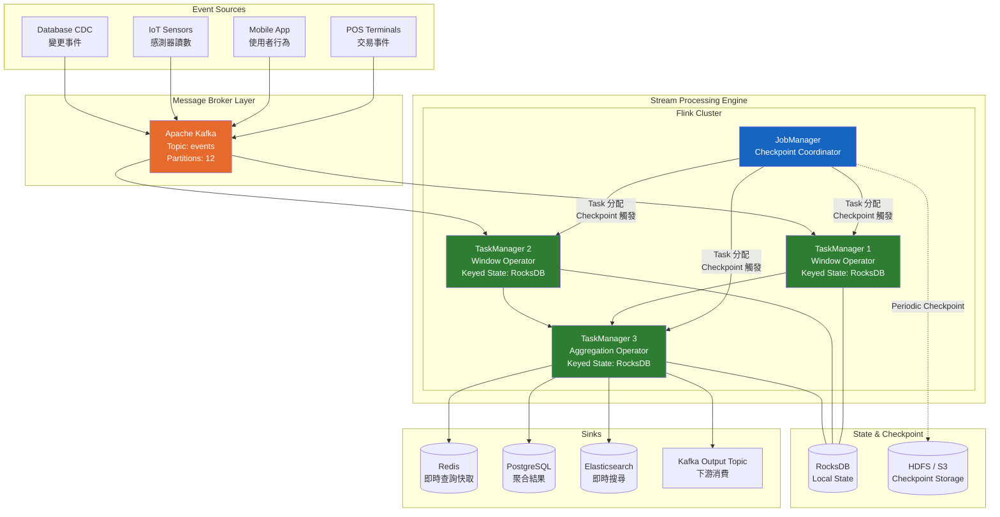
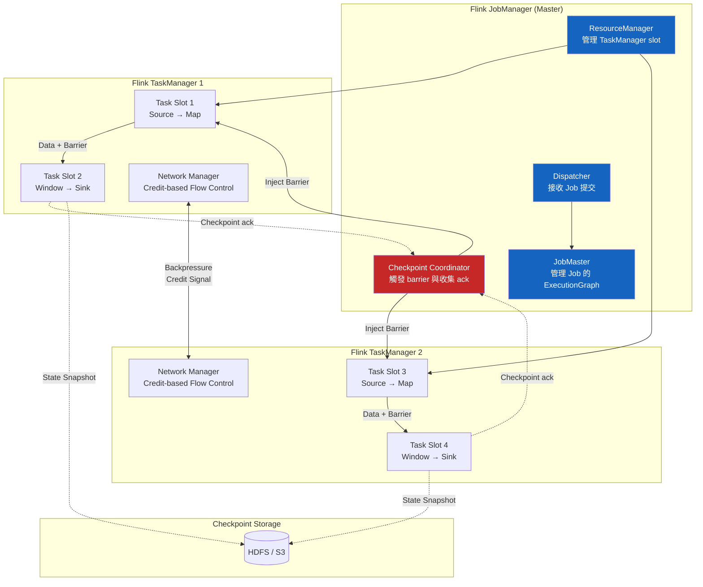
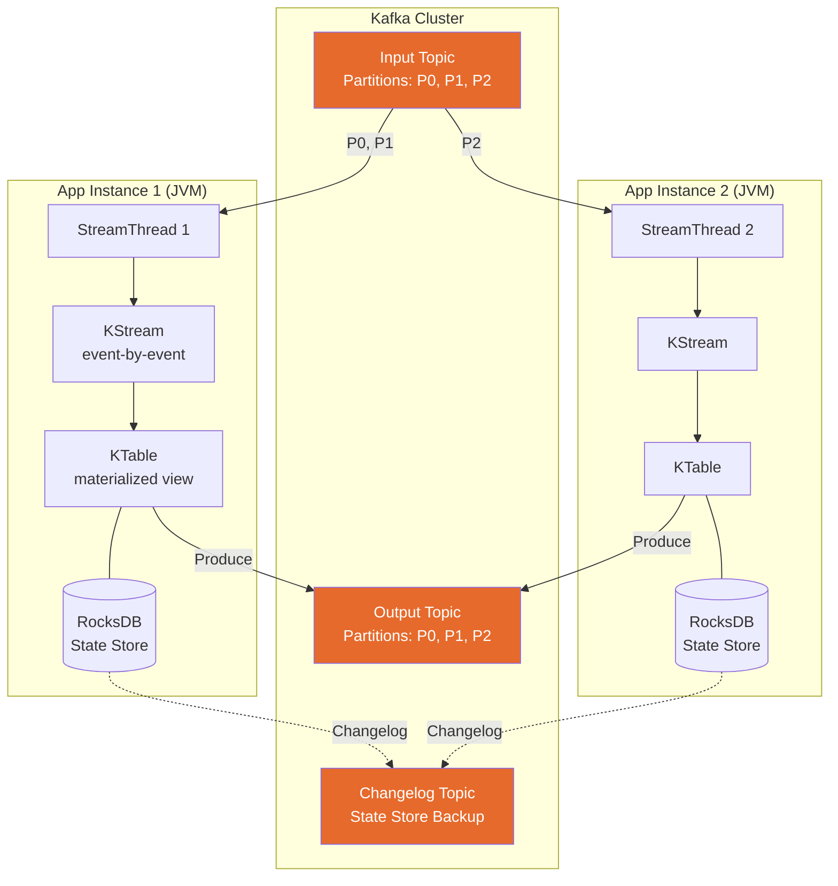

# Stream Processing / 串流處理

## Intent / 意圖

串流處理（Stream Processing）是一種對持續產生的無界資料（unbounded data）進行即時、增量運算的計算範式。與批次處理（batch processing）等待資料收集完畢後一次性處理不同，串流處理在資料到達的瞬間即進行計算——秒級甚至毫秒級的延遲，讓系統能即時回應業務事件。串流處理是事件驅動架構的高階延伸：不僅「接收並轉發事件」，更在事件流動的過程中進行聚合、關聯、模式偵測與狀態管理。

核心問題：**當資料以連續、無界的方式不斷湧入（如每秒數百萬筆交易事件、感測器讀數、使用者點擊流），且業務需要在事件發生後的數秒內完成聚合統計、異常偵測、即時推薦等運算時，如何設計一個兼顧正確性（exactly-once）、低延遲、高吞吐量、且能處理亂序事件與遲到資料的計算系統？**

---

## Problem / 問題情境

**場景一：Uber 即時動態定價因批次延遲失準**

Uber 的動態定價（surge pricing）需要根據「過去 5 分鐘內某區域的乘車需求量」與「該區域目前可用的司機數量」即時計算價格乘數。原本的批次處理管線每 15 分鐘執行一次 Spark 批次任務：

1. 從 Kafka 讀取過去 15 分鐘的行程請求事件與司機心跳事件。
2. 按地理區域聚合需求量與供給量。
3. 計算每個區域的 surge multiplier 並寫入快取層。

問題顯而易見：

- **延遲過高**：批次任務每 15 分鐘執行一次，加上計算和寫入時間，定價結果可能反映的是 20 分鐘前的供需狀態。在演唱會散場這類突發需求場景中，15 分鐘前區域還沒有任何需求，15 分鐘後需求已爆發但定價尚未調整——系統派出大量低價訂單，司機因利潤不足而不願前往該區域，乘客等待時間暴增。
- **計算結果跳躍**：批次邊界（15 分鐘的切割點）導致定價突然從 1.0x 跳到 3.5x，使用者體驗極差。理想的定價應該是滑動窗口式的連續調整。
- **遲到事件遺失**：部分行程請求事件因手機網路延遲在批次切割點之後才到達 Kafka。批次任務已完成計算，這些遲到事件只能等到下一個批次才被計入——定價計算遺漏了真實需求。

改用串流處理後，系統以 5 分鐘的滑動窗口（sliding window，每 30 秒滑動一次）持續計算每個區域的供需比。事件到達後毫秒級進入計算，定價乘數平滑變動，遲到事件透過 watermark 機制在容許的延遲範圍內被正確計入。

**場景二：金融交易監控系統的亂序事件導致誤報**

某銀行的即時反詐欺系統需要偵測「同一張信用卡在 10 分鐘內於距離超過 500 公里的兩個地點消費」的異常模式。交易事件從全球數千台 POS 終端上報，經過不同的網路路徑到達中央系統：

1. 卡號 A 在台北刷卡（事件時間 10:00:00），事件在 10:00:02 到達系統。
2. 卡號 A 在高雄刷卡（事件時間 10:00:30），事件因 POS 終端網路故障在 10:02:00 才到達系統。
3. 卡號 A 在台北再次刷卡（事件時間 10:01:00），事件在 10:01:01 到達系統。

如果系統以「處理時間」（processing time）而非「事件時間」（event time）進行窗口計算，事件 2（高雄，event time 10:00:30）會被歸入比事件 3（台北，event time 10:01:00）更晚的窗口——可能導致「台北-高雄-台北」的異常模式被拆散到不同窗口而未被偵測，或者產生錯誤的時序判斷。

串流處理引擎的 event time semantics 和 watermark 機制正是為了解決此類問題：以事件實際發生的時間作為計算基準，允許合理範圍內的亂序，並在 watermark 推進後觸發正確的窗口計算。

---

## Core Concepts / 核心概念

### Bounded vs Unbounded Data / 有界 vs 無界資料

批次處理的輸入是有界資料（bounded data）——檔案、資料表快照——大小已知、有明確的起點和終點。串流處理的輸入是無界資料（unbounded data）——事件流持續產生，永無結束。Kafka topic 中的事件流就是典型的無界資料。串流處理引擎必須以增量方式（incrementally）處理無界資料，不能等待「所有資料到齊」，因為它們永遠不會到齊。批次處理可以視為串流處理的特例——將有界資料當作一段有限的串流來處理。

### Event Time vs Processing Time / 事件時間 vs 處理時間

**Event Time（事件時間）**：事件實際發生的時間戳，由產生事件的源端（如 POS 終端、手機 App、感測器）記錄在事件本體中。Event time 反映真實世界的時序，但不同事件的 event time 不一定按順序到達處理引擎。

**Processing Time（處理時間）**：事件被串流處理引擎實際處理的時間。Processing time 是單調遞增的（在單一機器上），但它與 event time 之間存在不確定的偏差（skew）——網路延遲、上游系統重啟、消費者追趕歷史資料都會導致 processing time 遠大於 event time。

**Ingestion Time（接收時間）**：事件進入串流處理系統的時間（例如被 Kafka broker 接收的時間戳）。介於 event time 和 processing time 之間——比 event time 晚（因為有傳輸延遲），但比最終的 processing time 早。

在需要精確時序分析的場景（金融反詐欺、IoT 感測器分析），必須使用 event time 語意。只有在事件的 event time 無法取得、或時序精確性不重要的場景（如即時 dashboard 的近似統計）才使用 processing time。

### Windowing / 視窗

無界資料無法做「全局聚合」（因為資料永遠不會結束），因此串流處理將資料按時間分割為有限的片段——視窗（window），在每個視窗內進行聚合運算。

**Tumbling Window（翻轉視窗）**：固定大小、不重疊的連續視窗。例如「每 5 分鐘」的翻轉視窗將事件流切割為 [00:00-05:00)、[05:00-10:00)、[10:00-15:00) ... 的不重疊區間。每個事件恰好屬於一個視窗。適用於「每 5 分鐘的銷售額統計」這類場景。

**Sliding Window（滑動視窗）**：固定大小但可重疊的視窗。由窗口大小（window size）和滑動步距（slide interval）定義。例如「10 分鐘窗口、每 1 分鐘滑動」產生高度重疊的視窗：[00:00-10:00)、[01:00-11:00)、[02:00-12:00) ...。同一個事件可能屬於多個視窗。適用於「過去 10 分鐘的移動平均值」這類需要平滑統計的場景。

**Session Window（會話視窗）**：由活動間隔（inactivity gap）定義的動態視窗。如果兩個連續事件之間的間隔超過 gap 時長，則結束當前 session 並開始新的 session。Session window 的大小不固定——取決於使用者的行為模式。適用於「使用者在單次瀏覽會話中的行為分析」。

**Global Window（全局視窗）**：所有事件都屬於同一個視窗，需要搭配自定義 trigger 來決定何時輸出結果。

### Watermark / 水位線

Watermark 是串流處理引擎對「event time 完整性」的估計。一個值為 `W` 的 watermark 表示：「引擎認為 event time 小於 `W` 的所有事件都已經到達」。Watermark 是一種 **啟發式（heuristic）** 判斷，不是絕對保證——可能存在 event time < W 但在 watermark 之後才到達的遲到事件（late event）。

Watermark 的推進策略通常有兩種：

- **Perfect Watermark**：完全準確，保證不會有遲到事件。只在資料源可以提供完整的 ordering guarantee 時才可能（如從有序的資料庫 WAL 讀取）。
- **Heuristic Watermark**：基於觀察到的事件時間和預期的最大延遲，估計 watermark 的位置。大多數實際系統使用此方式——例如「目前觀察到的最大 event time 減去 5 秒」作為 watermark。

Watermark 推進後，視窗觸發計算並輸出結果。Watermark 設定過於保守（允許太大的延遲）會增加輸出延遲；過於激進（允許太小的延遲）會遺漏更多遲到事件。

### Late Data Handling / 遲到資料處理

在 watermark 推進到 `W` 之後仍到達的、event time < W 的事件就是遲到事件。處理策略：

1. **Discard（丟棄）**：直接忽略遲到事件。最簡單，但可能導致計算結果不精確。
2. **Allowed Lateness（允許遲到）**：為窗口設定一個「允許遲到時間」（如 10 分鐘）。在允許遲到期限內到達的事件仍然被計入對應窗口，並觸發窗口結果的更新（retraction/update）。超過允許遲到期限的事件才被丟棄。
3. **Side Output（旁路輸出）**：將遲到事件路由到一個特殊的旁路通道（side output），由另一個邏輯單獨處理（如人工審核、定期補正）。

Apache Flink 支援以上全部策略，並透過 `allowedLateness()` 和 `sideOutputLateData()` API 提供精確控制。

### Exactly-Once Semantics / 恰好一次語意

串流處理的三種投遞保證：

- **At-Most-Once（最多一次）**：事件可能遺失但不會重複處理。Fire-and-forget，不做 checkpoint。
- **At-Least-Once（至少一次）**：事件不會遺失但可能重複處理。透過 checkpoint + replay 保證。
- **Exactly-Once（恰好一次）**：每個事件對最終結果的影響恰好一次——即使在 failure 和 recovery 之後也是如此。

Exactly-once 是最難實現的語意。它 **不是指每個事件只被處理一次**（這在分散式系統中無法保證），而是指 **每個事件對系統狀態和輸出的影響等同於只處理一次**。實現方式：

- **Checkpoint + Replay**（Flink 模式）：定期將所有 operator 的狀態和 Kafka consumer offset 做一致性快照（checkpoint）。Failure 後回滾到最近的 checkpoint，重播 checkpoint 之後的事件。搭配冪等性 sink（如 upsert 到資料庫）或事務性 sink（如 Kafka transaction），確保重播不會導致重複輸出。
- **Transactional Writes**（Kafka Streams 模式）：將 consumer offset 更新和 producer output 包裝在 Kafka transaction 中——要麼全部 committed，要麼全部 aborted。Consumer 以 `read_committed` 隔離等級讀取，只看到已 committed 的訊息。

### Stream-Table Duality / 串流-表格對偶性

由 Jay Kreps（LinkedIn/Confluent 共同創辦人）提出的核心概念。一個 stream 可以視為一張表的 changelog（變更日誌），一張表可以視為一個 stream 的最新快照：

- **Stream → Table**：將 stream 中的所有事件按 key 聚合（保留每個 key 的最新值），得到一張 materialized table。這就是 Kafka 的 log compacted topic 的語意。
- **Table → Stream**：將 table 的每一次變更（insert、update、delete）作為一個事件發佈到 stream。這就是 CDC（Change Data Capture）的語意。

Kafka Streams 中的 `KTable` 和 `KStream` 正是這個對偶性的具體實現。`KTable` 是 stream 的 materialized 最新狀態，`KStream` 是每一個事件的完整序列。

### Stateful Stream Processing / 有狀態串流處理

許多串流操作（聚合、join、window、去重）需要維護跨事件的狀態。例如「每個使用者過去 1 小時的點擊次數」需要為每個使用者維護一個計數器。這些狀態必須被可靠地管理：

- **狀態儲存**：Flink 使用 RocksDB 作為嵌入式狀態後端（keyed state backend），Kafka Streams 也使用 RocksDB 作為 state store。
- **狀態一致性**：狀態必須包含在 checkpoint/snapshot 中，failure recovery 後狀態回滾到一致的 checkpoint。
- **狀態規模**：有狀態操作的狀態大小可能非常大（數 TB），超出單機記憶體容量。RocksDB 允許狀態溢出到磁碟，而不受限於 JVM heap。

### Backpressure / 背壓

當下游 operator 的處理速度跟不上上游的產出速度時，系統需要一種機制來避免 buffer 無限膨脹導致 OOM。Backpressure 讓處理速度較慢的下游 operator 向上游傳遞「我處理不過來了」的訊號，使上游放慢速度。

- **Flink**：基於 TCP flow control 和 credit-based 機制。下游 operator 透過 credit 告知上游自己還能接收多少 buffer。Credit 為零時上游暫停發送。
- **Kafka Streams**：以 Kafka consumer 的 `poll()` 頻率自然限流——不 poll 就不消費新事件。
- **Spark Structured Streaming**：透過 micro-batch 的排程間隔自然限流——每個 micro-batch 只處理固定量的資料。

---

## Architecture / 架構

### 串流處理系統全景架構



### Apache Flink 內部架構



### Kafka Streams 架構



### Windowing 時間軸

```mermaid
gantt
    title Windowing Types on a 15-minute Timeline
    dateFormat mm:ss
    axisFormat %M:%S

    section Tumbling (5min)
    Window A [00:00-05:00) :a1, 00:00, 5m
    Window B [05:00-10:00) :a2, 05:00, 5m
    Window C [10:00-15:00) :a3, 10:00, 5m

    section Sliding (5min window, 2min slide)
    Win [00:00-05:00) :b1, 00:00, 5m
    Win [02:00-07:00) :b2, 02:00, 5m
    Win [04:00-09:00) :b3, 04:00, 5m
    Win [06:00-11:00) :b4, 06:00, 5m

    section Session (gap=3min)
    Session 1 (events at 00:30, 01:00, 02:00) :c1, 00:30, 2m
    Idle gap :c2, 02:30, 3m
    Session 2 (events at 05:30, 06:00) :c3, 05:30, 1m
```

---

## How It Works / 運作原理

### Flink Checkpoint 機制（Chandy-Lamport 分散式快照）

Flink 的 exactly-once 保證建立在分散式快照演算法之上，靈感來自 Chandy-Lamport 演算法：

1. **Checkpoint Coordinator 注入 Barrier**：JobManager 的 Checkpoint Coordinator 定期（預設 interval 可配置，如每 10 秒）向所有 source operator 注入特殊的 **checkpoint barrier** 標記。Barrier 不攜帶資料，只攜帶 checkpoint ID。

2. **Barrier 隨資料流傳播**：Source operator 收到 barrier 後，將自己的 offset（如 Kafka consumer offset）快照到 checkpoint storage，然後將 barrier 向下游 operator 發送。Barrier 在資料流中隨普通事件一起流動——它將資料流分割為「barrier 之前的事件」（屬於當前 checkpoint）和「barrier 之後的事件」（屬於下一個 checkpoint）。

3. **Barrier Alignment（多輸入 operator）**：如果一個 operator 有多個上游輸入（如 join 的兩個輸入流），它必須等待所有輸入的 barrier 都到達後，才做狀態快照。在等待期間，已到達 barrier 的輸入通道的資料被 buffer，未到達的通道繼續處理——這就是 **barrier alignment**。（Flink 1.11+ 也支援 unaligned checkpoint，不 buffer 資料而是將 in-flight 資料也納入 checkpoint，減少 alignment 延遲但增大 checkpoint 大小。）

4. **狀態快照**：所有輸入的 barrier 對齊後，operator 將自己的 keyed state 和 operator state 快照到外部儲存（HDFS、S3）。RocksDB state backend 透過增量 checkpoint 只上傳自上次 checkpoint 以來變更的 SST 檔案，大幅減少 checkpoint 的 I/O 量。

5. **Checkpoint 完成**：所有 operator 都完成快照並回報 ack 後，Checkpoint Coordinator 將此 checkpoint 標記為 completed。此 checkpoint 代表一個全局一致的狀態快照——每個 operator 的狀態和對應的 Kafka offset 一致。

6. **Failure Recovery**：任何 TaskManager 故障時，JobManager 將所有 operator 回滾到最近的 completed checkpoint——重設 Kafka consumer offset、重新載入 operator state。然後從 checkpoint 對應的 Kafka offset 開始重播事件。由於 checkpoint 保證了狀態和 offset 的一致性，重播後的結果與無故障時完全相同——這就是 exactly-once 的語意。

### Kafka Streams 處理模型

Kafka Streams 不是獨立的叢集，而是一個嵌入在 JVM 應用程式中的函式庫。它的處理模型與 Flink 截然不同：

1. **StreamThread 與 Task**：每個 Kafka Streams 應用實例啟動若干 `StreamThread`（預設等於 CPU 核數）。每個 StreamThread 被分配一組 Kafka partition——每個 partition 對應一個 StreamTask。StreamTask 負責從 partition poll 事件、經過 topology 的所有 operator、寫入 output topic。

2. **KStream vs KTable vs GlobalKTable**：
   - `KStream`：事件流的抽象。每筆記錄都是一個獨立的事件（insert）。`KStream<UserId, ClickEvent>` 代表所有點擊事件的串流。
   - `KTable`：changelog 的抽象。每筆記錄是對某個 key 的 upsert。`KTable<UserId, UserProfile>` 代表使用者個人資料的最新狀態。KTable 只在 partition 範圍內是完整的——實例 A 只能查詢分配到自己的 partition 的 key。
   - `GlobalKTable`：整個 topic 的完整 materialized view，每個應用實例都持有全部 partition 的資料。適用於小型的 reference data（如國家代碼表）做 enrichment join。代價是每個實例需要儲存全部資料。

3. **狀態管理**：Kafka Streams 將 state store 的變更寫入 Kafka changelog topic（compacted topic）。如果應用實例故障，新實例可以從 changelog topic 重建 state store——無需依賴外部 checkpoint 儲存。

4. **Exactly-Once**：Kafka Streams 0.11+ 使用 Kafka transaction 實現 exactly-once。每次 `process()` 的輸出包含：(1) 寫入 output topic 的訊息、(2) 更新 consumer offset、(3) 更新 changelog topic——這三者被包裝在一個 Kafka transaction 中，原子性地 commit 或 abort。

### Spark Structured Streaming 概述

Apache Spark Structured Streaming 將串流處理建模為對一張「持續增長的表」的增量查詢：

1. **Micro-Batch 模式（預設）**：每隔一段時間（如 100ms-數秒），從 Kafka poll 一批新事件，作為 DataFrame 的新行附加到「輸入表」，然後觸發一次增量的 Spark SQL 查詢。本質上是「非常小且非常頻繁的批次處理」。延遲下限約 100ms。

2. **Continuous Processing 模式（實驗性）**：Spark 2.3+ 引入的真正的逐事件處理模式，延遲可低至 1ms，但目前只支援有限的操作（map、filter），不支援 aggregation 和 window。

3. **優勢**：與 Spark SQL 和 MLlib 深度整合——同一套 DataFrame API 可用於批次和串流，降低學習成本。

4. **劣勢**：micro-batch 的固有延遲（百毫秒級）高於 Flink 的逐事件處理（毫秒級）。Exactly-once 依賴 idempotent sink 和 WAL，不如 Flink 的 checkpoint-based 機制靈活。

---

## Rust 實作

以下實作一個完整的 windowed aggregation engine，支援 tumbling window 和 sliding window、watermark 推進、遲到資料處理。使用 Rust 2024 edition + tokio async runtime 模擬事件源、窗口引擎、狀態管理的完整串流處理流程。

```rust
// stream_processing.rs
// Windowed aggregation engine with tumbling/sliding windows,
// watermarks, and late data handling
// Rust 2024 edition, tokio async runtime

use std::collections::{BTreeMap, HashMap};
use std::fmt;
use std::time::Duration as StdDuration;
use tokio::sync::mpsc;
use tokio::time::{self, Duration};

// ─── Event Model ───

#[derive(Debug, Clone)]
struct Event {
    key: String,        // partition key (e.g., region_id)
    value: f64,         // metric value (e.g., ride request count)
    event_time: u64,    // milliseconds since epoch
}

impl fmt::Display for Event {
    fn fmt(&self, f: &mut fmt::Formatter<'_>) -> fmt::Result {
        write!(
            f,
            "Event(key={}, value={:.1}, event_time={}ms)",
            self.key, self.value, self.event_time
        )
    }
}

// ─── Window Types ───

#[derive(Debug, Clone, Copy, PartialEq, Eq)]
enum WindowType {
    Tumbling { size_ms: u64 },
    Sliding { size_ms: u64, slide_ms: u64 },
}

#[derive(Debug, Clone, PartialEq, Eq, Hash)]
struct WindowKey {
    key: String,
    window_start: u64,
    window_end: u64,
}

impl fmt::Display for WindowKey {
    fn fmt(&self, f: &mut fmt::Formatter<'_>) -> fmt::Result {
        write!(
            f,
            "[key={}, window={}ms-{}ms]",
            self.key, self.window_start, self.window_end
        )
    }
}

// ─── Window Aggregation State ───

#[derive(Debug, Clone)]
struct WindowAggregation {
    count: u64,
    sum: f64,
    min: f64,
    max: f64,
}

impl WindowAggregation {
    fn new() -> Self {
        Self {
            count: 0,
            sum: 0.0,
            min: f64::MAX,
            max: f64::MIN,
        }
    }

    fn add(&mut self, value: f64) {
        self.count += 1;
        self.sum += value;
        self.min = self.min.min(value);
        self.max = self.max.max(value);
    }

    fn avg(&self) -> f64 {
        if self.count == 0 {
            0.0
        } else {
            self.sum / self.count as f64
        }
    }
}

impl fmt::Display for WindowAggregation {
    fn fmt(&self, f: &mut fmt::Formatter<'_>) -> fmt::Result {
        write!(
            f,
            "count={}, sum={:.1}, avg={:.2}, min={:.1}, max={:.1}",
            self.count,
            self.sum,
            self.avg(),
            self.min,
            self.max,
        )
    }
}

// ─── Window Result ───

#[derive(Debug)]
struct WindowResult {
    window_key: WindowKey,
    aggregation: WindowAggregation,
    is_late_update: bool,
}

impl fmt::Display for WindowResult {
    fn fmt(&self, f: &mut fmt::Formatter<'_>) -> fmt::Result {
        let label = if self.is_late_update {
            " [LATE UPDATE]"
        } else {
            ""
        };
        write!(
            f,
            "{} => {}{}",
            self.window_key, self.aggregation, label
        )
    }
}

// ─── Windowed Aggregation Engine ───

struct WindowEngine {
    window_type: WindowType,
    allowed_lateness_ms: u64,
    watermark_delay_ms: u64,

    // Keyed window state: WindowKey -> aggregation
    windows: HashMap<WindowKey, WindowAggregation>,
    // Track which windows have been fired (watermark passed window_end)
    fired_windows: HashMap<WindowKey, bool>,
    // Current watermark (event time up to which we believe all events arrived)
    watermark: u64,
    // Maximum observed event time (used to advance watermark)
    max_event_time: u64,
    // Late event counter
    late_events: u64,
    dropped_events: u64,

    // Output channel
    output_tx: mpsc::Sender<WindowResult>,
}

impl WindowEngine {
    fn new(
        window_type: WindowType,
        allowed_lateness_ms: u64,
        watermark_delay_ms: u64,
        output_tx: mpsc::Sender<WindowResult>,
    ) -> Self {
        Self {
            window_type,
            allowed_lateness_ms,
            watermark_delay_ms,
            windows: HashMap::new(),
            fired_windows: HashMap::new(),
            watermark: 0,
            max_event_time: 0,
            late_events: 0,
            dropped_events: 0,
            output_tx,
        }
    }

    /// Determine which windows an event belongs to
    fn assign_windows(&self, key: &str, event_time: u64) -> Vec<WindowKey> {
        match self.window_type {
            WindowType::Tumbling { size_ms } => {
                let window_start = (event_time / size_ms) * size_ms;
                vec![WindowKey {
                    key: key.to_string(),
                    window_start,
                    window_end: window_start + size_ms,
                }]
            }
            WindowType::Sliding { size_ms, slide_ms } => {
                // An event belongs to all windows that contain its event_time
                let mut windows = Vec::new();
                // Find the earliest window start that could contain this event
                let earliest_start = if event_time >= size_ms {
                    // Align to slide boundary
                    let offset = event_time % slide_ms;
                    if offset == 0 {
                        event_time - size_ms + slide_ms
                    } else {
                        let base = event_time - offset;
                        if base + size_ms > event_time {
                            base
                        } else {
                            base + slide_ms
                        }
                    }
                } else {
                    0
                };

                let mut start = earliest_start;
                loop {
                    let end = start + size_ms;
                    if start > event_time {
                        break;
                    }
                    if event_time < end {
                        windows.push(WindowKey {
                            key: key.to_string(),
                            window_start: start,
                            window_end: end,
                        });
                    }
                    start += slide_ms;
                }
                windows
            }
        }
    }

    /// Process a single event
    async fn process_event(&mut self, event: &Event) {
        // Update max observed event time
        if event.event_time > self.max_event_time {
            self.max_event_time = event.event_time;
        }

        // Advance watermark (heuristic: max_event_time - delay)
        let new_watermark = if self.max_event_time > self.watermark_delay_ms {
            self.max_event_time - self.watermark_delay_ms
        } else {
            0
        };

        let watermark_advanced = new_watermark > self.watermark;
        self.watermark = self.watermark.max(new_watermark);

        // Assign event to windows
        let window_keys = self.assign_windows(&event.key, event.event_time);

        for wk in &window_keys {
            // Check if event is within allowed lateness
            if self.watermark >= wk.window_end {
                let lateness = self.watermark - wk.window_end;
                if lateness > self.allowed_lateness_ms {
                    // Event is too late — drop it
                    self.dropped_events += 1;
                    println!(
                        "    [DROPPED] {} for window {} (lateness={}ms > allowed={}ms)",
                        event, wk, lateness, self.allowed_lateness_ms
                    );
                    continue;
                }
                // Event is late but within allowed lateness
                self.late_events += 1;
            }

            // Add event to window aggregation
            let agg = self.windows.entry(wk.clone()).or_insert_with(WindowAggregation::new);
            agg.add(event.value);

            // If this window was already fired, emit an update
            if self.fired_windows.contains_key(wk) {
                let result = WindowResult {
                    window_key: wk.clone(),
                    aggregation: agg.clone(),
                    is_late_update: true,
                };
                let _ = self.output_tx.send(result).await;
            }
        }

        // If watermark advanced, fire all ready windows
        if watermark_advanced {
            self.fire_ready_windows().await;
        }
    }

    /// Fire all windows whose end time <= current watermark
    async fn fire_ready_windows(&mut self) {
        // Collect window keys that are ready to fire
        let ready_keys: Vec<WindowKey> = self
            .windows
            .keys()
            .filter(|wk| wk.window_end <= self.watermark && !self.fired_windows.contains_key(*wk))
            .cloned()
            .collect();

        for wk in ready_keys {
            if let Some(agg) = self.windows.get(&wk) {
                let result = WindowResult {
                    window_key: wk.clone(),
                    aggregation: agg.clone(),
                    is_late_update: false,
                };
                let _ = self.output_tx.send(result).await;
                self.fired_windows.insert(wk, true);
            }
        }

        // Cleanup windows that are past allowed lateness
        let cleanup_threshold = if self.watermark > self.allowed_lateness_ms {
            self.watermark - self.allowed_lateness_ms
        } else {
            0
        };
        self.windows
            .retain(|wk, _| wk.window_end > cleanup_threshold);
        self.fired_windows
            .retain(|wk, _| wk.window_end > cleanup_threshold);
    }

    /// Flush all remaining windows (called at end of stream)
    async fn flush(&mut self) {
        let unfired_keys: Vec<WindowKey> = self
            .windows
            .keys()
            .filter(|wk| !self.fired_windows.contains_key(*wk))
            .cloned()
            .collect();

        for wk in unfired_keys {
            if let Some(agg) = self.windows.get(&wk) {
                let result = WindowResult {
                    window_key: wk.clone(),
                    aggregation: agg.clone(),
                    is_late_update: false,
                };
                let _ = self.output_tx.send(result).await;
            }
        }
    }
}

// ─── Simulation ───

#[tokio::main]
async fn main() {
    println!("=== Stream Processing: Windowed Aggregation Engine (Rust) ===\n");

    // ─── Part 1: Tumbling Window ───
    println!("--- Part 1: Tumbling Window (5000ms window, watermark delay=2000ms) ---\n");
    {
        let (output_tx, mut output_rx) = mpsc::channel::<WindowResult>(64);

        let mut engine = WindowEngine::new(
            WindowType::Tumbling { size_ms: 5000 },
            3000,  // allowed lateness: 3000ms
            2000,  // watermark delay: 2000ms
            output_tx,
        );

        // Simulate events for region "taipei" and "kaohsiung"
        let events = vec![
            Event { key: "taipei".into(),    value: 10.0, event_time: 1000 },
            Event { key: "taipei".into(),    value: 15.0, event_time: 2500 },
            Event { key: "kaohsiung".into(), value: 8.0,  event_time: 1500 },
            Event { key: "taipei".into(),    value: 20.0, event_time: 4000 },
            Event { key: "kaohsiung".into(), value: 12.0, event_time: 3000 },
            // Events in second window
            Event { key: "taipei".into(),    value: 25.0, event_time: 6000 },
            Event { key: "taipei".into(),    value: 30.0, event_time: 8000 },
            Event { key: "kaohsiung".into(), value: 18.0, event_time: 7000 },
            // This event advances watermark past first window
            Event { key: "taipei".into(),    value: 35.0, event_time: 9500 },
            // Late event for first window (event_time=4500, within allowed lateness)
            Event { key: "taipei".into(),    value: 5.0,  event_time: 4500 },
            // Very late event (will be dropped if beyond allowed lateness)
            Event { key: "taipei".into(),    value: 99.0, event_time: 500 },
            // Advance watermark further
            Event { key: "taipei".into(),    value: 40.0, event_time: 15000 },
        ];

        for event in &events {
            println!("  Processing: {}", event);
            engine.process_event(event).await;

            // Drain output
            while let Ok(result) = output_rx.try_recv() {
                println!("    >> OUTPUT: {}", result);
            }
        }

        // Flush remaining windows
        engine.flush().await;
        while let Ok(result) = output_rx.try_recv() {
            println!("    >> OUTPUT: {}", result);
        }

        println!("\n  Statistics:");
        println!("    Late events processed: {}", engine.late_events);
        println!("    Dropped events: {}", engine.dropped_events);
        println!("    Final watermark: {}ms", engine.watermark);
    }

    // ─── Part 2: Sliding Window ───
    println!("\n--- Part 2: Sliding Window (6000ms window, 3000ms slide, watermark delay=1000ms) ---\n");
    {
        let (output_tx, mut output_rx) = mpsc::channel::<WindowResult>(64);

        let mut engine = WindowEngine::new(
            WindowType::Sliding {
                size_ms: 6000,
                slide_ms: 3000,
            },
            2000,  // allowed lateness: 2000ms
            1000,  // watermark delay: 1000ms
            output_tx,
        );

        let events = vec![
            Event { key: "sensor_a".into(), value: 22.5, event_time: 1000 },
            Event { key: "sensor_a".into(), value: 23.0, event_time: 2000 },
            Event { key: "sensor_a".into(), value: 24.5, event_time: 4000 },
            Event { key: "sensor_a".into(), value: 21.0, event_time: 5500 },
            Event { key: "sensor_a".into(), value: 26.0, event_time: 7500 },
            Event { key: "sensor_a".into(), value: 28.0, event_time: 10000 },
            Event { key: "sensor_a".into(), value: 30.0, event_time: 13000 },
        ];

        for event in &events {
            println!("  Processing: {}", event);
            engine.process_event(event).await;

            while let Ok(result) = output_rx.try_recv() {
                println!("    >> OUTPUT: {}", result);
            }
        }

        engine.flush().await;
        while let Ok(result) = output_rx.try_recv() {
            println!("    >> OUTPUT: {}", result);
        }

        println!("\n  Statistics:");
        println!("    Late events processed: {}", engine.late_events);
        println!("    Dropped events: {}", engine.dropped_events);
        println!("    Final watermark: {}ms", engine.watermark);
    }

    println!("\n=== Simulation complete ===");
}

// Output:
// === Stream Processing: Windowed Aggregation Engine (Rust) ===
//
// --- Part 1: Tumbling Window (5000ms window, watermark delay=2000ms) ---
//
//   Processing: Event(key=taipei, value=10.0, event_time=1000ms)
//   Processing: Event(key=taipei, value=15.0, event_time=2500ms)
//   Processing: Event(key=kaohsiung, value=8.0, event_time=1500ms)
//   Processing: Event(key=taipei, value=20.0, event_time=4000ms)
//   Processing: Event(key=kaohsiung, value=12.0, event_time=3000ms)
//   Processing: Event(key=taipei, value=25.0, event_time=6000ms)
//   Processing: Event(key=taipei, value=30.0, event_time=8000ms)
//   Processing: Event(key=kaohsiung, value=18.0, event_time=7000ms)
//   Processing: Event(key=taipei, value=35.0, event_time=9500ms)
//     >> OUTPUT: [key=taipei, window=0ms-5000ms] => count=3, sum=45.0, avg=15.00, min=10.0, max=20.0
//     >> OUTPUT: [key=kaohsiung, window=0ms-5000ms] => count=2, sum=20.0, avg=10.00, min=8.0, max=12.0
//   Processing: Event(key=taipei, value=5.0, event_time=4500ms)
//     >> OUTPUT: [key=taipei, window=0ms-5000ms] => count=4, sum=50.0, avg=12.50, min=5.0, max=20.0 [LATE UPDATE]
//   Processing: Event(key=taipei, value=99.0, event_time=500ms)
//     [DROPPED] Event(key=taipei, value=99.0, event_time=500ms) for window [key=taipei, window=0ms-5000ms] (lateness=7500ms > allowed=3000ms)
//   Processing: Event(key=taipei, value=40.0, event_time=15000ms)
//     >> OUTPUT: [key=taipei, window=5000ms-10000ms] => count=3, sum=90.0, avg=30.00, min=25.0, max=35.0
//     >> OUTPUT: [key=kaohsiung, window=5000ms-10000ms] => count=1, sum=18.0, avg=18.00, min=18.0, max=18.0
//
//   Statistics:
//     Late events processed: 1
//     Dropped events: 1
//     Final watermark: 13000ms
//
// --- Part 2: Sliding Window (6000ms window, 3000ms slide, watermark delay=1000ms) ---
//
//   Processing: Event(key=sensor_a, value=22.5, event_time=1000ms)
//   Processing: Event(key=sensor_a, value=23.0, event_time=2000ms)
//   Processing: Event(key=sensor_a, value=24.5, event_time=4000ms)
//   Processing: Event(key=sensor_a, value=21.0, event_time=5500ms)
//   Processing: Event(key=sensor_a, value=26.0, event_time=7500ms)
//     >> OUTPUT: [key=sensor_a, window=0ms-6000ms] => count=3, sum=69.5, avg=23.17, min=22.5, max=24.5
//   Processing: Event(key=sensor_a, value=28.0, event_time=10000ms)
//     >> OUTPUT: [key=sensor_a, window=3000ms-9000ms] => count=3, sum=71.5, avg=23.83, min=21.0, max=26.0
//   Processing: Event(key=sensor_a, value=30.0, event_time=13000ms)
//     >> OUTPUT: [key=sensor_a, window=6000ms-12000ms] => count=2, sum=54.0, avg=27.00, min=26.0, max=28.0
//
//   Statistics:
//     Late events processed: 0
//     Dropped events: 0
//     Final watermark: 12000ms
//
// === Simulation complete ===
```

**重點說明：**
- `WindowEngine` 是一個 generic 的視窗聚合引擎，支援 tumbling 和 sliding 兩種視窗類型
- Watermark 使用啟發式策略：`max_event_time - delay`，模擬 Flink 的 `BoundedOutOfOrdernessWatermarks`
- 遲到事件在 `allowed_lateness_ms` 內仍被計入視窗，並觸發 late update 輸出
- 超過允許遲到時間的事件被 drop 並記錄
- `HashMap<WindowKey, WindowAggregation>` 模擬 Flink 的 keyed state——每個 `(key, window)` 組合有獨立的聚合狀態
- 使用 `mpsc::channel` 模擬 operator 之間的資料流和背壓（channel 滿時 sender 等待）

---

## Go 實作

等價的 Go 實作，使用 Go 1.24+ 的 goroutine 和 channel。

```go
// stream_processing.go
// Windowed aggregation engine with tumbling/sliding windows,
// watermarks, and late data handling
// Go 1.24+

package main

import (
	"fmt"
	"math"
	"sync"
)

// ─── Event Model ───

type Event struct {
	Key       string
	Value     float64
	EventTime uint64 // milliseconds since epoch
}

func (e Event) String() string {
	return fmt.Sprintf("Event(key=%s, value=%.1f, event_time=%dms)", e.Key, e.Value, e.EventTime)
}

// ─── Window Types ───

type WindowType int

const (
	TumblingWindow WindowType = iota
	SlidingWindow
)

type WindowConfig struct {
	Type    WindowType
	SizeMs  uint64
	SlideMs uint64 // only for sliding window
}

type WindowKey struct {
	Key         string
	WindowStart uint64
	WindowEnd   uint64
}

func (wk WindowKey) String() string {
	return fmt.Sprintf("[key=%s, window=%dms-%dms]", wk.Key, wk.WindowStart, wk.WindowEnd)
}

// ─── Window Aggregation State ───

type WindowAggregation struct {
	Count uint64
	Sum   float64
	Min   float64
	Max   float64
}

func NewWindowAggregation() *WindowAggregation {
	return &WindowAggregation{
		Min: math.MaxFloat64,
		Max: -math.MaxFloat64,
	}
}

func (a *WindowAggregation) Add(value float64) {
	a.Count++
	a.Sum += value
	a.Min = min(a.Min, value)
	a.Max = max(a.Max, value)
}

func (a *WindowAggregation) Avg() float64 {
	if a.Count == 0 {
		return 0.0
	}
	return a.Sum / float64(a.Count)
}

func (a *WindowAggregation) String() string {
	return fmt.Sprintf("count=%d, sum=%.1f, avg=%.2f, min=%.1f, max=%.1f",
		a.Count, a.Sum, a.Avg(), a.Min, a.Max)
}

func (a *WindowAggregation) Clone() *WindowAggregation {
	return &WindowAggregation{
		Count: a.Count,
		Sum:   a.Sum,
		Min:   a.Min,
		Max:   a.Max,
	}
}

// ─── Window Result ───

type WindowResult struct {
	WindowKey    WindowKey
	Aggregation  *WindowAggregation
	IsLateUpdate bool
}

func (r WindowResult) String() string {
	label := ""
	if r.IsLateUpdate {
		label = " [LATE UPDATE]"
	}
	return fmt.Sprintf("%s => %s%s", r.WindowKey, r.Aggregation, label)
}

// ─── Windowed Aggregation Engine ───

type WindowEngine struct {
	mu sync.Mutex

	config            WindowConfig
	allowedLatenessMs uint64
	watermarkDelayMs  uint64

	windows      map[WindowKey]*WindowAggregation
	firedWindows map[WindowKey]bool
	watermark    uint64
	maxEventTime uint64
	lateEvents   uint64
	droppedEvents uint64

	outputCh chan<- WindowResult
}

func NewWindowEngine(
	config WindowConfig,
	allowedLatenessMs, watermarkDelayMs uint64,
	outputCh chan<- WindowResult,
) *WindowEngine {
	return &WindowEngine{
		config:            config,
		allowedLatenessMs: allowedLatenessMs,
		watermarkDelayMs:  watermarkDelayMs,
		windows:           make(map[WindowKey]*WindowAggregation),
		firedWindows:      make(map[WindowKey]bool),
		outputCh:          outputCh,
	}
}

// assignWindows determines which windows an event belongs to
func (e *WindowEngine) assignWindows(key string, eventTime uint64) []WindowKey {
	switch e.config.Type {
	case TumblingWindow:
		start := (eventTime / e.config.SizeMs) * e.config.SizeMs
		return []WindowKey{{
			Key:         key,
			WindowStart: start,
			WindowEnd:   start + e.config.SizeMs,
		}}
	case SlidingWindow:
		var windows []WindowKey
		sizeMs := e.config.SizeMs
		slideMs := e.config.SlideMs

		var earliestStart uint64
		if eventTime >= sizeMs {
			offset := eventTime % slideMs
			if offset == 0 {
				earliestStart = eventTime - sizeMs + slideMs
			} else {
				base := eventTime - offset
				if base+sizeMs > eventTime {
					earliestStart = base
				} else {
					earliestStart = base + slideMs
				}
			}
		}

		for start := earliestStart; start <= eventTime; start += slideMs {
			end := start + sizeMs
			if eventTime < end {
				windows = append(windows, WindowKey{
					Key:         key,
					WindowStart: start,
					WindowEnd:   end,
				})
			}
		}
		return windows
	default:
		return nil
	}
}

// ProcessEvent processes a single event through the window engine
func (e *WindowEngine) ProcessEvent(event Event) {
	e.mu.Lock()
	defer e.mu.Unlock()

	// Update max observed event time
	if event.EventTime > e.maxEventTime {
		e.maxEventTime = event.EventTime
	}

	// Advance watermark
	var newWatermark uint64
	if e.maxEventTime > e.watermarkDelayMs {
		newWatermark = e.maxEventTime - e.watermarkDelayMs
	}
	watermarkAdvanced := newWatermark > e.watermark
	if newWatermark > e.watermark {
		e.watermark = newWatermark
	}

	// Assign event to windows
	windowKeys := e.assignWindows(event.Key, event.EventTime)

	for _, wk := range windowKeys {
		// Check if event is within allowed lateness
		if e.watermark >= wk.WindowEnd {
			lateness := e.watermark - wk.WindowEnd
			if lateness > e.allowedLatenessMs {
				e.droppedEvents++
				fmt.Printf("    [DROPPED] %s for window %s (lateness=%dms > allowed=%dms)\n",
					event, wk, lateness, e.allowedLatenessMs)
				continue
			}
			e.lateEvents++
		}

		// Add event to window aggregation
		agg, exists := e.windows[wk]
		if !exists {
			agg = NewWindowAggregation()
			e.windows[wk] = agg
		}
		agg.Add(event.Value)

		// If window was already fired, emit late update
		if e.firedWindows[wk] {
			e.outputCh <- WindowResult{
				WindowKey:    wk,
				Aggregation:  agg.Clone(),
				IsLateUpdate: true,
			}
		}
	}

	// Fire ready windows if watermark advanced
	if watermarkAdvanced {
		e.fireReadyWindows()
	}
}

func (e *WindowEngine) fireReadyWindows() {
	// Fire windows whose end <= watermark
	for wk, agg := range e.windows {
		if wk.WindowEnd <= e.watermark && !e.firedWindows[wk] {
			e.outputCh <- WindowResult{
				WindowKey:   wk,
				Aggregation: agg.Clone(),
			}
			e.firedWindows[wk] = true
		}
	}

	// Cleanup expired windows
	var cleanupThreshold uint64
	if e.watermark > e.allowedLatenessMs {
		cleanupThreshold = e.watermark - e.allowedLatenessMs
	}
	for wk := range e.windows {
		if wk.WindowEnd <= cleanupThreshold {
			delete(e.windows, wk)
			delete(e.firedWindows, wk)
		}
	}
}

// Flush emits all remaining unfired windows
func (e *WindowEngine) Flush() {
	e.mu.Lock()
	defer e.mu.Unlock()

	for wk, agg := range e.windows {
		if !e.firedWindows[wk] {
			e.outputCh <- WindowResult{
				WindowKey:   wk,
				Aggregation: agg.Clone(),
			}
		}
	}
}

// Stats returns the engine's statistics
func (e *WindowEngine) Stats() (lateEvents, droppedEvents, watermark uint64) {
	e.mu.Lock()
	defer e.mu.Unlock()
	return e.lateEvents, e.droppedEvents, e.watermark
}

// ─── Simulation ───

func drainOutput(outputCh <-chan WindowResult) {
	for {
		select {
		case result := <-outputCh:
			fmt.Printf("    >> OUTPUT: %s\n", result)
		default:
			return
		}
	}
}

func main() {
	fmt.Println("=== Stream Processing: Windowed Aggregation Engine (Go) ===")
	fmt.Println()

	// ─── Part 1: Tumbling Window ───
	fmt.Println("--- Part 1: Tumbling Window (5000ms window, watermark delay=2000ms) ---")
	fmt.Println()
	{
		outputCh := make(chan WindowResult, 64)
		engine := NewWindowEngine(
			WindowConfig{Type: TumblingWindow, SizeMs: 5000},
			3000, // allowed lateness
			2000, // watermark delay
			outputCh,
		)

		events := []Event{
			{Key: "taipei", Value: 10.0, EventTime: 1000},
			{Key: "taipei", Value: 15.0, EventTime: 2500},
			{Key: "kaohsiung", Value: 8.0, EventTime: 1500},
			{Key: "taipei", Value: 20.0, EventTime: 4000},
			{Key: "kaohsiung", Value: 12.0, EventTime: 3000},
			// Second window
			{Key: "taipei", Value: 25.0, EventTime: 6000},
			{Key: "taipei", Value: 30.0, EventTime: 8000},
			{Key: "kaohsiung", Value: 18.0, EventTime: 7000},
			// Advances watermark past first window
			{Key: "taipei", Value: 35.0, EventTime: 9500},
			// Late event for first window (within allowed lateness)
			{Key: "taipei", Value: 5.0, EventTime: 4500},
			// Very late event (dropped)
			{Key: "taipei", Value: 99.0, EventTime: 500},
			// Advance watermark further
			{Key: "taipei", Value: 40.0, EventTime: 15000},
		}

		for _, event := range events {
			fmt.Printf("  Processing: %s\n", event)
			engine.ProcessEvent(event)
			drainOutput(outputCh)
		}

		engine.Flush()
		drainOutput(outputCh)

		late, dropped, wm := engine.Stats()
		fmt.Println()
		fmt.Println("  Statistics:")
		fmt.Printf("    Late events processed: %d\n", late)
		fmt.Printf("    Dropped events: %d\n", dropped)
		fmt.Printf("    Final watermark: %dms\n", wm)
	}

	// ─── Part 2: Sliding Window ───
	fmt.Println()
	fmt.Println("--- Part 2: Sliding Window (6000ms window, 3000ms slide, watermark delay=1000ms) ---")
	fmt.Println()
	{
		outputCh := make(chan WindowResult, 64)
		engine := NewWindowEngine(
			WindowConfig{Type: SlidingWindow, SizeMs: 6000, SlideMs: 3000},
			2000, // allowed lateness
			1000, // watermark delay
			outputCh,
		)

		events := []Event{
			{Key: "sensor_a", Value: 22.5, EventTime: 1000},
			{Key: "sensor_a", Value: 23.0, EventTime: 2000},
			{Key: "sensor_a", Value: 24.5, EventTime: 4000},
			{Key: "sensor_a", Value: 21.0, EventTime: 5500},
			{Key: "sensor_a", Value: 26.0, EventTime: 7500},
			{Key: "sensor_a", Value: 28.0, EventTime: 10000},
			{Key: "sensor_a", Value: 30.0, EventTime: 13000},
		}

		for _, event := range events {
			fmt.Printf("  Processing: %s\n", event)
			engine.ProcessEvent(event)
			drainOutput(outputCh)
		}

		engine.Flush()
		drainOutput(outputCh)

		late, dropped, wm := engine.Stats()
		fmt.Println()
		fmt.Println("  Statistics:")
		fmt.Printf("    Late events processed: %d\n", late)
		fmt.Printf("    Dropped events: %d\n", dropped)
		fmt.Printf("    Final watermark: %dms\n", wm)
	}

	fmt.Println()
	fmt.Println("=== Simulation complete ===")
}

// Output:
// === Stream Processing: Windowed Aggregation Engine (Go) ===
//
// --- Part 1: Tumbling Window (5000ms window, watermark delay=2000ms) ---
//
//   Processing: Event(key=taipei, value=10.0, event_time=1000ms)
//   Processing: Event(key=taipei, value=15.0, event_time=2500ms)
//   Processing: Event(key=kaohsiung, value=8.0, event_time=1500ms)
//   Processing: Event(key=taipei, value=20.0, event_time=4000ms)
//   Processing: Event(key=kaohsiung, value=12.0, event_time=3000ms)
//   Processing: Event(key=taipei, value=25.0, event_time=6000ms)
//   Processing: Event(key=taipei, value=30.0, event_time=8000ms)
//   Processing: Event(key=kaohsiung, value=18.0, event_time=7000ms)
//   Processing: Event(key=taipei, value=35.0, event_time=9500ms)
//     >> OUTPUT: [key=taipei, window=0ms-5000ms] => count=3, sum=45.0, avg=15.00, min=10.0, max=20.0
//     >> OUTPUT: [key=kaohsiung, window=0ms-5000ms] => count=2, sum=20.0, avg=10.00, min=8.0, max=12.0
//   Processing: Event(key=taipei, value=5.0, event_time=4500ms)
//     >> OUTPUT: [key=taipei, window=0ms-5000ms] => count=4, sum=50.0, avg=12.50, min=5.0, max=20.0 [LATE UPDATE]
//   Processing: Event(key=taipei, value=99.0, event_time=500ms)
//     [DROPPED] Event(key=taipei, value=99.0, event_time=500ms) for window [key=taipei, window=0ms-5000ms] (lateness=7500ms > allowed=3000ms)
//   Processing: Event(key=taipei, value=40.0, event_time=15000ms)
//     >> OUTPUT: [key=taipei, window=5000ms-10000ms] => count=3, sum=90.0, avg=30.00, min=25.0, max=35.0
//     >> OUTPUT: [key=kaohsiung, window=5000ms-10000ms] => count=1, sum=18.0, avg=18.00, min=18.0, max=18.0
//
//   Statistics:
//     Late events processed: 1
//     Dropped events: 1
//     Final watermark: 13000ms
//
// --- Part 2: Sliding Window (6000ms window, 3000ms slide, watermark delay=1000ms) ---
//
//   Processing: Event(key=sensor_a, value=22.5, event_time=1000ms)
//   Processing: Event(key=sensor_a, value=23.0, event_time=2000ms)
//   Processing: Event(key=sensor_a, value=24.5, event_time=4000ms)
//   Processing: Event(key=sensor_a, value=21.0, event_time=5500ms)
//   Processing: Event(key=sensor_a, value=26.0, event_time=7500ms)
//     >> OUTPUT: [key=sensor_a, window=0ms-6000ms] => count=3, sum=69.5, avg=23.17, min=22.5, max=24.5
//   Processing: Event(key=sensor_a, value=28.0, event_time=10000ms)
//     >> OUTPUT: [key=sensor_a, window=3000ms-9000ms] => count=3, sum=71.5, avg=23.83, min=21.0, max=26.0
//   Processing: Event(key=sensor_a, value=30.0, event_time=13000ms)
//     >> OUTPUT: [key=sensor_a, window=6000ms-12000ms] => count=2, sum=54.0, avg=27.00, min=26.0, max=28.0
//
//   Statistics:
//     Late events processed: 0
//     Dropped events: 0
//     Final watermark: 12000ms
//
// === Simulation complete ===
```

**重點說明：**
- Go 的 `sync.Mutex` 保護引擎狀態，所有公開方法在進入時取得 lock，離開時 `defer Unlock()`
- `drainOutput` 使用 `select` + `default` 非阻塞地讀取 channel，模擬非同步輸出處理
- `WindowAggregation.Clone()` 確保傳送到 output channel 的聚合結果不會被後續修改影響
- Go 1.21+ 的 built-in `min`/`max` 函式簡化了浮點數比較邏輯

---

## Rust vs Go 對照表

| 面向 | Rust | Go |
|------|------|-----|
| **視窗狀態管理** | `HashMap<WindowKey, WindowAggregation>` 搭配 `#[derive(Hash, Eq)]` 的 composite key。Rust 的所有權系統確保視窗狀態不會被 data race 破壞——`&mut self` 方法保證獨佔存取。在高頻事件流場景中（每秒百萬事件），HashMap 的 zero-cost hashing（使用 `ahash` 或 `FxHashMap`）比 Go 的 map 更快 20-30%。 | `map[WindowKey]*WindowAggregation` 搭配 `sync.Mutex` 保護。Go 的 map 不是 goroutine-safe，必須由 Mutex 保護。`WindowKey` 作為 map key 需要是 comparable（Go 的 struct 只要所有欄位 comparable 即可）。Go map 的 runtime hash 和 GC 掃描在大量 key 時增加延遲抖動。 |
| **背壓機制** | `mpsc::channel` 的 bounded capacity 自然產生背壓——sender 在 buffer 滿時 `.await` 暫停，不會 OOM。Rust 的 async/await 編譯為零成本的狀態機，暫停和恢復不分配記憶體。適合需要精確控制背壓的場景（如 Flink TaskManager 之間的 credit-based flow control）。 | `chan WindowResult` 的 buffered channel 提供類似的背壓——sender 在 buffer 滿時阻塞。但 Go 的 channel 操作有 runtime 調度開銷（約 50-100ns/op），在每秒數百萬事件的場景中可能成為瓶頸。Go 更適合以 batch 方式處理事件以攤平 channel overhead。 |
| **事件時間建模** | `u64` 毫秒時間戳搭配 `enum WindowType` 的 pattern matching。Rust 的 `match` 保證窮舉——新增窗口類型時編譯器強制更新所有相關程式碼。`WindowKey` 的 `#[derive(Hash, Eq, Clone)]` 在編譯期自動生成高效的 hash 和比較邏輯。 | `uint64` 毫秒時間戳搭配 `WindowType` int const + `switch`。`switch` 不強制窮舉——新增窗口類型時忘記更新 switch 不會編譯錯誤。`WindowKey` 作為 map key 依賴 runtime 的 struct comparison，較 Rust 的編譯期 hash 稍慢。 |
| **記憶體與 GC 影響** | 無 GC。視窗狀態的清理由 `retain()` 明確控制——過期視窗在 watermark 推進時立即回收。在長時間運行的串流應用中（7x24 不間斷），不存在 GC pause 導致的延遲尖峰。TiKV 的 Raft 和串流處理元件選擇 Rust 正是因為 P99 延遲的穩定性。 | GC 管理所有 map entry 和 `WindowAggregation` 的記憶體。大量視窗狀態（如 sliding window 產生的重疊視窗）增加 GC 掃描壓力。在長時間運行的應用中需要監控 GC pause（`runtime/metrics`）並透過 `GOGC`/`GOMEMLIMIT` 調校。Kafka Streams 的 Go 替代方案通常需要額外的 GC 調校。 |

---

## When to Use / 適用場景

### 1. 即時監控、警報與異常偵測

系統需要在事件發生後的數秒內偵測異常模式並觸發警報：信用卡詐欺偵測（10 分鐘內異地消費）、網路入侵偵測（每秒異常流量模式）、工業設備故障預警（感測器讀數偏離基準值）。這些場景要求低延遲的 windowed aggregation 和 pattern matching——批次處理的分鐘到小時級延遲無法滿足。串流處理引擎（Flink、Kafka Streams）提供 event time windowing、watermark、exactly-once state management，讓開發者專注於業務邏輯而非分散式狀態一致性。

### 2. 即時資料管線與 ETL

從多個資料源持續收集事件，進行清洗（filter、transform）、enrichment（join 外部維度表）、聚合，然後寫入資料倉儲（BigQuery、Snowflake）、搜尋引擎（Elasticsearch）或快取層（Redis）。相比傳統的排程批次 ETL（每小時/每天執行），串流 ETL 讓下游系統的資料新鮮度從小時級提升到秒級。Spotify 使用 Flink 將使用者的聽歌事件即時處理後寫入推薦模型的特徵儲存（feature store），讓推薦結果能在使用者切換歌曲後的數秒內反映最新偏好。

### 3. 動態定價與即時計費

需要基於持續變化的供需狀態做即時計算：Uber 的動態定價（每 30 秒更新區域價格乘數）、雲端服務的即時計費（按秒計算 CPU/記憶體用量並更新帳單）、電力市場的即時電價（基於發電量和需求量的滑動窗口統計）。這些場景需要 sliding window aggregation 和持續更新的 materialized view——只有串流處理能提供足夠的時效性。

---

## When NOT to Use / 不適用場景

### 1. 歷史資料的一次性大規模分析（Ad-hoc Analytics）

需要對過去一年的所有交易資料做全量掃描和複雜的 JOIN/GROUP BY 分析。這類工作負載的資料量固定、不需要增量更新、需要強大的 SQL 優化器和列式儲存引擎（如 Spark SQL、Presto/Trino、BigQuery）。串流處理引擎的 state management 和 windowing 機制在此場景中是不必要的開銷，且 SQL 表達能力和優化器成熟度不如專門的 OLAP 引擎。

### 2. 精確度要求高於時效性的場景

月末結算、稅務計算、金融監管報告等場景需要 100% 精確的結果——不允許遲到事件遺漏或窗口結果近似。串流處理的 watermark 是啟發式的，無法保證所有遲到事件都被捕獲。即使設定了很大的 allowed lateness，仍可能有極端遲到的事件被丟棄。這類場景更適合在所有資料到齊後再做批次計算，或採用 Lambda Architecture：串流產出即時近似結果，批次定期產出精確結果進行校正。

### 3. 事件量極低且延遲要求不高

每天只有數百筆訂單的小型電商，不需要即時聚合統計。引入 Flink 叢集（JobManager + TaskManager + checkpoint storage）或甚至 Kafka Streams 的複雜度——state store 管理、exactly-once 配置、monitoring——遠超過業務需求。簡單的 cron job + SQL 查詢就能滿足需求，TCO（Total Cost of Ownership）遠低於串流處理基礎設施。

---

## Real-World Examples / 真實世界案例

### Uber — 即時動態定價與 ETA 計算

Uber 的串流處理基礎設施處理每秒數百萬筆事件，支撐多個關鍵業務：

1. **動態定價（Surge Pricing）**：使用 Apache Flink 以 2 分鐘的 sliding window（每 30 秒滑動一次）計算每個六角網格（H3 hexagonal grid）的供需比。供給來自司機心跳事件（GPS 位置 + 可用狀態），需求來自乘客的行程請求事件。Flink 的 keyed state 以 H3 cell ID 為 key，維護每個區域的即時供需計數。Watermark delay 設定為 10 秒以容納 GPS 事件的網路延遲。計算結果寫入 Redis 供定價服務查詢——端到端延遲 < 5 秒。

2. **ETA 預估**：行程的預估到達時間需要考慮即時交通狀況。Flink 持續消費來自車輛的 GPS 軌跡事件，以 road segment ID 為 key 的 tumbling window（5 分鐘）計算每段道路的平均車速。這些即時路況資料更新到路由引擎的 graph weights，讓 ETA 計算反映最新的交通狀態。

3. **架構規模**：Uber 的 Flink 叢集超過 3000 個 TaskManager 節點，管理數 PB 的 keyed state（存儲在 RocksDB 上），每秒處理超過 4000 萬筆事件。Checkpoint interval 設定為 10 秒，使用增量 checkpoint 到 HDFS，每次 checkpoint 大小約 GB 級別。

### Netflix — 即時內容推薦與 A/B 測試

Netflix 使用 Apache Flink 和 Kafka Streams 構建即時資料管線：

1. **即時推薦信號**：使用者的觀看行為（開始播放、暫停、快轉、完成觀看、評分）作為事件流，經 Flink 即時計算使用者的短期興趣特徵（session window 內的觀看類別分布、binge-watching 模式偵測）。這些特徵寫入線上特徵儲存（Feature Store），推薦模型在每次使用者開啟 App 時查詢最新特徵進行即時推薦。

2. **即時 A/B 測試指標**：Netflix 同時運行數千個 A/B 測試。每個使用者的行為事件需要即時歸屬到對應的實驗組，並計算 tumbling window（1 分鐘、5 分鐘、1 小時）的聚合指標（觀看時長、轉換率、跳出率）。Flink 的 broadcast state 用於動態更新實驗配置——新增或修改 A/B 測試無需重啟串流應用。

3. **規模**：Netflix 的 Kafka 叢集每日處理超過 8 兆筆訊息，Flink 應用超過 500 個 job 持續運行。

---

## Interview Questions / 面試常見問題

### Q1: Event Time 和 Processing Time 的差異是什麼？為什麼串流處理需要 Event Time 語意？

**A:** Event time 是事件在源端實際發生的時間戳（如 POS 終端記錄的刷卡時間），processing time 是事件被串流引擎處理的時間。兩者的差距（skew）由網路延遲、上游系統排隊、消費者追趕歷史資料等因素造成，且不可預測。

使用 processing time 做窗口計算會導致不確定的結果：同一批事件在不同的負載狀況下被分到不同的窗口，每次重播（replay）的結果不同。這對需要精確時序分析的場景（反詐欺、IoT 監控）是不可接受的。Event time 語意保證結果只取決於事件的實際發生時間——無論事件到達的順序和時間如何，只要最終都被處理，結果就是確定的。

代價是需要處理亂序事件和遲到事件：watermark 用於估計 event time 的完整性，allowed lateness 決定等待遲到事件多久。這是正確性與延遲之間的權衡。

### Q2: 什麼是 Watermark？它如何影響窗口的觸發和結果的延遲？

**A:** Watermark 是串流引擎對「所有 event time <= W 的事件都已到達」的估計。它是一個單調遞增的時間戳，隨著新事件到達而推進。當 watermark 超過某個窗口的結束時間時，該窗口被認為「完整」並觸發計算輸出。

Watermark 太保守（delay 設得太大）——等待很久才推進——會增加窗口觸發的延遲，但遺漏的遲到事件少。Watermark 太激進（delay 設得太小）——快速推進——窗口觸發延遲低，但更多遲到事件到達時窗口已經觸發，需要額外的 late data handling。

在實務中，watermark delay 通常根據觀察到的事件延遲分布來設定。例如如果 99% 的事件在 5 秒內到達，就設定 watermark delay = 5 秒。再搭配 allowed lateness（如 30 秒）處理剩餘 1% 的極端遲到事件。Flink 的 `WatermarkStrategy.forBoundedOutOfOrderness(Duration.ofSeconds(5))` 就是此模式的具體 API。

### Q3: Flink 的 Checkpoint 機制如何實現 Exactly-Once 語意？

**A:** Flink 基於 Chandy-Lamport 分散式快照演算法。Checkpoint Coordinator 定期向 source operator 注入 barrier 標記。Barrier 在 data flow 中隨事件傳播，將資料流分為 barrier 前後兩段。每個 operator 在收到所有輸入的 barrier 後，將自己的狀態（keyed state、operator state）快照到外部儲存（HDFS/S3），然後繼續處理。所有 operator 都完成快照後，checkpoint 標記為完成。

Failure 時，所有 operator 回滾到最近的 completed checkpoint——Kafka consumer offset 重設、operator state 恢復——然後從 checkpoint 對應的位置重播事件。因為 checkpoint 保證了 offset 和 state 的一致性，重播後的結果與無故障時完全相同。

需要注意的是 exactly-once 只保證 Flink 內部狀態的一致性。如果 sink 寫入外部系統（如 MySQL），還需要搭配冪等性 sink（upsert by primary key）或事務性 sink（two-phase commit protocol）才能保證端到端的 exactly-once。Flink 的 `TwoPhaseCommitSinkFunction` 提供了此機制的基礎框架。

### Q4: Kafka Streams 的 KStream、KTable 和 GlobalKTable 分別適用什麼場景？

**A:** `KStream` 是事件流——每筆記錄都是獨立的事件（如使用者點擊事件），相同 key 的多筆記錄不會互相取代。適用於事件處理、過濾、轉換、windowed aggregation。

`KTable` 是 changelog 流——每筆記錄是對某個 key 的 upsert，代表該 key 的最新狀態（如使用者個人資料）。底層使用 RocksDB state store 維護 materialized view。KTable 按 partition 分片——每個應用實例只能查詢分配到自己的 partition 的 key。適用於 stream-table join（enrichment）和去重。

`GlobalKTable` 是整個 topic 的完整 materialized view——每個應用實例都持有所有 partition 的資料。適用於小型的 reference data join（如國家代碼表、商品類別表），資料量不大但 join 時需要查詢任意 key。代價是每個實例都要儲存全量資料且接收全量更新。

選擇依據：(1) 事件流用 KStream；(2) 需要按 key 查最新狀態用 KTable；(3) 小型全量 reference data 用 GlobalKTable。

### Q5: 什麼是 Backpressure？串流處理系統如何處理？

**A:** Backpressure（背壓）是當下游 operator 處理速度低於上游產出速度時，系統自動減緩上游速度的機制，避免中間 buffer 無限膨脹導致 OOM。

Flink 使用 credit-based flow control：下游 operator 透過 credit 值告知上游「我還能接收多少 buffer」。Credit 為零時上游暫停發送。這是 TCP flow control 的應用層等價物——精確、低延遲。Flink 的 Web UI 可以看到每個 operator 的 backpressure 比例。

Kafka Streams 天然透過 Kafka consumer 的 `poll()` 控制流量——如果處理太慢，不 poll 新資料，Kafka broker 端不會主動推送。

Backpressure 是串流處理的安全閥，但持續的 backpressure 意味著管線的處理能力不足——需要增加 parallelism（更多 TaskManager/partition）或優化 operator 邏輯。

---

## Pitfalls / 常見陷阱

### 1. 混淆 Event Time 與 Processing Time 導致窗口結果不確定

在串流應用中使用 processing time 做窗口計算，測試時結果看似正確（因為測試環境延遲很低），但上線後因為 consumer lag、rebalancing、backpressure 導致 processing time skew 增大，窗口結果與預期嚴重不符。更糟糕的是，每次重播歷史資料（如回溯計算過去 30 天的指標）時結果都不同——因為 processing time 在每次重播時都不同。

**對策：** 除非明確知道時序精確性不重要（如即時 dashboard 的近似統計），否則一律使用 event time 語意。在事件源端確保每筆事件都攜帶可靠的時間戳。使用 Flink 的 `WatermarkStrategy` 或 Kafka Streams 的 `TimestampExtractor` 明確指定 event time 欄位。

### 2. Watermark 設定不當導致大量遲到事件被丟棄或延遲過高

Watermark delay 設定為 1 秒，但實際事件的延遲分布有長尾——5% 的事件延遲超過 10 秒。結果這 5% 的事件全部被視為遲到事件，要嘛被丟棄（結果不準確），要嘛觸發大量的 late fire update（增加下游系統負擔）。反過來，watermark delay 設為 60 秒——窗口結果要等 60 秒後才輸出，業務的即時性需求無法滿足。

**對策：** (1) 先收集事件延遲的分布統計（P90、P99、P99.9），根據業務可接受的遲到比例設定 watermark delay；(2) 搭配合理的 `allowedLateness`——watermark delay 覆蓋大多數遲到事件，allowed lateness 捕獲長尾；(3) 監控 Flink 的 `numLateRecordsDropped` metric，若持續增長則需調整 watermark 策略。

### 3. Rust 特有：視窗狀態的 `HashMap` 在高頻事件流下的 rehash 導致延遲尖峰

Rust 的 `HashMap` 在 load factor 超過閾值時會 rehash——重新分配更大的記憶體並遷移所有 entry。在串流處理中，sliding window 可能產生大量重疊的 `WindowKey`（例如 1 小時窗口、每 1 秒滑動 = 3600 個重疊窗口/key），HashMap 在某次 insert 時突然觸發 rehash，導致該事件的處理延遲從微秒級跳到毫秒級。

```rust
use std::collections::HashMap;

// 危險：HashMap 容量未預分配，sliding window 導致 key 數量爆發
fn bad_window_engine() -> HashMap<(String, u64, u64), f64> {
    let mut windows = HashMap::new(); // 初始容量很小
    // 假設 10000 個 key × 3600 個重疊窗口 = 3600 萬個 entry
    // 多次 rehash，每次 rehash 遷移所有 entry → 延遲尖峰
    for i in 0..36_000_000u64 {
        windows.insert(("sensor".to_string(), i, i + 3600), 0.0);
    }
    windows
}

// 正確：預分配容量 + 使用更快的 hasher
fn safe_window_engine() -> HashMap<(String, u64, u64), f64> {
    // 預估最大 entry 數量並預分配
    let estimated_capacity = 10_000 * 3_600;
    let mut windows = HashMap::with_capacity(estimated_capacity);
    // 或使用 ahash / FxHashMap 降低 per-operation hash 成本
    // use rustc_hash::FxHashMap;
    // let mut windows: FxHashMap<_, _> = FxHashMap::with_capacity_and_hasher(...);
    windows
}
```

**對策：** (1) 使用 `HashMap::with_capacity()` 預分配預估的最大視窗數量；(2) 使用 `ahash` 或 `FxHashMap` 替代標準 `HashMap`（hash 計算速度快 2-3 倍）；(3) 定期清理過期視窗（如本文實作的 `retain()` 邏輯），控制 HashMap 的大小。

### 4. Go 特有：goroutine 洩漏導致串流處理管線的記憶體持續增長

在 Go 的串流處理應用中，為每個事件 spawn 一個 goroutine 做非同步處理（如呼叫外部 API enrichment），但忘記處理 context cancellation 或 channel close——goroutine 永遠阻塞在 channel receive 上，每秒新增數千個洩漏的 goroutine，記憶體持續增長直到 OOM。

```go
// 危險：goroutine 永遠阻塞在 resultCh 上（無人 close）
func badAsyncEnrich(events <-chan Event) <-chan Event {
    out := make(chan Event)
    go func() {
        for event := range events {
            resultCh := make(chan Event, 1)
            go func(e Event) {
                // 假設 enrichEvent 可能超時或失敗
                enriched := enrichEvent(e)
                resultCh <- enriched // 如果沒人讀 resultCh，goroutine 永遠阻塞
            }(event)
            // 只等 100ms，超時就跳過
            select {
            case result := <-resultCh:
                out <- result
            case <-time.After(100 * time.Millisecond):
                out <- event // 使用原始事件
                // resultCh 永遠不會被讀取
                // goroutine 永遠阻塞在 resultCh <- enriched
            }
        }
        close(out)
    }()
    return out
}

// 正確：使用 context 控制 goroutine 生命週期
func safeAsyncEnrich(ctx context.Context, events <-chan Event) <-chan Event {
    out := make(chan Event)
    go func() {
        defer close(out)
        for event := range events {
            enrichCtx, cancel := context.WithTimeout(ctx, 100*time.Millisecond)
            resultCh := make(chan Event, 1)
            go func(e Event) {
                enriched := enrichEvent(e)
                select {
                case resultCh <- enriched:
                case <-enrichCtx.Done():
                    // context 取消，goroutine 正常退出
                }
            }(event)
            select {
            case result := <-resultCh:
                out <- result
            case <-enrichCtx.Done():
                out <- event
            }
            cancel() // 確保 goroutine 收到取消訊號
        }
    }()
    return out
}

func enrichEvent(e Event) Event { return e } // placeholder
```

**對策：** (1) 所有非同步 goroutine 必須綁定 `context.Context`，確保 cancellation 能傳播；(2) 使用 worker pool 限制同時運行的 goroutine 數量（`semaphore` pattern 或 `golang.org/x/sync/errgroup`）；(3) 監控 `runtime.NumGoroutine()` 並設定告警閾值；(4) 使用 `goleak`（uber-go/goleak）在測試中偵測 goroutine 洩漏。

### 5. 忽略 State Store 大小控制導致磁碟空間耗盡

有狀態的串流應用（Flink keyed state / Kafka Streams state store）如果沒有適當的 TTL（Time-To-Live）或清理策略，state store 會隨時間無限增長。例如以 `user_id` 為 key 的 session window state，如果使用者不再活躍但 session state 從未被清理，長期運行後 RocksDB 可能膨脹到數百 GB。磁碟空間耗盡後 checkpoint 失敗，應用無法恢復。

**對策：** (1) Flink 1.6+ 支援 State TTL（`StateTtlConfig`），為 keyed state 設定過期時間，過期的 state 在 checkpoint compaction 時被清理；(2) Kafka Streams 的 windowed state store 有內建的 retention period；(3) 監控 state store 的大小（Flink 的 `managedMemoryUsed` metric、RocksDB 的 `estimate-live-data-size`），設定告警閾值。

---

## Cross-references / 交叉引用

- [[08_event_driven_architecture|Event-Driven Architecture]] — 串流處理是事件驅動架構的高階延伸。EDA 關注事件的解耦傳遞（publish/subscribe），串流處理關注事件流上的即時運算（windowed aggregation、stateful processing）。08 篇的 Transactional Outbox Pattern 產出的事件流，正是串流處理引擎的輸入資料源。理解 EDA 的最終一致性模型有助於設計正確的串流處理管線——串流處理的輸出也是最終一致的，下游消費者需要能處理 late update 和 retraction。
- [[16_message_queue_fundamentals|Message Queue Fundamentals]] — 串流處理引擎從 Message Queue（尤其是 Kafka）消費事件。16 篇討論的 at-least-once / at-most-once 投遞語意直接影響串流處理的正確性設計：如果 broker 只提供 at-least-once，串流處理引擎需要自行處理重複事件（idempotent processing 或 exactly-once checkpoint）。理解 partition、consumer group、offset 管理是設計高效串流消費的前提。
- [[17_kafka_deep_dive|Kafka Deep Dive]] — Kafka Streams 是 Kafka 的原生串流處理函式庫，其 KStream/KTable/GlobalKTable 的語意建立在 Kafka 的 partition、compacted topic、consumer group 機制之上。17 篇討論的 ISR、acks、transaction 機制是 Kafka Streams exactly-once 的底層基礎。Kafka 的 log compacted topic 就是 stream-table duality 中「stream 物化為 table」的具體實現。
- [[19_idempotency_design|Idempotency Design]] — Exactly-once 語意在 sink 端的實現依賴冪等設計。即使串流引擎內部保證 exactly-once（Flink checkpoint、Kafka transaction），如果 sink 寫入外部系統（MySQL、Elasticsearch）不是冪等的，failure recovery 後的重播可能導致重複寫入。19 篇的 idempotency key 和 conditional write 技術是串流 sink 設計的關鍵參考。

---

## References / 參考資料

1. **Designing Data-Intensive Applications (DDIA)** — Martin Kleppmann — Chapter 11: Stream Processing. 從工程師的角度全面論述串流處理的基礎概念：event time vs processing time、windowing、stream-table duality、exactly-once semantics。本書是理解串流處理全景的最佳起點。

2. **Streaming Systems: The What, Where, When, and How of Large-Scale Data Processing** — Tyler Akidau, Slava Chernyak, Reuven Lax (O'Reilly, 2018). 由 Google Dataflow（Apache Beam 的前身）團隊撰寫。深入討論 watermark 理論、trigger 策略、accumulation mode（discarding/accumulating/retracting），是串流處理語意設計的權威參考。

3. **Apache Flink Documentation — Concepts** — (https://nightlies.apache.org/flink/flink-docs-stable/docs/concepts/time/) Flink 官方文件中的 Event Time、Watermark、Window、State & Fault Tolerance 章節。提供了完整的 API 使用範例和 checkpoint 機制的技術細節。

4. **Kafka Streams Documentation** — (https://kafka.apache.org/documentation/streams/) Kafka Streams 的官方文件，涵蓋 KStream/KTable DSL、Processor API、State Store、Exactly-Once 配置。

5. **Apache Flink: Stream and Batch Processing in a Single Engine** — Paris Carbone et al., IEEE Data Engineering Bulletin, 2015 (http://sites.computer.org/debull/A15dec/p28.pdf). Flink 的原始學術論文，描述了其串流優先的架構設計、pipelined execution、checkpoint 機制。

6. **Jepsen: Kafka Streams Analysis** — Kyle Kingsbury (https://jepsen.io/analyses) Jepsen 對 Kafka Streams exactly-once 語意的獨立驗證。
