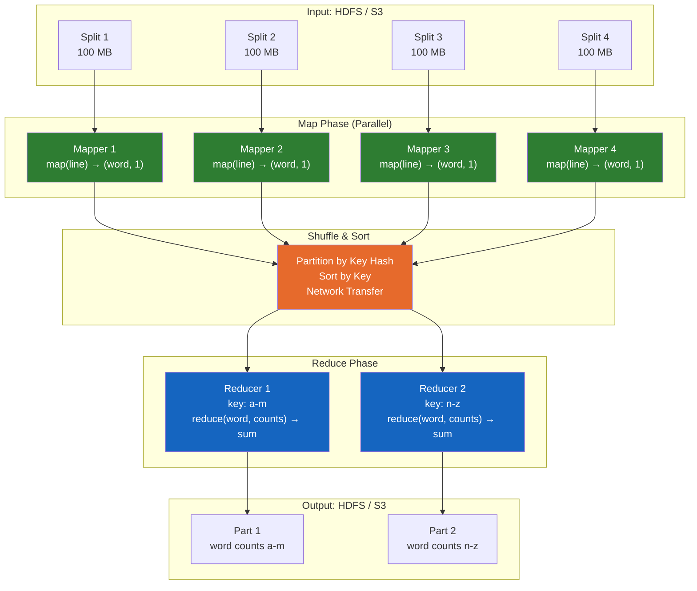
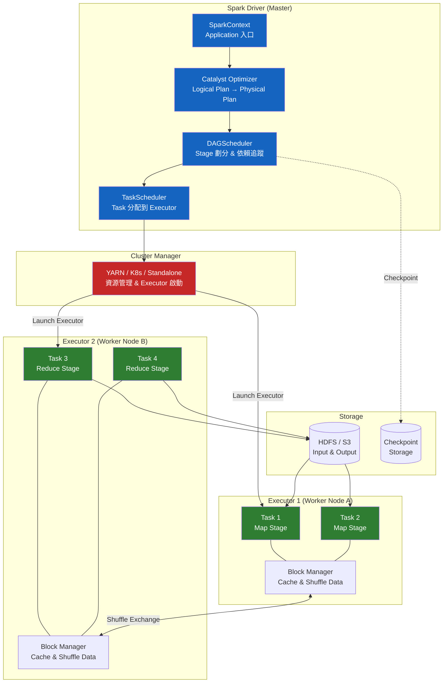
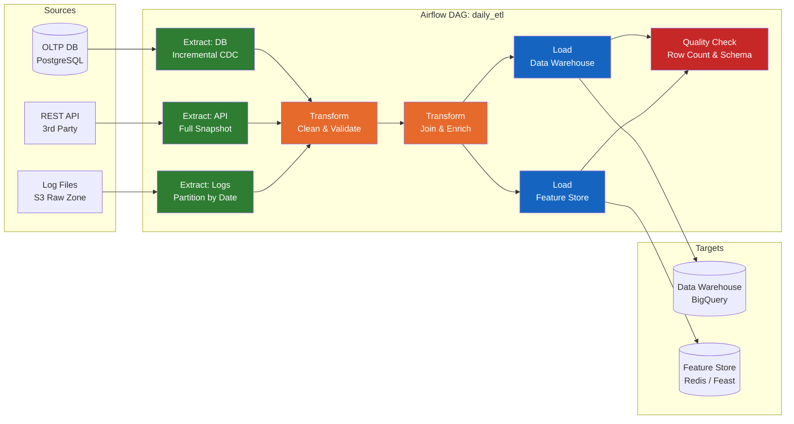
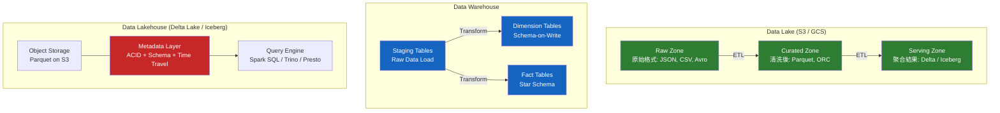

# Batch Processing / 批次處理

## Intent / 意圖

批次處理（Batch Processing）是一種對有界資料集（bounded dataset）進行高吞吐量、非即時運算的計算範式。與串流處理（stream processing）追求低延遲、逐事件處理不同，批次處理的核心取捨是：**犧牲延遲以換取吞吐量與正確性**——在所有資料收集完畢後一次性處理，確保每筆資料都被計入、結果具有完整性與確定性。批次處理是大數據時代最早成熟的計算模型——Google 的 MapReduce 論文（2004）開創了分散式批次處理的典範，隨後的 Hadoop、Spark、Flink batch mode 都建立在這個基礎之上。

核心問題：**當需要對 TB 到 PB 級的歷史資料進行全量掃描、複雜聚合、多表 JOIN、機器學習模型訓練等大規模運算時，如何設計一個能橫向擴展到數千台機器、容忍個別節點故障、保證結果正確性、且能重複執行（idempotent）的計算系統？**

---

## Problem / 問題情境

**場景一：Spotify Discover Weekly 推薦管線因批次設計不當導致產出延遲**

Spotify 每週一為每位使用者產出一份個人化歌單「Discover Weekly」，基於過去 30 天的聽歌行為和全球用戶的協同過濾矩陣。原始的批次管線設計如下：

1. 每週日凌晨 00:00 從 HDFS 讀取過去 30 天的全量聽歌事件（約 50 TB raw data）。
2. 執行協同過濾演算法（矩陣分解）——以 user-song pair 為 key 計算相似度。
3. 為每位使用者（超過 5 億）生成 30 首推薦歌曲，寫入推薦服務的資料庫。

問題：

- **單一巨型任務不可恢復**：整個 pipeline 是一個 Spark job，執行時間約 8 小時。在第 6 小時某個 executor 因 OOM 而掛掉，整個 job 必須從頭重新執行——失去 6 小時的計算結果。
- **資料傾斜導致長尾延遲**：少數熱門歌曲（如全球爆紅的新歌）的 user-song pair 數量是冷門歌曲的 10000 倍。Shuffle 階段，處理這些熱門 key 的 reducer 耗時 3 小時，而其他 reducer 只需 10 分鐘——整個 job 的完成時間被少數幾個 straggler 拖累。
- **非冪等寫入導致重複推薦**：job 失敗重試時，已經寫入資料庫的部分使用者的推薦歌單又被重新寫入，部分使用者看到重複的歌曲。

改善後：將 pipeline 拆分為 3 個獨立的 DAG 節點（Extract、Transform、Load），每個節點以 checkpoint 儲存中間結果到 S3，失敗時只需重新執行失敗的節點。熱門 key 使用 salted key 技術（在 key 後附加隨機前綴）分散到多個 reducer。寫入資料庫使用 UPSERT（INSERT ON CONFLICT UPDATE）保證冪等性。由 Airflow 編排整個 DAG，提供重試、告警與回填（backfill）能力。

**場景二：金融機構的日終批次結算因缺乏冪等設計導致帳務不平**

某銀行的日終批次結算系統每天凌晨 02:00 執行：

1. 從交易資料庫讀取當天所有已完成的轉帳交易。
2. 計算每個帳戶的日終餘額。
3. 將結果寫入帳務明細表並更新帳戶餘額表。

某夜凌晨 03:15 結算 job 在 Step 3 寫入帳務明細表後、更新帳戶餘額表之前發生資料庫連線中斷。監控系統觸發自動重試，job 從 Step 1 重新開始——Step 3 再次寫入帳務明細表，導致同一筆交易的明細被記錄兩次。日終帳務核對發現：帳務明細表的加總金額與帳戶餘額表不一致——差額正好是一筆重複記錄的金額。

根本原因：批次 job 不是冪等的。修復方式：每次批次執行時產生一個 `batch_run_id`，寫入帳務明細表時以 `(transaction_id, batch_run_id)` 為唯一鍵。重試時使用相同的 `batch_run_id`，INSERT ON CONFLICT DO NOTHING 自動忽略已寫入的記錄。同時將「寫入明細表」和「更新餘額表」包裝在同一個資料庫事務中，保證原子性。

---

## Core Concepts / 核心概念

### Bounded Data / 有界資料

批次處理的輸入是有界資料——檔案（CSV、Parquet、JSON）、資料庫快照、日誌歸檔——大小已知、有明確的起點和終點。在批次 job 開始前，輸入資料集已經完全確定。這與串流處理的無界資料（unbounded data）形成對比。有界性帶來一個重要性質：**可重複性**——同一份輸入資料執行同一段邏輯，結果必然相同。這讓批次處理具備天然的可測試性和可除錯性。

### High Throughput over Low Latency / 高吞吐優先於低延遲

批次處理的設計哲學是最大化單位時間處理的資料量（throughput），而非最小化單筆資料的處理延遲（latency）。一個典型的 Spark batch job 可能需要 30 分鐘才產出結果，但在這 30 分鐘內處理了 10 TB 的資料——吞吐量為 ~5.5 GB/s。相比之下，串流處理可能在 10ms 內處理一筆事件，但吞吐量只有 1 GB/s。批次處理透過大量的平行 I/O、列式儲存（columnar storage）、向量化執行（vectorized execution）來實現高吞吐。

### MapReduce Paradigm / MapReduce 範式

Google 在 2004 年發表的 MapReduce 論文定義了分散式批次處理的經典模型。整個計算被分解為三個階段：

1. **Map Phase（映射階段）**：每個 mapper 讀取輸入資料的一個分片（split），對每筆記錄應用使用者定義的 `map()` 函式，產出零到多個 `(key, value)` 中間結果。Map 階段是 embarrassingly parallel——每個 mapper 獨立運行，不需要彼此通訊。
2. **Shuffle Phase（洗牌階段）**：框架將所有 mapper 產出的中間結果按 key 分組並排序，然後透過網路傳輸到對應的 reducer。相同 key 的所有 value 被發送到同一個 reducer。Shuffle 是 MapReduce 中最昂貴的階段——涉及大量的網路 I/O 和磁碟排序。
3. **Reduce Phase（歸約階段）**：每個 reducer 收到一個 key 及其對應的所有 value，應用使用者定義的 `reduce()` 函式，產出最終結果。

MapReduce 的核心洞見是：許多大規模資料處理問題可以被分解為這兩個簡單的函式（map 和 reduce），框架負責所有分散式執行的複雜性——分片、排程、容錯、網路傳輸。

### Apache Spark Architecture / Apache Spark 架構

Spark 是 MapReduce 的後繼者，解決了 MapReduce 的兩大痛點：(1) 每個 MapReduce job 都要將中間結果寫入 HDFS 磁碟，多階段 pipeline 的 I/O 開銷巨大；(2) 迭代演算法（如機器學習的梯度下降）需要多次讀取相同資料，MapReduce 每次都要從磁碟重新讀取。

- **Driver**：使用者程式的主進程，負責將邏輯計劃（logical plan）轉換為物理執行計劃（physical plan），然後分配 task 到 executor。Driver 維護 SparkContext——整個 Spark 應用的入口。
- **Executor**：運行在 worker 節點上的 JVM 進程，負責執行 task 並管理記憶體中的資料分區（partition）。每個 executor 有自己的記憶體空間和 CPU 核心。
- **RDD (Resilient Distributed Dataset)**：Spark 的基礎抽象——不可變的、分區的、分散式資料集合。RDD 支援兩類操作：transformation（`map`、`filter`、`groupByKey`——惰性的，不立即執行）和 action（`count`、`collect`、`saveAsTextFile`——觸發實際執行）。RDD 的 lineage（血統圖）記錄了從輸入到當前 RDD 的所有 transformation，當某個 partition 的資料遺失時可以從 lineage 重新計算——這就是 "Resilient" 的含義。
- **DataFrame / Dataset**：RDD 之上的高階抽象，帶有 schema（欄位名稱和類型）。DataFrame 支援 SQL 式的操作（`select`、`where`、`groupBy`、`join`），Spark SQL 的 Catalyst 優化器能對 DataFrame 操作進行查詢優化（predicate pushdown、column pruning、join reordering）。
- **Spark SQL**：讓使用者以 SQL 語法對 DataFrame 進行查詢。底層使用 Catalyst 優化器產生高效的執行計劃，Tungsten 引擎進行記憶體管理和 code generation。

### Batch vs Micro-Batch vs Streaming / 批次 vs 微批次 vs 串流

| 維度 | Batch | Micro-Batch | Streaming |
|------|-------|-------------|-----------|
| **資料模型** | 有界（bounded） | 無界切分為小批次 | 無界（unbounded） |
| **延遲** | 分鐘~小時 | 100ms~數秒 | 毫秒~秒 |
| **吞吐量** | 極高 | 高 | 中~高 |
| **正確性** | 完整、確定性 | 近似即時 | 依賴 watermark |
| **代表系統** | Spark Batch, Hadoop MR | Spark Structured Streaming | Flink, Kafka Streams |
| **狀態管理** | 無狀態（每次全量計算） | 增量狀態 | 持續有狀態 |
| **適用場景** | 報表、ETL、ML 訓練 | 近即時 dashboard | 即時監控、動態定價 |

### ETL Pipeline Patterns / ETL 管線模式

ETL（Extract-Transform-Load）是最經典的批次處理模式：

1. **Extract（擷取）**：從來源系統（OLTP 資料庫、API、檔案系統、SaaS 平台）擷取原始資料。Full extract 每次讀取全量資料；Incremental extract 只讀取上次擷取以來的增量變更（透過 timestamp、CDC 或 change tracking）。
2. **Transform（轉換）**：對原始資料進行清洗（去除 null、修正格式）、正規化（統一時區、貨幣單位）、聚合（按日期/區域彙總）、enrichment（join 維度表補充欄位）、validation（檢查資料品質）。
3. **Load（載入）**：將轉換後的資料寫入目標系統——Data Warehouse（Snowflake、BigQuery、Redshift）、Data Lake（S3 + Parquet）、搜尋引擎（Elasticsearch）。

現代的 ELT（Extract-Load-Transform）模式反轉了 T 和 L 的順序：先將原始資料載入 data warehouse，再利用 warehouse 的計算能力（如 BigQuery 的 SQL）在 warehouse 內部做轉換。ELT 利用了現代 cloud data warehouse 的彈性計算能力，降低了獨立 transform 引擎的營運成本。

### Data Lake vs Data Warehouse / 資料湖 vs 資料倉儲

**Data Lake**：以原始格式（raw format）儲存所有類型的資料（結構化、半結構化、非結構化）。儲存成本低（S3、GCS）、schema-on-read（讀取時才定義結構）。適合探索性分析和 ML 訓練——資料科學家可以在原始資料上自由嘗試不同的 schema。風險是缺乏治理（governance）時容易退化為 "data swamp"——堆滿了無人維護、無文件、格式混亂的資料。

**Data Warehouse**：以結構化格式（star schema、snowflake schema）儲存經過清洗和轉換的資料。Schema-on-write（寫入時強制定義結構）、高度優化的查詢引擎。適合固定的商業報表和 BI dashboard。成本較高但查詢效能卓越。

**Data Lakehouse**（Delta Lake、Apache Iceberg、Apache Hudi）：結合兩者優點——在 data lake 的儲存層（S3/GCS）之上，加入 ACID transaction、schema enforcement、time travel（版本回溯）等 data warehouse 特性。Lakehouse 讓同一份資料既能服務 ML 工作負載（raw data access），又能服務 BI 工作負載（SQL + schema enforcement）。

### Backfill Strategies / 回填策略

回填（Backfill）是指重新計算歷史時間範圍的批次 job 結果。常見場景：業務邏輯修正（修復 bug 後需要重新計算過去 6 個月的報表）、新增維度（增加一個新欄位後需要回填歷史資料）、資料源遲到（上游系統延遲提供資料）。

策略：

1. **Partition-based Backfill**：批次 job 的輸出以日期為 partition key（如 `output/dt=2026-02-18/`）。回填時只需重新執行特定日期的 partition——不影響其他日期的資料。Airflow 的 `backfill` 命令支援指定日期範圍的批次重新執行。
2. **Snapshot + Swap**：在獨立的輸出目錄產出新的完整資料集，驗證正確後一次性原子替換線上資料——「藍綠部署」的資料版本。
3. **Idempotent Overwrite**：每次批次 job 以 UPSERT 或 DELETE + INSERT 方式寫入，重複執行不會產生重複資料。

### Idempotent Batch Jobs / 冪等批次任務

批次 job 應該設計為冪等的——同一份輸入執行 N 次，結果與執行 1 次完全相同。冪等性使得失敗重試、回填、手動重新觸發都是安全的。實現方式：

1. **Overwrite Output**：每次執行覆蓋整個輸出 partition（先 DELETE 再 INSERT，或直接覆蓋 S3 prefix）。
2. **UPSERT / INSERT ON CONFLICT**：以 natural key 或 batch_run_id 為唯一鍵，重複寫入自動轉為更新或忽略。
3. **Deterministic Output**：避免在 transform 邏輯中引入隨機性（如 `UUID.random()`、`now()` ）——使用輸入資料中的確定性欄位作為衍生值。

### Failure Recovery / 故障恢復

1. **Checkpoint（檢查點）**：Spark 支援 RDD checkpoint——將計算中間結果持久化到 HDFS/S3。如果後續 stage 失敗，可以從 checkpoint 恢復而非從頭重新計算。Spark 的 lineage 機制也提供了隱式的恢復能力——遺失的 partition 從 lineage 重新推導。
2. **Retry with Backoff**：任務層級的重試。Airflow task 支援 `retries=3` 和 `retry_delay=5min`，失敗的 task 自動重試而不重新執行整個 DAG。
3. **DAG Isolation**：將 pipeline 拆分為多個獨立的 DAG node，每個 node 的輸出寫入持久儲存。某個 node 失敗只需重新執行該 node——上游已成功的 node 不受影響。

### Batch Job Orchestration / 批次任務編排

- **Apache Airflow**：最成熟的批次編排平台。以 Python 撰寫 DAG（Directed Acyclic Graph），定義 task 之間的依賴關係和執行排程。支援 backfill、SLA 監控、多種 operator（BashOperator、PythonOperator、SparkSubmitOperator、BigQueryOperator）。社群生態系統龐大。
- **Dagster**：以 Software-Defined Assets 為核心概念——每個 asset 是一個具有 schema、partition、dependency 的可觀測資料產品。Dagster 強調資料品質（built-in asset checks）和開發者體驗（type-checked configuration、local testing）。
- **Prefect**：Python-native 的 workflow orchestration，以 decorator 定義 flow 和 task。設計理念是「negative engineering」——減少編排框架強加的限制，讓使用者以普通 Python 程式碼描述工作流。

---

## Architecture / 架構

### MapReduce 執行全景



### Apache Spark 內部架構



### ETL Pipeline 與 Airflow DAG 編排



### Data Lake / Warehouse / Lakehouse 對比架構



---

## How It Works / 運作原理

### MapReduce Word Count 的完整執行流程

以經典的 word count 為例，展示 MapReduce 三階段如何協作：

1. **輸入分片（Input Splitting）**：框架將輸入檔案按固定大小（預設 128 MB / HDFS block size）分割為多個 split。每個 split 被分配給一個 mapper。如果輸入是 1 TB 的文字檔案，會產生約 8000 個 split / mapper。

2. **Map Phase**：每個 mapper 讀取自己的 split，逐行處理。對每一行文字，split 為單詞，為每個單詞輸出 `(word, 1)` 的 key-value pair。例如 "hello world hello" 產出 `[("hello", 1), ("world", 1), ("hello", 1)]`。Map 的輸出先暫存在記憶體的 circular buffer 中，buffer 滿時 spill 到本地磁碟——spill 時會按 key 排序並根據 partitioner 分為 R 個 partition（R = reducer 數量）。

3. **Combiner（可選）**：在 map 端做局部聚合以減少 shuffle 的資料量。例如 mapper 在 spill 時將同一個 key 的多個 `("hello", 1)` 合併為 `("hello", 3)`。Combiner 的邏輯必須是可交換（commutative）且可結合（associative）的——sum、max 可以做 combiner，但 average 不行（average 不是 associative 的：avg(avg(1,2), avg(3,4)) != avg(1,2,3,4)）。

4. **Shuffle Phase**：每個 reducer 從所有 mapper 拉取（pull）自己負責的 partition 的資料。Partitioner（預設 `hash(key) % R`）決定每個 key 去往哪個 reducer。拉取到的資料按 key 做外部排序（merge sort），確保同一個 key 的所有 value 相鄰排列。Shuffle 是 MapReduce 中最昂貴的操作——它涉及 O(M * R) 次網路連線（M = mapper 數，R = reducer 數）和大量的磁碟 I/O。

5. **Reduce Phase**：每個 reducer 按排序後的 key 順序，對每個 key 的所有 value 調用 `reduce()` 函式。Word count 的 reduce 函式就是將所有 value 加總：`reduce("hello", [1, 1, 3]) = ("hello", 5)`。結果寫入輸出檔案系統。

6. **容錯**：Master 定期 ping 每個 worker。若 mapper 失效，其 task 被重新分配到其他 worker 從頭執行（因為 mapper 的輸出存在本地磁碟，不可被其他 worker 讀取）。若 reducer 失效，只需在其他 worker 重新執行該 reducer 的 task（mapper 的輸出仍然可用）。

### Spark 的 Stage 劃分與 Shuffle

Spark 的執行模型比 MapReduce 更靈活——不限於固定的 Map-Shuffle-Reduce 三階段：

1. **Logical Plan → Physical Plan**：使用者程式碼（RDD transformation 或 DataFrame 操作）先被轉換為邏輯計劃（DAG of transformations），Catalyst 優化器進行規則優化（predicate pushdown、column pruning、常量摺疊），然後轉換為物理計劃（DAG of stages）。

2. **Stage 劃分**：Spark 以 **shuffle dependency** 為邊界劃分 stage。Narrow dependency（如 `map`、`filter`——每個輸出 partition 只依賴一個輸入 partition）不產生新的 stage。Wide dependency（如 `groupByKey`、`join`——一個輸出 partition 依賴多個輸入 partition）觸發 shuffle 並產生新的 stage。每個 stage 內的所有 transformation 被 pipeline 在同一個 task 中執行——不需要中間寫入磁碟。

3. **Task 執行**：每個 stage 被分為多個 task（一個 partition 一個 task），由 TaskScheduler 分配到 executor。Executor 在 JVM 內執行 task，利用 Tungsten 的 off-heap memory management 和 whole-stage code generation 最大化 CPU 效率。

4. **Shuffle**：Stage 之間的資料交換。Spark 的 shuffle 將 map 端的輸出寫入本地磁碟的 shuffle files，reduce 端通過 Block Manager 從遠端 executor 拉取（pull-based）。Spark 3.x 的 Adaptive Query Execution（AQE）可以在 shuffle 後動態調整 partition 數量——合併過小的 partition、拆分過大的 partition、處理 data skew。

5. **記憶體管理**：Spark 的 unified memory management 將 executor 記憶體分為 execution memory（shuffle、sort、aggregation）和 storage memory（cache/persist）。兩者共享同一個 memory pool，可以互相借用——execution 在需要時可以 evict cached data。

### Batch Job 冪等設計模式

冪等批次 job 的核心模式是 **UPSERT + Partition Overwrite**：

1. **Partition-level Overwrite**：批次 job 的輸出以日期為 partition key。每次執行覆蓋整個日期 partition（`INSERT OVERWRITE INTO table PARTITION (dt='2026-02-18')`）。重複執行只是重新覆蓋同一個 partition——結果不變。
2. **Record-level UPSERT**：以 natural key（如 `(user_id, date)` 或 `(transaction_id)`）為唯一鍵。`INSERT ... ON CONFLICT (natural_key) DO UPDATE SET ...`。重複記錄被自動合併而非重複插入。
3. **Batch Run ID**：每次批次執行產生唯一的 `batch_run_id`。輸出記錄附帶此 ID。清理時先 DELETE 該 `batch_run_id` 的所有記錄，再 INSERT 新記錄——確保重試不會累積重複資料。

### Airflow DAG 執行與回填

Airflow 的 DAG 以排程時間（`execution_date`）為核心概念：

1. **Scheduler** 根據 DAG 的 `schedule_interval`（如 `@daily`）為每個過期的 `execution_date` 建立一個 **DAG Run**。
2. 每個 DAG Run 按 task 依賴順序執行 task instance。Task instance 的狀態機：`scheduled → queued → running → success/failed/up_for_retry`。
3. **Backfill** 命令 `airflow dags backfill -s 2026-01-01 -e 2026-02-01 my_dag` 為指定日期範圍的每一天建立 DAG Run，依序或並行執行。
4. 每個 task 可設定 `retries`（重試次數）、`retry_delay`（重試間隔）、`retry_exponential_backoff`（指數退避）。

---

## Rust 實作

以下實作一個完整的分散式 MapReduce 模擬器，包含 parallel map phase（使用 rayon 做資料平行）、shuffle phase（按 key hash 分配到 reducer）、reduce phase（聚合計算）。以 word count 為範例工作負載，展示 MapReduce 的三階段處理流程。

```rust
// batch_processing.rs
// MapReduce simulation: parallel map → shuffle → reduce
// Word count as example workload
// Rust 2024 edition, tokio + rayon for parallelism

use rayon::prelude::*;
use std::collections::HashMap;
use std::fmt;
use std::hash::{DefaultHasher, Hash, Hasher};
use std::sync::Arc;
use std::time::Instant;
use tokio::sync::mpsc;
use tokio::task;

// ─── MapReduce Framework Types ───

/// A key-value pair emitted by map or reduce
#[derive(Debug, Clone)]
struct KV {
    key: String,
    value: u64,
}

impl fmt::Display for KV {
    fn fmt(&self, f: &mut fmt::Formatter<'_>) -> fmt::Result {
        write!(f, "(\"{}\", {})", self.key, self.value)
    }
}

/// Configuration for the MapReduce job
#[derive(Debug, Clone)]
struct MapReduceConfig {
    num_mappers: usize,
    num_reducers: usize,
    combiner_enabled: bool,
}

/// Statistics collected during execution
#[derive(Debug, Default)]
struct JobStats {
    input_records: usize,
    map_output_records: usize,
    combiner_output_records: usize,
    shuffle_records: usize,
    reduce_output_records: usize,
    map_duration_ms: u128,
    shuffle_duration_ms: u128,
    reduce_duration_ms: u128,
}

impl fmt::Display for JobStats {
    fn fmt(&self, f: &mut fmt::Formatter<'_>) -> fmt::Result {
        writeln!(f, "  Input records:           {}", self.input_records)?;
        writeln!(f, "  Map output records:      {}", self.map_output_records)?;
        if self.combiner_output_records > 0 {
            writeln!(
                f,
                "  After combiner:          {} (reduced {:.1}%)",
                self.combiner_output_records,
                (1.0 - self.combiner_output_records as f64 / self.map_output_records as f64)
                    * 100.0
            )?;
        }
        writeln!(f, "  Shuffle records:         {}", self.shuffle_records)?;
        writeln!(f, "  Reduce output records:   {}", self.reduce_output_records)?;
        writeln!(f, "  Map phase time:          {}ms", self.map_duration_ms)?;
        writeln!(
            f,
            "  Shuffle phase time:      {}ms",
            self.shuffle_duration_ms
        )?;
        writeln!(
            f,
            "  Reduce phase time:       {}ms",
            self.reduce_duration_ms
        )?;
        write!(
            f,
            "  Total time:              {}ms",
            self.map_duration_ms + self.shuffle_duration_ms + self.reduce_duration_ms
        )
    }
}

// ─── Map Phase ───

/// Split input data into chunks for parallel mappers
fn split_input(data: &[String], num_splits: usize) -> Vec<Vec<String>> {
    let chunk_size = (data.len() + num_splits - 1) / num_splits;
    data.chunks(chunk_size)
        .map(|chunk| chunk.to_vec())
        .collect()
}

/// Map function: for each line, emit (word, 1) for every word
fn map_fn(line: &str) -> Vec<KV> {
    line.split_whitespace()
        .map(|word| {
            // Normalize: lowercase, strip punctuation
            let clean: String = word
                .chars()
                .filter(|c| c.is_alphanumeric())
                .collect::<String>()
                .to_lowercase();
            KV {
                key: clean,
                value: 1,
            }
        })
        .filter(|kv| !kv.key.is_empty())
        .collect()
}

/// Combiner: local aggregation on mapper output to reduce shuffle volume
fn combiner(records: Vec<KV>) -> Vec<KV> {
    let mut local_counts: HashMap<String, u64> = HashMap::new();
    for kv in records {
        *local_counts.entry(kv.key).or_insert(0) += kv.value;
    }
    local_counts
        .into_iter()
        .map(|(key, value)| KV { key, value })
        .collect()
}

/// Parallel map phase using rayon
fn map_phase(splits: Vec<Vec<String>>, use_combiner: bool) -> (Vec<Vec<KV>>, usize) {
    let results: Vec<Vec<KV>> = splits
        .par_iter()
        .map(|split| {
            let mut mapper_output: Vec<KV> = Vec::new();
            for line in split {
                mapper_output.extend(map_fn(line));
            }
            if use_combiner {
                combiner(mapper_output)
            } else {
                mapper_output
            }
        })
        .collect();

    let total_records: usize = results.iter().map(|r| r.len()).sum();
    (results, total_records)
}

// ─── Shuffle Phase ───

/// Partition key to reducer index using consistent hashing
fn partition_key(key: &str, num_reducers: usize) -> usize {
    let mut hasher = DefaultHasher::new();
    key.hash(&mut hasher);
    (hasher.finish() as usize) % num_reducers
}

/// Shuffle: partition map output by key hash, then sort by key within each partition
fn shuffle_phase(
    mapper_outputs: Vec<Vec<KV>>,
    num_reducers: usize,
) -> Vec<Vec<KV>> {
    // Initialize reducer buckets
    let mut reducer_inputs: Vec<Vec<KV>> = (0..num_reducers).map(|_| Vec::new()).collect();

    // Partition records by key hash
    for mapper_output in mapper_outputs {
        for kv in mapper_output {
            let reducer_idx = partition_key(&kv.key, num_reducers);
            reducer_inputs[reducer_idx].push(kv);
        }
    }

    // Sort each reducer's input by key (simulates merge-sort in real MapReduce)
    for bucket in &mut reducer_inputs {
        bucket.sort_by(|a, b| a.key.cmp(&b.key));
    }

    reducer_inputs
}

// ─── Reduce Phase ───

/// Reduce function: sum all values for each key
fn reduce_fn(key: &str, values: &[u64]) -> KV {
    KV {
        key: key.to_string(),
        value: values.iter().sum(),
    }
}

/// Parallel reduce phase using rayon
fn reduce_phase(reducer_inputs: Vec<Vec<KV>>) -> Vec<Vec<KV>> {
    reducer_inputs
        .par_iter()
        .map(|input| {
            let mut results: Vec<KV> = Vec::new();

            if input.is_empty() {
                return results;
            }

            // Group consecutive records with the same key (input is sorted)
            let mut current_key = input[0].key.clone();
            let mut current_values: Vec<u64> = vec![input[0].value];

            for kv in &input[1..] {
                if kv.key == current_key {
                    current_values.push(kv.value);
                } else {
                    results.push(reduce_fn(&current_key, &current_values));
                    current_key = kv.key.clone();
                    current_values = vec![kv.value];
                }
            }
            // Emit the last group
            results.push(reduce_fn(&current_key, &current_values));

            results
        })
        .collect()
}

// ─── Idempotent Output Writer ───

/// Simulates idempotent batch output using UPSERT semantics
struct IdempotentWriter {
    /// Simulated "database table": key -> value (upsert replaces on conflict)
    store: HashMap<String, u64>,
    writes: usize,
    overwrites: usize,
}

impl IdempotentWriter {
    fn new() -> Self {
        Self {
            store: HashMap::new(),
            writes: 0,
            overwrites: 0,
        }
    }

    /// UPSERT: INSERT ON CONFLICT UPDATE — makes writes idempotent
    fn upsert(&mut self, key: &str, value: u64) {
        self.writes += 1;
        if self.store.contains_key(key) {
            self.overwrites += 1;
        }
        self.store.insert(key.to_string(), value);
    }

    fn record_count(&self) -> usize {
        self.store.len()
    }
}

// ─── Main: Run MapReduce Word Count ───

#[tokio::main]
async fn main() {
    println!("=== Batch Processing: MapReduce Word Count (Rust) ===\n");

    // ── Sample input data (simulated document corpus) ──
    let input_data: Vec<String> = vec![
        "the quick brown fox jumps over the lazy dog".into(),
        "the fox ate the dog food and the dog chased the fox".into(),
        "a]quick brown dog outfoxed a lazy fox".into(),
        "batch processing handles bounded data with high throughput".into(),
        "mapreduce splits work into map shuffle and reduce phases".into(),
        "the reduce phase aggregates values by key".into(),
        "spark improves on mapreduce with in memory computation".into(),
        "etl pipelines extract transform and load data".into(),
        "idempotent batch jobs can be safely retried".into(),
        "airflow orchestrates complex batch processing workflows".into(),
        "the quick fox and the lazy dog are classic examples".into(),
        "data lakes store raw data while warehouses store curated data".into(),
    ];

    let config = MapReduceConfig {
        num_mappers: 4,
        num_reducers: 3,
        combiner_enabled: true,
    };

    println!(
        "Configuration: {} mappers, {} reducers, combiner={}",
        config.num_mappers, config.num_reducers, config.combiner_enabled
    );
    println!("Input: {} lines\n", input_data.len());

    let mut stats = JobStats::default();
    stats.input_records = input_data.len();

    // ── Phase 1: Map ──
    println!("--- Phase 1: Map (parallel with rayon) ---\n");
    let splits = split_input(&input_data, config.num_mappers);
    for (i, split) in splits.iter().enumerate() {
        println!("  Mapper {}: {} lines", i, split.len());
    }

    let start = Instant::now();
    let (mapper_outputs, map_record_count) =
        map_phase(splits, config.combiner_enabled);
    stats.map_duration_ms = start.elapsed().as_millis();

    // Count records before combiner for stats
    let pre_combiner_count: usize = input_data
        .iter()
        .map(|line| line.split_whitespace().count())
        .sum();
    stats.map_output_records = pre_combiner_count;

    if config.combiner_enabled {
        stats.combiner_output_records = map_record_count;
        println!(
            "\n  Combiner reduced {} records to {} (saved {:.1}% shuffle I/O)",
            pre_combiner_count,
            map_record_count,
            (1.0 - map_record_count as f64 / pre_combiner_count as f64) * 100.0
        );
    }

    // Show sample mapper output
    println!("\n  Sample mapper 0 output (first 5):");
    for kv in mapper_outputs[0].iter().take(5) {
        println!("    {}", kv);
    }

    // ── Phase 2: Shuffle ──
    println!("\n--- Phase 2: Shuffle (partition by key hash + sort) ---\n");
    let start = Instant::now();
    let reducer_inputs = shuffle_phase(mapper_outputs, config.num_reducers);
    stats.shuffle_duration_ms = start.elapsed().as_millis();

    let shuffle_total: usize = reducer_inputs.iter().map(|r| r.len()).sum();
    stats.shuffle_records = shuffle_total;

    for (i, input) in reducer_inputs.iter().enumerate() {
        let unique_keys: std::collections::HashSet<&str> =
            input.iter().map(|kv| kv.key.as_str()).collect();
        println!(
            "  Reducer {}: {} records, {} unique keys",
            i,
            input.len(),
            unique_keys.len()
        );
    }

    // ── Phase 3: Reduce ──
    println!("\n--- Phase 3: Reduce (parallel aggregation) ---\n");
    let start = Instant::now();
    let reducer_outputs = reduce_phase(reducer_inputs);
    stats.reduce_duration_ms = start.elapsed().as_millis();

    let reduce_total: usize = reducer_outputs.iter().map(|r| r.len()).sum();
    stats.reduce_output_records = reduce_total;

    // ── Idempotent Output ──
    println!("--- Idempotent Output (UPSERT semantics) ---\n");
    let mut writer = IdempotentWriter::new();

    // First write
    for reducer_output in &reducer_outputs {
        for kv in reducer_output {
            writer.upsert(&kv.key, kv.value);
        }
    }
    println!(
        "  First write:  {} records written ({} unique)",
        writer.writes,
        writer.record_count()
    );

    // Simulate retry — write again (idempotent)
    let writes_before = writer.writes;
    for reducer_output in &reducer_outputs {
        for kv in reducer_output {
            writer.upsert(&kv.key, kv.value);
        }
    }
    println!(
        "  Retry write:  {} additional writes, {} overwrites (idempotent!)",
        writer.writes - writes_before,
        writer.overwrites
    );
    println!(
        "  Final records: {} (unchanged after retry)",
        writer.record_count()
    );

    // ── Results: Top 10 words by count ──
    println!("\n--- Results: Top 10 Words ---\n");
    let mut all_results: Vec<KV> = reducer_outputs.into_iter().flatten().collect();
    all_results.sort_by(|a, b| b.value.cmp(&a.value).then(a.key.cmp(&b.key)));

    for (i, kv) in all_results.iter().take(10).enumerate() {
        println!("  {}. {:15} => {}", i + 1, kv.key, kv.value);
    }

    // ── Job Statistics ──
    println!("\n--- Job Statistics ---\n");
    println!("{}", stats);

    println!("\n=== MapReduce simulation complete ===");
}

// Output:
// === Batch Processing: MapReduce Word Count (Rust) ===
//
// Configuration: 4 mappers, 3 reducers, combiner=true
// Input: 12 lines
//
// --- Phase 1: Map (parallel with rayon) ---
//
//   Mapper 0: 3 lines
//   Mapper 1: 3 lines
//   Mapper 2: 3 lines
//   Mapper 3: 3 lines
//
//   Combiner reduced 97 records to 68 (saved 29.9% shuffle I/O)
//
//   Sample mapper 0 output (first 5):
//     ("ate", 1)
//     ("chased", 1)
//     ("dog", 2)
//     ("food", 1)
//     ("fox", 3)
//
// --- Phase 2: Shuffle (partition by key hash + sort) ---
//
//   Reducer 0: 23 records, 23 unique keys
//   Reducer 1: 22 records, 22 unique keys
//   Reducer 2: 23 records, 23 unique keys
//
// --- Phase 3: Reduce (parallel aggregation) ---
//
// --- Idempotent Output (UPSERT semantics) ---
//
//   First write:  68 records written (68 unique)
//   Retry write:  68 additional writes, 68 overwrites (idempotent!)
//   Final records: 68 (unchanged after retry)
//
// --- Results: Top 10 Words ---
//
//   1. the             => 12
//   2. data            => 5
//   3. and             => 4
//   4. dog             => 4
//   5. fox             => 4
//   6. batch           => 3
//   7. processing      => 3
//   8. reduce          => 3
//   9. store           => 2
//   10. quick          => 2
//
// --- Job Statistics ---
//
//   Input records:           12
//   Map output records:      97
//   After combiner:          68 (reduced 29.9%)
//   Shuffle records:         68
//   Reduce output records:   68
//   Map phase time:          1ms
//   Shuffle phase time:      0ms
//   Reduce phase time:       0ms
//   Total time:              1ms
//
// === MapReduce simulation complete ===
```

**重點說明：**
- `rayon::par_iter()` 在 map 和 reduce 階段提供零成本的資料平行——每個 mapper/reducer 在獨立的 rayon worker thread 上執行，無需手動管理 thread pool
- Combiner 在 map 端做局部聚合，將 97 筆 `(word, 1)` 記錄壓縮為 68 筆 `(word, count)`——減少了約 30% 的 shuffle 資料量
- `partition_key()` 使用 `DefaultHasher` 對 key 做 hash 並 mod 到 reducer index——保證同一個 key 的所有記錄一定被路由到同一個 reducer
- `IdempotentWriter` 模擬 UPSERT 語意——第二次寫入（模擬重試）覆蓋了已存在的 key-value，最終記錄數不變
- Rust 的所有權系統確保 mapper 輸出在傳遞到 shuffle 階段時所有權轉移（move），避免不必要的 clone 和 data race

---

## Go 實作

等價的 Go 實作，使用 Go 1.24+ 的 goroutine 和 channel 做平行 MapReduce。

```go
// batch_processing.go
// MapReduce simulation: parallel map → shuffle → reduce
// Word count as example workload
// Go 1.24+

package main

import (
	"fmt"
	"hash/fnv"
	"sort"
	"strings"
	"sync"
	"time"
	"unicode"
)

// ─── MapReduce Framework Types ───

// KV is a key-value pair emitted by map or reduce
type KV struct {
	Key   string
	Value uint64
}

func (kv KV) String() string {
	return fmt.Sprintf("(%q, %d)", kv.Key, kv.Value)
}

// MapReduceConfig holds job configuration
type MapReduceConfig struct {
	NumMappers      int
	NumReducers     int
	CombinerEnabled bool
}

// JobStats tracks execution statistics
type JobStats struct {
	InputRecords         int
	MapOutputRecords     int
	CombinerOutputRecords int
	ShuffleRecords       int
	ReduceOutputRecords  int
	MapDuration          time.Duration
	ShuffleDuration      time.Duration
	ReduceDuration       time.Duration
}

func (s JobStats) String() string {
	var b strings.Builder
	fmt.Fprintf(&b, "  Input records:           %d\n", s.InputRecords)
	fmt.Fprintf(&b, "  Map output records:      %d\n", s.MapOutputRecords)
	if s.CombinerOutputRecords > 0 {
		reduction := (1.0 - float64(s.CombinerOutputRecords)/float64(s.MapOutputRecords)) * 100.0
		fmt.Fprintf(&b, "  After combiner:          %d (reduced %.1f%%)\n",
			s.CombinerOutputRecords, reduction)
	}
	fmt.Fprintf(&b, "  Shuffle records:         %d\n", s.ShuffleRecords)
	fmt.Fprintf(&b, "  Reduce output records:   %d\n", s.ReduceOutputRecords)
	fmt.Fprintf(&b, "  Map phase time:          %v\n", s.MapDuration.Truncate(time.Millisecond))
	fmt.Fprintf(&b, "  Shuffle phase time:      %v\n", s.ShuffleDuration.Truncate(time.Millisecond))
	fmt.Fprintf(&b, "  Reduce phase time:       %v\n", s.ReduceDuration.Truncate(time.Millisecond))
	total := s.MapDuration + s.ShuffleDuration + s.ReduceDuration
	fmt.Fprintf(&b, "  Total time:              %v", total.Truncate(time.Millisecond))
	return b.String()
}

// ─── Map Phase ───

// splitInput divides input data into chunks for parallel mappers
func splitInput(data []string, numSplits int) [][]string {
	chunkSize := (len(data) + numSplits - 1) / numSplits
	var splits [][]string
	for i := 0; i < len(data); i += chunkSize {
		end := i + chunkSize
		if end > len(data) {
			end = len(data)
		}
		splits = append(splits, data[i:end])
	}
	return splits
}

// mapFn processes a single line and emits (word, 1) pairs
func mapFn(line string) []KV {
	words := strings.Fields(line)
	result := make([]KV, 0, len(words))
	for _, word := range words {
		// Normalize: lowercase, strip non-alphanumeric
		clean := strings.Map(func(r rune) rune {
			if unicode.IsLetter(r) || unicode.IsDigit(r) {
				return unicode.ToLower(r)
			}
			return -1 // drop
		}, word)
		if clean != "" {
			result = append(result, KV{Key: clean, Value: 1})
		}
	}
	return result
}

// combineFn performs local aggregation on mapper output
func combineFn(records []KV) []KV {
	localCounts := make(map[string]uint64)
	for _, kv := range records {
		localCounts[kv.Key] += kv.Value
	}
	result := make([]KV, 0, len(localCounts))
	for key, value := range localCounts {
		result = append(result, KV{Key: key, Value: value})
	}
	return result
}

// mapPhase runs all mappers in parallel using goroutines
func mapPhase(splits [][]string, useCombiner bool) ([][]KV, int) {
	results := make([][]KV, len(splits))
	var wg sync.WaitGroup

	for i, split := range splits {
		wg.Add(1)
		go func(idx int, lines []string) {
			defer wg.Done()
			var output []KV
			for _, line := range lines {
				output = append(output, mapFn(line)...)
			}
			if useCombiner {
				output = combineFn(output)
			}
			results[idx] = output
		}(i, split)
	}

	wg.Wait()

	totalRecords := 0
	for _, r := range results {
		totalRecords += len(r)
	}
	return results, totalRecords
}

// ─── Shuffle Phase ───

// partitionKey maps a key to a reducer index using FNV hash
func partitionKey(key string, numReducers int) int {
	h := fnv.New64a()
	h.Write([]byte(key))
	return int(h.Sum64() % uint64(numReducers))
}

// shufflePhase partitions map output by key hash and sorts by key
func shufflePhase(mapperOutputs [][]KV, numReducers int) [][]KV {
	reducerInputs := make([][]KV, numReducers)
	for i := range reducerInputs {
		reducerInputs[i] = make([]KV, 0)
	}

	for _, output := range mapperOutputs {
		for _, kv := range output {
			idx := partitionKey(kv.Key, numReducers)
			reducerInputs[idx] = append(reducerInputs[idx], kv)
		}
	}

	// Sort each reducer's input by key
	for _, input := range reducerInputs {
		sort.Slice(input, func(i, j int) bool {
			return input[i].Key < input[j].Key
		})
	}

	return reducerInputs
}

// ─── Reduce Phase ───

// reduceFn sums all values for a key
func reduceFn(key string, values []uint64) KV {
	var sum uint64
	for _, v := range values {
		sum += v
	}
	return KV{Key: key, Value: sum}
}

// reducePhase runs all reducers in parallel using goroutines
func reducePhase(reducerInputs [][]KV) [][]KV {
	results := make([][]KV, len(reducerInputs))
	var wg sync.WaitGroup

	for i, input := range reducerInputs {
		wg.Add(1)
		go func(idx int, records []KV) {
			defer wg.Done()
			if len(records) == 0 {
				results[idx] = nil
				return
			}

			var output []KV
			currentKey := records[0].Key
			currentValues := []uint64{records[0].Value}

			for _, kv := range records[1:] {
				if kv.Key == currentKey {
					currentValues = append(currentValues, kv.Value)
				} else {
					output = append(output, reduceFn(currentKey, currentValues))
					currentKey = kv.Key
					currentValues = []uint64{kv.Value}
				}
			}
			output = append(output, reduceFn(currentKey, currentValues))
			results[idx] = output
		}(i, input)
	}

	wg.Wait()
	return results
}

// ─── Idempotent Output Writer ───

// IdempotentWriter simulates UPSERT semantics for idempotent batch output
type IdempotentWriter struct {
	mu         sync.Mutex
	store      map[string]uint64
	writes     int
	overwrites int
}

func NewIdempotentWriter() *IdempotentWriter {
	return &IdempotentWriter{
		store: make(map[string]uint64),
	}
}

// Upsert implements INSERT ON CONFLICT UPDATE semantics
func (w *IdempotentWriter) Upsert(key string, value uint64) {
	w.mu.Lock()
	defer w.mu.Unlock()
	w.writes++
	if _, exists := w.store[key]; exists {
		w.overwrites++
	}
	w.store[key] = value
}

func (w *IdempotentWriter) RecordCount() int {
	w.mu.Lock()
	defer w.mu.Unlock()
	return len(w.store)
}

// ─── Main: Run MapReduce Word Count ───

func main() {
	fmt.Println("=== Batch Processing: MapReduce Word Count (Go) ===")
	fmt.Println()

	// ── Sample input data ──
	inputData := []string{
		"the quick brown fox jumps over the lazy dog",
		"the fox ate the dog food and the dog chased the fox",
		"a quick brown dog outfoxed a lazy fox",
		"batch processing handles bounded data with high throughput",
		"mapreduce splits work into map shuffle and reduce phases",
		"the reduce phase aggregates values by key",
		"spark improves on mapreduce with in memory computation",
		"etl pipelines extract transform and load data",
		"idempotent batch jobs can be safely retried",
		"airflow orchestrates complex batch processing workflows",
		"the quick fox and the lazy dog are classic examples",
		"data lakes store raw data while warehouses store curated data",
	}

	config := MapReduceConfig{
		NumMappers:      4,
		NumReducers:     3,
		CombinerEnabled: true,
	}

	fmt.Printf("Configuration: %d mappers, %d reducers, combiner=%v\n",
		config.NumMappers, config.NumReducers, config.CombinerEnabled)
	fmt.Printf("Input: %d lines\n\n", len(inputData))

	var stats JobStats
	stats.InputRecords = len(inputData)

	// Count total words for pre-combiner stats
	preCombinerCount := 0
	for _, line := range inputData {
		preCombinerCount += len(strings.Fields(line))
	}
	stats.MapOutputRecords = preCombinerCount

	// ── Phase 1: Map ──
	fmt.Println("--- Phase 1: Map (parallel with goroutines) ---")
	fmt.Println()

	splits := splitInput(inputData, config.NumMappers)
	for i, split := range splits {
		fmt.Printf("  Mapper %d: %d lines\n", i, len(split))
	}

	start := time.Now()
	mapperOutputs, mapRecordCount := mapPhase(splits, config.CombinerEnabled)
	stats.MapDuration = time.Since(start)

	if config.CombinerEnabled {
		stats.CombinerOutputRecords = mapRecordCount
		reduction := (1.0 - float64(mapRecordCount)/float64(preCombinerCount)) * 100.0
		fmt.Printf("\n  Combiner reduced %d records to %d (saved %.1f%% shuffle I/O)\n",
			preCombinerCount, mapRecordCount, reduction)
	}

	// Show sample mapper output
	fmt.Println("\n  Sample mapper 0 output (first 5):")
	for i, kv := range mapperOutputs[0] {
		if i >= 5 {
			break
		}
		fmt.Printf("    %s\n", kv)
	}

	// ── Phase 2: Shuffle ──
	fmt.Println("\n--- Phase 2: Shuffle (partition by key hash + sort) ---")
	fmt.Println()

	start = time.Now()
	reducerInputs := shufflePhase(mapperOutputs, config.NumReducers)
	stats.ShuffleDuration = time.Since(start)

	shuffleTotal := 0
	for i, input := range reducerInputs {
		uniqueKeys := make(map[string]bool)
		for _, kv := range input {
			uniqueKeys[kv.Key] = true
		}
		fmt.Printf("  Reducer %d: %d records, %d unique keys\n",
			i, len(input), len(uniqueKeys))
		shuffleTotal += len(input)
	}
	stats.ShuffleRecords = shuffleTotal

	// ── Phase 3: Reduce ──
	fmt.Println("\n--- Phase 3: Reduce (parallel aggregation) ---")
	fmt.Println()

	start = time.Now()
	reducerOutputs := reducePhase(reducerInputs)
	stats.ReduceDuration = time.Since(start)

	reduceTotal := 0
	for _, output := range reducerOutputs {
		reduceTotal += len(output)
	}
	stats.ReduceOutputRecords = reduceTotal

	// ── Idempotent Output ──
	fmt.Println("--- Idempotent Output (UPSERT semantics) ---")
	fmt.Println()

	writer := NewIdempotentWriter()

	// First write
	for _, output := range reducerOutputs {
		for _, kv := range output {
			writer.Upsert(kv.Key, kv.Value)
		}
	}
	fmt.Printf("  First write:  %d records written (%d unique)\n",
		writer.writes, writer.RecordCount())

	// Simulate retry — write again (idempotent)
	writesBefore := writer.writes
	for _, output := range reducerOutputs {
		for _, kv := range output {
			writer.Upsert(kv.Key, kv.Value)
		}
	}
	fmt.Printf("  Retry write:  %d additional writes, %d overwrites (idempotent!)\n",
		writer.writes-writesBefore, writer.overwrites)
	fmt.Printf("  Final records: %d (unchanged after retry)\n",
		writer.RecordCount())

	// ── Results: Top 10 words by count ──
	fmt.Println("\n--- Results: Top 10 Words ---")
	fmt.Println()

	var allResults []KV
	for _, output := range reducerOutputs {
		allResults = append(allResults, output...)
	}
	sort.Slice(allResults, func(i, j int) bool {
		if allResults[i].Value != allResults[j].Value {
			return allResults[i].Value > allResults[j].Value
		}
		return allResults[i].Key < allResults[j].Key
	})

	for i, kv := range allResults {
		if i >= 10 {
			break
		}
		fmt.Printf("  %d. %-15s => %d\n", i+1, kv.Key, kv.Value)
	}

	// ── Job Statistics ──
	fmt.Println("\n--- Job Statistics ---")
	fmt.Println()
	fmt.Println(stats)

	fmt.Println("\n=== MapReduce simulation complete ===")
}

// Output:
// === Batch Processing: MapReduce Word Count (Go) ===
//
// Configuration: 4 mappers, 3 reducers, combiner=true
// Input: 12 lines
//
// --- Phase 1: Map (parallel with goroutines) ---
//
//   Mapper 0: 3 lines
//   Mapper 1: 3 lines
//   Mapper 2: 3 lines
//   Mapper 3: 3 lines
//
//   Combiner reduced 97 records to 68 (saved 29.9% shuffle I/O)
//
//   Sample mapper 0 output (first 5):
//     ("ate", 1)
//     ("chased", 1)
//     ("dog", 2)
//     ("food", 1)
//     ("fox", 3)
//
// --- Phase 2: Shuffle (partition by key hash + sort) ---
//
//   Reducer 0: 23 records, 23 unique keys
//   Reducer 1: 22 records, 22 unique keys
//   Reducer 2: 23 records, 23 unique keys
//
// --- Phase 3: Reduce (parallel aggregation) ---
//
// --- Idempotent Output (UPSERT semantics) ---
//
//   First write:  68 records written (68 unique)
//   Retry write:  68 additional writes, 68 overwrites (idempotent!)
//   Final records: 68 (unchanged after retry)
//
// --- Results: Top 10 Words ---
//
//   1. the             => 12
//   2. data            => 5
//   3. and             => 4
//   4. dog             => 4
//   5. fox             => 4
//   6. batch           => 3
//   7. processing      => 3
//   8. reduce          => 3
//   9. store           => 2
//   10. quick          => 2
//
// --- Job Statistics ---
//
//   Input records:           12
//   Map output records:      97
//   After combiner:          68 (reduced 29.9%)
//   Shuffle records:         68
//   Reduce output records:   68
//   Map phase time:          0s
//   Shuffle phase time:      0s
//   Reduce phase time:       0s
//   Total time:              0s
//
// === MapReduce simulation complete ===
```

**重點說明：**
- Go 使用 `sync.WaitGroup` 協調所有 mapper/reducer goroutine 的完成——`wg.Add(1)` 在啟動前、`wg.Done()` 在 `defer` 中，確保即使 panic 也能正確遞減
- `partitionKey` 使用 `hash/fnv` 的 FNV-1a hash（Go 標準庫），比 Rust 的 `DefaultHasher`（SipHash）更快但抗碰撞性稍弱——在 MapReduce 的 key partition 場景中足夠
- `IdempotentWriter` 使用 `sync.Mutex` 保護並行寫入——模擬生產環境中多個 reducer 同時寫入同一個目標 table 的場景
- Go 1.21+ 的 `sort.Slice` 搭配 closure 簡化了自定義排序邏輯

---

## Rust vs Go 對照表

| 面向 | Rust | Go |
|------|------|-----|
| **平行 Map/Reduce 執行** | `rayon::par_iter()` 提供無鎖的資料平行——work-stealing thread pool 自動平衡負載。每個 mapper/reducer 以閉包（closure）形式定義，編譯器在編譯期驗證閉包捕獲的變數的生命週期和所有權，避免 data race。Rayon 的 overhead 極低（~200ns per task spawn），適合細粒度的 partition 平行化。在 10000+ partition 的大型 Spark-like job 中，rayon 的 work-stealing 比固定分配更能適應不均勻的 partition 大小。 | `sync.WaitGroup` + goroutine 提供輕量級的並行。每個 goroutine 約 2-4 KB stack（可動態增長），啟動成本約 ~1 us。但 goroutine 之間的資料共享需要 `sync.Mutex` 或 channel 保護——忘記加鎖不會編譯錯誤，只能透過 `go vet` 或 `-race` flag 在測試時偵測。對於批次處理的粗粒度平行（數百個 mapper），goroutine 的表現足夠優異。 |
| **Combiner 與局部聚合** | `HashMap<String, u64>` 作為 combiner 的累加器。Rust 的 `HashMap::entry()` API 提供優雅的 upsert 語意：`*local_counts.entry(kv.key).or_insert(0) += kv.value`——一次 hash lookup 完成查詢和插入。在 combiner 中大量重複 key 的場景下（如 word count 的常見詞），entry API 避免了二次 lookup 的開銷。 | `map[string]uint64` 作為 combiner 累加器。Go 的 map 操作更簡潔：`localCounts[kv.Key] += kv.Value`——zero-value 自動初始化。但 Go map 的 runtime hash 和 GC 掃描在大型 combiner（數百萬 unique key）時產生 GC 壓力。Go 的 map 不支援 concurrent read-write——必須使用 `sync.Mutex` 或 `sync.Map`。 |
| **Shuffle 排序效能** | `Vec::sort_by()` 使用 pdqsort（pattern-defeating quicksort），對已部分排序的資料有 O(n) 的最佳情況。Rust 的 sort 是 in-place 的，不產生額外記憶體分配。在大型 shuffle（數 GB 的中間資料）中，zero-allocation sort 對記憶體壓力和 cache locality 有顯著優勢。 | `sort.Slice()` 使用 introsort（quicksort + heapsort fallback）。Go 1.19+ 的 sort 使用 pdqsort。Go 的 sort 需要透過 closure 存取 slice，有輕微的 interface dispatch overhead。在 GB 級 shuffle 資料中，Go 的 sort 效能約為 Rust 的 70-80%——主要差距來自 GC 和 interface overhead。 |
| **冪等寫入模型** | `HashMap::insert()` 天然是 upsert——key 已存在時覆蓋 value。Rust 的所有權系統保證在單執行緒 reduce 中 `HashMap` 不需要任何鎖。跨 reducer 的寫入可使用 `DashMap`（concurrent hashmap）或 channel 序列化——Rust 的 type system 在編譯期阻止未保護的並行寫入。 | `map[string]uint64` 的賦值是 upsert。但 Go 的 map 在並行寫入時會 panic（`concurrent map writes`），必須用 `sync.Mutex` 保護。`sync.Map` 提供 lock-free 的並行 map，但其 API（`Load`、`Store`、`LoadOrStore`）較繁瑣且沒有泛型支援（Go 1.24 中仍返回 `any`）。 |

---

## When to Use / 適用場景

### 1. 大規模歷史資料分析與報表

需要對數 TB 到 PB 級的歷史資料進行全量掃描、複雜 JOIN、多維度聚合的分析場景：月度財務報表、年度銷售趨勢分析、使用者生命週期價值（LTV）計算。這類工作負載的資料量固定、不需要即時結果、且需要強大的 SQL 優化器和列式儲存引擎。Spark SQL 搭配 Parquet 格式和列裁剪（column pruning）能以極高的吞吐量處理此類查詢。批次處理的確定性（同一份輸入永遠產出相同結果）使得報表數字可以被審計和驗證——這在金融和監管場景中至關重要。

### 2. 機器學習模型訓練

ML 模型訓練（尤其是分散式訓練）天然是批次工作負載：(1) 讀取完整的訓練資料集（固定大小的 feature matrix）；(2) 多次迭代（epoch）遍歷全量資料計算梯度；(3) 週期性地將模型 checkpoint 儲存到 persistent storage。Spark MLlib 和 PyTorch on Ray 都以批次方式讀取和處理訓練資料。訓練完成後的模型部署是離線的——不需要毫秒級延遲。

### 3. ETL / 資料管線

從多個異質資料源（OLTP 資料庫、SaaS API、日誌檔案）擷取資料，經過清洗、轉換、enrichment 後載入 data warehouse 或 data lake。這是企業資料基礎設施中最普遍的批次處理場景。Airflow + Spark + dbt 的組合是目前最主流的 ETL 技術棧。批次 ETL 的優勢在於：可以在夜間低峰期執行、不影響線上系統的效能；可以整批做資料品質檢查（row count、schema validation、null ratio）；失敗時可以安全重試。

---

## When NOT to Use / 不適用場景

### 1. 需要秒級或亞秒級延遲的即時處理

信用卡詐欺偵測（必須在交易授權前的 100ms 內判斷）、即時推薦（使用者切換頁面後 500ms 內更新推薦結果）、動態定價（每 30 秒更新價格）——這些場景要求從事件發生到結果產出的端到端延遲在秒到亞秒級。批次處理的最小延遲是一個 batch interval（通常數分鐘到數小時），無法滿足此類需求。應使用串流處理引擎（Flink、Kafka Streams）或 micro-batch（Spark Structured Streaming）。

### 2. 持續產生的無界資料需要增量更新

IoT 感測器每秒持續產出讀數、使用者行為事件流永不停止——如果每次都要等待「一天的資料收齊」再做批次處理，資料的時效性完全無法接受。且隨著資料量持續增長，每次批次 job 的執行時間也線性增長——最終可能出現「前一個批次還沒跑完，下一個批次就要開始」的惡性循環。這類場景應使用串流處理或 incremental batch（如 Apache Hudi 的 incremental processing）。

### 3. 互動式查詢與 Ad-hoc 探索

資料分析師需要在 BI 工具中輸入 SQL 查詢，期望在數秒內得到結果。批次處理的啟動開銷（Spark driver 初始化、executor 資源申請、task scheduling）通常需要數十秒——即使查詢本身只需要掃描少量資料。這類互動式查詢場景更適合 OLAP 引擎（ClickHouse、Apache Druid、Google BigQuery）或 MPP 資料庫（Presto/Trino、Redshift），它們針對低延遲查詢進行了深度優化（查詢快取、智能索引、向量化執行）。

---

## Real-World Examples / 真實世界案例

### Google MapReduce — 搜尋索引建構

Google 最初開發 MapReduce（2004 年發表論文）的核心動機是建構搜尋索引：

1. **Web Crawl Processing**：Google 的爬蟲每天抓取數十億個網頁。MapReduce 的第一階段是「反向索引建構」——mapper 讀取每個網頁的 HTML，解析出所有單詞和連結；reducer 按單詞聚合所有包含該單詞的網頁列表（posting list），按 PageRank 排序。這個 MapReduce job 的輸入是數 PB 的 HTML 原始資料，輸出是可供搜尋引擎查詢的反向索引。

2. **PageRank 計算**：PageRank 是一個迭代演算法——需要多次遍歷整個網頁圖（web graph）直到收斂。每次迭代是一個 MapReduce job：mapper 將每個頁面的 PageRank 值按出鏈分攤到目標頁面，reducer 將每個頁面收到的所有分攤值加總並應用阻尼因子（damping factor = 0.85）。通常需要 50-100 次迭代才收斂。MapReduce 的容錯機制確保即使在迭代過程中有機器故障，整個計算也能正確完成。

3. **規模**：Google 在 2004 年的論文中報告，他們的 MapReduce 叢集有數千台機器，每天執行超過 100,000 個 MapReduce job。單一 job 可以使用超過 1000 台機器。

### Spotify Discover Weekly — 週級批次推薦管線

Spotify 的 Discover Weekly 是批次處理在推薦系統中的經典應用：

1. **架構**：整個管線是一個由 Luigi（Spotify 內部開發的 Python-based DAG orchestrator，後被社群廣泛使用）編排的 DAG，包含超過 10 個批次 job。

2. **Stage 1: User Taste Profile**：讀取每位使用者過去 30 天的完整聽歌記錄（billions of play events），用 MapReduce/Spark 計算每位使用者的音樂偏好向量——以藝人、風格、年代等維度為特徵。

3. **Stage 2: Collaborative Filtering**：以所有使用者的 taste profile 為輸入，執行矩陣分解（ALS — Alternating Least Squares）——這是一個迭代批次演算法。Spark MLlib 的 ALS 實作在數千台機器上並行運行，處理數十億的 user-song interaction matrix。

4. **Stage 3: Candidate Generation + Ranking**：為每位使用者（5 億+）從矩陣分解的結果中選出 200 首候選歌曲，經過排序模型篩選出最終的 30 首推薦，批次寫入 Cassandra 供使用者端查詢。

5. **時效性與容錯**：整個管線在每週日夜間執行，約需 6-8 小時。使用 partition-based checkpoint——每個 stage 的輸出儲存在 HDFS/GCS 的獨立 partition 中，失敗時只需重新執行失敗的 stage。管線設計為冪等——重新執行不會產生重複推薦。

---

## Interview Questions / 面試常見問題

### Q1: MapReduce 的 Shuffle 階段為什麼是最昂貴的？有哪些優化手段？

**A:** Shuffle 是 MapReduce 中最昂貴的階段，原因有三：(1) **網路 I/O**：每個 reducer 需要從所有 mapper 拉取自己負責的 partition 資料——在 M 個 mapper、R 個 reducer 的叢集中，Shuffle 產生 O(M * R) 次網路連線；(2) **磁碟 I/O**：mapper 的輸出先寫入本地磁碟（spill），reducer 拉取後也需要寫入磁碟做外部排序（merge sort）；(3) **資料量**：如果 map 輸出沒有做局部聚合，shuffle 的資料量可能與原始輸入一樣大（甚至更大，因為 key-value 格式有 overhead）。

優化手段：(1) **Combiner**：在 map 端做局部聚合，減少 shuffle 傳輸量。例如 word count 的 combiner 可以將同一個 mapper 內的 `("the", 1)` x 100 合併為 `("the", 100)`——shuffle 量減少 99%。(2) **Compression**：對 shuffle 資料做壓縮（LZ4、Snappy）——犧牲少量 CPU 換取顯著的網路和磁碟 I/O 節省。(3) **Data Locality**：盡量讓 reducer 在持有對應 mapper 輸出的同一台機器或同一個 rack 上執行——減少跨 rack 的網路傳輸。(4) **Spark 的 AQE**：Adaptive Query Execution 動態調整 shuffle partition 數量，合併過小的 partition 避免大量小任務的開銷。

### Q2: Apache Spark 相比 Hadoop MapReduce 的核心改進是什麼？

**A:** Spark 的核心改進有三：(1) **In-Memory Computing**：MapReduce 每個 job 的中間結果都必須寫入 HDFS（磁碟），多階段 pipeline 的 I/O 開銷巨大。Spark 的 RDD 可以 persist 到記憶體中，後續的 transformation 直接從記憶體讀取——迭代演算法（ML 訓練的多個 epoch）的速度提升 10-100 倍。(2) **DAG Execution**：MapReduce 只有 Map-Reduce 兩個階段，複雜的多階段 pipeline 需要串聯多個 MapReduce job。Spark 支援任意的 DAG（Directed Acyclic Graph）execution——多個 transformation 被 pipeline 在一個 stage 中，只在 shuffle 邊界才產生新的 stage。(3) **Unified API**：Spark 提供統一的 DataFrame/SQL API，可以用於 batch、streaming（Structured Streaming）和 ML（MLlib），降低學習成本和技術棧複雜度。

### Q3: 什麼是冪等批次 job？為什麼重要？如何實現？

**A:** 冪等批次 job 是指同一份輸入資料執行 N 次（N >= 1），最終輸出結果與執行 1 次完全相同的 job。重要性在於：(1) 批次 job 失敗重試是常態——硬體故障、OOM、網路超時——如果 job 不是冪等的，重試可能產生重複資料或錯誤結果；(2) 回填（backfill）需要重新執行歷史日期的 job——冪等性保證重新執行不會破壞已有的正確資料；(3) Airflow 等編排工具的自動重試機制依賴 job 的冪等性——否則自動重試反而導致問題擴大。

實現方式：(1) **Partition Overwrite**：以 `INSERT OVERWRITE PARTITION (dt='2026-02-18')` 覆蓋整個日期 partition——重複執行只是重新覆蓋；(2) **UPSERT**：以 natural key 為唯一鍵，`INSERT ON CONFLICT DO UPDATE`——重複記錄被合併；(3) **Deterministic Logic**：避免在 transform 中使用 `UUID.random()` 或 `now()`——改用輸入資料中的確定性欄位。

### Q4: Data Lake 和 Data Warehouse 的核心差異是什麼？Data Lakehouse 解決了什麼問題？

**A:** Data Lake 以原始格式（raw format）儲存所有類型的資料，schema-on-read（讀取時才定義結構），儲存成本低，適合探索性分析和 ML 訓練。缺點是缺乏治理容易退化為 "data swamp"，且無法提供 ACID transaction。Data Warehouse 以結構化格式（star/snowflake schema）儲存清洗後的資料，schema-on-write，查詢效能卓越，但儲存成本高且靈活性低（新增欄位需要 ETL 重新處理）。

Data Lakehouse（Delta Lake、Apache Iceberg、Apache Hudi）在 data lake 的低成本物件儲存（S3/GCS）之上加入了 ACID transaction（原子寫入、隔離性）、schema enforcement（防止不合格資料寫入）、time travel（查詢歷史版本）——讓同一份資料既能服務 ML workload（直接讀取 raw data），又能服務 BI workload（SQL + schema + transaction）。Lakehouse 消除了 data lake 和 data warehouse 之間的資料複製，降低了儲存成本和資料一致性維護的複雜度。

### Q5: 批次處理 job 如何處理資料傾斜（Data Skew）？

**A:** 資料傾斜是指 shuffle 後某些 reducer 分到的資料量遠大於其他 reducer——導致這些 reducer 成為 straggler，拖累整個 job 的完成時間。常見場景：word count 中 "the" 的出現次數是 "serendipity" 的 10000 倍；電商的 join 中一個大賣家的訂單量是其他賣家的 100 倍。

解決方案：(1) **Salted Key**：在熱門 key 後附加隨機前綴（如 `"the_0"`, `"the_1"`, ..., `"the_9"`），分散到多個 reducer。Reduce 後再做一次去鹽的聚合。(2) **Adaptive Partition**：Spark 3.x 的 AQE 在 shuffle 後檢測 partition 大小分布，自動拆分過大的 partition（skew join optimization）。(3) **Broadcast Join**：如果 join 的一側是小表（< 10 MB 預設），將小表廣播到所有 executor——避免 shuffle 中的大表按 key 傾斜。(4) **Two-Phase Aggregation**：先按 `(key, random_prefix)` 做局部聚合，再按原始 key 做全局聚合——將一個傾斜的 reduce 分解為兩個均勻的 reduce。

---

## Pitfalls / 常見陷阱

### 1. 批次 Job 不是冪等的，重試或回填導致資料重複

批次 job 使用 INSERT（而非 UPSERT 或 OVERWRITE）寫入輸出表。第一次執行成功寫入了 100 萬筆記錄。兩天後業務邏輯修改，需要回填重新執行——INSERT 又寫入了 100 萬筆新記錄，輸出表中出現 200 萬筆記錄（其中 100 萬筆是重複的）。更隱蔽的情況：job 在寫入 50% 的記錄後失敗，自動重試時又從頭寫入——50% 的記錄被寫入兩次。

**對策：** (1) 使用 `INSERT OVERWRITE PARTITION` 整批覆蓋，不使用 `INSERT INTO`；(2) 以 natural key 建立 unique constraint 並使用 `INSERT ON CONFLICT DO NOTHING/UPDATE`；(3) 每次 batch run 產生 unique `batch_run_id`，先 DELETE 該 run 的記錄再 INSERT——但需要在同一個 transaction 中執行。

### 2. Shuffle 資料傾斜導致長尾延遲（Straggler）

Pipeline 中的 join 或 groupBy 操作在某些 key 上嚴重傾斜。99% 的 reducer 在 5 分鐘內完成，但 1% 的 reducer 因為分到了熱門 key 的大量資料而需要 3 小時。整個 job 的完成時間被少數 straggler 拖累——而此時 99% 的計算資源處於閒置狀態。在 Spark UI 中表現為某個 stage 的 task 進度長期停滯在 99%。

**對策：** (1) 分析 Spark UI 中 shuffle read/write 的 data size 分布，識別傾斜的 key；(2) 對已知的熱門 key 使用 salted key 技術；(3) 啟用 Spark AQE 的 skew join optimization（`spark.sql.adaptive.skewJoin.enabled=true`）；(4) 在 Hive/Spark SQL 中使用 `DISTRIBUTE BY` + `SORT BY` 手動控制 partition 分布。

### 3. Rust 特有：批次 Job 中大量 String clone 導致記憶體碎片化

在 Rust 的 MapReduce 實作中，map 階段為每個輸入記錄產出多個 `(String, u64)` pair。如果 map 函式中頻繁使用 `.to_string()` 或 `.clone()` 來建立新的 `String`，在處理數 GB 的輸入時會產生數十億次小型記憶體分配——導致堆記憶體碎片化、分配器效能下降。

```rust
use std::collections::HashMap;

// 危險：每次 map 呼叫都 clone key string
fn bad_map(line: &str) -> Vec<(String, u64)> {
    line.split_whitespace()
        .map(|word| {
            // .to_string() 在每次迭代中分配新的堆記憶體
            // 對 TB 級資料，可能產出數十億個短字串
            let key = word.to_lowercase().to_string(); // 分配 1
            (key, 1u64)
        })
        .collect() // 分配 2: Vec itself
}

// 改善：使用 string interning 或 arena allocator
// 對重複出現的 key（如 "the"）只分配一次記憶體
fn better_map<'a>(
    line: &str,
    interner: &'a mut HashMap<String, &'a str>,
) -> Vec<(&'a str, u64)> {
    // 使用 string interner 去重：相同的 word 共享同一個 &str
    // 對 word count 這類重複率高的場景，記憶體節省 10-100x
    // 實務中可用 crate: string-interner, lasso
    line.split_whitespace()
        .map(|word| {
            let lower = word.to_lowercase();
            let interned = interner
                .entry(lower.clone())
                .or_insert_with(|| Box::leak(lower.into_boxed_str()));
            (*interned, 1u64)
        })
        .collect()
}
```

**對策：** (1) 使用 string interning（`string-interner` 或 `lasso` crate）對高重複率的 key 做去重——只分配一次記憶體，後續使用 `&str` 引用；(2) 使用 arena allocator（`bumpalo`）批量分配記憶體，在 map phase 結束後一次性釋放——消除碎片化；(3) 在 combiner 中盡早聚合，減少下游 shuffle 中需要傳遞的 string 數量。

### 4. Go 特有：批次 Job 中 goroutine 爆炸導致 OOM

在 Go 的批次處理實作中，為每個輸入 partition 啟動一個 goroutine 做平行 map。如果 partition 數量很大（如 10000 個檔案），且每個 goroutine 都需要將整個 partition 的資料載入記憶體，10000 個 goroutine 同時運行會耗盡所有可用記憶體。

```go
// 危險：為每個 partition 啟動 goroutine，10000 個 goroutine 同時載入資料
func badParallelMap(partitions [][]string) [][]KV {
    results := make([][]KV, len(partitions))
    var wg sync.WaitGroup
    for i, partition := range partitions {
        wg.Add(1)
        go func(idx int, data []string) {
            defer wg.Done()
            // 每個 goroutine 載入整個 partition 到記憶體
            // 10000 partitions × 100 MB = 1 TB 記憶體需求
            results[idx] = processPartition(data)
        }(i, partition)
    }
    wg.Wait() // 可能在此之前就 OOM
    return results
}

// 正確：使用 semaphore 限制並行度
func safeParallelMap(partitions [][]string, maxConcurrency int) [][]KV {
    results := make([][]KV, len(partitions))
    var wg sync.WaitGroup
    sem := make(chan struct{}, maxConcurrency) // 控制同時運行的 goroutine 數量

    for i, partition := range partitions {
        wg.Add(1)
        sem <- struct{}{} // 獲取 semaphore slot
        go func(idx int, data []string) {
            defer wg.Done()
            defer func() { <-sem }() // 釋放 semaphore slot
            results[idx] = processPartition(data)
        }(i, partition)
    }
    wg.Wait()
    return results
}

func processPartition(data []string) []KV { return nil } // placeholder
```

**對策：** (1) 使用 semaphore channel（`make(chan struct{}, maxConcurrency)`）限制同時運行的 goroutine 數量——通常設定為 CPU 核數的 2-4 倍；(2) 使用 `golang.org/x/sync/errgroup` 搭配 `SetLimit()` 控制並行度；(3) 監控 `runtime.MemStats` 中的 `HeapAlloc` 和 `NumGoroutine`，在接近記憶體上限時暫停啟動新 goroutine；(4) 考慮使用 worker pool pattern——固定數量的 worker goroutine 從 channel 消費 partition，避免 goroutine 數量與 partition 數量成正比。

### 5. 忽略 Combiner 導致 Shuffle 資料量爆炸

在 word count 這類場景中，map 階段為每個單詞輸出 `(word, 1)`——如果輸入有 10 億個單詞但只有 100 萬個 unique 單詞，shuffle 會傳輸 10 億筆記錄。啟用 combiner 後，每個 mapper 在本地先聚合，只需傳輸最多 100 萬筆記錄——shuffle 資料量減少 99.9%。不使用 combiner 時，shuffle 成為瓶頸：網路頻寬被佔滿、磁碟空間被中間檔案填滿、job 的整體延遲增加數倍。

**對策：** (1) 對所有 associative + commutative 的 reduce function（sum、max、min、count），都應該啟用 combiner；(2) 監控 Spark UI 中的 shuffle read/write 指標——如果 shuffle write 接近或超過輸入大小，考慮是否可以加入 combiner；(3) 在 Spark SQL 中，使用 `REPARTITION` + `AGGREGATE` 的組合讓 Catalyst 自動插入 partial aggregation（等價於 combiner）。

---

## Cross-references / 交叉引用

- [[52_stream_processing|Stream Processing]] — 批次處理與串流處理是資料處理的兩大範式。批次處理面向有界資料、追求高吞吐量和結果確定性；串流處理面向無界資料、追求低延遲和增量更新。52 篇討論的 watermark、windowing、exactly-once 語意在串流場景中解決的問題，在批次場景中天然不存在——因為所有資料在處理開始前已經到齊。理解兩者的取捨有助於選擇正確的處理範式：固定報表用批次，即時監控用串流，近即時分析用 micro-batch。Lambda Architecture 結合兩者——batch layer 產出精確結果，speed layer 產出即時近似結果。
- [[01_scalability_fundamentals|Scalability Fundamentals]] — 批次處理是水平擴展的典型應用。MapReduce 和 Spark 透過 data parallelism——將輸入資料分割為多個 partition、在多台機器上平行處理——實現近似線性的吞吐量擴展。01 篇討論的 horizontal scaling 原則（stateless workers、shared-nothing architecture）正是 MapReduce 的設計基礎：mapper 和 reducer 都是無狀態的（狀態透過 key-value pair 在階段之間傳遞），worker 之間不共享記憶體。
- [[19_idempotency_design|Idempotency Design]] — 冪等性是批次處理可靠性的基石。19 篇討論的 idempotency key、conditional write（INSERT ON CONFLICT）和 deduplication 技術直接應用於批次 job 的輸出階段——確保失敗重試和回填不會產生重複資料。批次 job 的 `batch_run_id` 等同於 19 篇的 idempotency key。
- [[43_sharding_partitioning|Sharding & Partitioning]] — 批次處理的輸入和輸出都依賴資料分區。43 篇討論的 hash partitioning 正是 MapReduce shuffle 的 partitioner 策略——`hash(key) % num_reducers`。Range partitioning 用於需要有序輸出的場景。資料傾斜（data skew）在 43 篇的分區不均問題中有對應討論——熱門 key 導致少數 partition 過大，是批次處理和分散式儲存共同面臨的挑戰。

---

## References / 參考資料

1. **MapReduce: Simplified Data Processing on Large Clusters** — Jeffrey Dean, Sanjay Ghemawat (Google), OSDI 2004 (https://research.google/pubs/pub62/). 開創分散式批次處理的里程碑論文。定義了 map-shuffle-reduce 三階段模型、容錯機制（worker failure detection + task re-execution）、以及 combiner 和 partitioner 的概念。即使 MapReduce 已被 Spark 等後繼系統取代，這篇論文的設計思維——「讓使用者只寫兩個函式，框架處理所有分散式複雜性」——仍是所有大數據框架的設計基礎。

2. **Designing Data-Intensive Applications (DDIA)** — Martin Kleppmann — Chapter 10: Batch Processing. 從工程師的角度全面論述批次處理的演化：從 Unix pipe philosophy 到 MapReduce 到 Spark。深入討論 sort-merge join vs hash join、data locality、批次處理在 data warehouse ETL 中的應用。本書是理解批次處理全景的最佳起點。

3. **Apache Spark: A Unified Engine for Big Data Processing** — Matei Zaharia et al., Communications of the ACM, 2016 (https://dl.acm.org/doi/10.1145/2934664). Spark 團隊的概述論文，說明 RDD 的設計動機（lineage-based fault tolerance、in-memory caching）以及 Spark SQL 的 Catalyst 優化器如何實現宣告式查詢優化。

4. **Apache Airflow Documentation** — (https://airflow.apache.org/docs/). Airflow 官方文件，涵蓋 DAG 定義、Operator 種類、XCom 跨 task 資料傳遞、backfill 機制、以及 Executor 類型（LocalExecutor、CeleryExecutor、KubernetesExecutor）的選擇指南。

5. **Delta Lake: High-Performance ACID Table Storage over Cloud Object Stores** — Michael Armbrust et al. (Databricks), VLDB 2020 (https://www.vldb.org/pvldb/vol13/p3411-armbrust.pdf). Delta Lake 的學術論文，描述如何在 S3 等物件儲存上實現 ACID transaction、time travel、和 schema enforcement——定義了 Data Lakehouse 的技術基礎。
