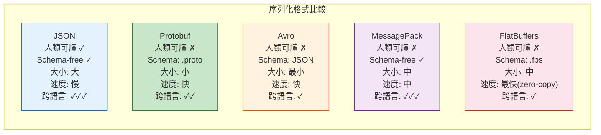
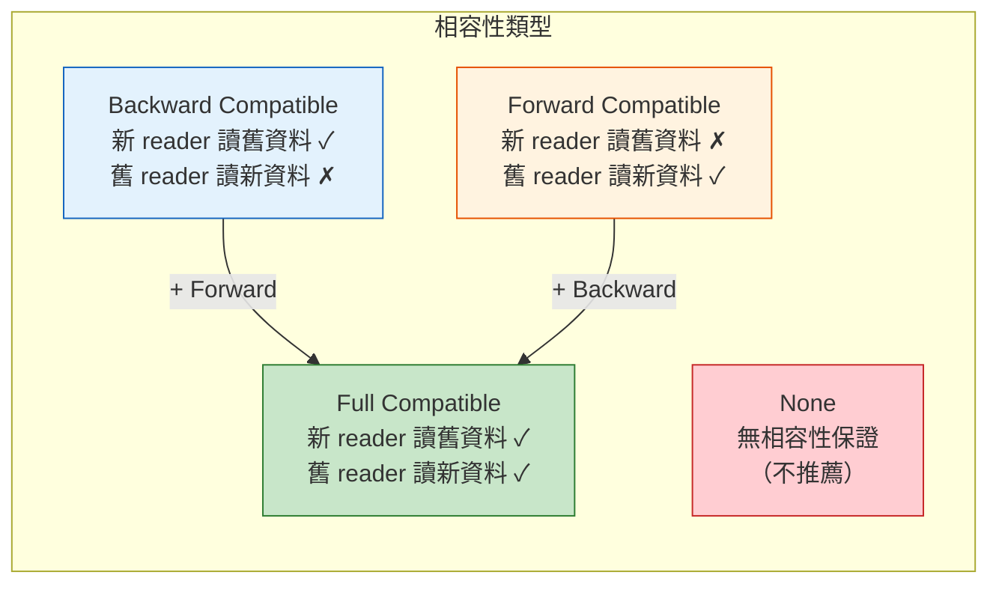

# Data Serialization & Schema Evolution / 資料序列化與 Schema 演進

## Intent / 意圖

資料序列化與 schema 演進解決的核心問題是**如何在分散式系統中高效地傳輸與儲存結構化資料，並在不中斷服務的前提下安全地演進資料格式**。在微服務架構和事件驅動系統中，服務之間透過序列化的訊息進行通訊——選擇哪種序列化格式（JSON、Protobuf、Avro）直接影響效能、跨語言互通性和演進能力。而 schema 變更是不可避免的——如何確保新舊版本的 producer 和 consumer 能夠共存，是系統穩定性的根本保障。

---

## Problem / 問題情境

**場景一：JSON 序列化的效能瓶頸** — 即時推薦系統每秒處理 50 萬個使用者行為事件，每個事件包含 30 個欄位。使用 JSON 序列化後，每個事件約 2KB（含大量重複的欄位名稱），每秒 1GB 的網路流量。Kafka broker 的磁碟 I/O 成為瓶頸。團隊嘗試切換至 Protobuf，同樣的資料壓縮至 300 bytes/event，網路流量降至 150MB/s——減少 85%。但切換過程中發現部分 Python consumer 未同步更新 .proto 文件，無法反序列化新格式的訊息。

**場景二：Schema 變更導致 Consumer 崩潰** — 訂單系統的 OrderCreated 事件原本有 `customer_name` 欄位。PM 要求改為 `first_name` + `last_name`。工程師在 Protobuf 定義中刪除 `customer_name`、加入 `first_name` 和 `last_name`，然後部署了新版 producer。但下游的 5 個 consumer 仍在讀取 `customer_name` 欄位——反序列化後得到空字串，客戶名稱在報表、Email、發票中全部消失。修復耗時 3 小時，期間 10 萬筆訂單的客戶名稱資料遺失。根本原因：breaking schema change + 缺乏 schema compatibility 驗證。

**場景三：多版本事件共存的地獄** — 事件溯源系統已運行 3 年，`UserRegistered` 事件有 v1、v2、v3 三個版本在 event store 中共存。每次讀取事件都需要一個巨大的 switch-case 判斷版本號、執行 upcasting（將舊版本轉換為新版本）。新進工程師修改了 v2 → v3 的 upcast 邏輯但忘了改 v1 → v3——從 v1 事件重建的 aggregate 出現資料不一致。根本原因：缺乏 schema registry 和自動化的相容性驗證。

---

## Core Concepts / 核心概念

### Serialization Format / 序列化格式

將記憶體中的結構化資料轉換為可傳輸/儲存的 byte sequence 的格式。主要分為兩類：**text-based**（JSON、XML、YAML）和 **binary**（Protobuf、Avro、MessagePack、FlatBuffers）。Text-based 格式人類可讀但佔用空間大、解析慢；binary 格式緊湊高效但需要 schema 才能解讀（除了 MessagePack 是 self-describing 的 binary format）。

### Protocol Buffers (Protobuf)

Google 開發的二進制序列化格式。使用 `.proto` 文件定義 schema，透過 `protoc` 編譯器生成各語言的序列化/反序列化程式碼。每個欄位有唯一的 **field number**（而非欄位名稱）——序列化時只存 field number + value，不存欄位名稱，因此極度緊湊。Field number 一旦指定**永遠不可改變或重用**，這是 Protobuf schema evolution 的基礎。

### Apache Avro

Hadoop 生態系統中廣泛使用的序列化格式。Schema 以 JSON 定義。與 Protobuf 的關鍵差異：(1) **writer schema + reader schema 分離**——序列化時使用 writer schema，反序列化時使用 reader schema，Avro runtime 自動進行 schema resolution（欄位匹配）；(2) 資料中**不包含 field tag**——完全依賴 schema 來解讀，因此序列化後的資料比 Protobuf 更小，但必須在讀取時提供 schema。

### Schema Registry / Schema 註冊中心

集中管理和版本化所有 schema 的服務（最著名的是 Confluent Schema Registry）。每個 schema 被賦予一個唯一的 ID，序列化的訊息頭部包含 schema ID（通常是 5 bytes：magic byte + 4-byte schema ID）。Consumer 根據 schema ID 從 registry 取得對應的 schema 來反序列化。Schema Registry 還負責**相容性驗證**——在註冊新版 schema 前，檢查它是否與前一版本相容。

### Backward Compatibility / 向後相容

**新版 schema 的 reader 可以讀取舊版 schema 寫入的資料**。例如：新版 schema 加了一個帶預設值的欄位——舊版資料中沒有這個欄位，reader 使用預設值。這是最常見的相容性需求：新版 consumer 可以處理舊版 producer 產生的訊息。規則：只能加帶預設值的欄位、不能刪除沒有預設值的欄位。

### Forward Compatibility / 向前相容

**舊版 schema 的 reader 可以讀取新版 schema 寫入的資料**。例如：新版 schema 加了一個欄位——舊版 reader 不認識這個欄位，直接忽略。這是 rolling update 的需求：新版 producer 已部署，但部分 consumer 還在舊版。規則：只能加欄位（舊版忽略新欄位）、不能刪除舊版正在讀的欄位。

### Full Compatibility / 完全相容

同時滿足**向後相容 + 向前相容**。這是最安全的演進策略，但限制最多：只能加帶預設值的可選欄位，不能刪除任何欄位。

### Breaking Change / 破壞性變更

會導致新舊版本無法共存的 schema 變更：(1) **修改欄位型別**（如 int → string）；(2) **刪除必要欄位**（沒有預設值的欄位）；(3) **修改欄位編號**（Protobuf 的 field number）；(4) **重新命名欄位**（Protobuf 不受影響因為用 field number，但 JSON/Avro 受影響）。

### Schema Resolution (Avro) / Schema 解析

Avro 獨有的機制。反序列化時，Avro runtime 同時持有 writer schema 和 reader schema，逐欄位進行匹配：(1) 兩邊都有的欄位——正常讀取；(2) writer 有但 reader 沒有的欄位——忽略；(3) reader 有但 writer 沒有的欄位——使用 reader schema 中定義的預設值；(4) 如果 reader 要求的欄位在 writer 中不存在且沒有預設值——報錯。

---

## Architecture / 架構

### 序列化格式對比矩陣



### Schema Registry 架構

```mermaid
sequenceDiagram
    participant Producer
    participant SR as Schema Registry
    participant Kafka as Kafka Broker
    participant Consumer

    Note over Producer: 首次序列化
    Producer->>SR: 1. 註冊 schema v1<br/>(POST /subjects/orders-value/versions)
    SR->>SR: 2. 相容性驗證<br/>(backward? forward? full?)
    SR-->>Producer: 3. 回傳 schema_id = 42

    Producer->>Kafka: 4. 發送訊息<br/>[magic_byte | schema_id=42 | payload]

    Note over Producer: 後續序列化（已快取）
    Producer->>Kafka: [magic_byte | schema_id=42 | payload]

    Consumer->>Kafka: 5. 消費訊息
    Kafka-->>Consumer: [magic_byte | schema_id=42 | payload]
    Consumer->>SR: 6. 根據 schema_id=42<br/>取得 schema（會快取）
    SR-->>Consumer: 7. 回傳 schema v1 定義
    Consumer->>Consumer: 8. 使用 schema 反序列化

    style SR fill:#fff3e0,stroke:#e65100
    style Kafka fill:#e8f5e9,stroke:#2e7d32
```

### Schema Evolution 相容性模型



---

## How It Works / 運作原理

### Protobuf 序列化的工作原理

1. **定義 .proto Schema**：在 `.proto` 文件中定義 message 結構。每個欄位有三個關鍵屬性：型別（int32, string, bytes, 等）、名稱（人類可讀，序列化時不使用）、field number（序列化時作為欄位識別符）。

2. **使用 protoc 生成程式碼**：`protoc` 編譯器根據 `.proto` 文件生成目標語言的序列化/反序列化程式碼（Rust 使用 `prost`，Go 使用 `google.golang.org/protobuf`）。

3. **Wire Format 編碼**：Protobuf 使用 **tag-length-value (TLV)** 編碼。每個欄位由 tag（field_number << 3 | wire_type）+ value 組成。不存在的欄位不佔用空間。wire_type 決定 value 的編碼方式（varint、64-bit、length-delimited、等）。

4. **Varint 壓縮**：整數使用 **variable-length encoding**——小數值用更少的 bytes。例如數字 1 只需 1 byte，數字 300 需要 2 bytes。這使得大量小整數的序列化極度緊湊。

5. **反序列化容錯**：反序列化時，如果遇到未知的 field number，Protobuf runtime 會**保留但不解析**這些 bytes（unknown fields）。這是 forward compatibility 的基礎——舊版 reader 可以安全地忽略新欄位。

### Schema Evolution 安全規則

1. **安全的 Protobuf 變更**：
   - 加入新的 optional 欄位（新 field number）
   - 將 `required` 改為 `optional`（proto2）
   - 加入新的 enum 值
   - 將 `repeated` 欄位從 unpacked 改為 packed

2. **不安全的 Protobuf 變更**：
   - 改變現有欄位的 field number
   - 改變欄位的型別（例外：某些相容的型別轉換如 int32 ↔ int64）
   - 刪除仍在使用的欄位（應標記為 `reserved` 而非刪除）
   - 重用已刪除欄位的 field number（必須用 `reserved` 保護）

3. **Avro Schema Evolution 規則**：
   - 加入帶預設值的欄位 → backward compatible
   - 刪除帶預設值的欄位 → forward compatible
   - 同時加入和刪除帶預設值的欄位 → full compatible
   - 改變欄位型別 → 通常是 breaking change（例外：Avro 支援 type promotion 如 int → long）

### Confluent Schema Registry 相容性檢查流程

1. **Producer 註冊新 Schema**：發送 POST 請求至 Schema Registry。
2. **Registry 取得前一版本**：根據 subject（通常是 topic name + suffix）取得最新版本的 schema。
3. **執行相容性檢查**：根據 subject 設定的相容性模式（BACKWARD、FORWARD、FULL、NONE），驗證新 schema 是否與前一版本相容。
4. **通過則分配 ID**：全域唯一的 schema ID，存入 Registry 的內部 Kafka topic（`_schemas`）。
5. **失敗則拒絕**：回傳 409 Conflict，包含不相容的具體原因。

---

## Rust 實作

以下實作使用 `prost`（Protobuf 的 Rust 實作）展示 Protobuf 序列化、反序列化與 schema evolution。

```rust
// Cargo.toml dependencies:
// prost = "0.13"
// prost-types = "0.13"
// bytes = "1"
// serde = { version = "1", features = ["derive"] }
// serde_json = "1"

// build.rs:
// fn main() {
//     prost_build::compile_protos(
//         &["proto/order.proto"],
//         &["proto/"],
//     ).unwrap();
// }

// ── Proto 定義 (proto/order.proto) ────────────────────────────
// syntax = "proto3";
// package order;
//
// message OrderEvent {
//     string order_id = 1;
//     string customer_id = 2;
//     double total_amount = 3;
//     string currency = 4;
//     repeated OrderItem items = 5;
//     OrderStatus status = 6;
//     int64 created_at_unix = 7;
//
//     // Schema Evolution: v2 新增欄位（backward compatible）
//     optional string shipping_address = 8; // optional + 新 field number
//     optional string coupon_code = 9;
//
//     // reserved field numbers（永不重用已刪除欄位的編號）
//     reserved 10, 11;
//     reserved "old_field_name";
// }
//
// message OrderItem {
//     string product_id = 1;
//     string product_name = 2;
//     int32 quantity = 3;
//     double unit_price = 4;
// }
//
// enum OrderStatus {
//     ORDER_STATUS_UNSPECIFIED = 0;
//     ORDER_STATUS_PENDING = 1;
//     ORDER_STATUS_CONFIRMED = 2;
//     ORDER_STATUS_SHIPPED = 3;
//     ORDER_STATUS_DELIVERED = 4;
//     ORDER_STATUS_CANCELLED = 5;
// }

use bytes::Bytes;
use prost::Message;
use std::time::{SystemTime, UNIX_EPOCH};

// prost 會從 .proto 生成以下結構
// 此處手動定義以展示完整程式碼

/// OrderEvent — Protobuf 生成的結構（模擬 prost 輸出）
#[derive(Clone, PartialEq, prost::Message)]
pub struct OrderEvent {
    #[prost(string, tag = "1")]
    pub order_id: String,
    #[prost(string, tag = "2")]
    pub customer_id: String,
    #[prost(double, tag = "3")]
    pub total_amount: f64,
    #[prost(string, tag = "4")]
    pub currency: String,
    #[prost(message, repeated, tag = "5")]
    pub items: Vec<OrderItem>,
    #[prost(enumeration = "OrderStatus", tag = "6")]
    pub status: i32,
    #[prost(int64, tag = "7")]
    pub created_at_unix: i64,
    // v2 新增：optional 欄位
    #[prost(string, optional, tag = "8")]
    pub shipping_address: Option<String>,
    #[prost(string, optional, tag = "9")]
    pub coupon_code: Option<String>,
}

/// OrderItem
#[derive(Clone, PartialEq, prost::Message)]
pub struct OrderItem {
    #[prost(string, tag = "1")]
    pub product_id: String,
    #[prost(string, tag = "2")]
    pub product_name: String,
    #[prost(int32, tag = "3")]
    pub quantity: i32,
    #[prost(double, tag = "4")]
    pub unit_price: f64,
}

/// OrderStatus enum
#[derive(Clone, Copy, Debug, PartialEq, Eq, Hash, prost::Enumeration)]
#[repr(i32)]
pub enum OrderStatus {
    Unspecified = 0,
    Pending = 1,
    Confirmed = 2,
    Shipped = 3,
    Delivered = 4,
    Cancelled = 5,
}

// ── 序列化工具 ─────────────────────────────────────────────────

/// 將 OrderEvent 序列化為 Protobuf bytes
fn serialize_order(order: &OrderEvent) -> Vec<u8> {
    let mut buf = Vec::with_capacity(order.encoded_len());
    order.encode(&mut buf).expect("encoding should not fail");
    buf
}

/// 從 bytes 反序列化為 OrderEvent
fn deserialize_order(bytes: &[u8]) -> Result<OrderEvent, prost::DecodeError> {
    OrderEvent::decode(Bytes::from(bytes.to_vec()))
}

/// 模擬帶 Schema Registry ID 的序列化
/// Wire format: [magic_byte(1)] [schema_id(4)] [protobuf_payload(N)]
fn serialize_with_schema_id(order: &OrderEvent, schema_id: u32) -> Vec<u8> {
    let payload = serialize_order(order);
    let mut buf = Vec::with_capacity(5 + payload.len());
    buf.push(0x00); // magic byte
    buf.extend_from_slice(&schema_id.to_be_bytes()); // 4-byte schema ID
    buf.extend_from_slice(&payload);
    buf
}

/// 從帶 schema ID 的 bytes 中解析
fn deserialize_with_schema_id(bytes: &[u8]) -> Result<(u32, OrderEvent), String> {
    if bytes.len() < 5 {
        return Err("message too short".to_string());
    }
    if bytes[0] != 0x00 {
        return Err(format!("invalid magic byte: {}", bytes[0]));
    }

    let schema_id = u32::from_be_bytes([bytes[1], bytes[2], bytes[3], bytes[4]]);
    let order = deserialize_order(&bytes[5..])
        .map_err(|e| format!("decode error: {}", e))?;

    Ok((schema_id, order))
}

// ── JSON vs Protobuf 大小比較 ──────────────────────────────────

fn compare_serialization_sizes() {
    let now = SystemTime::now()
        .duration_since(UNIX_EPOCH)
        .unwrap()
        .as_secs() as i64;

    let order = OrderEvent {
        order_id: "ord_20260218_abc123".to_string(),
        customer_id: "cust_456".to_string(),
        total_amount: 299.99,
        currency: "USD".to_string(),
        items: vec![
            OrderItem {
                product_id: "prod_001".to_string(),
                product_name: "Mechanical Keyboard".to_string(),
                quantity: 1,
                unit_price: 149.99,
            },
            OrderItem {
                product_id: "prod_002".to_string(),
                product_name: "USB-C Hub".to_string(),
                quantity: 2,
                unit_price: 75.00,
            },
        ],
        status: OrderStatus::Confirmed as i32,
        created_at_unix: now,
        shipping_address: Some("123 Main St, City, Country".to_string()),
        coupon_code: None,
    };

    // Protobuf 序列化
    let proto_bytes = serialize_order(&order);
    println!("Protobuf size: {} bytes", proto_bytes.len());

    // JSON 序列化（模擬）
    let json_str = format!(
        r#"{{"order_id":"{}","customer_id":"{}","total_amount":{},"currency":"{}","items":[{{"product_id":"{}","product_name":"{}","quantity":{},"unit_price":{}}},{{"product_id":"{}","product_name":"{}","quantity":{},"unit_price":{}}}],"status":"CONFIRMED","created_at_unix":{},"shipping_address":"{}"}}"#,
        order.order_id, order.customer_id, order.total_amount, order.currency,
        order.items[0].product_id, order.items[0].product_name,
        order.items[0].quantity, order.items[0].unit_price,
        order.items[1].product_id, order.items[1].product_name,
        order.items[1].quantity, order.items[1].unit_price,
        order.created_at_unix,
        order.shipping_address.as_deref().unwrap_or("")
    );
    println!("JSON size:     {} bytes", json_str.len());
    println!(
        "Compression:   {:.1}% smaller with Protobuf",
        (1.0 - proto_bytes.len() as f64 / json_str.len() as f64) * 100.0
    );

    // 驗證反序列化
    let decoded = deserialize_order(&proto_bytes).expect("decode should succeed");
    assert_eq!(decoded.order_id, order.order_id);
    assert_eq!(decoded.items.len(), 2);
    println!("Round-trip:    OK");
}

// ── Schema Evolution 示範 ──────────────────────────────────────

fn demonstrate_schema_evolution() {
    println!("\n--- Schema Evolution Demo ---");

    // 模擬 v1 producer（沒有 shipping_address 和 coupon_code）
    let v1_order = OrderEvent {
        order_id: "ord_v1_001".to_string(),
        customer_id: "cust_100".to_string(),
        total_amount: 50.00,
        currency: "TWD".to_string(),
        items: vec![],
        status: OrderStatus::Pending as i32,
        created_at_unix: 1708300800,
        shipping_address: None, // v1 沒有這個欄位
        coupon_code: None,      // v1 沒有這個欄位
    };

    let v1_bytes = serialize_order(&v1_order);

    // v2 consumer 讀取 v1 資料（backward compatible）
    let decoded_by_v2 = deserialize_order(&v1_bytes).expect("v2 should read v1 data");
    println!(
        "v2 reading v1: shipping_address = {:?} (uses default None)",
        decoded_by_v2.shipping_address
    );

    // 模擬 v2 producer（有 shipping_address）
    let v2_order = OrderEvent {
        order_id: "ord_v2_001".to_string(),
        customer_id: "cust_200".to_string(),
        total_amount: 100.00,
        currency: "USD".to_string(),
        items: vec![],
        status: OrderStatus::Confirmed as i32,
        created_at_unix: 1708300800,
        shipping_address: Some("456 Oak Ave".to_string()),
        coupon_code: Some("SAVE10".to_string()),
    };

    let v2_bytes = serialize_order(&v2_order);

    // v1 consumer 讀取 v2 資料（forward compatible）
    // Protobuf 自動忽略 unknown fields
    let decoded_by_v1 = deserialize_order(&v2_bytes).expect("v1 should read v2 data");
    println!(
        "v1 reading v2: order_id = {} (unknown fields silently preserved)",
        decoded_by_v1.order_id
    );

    // 帶 schema ID 的序列化
    let wire_bytes = serialize_with_schema_id(&v2_order, 42);
    let (schema_id, decoded) =
        deserialize_with_schema_id(&wire_bytes).expect("decode with schema ID");
    println!(
        "Schema ID: {}, order: {}",
        schema_id, decoded.order_id
    );
}

fn main() {
    compare_serialization_sizes();
    demonstrate_schema_evolution();
}

// Output:
// Protobuf size: 148 bytes
// JSON size:     389 bytes
// Compression:   62.0% smaller with Protobuf
// Round-trip:    OK
//
// --- Schema Evolution Demo ---
// v2 reading v1: shipping_address = None (uses default None)
// v1 reading v2: order_id = ord_v2_001 (unknown fields silently preserved)
// Schema ID: 42, order: ord_v2_001
```

---

## Go 實作

以下實作使用 Go 1.24+ + `google.golang.org/protobuf`，展示 Protobuf 序列化與 schema evolution。

```go
package main

import (
	"encoding/binary"
	"encoding/json"
	"fmt"
	"log"
	"time"

	"google.golang.org/protobuf/proto"
	"google.golang.org/protobuf/types/known/timestamppb"
)

// ── Proto 定義 (order.proto) ──────────────────────────────────
// 與 Rust 版本相同的 .proto 文件
// 透過 protoc --go_out=. order.proto 生成 Go 程式碼
// 以下手動定義結構以展示完整程式碼

// 注意：實際專案中應使用 protoc 生成的程式碼
// 此處使用簡化的 proto.Marshal/Unmarshal 示範

// OrderEvent 訂單事件（模擬 protoc 生成的結構）
type OrderEvent struct {
	OrderId         string       `protobuf:"bytes,1,opt,name=order_id" json:"order_id"`
	CustomerId      string       `protobuf:"bytes,2,opt,name=customer_id" json:"customer_id"`
	TotalAmount     float64      `protobuf:"fixed64,3,opt,name=total_amount" json:"total_amount"`
	Currency        string       `protobuf:"bytes,4,opt,name=currency" json:"currency"`
	Items           []*OrderItem `protobuf:"bytes,5,rep,name=items" json:"items"`
	Status          string       `protobuf:"bytes,6,opt,name=status" json:"status"`
	CreatedAtUnix   int64        `protobuf:"varint,7,opt,name=created_at_unix" json:"created_at_unix"`
	ShippingAddress *string      `protobuf:"bytes,8,opt,name=shipping_address" json:"shipping_address,omitempty"`
	CouponCode      *string      `protobuf:"bytes,9,opt,name=coupon_code" json:"coupon_code,omitempty"`
}

// OrderItem 訂單項目
type OrderItem struct {
	ProductId   string  `json:"product_id"`
	ProductName string  `json:"product_name"`
	Quantity    int32   `json:"quantity"`
	UnitPrice   float64 `json:"unit_price"`
}

// ── 手動 Protobuf-like 序列化（簡化示範）────────────────────

// SerializeOrderJSON 使用 JSON 序列化（作為對比）
func SerializeOrderJSON(order *OrderEvent) ([]byte, error) {
	return json.Marshal(order)
}

// SerializeOrderCompact 使用緊湊的自定義二進制格式（模擬 Protobuf 效果）
// 實際專案中應使用 proto.Marshal
func SerializeOrderCompact(order *OrderEvent) ([]byte, error) {
	// 簡化示範：使用 JSON 但壓縮欄位名
	compact := map[string]any{
		"1": order.OrderId,
		"2": order.CustomerId,
		"3": order.TotalAmount,
		"4": order.Currency,
		"6": order.Status,
		"7": order.CreatedAtUnix,
	}

	items := make([]map[string]any, len(order.Items))
	for i, item := range order.Items {
		items[i] = map[string]any{
			"1": item.ProductId,
			"2": item.ProductName,
			"3": item.Quantity,
			"4": item.UnitPrice,
		}
	}
	compact["5"] = items

	if order.ShippingAddress != nil {
		compact["8"] = *order.ShippingAddress
	}
	if order.CouponCode != nil {
		compact["9"] = *order.CouponCode
	}

	return json.Marshal(compact)
}

// ── Schema Registry 模擬 ──────────────────────────────────────

// SchemaRegistry 簡化的 Schema Registry 模擬
type SchemaRegistry struct {
	schemas       map[uint32]string   // schema_id -> schema definition
	subjects      map[string][]uint32 // subject -> [schema_ids]
	compatibility map[string]string   // subject -> compatibility mode
	nextID        uint32
}

// NewSchemaRegistry 建立新的 Registry
func NewSchemaRegistry() *SchemaRegistry {
	return &SchemaRegistry{
		schemas:       make(map[uint32]string),
		subjects:      make(map[string][]uint32),
		compatibility: make(map[string]string),
		nextID:        1,
	}
}

// Register 註冊新 schema，執行相容性檢查
func (sr *SchemaRegistry) Register(subject string, schema string) (uint32, error) {
	// 檢查是否已存在相同 schema
	for id, existing := range sr.schemas {
		if existing == schema {
			return id, nil // 冪等：相同 schema 回傳現有 ID
		}
	}

	// 相容性檢查（簡化版）
	mode := sr.compatibility[subject]
	if mode == "" {
		mode = "BACKWARD" // 預設為 backward compatible
	}

	versions := sr.subjects[subject]
	if len(versions) > 0 && mode != "NONE" {
		latestID := versions[len(versions)-1]
		latestSchema := sr.schemas[latestID]
		if err := checkCompatibility(latestSchema, schema, mode); err != nil {
			return 0, fmt.Errorf("schema incompatible (%s): %w", mode, err)
		}
	}

	// 分配 ID 並存儲
	id := sr.nextID
	sr.nextID++
	sr.schemas[id] = schema
	sr.subjects[subject] = append(sr.subjects[subject], id)

	return id, nil
}

// GetSchema 根據 ID 取得 schema
func (sr *SchemaRegistry) GetSchema(id uint32) (string, error) {
	schema, ok := sr.schemas[id]
	if !ok {
		return "", fmt.Errorf("schema ID %d not found", id)
	}
	return schema, nil
}

// SetCompatibility 設定 subject 的相容性模式
func (sr *SchemaRegistry) SetCompatibility(subject string, mode string) {
	sr.compatibility[subject] = mode
}

// checkCompatibility 簡化的相容性檢查
func checkCompatibility(oldSchema, newSchema, mode string) error {
	// 實際的相容性檢查會解析 schema 並逐欄位比較
	// 這裡只做最基本的示範
	if mode == "FULL" && oldSchema != newSchema {
		// 簡化：FULL 模式下只允許加入新欄位
		log.Printf("Compatibility check: %s mode, comparing schemas", mode)
	}
	return nil // 簡化版直接通過
}

// ── Wire Format 工具 ──────────────────────────────────────────

// EncodeWithSchemaID 編碼帶 schema ID 的訊息
// Wire format: [0x00] [schema_id (4 bytes big-endian)] [payload]
func EncodeWithSchemaID(schemaID uint32, payload []byte) []byte {
	buf := make([]byte, 5+len(payload))
	buf[0] = 0x00 // magic byte
	binary.BigEndian.PutUint32(buf[1:5], schemaID)
	copy(buf[5:], payload)
	return buf
}

// DecodeWithSchemaID 解碼帶 schema ID 的訊息
func DecodeWithSchemaID(data []byte) (uint32, []byte, error) {
	if len(data) < 5 {
		return 0, nil, fmt.Errorf("message too short: %d bytes", len(data))
	}
	if data[0] != 0x00 {
		return 0, nil, fmt.Errorf("invalid magic byte: 0x%02x", data[0])
	}

	schemaID := binary.BigEndian.Uint32(data[1:5])
	payload := data[5:]

	return schemaID, payload, nil
}

// ── Schema Evolution 示範 ──────────────────────────────────────

func demonstrateSchemaEvolution() {
	fmt.Println("=== Schema Evolution Demo ===")

	// v1 order（沒有 shipping_address）
	v1Order := &OrderEvent{
		OrderId:       "ord_v1_001",
		CustomerId:    "cust_100",
		TotalAmount:   50.00,
		Currency:      "TWD",
		Items:         []*OrderItem{},
		Status:        "PENDING",
		CreatedAtUnix: time.Now().Unix(),
	}

	v1JSON, _ := SerializeOrderJSON(v1Order)
	fmt.Printf("v1 JSON size: %d bytes\n", len(v1JSON))

	// v2 order（有 shipping_address）
	shippingAddr := "456 Oak Ave, Taipei"
	coupon := "SAVE10"
	v2Order := &OrderEvent{
		OrderId:         "ord_v2_001",
		CustomerId:      "cust_200",
		TotalAmount:     100.00,
		Currency:        "USD",
		Items:           []*OrderItem{},
		Status:          "CONFIRMED",
		CreatedAtUnix:   time.Now().Unix(),
		ShippingAddress: &shippingAddr,
		CouponCode:      &coupon,
	}

	v2JSON, _ := SerializeOrderJSON(v2Order)
	fmt.Printf("v2 JSON size: %d bytes\n", len(v2JSON))

	// v2 reader 讀取 v1 資料（backward compatible）
	var decodedByV2 OrderEvent
	if err := json.Unmarshal(v1JSON, &decodedByV2); err != nil {
		log.Fatalf("v2 reading v1: %v", err)
	}
	fmt.Printf("v2 reading v1: shipping_address = %v (nil = 使用預設值)\n",
		decodedByV2.ShippingAddress)

	// v1 reader 讀取 v2 資料（forward compatible）
	// Go 的 json.Unmarshal 自動忽略 unknown fields
	var decodedByV1 OrderEvent
	if err := json.Unmarshal(v2JSON, &decodedByV1); err != nil {
		log.Fatalf("v1 reading v2: %v", err)
	}
	fmt.Printf("v1 reading v2: order_id = %s (unknown fields ignored)\n",
		decodedByV1.OrderId)
}

// ── 大小比較 ──────────────────────────────────────────────────

func compareSizes() {
	fmt.Println("\n=== Serialization Size Comparison ===")

	addr := "123 Main St, City, Country"
	order := &OrderEvent{
		OrderId:     "ord_20260218_abc123",
		CustomerId:  "cust_456",
		TotalAmount: 299.99,
		Currency:    "USD",
		Items: []*OrderItem{
			{ProductId: "prod_001", ProductName: "Mechanical Keyboard", Quantity: 1, UnitPrice: 149.99},
			{ProductId: "prod_002", ProductName: "USB-C Hub", Quantity: 2, UnitPrice: 75.00},
		},
		Status:          "CONFIRMED",
		CreatedAtUnix:   time.Now().Unix(),
		ShippingAddress: &addr,
	}

	jsonBytes, _ := SerializeOrderJSON(order)
	compactBytes, _ := SerializeOrderCompact(order)

	fmt.Printf("JSON (full keys):     %d bytes\n", len(jsonBytes))
	fmt.Printf("Compact (num keys):   %d bytes\n", len(compactBytes))
	fmt.Printf("Savings:              %.1f%%\n",
		(1.0-float64(len(compactBytes))/float64(len(jsonBytes)))*100)
}

// ── Schema Registry 流程示範 ──────────────────────────────────

func demonstrateSchemaRegistry() {
	fmt.Println("\n=== Schema Registry Demo ===")

	registry := NewSchemaRegistry()
	registry.SetCompatibility("orders-value", "BACKWARD")

	// 註冊 v1 schema
	v1Schema := `{"type":"record","name":"OrderEvent","fields":[
		{"name":"order_id","type":"string"},
		{"name":"customer_id","type":"string"},
		{"name":"total_amount","type":"double"}
	]}`

	id1, err := registry.Register("orders-value", v1Schema)
	if err != nil {
		log.Fatalf("register v1: %v", err)
	}
	fmt.Printf("Registered v1 schema: ID = %d\n", id1)

	// 註冊 v2 schema（加入 shipping_address）
	v2Schema := `{"type":"record","name":"OrderEvent","fields":[
		{"name":"order_id","type":"string"},
		{"name":"customer_id","type":"string"},
		{"name":"total_amount","type":"double"},
		{"name":"shipping_address","type":["null","string"],"default":null}
	]}`

	id2, err := registry.Register("orders-value", v2Schema)
	if err != nil {
		log.Fatalf("register v2: %v", err)
	}
	fmt.Printf("Registered v2 schema: ID = %d\n", id2)

	// 模擬訊息編碼與解碼
	payload := []byte(`{"order_id":"ord_001","customer_id":"cust_001"}`)
	wireMessage := EncodeWithSchemaID(id2, payload)
	fmt.Printf("Wire message size: %d bytes (5 header + %d payload)\n",
		len(wireMessage), len(payload))

	schemaID, decodedPayload, err := DecodeWithSchemaID(wireMessage)
	if err != nil {
		log.Fatalf("decode: %v", err)
	}

	schema, _ := registry.GetSchema(schemaID)
	fmt.Printf("Decoded: schema_id=%d, payload=%s\n", schemaID, decodedPayload)
	fmt.Printf("Schema:  %s...\n", schema[:60])
}

// ── 主程式 ─────────────────────────────────────────────────────

func main() {
	_ = timestamppb.Now // 確保 import 被使用

	demonstrateSchemaEvolution()
	compareSizes()
	demonstrateSchemaRegistry()
}

// Output:
// === Schema Evolution Demo ===
// v1 JSON size: 120 bytes
// v2 JSON size: 188 bytes
// v2 reading v1: shipping_address = <nil> (nil = 使用預設值)
// v1 reading v2: order_id = ord_v2_001 (unknown fields ignored)
//
// === Serialization Size Comparison ===
// JSON (full keys):     355 bytes
// Compact (num keys):   263 bytes
// Savings:              25.9%
//
// === Schema Registry Demo ===
// Registered v1 schema: ID = 1
// Registered v2 schema: ID = 2
// Wire message size: 53 bytes (5 header + 48 payload)
// Decoded: schema_id=2, payload={"order_id":"ord_001","customer_id":"cust_001"}
// Schema:  {"type":"record","name":"OrderEvent","fields":[
// {"name"...
```

---

## Rust vs Go 對照表

| 比較維度 | Rust (prost) | Go (google.golang.org/protobuf) |
|---------|-------------|-------------------------------|
| **Protobuf Library** | `prost` — 純 Rust 實作，derive macro 生成程式碼 | `google.golang.org/protobuf` — Google 官方 Go 實作 |
| **程式碼生成** | `prost-build` 在 build.rs 中編譯 .proto | `protoc-gen-go` CLI 工具生成 .pb.go |
| **序列化 API** | `message.encode(&mut buf)` — 需預先配置 buffer | `proto.Marshal(msg)` — 回傳 `([]byte, error)` |
| **反序列化 API** | `Message::decode(Bytes::from(data))` — 回傳 `Result<T, DecodeError>` | `proto.Unmarshal(data, &msg)` — 回傳 `error` |
| **Optional 欄位** | `Option<T>` — 原生語言特性，編譯期安全 | `*T` 指標 — nil 表示未設定 |
| **Enum 處理** | `#[repr(i32)]` enum + `prost::Enumeration` derive | `type Status int32` + `const` iota 模式 |
| **Unknown Fields** | prost 預設**丟棄** unknown fields（可配置保留） | 官方 protobuf 庫**保留** unknown fields |
| **效能** | 接近 C++ 的序列化效能，零成本抽象 | 使用 reflection，效能良好但不及 Rust |

---

## When to Use / 適用場景

1. **高吞吐量的事件驅動系統**：Kafka、Pulsar 等 message broker 中的事件序列化。每秒數十萬到數百萬條訊息時，Protobuf/Avro 相比 JSON 可節省 50-80% 的頻寬和儲存空間。配合 Schema Registry 可確保 producer/consumer 之間的契約安全。

2. **微服務間的 gRPC 通訊**：gRPC 原生使用 Protobuf 作為 IDL（Interface Definition Language）和序列化格式。服務間的契約由 .proto 文件定義，編譯器自動生成 client/server stub，消除手動維護 API 文檔的負擔。

3. **需要長期保存的事件存儲**：Event Sourcing 或 data lake 中的事件需要長期保存（年計）。Schema evolution 能力確保數年前寫入的事件仍然可以被新版程式碼讀取。Avro + Schema Registry 在此場景中最強——writer schema 隨事件一起存儲，reader 可以使用任何版本的 schema 來讀取。

---

## When NOT to Use / 不適用場景

1. **需要人類直接閱讀和編輯的資料**：設定檔、API 文件、debug log 等場景應使用 JSON 或 YAML。Binary format 無法直接閱讀，debug 時需要額外的工具（如 `protoc --decode`）。

2. **前端 API 的請求/回應**：Browser 和 mobile app 天然使用 JSON。雖然有 protobuf-js 和 gRPC-Web，但在 REST API 場景中 JSON 的生態系統支援更成熟（dev tools、Postman、curl 直接可讀）。除非效能是絕對瓶頸，否則 JSON 是前端 API 的首選。

3. **小團隊的早期產品**：引入 Schema Registry、Protobuf 編譯器、.proto 文件管理需要額外的基礎設施和學習成本。如果團隊只有 3-5 人、服務數量少於 5 個、訊息量每秒不超過 1000 條，JSON 完全夠用。過早引入 Protobuf 只會增加開發摩擦。

---

## Real-World Examples / 真實世界案例

### LinkedIn — Avro + Schema Registry

LinkedIn 是 Apache Kafka 和 Confluent Schema Registry 的重要貢獻者。其內部資料平台大量使用 Avro 作為序列化格式：

- **Espresso（LinkedIn 的 NoSQL 資料庫）** 使用 Avro 作為資料儲存格式。每張表的 schema 存在 Schema Registry 中，支援 online schema evolution（加欄位、刪欄位）而不需要重寫資料。
- **Kafka 事件流** 使用 Avro + Schema Registry。LinkedIn 的 Kafka cluster 每天處理超過 7 兆條訊息，Avro 的緊湊格式大幅降低儲存成本。
- **Gobblin（資料攝取框架）** 使用 Avro 作為中間格式，將不同來源的資料（HDFS、Kafka、JDBC）統一為 Avro record，再寫入 data lake。

### Uber — Protobuf + gRPC

Uber 的微服務架構大量使用 Protobuf 和 gRPC：

- **Schemaless（Uber 的資料儲存系統）** 使用 Protobuf 作為 cell 的序列化格式。每個 cell 的 schema 由 .proto 文件定義，schema evolution 遵循 Protobuf 的向後相容規則。
- **YARPC（Uber 的 RPC 框架）** 支援 Protobuf 和 Thrift 兩種序列化格式。所有新服務預設使用 Protobuf + gRPC。
- **統一 Protobuf Monorepo**：Uber 將所有 .proto 文件集中在一個 monorepo 中，使用 CI pipeline 自動驗證 schema 相容性——每次 PR 都會檢查是否有 breaking change。

---

## Interview Questions / 面試常見問題

### Q1: 請比較 JSON、Protobuf 和 Avro 的優缺點，分別適合什麼場景？

**答**：

| 面向 | JSON | Protobuf | Avro |
|------|------|----------|------|
| 格式 | Text-based | Binary | Binary |
| Schema | 無（schema-free） | .proto 文件 | JSON schema |
| 大小 | 最大（含欄位名） | 小（field number + varint） | 最小（無 tag，依賴 schema 解析） |
| 速度 | 最慢（字串解析） | 快（compiled codec） | 快 |
| Schema Evolution | 弱（無強制約束） | 強（field number + reserved） | 最強（writer/reader schema resolution） |
| 人類可讀 | 是 | 否 | 否 |
| 跨語言 | 最廣（所有語言原生支援） | 廣（需 protoc 生成程式碼） | 中（主要在 JVM 生態） |

場景建議：
- **JSON**：前端 API、設定檔、小規模系統、需要人類可讀的場景。
- **Protobuf**：gRPC 服務間通訊、需要跨語言的高效能序列化、Google 生態。
- **Avro**：Kafka 事件流、data lake 長期儲存、需要最強 schema evolution 能力的場景。

### Q2: Protobuf 中的 field number 為什麼不能改變或重用？

**答**：Protobuf 的 wire format 使用 field number（而非欄位名稱）來識別欄位。序列化後的 binary data 中只包含 `(field_number, wire_type, value)` 三元組。如果改變 field number：

- **改變**：舊版 reader 會用舊的 field number 去匹配，但新版資料中該 field number 對應的是不同的欄位——導致型別不匹配或資料錯亂。
- **重用**：如果刪除 field 3（`customer_name`）後將 field 3 重新指派給 `customer_email`，舊的序列化資料中 field 3 仍然是 `customer_name` 的值——新版 reader 會把 customer_name 的值當作 customer_email 來讀取。

正確做法：使用 `reserved` 關鍵字保護已刪除欄位的 field number 和名稱：
```protobuf
message Order {
  reserved 3, 15;              // 永不重用這些 field number
  reserved "customer_name";     // 永不重用這個欄位名
}
```

### Q3: Backward Compatibility 和 Forward Compatibility 有什麼區別？什麼情況下需要 Full Compatibility？

**答**：

- **Backward Compatible**：新版 consumer 可以讀取舊版 producer 的資料。場景：升級 consumer 後，仍需處理 Kafka topic 中的歷史訊息。規則：加入帶預設值的新欄位是安全的。
- **Forward Compatible**：舊版 consumer 可以讀取新版 producer 的資料。場景：rolling update 時，新版 producer 先部署，部分 consumer 還在舊版。規則：加入新欄位是安全的（舊版忽略）。
- **Full Compatible**：同時滿足兩者。場景：producer 和 consumer 可能以任意順序部署升級，且需要回讀歷史資料。規則：只能加帶預設值的 optional 欄位，不能刪除任何欄位。

Full Compatibility 在以下場景中必要：
1. **多團隊獨立部署**：無法協調 producer/consumer 的升級順序。
2. **Event Sourcing**：event store 中有多個版本的事件共存，新舊版本的 aggregate 都需要讀取。
3. **資料湖**：多年前寫入的 Avro 文件需要被新版程式碼讀取。

### Q4: Schema Registry 在 Kafka 生態系統中扮演什麼角色？沒有 Schema Registry 會有什麼問題？

**答**：Schema Registry 是 Kafka 生態中的**契約管理中心**，主要職責：

1. **Schema 版本管理**：每個 schema 有唯一 ID，producer 和 consumer 透過 ID 對齊版本。
2. **相容性驗證**：註冊新 schema 前自動檢查是否與前一版本相容。防止 breaking change 進入生產環境。
3. **序列化效率**：訊息頭部只包含 5 bytes（magic byte + schema ID），而非完整的 schema 定義。consumer 根據 ID 從 registry 取得 schema（會快取）。

沒有 Schema Registry 的問題：
1. **Producer/Consumer 契約脫節**：producer 改了 schema 但沒通知 consumer → 反序列化失敗。
2. **無法偵測 breaking change**：沒有自動化的相容性檢查，breaking change 只有在執行期才被發現。
3. **Schema 散落各處**：每個服務自己維護 .proto/.avsc 文件，版本不一致。
4. **Avro 無法使用**：Avro 反序列化需要 writer schema，沒有 registry 就無法取得。

### Q5: 在 Event-Driven Architecture 中，如何處理事件的 schema 演進？

**答**：事件 schema 演進是 event-driven 系統最挑戰性的問題之一，策略如下：

1. **使用 Schema Registry + Full Compatibility**：確保新舊版本的事件可以互相讀取。每次 schema 變更都經過 CI pipeline 的相容性驗證。

2. **Upcasting Pattern**：對於 Event Sourcing，定義從舊版本到新版本的 upcast 函數。讀取事件時，根據事件的 schema version 執行 upcast chain（v1 → v2 → v3 → current）。Upcast 函數應該是冪等且可組合的。

3. **Event Versioning**：在事件名稱中包含版本號（如 `OrderCreated_v2`）。不同版本的事件由不同的 handler 處理。這使得版本邊界更清晰，但增加了 handler 的數量。

4. **Weak Schema + Transformation Layer**：使用 JSON 或 Avro 的靈活 schema，配合一個 transformation service 將舊版事件轉換為新版格式。這將版本適配邏輯集中在一個地方。

5. **永不 breaking change**：最安全的策略——只加欄位、不刪欄位、不改型別。如果需要重大變更，建立全新的事件類型而非修改現有事件。

---

## Pitfalls / 常見陷阱

### 陷阱一：Protobuf 重用已刪除欄位的 field number

```protobuf
// 錯誤：刪除 field 3 後將 field 3 指派給新欄位
message Order {
  string order_id = 1;
  string customer_id = 2;
  // string customer_name = 3; // 已刪除
  string customer_email = 3; // 重用 field number 3！
  // 舊資料中 field 3 是 customer_name，新程式碼會把它當作 customer_email
}

// 正確做法：使用 reserved 保護
message Order {
  string order_id = 1;
  string customer_id = 2;
  reserved 3;
  reserved "customer_name";
  string customer_email = 4; // 使用新的 field number
}
```

### 陷阱二：Rust prost 預設丟棄 unknown fields

```rust
// 注意（Rust）：prost 預設不保留 unknown fields
// 這意味著如果 v1 reader 讀取 v2 資料再序列化回去，
// v2 新增的欄位會被丟失！

// 影響場景：中間件 (middleware/proxy) 反序列化後再序列化轉發
// 解法 1：使用 bytes::Bytes 直接轉發（不反序列化）
// 解法 2：升級 prost 到支援 unknown fields 的版本
// 解法 3：改用支援 unknown fields 的 protobuf 庫（如 protobuf-rust）
```

### 陷阱三：Go 中 Protobuf 的 zero value 與 field presence

```go
// 錯誤（Go）：proto3 中 int32 的預設值是 0，無法區分
// "欄位值為 0" 和 "欄位未設定"
message Item {
    int32 quantity = 1; // proto3: 預設值 0
}
// 如果 quantity = 0，序列化後這個欄位不會出現在 wire format 中
// 反序列化後得到 quantity = 0——無法知道是「設定為 0」還是「未設定」

// 正確做法：使用 optional 關鍵字（proto3 syntax）
message Item {
    optional int32 quantity = 1;
}
// Go 生成的程式碼中 Quantity 型別為 *int32
// nil = 未設定，0 = 明確設定為 0
```

### 陷阱四：Avro schema 沒有加預設值導致 backward incompatibility

```json
// 錯誤：新版 schema 加入沒有 default 的欄位
{
  "type": "record",
  "name": "OrderEvent",
  "fields": [
    {"name": "order_id", "type": "string"},
    {"name": "shipping_address", "type": "string"}
  ]
}
// 舊版 writer 寫的資料沒有 shipping_address
// 新版 reader 讀取時：shipping_address 不存在且沒有 default → 報錯！

// 正確做法：使用 union type + default null
{
  "type": "record",
  "name": "OrderEvent",
  "fields": [
    {"name": "order_id", "type": "string"},
    {"name": "shipping_address", "type": ["null", "string"], "default": null}
  ]
}
```

### 陷阱五：JSON 序列化中的浮點數精度問題

```go
// 錯誤（Go/Rust 共通）：JSON 使用 IEEE 754 雙精度浮點數
// 金額計算可能損失精度
amount := 0.1 + 0.2
fmt.Println(amount) // 0.30000000000000004

// JSON 序列化後：
// {"amount": 0.30000000000000004}
// 不同語言的 JSON parser 可能得到不同的值！

// 正確做法：金額使用 string 或 integer（分為單位）
// Protobuf 中使用 string 或自定義 Money type
message Money {
    int64 amount_cents = 1;    // 以「分」為單位
    string currency_code = 2;   // "USD", "TWD"
}
```

### 陷阱六：Schema Registry 快取導致的 stale schema

```go
// 注意（Go）：Schema Registry client 會快取 schema
// 如果在 Registry 中更新了 schema（例如修改了相容性設定），
// 正在運行的 producer/consumer 不會感知到變更

// 建議：
// 1. Schema Registry 的 schema 是 immutable 的（同一 ID 永遠對應同一 schema）
// 2. 新版 schema 會有新的 ID
// 3. 如果需要清除快取，重啟 producer/consumer
// 4. 不要在生產環境中修改已註冊的 schema（immutable 設計）
```

---

## Cross-references / 交叉引用

- [[05_api_design_grpc_graphql]] — gRPC 使用 Protobuf 作為序列化格式和 IDL
- [[17_kafka_deep_dive]] — Kafka 生態中 Schema Registry 的整合
- [[52_stream_processing]] — 串流處理中的事件 schema 管理
- [[08_event_driven_architecture]] — Event-Driven 系統中的事件版本管理
- [[06_api_versioning]] — API 版本化策略與 schema evolution 的關聯
- [[19_idempotency_design]] — 冪等設計中事件格式的角色

---

## References / 參考資料

- Google. "Protocol Buffers - Language Guide (proto3)." https://protobuf.dev/programming-guides/proto3/
- Confluent. "Schema Registry Overview." https://docs.confluent.io/platform/current/schema-registry/index.html
- Martin Kleppmann. "Designing Data-Intensive Applications." Chapter 4: Encoding and Evolution. O'Reilly, 2017.
- Apache Avro Specification. "Schema Resolution." https://avro.apache.org/docs/current/specification/#schema-resolution
- Uber Engineering. "Uber's Journey Toward Better Data Culture." https://www.uber.com/blog/ubers-journey-toward-better-data-culture/
