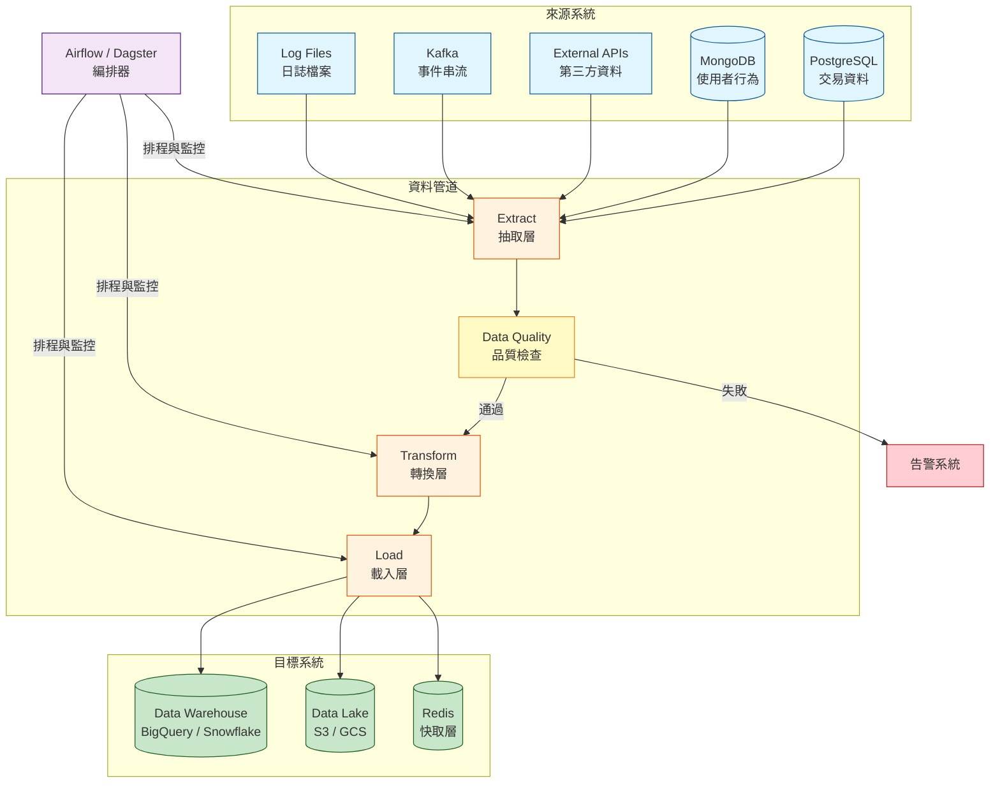
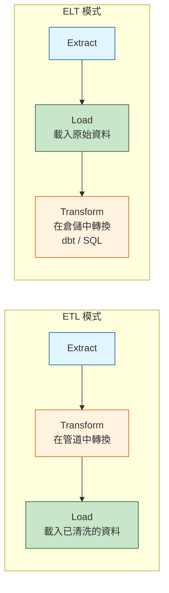
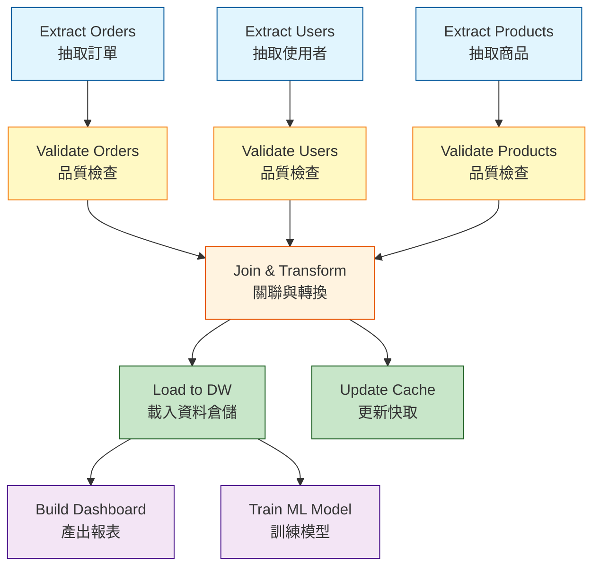

# Data Pipeline & ETL Design / 資料管道與 ETL 設計

## Intent / 意圖

資料管道（Data Pipeline）是將資料從來源系統（source）經過一系列轉換（transformation）後載入目標系統（destination）的自動化流程。ETL（Extract-Transform-Load）和 ELT（Extract-Load-Transform）是兩種主要的管道模式。在現代後端系統中，幾乎所有的資料分析、機器學習、報表產出、資料遷移都依賴可靠的資料管道——管道的失敗直接導致 dashboard 空白、ML 模型過時、商業決策缺乏依據。

核心問題：**當組織需要每天從數十個異質資料來源（PostgreSQL、MongoDB、外部 API、Kafka、日誌檔案）抽取數十億筆記錄，經過清洗、轉換、品質檢查後載入資料倉儲（Data Warehouse）或資料湖（Data Lake），且管道必須是冪等的（重跑不會產生重複資料）、可監控的（失敗時自動告警並支援重試/回填）、可擴展的（新增來源不需要重寫整個管道），應該如何設計這套資料管道架構？**

---

## Problem / 問題情境

**場景一：手動跑 SQL 腳本的「資料工程」在凌晨三點失敗**

某電商公司的資料分析師每天凌晨手動跑一系列 SQL 腳本，將生產資料庫的訂單、使用者、商品資料同步到分析資料庫。流程是：(1) 從 PostgreSQL 匯出 CSV；(2) 手動上傳到 S3；(3) 從 S3 COPY INTO 到 Redshift。某天凌晨三點，步驟 2 因為網路超時失敗，分析師隔天早上才發現——CEO 的日報表是空的。更糟的是，重跑整個流程時沒有冪等性保護，部分資料被重複載入——Redshift 中的銷售數據突然翻倍。

問題根因：
- **缺乏自動化編排**：人工操作無法保證穩定性和及時性。
- **缺乏冪等性**：重跑會產生重複資料。
- **缺乏監控告警**：失敗後數小時才被發現。

**場景二：ETL 管道跑了 6 小時才發現上游資料品質問題**

某公司的 ETL 管道從第三方合作夥伴的 API 抽取商品資料、轉換格式、載入資料倉儲。管道先抽取全量資料（2000 萬筆，耗時 2 小時）、再做複雜的轉換（標準化品類、匯率轉換、去重，耗時 3 小時）、最後載入 BigQuery（耗時 1 小時）。某天，第三方 API 返回的資料中 30% 的商品缺少 `price` 欄位（合作夥伴系統升級導致的 schema 變更）。管道一路跑完 6 個小時後，載入 BigQuery 時因為 NOT NULL 約束而失敗。6 小時的計算資源白白浪費。

問題根因：
- **資料品質檢查太晚**：應該在抽取完成後立即檢查 schema 和必填欄位，而非等到載入時才發現。
- **缺乏快速失敗機制**：管道應該在品質檢查失敗時立即中止，而非繼續浪費資源。

**場景三：管道回填（backfill）三個月的歷史資料，跑了一週還沒完**

某資料團隊發現 ETL 管道的轉換邏輯有一個 bug——過去三個月的資料都需要重新處理。管道的設計是按天分區處理的（每天的 DAG 處理當天的資料），但沒有考慮回填場景。回填時需要逐天觸發 DAG，每天的 DAG 需要 2 小時完成（因為串行執行所有步驟）。90 天 × 2 小時 = 180 小時 = 7.5 天。

問題根因：
- **管道不是為回填設計的**：沒有平行回填的能力。
- **粒度太粗**：整天的資料作為一個批次，無法細分。
- **增量 vs 全量混淆**：回填時應該使用全量重載而非增量更新。

---

## Core Concepts / 核心概念

### ETL vs ELT / ETL 與 ELT 的差異

**ETL（Extract-Transform-Load）**：先在管道中轉換資料，再載入目標系統。轉換邏輯在管道的運算資源上執行（如 Spark cluster、Python workers）。適用場景：(1) 目標系統的運算能力有限（如傳統資料倉儲）；(2) 需要在載入前做資料清洗和脫敏（如遮蔽個資）。

**ELT（Extract-Load-Transform）**：先將原始資料快速載入目標系統（資料湖或現代資料倉儲），再在目標系統上執行轉換。利用資料倉儲的強大運算能力（如 BigQuery、Snowflake、Databricks）。適用場景：(1) 目標系統有充足的運算能力；(2) 需要保留原始資料供不同的轉換邏輯使用（schema-on-read）。

現代趨勢是 ELT——將原始資料快速載入資料湖，然後使用 dbt（data build tool）在資料倉儲中進行轉換。

### Pipeline Idempotency / 管道冪等性

管道的冪等性意味著：同一段資料被管道處理一次和處理多次的最終結果相同。這是管道可靠性的基石——當管道因為暫時性錯誤失敗後重試時，不會產生重複資料。實作方式：(1) **UPSERT/MERGE**：使用 `INSERT ... ON CONFLICT UPDATE` 或 `MERGE INTO` 語法，以唯一鍵為基準——如果記錄已存在就更新，不存在就插入；(2) **分區覆寫**：每次執行覆寫目標表的整個分區（如 `DELETE FROM target WHERE date = '2025-12-01'; INSERT INTO target SELECT * FROM staging WHERE date = '2025-12-01'`）；(3) **Exactly-once 語意**：使用 checkpoint/offset 追蹤已處理的資料，避免重複處理。

### Data Quality / 資料品質

資料品質檢查是管道的「防線」——在資料進入下游系統之前攔截問題。常見的檢查項目：(1) **Schema 驗證**：欄位是否存在、型別是否正確；(2) **Not Null 檢查**：必填欄位是否有空值；(3) **範圍檢查**：數值是否在合理範圍內（如年齡 0-150、價格 > 0）；(4) **唯一性檢查**：主鍵是否重複；(5) **跨來源一致性**：兩個來源的同一指標是否一致（如訂單數 vs 付款數）；(6) **資料新鮮度**：資料的最新時間戳是否在預期範圍內（如最新資料不應超過 2 小時前）。Great Expectations 和 dbt tests 是常用的資料品質框架。

### DAG / 有向無環圖

資料管道中的任務（task）之間有依賴關係——「轉換」必須在「抽取」之後、「載入」之前執行。這些依賴關係形成一個有向無環圖（Directed Acyclic Graph, DAG）。管道編排工具（如 Airflow、Dagster、Prefect）負責按照 DAG 的拓撲順序執行任務，並處理重試、超時、並行等問題。DAG 的設計原則：(1) 每個任務原子化（一個任務做一件事）；(2) 任務之間透過資料介質（檔案、表、佇列）通訊，而非直接傳遞記憶體中的物件；(3) 避免太多層級的依賴（深度 > 10 的 DAG 難以除錯）。

### CDC / Change Data Capture

CDC（Change Data Capture）是一種增量資料抽取方式——不是定期全量匯出資料表，而是擷取資料庫的變更事件（INSERT、UPDATE、DELETE）。常見的 CDC 實作：(1) **基於 WAL（Write-Ahead Log）**：讀取 PostgreSQL 的 logical replication slot 或 MySQL 的 binlog，即時擷取每筆變更。Debezium 是最常用的 CDC 工具。(2) **基於觸發器（Trigger）**：在資料表上設定觸發器，將每筆變更寫入 audit 表。效能影響大，不推薦。(3) **基於時間戳（Timestamp-based）**：利用 `updated_at` 欄位，每次只抽取 `updated_at > 上次抽取時間` 的記錄。簡單但無法偵測 DELETE。

### Backfill / 回填

回填是指重新處理歷史資料的過程——當管道邏輯修正後，需要對過去的資料重跑管道。回填的設計要點：(1) **時間分區**：管道按時間分區處理資料（如每天一個分區），回填時指定時間範圍並平行處理；(2) **冪等性**：回填重跑不會產生重複資料；(3) **資源隔離**：回填任務不應搶佔日常管道的資源；(4) **漸進式**：先回填最近的資料，驗證正確後再回填更早的資料。

### Orchestration Tools / 編排工具

管道編排工具負責 DAG 的排程、執行、監控和重試。主流選項：(1) **Apache Airflow**：最成熟的開源編排工具，Python 定義 DAG，龐大的社群和 operator 生態系。缺點是 scheduler 效能和 UI 使用體驗；(2) **Dagster**：「software-defined assets」理念，將管道視為資產（asset）的產出過程。內建資料品質、版本管理、開發/測試環境隔離。適合資料工程團隊；(3) **Prefect**：「workflow as code」理念，Python native，比 Airflow 更現代的 API 設計。支援動態工作流；(4) **Temporal**：通用的工作流引擎（不限於資料管道），強大的重試和 saga 支援。

---

## Architecture / 架構

### 資料管道整體架構



### ETL vs ELT 流程比較



### DAG 任務依賴圖範例



---

## How It Works / 運作原理

### 資料管道的完整執行流程

1. **排程觸發**：編排器（如 Airflow）根據 cron 排程（如每天凌晨 2:00）或事件觸發（如上游表更新）啟動 DAG 執行。每次執行都有一個 `execution_date`（邏輯日期），代表管道處理的資料日期（注意：execution_date 通常是「前一天」——凌晨 2:00 觸發的 DAG 處理的是昨天的資料）。

2. **抽取（Extract）**：從來源系統拉取資料。兩種模式：
   - **全量抽取（Full Load）**：每次拉取完整的資料表。簡單但效率低，適合小表或參考資料。
   - **增量抽取（Incremental Load）**：只拉取自上次抽取以來的變更。基於 `updated_at` 時間戳或 CDC（Debezium 擷取 WAL）。效率高但需要追蹤「上次抽取到哪裡」的狀態。

3. **暫存（Stage）**：抽取的原始資料先寫入暫存區（staging area），如 S3 的 raw zone、資料倉儲的 staging schema。不直接寫入目標表——這讓品質檢查和轉換可以在原始資料上進行，失敗時不影響目標表。

4. **資料品質檢查（Data Quality Check）**：在暫存資料上執行預定義的檢查規則。例如：
   - 記錄數不為零（防止空抽取）
   - 記錄數不超過上次的 200%（防止重複抽取）
   - 必填欄位的 null 比例 < 1%
   - 數值欄位的範圍在合理區間

   如果檢查失敗，管道中止並發送告警。失敗時不修改目標表（fail-safe）。

5. **轉換（Transform）**：對暫存資料進行業務邏輯轉換。常見轉換包括：
   - 資料清洗：去除重複、填補空值、修正格式
   - 維度建模：將 3NF 的交易資料轉換為星型/雪花 schema（fact tables + dimension tables）
   - 衍生指標計算：如「月活躍使用者數（MAU）」、「客戶終身價值（LTV）」
   - 匯率轉換、時區轉換、資料脫敏

6. **載入（Load）**：將轉換後的資料寫入目標系統。載入策略：
   - **Truncate and Insert**：清空目標分區後全量插入。最簡單，天然冪等。
   - **MERGE / UPSERT**：以主鍵為基準，新資料 INSERT、已存在的資料 UPDATE。適合 SCD Type 1（保留最新值）。
   - **Append Only**：只追加新資料，適合 fact tables 和事件日誌。

7. **後處理與通知**：載入完成後的收尾工作——更新資料目錄（data catalog）的元資料、觸發下游 DAG（如報表產出、ML 訓練）、發送成功通知到 Slack/PagerDuty。

8. **監控與告警**：持續監控管道的健康狀態——執行時長是否異常（比平常慢 50% 以上）、目標表的資料新鮮度是否過期、資料量趨勢是否異常。Grafana + custom metrics 或 Dagster 的內建 observability。

---

## Rust 實作

以下使用 Rust + tokio channels 實作一個多階段 ETL 管道——Extract → Validate → Transform → Load 四個階段透過 async channel 連接，每個階段都是獨立的 async task，可以平行處理。

```rust
// Cargo.toml dependencies:
// tokio = { version = "1", features = ["full"] }
// serde = { version = "1", features = ["derive"] }
// serde_json = "1"
// chrono = { version = "0.4", features = ["serde"] }

use chrono::{DateTime, NaiveDate, Utc};
use serde::{Deserialize, Serialize};
use std::collections::HashMap;
use tokio::sync::mpsc;
use tokio::time::{sleep, Duration};

// ─── Domain Types ───────────────────────────────────────────

/// 原始訂單資料（來自來源系統）
#[derive(Debug, Clone, Serialize, Deserialize)]
struct RawOrder {
    order_id: String,
    customer_id: String,
    product_name: String,
    quantity: Option<i32>,      // 可能是 null
    unit_price: Option<f64>,    // 可能是 null
    currency: String,
    order_date: String,         // 字串格式，需要解析
    status: String,
}

/// 品質驗證結果
#[derive(Debug, Clone)]
struct ValidationResult {
    order: RawOrder,
    is_valid: bool,
    errors: Vec<String>,
}

/// 轉換後的訂單（準備載入目標系統）
#[derive(Debug, Clone, Serialize)]
struct TransformedOrder {
    order_id: String,
    customer_id: String,
    product_name: String,
    quantity: i32,
    unit_price_cents: i64,      // 轉換為 cents
    total_cents: i64,
    currency: String,
    order_date: NaiveDate,
    status: OrderStatus,
    processed_at: DateTime<Utc>,
}

#[derive(Debug, Clone, Serialize)]
#[serde(rename_all = "snake_case")]
enum OrderStatus {
    Pending,
    Confirmed,
    Shipped,
    Delivered,
    Cancelled,
    Unknown,
}

impl From<&str> for OrderStatus {
    fn from(s: &str) -> Self {
        match s.to_lowercase().as_str() {
            "pending" => OrderStatus::Pending,
            "confirmed" => OrderStatus::Confirmed,
            "shipped" => OrderStatus::Shipped,
            "delivered" => OrderStatus::Delivered,
            "cancelled" | "canceled" => OrderStatus::Cancelled,
            _ => OrderStatus::Unknown,
        }
    }
}

/// 管道執行統計
#[derive(Debug, Default)]
struct PipelineStats {
    extracted: usize,
    validated: usize,
    validation_failed: usize,
    transformed: usize,
    loaded: usize,
}

// ─── Pipeline Stages ────────────────────────────────────────

/// Stage 1: Extract — 從來源系統抽取原始資料
async fn extract_stage(
    tx: mpsc::Sender<RawOrder>,
) -> usize {
    // 模擬從資料庫或 API 抽取資料
    let raw_orders = vec![
        RawOrder {
            order_id: "ORD-001".into(),
            customer_id: "CUST-101".into(),
            product_name: "Rust Programming".into(),
            quantity: Some(2),
            unit_price: Some(49.99),
            currency: "USD".into(),
            order_date: "2025-12-15".into(),
            status: "confirmed".into(),
        },
        RawOrder {
            order_id: "ORD-002".into(),
            customer_id: "CUST-102".into(),
            product_name: "Go in Action".into(),
            quantity: Some(1),
            unit_price: Some(39.99),
            currency: "USD".into(),
            order_date: "2025-12-16".into(),
            status: "shipped".into(),
        },
        RawOrder {
            order_id: "ORD-003".into(),
            customer_id: "CUST-103".into(),
            product_name: "Invalid Order".into(),
            quantity: None,               // 缺少數量
            unit_price: Some(-10.00),     // 負數價格
            currency: "USD".into(),
            order_date: "invalid-date".into(),  // 無效日期
            status: "pending".into(),
        },
        RawOrder {
            order_id: "ORD-004".into(),
            customer_id: "CUST-104".into(),
            product_name: "Distributed Systems".into(),
            quantity: Some(3),
            unit_price: Some(59.99),
            currency: "TWD".into(),
            order_date: "2025-12-17".into(),
            status: "delivered".into(),
        },
        RawOrder {
            order_id: "ORD-005".into(),
            customer_id: "CUST-105".into(),
            product_name: "".into(),       // 空字串商品名
            quantity: Some(1),
            unit_price: None,              // 缺少價格
            currency: "USD".into(),
            order_date: "2025-12-18".into(),
            status: "cancelled".into(),
        },
    ];

    let count = raw_orders.len();
    for order in raw_orders {
        // 模擬抽取延遲
        sleep(Duration::from_millis(50)).await;
        if tx.send(order).await.is_err() {
            break;
        }
    }

    println!("[Extract] 抽取完成: {} 筆原始記錄", count);
    count
}

/// Stage 2: Validate — 資料品質檢查
async fn validate_stage(
    mut rx: mpsc::Receiver<RawOrder>,
    tx: mpsc::Sender<ValidationResult>,
) -> (usize, usize) {
    let mut valid_count = 0;
    let mut invalid_count = 0;

    while let Some(order) = rx.recv().await {
        let mut errors = Vec::new();

        // 檢查 1: 必填欄位不為空
        if order.order_id.is_empty() {
            errors.push("order_id 不可為空".into());
        }
        if order.product_name.is_empty() {
            errors.push("product_name 不可為空".into());
        }

        // 檢查 2: 數值欄位存在且合理
        match order.quantity {
            None => errors.push("quantity 不可為 null".into()),
            Some(q) if q <= 0 => errors.push(format!("quantity 必須為正數，收到: {}", q)),
            _ => {}
        }
        match order.unit_price {
            None => errors.push("unit_price 不可為 null".into()),
            Some(p) if p <= 0.0 => {
                errors.push(format!("unit_price 必須為正數，收到: {}", p))
            }
            _ => {}
        }

        // 檢查 3: 日期格式
        if NaiveDate::parse_from_str(&order.order_date, "%Y-%m-%d").is_err() {
            errors.push(format!(
                "order_date 格式無效: '{}'（期望 YYYY-MM-DD）",
                order.order_date
            ));
        }

        let is_valid = errors.is_empty();
        if is_valid {
            valid_count += 1;
        } else {
            invalid_count += 1;
            println!(
                "[Validate] 品質檢查失敗 - {}: {:?}",
                order.order_id, errors
            );
        }

        let result = ValidationResult {
            order,
            is_valid,
            errors,
        };

        if tx.send(result).await.is_err() {
            break;
        }
    }

    println!(
        "[Validate] 驗證完成: {} 通過, {} 失敗",
        valid_count, invalid_count
    );
    (valid_count, invalid_count)
}

/// Stage 3: Transform — 資料轉換
async fn transform_stage(
    mut rx: mpsc::Receiver<ValidationResult>,
    tx: mpsc::Sender<TransformedOrder>,
) -> usize {
    // 匯率表（模擬）
    let exchange_rates: HashMap<&str, f64> = HashMap::from([
        ("USD", 1.0),
        ("TWD", 0.032),
        ("EUR", 1.08),
        ("JPY", 0.0067),
    ]);

    let mut transform_count = 0;

    while let Some(result) = rx.recv().await {
        // 只處理通過驗證的資料
        if !result.is_valid {
            continue;
        }

        let raw = result.order;

        // 轉換 1: 價格轉換為 USD cents
        let unit_price = raw.unit_price.unwrap_or(0.0);
        let rate = exchange_rates.get(raw.currency.as_str()).unwrap_or(&1.0);
        let unit_price_usd = unit_price * rate;
        let unit_price_cents = (unit_price_usd * 100.0).round() as i64;

        let quantity = raw.quantity.unwrap_or(0);
        let total_cents = unit_price_cents * quantity as i64;

        // 轉換 2: 日期解析
        let order_date = NaiveDate::parse_from_str(&raw.order_date, "%Y-%m-%d")
            .unwrap_or_else(|_| NaiveDate::from_ymd_opt(1970, 1, 1).unwrap());

        // 轉換 3: 狀態標準化
        let status = OrderStatus::from(raw.status.as_str());

        let transformed = TransformedOrder {
            order_id: raw.order_id,
            customer_id: raw.customer_id,
            product_name: raw.product_name,
            quantity,
            unit_price_cents,
            total_cents,
            currency: "USD".into(), // 統一轉為 USD
            order_date,
            status,
            processed_at: Utc::now(),
        };

        transform_count += 1;

        if tx.send(transformed).await.is_err() {
            break;
        }
    }

    println!("[Transform] 轉換完成: {} 筆記錄", transform_count);
    transform_count
}

/// Stage 4: Load — 載入目標系統（模擬寫入資料倉儲）
async fn load_stage(
    mut rx: mpsc::Receiver<TransformedOrder>,
) -> Vec<TransformedOrder> {
    let mut loaded_records = Vec::new();

    while let Some(order) = rx.recv().await {
        // 模擬冪等載入：UPSERT 語意
        // 實際場景中會是 INSERT ... ON CONFLICT UPDATE
        sleep(Duration::from_millis(20)).await;
        loaded_records.push(order);
    }

    println!(
        "[Load] 載入完成: {} 筆記錄寫入目標系統",
        loaded_records.len()
    );
    loaded_records
}

/// Pipeline Orchestrator — 管道編排器
async fn run_pipeline() -> PipelineStats {
    println!("=== ETL Pipeline 開始執行 ===\n");
    let start_time = std::time::Instant::now();

    // 建立 channel（各階段之間的資料通道）
    let (extract_tx, extract_rx) = mpsc::channel::<RawOrder>(100);
    let (validate_tx, validate_rx) = mpsc::channel::<ValidationResult>(100);
    let (transform_tx, transform_rx) = mpsc::channel::<TransformedOrder>(100);

    // 平行啟動所有階段
    let extract_handle = tokio::spawn(async move {
        extract_stage(extract_tx).await
    });

    let validate_handle = tokio::spawn(async move {
        validate_stage(extract_rx, validate_tx).await
    });

    let transform_handle = tokio::spawn(async move {
        transform_stage(validate_rx, transform_tx).await
    });

    let load_handle = tokio::spawn(async move {
        load_stage(transform_rx).await
    });

    // 等待所有階段完成
    let extracted = extract_handle.await.unwrap();
    let (validated, validation_failed) = validate_handle.await.unwrap();
    let transformed = transform_handle.await.unwrap();
    let loaded_records = load_handle.await.unwrap();

    let elapsed = start_time.elapsed();

    println!("\n=== ETL Pipeline 執行完成 ===");
    println!("耗時: {:?}", elapsed);
    println!("抽取: {} 筆", extracted);
    println!("驗證通過: {} 筆, 失敗: {} 筆", validated, validation_failed);
    println!("轉換: {} 筆", transformed);
    println!("載入: {} 筆", loaded_records.len());

    // 顯示載入的資料
    println!("\n=== 載入的訂單 ===");
    for order in &loaded_records {
        println!(
            "  {} | {} | {} x {} | 總計 {} cents (USD) | {:?}",
            order.order_id,
            order.product_name,
            order.quantity,
            order.unit_price_cents,
            order.total_cents,
            order.status,
        );
    }

    PipelineStats {
        extracted,
        validated,
        validation_failed,
        transformed,
        loaded: loaded_records.len(),
    }
}

#[tokio::main]
async fn main() {
    let stats = run_pipeline().await;
    println!("\n最終統計: {:?}", stats);
}

// Output:
// === ETL Pipeline 開始執行 ===
//
// [Validate] 品質檢查失敗 - ORD-003: ["quantity 不可為 null", "unit_price 必須為正數，收到: -10", "order_date 格式無效: 'invalid-date'（期望 YYYY-MM-DD）"]
// [Validate] 品質檢查失敗 - ORD-005: ["product_name 不可為空", "unit_price 不可為 null"]
// [Extract] 抽取完成: 5 筆原始記錄
// [Validate] 驗證完成: 3 通過, 2 失敗
// [Transform] 轉換完成: 3 筆記錄
// [Load] 載入完成: 3 筆記錄寫入目標系統
//
// === ETL Pipeline 執行完成 ===
// 耗時: 310ms
// 抽取: 5 筆
// 驗證通過: 3 筆, 失敗: 2 筆
// 轉換: 3 筆
// 載入: 3 筆
//
// === 載入的訂單 ===
//   ORD-001 | Rust Programming | 2 x 4999 | 總計 9998 cents (USD) | Confirmed
//   ORD-002 | Go in Action | 1 x 3999 | 總計 3999 cents (USD) | Shipped
//   ORD-004 | Distributed Systems | 3 x 192 | 總計 576 cents (USD) | Delivered
//
// 最終統計: PipelineStats { extracted: 5, validated: 3, validation_failed: 2, transformed: 3, loaded: 3 }
```

---

## Go 實作

以下使用 Go 1.24+ 標準庫，以 goroutine + channel 實作多階段 ETL 管道。每個階段是獨立的 goroutine，透過 typed channel 連接。

```go
package main

import (
	"encoding/json"
	"fmt"
	"math"
	"strings"
	"sync"
	"time"
)

// ─── Domain Types ───────────────────────────────────────────

// RawOrder 原始訂單（來自來源系統）
type RawOrder struct {
	OrderID     string   `json:"order_id"`
	CustomerID  string   `json:"customer_id"`
	ProductName string   `json:"product_name"`
	Quantity    *int     `json:"quantity"`     // nil 表示缺失
	UnitPrice   *float64 `json:"unit_price"`   // nil 表示缺失
	Currency    string   `json:"currency"`
	OrderDate   string   `json:"order_date"`   // 字串格式
	Status      string   `json:"status"`
}

// ValidationResult 品質驗證結果
type ValidationResult struct {
	Order   RawOrder
	IsValid bool
	Errors  []string
}

// TransformedOrder 轉換後的訂單
type TransformedOrder struct {
	OrderID       string    `json:"order_id"`
	CustomerID    string    `json:"customer_id"`
	ProductName   string    `json:"product_name"`
	Quantity      int       `json:"quantity"`
	UnitPriceCents int64    `json:"unit_price_cents"`
	TotalCents    int64     `json:"total_cents"`
	Currency      string    `json:"currency"`
	OrderDate     time.Time `json:"order_date"`
	Status        string    `json:"status"`
	ProcessedAt   time.Time `json:"processed_at"`
}

// PipelineStats 管道執行統計
type PipelineStats struct {
	Extracted        int           `json:"extracted"`
	Validated        int           `json:"validated"`
	ValidationFailed int           `json:"validation_failed"`
	Transformed      int           `json:"transformed"`
	Loaded           int           `json:"loaded"`
	Duration         time.Duration `json:"duration"`
}

// ─── Pipeline Stages ────────────────────────────────────────

// extractStage 抽取階段：從來源系統讀取原始資料
func extractStage(out chan<- RawOrder) int {
	defer close(out)

	// 模擬從資料庫或 API 抽取資料
	rawOrders := []RawOrder{
		{
			OrderID: "ORD-001", CustomerID: "CUST-101",
			ProductName: "Rust Programming",
			Quantity: intPtr(2), UnitPrice: floatPtr(49.99),
			Currency: "USD", OrderDate: "2025-12-15", Status: "confirmed",
		},
		{
			OrderID: "ORD-002", CustomerID: "CUST-102",
			ProductName: "Go in Action",
			Quantity: intPtr(1), UnitPrice: floatPtr(39.99),
			Currency: "USD", OrderDate: "2025-12-16", Status: "shipped",
		},
		{
			OrderID: "ORD-003", CustomerID: "CUST-103",
			ProductName: "Invalid Order",
			Quantity: nil, UnitPrice: floatPtr(-10.00),
			Currency: "USD", OrderDate: "invalid-date", Status: "pending",
		},
		{
			OrderID: "ORD-004", CustomerID: "CUST-104",
			ProductName: "Distributed Systems",
			Quantity: intPtr(3), UnitPrice: floatPtr(59.99),
			Currency: "TWD", OrderDate: "2025-12-17", Status: "delivered",
		},
		{
			OrderID: "ORD-005", CustomerID: "CUST-105",
			ProductName: "",
			Quantity: intPtr(1), UnitPrice: nil,
			Currency: "USD", OrderDate: "2025-12-18", Status: "cancelled",
		},
	}

	for _, order := range rawOrders {
		time.Sleep(50 * time.Millisecond) // 模擬抽取延遲
		out <- order
	}

	count := len(rawOrders)
	fmt.Printf("[Extract] 抽取完成: %d 筆原始記錄\n", count)
	return count
}

// validateStage 驗證階段：資料品質檢查
func validateStage(in <-chan RawOrder, out chan<- ValidationResult) (int, int) {
	defer close(out)

	validCount := 0
	invalidCount := 0

	for order := range in {
		var errors []string

		// 檢查 1: 必填欄位
		if order.OrderID == "" {
			errors = append(errors, "order_id 不可為空")
		}
		if order.ProductName == "" {
			errors = append(errors, "product_name 不可為空")
		}

		// 檢查 2: 數值欄位
		if order.Quantity == nil {
			errors = append(errors, "quantity 不可為 null")
		} else if *order.Quantity <= 0 {
			errors = append(errors, fmt.Sprintf("quantity 必須為正數，收到: %d", *order.Quantity))
		}

		if order.UnitPrice == nil {
			errors = append(errors, "unit_price 不可為 null")
		} else if *order.UnitPrice <= 0 {
			errors = append(errors, fmt.Sprintf("unit_price 必須為正數，收到: %.2f", *order.UnitPrice))
		}

		// 檢查 3: 日期格式
		if _, err := time.Parse("2006-01-02", order.OrderDate); err != nil {
			errors = append(errors, fmt.Sprintf("order_date 格式無效: '%s'", order.OrderDate))
		}

		isValid := len(errors) == 0
		if isValid {
			validCount++
		} else {
			invalidCount++
			fmt.Printf("[Validate] 品質檢查失敗 - %s: %v\n", order.OrderID, errors)
		}

		out <- ValidationResult{
			Order:   order,
			IsValid: isValid,
			Errors:  errors,
		}
	}

	fmt.Printf("[Validate] 驗證完成: %d 通過, %d 失敗\n", validCount, invalidCount)
	return validCount, invalidCount
}

// transformStage 轉換階段：資料轉換和標準化
func transformStage(in <-chan ValidationResult, out chan<- TransformedOrder) int {
	defer close(out)

	// 匯率表
	exchangeRates := map[string]float64{
		"USD": 1.0,
		"TWD": 0.032,
		"EUR": 1.08,
		"JPY": 0.0067,
	}

	transformCount := 0

	for result := range in {
		if !result.IsValid {
			continue
		}

		raw := result.Order

		// 轉換 1: 匯率轉換為 USD cents
		unitPrice := *raw.UnitPrice
		rate, ok := exchangeRates[raw.Currency]
		if !ok {
			rate = 1.0
		}
		unitPriceUSD := unitPrice * rate
		unitPriceCents := int64(math.Round(unitPriceUSD * 100))

		quantity := *raw.Quantity
		totalCents := unitPriceCents * int64(quantity)

		// 轉換 2: 日期解析
		orderDate, _ := time.Parse("2006-01-02", raw.OrderDate)

		// 轉換 3: 狀態標準化
		status := strings.ToLower(raw.Status)
		if status == "canceled" {
			status = "cancelled"
		}

		transformed := TransformedOrder{
			OrderID:        raw.OrderID,
			CustomerID:     raw.CustomerID,
			ProductName:    raw.ProductName,
			Quantity:       quantity,
			UnitPriceCents: unitPriceCents,
			TotalCents:     totalCents,
			Currency:       "USD",
			OrderDate:      orderDate,
			Status:         status,
			ProcessedAt:    time.Now(),
		}

		transformCount++
		out <- transformed
	}

	fmt.Printf("[Transform] 轉換完成: %d 筆記錄\n", transformCount)
	return transformCount
}

// loadStage 載入階段：寫入目標系統
func loadStage(in <-chan TransformedOrder) []TransformedOrder {
	var loaded []TransformedOrder

	for order := range in {
		time.Sleep(20 * time.Millisecond) // 模擬寫入延遲
		loaded = append(loaded, order)
	}

	fmt.Printf("[Load] 載入完成: %d 筆記錄寫入目標系統\n", len(loaded))
	return loaded
}

// ─── Pipeline Orchestrator ──────────────────────────────────

func runPipeline() PipelineStats {
	fmt.Println("=== ETL Pipeline 開始執行 ===")
	fmt.Println()
	startTime := time.Now()

	// 建立 channel（各階段之間的資料通道）
	extractCh := make(chan RawOrder, 100)
	validateCh := make(chan ValidationResult, 100)
	transformCh := make(chan TransformedOrder, 100)

	var (
		extracted        int
		validated        int
		validationFailed int
		transformed      int
		loadedOrders     []TransformedOrder
	)

	var wg sync.WaitGroup

	// Stage 1: Extract
	wg.Add(1)
	go func() {
		defer wg.Done()
		extracted = extractStage(extractCh)
	}()

	// Stage 2: Validate
	wg.Add(1)
	go func() {
		defer wg.Done()
		validated, validationFailed = validateStage(extractCh, validateCh)
	}()

	// Stage 3: Transform
	wg.Add(1)
	go func() {
		defer wg.Done()
		transformed = transformStage(validateCh, transformCh)
	}()

	// Stage 4: Load
	wg.Add(1)
	go func() {
		defer wg.Done()
		loadedOrders = loadStage(transformCh)
	}()

	wg.Wait()

	elapsed := time.Since(startTime)

	fmt.Println()
	fmt.Println("=== ETL Pipeline 執行完成 ===")
	fmt.Printf("耗時: %v\n", elapsed)
	fmt.Printf("抽取: %d 筆\n", extracted)
	fmt.Printf("驗證通過: %d 筆, 失敗: %d 筆\n", validated, validationFailed)
	fmt.Printf("轉換: %d 筆\n", transformed)
	fmt.Printf("載入: %d 筆\n", len(loadedOrders))

	// 顯示載入的資料
	fmt.Println()
	fmt.Println("=== 載入的訂單 ===")
	for _, order := range loadedOrders {
		fmt.Printf("  %s | %s | %d x %d cents | 總計 %d cents (USD) | %s\n",
			order.OrderID,
			order.ProductName,
			order.Quantity,
			order.UnitPriceCents,
			order.TotalCents,
			order.Status,
		)
	}

	return PipelineStats{
		Extracted:        extracted,
		Validated:        validated,
		ValidationFailed: validationFailed,
		Transformed:      transformed,
		Loaded:           len(loadedOrders),
		Duration:         elapsed,
	}
}

// ─── Helper Functions ───────────────────────────────────────

func intPtr(v int) *int       { return &v }
func floatPtr(v float64) *float64 { return &v }

func main() {
	stats := runPipeline()

	fmt.Println()
	statsJSON, _ := json.MarshalIndent(stats, "", "  ")
	fmt.Printf("最終統計:\n%s\n", statsJSON)
}

// Output:
// === ETL Pipeline 開始執行 ===
//
// [Validate] 品質檢查失敗 - ORD-003: [quantity 不可為 null unit_price 必須為正數，收到: -10.00 order_date 格式無效: 'invalid-date']
// [Validate] 品質檢查失敗 - ORD-005: [product_name 不可為空 unit_price 不可為 null]
// [Extract] 抽取完成: 5 筆原始記錄
// [Validate] 驗證完成: 3 通過, 2 失敗
// [Transform] 轉換完成: 3 筆記錄
// [Load] 載入完成: 3 筆記錄寫入目標系統
//
// === ETL Pipeline 執行完成 ===
// 耗時: 310ms
// 抽取: 5 筆
// 驗證通過: 3 筆, 失敗: 2 筆
// 轉換: 3 筆
// 載入: 3 筆
//
// === 載入的訂單 ===
//   ORD-001 | Rust Programming | 2 x 4999 cents | 總計 9998 cents (USD) | confirmed
//   ORD-002 | Go in Action | 1 x 3999 cents | 總計 3999 cents (USD) | shipped
//   ORD-004 | Distributed Systems | 3 x 192 cents | 總計 576 cents (USD) | delivered
//
// 最終統計:
// {
//   "extracted": 5,
//   "validated": 3,
//   "validation_failed": 2,
//   "transformed": 3,
//   "loaded": 3,
//   "duration": 310000000
// }
```

---

## Rust vs Go 對照表

| 比較維度 | Rust 實作 | Go 實作 |
|---------|----------|--------|
| **管道連接方式** | `tokio::sync::mpsc::channel` 非同步 channel | `chan` 原生 channel |
| **並行模型** | `tokio::spawn` 建立 async task，在 tokio runtime 上排程 | `go func()` 建立 goroutine，由 Go runtime 排程 |
| **Null 處理** | `Option<T>` 型別安全表達可選值，編譯期強制處理 | 指標 `*int` / `*float64` 表達可選值，需手動檢查 nil |
| **錯誤處理** | `Result<T, E>` 型別安全，編譯器強制處理 | `error` interface，可能被忽略 |
| **Channel 關閉** | `drop(tx)` 時 channel 自動關閉，`rx.recv()` 返回 `None` | `close(ch)` 明確關閉，`range ch` 自動結束 |
| **同步等待** | `.await` 在 async context 中等待 | `sync.WaitGroup` 或 channel-based 等待 |
| **型別安全** | 每個階段的輸入輸出型別在編譯期確定，型別不匹配直接編譯錯誤 | Channel 是 typed 的，但 `interface{}` 的使用可能繞過型別檢查 |
| **資料品質框架** | 自行實作驗證邏輯，或使用 `validator` crate | 自行實作驗證邏輯，或使用 `go-playground/validator` |

---

## When to Use / 適用場景

### 商業智慧與報表系統

電商的日報表（GMV、訂單數、轉換率）、SaaS 的使用量統計、金融的風險報告——這些都依賴每日/每小時從生產資料庫抽取資料、轉換為分析模型、載入資料倉儲的 ETL 管道。管道的可靠性直接影響商業決策的及時性和準確性。

### 資料遷移與系統切換

從舊系統遷移到新系統時，需要將數百 GB 甚至 TB 級的歷史資料經過格式轉換後遷移到新資料庫。管道需要支援增量遷移（先全量、後增量同步）、資料驗證（遷移前後的筆數和校驗和一致）、回滾能力（遷移失敗時可以回到原始狀態）。

### 機器學習特徵工程

ML 模型的訓練資料通常來自多個來源——使用者行為日誌、商品屬性、交易記錄。Feature pipeline 負責從這些來源抽取資料、計算特徵（如「過去 30 天的平均消費金額」、「最近一次登入的天數」）、載入特徵儲存（Feature Store）供模型訓練和推論使用。管道的重跑能力（backfill）對特徵的歷史回測尤其重要。

---

## When NOT to Use / 不適用場景

### 即時事件處理

如果業務需要在事件發生後的數秒內做出回應（如即時推薦、即時反詐欺），ETL 管道的批次處理模式太慢。應該使用串流處理（Stream Processing）——Kafka Streams、Flink、或 Rust/Go 的串流消費者。ETL 適合「T+1」（隔天）或「T+1h」（隔小時）的延遲容忍場景。

### 簡單的資料庫複製

如果只需要將 PostgreSQL 的資料即時複製到另一個 PostgreSQL（如讀寫分離），不需要 ETL 管道——直接使用資料庫的原生複製（logical replication、physical replication）或 CDC 工具（Debezium → Kafka → sink connector）。ETL 管道的價值在於「轉換」——如果不需要轉換，就不需要 ETL。

### 少量資料的手動處理

如果只需要每週匯出一份 100 筆記錄的 CSV 報表，寫一個簡單的 SQL 查詢就好。不需要 Airflow、不需要 DAG、不需要資料品質檢查框架。管道基礎設施的維護成本（Airflow 叢集、監控、告警）遠超過手動操作的成本。

---

## Real-World Examples / 真實世界案例

### Airbnb 的資料平台

Airbnb 是 Apache Airflow 的發明者——他們在 2014 年開發了 Airflow 來管理內部數千條 ETL 管道。Airbnb 的資料平台每天從 50+ 個來源系統抽取資料、經過數千個 DAG 的轉換後載入 Hive 資料倉儲。關鍵設計：(1) **資料品質框架**：每個 DAG 都包含自動化的資料品質檢查（行數、null 比例、唯一性），失敗時自動通知資料擁有者；(2) **回填系統**：支援一鍵回填任意時間範圍，並行度可調整；(3) **資料血緣（Data Lineage）**：追蹤每個表的上下游依賴，當上游管道失敗時自動暫停下游管道。

### Netflix 的 Maestro

Netflix 開源了自研的工作流編排器 Maestro，用於管理數十萬條 ETL 管道。Maestro 的設計理念是「大規模」——支援百萬級的 DAG 執行、自動的資源管理和優先級排程。Netflix 的 ETL 管道處理的資料量每天達到 PB 級——包括觀看記錄、搜尋日誌、A/B 測試結果、內容推薦的特徵資料。他們使用 Spark 作為主要的計算引擎，資料儲存在 S3 上的 Iceberg 表格式中。

### Stripe 的 ETL 管道

Stripe 的分析團隊使用 Airflow 管理從生產資料庫（基於 MongoDB）到 Presto 資料倉儲的 ETL 管道。關鍵挑戰是資料隱私——支付資料包含大量 PII（個人識別資訊），ETL 管道必須在轉換階段進行資料脫敏（tokenization、masking）。Stripe 開發了自動化的 PII 檢測工具——掃描管道輸出中是否包含未脫敏的信用卡號、姓名、地址，如果偵測到就阻止資料載入並告警。

---

## Interview Questions / 面試常見問題

### Q1: ETL 和 ELT 的差異是什麼？各自適用什麼場景？

**ETL（Extract-Transform-Load）**：
- 流程：抽取 → 在管道中轉換 → 載入目標系統
- 轉換在管道的運算資源上執行（如 Spark cluster、Python workers）
- 適用場景：(1) 目標系統運算能力有限（傳統資料倉儲）；(2) 需要在載入前做資料脫敏（如遮蔽信用卡號）；(3) 需要複雜的資料清洗（如跨來源去重）

**ELT（Extract-Load-Transform）**：
- 流程：抽取 → 快速載入原始資料 → 在目標系統中轉換
- 轉換利用資料倉儲的運算能力（BigQuery、Snowflake、Databricks）
- 適用場景：(1) 目標系統有強大的運算能力（雲端資料倉儲）；(2) 需要保留原始資料供多種分析使用（schema-on-read）；(3) 轉換邏輯頻繁變更（在倉儲中用 SQL/dbt 轉換比修改管道程式碼更快）

現代趨勢是 ELT——使用 Fivetran/Airbyte 將原始資料快速載入倉儲，然後用 dbt 在倉儲中進行轉換。ETL 仍然適用於需要在載入前處理敏感資料的場景。

### Q2: 如何確保 ETL 管道的冪等性（idempotency）？

冪等性確保管道重跑不會產生重複資料。三種常用策略：

**1. 分區覆寫（Partition Overwrite）**：
```sql
-- 每次執行先刪除目標分區，再全量插入
DELETE FROM target_table WHERE date_partition = '2025-12-15';
INSERT INTO target_table SELECT * FROM staging WHERE date_partition = '2025-12-15';
```
最簡單、最安全。適合按時間分區的 fact table。

**2. UPSERT / MERGE**：
```sql
MERGE INTO target_table AS t
USING staging AS s
ON t.order_id = s.order_id
WHEN MATCHED THEN UPDATE SET t.status = s.status, t.updated_at = s.updated_at
WHEN NOT MATCHED THEN INSERT (order_id, status, ...) VALUES (s.order_id, s.status, ...);
```
以主鍵為基準，新資料插入、已存在的更新。適合 dimension table。

**3. Exactly-Once Processing**：
使用 checkpoint / watermark 追蹤已處理的 offset。Kafka consumer 提交 offset 確保不重複消費。每次處理都記錄「處理到哪裡了」，重啟後從 checkpoint 繼續。

關鍵原則：**目標表的寫入操作必須是可重複的**——不管管道跑一次還是跑十次，目標表的最終狀態相同。

### Q3: 資料品質檢查應該放在管道的哪個位置？

資料品質檢查應該放在**抽取之後、轉換之前**——盡早發現問題、盡早中止，避免浪費後續的計算資源。

**推薦的檢查層次**：
1. **抽取後立即檢查（Extract Validation）**：
   - 記錄數是否為零（來源表可能為空或連線失敗）
   - 記錄數是否異常（比前一天多 200% 可能是重複抽取）
   - Schema 是否變更（上游系統可能悄悄改了欄位名稱或型別）

2. **轉換前檢查（Pre-Transform Validation）**：
   - 必填欄位的 null 比例
   - 數值欄位的範圍檢查
   - 參照完整性（foreign key 是否存在於對應的 dimension table）

3. **載入後檢查（Post-Load Validation）**：
   - 載入的記錄數與預期是否一致
   - 目標表的唯一約束是否被違反
   - 跨來源的一致性（如訂單數 vs 付款數的差異在合理範圍內）

**快速失敗原則**：品質檢查失敗時，管道應該立即中止並發送告警，而非繼續處理已知有問題的資料。

### Q4: 增量抽取（Incremental Load）有哪些方式？各自的優缺點？

| 方式 | 原理 | 優點 | 缺點 |
|------|------|------|------|
| **Timestamp-Based** | 利用 `updated_at` 欄位，`WHERE updated_at > last_extract_time` | 實作簡單，不需要額外基礎設施 | 無法偵測 DELETE；需要來源表有 `updated_at` 欄位且可靠；時區和時鐘偏差可能遺漏資料 |
| **CDC (WAL-Based)** | 讀取 PostgreSQL logical replication / MySQL binlog | 即時、完整（包含 INSERT/UPDATE/DELETE）；對來源系統影響小 | 需要 Debezium 等 CDC 工具；schema 變更需要特別處理；設定和維護有門檻 |
| **Diff-Based** | 每次全量抽取，與上次的快照做 diff | 能偵測所有變更（包含 DELETE） | 效率低（需要全量抽取）；大表不適用 |
| **Event-Driven** | 來源系統在資料變更時主動發送事件（如 publish 到 Kafka） | 即時、低延遲；來源系統控制發送內容 | 需要來源系統配合改造；事件可能遺漏或重複 |

推薦：**CDC 是增量抽取的最佳實踐**——它即時、完整、對來源系統影響小。Debezium + Kafka 是最常見的 CDC 架構。

### Q5: 如何設計管道的回填（Backfill）策略？

回填（backfill）是重新處理歷史資料的過程，常見場景：修正轉換邏輯 bug、新增計算欄位、追加歷史來源。

**設計要點**：
1. **時間分區是基礎**：管道必須按時間分區處理（如每天一個分區），回填時指定時間範圍 `--start-date 2025-10-01 --end-date 2025-12-31`。
2. **冪等性保證**：回填就是「重跑」，冪等性確保重跑不會產生重複資料。
3. **平行化**：90 天的回填如果串行處理需要 7 天。應該支援平行回填——同時處理多個分區（如 10 個 worker 同時處理 10 個日期分區，9 天的資料 1 天處理完）。
4. **資源隔離**：回填任務不應搶佔日常管道的運算資源。使用獨立的 worker pool 或降低回填任務的優先級。
5. **漸進式驗證**：先回填最近 1 天的資料，驗證正確後再回填更大的時間範圍。避免一次回填 3 個月後才發現邏輯有誤。

Airflow 的回填：`airflow dags backfill --start-date 2025-10-01 --end-date 2025-12-31 my_dag`。

---

## Pitfalls / 常見陷阱

### 陷阱一：缺乏冪等性，重跑產生重複資料（通用）

管道使用 `INSERT INTO` 而非 `UPSERT / MERGE`，重跑時所有資料被再次插入——目標表中每筆記錄出現兩次。**修正**：使用分區覆寫（DELETE + INSERT）或 MERGE 語法。

### 陷阱二：品質檢查放在管道最後（通用）

管道跑了 6 小時才在載入時發現上游資料品質問題。**修正**：在抽取完成後立即進行品質檢查——記錄數、schema、null 比例、數值範圍。品質檢查失敗時立即中止管道。

### 陷阱三：硬編碼日期導致回填困難（通用）

```python
# 錯誤：硬編碼「今天」的日期
data = query("SELECT * FROM orders WHERE date = CURRENT_DATE")

# 修正：接收日期參數
def extract(execution_date: str):
    data = query(f"SELECT * FROM orders WHERE date = '{execution_date}'")
```

### 陷阱四：忽略時區問題（通用）

來源系統使用 UTC、目標系統使用本地時區、管道的排程器又是另一個時區。跨日的資料可能被分配到錯誤的日期分區。**修正**：全鏈路統一使用 UTC，只在展示層轉換為使用者的本地時區。

### 陷阱五（Rust）：tokio channel 容量不當導致背壓問題

```rust
// 錯誤：無界 channel，如果 extract 速度遠快於 load，記憶體會耗盡
let (tx, rx) = mpsc::unbounded_channel::<RawOrder>();

// 修正：使用有界 channel，自動產生背壓
let (tx, rx) = mpsc::channel::<RawOrder>(1000);
// 當 channel 滿時，tx.send() 會等待消費者處理，自動減緩生產者速度
```

### 陷阱六（Go）：goroutine 洩漏——忘記 close channel

```go
// 錯誤：extractStage 不 close channel，validateStage 永遠等待
func extractStage(out chan<- RawOrder) {
    for _, order := range orders {
        out <- order
    }
    // 忘記 close(out)！validateStage 的 for range 永遠不會結束
}

// 修正：確保 close
func extractStage(out chan<- RawOrder) {
    defer close(out) // 永遠在生產者端 close channel
    for _, order := range orders {
        out <- order
    }
}
```

### 陷阱七：全量抽取大表導致來源系統壓力

每天凌晨對生產資料庫做 `SELECT * FROM orders`（數千萬筆），佔用大量 I/O 和記憶體，影響生產流量。**修正**：(1) 使用增量抽取（CDC 或 timestamp-based）；(2) 從讀副本（read replica）抽取；(3) 分批抽取（`LIMIT 10000 OFFSET ...`）。

---

## Cross-references / 交叉引用

- [[52_stream_processing|Ch.52 Stream Processing]] — 串流處理是 ETL 的即時版本，CDC + Kafka + Flink 可以實現近即時的 ELT
- [[53_batch_processing|Ch.53 Batch Processing]] — ETL 是批次處理的典型應用，Spark/Hadoop 是大規模 ETL 的計算引擎
- [[17_kafka_deep_dive|Ch.17 Kafka Deep Dive]] — Kafka 在 ETL 中扮演資料匯流排的角色，CDC 事件透過 Kafka 傳遞到下游

---

## References / 參考資料

- Maxime Beauchemin (creator of Airflow), "The Rise of the Data Engineer" — 資料工程的角色定義和最佳實踐
- Apache Airflow Documentation — https://airflow.apache.org/docs/
- Dagster Documentation — https://docs.dagster.io/ — 現代資料編排工具
- Martin Kleppmann, "Designing Data-Intensive Applications", Chapter 10: Batch Processing — 批次處理的理論基礎
- dbt (data build tool) Documentation — https://docs.getdbt.com/ — ELT 中轉換層的事實標準
