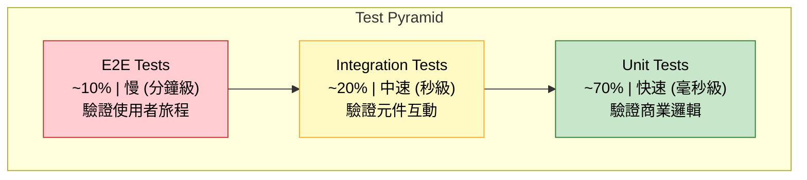
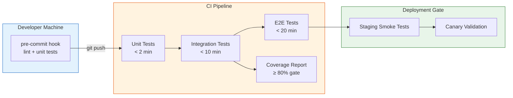

# Testing Strategy / 測試策略

## Intent / 意圖

透過分層測試（layered testing）建立對程式碼正確性的信心。測試策略的核心不是「寫更多測試」，而是在正確的層級寫正確的測試——單元測試驗證商業邏輯、整合測試驗證元件互動、端對端測試驗證使用者旅程。好的測試策略讓團隊能在數秒內得知「這個改動是否破壞了現有行為」，並在部署前攔截 95% 以上的缺陷。

核心問題：**如何設計一套既快速又可靠的測試體系，讓開發者在重構、新增功能、修復 bug 時，能以最低成本獲得最高的信心保障？**

---

## Problem / 問題情境

**場景一：未測試的程式碼在 production 爆炸**

某團隊的訂單服務新增了折扣計算邏輯，開發者手動測試「輸入 100 元打八折 = 80 元」確認無誤後上線。三天後客訴湧入——當折扣碼疊加會員等級折扣時，計算結果變成負數。沒有單元測試覆蓋邊界條件（零元訂單、多重折扣疊加、折扣超過原價），手動測試只驗證了 happy path。

**場景二：測試套件耗時 45 分鐘，開發者不再跑測試**

整合測試直接連接真實資料庫和外部 API，每次執行需要 spin up Docker containers、seed 測試資料、等待外部服務回應。CI pipeline 從 push 到綠燈需要 45 分鐘。開發者開始跳過本地測試直接 push，PR review 時測試失敗才發現問題——修復 → 再等 45 分鐘，一個 PR 可能卡兩天。

**場景三：Flaky tests 摧毀團隊信任**

測試套件中有 5% 的 flaky tests——時間相依的斷言（`assert time.Now() < deadline`）、共享資料庫狀態的測試互相污染、依賴外部服務的測試在網路抖動時失敗。開發者養成習慣：「紅燈了？再跑一次就好。」當真正的 regression 混在 flaky 紅燈中被忽略，最終上了 production。

---

## Core Concepts / 核心概念

### Test Pyramid / 測試金字塔

由 Mike Cohn 提出的測試分層模型。底層是大量快速的單元測試（70%），中層是適量的整合測試（20%），頂層是少量的端對端測試（10%）。金字塔形狀反映了成本與速度的權衡——越往上，測試越慢、越脆弱、維護成本越高，但覆蓋的系統行為越接近真實使用者體驗。

### Test Doubles / 測試替身

替代真實依賴的物件，分為五類：(1) **Mock** — 預設期望行為並驗證互動（呼叫次數、參數）；(2) **Stub** — 回傳固定值，不驗證互動；(3) **Fake** — 簡化版的真實實作（如 in-memory database）；(4) **Spy** — 記錄互動供事後斷言；(5) **Dummy** — 僅滿足型別需求，不參與邏輯。選擇原則：優先用 stub/fake（行為驅動），mock 只在需要驗證互動時使用。

### TDD / 測試驅動開發

Red-Green-Refactor 循環：(1) 寫一個失敗的測試描述預期行為；(2) 寫最少量的程式碼讓測試通過；(3) 重構程式碼同時保持測試綠燈。TDD 不是銀彈——適合邏輯密集的 domain layer，不適合 UI 和 infrastructure glue code。

### Property-Based Testing / 屬性測試

不提供具體的輸入/輸出，而是定義「對所有合法輸入都應成立的屬性」，由框架自動生成大量隨機測試案例。例如：「序列化後再反序列化，結果與原始資料相同」、「排序後陣列長度不變且每個元素 <= 下一個」。Rust 用 `proptest`，Go 用 `testing/quick` 或 `rapid`。

### Snapshot Testing / 快照測試

將函式的輸出序列化成檔案（golden file），後續執行時比對輸出與快照是否一致。適合 API response、HTML 渲染、錯誤訊息等結構穩定的輸出。Rust 用 `insta`，Go 用 `cupaloy`。

### Test Coverage / 測試覆蓋率

衡量測試執行時觸及的程式碼比例。**行覆蓋率（line coverage）** 衡量執行過的行數，**分支覆蓋率（branch coverage）** 衡量所有 if/else 分支是否都被走過。分支覆蓋率比行覆蓋率更有價值——100% 行覆蓋率可能遺漏整個 else 分支。合理目標：80% 行覆蓋率 + 關鍵路徑 100% 分支覆蓋。

### Test Isolation / 測試隔離

每個測試案例必須獨立運行，不依賴其他測試的執行順序或副作用。共享的資料庫狀態、全域變數、檔案系統都是隔離的敵人。策略：每個測試用獨立的資料庫 transaction（測試結束 rollback）、in-memory fake、temporary directory。

### Test Fixtures / 測試固件

測試前置條件的標準化設定。包含測試資料（seed data）、mock 設定、環境變數。Rust 用 `#[fixture]` 搭配 `rstest`，Go 用 `TestMain` 或 `testing.T` helper function。好的 fixture 讓測試 focus 在「驗證什麼」而非「準備什麼」。

### Golden Files / 黃金檔案

預先產生並提交到版控的參考輸出檔案。測試時將實際輸出與 golden file 比對。更新時加 `--update` flag 重新產生。適合穩定的輸出格式（API schema、protobuf 定義、SQL migration），不適合包含時間戳或隨機值的輸出。

---

## Architecture / 架構

### 測試金字塔與比例



### 測試執行管線



---

## How It Works / 運作原理

### 三層測試的職責劃分

**Unit Test（單元測試）**：測試單一函式或方法的邏輯，所有外部依賴以 test double 替代。執行速度在毫秒級，應佔測試套件 70% 以上。適合測試：商業規則計算（價格、折扣、權限判斷）、資料轉換與驗證、演算法邏輯、錯誤處理分支。不適合測試：資料庫查詢語法是否正確、HTTP routing 是否正確。

**Integration Test（整合測試）**：測試多個元件的互動行為，使用真實的外部依賴（資料庫、Redis）或高擬真度的 fake。執行速度在秒級。適合測試：Repository 層的 SQL 查詢是否正確、HTTP handler 到 service 到 repository 的完整流程、middleware 行為（auth、rate limiting）。不適合測試：跨多個微服務的工作流程。

**E2E Test（端對端測試）**：從使用者角度驗證完整的業務流程，啟動所有服務並模擬真實請求。執行速度在分鐘級。適合測試：使用者註冊 → 登入 → 下單 → 付款的完整旅程、關鍵業務路徑的 smoke test。不適合測試：邊界條件和錯誤路徑（用 unit test 覆蓋更有效率）。

### 選擇測試層級的決策樹

1. 測試的是純邏輯（無 I/O）嗎？ → **Unit Test**
2. 測試需要真實的資料庫 / 外部服務嗎？ → **Integration Test**
3. 測試驗證的是跨服務的使用者旅程嗎？ → **E2E Test**
4. 能否把 integration test 拆成 unit test + contract test？ → 優先拆分

---

## Rust 實作

### Unit Test — 服務層折扣計算

```rust
// discount_service.rs
// 使用 trait 抽象 repository 依賴，unit test 以 mock 替代

use async_trait::async_trait;
use rust_decimal::Decimal;
use rust_decimal_macros::dec;
use std::sync::Arc;

// ─── Domain Types ───

#[derive(Debug, Clone, PartialEq)]
pub struct Order {
    pub order_id: String,
    pub subtotal: Decimal,
    pub member_tier: MemberTier,
}

#[derive(Debug, Clone, PartialEq)]
pub enum MemberTier {
    Standard,
    Silver,
    Gold,
}

#[derive(Debug, Clone, PartialEq)]
pub struct DiscountResult {
    pub original: Decimal,
    pub discount_amount: Decimal,
    pub final_price: Decimal,
}

// ─── Repository Trait ───

#[async_trait]
pub trait CouponRepository: Send + Sync {
    async fn find_discount_rate(&self, coupon_code: &str) -> Option<Decimal>;
}

// ─── Service ───

pub struct DiscountService {
    coupon_repo: Arc<dyn CouponRepository>,
}

impl DiscountService {
    pub fn new(coupon_repo: Arc<dyn CouponRepository>) -> Self {
        Self { coupon_repo }
    }

    pub async fn calculate_discount(
        &self,
        order: &Order,
        coupon_code: Option<&str>,
    ) -> Result<DiscountResult, String> {
        if order.subtotal <= Decimal::ZERO {
            return Err("Order subtotal must be positive".to_string());
        }

        // Member tier discount
        let member_rate = match order.member_tier {
            MemberTier::Standard => dec!(0.00),
            MemberTier::Silver => dec!(0.05),
            MemberTier::Gold => dec!(0.10),
        };

        // Coupon discount
        let coupon_rate = match coupon_code {
            Some(code) => self
                .coupon_repo
                .find_discount_rate(code)
                .await
                .ok_or_else(|| format!("Invalid coupon code: {}", code))?,
            None => dec!(0.00),
        };

        // Total discount capped at 30% to prevent negative prices
        let total_rate = (member_rate + coupon_rate).min(dec!(0.30));
        let discount_amount = (order.subtotal * total_rate).round_dp(2);
        let final_price = order.subtotal - discount_amount;

        Ok(DiscountResult {
            original: order.subtotal,
            discount_amount,
            final_price,
        })
    }
}

// ─── Unit Tests ───

#[cfg(test)]
mod tests {
    use super::*;

    // Mock repository — returns preconfigured discount rates
    struct StubCouponRepo {
        rate: Option<Decimal>,
    }

    #[async_trait]
    impl CouponRepository for StubCouponRepo {
        async fn find_discount_rate(&self, _coupon_code: &str) -> Option<Decimal> {
            self.rate
        }
    }

    fn gold_order(subtotal: Decimal) -> Order {
        Order {
            order_id: "ORD-001".to_string(),
            subtotal,
            member_tier: MemberTier::Gold,
        }
    }

    fn standard_order(subtotal: Decimal) -> Order {
        Order {
            order_id: "ORD-002".to_string(),
            subtotal,
            member_tier: MemberTier::Standard,
        }
    }

    #[tokio::test]
    async fn gold_member_gets_ten_percent_discount() {
        let repo = Arc::new(StubCouponRepo { rate: None });
        let service = DiscountService::new(repo);
        let order = gold_order(dec!(1000));

        let result = service.calculate_discount(&order, None).await.unwrap();

        assert_eq!(result.discount_amount, dec!(100.00));
        assert_eq!(result.final_price, dec!(900.00));
    }

    #[tokio::test]
    async fn coupon_stacks_with_member_discount_capped_at_thirty_percent() {
        // Gold (10%) + coupon (25%) = 35% → capped at 30%
        let repo = Arc::new(StubCouponRepo { rate: Some(dec!(0.25)) });
        let service = DiscountService::new(repo);
        let order = gold_order(dec!(1000));

        let result = service.calculate_discount(&order, Some("SUMMER25")).await.unwrap();

        assert_eq!(result.discount_amount, dec!(300.00)); // 30% cap
        assert_eq!(result.final_price, dec!(700.00));
    }

    #[tokio::test]
    async fn zero_subtotal_returns_error() {
        let repo = Arc::new(StubCouponRepo { rate: None });
        let service = DiscountService::new(repo);
        let order = Order {
            order_id: "ORD-003".to_string(),
            subtotal: Decimal::ZERO,
            member_tier: MemberTier::Standard,
        };

        let err = service.calculate_discount(&order, None).await.unwrap_err();
        assert_eq!(err, "Order subtotal must be positive");
    }

    #[tokio::test]
    async fn invalid_coupon_returns_error() {
        let repo = Arc::new(StubCouponRepo { rate: None }); // returns None
        let service = DiscountService::new(repo);
        let order = standard_order(dec!(500));

        let err = service.calculate_discount(&order, Some("EXPIRED")).await.unwrap_err();
        assert!(err.contains("Invalid coupon code"));
    }

    #[tokio::test]
    async fn standard_member_no_coupon_pays_full_price() {
        let repo = Arc::new(StubCouponRepo { rate: None });
        let service = DiscountService::new(repo);
        let order = standard_order(dec!(250));

        let result = service.calculate_discount(&order, None).await.unwrap();

        assert_eq!(result.discount_amount, dec!(0.00));
        assert_eq!(result.final_price, dec!(250));
    }
}

// Output:
// running 5 tests
// test tests::gold_member_gets_ten_percent_discount ... ok
// test tests::coupon_stacks_with_member_discount_capped_at_thirty_percent ... ok
// test tests::zero_subtotal_returns_error ... ok
// test tests::invalid_coupon_returns_error ... ok
// test tests::standard_member_no_coupon_pays_full_price ... ok
// test result: ok. 5 passed; 0 failed
```

### Integration Test — Axum Handler 搭配 Mock Repository

```rust
// order_handler_test.rs
// 使用 axum::test 驗證 HTTP handler + service + mock repository 的完整流程

use axum::{
    body::Body,
    http::{Request, StatusCode},
    routing::post,
    extract::State,
    Json, Router,
};
use serde::{Deserialize, Serialize};
use tower::ServiceExt; // for `oneshot`
use std::sync::Arc;

// ─── Re-use domain types from discount_service ───

#[derive(Debug, Serialize, Deserialize)]
struct ApplyDiscountRequest {
    order_id: String,
    subtotal: f64,
    member_tier: String,
    coupon_code: Option<String>,
}

#[derive(Debug, Serialize, Deserialize)]
struct ApplyDiscountResponse {
    order_id: String,
    original: f64,
    discount_amount: f64,
    final_price: f64,
}

// ─── Simplified service for integration test demo ───

#[derive(Clone)]
struct AppState {
    max_discount_rate: f64,
}

async fn apply_discount_handler(
    State(state): State<AppState>,
    Json(req): Json<ApplyDiscountRequest>,
) -> Result<Json<ApplyDiscountResponse>, StatusCode> {
    if req.subtotal <= 0.0 {
        return Err(StatusCode::BAD_REQUEST);
    }

    let member_rate = match req.member_tier.as_str() {
        "gold" => 0.10,
        "silver" => 0.05,
        _ => 0.00,
    };

    let coupon_rate = match req.coupon_code.as_deref() {
        Some("SUMMER25") => 0.25,
        Some(_) => return Err(StatusCode::UNPROCESSABLE_ENTITY),
        None => 0.00,
    };

    let total_rate = (member_rate + coupon_rate).min(state.max_discount_rate);
    let discount_amount = (req.subtotal * total_rate * 100.0).round() / 100.0;

    Ok(Json(ApplyDiscountResponse {
        order_id: req.order_id,
        original: req.subtotal,
        discount_amount,
        final_price: req.subtotal - discount_amount,
    }))
}

fn build_test_app() -> Router {
    let state = AppState {
        max_discount_rate: 0.30,
    };
    Router::new()
        .route("/orders/discount", post(apply_discount_handler))
        .with_state(state)
}

#[cfg(test)]
mod tests {
    use super::*;
    use http_body_util::BodyExt;

    #[tokio::test]
    async fn apply_discount_returns_correct_calculation() {
        let app = build_test_app();

        let body = serde_json::json!({
            "order_id": "ORD-100",
            "subtotal": 1000.0,
            "member_tier": "gold",
            "coupon_code": "SUMMER25"
        });

        let request = Request::builder()
            .method("POST")
            .uri("/orders/discount")
            .header("content-type", "application/json")
            .body(Body::from(serde_json::to_string(&body).unwrap()))
            .unwrap();

        let response = app.oneshot(request).await.unwrap();

        assert_eq!(response.status(), StatusCode::OK);

        let body_bytes = response.into_body().collect().await.unwrap().to_bytes();
        let resp: ApplyDiscountResponse = serde_json::from_slice(&body_bytes).unwrap();

        assert_eq!(resp.order_id, "ORD-100");
        assert_eq!(resp.discount_amount, 300.0); // capped at 30%
        assert_eq!(resp.final_price, 700.0);
    }

    #[tokio::test]
    async fn invalid_coupon_returns_unprocessable_entity() {
        let app = build_test_app();

        let body = serde_json::json!({
            "order_id": "ORD-101",
            "subtotal": 500.0,
            "member_tier": "standard",
            "coupon_code": "INVALID"
        });

        let request = Request::builder()
            .method("POST")
            .uri("/orders/discount")
            .header("content-type", "application/json")
            .body(Body::from(serde_json::to_string(&body).unwrap()))
            .unwrap();

        let response = app.oneshot(request).await.unwrap();
        assert_eq!(response.status(), StatusCode::UNPROCESSABLE_ENTITY);
    }

    #[tokio::test]
    async fn negative_subtotal_returns_bad_request() {
        let app = build_test_app();

        let body = serde_json::json!({
            "order_id": "ORD-102",
            "subtotal": -100.0,
            "member_tier": "standard"
        });

        let request = Request::builder()
            .method("POST")
            .uri("/orders/discount")
            .header("content-type", "application/json")
            .body(Body::from(serde_json::to_string(&body).unwrap()))
            .unwrap();

        let response = app.oneshot(request).await.unwrap();
        assert_eq!(response.status(), StatusCode::BAD_REQUEST);
    }
}

// Output:
// running 3 tests
// test tests::apply_discount_returns_correct_calculation ... ok
// test tests::invalid_coupon_returns_unprocessable_entity ... ok
// test tests::negative_subtotal_returns_bad_request ... ok
// test result: ok. 3 passed; 0 failed
```

---

## Go 實作

### Unit Test — 以 Interface Mock 測試服務層

```go
// discount_service_test.go
// 使用 interface + mock struct 測試 DiscountService 的商業邏輯

package discount

import (
	"context"
	"errors"
	"math"
	"testing"
)

// ─── Domain Types ───

type MemberTier string

const (
	TierStandard MemberTier = "standard"
	TierSilver   MemberTier = "silver"
	TierGold     MemberTier = "gold"
)

type Order struct {
	OrderID    string
	Subtotal   float64
	MemberTier MemberTier
}

type DiscountResult struct {
	Original       float64
	DiscountAmount float64
	FinalPrice     float64
}

// ─── Repository Interface ───

type CouponRepository interface {
	FindDiscountRate(ctx context.Context, couponCode string) (float64, error)
}

// ─── Service ───

type DiscountService struct {
	couponRepo     CouponRepository
	maxDiscountRate float64
}

func NewDiscountService(repo CouponRepository) *DiscountService {
	return &DiscountService{
		couponRepo:     repo,
		maxDiscountRate: 0.30,
	}
}

func (s *DiscountService) CalculateDiscount(
	ctx context.Context, order Order, couponCode string,
) (DiscountResult, error) {
	if order.Subtotal <= 0 {
		return DiscountResult{}, errors.New("order subtotal must be positive")
	}

	memberRate := 0.0
	switch order.MemberTier {
	case TierSilver:
		memberRate = 0.05
	case TierGold:
		memberRate = 0.10
	}

	couponRate := 0.0
	if couponCode != "" {
		rate, err := s.couponRepo.FindDiscountRate(ctx, couponCode)
		if err != nil {
			return DiscountResult{}, err
		}
		couponRate = rate
	}

	totalRate := math.Min(memberRate+couponRate, s.maxDiscountRate)
	discountAmount := math.Round(order.Subtotal*totalRate*100) / 100
	finalPrice := order.Subtotal - discountAmount

	return DiscountResult{
		Original:       order.Subtotal,
		DiscountAmount: discountAmount,
		FinalPrice:     finalPrice,
	}, nil
}

// ─── Mock Repository ───

type stubCouponRepo struct {
	rate float64
	err  error
}

func (m *stubCouponRepo) FindDiscountRate(_ context.Context, _ string) (float64, error) {
	return m.rate, m.err
}

// ─── Tests ───

func TestGoldMemberGetsTenPercentDiscount(t *testing.T) {
	repo := &stubCouponRepo{rate: 0, err: nil}
	service := NewDiscountService(repo)
	order := Order{OrderID: "ORD-001", Subtotal: 1000, MemberTier: TierGold}

	result, err := service.CalculateDiscount(context.Background(), order, "")

	if err != nil {
		t.Fatalf("unexpected error: %v", err)
	}
	if result.DiscountAmount != 100.0 {
		t.Errorf("want discount 100.0, got %.2f", result.DiscountAmount)
	}
	if result.FinalPrice != 900.0 {
		t.Errorf("want final price 900.0, got %.2f", result.FinalPrice)
	}
}

func TestCouponStacksWithMemberDiscountCappedAtThirtyPercent(t *testing.T) {
	repo := &stubCouponRepo{rate: 0.25, err: nil} // Gold 10% + Coupon 25% = 35% → capped 30%
	service := NewDiscountService(repo)
	order := Order{OrderID: "ORD-002", Subtotal: 1000, MemberTier: TierGold}

	result, err := service.CalculateDiscount(context.Background(), order, "SUMMER25")

	if err != nil {
		t.Fatalf("unexpected error: %v", err)
	}
	if result.DiscountAmount != 300.0 {
		t.Errorf("want discount 300.0 (30%% cap), got %.2f", result.DiscountAmount)
	}
	if result.FinalPrice != 700.0 {
		t.Errorf("want final price 700.0, got %.2f", result.FinalPrice)
	}
}

func TestZeroSubtotalReturnsError(t *testing.T) {
	repo := &stubCouponRepo{}
	service := NewDiscountService(repo)
	order := Order{OrderID: "ORD-003", Subtotal: 0, MemberTier: TierStandard}

	_, err := service.CalculateDiscount(context.Background(), order, "")

	if err == nil {
		t.Fatal("expected error for zero subtotal")
	}
	if err.Error() != "order subtotal must be positive" {
		t.Errorf("unexpected error message: %v", err)
	}
}

func TestInvalidCouponReturnsRepositoryError(t *testing.T) {
	repo := &stubCouponRepo{err: errors.New("coupon not found: EXPIRED")}
	service := NewDiscountService(repo)
	order := Order{OrderID: "ORD-004", Subtotal: 500, MemberTier: TierStandard}

	_, err := service.CalculateDiscount(context.Background(), order, "EXPIRED")

	if err == nil {
		t.Fatal("expected error for invalid coupon")
	}
}

func TestStandardMemberNoCouponPaysFullPrice(t *testing.T) {
	repo := &stubCouponRepo{rate: 0, err: nil}
	service := NewDiscountService(repo)
	order := Order{OrderID: "ORD-005", Subtotal: 250, MemberTier: TierStandard}

	result, err := service.CalculateDiscount(context.Background(), order, "")

	if err != nil {
		t.Fatalf("unexpected error: %v", err)
	}
	if result.DiscountAmount != 0 {
		t.Errorf("want discount 0, got %.2f", result.DiscountAmount)
	}
	if result.FinalPrice != 250.0 {
		t.Errorf("want final price 250.0, got %.2f", result.FinalPrice)
	}
}

// Output:
// === RUN   TestGoldMemberGetsTenPercentDiscount
// --- PASS: TestGoldMemberGetsTenPercentDiscount (0.00s)
// === RUN   TestCouponStacksWithMemberDiscountCappedAtThirtyPercent
// --- PASS: TestCouponStacksWithMemberDiscountCappedAtThirtyPercent (0.00s)
// === RUN   TestZeroSubtotalReturnsError
// --- PASS: TestZeroSubtotalReturnsError (0.00s)
// === RUN   TestInvalidCouponReturnsRepositoryError
// --- PASS: TestInvalidCouponReturnsRepositoryError (0.00s)
// === RUN   TestStandardMemberNoCouponPaysFullPrice
// --- PASS: TestStandardMemberNoCouponPaysFullPrice (0.00s)
// PASS
// ok  	discount	0.001s
```

### Integration Test — httptest 驗證 HTTP Handler

```go
// order_handler_test.go
// 使用 net/http/httptest 驗證 handler + service 的完整 HTTP 流程

package discount

import (
	"encoding/json"
	"net/http"
	"net/http/httptest"
	"strings"
	"testing"
)

// ─── Handler ───

func ApplyDiscountHandler(service *DiscountService) http.HandlerFunc {
	return func(w http.ResponseWriter, r *http.Request) {
		var req struct {
			OrderID    string `json:"order_id"`
			Subtotal   float64 `json:"subtotal"`
			MemberTier string  `json:"member_tier"`
			CouponCode string  `json:"coupon_code"`
		}
		if err := json.NewDecoder(r.Body).Decode(&req); err != nil {
			http.Error(w, "invalid request body", http.StatusBadRequest)
			return
		}

		order := Order{
			OrderID:    req.OrderID,
			Subtotal:   req.Subtotal,
			MemberTier: MemberTier(req.MemberTier),
		}

		result, err := service.CalculateDiscount(r.Context(), order, req.CouponCode)
		if err != nil {
			http.Error(w, err.Error(), http.StatusUnprocessableEntity)
			return
		}

		w.Header().Set("Content-Type", "application/json")
		w.WriteHeader(http.StatusOK)
		json.NewEncoder(w).Encode(map[string]any{
			"order_id":        req.OrderID,
			"original":        result.Original,
			"discount_amount": result.DiscountAmount,
			"final_price":     result.FinalPrice,
		})
	}
}

// ─── Integration Tests ───

func TestApplyDiscountHandler_GoldMemberWithCoupon(t *testing.T) {
	repo := &stubCouponRepo{rate: 0.25}
	service := NewDiscountService(repo)
	handler := ApplyDiscountHandler(service)

	body := `{"order_id":"ORD-200","subtotal":1000,"member_tier":"gold","coupon_code":"SUMMER25"}`
	req := httptest.NewRequest(http.MethodPost, "/orders/discount", strings.NewReader(body))
	req.Header.Set("Content-Type", "application/json")
	rec := httptest.NewRecorder()

	handler.ServeHTTP(rec, req)

	if rec.Code != http.StatusOK {
		t.Fatalf("want status 200, got %d", rec.Code)
	}

	var resp map[string]any
	if err := json.Unmarshal(rec.Body.Bytes(), &resp); err != nil {
		t.Fatalf("failed to decode response: %v", err)
	}

	if resp["discount_amount"] != 300.0 {
		t.Errorf("want discount_amount 300.0, got %v", resp["discount_amount"])
	}
	if resp["final_price"] != 700.0 {
		t.Errorf("want final_price 700.0, got %v", resp["final_price"])
	}
}

func TestApplyDiscountHandler_InvalidBody(t *testing.T) {
	repo := &stubCouponRepo{}
	service := NewDiscountService(repo)
	handler := ApplyDiscountHandler(service)

	req := httptest.NewRequest(http.MethodPost, "/orders/discount", strings.NewReader("not json"))
	rec := httptest.NewRecorder()

	handler.ServeHTTP(rec, req)

	if rec.Code != http.StatusBadRequest {
		t.Errorf("want status 400, got %d", rec.Code)
	}
}

func TestApplyDiscountHandler_ZeroSubtotal(t *testing.T) {
	repo := &stubCouponRepo{}
	service := NewDiscountService(repo)
	handler := ApplyDiscountHandler(service)

	body := `{"order_id":"ORD-201","subtotal":0,"member_tier":"standard"}`
	req := httptest.NewRequest(http.MethodPost, "/orders/discount", strings.NewReader(body))
	req.Header.Set("Content-Type", "application/json")
	rec := httptest.NewRecorder()

	handler.ServeHTTP(rec, req)

	if rec.Code != http.StatusUnprocessableEntity {
		t.Errorf("want status 422, got %d", rec.Code)
	}
}

// Output:
// === RUN   TestApplyDiscountHandler_GoldMemberWithCoupon
// --- PASS: TestApplyDiscountHandler_GoldMemberWithCoupon (0.00s)
// === RUN   TestApplyDiscountHandler_InvalidBody
// --- PASS: TestApplyDiscountHandler_InvalidBody (0.00s)
// === RUN   TestApplyDiscountHandler_ZeroSubtotal
// --- PASS: TestApplyDiscountHandler_ZeroSubtotal (0.00s)
// PASS
// ok  	discount	0.002s
```

---

## Rust vs Go 對照表

| 面向 | Rust (tokio::test + axum::test) | Go (testing + httptest) |
|---|---|---|
| **測試框架** | 內建 `#[test]` 和 `#[tokio::test]`，無需額外 test runner。`cargo test` 自動發現 `#[cfg(test)]` 模組中的測試函式，支援平行執行。整合 `tower::ServiceExt::oneshot` 測試 Axum handler，不需啟動真實 HTTP server | 內建 `testing` 套件，`go test` 自動發現 `Test` 前綴函式。`httptest.NewRecorder` + `httptest.NewRequest` 在記憶體中模擬 HTTP 交互，不需啟動 server。Table-driven tests 是社群慣例但非語言強制 |
| **Mocking 方式** | 依賴 trait 抽象——定義 `trait Repository`，production 用真實實作，測試用手寫 stub struct 實作同一 trait。`mockall` crate 可自動生成 mock。Rust 的型別系統在編譯期保證 mock 與真實實作的 signature 完全一致 | 依賴 interface 抽象——定義 `type Repository interface`，測試用手寫 struct 實作同一 interface。`gomock`、`testify/mock` 可自動生成。Go 的 implicit interface 讓 mock 不需要顯式聲明實作哪個 interface，更靈活但也更容易漏方法 |
| **測試組織** | `#[cfg(test)] mod tests` 放在同一個檔案中（可存取 private members），整合測試放在 `tests/` 目錄（只能存取 public API）。這個分離由 Cargo 強制執行，清楚劃分 unit 與 integration 的邊界 | `_test.go` 後綴檔案自動被 `go test` 識別。同 package 可測 private，`_test` package（如 `package foo_test`）只測 public API。`go test -run TestName` 支援 regex 篩選。`testdata/` 目錄存放 golden files |
| **覆蓋率工具** | `cargo tarpaulin` 或 `cargo llvm-cov` 產生覆蓋率報告。`llvm-cov` 支援 branch coverage，輸出 lcov 格式可整合 CI。目前生態系成熟度落後 Go | `go test -cover -coverprofile=coverage.out` 內建支援，`go tool cover -html=coverage.out` 直接產生 HTML 報告。只支援 line coverage，branch coverage 需第三方工具（`gobco`） |

---

## When to Use / 適用場景

### 1. 核心商業邏輯變更頻繁的 domain layer

當折扣計算、權限判斷、狀態機轉換等核心邏輯經常因為需求變更而修改時，密集的 unit test 是唯一能讓團隊安全重構的手段。每次修改後在毫秒內驗證所有邊界條件——沒有 unit test 的重構就是在蒙眼走鋼索。

### 2. 多團隊協作的微服務架構

當多個團隊各自維護不同的微服務時，整合測試和 contract test 確保服務間的 API 契約不被單方面破壞。Team A 修改了 response schema，Team B 的 contract test 會在 CI 階段立即紅燈——比在 staging 環境發現問題早數小時。

### 3. 對外暴露的 public API

任何有 SLA 承諾的 API endpoint 都需要完整的測試覆蓋。regression test 確保版本升級不破壞現有行為，property-based test 發現人工難以想到的邊界條件。

---

## When NOT to Use / 不適用場景

### 1. 過度測試顯而易見的 trivial code

為 getter/setter、簡單的 DTO 轉換、直接委派的 wrapper function 寫 unit test，測試的是語言特性而非商業邏輯。這些測試只增加維護負擔，不提供安全保障。原則：如果一個函式的實作比測試更簡單、更不容易出錯，就不需要測試它。

### 2. 對頻繁變動的 UI 輸出使用 snapshot testing

Snapshot test 適合結構穩定的輸出（API schema、error message）。但如果 UI 模板或前端元件每週都在改版，snapshot 會頻繁 break，開發者養成「盲目 update snapshot」的習慣，測試失去意義——不如用視覺回歸測試（visual regression）工具。

### 3. 用 E2E test 覆蓋邊界條件

一個 E2E test 執行 30 秒，涵蓋網路、資料庫、外部服務等多個失敗點。用 E2E test 覆蓋「折扣為零時的行為」「超過最大金額時的行為」等邊界條件是浪費——同樣的驗證在 unit test 中 1 毫秒就能完成，且不會因為外部服務 timeout 而 flaky。

---

## Real-World Examples / 真實世界案例

### Google 的測試實踐

Google 在 2015 年公開的數據顯示其 monorepo 中有超過 4 億行程式碼和 5000 萬個測試案例，每天執行 4 百萬次測試。Google 的測試分類不用 unit/integration/e2e，而是按規模：**Small**（單進程、無 I/O、< 60 秒）、**Medium**（可用 localhost、< 300 秒）、**Large**（可用外部資源、< 900 秒）。這套分類避免了「什麼算 unit test」的語義爭論，專注於測試的執行特性。Google 的經驗法則：70% Small、20% Medium、10% Large。每個 PR 必須包含對應的測試，code review 會檢查測試覆蓋率。CI 系統（TAP）會自動判斷哪些測試受到程式碼改動影響，只執行相關測試以節省時間。

### Spotify 的測試文化

Spotify 採用「Squad」（自治小組）模式，每個 Squad 負責自己的微服務和測試策略。Spotify 的實踐重點：(1) **Test Ratio Dashboard** — 每個 Squad 的測試金字塔比例可視化，偏離理想比例（70/20/10）時觸發自動提醒；(2) **Flaky Test Quarantine** — CI 系統自動偵測過去 7 天內失敗率超過 5% 的測試，將其隔離到獨立的 quarantine suite，不阻擋 PR merge，但會開 ticket 追蹤修復。這避免了 flaky test 摧毀團隊對 CI 的信任；(3) **Testing Guilds** — 跨 Squad 的測試知識分享社群，定期舉辦 workshop 教導 property-based testing、contract testing 等進階技術。

---

## Interview Questions / 面試常見問題

### Q1: 請解釋測試金字塔，以及各層測試的職責與比例。

**A:** 測試金字塔由下而上：(1) Unit tests（~70%）——測試單一函式的邏輯，所有外部依賴用 test double 替代，毫秒級執行；(2) Integration tests（~20%）——測試多個元件的互動，使用真實資料庫或 fake，秒級執行；(3) E2E tests（~10%）——從使用者角度驗證完整業務流程，分鐘級執行。金字塔形狀反映成本效益：底層測試快速、穩定、維護成本低，能以最低成本覆蓋最多邏輯分支；頂層測試慢、脆弱、維護成本高，但最接近真實使用者行為。反模式是「冰淇淋錐」——大量 E2E、少量 unit test，導致 CI 極慢且充滿 flaky tests。

### Q2: Mock 和 Stub 的差別是什麼？何時使用哪一種？

**A:** Stub 提供固定的回傳值，不關心呼叫者如何使用它（例如 `StubCouponRepo` 永遠回傳 0.25 折扣率）。Mock 除了提供回傳值，還驗證互動行為——呼叫了幾次、傳了什麼參數、以什麼順序呼叫。**原則：優先用 stub，只在需要驗證互動時用 mock。** 例如測試「折扣計算結果是否正確」用 stub（只關心結果）；測試「發送通知時是否呼叫了 email service 且傳入正確的收件人」用 mock（需要驗證互動）。過度使用 mock 會讓測試耦合到實作細節——重構內部實作時 mock 驗證會 break，即使行為正確。

### Q3: 如何處理 flaky tests？你的團隊遇過哪些 flaky test 的原因？

**A:** 常見原因與對策：(1) **時間相依** — `assert time.Now().Before(deadline)` 在 CI 負載高時失敗。對策：注入 `Clock` interface，測試用 `FakeClock`。(2) **共享狀態** — 測試 A 寫入資料庫的資料影響測試 B。對策：每個測試用獨立的 database transaction 並在結束時 rollback，或每次 test run 用獨立的 schema/database。(3) **外部依賴** — 測試依賴第三方 API 的真實回應。對策：整合測試用 WireMock/httpmock 攔截外部呼叫。(4) **並行衝突** — 測試平行執行時競爭同一個 port。對策：使用隨機 port（Go 的 `:0`、Rust 的 `TcpListener::bind("127.0.0.1:0")`）。系統性對策：CI 追蹤每個測試的歷史 pass rate，自動隔離 flaky tests 到 quarantine suite。

### Q4: 測試覆蓋率 100% 是否值得追求？

**A:** 不值得。100% 行覆蓋率不等於 100% 正確性——覆蓋率只衡量「程式碼被執行過」，不衡量「斷言是否有意義」。可以寫出覆蓋率 100% 但完全沒有 assert 的測試（稱為「覆蓋率遊戲」）。合理目標：關鍵商業邏輯 90%+ 分支覆蓋，整體 80% 行覆蓋作為 CI gate。更重要的是覆蓋率的分佈——domain layer 95%、infrastructure glue code 60% 是合理的。追求從 95% 到 100% 的邊際成本極高（測試極端邊界、panic handler、unreachable code），收益遞減。應該把精力投入到提升測試品質（有意義的斷言、邊界條件覆蓋）而非追逐數字。

### Q5: 在微服務架構中，如何測試跨服務的互動？

**A:** 三種策略搭配使用：(1) **Contract Testing**（推薦首選）— 使用 Pact 等工具，consumer 端定義「我期望 provider 回傳什麼」，provider 端驗證是否滿足所有 consumer 的期望。每個服務獨立測試，不需要同時啟動多個服務。(2) **Integration Test with Test Doubles** — 用 WireMock/httpmock 模擬外部服務的回應，驗證本服務的處理邏輯。比 E2E 快且穩定，但 mock 可能與真實服務行為不一致。(3) **E2E in Staging** — 在 staging 環境啟動所有服務，執行少量 smoke test 驗證關鍵業務路徑。只用於 contract test 無法覆蓋的場景（如驗證 service mesh 的路由規則）。原則：用 contract test 取代 80% 的跨服務 E2E test。

---

## Pitfalls / 常見陷阱

### 1. 測試耦合到實作細節（Testing Implementation Instead of Behavior）

測試驗證的是「service 內部呼叫了 repository 的 `findById` 方法三次」而非「回傳正確的折扣金額」。當重構將三次查詢優化為一次批次查詢時，測試紅燈——但行為完全正確。

```go
// 反面範例：耦合到實作細節
func TestCalculateDiscount_CallsRepoOnce(t *testing.T) {
    mockRepo := &countingRepo{} // 記錄呼叫次數
    service := NewDiscountService(mockRepo)

    service.CalculateDiscount(ctx, order, "SUMMER25")

    if mockRepo.callCount != 1 {
        t.Errorf("expected 1 call, got %d", mockRepo.callCount)
    }
    // 問題：重構 batch query 後，callCount 變化 → 測試失敗
    // 但折扣計算結果完全正確
}

// 正面範例：驗證行為
func TestCalculateDiscount_ReturnsCorrectAmount(t *testing.T) {
    repo := &stubCouponRepo{rate: 0.25}
    service := NewDiscountService(repo)

    result, err := service.CalculateDiscount(ctx, order, "SUMMER25")

    if err != nil {
        t.Fatal(err)
    }
    if result.DiscountAmount != 300.0 {
        t.Errorf("want 300.0, got %.2f", result.DiscountAmount)
    }
    // 重構內部查詢策略不影響此測試
}
```

**對策**：測試應驗證「given 什麼輸入，then 什麼輸出或副作用」，而非「how 內部如何運作」。只在真正需要驗證互動時使用 mock 的 `verify` 功能（如確認通知被發送）。

### 2. Flaky Tests 蠶食 CI 信任

測試在本地通過但在 CI 隨機失敗。根本原因通常是：隱式的時間依賴、測試間的共享狀態、未控制的並行執行順序、對外部服務的真實呼叫。每個 flaky test 都在侵蝕團隊對 CI 的信任——當「再跑一次」成為習慣，真正的 regression 就會被忽略。

```rust
// 反面範例：時間相依的斷言
#[tokio::test]
async fn cache_entry_expires_after_ttl() {
    let cache = InMemoryCache::new(Duration::from_millis(100));
    cache.set("session_token", "abc123").await;

    tokio::time::sleep(Duration::from_millis(150)).await;
    // CI 負載高時 sleep 實際等了 200ms+，但如果 TTL 檢查有浮點精度問題
    // 或 OS 排程延遲導致 sleep 不到 100ms，測試就會隨機失敗

    assert!(cache.get("session_token").await.is_none());
}

// 正面範例：使用可控制的時間
#[tokio::test]
async fn cache_entry_expires_after_ttl() {
    tokio::time::pause(); // tokio 的 time mock
    let cache = InMemoryCache::new(Duration::from_secs(60));
    cache.set("session_token", "abc123").await;

    tokio::time::advance(Duration::from_secs(61)).await;
    // 精確控制時間推進，不受 OS 排程影響

    assert!(cache.get("session_token").await.is_none());
}
```

**對策**：(1) 所有時間操作注入 `Clock` 抽象；(2) 每個測試使用獨立的資料庫狀態；(3) CI 系統追蹤 flaky rate 並自動隔離；(4) 將 flaky test 的修復視為 P1 優先級。

### 3. 測試框架本身（Testing the Framework）

測試驗證的是「Axum 能否正確路由 GET /orders」或「Go 的 json.Marshal 是否能序列化 struct」——這些是框架和標準庫的職責，已經被框架自身的測試覆蓋。這類測試不保護任何商業邏輯，只是在重複測試框架的行為。

**對策**：聚焦在「你的程式碼做了什麼」而非「框架做了什麼」。Handler 測試應該驗證「給定有效的訂單請求，回傳正確的折扣計算結果」，而非「POST 請求能到達 handler」（除非你在測試自定義的 middleware routing 邏輯）。

### 4. 忽略測試的可讀性與可維護性

測試程式碼也是程式碼。一個 200 行的測試函式包含複雜的 setup、多層巢狀的 if/else、晦澀的 magic number，後來的開發者完全不知道這個測試在驗證什麼。當測試失敗時，沒人有勇氣修改它——因為不確定修改後測試是否仍然驗證了原本的意圖。

**對策**：(1) 測試命名描述行為而非實作（`gold_member_gets_ten_percent_discount` 而非 `test_calculate_1`）；(2) 使用 AAA 模式（Arrange-Act-Assert）結構化每個測試；(3) 將重複的 setup 抽取為 helper function 或 fixture；(4) 每個測試只驗證一個行為。

---

## Cross-references / 交叉引用

- [[34_integration_contract_testing|Integration & Contract Testing / 整合與契約測試]] — 本章建立測試金字塔的基礎概念，第 34 章深入探討中間層的整合測試與 contract testing（Pact、gRPC 反射測試）。當你需要測試跨服務的 API 契約時，contract testing 比 E2E test 更快、更穩定。
- [[39_error_handling_retry|Error Handling & Retry / 錯誤處理與重試]] — 錯誤處理邏輯是 unit test 最有價值的覆蓋對象。retry policy 的正確性（退避時間、最大重試次數、是否重試特定錯誤碼）必須透過 unit test 驗證——在 production 發現 retry storm 為時已晚。
- [[40_cicd_deployment|CI/CD & Deployment / 持續整合與部署]] — 測試策略與 CI/CD pipeline 密切配合。unit test 在 pre-commit hook 執行、integration test 在 PR pipeline 執行、E2E test 在 merge to main 後執行。測試的分層直接決定 pipeline stage 的設計。
- [[25_metrics_sli_slo_sla|Metrics & SLI/SLO/SLA / 指標與服務水準]] — 測試覆蓋率本身就是一個 engineering metric。團隊可以設定 SLO：「unit test coverage 不低於 80%」「flaky test rate 不超過 2%」，用 error budget 的思維管理測試品質。

---

## References / 參考資料

1. **Software Engineering at Google** — Winters, Manshreck, Wright, O'Reilly, 2020. (https://abseil.io/resources/swe-book) Chapter 11-14 涵蓋 Google 的測試理念：Test Size（Small/Medium/Large）、Test Doubles 的使用原則、Large-Scale Testing。
2. **The Practical Test Pyramid** — Ham Vocke, Martin Fowler Blog, 2018. (https://martinfowler.com/articles/practical-test-pyramid.html) 測試金字塔的現代實踐指南，包含 REST API 測試、Contract Testing、UI 測試的具體範例。
3. **Unit Testing Principles, Practices, and Patterns** — Vladimir Khorikov, Manning, 2020. 深入探討什麼是「好的 unit test」，London school vs. Classical school，以及如何避免脆弱測試。
4. **Working Effectively with Unit Tests** — Jay Fields, 2014. 聚焦測試可讀性與可維護性，提供大量重構測試的實際案例。
5. **Rust Testing Documentation** — (https://doc.rust-lang.org/book/ch11-00-testing.html) Rust 官方測試指南，涵蓋 `#[test]`、`#[cfg(test)]`、integration tests 目錄結構。
6. **Go Testing Documentation** — (https://pkg.go.dev/testing) Go 標準庫 testing package 文件，包含 benchmark、fuzzing、coverage 等功能。
7. **Test Desiderata** — Kent Beck, 2019. (https://kentbeck.github.io/TestDesiderata/) 定義好測試的 12 個特性（isolated、composable、deterministic 等），用雷達圖視覺化不同測試策略的取捨。
