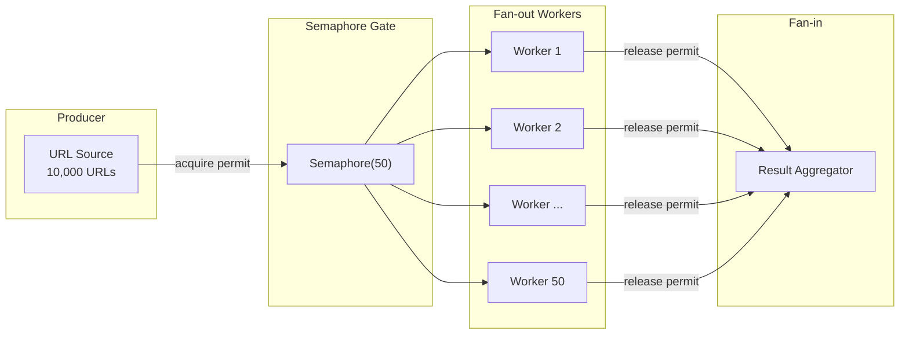
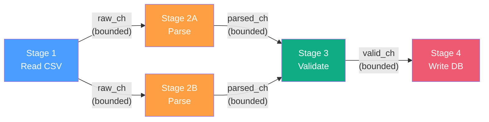

# Concurrency Patterns / 進階並行模式

## Intent / 意圖

探討超越基本 async/await 的**架構級並行模式**。本筆記涵蓋 fan-out/fan-in、pipeline、semaphore、actor model、CSP、backpressure、supervisor、structured concurrency、select/race、cancellation propagation 共十種核心模式，並以 Rust (tokio) 和 Go (goroutines + channels) 雙語實作對照。

核心問題：**當並行任務數量從「幾個」擴展到「數千至數百萬」時，如何在不犧牲正確性的前提下，控制資源消耗、處理錯誤傳播、確保優雅關閉？**

---

## Problem / 問題情境

**場景一：無限制並行導致資源耗盡** — 某微服務對 10,000 個上游 API 發出健康檢查，為每個 URL 各啟動一個 goroutine/task，瞬間突破 file descriptor 上限、壓垮下游觸發限流、記憶體飆升 OOM。

**場景二：Data race 與 deadlock** — 多個 worker 同時讀寫共享 cache。Rust 在編譯期阻止多數 data race，但 `Arc<Mutex<T>>` 不當使用仍可能 deadlock。Go 的 race detector 只在運行時偵測——測試未觸發的路徑會潛伏到 production。

**場景三：Goroutine / task 洩漏** — goroutine 等待 channel 訊息，但生產者因錯誤提前退出未關閉 channel。永遠不結束、記憶體永不回收，最終拖垮服務。

---

## Core Concepts / 核心概念

### Fan-out / Fan-in（扇出 / 扇入）
將任務分散到多個並行 worker（fan-out），再匯聚結果到收集器（fan-in）。透過 semaphore 或 bounded channel 限制同時執行的任務數。

### Pipeline Pattern（管線模式）
處理流程拆成多個階段（stage），各階段由獨立 goroutine/task 處理，階段間透過 channel 傳遞資料。類似 Unix `cmd1 | cmd2 | cmd3`。

### Semaphore（信號量 / 有界並行）
計數器限制同時存取資源的並行數量。tokio 提供 `tokio::sync::Semaphore`，Go 可用 buffered channel 或 `golang.org/x/sync/semaphore`。

### Actor Model（演員模型）
每個 actor 擁有私有狀態，只透過 message passing 通訊，不共享記憶體、不需 lock。Rust 的 Actix、Go 的 `ergo-services/ergo` 是代表實作。

### CSP — Communicating Sequential Processes
Go 的並行哲學：「不要透過共享記憶體來通訊，而要透過通訊來共享記憶體。」Goroutine 是順序處理單元，channel 是通訊管道。Rust 的 `tokio::sync::mpsc` 提供類似語義。

### Backpressure（背壓）
生產者超速時讓其減速的機制。Bounded channel 滿了就 block 生產者，比 unbounded buffer 安全，避免記憶體無限增長。

### Supervisor Pattern（監督者模式）
Erlang/OTP 推廣的 parent-child 監督關係。子任務失敗時 supervisor 依策略（one-for-one、one-for-all）決定重啟。Go 用 `errgroup`，Rust 用 `tokio::task::JoinSet`。

### Structured Concurrency（結構化並行）
子任務生命週期限定在父作用域——父結束時子任務必須已完成或被取消，避免 detached task/goroutine 洩漏。

### Select / Race Patterns（選擇 / 競爭模式）
同時等待多個並行操作，取最先完成的結果。Go 用 `select`，Rust 用 `tokio::select!`。常用於 timeout、cancellation、多路監聽。

### Cancellation Propagation（取消傳播）
透過 `context.Context`（Go）或 `CancellationToken`（tokio-util）將取消訊號從父任務向下傳播到所有子任務，確保優雅終止。

---

## Architecture / 架構

### Fan-out / Fan-in Topology



### Pipeline Pattern



Bounded channel 提供天然 backpressure：下游來不及處理時 channel 滿了，上游自動被 block，連鎖減速。

---

## How It Works / 運作原理

### Fan-out / Fan-in with Bounded Concurrency

1. **初始化 semaphore**：計數為 N（如 N=50）。
2. **生產者迭代**：對每個任務 `acquire` permit。50 個 permit 用完則 block。
3. **啟動 worker**：取得 permit 後 spawn task/goroutine 執行工作。
4. **Worker 完成**：結果送入 result channel，release permit（Rust 中 permit drop 即 release）。
5. **收集結果**：collector 從 result channel 讀取直到所有 worker 完成。

### Pipeline with Backpressure

1. **建立 bounded channels**：每對相鄰階段之間一個有容量限制的 channel。
2. **啟動各階段**：各階段獨立的 goroutine/task，從 input 讀取、處理、寫入 output。
3. **Backpressure 自動生效**：下游慢則 channel 滿，上游 send 被 block。
4. **優雅關閉**：最上游關閉 channel，下游逐層收到 closed 訊號後退出。
5. **錯誤傳播**：透過 error channel 或 context cancellation 通知所有階段停止。

---

## Rust 實作

### Fan-out / Fan-in with tokio::Semaphore

```rust
use std::sync::Arc;
use tokio::sync::{mpsc, Semaphore};

async fn health_check_all(urls: Vec<String>, max_concurrent: usize) -> Vec<(String, bool)> {
    let semaphore = Arc::new(Semaphore::new(max_concurrent));
    let (result_tx, mut result_rx) = mpsc::channel(urls.len());

    for url in urls {
        let sem = Arc::clone(&semaphore);
        let tx = result_tx.clone();
        tokio::spawn(async move {
            let _permit = sem.acquire().await.expect("semaphore closed");
            let is_healthy = check_endpoint(&url).await;
            let _ = tx.send((url, is_healthy)).await;
        });
    }
    drop(result_tx); // 讓 result_rx 能正確結束

    let mut results = Vec::new();
    while let Some(result) = result_rx.recv().await {
        results.push(result);
    }
    results
}

async fn check_endpoint(url: &str) -> bool {
    tokio::time::sleep(std::time::Duration::from_millis(50)).await;
    !url.contains("unhealthy")
}

#[tokio::main]
async fn main() {
    let urls: Vec<String> = (0..100)
        .map(|i| format!("https://service-{i}.example.com/health"))
        .collect();
    let results = health_check_all(urls, 10).await;
    let healthy = results.iter().filter(|(_, ok)| *ok).count();
    println!("Healthy: {healthy} / {}", results.len());
    // Output: Healthy: 100 / 100
}
```

### Pipeline with tokio::mpsc

```rust
use tokio::sync::mpsc;

#[derive(Debug, Clone)]
struct CsvRecord { line_number: usize, raw: String }
#[derive(Debug)]
struct ParsedRecord { line_number: usize, value: f64 }

async fn stage_read(tx: mpsc::Sender<CsvRecord>) {
    for (i, line) in ["42.5", "17.3", "invalid", "99.1", "0.7"].iter().enumerate() {
        if tx.send(CsvRecord { line_number: i + 1, raw: line.to_string() }).await.is_err() { break; }
    }
}

async fn stage_parse(mut rx: mpsc::Receiver<CsvRecord>, tx: mpsc::Sender<ParsedRecord>) {
    while let Some(r) = rx.recv().await {
        if let Ok(v) = r.raw.parse::<f64>() {
            if tx.send(ParsedRecord { line_number: r.line_number, value: v }).await.is_err() { break; }
        }
    }
}

async fn stage_aggregate(mut rx: mpsc::Receiver<ParsedRecord>) -> f64 {
    let mut sum = 0.0;
    while let Some(r) = rx.recv().await {
        println!("Line {}: value = {:.1}", r.line_number, r.value);
        sum += r.value;
    }
    sum
}

#[tokio::main]
async fn main() {
    let (raw_tx, raw_rx) = mpsc::channel::<CsvRecord>(4);
    let (parsed_tx, parsed_rx) = mpsc::channel::<ParsedRecord>(4);
    let reader = tokio::spawn(stage_read(raw_tx));
    let parser = tokio::spawn(stage_parse(raw_rx, parsed_tx));
    let aggregator = tokio::spawn(stage_aggregate(parsed_rx));
    reader.await.unwrap();
    parser.await.unwrap();
    println!("Total: {:.1}", aggregator.await.unwrap());
    // Output:
    // Line 1: value = 42.5
    // Line 2: value = 17.3
    // Line 4: value = 99.1
    // Line 5: value = 0.7
    // Total: 159.6
}
```

---

## Go 實作

### Fan-out / Fan-in with errgroup

```go
package main

import (
	"context"
	"fmt"
	"sync"
	"time"
	"golang.org/x/sync/errgroup"
)

type HealthResult struct{ URL string; IsHealthy bool }

func healthCheckAll(ctx context.Context, urls []string, maxConcurrent int) ([]HealthResult, error) {
	group, ctx := errgroup.WithContext(ctx)
	group.SetLimit(maxConcurrent)
	var (mu sync.Mutex; results []HealthResult)

	for _, url := range urls {
		url := url
		group.Go(func() error {
			isHealthy := checkEndpoint(ctx, url)
			mu.Lock()
			results = append(results, HealthResult{url, isHealthy})
			mu.Unlock()
			return nil
		})
	}
	if err := group.Wait(); err != nil { return nil, err }
	return results, nil
}

func checkEndpoint(ctx context.Context, _ string) bool {
	select {
	case <-ctx.Done(): return false
	case <-time.After(50 * time.Millisecond): return true
	}
}

func main() {
	urls := make([]string, 100)
	for i := range urls { urls[i] = fmt.Sprintf("https://service-%d.example.com/health", i) }
	ctx, cancel := context.WithTimeout(context.Background(), 30*time.Second)
	defer cancel()

	results, _ := healthCheckAll(ctx, urls, 10)
	healthy := 0
	for _, r := range results { if r.IsHealthy { healthy++ } }
	fmt.Printf("Healthy: %d / %d\n", healthy, len(results))
	// Output: Healthy: 100 / 100
}
```

### Pipeline with Channels

```go
package main

import (
	"context"
	"fmt"
	"strconv"
	"sync"
)

type CsvRecord struct{ LineNumber int; Raw string }
type ParsedRecord struct{ LineNumber int; Value float64 }

func stageRead(ctx context.Context, out chan<- CsvRecord) {
	defer close(out)
	for i, line := range []string{"42.5", "17.3", "invalid", "99.1", "0.7"} {
		select {
		case out <- CsvRecord{i + 1, line}:
		case <-ctx.Done(): return
		}
	}
}

func stageParse(ctx context.Context, in <-chan CsvRecord, out chan<- ParsedRecord, workers int) {
	var wg sync.WaitGroup
	for range workers {
		wg.Add(1)
		go func() {
			defer wg.Done()
			for r := range in {
				v, err := strconv.ParseFloat(r.Raw, 64)
				if err != nil { continue }
				select {
				case out <- ParsedRecord{r.LineNumber, v}:
				case <-ctx.Done(): return
				}
			}
		}()
	}
	wg.Wait()
	close(out)
}

func stageAggregate(in <-chan ParsedRecord) float64 {
	var sum float64
	for r := range in {
		fmt.Printf("Line %d: value = %.1f\n", r.LineNumber, r.Value)
		sum += r.Value
	}
	return sum
}

func main() {
	ctx, cancel := context.WithCancel(context.Background())
	defer cancel()
	rawCh, parsedCh := make(chan CsvRecord, 4), make(chan ParsedRecord, 4)
	go stageRead(ctx, rawCh)
	go stageParse(ctx, rawCh, parsedCh, 2)
	fmt.Printf("Total: %.1f\n", stageAggregate(parsedCh))
	// Output:
	// Line 1: value = 42.5
	// Line 2: value = 17.3
	// Line 4: value = 99.1
	// Line 5: value = 0.7
	// Total: 159.6
}
```

---

## Rust vs Go 對照表

| 面向 | Rust (tokio) | Go |
|------|-------------|-----|
| **並行單元** | `tokio::spawn` 產生 task，work-stealing scheduler 排程。Stack-less，約數百 bytes。 | `go func()` 產生 goroutine，GMP scheduler 排程。動態 stack，初始 2-8 KB。 |
| **Channel 語義** | `mpsc`（async bounded/unbounded）、`oneshot`（單次回覆）、`broadcast`（多消費者）。 | 內建 `chan`，支援 unbuffered/buffered、`close()` 通知、原生 MPMC。 |
| **取消傳播** | `CancellationToken` 手動建立 parent-child。Drop future 即取消。 | `context.Context` 一等公民，幾乎所有 API 都接受。`ctx.Done()` + `select`。 |
| **錯誤處理** | `JoinHandle` 回傳 `Result<T, JoinError>`，panic 不擴散。編譯期強制處理。 | `errgroup` 收集首個錯誤並自動 cancel。Panic 預設終止程式（除非 recover）。 |
| **Data race 防護** | 所有權 + `Send`/`Sync` 在編譯期阻止。共享需 `Arc<Mutex<T>>`。 | 無編譯期保護。依賴 `go vet` + `-race` flag 在測試時偵測。 |

---

## When to Use / 適用場景

- **批次處理大量任務**：1,000+ 獨立任務（圖片壓縮、PDF 生成），fan-out/fan-in + semaphore。
- **平行 API 呼叫**：同時呼叫多個下游服務再聚合，fan-out/fan-in + timeout context。
- **串流資料處理**：ETL 管線逐階段處理（讀取 -> 解析 -> 轉換 -> 寫入），pipeline pattern。
- **長連線管理**：WebSocket/gRPC streaming，每連線獨立狀態，actor model。
- **服務優雅關閉**：SIGTERM 通知所有任務停止，cancellation propagation。

---

## When NOT to Use / 不適用場景

- **簡單順序邏輯**：線性流程不涉及 I/O 等待，並行只增加複雜度。Amdahl's law：可並行化比例太低時，加 worker 無濟於事。
- **單一 I/O 請求**：一個 HTTP request 查一次 DB，直接 `await` 即可。
- **強順序依賴**：B 完全依賴 A 輸出，C 完全依賴 B——pipeline 只增加 channel 開銷。
- **低流量系統**：日處理 < 1,000 筆，逐筆處理也在秒級完成。過早優化是萬惡之源。

---

## Real-World Examples / 真實世界案例

- **Go Pipelines in Kubernetes** — controller-manager 的每個 controller 作為獨立 goroutine，透過 `client-go` 的 `workqueue`（rate-limiting bounded queue）接收事件。`processNextWorkItem` loop 是典型 pipeline consumer。
- **Tokio in Cloudflare** — DNS resolver、HTTP proxy、WAF 引擎建於 tokio 上。Connection pooling 用 semaphore 限制並行連線，`tokio::select!` 實現 timeout/cancellation。每秒百萬請求時 task 低記憶體是關鍵。
- **Actix Actor Model** — Actix (Rust) 核心基於 actor model。每個 actor 維護私有狀態，透過 `Addr<T>` 收發型別安全 message，single-threaded 免 lock。適合即時通訊、遊戲伺服器等有狀態連線場景。

---

## Interview Questions / 面試常見問題

**Q1：Fan-out/fan-in 和 worker pool 的差別？**
Fan-out/fan-in 是拓撲描述；worker pool 是其特化實作（固定 worker + job channel）。差別在生命週期：fan-out 可 per-task spawn + semaphore，worker pool 是長駐消費。高頻短任務用 pool，低頻重任務用 spawn + semaphore。

**Q2：如何偵測和預防 goroutine leak？**
預防：(1) 每個 goroutine 有明確結束條件（`ctx.Done()` 或 channel close）；(2) 用 `errgroup` 確保 parent 等待 children；(3) 不啟動無 cancellation 的 goroutine。偵測：`runtime.NumGoroutine()` + metrics、Uber `goleak`、pprof goroutine profile。

**Q3：`tokio::select!` vs Go `select` 的語義差異？**
Go `select` 多 case ready 時**隨機**選（公平）；tokio `select!` 預設**依序**選（可用 `biased;` 明確化）。Go 有 `default` 做 non-blocking；tokio 用 `try_recv()` 或 `else`。tokio `select!` 會 cancel 未選中的 future。

**Q4：微服務中如何設計 timeout/cancellation 傳播？**
(1) 每個對外呼叫設 timeout（HTTP、DB、Redis）；(2) Deadline propagation：從 gateway 的 deadline 逐層扣除已消耗時間；(3) 區分 timeout（太慢）vs cancellation（不需要）；(4) Fan-out 中一個子任務 error 透過 context cancellation 通知其他停止。

**Q5：沒有 backpressure 會怎樣？**
Producer 10,000 msg/s、consumer 5,000 msg/s，unbounded queue 每秒增 5,000 則。1 小時積壓 1,800 萬則，OOM。解法：bounded channel（滿了 block producer）、rate limiting（token bucket）、load shedding（丟棄低優先級訊息）。

---

## Pitfalls / 常見陷阱

### 1. Goroutine Leak / Goroutine 洩漏

```go
// 錯誤：unbuffered channel + timeout return -> goroutine 永遠 block
func leaky() {
    ch := make(chan int)
    go func() { ch <- expensiveComputation() }() // 永遠 block
    select {
    case r := <-ch: fmt.Println(r)
    case <-time.After(1 * time.Second): return // goroutine 洩漏！
    }
}
// 正確：buffered channel + context cancellation
func safe(ctx context.Context) {
    ctx, cancel := context.WithTimeout(ctx, 1*time.Second)
    defer cancel()
    ch := make(chan int, 1) // buffered -> goroutine 送完即結束
    go func() { ch <- expensiveComputation() }()
    select {
    case r := <-ch: fmt.Println(r)
    case <-ctx.Done(): fmt.Println("cancelled:", ctx.Err())
    }
}
```

### 2. Tokio Task Panic 未捕獲

```rust
// 錯誤：drop JoinHandle -> panic 靜默消失
drop(tokio::spawn(async { panic!("exploded") }));
// 正確：永遠 await 並處理錯誤
match tokio::spawn(async { might_panic().await }).await {
    Ok(val) => println!("Success: {val:?}"),
    Err(e) if e.is_panic() => eprintln!("Panicked: {:?}", e.into_panic()),
    Err(_) => eprintln!("Task cancelled"),
}
```

### 3. Unbounded Channel 導致 OOM

```rust
// 錯誤：unbounded channel -> tx.send() 永不 block -> 記憶體爆炸
let (tx, _rx) = tokio::sync::mpsc::unbounded_channel::<Vec<u8>>();
// 正確：bounded channel -> buffer 滿時自動 block producer
let (tx, _rx) = tokio::sync::mpsc::channel::<Vec<u8>>(4);
```

### 4. Mutex 跨 await 持有（tokio 特有）

```rust
// 錯誤：持有 std::sync::Mutex guard 期間 .await -> deadlock
let state = Arc::new(std::sync::Mutex::new(HashMap::new()));
tokio::spawn({
    let state = Arc::clone(&state);
    async move {
        let mut guard = state.lock().unwrap();
        some_async_op().await; // task suspend，guard 未釋放
        guard.insert("key", "value");
    }
});
// 正確：用 tokio::sync::Mutex 或在 .await 前 drop guard
```

---

## References / 參考資料

- Rob Pike, [Go Concurrency Patterns](https://talks.golang.org/2012/concurrency.slide) (Google I/O 2012)
- Rob Pike, [Advanced Go Concurrency Patterns](https://talks.golang.org/2013/advconc.slide) (Google I/O 2013)
- [tokio.rs Tutorial](https://tokio.rs/tokio/tutorial) — spawn, channel, select, shared state, graceful shutdown
- [tokio-util docs](https://docs.rs/tokio-util/latest/tokio_util/) — CancellationToken, task tracker
- Bryan Mills, [Rethinking Classical Concurrency Patterns](https://drive.google.com/file/d/1nPdvhB0PutEJzdCq5ms6UI58dp50fcAN/view) (GopherCon 2018)
- Martin Sustrik, [Structured Concurrency](https://250bpm.com/blog:71/)
- Mara Bos, [Rust Atomics and Locks](https://marabos.nl/atomics/) (O'Reilly, 2023)

---

## Cross-references / 交叉引用

- [Rust Futures, Tasks, and Threads](../../rust/17_6_futures_tasks_and_threads.md) — Rust 的 future/task/thread 三層並行模型與選擇決策框架。本筆記的 tokio 實作建立在該筆記的基礎概念之上。
- [Worker Pool Pattern](../design_pattern/modern/29_worker_pool.md) — Worker pool 是 fan-out/fan-in 的特化實作。該筆記深入探討固定 worker 數量與 job/result channel 設計，與本筆記的 semaphore-based fan-out 形成互補。
