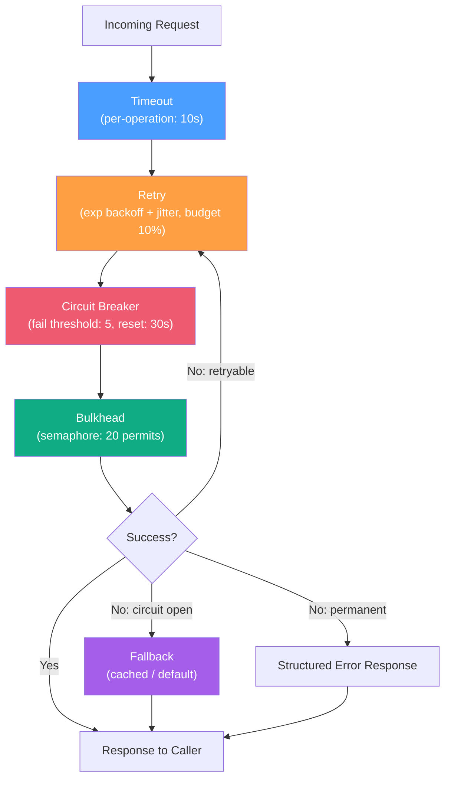
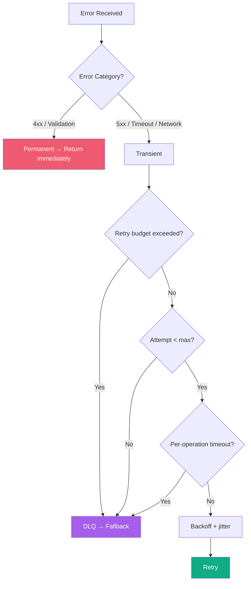

# Error Handling & Retry / 錯誤處理與重試

## Intent / 意圖

透過**系統性的錯誤處理與重試策略**建構韌性服務。本筆記涵蓋暫時性與永久性錯誤的分類、指數退避搭配抖動（exponential backoff + jitter）的重試機制、重試預算（retry budget）、艙壁隔離（bulkhead）、逾時控制（timeout）、降級回退（fallback）、死信佇列（DLQ）及結構化錯誤型別，並以 Rust (tokio) 和 Go (1.24+) 雙語實作對照。

核心問題：**當外部依賴發生暫時性故障時，如何在不放大故障範圍（retry storm）的前提下，安全地重試並在必要時優雅降級？**

---

## Problem / 問題情境

**場景一：暫時性失敗直接暴露給使用者** — 訂單服務呼叫支付閘道時遭遇一次短暫的網路抖動（TCP RST），直接將 `connection reset` 回傳前端。實際上只需重試一次即可成功，但系統缺乏自動重試機制。

**場景二：重試風暴放大故障** — 50 個 pod 對下游 API 設定「失敗重試 3 次、無退避」。下游因 GC pause 回應變慢，50 pod 同時重試三次，瞬間 150 倍請求量壓垮下游，2 秒小故障擴散為 15 分鐘全域中斷。

**場景三：未區分錯誤類型** — 系統對所有 HTTP error 一律重試。`400 Bad Request` 被重試三次——每次都回 400，白白消耗三倍資源並延長使用者等待。

---

## Core Concepts / 核心概念

### Transient vs Permanent Errors / 暫時性 vs 永久性錯誤
暫時性錯誤（5xx、timeout、connection reset）預期短時間內自行恢復，**應該重試**。永久性錯誤（4xx：bad request、unauthorized、not found）不會因重試改變結果，**不應重試**。

### Exponential Backoff with Jitter / 指數退避搭配抖動
每次重試等待時間以指數成長（1s, 2s, 4s...），加入隨機抖動讓多個 client 的重試時間錯開，避免雷群效應（thundering herd）。

### Retry Budget / 重試預算
限制時間窗口內的重試總量，通常「重試不超過原始請求的 N%」。Google SRE 建議 10%。超出預算直接放棄重試。

### Bulkhead Pattern / 艙壁隔離
為不同外部依賴分配獨立資源池（connection pool、semaphore），一個依賴的故障不耗盡整個系統資源。

### Timeout / 逾時控制
**Per-request**：單次請求最大等待（如 3s）。**Per-operation**：含所有重試的總時間上限（如 10s）。兩層缺一不可。

### Fallback / 降級回退
重試耗盡或斷路器開啟時提供替代回應。例如推薦服務不可用時回傳靜態熱門清單。

### Dead Letter Queue (DLQ) / 死信佇列
重試耗盡仍失敗的訊息送入專用佇列，供人工審查或自動修復。避免失敗資料靜默丟棄。

### Error Categorization / 錯誤分類（4xx vs 5xx）
**4xx**：請求有問題，不重試。**5xx**：伺服端問題，可能暫時性，值得重試。**Network Error**：通常暫時性。

### Error Propagation / 錯誤傳播
每層包裝（wrap）上下文資訊，而非暴露底層細節。Rust 用 `thiserror` + `?`，Go 用 `fmt.Errorf("%w", err)`。

### Structured Error Types / 結構化錯誤型別
用枚舉（Rust `enum`）或自訂型別（Go struct）定義錯誤分類，讓呼叫端根據種類決定策略，而非解析字串。

---

## Architecture / 架構

### Resilience Pattern Stack / 韌性模式堆疊



### Retry Decision Flow / 重試決策流程



---

## How It Works / 運作原理

### Exponential Backoff with Full Jitter / 指數退避搭配完全抖動

AWS 推薦的 full jitter 演算法：

```
base_delay  = 1 second
max_delay   = 30 seconds
attempt     = 0, 1, 2, 3, ...

exponential = min(max_delay, base_delay * 2^attempt)
sleep_time  = random(0, exponential)
```

Full jitter 在 `[0, exponential]` 均勻隨機分布，比 equal jitter（`exp/2 + random(0, exp/2)`）更能分散重試。AWS 模擬顯示 full jitter 在高競爭場景下完成時間最短。

### Retry Budget Mechanism / 重試預算機制

1. **設定比例**：如 10%——每 100 個原始請求最多 10 個重試。
2. **滑動窗口**：以固定時間窗口統計原始請求與重試數。
3. **預算檢查**：`retry_count / original_count > budget_ratio` 時放棄重試。
4. **本地計數**：單一 pod 本地計數器即可提供合理保護。
5. **最低保障**：即使預算超標，每秒至少允許 N 次重試（如 3 次）。

---

## Rust 實作

```rust
// retry.rs — Exponential backoff + jitter, structured errors, dual-layer timeout
// Dependencies: tokio 1, rand 0.8, reqwest, thiserror

use std::future::Future;
use std::time::Duration;
use rand::Rng;
use reqwest::StatusCode;
use tokio::time::{sleep, timeout};

// ─── Structured Error Types ───

#[derive(Debug)]
pub enum ErrorKind { Transient, Permanent }

#[derive(Debug, thiserror::Error)]
pub enum ServiceError {
    #[error("network error: {source}")]
    Network { source: reqwest::Error, kind: ErrorKind },
    #[error("upstream {status}: {body}")]
    Upstream { status: StatusCode, body: String, kind: ErrorKind },
    #[error("timeout after {elapsed:?}")]
    Timeout { elapsed: Duration, kind: ErrorKind },
    #[error("retries exhausted ({attempts} attempts): {last_error}")]
    RetriesExhausted { attempts: u32, last_error: Box<ServiceError> },
}

impl ServiceError {
    pub fn is_retryable(&self) -> bool {
        match self {
            Self::Network { kind, .. } | Self::Upstream { kind, .. }
            | Self::Timeout { kind, .. } => matches!(kind, ErrorKind::Transient),
            Self::RetriesExhausted { .. } => false,
        }
    }
}

// ─── Config & Backoff ───

#[derive(Clone)]
pub struct RetryConfig {
    pub max_attempts: u32,
    pub base_delay: Duration,
    pub max_delay: Duration,
    pub per_request_timeout: Duration,
    pub per_operation_timeout: Duration,
}

fn full_jitter(base: Duration, max: Duration, attempt: u32) -> Duration {
    let exp = std::cmp::min(max.as_millis() as u64,
        base.as_millis() as u64 * 2u64.saturating_pow(attempt));
    Duration::from_millis(rand::thread_rng().gen_range(0..=exp))
}

// ─── Retry Executor ───

pub async fn retry_with_backoff<F, Fut, T>(
    cfg: &RetryConfig, name: &str, mut op: F,
) -> Result<T, ServiceError>
where F: FnMut() -> Fut, Fut: Future<Output = Result<T, ServiceError>>
{
    let result = timeout(cfg.per_operation_timeout, async {
        let mut last: Option<ServiceError> = None;
        for attempt in 0..cfg.max_attempts {
            match timeout(cfg.per_request_timeout, op()).await {
                Ok(Ok(v)) => {
                    if attempt > 0 { println!("[RETRY] {name}: ok on attempt {}", attempt+1); }
                    return Ok(v);
                }
                Ok(Err(e)) if !e.is_retryable() => return Err(e),
                Ok(Err(e)) => {
                    let d = full_jitter(cfg.base_delay, cfg.max_delay, attempt);
                    println!("[RETRY] {name}: {e}, retry in {d:?}");
                    last = Some(e);
                    if attempt+1 < cfg.max_attempts { sleep(d).await; }
                }
                Err(_) => {
                    let e = ServiceError::Timeout {
                        elapsed: cfg.per_request_timeout, kind: ErrorKind::Transient };
                    let d = full_jitter(cfg.base_delay, cfg.max_delay, attempt);
                    last = Some(e);
                    if attempt+1 < cfg.max_attempts { sleep(d).await; }
                }
            }
        }
        Err(ServiceError::RetriesExhausted {
            attempts: cfg.max_attempts, last_error: Box::new(last.unwrap()) })
    }).await;
    result.unwrap_or_else(|_| Err(ServiceError::Timeout {
        elapsed: cfg.per_operation_timeout, kind: ErrorKind::Transient }))
}

// ─── Response Classification ───

pub async fn classify_response(resp: reqwest::Response) -> Result<String, ServiceError> {
    let status = resp.status();
    let body = resp.text().await.unwrap_or_default();
    if status.is_success() { return Ok(body); }
    let kind = if status.is_server_error() || status == StatusCode::TOO_MANY_REQUESTS
        { ErrorKind::Transient } else { ErrorKind::Permanent };
    Err(ServiceError::Upstream { status, body, kind })
}

// ─── Usage ───

#[tokio::main]
async fn main() {
    let cfg = RetryConfig { max_attempts: 3, base_delay: Duration::from_millis(500),
        max_delay: Duration::from_secs(5), per_request_timeout: Duration::from_secs(3),
        per_operation_timeout: Duration::from_secs(10) };
    match retry_with_backoff(&cfg, "fetch_payment", || async {
        let resp = reqwest::get("https://api.gateway.example.com/payments/pay_abc123")
            .await.map_err(|s| ServiceError::Network {
                kind: if s.is_timeout() { ErrorKind::Transient } else { ErrorKind::Permanent },
                source: s })?;
        classify_response(resp).await
    }).await {
        Ok(body) => println!("Status: {body}"),
        Err(e) => eprintln!("Failed: {e}"),
    }
    // Output:
    // [RETRY] fetch_payment: network error: ..., retry in 312ms
    // [RETRY] fetch_payment: ok on attempt 2
    // Status: {"id":"pay_abc123","status":"completed"}
}
```

---

## Go 實作

```go
// retry.go — Exponential backoff + jitter, structured errors, dual-layer timeout
// Go 1.24+, standard library only

package main

import (
	"context"
	"errors"
	"fmt"
	"io"
	"math"
	"math/rand/v2"
	"net/http"
	"time"
)

// ─── Structured Error Types ───

type ErrorKind int
const ( Transient ErrorKind = iota; Permanent )

type ServiceError struct {
	Message string; Kind ErrorKind; Cause error
}
func (e *ServiceError) Error() string {
	if e.Cause != nil { return fmt.Sprintf("%s: %v", e.Message, e.Cause) }
	return e.Message
}
func (e *ServiceError) Unwrap() error   { return e.Cause }
func (e *ServiceError) IsRetryable() bool { return e.Kind == Transient }

type RetriesExhaustedError struct{ Attempts int; LastError error }
func (e *RetriesExhaustedError) Error() string {
	return fmt.Sprintf("retries exhausted (%d attempts): %v", e.Attempts, e.LastError)
}
func (e *RetriesExhaustedError) Unwrap() error { return e.LastError }

// ─── Config & Backoff ───

type RetryConfig struct {
	MaxAttempts         int
	BaseDelay, MaxDelay time.Duration
	PerRequestTimeout   time.Duration
	PerOperationTimeout time.Duration
}

func fullJitter(base, max time.Duration, attempt int) time.Duration {
	exp := math.Min(float64(max.Milliseconds()),
		float64(base.Milliseconds())*math.Pow(2, float64(attempt)))
	return time.Duration(rand.Float64()*exp) * time.Millisecond
}

// ─── Retry Executor (generic) ───

func RetryWithBackoff[T any](
	ctx context.Context, cfg RetryConfig, name string,
	op func(ctx context.Context) (T, error),
) (T, error) {
	opCtx, cancel := context.WithTimeout(ctx, cfg.PerOperationTimeout)
	defer cancel()
	var lastErr error; var zero T

	for attempt := range cfg.MaxAttempts {
		reqCtx, reqCancel := context.WithTimeout(opCtx, cfg.PerRequestTimeout)
		result, err := op(reqCtx)
		reqCancel()

		if err == nil {
			if attempt > 0 { fmt.Printf("[RETRY] %s: ok on attempt %d\n", name, attempt+1) }
			return result, nil
		}
		var svcErr *ServiceError
		if errors.As(err, &svcErr) && !svcErr.IsRetryable() { return zero, err }

		delay := fullJitter(cfg.BaseDelay, cfg.MaxDelay, attempt)
		fmt.Printf("[RETRY] %s: %v, retry in %v\n", name, err, delay)
		lastErr = err
		if attempt+1 < cfg.MaxAttempts {
			select {
			case <-time.After(delay):
			case <-opCtx.Done():
				return zero, &ServiceError{Message: "operation timeout", Kind: Transient, Cause: opCtx.Err()}
			}
		}
	}
	return zero, &RetriesExhaustedError{Attempts: cfg.MaxAttempts, LastError: lastErr}
}

// ─── Response Classification ───

func classifyResponse(resp *http.Response) (string, error) {
	defer resp.Body.Close()
	body, _ := io.ReadAll(resp.Body)
	if resp.StatusCode >= 200 && resp.StatusCode < 300 { return string(body), nil }
	kind := Permanent
	if resp.StatusCode >= 500 || resp.StatusCode == http.StatusTooManyRequests { kind = Transient }
	return "", &ServiceError{
		Message: fmt.Sprintf("upstream %d: %s", resp.StatusCode, body), Kind: kind}
}

// ─── Usage ───

func main() {
	cfg := RetryConfig{MaxAttempts: 3, BaseDelay: 500 * time.Millisecond, MaxDelay: 5 * time.Second,
		PerRequestTimeout: 3 * time.Second, PerOperationTimeout: 10 * time.Second}
	body, err := RetryWithBackoff(context.Background(), cfg, "fetch_payment",
		func(ctx context.Context) (string, error) {
			req, _ := http.NewRequestWithContext(ctx, http.MethodGet,
				"https://api.gateway.example.com/payments/pay_abc123", nil)
			resp, err := http.DefaultClient.Do(req)
			if err != nil { return "", &ServiceError{Message: "network", Kind: Transient, Cause: err} }
			return classifyResponse(resp)
		})
	if err != nil { fmt.Printf("Failed: %v\n", err); return }
	fmt.Printf("Status: %s\n", body)
	// Output:
	// [RETRY] fetch_payment: network: ..., retry in 312ms
	// [RETRY] fetch_payment: ok on attempt 2
	// Status: {"id":"pay_abc123","status":"completed"}
}
```

---

## Rust vs Go 對照表

| 面向 | Rust (tokio + thiserror) | Go 1.24+ |
|------|--------------------------|----------|
| **錯誤表達** | `Result<T, E>` + `enum` variant，編譯器強制處理每個 `Result`。`thiserror` 自動實作 `Error` trait。 | `(T, error)` 多值回傳，`error` 是 interface。編譯器不強制檢查——需 `errcheck` linter 補強。 |
| **錯誤傳播** | `?` 運算子自動 early return + `From` 轉型。鏈式：`client.get(url).send().await?.text().await?`。 | `if err != nil { return fmt.Errorf("ctx: %w", err) }` 固定模式。`%w` 保留 chain 供 `errors.Is/As`。 |
| **Error Wrapping** | `thiserror` `#[from]` 或 `map_err`；`source()` 遍歷 chain；`anyhow` 做動態 chain。 | `fmt.Errorf("%w")` + `errors.Is/As` 檢查 chain。Go 1.20+ `errors.Join` 合併多 error。 |
| **Timeout 整合** | `tokio::time::timeout` 回傳 `Result<T, Elapsed>`，融入 `Result` 體系。搭配 `select!` 組合。 | `context.WithTimeout` + `ctx.Done()` channel。`http.NewRequestWithContext` 綁定 deadline。 |
| **泛型重試** | `retry_with_backoff<F, Fut, T>` trait bound 靜態分發，零額外開銷。 | `RetryWithBackoff[T any]` Go 泛型，簡潔但無法約束 `op` 必須回傳 error。 |

---

## When to Use / 適用場景

- **外部 API 呼叫** — 支付閘道、簡訊服務等，網路抖動是常態，退避重試自動恢復多數暫時性失敗。
- **訊息佇列消費端** — Kafka / SQS consumer 遭遇下游暫時不可用，重試失敗的訊息送入 DLQ。
- **微服務間 gRPC / HTTP** — 上游 pod 滾動部署時短暫 503，1-2 次重試即恢復，使用者無感知。
- **資料庫連線瞬斷** — Cloud SQL / RDS failover 數秒內完成，connection pool 以退避策略重建連線。

---

## When NOT to Use / 不適用場景

- **非冪等操作無冪等鍵** — POST 建立訂單若無 idempotency key，重試導致重複建立。**先確保冪等，才能安全重試。**
- **使用者輸入驗證錯誤** — `400`、`422` 代表請求本身有問題，重試不改變結果，應立即回傳引導修正。
- **認證授權失敗** — `401`、`403` 代表 token 過期或權限不足，應觸發 refresh flow 而非重試。
- **資源不存在** — `404` 不會因重試憑空產生資源。

---

## Real-World Examples / 真實世界案例

### AWS SDK Retry Policy
AWS SDK v2 內建 adaptive retry mode：預設最多 3 次，full jitter 退避。追蹤每個 endpoint 的成功率動態調整（等效內建 retry budget）。Throttling error（429、503）退避更保守（base 500ms vs 一般 100ms）。

### gRPC Retry Policy
Service config 中宣告式設定 `maxAttempts`、`retryableStatusCodes`（UNAVAILABLE、DEADLINE_EXCEEDED）、`initialBackoff`、`backoffMultiplier`。特色是 hedging policy——不等失敗即平行送出多個請求（需冪等），取最先回來的結果。內建 per-endpoint retry throttling。

### Envoy Proxy Retry Configuration
Route config 層級設定 `retry_on`（5xx, reset, connect-failure）、`num_retries`、`retry_host_predicate`（排除剛失敗的 host）、`retry_budget`。以整個 cluster 為單位——重試比例超 20% 時新重試直接拒絕，基礎設施層面防止 retry storm。

---

## Interview Questions / 面試常見問題

**Q1：為什麼需要 jitter？純 exponential backoff 不夠嗎？**
所有同時失敗的 client 無 jitter 會在完全相同時刻重試（1s、2s、4s），形成週期性尖峰（thundering herd）。Full jitter 在 `[0, exp]` 均勻分散，將尖峰攤平。AWS 模擬顯示 full jitter 在高競爭場景下完成時間少約 40%。

**Q2：Retry budget 和 circuit breaker 的差別？**
Retry budget 限制「重試的量」（不超過原始流量 N%）；circuit breaker 限制「是否送出請求」（錯誤率超閾值直接斷路）。互補並用：低錯誤率時 budget 控量，高錯誤率時 breaker 斷路走 fallback。

**Q3：如何區分可重試與不可重試的 5xx？**
502/503 通常暫時性（upstream 重啟）。501 永久性。500 需看上下文（DB 瞬斷可重試，程式 bug 不可）。最佳實踐：server 在 `Retry-After` header 明確告知是否應重試。

**Q4：為什麼需要 per-request 和 per-operation 兩層 timeout？**
Per-request（3s）防單次無限等待；per-operation（10s）防多次重試加退避超 SLA。只有 per-request 時 3 次重試 + 退避可能 16 秒。Per-operation 確保整體不超上限。

**Q5：如何避免 retry amplification？**
A→B→C 鏈中 C 故障，B 重試 3 次 x A 重試 3 次 = 9 次（指數放大）。解法：(1) 只在最靠近故障源的層重試；(2) header 傳遞 `retry-count`；(3) 每層獨立 retry budget；(4) service mesh 統一管理。

---

## Pitfalls / 常見陷阱

### 1. 無退避暴力重試

```go
// 危險：失敗後立刻重試
for attempt := range maxRetries {
    if resp, err := client.Do(req); err == nil { break }
    // 沒有 sleep → 毫秒級轟炸下游
}
// 正確：指數退避 + jitter + context
for attempt := range maxRetries {
    if resp, err := client.Do(req); err == nil { break }
    select {
    case <-time.After(fullJitter(base, max, attempt)):
    case <-ctx.Done(): return ctx.Err()
    }
}
```

### 2. 對非冪等操作重試

```rust
// 危險：POST 無冪等鍵 → 重複建立
retry_with_backoff(&cfg, "create_order", || async {
    client.post(url).json(&payload).send().await.map_err(/*...*/)
}).await;
// 正確：攜帶冪等鍵
retry_with_backoff(&cfg, "create_order", || async {
    client.post(url).header("Idempotency-Key", &key)
        .json(&payload).send().await.map_err(/*...*/)
}).await;
```

### 3. 缺少 Retry Budget

```go
// 50 pod x 3 retries = 150 倍請求量 → retry storm
// 正確：追蹤滑動窗口內重試比例
type RetryBudget struct {
    mu            sync.Mutex
    originalCount int64
    retryCount    int64
    ratio         float64 // 0.10 = 10%
}
func (b *RetryBudget) Allow() bool {
    b.mu.Lock(); defer b.mu.Unlock()
    return float64(b.retryCount)/float64(b.originalCount) < b.ratio
}
```

### 4. 未區分錯誤類型

```rust
// 危險：400 也標記為 Transient → 無意義重試三次
Err(ServiceError::Upstream { kind: ErrorKind::Transient, .. }) // 不分青紅皂白
// 正確：根據 status code 分類
let kind = if status.is_server_error() { ErrorKind::Transient }
           else { ErrorKind::Permanent };
```

---

## References / 參考資料

1. **AWS — Exponential Backoff and Jitter** — (https://aws.amazon.com/blogs/architecture/exponential-backoff-and-jitter/) full jitter / equal jitter / decorrelated jitter 模擬比較。
2. **Google SRE Book — Ch.22 Handling Overload** — (https://sre.google/sre-book/handling-overload/) 重試預算、graceful degradation、load shedding。
3. **gRPC Retry Design (A6)** — (https://github.com/grpc/proposal/blob/master/A6-client-retries.md) 重試 + hedging policy + retry throttling。
4. **Azure Architecture — Retry Pattern** — (https://learn.microsoft.com/en-us/azure/architecture/patterns/retry) 重試策略選擇、circuit breaker 整合。
5. **Envoy — Retry Policies** — (https://www.envoyproxy.io/docs/envoy/latest/configuration/http/http_filters/router_filter#retry-policy) retry budget、host predicate。
6. **Release It!** — Michael Nygard (2nd ed. 2018) Ch.5 Stability Patterns — timeout、retry、circuit breaker、bulkhead。

---

## Cross-references / 交叉引用

- [[30_circuit_breaker|Circuit Breaker / 斷路器模式]](../design_pattern/modern/30_circuit_breaker.md) — 斷路器與重試互補。重試處理「少數暫時性失敗」，斷路器處理「持續性大量失敗」。架構上重試包在斷路器內層——重試失敗才觸發斷路器計數，錯誤率超閾值後斷路器開啟、所有請求直接走 fallback。
- [[19_idempotency_design|Idempotency Design / 冪等設計]](../distributed_systems/19_idempotency_design.md) — 冪等性是安全重試的前提。本筆記的重試機制假設操作冪等——若不冪等，重試產生重複副作用。對 POST 等非天然冪等操作，必須先實作冪等鍵機制才能啟用自動重試。
