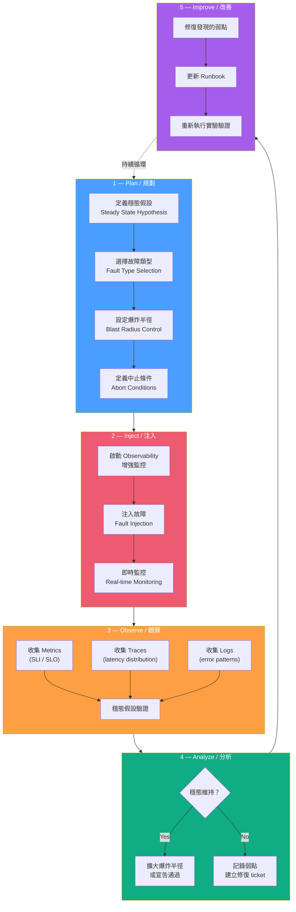
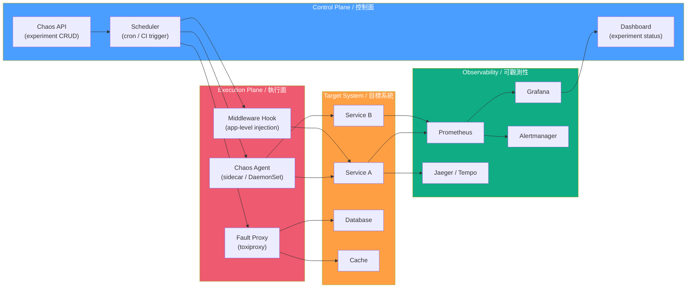

# Chaos Engineering / 混沌工程

## Intent / 意圖

混沌工程是一門**在生產系統上進行受控實驗的學科**，目的是主動發掘系統在面對異常狀況（網路分區、延遲注入、資源耗盡、依賴故障等）時的未知弱點。其核心理念是：與其被動等待故障在凌晨三點發生，不如在營業時間內、在可控範圍中刻意製造故障，驗證系統的韌性假設是否成立。

核心問題：**當我們宣稱系統具備高可用性和容錯能力時，如何以科學實驗的方式驗證這些宣稱——而不是在真正的事故中才發現它們不成立？**

---

## Problem / 問題情境

**場景一：「理論上有備援，實際上沒驗證」** — 電商平台架構圖上畫了 multi-AZ 部署和自動 failover，但從未實際測試過 failover 流程。Black Friday 凌晨主資料庫所在 AZ 失聯，failover 因為過期的 DNS TTL 和未測試的連線字串切換邏輯失敗，整站停擺 47 分鐘。事後發現只要一次主動測試就能提早發現這些問題。

**場景二：「微服務依賴鏈的隱藏雷區」** — 支付服務呼叫風控服務，風控服務呼叫外部信用評分 API。外部 API 回應從 50ms 劣化至 8 秒，風控服務的 HTTP client 沒設 timeout，支付服務的 connection pool 被佔滿，訂單服務跟著排隊——一個外部依賴的延遲拖垮整條鏈路。團隊宣稱「有 circuit breaker」，但從未注入過延遲來驗證它是否正確觸發。

**場景三：「容量規劃假設錯誤」** — 系統在 Redis 叢集丟失一個節點時的行為從未被測試。當一個 Redis 節點 OOM 崩潰後，hash slot 重新分配導致瞬間大量 cache miss，後端 DB 承受不住 thundering herd 效應。容量規劃假設「Redis 永不掛」，但混沌實驗可以在安全環境下驗證這個假設。

---

## Core Concepts / 核心概念

### Steady State Hypothesis / 穩態假設

混沌實驗的起點是定義「系統正常時長什麼樣」。穩態假設使用可觀測的業務指標（而非低階技術指標）描述系統的正常行為。例如：「當注入故障時，訂單成功率維持 > 99.5%、P99 延遲 < 500ms、錯誤率 < 0.5%」。如果實驗期間穩態假設被破壞，代表系統存在弱點。

### Fault Injection / 故障注入

刻意在系統中引入故障的技術。常見類型：

| 注入類型 | 描述 | 典型工具 |
|---------|------|---------|
| **Latency / 延遲** | 對特定服務或網路路徑注入額外延遲 | toxiproxy, tc netem |
| **Error / 錯誤** | 強制回傳 HTTP 5xx、gRPC UNAVAILABLE 等錯誤碼 | Gremlin, Litmus |
| **Resource Exhaustion / 資源耗盡** | 消耗 CPU、記憶體、磁碟 I/O 或 file descriptor | stress-ng, Chaos Monkey |
| **Network Partition / 網路分區** | 模擬節點間無法通訊 | iptables, Litmus, tc |
| **Process Kill / 程序終止** | 隨機殺掉服務實例或容器 | Chaos Monkey, kill -9 |
| **DNS Failure / DNS 故障** | 讓 DNS 解析失敗或回傳錯誤 IP | CoreDNS 設定 |
| **Clock Skew / 時鐘偏移** | 調整節點系統時鐘造成時間不一致 | libfaketime |

### Blast Radius / 爆炸半徑

控制故障影響範圍的關鍵概念。從最小範圍開始（單一 pod、單一請求百分比），逐步擴大（整個 AZ、整個 region）。目的是在發現問題時將影響限制在可接受範圍，保護終端使用者。

| 爆炸半徑等級 | 範圍 | 適用階段 |
|-------------|------|---------|
| Level 1 | 單一 pod / 單一容器 | 初期驗證 |
| Level 2 | 一個服務的部分流量（如 5%） | 穩態建立後 |
| Level 3 | 一個完整服務 | 團隊有信心後 |
| Level 4 | 一整個可用區（AZ） | Game Day |
| Level 5 | 跨 Region | 成熟度最高 |

### Game Day / 遊戲日

受控環境下的大規模混沌實驗演練。跨團隊協作，模擬真實的生產故障場景，測試團隊的偵測能力、反應速度和復原流程。不只測試系統，也測試人和流程。

### Chaos Maturity Model (CMM) / 混沌成熟度模型

衡量組織混沌工程實踐成熟度的框架：

| 等級 | 名稱 | 特徵 |
|------|------|------|
| Level 0 | **無意識** | 未進行混沌實驗，故障靠運氣和事後分析 |
| Level 1 | **初始** | 手動、臨時性的故障注入（如手動殺 pod） |
| Level 2 | **可重複** | 定義實驗模板，有固定的 Game Day 排程 |
| Level 3 | **自動化** | CI/CD 整合混沌實驗，自動化執行與結果驗證 |
| Level 4 | **持續驗證** | 生產環境持續運行混沌實驗，自動偵測韌性退化 |

### Observability Integration / 可觀測性整合

混沌實驗必須搭配完善的可觀測性基礎設施才有意義。實驗期間必須能即時觀察 metrics（SLI 變化）、traces（延遲分佈變化）和 logs（錯誤模式），才能判斷穩態假設是否被破壞。沒有 observability 的混沌實驗只是在製造事故。

### Experiment Abort Conditions / 實驗中止條件

每個混沌實驗必須定義明確的「拉線」條件——當觀測到的影響超出預期時立刻中止實驗。例如：「訂單成功率跌破 99% 立刻回滾」、「P99 > 2s 持續超過 30 秒立刻中止」。

---

## Architecture / 架構

### Chaos Experiment Lifecycle / 混沌實驗生命週期



### Chaos Platform Architecture / 混沌平台架構



---

## How It Works / 運作原理

### 執行混沌實驗的完整步驟

1. **定義穩態假設 (Steady State Hypothesis)**
   選擇反映系統健康的業務指標作為穩態指標。例如：「訂單 API 的成功率 > 99.5%」、「P99 回應時間 < 500ms」、「每分鐘處理訂單數 > 100」。穩態指標必須來自可觀測性系統（Prometheus metrics、SLI dashboard），且在實驗前先確認基線值。

2. **選擇故障類型與範圍 (Fault Type & Blast Radius)**
   根據要驗證的假設選擇注入方式。若要驗證 circuit breaker，注入下游服務延遲；若要驗證 AZ failover，停掉一整個 AZ 的 pod。首次實驗永遠從最小爆炸半徑開始（單一 pod 或 1% 流量）。

3. **設定中止條件與回滾機制 (Abort Conditions & Rollback)**
   定義「什麼情況下必須立刻停止實驗」。例如：訂單成功率 < 98%、P99 > 3 秒超過 60 秒。確保中止機制是自動化的（而非依賴人工判斷），並提前驗證回滾動作可在 30 秒內完成。

4. **通知相關團隊 (Notify Stakeholders)**
   在執行實驗前通知 SRE、on-call 工程師和相關服務負責人。這不是為了「徵求同意」，而是讓所有人知道即將發生的事——避免有人看到異常告警後啟動真正的 incident response。

5. **啟動增強監控 (Enable Enhanced Monitoring)**
   在實驗期間啟動更細粒度的監控。提高 metrics 採集頻率（如從 30s 降到 5s）、開啟額外的 debug log、準備好 trace sampling rate 提升。

6. **執行故障注入 (Execute Fault Injection)**
   透過選定的工具注入故障。記錄精確的注入開始時間、影響範圍和持續時間。

7. **即時觀察與判斷 (Real-time Observation)**
   持續監控穩態指標。比對注入前後的指標變化。如果觸及中止條件，立刻回滾。

8. **停止注入並觀察恢復 (Stop Injection & Observe Recovery)**
   移除故障注入後，觀察系統是否自動恢復到穩態。恢復時間（MTTR）本身就是重要的觀察指標。如果系統無法自動恢復，代表缺乏 self-healing 機制。

9. **分析結果與撰寫報告 (Analyze & Report)**
   比對穩態假設是否被維持。若被破壞：記錄弱點、影響範圍、根因分析，建立修復 ticket 並標記優先等級。若維持：考慮擴大爆炸半徑或嘗試更極端的故障類型。

10. **修復與重新驗證 (Fix & Re-validate)**
    修復發現的弱點後，重新執行相同實驗以驗證修復效果。將實驗加入定期排程，防止韌性退化（regression）。

### Game Day 規劃與執行

Game Day 是大規模的混沌演練，通常按以下流程進行：

```
Pre-Game (1-2 週前)
├── 選定演練場景（如 AZ 故障、核心 DB failover）
├── 準備 Runbook 草案
├── 通知所有相關團隊
├── 準備監控 Dashboard
└── 確認回滾計畫

Game Day 當天
├── 09:00 — War Room 集合、角色分工
├── 09:30 — 啟動增強監控
├── 10:00 — 執行故障注入
├── 10:00~11:00 — 即時觀察、溝通、決策
├── 11:00 — 停止注入、觀察恢復
└── 11:30 — 熱復盤（hot debrief）

Post-Game (1 週內)
├── 撰寫完整報告
├── 建立修復 ticket
├── 更新 Runbook
└── 安排後續驗證實驗
```

---

## Rust 實作

```rust
// chaos_middleware.rs — Axum 0.8+ fault injection middleware
// Rust 2024 edition, tokio 1, axum 0.8, rand 0.9, serde, tower
//
// 根據設定隨機注入延遲、錯誤回應和逾時，模擬生產環境中的各種故障。
// 支援透過 header 或環境變數啟用/停用混沌注入。

// Cargo.toml dependencies:
// axum = "0.8"
// tokio = { version = "1", features = ["full"] }
// rand = "0.9"
// serde = { version = "1", features = ["derive"] }
// serde_json = "1"
// tower = "0.5"

use axum::{
    Router,
    body::Body,
    extract::Request,
    http::{HeaderMap, StatusCode},
    middleware::{self, Next},
    response::{IntoResponse, Response},
    routing::get,
};
use rand::Rng;
use serde::{Deserialize, Serialize};
use std::sync::Arc;
use std::time::Duration;
use tokio::time::sleep;

// ─── Chaos Configuration ───

/// 混沌注入設定：控制故障類型、機率和爆炸半徑
#[derive(Debug, Clone, Deserialize, Serialize)]
pub struct ChaosConfig {
    /// 是否啟用混沌注入（全域開關）
    pub enabled: bool,
    /// 注入延遲的機率（0.0 ~ 1.0）
    pub latency_probability: f64,
    /// 注入的延遲毫秒數範圍 [min, max]
    pub latency_range_ms: (u64, u64),
    /// 注入錯誤的機率（0.0 ~ 1.0）
    pub error_probability: f64,
    /// 注入的 HTTP 錯誤碼
    pub error_status_code: u16,
    /// 注入逾時（完全不回應）的機率
    pub timeout_probability: f64,
    /// 逾時等待秒數（模擬 hung connection）
    pub timeout_duration_secs: u64,
    /// 影響的請求路徑前綴（空 = 全部路徑）
    pub target_path_prefixes: Vec<String>,
    /// 混沌啟用標記 header（有此 header 才注入）
    pub activation_header: Option<String>,
}

impl Default for ChaosConfig {
    fn default() -> Self {
        Self {
            enabled: false,
            latency_probability: 0.0,
            latency_range_ms: (100, 500),
            error_probability: 0.0,
            error_status_code: 503,
            timeout_probability: 0.0,
            timeout_duration_secs: 30,
            target_path_prefixes: vec![],
            activation_header: None,
        }
    }
}

impl ChaosConfig {
    /// 建立用於測試的低爆炸半徑設定
    pub fn low_blast_radius() -> Self {
        Self {
            enabled: true,
            latency_probability: 0.05,      // 5% 請求注入延遲
            latency_range_ms: (100, 300),
            error_probability: 0.02,         // 2% 請求注入錯誤
            error_status_code: 503,
            timeout_probability: 0.01,       // 1% 請求注入逾時
            timeout_duration_secs: 10,
            target_path_prefixes: vec!["/api/".to_string()],
            activation_header: Some("X-Chaos-Enabled".to_string()),
        }
    }
}

// ─── Chaos Experiment Record ───

/// 記錄每次注入的實驗資料，用於事後分析
#[derive(Debug, Clone, Serialize)]
pub struct ChaosEvent {
    pub timestamp: String,
    pub request_path: String,
    pub injection_type: InjectionType,
    pub details: String,
}

#[derive(Debug, Clone, Serialize)]
pub enum InjectionType {
    Latency { added_ms: u64 },
    Error { status_code: u16 },
    Timeout { duration_secs: u64 },
    None,
}

// ─── Fault Injection Decision Engine ───

/// 根據設定決定要注入的故障類型
fn decide_injection(
    config: &ChaosConfig,
    path: &str,
    headers: &HeaderMap,
) -> InjectionType {
    // 全域開關檢查
    if !config.enabled {
        return InjectionType::None;
    }

    // 檢查 activation header（如果有設定的話）
    if let Some(ref header_name) = config.activation_header {
        if !headers.contains_key(header_name.as_str()) {
            return InjectionType::None;
        }
    }

    // 檢查路徑是否在目標範圍內
    if !config.target_path_prefixes.is_empty()
        && !config.target_path_prefixes.iter().any(|p| path.starts_with(p))
    {
        return InjectionType::None;
    }

    let mut rng = rand::rng();
    let roll: f64 = rng.random();

    // 優先順序：timeout > error > latency
    // 確保各機率不重疊
    if roll < config.timeout_probability {
        InjectionType::Timeout {
            duration_secs: config.timeout_duration_secs,
        }
    } else if roll < config.timeout_probability + config.error_probability {
        InjectionType::Error {
            status_code: config.error_status_code,
        }
    } else if roll
        < config.timeout_probability + config.error_probability + config.latency_probability
    {
        let delay = rng.random_range(config.latency_range_ms.0..=config.latency_range_ms.1);
        InjectionType::Latency { added_ms: delay }
    } else {
        InjectionType::None
    }
}

// ─── Axum Middleware ───

/// Axum 混沌注入 middleware
/// 攔截每個請求，根據設定機率注入故障
async fn chaos_middleware(
    axum::extract::State(config): axum::extract::State<Arc<ChaosConfig>>,
    request: Request,
    next: Next,
) -> Response {
    let path = request.uri().path().to_string();
    let headers = request.headers().clone();

    let injection = decide_injection(&config, &path, &headers);

    // 記錄注入事件（生產環境中送往 metrics / structured log）
    match &injection {
        InjectionType::Latency { added_ms } => {
            println!(
                "[CHAOS] path={path} injection=latency added_ms={added_ms}"
            );
        }
        InjectionType::Error { status_code } => {
            println!(
                "[CHAOS] path={path} injection=error status={status_code}"
            );
        }
        InjectionType::Timeout { duration_secs } => {
            println!(
                "[CHAOS] path={path} injection=timeout duration={duration_secs}s"
            );
        }
        InjectionType::None => {}
    }

    // 執行注入
    match injection {
        InjectionType::Timeout { duration_secs } => {
            // 模擬 hung connection：等待指定時間後回傳 504
            sleep(Duration::from_secs(duration_secs)).await;
            (
                StatusCode::GATEWAY_TIMEOUT,
                "chaos: simulated timeout",
            )
                .into_response()
        }
        InjectionType::Error { status_code } => {
            // 直接回傳錯誤碼，不轉發到下游
            let status = StatusCode::from_u16(status_code)
                .unwrap_or(StatusCode::INTERNAL_SERVER_ERROR);
            let body = serde_json::json!({
                "error": "chaos_injection",
                "message": format!("simulated {} error", status_code),
                "chaos": true
            });
            (status, axum::Json(body)).into_response()
        }
        InjectionType::Latency { added_ms } => {
            // 注入額外延遲後正常轉發請求
            sleep(Duration::from_millis(added_ms)).await;
            next.run(request).await
        }
        InjectionType::None => {
            // 正常轉發
            next.run(request).await
        }
    }
}

// ─── Application Handlers ───

async fn health_check() -> &'static str {
    "ok"
}

async fn get_orders() -> impl IntoResponse {
    // 模擬業務邏輯延遲
    sleep(Duration::from_millis(10)).await;
    let body = serde_json::json!({
        "orders": [
            {"id": "ord_001", "status": "completed", "amount": 99.99},
            {"id": "ord_002", "status": "pending",   "amount": 45.50}
        ]
    });
    (StatusCode::OK, axum::Json(body))
}

async fn get_order_detail() -> impl IntoResponse {
    sleep(Duration::from_millis(5)).await;
    let body = serde_json::json!({
        "id": "ord_001",
        "status": "completed",
        "amount": 99.99,
        "items": [{"sku": "ITEM-42", "qty": 2}]
    });
    (StatusCode::OK, axum::Json(body))
}

// ─── Server Bootstrap ───

#[tokio::main]
async fn main() {
    // 從環境變數或設定檔載入混沌設定
    // 生產環境中通常由 feature flag 系統控制
    let chaos_config = Arc::new(ChaosConfig::low_blast_radius());

    println!("Chaos config: {:?}", *chaos_config);

    let app = Router::new()
        .route("/health", get(health_check))
        .route("/api/orders", get(get_orders))
        .route("/api/orders/{id}", get(get_order_detail))
        .layer(middleware::from_fn_with_state(
            chaos_config.clone(),
            chaos_middleware,
        ))
        .with_state(chaos_config);

    let listener = tokio::net::TcpListener::bind("0.0.0.0:8080")
        .await
        .expect("failed to bind");

    println!("Server listening on :8080");
    println!("Try: curl -H 'X-Chaos-Enabled: true' http://localhost:8080/api/orders");

    axum::serve(listener, app).await.expect("server failed");

    // Output:
    // Chaos config: ChaosConfig { enabled: true, latency_probability: 0.05, ... }
    // Server listening on :8080
    // Try: curl -H 'X-Chaos-Enabled: true' http://localhost:8080/api/orders
    //
    // (with X-Chaos-Enabled header, ~5% of requests):
    // [CHAOS] path=/api/orders injection=latency added_ms=237
    // (normal response after 237ms extra delay)
    //
    // (~2% of requests):
    // [CHAOS] path=/api/orders injection=error status=503
    // {"error":"chaos_injection","message":"simulated 503 error","chaos":true}
    //
    // (~1% of requests):
    // [CHAOS] path=/api/orders injection=timeout duration=10s
    // (response after 10s: 504 Gateway Timeout)
    //
    // (without header or /health path → normal response):
    // {"orders":[{"id":"ord_001",...},{"id":"ord_002",...}]}
}
```

### 設計重點

- **`Arc<ChaosConfig>`**：使用 `Arc` 在 handler 與 middleware 之間共享不可變設定。生產環境中可搭配 `ArcSwap` 或 `tokio::sync::watch` 實現熱更新。
- **Activation Header**：透過 `X-Chaos-Enabled` header 控制注入，讓混沌實驗只影響帶有特定 header 的測試流量，保護一般使用者。
- **注入類型優先序**：timeout > error > latency，因為 timeout 是最嚴重的故障，優先判斷確保機率不被低優先級搶走。
- **路徑前綴過濾**：`/health` 不受混沌注入影響，確保 Kubernetes liveness/readiness probe 不被干擾。
- **Tower middleware 整合**：使用 Axum 的 `from_fn_with_state` 將混沌注入融入 middleware 堆疊，對業務程式碼零侵入。

---

## Go 實作

```go
// chaos_middleware.go — net/http fault injection middleware
// Go 1.24+, standard library only
//
// 根據設定隨機注入延遲、錯誤回應和逾時，模擬生產環境中的各種故障。
// 支援透過 header 或環境變數啟用/停用混沌注入。

package main

import (
	"encoding/json"
	"fmt"
	"log/slog"
	"math/rand/v2"
	"net/http"
	"os"
	"time"
)

// ─── Chaos Configuration ───

// ChaosConfig 控制混沌注入的行為
type ChaosConfig struct {
	Enabled             bool     `json:"enabled"`
	LatencyProbability  float64  `json:"latency_probability"`   // 0.0 ~ 1.0
	LatencyRangeMs      [2]int64 `json:"latency_range_ms"`      // [min, max]
	ErrorProbability    float64  `json:"error_probability"`      // 0.0 ~ 1.0
	ErrorStatusCode     int      `json:"error_status_code"`
	TimeoutProbability  float64  `json:"timeout_probability"`    // 0.0 ~ 1.0
	TimeoutDurationSecs int      `json:"timeout_duration_secs"`
	TargetPathPrefixes  []string `json:"target_path_prefixes"`
	ActivationHeader    string   `json:"activation_header"`      // 空 = 不需要 header
}

// LowBlastRadius 回傳低爆炸半徑的混沌設定
func LowBlastRadius() *ChaosConfig {
	return &ChaosConfig{
		Enabled:             true,
		LatencyProbability:  0.05,             // 5%
		LatencyRangeMs:      [2]int64{100, 300},
		ErrorProbability:    0.02,             // 2%
		ErrorStatusCode:     http.StatusServiceUnavailable,
		TimeoutProbability:  0.01,             // 1%
		TimeoutDurationSecs: 10,
		TargetPathPrefixes:  []string{"/api/"},
		ActivationHeader:    "X-Chaos-Enabled",
	}
}

// ─── Injection Types ───

type InjectionType int

const (
	InjectionNone InjectionType = iota
	InjectionLatency
	InjectionError
	InjectionTimeout
)

type InjectionDecision struct {
	Type      InjectionType
	LatencyMs int64
	Status    int
	TimeoutS  int
}

// ─── Fault Injection Decision Engine ───

// decideInjection 根據設定決定要注入的故障類型
func decideInjection(cfg *ChaosConfig, path string, header http.Header) InjectionDecision {
	none := InjectionDecision{Type: InjectionNone}

	if !cfg.Enabled {
		return none
	}

	// 檢查 activation header
	if cfg.ActivationHeader != "" {
		if header.Get(cfg.ActivationHeader) == "" {
			return none
		}
	}

	// 檢查路徑是否在目標範圍內
	if len(cfg.TargetPathPrefixes) > 0 {
		matched := false
		for _, prefix := range cfg.TargetPathPrefixes {
			if len(path) >= len(prefix) && path[:len(prefix)] == prefix {
				matched = true
				break
			}
		}
		if !matched {
			return none
		}
	}

	roll := rand.Float64()

	// 優先序：timeout > error > latency
	switch {
	case roll < cfg.TimeoutProbability:
		return InjectionDecision{
			Type:     InjectionTimeout,
			TimeoutS: cfg.TimeoutDurationSecs,
		}
	case roll < cfg.TimeoutProbability+cfg.ErrorProbability:
		return InjectionDecision{
			Type:   InjectionError,
			Status: cfg.ErrorStatusCode,
		}
	case roll < cfg.TimeoutProbability+cfg.ErrorProbability+cfg.LatencyProbability:
		delay := cfg.LatencyRangeMs[0] +
			rand.Int64N(cfg.LatencyRangeMs[1]-cfg.LatencyRangeMs[0]+1)
		return InjectionDecision{
			Type:      InjectionLatency,
			LatencyMs: delay,
		}
	default:
		return none
	}
}

// ─── Chaos Middleware ───

// ChaosMiddleware 回傳注入故障的 HTTP middleware
func ChaosMiddleware(cfg *ChaosConfig, next http.Handler) http.Handler {
	logger := slog.New(slog.NewJSONHandler(os.Stdout, nil))

	return http.HandlerFunc(func(w http.ResponseWriter, r *http.Request) {
		decision := decideInjection(cfg, r.URL.Path, r.Header)

		switch decision.Type {
		case InjectionTimeout:
			logger.Info("chaos injection",
				"path", r.URL.Path,
				"type", "timeout",
				"duration_secs", decision.TimeoutS,
			)
			// 模擬 hung connection
			time.Sleep(time.Duration(decision.TimeoutS) * time.Second)
			w.WriteHeader(http.StatusGatewayTimeout)
			fmt.Fprint(w, "chaos: simulated timeout")
			return

		case InjectionError:
			logger.Info("chaos injection",
				"path", r.URL.Path,
				"type", "error",
				"status", decision.Status,
			)
			w.Header().Set("Content-Type", "application/json")
			w.WriteHeader(decision.Status)
			resp := map[string]any{
				"error":   "chaos_injection",
				"message": fmt.Sprintf("simulated %d error", decision.Status),
				"chaos":   true,
			}
			json.NewEncoder(w).Encode(resp)
			return

		case InjectionLatency:
			logger.Info("chaos injection",
				"path", r.URL.Path,
				"type", "latency",
				"added_ms", decision.LatencyMs,
			)
			time.Sleep(time.Duration(decision.LatencyMs) * time.Millisecond)
			// 注入延遲後正常轉發
			next.ServeHTTP(w, r)
			return

		default:
			// 無注入，正常轉發
			next.ServeHTTP(w, r)
		}
	})
}

// ─── Application Handlers ───

func healthHandler(w http.ResponseWriter, _ *http.Request) {
	w.WriteHeader(http.StatusOK)
	fmt.Fprint(w, "ok")
}

func ordersHandler(w http.ResponseWriter, _ *http.Request) {
	// 模擬業務邏輯延遲
	time.Sleep(10 * time.Millisecond)

	w.Header().Set("Content-Type", "application/json")
	resp := map[string]any{
		"orders": []map[string]any{
			{"id": "ord_001", "status": "completed", "amount": 99.99},
			{"id": "ord_002", "status": "pending", "amount": 45.50},
		},
	}
	json.NewEncoder(w).Encode(resp)
}

func orderDetailHandler(w http.ResponseWriter, r *http.Request) {
	time.Sleep(5 * time.Millisecond)

	orderID := r.PathValue("id")
	w.Header().Set("Content-Type", "application/json")
	resp := map[string]any{
		"id":     orderID,
		"status": "completed",
		"amount": 99.99,
		"items":  []map[string]any{{"sku": "ITEM-42", "qty": 2}},
	}
	json.NewEncoder(w).Encode(resp)
}

// ─── Server Bootstrap ───

func main() {
	cfg := LowBlastRadius()
	cfgJSON, _ := json.MarshalIndent(cfg, "", "  ")
	fmt.Printf("Chaos config: %s\n", cfgJSON)

	mux := http.NewServeMux()
	mux.HandleFunc("GET /health", healthHandler)
	mux.HandleFunc("GET /api/orders", ordersHandler)
	mux.HandleFunc("GET /api/orders/{id}", orderDetailHandler)

	// 將混沌 middleware 包裹在 mux 外層
	handler := ChaosMiddleware(cfg, mux)

	fmt.Println("Server listening on :8080")
	fmt.Println("Try: curl -H 'X-Chaos-Enabled: true' http://localhost:8080/api/orders")

	if err := http.ListenAndServe(":8080", handler); err != nil {
		fmt.Fprintf(os.Stderr, "server error: %v\n", err)
		os.Exit(1)
	}

	// Output:
	// Chaos config: {
	//   "enabled": true,
	//   "latency_probability": 0.05,
	//   ...
	// }
	// Server listening on :8080
	// Try: curl -H 'X-Chaos-Enabled: true' http://localhost:8080/api/orders
	//
	// (with X-Chaos-Enabled header, ~5% of requests):
	// {"time":"...","level":"INFO","msg":"chaos injection","path":"/api/orders","type":"latency","added_ms":237}
	// (normal response after 237ms extra delay)
	//
	// (~2% of requests):
	// {"time":"...","level":"INFO","msg":"chaos injection","path":"/api/orders","type":"error","status":503}
	// {"error":"chaos_injection","message":"simulated 503 error","chaos":true}
	//
	// (~1% of requests):
	// {"time":"...","level":"INFO","msg":"chaos injection","path":"/api/orders","type":"timeout","duration_secs":10}
	// (response after 10s: 504 Gateway Timeout)
	//
	// (without header or /health path → normal response):
	// {"orders":[{"id":"ord_001",...},{"id":"ord_002",...}]}
}
```

### 設計重點

- **`http.Handler` 包裹模式**：Go 標準 middleware pattern——`ChaosMiddleware(cfg, next)` 回傳新的 `http.Handler`，對業務程式碼零侵入。
- **`slog` 結構化日誌**：每次注入都記錄 JSON 格式日誌，方便事後用 Grafana Loki 或 ELK 查詢分析。
- **`r.PathValue("id")`**：使用 Go 1.22+ 新 `ServeMux` 路由參數功能，不依賴外部路由套件。
- **路徑字串比對**：手動前綴檢查而非 `strings.HasPrefix`，展示明確的比較邏輯（生產環境中使用 `strings.HasPrefix` 更清晰）。
- **Context-aware timeout**：生產環境中應將 `time.Sleep` 替換為 `select` + `r.Context().Done()` 以支援客戶端取消。

---

## Rust vs Go 對照表

| 面向 | Rust (Axum 0.8 + tokio) | Go 1.24+ (stdlib) |
|------|--------------------------|-------------------|
| **Middleware 模式** | Tower `Layer` / `from_fn_with_state`——型別安全，編譯期保證 middleware 堆疊的正確性。`Request` 和 `Next` 透過型別系統傳遞。 | `func(http.Handler) http.Handler` 包裹模式——簡潔直觀，但沒有編譯期型別約束，忘記呼叫 `next.ServeHTTP` 編譯器不會報錯。 |
| **設定共享** | `Arc<ChaosConfig>` + Axum `State` extractor，零 runtime cost 的不可變共享。搭配 `ArcSwap` 或 `watch` channel 可做無鎖熱更新。 | 閉包直接捕獲 `*ChaosConfig` 指標。Go 的 GC 管理記憶體。熱更新需 `atomic.Pointer` 或 `sync.RWMutex` 保護。 |
| **非同步延遲注入** | `tokio::time::sleep` 是真正的非同步等待，不佔用 OS thread。即使注入 10s timeout，也只消耗一個 tokio task slot。 | `time.Sleep` 阻塞當前 goroutine（但 goroutine 輕量，影響較小）。更佳做法是 `select` + `time.After` + `ctx.Done()`。 |
| **隨機數產生** | `rand::rng()` 取得 thread-local RNG，無鎖、高效。`random_range` 直接產生指定範圍。 | `rand/v2` 全域 RNG 已預設使用 ChaCha8，thread-safe 且高效。`rand.Float64()` / `rand.Int64N()` 直接呼叫。 |
| **錯誤回應建構** | `impl IntoResponse` trait 讓 tuple `(StatusCode, Json<Value>)` 自動轉換為 HTTP response——型別安全且符合人體工學。 | 手動呼叫 `w.Header().Set()` + `w.WriteHeader()` + `json.NewEncoder().Encode()`——步驟較多但流程清楚。 |

---

## When to Use / 適用場景

- **微服務架構的韌性驗證** — 當系統由數十個微服務組成時，服務間依賴關係複雜，任何一個服務的故障都可能產生連鎖反應。混沌工程可以在可控環境下驗證 circuit breaker、retry、timeout、fallback 等韌性機制是否如預期運作，而非在凌晨三點的真實事故中「驗證」。

- **雲端環境的高可用性驗證** — 雲端基礎設施（multi-AZ、auto-scaling、load balancer failover）的容錯能力需要實際測試才能確認。在 AZ 故障模擬中發現 DNS failover TTL 過長、或 auto-scaling 啟動太慢，遠比在真實故障中發現好。

- **SLO 信心驗證** — 當團隊宣稱「我們的可用性是 99.99%」時，混沌實驗提供科學化的驗證手段。透過注入各種故障模式，確認系統在壓力下是否仍能維持 SLO 目標。

- **Incident Response 流程演練** — Game Day 不只測試系統，也測試團隊的偵測能力（alert 是否及時觸發）、溝通效率（on-call 是否能快速定位問題）和 Runbook 有效性（復原步驟是否正確）。

---

## When NOT to Use / 不適用場景

- **可觀測性基礎設施尚未建立** — 如果連基本的 metrics、logging、tracing 都不完善，混沌實驗就只是在製造事故而無法從中學習。注入故障後無法觀察系統反應、無法判斷穩態假設是否被破壞，等於盲目地破壞生產環境。**先建立可觀測性，再開始混沌實驗。**

- **無法控制爆炸半徑的環境** — 在共享的 staging 環境中注入故障可能影響其他團隊的測試。在沒有流量隔離能力的生產環境中注入故障則可能影響所有使用者。如果無法精確控制影響範圍（如按百分比、按 header、按 canary 路由），暫時不應進行混沌實驗。

- **系統仍在快速疊代的早期階段** — 當架構每週都在大幅變動、基本功能尚未穩定時，混沌實驗的投資報酬率很低——今天發現的弱點可能明天就因重構而消失或改變。等架構趨於穩定、核心路徑確定後再引入混沌工程更有效率。

- **缺乏自動化回滾機制** — 如果實驗期間發現系統無法承受注入的故障，但沒有辦法快速回滾（如手動 SSH 進去刪設定檔），則不應在生產環境進行混沌實驗。確保回滾機制經過驗證且可在 30 秒內完成。

---

## Real-World Examples / 真實世界案例

### Netflix — Chaos Monkey 與 Simian Army

Netflix 是混沌工程的先驅。2010 年遷移至 AWS 後，他們意識到雲端環境中 instance 隨時可能消失，因此開發了 Chaos Monkey——在生產環境中隨機終止 EC2 instance。這迫使所有團隊設計能夠承受 instance 故障的服務。

Netflix 進一步發展出 Simian Army 家族：

| 工具 | 功能 |
|------|------|
| **Chaos Monkey** | 隨機終止 production instance |
| **Latency Monkey** | 注入人為延遲到 RESTful 呼叫 |
| **Chaos Gorilla** | 停掉整個 AWS Availability Zone |
| **Chaos Kong** | 模擬整個 AWS Region 故障 |
| **Conformity Monkey** | 檢查 instance 是否符合最佳實踐 |

Netflix 的關鍵成果：
- 每個服務都必須能承受 instance 隨時被終止——無狀態設計成為強制標準
- Failover 從「年度演練」變成「每天都在發生的事」
- 2015 年 AWS US-EAST-1 大規模故障期間，Netflix 幾乎不受影響
- 開源了 Chaos Monkey 和後續的 ChAP（Chaos Automation Platform），推動整個產業的混沌工程實踐

### AWS Game Day 實踐

AWS 內部定期舉辦 Game Day，模擬大規模故障場景。公開的案例分享中提到的實踐：

- **年度 Game Day**：每年至少一次全公司級別的災難復原演練
- **新服務上線前**：必須通過混沌測試才能 GA（General Availability）
- **Wheel of Misfortune**：隨機抽取故障場景，測試 on-call 團隊的反應
- **結果**：多次在 Game Day 中發現 DNS failover、auto-scaling policy、和 cross-region replication 的隱藏問題，避免了真實事故

### Gremlin — 企業混沌工程平台

Gremlin 提供 SaaS 化的混沌工程平台，客戶案例包括：

- **Expedia**：透過混沌實驗發現微服務間的隱藏依賴關係，將 MTTR 從平均 4 小時降到 30 分鐘
- **JP Morgan Chase**：金融服務中的混沌實驗，驗證交易系統的容錯能力
- **Target（零售）**：Black Friday 前的 Game Day 演練，確認系統能承受 10 倍流量尖峰

---

## Interview Questions / 面試常見問題

**Q1：什麼是穩態假設（Steady State Hypothesis）？為什麼它是混沌實驗的核心？**

穩態假設是對系統正常行為的量化描述，通常使用業務導向的指標（如訂單成功率、P99 延遲、每分鐘交易量），而非低階系統指標（如 CPU 使用率）。它是混沌實驗的核心，因為它定義了「什麼算正常」——沒有穩態假設，我們就無法判斷注入的故障是否真正影響了系統。好的穩態假設來自 SLO 定義。例如「訂單 API 成功率 > 99.5%，P99 < 500ms」——如果混沌實驗期間這些指標被破壞，代表發現了系統弱點。

**Q2：如何控制混沌實驗的爆炸半徑（Blast Radius）？**

爆炸半徑控制是混沌工程安全進行的關鍵。具體手段包括：(1) 從最小範圍開始，如單一 pod 或 1% 流量；(2) 使用流量路由（如 header-based routing、canary deployment）將受影響流量與正常流量隔離；(3) 定義自動化中止條件——當觀測指標超出閾值時立刻回滾；(4) 選擇低流量時段（但仍在營業時間內，確保有人監控）；(5) 隨著信心增長逐步擴大範圍（pod → service → AZ → region）。Netflix 的做法是先在 staging 驗證，再以 canary 模式引入 production，最終擴展至全量。

**Q3：混沌工程與傳統的故障注入測試有什麼差異？**

傳統故障注入（fault injection testing）通常在測試環境中進行、由 QA 驅動、關注已知的故障模式。混沌工程則更進一步：(1) 在生產環境（或極接近生產的環境）中進行，因為 staging 環境永遠無法完全反映生產複雜度；(2) 以科學實驗的方法論為基礎——提出假設、設計實驗、觀察結果、得出結論；(3) 目標是發現「未知的未知」，而非驗證已知場景；(4) 是一種持續性的實踐，而非一次性測試。混沌工程的核心信念是：分散式系統的複雜度讓我們無法窮舉所有故障模式，只能透過實驗不斷發現新的弱點。

**Q4：在生產環境進行混沌實驗，如何確保不會造成真正的事故？**

生產環境混沌實驗的安全保障包括：(1) 自動化中止機制（kill switch）——當穩態假設被破壞超過閾值時自動停止注入並回滾；(2) 漸進式爆炸半徑——永遠從最小影響開始，確認安全後才擴大；(3) 營業時間內執行——確保有足夠的工程師在場監控和反應；(4) 完整的可觀測性——能即時看到系統各層面的反應；(5) 預先通知 on-call 和相關團隊——避免混沌注入被誤判為真實事故而觸發不必要的 incident response；(6) Runbook 預先準備——知道如何在 30 秒內完全回滾實驗。

**Q5：請說明混沌成熟度模型（Chaos Maturity Model）的各個等級，以及一個團隊如何從 Level 0 進步到 Level 3？**

混沌成熟度模型分為五級：Level 0（無意識）完全不做混沌實驗；Level 1（初始）偶爾手動殺 pod 或斷網路；Level 2（可重複）有定義好的實驗模板和 Game Day 排程；Level 3（自動化）混沌實驗整合進 CI/CD pipeline，自動執行並驗證結果；Level 4（持續驗證）在生產環境持續運行混沌實驗，即時偵測韌性退化。團隊從 Level 0 到 Level 3 的路徑：先建立可觀測性基礎設施，然後挑選一個核心服務進行第一次手動混沌實驗（Level 1），接著將實驗標準化為可重複的模板並定期執行 Game Day（Level 2），最後將實驗寫成自動化腳本整合進 CI/CD（Level 3）。關鍵是每一步都要有明確的穩態假設和中止條件。

---

## Pitfalls / 常見陷阱

### 1. 沒有穩態假設就開始注入故障

最常見的錯誤是直接跳到「注入故障」而跳過「定義穩態假設」。沒有穩態假設，混沌實驗就退化成純粹的破壞行為——注入完故障後不知道該看什麼指標、不知道什麼算「通過」什麼算「失敗」。

```
錯誤做法：
1. 直接殺掉 3 個 pod
2. 「看起來沒事」→ 宣告通過

正確做法：
1. 穩態假設：訂單成功率 > 99.5%，P99 < 500ms
2. 記錄基線：當前成功率 99.8%，P99 280ms
3. 殺掉 3 個 pod
4. 觀察：成功率降到 99.2%（低於假設！），P99 升到 1.2s
5. 結論：系統在此場景下無法維持穩態，記錄弱點
```

### 2. 在可觀測性不足的環境中進行混沌實驗

沒有足夠的 metrics、traces、logs，等於在黑暗中射箭。注入故障後無法觀察系統反應，無法判斷穩態是否被維持，也無法在事後分析根因。

### 3. Rust 特有：忘記處理 middleware 中的 panic 傳播

```rust
// 危險：chaos middleware 中若 handler panic，tokio task 直接崩潰
// 在 Axum 0.8 中，panic 會導致該連線中斷但 server 繼續運行
// 但如果 chaos middleware 自身 panic（例如 unwrap 失敗），
// 可能影響所有經過此 middleware 的請求

async fn chaos_middleware_bad(
    axum::extract::State(config): axum::extract::State<Arc<ChaosConfig>>,
    request: Request,
    next: Next,
) -> Response {
    // 危險：如果 error_status_code 超出有效範圍，unwrap 會 panic
    let status = StatusCode::from_u16(config.error_status_code).unwrap();
    // ^^^^^ 若設定為無效值如 999，整個 middleware 崩潰

    next.run(request).await
}

// 正確：防禦性處理，永遠不要在 middleware 中 unwrap
async fn chaos_middleware_safe(
    axum::extract::State(config): axum::extract::State<Arc<ChaosConfig>>,
    request: Request,
    next: Next,
) -> Response {
    let status = StatusCode::from_u16(config.error_status_code)
        .unwrap_or(StatusCode::INTERNAL_SERVER_ERROR);
    // 即使設定值非法，也優雅降級而非 panic

    // 進一步：在啟動時驗證設定
    // 將驗證邏輯放在 ChaosConfig::validate() 中，應用啟動時呼叫
    next.run(request).await
}
```

### 4. Go 特有：time.Sleep 阻塞導致 goroutine 洩漏

```go
// 危險：注入 timeout 時使用 time.Sleep，忽略 client 已斷線
func chaosMiddlewareBad(cfg *ChaosConfig, next http.Handler) http.Handler {
    return http.HandlerFunc(func(w http.ResponseWriter, r *http.Request) {
        if shouldInjectTimeout(cfg) {
            // 即使 client 已經超時斷線，goroutine 仍在 sleep
            // 大量 timeout 注入 → goroutine 累積 → 記憶體爆炸
            time.Sleep(30 * time.Second)
            w.WriteHeader(http.StatusGatewayTimeout)
            return
        }
        next.ServeHTTP(w, r)
    })
}

// 正確：使用 context 感知的等待，client 斷線時立刻釋放 goroutine
func chaosMiddlewareGood(cfg *ChaosConfig, next http.Handler) http.Handler {
    return http.HandlerFunc(func(w http.ResponseWriter, r *http.Request) {
        if shouldInjectTimeout(cfg) {
            select {
            case <-time.After(time.Duration(cfg.TimeoutDurationSecs) * time.Second):
                w.WriteHeader(http.StatusGatewayTimeout)
            case <-r.Context().Done():
                // client 已斷線，不需要等待，立刻釋放 goroutine
                return
            }
            return
        }
        next.ServeHTTP(w, r)
    })
}
```

### 5. 爆炸半徑失控：一次實驗影響全部流量

```
錯誤做法：
- 在生產環境中對 100% 流量注入 50% 的 500 錯誤
- 結果：一半使用者看到錯誤，客服電話被打爆，SLA 違約

正確做法：
- 第一次：對 1% 流量注入（透過 header / canary 路由）
- 確認安全後擴大到 5%
- Game Day 時擴大到整個 AZ
- 每個階段都有自動化中止條件
```

### 6. 混沌實驗結果未追蹤，發現的弱點未修復

進行了混沌實驗、發現了弱點，但因為沒有建立追蹤流程，弱點 ticket 被淹沒在 backlog 中。三個月後同樣的弱點在真實事故中爆發。每個混沌實驗發現的弱點必須有明確的 owner、優先等級和修復期限，並在修復後重新執行實驗驗證。

---

## Tooling Comparison / 工具比較

| 工具 | 類型 | 平台 | 特點 | 適用場景 |
|------|------|------|------|---------|
| **Chaos Monkey** | OSS | AWS / K8s | Netflix 出品，隨機終止 instance | 基礎 instance 級別韌性驗證 |
| **Litmus Chaos** | OSS | Kubernetes | ChaosHub 實驗庫、CRD 驅動、GitOps 整合 | K8s 原生混沌實驗，CI/CD 整合 |
| **Gremlin** | SaaS | Any | 企業級 UI、精確爆炸半徑控制、合規報告 | 企業大規模混沌工程 |
| **toxiproxy** | OSS | Any | Shopify 出品，TCP proxy 注入網路故障 | 開發/測試環境的網路故障模擬 |
| **Chaos Mesh** | OSS | Kubernetes | CNCF incubating、豐富的故障類型、Dashboard | K8s 環境全方位混沌實驗 |
| **AWS FIS** | SaaS | AWS | AWS 原生服務、深度整合 CloudWatch | AWS 環境的混沌實驗 |
| **tc / iptables** | OS tool | Linux | 核心級網路操控 | 底層網路故障注入（進階） |
| **stress-ng** | OS tool | Linux | CPU / 記憶體 / I/O 壓力產生器 | 資源耗盡場景模擬 |

### toxiproxy 使用範例

toxiproxy 適合在開發和測試環境中模擬下游依賴的網路故障：

```bash
# 建立 proxy（攔截應用到 PostgreSQL 的連線）
toxiproxy-cli create postgres_primary -l 0.0.0.0:15432 -u postgres:5432

# 注入 500ms 延遲
toxiproxy-cli toxic add postgres_primary -t latency -a latency=500 -a jitter=100

# 注入 30% 連線重置
toxiproxy-cli toxic add postgres_primary -t reset_peer -a timeout=500 -tox 0.3

# 模擬頻寬限制（1KB/s）
toxiproxy-cli toxic add postgres_primary -t bandwidth -a rate=1

# 移除所有 toxic
toxiproxy-cli toxic remove postgres_primary -n latency_downstream
```

### Litmus Chaos CRD 範例

```yaml
# chaos-experiment.yaml — 注入 pod kill 實驗
apiVersion: litmuschaos.io/v1alpha1
kind: ChaosEngine
metadata:
  name: order-service-chaos
  namespace: production
spec:
  appinfo:
    appns: production
    applabel: app=order-service
    appkind: deployment
  engineState: active
  chaosServiceAccount: litmus-admin
  experiments:
    - name: pod-delete
      spec:
        components:
          env:
            - name: TOTAL_CHAOS_DURATION
              value: "60"        # 持續 60 秒
            - name: CHAOS_INTERVAL
              value: "15"        # 每 15 秒殺一個 pod
            - name: FORCE
              value: "false"     # graceful termination
            - name: PODS_AFFECTED_PERC
              value: "30"        # 影響 30% 的 pod
  monitoring:
    enabled: true                # 整合 Prometheus
```

---

## Observability Integration During Chaos Experiments / 混沌實驗期間的可觀測性整合

### Prometheus Alert Rules for Chaos Experiments

```yaml
# chaos_alerts.yaml — 混沌實驗自動中止告警
groups:
  - name: chaos_experiment_abort
    rules:
      - alert: ChaosExperimentAbort_OrderSuccessRate
        expr: |
          (
            sum(rate(http_requests_total{service="order-service", status=~"2.."}[1m]))
            / sum(rate(http_requests_total{service="order-service"}[1m]))
          ) < 0.99
        for: 30s
        labels:
          severity: critical
          chaos_abort: "true"
        annotations:
          summary: "Chaos abort: order success rate below 99%"
          action: "Immediately stop chaos experiment and rollback"

      - alert: ChaosExperimentAbort_P99Latency
        expr: |
          histogram_quantile(0.99,
            rate(http_request_duration_seconds_bucket{service="order-service"}[1m])
          ) > 2.0
        for: 30s
        labels:
          severity: critical
          chaos_abort: "true"
        annotations:
          summary: "Chaos abort: P99 latency exceeds 2 seconds"
```

### Grafana Dashboard Checklist

混沌實驗期間的 Grafana dashboard 應包含：

1. **SLI Panel**：成功率、P50/P95/P99 延遲、RPS（以穩態假設閾值畫紅線）
2. **Chaos Event Annotations**：在圖表上標記故障注入的開始和結束時間
3. **Dependency Health**：下游服務的健康狀態（circuit breaker 狀態、連線池使用率）
4. **Resource Utilization**：CPU、Memory、Goroutine/Tokio task 數量
5. **Error Breakdown**：按錯誤類型分群的錯誤率（區分混沌注入的 error vs 真實 error）

---

## Cross-references / 交叉引用

- [[02_availability_and_fault_tolerance|Availability & Fault Tolerance]](../system_design/02_availability_and_fault_tolerance.md) — 混沌工程是驗證可用性和容錯宣稱的實驗性方法。架構圖上畫的 failover、redundancy、graceful degradation 是否真正有效，只有透過混沌實驗才能得到科學化的答案。
- [[25_metrics_sli_slo_sla|Metrics & SLI/SLO/SLA]](../infrastructure/25_metrics_sli_slo_sla.md) — SLO 定義了混沌實驗的穩態假設。混沌實驗期間觀察的核心指標就是 SLI，判斷系統是否維持穩態的標準就是 SLO 閾值。沒有明確的 SLO，混沌實驗就無法定義「成功」或「失敗」。
- [[39_error_handling_retry|Error Handling & Retry]](./39_error_handling_retry.md) — 混沌實驗是驗證 retry、circuit breaker、fallback 等韌性機制是否正確實作的最佳手段。注入延遲來測試 timeout 設定、注入 5xx 來測試 retry 邏輯、注入大量錯誤來測試 circuit breaker 觸發閾值。

---

## References / 參考資料

1. **Principles of Chaos Engineering** — (https://principlesofchaos.org/) 混沌工程的官方原則定義，由 Netflix、Amazon、Google 等公司的工程師共同撰寫。
2. **Netflix — Chaos Monkey GitHub** — (https://github.com/Netflix/chaosmonkey) Netflix 開源的 Chaos Monkey 原始碼與設計理念。
3. **Litmus Chaos** — (https://litmuschaos.io/) CNCF 沙箱專案，Kubernetes 原生的混沌工程框架，提供豐富的實驗模板。
4. **Gremlin — Chaos Engineering Platform** — (https://www.gremlin.com/) 企業級混沌工程 SaaS 平台，提供精確的爆炸半徑控制和豐富的故障類型。
5. **toxiproxy — Shopify** — (https://github.com/Shopify/toxiproxy) 輕量級 TCP proxy，模擬網路故障（延遲、斷線、頻寬限制），適合開發測試環境。
6. **Chaos Mesh — CNCF** — (https://chaos-mesh.org/) CNCF incubating 專案，Kubernetes 環境的全方位混沌工程平台。
7. **Google SRE Book — Ch.17 Testing for Reliability** — (https://sre.google/sre-book/testing-reliability/) Google 對於可靠性測試（包含混沌實驗）的實踐。
8. **Casey Rosenthal & Nora Jones — Chaos Engineering: System Resiliency in Practice** (O'Reilly, 2020) — 混沌工程領域最完整的書籍，涵蓋原則、工具和組織實踐。
