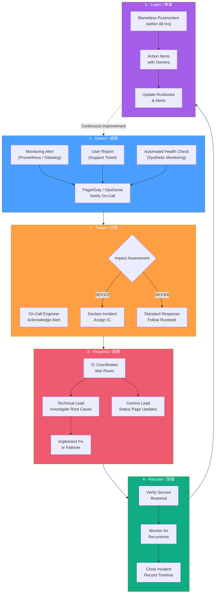
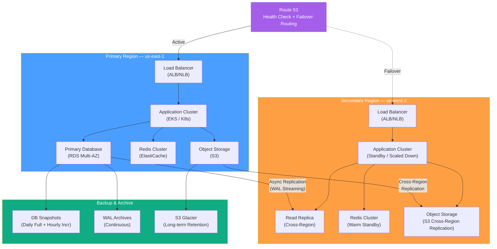

# Incident Management & Disaster Recovery / 事件管理與災難復原

## Intent / 意圖

建立**系統性的事件管理流程與災難復原能力**，確保團隊在生產環境發生故障時能快速偵測、有效應對、最小化影響範圍，並在災難級故障中將服務恢復到可接受的狀態。本筆記涵蓋事件嚴重等級定義、on-call 輪值與升級機制、事件指揮官角色、無責任回顧（blameless postmortem）、RTO/RPO 目標設定、備份策略、多區域容錯移轉、Runbook 設計、事件期間的溝通協定，以及災難復原演練。

核心問題：**當凌晨三點收到 PagerDuty 告警時，團隊是否有清晰的應對流程、預先驗證的復原計畫、以及足夠的自動化工具來在目標時間內恢復服務——而不是在慌亂中即興發揮？**

---

## Problem / 問題情境

**場景一：「凌晨三點告警，沒有 Runbook」** — SRE 工程師凌晨 3:17 被 PagerDuty 叫醒，告警內容只有 "order-service 5xx rate > 10%"。沒有 Runbook 指引下一步該做什麼，不知道該看哪個 Dashboard、該 SSH 到哪台機器、該聯絡誰。花了 25 分鐘才定位到根因是資料庫連線池耗盡，再花 15 分鐘手動重啟服務。MTTR 40 分鐘，但如果有 Runbook 和自動化修復，本可在 5 分鐘內解決。

**場景二：「資料丟失，沒有可用備份」** — 工程師在 production 資料庫執行了一條 `DELETE FROM orders WHERE status = 'pending'`，漏了 `AND created_at < '2025-01-01'` 條件，刪除了 48 萬筆進行中的訂單。團隊發現最近一次完整備份是 72 小時前——RPO 目標是 1 小時但從未被驗證。備份還原過程中才發現備份檔案損壞、還原 script 無法在新版 PostgreSQL 上執行。營收損失數百萬，客戶信任重創。

**場景三：「AWS Region 故障，failover 從未測試」** — 主要部署在 us-east-1 的 SaaS 平台遭遇 Region 級別故障。架構圖上畫了 us-west-2 備援，但 failover 從未實際演練。跨 Region 的資料同步延遲 15 分鐘（RPO 已違約）、DNS failover TTL 設定為 300 秒（客戶端快取更久）、us-west-2 的 auto-scaling 配額從未申請，啟動即 hit capacity limit。「理論上 30 分鐘 RTO」實際花了 4.5 小時才完全恢復。

**場景四：「Postmortem 變成指責大會」** — 資深工程師誤操作導致 30 分鐘停機。Postmortem 會議上，管理層追問「是誰幹的」「為什麼這麼不小心」，工程師開始互相推卸責任、隱藏資訊。真正的系統性問題（缺乏操作確認機制、沒有 staging 環境驗證、權限控制不足）從未被討論，同類事故在三個月後再次發生。

---

## Core Concepts / 核心概念

### Incident Severity Levels / 事件嚴重等級（SEV1-4）

事件分級決定了回應速度、參與人數和溝通範圍。每個組織可根據業務影響自訂，以下是常見的四級分類：

| 等級 | 名稱 | 描述 | 回應時間 | 通知範圍 | 範例 |
|------|------|------|---------|---------|------|
| **SEV1** | Critical / 緊急 | 核心服務完全不可用，或資料大量流失，影響所有使用者 | < 5 min | VP+ / 全公司 | 主站全面 downtime、支付系統癱瘓、使用者資料外洩 |
| **SEV2** | Major / 重大 | 核心功能嚴重降級，影響大量使用者 | < 15 min | Director + 相關團隊 | 訂單成功率 < 95%、搜尋延遲 > 5s、部分 Region 不可用 |
| **SEV3** | Minor / 中等 | 非核心功能受影響，或核心功能小幅降級 | < 1 hr | 團隊負責人 | 推薦系統回退至靜態列表、非關鍵 API 間歇性 timeout |
| **SEV4** | Low / 低 | 小問題，不影響使用者體驗 | 下個工作日 | 該服務 owner | 內部管理後台慢、日誌收集延遲、非關鍵 cron job 失敗 |

### On-Call Rotation / On-Call 輪值

On-Call 輪值確保任何時刻都有工程師負責回應告警。健康的 on-call 制度應包括：

- **輪值週期**：通常每人一週，團隊至少 5-6 人避免過度疲勞
- **主要 + 備援**：Primary on-call 負責初步回應，Secondary 在 primary 無回應（5-10 分鐘）時自動升級
- **Handoff 儀式**：交接時回顧上週事件、未結案項目、已知風險
- **On-call 補償**：額外休假或津貼，認可 on-call 的負擔
- **Toil budget**：追蹤 on-call 期間的工作量，過高代表系統需要改善

### Incident Commander (IC) / 事件指揮官

IC 是事件期間的最高決策者，負責協調所有參與者。IC 不需要是技術最強的人——需要的是冷靜的判斷力、清晰的溝通能力和果斷的決策。

| IC 職責 | 描述 |
|---------|------|
| **宣告事件等級** | 根據影響範圍決定 SEV 等級 |
| **組建回應團隊** | 指定技術負責人、溝通負責人 |
| **協調工作流** | 分配調查任務，避免重複工作 |
| **決策裁決** | 在多個修復方案間做最終選擇 |
| **對外溝通** | 透過 status page / Slack 定期更新 |
| **時間管理** | 追蹤進度，必要時升級 |

### Postmortem / Blameless Retrospective / 無責任回顧

Postmortem 的目的是**改善系統**而非追究個人。核心原則：

1. **Blameless**：假設每個人在當時的情境和資訊下做了最合理的決定。追問「系統為什麼允許這個操作？」而非「誰犯了這個錯？」
2. **Timeline 重建**：精確記錄事件時間軸——何時偵測到、何時回應、何時修復
3. **Root Cause Analysis**：使用 5 Whys 或 Fishbone Diagram 找到系統性根因
4. **Action Items**：每個發現都應產生具體、可追蹤、有 owner 的改善項目
5. **分享學習**：Postmortem 對全公司公開，讓其他團隊也能學習

### RTO (Recovery Time Objective) / 恢復時間目標

從故障發生到服務完全恢復的最大可接受時間。RTO = Detection Time + Response Time + Recovery Time。

| RTO 等級 | 適用場景 | 典型策略 |
|----------|---------|---------|
| < 1 min | 支付、交易系統 | Active-Active multi-region、自動 failover |
| < 15 min | 核心 SaaS 平台 | Hot standby、自動化 Runbook |
| < 1 hr | 一般商業應用 | Warm standby、手動 failover |
| < 4 hr | 內部工具、報表 | Cold standby、備份還原 |
| < 24 hr | 非關鍵系統 | 備份還原、手動重建 |

### RPO (Recovery Point Objective) / 恢復點目標

可接受的最大資料丟失量，以時間衡量。RPO = 0 代表不可丟失任何資料。

| RPO 等級 | 適用場景 | 典型策略 |
|----------|---------|---------|
| 0 (zero) | 金融交易、帳務系統 | 同步複寫、multi-primary |
| < 1 min | 訂單、使用者資料 | 非同步複寫 + WAL archiving |
| < 1 hr | 一般業務資料 | 頻繁增量備份 |
| < 24 hr | 靜態內容、設定檔 | 每日全量備份 |

### Backup Strategies / 備份策略

| 備份類型 | 說明 | 優點 | 缺點 |
|---------|------|------|------|
| **Full Backup / 全量備份** | 完整複製所有資料 | 還原最快、最簡單 | 耗時、佔空間 |
| **Incremental Backup / 增量備份** | 僅備份自上次備份以來變更的部分 | 速度快、空間省 | 還原需依序套用所有增量 |
| **Differential Backup / 差異備份** | 備份自上次全量備份以來變更的部分 | 還原只需全量 + 最新差異 | 差異隨時間增大 |

最佳實踐組合：每週一次 Full + 每日 Differential + 每小時 Incremental。遵循 **3-2-1 法則**——3 份備份、2 種不同介質、1 份異地保存。

### Runbook / 操作手冊

Runbook 是針對特定事件場景的標準化操作步驟，讓任何 on-call 工程師（包括第一次值班的新人）都能在壓力下快速執行正確的修復動作。

好的 Runbook 應包含：
- **觸發條件**：什麼告警觸發此 Runbook
- **診斷步驟**：按順序檢查哪些 metrics / logs / dashboards
- **修復動作**：具體的命令和操作步驟
- **驗證步驟**：如何確認修復成功
- **升級條件**：什麼情況下需要升級到更高層級
- **最後更新日期和 owner**：確保 Runbook 不過期

### Multi-Region Failover / 多區域容錯移轉

將服務部署在多個地理區域，當主要區域故障時自動或手動將流量切換到備援區域。

| 模式 | 說明 | RTO | 成本 |
|------|------|-----|------|
| **Active-Active** | 所有區域同時服務流量 | ~0 | 最高（2x+ 資源） |
| **Active-Passive (Hot)** | 備援區域隨時就緒，數據即時同步 | 分鐘級 | 高（1.5x 資源） |
| **Active-Passive (Warm)** | 備援區域有基礎設施但需啟動服務 | 15-60 min | 中等 |
| **Active-Passive (Cold)** | 備援區域僅有備份，需完整部署 | 數小時 | 最低 |

---

## Architecture / 架構

### Incident Response Workflow / 事件回應工作流程



### Disaster Recovery Architecture / 災難復原架構



---

## How It Works / 運作原理

### Incident Response Lifecycle / 事件回應生命週期

1. **偵測 (Detection)**
   告警系統（Prometheus Alertmanager、Datadog、PagerDuty）偵測到異常指標——例如 5xx 錯誤率超過閾值、P99 延遲飆升、或 health check 連續失敗。告警觸發 PagerDuty，通知 primary on-call 工程師。若 5 分鐘內未確認，自動升級到 secondary on-call。

2. **確認與分級 (Acknowledge & Triage)**
   On-call 工程師確認告警後，快速評估影響範圍：多少使用者受影響？哪些功能不可用？是否有資料遺失？根據影響決定事件等級（SEV1-4）。SEV1/2 立即宣告正式 incident 並啟動 War Room。

3. **組建回應團隊 (Assemble Response Team)**
   IC（事件指揮官）被指定，負責協調整個回應流程。IC 召集技術負責人（investigation lead）、溝通負責人（comms lead）和相關服務 owner。在 Slack incident channel 中建立即時溝通。

4. **診斷與修復 (Diagnose & Mitigate)**
   技術負責人按照 Runbook 進行系統性診斷：檢查 metrics dashboard、查看最近的部署、分析錯誤日誌和 traces。優先執行 mitigation（緩解）而非 root cause fix——先恢復服務（回滾部署、failover、擴容），根因修復放在事後。

5. **溝通與更新 (Communicate & Update)**
   溝通負責人每 15-30 分鐘在 status page 發布更新：「我們已偵測到問題 → 正在調查 → 已識別根因 → 正在修復 → 已修復，持續監控」。內部 Slack channel 持續更新進展。SEV1 需通知 VP / C-level。

6. **恢復與驗證 (Recover & Verify)**
   修復動作執行後，監控關鍵 SLI 是否恢復到正常水準。觀察至少 15-30 分鐘確認無復發。確認穩定後宣告事件結束，記錄精確的結束時間。

7. **Postmortem (48 小時內)**
   在事件結束後 48 小時內舉行 blameless postmortem。重建精確時間線、分析根因（5 Whys）、識別系統性改善機會、產生有 owner 和 deadline 的 action items。Postmortem 文件對全公司公開。

### Disaster Recovery Failover Process / 災難復原容錯移轉流程

1. **偵測 Region 級故障 (Detect Regional Failure)**
   Route 53 health check 偵測到 primary region 的 endpoint 連續失敗。同時 CloudWatch cross-region metrics 確認不是單點故障。自動或手動觸發 failover 決策。

2. **評估資料同步狀態 (Assess Data Sync State)**
   檢查 cross-region replication lag：DB replica 延遲多少？S3 replication 是否完成？確認 RPO 是否在可接受範圍。如果 replication lag > RPO，需決定是否接受資料丟失或等待同步。

3. **提升備援 Region (Promote Secondary Region)**
   將 DB read replica promote 為 primary（RDS promote、Aurora global database failover）。確認應用程式的連線字串指向新 primary。啟動或擴容 secondary region 的應用程式叢集。

4. **切換 DNS (Switch DNS)**
   更新 Route 53 failover routing，將流量導向 secondary region。注意 DNS TTL——客戶端可能快取舊的 DNS record。TTL 應預先設定為低值（60 秒）以加速 failover。

5. **驗證與監控 (Verify & Monitor)**
   在 secondary region 執行 smoke test。監控 error rate、latency、throughput 是否正常。特別注意 cache cold start 問題——failover 後 Redis 可能是空的，DB 會承受 thundering herd。

6. **通知利害關係人 (Notify Stakeholders)**
   更新 status page、通知客戶、通知內部團隊。說明目前運行在備援環境、可能的效能影響、以及預計恢復主要環境的時間。

7. **回切 (Failback) — 主環境恢復後**
   主要 region 恢復後，先同步 failover 期間的資料回主要環境。驗證資料一致性。選擇低流量時段執行回切。回切流程等同另一次 failover——必須同樣謹慎。

---

## Rust 實作

```rust
// incident_health_monitor.rs — Automated health check + alerting webhook handler
// Rust 2024 edition, Axum 0.8+, tokio 1, reqwest, serde
//
// 實作一個自動化健康檢查系統：
// 1. 定期對註冊的服務進行 HTTP health check
// 2. 偵測連續失敗後透過 webhook（Slack / PagerDuty）發送告警
// 3. 提供 HTTP API 查詢服務健康狀態
// 4. 達到 failover 閾值時觸發自動 failover

// Cargo.toml dependencies:
// axum = "0.8"
// tokio = { version = "1", features = ["full"] }
// reqwest = { version = "0.12", features = ["json"] }
// serde = { version = "1", features = ["derive"] }
// serde_json = "1"

use axum::{
    Json, Router,
    extract::State,
    http::StatusCode,
    response::IntoResponse,
    routing::{get, post},
};
use serde::{Deserialize, Serialize};
use std::collections::HashMap;
use std::sync::Arc;
use std::time::{Duration, Instant};
use tokio::sync::RwLock;
use tokio::time::interval;

// ─── Domain Types ───

/// 服務健康狀態
#[derive(Debug, Clone, Copy, PartialEq, Eq, Serialize, Deserialize)]
#[serde(rename_all = "snake_case")]
pub enum HealthStatus {
    Healthy,
    Degraded,
    Unhealthy,
}

/// 事件嚴重等級
#[derive(Debug, Clone, Copy, PartialEq, Eq, Serialize, Deserialize)]
pub enum Severity {
    SEV1,
    SEV2,
    SEV3,
    SEV4,
}

impl std::fmt::Display for Severity {
    fn fmt(&self, f: &mut std::fmt::Formatter<'_>) -> std::fmt::Result {
        match self {
            Self::SEV1 => write!(f, "SEV1-CRITICAL"),
            Self::SEV2 => write!(f, "SEV2-MAJOR"),
            Self::SEV3 => write!(f, "SEV3-MINOR"),
            Self::SEV4 => write!(f, "SEV4-LOW"),
        }
    }
}

/// 受監控的服務定義
#[derive(Debug, Clone, Serialize, Deserialize)]
pub struct MonitoredService {
    pub name: String,
    pub health_endpoint: String,
    pub region: String,
    pub check_interval_secs: u64,
    /// 連續失敗幾次觸發告警
    pub alert_after_failures: u32,
    /// 連續失敗幾次觸發 failover
    pub failover_after_failures: u32,
}

/// 服務的即時健康記錄
#[derive(Debug, Clone, Serialize)]
pub struct ServiceHealthRecord {
    pub service_name: String,
    pub region: String,
    pub status: HealthStatus,
    pub consecutive_failures: u32,
    pub last_check_time: String,
    pub last_success_time: Option<String>,
    pub last_failure_reason: Option<String>,
    pub response_time_ms: Option<u64>,
    pub alert_sent: bool,
    pub failover_triggered: bool,
}

/// Webhook 告警 payload
#[derive(Debug, Serialize)]
pub struct AlertPayload {
    pub severity: Severity,
    pub service_name: String,
    pub region: String,
    pub status: HealthStatus,
    pub consecutive_failures: u32,
    pub failure_reason: String,
    pub timestamp: String,
    pub action_required: String,
    pub runbook_url: Option<String>,
}

/// Failover 事件
#[derive(Debug, Serialize)]
pub struct FailoverEvent {
    pub service_name: String,
    pub from_region: String,
    pub to_region: String,
    pub trigger_reason: String,
    pub timestamp: String,
}

// ─── Configuration ───

#[derive(Debug, Clone, Deserialize)]
pub struct MonitorConfig {
    pub services: Vec<MonitoredService>,
    pub webhook_url: String,
    pub failover_webhook_url: String,
    pub health_check_timeout_secs: u64,
    pub runbook_base_url: String,
}

impl MonitorConfig {
    /// 建立示範用設定
    pub fn demo() -> Self {
        Self {
            services: vec![
                MonitoredService {
                    name: "order-service".into(),
                    health_endpoint: "http://order-service:8080/health".into(),
                    region: "us-east-1".into(),
                    check_interval_secs: 10,
                    alert_after_failures: 3,
                    failover_after_failures: 6,
                },
                MonitoredService {
                    name: "payment-service".into(),
                    health_endpoint: "http://payment-service:8080/health".into(),
                    region: "us-east-1".into(),
                    check_interval_secs: 5,
                    alert_after_failures: 2,
                    failover_after_failures: 4,
                },
                MonitoredService {
                    name: "order-service-dr".into(),
                    health_endpoint: "http://order-service.us-west-2:8080/health".into(),
                    region: "us-west-2".into(),
                    check_interval_secs: 30,
                    alert_after_failures: 3,
                    failover_after_failures: 10,
                },
            ],
            webhook_url: "https://hooks.slack.com/services/T00/B00/xxx".into(),
            failover_webhook_url: "https://api.pagerduty.com/incidents".into(),
            health_check_timeout_secs: 5,
            runbook_base_url: "https://wiki.example.com/runbooks".into(),
        }
    }
}

// ─── Application State ───

pub struct AppState {
    pub config: MonitorConfig,
    pub health_records: RwLock<HashMap<String, ServiceHealthRecord>>,
    pub incident_log: RwLock<Vec<AlertPayload>>,
    pub failover_log: RwLock<Vec<FailoverEvent>>,
    pub http_client: reqwest::Client,
}

impl AppState {
    pub fn new(config: MonitorConfig) -> Self {
        let http_client = reqwest::Client::builder()
            .timeout(Duration::from_secs(config.health_check_timeout_secs))
            .build()
            .expect("failed to build HTTP client");

        Self {
            config,
            health_records: RwLock::new(HashMap::new()),
            incident_log: RwLock::new(Vec::new()),
            failover_log: RwLock::new(Vec::new()),
            http_client,
        }
    }
}

type SharedState = Arc<AppState>;

// ─── Health Check Engine ───

/// 對單一服務執行健康檢查並更新狀態
async fn check_service_health(state: &SharedState, service: &MonitoredService) {
    let start = Instant::now();
    let now = chrono_like_now();
    let key = format!("{}:{}", service.name, service.region);

    let check_result = state.http_client.get(&service.health_endpoint).send().await;

    let mut records = state.health_records.write().await;
    let record = records.entry(key.clone()).or_insert_with(|| ServiceHealthRecord {
        service_name: service.name.clone(),
        region: service.region.clone(),
        status: HealthStatus::Healthy,
        consecutive_failures: 0,
        last_check_time: now.clone(),
        last_success_time: None,
        last_failure_reason: None,
        response_time_ms: None,
        alert_sent: false,
        failover_triggered: false,
    });

    record.last_check_time = now.clone();

    match check_result {
        Ok(resp) if resp.status().is_success() => {
            let elapsed_ms = start.elapsed().as_millis() as u64;
            record.status = HealthStatus::Healthy;
            record.consecutive_failures = 0;
            record.last_success_time = Some(now);
            record.response_time_ms = Some(elapsed_ms);
            record.last_failure_reason = None;
            // 服務恢復後重設告警狀態
            if record.alert_sent {
                println!(
                    "[RECOVERY] service={} region={} status=healthy elapsed_ms={elapsed_ms}",
                    service.name, service.region
                );
                record.alert_sent = false;
                record.failover_triggered = false;
            }
        }
        Ok(resp) => {
            let status_code = resp.status().as_u16();
            let reason = format!("HTTP {status_code}");
            handle_failure(state, service, record, &reason, &now).await;
        }
        Err(err) => {
            let reason = if err.is_timeout() {
                "health check timeout".to_string()
            } else if err.is_connect() {
                "connection refused".to_string()
            } else {
                format!("request error: {err}")
            };
            handle_failure(state, service, record, &reason, &now).await;
        }
    }
}

/// 處理健康檢查失敗：更新狀態、觸發告警和 failover
async fn handle_failure(
    state: &SharedState,
    service: &MonitoredService,
    record: &mut ServiceHealthRecord,
    reason: &str,
    timestamp: &str,
) {
    record.consecutive_failures += 1;
    record.last_failure_reason = Some(reason.to_string());
    record.response_time_ms = None;

    let failures = record.consecutive_failures;

    // 決定健康狀態
    record.status = if failures >= service.failover_after_failures {
        HealthStatus::Unhealthy
    } else if failures >= service.alert_after_failures {
        HealthStatus::Degraded
    } else {
        HealthStatus::Degraded
    };

    println!(
        "[HEALTH_CHECK_FAIL] service={} region={} failures={failures} reason={reason}",
        service.name, service.region
    );

    // 觸發告警（達到告警閾值且尚未發送）
    if failures >= service.alert_after_failures && !record.alert_sent {
        let severity = determine_severity(service, failures);
        let alert = AlertPayload {
            severity,
            service_name: service.name.clone(),
            region: service.region.clone(),
            status: record.status,
            consecutive_failures: failures,
            failure_reason: reason.to_string(),
            timestamp: timestamp.to_string(),
            action_required: format!(
                "Service {} in {} has failed {failures} consecutive health checks. Check runbook.",
                service.name, service.region
            ),
            runbook_url: Some(format!(
                "{}/{}",
                state.config.runbook_base_url, service.name
            )),
        };

        send_webhook_alert(state, &alert).await;
        state.incident_log.write().await.push(alert);
        record.alert_sent = true;
    }

    // 觸發 failover（達到 failover 閾值且尚未觸發）
    if failures >= service.failover_after_failures && !record.failover_triggered {
        let failover_event = FailoverEvent {
            service_name: service.name.clone(),
            from_region: service.region.clone(),
            to_region: determine_failover_region(&service.region),
            trigger_reason: format!(
                "{failures} consecutive failures: {reason}"
            ),
            timestamp: timestamp.to_string(),
        };

        trigger_failover(state, &failover_event).await;
        state.failover_log.write().await.push(failover_event);
        record.failover_triggered = true;
    }
}

/// 根據失敗次數和服務類型決定告警等級
fn determine_severity(service: &MonitoredService, failures: u32) -> Severity {
    if failures >= service.failover_after_failures {
        Severity::SEV1
    } else if failures >= service.alert_after_failures * 2 {
        Severity::SEV2
    } else {
        Severity::SEV3
    }
}

/// 決定 failover 目標 region
fn determine_failover_region(current_region: &str) -> String {
    match current_region {
        "us-east-1" => "us-west-2".to_string(),
        "us-west-2" => "us-east-1".to_string(),
        "eu-west-1" => "eu-central-1".to_string(),
        other => format!("{other}-backup"),
    }
}

/// 發送告警 webhook（Slack / PagerDuty）
async fn send_webhook_alert(state: &SharedState, alert: &AlertPayload) {
    println!(
        "[ALERT] severity={} service={} region={} failures={} reason={}",
        alert.severity,
        alert.service_name,
        alert.region,
        alert.consecutive_failures,
        alert.failure_reason
    );

    // 生產環境中，這裡會真正發送 HTTP POST 到 webhook URL
    // 此處以 log 模擬，避免依賴外部服務
    let payload = serde_json::json!({
        "text": format!(
            "[{}] {} in {} - {} consecutive failures\nReason: {}\nRunbook: {}",
            alert.severity,
            alert.service_name,
            alert.region,
            alert.consecutive_failures,
            alert.failure_reason,
            alert.runbook_url.as_deref().unwrap_or("N/A")
        )
    });

    match state
        .http_client
        .post(&state.config.webhook_url)
        .json(&payload)
        .send()
        .await
    {
        Ok(resp) => {
            println!("[WEBHOOK] alert sent, status={}", resp.status());
        }
        Err(err) => {
            // 告警系統本身的故障也必須處理——fallback 到 stderr log
            eprintln!("[WEBHOOK_ERROR] failed to send alert: {err}");
        }
    }
}

/// 觸發 failover 動作
async fn trigger_failover(state: &SharedState, event: &FailoverEvent) {
    println!(
        "[FAILOVER] service={} from={} to={} reason={}",
        event.service_name, event.from_region, event.to_region, event.trigger_reason
    );

    // 生產環境中此處會：
    // 1. 呼叫 DNS API 切換 Route 53 failover routing
    // 2. 呼叫 K8s API 在目標 region 擴容服務
    // 3. 呼叫 DB API promote read replica
    // 4. 發送 PagerDuty incident
    let payload = serde_json::json!({
        "event_action": "trigger",
        "payload": {
            "summary": format!(
                "FAILOVER: {} from {} to {}",
                event.service_name, event.from_region, event.to_region
            ),
            "severity": "critical",
            "source": "health-monitor",
        }
    });

    match state
        .http_client
        .post(&state.config.failover_webhook_url)
        .json(&payload)
        .send()
        .await
    {
        Ok(resp) => println!("[FAILOVER_WEBHOOK] sent, status={}", resp.status()),
        Err(err) => eprintln!("[FAILOVER_WEBHOOK_ERROR] {err}"),
    }
}

// ─── Background Health Check Loop ───

/// 為每個服務啟動獨立的健康檢查 task
fn spawn_health_check_tasks(state: SharedState) {
    for service in &state.config.services {
        let state_clone = Arc::clone(&state);
        let service_clone = service.clone();

        tokio::spawn(async move {
            let mut ticker = interval(Duration::from_secs(
                service_clone.check_interval_secs,
            ));
            loop {
                ticker.tick().await;
                check_service_health(&state_clone, &service_clone).await;
            }
        });
    }
}

// ─── HTTP Handlers ───

/// GET /health — 監控系統自身的健康檢查
async fn self_health() -> &'static str {
    "ok"
}

/// GET /api/status — 取得所有受監控服務的健康狀態
async fn get_all_status(
    State(state): State<SharedState>,
) -> impl IntoResponse {
    let records = state.health_records.read().await;
    let statuses: Vec<&ServiceHealthRecord> = records.values().collect();
    (StatusCode::OK, Json(serde_json::json!({ "services": statuses })))
}

/// GET /api/status/:service — 取得特定服務的健康狀態
async fn get_service_status(
    State(state): State<SharedState>,
    axum::extract::Path(service_name): axum::extract::Path<String>,
) -> impl IntoResponse {
    let records = state.health_records.read().await;
    let matching: Vec<&ServiceHealthRecord> = records
        .values()
        .filter(|r| r.service_name == service_name)
        .collect();

    if matching.is_empty() {
        return (
            StatusCode::NOT_FOUND,
            Json(serde_json::json!({ "error": "service not found" })),
        );
    }
    (StatusCode::OK, Json(serde_json::json!({ "service": matching })))
}

/// GET /api/incidents — 取得告警歷史
async fn get_incidents(
    State(state): State<SharedState>,
) -> impl IntoResponse {
    let log = state.incident_log.read().await;
    (StatusCode::OK, Json(serde_json::json!({ "incidents": *log })))
}

/// GET /api/failovers — 取得 failover 歷史
async fn get_failovers(
    State(state): State<SharedState>,
) -> impl IntoResponse {
    let log = state.failover_log.read().await;
    (StatusCode::OK, Json(serde_json::json!({ "failovers": *log })))
}

/// POST /api/webhook/test — 測試 webhook 連通性
async fn test_webhook(
    State(state): State<SharedState>,
) -> impl IntoResponse {
    let test_alert = AlertPayload {
        severity: Severity::SEV4,
        service_name: "webhook-test".into(),
        region: "test".into(),
        status: HealthStatus::Healthy,
        consecutive_failures: 0,
        failure_reason: "manual test".into(),
        timestamp: chrono_like_now(),
        action_required: "No action required — this is a test alert.".into(),
        runbook_url: None,
    };

    send_webhook_alert(&state, &test_alert).await;
    (StatusCode::OK, Json(serde_json::json!({ "message": "test alert sent" })))
}

// ─── Utility ───

/// 簡易時間戳產生（避免額外 chrono 依賴）
fn chrono_like_now() -> String {
    let duration = std::time::SystemTime::now()
        .duration_since(std::time::UNIX_EPOCH)
        .unwrap_or_default();
    format!("{}s", duration.as_secs())
}

// ─── Server Bootstrap ───

#[tokio::main]
async fn main() {
    let config = MonitorConfig::demo();
    println!("Monitored services:");
    for svc in &config.services {
        println!(
            "  - {} ({}) check_interval={}s alert_after={} failover_after={}",
            svc.name, svc.region, svc.check_interval_secs,
            svc.alert_after_failures, svc.failover_after_failures
        );
    }

    let state: SharedState = Arc::new(AppState::new(config));

    // 啟動背景健康檢查 tasks
    spawn_health_check_tasks(Arc::clone(&state));

    let app = Router::new()
        .route("/health", get(self_health))
        .route("/api/status", get(get_all_status))
        .route("/api/status/{service}", get(get_service_status))
        .route("/api/incidents", get(get_incidents))
        .route("/api/failovers", get(get_failovers))
        .route("/api/webhook/test", post(test_webhook))
        .with_state(state);

    let listener = tokio::net::TcpListener::bind("0.0.0.0:9090")
        .await
        .expect("failed to bind");

    println!("Health monitor listening on :9090");
    println!("Endpoints:");
    println!("  GET  /api/status          — all service health");
    println!("  GET  /api/status/:service  — single service health");
    println!("  GET  /api/incidents        — alert history");
    println!("  GET  /api/failovers        — failover history");
    println!("  POST /api/webhook/test     — test webhook");

    axum::serve(listener, app).await.expect("server failed");

    // Output:
    // Monitored services:
    //   - order-service (us-east-1) check_interval=10s alert_after=3 failover_after=6
    //   - payment-service (us-east-1) check_interval=5s alert_after=2 failover_after=4
    //   - order-service-dr (us-west-2) check_interval=30s alert_after=3 failover_after=10
    // Health monitor listening on :9090
    //
    // (when order-service becomes unhealthy):
    // [HEALTH_CHECK_FAIL] service=order-service region=us-east-1 failures=1 reason=connection refused
    // [HEALTH_CHECK_FAIL] service=order-service region=us-east-1 failures=2 reason=connection refused
    // [HEALTH_CHECK_FAIL] service=order-service region=us-east-1 failures=3 reason=connection refused
    // [ALERT] severity=SEV3 service=order-service region=us-east-1 failures=3 reason=connection refused
    // [WEBHOOK] alert sent, status=200 OK
    //
    // (continued failures trigger failover):
    // [HEALTH_CHECK_FAIL] service=order-service region=us-east-1 failures=6 reason=connection refused
    // [ALERT] severity=SEV1 service=order-service region=us-east-1 failures=6 reason=connection refused
    // [FAILOVER] service=order-service from=us-east-1 to=us-west-2 reason=6 consecutive failures: connection refused
    // [FAILOVER_WEBHOOK] sent, status=202 Accepted
    //
    // (when service recovers):
    // [RECOVERY] service=order-service region=us-east-1 status=healthy elapsed_ms=12
}
```

### 設計重點

- **`Arc<RwLock<HashMap>>`**：`RwLock` 允許多個健康檢查 task 同時讀取狀態（`read().await`），只有寫入時才獨佔鎖。比 `Mutex` 在讀多寫少場景下效能更好。
- **每個服務獨立 `tokio::spawn`**：每個服務的健康檢查在獨立的 async task 中執行，一個服務的 timeout 不影響其他服務的檢查排程。
- **Webhook fallback**：如果 webhook 發送失敗（告警系統也可能故障），fallback 到 `eprintln!`。生產環境中應有多重告警管道（Slack + PagerDuty + Email）。
- **漸進式升級**：失敗次數從 `alert_after_failures` 到 `failover_after_failures` 分兩階段，避免短暫抖動直接觸發 failover。
- **Axum State extraction**：透過 `State(state): State<SharedState>` 在 handler 中存取共享狀態，型別安全且編譯期保證正確性。

---

## Go 實作

```go
// incident_health_monitor.go — Automated health check + alerting webhook handler
// Go 1.24+, standard library + net/http
//
// 實作一個自動化健康檢查系統：
// 1. 定期對註冊的服務進行 HTTP health check
// 2. 偵測連續失敗後透過 webhook 發送告警
// 3. 提供 HTTP API 查詢服務健康狀態
// 4. 達到 failover 閾值時觸發自動 failover

package main

import (
	"bytes"
	"context"
	"encoding/json"
	"fmt"
	"log/slog"
	"net/http"
	"os"
	"sync"
	"time"
)

// ─── Domain Types ───

// HealthStatus 服務健康狀態
type HealthStatus string

const (
	StatusHealthy   HealthStatus = "healthy"
	StatusDegraded  HealthStatus = "degraded"
	StatusUnhealthy HealthStatus = "unhealthy"
)

// Severity 事件嚴重等級
type Severity string

const (
	SEV1 Severity = "SEV1-CRITICAL"
	SEV2 Severity = "SEV2-MAJOR"
	SEV3 Severity = "SEV3-MINOR"
	SEV4 Severity = "SEV4-LOW"
)

// MonitoredService 受監控的服務定義
type MonitoredService struct {
	Name                 string        `json:"name"`
	HealthEndpoint       string        `json:"health_endpoint"`
	Region               string        `json:"region"`
	CheckInterval        time.Duration `json:"check_interval"`
	AlertAfterFailures   int           `json:"alert_after_failures"`
	FailoverAfterFailures int          `json:"failover_after_failures"`
}

// ServiceHealthRecord 服務的即時健康記錄
type ServiceHealthRecord struct {
	ServiceName         string       `json:"service_name"`
	Region              string       `json:"region"`
	Status              HealthStatus `json:"status"`
	ConsecutiveFailures int          `json:"consecutive_failures"`
	LastCheckTime       time.Time    `json:"last_check_time"`
	LastSuccessTime     *time.Time   `json:"last_success_time,omitempty"`
	LastFailureReason   string       `json:"last_failure_reason,omitempty"`
	ResponseTimeMs      *int64       `json:"response_time_ms,omitempty"`
	AlertSent           bool         `json:"alert_sent"`
	FailoverTriggered   bool         `json:"failover_triggered"`
}

// AlertPayload webhook 告警 payload
type AlertPayload struct {
	Severity            Severity     `json:"severity"`
	ServiceName         string       `json:"service_name"`
	Region              string       `json:"region"`
	Status              HealthStatus `json:"status"`
	ConsecutiveFailures int          `json:"consecutive_failures"`
	FailureReason       string       `json:"failure_reason"`
	Timestamp           time.Time    `json:"timestamp"`
	ActionRequired      string       `json:"action_required"`
	RunbookURL          string       `json:"runbook_url,omitempty"`
}

// FailoverEvent failover 事件記錄
type FailoverEvent struct {
	ServiceName   string    `json:"service_name"`
	FromRegion    string    `json:"from_region"`
	ToRegion      string    `json:"to_region"`
	TriggerReason string    `json:"trigger_reason"`
	Timestamp     time.Time `json:"timestamp"`
}

// ─── Configuration ───

// MonitorConfig 監控系統設定
type MonitorConfig struct {
	Services              []MonitoredService `json:"services"`
	WebhookURL            string             `json:"webhook_url"`
	FailoverWebhookURL    string             `json:"failover_webhook_url"`
	HealthCheckTimeout    time.Duration      `json:"health_check_timeout"`
	RunbookBaseURL        string             `json:"runbook_base_url"`
}

// DemoConfig 回傳示範用設定
func DemoConfig() MonitorConfig {
	return MonitorConfig{
		Services: []MonitoredService{
			{
				Name:                  "order-service",
				HealthEndpoint:        "http://order-service:8080/health",
				Region:                "us-east-1",
				CheckInterval:         10 * time.Second,
				AlertAfterFailures:    3,
				FailoverAfterFailures: 6,
			},
			{
				Name:                  "payment-service",
				HealthEndpoint:        "http://payment-service:8080/health",
				Region:                "us-east-1",
				CheckInterval:         5 * time.Second,
				AlertAfterFailures:    2,
				FailoverAfterFailures: 4,
			},
			{
				Name:                  "order-service-dr",
				HealthEndpoint:        "http://order-service.us-west-2:8080/health",
				Region:                "us-west-2",
				CheckInterval:         30 * time.Second,
				AlertAfterFailures:    3,
				FailoverAfterFailures: 10,
			},
		},
		WebhookURL:         "https://hooks.slack.com/services/T00/B00/xxx",
		FailoverWebhookURL: "https://api.pagerduty.com/incidents",
		HealthCheckTimeout: 5 * time.Second,
		RunbookBaseURL:     "https://wiki.example.com/runbooks",
	}
}

// ─── Application State ───

// HealthMonitor 健康監控器，管理所有狀態
type HealthMonitor struct {
	config      MonitorConfig
	httpClient  *http.Client
	logger      *slog.Logger

	mu            sync.RWMutex
	healthRecords map[string]*ServiceHealthRecord
	incidentLog   []AlertPayload
	failoverLog   []FailoverEvent
}

// NewHealthMonitor 建立新的健康監控器
func NewHealthMonitor(config MonitorConfig) *HealthMonitor {
	return &HealthMonitor{
		config: config,
		httpClient: &http.Client{
			Timeout: config.HealthCheckTimeout,
		},
		logger:        slog.New(slog.NewJSONHandler(os.Stdout, nil)),
		healthRecords: make(map[string]*ServiceHealthRecord),
		incidentLog:   make([]AlertPayload, 0),
		failoverLog:   make([]FailoverEvent, 0),
	}
}

// ─── Health Check Engine ───

// checkServiceHealth 對單一服務執行健康檢查
func (m *HealthMonitor) checkServiceHealth(ctx context.Context, svc MonitoredService) {
	now := time.Now()
	key := svc.Name + ":" + svc.Region

	start := time.Now()
	req, err := http.NewRequestWithContext(ctx, http.MethodGet, svc.HealthEndpoint, nil)
	if err != nil {
		m.handleFailure(svc, key, now, fmt.Sprintf("invalid endpoint: %v", err))
		return
	}

	resp, err := m.httpClient.Do(req)
	elapsed := time.Since(start).Milliseconds()

	if err != nil {
		reason := "request error"
		if ctx.Err() != nil {
			reason = "health check timeout"
		}
		m.handleFailure(svc, key, now, reason)
		return
	}
	defer resp.Body.Close()

	if resp.StatusCode >= 200 && resp.StatusCode < 300 {
		m.handleSuccess(svc, key, now, elapsed)
	} else {
		m.handleFailure(svc, key, now, fmt.Sprintf("HTTP %d", resp.StatusCode))
	}
}

// handleSuccess 處理健康檢查成功
func (m *HealthMonitor) handleSuccess(svc MonitoredService, key string, now time.Time, elapsedMs int64) {
	m.mu.Lock()
	defer m.mu.Unlock()

	record, exists := m.healthRecords[key]
	if !exists {
		record = &ServiceHealthRecord{
			ServiceName: svc.Name,
			Region:      svc.Region,
		}
		m.healthRecords[key] = record
	}

	wasAlerted := record.AlertSent

	record.Status = StatusHealthy
	record.ConsecutiveFailures = 0
	record.LastCheckTime = now
	record.LastSuccessTime = &now
	record.LastFailureReason = ""
	record.ResponseTimeMs = &elapsedMs

	if wasAlerted {
		m.logger.Info("service recovered",
			"service", svc.Name,
			"region", svc.Region,
			"response_time_ms", elapsedMs,
		)
		record.AlertSent = false
		record.FailoverTriggered = false
	}
}

// handleFailure 處理健康檢查失敗
func (m *HealthMonitor) handleFailure(svc MonitoredService, key string, now time.Time, reason string) {
	m.mu.Lock()

	record, exists := m.healthRecords[key]
	if !exists {
		record = &ServiceHealthRecord{
			ServiceName: svc.Name,
			Region:      svc.Region,
		}
		m.healthRecords[key] = record
	}

	record.ConsecutiveFailures++
	record.LastCheckTime = now
	record.LastFailureReason = reason
	record.ResponseTimeMs = nil
	failures := record.ConsecutiveFailures

	// 決定健康狀態
	if failures >= svc.FailoverAfterFailures {
		record.Status = StatusUnhealthy
	} else if failures >= svc.AlertAfterFailures {
		record.Status = StatusDegraded
	}

	m.logger.Warn("health check failed",
		"service", svc.Name,
		"region", svc.Region,
		"failures", failures,
		"reason", reason,
	)

	// 觸發告警
	shouldAlert := failures >= svc.AlertAfterFailures && !record.AlertSent
	shouldFailover := failures >= svc.FailoverAfterFailures && !record.FailoverTriggered

	if shouldAlert {
		record.AlertSent = true
	}
	if shouldFailover {
		record.FailoverTriggered = true
	}

	m.mu.Unlock() // 釋放鎖後再做 I/O，避免長時間持鎖

	if shouldAlert {
		severity := determineSeverity(svc, failures)
		alert := AlertPayload{
			Severity:            severity,
			ServiceName:         svc.Name,
			Region:              svc.Region,
			Status:              record.Status,
			ConsecutiveFailures: failures,
			FailureReason:       reason,
			Timestamp:           now,
			ActionRequired: fmt.Sprintf(
				"Service %s in %s has failed %d consecutive health checks. Check runbook.",
				svc.Name, svc.Region, failures,
			),
			RunbookURL: fmt.Sprintf("%s/%s", m.config.RunbookBaseURL, svc.Name),
		}
		m.sendWebhookAlert(alert)

		m.mu.Lock()
		m.incidentLog = append(m.incidentLog, alert)
		m.mu.Unlock()
	}

	if shouldFailover {
		event := FailoverEvent{
			ServiceName:   svc.Name,
			FromRegion:    svc.Region,
			ToRegion:      determineFailoverRegion(svc.Region),
			TriggerReason: fmt.Sprintf("%d consecutive failures: %s", failures, reason),
			Timestamp:     now,
		}
		m.triggerFailover(event)

		m.mu.Lock()
		m.failoverLog = append(m.failoverLog, event)
		m.mu.Unlock()
	}
}

// determineSeverity 根據失敗次數決定告警等級
func determineSeverity(svc MonitoredService, failures int) Severity {
	switch {
	case failures >= svc.FailoverAfterFailures:
		return SEV1
	case failures >= svc.AlertAfterFailures*2:
		return SEV2
	default:
		return SEV3
	}
}

// determineFailoverRegion 決定 failover 目標 region
func determineFailoverRegion(currentRegion string) string {
	regionMap := map[string]string{
		"us-east-1":    "us-west-2",
		"us-west-2":    "us-east-1",
		"eu-west-1":    "eu-central-1",
		"eu-central-1": "eu-west-1",
	}
	if target, ok := regionMap[currentRegion]; ok {
		return target
	}
	return currentRegion + "-backup"
}

// sendWebhookAlert 發送告警 webhook
func (m *HealthMonitor) sendWebhookAlert(alert AlertPayload) {
	m.logger.Error("alert triggered",
		"severity", string(alert.Severity),
		"service", alert.ServiceName,
		"region", alert.Region,
		"failures", alert.ConsecutiveFailures,
		"reason", alert.FailureReason,
	)

	payload := map[string]string{
		"text": fmt.Sprintf("[%s] %s in %s - %d consecutive failures\nReason: %s\nRunbook: %s",
			alert.Severity, alert.ServiceName, alert.Region,
			alert.ConsecutiveFailures, alert.FailureReason, alert.RunbookURL,
		),
	}

	body, _ := json.Marshal(payload)
	resp, err := m.httpClient.Post(m.config.WebhookURL, "application/json", bytes.NewReader(body))
	if err != nil {
		m.logger.Error("webhook send failed", "error", err)
		return
	}
	defer resp.Body.Close()
	m.logger.Info("webhook alert sent", "status", resp.StatusCode)
}

// triggerFailover 觸發 failover 動作
func (m *HealthMonitor) triggerFailover(event FailoverEvent) {
	m.logger.Error("failover triggered",
		"service", event.ServiceName,
		"from", event.FromRegion,
		"to", event.ToRegion,
		"reason", event.TriggerReason,
	)

	payload := map[string]any{
		"event_action": "trigger",
		"payload": map[string]any{
			"summary":  fmt.Sprintf("FAILOVER: %s from %s to %s", event.ServiceName, event.FromRegion, event.ToRegion),
			"severity": "critical",
			"source":   "health-monitor",
		},
	}

	body, _ := json.Marshal(payload)
	resp, err := m.httpClient.Post(m.config.FailoverWebhookURL, "application/json", bytes.NewReader(body))
	if err != nil {
		m.logger.Error("failover webhook failed", "error", err)
		return
	}
	defer resp.Body.Close()
	m.logger.Info("failover webhook sent", "status", resp.StatusCode)
}

// ─── Background Health Check Loop ───

// StartHealthChecks 為每個服務啟動獨立的健康檢查 goroutine
func (m *HealthMonitor) StartHealthChecks(ctx context.Context) {
	for _, svc := range m.config.Services {
		go func(svc MonitoredService) {
			ticker := time.NewTicker(svc.CheckInterval)
			defer ticker.Stop()

			for {
				select {
				case <-ticker.C:
					checkCtx, cancel := context.WithTimeout(ctx, m.config.HealthCheckTimeout)
					m.checkServiceHealth(checkCtx, svc)
					cancel()
				case <-ctx.Done():
					return
				}
			}
		}(svc)
	}
}

// ─── HTTP Handlers ───

func (m *HealthMonitor) selfHealthHandler(w http.ResponseWriter, _ *http.Request) {
	w.WriteHeader(http.StatusOK)
	fmt.Fprint(w, "ok")
}

func (m *HealthMonitor) allStatusHandler(w http.ResponseWriter, _ *http.Request) {
	m.mu.RLock()
	records := make([]*ServiceHealthRecord, 0, len(m.healthRecords))
	for _, r := range m.healthRecords {
		records = append(records, r)
	}
	m.mu.RUnlock()

	w.Header().Set("Content-Type", "application/json")
	json.NewEncoder(w).Encode(map[string]any{"services": records})
}

func (m *HealthMonitor) serviceStatusHandler(w http.ResponseWriter, r *http.Request) {
	serviceName := r.PathValue("service")

	m.mu.RLock()
	var matching []*ServiceHealthRecord
	for _, rec := range m.healthRecords {
		if rec.ServiceName == serviceName {
			matching = append(matching, rec)
		}
	}
	m.mu.RUnlock()

	w.Header().Set("Content-Type", "application/json")
	if len(matching) == 0 {
		w.WriteHeader(http.StatusNotFound)
		json.NewEncoder(w).Encode(map[string]string{"error": "service not found"})
		return
	}
	json.NewEncoder(w).Encode(map[string]any{"service": matching})
}

func (m *HealthMonitor) incidentsHandler(w http.ResponseWriter, _ *http.Request) {
	m.mu.RLock()
	incidents := m.incidentLog
	m.mu.RUnlock()

	w.Header().Set("Content-Type", "application/json")
	json.NewEncoder(w).Encode(map[string]any{"incidents": incidents})
}

func (m *HealthMonitor) failoversHandler(w http.ResponseWriter, _ *http.Request) {
	m.mu.RLock()
	failovers := m.failoverLog
	m.mu.RUnlock()

	w.Header().Set("Content-Type", "application/json")
	json.NewEncoder(w).Encode(map[string]any{"failovers": failovers})
}

func (m *HealthMonitor) testWebhookHandler(w http.ResponseWriter, _ *http.Request) {
	testAlert := AlertPayload{
		Severity:            SEV4,
		ServiceName:         "webhook-test",
		Region:              "test",
		Status:              StatusHealthy,
		ConsecutiveFailures: 0,
		FailureReason:       "manual test",
		Timestamp:           time.Now(),
		ActionRequired:      "No action required — this is a test alert.",
	}
	m.sendWebhookAlert(testAlert)

	w.Header().Set("Content-Type", "application/json")
	json.NewEncoder(w).Encode(map[string]string{"message": "test alert sent"})
}

// ─── Server Bootstrap ───

func main() {
	config := DemoConfig()

	fmt.Println("Monitored services:")
	for _, svc := range config.Services {
		fmt.Printf("  - %s (%s) check_interval=%v alert_after=%d failover_after=%d\n",
			svc.Name, svc.Region, svc.CheckInterval,
			svc.AlertAfterFailures, svc.FailoverAfterFailures,
		)
	}

	monitor := NewHealthMonitor(config)

	ctx, cancel := context.WithCancel(context.Background())
	defer cancel()

	// 啟動背景健康檢查
	monitor.StartHealthChecks(ctx)

	mux := http.NewServeMux()
	mux.HandleFunc("GET /health", monitor.selfHealthHandler)
	mux.HandleFunc("GET /api/status", monitor.allStatusHandler)
	mux.HandleFunc("GET /api/status/{service}", monitor.serviceStatusHandler)
	mux.HandleFunc("GET /api/incidents", monitor.incidentsHandler)
	mux.HandleFunc("GET /api/failovers", monitor.failoversHandler)
	mux.HandleFunc("POST /api/webhook/test", monitor.testWebhookHandler)

	fmt.Println("Health monitor listening on :9090")
	fmt.Println("Endpoints:")
	fmt.Println("  GET  /api/status          — all service health")
	fmt.Println("  GET  /api/status/:service  — single service health")
	fmt.Println("  GET  /api/incidents        — alert history")
	fmt.Println("  GET  /api/failovers        — failover history")
	fmt.Println("  POST /api/webhook/test     — test webhook")

	if err := http.ListenAndServe(":9090", mux); err != nil {
		fmt.Fprintf(os.Stderr, "server error: %v\n", err)
		os.Exit(1)
	}

	// Output:
	// Monitored services:
	//   - order-service (us-east-1) check_interval=10s alert_after=3 failover_after=6
	//   - payment-service (us-east-1) check_interval=5s alert_after=2 failover_after=4
	//   - order-service-dr (us-west-2) check_interval=30s alert_after=3 failover_after=10
	// Health monitor listening on :9090
	//
	// (when order-service becomes unhealthy):
	// {"level":"WARN","msg":"health check failed","service":"order-service","region":"us-east-1","failures":1,"reason":"connection refused"}
	// {"level":"WARN","msg":"health check failed","service":"order-service","region":"us-east-1","failures":2,"reason":"connection refused"}
	// {"level":"WARN","msg":"health check failed","service":"order-service","region":"us-east-1","failures":3,"reason":"connection refused"}
	// {"level":"ERROR","msg":"alert triggered","severity":"SEV3","service":"order-service","region":"us-east-1","failures":3,"reason":"connection refused"}
	// {"level":"INFO","msg":"webhook alert sent","status":200}
	//
	// (continued failures trigger failover):
	// {"level":"WARN","msg":"health check failed","service":"order-service","region":"us-east-1","failures":6,"reason":"connection refused"}
	// {"level":"ERROR","msg":"failover triggered","service":"order-service","from":"us-east-1","to":"us-west-2","reason":"6 consecutive failures: connection refused"}
	// {"level":"INFO","msg":"failover webhook sent","status":202}
	//
	// (when service recovers):
	// {"level":"INFO","msg":"service recovered","service":"order-service","region":"us-east-1","response_time_ms":12}
}
```

### 設計重點

- **`sync.RWMutex`**：讀寫鎖保護共享狀態。`RLock` 允許多個 HTTP handler 並發讀取，`Lock` 僅在健康檢查更新時獨佔。注意在持鎖時避免 I/O 操作——先釋放鎖再發 webhook。
- **Context-aware goroutine**：每個健康檢查 goroutine 透過 `ctx.Done()` 監聽取消信號，確保 graceful shutdown 時所有 goroutine 正確退出。
- **`r.PathValue("service")`**：Go 1.22+ 的新路由參數功能，不依賴外部路由套件。
- **`slog` 結構化日誌**：所有關鍵事件使用結構化 JSON 日誌，方便後續用 Loki / ELK 查詢分析。
- **釋放鎖後再做 I/O**：`handleFailure` 中先釋放 `m.mu.Unlock()` 再呼叫 `sendWebhookAlert`，避免 HTTP 請求阻塞時長時間持鎖影響其他 goroutine。

---

## Rust vs Go 對照表

| 面向 | Rust (Axum 0.8 + tokio) | Go 1.24+ (stdlib) |
|------|--------------------------|-------------------|
| **並發模型** | `tokio::spawn` 啟動 async task，每個健康檢查是輕量級的 Future。`tokio::time::interval` 不佔用 OS thread，數千個併發檢查僅需少量 thread。 | `go func()` 啟動 goroutine，M:N scheduling。`time.NewTicker` + `select` 實現定時檢查。goroutine 本身輕量（~4KB stack），但 `time.Sleep` 阻塞 goroutine（非 OS thread）。 |
| **共享狀態保護** | `Arc<RwLock<HashMap>>`——`Arc` 提供引用計數共享，`RwLock` 提供讀寫鎖。tokio 的 `RwLock` 是 async-aware，await 等鎖期間不阻塞 thread。 | `sync.RWMutex` 保護 struct 內的 map / slice。必須手動確保 `Lock/Unlock` 配對。鎖不是 context-aware——持鎖期間做 I/O 會阻塞其他 goroutine。 |
| **HTTP Client** | `reqwest::Client` 支援連線池、自動 TLS、builder pattern 設定 timeout。async `send().await` 不阻塞 thread。 | `http.Client` 內建連線池和 TLS。`http.NewRequestWithContext` 綁定 timeout。阻塞式 API 但 goroutine 調度讓體感類似 async。 |
| **錯誤處理** | `match check_result { Ok(resp) if resp.status().is_success() => ..., Ok(resp) => ..., Err(err) => ... }` pattern matching 覆蓋所有情況。編譯器保證窮舉。 | `if err != nil { ... }` + `resp.StatusCode` 手動檢查。忘記檢查 `err` 不會編譯錯誤，需 `errcheck` linter 補強。 |
| **Graceful Shutdown** | `tokio::signal::ctrl_c().await` + `CancellationToken` 通知所有 task。tokio task 在 `.await` 點自然被取消。 | `context.WithCancel` + `ctx.Done()` channel。goroutine 中 `select` 監聽取消。需要手動在每個 goroutine 中檢查 context。 |

---

## When to Use / 適用場景

- **任何面對使用者的生產服務** — 只要服務有 SLA 承諾，就需要事件管理流程。即使是 99.9% 的 SLA，每年也允許 8.7 小時停機——需要確保每次停機都在可控範圍內被快速修復，而非混亂的即興應對。

- **多區域部署的關鍵業務系統** — 金融交易、電商支付、醫療系統等業務連續性要求極高的場景，單一 Region 故障不應導致全面停擺。需要預先規劃的 DR 策略、定期驗證的 failover 流程和清晰的 RTO/RPO 目標。

- **快速成長的工程團隊** — 當團隊從 5 人成長到 50 人，事件回應不能再依賴「大家都知道該怎麼做」的隱性知識。需要標準化的 on-call 制度、Runbook、升級流程和 postmortem 文化，讓新人也能在第一天值班時有效應對。

- **受法規監管的產業** — 金融（PCI DSS）、醫療（HIPAA）、政府系統等受監管產業，法規要求災難復原計畫、定期 DR 演練和完整的事件記錄。合規審計時需要提供 postmortem 文件、備份驗證記錄和 failover 演練報告。

---

## When NOT to Use / 不適用場景

- **早期 MVP / 原型驗證** — 當產品還在驗證商業模式時，投入大量時間建立完整的 DR 架構（multi-region、自動 failover）是過度工程。先用最簡單的備份策略（每日快照）和基本告警（Uptime Robot），把精力放在產品驗證上。等獲得 product-market fit 後再投資 DR。

- **內部工具且可接受長停機** — 週報產生器、內部 wiki、開發環境管理工具等，停機數小時不影響營收或使用者。建立 SEV1-4 分級、IC 輪值、multi-region failover 的投入遠超其價值。簡單的監控 + 每日備份即足。

- **完全無狀態的計算服務** — 如果服務是純粹的無狀態計算（如影像壓縮、格式轉換），沒有持久化資料，RPO 和備份策略無意義。故障恢復就是重新部署——Kubernetes 的 self-healing 已足夠。

---

## Real-World Examples / 真實世界案例

### GitLab 2017 資料庫刪除事件

2017 年 1 月 31 日，GitLab 的一位 SRE 在疲勞狀態下誤對 production PostgreSQL 主庫執行了 `rm -rf` 刪除資料目錄。事後發現：

- **5 種備份機制全部失效**：LVM snapshots 未正確設定、常規備份報錯但無人注意、pg_dump 失敗多日、Azure disk snapshots 從未啟用、S3 備份路徑不正確
- **RPO 實際 > 6 小時**：最後可用的備份是 6 小時前的 LVM snapshot，丟失了約 300GB 的 Git 資料修改
- **復原耗時約 18 小時**：從 LVM snapshot 還原、比對差異、處理資料不一致

GitLab 的回應堪稱 blameless postmortem 的典範：
- 全程直播修復過程，透明度極高
- Postmortem 詳細記錄了每個備份機制為什麼失敗
- 產出了 14 個改善 action items，包括自動化備份驗證、多重備份策略、定期 DR 演練

**教訓**：備份策略只有在被定期驗證的情況下才有價值。沒有被測試的備份等於沒有備份。

### AWS us-east-1 2017 年 S3 中斷事件

2017 年 2 月 28 日，AWS us-east-1 的 S3 服務遭遇了長達 4 小時的嚴重中斷。根因是一位工程師在執行維護操作時輸入錯誤的參數，移除了過多的 S3 index 伺服器。

連鎖效應：
- S3 中斷導致依賴 S3 的 AWS 服務（EC2 console、Lambda、CloudWatch）跟著降級
- **AWS 自己的 status page（hosted on S3）也無法更新**——導致使用者無法得知故障狀態
- 數千家公司的服務受影響，包括 Trello、Quora、Slack 的部分功能

AWS 的改善：
- 增加了操作確認機制，限制單次移除的伺服器數量
- 改善了 S3 的子系統重啟速度
- 將 status page 改為不依賴 S3 的獨立架構

**教訓**：(1) 不要假設雲端供應商的基礎服務不會故障——包括 S3、Route 53、IAM 等「看似永不壞」的服務；(2) 你的 status page 不應該依賴你自己的服務；(3) DR 策略需要考慮供應商級別的故障。

### Cloudflare 2020 年 Backbone 故障

2020 年 7 月 17 日，Cloudflare 遭遇了影響全球 50% 流量的網路故障，持續約 27 分鐘。根因是一個路由設定變更被套用到了 backbone（而非預期的少數節點），導致全球節點間的流量被集中到少數節點造成過載。

Cloudflare 的事件回應展示了良好的 incident management：
- **快速偵測**：自動化監控在 3 分鐘內偵測到全球流量異常
- **明確的 IC 角色**：事件指揮官立即宣告 SEV1，組建跨時區回應團隊
- **透明溝通**：每 10 分鐘在 status page 和 blog 更新進展
- **詳細 Postmortem**：發布了極度詳細的技術 postmortem，包含精確的時間線和根因分析
- **系統性改善**：增加了 backbone 路由變更的 canary 機制——先在一個節點測試，逐步擴大

**教訓**：配置變更是最常見的事故觸發因素。所有配置變更都應該有 canary 機制、自動回滾條件和爆炸半徑控制。

---

## Interview Questions / 面試常見問題

**Q1：請解釋 RTO 和 RPO 的差異，以及它們如何影響 DR 架構設計？**

RTO（Recovery Time Objective）是從故障發生到服務完全恢復的最大可接受時間，RPO（Recovery Point Objective）是可接受的最大資料丟失量。這兩個指標直接驅動 DR 架構選擇：若 RTO 要求 < 1 分鐘，需要 Active-Active multi-region，成本最高；若 RTO 可接受 1 小時，Warm Standby 即可。同樣，RPO = 0 需要同步資料複寫（影響寫入延遲），RPO < 1 小時則非同步複寫搭配 WAL archiving 即可。關鍵是 RTO/RPO 必須基於業務需求和成本權衡來決定，而非技術團隊自行假設。不同的服務可以有不同的 RTO/RPO——支付系統可能需要 RTO < 5min / RPO = 0，而推薦系統可能接受 RTO < 4hr / RPO < 24hr。

**Q2：什麼是 blameless postmortem？為什麼它比追究責任更有效？**

Blameless postmortem 的核心假設是：在事故中的每個人在當時的情境、資訊和壓力下做了最合理的決定。它追問的是「系統為什麼允許這個操作導致故障？」而非「誰犯了這個錯？」。這更有效的原因有三：(1) 當人們不怕被責備時，會更誠實地分享事件經過、自己的思考過程和犯的錯誤，讓調查團隊能看到真正的根因；(2) 真正的根因幾乎總是系統性的——缺乏防護機制、不夠清晰的文件、過於複雜的操作流程——而非個人的粗心；(3) 追究個人責任只會讓人學會隱藏錯誤，而非消除錯誤來源。Google、Netflix 和 Etsy 等公司的實踐已證明，blameless culture 能顯著降低事故率和 MTTR。

**Q3：請描述一個事件指揮官（Incident Commander）的職責和具備的特質。**

IC 在事件期間擔任最高協調者角色。核心職責包括：(1) 宣告事件等級並決定是否升級；(2) 組建回應團隊（技術負責人、溝通負責人、相關服務 owner）；(3) 協調調查方向，避免多人重複工作或遺漏重要檢查；(4) 在多個修復方案間做最終決策（例如「先回滾還是先 hotfix」）；(5) 管理對外溝通節奏（status page 每 15 分鐘更新）。IC 不需要是技術最強的人——更重要的是冷靜的判斷力、清晰的溝通能力和在壓力下果斷做決定的能力。好的 IC 能將混亂的事故回應轉化為有結構的問題解決流程。

**Q4：如何驗證 DR 計畫是否真正有效？**

「沒有被測試的 DR 計畫等於沒有計畫。」驗證 DR 有效性的方法：(1) **定期 DR 演練**（至少每季一次）——實際觸發 failover，測量真實的 RTO 和 RPO，確認與目標一致；(2) **備份還原測試**（至少每月一次）——從備份還原到隔離環境，驗證資料完整性和還原步驟的正確性；(3) **Game Day**——模擬 Region 故障、DNS 故障、DB 故障等場景，測試團隊的偵測、回應和復原能力；(4) **混沌工程**——在生產環境注入故障驗證自動化 failover 機制；(5) **Runbook review**——每次 DR 演練後更新 Runbook，確保步驟與實際環境一致。GitLab 2017 事件證明了未經驗證的備份不可信賴——他們的 5 種備份機制全部在真正需要時失效。

**Q5：在事件溝通中，如何設計有效的 status page 更新？**

有效的 status page 更新需遵循：(1) **即時性**——偵測到問題後 5 分鐘內發布第一次更新，即使內容只是「我們正在調查」；(2) **規律性**——每 15-30 分鐘更新一次，即使沒有新進展也要說「仍在調查中」——沈默比壞消息更讓人焦慮；(3) **清晰的狀態流轉**——Investigating → Identified → Monitoring → Resolved，讓讀者知道事件處於哪個階段；(4) **影響範圍**——明確說明哪些功能受影響、哪些正常；(5) **避免技術術語**——使用者不關心「Redis cluster split brain」，他們關心「訂單功能暫時無法使用，預計 30 分鐘內恢復」；(6) **事後總結**——事件結束後發布摘要，包含根因、影響範圍、改善措施，建立信任。

---

## Pitfalls / 常見陷阱

### 1. 備份從未被驗證還原

最致命的陷阱：團隊對「我們有備份」深信不疑，但從未嘗試過還原。常見的失敗模式：備份檔案損壞、還原 script 在新版本上不相容、備份只包含 schema 不包含 data、備份的 S3 bucket 權限在某次 IAM 變更後失效。

```
錯誤做法：
- 設定 cron job 每天備份 → 確認 cron 有跑 → 收工
- 三年從未還原測試
- 真正需要時：備份是空的、或格式不相容

正確做法：
- 每月在隔離環境執行完整還原測試
- 自動化驗證：還原後 SELECT count(*) 確認資料列數
- 備份完成後計算 checksum，還原前比對
- 還原測試失敗視為 SEV2 事件
```

### 2. RTO/RPO 目標與架構不匹配

宣稱 RTO < 15 分鐘但架構是 Cold Standby（需手動啟動 EC2、部署應用、還原 DB），實際 failover 需要 2-4 小時。或者宣稱 RPO < 1 分鐘但使用每日全量備份，實際可能丟失 24 小時資料。

```
錯誤做法：
- 業務要求：RTO < 15min, RPO < 5min
- 實際架構：每日全量備份 + Cold Standby
- 結果：真正故障時 RTO = 3hr, RPO = 24hr

正確做法：
- RTO < 15min → 至少 Warm Standby（預啟動服務，DB read replica）
- RPO < 5min → 持續 WAL archiving 或同步複寫
- 定期演練驗證實際 RTO/RPO 是否符合目標
```

### 3. Rust 特有：async RwLock 持鎖期間 await

```rust
// 危險：在持有 RwLock 寫鎖期間 .await，可能導致死鎖
// 如果 send_webhook 耗時很長，其他 task 無法獲取讀鎖
async fn bad_handle_failure(state: &SharedState, reason: &str) {
    let mut records = state.health_records.write().await;
    // 更新記錄...
    records.get_mut("key").unwrap().consecutive_failures += 1;

    // 危險：持有寫鎖的同時做 HTTP 請求
    // 如果 webhook 回應慢（5秒），所有健康狀態查詢都被阻塞 5 秒
    state.http_client
        .post(&state.config.webhook_url)
        .send()
        .await  // <-- 持鎖狀態下 await I/O
        .ok();
}
// records 寫鎖直到這裡才釋放

// 正確：先釋放鎖，再做 I/O
async fn good_handle_failure(state: &SharedState, reason: &str) {
    let should_alert = {
        let mut records = state.health_records.write().await;
        let record = records.get_mut("key").unwrap();
        record.consecutive_failures += 1;
        record.consecutive_failures >= 3 && !record.alert_sent
        // 寫鎖在此處釋放（離開 block scope）
    };

    if should_alert {
        // 鎖已釋放，安全地做 I/O
        state.http_client
            .post(&state.config.webhook_url)
            .send()
            .await
            .ok();
    }
}
```

### 4. Go 特有：sync.RWMutex 在 goroutine 間傳遞時忘記考慮鎖的範圍

```go
// 危險：持有鎖的同時做 HTTP 請求，阻塞所有讀取
func (m *HealthMonitor) badHandleFailure(svc MonitoredService, reason string) {
    m.mu.Lock()
    record := m.healthRecords[svc.Name]
    record.ConsecutiveFailures++

    if record.ConsecutiveFailures >= svc.AlertAfterFailures {
        // 持有 Lock 的同時做 HTTP POST → 所有 /api/status 請求被阻塞
        payload, _ := json.Marshal(map[string]string{"text": reason})
        http.Post(m.config.WebhookURL, "application/json", bytes.NewReader(payload))
        // 如果 webhook 回應慢或 timeout（5-30秒），整個監控系統停擺
    }

    m.mu.Unlock()
}

// 正確：複製需要的資料後立刻釋放鎖，再做 I/O
func (m *HealthMonitor) goodHandleFailure(svc MonitoredService, reason string) {
    var shouldAlert bool

    m.mu.Lock()
    record := m.healthRecords[svc.Name]
    record.ConsecutiveFailures++
    shouldAlert = record.ConsecutiveFailures >= svc.AlertAfterFailures && !record.AlertSent
    if shouldAlert {
        record.AlertSent = true
    }
    m.mu.Unlock() // 釋放鎖

    // 鎖已釋放後安全地做 I/O
    if shouldAlert {
        payload, _ := json.Marshal(map[string]string{"text": reason})
        http.Post(m.config.WebhookURL, "application/json", bytes.NewReader(payload))
    }
}
```

### 5. Runbook 過期不更新

Runbook 在撰寫時是正確的，但三個月後環境已變更——服務改名、Dashboard URL 變了、K8s namespace 重組、新增了中間層。On-call 工程師凌晨三點照著過期 Runbook 操作，指令報錯，反而增加了恢復時間。

```
錯誤做法：
- 2024 年寫了 Runbook
- 2025 年服務遷移到新 namespace
- Runbook 中的 kubectl 命令全部指向舊 namespace
- 凌晨 3 點值班的新人照著操作 → 全部 "not found"

正確做法：
- 每次 DR 演練後更新 Runbook
- Runbook 標記最後驗證日期和 owner
- 超過 3 個月未驗證的 Runbook 自動標記為 "stale"
- Runbook 中的命令使用變數而非硬編碼值：
  NAMESPACE=${NAMESPACE:-production}
  kubectl get pods -n $NAMESPACE
```

### 6. Status page 與受影響服務使用同一基礎設施

```
錯誤做法：
- Status page 託管在同一個 K8s cluster / AWS Region
- Region 故障 → Status page 也不可用
- 使用者無法得知故障狀態，客服被電話淹沒

正確做法（AWS 2017 S3 事件的教訓）：
- Status page 使用獨立的供應商（如 Statuspage.io、Atlassian Status）
- 或至少部署在不同 Region、不依賴自家服務
- 備援溝通管道：Twitter / X account、email notification
```

---

## Cross-references / 交叉引用

- [[02_availability_and_fault_tolerance|Availability & Fault Tolerance]](../system_design/02_availability_and_fault_tolerance.md) — DR 是可用性策略的最後一道防線。High Availability（HA）透過冗餘和自動 failover 防止單點故障；DR 則處理 HA 機制本身也失效的極端場景（整個 Region 故障、資料中心火災）。本筆記的 RTO/RPO 目標直接對應 HA 架構設計中的 uptime 承諾。
- [[23_structured_logging|Structured Logging]](../infrastructure/23_structured_logging.md) — 結構化日誌是事件調查的基礎。事件發生時，工程師需要快速查詢特定時間範圍、服務、錯誤類型的日誌。非結構化的 `fmt.Println` 在 production 的海量日誌中幾乎無法搜尋。Postmortem 中的時間線重建也高度依賴日誌的完整性。
- [[24_distributed_tracing|Distributed Tracing]](../infrastructure/24_distributed_tracing.md) — 在微服務架構中，事件的根因可能在任何一個服務中。分散式追蹤讓工程師能追蹤一個請求在 10+ 個服務間的完整路徑，快速定位延遲或錯誤發生在哪個環節，大幅縮短 MTTR。
- [[25_metrics_sli_slo_sla|Metrics & SLI/SLO/SLA]](../infrastructure/25_metrics_sli_slo_sla.md) — SLA 定義了客戶可接受的停機時間（99.9% = 年停機 8.7 小時），SLO 設定了內部的目標（通常比 SLA 嚴格），SLI 是實際衡量的指標。事件管理的告警閾值來自 SLO，RTO 目標需確保不違反 SLA，postmortem 中追蹤的 error budget burn rate 來自 SLI 計算。
- [[46_chaos_engineering|Chaos Engineering]](./46_chaos_engineering.md) — 混沌工程是驗證 DR 準備度的最佳手段。定期的 Game Day 演練透過注入真實故障（殺 pod、斷 AZ、模擬 Region failover）來驗證 Runbook 是否有效、自動化 failover 是否正確觸發、RTO/RPO 是否達標。沒有經過混沌實驗驗證的 DR 計畫，在真正的災難中很可能失效。

---

## References / 參考資料

1. **Google SRE Book — Ch.14 Managing Incidents** — (https://sre.google/sre-book/managing-incidents/) Google 對事件管理的完整框架：角色定義（IC、Ops Lead、Comms Lead）、溝通協定和事後分析。
2. **Google SRE Workbook — Ch.9 Incident Response** — (https://sre.google/workbook/incident-response/) 實務指南：如何建立 on-call 制度、事件嚴重等級定義和升級流程。
3. **PagerDuty Incident Response Guide** — (https://response.pagerduty.com/) 開源的事件回應指南，涵蓋 IC 訓練、溝通模板和 postmortem 範本，可直接作為團隊的事件管理框架。
4. **Atlassian Incident Management Handbook** — (https://www.atlassian.com/incident-management/handbook) Atlassian（Jira/Confluence 背後的公司）的事件管理實踐，包含 SEV 等級定義、on-call 輪值和 postmortem 模板。
5. **AWS Well-Architected — Reliability Pillar** — (https://docs.aws.amazon.com/wellarchitected/latest/reliability-pillar/) AWS 對災難復原的最佳實踐：RTO/RPO 定義、備份策略、multi-region 架構模式和 DR 測試。
6. **GitLab 2017 Database Incident Postmortem** — (https://about.gitlab.com/blog/2017/02/10/postmortem-of-database-outage-of-january-31/) Blameless postmortem 的經典範例，詳細記錄了 5 種備份機制為何同時失效。
7. **Cloudflare Blog — Post-Mortems** — (https://blog.cloudflare.com/tag/post-mortem/) Cloudflare 的多篇事件 postmortem，展示了透明、詳細的技術分析和系統性改善。
8. **John Allspaw — Etsy's Debriefing Facilitation Guide** — (https://github.com/etsy/DebriefingFacilitationGuide) Etsy 開源的 postmortem facilitation 指南，教你如何主持一場有效的 blameless retrospective。
