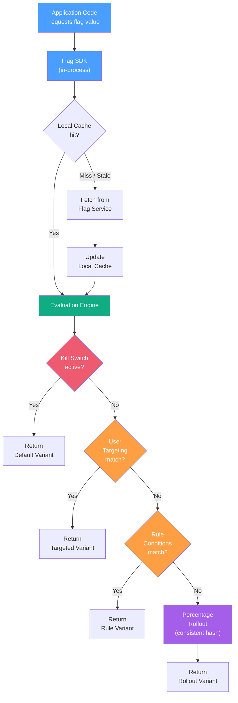
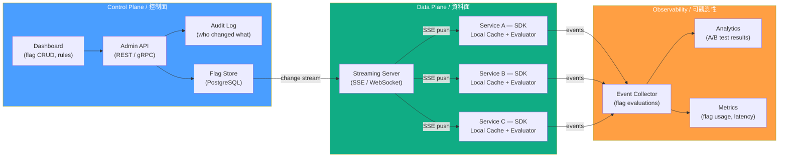
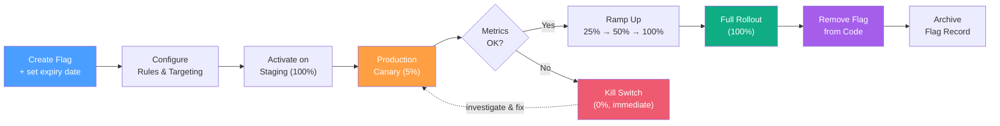

# Feature Flags / 功能旗標

## Intent / 意圖

Feature Flag（又稱 feature toggle、feature switch）是一種**將程式碼部署與功能發佈解耦**的技術。透過在程式碼中插入條件判斷，團隊可以在不重新部署的情況下動態控制功能的啟用、停用或漸進式發佈。Feature flag 是 trunk-based development 的基石——開發者將未完成的功能隱藏在 flag 後方直接合併到主幹，消除長壽命 feature branch 的合併衝突地獄，同時透過 percentage rollout 和 A/B testing 在生產環境中以數據驅動的方式驗證功能價值。

核心問題：**如何在持續部署的節奏下，安全地對特定使用者群組漸進式發佈新功能、即時回滾有問題的變更，並用實驗數據驗證功能的業務影響——而不需要額外的部署週期？**

---

## Problem / 問題情境

**場景一：長壽命 Feature Branch 的合併災難** — 團隊用 `feature/new-checkout` 分支開發新結帳流程，開發四週。合併回 main 時產生 87 個衝突，其中 12 個涉及共用的 `OrderService`。合併花了整整兩天，最終部署後發現結帳成功率下降 3%。但此時所有程式碼都混在同一個 merge commit 中，無法只回滾結帳功能而不影響其他變更。若改用 feature flag，開發者每天將程式碼合入 main，新結帳邏輯隱藏在 `new_checkout_flow` flag 後方，直到驗證完成才對外開放。

**場景二：全量發佈後爆炸** — 新的推薦演算法直接替換舊版上線，初期一切正常，但在流量尖峰時段推薦模型回應延遲飆升到 3 秒，拖垮整個商品頁面。回滾需要重新部署舊版映像檔，等待 CI pipeline 通過耗時 15 分鐘，期間使用者持續體驗到延遲。若使用 feature flag + kill switch，只需一秒鐘翻轉旗標即可立即回退到舊演算法，無需部署。

**場景三：無法量化功能價值** — 產品經理堅持新 UI 更好用，工程師認為舊版效能更優。雙方各持己見但都缺乏數據。上線後三個月才發現轉換率沒有提升，但已經投入大量維護成本。若使用 feature flag + A/B testing，上線第一週就能對 5% 使用者開放新 UI，用統計顯著性驗證哪個版本的轉換率更高。

---

## Core Concepts / 核心概念

### Feature Flag Types / 旗標類型

Feature flag 並非一體適用的概念。不同類型的 flag 有不同的生命週期和治理策略：

| 類型 | 英文名稱 | 生命週期 | 用途 | 範例 |
|------|---------|---------|------|------|
| **發佈旗標** | Release Flag | 短（數天至數週） | 隱藏未完成功能，支援 trunk-based development | `new_checkout_flow` |
| **實驗旗標** | Experiment Flag | 中（數週至數月） | A/B testing，量化功能對業務指標的影響 | `recommendation_v2_experiment` |
| **營運旗標** | Ops Flag | 長（持久存在） | 系統行為控制、kill switch、降級策略 | `enable_cache_layer`、`disable_external_api` |
| **權限旗標** | Permission Flag | 長（持久存在） | 控制付費功能、角色權限、beta 存取 | `premium_analytics`、`beta_access` |

**關鍵區別**：Release flag 用完即刪（技術債），experiment flag 實驗結束後清除，ops flag 和 permission flag 是系統的永久組成部分。

### Flag Evaluation Engine / 旗標評估引擎

旗標評估引擎是 feature flag 系統的核心。它接收一個 flag key 和一組評估上下文（使用者資訊、環境屬性），然後根據規則決定回傳的 variant（變體值）。

評估流程的優先順序：
1. **Kill Switch 檢查**：若 flag 被緊急關閉，直接回傳 default variant
2. **使用者目標鎖定 (User Targeting)**：特定使用者 ID 強制對應到特定 variant
3. **規則匹配 (Rule Matching)**：依照規則優先序，檢查使用者屬性是否匹配條件
4. **百分比發佈 (Percentage Rollout)**：使用 consistent hashing 將使用者分配到 variant
5. **預設值 (Default)**：以上都不匹配時的 fallback

### Consistent Hashing for Percentage Rollout / 一致性雜湊百分比發佈

百分比發佈不能用 `rand() < 0.1` 實作——同一個使用者每次請求可能得到不同結果。正確做法是 **consistent hashing**：將 `hash(flag_key + user_id) % 100` 的結果作為桶位，使同一使用者對同一 flag 永遠落在同一桶位。這確保：
- 使用者體驗一致（不會一下看到新功能、一下看不到）
- 發佈百分比從 5% 提升到 20% 時，原本 5% 的使用者不會被移出
- A/B testing 的分群穩定，統計結果可靠

### Feature Flag Lifecycle / 旗標生命週期

```
Create → Configure Rules → Activate (staging) → Gradual Rollout (production)
→ Full Rollout (100%) → Remove Flag (clean code) → Archive
```

關鍵紀律：**每個 release flag 建立時就設定清除日期**。flag 到達 100% rollout 後，應在下個 sprint 內移除 flag 相關的條件判斷程式碼。未移除的 stale flag 是嚴重的技術債——程式碼可讀性下降、測試矩陣爆炸、新人無法理解「這段 if-else 到底還需不需要」。

### Trunk-Based Development with Feature Flags / 以 Feature Flag 實現主幹開發

Trunk-based development（TBD）要求所有開發者直接向主幹提交程式碼（或短壽命 branch < 24h）。Feature flag 解決 TBD 的核心挑戰：「未完成的功能怎麼辦？」答案是：程式碼進入 main，但新功能隱藏在 flag 後方，生產環境中 flag 關閉。

```
傳統 Git Flow：
main ─────────────────────────────────────────►
  └── feature/new-ui (4 weeks) ──── merge ──►  ← 合併地獄

Trunk-Based + Feature Flag：
main ──[flag:off]──[flag:off]──[flag:5%]──[flag:100%]──[remove flag]──►
       ↑每天合入     ↑每天合入   ↑開始發佈   ↑完全發佈    ↑清除技術債
```

### A/B Testing Integration / A/B 測試整合

Feature flag 天然支援 A/B testing：flag 的每個 variant 代表一個實驗組。flag 評估引擎透過 consistent hashing 穩定分群，搭配事件追蹤（event tracking）記錄每個使用者的 variant 和行為，最終用統計檢定（如 t-test、chi-squared test）判斷哪個 variant 在目標指標上表現更好。

### Kill Switch / 緊急開關

Kill switch 是 ops flag 的一種特殊形態——在生產事故發生時，一秒鐘內關閉有問題的功能。不需要新的部署、不需要走 CI pipeline、不需要等 rollback。Kill switch 是比部署回滾更快的降級手段。

### Flag Storage / 旗標儲存

| 儲存方式 | 優點 | 缺點 | 適用場景 |
|---------|------|------|---------|
| **本地設定檔** | 簡單、無外部依賴 | 變更需重新部署 | 微型專案、嵌入式系統 |
| **資料庫** | 動態更新、可審計 | 每次評估查詢 DB、延遲 | 中型系統、已有 DB 基礎設施 |
| **專用服務** | 即時推送、管理介面、審計、A/B testing 整合 | 額外的基礎設施依賴 | 大型系統、多服務架構 |
| **混合（本地快取 + 遠端同步）** | 低延遲、高可用 | 一致性延遲（eventual） | 生產級 feature flag 系統 |

生產環境的最佳實踐是**本地快取 + 遠端同步**：SDK 啟動時拉取完整 flag 設定到記憶體，之後透過 SSE / WebSocket / polling 接收更新。評估 100% 在本地完成（微秒級），不對 flag 服務產生即時依賴——即使 flag 服務暫時不可用，應用仍以最後已知的 flag 設定繼續運作。

### Stale Flags and Technical Debt / 過期旗標與技術債

Feature flag 帶來靈活性的同時也引入技術債。常見的債務形態：
- **永遠 on 的 release flag**：功能早已 100% 發佈，但 `if flag.enabled("old_feature")` 的判斷仍遍佈程式碼
- **指數級測試組合**：N 個 flag 理論上有 2^N 種組合，測試矩陣爆炸
- **死碼累積**：flag 的 else 分支（舊邏輯）永遠不會執行但仍需維護
- **認知負擔**：新工程師需要理解每個 flag 的用途和狀態

**解法**：在 flag 建立時設定 expiration date，CI 中加入 linter 偵測超期 flag，定期舉辦「flag cleanup sprint」。

### OpenFeature Standard / OpenFeature 標準

OpenFeature 是 CNCF 的開放標準，定義了 feature flag 評估的統一 API，讓應用程式碼不耦合特定的 flag 供應商（LaunchDarkly、Unleash、Flagsmith 等）。核心抽象：

- **Provider**：對接具體 flag 服務的適配器
- **Client**：應用層呼叫的統一介面
- **Evaluation Context**：傳遞給 provider 的使用者/環境屬性
- **Hook**：flag 評估前後的擴展點（logging、metrics、validation）

### LaunchDarkly / Unleash / Flagsmith Architecture / 主流 Flag 服務架構

這三大平台的核心架構都遵循相似的模式：

```
Control Plane（管理面）    Data Plane（資料面）
┌─────────────────┐       ┌──────────────────────┐
│ Dashboard (UI)  │       │ SDK (in-process)      │
│ REST API        │──────>│ ├─ Local Cache         │
│ Audit Log       │  SSE/ │ ├─ Evaluation Engine   │
│ Experiment Mgmt │  WS   │ └─ Event Reporter      │
└─────────────────┘       └──────────────────────┘
```

- **LaunchDarkly**：SaaS-first，streaming 架構（SSE），SDK 本地快取評估。強大的 targeting rule 和 experiment 整合。企業級治理。
- **Unleash**：開源 self-hosted（也有 SaaS），PostgreSQL 儲存，activation strategy 概念（gradual rollout、user ID、IP、hostname）。
- **Flagsmith**：開源 self-hosted + SaaS，支援 remote config（不只 boolean flag）、segment 管理、identity trait。

---

## Architecture / 架構

### Feature Flag Evaluation Flow / 旗標評估流程



### Feature Flag System Architecture / 旗標系統架構



### Feature Flag Lifecycle / 旗標生命週期



---

## How It Works / 運作原理

### Flag Evaluation Engine 的內部運作

Feature flag 評估引擎在每次呼叫 `evaluate(flag_key, context)` 時執行以下步驟：

1. **查找 Flag 定義**：從本地快取取得 flag 設定（包含 rules、targeting、rollout 設定）。快取未命中則從遠端 flag 服務取得並更新快取。

2. **Kill Switch 檢查**：若 flag 被標記為 killed，直接回傳 default variant。這是最高優先級的邏輯——kill switch 覆蓋所有其他規則。

3. **使用者目標鎖定 (User Targeting)**：
   檢查 context 中的 user ID 是否在 targeting list 中。常見用途：
   - 內部員工優先體驗（dogfooding）
   - 特定 beta 使用者
   - QA 測試帳號

4. **規則匹配 (Rule Matching)**：
   規則由**條件 + 動作**組成。條件是屬性比較（如 `country == "TW"`、`plan IN ["pro", "enterprise"]`），動作是回傳的 variant。規則按優先序評估，第一個匹配的規則生效。

5. **百分比發佈 (Percentage Rollout)**：
   對未被前面步驟捕獲的使用者，使用 consistent hashing 分配 variant：
   ```
   bucket = hash(flag_key + user_id) % 100
   if bucket < rollout_percentage:
       return new_variant
   else:
       return old_variant
   ```

   使用 `flag_key` 作為 hash salt 確保不同 flag 的分群獨立——使用者不會「幸運地」總是被分到實驗組或總是被排除。

6. **預設值 (Default Fallback)**：
   若以上所有步驟都未匹配（例如 rollout 0%、無 targeting、無 rule），回傳 flag 的 default variant。

### Consistent Hashing 的實作細節

```
Input:  flag_key = "new_checkout"
        user_id  = "user_42"
Salt:   "new_checkout:user_42"

Step 1: hash = SHA256("new_checkout:user_42")
Step 2: bucket = hash_to_u32(first 4 bytes) % 100  → 例如 37

Rollout 設定：
  - 5%  rollout → bucket 0-4   → user_42 (37) 不在範圍 → 舊版
  - 40% rollout → bucket 0-39  → user_42 (37) 在範圍內 → 新版
  - 提升到 40% 時，原本 5% 的使用者（bucket 0-4）仍在範圍內，體驗不變
```

### Flag 同步機制

生產級 flag 系統不會讓每次 evaluate 都去查詢遠端服務。同步機制有三種模式：

| 模式 | 延遲 | 機制 | 適用場景 |
|------|------|------|---------|
| **Polling** | 10-60 秒 | 定期 HTTP GET | 簡單、防火牆友好 |
| **SSE (Server-Sent Events)** | < 1 秒 | 持久 HTTP 連線，服務端推送 | LaunchDarkly 預設 |
| **WebSocket** | < 1 秒 | 雙向連線 | 需要雙向通訊時 |

SDK 的健壯性保障：
- **離線模式**：flag 服務不可用時，SDK 以最後已知的快取繼續運作
- **持久化快取**：SDK 可將 flag 設定寫入本地磁碟，即使程序重啟後 flag 服務仍不可用，也能使用上次的設定
- **Bootstrap**：首次啟動時可提供 JSON 格式的初始 flag 設定，避免冷啟動期間所有 flag 走 default

### A/B Testing 整合的數據流

```
1. 使用者請求到達 → SDK 評估 flag → 得到 variant (A 或 B)
2. 將 (user_id, flag_key, variant, timestamp) 記錄為 exposure event
3. 使用者完成目標行為 → 記錄 conversion event
4. Analytics 系統 JOIN exposure + conversion，計算各 variant 的轉換率
5. 統計檢定（t-test / chi-squared）判斷差異是否顯著
6. 顯著則採用勝出 variant 並設為 100%；不顯著則繼續收集數據或放棄
```

---

## Rust 實作

```rust
// feature_flag_engine.rs — Feature flag evaluation engine
// Rust 2024 edition, tokio 1, axum 0.8, serde, sha2
//
// 實作 rule-based targeting、consistent hashing percentage rollout、kill switch。
// 包含完整的 flag 評估引擎、Axum HTTP handler 和模擬示範。

// Cargo.toml dependencies:
// axum = "0.8"
// tokio = { version = "1", features = ["full"] }
// serde = { version = "1", features = ["derive"] }
// serde_json = "1"
// sha2 = "0.10"

use axum::{
    Router,
    extract::{Json, State},
    http::StatusCode,
    response::IntoResponse,
    routing::{get, post},
};
use serde::{Deserialize, Serialize};
use sha2::{Digest, Sha256};
use std::collections::HashMap;
use std::sync::{Arc, RwLock};

// ─── Flag Domain Types ───

/// Flag 的 variant（變體值），支援多值而非僅 boolean
#[derive(Debug, Clone, Serialize, Deserialize, PartialEq)]
#[serde(untagged)]
pub enum FlagVariant {
    Bool(bool),
    String(String),
    Int(i64),
}

/// 使用者屬性值，用於規則匹配
#[derive(Debug, Clone, Serialize, Deserialize, PartialEq)]
#[serde(untagged)]
pub enum AttrValue {
    String(String),
    Int(i64),
    Bool(bool),
    StringList(Vec<String>),
}

/// 評估上下文：描述「誰在什麼環境下請求這個 flag」
#[derive(Debug, Clone, Serialize, Deserialize)]
pub struct EvalContext {
    pub user_id: String,
    #[serde(default)]
    pub attributes: HashMap<String, AttrValue>,
}

/// 規則條件運算子
#[derive(Debug, Clone, Serialize, Deserialize)]
pub enum Operator {
    #[serde(rename = "eq")]
    Equals,
    #[serde(rename = "neq")]
    NotEquals,
    #[serde(rename = "in")]
    In,
    #[serde(rename = "not_in")]
    NotIn,
    #[serde(rename = "gt")]
    GreaterThan,
    #[serde(rename = "lt")]
    LessThan,
}

/// 規則中的單一條件
#[derive(Debug, Clone, Serialize, Deserialize)]
pub struct Condition {
    pub attribute: String,
    pub operator: Operator,
    pub value: AttrValue,
}

/// 目標鎖定規則：條件群 + 對應的 variant
#[derive(Debug, Clone, Serialize, Deserialize)]
pub struct TargetingRule {
    pub description: String,
    pub conditions: Vec<Condition>,
    pub variant: FlagVariant,
}

/// 百分比發佈設定
#[derive(Debug, Clone, Serialize, Deserialize)]
pub struct RolloutConfig {
    /// 0-100，接收新 variant 的百分比
    pub percentage: u32,
    /// 新 variant（命中百分比範圍內）
    pub on_variant: FlagVariant,
    /// 舊 variant（百分比範圍外）
    pub off_variant: FlagVariant,
}

/// 完整的 flag 定義
#[derive(Debug, Clone, Serialize, Deserialize)]
pub struct FlagDefinition {
    pub key: String,
    pub description: String,
    /// 是否被 kill switch 關閉
    pub killed: bool,
    /// kill switch 啟用時的回傳值
    pub default_variant: FlagVariant,
    /// 使用者層級目標鎖定（user_id → variant）
    #[serde(default)]
    pub user_targets: HashMap<String, FlagVariant>,
    /// 規則（按優先序排列，第一個匹配的生效）
    #[serde(default)]
    pub rules: Vec<TargetingRule>,
    /// 百分比發佈設定
    pub rollout: Option<RolloutConfig>,
}

/// 評估結果
#[derive(Debug, Clone, Serialize)]
pub struct EvalResult {
    pub flag_key: String,
    pub variant: FlagVariant,
    pub reason: EvalReason,
}

/// 評估原因（用於 debug 和 audit）
#[derive(Debug, Clone, Serialize)]
pub enum EvalReason {
    KillSwitch,
    UserTargeting,
    RuleMatch { rule_index: usize, description: String },
    PercentageRollout { bucket: u32, percentage: u32 },
    Default,
    FlagNotFound,
}

// ─── Evaluation Engine ───

/// Feature flag 評估引擎
/// 使用 RwLock 保護 flag 定義，支援執行時期動態更新
pub struct FlagEngine {
    flags: RwLock<HashMap<String, FlagDefinition>>,
}

impl FlagEngine {
    pub fn new(flags: Vec<FlagDefinition>) -> Self {
        let map = flags.into_iter().map(|f| (f.key.clone(), f)).collect();
        Self {
            flags: RwLock::new(map),
        }
    }

    /// 評估一個 flag——核心方法
    /// 優先序：kill switch → user targeting → rules → percentage rollout → default
    pub fn evaluate(&self, flag_key: &str, ctx: &EvalContext) -> EvalResult {
        let flags = self.flags.read().expect("lock poisoned");

        let Some(flag) = flags.get(flag_key) else {
            return EvalResult {
                flag_key: flag_key.to_string(),
                variant: FlagVariant::Bool(false),
                reason: EvalReason::FlagNotFound,
            };
        };

        // 1. Kill Switch — 最高優先
        if flag.killed {
            return EvalResult {
                flag_key: flag_key.to_string(),
                variant: flag.default_variant.clone(),
                reason: EvalReason::KillSwitch,
            };
        }

        // 2. User Targeting — 特定使用者鎖定
        if let Some(variant) = flag.user_targets.get(&ctx.user_id) {
            return EvalResult {
                flag_key: flag_key.to_string(),
                variant: variant.clone(),
                reason: EvalReason::UserTargeting,
            };
        }

        // 3. Rule Matching — 條件規則
        for (i, rule) in flag.rules.iter().enumerate() {
            if self.evaluate_rule(rule, ctx) {
                return EvalResult {
                    flag_key: flag_key.to_string(),
                    variant: rule.variant.clone(),
                    reason: EvalReason::RuleMatch {
                        rule_index: i,
                        description: rule.description.clone(),
                    },
                };
            }
        }

        // 4. Percentage Rollout — consistent hashing
        if let Some(ref rollout) = flag.rollout {
            let bucket = consistent_hash(flag_key, &ctx.user_id);
            let variant = if bucket < rollout.percentage {
                rollout.on_variant.clone()
            } else {
                rollout.off_variant.clone()
            };
            return EvalResult {
                flag_key: flag_key.to_string(),
                variant,
                reason: EvalReason::PercentageRollout {
                    bucket,
                    percentage: rollout.percentage,
                },
            };
        }

        // 5. Default — 所有規則都未匹配
        EvalResult {
            flag_key: flag_key.to_string(),
            variant: flag.default_variant.clone(),
            reason: EvalReason::Default,
        }
    }

    /// 規則評估：所有條件都必須滿足（AND 邏輯）
    fn evaluate_rule(&self, rule: &TargetingRule, ctx: &EvalContext) -> bool {
        rule.conditions.iter().all(|cond| self.evaluate_condition(cond, ctx))
    }

    /// 單一條件評估
    fn evaluate_condition(&self, cond: &Condition, ctx: &EvalContext) -> bool {
        let Some(attr_val) = ctx.attributes.get(&cond.attribute) else {
            return false; // 屬性不存在則條件不滿足
        };

        match &cond.operator {
            Operator::Equals => attr_val == &cond.value,
            Operator::NotEquals => attr_val != &cond.value,
            Operator::In => match (&cond.value, attr_val) {
                (AttrValue::StringList(list), AttrValue::String(s)) => list.contains(s),
                _ => false,
            },
            Operator::NotIn => match (&cond.value, attr_val) {
                (AttrValue::StringList(list), AttrValue::String(s)) => !list.contains(s),
                _ => false,
            },
            Operator::GreaterThan => match (attr_val, &cond.value) {
                (AttrValue::Int(a), AttrValue::Int(b)) => a > b,
                _ => false,
            },
            Operator::LessThan => match (attr_val, &cond.value) {
                (AttrValue::Int(a), AttrValue::Int(b)) => a < b,
                _ => false,
            },
        }
    }

    /// 動態更新 flag（模擬從 flag 服務接收更新）
    pub fn update_flag(&self, flag: FlagDefinition) {
        let mut flags = self.flags.write().expect("lock poisoned");
        flags.insert(flag.key.clone(), flag);
    }

    /// Kill switch：立即關閉指定 flag
    pub fn kill(&self, flag_key: &str) -> bool {
        let mut flags = self.flags.write().expect("lock poisoned");
        if let Some(flag) = flags.get_mut(flag_key) {
            flag.killed = true;
            true
        } else {
            false
        }
    }

    /// 解除 kill switch
    pub fn revive(&self, flag_key: &str) -> bool {
        let mut flags = self.flags.write().expect("lock poisoned");
        if let Some(flag) = flags.get_mut(flag_key) {
            flag.killed = false;
            true
        } else {
            false
        }
    }
}

/// Consistent hashing：同一 (flag_key, user_id) 永遠得到相同 bucket
fn consistent_hash(flag_key: &str, user_id: &str) -> u32 {
    let mut hasher = Sha256::new();
    hasher.update(flag_key.as_bytes());
    hasher.update(b":");
    hasher.update(user_id.as_bytes());
    let hash = hasher.finalize();
    // 取前 4 bytes 轉為 u32，再 mod 100
    let val = u32::from_be_bytes([hash[0], hash[1], hash[2], hash[3]]);
    val % 100
}

// ─── Axum HTTP Handlers ───

#[derive(Deserialize)]
struct EvalRequest {
    flag_key: String,
    context: EvalContext,
}

async fn evaluate_handler(
    State(engine): State<Arc<FlagEngine>>,
    Json(req): Json<EvalRequest>,
) -> impl IntoResponse {
    let result = engine.evaluate(&req.flag_key, &req.context);
    (StatusCode::OK, Json(result))
}

#[derive(Deserialize)]
struct KillRequest {
    flag_key: String,
}

async fn kill_handler(
    State(engine): State<Arc<FlagEngine>>,
    Json(req): Json<KillRequest>,
) -> impl IntoResponse {
    if engine.kill(&req.flag_key) {
        (StatusCode::OK, Json(serde_json::json!({"status": "killed", "flag": req.flag_key})))
    } else {
        (StatusCode::NOT_FOUND, Json(serde_json::json!({"error": "flag not found"})))
    }
}

async fn health_handler() -> &'static str {
    "ok"
}

// ─── Demo: Simulate Flag Evaluation ───

fn demo_evaluations(engine: &FlagEngine) {
    println!("=== Feature Flag Evaluation Demo ===\n");

    // 使用者 1：台灣 Pro 用戶 → 應匹配規則 "Taiwan Pro users"
    let ctx1 = EvalContext {
        user_id: "user_100".to_string(),
        attributes: HashMap::from([
            ("country".to_string(), AttrValue::String("TW".to_string())),
            ("plan".to_string(), AttrValue::String("pro".to_string())),
        ]),
    };
    let r1 = engine.evaluate("new_checkout", &ctx1);
    println!("User 100 (TW, pro):   variant={:?}, reason={:?}", r1.variant, r1.reason);

    // 使用者 2：被 user targeting 鎖定的 beta 測試者
    let ctx2 = EvalContext {
        user_id: "beta_tester_1".to_string(),
        attributes: HashMap::new(),
    };
    let r2 = engine.evaluate("new_checkout", &ctx2);
    println!("beta_tester_1:        variant={:?}, reason={:?}", r2.variant, r2.reason);

    // 使用者 3：一般用戶 → percentage rollout (20%)
    let ctx3 = EvalContext {
        user_id: "user_42".to_string(),
        attributes: HashMap::from([
            ("country".to_string(), AttrValue::String("US".to_string())),
            ("plan".to_string(), AttrValue::String("free".to_string())),
        ]),
    };
    let r3 = engine.evaluate("new_checkout", &ctx3);
    println!("User 42 (US, free):   variant={:?}, reason={:?}", r3.variant, r3.reason);

    // 使用者 4：測試 consistent hashing — 同一使用者多次呼叫結果一致
    let r3_again = engine.evaluate("new_checkout", &ctx3);
    println!(
        "User 42 (again):      variant={:?}, consistent={}",
        r3_again.variant,
        r3.variant == r3_again.variant
    );

    // Kill switch 測試
    println!("\n--- Activating kill switch for 'new_checkout' ---");
    engine.kill("new_checkout");
    let r_killed = engine.evaluate("new_checkout", &ctx1);
    println!("User 100 (after kill): variant={:?}, reason={:?}", r_killed.variant, r_killed.reason);

    // 解除 kill switch
    engine.revive("new_checkout");
    let r_revived = engine.evaluate("new_checkout", &ctx1);
    println!("User 100 (revived):   variant={:?}, reason={:?}", r_revived.variant, r_revived.reason);

    // 驗證 consistent hashing 分佈
    println!("\n--- Consistent Hashing Distribution (1000 users, 20% rollout) ---");
    let mut on_count = 0u32;
    for i in 0..1000 {
        let ctx = EvalContext {
            user_id: format!("user_{i}"),
            attributes: HashMap::new(),
        };
        let result = engine.evaluate("new_checkout", &ctx);
        if result.variant == FlagVariant::Bool(true) {
            on_count += 1;
        }
    }
    println!("On: {on_count}/1000 ({:.1}%), expected ~20%", on_count as f64 / 10.0);
}

// ─── Main ───

#[tokio::main]
async fn main() {
    // 建立 flag 定義
    let flags = vec![FlagDefinition {
        key: "new_checkout".to_string(),
        description: "New checkout flow with improved UX".to_string(),
        killed: false,
        default_variant: FlagVariant::Bool(false),
        user_targets: HashMap::from([
            ("beta_tester_1".to_string(), FlagVariant::Bool(true)),
            ("beta_tester_2".to_string(), FlagVariant::Bool(true)),
        ]),
        rules: vec![TargetingRule {
            description: "Taiwan Pro users get early access".to_string(),
            conditions: vec![
                Condition {
                    attribute: "country".to_string(),
                    operator: Operator::Equals,
                    value: AttrValue::String("TW".to_string()),
                },
                Condition {
                    attribute: "plan".to_string(),
                    operator: Operator::In,
                    value: AttrValue::StringList(vec![
                        "pro".to_string(),
                        "enterprise".to_string(),
                    ]),
                },
            ],
            variant: FlagVariant::Bool(true),
        }],
        rollout: Some(RolloutConfig {
            percentage: 20, // 20% 的一般使用者
            on_variant: FlagVariant::Bool(true),
            off_variant: FlagVariant::Bool(false),
        }),
    }];

    let engine = Arc::new(FlagEngine::new(flags));

    // 執行示範
    demo_evaluations(&engine);

    // 啟動 HTTP server
    let app = Router::new()
        .route("/health", get(health_handler))
        .route("/evaluate", post(evaluate_handler))
        .route("/kill", post(kill_handler))
        .with_state(engine.clone());

    println!("\nServer listening on :8080");
    println!("Try: curl -X POST http://localhost:8080/evaluate \\");
    println!("  -H 'Content-Type: application/json' \\");
    println!("  -d '{{\"flag_key\":\"new_checkout\",\"context\":{{\"user_id\":\"user_42\",\"attributes\":{{\"country\":\"TW\"}}}}}}'");

    let listener = tokio::net::TcpListener::bind("0.0.0.0:8080")
        .await
        .expect("failed to bind");
    axum::serve(listener, app).await.expect("server failed");

    // Output:
    // === Feature Flag Evaluation Demo ===
    //
    // User 100 (TW, pro):   variant=Bool(true), reason=RuleMatch { rule_index: 0, description: "Taiwan Pro users get early access" }
    // beta_tester_1:        variant=Bool(true), reason=UserTargeting
    // User 42 (US, free):   variant=Bool(false), reason=PercentageRollout { bucket: 83, percentage: 20 }
    // User 42 (again):      variant=Bool(false), consistent=true
    //
    // --- Activating kill switch for 'new_checkout' ---
    // User 100 (after kill): variant=Bool(false), reason=KillSwitch
    // User 100 (revived):   variant=Bool(true), reason=RuleMatch { rule_index: 0, description: "Taiwan Pro users get early access" }
    //
    // --- Consistent Hashing Distribution (1000 users, 20% rollout) ---
    // On: 202/1000 (20.2%), expected ~20%
    //
    // Server listening on :8080
    // Try: curl -X POST http://localhost:8080/evaluate \
    //   -H 'Content-Type: application/json' \
    //   -d '{"flag_key":"new_checkout","context":{"user_id":"user_42","attributes":{"country":"TW"}}}'
}
```

### 設計重點

- **`RwLock<HashMap>`**：讀多寫少的場景。flag 評估（read）遠多於 flag 更新（write）。生產環境中可改用 `dashmap` 或 `ArcSwap<HashMap>` 提升並發效能。
- **Consistent hashing with SHA-256**：使用密碼學等級的 hash function 確保分佈均勻。`flag_key` 作為 salt 讓不同 flag 的分群獨立。
- **`EvalReason` enum**：每次評估附帶原因，對 debug、audit 和觀測性至關重要。OpenFeature 標準也要求 provider 回傳 evaluation reason。
- **Kill switch 是 `killed` boolean**：最簡單的欄位，最高的優先級。緊急情況下只需寫入一個 boolean，不需要修改規則或 rollout 設定。
- **型別安全的 `FlagVariant`**：支援 `Bool`、`String`、`Int`，而非僅 boolean。這讓同一引擎支援 A/B/C 多 variant 實驗。

---

## Go 實作

```go
// feature_flag_engine.go — Feature flag evaluation engine
// Go 1.24+, standard library + crypto/sha256
//
// 實作 rule-based targeting、consistent hashing percentage rollout、kill switch。
// 包含完整的 flag 評估引擎、HTTP handler 和模擬示範。

package main

import (
	"crypto/sha256"
	"encoding/binary"
	"encoding/json"
	"fmt"
	"log/slog"
	"net/http"
	"os"
	"sync"
)

// ─── Flag Domain Types ───

// FlagVariant 支援多種型別的 variant 值
type FlagVariant struct {
	BoolVal   *bool   `json:"bool_val,omitempty"`
	StringVal *string `json:"string_val,omitempty"`
	IntVal    *int64  `json:"int_val,omitempty"`
}

func BoolVariant(v bool) FlagVariant   { return FlagVariant{BoolVal: &v} }
func StringVariant(v string) FlagVariant { return FlagVariant{StringVal: &v} }

func (v FlagVariant) String() string {
	switch {
	case v.BoolVal != nil:
		return fmt.Sprintf("Bool(%v)", *v.BoolVal)
	case v.StringVal != nil:
		return fmt.Sprintf("String(%q)", *v.StringVal)
	case v.IntVal != nil:
		return fmt.Sprintf("Int(%d)", *v.IntVal)
	default:
		return "Nil"
	}
}

func (v FlagVariant) Equal(other FlagVariant) bool {
	if v.BoolVal != nil && other.BoolVal != nil {
		return *v.BoolVal == *other.BoolVal
	}
	if v.StringVal != nil && other.StringVal != nil {
		return *v.StringVal == *other.StringVal
	}
	if v.IntVal != nil && other.IntVal != nil {
		return *v.IntVal == *other.IntVal
	}
	return false
}

// EvalContext 描述「誰在什麼環境下請求這個 flag」
type EvalContext struct {
	UserID     string            `json:"user_id"`
	Attributes map[string]any    `json:"attributes"`
}

// Operator 規則條件運算子
type Operator string

const (
	OpEquals      Operator = "eq"
	OpNotEquals   Operator = "neq"
	OpIn          Operator = "in"
	OpNotIn       Operator = "not_in"
	OpGreaterThan Operator = "gt"
	OpLessThan    Operator = "lt"
)

// Condition 規則中的單一條件
type Condition struct {
	Attribute string   `json:"attribute"`
	Operator  Operator `json:"operator"`
	Value     any      `json:"value"`
}

// TargetingRule 目標鎖定規則
type TargetingRule struct {
	Description string      `json:"description"`
	Conditions  []Condition `json:"conditions"`
	Variant     FlagVariant `json:"variant"`
}

// RolloutConfig 百分比發佈設定
type RolloutConfig struct {
	Percentage uint32      `json:"percentage"` // 0-100
	OnVariant  FlagVariant `json:"on_variant"`
	OffVariant FlagVariant `json:"off_variant"`
}

// FlagDefinition 完整的 flag 定義
type FlagDefinition struct {
	Key            string                 `json:"key"`
	Description    string                 `json:"description"`
	Killed         bool                   `json:"killed"`
	DefaultVariant FlagVariant            `json:"default_variant"`
	UserTargets    map[string]FlagVariant  `json:"user_targets"`
	Rules          []TargetingRule         `json:"rules"`
	Rollout        *RolloutConfig         `json:"rollout"`
}

// EvalReason 評估原因
type EvalReason struct {
	Kind        string `json:"kind"`
	RuleIndex   int    `json:"rule_index,omitempty"`
	Description string `json:"description,omitempty"`
	Bucket      uint32 `json:"bucket,omitempty"`
	Percentage  uint32 `json:"percentage,omitempty"`
}

// EvalResult 評估結果
type EvalResult struct {
	FlagKey string      `json:"flag_key"`
	Variant FlagVariant `json:"variant"`
	Reason  EvalReason  `json:"reason"`
}

// ─── Evaluation Engine ───

// FlagEngine feature flag 評估引擎
type FlagEngine struct {
	mu    sync.RWMutex
	flags map[string]*FlagDefinition
}

func NewFlagEngine(flags []*FlagDefinition) *FlagEngine {
	m := make(map[string]*FlagDefinition, len(flags))
	for _, f := range flags {
		m[f.Key] = f
	}
	return &FlagEngine{flags: m}
}

// Evaluate 評估一個 flag
// 優先序：kill switch → user targeting → rules → percentage rollout → default
func (e *FlagEngine) Evaluate(flagKey string, ctx *EvalContext) EvalResult {
	e.mu.RLock()
	flag, ok := e.flags[flagKey]
	if !ok {
		e.mu.RUnlock()
		return EvalResult{
			FlagKey: flagKey,
			Variant: BoolVariant(false),
			Reason:  EvalReason{Kind: "flag_not_found"},
		}
	}
	// 複製必要資料後釋放鎖，避免在規則評估期間持有 RLock 過久
	killed := flag.Killed
	defaultVar := flag.DefaultVariant
	userTargets := flag.UserTargets
	rules := flag.Rules
	rollout := flag.Rollout
	e.mu.RUnlock()

	// 1. Kill Switch — 最高優先
	if killed {
		return EvalResult{
			FlagKey: flagKey,
			Variant: defaultVar,
			Reason:  EvalReason{Kind: "kill_switch"},
		}
	}

	// 2. User Targeting — 特定使用者鎖定
	if variant, found := userTargets[ctx.UserID]; found {
		return EvalResult{
			FlagKey: flagKey,
			Variant: variant,
			Reason:  EvalReason{Kind: "user_targeting"},
		}
	}

	// 3. Rule Matching — 條件規則
	for i, rule := range rules {
		if evaluateRule(&rule, ctx) {
			return EvalResult{
				FlagKey: flagKey,
				Variant: rule.Variant,
				Reason: EvalReason{
					Kind:        "rule_match",
					RuleIndex:   i,
					Description: rule.Description,
				},
			}
		}
	}

	// 4. Percentage Rollout — consistent hashing
	if rollout != nil {
		bucket := consistentHash(flagKey, ctx.UserID)
		variant := rollout.OffVariant
		if bucket < rollout.Percentage {
			variant = rollout.OnVariant
		}
		return EvalResult{
			FlagKey: flagKey,
			Variant: variant,
			Reason: EvalReason{
				Kind:       "percentage_rollout",
				Bucket:     bucket,
				Percentage: rollout.Percentage,
			},
		}
	}

	// 5. Default
	return EvalResult{
		FlagKey: flagKey,
		Variant: defaultVar,
		Reason:  EvalReason{Kind: "default"},
	}
}

// Kill 立即關閉指定 flag（kill switch）
func (e *FlagEngine) Kill(flagKey string) bool {
	e.mu.Lock()
	defer e.mu.Unlock()
	if f, ok := e.flags[flagKey]; ok {
		f.Killed = true
		return true
	}
	return false
}

// Revive 解除 kill switch
func (e *FlagEngine) Revive(flagKey string) bool {
	e.mu.Lock()
	defer e.mu.Unlock()
	if f, ok := e.flags[flagKey]; ok {
		f.Killed = false
		return true
	}
	return false
}

// evaluateRule 所有條件都必須滿足（AND 邏輯）
func evaluateRule(rule *TargetingRule, ctx *EvalContext) bool {
	for _, cond := range rule.Conditions {
		if !evaluateCondition(&cond, ctx) {
			return false
		}
	}
	return true
}

// evaluateCondition 單一條件評估
func evaluateCondition(cond *Condition, ctx *EvalContext) bool {
	attrVal, exists := ctx.Attributes[cond.Attribute]
	if !exists {
		return false
	}

	switch cond.Operator {
	case OpEquals:
		return fmt.Sprintf("%v", attrVal) == fmt.Sprintf("%v", cond.Value)
	case OpNotEquals:
		return fmt.Sprintf("%v", attrVal) != fmt.Sprintf("%v", cond.Value)
	case OpIn:
		if list, ok := cond.Value.([]string); ok {
			s := fmt.Sprintf("%v", attrVal)
			for _, item := range list {
				if item == s {
					return true
				}
			}
		}
		return false
	case OpNotIn:
		if list, ok := cond.Value.([]string); ok {
			s := fmt.Sprintf("%v", attrVal)
			for _, item := range list {
				if item == s {
					return false
				}
			}
			return true
		}
		return false
	case OpGreaterThan:
		return toFloat(attrVal) > toFloat(cond.Value)
	case OpLessThan:
		return toFloat(attrVal) < toFloat(cond.Value)
	default:
		return false
	}
}

func toFloat(v any) float64 {
	switch n := v.(type) {
	case int:
		return float64(n)
	case int64:
		return float64(n)
	case float64:
		return n
	default:
		return 0
	}
}

// consistentHash 同一 (flagKey, userID) 永遠得到相同 bucket
func consistentHash(flagKey, userID string) uint32 {
	h := sha256.Sum256([]byte(flagKey + ":" + userID))
	return binary.BigEndian.Uint32(h[:4]) % 100
}

// ─── HTTP Handlers ───

func makeEvaluateHandler(engine *FlagEngine) http.HandlerFunc {
	return func(w http.ResponseWriter, r *http.Request) {
		var req struct {
			FlagKey string      `json:"flag_key"`
			Context EvalContext `json:"context"`
		}
		if err := json.NewDecoder(r.Body).Decode(&req); err != nil {
			http.Error(w, `{"error":"invalid request body"}`, http.StatusBadRequest)
			return
		}
		result := engine.Evaluate(req.FlagKey, &req.Context)
		w.Header().Set("Content-Type", "application/json")
		json.NewEncoder(w).Encode(result)
	}
}

func makeKillHandler(engine *FlagEngine) http.HandlerFunc {
	return func(w http.ResponseWriter, r *http.Request) {
		var req struct {
			FlagKey string `json:"flag_key"`
		}
		if err := json.NewDecoder(r.Body).Decode(&req); err != nil {
			http.Error(w, `{"error":"invalid request body"}`, http.StatusBadRequest)
			return
		}
		w.Header().Set("Content-Type", "application/json")
		if engine.Kill(req.FlagKey) {
			json.NewEncoder(w).Encode(map[string]string{"status": "killed", "flag": req.FlagKey})
		} else {
			w.WriteHeader(http.StatusNotFound)
			json.NewEncoder(w).Encode(map[string]string{"error": "flag not found"})
		}
	}
}

// ─── Demo ───

func demoEvaluations(engine *FlagEngine) {
	fmt.Println("=== Feature Flag Evaluation Demo ===")
	fmt.Println()

	// 使用者 1：台灣 Pro 用戶 → 應匹配規則
	ctx1 := &EvalContext{
		UserID: "user_100",
		Attributes: map[string]any{
			"country": "TW",
			"plan":    "pro",
		},
	}
	r1 := engine.Evaluate("new_checkout", ctx1)
	fmt.Printf("User 100 (TW, pro):   variant=%s, reason=%s\n", r1.Variant, r1.Reason.Kind)

	// 使用者 2：被 user targeting 鎖定的 beta 測試者
	ctx2 := &EvalContext{
		UserID:     "beta_tester_1",
		Attributes: map[string]any{},
	}
	r2 := engine.Evaluate("new_checkout", ctx2)
	fmt.Printf("beta_tester_1:        variant=%s, reason=%s\n", r2.Variant, r2.Reason.Kind)

	// 使用者 3：一般用戶 → percentage rollout (20%)
	ctx3 := &EvalContext{
		UserID: "user_42",
		Attributes: map[string]any{
			"country": "US",
			"plan":    "free",
		},
	}
	r3 := engine.Evaluate("new_checkout", ctx3)
	fmt.Printf("User 42 (US, free):   variant=%s, reason=%s (bucket=%d)\n",
		r3.Variant, r3.Reason.Kind, r3.Reason.Bucket)

	// 使用者 4：Consistent hashing 驗證
	r3Again := engine.Evaluate("new_checkout", ctx3)
	fmt.Printf("User 42 (again):      variant=%s, consistent=%v\n",
		r3Again.Variant, r3.Variant.Equal(r3Again.Variant))

	// Kill switch 測試
	fmt.Println("\n--- Activating kill switch for 'new_checkout' ---")
	engine.Kill("new_checkout")
	rKilled := engine.Evaluate("new_checkout", ctx1)
	fmt.Printf("User 100 (after kill): variant=%s, reason=%s\n", rKilled.Variant, rKilled.Reason.Kind)

	engine.Revive("new_checkout")
	rRevived := engine.Evaluate("new_checkout", ctx1)
	fmt.Printf("User 100 (revived):   variant=%s, reason=%s\n", rRevived.Variant, rRevived.Reason.Kind)

	// Consistent hashing 分佈驗證
	fmt.Println("\n--- Consistent Hashing Distribution (1000 users, 20% rollout) ---")
	onCount := 0
	for i := range 1000 {
		ctx := &EvalContext{
			UserID:     fmt.Sprintf("user_%d", i),
			Attributes: map[string]any{},
		}
		result := engine.Evaluate("new_checkout", ctx)
		if result.Variant.BoolVal != nil && *result.Variant.BoolVal {
			onCount++
		}
	}
	fmt.Printf("On: %d/1000 (%.1f%%), expected ~20%%\n", onCount, float64(onCount)/10.0)
}

// ─── Main ───

func main() {
	logger := slog.New(slog.NewJSONHandler(os.Stdout, nil))
	slog.SetDefault(logger)

	flags := []*FlagDefinition{
		{
			Key:            "new_checkout",
			Description:    "New checkout flow with improved UX",
			Killed:         false,
			DefaultVariant: BoolVariant(false),
			UserTargets: map[string]FlagVariant{
				"beta_tester_1": BoolVariant(true),
				"beta_tester_2": BoolVariant(true),
			},
			Rules: []TargetingRule{
				{
					Description: "Taiwan Pro users get early access",
					Conditions: []Condition{
						{Attribute: "country", Operator: OpEquals, Value: "TW"},
						{Attribute: "plan", Operator: OpIn, Value: []string{"pro", "enterprise"}},
					},
					Variant: BoolVariant(true),
				},
			},
			Rollout: &RolloutConfig{
				Percentage: 20,
				OnVariant:  BoolVariant(true),
				OffVariant: BoolVariant(false),
			},
		},
	}

	engine := NewFlagEngine(flags)

	// 執行示範
	demoEvaluations(engine)

	// HTTP server
	mux := http.NewServeMux()
	mux.HandleFunc("GET /health", func(w http.ResponseWriter, _ *http.Request) {
		fmt.Fprint(w, "ok")
	})
	mux.HandleFunc("POST /evaluate", makeEvaluateHandler(engine))
	mux.HandleFunc("POST /kill", makeKillHandler(engine))

	fmt.Println("\nServer listening on :8080")
	fmt.Println("Try: curl -X POST http://localhost:8080/evaluate \\")
	fmt.Println("  -H 'Content-Type: application/json' \\")
	fmt.Println(`  -d '{"flag_key":"new_checkout","context":{"user_id":"user_42","attributes":{"country":"TW"}}}'`)

	if err := http.ListenAndServe(":8080", mux); err != nil {
		fmt.Fprintf(os.Stderr, "server error: %v\n", err)
		os.Exit(1)
	}

	// Output:
	// === Feature Flag Evaluation Demo ===
	//
	// User 100 (TW, pro):   variant=Bool(true), reason=rule_match
	// beta_tester_1:        variant=Bool(true), reason=user_targeting
	// User 42 (US, free):   variant=Bool(false), reason=percentage_rollout (bucket=83)
	// User 42 (again):      variant=Bool(false), consistent=true
	//
	// --- Activating kill switch for 'new_checkout' ---
	// User 100 (after kill): variant=Bool(false), reason=kill_switch
	// User 100 (revived):   variant=Bool(true), reason=rule_match
	//
	// --- Consistent Hashing Distribution (1000 users, 20% rollout) ---
	// On: 202/1000 (20.2%), expected ~20%
	//
	// Server listening on :8080
	// Try: curl -X POST http://localhost:8080/evaluate \
	//   -H 'Content-Type: application/json' \
	//   -d '{"flag_key":"new_checkout","context":{"user_id":"user_42","attributes":{"country":"TW"}}}'
}
```

### 設計重點

- **`sync.RWMutex`**：讀多寫少場景的標準選擇。Go 沒有 Rust 的所有權系統，需要明確的鎖來保護共享狀態。生產環境可改用 `atomic.Pointer` 做 copy-on-write 更新，完全消除讀路徑的鎖競爭。
- **`crypto/sha256`**：與 Rust 版使用相同的 hash algorithm，確保兩個實作對相同輸入產生相同的 bucket 分配。
- **`any` 型別的 Attributes**：Go 的 `map[string]any` 對應 Rust 的 `HashMap<String, AttrValue>`。Go 的 interface 彈性更大但缺少編譯期型別安全。
- **`range 1000` (Go 1.22+)**：使用 range over integer 語法，不需要 `for i := 0; i < 1000; i++`。
- **閉包捕獲 engine**：`makeEvaluateHandler(engine)` 透過閉包捕獲 `*FlagEngine` 指標，實現依賴注入。Go 的 GC 保證指標有效性。

---

## Rust vs Go 對照表

| 面向 | Rust (Axum 0.8 + tokio) | Go 1.24+ (stdlib) |
|------|--------------------------|-------------------|
| **Flag 狀態管理** | `Arc<FlagEngine>` + 內部 `RwLock<HashMap>`。`Arc` 提供零成本的引用計數共享，`RwLock` 允許並行讀取。編譯器保證不會有 data race。型別系統確保 `FlagEngine` 不可在未取鎖的情況下存取 `flags`。 | `*FlagEngine` 指標 + 內部 `sync.RWMutex`。Go 的 GC 管理記憶體生命週期。但鎖的正確使用完全依賴開發者紀律——忘記加鎖不會編譯錯誤，只會 race condition（`go test -race` 可偵測）。 |
| **Variant 型別表達** | `enum FlagVariant { Bool(bool), String(String), Int(i64) }` — sum type，pattern matching 時編譯器強制處理所有 variant，遺漏即編譯錯誤。JSON 序列化用 `#[serde(untagged)]` 自動選擇格式。 | `struct FlagVariant` 用 pointer field (`*bool`, `*string`, `*int64`) 模擬 tagged union。Go 沒有 sum type，需要手動 nil-check 判斷哪個欄位有值。缺少窮舉性檢查。 |
| **條件評估的型別安全** | `AttrValue` enum + `Operator` enum → match 組合必須窮舉。新增 operator 時編譯器指出所有未處理的 match arm。 | `any` 型別搭配 `switch` + type assertion。新增 operator 容易遺漏 case——`default` 吞掉所有未知情況。需要靠 linter（`exhaustive`）補救。 |
| **Consistent hashing** | `sha2::Sha256` crate，API 符合 `Digest` trait。`hasher.update()` 鏈式呼叫，`finalize()` 回傳固定大小的 `GenericArray`。 | `crypto/sha256.Sum256()` 一行完成。回傳 `[32]byte`。API 更簡潔但缺乏 streaming 模式的靈活性。 |
| **HTTP handler 依賴注入** | Axum `State` extractor — `State(engine): State<Arc<FlagEngine>>` 從 router 狀態中自動提取，型別安全。忘記註冊 state 是編譯錯誤。 | 閉包工廠函式 `makeEvaluateHandler(engine)` — 透過閉包捕獲指標。沒有型別約束，忘記傳入 engine 會在 runtime panic。 |

---

## When to Use / 適用場景

- **持續部署的團隊（Trunk-Based Development）** — 當團隊採用主幹開發、每天多次部署到生產環境時，feature flag 是將「部署」與「發佈」解耦的核心工具。開發者將未完成的功能隱藏在 flag 後方合併到 main，消除 feature branch 的合併衝突。Facebook 和 Google 都是 trunk-based + feature flag 的重度使用者。

- **漸進式發佈高風險功能** — 新的支付流程、推薦演算法、定價引擎等影響核心業務指標的功能，不適合一次性 100% 發佈。透過 percentage rollout（5% → 25% → 50% → 100%），搭配即時監控 error rate、conversion rate、revenue 等指標，在每個階段確認安全後才擴大範圍。

- **A/B Testing 驅動的產品決策** — 產品團隊需要用數據而非直覺做決策時，feature flag 提供穩定的使用者分群機制。多 variant flag 可同時測試 A/B/C 三個版本，consistent hashing 確保分群穩定，搭配事件追蹤和統計檢定得出可靠結論。

- **需要秒級回滾能力的關鍵服務** — 傳統的部署回滾需要走 CI pipeline（分鐘級），而 kill switch 可以在一秒內關閉有問題的功能。對於 99.99% SLA 的服務，每分鐘的停機都代價高昂，kill switch 是比部署回滾更快的降級手段。

---

## When NOT to Use / 不適用場景

- **小型團隊的簡單功能** — 如果團隊只有 2-3 人、功能足夠簡單（一次 commit 即可完成）、且部署頻率低，引入 feature flag 系統的複雜度（額外的 if-else、flag 生命週期管理、清除技術債）可能超過其帶來的價值。直接用 branch + code review + 部署即可。

- **無法承諾清除 stale flag 的團隊** — Feature flag 的最大風險是技術債累積。若團隊沒有紀律在 flag 達到 100% rollout 後及時移除程式碼中的條件判斷，flag 會成為永遠存在的 dead code，降低可讀性並增加測試負擔。**沒有清除流程就不要引入 flag。**

- **需要強一致性的功能切換** — Feature flag 的同步是 eventual consistency（SSE / polling 有秒級延遲）。如果業務要求「flag 一翻轉，所有節點在同一毫秒切換」，feature flag 不是正確的工具——應該用 database transaction 或 distributed lock 來確保原子性。

- **基礎設施層級的配置管理** — Database connection string、API endpoint URL、TLS certificate 等基礎設施配置不應放在 feature flag 系統中。這些應由 ConfigMap、Vault、Parameter Store 等專門的配置管理工具處理。Feature flag 是給**功能行為切換**用的，不是給**基礎設施配置**用的。

---

## Real-World Examples / 真實世界案例

### Facebook Gatekeeper — 世界最大的 Feature Flag 系統

Facebook（Meta）的 Gatekeeper 是全球最大規模的 feature flag 系統，管理超過數萬個同時活躍的 flag，支撐每天數十次的程式碼部署。

**核心架構**：
- **配置儲存**：Gatekeeper 的 flag 定義儲存在分散式資料存取層，透過 TAO（Facebook 的社交圖資料庫）管理
- **本地快取**：每個 web server 啟動時拉取完整 flag 配置到記憶體，之後透過增量更新同步。評估 100% 在本地完成，不產生遠端呼叫
- **Targeting 能力**：支援 user ID、employee status、country、percentage、自定義 universe（使用者群組）等多維度目標鎖定
- **Gradual Rollout 流程**：新功能的典型發佈路徑是 `employees only → 1% users → 10% → 50% → 100%`

**關鍵實踐**：
- 每個 release flag 必須有 owner 和 expiration date，超期未清除的 flag 會觸發自動化提醒
- Flag 評估結果記錄為 exposure event，自動與 A/B testing 平台整合
- Kill switch（稱為 "dial"）讓 on-call 工程師可以在生產事故中即時關閉任何功能
- Gatekeeper 的設計原則：「flag 服務掛了，application 必須能以最後已知的配置繼續運作」

### GitHub Feature Flags — Ship / Scientist / Flipper

GitHub 自身重度使用 feature flag 進行 trunk-based development。其內部的 flag 系統（基於 Flipper gem）支撐了 github.com 的持續部署：

**實踐細節**：
- **Staff Ship**：新功能先對 GitHub 員工（staff）開放，員工日常使用 github.com 時就是在做 dogfooding
- **Percentage Rollout**：員工驗證後，逐步對 1% → 5% → 25% → 100% 的外部使用者開放
- **Scientist**：GitHub 開源的 A/B testing library，用於安全地重構關鍵路徑。同時執行新舊兩段程式碼，比對結果差異，但只回傳舊版結果——確保使用者不受影響的同時收集新版的正確性數據
- **Feature Flag Cleanup**：GitHub 工程文化中強調 flag 的 hygiene——`ship` 後的功能必須在合理時間內清除 flag，否則會被自動化工具標記

### Netflix — 運行時行為控制

Netflix 的 Archaius 框架和自建的 feature flag 系統支撐了其動態行為控制：

- **Dynamic Properties**：不僅是 boolean flag，而是支援 int、string、JSON 等複雜型別的動態配置
- **Ops Flag**：在串流高峰時段，自動降低推薦演算法的複雜度以減少延遲。flag 控制「使用 ML 模型 v3 還是退回 v1 的簡單規則」
- **Regional Kill Switch**：某個 AWS Region 出現問題時，kill switch 可以即時將該 Region 的流量導向其他 Region，無需部署

---

## Interview Questions / 面試常見問題

**Q1：Feature flag 有哪幾種類型？各自的生命週期和管理策略是什麼？**

Feature flag 分為四大類型：(1) **Release flag** — 用於隱藏未完成功能，支援 trunk-based development。生命週期最短（數天到數週），功能 100% 發佈後必須立即清除，否則成為技術債。(2) **Experiment flag** — 用於 A/B testing。生命週期中等（數週到數月），實驗結束並選定勝出方案後清除。(3) **Ops flag** — 用於系統行為控制、kill switch、降級策略。生命週期長，通常永久存在於系統中。(4) **Permission flag** — 控制付費功能、角色權限。生命週期長，是產品功能的一部分。管理策略的核心差異在於：release/experiment flag 必須有 expiration date 和清除流程，ops/permission flag 則是系統的永久組件。

**Q2：如何實作 percentage rollout 確保同一使用者體驗一致？**

使用 consistent hashing。計算 `hash(flag_key + ":" + user_id) % 100`，得到 0-99 的 bucket。如果 bucket 值小於 rollout percentage，則該使用者看到新版本。關鍵設計：(1) 使用 `flag_key` 作為 hash salt，確保不同 flag 的分群獨立——使用者不會「幸運地」被所有 flag 分到實驗組。(2) 提升 rollout 百分比時（如從 5% 到 20%），原本在 5% 範圍內的使用者（bucket 0-4）仍然在 20% 範圍內（bucket 0-19），體驗不中斷。(3) 不能用 `rand() < 0.05`，因為同一使用者每次請求可能得到不同結果，A/B testing 統計無效。

**Q3：Kill switch 與部署回滾的差異？什麼時候用 kill switch 更好？**

Kill switch 是在 flag 評估引擎中翻轉一個 boolean，生效時間 < 1 秒（SSE 推送）到 < 60 秒（polling）。部署回滾需要觸發 CI pipeline 或切換 Kubernetes deployment，通常需要 5-15 分鐘。Kill switch 更好的場景：(1) 99.99% SLA 的服務——每分鐘停機都代價高昂；(2) 問題出在特定功能而非整個部署——kill switch 只關閉該功能，其他功能不受影響；(3) 部署包含多個功能——回滾會連帶回滾其他正常功能。部署回滾更適合的場景：(1) 問題出在基礎設施層（DB schema migration 失敗）；(2) bug 影響的程式碼路徑沒有被 flag 保護；(3) 新部署本身就有啟動問題（crash loop）。

**Q4：Feature flag 帶來的技術債有哪些？如何管理？**

技術債形態：(1) **永遠 on 的 stale flag** — 功能已 100% 發佈但 `if flag.enabled(...)` 仍存在，增加認知負擔。(2) **測試矩陣爆炸** — N 個 flag 理論上 2^N 種組合，測試無法窮舉。(3) **死碼累積** — flag 的 else 分支（舊邏輯）永遠不執行但仍佔用程式碼和維護成本。(4) **巢狀 flag** — flag A 內部又依賴 flag B 的結果，形成難以理解的邏輯樹。管理方法：(1) 建立 flag 時強制設定 expiration date；(2) CI linter 偵測超期 flag 並阻擋合併；(3) 定期舉辦「flag cleanup sprint」；(4) dashboard 追蹤每個 flag 的狀態和 owner；(5) 限制同時活躍的 flag 數量。

**Q5：解釋 OpenFeature 標準的價值。為什麼不直接用 LaunchDarkly SDK？**

OpenFeature 是 CNCF 的 feature flag 評估 API 標準，核心價值是**供應商中立性**。直接使用 LaunchDarkly SDK 意味著應用程式碼與特定供應商強耦合——每次 `client.BoolVariation("flag", ctx, false)` 的呼叫都直接依賴 LaunchDarkly 的型別和 API。若日後要遷移到 Unleash 或 Flagsmith（因價格、功能、自建需求），需要修改所有呼叫點。OpenFeature 定義了統一的 `Client` 介面和 `Provider` 抽象，應用程式碼呼叫 `client.GetBooleanValue("flag", false, ctx)`，底層 provider 可以是 LaunchDarkly、Unleash、或自建服務。遷移時只需替換 provider 實作，業務程式碼零修改。此外，OpenFeature 的 Hook 機制提供標準化的擴展點——logging、metrics、validation 可以跨供應商復用。

---

## Pitfalls / 常見陷阱

### 1. 測試只跑一種 flag 狀態

```
錯誤做法：
- 所有測試中 flag 都設為 true（即只測新功能路徑）
- 部署後翻轉 flag 到 false → 舊路徑因三個月前的重構早已壞掉
- 線上使用者看到 500 error，但 CI 全綠

正確做法：
- 每個有 flag 的功能至少有兩組測試：flag ON 和 flag OFF
- CI matrix 中包含 flag 的不同組合（至少測試 all-on 和 all-off）
- 定期執行 flag 翻轉測試（flip test）
```

### 2. Flag 評估中呼叫遠端服務

```
錯誤做法：
- evaluate("new_checkout", ctx) 內部同步呼叫 flag 服務 REST API
- flag 服務延遲 200ms → 每個頁面多 200ms → P99 劣化
- flag 服務不可用 → 所有 evaluate 失敗 → 功能全部回退到 default

正確做法：
- SDK 在記憶體中維護完整的 flag 配置快取
- evaluate 100% 在本地完成（微秒級）
- 背景 goroutine / tokio task 透過 SSE / polling 非同步更新快取
- flag 服務不可用時，使用最後已知的快取繼續運作
```

### 3. 巢狀 Flag 形成邏輯迷宮

```
錯誤做法：
if flag.enabled("new_payment") {
    if flag.enabled("payment_v2_ui") {
        if flag.enabled("payment_stripe_integration") {
            // 三層巢狀 flag → 8 種組合
            // 有些組合（如 new_payment=ON, v2_ui=OFF, stripe=ON）是否有意義？沒人知道
        }
    }
}

正確做法：
- 一個功能由一個 flag 控制
- 若有內部子功能需要獨立控制，用規則（rule）或多 variant（A/B/C）而非巢狀 flag
- 文件記錄 flag 之間的依賴關係
```

### 4. Rust 特有：`RwLock` 中毒導致 flag 評估 panic

```rust
// 危險：如果任何寫入操作 panic，RwLock 會被 poison
// 後續所有 read/write 呼叫 .unwrap() 都會 panic
pub fn evaluate_bad(&self, flag_key: &str, ctx: &EvalContext) -> EvalResult {
    let flags = self.flags.read().unwrap(); // ← poison 後 panic
    // ...
}

// 正確：處理 poisoned lock
pub fn evaluate_safe(&self, flag_key: &str, ctx: &EvalContext) -> EvalResult {
    // 即使 lock 被 poison，仍然可以取得資料
    // 因為 panic 的寫入操作可能已經完成部分更新，
    // 但 flag 評估的語義允許 eventually consistent
    let flags = self.flags.read().unwrap_or_else(|poisoned| {
        eprintln!("flag store lock poisoned, recovering");
        poisoned.into_inner()
    });
    // ...
}

// 更好：使用 parking_lot::RwLock — 不會 poison
// 或使用 ArcSwap<HashMap> — 完全無鎖讀取
```

### 5. Go 特有：race condition 因忘記加鎖

```go
// 危險：直接讀取 flag 的 Killed 欄位，沒有加鎖
// 在高併發下可能讀到部分更新的資料
func (e *FlagEngine) EvaluateBad(flagKey string, ctx *EvalContext) EvalResult {
    flag := e.flags[flagKey] // ← data race! 沒有 RLock
    if flag.Killed {
        // ...
    }
    // ...
}

// 正確：取得 RLock 後才讀取
func (e *FlagEngine) EvaluateGood(flagKey string, ctx *EvalContext) EvalResult {
    e.mu.RLock()
    flag, ok := e.flags[flagKey]
    if !ok {
        e.mu.RUnlock()
        return EvalResult{/* ... */}
    }
    // 複製需要的資料後立即釋放鎖
    killed := flag.Killed
    e.mu.RUnlock()

    if killed {
        // ...
    }
    // ...
}

// 更好：使用 atomic.Pointer 做 copy-on-write，
// 讀路徑完全無鎖
// var flags atomic.Pointer[map[string]*FlagDefinition]
```

### 6. 未記錄 Flag Exposure Event 導致 A/B Testing 無效

```
錯誤做法：
- 評估 flag 後只取得 variant 值，沒有記錄 exposure event
- 分析時不知道使用者看到的是 A 還是 B
- 無法計算各 variant 的轉換率 → A/B test 結果不可信

正確做法：
- 每次 evaluate 後記錄 (user_id, flag_key, variant, timestamp) 作為 exposure event
- 將 exposure event 與 conversion event JOIN
- 統計檢定前確認 sample size 足夠（power analysis）
- 檢查 SRM（Sample Ratio Mismatch）— 如果 50/50 分群實際比例是 48/52，分群機制可能有 bug
```

### 7. Flag 服務成為單點故障

```
錯誤做法：
- 每次 flag 評估都同步呼叫 flag 服務
- flag 服務掛了 → 所有服務的 flag 評估失敗 → 全站降級

正確做法：
- SDK 本地快取 + 背景同步
- flag 服務不可用時使用最後已知的快取
- 啟動時可提供 bootstrap JSON（靜態 flag 配置）
- 監控 flag 同步延遲，告警閾值：同步失敗 > 5 分鐘
```

---

## Cross-references / 交叉引用

- [[40_cicd_deployment|CI/CD & Deployment]](./40_cicd_deployment.md) — Feature flag 是 trunk-based development 和持續部署的基石。CI/CD 筆記中的 feature flag 段落提到「程式碼部署與功能發佈解耦」——本筆記深入展開這個概念，從 flag 類型分類到評估引擎實作。flag 的 percentage rollout 與 CI/CD 中的 canary deployment 互補：canary 控制「哪些 pod 跑新版」，flag 控制「哪些使用者看到新功能」。兩者結合提供雙層安全網。

- [[46_chaos_engineering|Chaos Engineering]](./46_chaos_engineering.md) — Kill switch 是混沌工程安全網的重要組成部分。當混沌實驗的穩態假設被破壞時，kill switch 提供比部署回滾更快的降級手段——一秒鐘內關閉有問題的功能，而非等待 CI pipeline 完成部署回滾。混沌工程的中止條件（abort condition）可以自動觸發 kill switch。

- [[25_metrics_sli_slo_sla|Metrics & SLI/SLO/SLA]](../infrastructure/25_metrics_sli_slo_sla.md) — Flag rollout 的每個階段都必須搭配 SLI 監控。從 5% rollout 到 100% 的過程中，需要持續觀察 error rate、latency p99、conversion rate 等 SLI。如果 SLI 劣化超過 SLO 定義的 error budget，應立刻觸發 kill switch 回退。沒有 metrics 的 flag rollout 就是盲目發佈。

---

## References / 參考資料

1. **Martin Fowler — Feature Toggles (aka Feature Flags)** — (https://martinfowler.com/articles/feature-toggles.html) feature flag 的經典分類（release、experiment、ops、permission）和生命週期管理。
2. **Pete Hodgson — Feature Toggles (Martin Fowler)** — (https://martinfowler.com/articles/feature-toggles.html) 深入探討 flag 類型、toggle router、toggle configuration 的設計模式。
3. **OpenFeature Specification** — (https://openfeature.dev/specification/) CNCF 的 feature flag 評估 API 標準，定義了 Provider、Client、Evaluation Context、Hook 的統一介面。
4. **LaunchDarkly Documentation** — (https://docs.launchdarkly.com/) 業界領先的 feature flag SaaS 平台，streaming 架構、targeting rule、experiment 整合的參考實作。
5. **Unleash — Open Source Feature Flag** — (https://docs.getunleash.io/) 開源 feature flag 平台，activation strategy 概念、gradual rollout、自建部署指南。
6. **Flagsmith Documentation** — (https://docs.flagsmith.com/) 開源 feature flag + remote config 平台，segment 管理、identity trait、多環境支援。
7. **Facebook Engineering — Gatekeeper** — (https://engineering.fb.com/) Facebook 內部的 feature flag 系統，支撐數萬同時活躍 flag 和日均數十次部署。
8. **GitHub Engineering Blog — Move Fast and Fix Things** — (https://github.blog/engineering/) GitHub 的 trunk-based development + feature flag 實踐，Scientist library 的設計理念。
