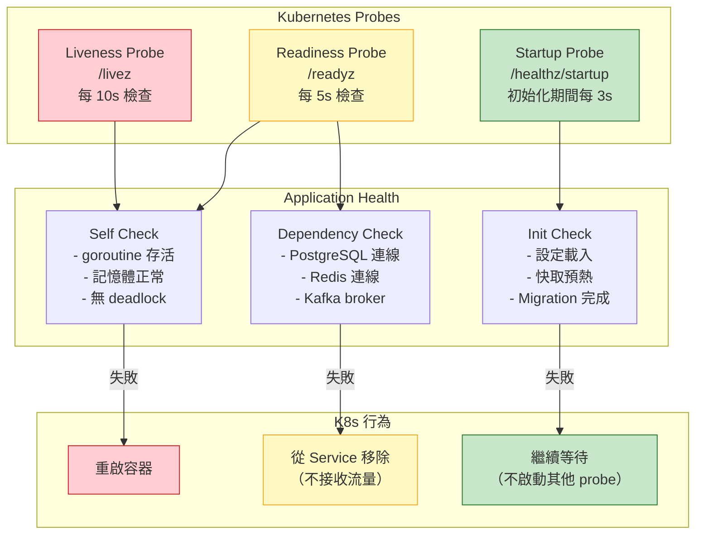
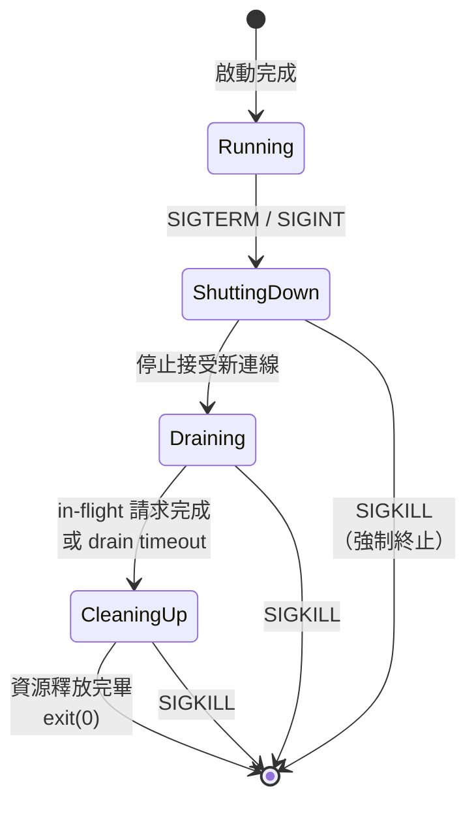

# Graceful Shutdown & Health Check Design / 優雅關機與健康檢查設計

## Intent / 意圖

優雅關機與健康檢查是**確保服務在部署、擴縮容、故障恢復等生命週期事件中不遺失任何正在處理的請求、不向無法服務的實例發送流量**的關鍵機制。在 Kubernetes 環境中，Pod 隨時可能被終止（rolling update、node drain、OOM kill），如果服務收到 SIGTERM 後立刻退出，所有 in-flight 請求都會丟失；如果健康檢查設計不當，流量會被導向尚未就緒或已開始關機的實例。

---

## Problem / 問題情境

**場景一：部署期間 502 錯誤暴增** — 團隊使用 Kubernetes rolling update 部署新版本。每次部署時，Grafana 監控面板上都會出現一個持續約 30 秒的 502 error spike。原因分析：K8s 發送 SIGTERM 給 Pod 後，Pod 立刻停止接受新連線並退出。但 kube-proxy 更新 iptables 規則需要數秒，在這段時間內，新的請求仍被 Service 的 load balancer 導向已停止的 Pod，導致 connection refused → 502。根本原因：缺少 preStop hook 延遲 + 沒有 graceful shutdown 機制。

**場景二：健康檢查導致雪崩式重啟** — 某服務的 liveness probe 檢查所有下游依賴（PostgreSQL、Redis、Kafka）。某天 Redis 發生短暫網路閃斷（持續 5 秒），所有 Pod 的 liveness probe 同時失敗，K8s 判定所有 Pod 不健康並同時重啟。重啟後所有 Pod 同時嘗試建立 Redis 連線——thundering herd 效應讓 Redis 再次被壓垮，形成重啟循環。30 分鐘內服務完全不可用。根本原因：liveness probe 不應該檢查外部依賴，只應檢查行程自身的健康狀態。

**場景三：長時間任務被強制終止** — 影片轉碼服務處理一個 2GB 影片需要 3 分鐘。K8s 的 `terminationGracePeriodSeconds` 預設為 30 秒。Pod 收到 SIGTERM 後開始 graceful shutdown，但正在轉碼的任務需要 3 分鐘才能完成。30 秒後 K8s 發送 SIGKILL 強制終止 Pod，轉碼任務中斷，使用者需要重新上傳。根本原因：`terminationGracePeriodSeconds` 設定不當，且服務未實作任務中斷保存機制。

---

## Core Concepts / 核心概念

### SIGTERM 與 SIGKILL

Unix/Linux 系統中兩個關鍵的程序終止信號。**SIGTERM**（signal 15）是「禮貌的終止請求」——程序可以攔截（trap）這個信號，執行清理工作後自行退出。**SIGKILL**（signal 9）是「強制終止命令」——程序無法攔截、無法忽略，作業系統直接回收程序資源。在 Kubernetes 中，Pod 終止流程是：先發送 SIGTERM → 等待 `terminationGracePeriodSeconds`（預設 30 秒）→ 如果 Pod 還未退出，發送 SIGKILL。

### Graceful Shutdown / 優雅關機

服務收到 SIGTERM 後的有序關機流程：(1) **停止接受新請求**——關閉 listener socket，讓 load balancer 不再導入新流量；(2) **等待 in-flight 請求完成**——給正在處理中的請求一段時間完成（drain period）；(3) **關閉資源連線**——關閉資料庫連線池、Redis 連線、Kafka producer flush 等；(4) **退出程序**——以 exit code 0 退出。整個過程必須在 `terminationGracePeriodSeconds` 內完成，否則會被 SIGKILL。

### Connection Draining / 連線排空

在 graceful shutdown 期間，服務不再接受新的 TCP 連線，但會繼續處理已建立連線上的請求直到完成或逾時。這確保了已經被接受的請求不會因為服務關機而丟失。在 HTTP/2 和 gRPC 中，服務發送 GOAWAY frame 通知客戶端停止在此連線上發送新請求。

### Kubernetes preStop Hook

K8s 在發送 SIGTERM 之前執行的 hook。常見用途是加入一個 `sleep 5` 延遲——讓 kube-proxy 有足夠時間更新 iptables 規則（將此 Pod 從 Service endpoint 中移除），避免在 SIGTERM 後的前幾秒仍有新請求被導入。preStop hook 的執行時間計入 `terminationGracePeriodSeconds`。

### Liveness Probe / 存活探針

回答問題：**「這個容器還活著嗎？」** 如果 liveness probe 持續失敗（超過 `failureThreshold` 次），K8s 會重啟容器。Liveness probe 應該**只檢查行程自身的健康狀態**——例如是否 deadlock、是否 OOM、主要 goroutine 是否還在運行。**絕對不要**在 liveness probe 中檢查外部依賴（DB、Redis、下游服務），否則外部依賴故障會導致所有 Pod 被重啟。

### Readiness Probe / 就緒探針

回答問題：**「這個容器準備好接收流量了嗎？」** 如果 readiness probe 失敗，K8s 會將此 Pod 從 Service endpoint 中移除（不再導入流量），但**不會重啟**容器。Readiness probe **可以且應該**檢查外部依賴——如果 DB 連線斷了，服務無法正常處理請求，應該告訴 K8s 暫時不要發流量過來。

### Startup Probe / 啟動探針

回答問題：**「這個容器的初始化完成了嗎？」** 在 startup probe 成功之前，K8s 不會執行 liveness/readiness probe。適用於啟動時間長的應用（需要載入大型模型、預熱快取等）。避免因為初始化慢而被 liveness probe 誤殺。

### Health Check Endpoint / 健康檢查端點

應用程式暴露的 HTTP 端點（通常是 `/healthz`、`/readyz`、`/livez`），讓 K8s 或 load balancer 定期檢查服務狀態。不同端點的檢查內容不同：`/livez` 只檢查行程健康、`/readyz` 檢查行程健康 + 外部依賴。回傳 HTTP 200 表示健康，非 200 表示不健康。

---

## Architecture / 架構

### Kubernetes Pod 終止完整流程

```mermaid
sequenceDiagram
    participant K8s as Kubernetes
    participant EP as Endpoint Controller
    participant KP as kube-proxy
    participant Pod as Application Pod
    participant LB as Load Balancer

    K8s->>EP: Pod 進入 Terminating 狀態
    K8s->>Pod: 執行 preStop hook<br/>(sleep 5s)
    EP->>KP: 從 Service endpoint 移除 Pod
    KP->>LB: 更新 iptables 規則<br/>(移除 Pod IP)

    Note over Pod: preStop hook 完成

    K8s->>Pod: 發送 SIGTERM
    Pod->>Pod: 停止接受新連線
    Pod->>Pod: 等待 in-flight 請求完成
    Pod->>Pod: 關閉 DB 連線池
    Pod->>Pod: Flush 緩衝區
    Pod->>Pod: 退出 (exit 0)

    Note over K8s,Pod: 如果超過 terminationGracePeriodSeconds

    K8s->>Pod: 發送 SIGKILL（強制終止）

    style Pod fill:#e3f2fd,stroke:#1565c0
    style K8s fill:#fff3e0,stroke:#e65100
    style LB fill:#e8f5e9,stroke:#2e7d32
```

### 健康檢查分層架構



### Graceful Shutdown 狀態機



---

## How It Works / 運作原理

### Graceful Shutdown 完整步驟

1. **註冊信號處理器**：在應用啟動時註冊 SIGTERM 和 SIGINT 的處理器。SIGTERM 來自 Kubernetes，SIGINT 來自 Ctrl+C（本地開發）。

2. **服務正常運行**：HTTP server 持續接受並處理請求，health check endpoint 回傳 200。

3. **接收 SIGTERM**：K8s 發送 SIGTERM（在 preStop hook 完成後）。信號處理器觸發 shutdown 流程。

4. **標記為 shutting down**：設定一個 atomic flag（如 `is_shutting_down = true`），readiness probe 立刻回傳 503，告訴 K8s「我已經不準備接收新流量了」。

5. **停止 listener**：關閉 TCP listener（不再 accept 新連線）。已建立的連線繼續服務。

6. **等待 in-flight 請求**：使用 WaitGroup（Go）或 task tracker（Rust）追蹤正在處理中的請求。設定 drain timeout（例如 25 秒，要小於 terminationGracePeriodSeconds 的 30 秒），超時後強制中斷剩餘請求。

7. **關閉外部資源**：按照依賴順序反向關閉——先關閉 Kafka producer（flush 緩衝的訊息）→ 關閉 Redis 連線 → 關閉 DB 連線池。

8. **退出程序**：以 exit code 0 退出。如果 shutdown 過程發生錯誤，以非零 exit code 退出。

### Health Check 設計原則

1. **Liveness 只檢查自己**：檢查 goroutine/thread 是否存活、記憶體是否在合理範圍、是否有 deadlock。不查 DB、不查 Redis、不查下游服務。

2. **Readiness 檢查依賴**：檢查 DB 連線池是否可用（`SELECT 1`）、Redis 是否可 ping、必要的下游服務是否可達。任何一個依賴不可用，就回傳 503。

3. **Startup 檢查初始化**：檢查設定檔是否載入、migration 是否完成、快取是否預熱。只在啟動階段使用，一旦成功就不再檢查。

4. **Probe 參數調校**：`initialDelaySeconds`（首次檢查延遲）、`periodSeconds`（檢查頻率）、`timeoutSeconds`（單次逾時）、`failureThreshold`（連續失敗幾次才觸發動作）。建議 liveness 的 failureThreshold 設為 3-5（容忍暫時性失敗），readiness 的 failureThreshold 設為 1-2（快速移除流量）。

---

## Rust 實作

以下實作使用 Axum 0.8 + tokio，展示 graceful shutdown 與健康檢查端點的完整設計。

```rust
// Cargo.toml dependencies:
// axum = "0.8"
// tokio = { version = "1", features = ["full", "signal"] }
// serde = { version = "1", features = ["derive"] }
// serde_json = "1"
// sqlx = { version = "0.8", features = ["runtime-tokio", "postgres"] }
// tracing = "0.1"
// tracing-subscriber = "0.3"

use axum::{
    extract::State,
    http::StatusCode,
    response::{IntoResponse, Json},
    routing::get,
    Router,
};
use serde::Serialize;
use sqlx::postgres::PgPoolOptions;
use sqlx::PgPool;
use std::sync::atomic::{AtomicBool, Ordering};
use std::sync::Arc;
use std::time::Duration;
use tokio::net::TcpListener;
use tokio::signal;

// ── 應用狀態 ───────────────────────────────────────────────────

#[derive(Clone)]
struct AppState {
    db_pool: PgPool,
    is_shutting_down: Arc<AtomicBool>,
    is_ready: Arc<AtomicBool>,
}

// ── Health Check 回應 ──────────────────────────────────────────

#[derive(Serialize)]
struct HealthResponse {
    status: String,
    checks: Vec<HealthCheck>,
}

#[derive(Serialize)]
struct HealthCheck {
    name: String,
    status: String,
    #[serde(skip_serializing_if = "Option::is_none")]
    message: Option<String>,
}

// ── Liveness Probe: 只檢查行程自身 ────────────────────────────

/// /livez — 只檢查行程是否存活
/// 不檢查任何外部依賴！
async fn liveness_handler() -> impl IntoResponse {
    // 簡單的自我檢查：如果能回應請求，代表行程還活著
    // 可以加入更多內部檢查（如 deadlock detection）
    let response = HealthResponse {
        status: "ok".to_string(),
        checks: vec![HealthCheck {
            name: "self".to_string(),
            status: "ok".to_string(),
            message: None,
        }],
    };

    (StatusCode::OK, Json(response))
}

// ── Readiness Probe: 檢查行程 + 外部依賴 ──────────────────────

/// /readyz — 檢查行程是否準備好接收流量
/// 包含外部依賴檢查
async fn readiness_handler(State(state): State<AppState>) -> impl IntoResponse {
    // 如果正在關機，立刻回傳 503
    if state.is_shutting_down.load(Ordering::SeqCst) {
        let response = HealthResponse {
            status: "shutting_down".to_string(),
            checks: vec![],
        };
        return (StatusCode::SERVICE_UNAVAILABLE, Json(response));
    }

    let mut checks = Vec::new();
    let mut all_healthy = true;

    // 檢查 PostgreSQL 連線
    let db_check = match sqlx::query("SELECT 1")
        .execute(&state.db_pool)
        .await
    {
        Ok(_) => HealthCheck {
            name: "postgresql".to_string(),
            status: "ok".to_string(),
            message: None,
        },
        Err(err) => {
            all_healthy = false;
            HealthCheck {
                name: "postgresql".to_string(),
                status: "fail".to_string(),
                message: Some(format!("connection failed: {}", err)),
            }
        }
    };
    checks.push(db_check);

    // 可以加入更多依賴檢查：Redis、Kafka 等
    // let redis_check = check_redis(&state.redis_pool).await;
    // checks.push(redis_check);

    let status_code = if all_healthy {
        StatusCode::OK
    } else {
        StatusCode::SERVICE_UNAVAILABLE
    };

    let response = HealthResponse {
        status: if all_healthy {
            "ok".to_string()
        } else {
            "degraded".to_string()
        },
        checks,
    };

    (status_code, Json(response))
}

// ── Startup Probe ──────────────────────────────────────────────

/// /healthz/startup — 檢查初始化是否完成
async fn startup_handler(State(state): State<AppState>) -> impl IntoResponse {
    if state.is_ready.load(Ordering::SeqCst) {
        (
            StatusCode::OK,
            Json(serde_json::json!({"status": "ready"})),
        )
    } else {
        (
            StatusCode::SERVICE_UNAVAILABLE,
            Json(serde_json::json!({"status": "initializing"})),
        )
    }
}

// ── 業務 Handler ──────────────────────────────────────────────

async fn handle_request() -> impl IntoResponse {
    // 模擬業務處理
    tokio::time::sleep(Duration::from_millis(100)).await;
    Json(serde_json::json!({"message": "request processed"}))
}

// ── 信號處理與 Graceful Shutdown ──────────────────────────────

/// 等待 SIGTERM 或 SIGINT 信號
async fn shutdown_signal() {
    let ctrl_c = async {
        signal::ctrl_c()
            .await
            .expect("failed to install Ctrl+C handler");
    };

    #[cfg(unix)]
    let terminate = async {
        signal::unix::signal(signal::unix::SignalKind::terminate())
            .expect("failed to install SIGTERM handler")
            .recv()
            .await;
    };

    #[cfg(not(unix))]
    let terminate = std::future::pending::<()>();

    tokio::select! {
        _ = ctrl_c => {
            tracing::info!("Received SIGINT (Ctrl+C)");
        }
        _ = terminate => {
            tracing::info!("Received SIGTERM");
        }
    }
}

// ── 初始化程序 ─────────────────────────────────────────────────

/// 模擬應用程式初始化（載入設定、預熱快取等）
async fn initialize_app(state: &AppState) {
    tracing::info!("Starting initialization...");

    // 模擬初始化工作
    tokio::time::sleep(Duration::from_secs(2)).await;

    // 驗證資料庫連線
    sqlx::query("SELECT 1")
        .execute(&state.db_pool)
        .await
        .expect("database connection failed during initialization");

    // 標記為就緒
    state.is_ready.store(true, Ordering::SeqCst);
    tracing::info!("Initialization complete, ready to serve traffic");
}

// ── 主程式 ─────────────────────────────────────────────────────

#[tokio::main]
async fn main() -> Result<(), Box<dyn std::error::Error>> {
    // 初始化 tracing
    tracing_subscriber::fmt::init();

    let database_url = std::env::var("DATABASE_URL")
        .unwrap_or_else(|_| "postgres://localhost/myapp".to_string());

    // 建立 DB 連線池
    let db_pool = PgPoolOptions::new()
        .max_connections(10)
        .acquire_timeout(Duration::from_secs(5))
        .connect(&database_url)
        .await?;

    let state = AppState {
        db_pool: db_pool.clone(),
        is_shutting_down: Arc::new(AtomicBool::new(false)),
        is_ready: Arc::new(AtomicBool::new(false)),
    };

    // 在背景執行初始化
    let init_state = state.clone();
    tokio::spawn(async move {
        initialize_app(&init_state).await;
    });

    // 建立路由
    let app = Router::new()
        // 業務路由
        .route("/api/process", get(handle_request))
        // 健康檢查路由（不需要認證）
        .route("/livez", get(liveness_handler))
        .route("/readyz", get(readiness_handler))
        .route("/healthz/startup", get(startup_handler))
        .with_state(state.clone());

    let listener = TcpListener::bind("0.0.0.0:3000").await?;
    tracing::info!("Server listening on :3000");

    // 使用 Axum 的 graceful shutdown 機制
    // axum::serve 支援 with_graceful_shutdown
    let shutdown_state = state.clone();
    axum::serve(listener, app)
        .with_graceful_shutdown(async move {
            // 等待終止信號
            shutdown_signal().await;

            tracing::info!("Initiating graceful shutdown...");

            // 標記為正在關機（readiness probe 會回傳 503）
            shutdown_state
                .is_shutting_down
                .store(true, Ordering::SeqCst);

            // 給 in-flight 請求一些時間完成
            // Axum 的 graceful shutdown 會自動等待已接受的請求完成
            tracing::info!("Waiting for in-flight requests to complete...");

            // 短暫延遲，讓 readiness probe 有時間偵測到 503
            // 這樣 K8s 會先停止發送新流量
            tokio::time::sleep(Duration::from_secs(2)).await;
        })
        .await?;

    // Server 已停止接受新請求，開始清理資源
    tracing::info!("Server stopped, cleaning up resources...");

    // 關閉 DB 連線池
    state.db_pool.close().await;
    tracing::info!("Database pool closed");

    tracing::info!("Graceful shutdown complete");
    Ok(())
}

// Output:
// 2026-02-18T10:00:00Z INFO  Server listening on :3000
// 2026-02-18T10:00:00Z INFO  Starting initialization...
// 2026-02-18T10:00:02Z INFO  Initialization complete, ready to serve traffic
//
// (收到 SIGTERM)
// 2026-02-18T10:05:30Z INFO  Received SIGTERM
// 2026-02-18T10:05:30Z INFO  Initiating graceful shutdown...
// 2026-02-18T10:05:30Z INFO  Waiting for in-flight requests to complete...
// 2026-02-18T10:05:32Z INFO  Server stopped, cleaning up resources...
// 2026-02-18T10:05:32Z INFO  Database pool closed
// 2026-02-18T10:05:32Z INFO  Graceful shutdown complete
```

### Kubernetes 部署配置（YAML）

```yaml
apiVersion: apps/v1
kind: Deployment
metadata:
  name: my-service
spec:
  replicas: 3
  strategy:
    type: RollingUpdate
    rollingUpdate:
      maxUnavailable: 0      # 確保零停機
      maxSurge: 1
  template:
    spec:
      terminationGracePeriodSeconds: 60  # 給足夠時間完成 shutdown
      containers:
        - name: my-service
          image: my-service:latest
          ports:
            - containerPort: 3000
          # Liveness: 只檢查行程自身
          livenessProbe:
            httpGet:
              path: /livez
              port: 3000
            initialDelaySeconds: 10
            periodSeconds: 10
            timeoutSeconds: 3
            failureThreshold: 3
          # Readiness: 檢查行程 + 外部依賴
          readinessProbe:
            httpGet:
              path: /readyz
              port: 3000
            initialDelaySeconds: 5
            periodSeconds: 5
            timeoutSeconds: 3
            failureThreshold: 1  # 快速移除不健康的 Pod
          # Startup: 等待初始化完成
          startupProbe:
            httpGet:
              path: /healthz/startup
              port: 3000
            periodSeconds: 3
            failureThreshold: 20  # 最多等 60 秒初始化
          lifecycle:
            preStop:
              exec:
                command: ["sleep", "5"]  # 等待 kube-proxy 更新 iptables
```

---

## Go 實作

以下實作使用 Go 1.24+ 標準庫 `net/http`，展示 graceful shutdown 與健康檢查的完整設計。

```go
package main

import (
	"context"
	"database/sql"
	"encoding/json"
	"errors"
	"fmt"
	"log/slog"
	"net/http"
	"os"
	"os/signal"
	"sync"
	"sync/atomic"
	"syscall"
	"time"

	_ "github.com/lib/pq"
)

// ── 應用狀態 ───────────────────────────────────────────────────

// AppState 持有應用程式的共享狀態
type AppState struct {
	db             *sql.DB
	isShuttingDown atomic.Bool
	isReady        atomic.Bool
	activeRequests sync.WaitGroup // 追蹤 in-flight 請求
}

// ── Health Check 回應結構 ──────────────────────────────────────

// HealthResponse 健康檢查的回應
type HealthResponse struct {
	Status string        `json:"status"`
	Checks []HealthCheck `json:"checks"`
}

// HealthCheck 單個依賴的健康狀態
type HealthCheck struct {
	Name    string `json:"name"`
	Status  string `json:"status"`
	Message string `json:"message,omitempty"`
}

// ── In-Flight Request Tracking Middleware ──────────────────────

// RequestTracker middleware 追蹤正在處理中的請求
func RequestTracker(state *AppState, next http.Handler) http.Handler {
	return http.HandlerFunc(func(w http.ResponseWriter, r *http.Request) {
		// 如果正在關機，拒絕新請求
		if state.isShuttingDown.Load() {
			http.Error(w, `{"error":"service is shutting down"}`,
				http.StatusServiceUnavailable)
			return
		}

		state.activeRequests.Add(1)
		defer state.activeRequests.Done()

		next.ServeHTTP(w, r)
	})
}

// ── Liveness Probe Handler ────────────────────────────────────

// HandleLiveness /livez — 只檢查行程自身健康
func HandleLiveness() http.HandlerFunc {
	return func(w http.ResponseWriter, r *http.Request) {
		response := HealthResponse{
			Status: "ok",
			Checks: []HealthCheck{
				{Name: "self", Status: "ok"},
			},
		}

		w.Header().Set("Content-Type", "application/json")
		w.WriteHeader(http.StatusOK)
		json.NewEncoder(w).Encode(response)
	}
}

// ── Readiness Probe Handler ───────────────────────────────────

// HandleReadiness /readyz — 檢查行程 + 外部依賴
func HandleReadiness(state *AppState) http.HandlerFunc {
	return func(w http.ResponseWriter, r *http.Request) {
		// 如果正在關機，立刻回傳 503
		if state.isShuttingDown.Load() {
			response := HealthResponse{Status: "shutting_down"}
			w.Header().Set("Content-Type", "application/json")
			w.WriteHeader(http.StatusServiceUnavailable)
			json.NewEncoder(w).Encode(response)
			return
		}

		checks := make([]HealthCheck, 0)
		allHealthy := true

		// 檢查 PostgreSQL
		dbCtx, dbCancel := context.WithTimeout(r.Context(), 3*time.Second)
		defer dbCancel()

		if err := state.db.PingContext(dbCtx); err != nil {
			allHealthy = false
			checks = append(checks, HealthCheck{
				Name:    "postgresql",
				Status:  "fail",
				Message: fmt.Sprintf("ping failed: %v", err),
			})
		} else {
			checks = append(checks, HealthCheck{
				Name:   "postgresql",
				Status: "ok",
			})
		}

		// 可以加入更多依賴檢查
		// checks = append(checks, checkRedis(state.redis)...)

		status := "ok"
		statusCode := http.StatusOK
		if !allHealthy {
			status = "degraded"
			statusCode = http.StatusServiceUnavailable
		}

		response := HealthResponse{Status: status, Checks: checks}
		w.Header().Set("Content-Type", "application/json")
		w.WriteHeader(statusCode)
		json.NewEncoder(w).Encode(response)
	}
}

// ── Startup Probe Handler ─────────────────────────────────────

// HandleStartup /healthz/startup — 檢查初始化是否完成
func HandleStartup(state *AppState) http.HandlerFunc {
	return func(w http.ResponseWriter, r *http.Request) {
		w.Header().Set("Content-Type", "application/json")

		if state.isReady.Load() {
			w.WriteHeader(http.StatusOK)
			json.NewEncoder(w).Encode(map[string]string{"status": "ready"})
		} else {
			w.WriteHeader(http.StatusServiceUnavailable)
			json.NewEncoder(w).Encode(map[string]string{"status": "initializing"})
		}
	}
}

// ── 業務 Handler ──────────────────────────────────────────────

func handleProcess() http.HandlerFunc {
	return func(w http.ResponseWriter, r *http.Request) {
		// 模擬業務處理
		time.Sleep(100 * time.Millisecond)

		w.Header().Set("Content-Type", "application/json")
		json.NewEncoder(w).Encode(map[string]string{
			"message": "request processed",
		})
	}
}

// ── 初始化程序 ─────────────────────────────────────────────────

func initializeApp(state *AppState) {
	slog.Info("Starting initialization...")

	// 模擬初始化工作（載入設定、預熱快取）
	time.Sleep(2 * time.Second)

	// 驗證資料庫連線
	ctx, cancel := context.WithTimeout(context.Background(), 5*time.Second)
	defer cancel()

	if err := state.db.PingContext(ctx); err != nil {
		slog.Error("Database connection failed during init", "error", err)
		os.Exit(1)
	}

	state.isReady.Store(true)
	slog.Info("Initialization complete, ready to serve traffic")
}

// ── Graceful Shutdown ─────────────────────────────────────────

func gracefulShutdown(
	server *http.Server,
	state *AppState,
	drainTimeout time.Duration,
) {
	// 建立信號通道
	sigChan := make(chan os.Signal, 1)
	signal.Notify(sigChan, syscall.SIGTERM, syscall.SIGINT)

	// 等待終止信號
	sig := <-sigChan
	slog.Info("Received signal, initiating graceful shutdown", "signal", sig)

	// 1. 標記為正在關機（readiness probe 回傳 503）
	state.isShuttingDown.Store(true)
	slog.Info("Marked as shutting down, readiness probe will return 503")

	// 2. 等待一小段時間，讓 K8s 的 readiness probe 偵測到 503
	//    並更新 Service endpoint（停止發送新流量）
	time.Sleep(2 * time.Second)

	// 3. 停止接受新連線，等待 in-flight 請求完成
	slog.Info("Stopping HTTP server (draining in-flight requests)...")
	ctx, cancel := context.WithTimeout(context.Background(), drainTimeout)
	defer cancel()

	if err := server.Shutdown(ctx); err != nil {
		slog.Error("HTTP server shutdown error", "error", err)
	} else {
		slog.Info("HTTP server stopped gracefully")
	}

	// 4. 等待所有追蹤的 in-flight 請求完成
	done := make(chan struct{})
	go func() {
		state.activeRequests.Wait()
		close(done)
	}()

	select {
	case <-done:
		slog.Info("All in-flight requests completed")
	case <-time.After(drainTimeout):
		slog.Warn("Drain timeout exceeded, some requests may be interrupted")
	}

	// 5. 關閉外部資源（按依賴關係反向關閉）
	slog.Info("Closing database connections...")
	if err := state.db.Close(); err != nil {
		slog.Error("Database close error", "error", err)
	} else {
		slog.Info("Database connections closed")
	}

	slog.Info("Graceful shutdown complete")
}

// ── 主程式 ─────────────────────────────────────────────────────

func main() {
	// 初始化 structured logger
	logger := slog.New(slog.NewJSONHandler(os.Stdout, &slog.HandlerOptions{
		Level: slog.LevelInfo,
	}))
	slog.SetDefault(logger)

	// 建立 DB 連線
	dsn := "postgres://localhost/myapp?sslmode=disable"
	db, err := sql.Open("postgres", dsn)
	if err != nil {
		slog.Error("Failed to connect to database", "error", err)
		os.Exit(1)
	}

	db.SetMaxOpenConns(10)
	db.SetMaxIdleConns(5)
	db.SetConnMaxLifetime(30 * time.Minute)

	state := &AppState{db: db}

	// 在背景執行初始化
	go initializeApp(state)

	// 建立路由
	mux := http.NewServeMux()

	// 健康檢查路由（不經過 RequestTracker）
	mux.HandleFunc("GET /livez", HandleLiveness())
	mux.HandleFunc("GET /readyz", HandleReadiness(state))
	mux.HandleFunc("GET /healthz/startup", HandleStartup(state))

	// 業務路由（經過 RequestTracker）
	businessMux := http.NewServeMux()
	businessMux.HandleFunc("GET /api/process", handleProcess())
	mux.Handle("/api/", RequestTracker(state, businessMux))

	server := &http.Server{
		Addr:         ":8080",
		Handler:      mux,
		ReadTimeout:  10 * time.Second,
		WriteTimeout: 30 * time.Second,
		IdleTimeout:  60 * time.Second,
	}

	// 在背景執行 graceful shutdown 監聽
	go gracefulShutdown(server, state, 25*time.Second)

	slog.Info("Server listening on :8080")

	if err := server.ListenAndServe(); !errors.Is(err, http.ErrServerClosed) {
		slog.Error("Server error", "error", err)
		os.Exit(1)
	}
}

// Output:
// {"time":"2026-02-18T10:00:00Z","level":"INFO","msg":"Server listening on :8080"}
// {"time":"2026-02-18T10:00:00Z","level":"INFO","msg":"Starting initialization..."}
// {"time":"2026-02-18T10:00:02Z","level":"INFO","msg":"Initialization complete, ready to serve traffic"}
//
// (收到 SIGTERM)
// {"time":"2026-02-18T10:05:30Z","level":"INFO","msg":"Received signal, initiating graceful shutdown","signal":"terminated"}
// {"time":"2026-02-18T10:05:30Z","level":"INFO","msg":"Marked as shutting down, readiness probe will return 503"}
// {"time":"2026-02-18T10:05:32Z","level":"INFO","msg":"Stopping HTTP server (draining in-flight requests)..."}
// {"time":"2026-02-18T10:05:32Z","level":"INFO","msg":"HTTP server stopped gracefully"}
// {"time":"2026-02-18T10:05:32Z","level":"INFO","msg":"All in-flight requests completed"}
// {"time":"2026-02-18T10:05:32Z","level":"INFO","msg":"Closing database connections..."}
// {"time":"2026-02-18T10:05:32Z","level":"INFO","msg":"Database connections closed"}
// {"time":"2026-02-18T10:05:32Z","level":"INFO","msg":"Graceful shutdown complete"}
```

---

## Rust vs Go 對照表

| 比較維度 | Rust (Axum + tokio) | Go (net/http) |
|---------|-------------------|---------------|
| **信號處理** | `tokio::signal::unix::signal(SignalKind::terminate())` — async/await 風格，需 `#[cfg(unix)]` 條件編譯 | `signal.Notify(sigChan, syscall.SIGTERM)` — channel-based，跨平台但 signal 常數依平台而異 |
| **Graceful Shutdown** | `axum::serve(...).with_graceful_shutdown(future)` — 框架原生支援，傳入一個 Future 即可 | `server.Shutdown(ctx)` — 標準庫內建，傳入 context 控制 timeout |
| **請求追蹤** | Axum 內部自動追蹤（graceful shutdown 會等待所有 in-flight 請求） | 需要手動 `sync.WaitGroup` + middleware 追蹤 |
| **Atomic Flag** | `Arc<AtomicBool>` + `Ordering::SeqCst` — 需要明確指定 memory ordering | `atomic.Bool` — Go 1.19+ 提供型別安全的 atomic，API 更簡潔 |
| **資源清理順序** | 在 `with_graceful_shutdown` callback 之後手動關閉資源 | 在 `gracefulShutdown` goroutine 中按順序關閉 |
| **日誌** | `tracing` crate — 結構化日誌 + span，適合分散式追蹤 | `log/slog` — Go 1.21+ 標準庫結構化日誌 |
| **Startup Probe 整合** | `AtomicBool` + `tokio::spawn` 背景初始化 | `atomic.Bool` + goroutine 背景初始化 |

---

## When to Use / 適用場景

1. **Kubernetes 環境中的任何生產服務**：只要服務部署在 K8s 上，就必須實作 graceful shutdown 和健康檢查。Rolling update、auto-scaling、node drain 都會觸發 Pod 終止——沒有 graceful shutdown 就意味著每次部署都會丟失 in-flight 請求。

2. **長連線服務（WebSocket、gRPC streaming、SSE）**：這類服務的連線生命週期遠長於普通 HTTP 請求，graceful shutdown 需要特別處理——通知客戶端重新連線、等待 stream 完成、設定更長的 drain timeout。

3. **處理有狀態工作的服務**：如影片轉碼、報表生成、資料匯入等。中斷這類工作代價高昂（需要重新開始），必須確保 graceful shutdown 給足夠時間完成，或實作 checkpoint/resume 機制。

---

## When NOT to Use / 不適用場景

1. **短生命週期的 CLI 工具或 Lambda 函數**：如果程式的生命週期就是「接收輸入 → 處理 → 輸出 → 退出」，不需要持續運行的 server，graceful shutdown 機制是多餘的。AWS Lambda 有自己的生命週期管理。

2. **完全無狀態且處理時間極短的服務（< 10ms）**：如果每個請求的處理時間都小於 10ms，且服務完全無狀態（不持有連線池、不寫入本地檔案），那麼即使 SIGKILL 直接殺掉也幾乎不會丟失請求——因為請求太快了。但即使如此，建議至少實作基本的 health check。

3. **開發環境的本地服務**：在本地開發時，Ctrl+C 直接退出通常就夠了。過早引入完整的 graceful shutdown 和 health check 會增加開發環境的複雜度。但建議在架構上預留接口，以便生產環境啟用。

---

## Real-World Examples / 真實世界案例

### Kubernetes — Ingress NGINX 的 Graceful Shutdown

Kubernetes 官方的 NGINX Ingress Controller 實作了精細的 graceful shutdown 機制：

- **SIGTERM 處理**：收到 SIGTERM 後，NGINX worker process 進入 `worker_shutdown_timeout` 階段，停止接受新連線但繼續處理已建立的連線。
- **preStop Hook**：`preStop` hook 執行 `/wait-shutdown`，內部邏輯是等待所有 active upstream connection 完成。
- **Connection Draining**：NGINX 的 `keepalive_timeout` 在 shutdown 期間降為 0，告訴客戶端關閉 keep-alive 連線並重新建立新連線到其他 Pod。
- **Health Check**：NGINX 暴露 `/healthz` 端點，在 shutdown 期間回傳 503，讓 kube-proxy 將其從 Service endpoint 移除。

### Shopify — 零停機部署與健康檢查

Shopify 的 Rails monolith 每天部署 40+ 次，依賴精密的 graceful shutdown 和健康檢查機制：

- **Toxiproxy 健康檢查**：Shopify 使用自研的 Toxiproxy 工具來模擬依賴故障，驗證健康檢查在各種故障場景下的行為。
- **分層 Readiness**：readiness probe 區分「完全就緒」和「降級就緒」——如果非關鍵依賴（如推薦服務）不可用，服務仍標記為就緒但禁用推薦功能。
- **Shutdown Hooks**：Rails app 的 shutdown hook 會 flush Kafka producer buffer、drain Sidekiq worker、關閉 MySQL 連線池，整個過程在 30 秒內完成。

---

## Interview Questions / 面試常見問題

### Q1: 請描述 Kubernetes 中 Pod 被終止的完整生命週期。

**答**：Pod 終止的完整流程如下：

1. API server 將 Pod 狀態設為 `Terminating`。
2. Endpoint Controller 注意到 Pod 進入 Terminating，開始從 Service endpoint 移除該 Pod（異步）。
3. kubelet 偵測到 Pod 需要終止，執行 **preStop hook**（如果有定義）。常見做法是 `sleep 5` 來等待 kube-proxy 更新 iptables 規則。
4. preStop hook 完成後，kubelet 發送 **SIGTERM** 給容器的 PID 1 行程。
5. 應用程式收到 SIGTERM，開始 graceful shutdown——停止接受新連線、等待 in-flight 請求完成、關閉資源。
6. 同時，kube-proxy 更新 iptables 規則，將該 Pod IP 從 Service 的 endpoint 中移除。新的請求不再被路由到這個 Pod。
7. 如果 Pod 在 `terminationGracePeriodSeconds`（預設 30 秒）內退出，流程正常結束。
8. 如果超時，kubelet 發送 **SIGKILL** 強制終止行程。

注意：步驟 2-3 和步驟 4-6 是**平行發生**的，這就是為什麼 preStop hook 的 sleep 很重要——它確保 kube-proxy 有時間更新 iptables。

### Q2: Liveness probe 和 Readiness probe 有什麼區別？Liveness probe 中檢查資料庫連線為什麼是反模式？

**答**：

| 面向 | Liveness Probe | Readiness Probe |
|------|---------------|-----------------|
| 問題 | 容器還活著嗎？ | 容器準備好接收流量了嗎？ |
| 失敗後果 | **重啟容器** | 從 Service endpoint **移除**（不重啟） |
| 檢查內容 | 行程自身健康（無 deadlock、無 OOM） | 行程 + 外部依賴（DB、Redis、下游服務） |

在 liveness probe 中檢查 DB 是反模式，原因如下：

假設 DB 短暫不可用（5 秒網路閃斷），所有 Pod 的 liveness probe 同時失敗。K8s 同時重啟所有 Pod。重啟後所有 Pod 同時嘗試建立 DB 連線（thundering herd），可能進一步壓垮 DB。這形成了**級聯故障**：DB 短暫不可用 → 所有 Pod 重啟 → thundering herd → DB 再次不可用 → 重啟循環。

正確做法：liveness 只檢查 `return 200`；readiness 檢查 DB。DB 不可用時，readiness 失敗，Pod 從 endpoint 移除（不接收流量），但 Pod 不被重啟。DB 恢復後，readiness 自動恢復，Pod 重新加入 endpoint。

### Q3: 什麼是 connection draining？在 HTTP/1.1 和 HTTP/2 中有什麼不同？

**答**：Connection draining 是 graceful shutdown 的核心機制——停止接受新連線，但讓已建立的連線上的請求繼續處理完成。

在 **HTTP/1.1** 中：server 停止 accept 新的 TCP 連線。已建立的 keep-alive 連線上的請求繼續處理。處理完當前請求後，server 在回應中加入 `Connection: close` header，告訴客戶端關閉這個連線。

在 **HTTP/2** 中：server 發送 **GOAWAY frame**，其中包含 `Last-Stream-ID`——告訴客戶端「ID 大於這個值的 stream 不會被處理，請在新連線上重試」。已經在處理中的 stream 繼續完成。客戶端收到 GOAWAY 後，會建立新的連線（連到其他健康的 Pod）來發送後續請求。

在 **gRPC** 中：原理與 HTTP/2 相同（gRPC 建立在 HTTP/2 上），server 發送 GOAWAY，client-side load balancer 會自動切換到其他後端。

### Q4: 如何設計一個能處理長時間任務的 graceful shutdown？

**答**：長時間任務（如影片轉碼、資料匯入）的 graceful shutdown 比普通 HTTP 請求複雜得多，策略如下：

1. **增加 terminationGracePeriodSeconds**：如果任務最長可能需要 5 分鐘，將 `terminationGracePeriodSeconds` 設為 360（6 分鐘，含預留）。但不要設得太大——node drain 時 K8s 會等待這麼久才能釋放資源。

2. **Checkpoint + Resume**：將長時間任務拆分為可恢復的步驟。每完成一個步驟就保存 checkpoint（如已轉碼的影片片段、已匯入的行數）。收到 SIGTERM 時保存當前 checkpoint，新 Pod 啟動後從 checkpoint 繼續。

3. **任務租約（Task Lease）**：使用 distributed lock 或 DB 的 `claimed_at` + TTL 機制。Worker 定期續約。收到 SIGTERM 時釋放租約，其他 worker 可以接手。

4. **SIGTERM 處理中取消子任務**：使用 context cancellation 將 SIGTERM 信號傳播到所有子任務。每個子任務在安全點檢查 context 是否已取消。

5. **分離 HTTP server 和 worker**：HTTP server 可以快速 shutdown（秒級），worker 的 shutdown 可以更長。兩者使用不同的 shutdown timeout。

### Q5: preStop hook 的 sleep 應該設多長？為什麼？

**答**：建議 preStop hook sleep **3-5 秒**，原因如下：

Pod 進入 Terminating 狀態後，以下兩件事**同時發生**：
1. Endpoint Controller 開始從 Service endpoint 移除 Pod IP（觸發 kube-proxy 更新 iptables）
2. kubelet 開始執行 preStop hook → 完成後發送 SIGTERM

如果沒有 preStop sleep，SIGTERM 立刻到達，應用程式立刻停止接受連線。但 kube-proxy 可能還沒更新 iptables（需要 1-3 秒），在這段時間內新請求仍被導向已停止的 Pod → connection refused → 502。

preStop sleep 5 秒的效果：應用程式在這 5 秒內仍然正常運行（還沒收到 SIGTERM），kube-proxy 有充足時間更新 iptables。5 秒後 SIGTERM 到達，此時流量已被切走，不會有新請求進來。

注意：preStop hook 的時間計入 `terminationGracePeriodSeconds`。如果 termGracePeriod = 30 秒，preStop sleep = 5 秒，則應用程式的 drain timeout 最多只有 25 秒。

---

## Pitfalls / 常見陷阱

### 陷阱一：Liveness Probe 檢查外部依賴（最常見的致命錯誤）

```yaml
# 錯誤：liveness 檢查 DB
livenessProbe:
  httpGet:
    path: /readyz  # 這個端點會檢查 DB！
    port: 8080

# 正確：liveness 只檢查自身
livenessProbe:
  httpGet:
    path: /livez   # 這個端點只回 200
    port: 8080
```

### 陷阱二：Rust 中忘記處理 Unix 信號的跨平台問題

```rust
// 錯誤（Rust）：直接使用 unix signal，Windows 上編譯失敗
use tokio::signal::unix::{signal, SignalKind};

async fn shutdown_signal() {
    signal(SignalKind::terminate()).unwrap().recv().await; // Windows 上 panic
}

// 正確做法：使用 cfg 條件編譯
async fn shutdown_signal() {
    let ctrl_c = async {
        tokio::signal::ctrl_c().await.expect("Ctrl+C handler");
    };

    #[cfg(unix)]
    let terminate = async {
        tokio::signal::unix::signal(tokio::signal::unix::SignalKind::terminate())
            .expect("SIGTERM handler")
            .recv()
            .await;
    };

    #[cfg(not(unix))]
    let terminate = std::future::pending::<()>();

    tokio::select! {
        _ = ctrl_c => {}
        _ = terminate => {}
    }
}
```

### 陷阱三：Go 中 server.Shutdown 後忘記等待 goroutine

```go
// 錯誤（Go）：server.Shutdown 只等待 HTTP 請求完成
// 但 background goroutine（如 Kafka consumer）不會被等待
func main() {
    go consumeKafkaMessages(ctx) // 這個 goroutine 不受 server.Shutdown 管控

    server.Shutdown(ctx)
    // consumeKafkaMessages 可能仍在運行！程式退出後 goroutine 被殺死
}

// 正確做法：使用 errgroup 或 WaitGroup 管理所有 goroutine
func main() {
    ctx, cancel := context.WithCancel(context.Background())
    var wg sync.WaitGroup

    wg.Add(1)
    go func() {
        defer wg.Done()
        consumeKafkaMessages(ctx)
    }()

    // 收到信號後
    cancel()         // 通知所有 goroutine 停止
    server.Shutdown(shutdownCtx)
    wg.Wait()        // 等待所有 goroutine 退出
}
```

### 陷阱四：terminationGracePeriodSeconds 太短

```yaml
# 錯誤：預設 30 秒可能不夠
# preStop sleep 5s + drain 25s
# 如果有些請求需要 30 秒處理（大檔上傳、報表生成）...
spec:
  terminationGracePeriodSeconds: 30  # 預設值，可能不夠

# 正確：根據服務的最長請求處理時間設定
spec:
  terminationGracePeriodSeconds: 60  # preStop 5s + drain 50s + buffer 5s
```

### 陷阱五：健康檢查端點沒有 timeout

```go
// 錯誤（Go）：readiness probe 直接查 DB，如果 DB 慢，probe 本身也慢
func HandleReadiness(state *AppState) http.HandlerFunc {
    return func(w http.ResponseWriter, r *http.Request) {
        err := state.db.Ping() // 如果 DB 連線池耗盡，這裡會卡住
        // K8s 的 timeoutSeconds 預設只有 1 秒，probe 會超時
    }
}

// 正確做法：加入 context timeout
func HandleReadiness(state *AppState) http.HandlerFunc {
    return func(w http.ResponseWriter, r *http.Request) {
        ctx, cancel := context.WithTimeout(r.Context(), 2*time.Second)
        defer cancel()

        err := state.db.PingContext(ctx)
        // timeout 會在 2 秒後觸發，不會無限等待
    }
}
```

### 陷阱六：Readiness probe 在 shutdown 期間未改為失敗

```rust
// 錯誤（Rust）：收到 SIGTERM 但 readiness 仍回 200
// K8s 繼續發送流量到正在關機的 Pod
async fn readiness_handler() -> impl IntoResponse {
    (StatusCode::OK, Json(serde_json::json!({"status": "ok"})))
    // 完全沒有檢查 is_shutting_down！
}

// 正確做法：shutdown 時立刻回 503
async fn readiness_handler(State(state): State<AppState>) -> impl IntoResponse {
    if state.is_shutting_down.load(Ordering::SeqCst) {
        return (StatusCode::SERVICE_UNAVAILABLE,
                Json(serde_json::json!({"status": "shutting_down"})));
    }
    (StatusCode::OK, Json(serde_json::json!({"status": "ok"})))
}
```

---

## Cross-references / 交叉引用

- [[41_kubernetes]] — K8s Pod 生命週期、probe 配置、preStop hook 的詳細說明
- [[39_error_handling_retry]] — 錯誤處理與重試策略，與健康檢查結合使用
- [[02_availability_and_fault_tolerance]] — 可用性設計基礎，graceful shutdown 是高可用的關鍵一環
- [[46_chaos_engineering]] — 使用 chaos engineering 驗證 graceful shutdown 和健康檢查在故障場景下的正確行為
- [[40_cicd_deployment]] — CI/CD 部署流程中 graceful shutdown 的角色（rolling update、canary）
- [[38_connection_pooling]] — 連線池在 graceful shutdown 時的關閉順序

---

## References / 參考資料

- Kubernetes Documentation. "Pod Lifecycle - Termination of Pods." https://kubernetes.io/docs/concepts/workloads/pods/pod-lifecycle/#pod-termination
- Kubernetes Documentation. "Configure Liveness, Readiness and Startup Probes." https://kubernetes.io/docs/tasks/configure-pod-container/configure-liveness-readiness-startup-probes/
- Axum Documentation. "Graceful Shutdown." https://docs.rs/axum/latest/axum/serve/struct.Serve.html#method.with_graceful_shutdown
- Go Documentation. "http.Server.Shutdown." https://pkg.go.dev/net/http#Server.Shutdown
- Shopify Engineering. "Graceful Shutdown in Kubernetes." https://shopify.engineering/graceful-shutdowns-kubernetes
