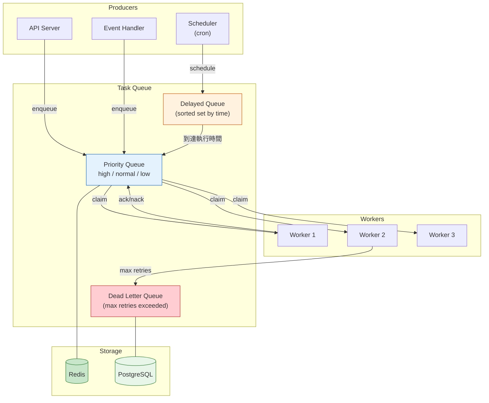
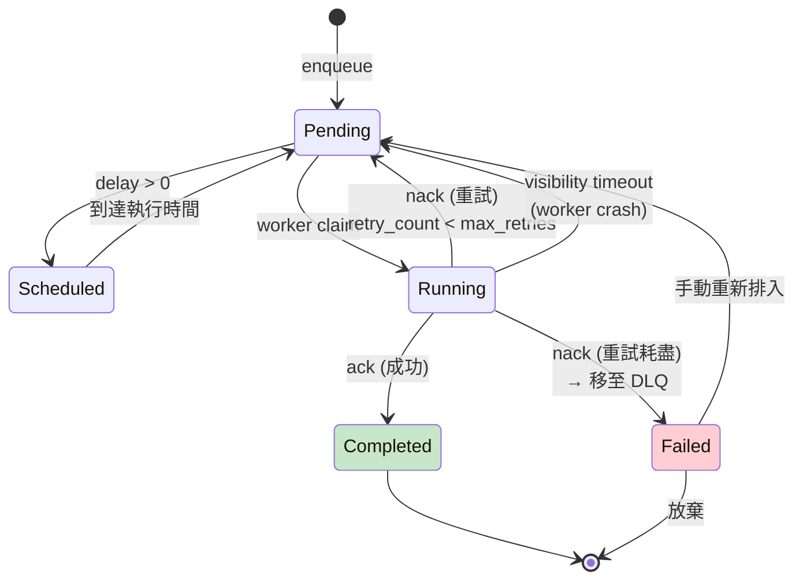
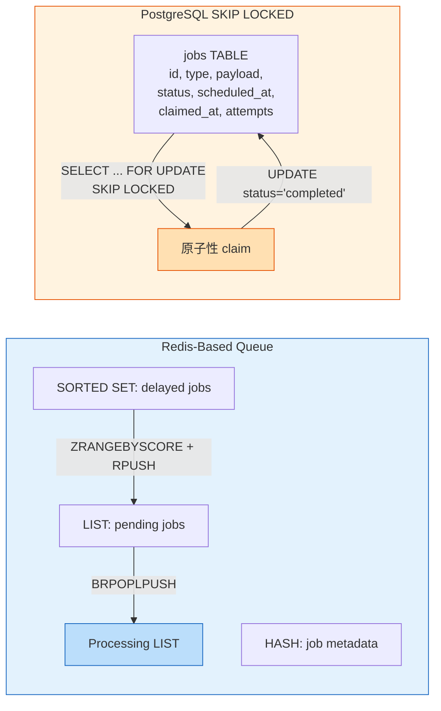

# Background Job & Task Queue / 背景任務與工作佇列

## Intent / 意圖

背景任務與工作佇列的核心問題是**如何將耗時的、非同步的、可延遲的工作從主要請求路徑中分離出來，在不阻塞使用者回應的前提下可靠地執行這些工作——即使工作失敗也能安全重試、即使 worker 崩潰也不會丟失任務**。在現代 web 應用中，許多操作不適合在 HTTP 請求的生命週期內同步完成——發送 email、處理影片、生成報表、同步第三方 API——這些工作應該被放入佇列中由背景 worker 非同步處理。

---

## Problem / 問題情境

**場景一：同步發送 Email 導致 API 延遲** — 電商平台在使用者下單後同步呼叫 SendGrid API 發送訂單確認信。某天 SendGrid 的 API 延遲從 200ms 飆升至 5 秒（因 SendGrid 內部故障）。結果所有下單請求的回應時間從 300ms 變成 5.3 秒——使用者在結帳頁面等到逾時。而 email 發送是否成功根本不影響訂單本身。根本原因：將非關鍵的 I/O 操作（email）放在關鍵請求路徑中。

**場景二：Worker 崩潰導致任務遺失** — 報表生成系統從 Redis list 中 `LPOP` 取出任務，開始處理。Worker 在處理到一半時因 OOM 被 K8s 殺掉——這個任務從 Redis 中已被移除，但尚未完成。沒有重試機制，報表永遠不會被生成。使用者反覆按「重新生成」但前一個任務已經消失。根本原因：使用 LPOP 而非原子性的 claim + ack 機制——任務在 consumer 崩潰時遺失。

**場景三：重試造成重複處理** — 通知系統的 worker 從佇列中取出「發送推播通知」任務，呼叫 FCM API 發送成功，但在回寫 ack 時網路瞬斷——任務未被確認完成。佇列在 visibility timeout 後將任務重新排入，另一個 worker 再次發送——使用者收到兩則完全相同的推播通知。根本原因：缺乏冪等性設計（idempotent job execution）。

**場景四：無限重試的 poison message** — 任務佇列中有一個格式錯誤的 JSON payload（producer 的 bug）。Worker 每次取出都因 JSON parse error 而 nack（not acknowledge）。佇列在 retry delay 後重新排入。這個壞任務被無限重試——佔用 worker 資源，阻塞佇列中的其他正常任務。佇列積壓到 10 萬條。根本原因：缺乏 dead letter queue（DLQ）和 max retry 限制。

---

## Core Concepts / 核心概念

### Task Queue vs Message Queue / 工作佇列 vs 訊息佇列

**Task Queue** 的語意是「有一個工作需要被某個 worker 執行一次」——強調的是**任務的可靠執行**。Task Queue 通常有：任務狀態追蹤（pending → running → completed/failed）、重試策略、延遲執行、優先級、結果回傳。代表：Sidekiq、Celery、Bull。

**Message Queue** 的語意是「有一則訊息需要被消費者處理」——強調的是**訊息的可靠傳遞**。Message Queue 通常有：發佈/訂閱（一則訊息被多個 consumer group 消費）、消費者群組、offset 管理。代表：Kafka、RabbitMQ、SQS。

兩者有大量重疊，但設計傾向不同。Task Queue 更適合「需要精確追蹤每個任務的狀態和結果」的場景。

### Job Lifecycle / 任務生命週期

一個 job 的完整生命週期：

1. **Enqueue（入列）**：Producer 將 job payload 放入佇列。Job 進入 `pending` 狀態。
2. **Claim（認領）**：Worker 從佇列中原子性地取出一個 job 並標記為 `running`。在 claim 的瞬間，其他 worker 不會看到這個 job。
3. **Execute（執行）**：Worker 執行 job 的業務邏輯。這可能涉及外部 API 呼叫、資料庫操作等。
4. **Ack / Nack（確認/拒絕）**：
   - **Ack**：job 成功完成，從佇列中永久移除，狀態變為 `completed`。
   - **Nack**：job 失敗，根據重試策略決定是重新排入佇列還是移至 DLQ。
5. **Timeout（逾時）**：如果 worker 在 visibility timeout 內未 ack/nack，佇列假設 worker 已崩潰，將 job 重新排入（狀態變回 `pending`）。

### Delayed / Scheduled Job / 延遲/排程任務

不立即執行的任務——指定在未來某個時間點才對 worker 可見。常見用途：「30 分鐘後檢查訂單是否已付款，未付款則自動取消」、「每天早上 8 點發送日報」。實作方式：Redis 的 sorted set（score = 執行時間戳）、PostgreSQL 的 `scheduled_at` 欄位 + 定期輪詢。

### Exponential Backoff with Jitter / 指數退避加隨機擾動

任務失敗後的重試間隔策略。**指數退避**：每次重試間隔翻倍（1s → 2s → 4s → 8s → ...）。**Jitter**：在退避間隔上加入隨機擾動，避免大量失敗的任務在同一時間集中重試（thundering herd）。公式：`delay = min(base * 2^attempt + random(0, base), max_delay)`。

### Dead Letter Queue (DLQ) / 死信佇列

當一個 job 重試超過 max_retries 次後仍然失敗，將其移至 DLQ。DLQ 中的 job 不會被自動重試——需要人工介入檢查失敗原因（查看 error log、修復 bug、手動重新排入）。DLQ 是防止 poison message 無限重試、佔用 worker 資源的關鍵安全機制。

### Job Priority / 任務優先級

不同類型的 job 有不同的處理優先級。例如：「發送密碼重設 email」的優先級高於「生成月度報表」。實作方式：(1) 多個佇列 + 加權輪詢（priority queue 永遠先處理高優先級佇列）；(2) 單一佇列 + priority 欄位 + 排序取出。

### Idempotent Job / 冪等任務

一個 job 被執行多次與執行一次的結果相同。由於 at-least-once delivery 的特性（worker crash 後 job 會被重新排入），worker 必須設計為冪等的。常見策略：(1) 使用 idempotency key（deduplication ID）——job 表中記錄已完成的 job ID，重複的 job 直接跳過；(2) 操作本身冪等——如 `UPSERT` 而非 `INSERT`、使用 `IF NOT EXISTS` 條件。

### At-Least-Once vs Exactly-Once Delivery / 至少一次 vs 精確一次

**At-least-once**：確保 job 至少被處理一次，但可能被重複處理（worker crash → job redelivery → 重複執行）。大部分 task queue 都是 at-least-once。

**Exactly-once**：確保 job 恰好被處理一次。在分散式系統中**真正的 exactly-once 幾乎不可能**——通常的做法是 at-least-once + 冪等消費者 = **effectively exactly-once**。

### Visibility Timeout / 可見性逾時

Job 被 worker claim 後的「鎖定時間」。在這段時間內，其他 worker 看不到這個 job。如果 worker 在 visibility timeout 內未完成處理（crash 或處理太慢），job 自動恢復為 pending 狀態，可被其他 worker claim。設定太短：正常處理中的 job 被重複 claim；設定太長：crash 的 worker 延遲 recovery 時間。

---

## Architecture / 架構

### Task Queue 完整架構



### Job 狀態機



### Redis-Based Queue vs PostgreSQL SKIP LOCKED



---

## How It Works / 運作原理

### Redis-Based Task Queue（Sidekiq/Bull 模式）

1. **Enqueue**：Producer 使用 `LPUSH queue:default <job_json>` 將 job 放入 Redis list。Job JSON 包含 `{id, type, payload, created_at, max_retries}`。

2. **Delayed Job**：延遲任務使用 `ZADD queue:delayed <execute_at_unix> <job_json>` 放入 sorted set。一個 scheduler goroutine 定期（每秒）執行 `ZRANGEBYSCORE queue:delayed -inf <now>`，將到期的 job 移至 pending list。

3. **Claim（原子性取出）**：Worker 使用 `BRPOPLPUSH queue:default queue:processing` 原子性地將 job 從 pending list 移至 processing list。`BRPOPLPUSH` 是阻塞操作——如果佇列為空，worker 會等待（最多 timeout 秒）。同時設定 `HSET job:<id> claimed_at <now>` 記錄 claim 時間。

4. **Execute**：Worker 反序列化 job payload，根據 `type` 欄位找到對應的 handler 並執行。

5. **Ack（成功）**：`LREM queue:processing 1 <job_json>` 從 processing list 移除 job。`HSET job:<id> status completed`。

6. **Nack（失敗 + 重試）**：計算下次重試時間（exponential backoff + jitter），`ZADD queue:delayed <retry_at> <job_json_with_incremented_attempts>`。`LREM queue:processing 1 <job_json>` 從 processing list 移除。

7. **Dead Letter**：如果 `attempts >= max_retries`，將 job 移至 `queue:dead` list 而非重新排入。

8. **Crash Recovery**：一個 monitor goroutine 定期檢查 processing list 中是否有超過 visibility timeout 的 job（`HGET job:<id> claimed_at` 超過閾值）。如果有，將其移回 pending list。

### PostgreSQL SKIP LOCKED 模式

1. **Enqueue**：`INSERT INTO jobs (id, type, payload, status, scheduled_at, attempts) VALUES (..., 'pending', NOW(), 0);`

2. **Claim（核心）**：使用 `FOR UPDATE SKIP LOCKED` 原子性地取得並鎖定一個 job：
```sql
UPDATE jobs
SET status = 'running', claimed_at = NOW()
WHERE id = (
    SELECT id FROM jobs
    WHERE status = 'pending'
    AND scheduled_at <= NOW()
    ORDER BY priority DESC, scheduled_at ASC
    LIMIT 1
    FOR UPDATE SKIP LOCKED
)
RETURNING *;
```
`SKIP LOCKED` 確保多個 worker 同時 claim 時不會互相阻塞——已被其他 transaction 鎖定的行會被跳過。

3. **Ack**：`UPDATE jobs SET status = 'completed', completed_at = NOW() WHERE id = ?;`

4. **Nack + Retry**：`UPDATE jobs SET status = 'pending', scheduled_at = NOW() + interval '...' * (2 ^ attempts), attempts = attempts + 1 WHERE id = ?;`

5. **Dead Letter**：在 claim 時檢查 `attempts < max_retries`，超過閾值的 job 直接標記為 `status = 'dead'`。

6. **Crash Recovery**：定期查詢 `status = 'running' AND claimed_at < NOW() - interval '5 minutes'`，將這些 job 重置為 `pending`。

---

## Rust 實作

以下實作使用 Rust + bb8-redis + tokio，展示 Redis-based task queue 的完整設計。

```rust
// Cargo.toml dependencies:
// tokio = { version = "1", features = ["full"] }
// bb8 = "0.9"
// bb8-redis = "0.18"
// redis = { version = "0.27", features = ["tokio-comp", "connection-manager"] }
// serde = { version = "1", features = ["derive"] }
// serde_json = "1"
// uuid = { version = "1", features = ["v4", "serde"] }
// chrono = { version = "0.4", features = ["serde"] }
// rand = "0.8"

use bb8_redis::{bb8, RedisConnectionManager};
use redis::AsyncCommands;
use serde::{Deserialize, Serialize};
use std::collections::HashMap;
use std::sync::Arc;
use std::time::Duration;
use uuid::Uuid;

// ── Job 定義 ───────────────────────────────────────────────────

/// Job 代表一個背景任務
#[derive(Debug, Clone, Serialize, Deserialize)]
struct Job {
    id: String,
    job_type: String,
    payload: serde_json::Value,
    priority: i32,       // 數字越大優先級越高
    max_retries: u32,
    attempts: u32,
    created_at: i64,     // Unix timestamp
    scheduled_at: i64,   // 預計執行時間
    #[serde(skip_serializing_if = "Option::is_none")]
    error: Option<String>,
}

impl Job {
    fn new(job_type: &str, payload: serde_json::Value) -> Self {
        let now = chrono::Utc::now().timestamp();
        Self {
            id: Uuid::new_v4().to_string(),
            job_type: job_type.to_string(),
            payload,
            priority: 0,
            max_retries: 3,
            attempts: 0,
            created_at: now,
            scheduled_at: now,
            error: None,
        }
    }

    fn with_delay(mut self, delay: Duration) -> Self {
        self.scheduled_at = chrono::Utc::now().timestamp() + delay.as_secs() as i64;
        self
    }

    fn with_priority(mut self, priority: i32) -> Self {
        self.priority = priority;
        self
    }

    fn with_max_retries(mut self, max_retries: u32) -> Self {
        self.max_retries = max_retries;
        self
    }
}

// ── Job 執行結果 ──────────────────────────────────────────────

#[derive(Debug)]
enum JobResult {
    Success,
    Failure(String), // 錯誤訊息
    Retry(String),   // 需要重試的錯誤訊息
}

// ── TaskQueue: Redis-Based 工作佇列 ───────────────────────────

type RedisPool = bb8::Pool<RedisConnectionManager>;

/// TaskQueue Redis-based task queue
struct TaskQueue {
    pool: RedisPool,
    queue_name: String,
    processing_key: String,
    delayed_key: String,
    dead_key: String,
    visibility_timeout: Duration,
}

impl TaskQueue {
    fn new(pool: RedisPool, queue_name: &str) -> Self {
        Self {
            pool,
            queue_name: format!("queue:{}", queue_name),
            processing_key: format!("queue:{}:processing", queue_name),
            delayed_key: format!("queue:{}:delayed", queue_name),
            dead_key: format!("queue:{}:dead", queue_name),
            visibility_timeout: Duration::from_secs(300), // 5 分鐘
        }
    }

    /// Enqueue: 將 job 放入佇列
    async fn enqueue(&self, job: &Job) -> Result<(), Box<dyn std::error::Error>> {
        let mut conn = self.pool.get().await?;
        let job_json = serde_json::to_string(job)?;

        let now = chrono::Utc::now().timestamp();

        if job.scheduled_at > now {
            // Delayed job: 放入 sorted set
            redis::cmd("ZADD")
                .arg(&self.delayed_key)
                .arg(job.scheduled_at)
                .arg(&job_json)
                .query_async::<()>(&mut *conn)
                .await?;
            println!(
                "[ENQUEUE] Delayed job {} (type: {}) scheduled at {}",
                job.id, job.job_type, job.scheduled_at
            );
        } else {
            // Immediate job: 放入 list
            conn.lpush::<_, _, ()>(&self.queue_name, &job_json).await?;
            println!(
                "[ENQUEUE] Job {} (type: {}) enqueued",
                job.id, job.job_type
            );
        }

        // 記錄 job metadata
        let meta_key = format!("job:{}", job.id);
        conn.hset::<_, _, _, ()>(&meta_key, "status", "pending").await?;
        conn.expire::<_, ()>(&meta_key, 86400).await?; // 24 小時過期

        Ok(())
    }

    /// Claim: 原子性地從佇列中取出一個 job
    async fn claim(&self) -> Result<Option<Job>, Box<dyn std::error::Error>> {
        let mut conn = self.pool.get().await?;

        // BRPOPLPUSH: 從 pending list 原子性移至 processing list
        // 如果佇列為空，阻塞等待最多 5 秒
        let result: Option<String> = redis::cmd("BRPOPLPUSH")
            .arg(&self.queue_name)
            .arg(&self.processing_key)
            .arg(5) // timeout 5 秒
            .query_async(&mut *conn)
            .await?;

        match result {
            Some(job_json) => {
                let job: Job = serde_json::from_str(&job_json)?;

                // 記錄 claim 時間
                let meta_key = format!("job:{}", job.id);
                conn.hset::<_, _, _, ()>(&meta_key, "status", "running").await?;
                conn.hset::<_, _, _, ()>(
                    &meta_key,
                    "claimed_at",
                    chrono::Utc::now().timestamp().to_string(),
                )
                .await?;

                println!(
                    "[CLAIM] Job {} (type: {}, attempt: {}/{})",
                    job.id, job.job_type, job.attempts + 1, job.max_retries
                );
                Ok(Some(job))
            }
            None => Ok(None), // 佇列為空
        }
    }

    /// Ack: 確認 job 完成
    async fn ack(&self, job: &Job) -> Result<(), Box<dyn std::error::Error>> {
        let mut conn = self.pool.get().await?;
        let job_json = serde_json::to_string(job)?;

        // 從 processing list 移除
        conn.lrem::<_, _, ()>(&self.processing_key, 1, &job_json)
            .await?;

        // 更新 metadata
        let meta_key = format!("job:{}", job.id);
        conn.hset::<_, _, _, ()>(&meta_key, "status", "completed").await?;

        println!("[ACK] Job {} completed successfully", job.id);
        Ok(())
    }

    /// Nack: 拒絕 job（失敗 + 重試或移至 DLQ）
    async fn nack(
        &self,
        job: &Job,
        error_msg: &str,
    ) -> Result<(), Box<dyn std::error::Error>> {
        let mut conn = self.pool.get().await?;
        let job_json = serde_json::to_string(job)?;

        // 從 processing list 移除
        conn.lrem::<_, _, ()>(&self.processing_key, 1, &job_json)
            .await?;

        let mut retry_job = job.clone();
        retry_job.attempts += 1;
        retry_job.error = Some(error_msg.to_string());

        if retry_job.attempts >= retry_job.max_retries {
            // 超過最大重試次數 → Dead Letter Queue
            let dead_json = serde_json::to_string(&retry_job)?;
            conn.lpush::<_, _, ()>(&self.dead_key, &dead_json).await?;

            let meta_key = format!("job:{}", job.id);
            conn.hset::<_, _, _, ()>(&meta_key, "status", "dead").await?;

            println!(
                "[DLQ] Job {} moved to dead letter queue after {} attempts: {}",
                job.id, retry_job.attempts, error_msg
            );
        } else {
            // 計算重試延遲：exponential backoff + jitter
            let base_delay = 1.0_f64; // 1 秒
            let backoff = base_delay * (2.0_f64).powi(retry_job.attempts as i32);
            let jitter = rand::random::<f64>() * base_delay;
            let delay = (backoff + jitter).min(300.0); // 最大 5 分鐘

            retry_job.scheduled_at =
                chrono::Utc::now().timestamp() + delay as i64;

            let retry_json = serde_json::to_string(&retry_job)?;

            // 放入 delayed queue
            redis::cmd("ZADD")
                .arg(&self.delayed_key)
                .arg(retry_job.scheduled_at)
                .arg(&retry_json)
                .query_async::<()>(&mut *conn)
                .await?;

            println!(
                "[NACK] Job {} will retry in {:.1}s (attempt {}/{}): {}",
                job.id, delay, retry_job.attempts, retry_job.max_retries, error_msg
            );
        }

        Ok(())
    }

    /// Promote Delayed: 將到期的 delayed job 移至 pending queue
    async fn promote_delayed_jobs(&self) -> Result<u32, Box<dyn std::error::Error>> {
        let mut conn = self.pool.get().await?;
        let now = chrono::Utc::now().timestamp();

        // 取出所有到期的 delayed jobs
        let jobs: Vec<String> = redis::cmd("ZRANGEBYSCORE")
            .arg(&self.delayed_key)
            .arg("-inf")
            .arg(now)
            .query_async(&mut *conn)
            .await?;

        let count = jobs.len() as u32;

        for job_json in &jobs {
            // 移至 pending queue
            conn.lpush::<_, _, ()>(&self.queue_name, job_json).await?;
            // 從 delayed set 移除
            redis::cmd("ZREM")
                .arg(&self.delayed_key)
                .arg(job_json)
                .query_async::<()>(&mut *conn)
                .await?;
        }

        if count > 0 {
            println!("[SCHEDULER] Promoted {} delayed jobs", count);
        }

        Ok(count)
    }

    /// Recover Stale: 恢復超過 visibility timeout 的 processing jobs
    async fn recover_stale_jobs(&self) -> Result<u32, Box<dyn std::error::Error>> {
        let mut conn = self.pool.get().await?;

        let processing_jobs: Vec<String> = conn
            .lrange(&self.processing_key, 0, -1)
            .await?;

        let mut recovered = 0u32;
        let now = chrono::Utc::now().timestamp();

        for job_json in &processing_jobs {
            let job: Job = serde_json::from_str(job_json)?;
            let meta_key = format!("job:{}", job.id);
            let claimed_at: Option<String> = conn
                .hget(&meta_key, "claimed_at")
                .await?;

            if let Some(claimed_str) = claimed_at {
                let claimed_ts: i64 = claimed_str.parse().unwrap_or(0);
                if now - claimed_ts > self.visibility_timeout.as_secs() as i64 {
                    // 超過 visibility timeout，恢復至 pending
                    conn.lrem::<_, _, ()>(&self.processing_key, 1, job_json)
                        .await?;
                    conn.lpush::<_, _, ()>(&self.queue_name, job_json).await?;
                    conn.hset::<_, _, _, ()>(&meta_key, "status", "pending").await?;
                    recovered += 1;
                    println!("[RECOVER] Job {} recovered from stale processing", job.id);
                }
            }
        }

        Ok(recovered)
    }

    /// Queue Stats: 取得佇列狀態
    async fn stats(&self) -> Result<HashMap<String, i64>, Box<dyn std::error::Error>> {
        let mut conn = self.pool.get().await?;

        let pending: i64 = conn.llen(&self.queue_name).await?;
        let processing: i64 = conn.llen(&self.processing_key).await?;
        let delayed: i64 = redis::cmd("ZCARD")
            .arg(&self.delayed_key)
            .query_async(&mut *conn)
            .await?;
        let dead: i64 = conn.llen(&self.dead_key).await?;

        let mut stats = HashMap::new();
        stats.insert("pending".to_string(), pending);
        stats.insert("processing".to_string(), processing);
        stats.insert("delayed".to_string(), delayed);
        stats.insert("dead".to_string(), dead);

        Ok(stats)
    }
}

// ── Job Handler Registry ──────────────────────────────────────

type JobHandler = Box<dyn Fn(&Job) -> JobResult + Send + Sync>;

struct JobHandlerRegistry {
    handlers: HashMap<String, JobHandler>,
}

impl JobHandlerRegistry {
    fn new() -> Self {
        Self {
            handlers: HashMap::new(),
        }
    }

    fn register<F>(&mut self, job_type: &str, handler: F)
    where
        F: Fn(&Job) -> JobResult + Send + Sync + 'static,
    {
        self.handlers
            .insert(job_type.to_string(), Box::new(handler));
    }

    fn execute(&self, job: &Job) -> JobResult {
        match self.handlers.get(&job.job_type) {
            Some(handler) => handler(job),
            None => JobResult::Failure(format!("unknown job type: {}", job.job_type)),
        }
    }
}

// ── Worker ────────────────────────────────────────────────────

async fn run_worker(
    queue: Arc<TaskQueue>,
    handlers: Arc<JobHandlerRegistry>,
    worker_id: u32,
) {
    println!("[WORKER-{}] Started", worker_id);

    loop {
        match queue.claim().await {
            Ok(Some(job)) => {
                let result = handlers.execute(&job);
                match result {
                    JobResult::Success => {
                        if let Err(e) = queue.ack(&job).await {
                            eprintln!("[WORKER-{}] Ack error: {}", worker_id, e);
                        }
                    }
                    JobResult::Failure(msg) => {
                        if let Err(e) = queue.nack(&job, &msg).await {
                            eprintln!("[WORKER-{}] Nack error: {}", worker_id, e);
                        }
                    }
                    JobResult::Retry(msg) => {
                        if let Err(e) = queue.nack(&job, &msg).await {
                            eprintln!("[WORKER-{}] Nack error: {}", worker_id, e);
                        }
                    }
                }
            }
            Ok(None) => {
                // 佇列為空，BRPOPLPUSH timeout 後繼續
            }
            Err(e) => {
                eprintln!("[WORKER-{}] Claim error: {}", worker_id, e);
                tokio::time::sleep(Duration::from_secs(1)).await;
            }
        }
    }
}

// ── Scheduler: 定期移動 delayed jobs ──────────────────────────

async fn run_scheduler(queue: Arc<TaskQueue>) {
    println!("[SCHEDULER] Started");
    loop {
        if let Err(e) = queue.promote_delayed_jobs().await {
            eprintln!("[SCHEDULER] Error: {}", e);
        }
        tokio::time::sleep(Duration::from_secs(1)).await;
    }
}

// ── Monitor: 定期恢復 stale jobs ──────────────────────────────

async fn run_monitor(queue: Arc<TaskQueue>) {
    println!("[MONITOR] Started");
    loop {
        if let Err(e) = queue.recover_stale_jobs().await {
            eprintln!("[MONITOR] Error: {}", e);
        }
        tokio::time::sleep(Duration::from_secs(30)).await;
    }
}

// ── 主程式 ─────────────────────────────────────────────────────

#[tokio::main]
async fn main() -> Result<(), Box<dyn std::error::Error>> {
    let manager = RedisConnectionManager::new("redis://127.0.0.1/")?;
    let pool = bb8::Pool::builder()
        .max_size(10)
        .build(manager)
        .await?;

    let queue = Arc::new(TaskQueue::new(pool, "default"));

    // 註冊 job handlers
    let mut handlers = JobHandlerRegistry::new();

    handlers.register("send_email", |job| {
        let to = job.payload.get("to").and_then(|v| v.as_str()).unwrap_or("");
        println!("  Sending email to: {}", to);
        // 模擬偶爾失敗
        if to.contains("fail") {
            JobResult::Retry("SMTP connection refused".to_string())
        } else {
            JobResult::Success
        }
    });

    handlers.register("generate_report", |job| {
        let report_type = job.payload.get("type").and_then(|v| v.as_str()).unwrap_or("");
        println!("  Generating {} report...", report_type);
        std::thread::sleep(std::time::Duration::from_millis(500)); // 模擬耗時操作
        JobResult::Success
    });

    let handlers = Arc::new(handlers);

    // 入列測試 jobs
    let email_job = Job::new(
        "send_email",
        serde_json::json!({"to": "user@example.com", "subject": "Welcome!"}),
    );
    queue.enqueue(&email_job).await?;

    let delayed_job = Job::new(
        "generate_report",
        serde_json::json!({"type": "monthly", "month": "2026-02"}),
    )
    .with_delay(Duration::from_secs(5))
    .with_priority(1);
    queue.enqueue(&delayed_job).await?;

    let fail_job = Job::new(
        "send_email",
        serde_json::json!({"to": "fail@example.com"}),
    )
    .with_max_retries(2);
    queue.enqueue(&fail_job).await?;

    // 顯示佇列狀態
    let stats = queue.stats().await?;
    println!("[STATS] {:?}", stats);

    // 啟動 scheduler、monitor 和 workers
    let scheduler_queue = queue.clone();
    tokio::spawn(run_scheduler(scheduler_queue));

    let monitor_queue = queue.clone();
    tokio::spawn(run_monitor(monitor_queue));

    // 啟動 2 個 workers
    for worker_id in 1..=2 {
        let worker_queue = queue.clone();
        let worker_handlers = handlers.clone();
        tokio::spawn(run_worker(worker_queue, worker_handlers, worker_id));
    }

    // 運行 15 秒後結束（展示用）
    tokio::time::sleep(Duration::from_secs(15)).await;

    let final_stats = queue.stats().await?;
    println!("[FINAL STATS] {:?}", final_stats);

    Ok(())
}

// Output:
// [ENQUEUE] Job abc-123 (type: send_email) enqueued
// [ENQUEUE] Delayed job def-456 (type: generate_report) scheduled at 1708300805
// [ENQUEUE] Job ghi-789 (type: send_email) enqueued
// [STATS] {"pending": 2, "processing": 0, "delayed": 1, "dead": 0}
// [SCHEDULER] Started
// [MONITOR] Started
// [WORKER-1] Started
// [WORKER-2] Started
// [CLAIM] Job ghi-789 (type: send_email, attempt: 1/2)
//   Sending email to: fail@example.com
// [NACK] Job ghi-789 will retry in 2.3s (attempt 1/2): SMTP connection refused
// [CLAIM] Job abc-123 (type: send_email, attempt: 1/3)
//   Sending email to: user@example.com
// [ACK] Job abc-123 completed successfully
// [SCHEDULER] Promoted 1 delayed jobs
// [CLAIM] Job def-456 (type: generate_report, attempt: 1/3)
//   Generating monthly report...
// [ACK] Job def-456 completed successfully
// [CLAIM] Job ghi-789 (type: send_email, attempt: 2/2)
//   Sending email to: fail@example.com
// [DLQ] Job ghi-789 moved to dead letter queue after 2 attempts: SMTP connection refused
// [FINAL STATS] {"pending": 0, "processing": 0, "delayed": 0, "dead": 1}
```

---

## Go 實作

以下實作使用 Go 1.24+ 標準庫 + PostgreSQL，展示基於 `SKIP LOCKED` 的 DB-based job queue。

```go
package main

import (
	"context"
	"database/sql"
	"encoding/json"
	"fmt"
	"log/slog"
	"math"
	"math/rand/v2"
	"os"
	"os/signal"
	"sync"
	"syscall"
	"time"

	_ "github.com/lib/pq"
)

// ── Job 定義 ───────────────────────────────────────────────────

// JobStatus 任務狀態
type JobStatus string

const (
	StatusPending   JobStatus = "pending"
	StatusRunning   JobStatus = "running"
	StatusCompleted JobStatus = "completed"
	StatusFailed    JobStatus = "failed"
	StatusDead      JobStatus = "dead"
)

// Job 代表一個背景任務
type Job struct {
	ID           string          `json:"id"`
	JobType      string          `json:"job_type"`
	Payload      json.RawMessage `json:"payload"`
	Priority     int             `json:"priority"`
	Status       JobStatus       `json:"status"`
	MaxRetries   int             `json:"max_retries"`
	Attempts     int             `json:"attempts"`
	ScheduledAt  time.Time       `json:"scheduled_at"`
	ClaimedAt    *time.Time      `json:"claimed_at,omitempty"`
	CompletedAt  *time.Time      `json:"completed_at,omitempty"`
	LastError    *string         `json:"last_error,omitempty"`
	CreatedAt    time.Time       `json:"created_at"`
}

// JobResult 任務執行結果
type JobResult struct {
	Success bool
	Error   string
	Retry   bool // true = 可重試，false = 永久失敗
}

// ── Job Handler ───────────────────────────────────────────────

// JobHandler 任務處理函數
type JobHandler func(ctx context.Context, job *Job) JobResult

// ── TaskQueue: PostgreSQL SKIP LOCKED ─────────────────────────

// TaskQueue PostgreSQL-based 工作佇列
type TaskQueue struct {
	db               *sql.DB
	handlers         map[string]JobHandler
	mu               sync.RWMutex
	visibilityTimeout time.Duration
}

// NewTaskQueue 建立新的 TaskQueue
func NewTaskQueue(db *sql.DB) *TaskQueue {
	return &TaskQueue{
		db:               db,
		handlers:         make(map[string]JobHandler),
		visibilityTimeout: 5 * time.Minute,
	}
}

// RegisterHandler 註冊 job handler
func (tq *TaskQueue) RegisterHandler(jobType string, handler JobHandler) {
	tq.mu.Lock()
	defer tq.mu.Unlock()
	tq.handlers[jobType] = handler
}

// Enqueue 將 job 放入佇列
func (tq *TaskQueue) Enqueue(ctx context.Context, jobType string, payload any, opts ...JobOption) (*Job, error) {
	payloadJSON, err := json.Marshal(payload)
	if err != nil {
		return nil, fmt.Errorf("marshal payload: %w", err)
	}

	job := &Job{
		JobType:     jobType,
		Payload:     payloadJSON,
		Priority:    0,
		MaxRetries:  3,
		ScheduledAt: time.Now(),
	}

	for _, opt := range opts {
		opt(job)
	}

	err = tq.db.QueryRowContext(ctx,
		`INSERT INTO jobs (job_type, payload, priority, status, max_retries, scheduled_at, created_at)
		 VALUES ($1, $2, $3, 'pending', $4, $5, NOW())
		 RETURNING id, created_at`,
		job.JobType, job.Payload, job.Priority, job.MaxRetries, job.ScheduledAt,
	).Scan(&job.ID, &job.CreatedAt)

	if err != nil {
		return nil, fmt.Errorf("insert job: %w", err)
	}

	slog.Info("Job enqueued",
		"job_id", job.ID,
		"job_type", job.JobType,
		"scheduled_at", job.ScheduledAt,
	)
	return job, nil
}

// Claim 原子性地取出一個 job（使用 SKIP LOCKED）
func (tq *TaskQueue) Claim(ctx context.Context) (*Job, error) {
	tx, err := tq.db.BeginTx(ctx, nil)
	if err != nil {
		return nil, fmt.Errorf("begin tx: %w", err)
	}
	defer tx.Rollback() //nolint:errcheck

	var job Job
	var lastError sql.NullString
	err = tx.QueryRowContext(ctx,
		`UPDATE jobs
		 SET status = 'running', claimed_at = NOW(), attempts = attempts + 1
		 WHERE id = (
			 SELECT id FROM jobs
			 WHERE status = 'pending'
			 AND scheduled_at <= NOW()
			 AND attempts < max_retries
			 ORDER BY priority DESC, scheduled_at ASC
			 LIMIT 1
			 FOR UPDATE SKIP LOCKED
		 )
		 RETURNING id, job_type, payload, priority, status,
		           max_retries, attempts, scheduled_at,
		           claimed_at, last_error, created_at`,
	).Scan(
		&job.ID, &job.JobType, &job.Payload, &job.Priority, &job.Status,
		&job.MaxRetries, &job.Attempts, &job.ScheduledAt,
		&job.ClaimedAt, &lastError, &job.CreatedAt,
	)

	if err == sql.ErrNoRows {
		return nil, nil // 佇列為空
	}
	if err != nil {
		return nil, fmt.Errorf("claim job: %w", err)
	}

	if lastError.Valid {
		job.LastError = &lastError.String
	}

	if err := tx.Commit(); err != nil {
		return nil, fmt.Errorf("commit: %w", err)
	}

	slog.Info("Job claimed",
		"job_id", job.ID,
		"job_type", job.JobType,
		"attempt", fmt.Sprintf("%d/%d", job.Attempts, job.MaxRetries),
	)
	return &job, nil
}

// Ack 確認 job 完成
func (tq *TaskQueue) Ack(ctx context.Context, jobID string) error {
	_, err := tq.db.ExecContext(ctx,
		`UPDATE jobs SET status = 'completed', completed_at = NOW()
		 WHERE id = $1`,
		jobID,
	)
	if err != nil {
		return fmt.Errorf("ack job: %w", err)
	}

	slog.Info("Job completed", "job_id", jobID)
	return nil
}

// Nack 拒絕 job（重試或移至 DLQ）
func (tq *TaskQueue) Nack(ctx context.Context, job *Job, errMsg string) error {
	if job.Attempts >= job.MaxRetries {
		// 超過最大重試次數 → Dead
		_, err := tq.db.ExecContext(ctx,
			`UPDATE jobs SET status = 'dead', last_error = $1
			 WHERE id = $2`,
			errMsg, job.ID,
		)
		if err != nil {
			return fmt.Errorf("dead letter: %w", err)
		}

		slog.Warn("Job moved to dead letter",
			"job_id", job.ID,
			"attempts", job.Attempts,
			"error", errMsg,
		)
		return nil
	}

	// 計算重試延遲：exponential backoff + jitter
	baseDelay := 1.0 // 1 秒
	backoff := baseDelay * math.Pow(2, float64(job.Attempts))
	jitter := rand.Float64() * baseDelay
	delay := math.Min(backoff+jitter, 300) // 最大 5 分鐘

	retryAt := time.Now().Add(time.Duration(delay * float64(time.Second)))

	_, err := tq.db.ExecContext(ctx,
		`UPDATE jobs SET status = 'pending', scheduled_at = $1, last_error = $2
		 WHERE id = $3`,
		retryAt, errMsg, job.ID,
	)
	if err != nil {
		return fmt.Errorf("nack job: %w", err)
	}

	slog.Info("Job scheduled for retry",
		"job_id", job.ID,
		"retry_in", fmt.Sprintf("%.1fs", delay),
		"attempt", fmt.Sprintf("%d/%d", job.Attempts, job.MaxRetries),
	)
	return nil
}

// RecoverStaleJobs 恢復超過 visibility timeout 的 running jobs
func (tq *TaskQueue) RecoverStaleJobs(ctx context.Context) (int64, error) {
	result, err := tq.db.ExecContext(ctx,
		`UPDATE jobs SET status = 'pending'
		 WHERE status = 'running'
		 AND claimed_at < NOW() - $1::interval`,
		fmt.Sprintf("%d seconds", int(tq.visibilityTimeout.Seconds())),
	)
	if err != nil {
		return 0, fmt.Errorf("recover stale jobs: %w", err)
	}

	count, _ := result.RowsAffected()
	if count > 0 {
		slog.Warn("Recovered stale jobs", "count", count)
	}
	return count, nil
}

// Stats 取得佇列統計
func (tq *TaskQueue) Stats(ctx context.Context) (map[string]int64, error) {
	rows, err := tq.db.QueryContext(ctx,
		`SELECT status, COUNT(*) FROM jobs GROUP BY status`,
	)
	if err != nil {
		return nil, fmt.Errorf("query stats: %w", err)
	}
	defer rows.Close()

	stats := make(map[string]int64)
	for rows.Next() {
		var status string
		var count int64
		if err := rows.Scan(&status, &count); err != nil {
			return nil, err
		}
		stats[status] = count
	}
	return stats, rows.Err()
}

// ── Job Options ───────────────────────────────────────────────

// JobOption 任務配置函數
type JobOption func(*Job)

// WithDelay 設定延遲執行
func WithDelay(d time.Duration) JobOption {
	return func(j *Job) {
		j.ScheduledAt = time.Now().Add(d)
	}
}

// WithPriority 設定優先級
func WithPriority(p int) JobOption {
	return func(j *Job) {
		j.Priority = p
	}
}

// WithMaxRetries 設定最大重試次數
func WithMaxRetries(n int) JobOption {
	return func(j *Job) {
		j.MaxRetries = n
	}
}

// ── Worker ────────────────────────────────────────────────────

// Worker 背景工作者
type Worker struct {
	id       int
	queue    *TaskQueue
	pollInterval time.Duration
}

// NewWorker 建立新的 Worker
func NewWorker(id int, queue *TaskQueue) *Worker {
	return &Worker{
		id:           id,
		queue:        queue,
		pollInterval: 1 * time.Second,
	}
}

// Run 啟動 worker 主迴圈
func (w *Worker) Run(ctx context.Context) {
	slog.Info("Worker started", "worker_id", w.id)

	for {
		select {
		case <-ctx.Done():
			slog.Info("Worker stopping", "worker_id", w.id)
			return
		default:
		}

		job, err := w.queue.Claim(ctx)
		if err != nil {
			slog.Error("Claim error", "worker_id", w.id, "error", err)
			time.Sleep(w.pollInterval)
			continue
		}

		if job == nil {
			// 佇列為空，等待後重試
			time.Sleep(w.pollInterval)
			continue
		}

		// 取得 handler
		w.queue.mu.RLock()
		handler, exists := w.queue.handlers[job.JobType]
		w.queue.mu.RUnlock()

		if !exists {
			w.queue.Nack(ctx, job, fmt.Sprintf("unknown job type: %s", job.JobType))
			continue
		}

		// 執行 job（帶 context timeout）
		jobCtx, cancel := context.WithTimeout(ctx, 5*time.Minute)
		result := handler(jobCtx, job)
		cancel()

		if result.Success {
			if err := w.queue.Ack(ctx, job.ID); err != nil {
				slog.Error("Ack error", "worker_id", w.id, "error", err)
			}
		} else {
			if err := w.queue.Nack(ctx, job, result.Error); err != nil {
				slog.Error("Nack error", "worker_id", w.id, "error", err)
			}
		}
	}
}

// ── Schema 初始化 ──────────────────────────────────────────────

func initializeDatabase(db *sql.DB) error {
	_, err := db.Exec(`
		CREATE TABLE IF NOT EXISTS jobs (
			id UUID PRIMARY KEY DEFAULT gen_random_uuid(),
			job_type VARCHAR(100) NOT NULL,
			payload JSONB NOT NULL DEFAULT '{}',
			priority INT NOT NULL DEFAULT 0,
			status VARCHAR(20) NOT NULL DEFAULT 'pending',
			max_retries INT NOT NULL DEFAULT 3,
			attempts INT NOT NULL DEFAULT 0,
			scheduled_at TIMESTAMP NOT NULL DEFAULT NOW(),
			claimed_at TIMESTAMP,
			completed_at TIMESTAMP,
			last_error TEXT,
			created_at TIMESTAMP NOT NULL DEFAULT NOW()
		);

		CREATE INDEX IF NOT EXISTS idx_jobs_claimable
		ON jobs (priority DESC, scheduled_at ASC)
		WHERE status = 'pending';

		CREATE INDEX IF NOT EXISTS idx_jobs_stale
		ON jobs (claimed_at)
		WHERE status = 'running';

		CREATE INDEX IF NOT EXISTS idx_jobs_type_status
		ON jobs (job_type, status);
	`)
	return err
}

// ── 主程式 ─────────────────────────────────────────────────────

func main() {
	logger := slog.New(slog.NewTextHandler(os.Stdout, &slog.HandlerOptions{
		Level: slog.LevelInfo,
	}))
	slog.SetDefault(logger)

	dsn := "postgres://localhost/job_queue_demo?sslmode=disable"
	db, err := sql.Open("postgres", dsn)
	if err != nil {
		slog.Error("Failed to connect to database", "error", err)
		os.Exit(1)
	}
	defer db.Close()

	db.SetMaxOpenConns(20)
	db.SetMaxIdleConns(10)

	if err := initializeDatabase(db); err != nil {
		slog.Error("Failed to initialize database", "error", err)
		os.Exit(1)
	}

	queue := NewTaskQueue(db)

	// 註冊 handlers
	queue.RegisterHandler("send_email", func(ctx context.Context, job *Job) JobResult {
		var payload struct {
			To      string `json:"to"`
			Subject string `json:"subject"`
		}
		json.Unmarshal(job.Payload, &payload)

		slog.Info("Sending email", "to", payload.To, "subject", payload.Subject)

		// 模擬偶爾失敗
		if payload.To == "fail@example.com" {
			return JobResult{Error: "SMTP connection refused", Retry: true}
		}

		time.Sleep(200 * time.Millisecond) // 模擬 API 呼叫
		return JobResult{Success: true}
	})

	queue.RegisterHandler("generate_report", func(ctx context.Context, job *Job) JobResult {
		var payload struct {
			Type  string `json:"type"`
			Month string `json:"month"`
		}
		json.Unmarshal(job.Payload, &payload)

		slog.Info("Generating report", "type", payload.Type, "month", payload.Month)
		time.Sleep(1 * time.Second) // 模擬耗時操作
		return JobResult{Success: true}
	})

	ctx, cancel := context.WithCancel(context.Background())
	defer cancel()

	// 入列測試 jobs
	queue.Enqueue(ctx, "send_email",
		map[string]string{"to": "user@example.com", "subject": "Welcome!"},
	)

	queue.Enqueue(ctx, "generate_report",
		map[string]string{"type": "monthly", "month": "2026-02"},
		WithDelay(3*time.Second),
		WithPriority(1),
	)

	queue.Enqueue(ctx, "send_email",
		map[string]string{"to": "fail@example.com", "subject": "This will fail"},
		WithMaxRetries(2),
	)

	// 啟動 stale job recovery goroutine
	go func() {
		ticker := time.NewTicker(30 * time.Second)
		defer ticker.Stop()
		for {
			select {
			case <-ctx.Done():
				return
			case <-ticker.C:
				queue.RecoverStaleJobs(ctx)
			}
		}
	}()

	// 啟動 3 個 workers
	var wg sync.WaitGroup
	for i := 1; i <= 3; i++ {
		wg.Add(1)
		worker := NewWorker(i, queue)
		go func() {
			defer wg.Done()
			worker.Run(ctx)
		}()
	}

	// 等待中斷信號
	sigCh := make(chan os.Signal, 1)
	signal.Notify(sigCh, syscall.SIGTERM, syscall.SIGINT)

	select {
	case sig := <-sigCh:
		slog.Info("Received signal, shutting down", "signal", sig)
		cancel()
	case <-time.After(20 * time.Second):
		slog.Info("Demo timeout, shutting down")
		cancel()
	}

	wg.Wait()

	stats, _ := queue.Stats(context.Background())
	slog.Info("Final queue stats", "stats", stats)
}

// Output:
// time=2026-02-18T10:00:00Z level=INFO msg="Job enqueued" job_id=abc-001 job_type=send_email
// time=2026-02-18T10:00:00Z level=INFO msg="Job enqueued" job_id=abc-002 job_type=generate_report scheduled_at=+3s
// time=2026-02-18T10:00:00Z level=INFO msg="Job enqueued" job_id=abc-003 job_type=send_email
// time=2026-02-18T10:00:00Z level=INFO msg="Worker started" worker_id=1
// time=2026-02-18T10:00:00Z level=INFO msg="Worker started" worker_id=2
// time=2026-02-18T10:00:00Z level=INFO msg="Worker started" worker_id=3
// time=2026-02-18T10:00:00Z level=INFO msg="Job claimed" job_id=abc-001 attempt=1/3
// time=2026-02-18T10:00:00Z level=INFO msg="Sending email" to=user@example.com
// time=2026-02-18T10:00:00Z level=INFO msg="Job completed" job_id=abc-001
// time=2026-02-18T10:00:00Z level=INFO msg="Job claimed" job_id=abc-003 attempt=1/2
// time=2026-02-18T10:00:00Z level=INFO msg="Sending email" to=fail@example.com
// time=2026-02-18T10:00:00Z level=INFO msg="Job scheduled for retry" job_id=abc-003 retry_in=2.3s
// time=2026-02-18T10:00:03Z level=INFO msg="Job claimed" job_id=abc-002 attempt=1/3
// time=2026-02-18T10:00:03Z level=INFO msg="Generating report" type=monthly month=2026-02
// time=2026-02-18T10:00:04Z level=INFO msg="Job completed" job_id=abc-002
// time=2026-02-18T10:00:02Z level=INFO msg="Job claimed" job_id=abc-003 attempt=2/2
// time=2026-02-18T10:00:02Z level=WARN msg="Job moved to dead letter" job_id=abc-003 attempts=2
// time=2026-02-18T10:00:20Z level=INFO msg="Final queue stats" stats={"completed":2,"dead":1}
```

---

## Rust vs Go 對照表

| 比較維度 | Rust (bb8-redis + tokio) | Go (database/sql + PostgreSQL) |
|---------|------------------------|-------------------------------|
| **佇列後端** | Redis（LIST + SORTED SET + HASH） | PostgreSQL（SKIP LOCKED） |
| **Claim 機制** | `BRPOPLPUSH`（原子性移動 + 阻塞等待） | `FOR UPDATE SKIP LOCKED`（行級鎖 + 跳過已鎖行） |
| **延遲任務** | Redis SORTED SET（score = 執行時間） | `scheduled_at` 欄位 + WHERE 過濾 |
| **連線池** | `bb8::Pool<RedisConnectionManager>` — async pool | `*sql.DB` — 標準庫內建 pool |
| **Worker 並行** | `tokio::spawn` — async task，輕量級 | goroutine — 輕量級，原生支援 |
| **Graceful Shutdown** | `tokio::select!` + 手動取消 | `context.WithCancel` + `sync.WaitGroup` |
| **持久性** | Redis 需配置 AOF/RDB 持久化，否則重啟遺失資料 | PostgreSQL 天然 ACID，資料不會遺失 |
| **效能** | 更高吞吐量（Redis 記憶體操作） | 較低吞吐量但更可靠（磁碟 I/O） |

---

## When to Use / 適用場景

1. **非同步 I/O 操作**：發送 Email/SMS/推播通知、呼叫第三方 API（支付閘道、物流追蹤）、檔案上傳至 S3。這些操作耗時且可能失敗，不應阻塞主請求路徑。Task queue 提供重試機制確保最終完成。

2. **計算密集型任務**：影片轉碼、圖片處理、PDF 生成、報表計算。這些任務可能需要數分鐘甚至數小時。使用 task queue 將其分散到多個 worker 上平行處理，避免佔用 web server 的資源。

3. **排程任務（取代 cron）**：每日報表、帳單結算、資料清理、訂閱到期檢查。Task queue 的 delayed job 功能可以取代系統 crontab，且具備重試、監控、日誌等優勢。

---

## When NOT to Use / 不適用場景

1. **需要即時回應的操作**：如果使用者需要立即看到操作結果（如「建立訂單後顯示訂單詳情」），將其放入 task queue 會導致延遲和不確定性。應同步處理關鍵路徑，只將非關鍵操作（如發送確認信）放入佇列。

2. **簡單的 fire-and-forget 操作**：如果操作失敗不需要重試、不需要追蹤狀態、不需要延遲執行，直接在 goroutine/tokio::spawn 中執行比引入完整的 task queue 更簡單。但要注意：goroutine 中的工作在程序重啟後會遺失。

3. **需要嚴格順序處理的場景**：大部分 task queue 不保證 FIFO 順序（尤其是有 priority 和 retry 的情況下）。如果需要嚴格按照入列順序處理，應使用 Kafka partition 或 single-consumer 模式。

---

## Real-World Examples / 真實世界案例

### Sidekiq — Ruby 生態最流行的 Task Queue

Sidekiq 是 Ruby on Rails 生態中最廣泛使用的背景任務處理框架：

- **Redis-based**：使用 Redis LIST 作為佇列後端。`BRPOPLPUSH` 實現原子性 claim。每個 queue 對應一個 Redis LIST。
- **Reliable Fetch**：Sidekiq Pro/Enterprise 使用 `RPOPLPUSH` 將 job 從 pending list 移至 processing sorted set。Worker 完成後 `ZREM` 移除。如果 worker crash，sorted set 中超時的 job 會被恢復。
- **Scheduled Jobs**：使用 Redis SORTED SET（score = 執行時間戳）。一個 poller thread 每 5 秒檢查到期的 scheduled jobs 並移至 pending queue。
- **Dead Letter**：超過最大重試次數的 job 移至 `dead` sorted set。管理者可在 Web UI 中查看、重試或刪除 dead jobs。
- **規模**：Shopify 使用 Sidekiq 每天處理數十億個背景任務。

### GitHub — PostgreSQL-based Job Queue

GitHub 的背景任務系統早期使用 Resque（Redis-based），後來轉向 PostgreSQL-based 的 job queue：

- **SKIP LOCKED**：使用 PostgreSQL 的 `SELECT ... FOR UPDATE SKIP LOCKED` 實現高效的並發 claim。
- **原因**：Redis-based queue 在 Redis 故障時會遺失任務。PostgreSQL 提供 ACID 保證——job 入列和業務操作可以在同一個 transaction 中完成（transactional outbox pattern）。
- **效能足夠**：GitHub 的任務量雖大，但 PostgreSQL 的 SKIP LOCKED 在合理的並發量下效能足夠。不需要為 job queue 單獨維運一套 Redis cluster。

---

## Interview Questions / 面試常見問題

### Q1: Task Queue 和 Message Queue 有什麼區別？分別適合什麼場景？

**答**：核心區別在於語意和關注點：

| 面向 | Task Queue | Message Queue |
|------|-----------|---------------|
| 語意 | 「有一個任務需要被執行」 | 「有一則訊息需要被傳遞」 |
| 消費模式 | 單一消費者（一個 job 只被一個 worker 處理） | 可以是 pub/sub（一則訊息被多個 consumer group 消費） |
| 狀態追蹤 | 有（pending → running → completed） | 通常沒有（只有 offset/ack） |
| 結果回傳 | 支援（可以查詢 job 的結果） | 通常不支援 |
| 延遲/排程 | 內建支援 | 通常不內建 |
| 代表 | Sidekiq、Celery、Bull | Kafka、RabbitMQ、SQS |

場景建議：「發送 Email」「生成報表」「影片轉碼」→ Task Queue。「事件通知」「微服務解耦」「資料串流」→ Message Queue。

### Q2: 什麼是 Visibility Timeout？設定太長或太短各有什麼問題？

**答**：Visibility Timeout 是 job 被 worker claim 後的「鎖定時間」。在此期間，其他 worker 看不到這個 job。

**太短**（例如 30 秒，但某些 job 需要 2 分鐘處理）：job 在還沒處理完就超時，佇列將其重新排入 pending。另一個 worker claim 同一個 job 並開始處理——導致重複執行。這就是為什麼 worker 必須是冪等的。

**太長**（例如 30 分鐘）：如果 worker 在 claim 後第 1 秒就 crash，這個 job 要等 30 分鐘才會被恢復。在這段時間內，使用者可能在等待報表生成但系統沒有任何進展。

最佳實踐：設定為「預期最長處理時間 * 2」。例如大部分 job 在 2 分鐘內完成 → visibility timeout 設為 5 分鐘。對於特別長的 job，支援 heartbeat（worker 定期延長 visibility timeout）。

### Q3: 如何確保 Task Queue 中的任務不會因為 Worker crash 而遺失？

**答**：關鍵是**原子性的 claim 機制**和**crash recovery**：

1. **原子性 claim**：不使用 `LPOP`（pop 後 crash 則 job 遺失），而使用 `BRPOPLPUSH`（Redis）或 `FOR UPDATE SKIP LOCKED`（PostgreSQL）。Job 在被 claim 後仍存在於 processing 狀態——crash 不會導致遺失。

2. **Visibility Timeout + Recovery**：一個 monitor 定期掃描 processing 狀態的 job，如果 `claimed_at` 超過 visibility timeout（代表 worker 可能已 crash），將其重置為 pending。

3. **持久化**：Redis 需配置 AOF（Append-Only File）持久化，否則 Redis 重啟後所有 job 遺失。PostgreSQL 天然 ACID，不需額外配置。

4. **Transactional Outbox**：將 job 入列和業務操作放在同一個 DB transaction 中。確保「訂單已建立 但 email job 未入列」或「email job 已入列 但訂單未建立」的不一致情況不會發生。

### Q4: 為什麼 Background Job 需要設計為冪等？如何實現冪等？

**答**：因為 Task Queue 通常提供 at-least-once 語意——以下場景都可能導致 job 被重複執行：

1. Worker 處理完 job 但在 ack 前 crash → job redelivery
2. Visibility timeout 太短 → job 在處理完成前被重新 claim
3. 網路分割導致 ack 失敗 → 佇列認為 job 未完成

冪等實現策略：
- **Idempotency Key**：job 表中記錄已完成的 job ID。處理 job 前先檢查 `IF NOT EXISTS`。
- **Database UPSERT**：使用 `INSERT ... ON CONFLICT DO UPDATE` 而非 `INSERT`。
- **Unique Constraint**：在結果表上建立唯一約束，重複插入會被 DB 拒絕。
- **External API 冪等**：使用第三方 API 的 idempotency key（如 Stripe 的 `Idempotency-Key` header）。

### Q5: Redis-based Queue 和 PostgreSQL SKIP LOCKED Queue 各有什麼優缺點？

**答**：

| 面向 | Redis-based | PostgreSQL SKIP LOCKED |
|------|------------|----------------------|
| 效能 | 極高（記憶體操作，10 萬+ ops/s） | 中高（磁碟 I/O，1 萬+ ops/s） |
| 持久性 | 需配置 AOF，仍可能遺失最後幾秒資料 | ACID 保證，零資料遺失 |
| Transactional Outbox | 不支援（Redis 和 DB 是不同系統） | 天然支援（同一個 DB transaction） |
| 維運複雜度 | 需要額外維運 Redis cluster | 利用現有 PostgreSQL，無額外基礎設施 |
| 延遲任務 | SORTED SET 天然支援 | `scheduled_at` 欄位 + 定期輪詢 |
| 監控 | Sidekiq Web UI、Bull Board | 自建或使用 pgAdmin |
| 適用規模 | 大規模（每秒數萬 job） | 中等規模（每秒數千 job） |

選擇建議：如果已有 PostgreSQL 且 job 量不超過每秒數千，用 PostgreSQL SKIP LOCKED（簡化架構）。如果需要極高吞吐量或已有 Redis，用 Redis-based queue。

---

## Pitfalls / 常見陷阱

### 陷阱一：使用 LPOP 導致 crash 時 job 遺失

```rust
// 錯誤（Rust/Redis）：LPOP 後 worker crash，job 永久遺失
let job_json: String = conn.lpop("queue:default", None).await?;
// 如果這裡 crash，job 已從 Redis 中移除，但尚未處理！

// 正確做法：使用 BRPOPLPUSH，job 移至 processing list
let job_json: Option<String> = redis::cmd("BRPOPLPUSH")
    .arg("queue:default")
    .arg("queue:processing")
    .arg(5)
    .query_async(&mut *conn)
    .await?;
// crash 後 job 仍在 processing list 中，可被 recovery 機制恢復
```

### 陷阱二：Go 中 goroutine 的背景任務在重啟後遺失

```go
// 錯誤（Go）：直接在 goroutine 中執行背景任務
func handleOrder(w http.ResponseWriter, r *http.Request) {
    order := createOrder(r)

    go sendConfirmationEmail(order) // 如果程式重啟，這個 email 永遠不會被發送！

    w.WriteHeader(http.StatusCreated)
}

// 正確做法：將任務放入持久化的佇列
func handleOrder(w http.ResponseWriter, r *http.Request) {
    tx, _ := db.BeginTx(r.Context(), nil)
    defer tx.Rollback()

    order := createOrderInTx(tx, r)

    // 在同一個 transaction 中入列（transactional outbox）
    queue.EnqueueInTx(tx, "send_email", map[string]string{
        "to": order.Email,
        "order_id": order.ID,
    })

    tx.Commit()
    w.WriteHeader(http.StatusCreated)
}
```

### 陷阱三：缺乏 Dead Letter Queue 導致 poison message 無限重試

```rust
// 錯誤（Rust）：沒有 max_retries 限制
async fn nack(&self, job: &Job, error_msg: &str) -> Result<()> {
    // 永遠重新排入！poison message 會被無限重試
    conn.lpush("queue:default", &job_json).await?;
    Ok(())
}

// 正確做法：檢查重試次數，超過閾值移至 DLQ
async fn nack(&self, job: &Job, error_msg: &str) -> Result<()> {
    let mut retry_job = job.clone();
    retry_job.attempts += 1;

    if retry_job.attempts >= retry_job.max_retries {
        conn.lpush("queue:dead", &serde_json::to_string(&retry_job)?).await?;
    } else {
        let delay = calculate_backoff(retry_job.attempts);
        conn.zadd("queue:delayed", retry_job.scheduled_at, &job_json).await?;
    }
    Ok(())
}
```

### 陷阱四：Exponential Backoff 沒有 Jitter

```go
// 錯誤（Go）：沒有 jitter，所有失敗的 job 在同一時間重試
delay := time.Duration(math.Pow(2, float64(attempts))) * time.Second
// 100 個 job 同時失敗 → 2 秒後 100 個 job 同時重試 → thundering herd

// 正確做法：加入隨機 jitter
baseDelay := 1.0
backoff := baseDelay * math.Pow(2, float64(attempts))
jitter := rand.Float64() * baseDelay
delay := time.Duration((backoff + jitter) * float64(time.Second))
// 100 個 job 的重試時間會分散在 2.0s ~ 3.0s 之間
```

### 陷阱五：PostgreSQL SKIP LOCKED 的 index 設計不當

```sql
-- 錯誤：沒有專門的 partial index，SKIP LOCKED 查詢需要掃描整張表
SELECT id FROM jobs
WHERE status = 'pending' AND scheduled_at <= NOW()
ORDER BY priority DESC, scheduled_at ASC
LIMIT 1 FOR UPDATE SKIP LOCKED;
-- 表中有 100 萬筆 completed/dead 的歷史記錄，每次 claim 都要掃描它們

-- 正確做法：建立 partial index，只索引 pending 狀態的 jobs
CREATE INDEX idx_jobs_claimable
ON jobs (priority DESC, scheduled_at ASC)
WHERE status = 'pending';
-- 只有 pending 的 jobs 被索引，claim 查詢極快
```

### 陷阱六：Rust 中 async handler 的 Send bound 問題

```rust
// 錯誤（Rust）：job handler 使用了 non-Send 型別
// tokio::spawn 要求 Future 必須是 Send
type JobHandler = Box<dyn Fn(&Job) -> JobResult>; // 沒有 Send + Sync bound！

tokio::spawn(async move {
    let result = handler(&job); // 編譯錯誤：handler 不是 Send
});

// 正確做法：加上 Send + Sync bound
type JobHandler = Box<dyn Fn(&Job) -> JobResult + Send + Sync>;
// 或使用 Arc 包裝
let handler: Arc<dyn Fn(&Job) -> JobResult + Send + Sync> = Arc::new(my_handler);
```

---

## Cross-references / 交叉引用

- [[36_concurrency_patterns]] — Worker pool 和 fan-out/fan-in 模式在 task queue 中的應用
- [[16_message_queue_fundamentals]] — Message Queue 的基本概念，與 Task Queue 的對比
- [[21_redis]] — Redis 資料結構（LIST、SORTED SET、HASH）在 task queue 中的使用
- [[19_idempotency_design]] — 冪等設計確保 at-least-once delivery 不會造成重複處理
- [[39_error_handling_retry]] — 錯誤處理與重試策略（exponential backoff、circuit breaker）
- [[17_kafka_deep_dive]] — Kafka 作為 message queue 的深入分析

---

## References / 參考資料

- Mike Perham. "Sidekiq." https://sidekiq.org/ — Ruby 生態最流行的 Redis-based task queue。
- PostgreSQL Documentation. "SELECT ... FOR UPDATE SKIP LOCKED." https://www.postgresql.org/docs/current/sql-select.html#SQL-FOR-UPDATE-SHARE
- AWS Documentation. "Amazon SQS Dead-Letter Queues." https://docs.aws.amazon.com/AWSSimpleQueueService/latest/SQSDeveloperGuide/sqs-dead-letter-queues.html
- Marc Brooker (AWS). "Exponential Backoff And Jitter." https://aws.amazon.com/blogs/architecture/exponential-backoff-and-jitter/
- GitHub Engineering. "Moving GitHub's Queues from Redis to Postgres." https://github.blog/2024-07-01-introducing-github-models/
