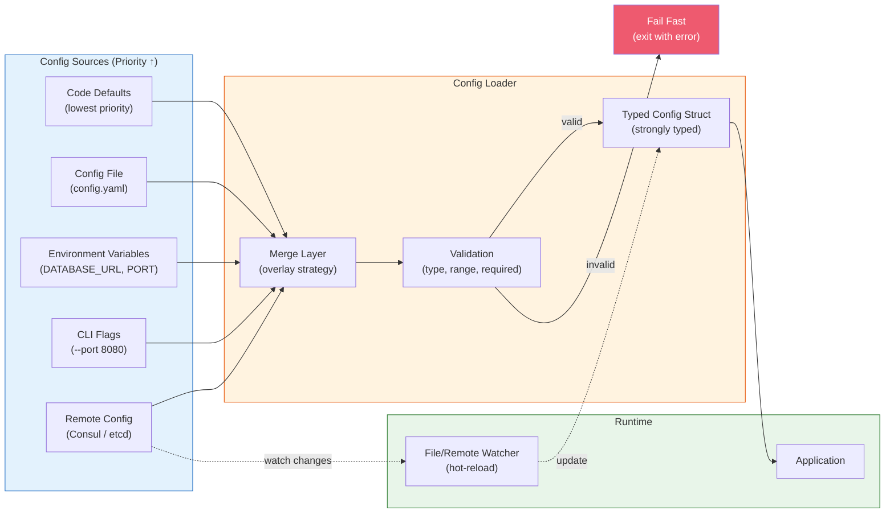
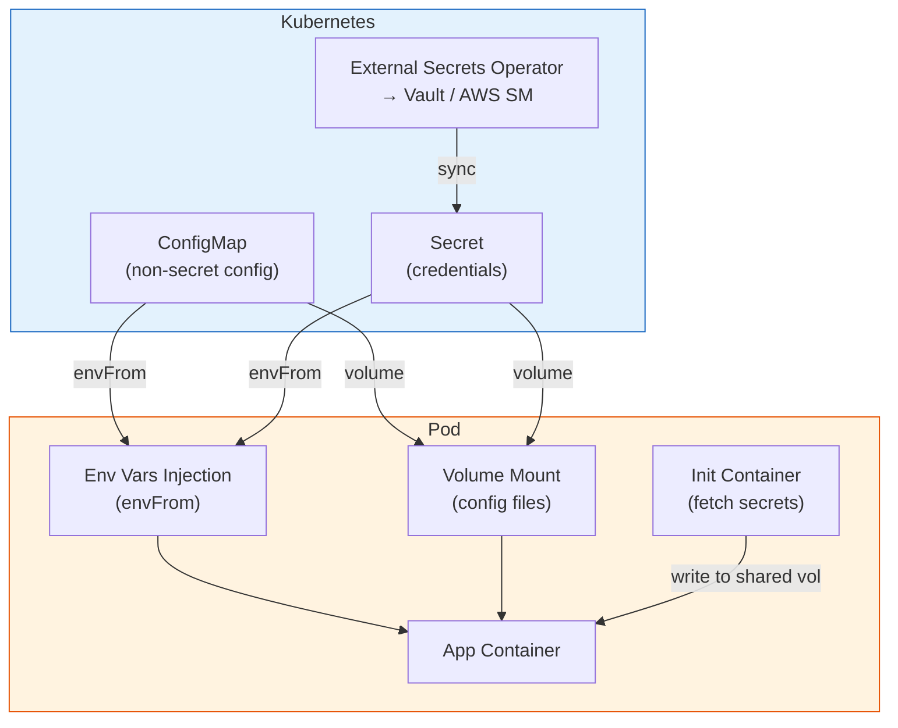
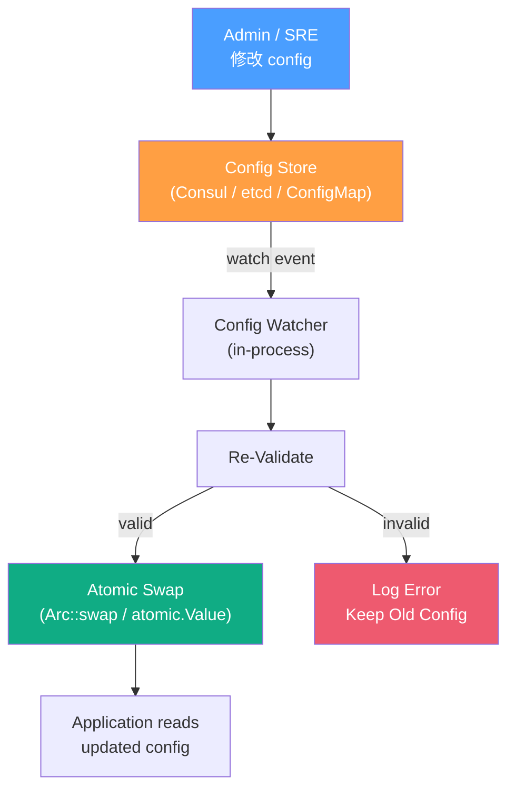

# Configuration Management & 12-Factor App / 組態管理與十二要素應用

## Intent / 意圖

組態管理（Configuration Management）是後端服務的基石之一——決定應用程式如何獲取資料庫連線字串、API key、feature flag 狀態等運行時設定。12-Factor App 的第三條原則（Config）明確要求：**嚴格分離組態與程式碼**，組態透過環境變數注入而非硬編碼在 source code 中。本篇從 12-Factor 原則出發，涵蓋組態的分層載入策略（defaults → file → env → CLI flags）、啟動時驗證、hot-reload、secrets 與非 secret config 的分離、K8s ConfigMap/Secret 模式，以及 Consul/etcd 等集中式 config store。

核心問題：**如何設計一個組態系統，讓同一份程式碼 artifact 在 dev、staging、production 三個環境中以不同的組態運行，同時確保組態變更可追蹤、可驗證、可即時生效？**

---

## Problem / 問題情境

**場景一：硬編碼組態導致的部署災難** — 開發者在 `main.go` 中寫死了 staging 資料庫連線字串 `postgres://staging-db:5432/app`。程式碼經過 code review 後合併並部署到 production——production 服務連向 staging 資料庫，寫入了數千筆生產資料到測試環境。若組態透過環境變數注入且 production 有獨立的 `DATABASE_URL`，這個災難不可能發生。

**場景二：Config 變更需要完整的部署週期** — 團隊需要將 rate limiter 的閾值從 1000 RPS 調整到 2000 RPS。目前的做法：修改 config file → commit → PR review → CI build → deploy to staging → verify → deploy to production。整個流程耗時 2 小時。若支援 hot-reload config（透過 config server 推送或 watch file change），只需在管理介面修改數值，30 秒內全服務生效。

**場景三：啟動時組態錯誤被延遲發現** — 服務啟動時未驗證組態完整性。缺少 `REDIS_URL` 環境變數，但直到第一個請求嘗試存取 Redis 時才 panic——此時服務已通過 health check 並接收了流量。若在啟動時執行 config validation（required fields、格式檢查、連線測試），可以在 Pod 進入 Ready 狀態前就 fail fast。

---

## Core Concepts / 核心概念

### 12-Factor App — Factor III: Config / 第三要素：組態

12-Factor App 對 config 的定義：**在不同 deployment 之間會變化的所有設定**。這包括：
- 資料庫、Redis、message queue 的連線資訊
- 第三方服務的 API credential
- Feature flag 狀態
- Per-deploy 的 rate limit、timeout 設定

**核心原則**：config 必須**嚴格與程式碼分離**。判斷標準：「如果我現在把 repo 開源，是否有任何 credential 會洩漏？」如果答案是 yes，那些值就不應該在程式碼中。

**爭議與務實**：12-Factor 建議所有 config 都透過環境變數。但在實務中，純環境變數有限制（無結構化、無型別、難以管理大量設定）。現代做法是**分層組態**——環境變數作為最高優先級的 override，搭配結構化的 config file。

### Configuration Hierarchy / 組態分層

組態的載入遵循**遞增優先級**原則——後載入的覆蓋先載入的：

```
Priority (lowest → highest):
1. Code Defaults     → 寫在程式碼中的預設值
2. Config File       → config.yaml / config.toml
3. Environment Vars  → DATABASE_URL, PORT
4. CLI Flags         → --port 8080 --debug
5. Remote Config     → Consul / etcd / Config Server（hot-reload）
```

這個順序確保：
- 開發環境不需要任何外部設定即可啟動（defaults 足夠）
- Production 環境透過 env vars 覆蓋所有敏感設定
- 運維可透過 remote config 即時調整而不需重新部署

### Config Validation at Startup / 啟動時組態驗證

**Fail Fast 原則**：服務啟動時應立即驗證所有組態的完整性和正確性。驗證包括：

1. **Required fields**：所有必填欄位是否存在
2. **Type check**：port 是否為數字、URL 是否格式正確
3. **Range check**：timeout 是否在合理範圍（0 < timeout < 300s）
4. **Connectivity test**（可選）：資料庫、Redis 是否可連線
5. **Consistency check**：若啟用了 feature X，其相關的 config Y 是否也有設定

驗證失敗應輸出**清晰的錯誤訊息**（指出哪個欄位、期望什麼值、實際是什麼）並立即退出。不應該 log warning 然後繼續啟動。

### Hot-Reload Config / 熱重載組態

某些組態需要在不重啟服務的情況下生效。實作方式：

| 方式 | 延遲 | 複雜度 | 適用場景 |
|------|------|--------|---------|
| **File Watch**（fsnotify） | 秒級 | 低 | K8s ConfigMap mount |
| **Polling**（定期讀取 remote） | 10-60 秒 | 低 | Consul KV / etcd |
| **Push**（SSE / gRPC stream） | 毫秒級 | 高 | 自建 config server |
| **Signal**（SIGHUP） | 即時 | 低 | Unix 傳統方式 |

**重要**：不是所有 config 都適合 hot-reload。連線池大小、listen port 等需要重啟才能生效。應明確區分 **static config**（需重啟）和 **dynamic config**（可 hot-reload）。

### Feature Flags vs Config / 功能旗標 vs 組態

| 維度 | Configuration | Feature Flag |
|------|--------------|--------------|
| 變更頻率 | 低（部署時或運維調整） | 高（隨時開關） |
| 目標受眾 | 全域生效 | 可針對特定使用者/群組 |
| 生命週期 | 永久存在 | 用完即刪（release flag） |
| 儲存 | env vars / config file / ConfigMap | 專用 flag service |
| 範例 | `DATABASE_URL`、`MAX_CONNECTIONS` | `enable_new_checkout`、`experiment_v2` |

### Secrets vs Non-Secret Config / 機密 vs 非機密組態

**機密組態**（Secrets）：API key、database password、TLS private key、encryption key。
- **絕對不能**出現在 config file、git repo、container image 中
- 透過 secrets manager 注入（Vault、AWS Secrets Manager、K8s Secret）
- 應支援 rotation（定期更換）且不需重啟服務

**非機密組態**：port、log level、timeout、feature flag state。
- 可以出現在 config file 和 git repo 中（甚至應該 version control）
- 透過 ConfigMap、config file、env vars 管理

### Kubernetes ConfigMap & Secret Patterns / K8s 組態模式

**ConfigMap**：儲存非機密的 key-value 組態或完整的設定檔。注入方式：
- **環境變數**：`envFrom.configMapRef` 將所有 key 注入為 env var
- **Volume mount**：將 ConfigMap 掛載為檔案，支援 auto-update（kubelet 定期同步）

**Secret**：Base64 編碼的機密資料。注入方式與 ConfigMap 相同，但有額外的存取控制（RBAC）。

**最佳實踐**：
- ConfigMap 變更後 Pod **不會自動重啟**（除非用 volume mount + file watch）
- 使用 `checksum/config` annotation 觸發 rolling update：

```yaml
metadata:
  annotations:
    checksum/config: {{ include (print $.Template.BasePath "/configmap.yaml") . | sha256sum }}
```

### Consul / etcd as Config Store / 集中式組態儲存

**Consul KV**：HashiCorp 的服務網格 + KV store。支援 watch（long polling）、ACL、transaction。適合需要跨服務共享 config 的場景。

**etcd**：Kubernetes 的底層 KV store。高可靠的分散式 KV，支援 watch（gRPC stream）。適合基礎設施級的 config。

**使用場景**：需要在數百個服務實例間同步組態變更，且要求秒級生效。

---

## Architecture / 架構

### Configuration Loading Pipeline



### Kubernetes Config Injection Patterns



### Hot-Reload Architecture



---

## How It Works / 運作原理

### 分層組態載入的完整流程

1. **定義 Config Struct**：使用強型別的結構體定義所有組態欄位，包含預設值、型別和驗證規則。例如 `struct AppConfig { port: u16, database_url: String, log_level: LogLevel, max_connections: u32 }`。

2. **載入 Code Defaults**：結構體的 `Default` 實作提供所有欄位的預設值。確保即使沒有任何外部 config source，服務也能啟動（至少在 dev 環境中）。

3. **載入 Config File**：搜尋 config file（`config.yaml`、`config.toml`）。搜尋路徑通常為：`./config.yaml` → `./config/` → `/etc/app/` → `$HOME/.config/app/`。File 中的值覆蓋 defaults。

4. **載入 Environment Variables**：掃描以特定 prefix 開頭的 env vars（如 `APP_PORT`、`APP_DATABASE_URL`）。Env vars 覆蓋 file 中的值。命名慣例：`APP_{FIELD_NAME}` 大寫加底線。

5. **載入 CLI Flags**：解析命令列參數（`--port 8080`、`--debug`）。CLI flags 是最高優先級的 local override（除了 remote config）。

6. **Validation**：檢查合併後的 config：
   - `port` 在 1-65535 之間
   - `database_url` 是有效的 URL 格式
   - `max_connections` > 0
   - 若 `tls_enabled = true`，`tls_cert_path` 和 `tls_key_path` 必須存在

7. **Freeze & Share**：驗證通過後，將 config 封裝為不可變的共享狀態（Rust: `Arc<AppConfig>`、Go: `atomic.Value` 或 `sync.RWMutex`），注入到 application context。

8. **Hot-Reload（可選）**：啟動背景 goroutine/task 監聽 config 變更（file watch 或 remote config poll）。收到變更時重新執行步驟 3-6，驗證通過後 atomic swap 更新共享 config。

### Config 的環境變數命名慣例

```
Struct Field Name    →  Environment Variable
--------------------    --------------------
port                 →  APP_PORT
database_url         →  APP_DATABASE_URL
redis.host           →  APP_REDIS__HOST (double underscore for nesting)
log_level            →  APP_LOG_LEVEL
max_idle_connections  →  APP_MAX_IDLE_CONNECTIONS
```

前綴 `APP_` 避免與系統 env vars 衝突。巢狀結構使用雙底線 `__` 分隔。

### Secrets Injection 的安全模式

```
開發環境：.env file（git ignored）→ dotenv library 載入
Staging ：K8s Secret（envFrom）→ 環境變數注入
Production：External Secrets Operator → Vault → K8s Secret → 環境變數
```

關鍵原則：
- Secrets 的 source of truth 在 Vault/AWS SM，不在 K8s
- K8s Secret 只是 Vault 的投影（projection），由 Operator 自動同步
- Application 不知道 secret 來自哪裡，只看到環境變數

---

## Rust 實作

使用 `config` crate 實作分層組態載入，搭配 env vars 和啟動時驗證。

```rust
// configuration.rs — config crate + serde + validation
// Cargo.toml dependencies:
// config = "0.14"
// serde = { version = "1", features = ["derive"] }
// serde_json = "1"
// tokio = { version = "1", features = ["full"] }
// axum = "0.8"
// tracing = "0.1"
// tracing-subscriber = "0.3"
// notify = "7"  // file watcher for hot-reload

use axum::{extract::State, routing::get, Json, Router};
use config::{Config, ConfigError, Environment, File};
use notify::{RecommendedWatcher, RecursiveMode, Watcher};
use serde::{Deserialize, Serialize};
use std::{
    net::SocketAddr,
    path::Path,
    sync::Arc,
    time::Duration,
};
use tokio::sync::watch;
use tracing::{error, info, warn};

// ---------- Config Struct ----------

#[derive(Debug, Clone, Deserialize, Serialize)]
pub struct AppConfig {
    #[serde(default = "default_port")]
    pub port: u16,

    #[serde(default = "default_host")]
    pub host: String,

    pub database_url: String,

    #[serde(default = "default_log_level")]
    pub log_level: String,

    #[serde(default)]
    pub redis: RedisConfig,

    #[serde(default)]
    pub server: ServerConfig,
}

#[derive(Debug, Clone, Deserialize, Serialize)]
pub struct RedisConfig {
    #[serde(default = "default_redis_url")]
    pub url: String,

    #[serde(default = "default_pool_size")]
    pub pool_size: u32,
}

#[derive(Debug, Clone, Deserialize, Serialize)]
pub struct ServerConfig {
    #[serde(default = "default_request_timeout_secs")]
    pub request_timeout_secs: u64,

    #[serde(default = "default_max_connections")]
    pub max_connections: u32,

    #[serde(default = "default_rate_limit_rps")]
    pub rate_limit_rps: u32,
}

// Default 函數
fn default_port() -> u16 { 3000 }
fn default_host() -> String { "0.0.0.0".to_string() }
fn default_log_level() -> String { "info".to_string() }
fn default_redis_url() -> String { "redis://127.0.0.1:6379".to_string() }
fn default_pool_size() -> u32 { 10 }
fn default_request_timeout_secs() -> u64 { 30 }
fn default_max_connections() -> u32 { 1000 }
fn default_rate_limit_rps() -> u32 { 100 }

impl Default for RedisConfig {
    fn default() -> Self {
        Self { url: default_redis_url(), pool_size: default_pool_size() }
    }
}

impl Default for ServerConfig {
    fn default() -> Self {
        Self {
            request_timeout_secs: default_request_timeout_secs(),
            max_connections: default_max_connections(),
            rate_limit_rps: default_rate_limit_rps(),
        }
    }
}

// ---------- Config Loading ----------

fn load_config() -> Result<AppConfig, ConfigError> {
    // 取得環境名稱（dev / staging / production）
    let run_env = std::env::var("APP_ENV").unwrap_or_else(|_| "dev".to_string());
    info!(environment = %run_env, "loading configuration");

    let config = Config::builder()
        // Layer 1: 基礎設定（always loaded）
        .add_source(File::with_name("config/default").required(false))
        // Layer 2: 環境特定設定（覆蓋 default）
        .add_source(File::with_name(&format!("config/{run_env}")).required(false))
        // Layer 3: 本地覆蓋（git ignored，開發者自訂）
        .add_source(File::with_name("config/local").required(false))
        // Layer 4: 環境變數（最高優先級）
        // APP_PORT=8080 → port = 8080
        // APP_DATABASE_URL=postgres://... → database_url = postgres://...
        // APP_REDIS__URL=redis://... → redis.url = redis://...
        .add_source(
            Environment::with_prefix("APP")
                .separator("__") // 雙底線分隔巢狀結構
                .try_parsing(true), // 自動解析數字和布林
        )
        .build()?;

    let app_config: AppConfig = config.try_deserialize()?;
    Ok(app_config)
}

// ---------- Config Validation ----------

#[derive(Debug)]
struct ValidationError {
    field: String,
    message: String,
}

fn validate_config(config: &AppConfig) -> Result<(), Vec<ValidationError>> {
    let mut errors = Vec::new();

    // Required fields
    if config.database_url.is_empty() {
        errors.push(ValidationError {
            field: "database_url".to_string(),
            message: "DATABASE_URL is required. Set APP_DATABASE_URL env var.".to_string(),
        });
    }

    // Range checks
    if config.port == 0 {
        errors.push(ValidationError {
            field: "port".to_string(),
            message: format!("port must be > 0, got {}", config.port),
        });
    }

    if config.server.request_timeout_secs == 0 || config.server.request_timeout_secs > 300 {
        errors.push(ValidationError {
            field: "server.request_timeout_secs".to_string(),
            message: format!(
                "request_timeout_secs must be in 1..300, got {}",
                config.server.request_timeout_secs
            ),
        });
    }

    if config.server.max_connections == 0 {
        errors.push(ValidationError {
            field: "server.max_connections".to_string(),
            message: "max_connections must be > 0".to_string(),
        });
    }

    // Format checks
    if !config.database_url.starts_with("postgres://")
        && !config.database_url.starts_with("postgresql://")
        && !config.database_url.is_empty()
    {
        errors.push(ValidationError {
            field: "database_url".to_string(),
            message: format!(
                "database_url must start with postgres://, got: {}...",
                &config.database_url[..config.database_url.len().min(20)]
            ),
        });
    }

    // Log level check
    let valid_levels = ["trace", "debug", "info", "warn", "error"];
    if !valid_levels.contains(&config.log_level.to_lowercase().as_str()) {
        errors.push(ValidationError {
            field: "log_level".to_string(),
            message: format!(
                "log_level must be one of {:?}, got '{}'",
                valid_levels, config.log_level
            ),
        });
    }

    if errors.is_empty() {
        Ok(())
    } else {
        Err(errors)
    }
}

// ---------- Hot-Reload ----------

fn watch_config_file(
    config_path: &str,
    sender: watch::Sender<Arc<AppConfig>>,
) -> notify::Result<RecommendedWatcher> {
    let path = config_path.to_string();

    let mut watcher = notify::recommended_watcher(move |res: notify::Result<notify::Event>| {
        match res {
            Ok(event) if event.kind.is_modify() => {
                info!("config file changed, reloading...");
                match load_config() {
                    Ok(new_config) => match validate_config(&new_config) {
                        Ok(()) => {
                            info!(
                                rate_limit_rps = new_config.server.rate_limit_rps,
                                "config reloaded successfully (dynamic fields updated)"
                            );
                            let _ = sender.send(Arc::new(new_config));
                        }
                        Err(errors) => {
                            for e in &errors {
                                error!(field = %e.field, msg = %e.message, "config validation failed, keeping old config");
                            }
                        }
                    },
                    Err(e) => error!(error = %e, "failed to reload config, keeping old config"),
                }
            }
            Err(e) => error!(error = %e, "file watcher error"),
            _ => {}
        }
    })?;

    watcher.watch(Path::new(&path), RecursiveMode::NonRecursive)?;
    info!(path = %path, "watching config file for changes");
    Ok(watcher)
}

// ---------- Application ----------

#[derive(Clone)]
struct AppState {
    config: watch::Receiver<Arc<AppConfig>>,
}

async fn get_config(State(state): State<AppState>) -> Json<serde_json::Value> {
    let config = state.config.borrow().clone();
    Json(serde_json::json!({
        "port": config.port,
        "log_level": config.log_level,
        "redis_pool_size": config.redis.pool_size,
        "rate_limit_rps": config.server.rate_limit_rps,
        "max_connections": config.server.max_connections,
        "request_timeout_secs": config.server.request_timeout_secs,
    }))
}

async fn health() -> &'static str {
    "OK"
}

#[tokio::main]
async fn main() {
    tracing_subscriber::fmt::init();

    // Step 1: Load config
    let config = match load_config() {
        Ok(c) => c,
        Err(e) => {
            eprintln!("FATAL: Failed to load configuration: {e}");
            std::process::exit(1);
        }
    };

    // Step 2: Validate config (Fail Fast)
    if let Err(errors) = validate_config(&config) {
        eprintln!("FATAL: Configuration validation failed:");
        for e in &errors {
            eprintln!("  - {}: {}", e.field, e.message);
        }
        std::process::exit(1);
    }

    info!(
        port = config.port,
        log_level = %config.log_level,
        "configuration loaded and validated"
    );

    // Step 3: Setup hot-reload
    let (config_tx, config_rx) = watch::channel(Arc::new(config.clone()));
    let _watcher = watch_config_file("config/default.yaml", config_tx);

    // Step 4: Start server
    let state = AppState { config: config_rx };
    let addr = SocketAddr::from(([0, 0, 0, 0], config.port));

    let app = Router::new()
        .route("/config", get(get_config))
        .route("/health", get(health))
        .with_state(state);

    info!(addr = %addr, "starting server");
    let listener = tokio::net::TcpListener::bind(addr).await.unwrap();
    axum::serve(listener, app).await.unwrap();
}

// Output:
// $ APP_DATABASE_URL=postgres://localhost/mydb APP_PORT=8080 cargo run
// INFO configuration loaded and validated port=8080 log_level="info"
// INFO starting server addr=0.0.0.0:8080
//
// $ curl localhost:8080/config
// {"port":8080,"log_level":"info","redis_pool_size":10,
//  "rate_limit_rps":100,"max_connections":1000,"request_timeout_secs":30}
//
// # 修改 config file 後:
// INFO config file changed, reloading...
// INFO config reloaded successfully (dynamic fields updated) rate_limit_rps=200
```

---

## Go 實作

使用 Viper-like pattern 實作分層組態載入（env + file + defaults），搭配 `fsnotify` hot-reload。

```go
// configuration.go — Go 1.24+ / stdlib + env + yaml + file watcher
package main

import (
	"context"
	"encoding/json"
	"errors"
	"fmt"
	"log/slog"
	"net/http"
	"os"
	"strconv"
	"strings"
	"sync"
	"sync/atomic"
	"time"

	"gopkg.in/yaml.v3"
)

// ---------- Config Struct ----------

type AppConfig struct {
	Port        int          `yaml:"port" json:"port"`
	Host        string       `yaml:"host" json:"host"`
	DatabaseURL string       `yaml:"database_url" json:"database_url"`
	LogLevel    string       `yaml:"log_level" json:"log_level"`
	Redis       RedisConfig  `yaml:"redis" json:"redis"`
	Server      ServerConfig `yaml:"server" json:"server"`
}

type RedisConfig struct {
	URL      string `yaml:"url" json:"url"`
	PoolSize int    `yaml:"pool_size" json:"pool_size"`
}

type ServerConfig struct {
	RequestTimeoutSecs int `yaml:"request_timeout_secs" json:"request_timeout_secs"`
	MaxConnections     int `yaml:"max_connections" json:"max_connections"`
	RateLimitRPS       int `yaml:"rate_limit_rps" json:"rate_limit_rps"`
}

// ---------- Defaults ----------

func defaultConfig() *AppConfig {
	return &AppConfig{
		Port:        3000,
		Host:        "0.0.0.0",
		DatabaseURL: "",
		LogLevel:    "info",
		Redis: RedisConfig{
			URL:      "redis://127.0.0.1:6379",
			PoolSize: 10,
		},
		Server: ServerConfig{
			RequestTimeoutSecs: 30,
			MaxConnections:     1000,
			RateLimitRPS:       100,
		},
	}
}

// ---------- Config Loading ----------

type ConfigLoader struct {
	envPrefix  string
	configPath string
	logger     *slog.Logger
}

func NewConfigLoader(envPrefix, configPath string, logger *slog.Logger) *ConfigLoader {
	return &ConfigLoader{
		envPrefix:  envPrefix,
		configPath: configPath,
		logger:     logger,
	}
}

func (cl *ConfigLoader) Load() (*AppConfig, error) {
	// Layer 1: Defaults
	cfg := defaultConfig()
	cl.logger.Info("loaded default config")

	// Layer 2: Config file (optional)
	if cl.configPath != "" {
		if err := cl.loadFromFile(cfg, cl.configPath); err != nil {
			cl.logger.Warn("config file not loaded", slog.String("path", cl.configPath), slog.String("error", err.Error()))
		} else {
			cl.logger.Info("loaded config from file", slog.String("path", cl.configPath))
		}
	}

	// Layer 3: Environment variables (highest priority)
	cl.loadFromEnv(cfg)
	cl.logger.Info("loaded config from environment variables")

	return cfg, nil
}

func (cl *ConfigLoader) loadFromFile(cfg *AppConfig, path string) error {
	data, err := os.ReadFile(path)
	if err != nil {
		return fmt.Errorf("reading config file: %w", err)
	}
	if err := yaml.Unmarshal(data, cfg); err != nil {
		return fmt.Errorf("parsing config file: %w", err)
	}
	return nil
}

func (cl *ConfigLoader) loadFromEnv(cfg *AppConfig) {
	// 逐一讀取環境變數並覆蓋
	if v := os.Getenv(cl.envPrefix + "_PORT"); v != "" {
		if port, err := strconv.Atoi(v); err == nil {
			cfg.Port = port
		}
	}
	if v := os.Getenv(cl.envPrefix + "_HOST"); v != "" {
		cfg.Host = v
	}
	if v := os.Getenv(cl.envPrefix + "_DATABASE_URL"); v != "" {
		cfg.DatabaseURL = v
	}
	if v := os.Getenv(cl.envPrefix + "_LOG_LEVEL"); v != "" {
		cfg.LogLevel = v
	}
	if v := os.Getenv(cl.envPrefix + "_REDIS__URL"); v != "" {
		cfg.Redis.URL = v
	}
	if v := os.Getenv(cl.envPrefix + "_REDIS__POOL_SIZE"); v != "" {
		if ps, err := strconv.Atoi(v); err == nil {
			cfg.Redis.PoolSize = ps
		}
	}
	if v := os.Getenv(cl.envPrefix + "_SERVER__REQUEST_TIMEOUT_SECS"); v != "" {
		if t, err := strconv.Atoi(v); err == nil {
			cfg.Server.RequestTimeoutSecs = t
		}
	}
	if v := os.Getenv(cl.envPrefix + "_SERVER__MAX_CONNECTIONS"); v != "" {
		if mc, err := strconv.Atoi(v); err == nil {
			cfg.Server.MaxConnections = mc
		}
	}
	if v := os.Getenv(cl.envPrefix + "_SERVER__RATE_LIMIT_RPS"); v != "" {
		if rps, err := strconv.Atoi(v); err == nil {
			cfg.Server.RateLimitRPS = rps
		}
	}
}

// ---------- Validation ----------

type ValidationError struct {
	Field   string
	Message string
}

func (e ValidationError) Error() string {
	return fmt.Sprintf("%s: %s", e.Field, e.Message)
}

func validateConfig(cfg *AppConfig) []ValidationError {
	var errs []ValidationError

	// Required fields
	if cfg.DatabaseURL == "" {
		errs = append(errs, ValidationError{
			Field:   "database_url",
			Message: "DATABASE_URL is required. Set APP_DATABASE_URL env var.",
		})
	}

	// Range checks
	if cfg.Port <= 0 || cfg.Port > 65535 {
		errs = append(errs, ValidationError{
			Field:   "port",
			Message: fmt.Sprintf("port must be in 1..65535, got %d", cfg.Port),
		})
	}

	if cfg.Server.RequestTimeoutSecs <= 0 || cfg.Server.RequestTimeoutSecs > 300 {
		errs = append(errs, ValidationError{
			Field:   "server.request_timeout_secs",
			Message: fmt.Sprintf("must be in 1..300, got %d", cfg.Server.RequestTimeoutSecs),
		})
	}

	if cfg.Server.MaxConnections <= 0 {
		errs = append(errs, ValidationError{
			Field: "server.max_connections", Message: "must be > 0",
		})
	}

	// Format checks
	if cfg.DatabaseURL != "" &&
		!strings.HasPrefix(cfg.DatabaseURL, "postgres://") &&
		!strings.HasPrefix(cfg.DatabaseURL, "postgresql://") {
		errs = append(errs, ValidationError{
			Field:   "database_url",
			Message: "must start with postgres:// or postgresql://",
		})
	}

	validLevels := map[string]bool{"trace": true, "debug": true, "info": true, "warn": true, "error": true}
	if !validLevels[strings.ToLower(cfg.LogLevel)] {
		errs = append(errs, ValidationError{
			Field:   "log_level",
			Message: fmt.Sprintf("must be one of [trace,debug,info,warn,error], got '%s'", cfg.LogLevel),
		})
	}

	return errs
}

// ---------- Hot-Reload with Atomic Config ----------

type ConfigHolder struct {
	config atomic.Value // stores *AppConfig
	mu     sync.Mutex   // protects reload logic
	logger *slog.Logger
}

func NewConfigHolder(initial *AppConfig, logger *slog.Logger) *ConfigHolder {
	h := &ConfigHolder{logger: logger}
	h.config.Store(initial)
	return h
}

func (h *ConfigHolder) Get() *AppConfig {
	return h.config.Load().(*AppConfig)
}

func (h *ConfigHolder) Reload(loader *ConfigLoader) error {
	h.mu.Lock()
	defer h.mu.Unlock()

	newCfg, err := loader.Load()
	if err != nil {
		return fmt.Errorf("loading config: %w", err)
	}

	if errs := validateConfig(newCfg); len(errs) > 0 {
		for _, e := range errs {
			h.logger.Error("config validation failed",
				slog.String("field", e.Field),
				slog.String("message", e.Message),
			)
		}
		return errors.New("config validation failed, keeping old config")
	}

	h.config.Store(newCfg)
	h.logger.Info("config reloaded successfully",
		slog.Int("rate_limit_rps", newCfg.Server.RateLimitRPS),
	)
	return nil
}

// watchConfigFile 定期檢查 config file 變更（簡化版，生產環境用 fsnotify）
func watchConfigFile(ctx context.Context, holder *ConfigHolder, loader *ConfigLoader, interval time.Duration) {
	ticker := time.NewTicker(interval)
	defer ticker.Stop()

	var lastModTime time.Time
	for {
		select {
		case <-ctx.Done():
			return
		case <-ticker.C:
			info, err := os.Stat(loader.configPath)
			if err != nil {
				continue
			}
			if info.ModTime().After(lastModTime) {
				lastModTime = info.ModTime()
				if err := holder.Reload(loader); err != nil {
					holder.logger.Error("config reload failed", slog.String("error", err.Error()))
				}
			}
		}
	}
}

// ---------- HTTP Handlers ----------

func configHandler(holder *ConfigHolder) http.HandlerFunc {
	return func(w http.ResponseWriter, r *http.Request) {
		cfg := holder.Get()
		w.Header().Set("Content-Type", "application/json")
		json.NewEncoder(w).Encode(map[string]any{
			"port":                 cfg.Port,
			"log_level":           cfg.LogLevel,
			"redis_pool_size":     cfg.Redis.PoolSize,
			"rate_limit_rps":      cfg.Server.RateLimitRPS,
			"max_connections":     cfg.Server.MaxConnections,
			"request_timeout_secs": cfg.Server.RequestTimeoutSecs,
		})
	}
}

func main() {
	logger := slog.New(slog.NewJSONHandler(os.Stdout, &slog.HandlerOptions{Level: slog.LevelInfo}))
	slog.SetDefault(logger)

	// Step 1: Load config
	loader := NewConfigLoader("APP", "config/default.yaml", logger)
	cfg, err := loader.Load()
	if err != nil {
		logger.Error("FATAL: failed to load configuration", slog.String("error", err.Error()))
		os.Exit(1)
	}

	// Step 2: Validate config (Fail Fast)
	if errs := validateConfig(cfg); len(errs) > 0 {
		logger.Error("FATAL: configuration validation failed")
		for _, e := range errs {
			logger.Error("validation error", slog.String("field", e.Field), slog.String("message", e.Message))
		}
		os.Exit(1)
	}

	logger.Info("configuration loaded and validated",
		slog.Int("port", cfg.Port),
		slog.String("log_level", cfg.LogLevel),
	)

	// Step 3: Setup hot-reload
	holder := NewConfigHolder(cfg, logger)
	ctx, cancel := context.WithCancel(context.Background())
	defer cancel()
	go watchConfigFile(ctx, holder, loader, 5*time.Second)

	// Step 4: Start server
	mux := http.NewServeMux()
	mux.HandleFunc("GET /config", configHandler(holder))
	mux.HandleFunc("GET /health", func(w http.ResponseWriter, r *http.Request) {
		w.Write([]byte("OK"))
	})

	addr := fmt.Sprintf("%s:%d", cfg.Host, cfg.Port)
	logger.Info("starting server", slog.String("addr", addr))

	server := &http.Server{Addr: addr, Handler: mux}
	if err := server.ListenAndServe(); err != nil {
		logger.Error("server error", slog.String("error", err.Error()))
	}
}

// Output:
// $ APP_DATABASE_URL=postgres://localhost/mydb APP_PORT=8080 go run .
// {"level":"INFO","msg":"loaded default config"}
// {"level":"INFO","msg":"loaded config from environment variables"}
// {"level":"INFO","msg":"configuration loaded and validated","port":8080,"log_level":"info"}
// {"level":"INFO","msg":"starting server","addr":"0.0.0.0:8080"}
//
// $ curl localhost:8080/config
// {"log_level":"info","max_connections":1000,"port":8080,
//  "rate_limit_rps":100,"redis_pool_size":10,"request_timeout_secs":30}
```

---

## Rust vs Go 對照表

| 比較維度 | Rust | Go |
|---------|------|-----|
| **Config Library** | `config` crate：支援 YAML/TOML/JSON + env vars + 分層合併 | 社群常用 Viper（第三方），或如本例手動實作 env + YAML 載入 |
| **Type Safety** | `serde::Deserialize` 在 deserialize 時即驗證型別 | `yaml.Unmarshal` 對型別不匹配較寬鬆（string → int 不自動轉換） |
| **Hot-Reload 共享** | `Arc<AppConfig>` + `tokio::sync::watch` channel，clone-on-read | `atomic.Value` store/load，zero-copy 但需 type assertion |
| **File Watching** | `notify` crate（跨平台 fsnotify），事件驅動 | `fsnotify/fsnotify`（第三方），或如本例用 polling |
| **Env Var Parsing** | `config` crate 的 `Environment` source 自動 prefix + separator | 需手動 `os.Getenv` + `strconv` 轉換，或用第三方 `envconfig` |
| **Validation** | 手動或用 `validator` crate（derive macro） | 手動或用 `go-playground/validator`（struct tag） |

---

## When to Use / 適用場景

- **多環境部署的服務**：同一份 Docker image 需要在 dev、staging、production 以不同組態運行。12-Factor 的環境變數注入模式確保 image 不包含任何環境特定的設定。

- **需要即時調整運行參數的生產服務**：rate limit、timeout、log level 等需要在不重新部署的情況下調整。hot-reload config 搭配 ConfigMap 或 config server 可在秒級內生效。

- **大型微服務架構的組態治理**：數十個服務需要共享部分組態（如 Kafka broker 地址、服務發現端點）。集中式 config store（Consul/etcd）搭配 service-specific override 提供一致性和靈活性。

---

## When NOT to Use / 不適用場景

- **將 feature flag 當作 config 管理**：Feature flag 需要 per-user targeting、percentage rollout、A/B testing 等功能。Config management 工具不具備這些能力。使用專門的 feature flag 系統（LaunchDarkly、Unleash）。

- **將 secrets 放在 config file 中 version control**：即使 config file 被 `.gitignore`，仍有洩漏風險（CI cache、Docker layer、開發者 fork）。Secrets 必須透過 secrets manager 注入，不應出現在任何 config file 中。

- **過度抽象化簡單應用的組態**：只有 5 個 config 欄位的小型 CLI tool 不需要分層載入框架。直接用 env vars + hardcoded defaults 就夠了。

---

## Real-World Examples / 真實世界案例

### Netflix — Archaius Dynamic Configuration

Netflix 開源的 Archaius 是動態組態管理的先驅。核心設計：(1) 分層組態（defaults → config file → DB → fast properties），與本篇的 hierarchy 模式一致；(2) Dynamic Properties 支援在不重啟 JVM 的情況下變更組態值；(3) 搭配 Zuul proxy 的 filter 系統，可以動態調整路由規則和 rate limit。Netflix 的工程師分享過案例：在 Black Friday 流量高峰期間，透過 Archaius 即時調高 API rate limit 和 connection pool size，無需重新部署任何服務。

### Spotify — 12-Factor Config with Feature Flags

Spotify 在微服務架構中嚴格遵循 12-Factor App 原則。所有服務的 config 透過環境變數注入（GKE + ConfigMap），secrets 透過 Google Secret Manager。Spotify 的 feature flag 系統（Backstage 的一部分）與 config 系統完全分離——config 管理「服務如何運作」，feature flag 管理「功能是否開放」。這個清晰的分界避免了 config bloat（把所有東西都塞進 config file）。

### Kubernetes — ConfigMap Auto-Update 的延遲問題

K8s ConfigMap 以 volume mount 注入時，kubelet 會定期同步更新（`syncFrequency` 預設 1 分鐘）。但在實務中，更新延遲可能長達 `syncFrequency + configMapAndSecretRefreshInterval + TTL of local cache`。Kubernetes 官方文件提醒：「ConfigMap 的更新傳播不是即時的」。這是許多團隊遇到的陷阱——以為修改 ConfigMap 後 Pod 立即獲得新值，但實際可能延遲 1-2 分鐘。

---

## Interview Questions / 面試常見問題

### Q1: 12-Factor App 的 Config 原則具體要求什麼？為什麼要用環境變數而不是 config file？

**回答**：

12-Factor 的 Factor III: Config 要求：**嚴格將 config 從 code 中分離**。判斷標準是「如果現在把 repo 開源，是否有 credential 會洩漏」。

為什麼偏好環境變數：

1. **語言和框架無關**：每種語言都能讀 env var，不需要特定的 config parsing library。
2. **不會被意外 commit 到 git**：Config file 有被 commit 的風險（忘記 `.gitignore`），env var 不會。
3. **與部署平台原生整合**：Docker、K8s、Heroku、AWS Lambda 都原生支援 env var 注入。
4. **粒度適當**：每個 env var 是獨立的 key-value，方便個別覆蓋。

但純 env var 的限制：
- 無法表達結構化設定（巢狀結構）
- 大量 env var 難以管理（50+ 個時）
- 不支援 hot-reload

現代最佳實踐是**分層策略**：結構化的 config file（version controlled）提供 defaults 和非敏感設定，env vars 覆蓋環境特定的值和 secrets。

### Q2: 如何設計 config validation 策略？為什麼 fail fast 很重要？

**回答**：

Config validation 應在**服務啟動時立即執行**，且 validation 失敗時**不允許服務啟動**。

Fail fast 的重要性：
- 如果缺少 `DATABASE_URL` 但服務仍啟動，Pod 會通過 health check 並接收流量。直到第一個 DB 請求失敗才暴露問題——此時可能已經影響使用者。
- 如果 `PORT` 設成了非法值（如 0 或 99999），服務可能在 bind 時 panic，但 K8s 會不斷 restart 形成 CrashLoopBackOff。不如在啟動第一步就 exit with clear error message。

Validation 的三個層次：
1. **Schema validation**：必填欄位存在、型別正確（port 是數字、URL 是合法格式）。
2. **Semantic validation**：值在合理範圍（timeout 1-300s、pool size 1-100）。
3. **Connectivity validation**（可選）：DB 和 Redis 是否可連線。這個層次在 K8s 中通常由 readiness probe 負責，不一定在 config validation 中做。

錯誤訊息的品質也很重要——不是 `panic: invalid config`，而是 `Config validation failed: field 'database_url' is required. Set the APP_DATABASE_URL environment variable.`。

### Q3: Hot-reload config 有哪些注意事項？哪些 config 可以 hot-reload，哪些不行？

**回答**：

**可以 hot-reload 的 config**（dynamic config）：
- Rate limit 閾值
- Log level
- Feature flag 相關的閾值
- Timeout 值
- Circuit breaker 設定

**不能 hot-reload 的 config**（static config）：
- Listen port（需要重新 bind socket）
- Connection pool size（大部分 pool 實作不支援動態調整）
- TLS 證書路徑（需要重新 handshake）
- Database URL（需要重建 connection pool）

注意事項：
1. **Atomic update**：config 物件的更新必須是 atomic 的。不能一部分欄位是新值、另一部分是舊值。Rust 用 `Arc::swap`，Go 用 `atomic.Value`。
2. **Validation before swap**：新 config 必須通過 validation 後才替換。validation 失敗時保留舊 config 並 log error。
3. **不可逆操作的風險**：如果 hot-reload 的 config 控制了不可逆操作（如批量刪除的閾值），錯誤的 config 值可能造成災難。這類 config 應走完整的部署流程而非 hot-reload。
4. **Observability**：每次 config reload 都應記錄 structured log（舊值 → 新值），並在 metric 中反映 reload 次數和成功/失敗率。

### Q4: 在 Kubernetes 環境中，ConfigMap 和 Secret 的最佳實踐是什麼？

**回答**：

**ConfigMap 最佳實踐**：
1. **Immutable ConfigMap**（K8s 1.21+）：設定 `immutable: true`，防止意外修改。需要變更時建立新的 ConfigMap 並更新 Deployment 引用。
2. **用 volume mount 而非 env var** 注入結構化 config：volume mount 支援 auto-update（雖然有延遲），env var 注入後不會更新。
3. **Checksum annotation** 觸發 rolling update：在 Deployment template 中加入 ConfigMap 的 checksum，確保 ConfigMap 變更時觸發 Pod 重建。

**Secret 最佳實踐**：
1. **不要在 Secret 中儲存明文**：雖然 K8s Secret 是 base64 編碼的，但 base64 不是加密。啟用 etcd encryption at rest。
2. **使用 External Secrets Operator**：讓 Secret 的 source of truth 在 Vault 或 AWS Secrets Manager，K8s Secret 只是投影。
3. **最小權限 RBAC**：限制哪些 ServiceAccount 可以讀取哪些 Secret。

**共通原則**：
- 非機密 config → ConfigMap
- 機密 config → Secret（或更好：External Secrets → Vault）
- 每個服務一個 ConfigMap/Secret，避免共享（減少 blast radius）

### Q5: Config file 和 env vars 的優先級衝突時怎麼辦？

**回答**：

遵循**明確的優先級順序**，且整個團隊對此有共識：

```
Code Defaults < Config File < Environment Variables < CLI Flags
```

具體策略：

1. **Config file 設定 non-secret defaults**：資料庫連線的 pool size、timeout、retry 次數等。這些值在 git repo 中版本控制，所有環境共享基礎設定。

2. **Env vars 覆蓋環境特定的值**：production 的 DB 連線字串、API key、log level 等。env vars 永遠覆蓋 config file。

3. **CLI flags 用於臨時覆蓋**：除錯時用 `--log-level debug` 覆蓋所有設定。

4. **Remote config（如 Consul）用於 hot-reload 的動態值**：rate limit、feature flag threshold 等。

**文件化**：在 config struct 的註解或 README 中明確記錄每個欄位的優先級和來源。例如：

```
port:
  default: 3000
  file: config.yaml → port
  env: APP_PORT
  hot-reload: no
```

---

## Pitfalls / 常見陷阱

### 1. Secrets 出現在 Config File 或 Docker Image 中（通用）

**問題**：開發者將 `config/production.yaml` 中的 `database_password: my-secret` commit 到 git repo。即使後來刪除，git history 中仍有紀錄。Docker multi-stage build 中如果 secret 出現在任何 layer，也會被保留。

**解法**：
- Secrets 只透過 env vars 或 secrets manager 注入
- CI 中加入 secret scanning（如 `gitleaks`、`trufflehog`）
- Docker 使用 `--secret` mount 而非 `COPY` 或 `ARG`

### 2. 環境變數命名衝突（通用）

**問題**：多個服務部署在同一個 Pod 或 machine 上，環境變數命名相同（如 `PORT`、`DATABASE_URL`）導致衝突。

**解法**：使用 service-specific prefix——`ORDER_SERVICE_PORT`、`PAYMENT_SERVICE_DATABASE_URL`。config library 設定 prefix filter。

### 3. Rust 特有：config crate 的 env var 覆蓋不支援 Option 型別

```rust
// 問題：config crate 的 Environment source 遇到 Option<T> 欄位時，
// 空的 env var（APP_OPTIONAL_FIELD=""）會被解析為 Some("")，而非 None

#[derive(Deserialize)]
struct Config {
    optional_field: Option<String>, // 希望 env var 不存在時是 None
}

// 當 APP_OPTIONAL_FIELD="" 設定為空字串時：
// config crate 解析為 Some("")，不是 None

// 解法：使用 custom deserializer 或在 validation 階段將空字串轉為 None
fn normalize_optional(value: Option<String>) -> Option<String> {
    value.filter(|s| !s.is_empty())
}
```

### 4. Go 特有：os.Getenv 無法區分「未設定」和「空字串」

```go
// 問題：os.Getenv("MISSING_VAR") 和 os.Getenv("EMPTY_VAR")
// 在 EMPTY_VAR="" 時，兩者都回傳 ""

value := os.Getenv("MY_VAR")
if value == "" {
    // 是未設定還是刻意設為空字串？無法區分！
}

// 解法：使用 os.LookupEnv
value, exists := os.LookupEnv("MY_VAR")
if !exists {
    // 環境變數未設定 → 使用 default
    value = "default_value"
} else if value == "" {
    // 環境變數存在但為空 → 這是刻意的
}
```

### 5. ConfigMap Volume Mount 的延遲更新（通用）

**問題**：以為修改 K8s ConfigMap 後 Pod 內的檔案立即更新。實際上 kubelet 的同步有延遲（最長可達 `syncFrequency + configMapCacheTTL`，預設可達 1-2 分鐘）。

**解法**：
- 如果需要即時更新，使用 sidecar 主動 watch ConfigMap
- 或使用 Immutable ConfigMap + Rolling Update 模式
- 不要依賴 volume mount 的即時性來處理時間敏感的 config 變更

### 6. Rust 特有：config file 路徑在 Docker container 中不同

```rust
// 問題：開發環境 config file 在 ./config/default.yaml
// Docker container 中 working directory 是 /app，但 config 在 /etc/app/
// 導致 Config::builder().add_source(File::with_name("config/default")) 找不到檔案

// 解法：支援透過 env var 指定 config 路徑
let config_path = std::env::var("APP_CONFIG_PATH")
    .unwrap_or_else(|_| "config/default".to_string());

let config = Config::builder()
    .add_source(File::with_name(&config_path).required(false))
    // ...
    .build()?;
```

### 7. Go 特有：Viper 的全域狀態問題

```go
// 問題：Viper 預設使用 global instance，多個套件同時使用 viper.Get()
// 可能互相干擾（寫入同一個 global map）

// viper.SetDefault("port", 3000) // 影響 global state
// 如果另一個 library 也用 viper.SetDefault("port", 8080)，後者覆蓋前者

// 解法：使用 viper.New() 建立獨立 instance
// v := viper.New()
// v.SetDefault("port", 3000)

// 更好的解法（如本例）：不用 Viper，自行實作簡單的 config loader
// 避免隱式的 global state 和 Viper 的重量級依賴
```

---

## Cross-references / 交叉引用

- [[29_secrets_management]] — Secrets Management 的詳細實作（Vault、rotation、encryption）
- [[41_kubernetes_core_concepts]] — K8s ConfigMap、Secret、Volume 的詳細說明
- [[56_feature_flags]] — Feature Flags 與 Config 的區別和互補關係
- [[40_cicd_deployment]] — CI/CD pipeline 中的 config injection 策略
- [[67_observability_strategy]] — 動態 log level 調整與 config hot-reload 的整合

---

## References / 參考資料

- [12-Factor App — III. Config](https://12factor.net/config) — 12-Factor 原則的原始定義
- [Kubernetes — ConfigMaps](https://kubernetes.io/docs/concepts/configuration/configmap/) — K8s ConfigMap 官方文件
- [HashiCorp Consul KV](https://developer.hashicorp.com/consul/docs/dynamic-app-config/kv) — Consul KV store 使用指南
- [Netflix Archaius](https://github.com/Netflix/archaius) — Netflix 的動態組態管理 library
- [config-rs crate](https://docs.rs/config/latest/config/) — Rust config crate 文件
