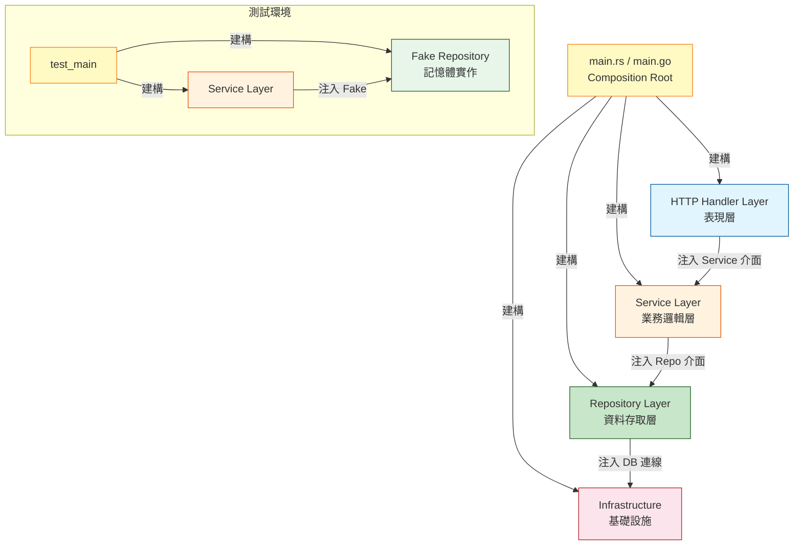

# Dependency Injection / 依賴注入

## Intent / 意圖

依賴注入（Dependency Injection, DI）是控制反轉（Inversion of Control, IoC）的一種實作方式——讓物件不自己建立其依賴，而是從外部接收已建構好的依賴。這個看似簡單的原則徹底改變了程式碼的可測試性和可維護性：當你的 `OrderService` 不再直接 `new DatabaseClient()` 而是接收一個 `Repository` 介面，你就可以在測試中注入一個 fake、在不同環境中注入不同的實作、在不修改 `OrderService` 的情況下替換資料庫。

核心問題：**如何設計模組的依賴關係，使得高層策略（業務邏輯）不依賴低層細節（資料庫、HTTP 客戶端、外部服務），從而讓程式碼可測試、可替換、且變更不會產生連鎖反應？**

---

## Problem / 問題情境

**場景一：單元測試需要啟動 PostgreSQL 和 Redis，CI 跑一次要 20 分鐘**

某團隊的 `UserService` 直接在建構子中建立資料庫連線和 Redis 客戶端：

```go
type UserService struct {
    db    *sql.DB
    cache *redis.Client
}

func NewUserService() *UserService {
    db, _ := sql.Open("postgres", "host=localhost ...")
    cache := redis.NewClient(&redis.Options{Addr: "localhost:6379"})
    return &UserService{db: db, cache: cache}
}
```

寫單元測試時，`NewUserService()` 強制需要真實的 PostgreSQL 和 Redis 連線。團隊在 CI 中啟動 Docker containers 來滿足這個依賴——每次測試需要 30 秒啟動資料庫、10 秒 seed 資料、測試本身只跑 2 秒。一個有 50 個測試的套件需要 20 分鐘。開發者在本地跑測試也需要先啟動一堆 Docker containers，體驗極差。

如果使用依賴注入，`UserService` 接收 `UserRepository` 和 `CacheClient` 介面，測試時注入 in-memory fake，本地測試在毫秒內完成。

**場景二：更換 SMS 供應商需要修改 30 個檔案**

某電商平台使用 Twilio 發送簡訊驗證碼。30 個不同的 handler 和 service 中直接引用了 `twilio.Client`：

```go
func (h *AuthHandler) SendOTP(w http.ResponseWriter, r *http.Request) {
    client := twilio.NewClient("ACCOUNT_SID", "AUTH_TOKEN")
    client.SendSMS(phone, code)
    // ...
}
```

當公司決定改用 AWS SNS 替代 Twilio 時，需要修改所有 30 個檔案——替換 import、修改函式呼叫、更新設定。每個修改都可能引入 bug，且無法逐步遷移（必須一次性切換）。

如果使用依賴注入，所有 handler 依賴 `SMSService` 介面，只需要新增一個 `SNSSMSService` 實作並在 DI 配置中替換即可。30 個 handler 完全不需要修改。

**場景三：循環依賴導致無法編譯**

`OrderService` 依賴 `PaymentService`（建立訂單時需要檢查付款狀態），`PaymentService` 又依賴 `OrderService`（處理退款時需要查詢訂單資訊）。兩者在建構時互相需要對方的實例——形成循環依賴，Go 編譯器報錯，Rust 也無法通過借用檢查。

使用依賴注入搭配介面拆分可以打破循環：`PaymentService` 不依賴整個 `OrderService`，而是依賴一個精簡的 `OrderQuerier` 介面（只包含查詢訂單的方法）。`OrderService` 實作 `OrderQuerier`，但 `PaymentService` 只知道介面，不知道實作——依賴方向從循環變成了單向。

---

## Core Concepts / 核心概念

### Dependency Inversion Principle / 依賴反轉原則

SOLID 原則中的 D——高層模組不應該依賴低層模組，兩者都應該依賴抽象（介面）。同時，抽象不應該依賴細節，細節應該依賴抽象。在實務中，這意味著 `OrderService`（高層業務邏輯）不應該直接依賴 `PostgresOrderRepository`（低層實作），而是依賴 `OrderRepository` 介面。`PostgresOrderRepository` 作為「細節」去實作這個介面。依賴的方向從「高層 → 低層」反轉為「高層 → 介面 ← 低層」。

### Constructor Injection / 建構子注入

最常見且推薦的注入方式——依賴透過建構子（Go 的 `New` 函式、Rust 的 `::new()` 方法）傳入。優點是依賴在物件建立時就完全確定，不存在「使用時依賴尚未注入」的風險。物件一旦建立就是完整可用的。缺點是當依賴數量很多時，建構子的參數列表會很長（通常超過 5 個依賴就代表該物件職責過重，需要拆分）。

### Method Injection / 方法注入

依賴透過方法參數傳入，而非在建構時注入。適用於依賴只在特定方法中使用、且每次呼叫可能使用不同實例的場景。例如 HTTP handler 中的 `context.Context` 就是一種方法注入——每個請求都有不同的 context。Go 的 `http.HandlerFunc(w, r)` 模式也是方法注入：`w` 和 `r` 不是 handler 物件的欄位，而是每次呼叫時注入的。

### Interface Segregation for DI / 介面隔離與依賴注入

依賴注入的效果取決於介面的粒度。如果 `OrderService` 依賴一個有 20 個方法的 `Database` 介面，mock 這個介面需要實作 20 個方法——大部分都是空的。更好的做法是使用精簡的、功能導向的介面：`OrderSaver`（只有 `Save` 方法）、`OrderFinder`（只有 `FindByID` 方法）。Go 的慣例是在消費端定義介面（consumer-defined interfaces），只包含消費者真正需要的方法。

### DI Container vs Manual Wiring / DI 容器 vs 手動裝配

DI 容器（如 Java 的 Spring、Go 的 Wire/Fx、Rust 的 shaku）是自動管理依賴圖的框架——你宣告每個元件的依賴，容器自動建構整個依賴樹。手動裝配（manual wiring）則是在 `main()` 函式中手動建構每個依賴：`repo := NewPostgresRepo(db); service := NewOrderService(repo); handler := NewOrderHandler(service)`。手動裝配的優點是透明、無魔法、容易追蹤；缺點是依賴多時程式碼冗長。小到中型專案推薦手動裝配，大型專案（50+ 元件）考慮使用容器。

### Compile-Time vs Runtime DI / 編譯期 vs 執行期依賴注入

Go 的 Wire 和 Rust 的泛型 DI 是編譯期依賴注入——依賴的解析和裝配在編譯時完成，運行時沒有額外開銷。Spring 和 Fx 是執行期 DI——依賴在程式啟動時透過反射（reflection）解析和注入，有啟動延遲和執行期錯誤的風險。Rust 的 trait object（`dyn Trait`）提供執行期多態，泛型（`impl Trait`）提供編譯期多態——前者靈活但有 vtable 開銷，後者零成本但無法在運行時替換。

---

## Architecture / 架構

### 依賴注入前後的依賴方向對比

```mermaid
graph TB
    subgraph 未使用 DI（直接依賴）
        H1[HTTP Handler] --> S1[OrderService]
        S1 --> DB1[PostgresClient]
        S1 --> C1[RedisClient]
        S1 --> E1[TwilioClient]
    end

    subgraph 使用 DI（依賴反轉）
        H2[HTTP Handler] --> S2[OrderService]
        S2 -->|依賴介面| I1((OrderRepo))
        S2 -->|依賴介面| I2((CacheService))
        S2 -->|依賴介面| I3((NotifyService))
        I1 -.->|實作| DB2[PostgresRepo]
        I2 -.->|實作| C2[RedisCache]
        I3 -.->|實作| E2[TwilioNotify]
    end

    style H1 fill:#e1f5fe,stroke:#01579b
    style S1 fill:#fff3e0,stroke:#e65100
    style DB1 fill:#ffcdd2,stroke:#b71c1c
    style C1 fill:#ffcdd2,stroke:#b71c1c
    style E1 fill:#ffcdd2,stroke:#b71c1c

    style H2 fill:#e1f5fe,stroke:#01579b
    style S2 fill:#fff3e0,stroke:#e65100
    style I1 fill:#c8e6c9,stroke:#1b5e20
    style I2 fill:#c8e6c9,stroke:#1b5e20
    style I3 fill:#c8e6c9,stroke:#1b5e20
    style DB2 fill:#f3e5f5,stroke:#4a148c
    style C2 fill:#f3e5f5,stroke:#4a148c
    style E2 fill:#f3e5f5,stroke:#4a148c
```

### 依賴注入的典型分層架構



### Composition Root 模式

```mermaid
graph LR
    subgraph Composition Root（main 函式）
        Config[讀取設定] --> ConnPool[建立連線池]
        ConnPool --> Repos[建構 Repositories]
        Repos --> Services[建構 Services]
        Services --> Handlers[建構 Handlers]
        Handlers --> Router[組裝 Router]
        Router --> Server[啟動 Server]
    end

    style Config fill:#e1f5fe,stroke:#01579b
    style ConnPool fill:#fff3e0,stroke:#e65100
    style Repos fill:#c8e6c9,stroke:#1b5e20
    style Services fill:#fff9c4,stroke:#f57f17
    style Handlers fill:#f3e5f5,stroke:#4a148c
    style Router fill:#fce4ec,stroke:#b71c1c
    style Server fill:#e0f2f1,stroke:#004d40
```

---

## How It Works / 運作原理

### 依賴注入的運作流程

1. **定義抽象（Interface / Trait）**：首先定義消費者需要的行為契約。在 Go 中是 `interface`，在 Rust 中是 `trait`。關鍵原則：介面由消費者定義（consumer-defined），不是由實作者定義。`OrderService` 需要「儲存訂單」的能力，所以它定義 `OrderSaver` 介面，包含一個 `Save(order Order) error` 方法。

2. **實作抽象**：建立具體的實作類型。`PostgresOrderRepository` 實作 `OrderSaver` 介面，內部使用 `*sql.DB` 進行資料庫操作。在 Go 中，介面是隱式實作（duck typing）——只要型別擁有介面要求的方法簽名，就自動實作了該介面。在 Rust 中，需要明確的 `impl Trait for Type`。

3. **透過建構子注入依賴**：`OrderService` 的建構函式接收 `OrderSaver` 介面（而非 `PostgresOrderRepository` 具體型別）作為參數。`OrderService` 只知道依賴的行為契約，不知道具體實作。

4. **在 Composition Root 組裝**：程式的進入點（`main` 函式）負責組裝所有依賴。這是唯一知道「哪個介面用哪個實作」的地方。`main` 函式建立 `PostgresOrderRepository`、將其注入 `OrderService`、將 `OrderService` 注入 `OrderHandler`、將 `OrderHandler` 註冊到 Router。

5. **測試時替換依賴**：在單元測試中，建立 `FakeOrderRepository`（in-memory 實作），注入到 `OrderService`。測試不需要資料庫、不需要網路，完全在記憶體中運行。可以精確控制 fake 的行為——例如模擬「儲存失敗」來測試錯誤處理邏輯。

6. **Rust 的兩種 DI 風格**：
   - **泛型（Generics）**：`struct OrderService<R: OrderRepo> { repo: R }`。編譯器為每個具體型別生成專門的程式碼（monomorphization），零成本抽象，但二進制大小可能增加。
   - **Trait Object（動態分派）**：`struct OrderService { repo: Box<dyn OrderRepo> }`。透過 vtable 進行動態分派，有微小的運行時開銷（每次方法呼叫一次間接跳轉），但更靈活——可以在運行時決定使用哪個實作。

7. **Go 的 Wire 工具**：Google 的 Wire 是一個編譯期 DI 代碼生成工具。開發者定義 provider（建構函式）和 injector（組裝函式），Wire 在編譯前自動生成組裝代碼。優點是編譯期就能發現缺少的依賴或循環依賴，無反射開銷。

---

## Rust 實作

以下使用 trait 和泛型實作依賴注入，搭配 Axum 0.8 的 `State` 機制將依賴注入到 HTTP handler 中。包含完整的 Repository trait、Service 層、以及測試時的 fake 替換示範。

```rust
// Cargo.toml dependencies:
// axum = "0.8"
// tokio = { version = "1", features = ["full"] }
// serde = { version = "1", features = ["derive"] }
// serde_json = "1"
// uuid = { version = "1", features = ["v4"] }
// chrono = { version = "0.4", features = ["serde"] }

use axum::{
    extract::State,
    http::StatusCode,
    response::Json,
    routing::{get, post},
    Router,
};
use chrono::{DateTime, Utc};
use serde::{Deserialize, Serialize};
use std::collections::HashMap;
use std::sync::Arc;
use tokio::sync::RwLock;
use uuid::Uuid;

// ─── Domain Model ───────────────────────────────────────────

#[derive(Debug, Clone, Serialize, Deserialize)]
struct Order {
    id: Uuid,
    customer_name: String,
    total_cents: i64,
    status: OrderStatus,
    created_at: DateTime<Utc>,
}

#[derive(Debug, Clone, Copy, PartialEq, Eq, Serialize, Deserialize)]
#[serde(rename_all = "snake_case")]
enum OrderStatus {
    Pending,
    Confirmed,
    Shipped,
    Completed,
    Cancelled,
}

// ─── Repository Trait（抽象層）───────────────────────────────

/// 訂單儲存庫介面——由消費者（Service）定義
trait OrderRepository: Send + Sync {
    fn save(&self, order: &Order) -> Result<(), RepositoryError>;
    fn find_by_id(&self, id: Uuid) -> Result<Option<Order>, RepositoryError>;
    fn find_all(&self) -> Result<Vec<Order>, RepositoryError>;
}

/// 通知服務介面
trait NotificationService: Send + Sync {
    fn send_order_confirmation(&self, order: &Order) -> Result<(), NotificationError>;
}

#[derive(Debug, Clone)]
struct RepositoryError(String);

impl std::fmt::Display for RepositoryError {
    fn fmt(&self, f: &mut std::fmt::Formatter<'_>) -> std::fmt::Result {
        write!(f, "Repository error: {}", self.0)
    }
}

#[derive(Debug, Clone)]
struct NotificationError(String);

// ─── Concrete Implementations（實作層）───────────────────────

/// 記憶體內實作（也可在生產中用作快取層）
struct InMemoryOrderRepository {
    orders: RwLock<HashMap<Uuid, Order>>,
}

impl InMemoryOrderRepository {
    fn new() -> Self {
        InMemoryOrderRepository {
            orders: RwLock::new(HashMap::new()),
        }
    }
}

impl OrderRepository for InMemoryOrderRepository {
    fn save(&self, order: &Order) -> Result<(), RepositoryError> {
        // 使用 blocking lock（因為 trait 方法不是 async）
        // 在生產環境中，可以使用 async trait（需要 trait_variant 或 async-trait crate）
        let mut orders = self.orders.blocking_write();
        orders.insert(order.id, order.clone());
        Ok(())
    }

    fn find_by_id(&self, id: Uuid) -> Result<Option<Order>, RepositoryError> {
        let orders = self.orders.blocking_read();
        Ok(orders.get(&id).cloned())
    }

    fn find_all(&self) -> Result<Vec<Order>, RepositoryError> {
        let orders = self.orders.blocking_read();
        Ok(orders.values().cloned().collect())
    }
}

/// 控制台通知實作（開發/測試環境）
struct ConsoleNotificationService;

impl NotificationService for ConsoleNotificationService {
    fn send_order_confirmation(&self, order: &Order) -> Result<(), NotificationError> {
        println!(
            "[通知] 訂單 {} 已確認，客戶: {}，金額: {} cents",
            order.id, order.customer_name, order.total_cents
        );
        Ok(())
    }
}

// ─── Service Layer（業務邏輯層）──────────────────────────────

/// OrderService 依賴抽象（trait），不依賴具體實作
struct OrderService {
    repository: Arc<dyn OrderRepository>,
    notification: Arc<dyn NotificationService>,
}

impl OrderService {
    /// 建構子注入：所有依賴透過參數傳入
    fn new(
        repository: Arc<dyn OrderRepository>,
        notification: Arc<dyn NotificationService>,
    ) -> Self {
        OrderService {
            repository,
            notification,
        }
    }

    fn create_order(
        &self,
        customer_name: String,
        total_cents: i64,
    ) -> Result<Order, String> {
        if total_cents <= 0 {
            return Err("訂單金額必須為正數".to_string());
        }

        let order = Order {
            id: Uuid::new_v4(),
            customer_name,
            total_cents,
            status: OrderStatus::Pending,
            created_at: Utc::now(),
        };

        self.repository
            .save(&order)
            .map_err(|e| format!("儲存訂單失敗: {}", e))?;

        // 發送確認通知（失敗不影響訂單建立）
        if let Err(e) = self.notification.send_order_confirmation(&order) {
            eprintln!("通知發送失敗（非關鍵錯誤）: {:?}", e);
        }

        Ok(order)
    }

    fn get_order(&self, id: Uuid) -> Result<Option<Order>, String> {
        self.repository
            .find_by_id(id)
            .map_err(|e| format!("查詢訂單失敗: {}", e))
    }

    fn list_orders(&self) -> Result<Vec<Order>, String> {
        self.repository
            .find_all()
            .map_err(|e| format!("查詢訂單列表失敗: {}", e))
    }
}

// ─── HTTP Handlers（表現層）──────────────────────────────────

type AppState = Arc<OrderService>;

#[derive(Deserialize)]
struct CreateOrderRequest {
    customer_name: String,
    total_cents: i64,
}

#[derive(Serialize)]
struct ApiResponse<T: Serialize> {
    success: bool,
    data: Option<T>,
    error: Option<String>,
}

async fn create_order_handler(
    State(service): State<AppState>,
    Json(req): Json<CreateOrderRequest>,
) -> Result<(StatusCode, Json<ApiResponse<Order>>), StatusCode> {
    match service.create_order(req.customer_name, req.total_cents) {
        Ok(order) => Ok((
            StatusCode::CREATED,
            Json(ApiResponse {
                success: true,
                data: Some(order),
                error: None,
            }),
        )),
        Err(e) => Ok((
            StatusCode::BAD_REQUEST,
            Json(ApiResponse {
                success: false,
                data: None,
                error: Some(e),
            }),
        )),
    }
}

async fn list_orders_handler(
    State(service): State<AppState>,
) -> Json<ApiResponse<Vec<Order>>> {
    match service.list_orders() {
        Ok(orders) => Json(ApiResponse {
            success: true,
            data: Some(orders),
            error: None,
        }),
        Err(e) => Json(ApiResponse {
            success: false,
            data: None,
            error: Some(e),
        }),
    }
}

// ─── Composition Root（組裝點）───────────────────────────────

#[tokio::main]
async fn main() {
    // === Composition Root：所有依賴在這裡組裝 ===

    // 1. 建構基礎設施層
    let repository: Arc<dyn OrderRepository> = Arc::new(InMemoryOrderRepository::new());
    let notification: Arc<dyn NotificationService> = Arc::new(ConsoleNotificationService);

    // 2. 建構業務邏輯層（注入依賴）
    let order_service = Arc::new(OrderService::new(repository, notification));

    // 3. 建構路由（注入 Service）
    let app = Router::new()
        .route("/orders", post(create_order_handler))
        .route("/orders", get(list_orders_handler))
        .with_state(order_service);

    let listener = tokio::net::TcpListener::bind("0.0.0.0:3000")
        .await
        .unwrap();
    println!("伺服器啟動於 http://localhost:3000");
    axum::serve(listener, app).await.unwrap();
}

// ─── 測試示範：注入 Fake 依賴 ────────────────────────────────

#[cfg(test)]
mod tests {
    use super::*;

    /// Fake Repository：完全控制行為的測試替身
    struct FakeOrderRepository {
        orders: RwLock<HashMap<Uuid, Order>>,
        should_fail: bool,
    }

    impl FakeOrderRepository {
        fn new() -> Self {
            FakeOrderRepository {
                orders: RwLock::new(HashMap::new()),
                should_fail: false,
            }
        }

        fn with_failure() -> Self {
            FakeOrderRepository {
                orders: RwLock::new(HashMap::new()),
                should_fail: true,
            }
        }
    }

    impl OrderRepository for FakeOrderRepository {
        fn save(&self, order: &Order) -> Result<(), RepositoryError> {
            if self.should_fail {
                return Err(RepositoryError("模擬資料庫故障".to_string()));
            }
            let mut orders = self.orders.blocking_write();
            orders.insert(order.id, order.clone());
            Ok(())
        }

        fn find_by_id(&self, id: Uuid) -> Result<Option<Order>, RepositoryError> {
            let orders = self.orders.blocking_read();
            Ok(orders.get(&id).cloned())
        }

        fn find_all(&self) -> Result<Vec<Order>, RepositoryError> {
            let orders = self.orders.blocking_read();
            Ok(orders.values().cloned().collect())
        }
    }

    /// Fake Notification：記錄通知而非真正發送
    struct FakeNotificationService {
        sent_count: RwLock<usize>,
    }

    impl FakeNotificationService {
        fn new() -> Self {
            FakeNotificationService {
                sent_count: RwLock::new(0),
            }
        }

        fn get_sent_count(&self) -> usize {
            *self.sent_count.blocking_read()
        }
    }

    impl NotificationService for FakeNotificationService {
        fn send_order_confirmation(&self, _order: &Order) -> Result<(), NotificationError> {
            let mut count = self.sent_count.blocking_write();
            *count += 1;
            Ok(())
        }
    }

    #[test]
    fn test_create_order_success() {
        // 組裝：注入 Fake 依賴
        let repo = Arc::new(FakeOrderRepository::new());
        let notifier = Arc::new(FakeNotificationService::new());
        let service = OrderService::new(repo, notifier.clone());

        // 執行
        let result = service.create_order("Alice".to_string(), 5000);

        // 驗證
        assert!(result.is_ok());
        let order = result.unwrap();
        assert_eq!(order.customer_name, "Alice");
        assert_eq!(order.total_cents, 5000);
        assert_eq!(order.status, OrderStatus::Pending);
        assert_eq!(notifier.get_sent_count(), 1);
    }

    #[test]
    fn test_create_order_invalid_amount() {
        let repo = Arc::new(FakeOrderRepository::new());
        let notifier = Arc::new(FakeNotificationService::new());
        let service = OrderService::new(repo, notifier.clone());

        let result = service.create_order("Bob".to_string(), -100);

        assert!(result.is_err());
        assert_eq!(result.unwrap_err(), "訂單金額必須為正數");
        assert_eq!(notifier.get_sent_count(), 0); // 失敗時不應發通知
    }

    #[test]
    fn test_create_order_repository_failure() {
        // 注入一個會失敗的 Fake
        let repo = Arc::new(FakeOrderRepository::with_failure());
        let notifier = Arc::new(FakeNotificationService::new());
        let service = OrderService::new(repo, notifier);

        let result = service.create_order("Carol".to_string(), 3000);

        assert!(result.is_err());
        assert!(result.unwrap_err().contains("儲存訂單失敗"));
    }
}

// Output:
// 伺服器啟動於 http://localhost:3000
//
// 使用範例：
//
// 1. 建立訂單：
// curl -X POST http://localhost:3000/orders \
//   -H "Content-Type: application/json" \
//   -d '{"customer_name":"Alice","total_cents":5000}'
// => {"success":true,"data":{"id":"...","customer_name":"Alice","total_cents":5000,"status":"pending",...}}
// 控制台輸出: [通知] 訂單 ... 已確認，客戶: Alice，金額: 5000 cents
//
// 2. 列出所有訂單：
// curl http://localhost:3000/orders
// => {"success":true,"data":[...]}
//
// 3. 執行測試（無需資料庫、無需網路）：
// cargo test
// => test test_create_order_success ... ok
// => test test_create_order_invalid_amount ... ok
// => test test_create_order_repository_failure ... ok
```

---

## Go 實作

以下使用 Go 1.24+ 標準庫，展示介面導向的依賴注入、手動裝配（manual wiring）、以及 Wire 風格的 provider 函式模式。

```go
package main

import (
	"encoding/json"
	"fmt"
	"log"
	"net/http"
	"sync"
	"time"
)

// ─── Domain Model ───────────────────────────────────────────

// Order 訂單領域模型
type Order struct {
	ID           string      `json:"id"`
	CustomerName string      `json:"customer_name"`
	TotalCents   int64       `json:"total_cents"`
	Status       OrderStatus `json:"status"`
	CreatedAt    time.Time   `json:"created_at"`
}

type OrderStatus string

const (
	OrderStatusPending   OrderStatus = "pending"
	OrderStatusConfirmed OrderStatus = "confirmed"
	OrderStatusShipped   OrderStatus = "shipped"
)

// ─── Repository Interface（消費端定義）──────────────────────

// OrderRepository 訂單儲存庫介面
// 由消費者（OrderService）定義，只包含消費者需要的方法
type OrderRepository interface {
	Save(order *Order) error
	FindByID(id string) (*Order, error)
	FindAll() ([]*Order, error)
}

// NotificationService 通知服務介面
type NotificationService interface {
	SendOrderConfirmation(order *Order) error
}

// Logger 日誌介面（連日誌也可以注入！）
type Logger interface {
	Info(msg string, args ...any)
	Error(msg string, args ...any)
}

// ─── Concrete Implementations ───────────────────────────────

// InMemoryOrderRepository 記憶體內實作
type InMemoryOrderRepository struct {
	mu     sync.RWMutex
	orders map[string]*Order
}

func NewInMemoryOrderRepository() *InMemoryOrderRepository {
	return &InMemoryOrderRepository{
		orders: make(map[string]*Order),
	}
}

func (r *InMemoryOrderRepository) Save(order *Order) error {
	r.mu.Lock()
	defer r.mu.Unlock()
	r.orders[order.ID] = order
	return nil
}

func (r *InMemoryOrderRepository) FindByID(id string) (*Order, error) {
	r.mu.RLock()
	defer r.mu.RUnlock()
	order, exists := r.orders[id]
	if !exists {
		return nil, nil
	}
	return order, nil
}

func (r *InMemoryOrderRepository) FindAll() ([]*Order, error) {
	r.mu.RLock()
	defer r.mu.RUnlock()
	orders := make([]*Order, 0, len(r.orders))
	for _, o := range r.orders {
		orders = append(orders, o)
	}
	return orders, nil
}

// ConsoleNotificationService 控制台通知（開發環境）
type ConsoleNotificationService struct {
	logger Logger
}

func NewConsoleNotificationService(logger Logger) *ConsoleNotificationService {
	return &ConsoleNotificationService{logger: logger}
}

func (n *ConsoleNotificationService) SendOrderConfirmation(order *Order) error {
	n.logger.Info("訂單確認通知",
		"order_id", order.ID,
		"customer", order.CustomerName,
		"amount_cents", order.TotalCents,
	)
	return nil
}

// StdLogger 標準日誌實作
type StdLogger struct{}

func (l *StdLogger) Info(msg string, args ...any) {
	fmt.Printf("[INFO] %s %v\n", msg, args)
}

func (l *StdLogger) Error(msg string, args ...any) {
	fmt.Printf("[ERROR] %s %v\n", msg, args)
}

// ─── Service Layer ──────────────────────────────────────────

// OrderService 訂單業務邏輯
// 依賴的是介面，不是具體實作
type OrderService struct {
	repo         OrderRepository
	notification NotificationService
	logger       Logger
}

// NewOrderService 建構子注入：所有依賴作為參數傳入
func NewOrderService(
	repo OrderRepository,
	notification NotificationService,
	logger Logger,
) *OrderService {
	return &OrderService{
		repo:         repo,
		notification: notification,
		logger:       logger,
	}
}

// CreateOrder 建立訂單
func (s *OrderService) CreateOrder(customerName string, totalCents int64) (*Order, error) {
	if totalCents <= 0 {
		return nil, fmt.Errorf("訂單金額必須為正數，收到: %d", totalCents)
	}
	if customerName == "" {
		return nil, fmt.Errorf("客戶名稱不可為空")
	}

	order := &Order{
		ID:           fmt.Sprintf("ORD-%d", time.Now().UnixNano()),
		CustomerName: customerName,
		TotalCents:   totalCents,
		Status:       OrderStatusPending,
		CreatedAt:    time.Now(),
	}

	if err := s.repo.Save(order); err != nil {
		s.logger.Error("儲存訂單失敗", "error", err)
		return nil, fmt.Errorf("儲存訂單失敗: %w", err)
	}

	// 發送通知（非關鍵路徑，失敗不影響訂單）
	if err := s.notification.SendOrderConfirmation(order); err != nil {
		s.logger.Error("通知發送失敗", "error", err)
	}

	s.logger.Info("訂單建立成功", "order_id", order.ID)
	return order, nil
}

// GetOrder 查詢訂單
func (s *OrderService) GetOrder(id string) (*Order, error) {
	return s.repo.FindByID(id)
}

// ListOrders 列出所有訂單
func (s *OrderService) ListOrders() ([]*Order, error) {
	return s.repo.FindAll()
}

// ─── HTTP Handlers ──────────────────────────────────────────

// OrderHandler HTTP 處理器，依賴 OrderService
type OrderHandler struct {
	service *OrderService
}

func NewOrderHandler(service *OrderService) *OrderHandler {
	return &OrderHandler{service: service}
}

type CreateOrderRequest struct {
	CustomerName string `json:"customer_name"`
	TotalCents   int64  `json:"total_cents"`
}

type APIResponse struct {
	Success bool   `json:"success"`
	Data    any    `json:"data,omitempty"`
	Error   string `json:"error,omitempty"`
}

func writeJSON(w http.ResponseWriter, status int, v any) {
	w.Header().Set("Content-Type", "application/json")
	w.WriteHeader(status)
	json.NewEncoder(w).Encode(v)
}

func (h *OrderHandler) HandleCreateOrder(w http.ResponseWriter, r *http.Request) {
	var req CreateOrderRequest
	if err := json.NewDecoder(r.Body).Decode(&req); err != nil {
		writeJSON(w, http.StatusBadRequest, APIResponse{
			Error: fmt.Sprintf("請求格式錯誤: %v", err),
		})
		return
	}

	order, err := h.service.CreateOrder(req.CustomerName, req.TotalCents)
	if err != nil {
		writeJSON(w, http.StatusBadRequest, APIResponse{Error: err.Error()})
		return
	}

	writeJSON(w, http.StatusCreated, APIResponse{Success: true, Data: order})
}

func (h *OrderHandler) HandleListOrders(w http.ResponseWriter, r *http.Request) {
	orders, err := h.service.ListOrders()
	if err != nil {
		writeJSON(w, http.StatusInternalServerError, APIResponse{Error: err.Error()})
		return
	}

	writeJSON(w, http.StatusOK, APIResponse{Success: true, Data: orders})
}

// ─── Composition Root ───────────────────────────────────────

func main() {
	// === Composition Root：所有依賴在此組裝 ===

	// Layer 1: 基礎設施
	logger := &StdLogger{}

	// Layer 2: 資料存取層
	orderRepo := NewInMemoryOrderRepository()

	// Layer 3: 外部服務
	notifier := NewConsoleNotificationService(logger)

	// Layer 4: 業務邏輯層（注入介面）
	orderService := NewOrderService(orderRepo, notifier, logger)

	// Layer 5: 表現層（注入 Service）
	orderHandler := NewOrderHandler(orderService)

	// 組裝路由
	mux := http.NewServeMux()
	mux.HandleFunc("POST /orders", orderHandler.HandleCreateOrder)
	mux.HandleFunc("GET /orders", orderHandler.HandleListOrders)

	addr := ":8080"
	fmt.Printf("伺服器啟動於 http://localhost%s\n", addr)
	log.Fatal(http.ListenAndServe(addr, mux))
}

// ─── 測試示範（與 main 同套件或 _test.go）─────────────────

/*
// fake_test.go

// FakeOrderRepository 測試用 Fake
type FakeOrderRepository struct {
    orders    map[string]*Order
    saveError error
}

func NewFakeOrderRepository() *FakeOrderRepository {
    return &FakeOrderRepository{orders: make(map[string]*Order)}
}

func (r *FakeOrderRepository) WithSaveError(err error) *FakeOrderRepository {
    r.saveError = err
    return r
}

func (r *FakeOrderRepository) Save(order *Order) error {
    if r.saveError != nil {
        return r.saveError
    }
    r.orders[order.ID] = order
    return nil
}

func (r *FakeOrderRepository) FindByID(id string) (*Order, error) {
    return r.orders[id], nil
}

func (r *FakeOrderRepository) FindAll() ([]*Order, error) {
    orders := make([]*Order, 0)
    for _, o := range r.orders {
        orders = append(orders, o)
    }
    return orders, nil
}

// FakeNotificationService 測試用 Fake
type FakeNotificationService struct {
    SentCount int
}

func (n *FakeNotificationService) SendOrderConfirmation(order *Order) error {
    n.SentCount++
    return nil
}

// NopLogger 空日誌（測試用）
type NopLogger struct{}
func (l *NopLogger) Info(msg string, args ...any) {}
func (l *NopLogger) Error(msg string, args ...any) {}

func TestCreateOrder_Success(t *testing.T) {
    // 注入 Fake 依賴
    repo := NewFakeOrderRepository()
    notifier := &FakeNotificationService{}
    logger := &NopLogger{}
    service := NewOrderService(repo, notifier, logger)

    order, err := service.CreateOrder("Alice", 5000)

    if err != nil {
        t.Fatalf("expected no error, got: %v", err)
    }
    if order.CustomerName != "Alice" {
        t.Errorf("expected customer Alice, got %s", order.CustomerName)
    }
    if notifier.SentCount != 1 {
        t.Errorf("expected 1 notification, got %d", notifier.SentCount)
    }
}

func TestCreateOrder_InvalidAmount(t *testing.T) {
    repo := NewFakeOrderRepository()
    notifier := &FakeNotificationService{}
    logger := &NopLogger{}
    service := NewOrderService(repo, notifier, logger)

    _, err := service.CreateOrder("Bob", -100)

    if err == nil {
        t.Fatal("expected error for negative amount")
    }
    if notifier.SentCount != 0 {
        t.Errorf("expected 0 notifications on error, got %d", notifier.SentCount)
    }
}

func TestCreateOrder_RepoFailure(t *testing.T) {
    repo := NewFakeOrderRepository().WithSaveError(fmt.Errorf("DB down"))
    notifier := &FakeNotificationService{}
    logger := &NopLogger{}
    service := NewOrderService(repo, notifier, logger)

    _, err := service.CreateOrder("Carol", 3000)

    if err == nil {
        t.Fatal("expected error when repo fails")
    }
}
*/

// Output:
// 伺服器啟動於 http://localhost:8080
//
// 使用範例：
//
// 1. 建立訂單：
// curl -X POST http://localhost:8080/orders \
//   -H "Content-Type: application/json" \
//   -d '{"customer_name":"Alice","total_cents":5000}'
// => {"success":true,"data":{"id":"ORD-...","customer_name":"Alice",...}}
// 控制台: [INFO] 訂單確認通知 [order_id ORD-... customer Alice amount_cents 5000]
//
// 2. 列出訂單：
// curl http://localhost:8080/orders
//
// 3. 測試（無需任何外部依賴）：
// go test -v ./...
// === RUN   TestCreateOrder_Success
// --- PASS: TestCreateOrder_Success (0.00s)
// === RUN   TestCreateOrder_InvalidAmount
// --- PASS: TestCreateOrder_InvalidAmount (0.00s)
// === RUN   TestCreateOrder_RepoFailure
// --- PASS: TestCreateOrder_RepoFailure (0.00s)
```

---

## Rust vs Go 對照表

| 比較維度 | Rust 實作 | Go 實作 |
|---------|----------|--------|
| **抽象機制** | `trait`（可靜態分派或動態分派） | `interface`（永遠是動態分派 / vtable） |
| **DI 風格** | `Arc<dyn Trait>` 動態分派，或泛型 `<R: Repo>` 靜態分派 | 介面值（interface value），隱式實作（duck typing） |
| **編譯期保障** | 泛型 DI 在編譯期完成 monomorphization，零成本 | 介面永遠有 vtable 間接呼叫的微小開銷 |
| **生命週期管理** | `Arc` 引用計數，或生命週期標記 `'a` | GC 自動管理，無需手動控制 |
| **介面定義慣例** | 通常在 trait 定義檔案中集中定義 | 在消費端定義（consumer-defined interfaces） |
| **測試 Fake** | 手動實作 trait，或使用 `mockall` crate | 手動實作 interface（推薦），或使用 `gomock` |
| **DI 容器選項** | `shaku`、`inject` crate（較少使用） | `wire`（編譯期）、`fx`（執行期），手動裝配最常見 |
| **Composition Root** | `main.rs` 中 `Arc::new()` 組裝 | `main.go` 中 `New*()` 函式鏈式組裝 |

---

## When to Use / 適用場景

### 需要高可測試性的業務邏輯

任何包含非平凡業務邏輯的 service 都應該使用 DI——將外部依賴（資料庫、HTTP 客戶端、訊息佇列）透過介面注入，測試時替換為 fake。這讓單元測試可以在毫秒內完成，不需要啟動任何外部服務。關鍵判斷：如果你的測試需要真實的資料庫或網路連線才能運行，就是缺少 DI 的徵兆。

### 需要在不同環境使用不同實作

開發環境用記憶體內 fake、測試環境用 testcontainers、生產環境用真實服務。DI 讓同一套業務邏輯在不同環境中使用不同的基礎設施，而不需要修改任何業務程式碼。例如：開發時用 `ConsoleNotificationService` 印日誌、測試時用 `FakeNotificationService` 記錄呼叫、生產時用 `TwilioNotificationService` 發真實簡訊。

### 大型團隊協作的模組邊界

DI 透過介面明確定義模組之間的契約。團隊 A 負責 `OrderService`，團隊 B 負責 `PaymentService`，雙方透過介面溝通——只要介面不變，各自的實作可以獨立演進。新同事只需要看介面定義就能理解模組的職責和互動方式。

---

## When NOT to Use / 不適用場景

### 簡單的 CLI 工具或腳本

一個只有 100 行的 CLI 工具——讀取 CSV、處理資料、寫入檔案——不需要 DI。直接在函式中建立 `os.Open()` 和 `fmt.Fprintf()` 就好。為了「可測試性」而引入介面和 DI 只會增加程式碼量，降低可讀性。DI 的價值在大型、長期維護的系統中才能體現。

### 不會被替換的底層基礎設施

標準庫的 `time.Now()`、`rand.Intn()`、`os.Getenv()` 通常不需要注入——它們是穩定的、無副作用的（或副作用可接受的）基礎設施。除非你真的需要在測試中控制時間（如測試「訂單 24 小時後過期」），否則不值得為 `time.Now()` 引入 `Clock` 介面。

### 過度注入（Over-Injection）

當一個 struct 有 10 個以上的注入依賴時，問題不在於 DI，而在於這個 struct 的職責太重。DI 不是問題的解法——拆分職責才是。同樣，不要為每個函式都建立介面——只有需要被替換或被 mock 的依賴才值得抽象為介面。

---

## Real-World Examples / 真實世界案例

### Google Wire — 編譯期依賴注入

Google 的 Wire 是 Go 生態中最知名的 DI 工具。Wire 使用代碼生成而非反射——開發者定義 provider 函式（建構函式）和 injector 函式（組裝函式），`wire` 命令在編譯前自動生成組裝代碼。Wire 的核心理念是「DI 應該在編譯期完成」——如果你忘記提供某個依賴，或者存在循環依賴，編譯就會失敗。Google 內部的許多 Go 服務使用 Wire 管理數百個元件的依賴圖。Wire 的劣勢是學習曲線——provider set、binding、cleanup 等概念需要時間理解。

### Uber Fx — 執行期依賴注入

Uber 的 Fx 是另一個流行的 Go DI 框架，採用執行期反射的方式。與 Wire 不同，Fx 在程式啟動時解析依賴圖、建構所有元件、管理生命週期（啟動和關閉順序）。Fx 的 `fx.Provide()` 和 `fx.Invoke()` API 比 Wire 更直觀，但缺點是依賴錯誤只在運行時才會被發現（而非編譯時）。Uber 在其數千個微服務中廣泛使用 Fx。

### Axum 的 State Extractor — 框架級 DI

Axum（Rust 的 Web 框架）透過 `State` extractor 實作了一種優雅的 DI 模式。開發者將 application state（包含所有 service 和 repository）透過 `Router::with_state()` 注入，handler 函式透過 `State(state): State<AppState>` 自動接收。這種模式讓每個 handler 都是純函式（接收依賴作為參數），不需要全域變數或 singleton。Axum 的 `FromRef` trait 還支援多層 state 拆分——handler 只接收自己需要的 state 子集，而非整個 AppState。

---

## Interview Questions / 面試常見問題

### Q1: 什麼是依賴注入？它解決了什麼問題？

依賴注入（DI）是一種設計模式，核心思想是：物件不自己建立它的依賴，而是從外部接收已建構好的依賴。這是控制反轉（Inversion of Control, IoC）的一種實作方式——「建立依賴」的控制權從物件本身反轉到了外部的組裝者。

DI 解決的三個核心問題：

1. **可測試性**：如果 `OrderService` 內部直接 `new DatabaseClient()`，單元測試就必須連接真實資料庫。使用 DI 後，測試可以注入 in-memory fake，測試在毫秒內完成。

2. **可替換性**：如果需要將 SMS 供應商從 Twilio 換成 AWS SNS，使用 DI 的系統只需要新增一個 `SNSSMSService` 實作並在組裝點替換；不使用 DI 的系統需要在所有引用 Twilio 的地方修改程式碼。

3. **關注點分離**：`OrderService` 只關心業務邏輯（「建立訂單後發送通知」），不關心通知是用 email、SMS 還是 push notification 實作的。這讓程式碼更容易理解和維護。

### Q2: 在 Go 中如何實作依賴注入？與 Java 的 Spring 有什麼差異？

Go 的 DI 主要依靠兩個語言特性：
1. **Interface（介面）**：定義依賴的行為契約。Go 的介面是隱式實作（duck typing）——只要型別有匹配的方法簽名，就自動實作了介面。
2. **Constructor Function**：`NewOrderService(repo OrderRepository, notifier NotificationService)` 透過函式參數接收依賴。

與 Java Spring 的主要差異：
- **Spring**：使用註解（`@Autowired`、`@Component`）和反射在執行期自動掃描、建構和注入依賴。強大但有「魔法」——開發者可能不清楚依賴是何時、如何被注入的。
- **Go**：推薦手動裝配（在 `main` 中顯式建構所有依賴）或使用 Wire（編譯期代碼生成）。透明、無反射、容易 debug。缺點是依賴多時手動裝配代碼冗長。

Go 社群的共識是：優先使用手動裝配，只在依賴圖超過 30-50 個元件時考慮使用 Wire 或 Fx。Go 的介面已經提供了足夠的 DI 能力，不需要 Spring 那樣的重量級框架。

### Q3: Rust 中的 trait object（動態分派）和泛型（靜態分派）在 DI 中各有什麼優缺點？

**Trait Object（`dyn Trait`）— 動態分派**：
```rust
struct OrderService {
    repo: Box<dyn OrderRepo>,
}
```
- 優點：可以在運行時決定使用哪個實作（例如根據設定檔選擇 PostgresRepo 或 MySQLRepo）。所有使用 `dyn OrderRepo` 的程式碼共用同一份機器碼，二進制較小。
- 缺點：每次方法呼叫經過 vtable 間接跳轉，有微小的性能開銷。不支援 `Sized` 的型別，某些 trait 方法（如返回 `Self` 的方法）無法用於 trait object。

**Generics — 靜態分派**：
```rust
struct OrderService<R: OrderRepo> {
    repo: R,
}
```
- 優點：編譯器為每個具體型別生成專門的機器碼（monomorphization），完全內聯（inline），零成本抽象。支援所有 trait 方法。
- 缺點：每個具體型別都生成一份程式碼，可能增加二進制大小。無法在運行時切換實作。泛型參數會「傳染」到上層——如果 `OrderService<R>` 是泛型的，持有 `OrderService` 的 `OrderHandler` 也必須是泛型的。

實務建議：底層性能敏感的元件（如序列化、壓縮）使用泛型。應用層的 service/handler 使用 `dyn Trait`（性能差異可忽略，且避免泛型傳染）。

### Q4: 什麼是 Composition Root？為什麼所有依賴都應該在這裡組裝？

Composition Root 是應用程式中唯一負責組裝所有依賴的地方——通常是 `main()` 函式。所有的 `New*()` 建構和依賴注入都在這裡完成。

為什麼集中組裝：
1. **單一變更點**：需要替換某個實作時（如換資料庫），只需修改 Composition Root，不需要修改任何業務邏輯。
2. **依賴圖可視化**：在 `main()` 中可以一目了然地看到整個應用的依賴結構。
3. **避免 Service Locator 反模式**：如果元件在需要時自己去 "查找" 依賴（如從全域 registry 或容器中 `Get<T>()`），這就是 Service Locator——依賴關係隱藏在實作內部，難以追蹤。Composition Root 讓所有依賴關係顯式化。
4. **啟動順序控制**：在 Composition Root 中，依賴的建構順序就是程式碼的書寫順序——先建構基礎設施（DB 連線池）、再建構 Repository、再建構 Service、最後建構 Handler。

### Q5: 何時不應該使用依賴注入？

DI 不是銀彈，以下場景不適用：

1. **穩定的底層 API**：`time.Now()`、`os.ReadFile()`、`strings.Split()` 這些標準庫函式不需要注入。它們是穩定的、不會被替換的。（除非你需要在測試中控制時間。）

2. **值型別和 DTO**：`Order` struct 的建構不需要 DI——它是一個純資料物件，沒有行為依賴。

3. **短命的腳本**：一次性的資料遷移腳本、CLI 工具不需要 DI 的可測試性和可替換性。

4. **過度抽象**：如果你的系統只會用 PostgreSQL，永遠不會換資料庫，為 `*sql.DB` 包一層 `Database` 介面就是過度設計。只在真正需要替換或 mock 時才引入介面。

5. **依賴數量失控**：如果一個 struct 需要注入 10 個以上的依賴，問題不在 DI，而在這個 struct 的職責太重——應該拆分為更小的元件。

---

## Pitfalls / 常見陷阱

### 陷阱一：Service Locator 反模式（通用）

```go
// 錯誤：Service Locator（依賴隱藏在內部）
func NewOrderService() *OrderService {
    repo := container.Get[OrderRepository]()  // 從全域容器取得
    return &OrderService{repo: repo}
}

// 修正：Constructor Injection（依賴顯式傳入）
func NewOrderService(repo OrderRepository) *OrderService {
    return &OrderService{repo: repo}
}
```

Service Locator 將依賴關係隱藏在實作內部，無法從函式簽名看出依賴了什麼。測試時也無法輕易替換——需要先設定全域容器。

### 陷阱二：介面過大（通用）

```go
// 錯誤：一個巨大的 Database 介面
type Database interface {
    SaveOrder(order *Order) error
    FindOrderByID(id string) (*Order, error)
    SaveUser(user *User) error
    FindUserByID(id string) (*User, error)
    SaveProduct(product *Product) error
    // ... 50 個方法
}

// 修正：精簡的、消費端定義的介面
type OrderSaver interface {
    Save(order *Order) error
}

type OrderFinder interface {
    FindByID(id string) (*Order, error)
}
```

### 陷阱三：在非 main 函式中建構依賴（通用）

```go
// 錯誤：在 handler 內部建構依賴
func (h *Handler) HandleRequest(w http.ResponseWriter, r *http.Request) {
    repo := NewPostgresRepo(connectionString)  // 每次請求都建新連線！
    service := NewOrderService(repo)
    service.CreateOrder(...)
}

// 修正：在 Composition Root 建構，handler 只使用
func main() {
    repo := NewPostgresRepo(db)
    service := NewOrderService(repo)
    handler := NewHandler(service)
    // handler 在整個生命週期中重複使用 service
}
```

### 陷阱四：忽略依賴的生命週期管理（通用）

DI 不只是「誰建構誰」，還包括「誰負責關閉」。資料庫連線池、HTTP 客戶端等需要在程式結束時正確關閉。**修正**：在 Composition Root 中使用 defer 或 shutdown hook 管理資源的生命週期。

### 陷阱五（Rust）：trait object 的 Send + Sync 約束遺漏

```rust
// 錯誤：忘記 Send + Sync，無法在 Axum handler 中使用
trait OrderRepository {
    fn save(&self, order: &Order) -> Result<(), Error>;
}

// Axum 的 State 需要 Send + Sync
// 編譯錯誤：`dyn OrderRepository` doesn't implement Send + Sync

// 修正：在 trait 定義中加上 Send + Sync
trait OrderRepository: Send + Sync {
    fn save(&self, order: &Order) -> Result<(), Error>;
}
```

### 陷阱六（Rust）：泛型參數「傳染」整個 call stack

```rust
// 泛型傳染問題
struct OrderService<R: OrderRepo> { repo: R }
struct OrderHandler<R: OrderRepo> { service: OrderService<R> }
struct App<R: OrderRepo> { handler: OrderHandler<R> }
// 每一層都需要帶著泛型參數 R

// 修正：在邊界處使用 dyn Trait 擦除泛型
struct OrderService { repo: Arc<dyn OrderRepo> }
struct OrderHandler { service: Arc<OrderService> }
// 不再有泛型傳染
```

### 陷阱七（Go）：對 nil interface 的方法呼叫導致 panic

```go
type OrderService struct {
    repo OrderRepository  // 如果忘記注入，預設值是 nil
}

func (s *OrderService) CreateOrder(...) {
    s.repo.Save(order)  // panic: nil pointer dereference
}

// 修正：在建構函式中驗證必要依賴
func NewOrderService(repo OrderRepository) (*OrderService, error) {
    if repo == nil {
        return nil, fmt.Errorf("OrderRepository 不可為 nil")
    }
    return &OrderService{repo: repo}, nil
}
```

---

## Cross-references / 交叉引用

- [[33_testing_strategy|Ch.33 Testing Strategy]] — DI 是可測試性的基石，介面注入讓 mock/fake/stub 替換成為可能
- [[34_integration_contract_testing|Ch.34 Contract Testing]] — DI 的介面定義就是模組之間的契約，contract testing 驗證實作是否符合契約
- [[../design_pattern/modern/24_functional_options|Ch.24 Functional Options]] — Go 中 Functional Options 模式是建構子注入的替代方案，適合可選依賴的場景

---

## References / 參考資料

- Robert C. Martin, "Clean Architecture: A Craftsman's Guide to Software Structure and Design" — 依賴反轉原則和 Clean Architecture 的詳細闡述
- Mark Seemann, "Dependency Injection in .NET" — DI 模式的全面參考（雖然是 .NET，但原則通用）
- Google Wire Documentation — https://github.com/google/wire — Go 編譯期 DI 工具
- Uber Fx Documentation — https://github.com/uber-go/fx — Go 執行期 DI 框架
