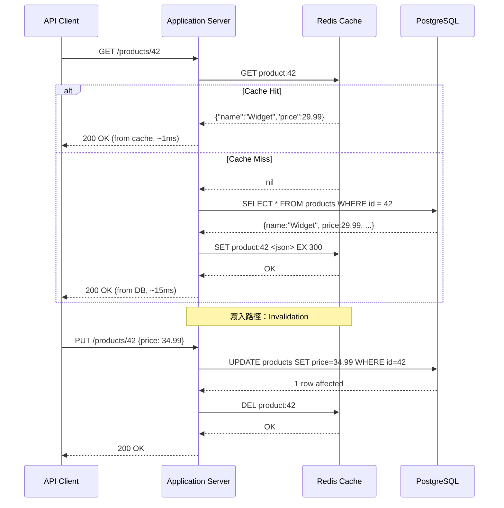
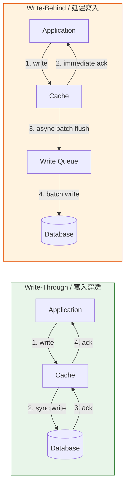
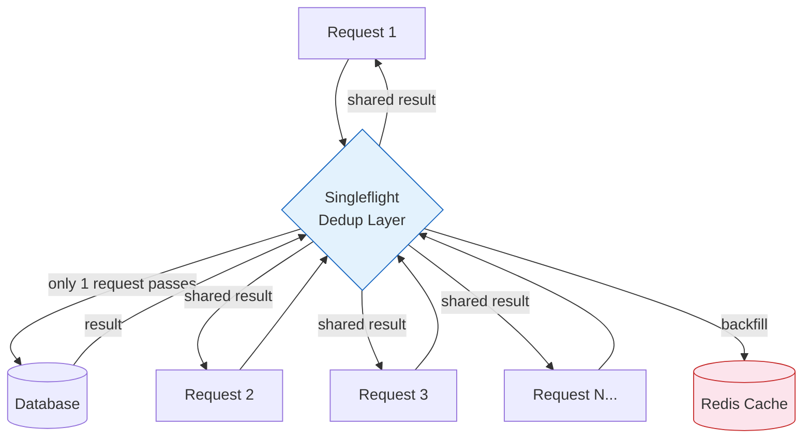

# Caching & Redis Patterns / 快取與 Redis 模式

## Intent / 意圖

透過在應用程式與持久化儲存之間引入快取層（caching layer），降低讀取延遲（latency）並減輕資料庫負載（database load）。快取的本質是用空間換時間——將「計算成本高」或「存取頻繁」的資料暫存在記憶體中，讓後續請求直接從記憶體讀取而非每次都查詢資料庫。

核心問題：**當系統承受高併發讀取流量時，如何在不犧牲資料一致性的前提下，大幅降低回應時間並保護後端資料庫免於過載？**

---

## Problem / 問題情境

**場景一：電商平台商品頁的讀取風暴**

某電商平台在促銷活動期間，商品詳情頁的 QPS（Queries Per Second）從平時的 2,000 飆升至 50,000。每次頁面載入都需要查詢 PostgreSQL 取得商品資訊、價格、庫存、評價統計。資料庫連線池耗盡，查詢延遲從 5ms 飆升到 2,000ms，最終觸發 connection timeout，整個平台回應變慢甚至不可用。

**場景二：排行榜查詢拖垮分析型查詢**

手遊的全服排行榜每次請求都執行 `SELECT ... ORDER BY score DESC LIMIT 100`，涉及百萬筆資料的排序。每秒數千次排行榜查詢佔滿了資料庫 CPU，導致其他關鍵的遊戲邏輯查詢（如登入驗證、道具購買）也被拖慢。排行榜資料其實每 5 分鐘更新一次就足夠，但系統卻對每個請求都即時計算。

**場景三：Cache Stampede（快取雪崩 / 驚群效應）**

熱門商品的快取在同一時刻過期（TTL 到期），瞬間有 10,000 個請求同時穿透到資料庫，全部執行相同的查詢。資料庫瞬間負載暴增，回應時間飆升，部分請求 timeout，使用者體驗急劇惡化。更糟的是，因為所有請求都在等待資料庫回應，快取遲遲無法被重新填充，形成惡性循環。

---

## Core Concepts / 核心概念

### Cache-Aside (Lazy Loading) / 旁路快取

最常見的快取模式。應用程式負責管理快取的讀取與寫入：讀取時先查快取，cache miss 則查資料庫並回填快取；寫入時直接更新資料庫，然後使快取失效（invalidate）或更新快取。優點是實作簡單、只快取實際被存取的資料；缺點是第一次存取必定 cache miss，且存在短暫的資料不一致視窗。

### Read-Through / 穿透式讀取

快取層自動從資料庫載入缺失的資料。與 Cache-Aside 的差異在於：應用程式只與快取互動，快取層負責在 cache miss 時查詢資料庫並填充自身。對應用程式而言，快取層就像一個「永遠有資料」的儲存，降低了應用程式的複雜度。常見於 CDN 和 ORM 層面的快取。

### Write-Through / 寫入穿透

每次寫入同時更新快取和資料庫，兩者保持同步。優點是快取中的資料永遠是最新的（cache hit 率高、無 stale data）；缺點是寫入延遲增加（需要等待快取和資料庫都完成），且不常被讀取的資料也會佔用快取空間。適合讀寫比例接近的場景。

### Write-Behind (Write-Back) / 延遲寫入

寫入操作先更新快取，然後由快取非同步地批次寫入資料庫。優點是寫入延遲極低（只寫快取就回傳），且可以合併多次寫入降低資料庫壓力；缺點是快取故障時未持久化的資料會丟失，實作複雜度高。適合「寫入頻繁但可容忍少量資料丟失」的場景，如計數器、閱讀數。

### Cache Stampede (Thundering Herd) / 快取雪崩

當熱門 key 的快取同時過期，大量請求同時穿透到資料庫，造成瞬間負載暴增。防禦策略包括：(1) singleflight 模式——相同 key 的並發請求只讓一個去查資料庫，其餘等待結果共享；(2) 互斥鎖（mutex lock）——只有取得鎖的請求去重建快取；(3) 提前續期（early refresh / jitter TTL）——在 TTL 到期前主動更新快取，避免集中過期。

### TTL Strategy / TTL 策略

TTL（Time-To-Live）決定快取資料的有效期。太短：cache hit 率低，資料庫壓力大。太長：stale data 風險增加。常見策略：(1) 固定 TTL + 隨機抖動（jitter），避免大量 key 同時過期；(2) 分層 TTL——熱門資料較長 TTL，冷門資料較短 TTL；(3) 事件驅動失效——資料變更時主動 invalidate，搭配較長的 TTL 作為兜底。

### Redis Data Structures / Redis 資料結構

- **String**：最基礎的 key-value 儲存。用於快取序列化後的 JSON 物件、計數器（`INCR`/`DECR`）、分散式鎖（`SET NX PX`）。
- **Hash**：field-value 映射。適合儲存物件的多個屬性（如 `HSET user:123 name "Alice" age 30`），可以只更新或讀取個別欄位而非整個物件。
- **Set**：無序且唯一的元素集合。適合標籤系統、好友列表、已讀追蹤（`SISMEMBER` O(1) 查詢）。
- **Sorted Set (ZSet)**：帶分數的有序集合。天然適合排行榜（`ZADD`/`ZREVRANGE`）、時間序列（以 timestamp 為 score）、延遲佇列。
- **Stream**：追加型日誌結構（append-only log）。支援 consumer group，適合事件流處理和訊息佇列。比 Pub/Sub 更可靠——訊息不會因為沒有訂閱者而丟失。
- **HyperLogLog**：機率型資料結構，用 12KB 記憶體估算集合的基數（cardinality）。適合 UV（Unique Visitors）統計等不需要精確計數的場景，誤差約 0.81%。

### Redis Persistence / Redis 持久化

- **RDB (Redis Database Snapshot)**：定期將記憶體中的完整資料集快照到磁碟。優點是恢復速度快、備份檔案緊湊；缺點是兩次快照之間的資料可能丟失。
- **AOF (Append Only File)**：每次寫入操作都追加到日誌檔案。三種同步策略：`always`（每次操作都 fsync，最安全但最慢）、`everysec`（每秒 fsync，常用的折衷）、`no`（交由 OS 決定 fsync 時機）。
- **混合模式（RDB + AOF）**：Redis 4.0+ 支援。AOF 重寫時以 RDB 格式寫入前半段，新的操作以 AOF 追加。兼顧恢復速度和資料安全性。

### Redis Cluster / Redis 叢集

將資料自動分片（sharding）到多個節點的分散式部署模式。使用 16384 個 hash slot，每個 key 經由 CRC16 雜湊映射到一個 slot，每個節點負責一部分 slot。支援自動故障轉移（failover）——slave 偵測到 master 離線後自動升級。限制：不支援跨 slot 的多 key 操作（可用 hash tag `{tag}` 強制相關 key 到同一 slot）。

### Redis Sentinel / Redis 哨兵

為 Redis 主從架構提供高可用性（HA）的監控和自動故障轉移機制。Sentinel 持續監控 master 和 slave，當 master 不可用時自動將一個 slave 升級為新 master 並通知客戶端。與 Cluster 的差異：Sentinel 不做分片，適合資料量能放進單一節點但需要 HA 的場景。

---

## Architecture / 架構

### Cache-Aside Pattern 流程



### Write-Through vs Write-Behind 比較



### Cache Stampede Prevention 架構



---

## How It Works / 運作原理

### Cache-Aside 讀寫流程

**讀取路徑：**

1. 應用程式收到讀取請求後，先以 key（如 `product:42`）查詢 Redis。
2. **Cache Hit**：Redis 回傳資料，應用程式直接回傳給客戶端。延遲通常 < 1ms。
3. **Cache Miss**：Redis 回傳 `nil`，應用程式查詢資料庫取得資料。
4. 將資料序列化後寫入 Redis，並設定 TTL（如 `EX 300` 表示 300 秒後過期）。
5. 回傳資料給客戶端。

**寫入路徑（Invalidation 策略）：**

1. 應用程式先更新資料庫（source of truth）。
2. 更新成功後，刪除對應的快取 key（`DEL product:42`）。
3. 下一次讀取會觸發 cache miss，從資料庫讀取最新資料並重新填充快取。
4. 為何「先更新 DB 再刪快取」而非「先刪快取再更新 DB」？後者存在一個 race condition：刪除快取後、更新 DB 前，另一個讀取請求會把舊資料重新載入快取，導致快取中永遠是舊值直到 TTL 過期。

### Cache Stampede Prevention（Singleflight / Lock）

1. 多個請求同時 cache miss 同一個 key。
2. **Singleflight 模式**：所有對同一 key 的並發請求被合併為一個。第一個請求負責查詢資料庫並回填快取，其他請求等待第一個完成後共享結果。Go 的 `golang.org/x/sync/singleflight` 和 Rust 的手動實作（`tokio::sync::Mutex` + `HashMap`）都能實現此模式。
3. **互斥鎖模式**：使用 Redis 的 `SET NX` 嘗試取得一個短期鎖。只有取得鎖的請求查詢資料庫並更新快取，未取得鎖的請求短暫等待後重試讀取快取。
4. **Jitter TTL 模式**：在 TTL 上加入隨機偏移（如 TTL 300 秒 +/- 30 秒隨機值），避免大量 key 在同一時刻過期。這是被動防禦——無法防止單一熱門 key 的 stampede，但能有效防止大規模同時過期。

---

## Rust 實作

以下實作基於 `redis-rs` 與 `tokio`，包含完整的 cache-aside 模式、singleflight 防止 cache stampede、TTL jitter、以及 Redis Hash 存取。

```rust
// caching_patterns.rs
// Cache-aside pattern with singleflight stampede prevention

use redis::AsyncCommands;
use std::collections::HashMap;
use std::sync::Arc;
use std::time::Duration;
use tokio::sync::{Mutex, oneshot};

/// 商品資料結構
#[derive(Debug, Clone, serde::Serialize, serde::Deserialize)]
struct Product {
    id: u64,
    name: String,
    price_cents: u64,
    stock: u32,
}

/// Singleflight：確保同一 key 的並發請求只觸發一次資料庫查詢
struct Singleflight {
    in_flight: Mutex<HashMap<String, Vec<oneshot::Sender<Option<String>>>>>,
}

impl Singleflight {
    fn new() -> Self {
        Self {
            in_flight: Mutex::new(HashMap::new()),
        }
    }

    /// 嘗試註冊對 key 的查詢。回傳 `First(())` 表示此請求是第一個，
    /// 應負責查詢資料庫；回傳 `Waiting(rx)` 表示已有請求在執行，等待結果。
    async fn register(&self, key: &str) -> FlightResult {
        let mut map = self.in_flight.lock().await;
        if let Some(waiters) = map.get_mut(key) {
            // 已有在途請求，加入等待列表
            let (tx, rx) = oneshot::channel();
            waiters.push(tx);
            FlightResult::Waiting(rx)
        } else {
            // 第一個請求，建立等待列表
            map.insert(key.to_string(), Vec::new());
            FlightResult::First(())
        }
    }

    /// 第一個請求完成後，通知所有等待者並清理狀態
    async fn resolve(&self, key: &str, result: Option<String>) {
        let mut map = self.in_flight.lock().await;
        if let Some(waiters) = map.remove(key) {
            for tx in waiters {
                let _ = tx.send(result.clone());
            }
        }
    }
}

enum FlightResult {
    First(()),
    Waiting(oneshot::Receiver<Option<String>>),
}

/// Cache-Aside 快取管理器
struct CacheAsideManager {
    redis_client: redis::Client,
    singleflight: Singleflight,
    default_ttl: Duration,
    ttl_jitter_range: Duration,
}

impl CacheAsideManager {
    fn new(redis_url: &str, default_ttl: Duration, jitter: Duration) -> Self {
        let redis_client =
            redis::Client::open(redis_url).expect("Invalid Redis URL");
        Self {
            redis_client,
            singleflight: Singleflight::new(),
            default_ttl,
            ttl_jitter_range: jitter,
        }
    }

    /// 計算帶 jitter 的 TTL，避免大量 key 同時過期
    fn ttl_with_jitter(&self) -> Duration {
        let jitter_secs = rand_jitter(self.ttl_jitter_range.as_secs());
        self.default_ttl + Duration::from_secs(jitter_secs)
    }

    /// Cache-Aside 讀取：先查快取，miss 則透過 singleflight 查資料庫
    async fn get_product(
        &self,
        product_id: u64,
    ) -> Result<Option<Product>, Box<dyn std::error::Error>> {
        let cache_key = format!("product:{}", product_id);
        let mut conn = self
            .redis_client
            .get_multiplexed_async_connection()
            .await?;

        // Step 1: 查詢快取
        let cached: Option<String> = conn.get(&cache_key).await?;
        if let Some(json_str) = cached {
            println!("[CACHE-HIT] key={}", cache_key);
            let product: Product = serde_json::from_str(&json_str)?;
            return Ok(Some(product));
        }
        println!("[CACHE-MISS] key={}", cache_key);

        // Step 2: Singleflight——合併並發的 cache miss
        match self.singleflight.register(&cache_key).await {
            FlightResult::First(()) => {
                println!("[SINGLEFLIGHT] key={} -> leader, querying DB", cache_key);

                // 模擬資料庫查詢
                let db_result = simulate_db_query(product_id).await;
                let json_result = db_result
                    .as_ref()
                    .map(|p| serde_json::to_string(p).unwrap());

                // 回填快取（帶 jitter TTL）
                if let Some(ref json_str) = json_result {
                    let ttl = self.ttl_with_jitter();
                    let _: () = conn
                        .set_ex(&cache_key, json_str, ttl.as_secs())
                        .await?;
                    println!(
                        "[CACHE-BACKFILL] key={}, ttl={}s",
                        cache_key,
                        ttl.as_secs()
                    );
                }

                // 通知所有等待者
                self.singleflight
                    .resolve(&cache_key, json_result)
                    .await;

                Ok(db_result)
            }
            FlightResult::Waiting(rx) => {
                println!(
                    "[SINGLEFLIGHT] key={} -> follower, waiting for leader",
                    cache_key
                );
                match rx.await {
                    Ok(Some(json_str)) => {
                        let product: Product =
                            serde_json::from_str(&json_str)?;
                        Ok(Some(product))
                    }
                    Ok(None) => Ok(None),
                    Err(_) => Err("Singleflight leader dropped".into()),
                }
            }
        }
    }

    /// Cache-Aside 寫入：先更新 DB，再 invalidate 快取
    async fn update_product_price(
        &self,
        product_id: u64,
        new_price_cents: u64,
    ) -> Result<(), Box<dyn std::error::Error>> {
        let cache_key = format!("product:{}", product_id);

        // Step 1: 更新資料庫（模擬）
        println!(
            "[DB-UPDATE] product_id={}, new_price={}",
            product_id, new_price_cents
        );

        // Step 2: Invalidate 快取
        let mut conn = self
            .redis_client
            .get_multiplexed_async_connection()
            .await?;
        let deleted: bool = conn.del(&cache_key).await?;
        println!(
            "[CACHE-INVALIDATE] key={}, existed={}",
            cache_key, deleted
        );

        Ok(())
    }

    /// 使用 Redis Hash 儲存使用者 session
    async fn set_session(
        &self,
        session_id: &str,
        user_id: u64,
        role: &str,
        ttl: Duration,
    ) -> Result<(), Box<dyn std::error::Error>> {
        let key = format!("session:{}", session_id);
        let mut conn = self
            .redis_client
            .get_multiplexed_async_connection()
            .await?;

        // HSET 一次寫入多個 field
        redis::cmd("HSET")
            .arg(&key)
            .arg("user_id")
            .arg(user_id)
            .arg("role")
            .arg(role)
            .arg("created_at")
            .arg(chrono::Utc::now().timestamp())
            .query_async::<()>(&mut conn)
            .await?;

        // 設定 session 過期時間
        let _: () = conn.expire(&key, ttl.as_secs() as i64).await?;

        println!(
            "[SESSION-SET] session={}, user_id={}, role={}, ttl={}s",
            session_id,
            user_id,
            role,
            ttl.as_secs()
        );
        Ok(())
    }

    /// 使用 Redis Sorted Set 更新排行榜
    async fn update_leaderboard(
        &self,
        board_name: &str,
        player: &str,
        score: f64,
    ) -> Result<Vec<(String, f64)>, Box<dyn std::error::Error>> {
        let key = format!("leaderboard:{}", board_name);
        let mut conn = self
            .redis_client
            .get_multiplexed_async_connection()
            .await?;

        // ZADD 更新分數
        let _: () = conn.zadd(&key, player, score).await?;

        // ZREVRANGE 取得前 10 名（降冪）
        let top10: Vec<(String, f64)> = conn
            .zrevrange_withscores(&key, 0, 9)
            .await?;

        println!("[LEADERBOARD] board={}, updated player={}, score={}", board_name, player, score);
        for (rank, (name, s)) in top10.iter().enumerate() {
            println!("  #{}: {} (score: {})", rank + 1, name, s);
        }

        Ok(top10)
    }
}

/// 模擬隨機 jitter（簡化版，實際應用使用 rand crate）
fn rand_jitter(max_secs: u64) -> u64 {
    // 簡化實作；生產環境使用 rand::thread_rng().gen_range(0..max_secs)
    let pseudo = std::time::SystemTime::now()
        .duration_since(std::time::UNIX_EPOCH)
        .unwrap()
        .subsec_nanos() as u64;
    pseudo % (max_secs + 1)
}

/// 模擬資料庫查詢（實際應用連接 PostgreSQL）
async fn simulate_db_query(product_id: u64) -> Option<Product> {
    // 模擬查詢延遲
    tokio::time::sleep(Duration::from_millis(50)).await;
    println!("[DB-QUERY] SELECT * FROM products WHERE id = {}", product_id);

    Some(Product {
        id: product_id,
        name: "Mechanical Keyboard".to_string(),
        price_cents: 12999,
        stock: 42,
    })
}

#[tokio::main]
async fn main() {
    println!("=== Cache-Aside with Singleflight (Rust) ===\n");

    let cache_mgr = CacheAsideManager::new(
        "redis://127.0.0.1:6379/",
        Duration::from_secs(300),  // 基礎 TTL 300 秒
        Duration::from_secs(30),   // jitter 範圍 0-30 秒
    );

    // 第一次讀取：cache miss -> 查 DB -> 回填快取
    println!("--- First read (cache miss) ---");
    let product = cache_mgr.get_product(42).await.unwrap();
    println!("Result: {:?}\n", product);

    // 第二次讀取：cache hit
    println!("--- Second read (cache hit) ---");
    let product = cache_mgr.get_product(42).await.unwrap();
    println!("Result: {:?}\n", product);

    // 模擬並發讀取（singleflight 合併）
    println!("--- Concurrent reads (singleflight) ---");
    let cache_mgr = Arc::new(cache_mgr);
    let mut handles = Vec::new();
    for i in 0..5 {
        let mgr = Arc::clone(&cache_mgr);
        handles.push(tokio::spawn(async move {
            let result = mgr.get_product(99).await;
            println!("  Request {} result: {:?}", i, result.is_ok());
        }));
    }
    for handle in handles {
        handle.await.unwrap();
    }

    // 更新價格 -> 快取失效
    println!("\n--- Update price (invalidate cache) ---");
    cache_mgr.update_product_price(42, 15999).await.unwrap();
}

// Output:
// === Cache-Aside with Singleflight (Rust) ===
//
// --- First read (cache miss) ---
// [CACHE-MISS] key=product:42
// [SINGLEFLIGHT] key=product:42 -> leader, querying DB
// [DB-QUERY] SELECT * FROM products WHERE id = 42
// [CACHE-BACKFILL] key=product:42, ttl=317s
// Result: Some(Product { id: 42, name: "Mechanical Keyboard", price_cents: 12999, stock: 42 })
//
// --- Second read (cache hit) ---
// [CACHE-HIT] key=product:42
// Result: Some(Product { id: 42, name: "Mechanical Keyboard", price_cents: 12999, stock: 42 })
//
// --- Concurrent reads (singleflight) ---
// [CACHE-MISS] key=product:99
// [SINGLEFLIGHT] key=product:99 -> leader, querying DB
// [SINGLEFLIGHT] key=product:99 -> follower, waiting for leader
// [SINGLEFLIGHT] key=product:99 -> follower, waiting for leader
// [SINGLEFLIGHT] key=product:99 -> follower, waiting for leader
// [SINGLEFLIGHT] key=product:99 -> follower, waiting for leader
// [DB-QUERY] SELECT * FROM products WHERE id = 99
// [CACHE-BACKFILL] key=product:99, ttl=322s
//   Request 0 result: true
//   Request 1 result: true
//   Request 2 result: true
//   Request 3 result: true
//   Request 4 result: true
//
// --- Update price (invalidate cache) ---
// [DB-UPDATE] product_id=42, new_price=15999
// [CACHE-INVALIDATE] key=product:42, existed=true
```

---

## Go 實作

以 Go 1.24+ 與 `go-redis/redis/v9` + `golang.org/x/sync/singleflight` 實作等價的 cache-aside 模式，包含 stampede prevention、TTL jitter、Redis Hash session 與 Sorted Set 排行榜。

```go
// caching_patterns.go
// Cache-aside pattern with singleflight stampede prevention

package main

import (
	"context"
	"encoding/json"
	"fmt"
	"math/rand/v2"
	"sync"
	"time"

	"github.com/redis/go-redis/v9"
	"golang.org/x/sync/singleflight"
)

// Product 商品資料結構
type Product struct {
	ID         uint64 `json:"id"`
	Name       string `json:"name"`
	PriceCents uint64 `json:"price_cents"`
	Stock      uint32 `json:"stock"`
}

// CacheAsideManager 管理 cache-aside 讀寫與 stampede prevention
type CacheAsideManager struct {
	rdb            *redis.Client
	group          singleflight.Group
	defaultTTL     time.Duration
	ttlJitterRange time.Duration
}

// NewCacheAsideManager 建立快取管理器
func NewCacheAsideManager(
	addr string,
	defaultTTL time.Duration,
	jitter time.Duration,
) *CacheAsideManager {
	rdb := redis.NewClient(&redis.Options{Addr: addr})
	return &CacheAsideManager{
		rdb:            rdb,
		defaultTTL:     defaultTTL,
		ttlJitterRange: jitter,
	}
}

// ttlWithJitter 計算帶 jitter 的 TTL，防止大量 key 同時過期
func (m *CacheAsideManager) ttlWithJitter() time.Duration {
	jitter := time.Duration(rand.IntN(int(m.ttlJitterRange.Seconds())+1)) * time.Second
	return m.defaultTTL + jitter
}

// GetProduct 實作 cache-aside 讀取 + singleflight 防止 stampede
func (m *CacheAsideManager) GetProduct(
	ctx context.Context,
	productID uint64,
) (*Product, error) {
	cacheKey := fmt.Sprintf("product:%d", productID)

	// Step 1: 查詢快取
	cached, err := m.rdb.Get(ctx, cacheKey).Result()
	if err == nil {
		fmt.Printf("[CACHE-HIT] key=%s\n", cacheKey)
		var product Product
		if err := json.Unmarshal([]byte(cached), &product); err != nil {
			return nil, fmt.Errorf("unmarshal cached product: %w", err)
		}
		return &product, nil
	}
	if err != redis.Nil {
		return nil, fmt.Errorf("redis GET failed: %w", err)
	}
	fmt.Printf("[CACHE-MISS] key=%s\n", cacheKey)

	// Step 2: Singleflight——合併並發的 cache miss
	result, err, shared := m.group.Do(cacheKey, func() (any, error) {
		fmt.Printf("[SINGLEFLIGHT] key=%s -> leader, querying DB\n", cacheKey)

		// 模擬資料庫查詢
		product, err := simulateDBQuery(productID)
		if err != nil {
			return nil, err
		}

		// 回填快取（帶 jitter TTL）
		jsonBytes, err := json.Marshal(product)
		if err != nil {
			return product, nil // 即使序列化失敗也回傳資料
		}

		ttl := m.ttlWithJitter()
		if err := m.rdb.Set(ctx, cacheKey, jsonBytes, ttl).Err(); err != nil {
			fmt.Printf("[CACHE-BACKFILL-ERROR] key=%s, err=%v\n", cacheKey, err)
		} else {
			fmt.Printf("[CACHE-BACKFILL] key=%s, ttl=%v\n", cacheKey, ttl)
		}

		return product, nil
	})

	if err != nil {
		return nil, err
	}
	if shared {
		fmt.Printf("[SINGLEFLIGHT] key=%s -> follower, shared result\n", cacheKey)
	}

	product := result.(*Product)
	return product, nil
}

// UpdateProductPrice 先更新 DB 再 invalidate 快取
func (m *CacheAsideManager) UpdateProductPrice(
	ctx context.Context,
	productID uint64,
	newPriceCents uint64,
) error {
	cacheKey := fmt.Sprintf("product:%d", productID)

	// Step 1: 更新資料庫（模擬）
	fmt.Printf("[DB-UPDATE] product_id=%d, new_price=%d\n", productID, newPriceCents)

	// Step 2: Invalidate 快取
	deleted, err := m.rdb.Del(ctx, cacheKey).Result()
	if err != nil {
		return fmt.Errorf("cache invalidation failed: %w", err)
	}
	fmt.Printf("[CACHE-INVALIDATE] key=%s, existed=%v\n", cacheKey, deleted > 0)

	return nil
}

// SetSession 使用 Redis Hash 儲存使用者 session
func (m *CacheAsideManager) SetSession(
	ctx context.Context,
	sessionID string,
	userID uint64,
	role string,
	ttl time.Duration,
) error {
	key := fmt.Sprintf("session:%s", sessionID)

	pipe := m.rdb.Pipeline()
	pipe.HSet(ctx, key,
		"user_id", userID,
		"role", role,
		"created_at", time.Now().Unix(),
	)
	pipe.Expire(ctx, key, ttl)

	_, err := pipe.Exec(ctx)
	if err != nil {
		return fmt.Errorf("session set failed: %w", err)
	}

	fmt.Printf("[SESSION-SET] session=%s, user_id=%d, role=%s, ttl=%v\n",
		sessionID, userID, role, ttl)
	return nil
}

// UpdateLeaderboard 使用 Redis Sorted Set 更新排行榜並取得前 10 名
func (m *CacheAsideManager) UpdateLeaderboard(
	ctx context.Context,
	boardName string,
	player string,
	score float64,
) ([]redis.Z, error) {
	key := fmt.Sprintf("leaderboard:%s", boardName)

	// ZADD 更新分數
	if err := m.rdb.ZAdd(ctx, key, redis.Z{Score: score, Member: player}).Err(); err != nil {
		return nil, fmt.Errorf("ZADD failed: %w", err)
	}

	// ZREVRANGE 取得前 10 名（降冪）
	top10, err := m.rdb.ZRevRangeWithScores(ctx, key, 0, 9).Result()
	if err != nil {
		return nil, fmt.Errorf("ZREVRANGE failed: %w", err)
	}

	fmt.Printf("[LEADERBOARD] board=%s, updated player=%s, score=%.0f\n",
		boardName, player, score)
	for rank, entry := range top10 {
		fmt.Printf("  #%d: %s (score: %.0f)\n", rank+1, entry.Member, entry.Score)
	}

	return top10, nil
}

// simulateDBQuery 模擬資料庫查詢
func simulateDBQuery(productID uint64) (*Product, error) {
	time.Sleep(50 * time.Millisecond)
	fmt.Printf("[DB-QUERY] SELECT * FROM products WHERE id = %d\n", productID)
	return &Product{
		ID:         productID,
		Name:       "Mechanical Keyboard",
		PriceCents: 12999,
		Stock:      42,
	}, nil
}

func main() {
	fmt.Println("=== Cache-Aside with Singleflight (Go) ===")
	fmt.Println()

	ctx := context.Background()
	cacheMgr := NewCacheAsideManager(
		"127.0.0.1:6379",
		300*time.Second, // 基礎 TTL 300 秒
		30*time.Second,  // jitter 範圍 0-30 秒
	)

	// 第一次讀取：cache miss -> 查 DB -> 回填快取
	fmt.Println("--- First read (cache miss) ---")
	product, err := cacheMgr.GetProduct(ctx, 42)
	fmt.Printf("Result: %+v, err: %v\n\n", product, err)

	// 第二次讀取：cache hit
	fmt.Println("--- Second read (cache hit) ---")
	product, err = cacheMgr.GetProduct(ctx, 42)
	fmt.Printf("Result: %+v, err: %v\n\n", product, err)

	// 模擬並發讀取（singleflight 合併）
	fmt.Println("--- Concurrent reads (singleflight) ---")
	var wg sync.WaitGroup
	for i := range 5 {
		wg.Add(1)
		go func(reqID int) {
			defer wg.Done()
			result, reqErr := cacheMgr.GetProduct(ctx, 99)
			fmt.Printf("  Request %d result: %v, err: %v\n",
				reqID, result != nil, reqErr)
		}(i)
	}
	wg.Wait()

	// 更新價格 -> 快取失效
	fmt.Println("\n--- Update price (invalidate cache) ---")
	if err := cacheMgr.UpdateProductPrice(ctx, 42, 15999); err != nil {
		fmt.Printf("Update failed: %v\n", err)
	}
}

// Output:
// === Cache-Aside with Singleflight (Go) ===
//
// --- First read (cache miss) ---
// [CACHE-MISS] key=product:42
// [SINGLEFLIGHT] key=product:42 -> leader, querying DB
// [DB-QUERY] SELECT * FROM products WHERE id = 42
// [CACHE-BACKFILL] key=product:42, ttl=5m17s
// Result: &{ID:42 Name:Mechanical Keyboard PriceCents:12999 Stock:42}, err: <nil>
//
// --- Second read (cache hit) ---
// [CACHE-HIT] key=product:42
// Result: &{ID:42 Name:Mechanical Keyboard PriceCents:12999 Stock:42}, err: <nil>
//
// --- Concurrent reads (singleflight) ---
// [CACHE-MISS] key=product:99
// [SINGLEFLIGHT] key=product:99 -> leader, querying DB
// [DB-QUERY] SELECT * FROM products WHERE id = 99
// [CACHE-BACKFILL] key=product:99, ttl=5m22s
// [SINGLEFLIGHT] key=product:99 -> follower, shared result
// [SINGLEFLIGHT] key=product:99 -> follower, shared result
// [SINGLEFLIGHT] key=product:99 -> follower, shared result
// [SINGLEFLIGHT] key=product:99 -> follower, shared result
//   Request 0 result: true, err: <nil>
//   Request 1 result: true, err: <nil>
//   Request 2 result: true, err: <nil>
//   Request 3 result: true, err: <nil>
//   Request 4 result: true, err: <nil>
//
// --- Update price (invalidate cache) ---
// [DB-UPDATE] product_id=42, new_price=15999
// [CACHE-INVALIDATE] key=product:42, existed=true
```

---

## Rust vs Go 對照表

| 面向 | Rust (redis-rs + tokio) | Go 1.24+ (go-redis) |
|---|---|---|
| **Singleflight 實作** | 標準庫沒有 singleflight。需要手動實作（`tokio::sync::Mutex` + `HashMap` + `oneshot::channel`），約 50 行程式碼。優點是完全掌控行為——可以自訂 timeout、取消策略、錯誤傳播。缺點是需要小心處理 `Mutex` 跨 `.await` 的 `Send` 約束 | `golang.org/x/sync/singleflight` 提供開箱即用的實作。`group.Do(key, fn)` 一行呼叫即完成合併，回傳值包含 `shared` 旗標表示結果是否被共享。極其簡潔，但無法自訂 timeout（需要搭配 `context` 外部控制） |
| **序列化 / 反序列化** | `serde` + `serde_json` 透過 derive macro 自動產生序列化程式碼。`#[derive(Serialize, Deserialize)]` 在編譯期展開，零執行期開銷（zero-cost abstraction）。型別不匹配在編譯期就會報錯 | `encoding/json` 使用 struct tag（如 `` `json:"name"` ``）和反射（reflection）在執行期進行序列化。效能略低於 serde（反射開銷），且欄位名稱拼寫錯誤只會在執行期靜默忽略而非編譯錯誤。可考慮 `json-iterator` 或 `sonic` 替代方案提升效能 |
| **Pipeline / 批次操作** | `redis::pipe()` 建立 pipeline，鏈式呼叫 `.cmd("HSET").arg(...)` 加入命令，最終 `.query_async()` 一次送出。型別安全——每個命令的回傳型別在編譯期確定 | `rdb.Pipeline()` 建立 pipeline，呼叫各 command 方法加入命令，`.Exec(ctx)` 送出。回傳 `[]Cmder`，需要逐一 type assert 取得結果。Pipeline + `context.Context` 的組合使得取消和 timeout 控制非常自然 |
| **連線管理** | `get_multiplexed_async_connection()` 回傳一個多工連線（multiplexed connection），多個 task 共用同一條 TCP 連線。適合高併發場景但需注意：大量慢查詢可能阻塞整條連線。也可用 `ConnectionManager` 實現連線池 | `go-redis` 內建連線池（`PoolSize` 預設 10 * GOMAXPROCS）。每次操作從池中取連線、用完歸還。連線池大小可調整，且支援 `MinIdleConns` 保持最低空閒連線數，避免冷啟動延遲 |

---

## When to Use / 適用場景

### 1. Read-Heavy Workloads / 讀取密集型負載

商品目錄、文章內容、使用者 profile 等讀多寫少的資料。讀寫比例超過 10:1 時，cache-aside 模式的效益最大——一次 DB 查詢結果可以服務數百次快取讀取。電商平台的商品詳情頁、新聞網站的文章頁面都是典型場景。

### 2. Session Storage / Session 儲存

使用 Redis Hash 儲存使用者 session（登入狀態、購物車、暫存表單）。相比傳統的 cookie-based session 或伺服器端記憶體 session，Redis session 支援多實例共享（水平擴展時 session 不丟失）、可設定 TTL 自動過期（不需要手動清理）、支援部分欄位更新（`HSET` 只更新變更的欄位）。

### 3. Leaderboards & Rankings / 排行榜與排名

使用 Redis Sorted Set 實作即時排行榜。`ZADD` O(log N) 更新分數、`ZREVRANGE` O(log N + M) 取得前 M 名、`ZRANK` O(log N) 查詢排名。相比每次查詢都在資料庫 `ORDER BY score DESC` 全表掃描，Sorted Set 的效能優勢是數量級的。適合遊戲排行榜、社群媒體熱門排名、電商暢銷榜。

### 4. Rate Limiting / 速率限制

使用 Redis 的 `INCR` + `EXPIRE` 實作滑動窗口或固定窗口限流。Redis 的原子遞增操作天然適合跨多個 API server 實例的集中式限流計數。

---

## When NOT to Use / 不適用場景

### 1. Write-Heavy with Strong Consistency / 寫入密集且要求強一致性

如果資料更新頻率極高（每秒數千次寫入同一筆資料），且業務要求每次讀取都必須是最新值（strong consistency），快取的價值有限。每次寫入都必須 invalidate 或更新快取，cache hit 率極低，反而增加了快取維護的開銷和一致性的複雜度。金融交易的即時餘額、即時競價系統等場景應直接讀寫資料庫（或使用資料庫層面的快取如 PostgreSQL 的 shared_buffers）。

### 2. Small Dataset That Fits in Application Memory / 資料量小到可以放在應用程式記憶體

如果整個資料集小於 100MB（例如設定檔、國家代碼表、匯率表），直接載入應用程式記憶體（in-process cache 如 Rust 的 `moka`、Go 的 `ristretto`）即可。引入 Redis 增加了網路往返延遲（即使只有 0.5ms，也比 in-process 存取慢 1000 倍）和運維複雜度（多一個需要監控、備份、故障轉移的元件）。

### 3. Data with Unpredictable Access Patterns / 存取模式不可預測的資料

快取的效益依賴於資料的時間局部性（temporal locality）——最近被存取的資料很可能再次被存取。如果每次請求都存取不同的 key（例如一次性的報表查詢、隨機抽樣），cache hit 率趨近於零，快取記憶體被無效資料佔滿，反而浪費資源。此時應投資於資料庫查詢優化（索引、物化視圖）而非快取。

---

## Real-World Examples / 真實世界案例

### Twitter Timeline Cache

Twitter 的首頁時間軸（Home Timeline）是 cache-ahead（fan-out-on-write）模式的經典案例。當使用者發推時，系統將推文寫入該使用者所有 follower 的時間軸快取（Redis List）。讀取首頁時直接從快取取得已排序的推文列表，避免了即時 JOIN 數百萬筆 follow 關係。但對於擁有數千萬 follower 的名人帳號（如 Lady Gaga），fan-out 的成本太高——Twitter 對這類帳號改用 pull 模式（讀取時即時合併），形成 push/pull 混合架構。快取策略的取捨直接影響了系統架構的設計。

### Instagram Redis Usage

Instagram 在早期工程部落格中揭露，他們使用 Redis 儲存約 3 億張照片到使用者的映射關係（photo-id -> user-id）。透過將資料從 Redis String 改為 Redis Hash（利用 Redis 對小 Hash 的 ziplist 編碼優化），記憶體使用量從 21GB 降低到 5GB——節省約 75%。這個案例展示了選擇正確的 Redis 資料結構對記憶體效率的巨大影響。

### GitHub's Caching Layer

GitHub 使用多層快取架構保護其 MySQL 資料庫：(1) Memcached 作為主要的查詢結果快取，處理大量重複的 repository metadata 和 user profile 讀取；(2) Redis 用於即時計數器（如 star count、fork count）和 rate limiting；(3) CDN 層快取靜態資源和 API 回應。GitHub 的 Scientist 框架允許他們在不影響線上流量的情況下，驗證新的快取策略是否回傳正確結果，降低了快取變更的風險。

---

## Interview Questions / 面試常見問題

### Q1: Cache-aside 模式中，為何建議「先更新 DB 再刪快取」而非「先刪快取再更新 DB」？

**A:** 「先刪快取再更新 DB」存在 race condition：Thread A 刪除快取後、更新 DB 前，Thread B 讀取 cache miss 並從 DB 載入舊資料回填快取。此後 Thread A 才更新 DB，但快取中已是舊值——直到 TTL 過期前，所有讀取都會拿到 stale data。「先更新 DB 再刪快取」也有 race condition（Thread B 在 DB 更新前讀取舊值並回填），但這個視窗遠小於前者——它只發生在「cache miss + DB 讀取」與「DB 寫入 + 快取刪除」完全重疊的極小時間視窗內。搭配 TTL 作為兜底，「先更新 DB 再刪快取」是業界的標準做法。

### Q2: 什麼是 cache stampede（thundering herd）？有哪些防禦策略？

**A:** 當熱門 key 的快取過期，大量並發請求同時 cache miss 並穿透到資料庫，造成瞬間負載暴增。三種主要防禦策略：(1) **Singleflight**——同一 key 的並發請求只讓一個查詢 DB，其餘共享結果。Go 有 `x/sync/singleflight`，Rust 需手動實作；(2) **互斥鎖**——用 Redis `SET NX` 搶鎖，只有持鎖者查 DB 重建快取，其他請求等待後重試讀快取；(3) **TTL jitter**——在 TTL 上加隨機偏移避免大量 key 同時過期。進階策略還有 probabilistic early refresh（快取接近過期時以機率性觸發提前更新）。

### Q3: Redis 的 RDB 和 AOF 持久化各有什麼優缺點？何時使用哪種？

**A:** **RDB** 優點：恢復速度快（直接載入二進位快照）、備份檔案緊湊適合遠端備份。缺點：兩次快照之間的寫入在故障時丟失（如設定每 5 分鐘快照，最多丟 5 分鐘資料）。**AOF** 優點：資料丟失風險低（`everysec` 模式最多丟 1 秒）。缺點：檔案較大、恢復速度較慢。生產環境建議使用 **RDB + AOF 混合模式**（Redis 4.0+）——AOF 重寫時以 RDB 格式寫入歷史資料，新操作以 AOF 追加，兼顧恢復速度和資料安全。純快取場景（資料可重建）可以只用 RDB 甚至關閉持久化。

### Q4: Redis Cluster 和 Redis Sentinel 的區別是什麼？如何選擇？

**A:** **Sentinel** 提供高可用性（HA）但不做分片——所有資料存在一個 master 上，Sentinel 監控 master 並在故障時自動 failover 到 slave。適合資料量 < 單節點記憶體且需要 HA 的場景。**Cluster** 提供分片 + HA——資料自動分散到多個 master，每個 master 有自己的 slave。適合資料量超過單節點記憶體或需要更高吞吐量的場景。Cluster 的限制：不支援跨 slot 的 multi-key 操作（如 `MGET` 涉及不同 slot 的 key 會失敗），需用 hash tag `{prefix}` 確保相關 key 在同一 slot。

### Q5: 如何處理快取與資料庫的一致性問題？在什麼情況下 stale data 是可接受的？

**A:** 完美的一致性需要分散式事務（如 2PC），但代價太高。實務中的策略：(1) **TTL 兜底**——即使 invalidation 失敗，TTL 到期後快取自然更新，stale window 有上限；(2) **事件驅動 invalidation**——DB 變更時發送事件（CDC / Change Data Capture）通知快取層 invalidate，比應用層 invalidation 更可靠；(3) **版本號**——快取 value 附帶版本號，應用層讀取時比對版本判斷是否過期。Stale data 可接受的場景：商品瀏覽數（差幾十不影響體驗）、推薦列表（延遲幾分鐘更新無感）、使用者 avatar（短暫顯示舊頭像使用者不會注意）。不可接受的場景：帳戶餘額、庫存數量、權限狀態。

---

## Pitfalls / 常見陷阱

### 1. Stale Data（快取與資料庫不一致）

最常見的快取問題。當應用程式更新資料庫後因為網路錯誤或程式邏輯 bug 未能成功 invalidate 快取，使用者會持續看到舊資料直到 TTL 過期。更隱蔽的情況是「雙寫」——同時更新快取和資料庫，但兩者的操作順序不同導致最終狀態不一致。

**對策**：永遠以資料庫為 source of truth，快取只是加速層。使用 TTL 作為一致性的最終兜底。關鍵路徑加入監控告警——比對快取和 DB 的值，偵測不一致。

### 2. Cache Penetration（快取穿透）

惡意或異常請求查詢資料庫中不存在的 key（如 `product:999999999`）。每次都 cache miss 且 DB 也回傳空，快取無法儲存「不存在」的結果，導致每次請求都穿透到 DB。在高併發攻擊下會壓垮資料庫。

**對策**：(1) 對不存在的 key 快取空值（null）並設定較短 TTL（如 60 秒），防止重複查詢；(2) 使用 Bloom Filter 在快取層前過濾——如果 Bloom Filter 判定 key 不存在就直接回傳，避免查詢 DB。

### 3. Hot Key（熱點 Key）

單一 key 的讀取 QPS 極高（如微博熱搜第一名、秒殺商品），所有請求集中到 Redis 的同一個分片（shard），導致該分片 CPU 和網路頻寬成為瓶頸，其他分片閒置。

**對策**：(1) 本地快取（local cache）——在應用層增加 in-process 快取（如 Go 的 `ristretto`、Rust 的 `moka`），hot key 直接從本地記憶體讀取，不走 Redis；(2) key 分散——將 `hot_key` 拆分為 `hot_key:0` ~ `hot_key:9`，讀取時隨機選一個，分散到不同分片；(3) read replica——讓 slave 分擔 hot key 的讀取壓力。

### 4. Big Key（大 Key）

單一 key 的 value 過大（如一個 100MB 的序列化列表）。問題：(1) 讀取/寫入時佔用大量網路頻寬，阻塞 Redis 的其他操作（Redis 單執行緒）；(2) 刪除 big key 時 `DEL` 操作阻塞毫秒甚至秒級（Redis 6.0 前 `DEL` 是同步的）；(3) 過期時觸發同步刪除，造成延遲尖峰。

**對策**：(1) 拆分——將大列表拆為多個小列表（如 `list:0` ~ `list:9`）；(2) 使用 `UNLINK` 替代 `DEL`（Redis 4.0+），`UNLINK` 非同步釋放記憶體；(3) 監控——定期用 `redis-cli --bigkeys` 掃描大 key。

### 5. Cache Warming（冷啟動問題）

應用程式重啟或 Redis 重啟後，快取為空。所有請求都 cache miss 穿透到 DB，造成類似 stampede 的效果。這在部署新版本（rolling update）或故障恢復時特別明顯。

**對策**：(1) 預熱（warm-up）——部署前從 DB 批次載入熱門資料到 Redis；(2) 灰度切流——新實例上線後逐步引入流量，讓快取逐漸填充；(3) 持久化——開啟 Redis 的 RDB/AOF 持久化，重啟後自動恢復資料。

---

## Cross-references / 交叉引用

- [[../database/indexing|Database Indexing / 資料庫索引]] — 快取和索引都是「加速讀取」的手段，但層次不同。索引在資料庫內部減少掃描的資料量（從全表掃描到 B-tree 查找），快取在資料庫外部避免了查詢本身。兩者互補：對於已有良好索引但仍不夠快的查詢（如複雜的多表 JOIN、聚合計算），快取是進一步降低延遲的有效手段。設計快取策略時，應先確保資料庫層面的索引優化已做到位——如果一個查詢因為缺少索引而慢，加快取只是掩蓋問題而非解決問題。

---

## References / 參考資料

1. **Redis Documentation** — (https://redis.io/docs/) Redis 官方文件，涵蓋所有資料結構、命令、持久化、叢集、Sentinel 的完整說明。特別推薦 "Redis data types" 和 "Patterns" 章節。
2. **Designing Data-Intensive Applications (DDIA)** — Martin Kleppmann
   - Chapter 5: Replication — 討論快取一致性與 eventual consistency 的取捨
   - Chapter 6: Partitioning — Redis Cluster 的 hash slot 分片策略與此章的 consistent hashing 相呼應
3. **Redis in Action** — Josiah L. Carlson. Manning Publications. 以實戰案例驅動的 Redis 教學，涵蓋 session 管理、排行榜、計數器、任務佇列等常見快取應用場景。
4. **Scaling Memcache at Facebook** — Nishtala et al., NSDI 2013. (https://www.usenix.org/system/files/conference/nsdi13/nsdi13-final170_update.pdf) Facebook 的 memcached 大規模部署經驗，詳述 cache stampede prevention（lease mechanism）、跨資料中心一致性、hot key 處理等工程實踐。
5. **How Instagram efficiently serves millions of users with Redis** — Instagram Engineering Blog. 展示如何透過選擇正確的 Redis 資料結構（Hash 替代 String）將記憶體使用量降低 75%。
6. **AWS ElastiCache Best Practices** — (https://docs.aws.amazon.com/AmazonElastiCache/latest/red-ug/BestPractices.html) AWS 的 Redis 託管服務最佳實踐指南，涵蓋叢集模式選擇、故障轉移策略、監控指標等運維面向的建議。
