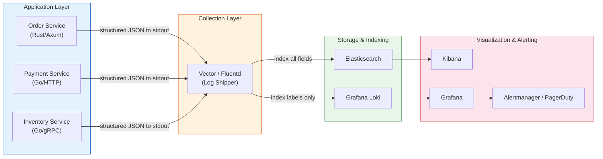
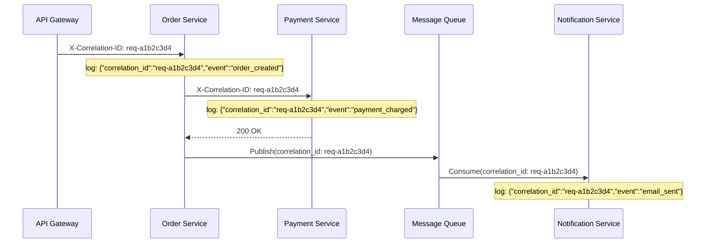

# Structured Logging / 結構化日誌

## Intent / 意圖

產生機器可解析（machine-parseable）、可查詢（queryable）的日誌紀錄，用於生產環境中的除錯、監控與效能分析。結構化日誌的核心精神是：**每一筆日誌都是一個具有明確欄位的事件（event），而非一段隨意拼接的字串。** 這使得日誌能夠被自動化工具索引、搜尋、聚合與告警——將日誌從「開發者偶爾看的文字」提升為「營運團隊持續依賴的可觀測性（observability）資料源」。

核心問題：**在分散式系統中，如何讓散落在數十個服務實例中的日誌紀錄變得可搜尋、可關聯、可聚合，從而快速定位跨服務問題的根因？**

---

## Problem / 問題情境

**場景一：非結構化日誌的搜尋噩夢**

某微服務架構的電商平台有 30 個服務、每個服務 5 個副本，每秒產出上萬筆日誌。當客戶回報「訂單支付成功但庫存未扣減」時，工程師需要追蹤從 API Gateway → Order Service → Payment Service → Inventory Service 的完整請求鏈路。但每個服務的日誌格式都不同——有的用 `fmt.Printf("order %d processed", id)`，有的用 `log.info("Payment OK for user " + userId)`。grep 搜尋需要針對每個服務寫不同的正則表達式，且無法跨服務關聯同一個使用者請求的所有日誌。

**場景二：跨服務關聯斷裂**

一個請求從 API Gateway 進入後，經過 Auth Service、Business Logic Service、Database Proxy，最後觸發非同步的 Notification Service。每個服務都有自己的日誌，但沒有共用的 correlation ID。當非同步通知失敗時，工程師無法將通知服務的錯誤日誌回溯到原始的 HTTP 請求，因為兩者之間沒有任何可關聯的標識。

---

## Core Concepts / 核心概念

### Structured Logging vs Printf / 結構化日誌 vs Printf

傳統 `printf` 風格日誌產出純文字，機器難以可靠解析。結構化日誌將每筆紀錄表示為 key-value pairs（通常序列化為 JSON），如 `{"event":"user_login","username":"alice","ip":"10.0.1.5"}`。每個欄位都是可獨立查詢的維度——可以在 Elasticsearch 中搜尋 `username:alice AND event:user_login`，或在 Grafana Loki 中用 LogQL 聚合每分鐘的登入次數。

### Log Levels / 日誌等級

- **TRACE**：最細粒度的診斷資訊。僅在本地開發或臨時調查中開啟，生產環境不應啟用。
- **DEBUG**：開發過程中有用的診斷資訊（SQL 查詢、HTTP body）。生產環境預設關閉，可動態開啟排查問題。
- **INFO**：系統正常運作的關鍵里程碑事件。生產環境的預設等級，記錄「發生了什麼」而非「怎麼做的」。
- **WARN**：不影響當前操作但值得注意的異常狀況（重試成功、快取 miss 率異常、即將到期的憑證）。
- **ERROR**：操作失敗但系統仍可繼續運作的錯誤。應觸發告警，且必須包含足夠上下文（request ID、error message）。

### Correlation ID / 關聯識別碼

全域唯一的 ID（UUID 或 ULID），在請求入口處生成，隨後透過 HTTP header（`X-Correlation-ID`）或 gRPC metadata 傳遞到所有下游服務。每筆日誌都附帶此 ID，搜尋單一 correlation ID 即可取得該請求在所有服務中的完整軌跡。

### Span Context / Span 上下文

在 OpenTelemetry 等分散式追蹤框架中，每個操作區間（span）都有 `trace_id` 和 `span_id`。將 span context 嵌入日誌，可在 Grafana 中從日誌直接跳轉到對應的 trace 視圖——實現 logs、traces、metrics 三大支柱的關聯。

### JSON Log Format / JSON 日誌格式

每筆日誌是一個 JSON 物件，包含固定欄位（`timestamp`、`level`、`message`）和動態欄位（`request_id`、`user_id`、`duration_ms`）。幾乎所有日誌收集工具（Fluentd、Vector、Filebeat）都原生支援解析 JSON。開發環境通常切換為 pretty-print 格式。

### Log Aggregation / 日誌聚合

- **ELK Stack (Elasticsearch + Logstash + Kibana)**：功能完整、生態豐富，但資源消耗大。適合大型企業。
- **Grafana Loki**：只索引 label（不索引日誌內容），儲存成本遠低於 Elasticsearch。適合已使用 Prometheus + Grafana 的團隊。
- **AWS CloudWatch Logs / GCP Cloud Logging**：雲端託管，零運維。查詢功能不如 ELK 靈活。

### Sampling / 取樣

(1) **頭部取樣（head-based）**——請求進入時決定是否記錄（如 10% 取樣率），簡單但可能漏掉錯誤請求；(2) **尾部取樣（tail-based）**——請求完成後根據結果決定保留（只保留錯誤和 P99 延遲的請求），更精確但實作複雜。

### Context Propagation / 上下文傳播

確保 correlation ID、trace context 從請求入口傳遞到所有下游服務和非同步任務。傳播機制：HTTP header（`X-Request-ID`、W3C `traceparent`）、gRPC metadata、訊息佇列 message header。應用程式內部存放在 request-scoped context（Go `context.Context`、Rust `tracing::Span`）。

### Tracing Subscriber / 追蹤訂閱者

Rust `tracing` 生態系的核心概念。`tracing` crate 產生 event 和 span，但不負責輸出——由 subscriber 決定。`tracing-subscriber` 提供 `fmt::Layer`（stdout）、JSON 序列化、`EnvFilter`（等級過濾）等 layer 組合。開發環境用 human-readable 格式、生產環境切換為 JSON，應用程式碼不需修改。

---

## Architecture / 架構

### 結構化日誌 Pipeline



### Correlation ID 傳播流程



---

## How It Works / 運作原理

### 每一層 Middleware 的上下文豐富化（Context Enrichment）

結構化日誌的關鍵在於**每一層 middleware 都向日誌上下文注入額外欄位**，業務邏輯的日誌自動附帶完整環境資訊：

1. **入口 Middleware**：生成或提取 `correlation_id`，記錄 `client_ip`、`http_method`、`path`，注入 request-scoped context。
2. **認證 Middleware**：從 JWT 提取 `user_id`、`tenant_id` 附加到 context，下游日誌自動包含使用者身份。
3. **業務邏輯層**：開發者只需記錄業務語義欄位（`order_id`、`action`），環境資訊由上層 middleware 注入。
4. **出口 Middleware**：記錄 `status_code`、`duration_ms`，形成包含所有上游欄位的完整請求摘要。

### Correlation ID 傳播機制

1. API Gateway 檢查 `X-Correlation-ID` header，存在則沿用，不存在則生成 UUID/ULID。
2. 存入 request-scoped context（Go `context.WithValue`、Rust `tracing::Span` field）。
3. 從該 context 產生的所有日誌自動包含 `correlation_id`，開發者不需手動傳入。
4. 呼叫下游服務時自動注入 outgoing header；發送 queue 訊息時放入 message header。

---

## Rust 實作

以 `tracing` + `tracing-subscriber` 搭配 Axum，實作 JSON 輸出、correlation ID middleware、request/response logging。

```rust
// structured_logging.rs — tracing + Axum middleware

use axum::{Router, extract::Request, middleware::{self, Next}, response::Response, routing::get};
use std::time::Instant;
use tracing::{info, warn, error, instrument};
use tracing_subscriber::{fmt, layer::SubscriberExt, util::SubscriberInitExt, EnvFilter};
use uuid::Uuid;

fn init_tracing() {
    let env_filter = EnvFilter::try_from_default_env()
        .unwrap_or_else(|_| EnvFilter::new("info"));
    let json_layer = fmt::layer().json().with_target(true)
        .with_file(true).with_line_number(true).flatten_event(true);
    tracing_subscriber::registry().with(env_filter).with(json_layer).init();
    info!(version = env!("CARGO_PKG_VERSION"), "tracing subscriber initialized");
}

async fn correlation_id_middleware(request: Request, next: Next) -> Response {
    let correlation_id = request.headers()
        .get("x-correlation-id").and_then(|v| v.to_str().ok())
        .map(String::from).unwrap_or_else(|| Uuid::new_v4().to_string());
    let method = request.method().clone();
    let uri = request.uri().path().to_string();
    let span = tracing::info_span!("http_request",
        correlation_id = %correlation_id, http.method = %method, http.route = %uri,
    );
    let _guard = span.enter();
    info!("request started");

    let start = Instant::now();
    let response = next.run(request).await;
    let duration_ms = start.elapsed().as_millis() as u64;
    let status = response.status().as_u16();
    if status >= 500 { error!(http.status_code = status, duration_ms, "server error"); }
    else if status >= 400 { warn!(http.status_code = status, duration_ms, "client error"); }
    else { info!(http.status_code = status, duration_ms, "request completed"); }
    response
}

#[instrument(skip_all, fields(order_id = %order_id))]
async fn get_order(
    axum::extract::Path(order_id): axum::extract::Path<u64>,
) -> axum::Json<serde_json::Value> {
    info!("fetching order from database");
    let order = fetch_order_from_db(order_id).await;
    match order {
        Some(data) => {
            info!(customer_id = data["customer_id"].as_u64().unwrap_or(0), "order retrieved");
            axum::Json(data)
        }
        None => { warn!("order not found"); axum::Json(serde_json::json!({"error":"not found"})) }
    }
}

#[instrument(skip_all, fields(db.system = "postgresql", db.operation = "SELECT"))]
async fn fetch_order_from_db(order_id: u64) -> Option<serde_json::Value> {
    info!(db.statement = "SELECT * FROM orders WHERE id = $1", "executing query");
    tokio::time::sleep(std::time::Duration::from_millis(12)).await;
    Some(serde_json::json!({"order_id": order_id, "customer_id": 1042, "total_cents": 8999}))
}

#[tokio::main]
async fn main() {
    init_tracing();
    let app = Router::new()
        .route("/orders/{order_id}", get(get_order))
        .layer(middleware::from_fn(correlation_id_middleware));
    let listener = tokio::net::TcpListener::bind("0.0.0.0:3000").await.unwrap();
    info!(addr = "0.0.0.0:3000", "server listening");
    axum::serve(listener, app).await.unwrap();
}

// Output (GET /orders/789):
// {"timestamp":"2026-02-17T08:30:01Z","level":"INFO","message":"request started","correlation_id":"req-a1b2c3d4","http.method":"GET","http.route":"/orders/789"}
// {"timestamp":"2026-02-17T08:30:01Z","level":"INFO","message":"executing query","correlation_id":"req-a1b2c3d4","db.system":"postgresql"}
// {"timestamp":"2026-02-17T08:30:01Z","level":"INFO","message":"order retrieved","correlation_id":"req-a1b2c3d4","customer_id":1042}
// {"timestamp":"2026-02-17T08:30:01Z","level":"INFO","message":"request completed","correlation_id":"req-a1b2c3d4","http.status_code":200,"duration_ms":13}
```

---

## Go 實作

以 `log/slog`（Go 1.21+ 標準庫）搭配 `net/http` middleware，實作 JSON handler、correlation ID 傳播、request/response logging。

```go
// structured_logging.go — slog + HTTP middleware

package main

import (
	"context"
	"encoding/json"
	"log/slog"
	"net/http"
	"os"
	"time"
	"github.com/google/uuid"
)

type contextKey string

const (
	correlationIDKey contextKey = "correlation_id"
	loggerKey        contextKey = "logger"
)

func InitLogger() *slog.Logger {
	handler := slog.NewJSONHandler(os.Stdout, &slog.HandlerOptions{Level: slog.LevelInfo, AddSource: true})
	logger := slog.New(handler)
	slog.SetDefault(logger)
	return logger
}

func CorrelationIDMiddleware(next http.Handler) http.Handler {
	return http.HandlerFunc(func(w http.ResponseWriter, r *http.Request) {
		correlationID := r.Header.Get("X-Correlation-ID")
		if correlationID == "" { correlationID = uuid.New().String() }

		requestLogger := slog.Default().With(
			slog.String("correlation_id", correlationID),
			slog.String("http.method", r.Method),
			slog.String("http.route", r.URL.Path),
		)
		ctx := context.WithValue(r.Context(), correlationIDKey, correlationID)
		ctx = context.WithValue(ctx, loggerKey, requestLogger)
		requestLogger.Info("request started")

		recorder := &statusRecorder{ResponseWriter: w, statusCode: http.StatusOK}
		start := time.Now()
		next.ServeHTTP(recorder, r.WithContext(ctx))
		durationMs := time.Since(start).Milliseconds()
		attrs := []slog.Attr{
			slog.Int("http.status_code", recorder.statusCode),
			slog.Int64("duration_ms", durationMs),
		}
		switch {
		case recorder.statusCode >= 500:
			requestLogger.LogAttrs(ctx, slog.LevelError, "server error", attrs...)
		case recorder.statusCode >= 400:
			requestLogger.LogAttrs(ctx, slog.LevelWarn, "client error", attrs...)
		default:
			requestLogger.LogAttrs(ctx, slog.LevelInfo, "request completed", attrs...)
		}
	})
}

type statusRecorder struct {
	http.ResponseWriter
	statusCode int
}
func (r *statusRecorder) WriteHeader(code int) {
	r.statusCode = code; r.ResponseWriter.WriteHeader(code)
}

func LoggerFromContext(ctx context.Context) *slog.Logger {
	if logger, ok := ctx.Value(loggerKey).(*slog.Logger); ok { return logger }
	return slog.Default()
}

func handleGetOrder(w http.ResponseWriter, r *http.Request) {
	ctx := r.Context()
	logger := LoggerFromContext(ctx).With(slog.String("order_id", r.PathValue("order_id")))
	logger.Info("fetching order from database")

	order, err := fetchOrderFromDB(ctx, r.PathValue("order_id"))
	if err != nil {
		logger.Error("failed to fetch order", slog.String("error", err.Error()))
		http.Error(w, `{"error":"internal server error"}`, http.StatusInternalServerError)
		return
	}
	if order == nil {
		logger.Warn("order not found")
		http.Error(w, `{"error":"not found"}`, http.StatusNotFound)
		return
	}
	logger.Info("order retrieved", slog.Int64("customer_id", order.CustomerID))
	w.Header().Set("Content-Type", "application/json")
	json.NewEncoder(w).Encode(order)
}

type Order struct {
	OrderID    string `json:"order_id"`
	CustomerID int64  `json:"customer_id"`
	TotalCents int64  `json:"total_cents"`
	Status     string `json:"status"`
}

func fetchOrderFromDB(ctx context.Context, orderID string) (*Order, error) {
	logger := LoggerFromContext(ctx)
	logger.Info("executing query",
		slog.String("db.system", "postgresql"),
		slog.String("db.statement", "SELECT * FROM orders WHERE id = $1"),
	)
	time.Sleep(12 * time.Millisecond)
	return &Order{OrderID: orderID, CustomerID: 1042, TotalCents: 8999, Status: "confirmed"}, nil
}

func main() {
	logger := InitLogger()
	mux := http.NewServeMux()
	mux.HandleFunc("GET /orders/{order_id}", handleGetOrder)
	server := &http.Server{Addr: "0.0.0.0:3000", Handler: CorrelationIDMiddleware(mux)}
	logger.Info("server listening", slog.String("addr", server.Addr))
	if err := server.ListenAndServe(); err != nil {
		logger.Error("server failed", slog.String("error", err.Error()))
		os.Exit(1)
	}
}

// Output (GET /orders/789):
// {"time":"2026-02-17T08:30:01Z","level":"INFO","msg":"request started","correlation_id":"req-a1b2c3d4","http.method":"GET","http.route":"/orders/789"}
// {"time":"2026-02-17T08:30:01Z","level":"INFO","msg":"executing query","correlation_id":"req-a1b2c3d4","db.system":"postgresql"}
// {"time":"2026-02-17T08:30:01Z","level":"INFO","msg":"order retrieved","correlation_id":"req-a1b2c3d4","customer_id":1042}
// {"time":"2026-02-17T08:30:01Z","level":"INFO","msg":"request completed","correlation_id":"req-a1b2c3d4","http.status_code":200,"duration_ms":13}
```

---

## Rust vs Go 對照表

| 面向 | Rust (tracing) | Go (log/slog) |
|---|---|---|
| **上下文傳播** | Span 樹自動傳播：span 內所有 `info!()` 自動繼承 parent fields。透過 thread-local storage 追蹤當前 span，不需手動傳遞 logger。`#[instrument]` macro 自動建立 span | `context.Context` 顯式傳遞 logger。`logger.With()` 附加欄位後存入 context，下游 `LoggerFromContext(ctx)` 取得。行為透明可測試，但忘記傳 context 就遺失欄位 |
| **等級動態調整** | `EnvFilter` + `RUST_LOG` 環境變數，搭配 `reload::Handle` 可執行期 API 動態調整 | `slog.LevelVar` + `LevelVar.Set()` 即時調整。標準庫原生支援，搭配管理 HTTP endpoint |
| **擴展架構** | Layer 疊加：多個 Layer（JSON、OTel 匯出、模組過濾）組合在同一 subscriber，互不干擾 | `slog.Handler` 介面僅 `Enabled` + `Handle` 兩方法。多目標需自行 fan-out。簡潔介面使自訂 PII 過濾容易 |

---

## When to Use / 適用場景

### 1. 微服務 / 分散式系統的生產環境日誌

當系統由多個服務組成且部署在多個實例上時，結構化日誌幾乎是必須的。Correlation ID 讓跨服務請求追蹤變得可能，JSON 格式讓日誌聚合工具能夠自動索引所有欄位。排查問題的效率會隨著服務數量增加而急劇下降——結構化日誌是基本防線。

### 2. 日誌驅動告警與 SLO 監控

當團隊需要根據日誌內容自動觸發告警（如「ERROR 在 5 分鐘內超過 100 筆」、「P99 延遲超過 500ms」）時，日誌中的 `duration_ms`、`http.status_code` 等欄位可被 LogQL 或 Kibana Alert 直接查詢和聚合，無需額外的 metrics pipeline。

---

## When NOT to Use / 不適用場景

### 1. 短期腳本與一次性工具

資料遷移腳本、CSV 轉換工具、小型 CLI 工具——`println!()` 或 `fmt.Println()` 就足夠了。引入完整的結構化日誌框架增加了不必要的複雜度。這些工具的使用者就是開發者自己，不需要機器解析。

### 2. 極致低延遲的 Hot Path

每秒處理數百萬事件的串流核心迴圈（高頻交易撮合引擎、遊戲伺服器物理引擎 tick），即使是「已停用等級」的原子讀取開銷也可能不可接受。這類場景使用 ring buffer metrics 計數器替代日誌，日誌記錄應移到 hot path 之外。

---

## Real-World Examples / 真實世界案例

### Datadog

Datadog APM 透過 `dd.trace_id` 和 `dd.span_id` 欄位將結構化日誌關聯到分散式追蹤的 span——點擊 trace 中任意 span 即可看到該期間所有日誌。Log Pipeline 自動解析 JSON、根據欄位值添加 tag、基於日誌內容觸發告警。Log Pattern 功能自動叢集化日誌，識別佔用最多儲存的日誌模式。

### Grafana Loki

設計哲學是「like Prometheus, but for logs」——**不索引日誌內容**，只索引 label，查詢時才全文搜尋。儲存成本約 ELK 的 1/10 到 1/5。搭配 LogQL JSON parser（如 `{app="order-service"} | json | duration_ms > 500`）可高效過濾聚合。與 Tempo（tracing）和 Prometheus（metrics）深度整合，實現 log → trace → metric 無縫跳轉。

### AWS CloudWatch Logs Insights

支援結構化 JSON 欄位查詢：`fields @timestamp, correlation_id | filter http.status_code >= 500 | stats count() by http.route`。優勢是與 AWS 生態系深度整合（Lambda stdout 自動收集、ECS/EKS awslogs driver）。缺點是查詢語法不如 Elasticsearch 靈活。

---

## Interview Questions / 面試常見問題

### Q1: 結構化日誌與 printf 日誌的核心差異？

**A:** `printf` 日誌是自由格式文字，提取欄位需寫正則表達式且格式變動即失效。結構化日誌以 key-value pairs（JSON）表示，每個欄位可獨立查詢。在分散式系統中，聚合平台能：(1) 精確搜尋 `correlation_id:abc123 AND level:ERROR`；(2) 聚合分析（每分鐘 ERROR 數、P99 延遲）；(3) 透過 correlation ID 跨服務關聯同一請求的日誌。

### Q2: 什麼是 correlation ID？如何在微服務中傳播？

**A:** 全域唯一識別碼，在請求第一個接觸點（API Gateway）生成。傳播機制：同步呼叫透過 HTTP header `X-Correlation-ID` 或 gRPC metadata；非同步通訊透過 message queue 的 message header。每個服務的 middleware 從 incoming request 提取並注入 request-scoped context，所有日誌自動附帶此 ID。搜尋單一 correlation ID 即可取得完整跨服務軌跡。

### Q3: 如何在生產環境中動態調整日誌等級而不重啟服務？

**A:** Rust 的 `tracing-subscriber` 支援 `reload::Handle`，可執行期呼叫 `handle.modify()` 動態切換 `EnvFilter`。Go 的 `slog` 將 `Level` 設為 `*slog.LevelVar`，透過 `levelVar.Set(slog.LevelDebug)` 即時調整。通常搭配認證過的內部 HTTP endpoint（`PUT /admin/log-level`），讓 SRE 在事故調查時臨時降低到 DEBUG。

### Q4: 日誌中記錄 PII（個人識別資訊）有什麼風險？如何防範？

**A:** 風險：違反 GDPR/個資法、日誌存取控制比主資料庫寬鬆導致 PII 洩漏面擴大。防範：(1) log handler 層自動遮罩敏感欄位（`password` → `[REDACTED]`）；(2) 禁止記錄完整 request/response body，改記 hash 或 size；(3) 定期用自動化工具掃描日誌中的 PII pattern；(4) PII 相關日誌設定較短保留期限。

### Q5: 比較 ELK Stack 和 Grafana Loki。

**A:** **ELK** 優點：全文索引搜尋快、Kibana 視覺化豐富、生態成熟。缺點：儲存成本高、叢集運維複雜。**Loki** 優點：只索引 label，儲存成本約 ELK 1/10 到 1/5、運維簡單（S3/GCS 後端）、Grafana 生態系深度整合。缺點：未索引欄位需全文掃描。選擇：已有 Grafana + Prometheus 且預算有限 → Loki；需全文搜尋或已熟悉 ELK → Elasticsearch。

---

## Pitfalls / 常見陷阱

### 1. Log Volume Explosion / 日誌量爆炸

開發者在 hot path 不當使用 DEBUG/INFO（每次 DB 查詢記錄完整 SQL 和結果集），日誌量從 GB 膨脹到 TB，儲存費用飆升、噪音淹沒有價值訊號。**對策**：建立日誌等級指南、code review 審查等級、高頻事件使用取樣或聚合、設定儲存 quota 和異常增長告警。

### 2. PII Leakage in Logs / 日誌中洩漏個人識別資訊

為除錯方便將完整 request/response body 記錄到日誌，可能包含密碼、信用卡號。日誌存取控制遠不如主資料庫嚴格。**對策**：log handler 實作自動遮罩層（`password` → `[REDACTED]`）、禁止記錄完整 body 改記 hash/size、定期掃描日誌中 PII pattern。

### 3. Missing Context / 缺失上下文

只記錄 `"database query failed"` 但沒記錄哪個查詢、什麼參數、哪個使用者觸發。更隱蔽的是 correlation ID 在非同步邊界斷裂。**對策**：每筆 ERROR 必須包含 `correlation_id`、`operation`、`error_message`；middleware 層自動注入公共欄位；Rust 中使用 `.instrument(span)` 附加到 spawned future，Go 中將 `ctx` 傳入 goroutine。

---

## Cross-references / 交叉引用

- [[21_caching_redis_patterns|Caching & Redis Patterns]] — 快取 hit/miss 事件是結構化日誌的典型應用。`[CACHE-HIT]` 改用 `{"event":"cache_hit","key":"product:42"}` 即可在 Grafana 建立 cache hit rate dashboard。
- [[../distributed_systems/19_idempotency_design|Idempotency Design]] — 偵測到重複 idempotency key 時，結構化日誌記錄 `{"event":"duplicate_request","idempotency_key":"idem-xyz"}`，幫助運維區分正常重試與異常重送。
- [[../distributed_systems/13_saga_pattern|Saga Pattern]] — Saga 跨服務長事務依賴 correlation ID 追蹤執行狀態，每個 step 成功/失敗與補償動作都應關聯到同一 saga ID。

---

## References / 參考資料

1. **Rust `tracing` crate** — https://docs.rs/tracing/latest/tracing/ — Rust 結構化日誌/追蹤事實標準。
2. **Go `log/slog`** — https://pkg.go.dev/log/slog — Go 1.21+ 內建結構化日誌標準庫。
3. **Observability Engineering** — Charity Majors, Liz Fong-Jones, George Miranda. O'Reilly, 2022.
4. **Designing Data-Intensive Applications** — Martin Kleppmann. Ch.11: Stream Processing.
5. **OpenTelemetry Specification** — https://opentelemetry.io/docs/specs/otel/ — logs/traces/metrics 標準 API。
6. **Grafana Loki Documentation** — https://grafana.com/docs/loki/latest/ — LogQL 查詢語法與最佳實踐。
