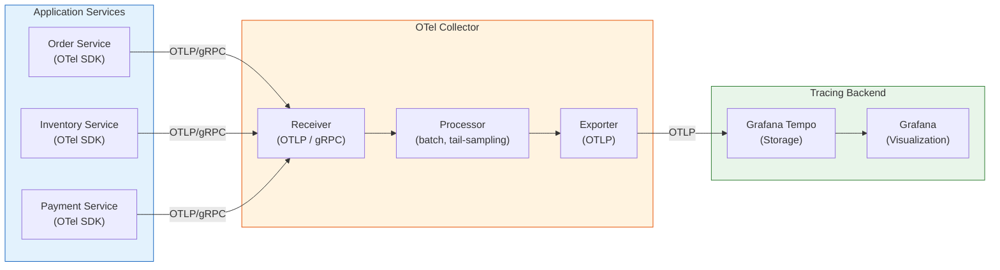
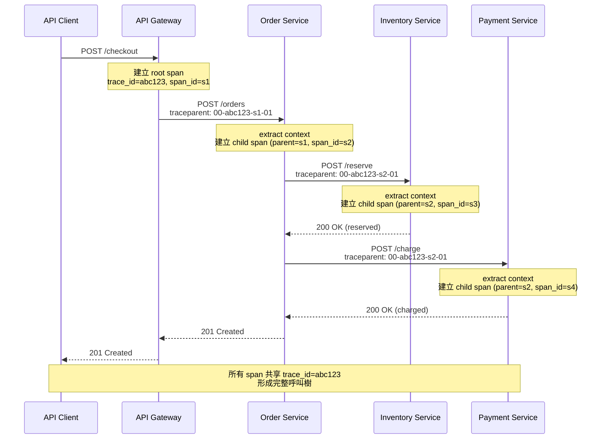

# Distributed Tracing / 分散式追蹤

## Intent / 意圖

在分散式系統中追蹤單一請求跨越多個服務邊界的完整生命週期，以便進行效能分析、延遲診斷和根因定位（root cause analysis）。分散式追蹤的本質是為每個外部請求建立一棵「因果關係樹」——記錄請求經過哪些服務、每段處理花了多少時間、在哪個環節發生錯誤或瓶頸。

核心問題：**當一個使用者請求穿越 5 個以上的微服務時，如何精確定位「延遲到底花在哪裡」、「哪個下游服務拖慢了整體回應」、「錯誤是在哪個環節首次發生並向上傳播的」？**

---

## Problem / 問題情境

**場景一：電商結帳的神秘延遲**

某電商平台的結帳流程需要依序呼叫：API Gateway -> 訂單服務 -> 庫存服務 -> 支付服務 -> 通知服務。使用者回報結帳偶爾需要等待 8 秒以上，但每個服務的平均回應時間都在 200ms 以內。問題在於：沒有端到端的追蹤手段，無法判斷延遲究竟來自哪個服務的哪次呼叫。傳統的日誌分析只能看到各服務獨立的時間戳記，無法串聯同一筆請求的完整路徑。最終發現是支付服務在 retry 失敗後等待了 5 秒的 backoff，但在沒有追蹤的情況下，這個資訊被淹沒在數百萬筆日誌中。

**場景二：跨服務錯誤的溯源困境**

微服務架構中，使用者看到的錯誤訊息是「500 Internal Server Error」，但根因可能在呼叫鏈的第四層——推薦服務 -> ML 模型服務 -> 特徵儲存 -> Redis。沒有追蹤時，SRE 團隊需要逐一登入每個服務檢查日誌，靠時間戳記和猜測拼湊呼叫關係。一個本應 5 分鐘定位的問題，花了 2 小時才找到根因。更糟的是，間歇性錯誤在日誌海洋中幾乎無法重現。

**場景三：Sampling 策略不當導致關鍵追蹤遺失**

團隊初次導入追蹤系統時設定了 100% 採樣率，結果追蹤資料的儲存成本比業務資料庫還高。改為 1% head-based sampling 後，恰好那些偶發的慢請求（tail latency，P99 問題）幾乎從未被採樣到——最需要分析的異常請求反而看不到。團隊缺乏對 sampling 策略的理解，導致追蹤系統形同虛設。

---

## Core Concepts / 核心概念

### Trace / 追蹤

一個 trace 代表單一請求在整個分散式系統中的完整旅程。它由一棵 span 樹組成，每個 span 代表一段獨立的工作單元。Trace 透過全域唯一的 trace ID（128-bit 隨機值）來識別——所有屬於同一請求的 span 共享相同的 trace ID，使得分散在不同服務的 span 能被關聯起來。

### Span / 跨度

Span 是追蹤的基本單位，代表一個具名的、有時間範圍的操作。每個 span 包含：(1) span ID（64-bit 唯一識別碼）；(2) parent span ID（形成父子關係）；(3) 操作名稱（如 `POST /api/orders`）；(4) 開始和結束時間戳記；(5) 狀態碼（OK / Error）；(6) attributes（key-value 元資料，如 `http.method=POST`、`http.status_code=200`）；(7) events（span 生命週期中的時間點事件，如 exception）。根 span（root span）沒有 parent，代表整個請求的入口。

### Span Context / 跨度上下文

在服務間傳遞的輕量級資料結構，包含 trace ID、span ID、trace flags（如是否被採樣）和 trace state（廠商自訂資訊）。Span context 是連接跨服務 span 的關鍵——當服務 A 呼叫服務 B 時，A 將自身的 span context 注入（inject）到 HTTP header 或 gRPC metadata 中，B 從中提取（extract）後建立子 span，從而形成父子關係。

### W3C Trace Context / W3C 追蹤上下文

W3C 標準化的 HTTP header 格式，用於跨服務傳播追蹤上下文。兩個標準 header：(1) `traceparent`——格式為 `{version}-{trace-id}-{parent-span-id}-{trace-flags}`，如 `00-4bf92f3577b34da6a3ce929d0e0e4736-00f067aa0ba902b7-01`；(2) `tracestate`——廠商自訂的鍵值對列表，如 `congo=t61rcWkgMzE,rojo=00f067aa0ba902b7`。W3C Trace Context 解決了過去各追蹤系統（Zipkin 用 `X-B3-*`、Jaeger 用 `uber-trace-id`）header 格式不統一的問題。

### Baggage / 行李

與追蹤上下文一起跨服務傳播的使用者自訂 key-value 對。與 span attributes 不同，baggage 會沿著整個呼叫鏈向下傳遞——服務 A 設定的 baggage，服務 B、C、D 都能讀取。適合傳遞如 `tenant-id`、`user-tier` 等需要在所有下游服務中使用的資訊。注意：baggage 會增加每個網路請求的 header 大小，應謹慎使用。

### OpenTelemetry (OTel) / 開放遙測

CNCF 專案，提供標準化的 API、SDK 和工具來產生、收集和匯出遙測資料（traces、metrics、logs）。OTel 定義了與廠商無關的資料格式（OTLP，OpenTelemetry Protocol），讓應用程式不必綁定特定的追蹤後端。核心組件：(1) **API**——定義 tracer、span 等抽象介面；(2) **SDK**——實作 span 的建立、處理和匯出邏輯；(3) **Exporter**——將追蹤資料送往後端（Jaeger、Tempo、Zipkin、OTLP endpoint）；(4) **Propagator**——處理 span context 的 inject/extract。

### Collector / 收集器

OTel Collector 是獨立部署的中介元件，負責接收、處理和轉發遙測資料。三個 pipeline 階段：(1) **Receiver**——接收來自應用程式的追蹤資料（支援 OTLP、Jaeger、Zipkin 等格式）；(2) **Processor**——在轉發前處理資料（批次化、採樣、屬性篩選、tail-based sampling）；(3) **Exporter**——將處理後的資料送往儲存後端。Collector 的優勢：解耦應用程式與後端，允許在不改動應用程式的情況下切換追蹤後端或調整採樣策略。

### Sampling Strategies / 採樣策略

- **Head-based sampling**：在請求進入系統時就決定是否採樣。優點：簡單高效，決策只需在入口做一次；缺點：決策時還不知道這個請求是否「有趣」（如是否會出錯、是否延遲異常），可能遺漏有價值的追蹤。
- **Tail-based sampling**：在請求完成後、根據完整的追蹤資料來決定是否保留。例如：只保留延遲 > P95 的追蹤、只保留包含錯誤的追蹤。優點：能精確保留有分析價值的追蹤；缺點：需要在 Collector 層暫存所有追蹤直到決策，記憶體消耗較大。
- **混合策略**：低比例 head-based（如 5%）確保基線覆蓋，搭配 tail-based 確保錯誤和異常延遲的追蹤 100% 被保留。

### Instrumentation / 儀器化

將追蹤邏輯嵌入應用程式碼的過程。(1) **自動儀器化（auto-instrumentation）**——透過 middleware 或攔截器自動為 HTTP、gRPC、資料庫呼叫建立 span，無需修改業務邏輯。Go 和 Rust 的 OTel SDK 都提供常見框架的自動儀器化套件。(2) **手動儀器化（manual instrumentation）**——在業務邏輯中明確建立 span、添加 attributes 和 events，提供更細粒度的追蹤。最佳實踐是兩者結合：自動儀器化覆蓋基礎設施層，手動儀器化補充關鍵業務邏輯。

---

## Architecture / 架構

### 分散式追蹤完整 Pipeline



### 跨服務 Trace Context 傳播



---

## How It Works / 運作原理

### Trace Context 的跨邊界傳播

分散式追蹤的核心機制是 trace context 在服務間的傳播（propagation）。整個過程分為三個階段：

**1. 建立根 span（Root Span Creation）：**

當請求進入系統的第一個服務時，OTel SDK 檢查傳入的 HTTP header 或 gRPC metadata 是否包含 `traceparent`。如果沒有，SDK 產生一個新的 trace ID 和 span ID，建立 root span。如果已存在（例如上游的 load balancer 已注入），則提取該 context 並建立子 span。

**2. 注入與提取（Inject / Extract）：**

當服務 A 呼叫服務 B 時：
- **Inject**：服務 A 的 OTel SDK 將當前 span 的 context（trace ID + span ID + trace flags）序列化為 `traceparent` header 並附加到外發的 HTTP 請求或 gRPC metadata 中。
- **Extract**：服務 B 的 OTel SDK 從傳入請求的 header 中反序列化出 span context，以此作為 parent 建立新的子 span。

這個 inject/extract 機制由 **Propagator** 實作。W3C TraceContext propagator 是 OTel 的預設選擇，它操作 `traceparent` 和 `tracestate` 兩個 HTTP header。

**3. Span 生命週期（Span Lifecycle）：**

一個 span 從 `start` 到 `end` 之間可以：(1) 設定 attributes（`span.set_attribute("order.id", 42)`）——附加業務元資料；(2) 記錄 events（`span.add_event("payment_retry", { attempt: 2 })`）——標記重要時間點；(3) 設定 status（`span.set_status(Error, "timeout")`）——標記成功或失敗；(4) 建立子 span——代表操作中的子步驟。當 span 結束（`end`）後，它被送入 SpanProcessor。BatchSpanProcessor 會累積 span 直到達到批次大小或時間間隔，然後透過 Exporter 批次發送給 Collector 或直接送往後端。

### Sampling 決策流程

**Head-based sampling** 在 root span 建立時做出決策。SDK 的 Sampler 根據設定的比率（如 0.05 代表 5%）產生隨機數，決定這個 trace 是否被記錄。決策結果寫入 `traceparent` 的 trace flags 位元（`01` 表示已採樣），下游服務讀取此位元後跟隨上游的決策——確保同一 trace 的所有 span 要麼全部記錄、要麼全部丟棄。

**Tail-based sampling** 在 Collector 層運作。Collector 暫存所有收到的 span，等待同一 trace ID 的所有 span 到齊（或超時），然後根據完整 trace 的特徵（總延遲、是否包含錯誤、特定 attribute 值）決定是否保留。這需要 Collector 有足夠的記憶體和狀態管理能力。

---

## Rust 實作

以下實作基於 Axum web 框架，整合 `tracing` crate 與 `opentelemetry-otlp`，展示完整的分散式追蹤：auto-instrumented HTTP server middleware、手動 span 建立、以及跨服務的 trace context propagation。

```rust
// distributed_tracing.rs
// Axum + OpenTelemetry distributed tracing with OTLP exporter

use axum::{
    extract::Path,
    http::{HeaderMap, StatusCode},
    middleware::{self, Next},
    response::IntoResponse,
    routing::{get, post},
    Json, Router,
};
use opentelemetry::{
    global,
    propagation::Extractor,
    trace::{Span, SpanKind, Status, Tracer, TracerProvider},
    KeyValue,
};
use opentelemetry_otlp::SpanExporter;
use opentelemetry_sdk::{
    propagation::TraceContextPropagator,
    trace::{self as sdktrace, SdkTracerProvider},
    Resource,
};
use serde::{Deserialize, Serialize};
use std::time::Duration;
use tracing_opentelemetry::OpenTelemetryLayer;
use tracing_subscriber::{layer::SubscriberExt, util::SubscriberInitExt};

/// 訂單請求
#[derive(Debug, Deserialize)]
struct CreateOrderRequest {
    product_id: u64,
    quantity: u32,
    customer_id: u64,
}

/// 訂單回應
#[derive(Debug, Serialize)]
struct OrderResponse {
    order_id: String,
    status: String,
    trace_id: String,
}

/// 初始化 OpenTelemetry tracing pipeline
fn init_tracer_provider(service_name: &str) -> SdkTracerProvider {
    // 設定 W3C TraceContext 作為全域 propagator
    global::set_text_map_propagator(TraceContextPropagator::new());

    // 建立 OTLP gRPC exporter，送往 OTel Collector
    let exporter = SpanExporter::builder()
        .with_tonic()
        .with_endpoint("http://localhost:4317")
        .with_timeout(Duration::from_secs(5))
        .build()
        .expect("Failed to create OTLP exporter");

    // 建立 TracerProvider，設定 batch processor 和 resource 屬性
    let provider = SdkTracerProvider::builder()
        .with_batch_exporter(exporter)
        .with_resource(Resource::builder()
            .with_service_name(service_name)
            .build())
        .build();

    global::set_tracer_provider(provider.clone());
    provider
}

/// 初始化 tracing subscriber（結合 structured logging + OTel tracing）
fn init_tracing(service_name: &str) -> SdkTracerProvider {
    let provider = init_tracer_provider(service_name);
    let tracer = provider.tracer(service_name.to_string());

    tracing_subscriber::registry()
        .with(tracing_subscriber::fmt::layer()
            .with_target(true)
            .with_thread_ids(true)
            .json())
        .with(OpenTelemetryLayer::new(tracer))
        .init();

    provider
}

/// 從 HTTP HeaderMap 提取 trace context 的 Extractor 實作
struct HeaderExtractor<'a>(&'a HeaderMap);

impl<'a> Extractor for HeaderExtractor<'a> {
    fn get(&self, key: &str) -> Option<&str> {
        self.0.get(key).and_then(|v| v.to_str().ok())
    }

    fn keys(&self) -> Vec<&str> {
        self.0.keys().map(|k| k.as_str()).collect()
    }
}

/// OTel tracing middleware：自動為每個 HTTP 請求建立 span
async fn tracing_middleware(
    request: axum::extract::Request,
    next: Next,
) -> impl IntoResponse {
    let tracer = global::tracer("http-server");

    // 從傳入的 HTTP header 提取 parent span context
    let parent_context = global::get_text_map_propagator(|propagator| {
        propagator.extract(&HeaderExtractor(request.headers()))
    });

    let method = request.method().to_string();
    let uri = request.uri().path().to_string();
    let span_name = format!("{} {}", method, uri);

    // 建立 server span，關聯到 parent context
    let mut span = tracer
        .span_builder(span_name)
        .with_kind(SpanKind::Server)
        .start_with_context(&tracer, &parent_context);

    span.set_attribute(KeyValue::new("http.method", method.clone()));
    span.set_attribute(KeyValue::new("http.target", uri.clone()));

    // 執行實際的 handler
    let response = next.run(request).await;

    let status_code = response.status().as_u16() as i64;
    span.set_attribute(KeyValue::new("http.status_code", status_code));

    if response.status().is_server_error() {
        span.set_status(Status::error("Server error"));
    } else {
        span.set_status(Status::Ok);
    }

    span.end();
    response
}

/// 建立訂單 handler（手動儀器化關鍵業務邏輯）
#[tracing::instrument(name = "create_order", skip(payload))]
async fn create_order_handler(
    Json(payload): Json<CreateOrderRequest>,
) -> Result<Json<OrderResponse>, StatusCode> {
    let tracer = global::tracer("order-service");

    // 子 span：庫存檢查
    let mut inventory_span = tracer
        .span_builder("check_inventory")
        .with_kind(SpanKind::Client)
        .start(&tracer);
    inventory_span.set_attribute(KeyValue::new(
        "product.id", payload.product_id as i64,
    ));
    inventory_span.set_attribute(KeyValue::new(
        "order.quantity", payload.quantity as i64,
    ));

    // 模擬呼叫庫存服務（實際會發 HTTP 請求並注入 trace context）
    let inventory_available =
        check_inventory(payload.product_id, payload.quantity).await;

    if !inventory_available {
        inventory_span.set_status(Status::error("Insufficient inventory"));
        inventory_span.add_event(
            "inventory_check_failed",
            vec![KeyValue::new("product.id", payload.product_id as i64)],
        );
        inventory_span.end();
        return Err(StatusCode::CONFLICT);
    }
    inventory_span.set_status(Status::Ok);
    inventory_span.end();

    // 子 span：支付處理
    let mut payment_span = tracer
        .span_builder("process_payment")
        .with_kind(SpanKind::Client)
        .start(&tracer);
    payment_span.set_attribute(KeyValue::new(
        "customer.id", payload.customer_id as i64,
    ));

    let payment_result =
        process_payment(payload.customer_id, payload.quantity).await;

    match payment_result {
        Ok(()) => {
            payment_span.set_status(Status::Ok);
        }
        Err(err_msg) => {
            payment_span.set_status(Status::error(err_msg.clone()));
            payment_span.add_event(
                "payment_failed",
                vec![KeyValue::new("error.message", err_msg)],
            );
            payment_span.end();
            return Err(StatusCode::PAYMENT_REQUIRED);
        }
    }
    payment_span.end();

    // 取得當前 trace ID 供回應使用
    let trace_id = inventory_span
        .span_context()
        .trace_id()
        .to_string();

    let order_id = format!("ORD-{}", uuid::Uuid::new_v4());
    tracing::info!(
        order_id = %order_id,
        product_id = payload.product_id,
        quantity = payload.quantity,
        "Order created successfully"
    );

    Ok(Json(OrderResponse {
        order_id,
        status: "confirmed".to_string(),
        trace_id,
    }))
}

/// 查詢訂單 handler
#[tracing::instrument(name = "get_order")]
async fn get_order_handler(
    Path(order_id): Path<String>,
) -> Result<Json<OrderResponse>, StatusCode> {
    let tracer = global::tracer("order-service");

    let mut db_span = tracer
        .span_builder("db.query")
        .with_kind(SpanKind::Client)
        .start(&tracer);
    db_span.set_attribute(KeyValue::new(
        "db.system", "postgresql",
    ));
    db_span.set_attribute(KeyValue::new(
        "db.statement", "SELECT * FROM orders WHERE id = $1",
    ));

    // 模擬 DB 查詢
    tokio::time::sleep(Duration::from_millis(5)).await;
    db_span.set_status(Status::Ok);
    db_span.end();

    Ok(Json(OrderResponse {
        order_id,
        status: "confirmed".to_string(),
        trace_id: "from-context".to_string(),
    }))
}

/// 模擬庫存檢查
async fn check_inventory(product_id: u64, quantity: u32) -> bool {
    tokio::time::sleep(Duration::from_millis(15)).await;
    tracing::info!(
        product_id = product_id,
        quantity = quantity,
        "Inventory check passed"
    );
    quantity <= 100
}

/// 模擬支付處理
async fn process_payment(
    customer_id: u64,
    quantity: u32,
) -> Result<(), String> {
    tokio::time::sleep(Duration::from_millis(50)).await;
    tracing::info!(
        customer_id = customer_id,
        amount = quantity * 100,
        "Payment processed"
    );
    Ok(())
}

#[tokio::main]
async fn main() {
    // 初始化 tracing（structured logging + OTel export）
    let provider = init_tracing("order-service");

    let app = Router::new()
        .route("/orders", post(create_order_handler))
        .route("/orders/{order_id}", get(get_order_handler))
        .layer(middleware::from_fn(tracing_middleware));

    let listener =
        tokio::net::TcpListener::bind("0.0.0.0:3000").await.unwrap();
    tracing::info!("Order service listening on :3000");

    axum::serve(listener, app)
        .with_graceful_shutdown(shutdown_signal())
        .await
        .unwrap();

    // 確保所有 span 在關閉前被 flush
    provider.shutdown().expect("TracerProvider shutdown failed");
}

async fn shutdown_signal() {
    tokio::signal::ctrl_c()
        .await
        .expect("Failed to install CTRL+C signal handler");
    tracing::info!("Shutdown signal received, flushing traces...");
}

// Output:
// {"timestamp":"2026-02-17T10:00:00Z","level":"INFO","target":"order_service",
//  "message":"Order service listening on :3000","threadId":1}
//
// POST /orders with body: {"product_id":42,"quantity":2,"customer_id":1001}
// {"timestamp":"2026-02-17T10:00:01Z","level":"INFO",
//  "message":"Inventory check passed","product_id":42,"quantity":2,
//  "span_id":"s2","trace_id":"abc123..."}
// {"timestamp":"2026-02-17T10:00:01Z","level":"INFO",
//  "message":"Payment processed","customer_id":1001,"amount":200,
//  "span_id":"s3","trace_id":"abc123..."}
// {"timestamp":"2026-02-17T10:00:01Z","level":"INFO",
//  "message":"Order created successfully","order_id":"ORD-xxxx",
//  "span_id":"s1","trace_id":"abc123..."}
```

---

## Go 實作

以 Go 1.24+ 與 `go.opentelemetry.io/otel` 實作等價的分散式追蹤，包含 HTTP server middleware（自動儀器化）、手動 span 建立、以及使用 `otelhttp` 的 client-side trace context propagation。

```go
// distributed_tracing.go
// net/http + OpenTelemetry distributed tracing with OTLP exporter

package main

import (
	"context"
	"encoding/json"
	"fmt"
	"log/slog"
	"net/http"
	"os"
	"os/signal"
	"time"

	"go.opentelemetry.io/otel"
	"go.opentelemetry.io/otel/attribute"
	"go.opentelemetry.io/otel/codes"
	"go.opentelemetry.io/otel/exporters/otlp/otlptrace/otlptracegrpc"
	"go.opentelemetry.io/otel/propagation"
	"go.opentelemetry.io/otel/sdk/resource"
	sdktrace "go.opentelemetry.io/otel/sdk/trace"
	semconv "go.opentelemetry.io/otel/semconv/v1.26.0"
	"go.opentelemetry.io/otel/trace"
)

// CreateOrderRequest 建立訂單的請求
type CreateOrderRequest struct {
	ProductID  uint64 `json:"product_id"`
	Quantity   uint32 `json:"quantity"`
	CustomerID uint64 `json:"customer_id"`
}

// OrderResponse 訂單回應
type OrderResponse struct {
	OrderID string `json:"order_id"`
	Status  string `json:"status"`
	TraceID string `json:"trace_id"`
}

// initTracerProvider 初始化 OpenTelemetry tracer provider
func initTracerProvider(
	ctx context.Context,
	serviceName string,
) (*sdktrace.TracerProvider, error) {
	// 建立 OTLP gRPC exporter
	exporter, err := otlptracegrpc.New(ctx,
		otlptracegrpc.WithEndpoint("localhost:4317"),
		otlptracegrpc.WithInsecure(),
		otlptracegrpc.WithTimeout(5*time.Second),
	)
	if err != nil {
		return nil, fmt.Errorf("create OTLP exporter: %w", err)
	}

	// 建立 resource（標識此服務）
	res, err := resource.Merge(
		resource.Default(),
		resource.NewWithAttributes(
			semconv.SchemaURL,
			semconv.ServiceNameKey.String(serviceName),
			semconv.ServiceVersionKey.String("1.0.0"),
			attribute.String("environment", "production"),
		),
	)
	if err != nil {
		return nil, fmt.Errorf("create resource: %w", err)
	}

	// 建立 TracerProvider
	tp := sdktrace.NewTracerProvider(
		sdktrace.WithBatcher(exporter,
			sdktrace.WithBatchTimeout(5*time.Second),
			sdktrace.WithMaxExportBatchSize(512),
		),
		sdktrace.WithResource(res),
		sdktrace.WithSampler(sdktrace.ParentBased(
			sdktrace.TraceIDRatioBased(0.1), // 10% head-based sampling
		)),
	)

	// 設定全域 tracer provider 和 propagator
	otel.SetTracerProvider(tp)
	otel.SetTextMapPropagator(propagation.NewCompositeTextMapPropagator(
		propagation.TraceContext{}, // W3C Trace Context
		propagation.Baggage{},      // W3C Baggage
	))

	return tp, nil
}

// tracingMiddleware 自動為每個 HTTP 請求建立 server span
func tracingMiddleware(next http.Handler) http.Handler {
	tracer := otel.Tracer("http-server")

	return http.HandlerFunc(func(w http.ResponseWriter, r *http.Request) {
		// 從傳入的 HTTP header 提取 parent span context
		ctx := otel.GetTextMapPropagator().Extract(
			r.Context(),
			propagation.HeaderCarrier(r.Header),
		)

		spanName := fmt.Sprintf("%s %s", r.Method, r.URL.Path)
		ctx, span := tracer.Start(ctx, spanName,
			trace.WithSpanKind(trace.SpanKindServer),
			trace.WithAttributes(
				semconv.HTTPRequestMethodKey.String(r.Method),
				semconv.URLPath(r.URL.Path),
				semconv.ServerAddress(r.Host),
				attribute.String("http.user_agent", r.UserAgent()),
			),
		)
		defer span.End()

		// 使用自訂 ResponseWriter 捕獲 status code
		wrapped := &statusRecorder{ResponseWriter: w, statusCode: http.StatusOK}
		next.ServeHTTP(wrapped, r.WithContext(ctx))

		span.SetAttributes(
			semconv.HTTPResponseStatusCode(wrapped.statusCode),
		)
		if wrapped.statusCode >= 500 {
			span.SetStatus(codes.Error, "Server error")
		} else {
			span.SetStatus(codes.Ok, "")
		}
	})
}

// statusRecorder 包裝 ResponseWriter 以捕獲 status code
type statusRecorder struct {
	http.ResponseWriter
	statusCode int
}

func (sr *statusRecorder) WriteHeader(code int) {
	sr.statusCode = code
	sr.ResponseWriter.WriteHeader(code)
}

// createOrderHandler 建立訂單（手動儀器化）
func createOrderHandler(w http.ResponseWriter, r *http.Request) {
	ctx := r.Context()
	tracer := otel.Tracer("order-service")

	var req CreateOrderRequest
	if err := json.NewDecoder(r.Body).Decode(&req); err != nil {
		http.Error(w, "Invalid request body", http.StatusBadRequest)
		return
	}

	// 子 span：庫存檢查
	ctx, inventorySpan := tracer.Start(ctx, "check_inventory",
		trace.WithSpanKind(trace.SpanKindClient),
		trace.WithAttributes(
			attribute.Int64("product.id", int64(req.ProductID)),
			attribute.Int("order.quantity", int(req.Quantity)),
		),
	)

	available := checkInventory(ctx, req.ProductID, req.Quantity)
	if !available {
		inventorySpan.SetStatus(codes.Error, "Insufficient inventory")
		inventorySpan.AddEvent("inventory_check_failed", trace.WithAttributes(
			attribute.Int64("product.id", int64(req.ProductID)),
		))
		inventorySpan.End()
		http.Error(w, "Insufficient inventory", http.StatusConflict)
		return
	}
	inventorySpan.SetStatus(codes.Ok, "")
	inventorySpan.End()

	// 子 span：支付處理
	ctx, paymentSpan := tracer.Start(ctx, "process_payment",
		trace.WithSpanKind(trace.SpanKindClient),
		trace.WithAttributes(
			attribute.Int64("customer.id", int64(req.CustomerID)),
			attribute.Int("payment.amount_cents", int(req.Quantity)*100),
		),
	)

	if err := processPayment(ctx, req.CustomerID, req.Quantity); err != nil {
		paymentSpan.SetStatus(codes.Error, err.Error())
		paymentSpan.RecordError(err)
		paymentSpan.End()
		http.Error(w, "Payment failed", http.StatusPaymentRequired)
		return
	}
	paymentSpan.SetStatus(codes.Ok, "")
	paymentSpan.End()

	// 從 context 取得 trace ID
	spanCtx := trace.SpanFromContext(ctx).SpanContext()
	traceID := spanCtx.TraceID().String()

	orderID := fmt.Sprintf("ORD-%d", time.Now().UnixNano())
	slog.InfoContext(ctx, "Order created successfully",
		"order_id", orderID,
		"product_id", req.ProductID,
		"quantity", req.Quantity,
		"trace_id", traceID,
	)

	resp := OrderResponse{
		OrderID: orderID,
		Status:  "confirmed",
		TraceID: traceID,
	}

	w.Header().Set("Content-Type", "application/json")
	w.WriteHeader(http.StatusCreated)
	json.NewEncoder(w).Encode(resp)
}

// callDownstreamService 呼叫下游服務並自動注入 trace context
func callDownstreamService(
	ctx context.Context,
	method string,
	url string,
) (*http.Response, error) {
	tracer := otel.Tracer("http-client")
	ctx, span := tracer.Start(ctx, fmt.Sprintf("HTTP %s %s", method, url),
		trace.WithSpanKind(trace.SpanKindClient),
		trace.WithAttributes(
			semconv.HTTPRequestMethodKey.String(method),
			semconv.URLFull(url),
		),
	)
	defer span.End()

	req, err := http.NewRequestWithContext(ctx, method, url, nil)
	if err != nil {
		span.RecordError(err)
		span.SetStatus(codes.Error, err.Error())
		return nil, err
	}

	// 將當前 span context 注入到外發 HTTP header
	otel.GetTextMapPropagator().Inject(ctx, propagation.HeaderCarrier(req.Header))

	resp, err := http.DefaultClient.Do(req)
	if err != nil {
		span.RecordError(err)
		span.SetStatus(codes.Error, err.Error())
		return nil, err
	}

	span.SetAttributes(semconv.HTTPResponseStatusCode(resp.StatusCode))
	if resp.StatusCode >= 400 {
		span.SetStatus(codes.Error, fmt.Sprintf("HTTP %d", resp.StatusCode))
	}

	return resp, nil
}

// checkInventory 模擬庫存檢查
func checkInventory(ctx context.Context, productID uint64, quantity uint32) bool {
	time.Sleep(15 * time.Millisecond)
	slog.InfoContext(ctx, "Inventory check passed",
		"product_id", productID,
		"quantity", quantity,
	)
	return quantity <= 100
}

// processPayment 模擬支付處理
func processPayment(
	ctx context.Context,
	customerID uint64,
	quantity uint32,
) error {
	time.Sleep(50 * time.Millisecond)
	slog.InfoContext(ctx, "Payment processed",
		"customer_id", customerID,
		"amount_cents", quantity*100,
	)
	return nil
}

func main() {
	ctx, stop := signal.NotifyContext(context.Background(), os.Interrupt)
	defer stop()

	// 初始化 OTel tracer provider
	tp, err := initTracerProvider(ctx, "order-service")
	if err != nil {
		slog.Error("Failed to init tracer provider", "error", err)
		os.Exit(1)
	}
	defer func() {
		shutdownCtx, cancel := context.WithTimeout(
			context.Background(), 10*time.Second,
		)
		defer cancel()
		if err := tp.Shutdown(shutdownCtx); err != nil {
			slog.Error("TracerProvider shutdown failed", "error", err)
		}
	}()

	// 設定 structured logging
	logger := slog.New(slog.NewJSONHandler(os.Stdout, &slog.HandlerOptions{
		Level: slog.LevelInfo,
	}))
	slog.SetDefault(logger)

	// 路由設定
	mux := http.NewServeMux()
	mux.HandleFunc("POST /orders", createOrderHandler)

	// 套用 tracing middleware
	handler := tracingMiddleware(mux)

	server := &http.Server{
		Addr:              ":3000",
		Handler:           handler,
		ReadHeaderTimeout: 10 * time.Second,
	}

	slog.Info("Order service listening", "addr", ":3000")

	go func() {
		if err := server.ListenAndServe(); err != http.ErrServerClosed {
			slog.Error("Server failed", "error", err)
		}
	}()

	<-ctx.Done()
	slog.Info("Shutdown signal received, flushing traces...")

	shutdownCtx, cancel := context.WithTimeout(
		context.Background(), 15*time.Second,
	)
	defer cancel()
	server.Shutdown(shutdownCtx)
}

// Output:
// {"time":"2026-02-17T10:00:00Z","level":"INFO",
//  "msg":"Order service listening","addr":":3000"}
//
// POST /orders with body: {"product_id":42,"quantity":2,"customer_id":1001}
// {"time":"2026-02-17T10:00:01Z","level":"INFO",
//  "msg":"Inventory check passed","product_id":42,"quantity":2}
// {"time":"2026-02-17T10:00:01Z","level":"INFO",
//  "msg":"Payment processed","customer_id":1001,"amount_cents":200}
// {"time":"2026-02-17T10:00:01Z","level":"INFO",
//  "msg":"Order created successfully","order_id":"ORD-xxxx",
//  "product_id":42,"quantity":2,"trace_id":"abc123..."}
```

---

## Rust vs Go 對照表

| 面向 | Rust (tracing + opentelemetry) | Go 1.24+ (go.opentelemetry.io/otel) |
|---|---|---|
| **Tracing 生態系** | `tracing` crate 是 Rust 非同步生態系的事實標準，提供 structured logging + span 的統一抽象。`tracing-opentelemetry` 橋接 `tracing` span 到 OTel span，實現一套 API 同時輸出日誌和追蹤。優點是 structured logging 和 distributed tracing 共用同一個 instrumentation 層，不需要維護兩套程式碼。`#[tracing::instrument]` proc macro 可以零 boilerplate 地為函式自動建立 span | `go.opentelemetry.io/otel` 是 OTel 官方的 Go SDK，API 設計忠實於 OTel 規範。Tracing 和 logging 分離——OTel 管 span，`slog` 管日誌，需要手動關聯（如將 trace ID 寫入日誌欄位）。`otelhttp` 套件提供 HTTP handler 和 transport 的自動儀器化，一行 `otelhttp.NewHandler()` 即可。相比 Rust 的 macro 方式，Go 更偏向顯式手動控制 |
| **Context 傳播機制** | Rust 的 `tracing` 使用 `tracing::Span::current()` 和 task-local storage 隱式傳播 span context。在 `async` 函式中，`#[tracing::instrument]` 自動將 span 附加到 future 上，確保跨 `.await` 時 span context 不丟失。手動傳播時需要 `span.in_scope(closure)` 或 `Instrumented` future wrapper。隱式傳播減少了 boilerplate 但增加了理解門檻 | Go 使用 `context.Context` 顯式傳播 span。所有 OTel 操作都以 `ctx` 為第一個參數，span 透過 `trace.SpanFromContext(ctx)` 取得。顯式傳播的優點是永遠能追蹤 context 的來源，缺點是每個函式都必須傳遞 `ctx` 參數——這是 Go 的慣用做法，但增加了函式簽名的 boilerplate |
| **Graceful Shutdown** | `SdkTracerProvider::shutdown()` 同步 flush 所有暫存的 span 到 exporter。必須在 `main` 結束前呼叫，否則最後一批 span 可能遺失。Rust 的 ownership 系統確保 provider 的生命週期管理是明確的——`Drop` trait 可以作為最後的安全網，但不建議依賴它（可能不保證 async flush 完成） | `TracerProvider.Shutdown(ctx)` 接受 `context.Context`，支援 timeout 控制。慣用做法是在 `main` 中使用 `defer tp.Shutdown(ctx)` 確保清理。Go 的 `defer` 語義保證即使在 panic 時也會執行 shutdown。搭配 `signal.NotifyContext` 可以優雅地處理 SIGINT/SIGTERM |
| **Sampling 設定** | `SdkTracerProvider::builder().with_sampler()` 設定採樣策略。支援 `AlwaysOn`、`AlwaysOff`、`TraceIdRatio(0.1)`、`ParentBased` 等。Rust SDK 的 sampler 是 trait，可以實作自訂採樣邏輯（如根據 HTTP path 決定採樣率）。編譯期確定 sampler 型別，零動態分發開銷 | `sdktrace.NewTracerProvider(sdktrace.WithSampler(...))` 設定採樣策略。提供相同的 sampler 選項。Go 的 sampler 是 interface，自訂實作需要滿足 `Sampler` interface。`ParentBased` sampler 確保子 span 跟隨 parent 的採樣決策，避免 trace 不完整 |

---

## When to Use / 適用場景

### 1. 微服務架構的延遲分析

當系統由 5 個以上的微服務組成時，單一請求的延遲可能源自任何一個服務。分散式追蹤提供端到端的延遲瀑布圖（waterfall），讓你一眼看出哪個服務佔了總延遲的 80%。特別適合以下情境：P99 延遲突然飆升、新部署後整體效能下降、跨區域呼叫的延遲排查。

### 2. 跨服務的錯誤溯源

在微服務架構中，使用者看到的 500 錯誤可能源自第三、四層的下游服務。追蹤讓你直接定位根因服務和具體的錯誤 span，而不需要逐一登入每個服務翻日誌。搭配 span 上的 error attributes 和 events，可以在 Grafana/Jaeger UI 上直接看到錯誤訊息和 stack trace。

### 3. 服務依賴關係可視化

大型微服務系統的呼叫關係往往難以從程式碼中理解。透過聚合追蹤資料，可以自動生成服務拓撲圖（service graph），展示哪些服務呼叫哪些服務、呼叫頻率、延遲分布、錯誤率。Grafana Tempo 和 Jaeger 都支援從追蹤資料產生 service map。

### 4. SLO/SLI 監控

從追蹤資料中提取 RED metrics（Rate、Error、Duration），作為 SLI（Service Level Indicator）的基礎。例如：「訂單服務的 P99 延遲 < 500ms」「支付服務的錯誤率 < 0.1%」。OTel Collector 的 span metrics connector 可以自動從追蹤資料產生 metrics，實現 traces-to-metrics 的管線。

---

## When NOT to Use / 不適用場景

### 1. 單體應用或極少服務

如果系統只有 1-2 個服務，request-scoped 的 structured logging（帶 correlation ID）通常就足夠了。分散式追蹤的價值在於「跨服務邊界的因果關聯」——如果沒有服務邊界，追蹤的大部分複雜度（context propagation、collector 部署、後端儲存）都是不必要的開銷。先從 structured logging + correlation ID 開始，當服務數量增長到需要追蹤時再引入。

### 2. 追蹤儲存成本無法承受

追蹤資料的量通常遠大於 metrics 和 logs。以一個每秒處理 10,000 個請求、平均每個 trace 包含 8 個 span 的系統為例，100% 採樣下每天產生 ~69 億個 span，儲存成本可觀。如果預算有限，應該：(1) 使用 head-based sampling 降到 1-5%；(2) 使用 tail-based sampling 只保留有價值的追蹤；(3) 設定追蹤資料的 retention period（如只保留 7 天）。如果即使這樣成本仍然太高，說明追蹤可能不是當前階段的優先投資。

### 3. 高安全環境中的敏感資料

Trace context header（`traceparent`）本身不包含敏感資料，但 span attributes 和 baggage 可能無意中攜帶 PII（個人可識別資訊），例如把使用者 email 設為 attribute。在金融、醫療等高合規要求的環境中，需要格外注意 span 中的資料脫敏。OTel Collector 的 attribute processor 可以過濾或遮罩敏感欄位，但這增加了運維複雜度。

---

## Real-World Examples / 真實世界案例

### Google Dapper

Google 於 2010 年發表的 Dapper 論文（"Dapper, a Large-Scale Distributed Systems Tracing Infrastructure"）是現代分散式追蹤系統的奠基之作。Dapper 在 Google 內部追蹤數千個服務之間的呼叫關係，核心設計原則：(1) **低開銷**——透過採樣（生產環境通常 1/1024）將效能影響控制在可忽略範圍；(2) **應用層透明**——追蹤邏輯嵌入 RPC 框架和 thread-local storage，業務開發者無需手動 instrumentation；(3) **普遍部署**——所有 Google 服務自動產生追蹤，確保端到端覆蓋。Dapper 直接啟發了後續的開源專案如 Zipkin（Twitter）和 Jaeger（Uber）。

### Uber Jaeger

Uber 開發的開源分散式追蹤系統，原生支援 OpenTracing API（OTel 的前身之一）。Uber 的典型使用場景：乘客發起叫車請求後，追蹤經過 matching service（配對司機）、pricing service（計算費率）、ETA service（預估到達時間）、payment service（預授權）的完整路徑。Jaeger 在 Uber 內部每天處理數十億個 span，使用 Cassandra/Elasticsearch 作為儲存後端。Jaeger 的 adaptive sampling 功能根據各服務的流量自動調整採樣率，確保低流量服務不被低採樣率遺漏。

### Grafana Tempo

Grafana Labs 開發的高效能追蹤後端，專為大規模場景設計。與 Jaeger 使用 KV store（Cassandra/ES）不同，Tempo 只需要物件儲存（S3/GCS/Azure Blob）作為後端——大幅降低儲存成本和運維複雜度。Tempo 不建索引（index-free），追蹤只能透過 trace ID 查詢，搭配 Grafana 的 TraceQL 查詢語言和日誌到追蹤的關聯（exemplar）來定位目標 trace。這種設計取捨使 Tempo 的儲存成本約為 Jaeger/ES 方案的 1/10，適合需要長期保留追蹤資料的場景。

---

## Interview Questions / 面試常見問題

### Q1: 什麼是 distributed tracing？它與 logging 和 metrics 有什麼不同？

**A:** Distributed tracing 追蹤單一請求跨越多個服務的完整路徑，記錄每個操作的耗時和因果關係，形成一棵 span 樹。**Logging** 記錄離散的事件——每個服務獨立寫日誌，要跨服務關聯需要靠 correlation ID 手動串接。**Metrics** 記錄聚合統計（如 QPS、P99 延遲、錯誤率）——告訴你「哪個服務慢了」但不告訴你「慢在哪個請求的哪個步驟」。三者互補構成可觀測性（observability）的三大支柱：metrics 用於偵測問題（alerting）、traces 用於定位問題（debugging）、logs 用於理解問題的細節（detailed context）。

### Q2: 解釋 head-based sampling 和 tail-based sampling 的差異及各自的取捨？

**A:** **Head-based** 在 trace 開始時（第一個 span 建立時）決定是否採樣，決策寫入 `traceparent` header 向下游傳播。優點：簡單、低開銷、不需要額外基礎設施。缺點：決策時無法預知這個 trace 是否「有趣」——異常慢的請求和正常請求被以相同機率採樣，導致 tail latency 的追蹤不足。**Tail-based** 在 trace 完成後根據完整資訊（總延遲、是否有錯誤）決定是否保留。優點：100% 捕獲錯誤和異常延遲的追蹤。缺點：Collector 需要暫存所有 span 等待 trace 完成，記憶體需求高；且需要部署有狀態的 Collector。最佳實踐是混合使用：低比例 head-based（5-10%）確保基線，搭配 tail-based 確保異常追蹤完整。

### Q3: 什麼是 W3C Trace Context？為什麼需要標準化？

**A:** W3C Trace Context 定義了兩個標準 HTTP header——`traceparent`（包含 trace ID、parent span ID、trace flags）和 `tracestate`（廠商自訂資訊）。標準化之前，不同追蹤系統使用不同的 header：Zipkin 用 `X-B3-TraceId`/`X-B3-SpanId`/`X-B3-Sampled`（多個 header），Jaeger 用 `uber-trace-id`（單一 header 但格式不同）。當一個請求需要跨越使用不同追蹤系統的服務時（例如第三方 API），trace context 會在邊界斷裂。W3C 標準化使得異質追蹤系統之間也能無縫傳播 context，是 OpenTelemetry 統一遙測生態系的基礎之一。

### Q4: 在生產環境中，如何在追蹤的可觀測性和效能/成本之間取得平衡？

**A:** 四個面向的平衡策略：(1) **Sampling**——不要 100% 採樣。使用 `ParentBased(TraceIDRatio(0.05))` 作為基線（5% head-based），在 Collector 層加入 tail-based sampling 保留所有錯誤和慢追蹤。(2) **Attribute 精簡**——不要在 span 上附加大型 payload 或高基數欄位（如 user ID 作為 attribute 會爆索引）。只記錄對 debugging 有價值的 attribute。(3) **儲存策略**——設定合理的 retention（如 7-14 天），使用 Tempo 這類物件儲存後端降低成本。(4) **Collector 做為緩衝**——讓應用程式只送 OTLP 到 Collector，由 Collector 負責批次化、壓縮、過濾，避免應用程式因 exporter 延遲受影響。

### Q5: 如何確保 trace context 在非同步（async）訊息佇列場景中不斷裂？

**A:** 訊息佇列（如 Kafka、RabbitMQ）打破了同步 HTTP/gRPC 的 request-response 模型，trace context 需要手動注入到訊息的 header/metadata 中。生產者在發送訊息時，將當前 span context 注入到訊息 header（`otel.GetTextMapPropagator().Inject(ctx, carrier)`）；消費者在收到訊息時，從 header 提取 context 並以此建立新的 span（通常使用 `SpanKindConsumer`），形成 producer span -> consumer span 的 link 或 parent-child 關係。注意：如果消費者批次處理多條訊息，應該使用 span link（而非 parent-child）來關聯，因為一個消費者 span 可能對應多個 producer span。OTel 的 Kafka instrumentation library（Go: `otelsarama`、Rust: 需手動實作）可以自動完成這個流程。

---

## Pitfalls / 常見陷阱

### 1. Trace Context 未正確傳播

最常見也最致命的問題。當某個服務在呼叫下游時忘記注入 `traceparent` header，或使用了未經 OTel 儀器化的 HTTP client，trace 會在此處斷裂——下游服務建立新的 root span，形成獨立的、無法關聯的 trace fragment。結果是追蹤瀑布圖中只看到部分呼叫鏈，無法定位完整路徑。

**對策**：(1) 使用經過 OTel 儀器化的 HTTP client（Go: `otelhttp.NewTransport()`、Rust: 在 reqwest 或 hyper 中手動 inject）；(2) 在 integration test 中驗證 trace context 傳播——發送請求後檢查下游收到的 `traceparent` header 是否正確；(3) 在 Grafana 中監控「孤立 root span 比例」——如果某個中間層服務的 root span 比例異常高，說明上游未傳播 context。

### 2. 採樣策略過於激進

為了控制成本，將 head-based sampling 設為 0.1%（千分之一）。結果：每天只有極少量的追蹤被記錄，偶發的 P99 延遲問題幾乎永遠不會被採樣到。團隊花了數周排查一個間歇性的延遲尖峰，最終發現是因為沒有對應的追蹤資料而無法分析根因。

**對策**：(1) 使用 tail-based sampling 確保所有錯誤和異常延遲（> P95）的追蹤 100% 被保留；(2) 關鍵業務路徑（如支付、訂單）的採樣率應高於非關鍵路徑（如靜態資源、health check）；(3) 設定 Collector 的 `tail_sampling` processor，根據 `status_code`、`latency`、`attribute` 條件動態決定保留策略。

### 3. 追蹤儲存成本失控

100% 採樣下，一個中等規模的系統（10,000 RPS，每個 trace 平均 8 個 span）每天產生約 69 億個 span。如果使用 Elasticsearch 作為儲存後端，每月的儲存和計算成本可能達到數萬美元。團隊在第一個月收到雲端帳單後才意識到問題。

**對策**：(1) 從 5-10% head-based sampling 開始，逐步調整到業務需求的最低可接受比例；(2) 使用 Grafana Tempo 替代 Elasticsearch/Cassandra——Tempo 使用物件儲存（S3），成本約為 ES 方案的 1/10；(3) 設定合理的 retention policy（如 7 天），超過 7 天的追蹤自動刪除；(4) 在 Collector 層過濾掉 health check、readiness probe 等無分析價值的追蹤。

### 4. Span 屬性中洩漏敏感資料

開發者在 span attribute 中記錄了 SQL query（包含使用者 email）、請求 body（包含信用卡號）、或在 baggage 中傳遞了 auth token。這些資料流入追蹤後端後，所有有 Grafana 存取權限的人都能看到。

**對策**：(1) 建立 attribute 白名單——明確定義哪些欄位允許出現在 span 中，而非事後過濾；(2) 在 Collector 的 `attributes` processor 中設定 redaction 規則，自動遮罩符合模式的值（如 credit card regex）；(3) Code review 時將 span attribute 作為安全審查的重點項目。

### 5. 忽略 Collector 的部署與監控

將 OTel Collector 部署為單一實例，沒有 HA（高可用）和監控。當 Collector 因記憶體溢出（tail-based sampling 暫存太多 span）或磁碟滿而崩潰時，所有追蹤資料在 Collector 恢復前都丟失。更嚴重的是，應用程式可能因為 exporter 的 retry 機制而被反壓（backpressure），影響業務效能。

**對策**：(1) Collector 部署至少兩個實例，使用 load balancer 分流；(2) 監控 Collector 自身的 metrics——queue size、dropped spans、exporter latency、memory usage；(3) 設定 exporter 的 `sending_queue` 和 `retry_on_failure` 限制，避免記憶體無限增長；(4) 考慮 sidecar 部署模式（每個 pod 一個 Collector）與 gateway 模式的取捨——sidecar 隔離更好但資源開銷更大。

---

## Cross-references / 交叉引用

- [[23_structured_logging|Structured Logging / 結構化日誌]] — 結構化日誌和分散式追蹤是可觀測性的兩大支柱，兩者高度互補。日誌提供細粒度的事件資訊（錯誤訊息、業務邏輯的分支決策），追蹤提供跨服務的因果關係和延遲分析。最佳實踐是將 trace ID 注入到每一行結構化日誌中（Rust 的 `tracing` crate 天然支援此功能、Go 需要手動從 `context` 提取 trace ID 寫入 `slog` 欄位），實現從追蹤跳轉到對應日誌、從日誌跳轉到對應追蹤的雙向關聯。Grafana 的 Loki（日誌）到 Tempo（追蹤）的 exemplar 功能正是基於此模式。

- [[../design_pattern/modern/28_middleware|Middleware Pattern / 中介層模式]] — 分散式追蹤的 auto-instrumentation 大量依賴 middleware pattern。在 HTTP server 端，tracing middleware 攔截每個請求、提取 trace context、建立 server span、記錄延遲和狀態碼；在 HTTP client 端，transport middleware 在外發請求中注入 trace context。無論是 Go 的 `func(http.Handler) http.Handler` 還是 Rust Axum 的 `middleware::from_fn()`，middleware 模式使得追蹤邏輯與業務邏輯完全解耦——開發者無需修改任何 handler 程式碼就能獲得基礎的請求追蹤。理解 middleware pattern 是正確實作分散式追蹤的前提。

---

## References / 參考資料

1. **Dapper, a Large-Scale Distributed Systems Tracing Infrastructure** — Sigelman et al., Google, 2010. (https://research.google/pubs/pub36356/) 現代分散式追蹤的奠基論文。定義了 trace、span、annotation 等核心概念，探討了低開銷採樣策略和應用層透明的 instrumentation 方法。所有後續的追蹤系統（Zipkin、Jaeger、OTel）都受其深刻影響。
2. **OpenTelemetry Documentation** — (https://opentelemetry.io/docs/) OTel 官方文件，涵蓋 concepts（traces, metrics, logs）、SDK specification、language-specific API reference、Collector 設定。特別推薦 "Getting Started" 和 "Instrumentation" 章節。
3. **W3C Trace Context Specification** — (https://www.w3.org/TR/trace-context/) W3C 標準的 trace context HTTP header 格式規範。詳述 `traceparent` 和 `tracestate` header 的語法、語意和處理規則。
4. **Grafana Tempo Documentation** — (https://grafana.com/docs/tempo/latest/) Tempo 的架構設計、部署指南和 TraceQL 查詢語言。適合已經使用 Grafana 生態系的團隊作為追蹤後端。
5. **Mastering Distributed Tracing** — Yuri Shkuro (Jaeger 作者), Packt Publishing, 2019. 從 Jaeger 作者的角度深入探討分散式追蹤的設計原則、instrumentation 最佳實踐、採樣策略和生產環境部署經驗。
6. **OpenTelemetry Rust SDK** — (https://github.com/open-telemetry/opentelemetry-rust) Rust OTel SDK 的 GitHub 倉庫，包含 `opentelemetry`、`opentelemetry-otlp`、`tracing-opentelemetry` 等 crate 的原始碼和範例。
7. **OpenTelemetry Go SDK** — (https://github.com/open-telemetry/opentelemetry-go) Go OTel SDK 的 GitHub 倉庫，包含 API、SDK、exporters 和 instrumentation libraries 的完整實作。
