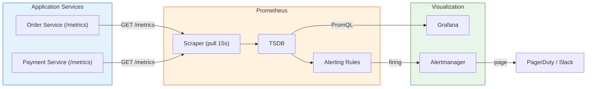

# Metrics & SLI/SLO/SLA / 指標與服務水準

## Intent / 意圖

透過量化指標（metrics）衡量服務健康狀態，並以明確的目標（SLO）和契約（SLA）驅動工程決策。Metrics 是可觀測性三大支柱中唯一天生適合 alerting 的——以低成本聚合數值描述系統行為，讓團隊在問題影響使用者之前主動偵測異常。

核心問題：**當使用者回報「服務很慢」時，團隊如何用數據回答「多慢？影響多少人？是否違反對客戶的承諾？還有多少餘裕承擔風險性變更？」**

---

## Problem / 問題情境

**場景一：「感覺很慢」的無限迴圈** — 客戶回報 API 慢，但 Grafana 只顯示 CPU 30%、無 error log。沒有 P50/P95/P99 指標和 SLO 目標，工程團隊無法判斷系統是否劣化，也無法優先排序修復工作。

**場景二：過度追求五個九** — 團隊設定 99.999% 可用性目標（年停機 5 分鐘），部署頻率從每天降到每月。大部分使用者感受不到 99.99% 和 99.999% 的差異，缺乏 error budget 概念導致可靠性與創新速度失衡。

**場景三：SLA 違約毫不知情** — SLA 承諾月可用性 99.9%（允許 43 分鐘停機），某月累積 60 分鐘中斷已超標，但因缺乏自動化 SLI 計算，直到收到違約索賠信才發現。

---

## Core Concepts / 核心概念

### RED Method — 針對 request-driven 服務

- **Rate**：每秒請求數（RPS）。突降可能是上游故障；飆升可能是流量攻擊。
- **Errors**：失敗請求比例。通常計算 HTTP 5xx，不含 4xx。
- **Duration**：延遲分佈。關注 P50/P95/P99，平均值會被極端值扭曲。

### USE Method — 針對 resource-oriented 系統

- **Utilization**：資源忙碌時間比例。
- **Saturation**：超出容量的排隊程度（CPU run queue、disk I/O queue）。
- **Errors**：資源層錯誤（packet drops、disk read errors）。

### Four Golden Signals（Google SRE Book）

Latency（區分成功/失敗）、Traffic（RPS）、Errors（含隱式錯誤）、Saturation（最受限資源利用率）。

### Metric Types（Prometheus）

- **Counter**：單調遞增（`http_requests_total`），用 `rate()` 計算每秒增量。
- **Gauge**：可增可減的瞬時值（`active_connections`）。
- **Histogram**：觀測值分配到 bucket，用 `histogram_quantile()` 估算分位數。
- **Summary**：客戶端計算分位數，無法跨實例聚合——多實例環境幾乎永遠選 histogram。

### SLI / SLO / SLA

- **SLI**：量化服務品質的指標。好的 SLI 反映使用者體驗：可用性（成功請求比例）、延遲（低於閾值的比例）、正確性、新鮮度。
- **SLO**：SLI 的目標值（內部標準）。原則：從使用者體驗出發、寧可偏保守、不同 endpoint 可有不同 SLO。
- **SLA**：與客戶的正式契約含補償條款。閾值應**嚴格低於** SLO 作為安全緩衝。

### Error Budget / 錯誤預算

SLO 與 100% 的差距。SLO 99.9% → error budget 0.1%（每月 43 分鐘）。核心理念：可靠性「剛好夠好」。預算充足時加速 feature；即將耗盡時凍結變更；耗盡時全力恢復可靠性。

### Burn Rate / 消耗速率

Google SRE Workbook 推薦多窗口告警：**Fast burn**（14.4x, 1h）立即回應、**Medium burn**（6x, 6h）當天處理、**Slow burn**（1x, 3d）排入 sprint。

### PromQL 基礎

```promql
# 每秒請求率
rate(http_requests_total[5m])

# 錯誤率
sum(rate(http_requests_total{status_code=~"5.."}[5m]))
  / sum(rate(http_requests_total[5m]))

# P99 延遲
histogram_quantile(0.99, sum(rate(http_request_duration_seconds_bucket[5m])) by (le))

# 可用性 SLI（30 天）
sum(rate(http_requests_total{status_code!~"5.."}[30d]))
  / sum(rate(http_requests_total[30d]))
```

---

## Architecture / 架構



---

## How It Works / 運作原理

### 從 RED Metrics 定義 SLI

(1) 辨識關鍵使用者旅程（CUJ）——搜尋、加入購物車、結帳各有不同品質期望。(2) SLI 規格模板：「過去 N 天，[良好事件] 佔 [有效事件] 的比例」。(3) Counter 記錄請求數/錯誤數，histogram 記錄延遲，透過 PromQL 計算 SLI。

### Error Budget 計算

```text
SLO 99.9%（30 天）→ Budget 0.1% = 43.2 分鐘
已累計 30 分鐘不可用 → 剩餘 13.2 分鐘（消耗 69.4%）
```

### Burn Rate Alerting

```text
Burn Rate = 當前錯誤率 / 允許錯誤率
錯誤率 1.44% → BR 14.4x → ~2 天耗盡 → fast-burn alert
錯誤率 0.6%  → BR 6x   → 5 天耗盡  → medium-burn alert
```

---

## Rust 實作

Axum + `prometheus` crate：RED metrics middleware + `/metrics` endpoint。

```rust
// metrics_middleware.rs — Axum + prometheus crate
use axum::{
    body::Body, extract::{MatchedPath, State}, http::{Request, StatusCode},
    middleware::Next, response::{IntoResponse, Response}, routing::get, Router,
};
use prometheus::{
    Encoder, HistogramOpts, HistogramVec, IntCounterVec, IntGauge,
    Opts, Registry, TextEncoder,
};
use std::time::Instant;

#[derive(Clone)]
struct Metrics {
    registry: Registry,
    requests_total: IntCounterVec,      // Counter: 請求數
    request_duration: HistogramVec,     // Histogram: 延遲分佈
    in_flight: IntGauge,                // Gauge: 當前處理中請求
}

impl Metrics {
    fn new() -> Self {
        let registry = Registry::new();
        let requests_total = IntCounterVec::new(
            Opts::new("http_requests_total", "Total HTTP requests"),
            &["method", "path", "status_code"],
        ).unwrap();
        let request_duration = HistogramVec::new(
            HistogramOpts::new("http_request_duration_seconds", "Request duration")
                .buckets(vec![0.005, 0.01, 0.025, 0.05, 0.1, 0.25, 0.5, 1.0, 2.5, 5.0, 10.0]),
            &["method", "path"],
        ).unwrap();
        let in_flight = IntGauge::new("http_requests_in_flight", "In-flight requests").unwrap();
        registry.register(Box::new(requests_total.clone())).unwrap();
        registry.register(Box::new(request_duration.clone())).unwrap();
        registry.register(Box::new(in_flight.clone())).unwrap();
        Self { registry, requests_total, request_duration, in_flight }
    }
}

async fn metrics_middleware(
    State(m): State<Metrics>, req: Request<Body>, next: Next,
) -> Response {
    let method = req.method().to_string();
    let path = req.extensions().get::<MatchedPath>()
        .map(|mp| mp.as_str().to_string())
        .unwrap_or_else(|| "unknown".to_string());
    m.in_flight.inc();
    let start = Instant::now();
    let resp = next.run(req).await;
    m.requests_total.with_label_values(&[&method, &path, &resp.status().as_u16().to_string()]).inc();
    m.request_duration.with_label_values(&[&method, &path]).observe(start.elapsed().as_secs_f64());
    m.in_flight.dec();
    resp
}

async fn metrics_handler(State(m): State<Metrics>) -> impl IntoResponse {
    let enc = TextEncoder::new();
    let mut buf = Vec::new();
    enc.encode(&m.registry.gather(), &mut buf).unwrap();
    (StatusCode::OK, [("content-type", enc.format_type())], buf)
}

async fn get_order(axum::extract::Path(id): axum::extract::Path<String>) -> Result<axum::Json<serde_json::Value>, StatusCode> {
    tokio::time::sleep(std::time::Duration::from_millis(if id == "slow" { 800 } else { 50 })).await;
    if id == "error" { return Err(StatusCode::INTERNAL_SERVER_ERROR); }
    Ok(axum::Json(serde_json::json!({"order_id": id, "status": "confirmed"})))
}

#[tokio::main]
async fn main() {
    let m = Metrics::new();
    let app = Router::new()
        .route("/orders/{order_id}", get(get_order))
        .route("/metrics", get(metrics_handler))
        .layer(axum::middleware::from_fn_with_state(m.clone(), metrics_middleware))
        .with_state(m);
    let listener = tokio::net::TcpListener::bind("0.0.0.0:3000").await.unwrap();
    axum::serve(listener, app).await.unwrap();
}

// Output:
// $ curl localhost:3000/metrics
// # TYPE http_requests_total counter
// http_requests_total{method="GET",path="/orders/{order_id}",status_code="200"} 1
// # TYPE http_request_duration_seconds histogram
// http_request_duration_seconds_bucket{method="GET",path="/orders/{order_id}",le="0.1"} 1
// ...
// # TYPE http_requests_in_flight gauge
// http_requests_in_flight 0
```

---

## Go 實作

net/http + `prometheus/client_golang`：等價的 RED metrics middleware。

```go
// metrics_middleware.go — net/http + prometheus/client_golang
package main

import (
	"encoding/json"
	"log/slog"
	"net/http"
	"os"
	"strconv"
	"time"

	"github.com/prometheus/client_golang/prometheus"
	"github.com/prometheus/client_golang/prometheus/promhttp"
)

type metrics struct {
	requestsTotal   *prometheus.CounterVec
	requestDuration *prometheus.HistogramVec
	inFlight        prometheus.Gauge
}

func newMetrics(reg prometheus.Registerer) *metrics {
	m := &metrics{
		requestsTotal: prometheus.NewCounterVec(prometheus.CounterOpts{
			Name: "http_requests_total", Help: "Total HTTP requests",
		}, []string{"method", "path", "status_code"}),
		requestDuration: prometheus.NewHistogramVec(prometheus.HistogramOpts{
			Name: "http_request_duration_seconds", Help: "Request duration",
			Buckets: []float64{0.005, 0.01, 0.025, 0.05, 0.1, 0.25, 0.5, 1.0, 2.5, 5.0, 10.0},
		}, []string{"method", "path"}),
		inFlight: prometheus.NewGauge(prometheus.GaugeOpts{
			Name: "http_requests_in_flight", Help: "In-flight requests",
		}),
	}
	reg.MustRegister(m.requestsTotal, m.requestDuration, m.inFlight)
	return m
}

type statusRecorder struct {
	http.ResponseWriter
	code int
}

func (sr *statusRecorder) WriteHeader(code int) {
	sr.code = code
	sr.ResponseWriter.WriteHeader(code)
}

func mw(m *metrics, next http.Handler) http.Handler {
	return http.HandlerFunc(func(w http.ResponseWriter, r *http.Request) {
		path := r.Pattern // Go 1.22+ 路由模板
		if path == "" { path = "unknown" }
		m.inFlight.Inc()
		start := time.Now()
		wr := &statusRecorder{ResponseWriter: w, code: 200}
		next.ServeHTTP(wr, r)
		m.requestsTotal.WithLabelValues(r.Method, path, strconv.Itoa(wr.code)).Inc()
		m.requestDuration.WithLabelValues(r.Method, path).Observe(time.Since(start).Seconds())
		m.inFlight.Dec()
	})
}

func getOrder(w http.ResponseWriter, r *http.Request) {
	id := r.PathValue("id")
	if id == "slow" { time.Sleep(800 * time.Millisecond) } else { time.Sleep(50 * time.Millisecond) }
	if id == "error" { http.Error(w, "error", 500); return }
	w.Header().Set("Content-Type", "application/json")
	json.NewEncoder(w).Encode(map[string]string{"order_id": id, "status": "confirmed"})
}

func main() {
	slog.SetDefault(slog.New(slog.NewJSONHandler(os.Stdout, nil)))
	reg := prometheus.NewRegistry()
	m := newMetrics(reg)
	mux := http.NewServeMux()
	mux.HandleFunc("GET /orders/{id}", getOrder)
	mux.Handle("GET /metrics", promhttp.HandlerFor(reg, promhttp.HandlerOpts{EnableOpenMetrics: true}))
	srv := &http.Server{Addr: ":3000", Handler: mw(m, mux), ReadHeaderTimeout: 10 * time.Second}
	slog.Info("listening", "addr", ":3000")
	srv.ListenAndServe()
}

// Output:
// $ curl localhost:3000/metrics
// # TYPE http_requests_total counter
// http_requests_total{method="GET",path="GET /orders/{id}",status_code="200"} 1
// # TYPE http_request_duration_seconds histogram
// http_request_duration_seconds_bucket{method="GET",path="GET /orders/{id}",le="0.1"} 1
// ...
// # TYPE http_requests_in_flight gauge
// http_requests_in_flight 0
```

---

## Rust vs Go 對照表

| 面向 | Rust (Axum + prometheus crate) | Go (net/http + client_golang) |
|---|---|---|
| **生態系成熟度** | `tikv/rust-prometheus` 是最成熟的 Rust client。Axum `State` 型別安全共享 metrics。缺點：社群小，exemplar 支援落後 | Prometheus 官方維護，原生支援 exemplar、OpenMetrics、Go runtime metrics 自動收集。事實標準 |
| **Label 基數控制** | `with_label_values(&[...])` 編譯期檢查 label 數量。需用 `MatchedPath` 取路由模板避免基數爆炸 | `WithLabelValues(...)` 同理。Go 1.22+ `r.Pattern` 取路由模板。提供 `ConstrainedLabels` 做 label 驗證 |
| **Shutdown** | Pull 模型不需 flush。確保最後 scrape 完成即可。若用 OTLP push 則需 flush `MeterProvider` | 同樣受益 pull 模型。`Server.Shutdown(ctx)` 等待進行中請求（含 scrape）完成 |

---

## When to Use / 適用場景

### 1. SLO 驅動的 API 運維

多人團隊維護的 production API、有 SLA 合約的 B2B 服務。透過 error budget policy 客觀化「修 bug vs. 做 feature」的決策。

### 2. 容量規劃與自動擴縮

Prometheus metrics + K8s HPA：`http_requests_in_flight` 或 P99 延遲超過 SLO 閾值時觸發擴容，比 CPU/memory 更貼近使用者體驗。

---

## When NOT to Use / 不適用場景

### 1. 早期原型

PMF 驗證階段、極少使用者——完整 metrics pipeline 是過度工程。Health check + 雲端基本監控足矣。

### 2. 短生命週期 Job / Serverless

Prometheus pull 模型不適合 5 秒結束的 Lambda。應用 Pushgateway 或 OTLP push，但 Pushgateway 無法自動清理過期 metrics。

---

## Real-World Examples / 真實世界案例

### Google SRE Book

- **Google Search** SLI = 「500ms 內回傳結果的比例」——等 10 秒的結果等同不可用。SLO 99.9%。
- **Gmail** 區分讀取/發送 SLO——發送更嚴格，丟失已發 email 損害遠大於暫時讀取不到。
- **Error Budget 政策**：預算耗盡自動凍結變更，SRE 控制 production 變更權限。

### Cloudflare

- 每秒數億 data point，用 ClickHouse 作長期儲存，Prometheus 僅短期即時監控。
- Status page 公開 SLO 達成情況增強客戶信任。
- Edge node 本地聚合後再送中心，避免原始 metrics 的網路成本。

---

## Interview Questions / 面試常見問題

### Q1: SLI、SLO、SLA 三者關係？

**A:** SLI 是量化指標（成功請求比例），SLO 是目標值（99.9%），SLA 是含補償的正式契約。SLA 閾值低於 SLO 留 buffer。SLI 降到 99.92% 時 SLO（99.95%）已破但 SLA（99.9%）未違約，團隊有修復時間。

### Q2: Error budget 如何影響工程決策？

**A:** SLO 99.9% 的 budget 是每月 43 分鐘。100% 不值得追求——多餘預算用來冒風險加速部署。預算充足推 feature；快耗盡凍結開發修可靠性。客觀化可靠性 vs. 速度的拉鋸。

### Q3: 為何 P99 比平均延遲重要？

**A:** 99% 請求 10ms、1% 請求 5s，平均 ~60ms 看似正常但 1% 使用者體驗極差。發 100 個請求有 63% 機率碰到 P99。延遲 SLI 定義為「低於閾值的比例」比 P99 數值更有 SLO 語義。

### Q4: Histogram vs Summary？

**A:** Histogram server 端估算分位數、可跨實例聚合；summary client 端精確計算但不可聚合。多實例環境幾乎永遠選 histogram。

### Q5: SLO-based alerting 如何設計？

**A:** 基於 burn rate 而非靜態閾值。多窗口：fast burn（14.4x, 1h）立即處理、medium burn（6x, 6h）當天處理、slow burn（1x, 3d）排入計畫。長窗口偵測持續性 + 短窗口確認仍在發生，大幅減少虛假告警。

---

## Pitfalls / 常見陷阱

### 1. Label 高基數導致記憶體爆炸

`user_id` 作 label → 100 萬使用者 = 100 萬時間序列。**對策**：label 只用有限枚舉（method、status_code、路由模板）；監控 `prometheus_tsdb_head_series`。

### 2. SLO 過高扼殺創新

SLO 99.99% 但歷史維持 99.999%——error budget 永遠用不完，團隊不敢變更。**對策**：SLO 基於「使用者剛好夠好」；理想 budget 使用率 50-80%。

### 3. Scrape 遺漏

兩次 scrape 間重啟，最後 counter 增量遺失。**對策**：`rate()` 自動處理 counter reset；確保 `/metrics` 回應 < 1s；監控 `up` 和 `scrape_duration_seconds`。

### 4. 用平均值告警

P99 從 200ms 飆到 5s 時平均值才從 50ms 升到 100ms。**對策**：用 `histogram_quantile()` 或 burn rate alerting。

---

## Cross-references / 交叉引用

- [[24_distributed_tracing|Distributed Tracing / 分散式追蹤]] — Metrics 提供全局視角（「P99 飆升」），tracing 提供個體診斷（「延遲花在支付服務第三次 retry」）。橋接點是 **exemplar**——histogram 附加 trace ID，Grafana 上直接跳轉到對應 trace。

- [[23_structured_logging|Structured Logging / 結構化日誌]] — Metrics → tracing → logging 三層 drill-down。日誌嵌入 trace ID + metrics 附加 exemplar。Grafana Loki + Tempo + Prometheus 天然支援。

- [[21_caching_redis_patterns|Caching & Redis Patterns]] — Cache hit rate 是重要業務 metric。設專屬 SLI（hit rate > 95%），下降時觸發告警。

---

## References / 參考資料

1. **Site Reliability Engineering** — Beyer et al., O'Reilly, 2016. (https://sre.google/sre-book/table-of-contents/) Ch.4 SLI/SLO/SLA, Ch.6 Four Golden Signals.
2. **The Site Reliability Workbook** — Beyer et al., O'Reilly, 2018. (https://sre.google/workbook/table-of-contents/) Ch.2 SLO 實作, Ch.5 Multi-burn-rate alerting.
3. **Prometheus Documentation** — (https://prometheus.io/docs/) Metric Types, PromQL, Alerting Rules.
4. **prometheus/client_golang** — (https://github.com/prometheus/client_golang)
5. **tikv/rust-prometheus** — (https://github.com/tikv/rust-prometheus)
6. **Implementing Service Level Objectives** — Alex Hidalgo, O'Reilly, 2020.
7. **USE Method** — Brendan Gregg. (https://www.brendangregg.com/usemethod.html)
