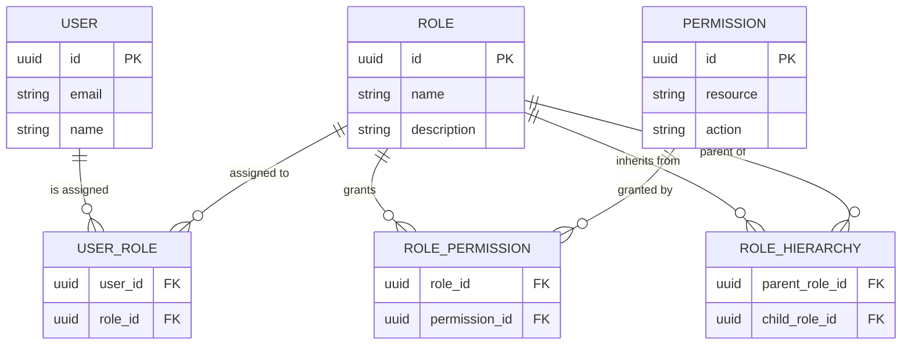
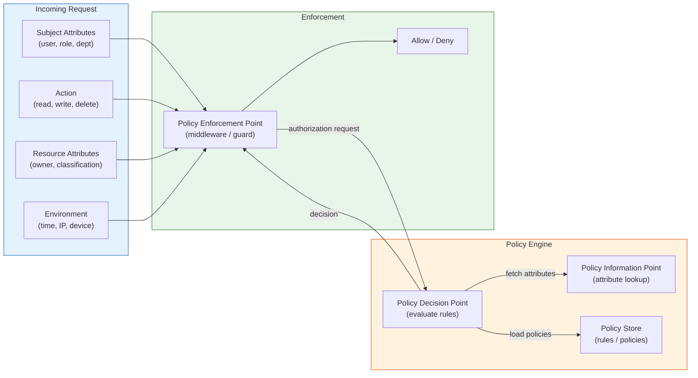

# RBAC & ABAC / 存取控制模型

## Intent / 意圖

控制「誰」可以對「哪些資源」執行「什麼操作」。授權（Authorization）是認證（Authentication）之後的第二道關卡——確認使用者身份後，系統必須判斷該使用者是否擁有足夠的權限來執行請求的操作。RBAC 和 ABAC 是兩種最主流的存取控制模型，分別適用於不同的複雜度場景。RBAC 透過角色間接授予權限，ABAC 則根據主體、資源、動作和環境的屬性動態評估策略。

---

## Problem / 問題情境

**場景一：硬編碼的授權地獄**

一個電商後台管理系統，最初只有 admin 和 user 兩種角色。開發者直接在每個 API handler 中寫 `if user.role == "admin"` 來判斷權限。隨著業務成長，新增了 editor、reviewer、warehouse_manager、finance 等角色，每個角色對不同資源有不同的操作權限。程式碼中散布了數百個 if/else 判斷，每新增一個角色就要修改十幾個檔案。一次部署中，有人漏改了退款 API 的權限檢查，導致普通客服人員可以執行大額退款——直到財務月底對帳才發現。

**場景二：權限爆炸與維護噩夢**

SaaS 平台為每個功能點定義了細粒度權限（`order:read`、`order:write`、`order:delete`、`order:export` ...），隨著功能增長，權限數量膨脹到 300+。每個新客戶需要客製化的權限組合，運營團隊手動為每個使用者分配數十個權限，頻繁出錯。更糟的是，系統無法表達「只能存取自己部門的訂單」這類基於屬性的限制——結果要麼過度授權（看到所有部門的資料），要麼為每個部門建立一組獨立角色，角色數量呈乘法增長。

**場景三：多租戶的跨界存取**

多租戶平台中，租戶 A 的管理員不小心存取到租戶 B 的資料。原因是授權邏輯只檢查了角色（admin），卻沒有結合租戶屬性進行隔離。單純的 RBAC 無法優雅地處理「同一個角色在不同租戶上下文中的權限邊界」問題。

---

## Core Concepts / 核心概念

### RBAC（Role-Based Access Control）/ 基於角色的存取控制

RBAC 的核心思想是在使用者和權限之間引入「角色」作為中介層。使用者被指派角色，角色被授予權限，使用者透過角色間接獲得權限。NIST 標準（NIST RBAC）定義了四個層級：

- **Core RBAC**：使用者（User）、角色（Role）、權限（Permission）、會話（Session）的基本關聯。
- **Hierarchical RBAC**：角色之間可以建立繼承關係。例如 `senior_editor` 繼承 `editor` 的所有權限，並額外擁有 `article:publish`。
- **Static Separation of Duties（SSD）**：限制同一使用者不能同時被指派互斥的角色。例如「採購員」和「審核員」不能由同一人擔任。
- **Dynamic Separation of Duties（DSD）**：允許使用者擁有互斥角色，但同一會話中只能啟用其中之一。

### ABAC（Attribute-Based Access Control）/ 基於屬性的存取控制

ABAC 將授權決策建模為對四類屬性的布林運算：

- **Subject attributes（主體屬性）**：請求者的特徵——角色、部門、職級、安全等級、地理位置。
- **Resource attributes（資源屬性）**：被存取資源的特徵——擁有者、分類標籤、敏感等級、建立時間。
- **Action attributes（動作屬性）**：操作類型——read、write、delete、approve。
- **Environment attributes（環境屬性）**：請求時的外部條件——時間、IP 位址、裝置類型、威脅等級。

ABAC 策略範例：「允許 department=finance 且 clearance>=3 的使用者，在上班時間（09:00-18:00）內讀取 classification=confidential 的財務報表」。

### Policy Engine / 策略引擎

將授權邏輯從應用程式碼中抽離，交由獨立的策略引擎評估。主要的策略引擎：

- **OPA（Open Policy Agent）**：CNCF 畢業專案，使用 Rego 語言撰寫策略，適用於 Kubernetes admission control、API 授權、資料過濾等場景。
- **Cedar**：AWS 開源的策略語言和評估引擎，用於 Amazon Verified Permissions。語法直覺，支援靜態分析和形式驗證。
- **Casbin**：輕量級授權函式庫，支援多種模型（ACL、RBAC、ABAC），Go 和 Rust 都有原生實作。

### Least Privilege / 最小權限原則

每個使用者或系統元件只應被授予完成其任務所需的最小權限集合，不多也不少。這是所有存取控制模型的設計基石。

### Separation of Duties / 職責分離

關鍵業務流程應由多個角色協作完成，避免單一角色擁有過大權力。例如：提交支付請求的人不能同時審核該請求。

---

## Architecture / 架構

### RBAC 模型：User -> Role -> Permission



### ABAC Policy Evaluation Flow



---

## How It Works / 運作原理

### RBAC 權限檢查流程

1. **使用者發出請求**：帶有 JWT 或 session token，包含 user ID。
2. **提取角色**：從資料庫或 token claims 中取得使用者的角色列表。若有角色階層，遞迴展開繼承的角色。
3. **解析權限需求**：根據請求的 HTTP method 和路徑，對應到所需的權限（如 `DELETE /api/orders/{id}` -> `order:delete`）。
4. **權限比對**：檢查使用者的角色集合中是否包含所需的權限。
5. **決策**：任一角色包含所需權限則放行，否則回傳 403 Forbidden。

### ABAC 策略評估流程

1. **PEP 攔截請求**：Policy Enforcement Point（通常是 middleware）攔截進入的請求。
2. **組裝屬性上下文**：收集 subject attributes（從 JWT / DB）、resource attributes（從 DB / cache）、action attributes（從 HTTP method）、environment attributes（時間、IP）。
3. **PDP 評估策略**：Policy Decision Point 載入相關策略，以屬性上下文作為輸入，逐條評估策略規則。
4. **策略合併**：當多條策略同時匹配時，使用合併演算法決定最終結果——常見策略有 deny-overrides（任一 deny 即拒絕）、permit-overrides（任一 permit 即放行）、first-applicable（第一條匹配的策略決定結果）。
5. **PEP 執行決策**：根據 PDP 回傳的 allow/deny 結果決定是否放行。

### RBAC + ABAC 混合模型

實務上常見的做法是以 RBAC 為基礎，ABAC 做精細化補充。先用角色做粗粒度過濾（快速排除明顯無權限的請求），再用屬性策略做資源級別的細粒度檢查（例如「只能存取自己部門的資料」）。

---

## Rust 實作

以下是基於 Axum 的 RBAC + ABAC 混合授權中介層完整實作。

```rust
// cargo.toml dependencies:
// axum = "0.8"
// serde = { version = "1", features = ["derive"] }
// serde_json = "1"
// chrono = "0.4"
// tower = "0.5"
// tower-http = "0.6"

use axum::{
    Router,
    routing::get,
    extract::{Path, State},
    http::{Request, StatusCode},
    middleware::{self, Next},
    response::{IntoResponse, Json},
};
use serde::{Deserialize, Serialize};
use std::collections::{HashMap, HashSet};
use std::sync::Arc;
use chrono::{Local, Timelike};

// ── Domain Models ──

#[derive(Debug, Clone, Serialize, Deserialize)]
struct User {
    id: String,
    email: String,
    department: String,
    clearance_level: u8,
    roles: Vec<String>,
}

#[derive(Debug, Clone)]
struct Permission {
    resource: String,
    action: String,
}

#[derive(Debug, Clone)]
struct AbacPolicy {
    name: String,
    effect: PolicyEffect,
    condition: Box<dyn PolicyCondition>,
}

#[derive(Debug, Clone, PartialEq)]
enum PolicyEffect {
    Allow,
    Deny,
}

// ── ABAC Policy Condition Trait ──

trait PolicyCondition: Send + Sync + std::fmt::Debug {
    fn evaluate(&self, ctx: &AuthzContext) -> bool;
    fn clone_box(&self) -> Box<dyn PolicyCondition>;
}

impl Clone for Box<dyn PolicyCondition> {
    fn clone(&self) -> Self {
        self.clone_box()
    }
}

#[derive(Debug, Clone)]
struct AuthzContext {
    user: User,
    resource_owner: Option<String>,
    resource_department: Option<String>,
    resource_classification: Option<String>,
    action: String,
    request_hour: u32,
    client_ip: String,
}

// ── Concrete Policy Conditions ──

#[derive(Debug, Clone)]
struct DepartmentMatchCondition;

impl PolicyCondition for DepartmentMatchCondition {
    fn evaluate(&self, ctx: &AuthzContext) -> bool {
        match &ctx.resource_department {
            Some(dept) => ctx.user.department == *dept,
            None => true,
        }
    }
    fn clone_box(&self) -> Box<dyn PolicyCondition> {
        Box::new(self.clone())
    }
}

#[derive(Debug, Clone)]
struct BusinessHoursCondition {
    start_hour: u32,
    end_hour: u32,
}

impl PolicyCondition for BusinessHoursCondition {
    fn evaluate(&self, ctx: &AuthzContext) -> bool {
        ctx.request_hour >= self.start_hour && ctx.request_hour < self.end_hour
    }
    fn clone_box(&self) -> Box<dyn PolicyCondition> {
        Box::new(self.clone())
    }
}

#[derive(Debug, Clone)]
struct ClearanceLevelCondition {
    required_level: u8,
}

impl PolicyCondition for ClearanceLevelCondition {
    fn evaluate(&self, ctx: &AuthzContext) -> bool {
        ctx.user.clearance_level >= self.required_level
    }
    fn clone_box(&self) -> Box<dyn PolicyCondition> {
        Box::new(self.clone())
    }
}

// ── Authorization Engine ──

#[derive(Clone)]
struct AuthzEngine {
    role_permissions: HashMap<String, HashSet<String>>,
    role_hierarchy: HashMap<String, Vec<String>>,
    abac_policies: Vec<AbacPolicy>,
}

impl AuthzEngine {
    fn new() -> Self {
        let mut role_permissions = HashMap::new();
        role_permissions.insert(
            "viewer".to_string(),
            HashSet::from(["order:read".to_string(), "report:read".to_string()]),
        );
        role_permissions.insert(
            "editor".to_string(),
            HashSet::from([
                "order:read".to_string(),
                "order:write".to_string(),
                "report:read".to_string(),
            ]),
        );
        role_permissions.insert(
            "admin".to_string(),
            HashSet::from([
                "order:read".to_string(),
                "order:write".to_string(),
                "order:delete".to_string(),
                "report:read".to_string(),
                "report:export".to_string(),
                "user:manage".to_string(),
            ]),
        );

        let mut role_hierarchy = HashMap::new();
        role_hierarchy.insert("editor".to_string(), vec!["viewer".to_string()]);
        role_hierarchy.insert("admin".to_string(), vec!["editor".to_string()]);

        let abac_policies = vec![
            AbacPolicy {
                name: "department_isolation".to_string(),
                effect: PolicyEffect::Deny,
                condition: Box::new(DepartmentMatchCondition),
                // Deny if condition returns false (department mismatch)
            },
            AbacPolicy {
                name: "business_hours_only".to_string(),
                effect: PolicyEffect::Deny,
                condition: Box::new(BusinessHoursCondition {
                    start_hour: 9,
                    end_hour: 18,
                }),
            },
            AbacPolicy {
                name: "clearance_for_confidential".to_string(),
                effect: PolicyEffect::Deny,
                condition: Box::new(ClearanceLevelCondition { required_level: 3 }),
            },
        ];

        Self { role_permissions, role_hierarchy, abac_policies }
    }

    fn resolve_roles(&self, roles: &[String]) -> HashSet<String> {
        let mut resolved = HashSet::new();
        let mut stack: Vec<String> = roles.to_vec();
        while let Some(role) = stack.pop() {
            if resolved.insert(role.clone()) {
                if let Some(parents) = self.role_hierarchy.get(&role) {
                    stack.extend(parents.iter().cloned());
                }
            }
        }
        resolved
    }

    fn check_rbac(&self, user: &User, required_permission: &str) -> bool {
        let all_roles = self.resolve_roles(&user.roles);
        all_roles.iter().any(|role| {
            self.role_permissions
                .get(role)
                .map_or(false, |perms| perms.contains(required_permission))
        })
    }

    fn check_abac(&self, ctx: &AuthzContext) -> bool {
        // deny-overrides: any policy that denies will block access
        for policy in &self.abac_policies {
            if policy.effect == PolicyEffect::Deny && !policy.condition.evaluate(ctx) {
                return false;
            }
        }
        true
    }

    fn authorize(&self, ctx: &AuthzContext, required_permission: &str) -> bool {
        // Step 1: RBAC coarse-grained check
        if !self.check_rbac(&ctx.user, required_permission) {
            return false;
        }
        // Step 2: ABAC fine-grained check
        self.check_abac(ctx)
    }
}

// ── Axum Middleware ──

#[derive(Clone)]
struct AppState {
    authz_engine: Arc<AuthzEngine>,
}

async fn require_permission(
    State(state): State<AppState>,
    mut request: Request<axum::body::Body>,
    next: Next,
) -> Result<impl IntoResponse, StatusCode> {
    // Extract user from request extensions (set by auth middleware)
    let user = request
        .extensions()
        .get::<User>()
        .cloned()
        .ok_or(StatusCode::UNAUTHORIZED)?;

    let method = request.method().as_str();
    let path = request.uri().path();
    let required_permission = derive_permission(method, path);

    let ctx = AuthzContext {
        user: user.clone(),
        resource_owner: None,
        resource_department: Some(user.department.clone()),
        resource_classification: None,
        action: method.to_lowercase(),
        request_hour: Local::now().hour(),
        client_ip: "10.0.0.1".to_string(),
    };

    if !state.authz_engine.authorize(&ctx, &required_permission) {
        return Err(StatusCode::FORBIDDEN);
    }

    request.extensions_mut().insert(ctx);
    Ok(next.run(request).await)
}

fn derive_permission(method: &str, path: &str) -> String {
    let resource = path
        .split('/')
        .nth(2)
        .unwrap_or("unknown");
    let action = match method {
        "GET" => "read",
        "POST" | "PUT" | "PATCH" => "write",
        "DELETE" => "delete",
        _ => "read",
    };
    format!("{resource}:{action}")
}

// ── Route Handlers ──

async fn list_orders() -> impl IntoResponse {
    Json(serde_json::json!({
        "orders": [
            {"id": "ord_001", "total": 2500},
            {"id": "ord_002", "total": 8900}
        ]
    }))
}

async fn delete_order(Path(order_id): Path<String>) -> impl IntoResponse {
    Json(serde_json::json!({
        "message": format!("Order {order_id} deleted")
    }))
}

// ── Application Setup ──

#[tokio::main]
async fn main() {
    let state = AppState {
        authz_engine: Arc::new(AuthzEngine::new()),
    };

    let app = Router::new()
        .route("/api/orders", get(list_orders))
        .route("/api/orders/{order_id}", axum::routing::delete(delete_order))
        .layer(middleware::from_fn_with_state(
            state.clone(),
            require_permission,
        ))
        .with_state(state);

    let listener = tokio::net::TcpListener::bind("0.0.0.0:3000")
        .await
        .unwrap();
    axum::serve(listener, app).await.unwrap();
}

// Output:
// GET  /api/orders         -> 200 (if user has order:read)
// DELETE /api/orders/ord_1 -> 200 (if user has order:delete + ABAC pass)
// GET  /api/orders         -> 403 (if RBAC or ABAC check fails)
```

---

## Go 實作

以下是 Go 1.24+ 使用 `net/http` 的等效實作。

```go
package main

import (
	"context"
	"encoding/json"
	"fmt"
	"log"
	"net/http"
	"strings"
	"time"
)

// ── Domain Models ──

type User struct {
	ID             string   `json:"id"`
	Email          string   `json:"email"`
	Department     string   `json:"department"`
	ClearanceLevel int      `json:"clearance_level"`
	Roles          []string `json:"roles"`
}

type AuthzContext struct {
	User                   User
	ResourceOwner          string
	ResourceDepartment     string
	ResourceClassification string
	Action                 string
	RequestHour            int
	ClientIP               string
}

type PolicyEffect int

const (
	EffectAllow PolicyEffect = iota
	EffectDeny
)

type PolicyCondition interface {
	Evaluate(ctx *AuthzContext) bool
}

type AbacPolicy struct {
	Name      string
	Effect    PolicyEffect
	Condition PolicyCondition
}

// ── Concrete Policy Conditions ──

type DepartmentMatchCondition struct{}

func (d DepartmentMatchCondition) Evaluate(ctx *AuthzContext) bool {
	if ctx.ResourceDepartment == "" {
		return true
	}
	return ctx.User.Department == ctx.ResourceDepartment
}

type BusinessHoursCondition struct {
	StartHour int
	EndHour   int
}

func (b BusinessHoursCondition) Evaluate(ctx *AuthzContext) bool {
	return ctx.RequestHour >= b.StartHour && ctx.RequestHour < b.EndHour
}

type ClearanceLevelCondition struct {
	RequiredLevel int
}

func (c ClearanceLevelCondition) Evaluate(ctx *AuthzContext) bool {
	return ctx.User.ClearanceLevel >= c.RequiredLevel
}

// ── Authorization Engine ──

type AuthzEngine struct {
	rolePermissions map[string]map[string]bool
	roleHierarchy   map[string][]string
	abacPolicies    []AbacPolicy
}

func NewAuthzEngine() *AuthzEngine {
	engine := &AuthzEngine{
		rolePermissions: map[string]map[string]bool{
			"viewer": {
				"order:read":  true,
				"report:read": true,
			},
			"editor": {
				"order:read":  true,
				"order:write": true,
				"report:read": true,
			},
			"admin": {
				"order:read":    true,
				"order:write":   true,
				"order:delete":  true,
				"report:read":   true,
				"report:export": true,
				"user:manage":   true,
			},
		},
		roleHierarchy: map[string][]string{
			"editor": {"viewer"},
			"admin":  {"editor"},
		},
		abacPolicies: []AbacPolicy{
			{
				Name:      "department_isolation",
				Effect:    EffectDeny,
				Condition: DepartmentMatchCondition{},
			},
			{
				Name:      "business_hours_only",
				Effect:    EffectDeny,
				Condition: BusinessHoursCondition{StartHour: 9, EndHour: 18},
			},
			{
				Name:      "clearance_for_confidential",
				Effect:    EffectDeny,
				Condition: ClearanceLevelCondition{RequiredLevel: 3},
			},
		},
	}
	return engine
}

func (e *AuthzEngine) resolveRoles(roles []string) map[string]bool {
	resolved := make(map[string]bool)
	stack := make([]string, len(roles))
	copy(stack, roles)

	for len(stack) > 0 {
		role := stack[len(stack)-1]
		stack = stack[:len(stack)-1]

		if resolved[role] {
			continue
		}
		resolved[role] = true

		if parents, ok := e.roleHierarchy[role]; ok {
			stack = append(stack, parents...)
		}
	}
	return resolved
}

func (e *AuthzEngine) checkRBAC(user *User, requiredPermission string) bool {
	allRoles := e.resolveRoles(user.Roles)
	for role := range allRoles {
		if perms, ok := e.rolePermissions[role]; ok {
			if perms[requiredPermission] {
				return true
			}
		}
	}
	return false
}

func (e *AuthzEngine) checkABAC(ctx *AuthzContext) bool {
	// deny-overrides: any failing deny-policy blocks access
	for _, policy := range e.abacPolicies {
		if policy.Effect == EffectDeny && !policy.Condition.Evaluate(ctx) {
			return false
		}
	}
	return true
}

func (e *AuthzEngine) Authorize(ctx *AuthzContext, requiredPermission string) bool {
	// Step 1: RBAC coarse-grained check
	if !e.checkRBAC(&ctx.User, requiredPermission) {
		return false
	}
	// Step 2: ABAC fine-grained check
	return e.checkABAC(ctx)
}

// ── Middleware ──

type contextKey string

const userContextKey contextKey = "authz_user"

func derivePermission(method, path string) string {
	parts := strings.Split(path, "/")
	resource := "unknown"
	if len(parts) >= 3 {
		resource = parts[2]
	}
	var action string
	switch method {
	case http.MethodGet:
		action = "read"
	case http.MethodPost, http.MethodPut, http.MethodPatch:
		action = "write"
	case http.MethodDelete:
		action = "delete"
	default:
		action = "read"
	}
	return fmt.Sprintf("%s:%s", resource, action)
}

func RequirePermission(engine *AuthzEngine, next http.Handler) http.Handler {
	return http.HandlerFunc(func(w http.ResponseWriter, r *http.Request) {
		user, ok := r.Context().Value(userContextKey).(*User)
		if !ok || user == nil {
			http.Error(w, `{"error":"unauthorized"}`, http.StatusUnauthorized)
			return
		}

		requiredPermission := derivePermission(r.Method, r.URL.Path)
		now := time.Now()

		ctx := &AuthzContext{
			User:               *user,
			ResourceDepartment: user.Department,
			Action:             strings.ToLower(r.Method),
			RequestHour:        now.Hour(),
			ClientIP:           r.RemoteAddr,
		}

		if !engine.Authorize(ctx, requiredPermission) {
			http.Error(w, `{"error":"forbidden"}`, http.StatusForbidden)
			return
		}

		next.ServeHTTP(w, r)
	})
}

// ── Simulated Auth Middleware (for demo) ──

func SimulateAuth(next http.Handler) http.Handler {
	return http.HandlerFunc(func(w http.ResponseWriter, r *http.Request) {
		user := &User{
			ID:             "usr_001",
			Email:          "alice@example.com",
			Department:     "engineering",
			ClearanceLevel: 3,
			Roles:          []string{"editor"},
		}
		ctx := context.WithValue(r.Context(), userContextKey, user)
		next.ServeHTTP(w, r.WithContext(ctx))
	})
}

// ── Route Handlers ──

func listOrders(w http.ResponseWriter, r *http.Request) {
	w.Header().Set("Content-Type", "application/json")
	json.NewEncoder(w).Encode(map[string]any{
		"orders": []map[string]any{
			{"id": "ord_001", "total": 2500},
			{"id": "ord_002", "total": 8900},
		},
	})
}

func deleteOrder(w http.ResponseWriter, r *http.Request) {
	orderID := r.PathValue("order_id")
	w.Header().Set("Content-Type", "application/json")
	json.NewEncoder(w).Encode(map[string]any{
		"message": fmt.Sprintf("Order %s deleted", orderID),
	})
}

// ── Application Setup ──

func main() {
	engine := NewAuthzEngine()

	mux := http.NewServeMux()
	mux.HandleFunc("GET /api/orders", listOrders)
	mux.HandleFunc("DELETE /api/orders/{order_id}", deleteOrder)

	handler := SimulateAuth(RequirePermission(engine, mux))

	log.Println("Server listening on :3000")
	log.Fatal(http.ListenAndServe(":3000", handler))
}

// Output:
// GET  /api/orders             -> 200 (editor has order:read via RBAC)
// DELETE /api/orders/ord_001   -> 403 (editor lacks order:delete)
// GET  /api/orders (after 18h) -> 403 (ABAC business hours policy)
```

---

## Rust vs Go 對照表

| 比較面向 | Rust (Axum) | Go (net/http) |
|---|---|---|
| **Policy condition 抽象** | 使用 trait object (`Box<dyn PolicyCondition>`) 實現動態分派，需手動實作 `Clone`。編譯期保證 `Send + Sync` 安全性 | 使用 interface (`PolicyCondition`) 天然支援多型，無需額外 Clone 機制。但無法在編譯期保證 concurrency 安全 |
| **Middleware 整合** | `middleware::from_fn_with_state` 搭配 extractor pattern，型別安全且與 handler 共享 state | `http.Handler` 巢狀包裝（decorator pattern），透過 `context.Value` 傳遞資料，型別在 runtime 才檢查 |
| **角色階層解析** | `HashSet` 自動去重，`while let` pattern matching 簡潔表達 stack-based 遞迴展開 | `map[string]bool` 模擬 set，顯式 slice 操作管理 stack。程式碼較冗長但意圖明確 |
| **錯誤處理** | 回傳 `Result<impl IntoResponse, StatusCode>`，善用 `?` 運算子提前返回。型別系統確保所有路徑都有處理 | 直接呼叫 `http.Error()` 寫入 response 後 `return`。需手動確保 early return，容易遺漏 |
| **路由定義** | Go 1.22+ 風格的 `{param}` 路徑參數，透過 `Path` extractor 自動反序列化 | Go 1.22+ 原生支援 `{param}` 和 method-based routing（`"DELETE /api/orders/{order_id}"`），無需第三方 router |

---

## When to Use / 適用場景

### RBAC 適用場景

- **企業內部系統**：角色固定且數量有限（admin、manager、employee、auditor），權限相對靜態。
- **早期產品階段**：快速建立基本的存取控制，團隊規模小，業務邏輯簡單。
- **合規需求明確的場景**：如 SOX、HIPAA 等法規要求明確的角色與權限對應關係，RBAC 的結構化特性便於稽核。

### ABAC 適用場景

- **多租戶 SaaS 平台**：需要根據租戶 ID、訂閱方案、使用者所屬組織等屬性動態決定權限。
- **複雜的資源隔離**：「使用者只能存取自己部門建立的文件」、「只有文件擁有者和其主管可以刪除」。
- **動態環境約束**：依照時間、地理位置、裝置安全等級等環境條件調整權限。
- **RBAC + ABAC 混合**：大多數成熟系統採用此模式——RBAC 提供基本框架，ABAC 處理資源級別的精細控制。

---

## When NOT to Use / 不適用場景

- **過度工程化的簡單應用**：如果系統只有兩種使用者（登入 / 未登入），引入完整的 RBAC/ABAC 引擎是過度設計。一個簡單的 `isAuthenticated` middleware 即可滿足需求。投入產出比不划算。
- **效能極度敏感的熱路徑**：ABAC 的每次請求都需要查詢多個屬性來源（資料庫、外部服務），可能為熱路徑增加不可接受的延遲。如果授權邏輯在每秒數萬次請求的路徑上，應考慮預計算權限或使用嵌入式策略引擎（如 Cedar）而非外部呼叫。
- **使用者自主管理的社群平台**：類似 Wiki 或開源專案的協作模型，通常使用 ACL（Access Control List）或 capability-based 模型更為自然——每個資源有自己的存取清單，使用者可以自行分享和管理權限，不需要中心化的角色管理。

---

## Real-World Examples / 真實世界案例

### AWS IAM（ABAC 實踐）

AWS IAM 是業界最成熟的 ABAC 實作之一。IAM Policy 使用 JSON 格式定義 Effect（Allow/Deny）、Action（`s3:GetObject`）、Resource（`arn:aws:s3:::my-bucket/*`）和 Condition（`aws:RequestedRegion == ap-northeast-1`）。AWS 稱之為 ABAC for AWS，透過 tag-based 策略實現動態授權——例如「只有 project tag 與使用者相同的 EC2 instance 才能被存取」，新增專案時無需修改任何 policy。

### Kubernetes RBAC

Kubernetes 使用純 RBAC 模型管理叢集資源的存取控制。核心物件：(1) **Role / ClusterRole**——定義對特定 API 資源（pods、services、deployments）的操作權限（get、list、create、delete）；(2) **RoleBinding / ClusterRoleBinding**——將 Role 綁定到 Subject（User、Group、ServiceAccount）。K8s RBAC 的特色是 namespace-scoped 的權限隔離——一個 Role 只在其所屬的 namespace 中生效，ClusterRole 則跨 namespace。

### Cedar（AWS Verified Permissions）

Cedar 是 AWS 開源的策略語言，設計目標是兼具表達力和可分析性。Cedar 策略範例：

```cedar
permit(
    principal in Role::"editor",
    action in [Action::"read", Action::"write"],
    resource in Folder::"engineering"
) when {
    principal.department == resource.owner_department &&
    context.time.hour >= 9 &&
    context.time.hour < 18
};
```

Cedar 支援靜態分析——能在部署前驗證「是否存在任何使用者可以刪除所有資源」這類安全性質，這是 OPA/Rego 等通用策略語言難以做到的。

---

## Interview Questions / 面試常見問題

**Q1: RBAC 和 ABAC 的核心差異是什麼？何時該選擇哪一個？**

RBAC 透過角色間接授權，決策僅基於使用者的角色。適合角色固定、權限靜態的場景。ABAC 基於主體、資源、動作和環境的屬性動態評估策略，適合需要細粒度、動態、上下文感知的授權場景。實務上常見 RBAC + ABAC 混合模型：RBAC 做粗粒度過濾，ABAC 做資源級別的精細控制。

**Q2: 什麼是 role explosion？如何解決？**

當系統需要為每種資源 x 操作 x 部門的組合建立獨立角色時，角色數量呈乘法增長。例如 10 個部門 x 5 種資源 x 3 種操作 = 150 個角色。解決方案：(1) 引入角色階層減少重複定義；(2) 使用 ABAC 補充資源級別的屬性約束，避免為每個組合建立獨立角色；(3) 使用 parameterized roles（如 `department_manager(dept_id)`）。

**Q3: 如何在微服務架構中實作集中式授權？**

兩種主要模式：(1) **Sidecar / Middleware 模式**——每個服務嵌入輕量級策略引擎（如 OPA sidecar），策略集中管理但決策本地化，避免網路延遲。(2) **集中式授權服務**——所有服務透過 API 呼叫中央授權服務，策略變更即時生效，但引入單點故障和延遲風險。最佳實踐是混合：將策略集中儲存，透過推送機制同步到各服務的本地引擎。

**Q4: 請解釋 PEP、PDP、PIP、PAP 的職責。**

XACML 架構定義的四個元件：(1) **PEP（Policy Enforcement Point）**——攔截請求並執行 PDP 的決策（通常是 API middleware）。(2) **PDP（Policy Decision Point）**——評估策略並做出 allow/deny 決策。(3) **PIP（Policy Information Point）**——為 PDP 提供額外的屬性資訊（查詢使用者資料庫、資源 metadata）。(4) **PAP（Policy Administration Point）**——管理策略的建立、修改和部署。

**Q5: 如何確保授權系統的效能不成為瓶頸？**

(1) **本地快取**：將角色-權限對應和常用策略快取在記憶體中，設定合理的 TTL（如 60 秒），變更時透過事件通知失效。(2) **預計算**：定期將使用者的有效權限集合展平後儲存，查詢時只需簡單的集合成員檢查。(3) **嵌入式引擎**：使用 Cedar 或 OPA 的嵌入式模式，避免網路呼叫。(4) **分層檢查**：先做 O(1) 的 RBAC 檢查過濾大部分請求，只有通過的才進入較昂貴的 ABAC 評估。

---

## Pitfalls / 常見陷阱

### 1. Role Explosion / 角色爆炸

隨著業務成長，為每種新的權限組合建立新角色，角色數量失控成長到數百甚至數千。維護成本高，角色間的權限重疊導致難以稽核。**解法**：建立角色階層（inheritance），將跨 cutting 的屬性約束交給 ABAC 處理而非建立更多角色。

### 2. Missing Resource-Level Checks / 缺少資源級別檢查

最常見的授權漏洞：只檢查使用者是否有某個操作的權限（如 `order:delete`），但不檢查該使用者是否有權操作「這一筆特定的」資源。結果是使用者 A 可以刪除使用者 B 的訂單。**解法**：永遠在資源級別驗證擁有權或歸屬關係，結合 ABAC 進行 resource-owner 比對。

### 3. Fail-Open Authorization / 預設放行的授權

授權邏輯在出現異常時（策略引擎不可用、屬性查詢逾時）預設放行而非拒絕。這是嚴重的安全漏洞。**解法**：授權系統應遵循 fail-closed 原則——任何異常情況下預設拒絕（deny by default）。同時建立 circuit breaker 和降級策略，避免授權服務故障導致全面中斷。

### 4. Token 與實際權限不同步

將權限或角色直接嵌入 JWT token 中，但使用者的角色在 token 有效期內被管理員變更。Token 中的舊權限仍然有效，直到 token 過期。**解法**：(1) 縮短 token 有效期；(2) token 中僅包含 user ID，每次請求時即時查詢最新權限；(3) 實作 token revocation 機制。

### 5. 缺乏授權決策的可觀測性

授權被拒絕時只回傳 403，不記錄原因。使得除錯和安全稽核極為困難。**解法**：記錄每次授權決策的完整上下文——who（使用者）、what（操作）、which（資源）、why（哪條策略導致拒絕），但注意不要在 API response 中洩漏過多資訊給攻擊者。

---

## Cross-references / 交叉引用

- [[26_oauth2_jwt]] — OAuth2 處理認證（Authentication，確認「你是誰」），RBAC/ABAC 處理授權（Authorization，決定「你能做什麼」）。兩者是互補的——JWT token 攜帶使用者身份資訊，RBAC/ABAC 引擎基於該身份做出存取控制決策。典型流程：OAuth2 簽發 JWT -> 從 JWT 提取 user claims -> RBAC 檢查角色權限 -> ABAC 評估屬性策略。

---

## References / 參考資料

- [NIST RBAC Model (NIST SP 800-207)](https://csrc.nist.gov/publications/detail/sp/800-207/final) — RBAC 的正式標準定義，涵蓋 Core RBAC、Hierarchical RBAC、SSD 和 DSD
- [XACML 3.0 Standard (OASIS)](https://docs.oasis-open.org/xacml/3.0/xacml-3.0-core-spec-os-en.html) — ABAC 的 XML-based 策略語言標準，定義了 PEP/PDP/PIP/PAP 架構
- [Cedar Language Documentation](https://docs.cedarpolicy.com/) — AWS 開源策略語言，支援靜態分析和形式驗證
- [Open Policy Agent (OPA) Documentation](https://www.openpolicyagent.org/docs/latest/) — CNCF 畢業專案，通用策略引擎，使用 Rego 語言
- [Casbin Documentation](https://casbin.org/docs/overview) — 支援多種存取控制模型的輕量級授權函式庫（Go / Rust / Node.js）
- [AWS IAM ABAC Guide](https://docs.aws.amazon.com/IAM/latest/UserGuide/introduction_attribute-based-access-control.html) — AWS 的 ABAC 實踐指南，基於 tag 的策略管理
- [Kubernetes RBAC Documentation](https://kubernetes.io/docs/reference/access-authn-authz/rbac/) — K8s 原生 RBAC 模型，Role/ClusterRole/RoleBinding
