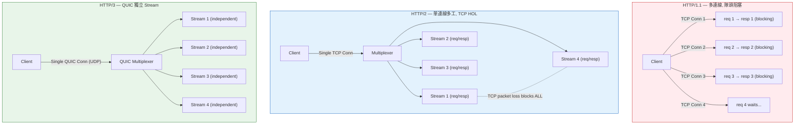
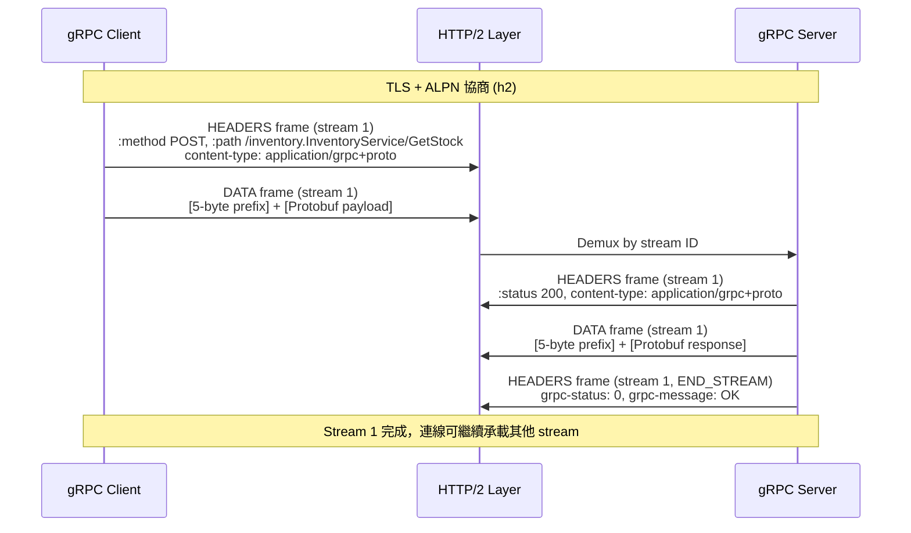
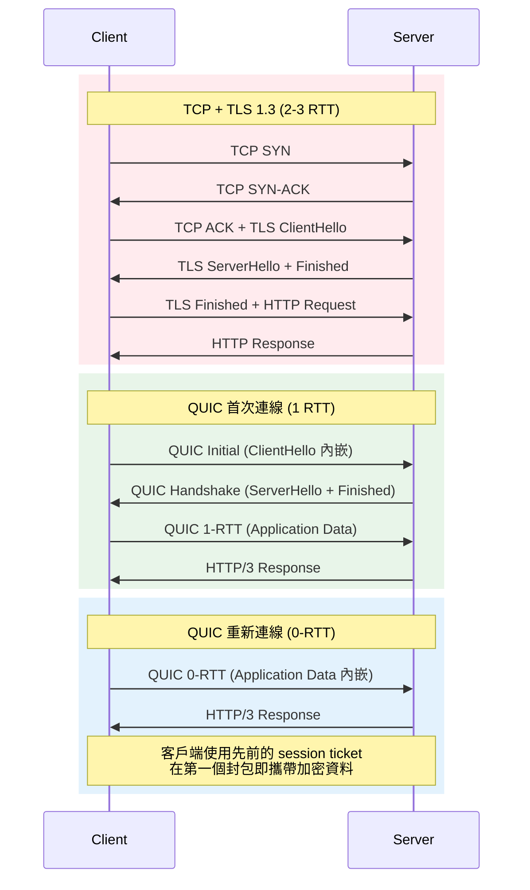

# HTTP/2, HTTP/3 & gRPC Transport / 傳輸協定

## Intent / 意圖

理解現代傳輸協定（HTTP/2、HTTP/3、gRPC）的核心機制與工程實踐，掌握它們如何解決 HTTP/1.1 的根本限制，以便在微服務架構中為不同場景選擇最佳的傳輸層方案。傳輸協定的選擇直接影響服務間通訊的延遲、吞吐量、可靠性與資源效率——這是後端基礎設施中最底層也最關鍵的決策之一。

核心問題：**當微服務架構中有數十個服務需要高頻率、低延遲地互相通訊時，HTTP/1.1 的連線模型為何成為瓶頸？HTTP/2 的多工、HTTP/3 的 QUIC、以及 gRPC 的二進位框架如何從不同維度解決這些問題？在行動端弱網環境、跨區域呼叫、服務內部通訊等不同場景下，應如何選擇傳輸協定？**

---

## Problem / 問題情境

**場景一：HTTP/1.1 隊頭阻塞拖慢微服務通訊**

某電商平台的訂單服務需要同時呼叫庫存服務、價格服務與優惠券服務。在 HTTP/1.1 下，每個 TCP 連線一次只能處理一個請求——即使三個請求互不相關，也必須等前一個回應完成才能送出下一個。瀏覽器和客戶端通常對同一 host 開啟 6 條 TCP 連線來緩解，但每條連線都需要完成三次握手和 TLS 交握，對於微服務間每秒數千次的呼叫來說，連線建立的開銷佔據了總延遲的 30% 以上。更嚴重的是，一個慢回應（例如價格服務因快取未命中而延遲 2 秒）會阻塞該連線上後續所有請求，即使庫存服務和優惠券服務本可在 20ms 內回應。

**場景二：行動端弱網環境下的連線頻繁中斷**

一個面向全球使用者的即時通訊 App，行動端使用者在地鐵、電梯或跨基地台切換時，TCP 連線因 IP 位址變更而斷開。HTTP/2 雖然解決了多工問題，但底層仍然依賴 TCP——當一個 TCP 封包遺失時，整條連線上所有 stream 都會被阻塞等待重傳（TCP 層的隊頭阻塞）。在 3G/4G 弱網環境中，封包遺失率可達 2-5%，導致 HTTP/2 的多工優勢被 TCP 的可靠傳輸機制完全抵銷，使用者體驗甚至比 HTTP/1.1 的多連線策略更差。

**場景三：gRPC 服務因缺乏傳輸層調校而效能不如預期**

團隊將微服務間的 REST 呼叫遷移至 gRPC 後，預期延遲會顯著降低，但實測改善幅度不到 10%。排查後發現：(1) gRPC 的 HTTP/2 連線未正確設定 keep-alive，導致連線池中的閒置連線被中間的 load balancer 靜默關閉，每次呼叫都需要重新建立連線；(2) 未啟用 TLS/ALPN 協商，部分請求被降級為 HTTP/1.1 傳輸；(3) HTTP/2 的 flow control window 太小（預設 65KB），在高頻寬延遲場景下無法充分利用頻寬。團隊發現傳輸協定的「正確使用」遠比「選對協定」更重要。

---

## Core Concepts / 核心概念

### HTTP/1.1 的根本限制

HTTP/1.1 的核心問題是**應用層隊頭阻塞（Head-of-Line Blocking, HOL Blocking）**：每條 TCP 連線上的請求必須嚴格按序處理，前一個請求未完成前，後續請求只能排隊等待。雖然 HTTP/1.1 引入了 `Connection: keep-alive` 避免每次請求重建連線，也嘗試了 pipelining（在同一連線上連續送出多個請求而不等回應），但 pipelining 因為要求伺服器按序回應、且許多 proxy 不支援，在實務中幾乎從未被廣泛採用。結果是客戶端只能透過開啟多條並行 TCP 連線（通常 6 條）來緩解——這帶來了大量的連線建立開銷和伺服端的資源消耗。

### HTTP/2 Multiplexing / HTTP/2 多工

HTTP/2（RFC 7540）的核心創新是**在單一 TCP 連線上多工傳輸多個獨立的 stream**。每個 HTTP 請求/回應被分割為多個 frame，不同 stream 的 frame 可以交錯傳輸（interleaving），不再需要等待前一個請求完成。這徹底消除了應用層的隊頭阻塞。一條 TCP 連線即可承載數百個並行 stream，取代了 HTTP/1.1 需要的 6+ 條連線。關鍵概念：

- **Stream**：雙向的 frame 序列，每個 HTTP 請求/回應對應一個 stream，以唯一的 stream ID 標識
- **Frame**：HTTP/2 通訊的最小單位（如 HEADERS frame、DATA frame），每個 frame 攜帶 stream ID 以便接收端重組
- **Connection**：一條 TCP 連線上承載所有 stream，透過 frame 的交錯傳輸實現多工

### HPACK Header Compression / HPACK 標頭壓縮

HTTP/1.1 的 header 以純文字傳輸，且每次請求都重複攜帶幾乎相同的 header（如 `Host`、`User-Agent`、`Cookie`）。HPACK 是 HTTP/2 專用的 header 壓縮演算法，透過兩個機制大幅縮減 header 大小：(1) **靜態表（Static Table）**——預定義 61 個常見 header name-value 對（如 `:method: GET`），以 1 byte 索引取代完整文字；(2) **動態表（Dynamic Table）**——記錄連線生命週期中出現過的 header，後續請求只需傳送索引。在實務中，HPACK 可將 header 壓縮 85-95%，對 API 呼叫中攜帶大量 header（如 JWT token、trace context）的場景效益尤其顯著。

### Stream Prioritization / Stream 優先權

HTTP/2 允許客戶端為每個 stream 分配權重和依賴關係，讓伺服器在頻寬有限時優先傳送重要資源。例如 HTML 文件的 stream 可以設為最高優先權，CSS 次之，圖片最低。但實務中各瀏覽器和伺服器對 priority 的實作差異極大，RFC 9218 (Extensible Prioritization) 試圖標準化此行為。對於 API 呼叫場景（而非網頁載入），stream prioritization 的重要性相對較低。

### Server Push / 伺服器推送

HTTP/2 允許伺服器在客戶端請求之前主動推送資源（例如在回應 HTML 的同時推送 CSS 和 JS）。然而實務中 server push 的效益遠低於預期——它與瀏覽器快取的互動複雜、難以判斷客戶端是否已有該資源、且容易浪費頻寬。Chrome 已在 2022 年移除對 HTTP/2 Server Push 的支援，主流瀏覽器基本放棄此功能。在後端 API 場景中幾乎不使用。

### HTTP/3 與 QUIC

HTTP/3（RFC 9114）將傳輸層從 TCP 替換為 **QUIC**（RFC 9000），一個基於 UDP 的傳輸協定。QUIC 的核心優勢：

- **消除 TCP 層的隊頭阻塞**：QUIC 在傳輸層即支援多 stream，每個 stream 獨立進行丟包重傳。Stream A 的封包遺失不影響 Stream B 的接收——這是 HTTP/2 over TCP 無法做到的，因為 TCP 只看到一個位元組流。
- **0-RTT 連線建立**：QUIC 將傳輸層握手與 TLS 1.3 握手合併。首次連線只需 1-RTT（vs TCP+TLS 的 2-3 RTT）；與已知伺服器的重新連線可達 0-RTT，客戶端在第一個封包中即攜帶加密的應用資料。
- **Connection Migration / 連線遷移**：QUIC 連線以 Connection ID 而非 (IP, Port) 四元組識別。當行動裝置從 Wi-Fi 切換到 4G 時，IP 位址改變但 Connection ID 不變，連線無需重建。

### gRPC Transport Layer / gRPC 傳輸層

gRPC 建構於 HTTP/2 之上，利用 HTTP/2 的 frame 機制實現高效的 RPC 框架。gRPC 的核心傳輸特性：

- **二進位框架（Binary Framing）**：gRPC 的每個 RPC 訊息由一個 5-byte 的 prefix（1 byte 壓縮標記 + 4 bytes 訊息長度）加上 Protobuf 編碼的 payload 組成。這個 prefix 被封裝在 HTTP/2 DATA frame 中傳輸。
- **Metadata**：gRPC 的 metadata 對應 HTTP/2 HEADERS frame，用於傳遞認證 token、trace context、deadline 等元資料。分為 initial metadata（請求開始時傳送）和 trailing metadata（RPC 完成時傳送 status code 和錯誤訊息）。
- **Flow Control**：繼承 HTTP/2 的雙層流控——connection-level 和 stream-level 的 window，防止快速的 sender 壓垮慢速的 receiver。

### Connection Pooling / 連線池

在微服務架構中，服務 A 可能需要同時向服務 B 發起數百個並行請求。HTTP/2 的單一連線可以處理多個 stream，但在極高負載下，單一連線的 throughput 會受限於 TCP congestion control 和 HTTP/2 flow control window。連線池維護多條到同一 host 的 HTTP/2 連線，將 stream 分散到不同連線上，避免單一連線成為瓶頸。Go 的 `net/http` 和 Rust 的 `hyper` 都內建 HTTP/2 連線池管理。

### Keep-Alive / 連線保活

HTTP/2 連線需要 keep-alive 機制來偵測失效連線（dead connections）。在雲端環境中，load balancer（如 AWS ALB）通常會在連線閒置 60-350 秒後靜默關閉，客戶端若不知情就會在下次請求時收到 connection reset 錯誤。HTTP/2 使用 PING frame 作為 keep-alive——定期送出 PING 並等待 PONG 回應，若超時則判定連線失效並重新建立。gRPC 進一步提供了 `keepalive` 參數讓開發者精細控制 ping 間隔和超時時間。

### TLS/ALPN Negotiation / TLS/ALPN 協商

**ALPN（Application-Layer Protocol Negotiation）** 是 TLS 擴展（RFC 7301），允許客戶端在 TLS 握手階段即宣告支援的應用層協定（如 `h2` 代表 HTTP/2、`h3` 代表 HTTP/3）。伺服器從中選擇一個，握手完成後雙方即以該協定通訊——不需要額外的升級往返。HTTP/2 的 TLS 版本（h2）強制要求 ALPN；gRPC 也透過 ALPN 確保 HTTP/2 連線。若 TLS 配置中未啟用 ALPN，連線可能被降級為 HTTP/1.1，導致 gRPC 呼叫失敗或效能大幅下降。

---

## Architecture / 架構

### HTTP/1.1 vs HTTP/2 vs HTTP/3 連線模型比較



### gRPC over HTTP/2 Framing 架構



### QUIC 0-RTT 連線建立 vs TCP+TLS



---

## How It Works / 運作原理

### HTTP/2 多工機制

HTTP/2 的多工運作如下：客戶端和伺服器建立一條 TCP 連線後，透過 SETTINGS frame 交換參數（如最大並行 stream 數、flow control window 大小）。之後所有 HTTP 請求以 stream 的形式在這條連線上傳輸。

**Frame 交錯傳輸**：假設客戶端同時發起三個請求（stream 1, 3, 5——客戶端發起的 stream 用奇數 ID），三者的 HEADERS 和 DATA frame 在 TCP 連線上的實際傳輸順序可能是：`[HEADERS:1] [HEADERS:3] [DATA:1 part1] [HEADERS:5] [DATA:3] [DATA:1 part2] [DATA:5]`。接收端根據每個 frame 中的 stream ID 將它們分派到對應的 stream 進行重組。

**Flow Control**：HTTP/2 實作雙層流量控制。Connection-level window 限制整條連線的總傳輸量；stream-level window 限制單一 stream 的傳輸量。接收端透過 WINDOW_UPDATE frame 告知發送端可以繼續傳輸的資料量。這防止了單一高吞吐量的 stream 佔滿整條連線的頻寬而餓死其他 stream。

**TCP HOL Blocking 的殘留問題**：雖然 HTTP/2 消除了應用層 HOL blocking，但 TCP 層仍存在。TCP 保證位元組流的有序交付——當一個 TCP segment 遺失時，即使後續 segment 已到達，TCP 也會等待遺失 segment 的重傳後才將所有資料交給上層。這意味著 stream A 的封包遺失會阻塞 stream B、C 的接收。在高遺失率的網路環境中（如行動網路），這個問題使 HTTP/2 的多工優勢大打折扣。

### QUIC 握手與連線遷移

QUIC 將傳輸握手與 TLS 1.3 握手合併為一個步驟：

1. **首次連線（1-RTT）**：客戶端送出 QUIC Initial 封包，其中內嵌 TLS ClientHello。伺服器回應 QUIC Handshake 封包（含 ServerHello + 憑證 + Finished）。客戶端驗證後即可送出應用資料。總計 1 個往返即完成握手。
2. **0-RTT 重新連線**：客戶端使用先前連線中伺服器提供的 session ticket 和 early data key，在第一個封包中即攜帶加密的應用資料。伺服器收到後同時處理握手和應用資料。注意：0-RTT 資料沒有前向保密（forward secrecy）保護，且存在 replay attack 風險——伺服器必須實作冪等性檢查或限制 0-RTT 只用於安全的操作（如 GET 請求）。
3. **連線遷移**：QUIC 連線以 Connection ID（而非 source IP + port）識別。當裝置從 Wi-Fi 切換到行動網路時，IP 位址改變，但客戶端在新的 UDP socket 上送出攜帶相同 Connection ID 的封包，伺服器即可將其關聯到原有連線。透過 path validation 驗證新路徑的有效性後，連線無縫遷移，應用層完全無感。

### gRPC Framing 與 Trailing Metadata

gRPC 在 HTTP/2 之上定義了自己的 message framing：

1. **請求**：客戶端送出 HEADERS frame（攜帶 `:method POST`、`:path /service/method`、`content-type: application/grpc+proto`），然後送出一或多個 DATA frame。每個 DATA frame 中的 gRPC message 以 5-byte prefix 開頭：第 1 byte 為壓縮旗標（0 = 未壓縮，1 = 已壓縮），第 2-5 byte 為 big-endian 的 message 長度，後接 Protobuf 編碼的 payload。
2. **回應**：伺服器先送出 HEADERS frame（`:status 200`），然後送出 DATA frame（包含回應 message），最後送出 **trailing HEADERS frame**（攜帶 `grpc-status` 和 `grpc-message`）。這個 trailing metadata 是 gRPC 特有的——它依賴 HTTP/2 的 trailer 功能在 stream 結束時傳送 status，這也是為什麼 gRPC 無法直接在瀏覽器中使用（瀏覽器對 HTTP/2 trailer 支援不完整）。
3. **Streaming**：Server streaming 中，伺服器在同一 stream 上送出多個 DATA frame（每個包含一個 gRPC message），直到以 trailing HEADERS frame 結束 stream。Bidirectional streaming 中，客戶端和伺服器同時在同一 stream 上交錯送出 DATA frame。

---

## Rust 實作

以 hyper 實作 HTTP/2 server 配置，以及 tonic 搭配 TLS 的 gRPC 服務。

### HTTP/2 Server with hyper

```rust
// http2_server.rs
// hyper HTTP/2 server with explicit configuration
// Cargo.toml:
//   hyper = { version = "1", features = ["http2", "server"] }
//   hyper-util = { version = "0.1", features = ["tokio", "http2"] }
//   http-body-util = "0.1"
//   tokio = { version = "1", features = ["full"] }
//   tokio-rustls = "0.26"
//   rustls = "0.23"
//   rustls-pemfile = "2"

use http_body_util::Full;
use hyper::body::Bytes;
use hyper::server::conn::http2;
use hyper::service::service_fn;
use hyper::{Request, Response, StatusCode};
use hyper_util::rt::{TokioExecutor, TokioIo};
use std::convert::Infallible;
use std::net::SocketAddr;
use std::sync::Arc;
use std::time::Duration;
use tokio::net::TcpListener;
use tokio_rustls::TlsAcceptor;

/// 建立已調校的 HTTP/2 連線處理器
fn build_http2_connection() -> http2::Builder<TokioExecutor> {
    let mut builder = http2::Builder::new(TokioExecutor::new());

    // HTTP/2 flow control window: 預設 65KB 在高延遲場景下不足
    // 設為 2MB 以充分利用高頻寬延遲鏈路
    builder.initial_stream_window_size(2 * 1024 * 1024);       // 2 MB per stream
    builder.initial_connection_window_size(4 * 1024 * 1024);    // 4 MB per connection

    // 最大並行 stream 數：防止單一客戶端開啟過多 stream 耗盡資源
    builder.max_concurrent_streams(200);

    // Keep-alive: 每 30 秒送出 PING frame 偵測失效連線
    builder.keep_alive_interval(Some(Duration::from_secs(30)));
    builder.keep_alive_timeout(Duration::from_secs(10));

    // 最大 header list 大小：防止惡意客戶端送出超大 header
    builder.max_header_list_size(16 * 1024); // 16 KB

    builder
}

/// 載入 TLS 憑證並建立帶 ALPN 的 TLS acceptor
fn build_tls_acceptor(
    cert_path: &str,
    key_path: &str,
) -> Result<TlsAcceptor, Box<dyn std::error::Error>> {
    let cert_file = std::fs::File::open(cert_path)?;
    let key_file = std::fs::File::open(key_path)?;

    let certs = rustls_pemfile::certs(&mut std::io::BufReader::new(cert_file))
        .collect::<Result<Vec<_>, _>>()?;
    let key = rustls_pemfile::private_key(&mut std::io::BufReader::new(key_file))?
        .ok_or("no private key found")?;

    let mut tls_config = rustls::ServerConfig::builder()
        .with_no_client_auth()
        .with_single_cert(certs, key)?;

    // ALPN: 宣告支援 HTTP/2，確保不會被降級為 HTTP/1.1
    tls_config.alpn_protocols = vec![b"h2".to_vec()];

    Ok(TlsAcceptor::from(Arc::new(tls_config)))
}

/// 請求處理器：根據路徑分派
async fn handle_request(
    request: Request<hyper::body::Incoming>,
) -> Result<Response<Full<Bytes>>, Infallible> {
    let response = match request.uri().path() {
        "/health" => Response::builder()
            .status(StatusCode::OK)
            .header("content-type", "application/json")
            .body(Full::new(Bytes::from(r#"{"status":"healthy","protocol":"h2"}"#)))
            .unwrap(),

        "/api/products" => {
            let payload = serde_json::json!({
                "products": [
                    {"id": "prod_001", "name": "laptop", "price_cents": 129900},
                    {"id": "prod_002", "name": "keyboard", "price_cents": 8900}
                ]
            });
            Response::builder()
                .status(StatusCode::OK)
                .header("content-type", "application/json")
                .body(Full::new(Bytes::from(payload.to_string())))
                .unwrap()
        }

        _ => Response::builder()
            .status(StatusCode::NOT_FOUND)
            .body(Full::new(Bytes::from("not found")))
            .unwrap(),
    };

    Ok(response)
}

#[tokio::main]
async fn main() -> Result<(), Box<dyn std::error::Error>> {
    let addr = SocketAddr::from(([0, 0, 0, 0], 8443));
    let listener = TcpListener::bind(addr).await?;
    let tls_acceptor = build_tls_acceptor("cert.pem", "key.pem")?;
    let http2_builder = build_http2_connection();

    println!("HTTP/2 server listening on https://{}", addr);

    loop {
        let (tcp_stream, peer_addr) = listener.accept().await?;
        let tls_acceptor = tls_acceptor.clone();
        let builder = http2_builder.clone();

        tokio::spawn(async move {
            // TLS 握手（含 ALPN 協商 h2）
            let tls_stream = match tls_acceptor.accept(tcp_stream).await {
                Ok(stream) => stream,
                Err(err) => {
                    eprintln!("TLS handshake failed for {}: {}", peer_addr, err);
                    return;
                }
            };

            // 以 HTTP/2 處理連線
            if let Err(err) = builder
                .serve_connection(TokioIo::new(tls_stream), service_fn(handle_request))
                .await
            {
                eprintln!("HTTP/2 connection error for {}: {}", peer_addr, err);
            }
        });
    }
}

// Output:
// HTTP/2 server listening on https://0.0.0.0:8443
//
// curl --http2 https://localhost:8443/health
// {"status":"healthy","protocol":"h2"}
//
// curl --http2 https://localhost:8443/api/products
// {"products":[{"id":"prod_001","name":"laptop","price_cents":129900}, ...]}
```

### gRPC Server with tonic + TLS

```rust
// grpc_tls_server.rs
// tonic gRPC server with TLS and keepalive configuration
// Cargo.toml:
//   tonic = { version = "0.12", features = ["tls"] }
//   prost = "0.13"
//   tokio = { version = "1", features = ["full"] }
//   tonic-build = "0.12"  (build-dependencies)

use tonic::transport::{Identity, Server, ServerTlsConfig};
use tonic::{Request, Response, Status};
use std::time::Duration;

pub mod shipping {
    tonic::include_proto!("shipping");
}

use shipping::shipping_service_server::{ShippingService, ShippingServiceServer};
use shipping::{
    EstimateRequest, EstimateResponse,
    TrackRequest, TrackResponse, TrackEvent,
};

/// 物流服務實作
#[derive(Default)]
struct ShippingServiceImpl;

#[tonic::async_trait]
impl ShippingService for ShippingServiceImpl {
    /// Unary RPC: 估算運費
    async fn estimate_cost(
        &self,
        request: Request<EstimateRequest>,
    ) -> Result<Response<EstimateResponse>, Status> {
        let inner = request.into_inner();

        // 根據重量與目的地計算運費
        let base_cost_cents = match inner.destination_country.as_str() {
            "TW" => 6000,    // 國內運費 60 TWD
            "JP" => 35000,   // 日本 350 TWD
            "US" => 80000,   // 美國 800 TWD
            _ => return Err(Status::invalid_argument(
                format!("unsupported destination: {}", inner.destination_country)
            )),
        };

        let weight_surcharge = (inner.weight_grams as i64 / 1000) * 2000;
        let total_cents = base_cost_cents + weight_surcharge;

        Ok(Response::new(EstimateResponse {
            cost_cents: total_cents,
            currency: "TWD".to_string(),
            estimated_days: if inner.destination_country == "TW" { 2 } else { 7 },
        }))
    }
    // Output: EstimateCost { dest: "JP", weight: 2500g }
    //         -> { cost_cents: 39000, currency: "TWD", estimated_days: 7 }

    /// Server Streaming RPC: 追蹤物流狀態
    type TrackShipmentStream =
        tokio_stream::wrappers::ReceiverStream<Result<TrackEvent, Status>>;

    async fn track_shipment(
        &self,
        request: Request<TrackRequest>,
    ) -> Result<Response<Self::TrackShipmentStream>, Status> {
        let tracking_id = request.into_inner().tracking_id;
        let (sender, receiver) = tokio::sync::mpsc::channel(16);

        tokio::spawn(async move {
            let events = vec![
                ("order_placed", "Taipei Warehouse"),
                ("in_transit", "Taoyuan Airport"),
                ("customs_cleared", "Narita Airport"),
                ("out_for_delivery", "Tokyo Distribution Center"),
                ("delivered", "Customer Address"),
            ];

            for (status, location) in events {
                let event = TrackEvent {
                    tracking_id: tracking_id.clone(),
                    status: status.to_string(),
                    location: location.to_string(),
                    timestamp: chrono::Utc::now().to_rfc3339(),
                };

                if sender.send(Ok(event)).await.is_err() {
                    break; // 客戶端已斷線
                }
                tokio::time::sleep(Duration::from_millis(500)).await;
            }
        });

        Ok(Response::new(tokio_stream::wrappers::ReceiverStream::new(receiver)))
    }
    // Output: TrackShipment("TRK-20260217-001") -> stream:
    //   { status: "order_placed", location: "Taipei Warehouse" }
    //   { status: "in_transit", location: "Taoyuan Airport" }
    //   { status: "customs_cleared", location: "Narita Airport" }
    //   ...
}

#[tokio::main]
async fn main() -> Result<(), Box<dyn std::error::Error>> {
    let cert = tokio::fs::read("server.pem").await?;
    let key = tokio::fs::read("server.key").await?;
    let identity = Identity::from_pem(cert, key);

    let tls_config = ServerTlsConfig::new().identity(identity);

    let addr = "0.0.0.0:50051".parse()?;
    let shipping_service = ShippingServiceImpl::default();

    println!("gRPC server (TLS) listening on {}", addr);

    Server::builder()
        .tls_config(tls_config)?
        // HTTP/2 keep-alive 設定
        .http2_keepalive_interval(Some(Duration::from_secs(30)))
        .http2_keepalive_timeout(Some(Duration::from_secs(10)))
        // 連線層面的超時保護
        .timeout(Duration::from_secs(30))
        // 最大接收訊息大小（預設 4MB，大型 payload 可調高）
        .add_service(ShippingServiceServer::new(shipping_service))
        .serve(addr)
        .await?;

    Ok(())
}

// Output:
// gRPC server (TLS) listening on 0.0.0.0:50051
```

---

## Go 實作

以 Go 標準庫 `net/http` 實作 HTTP/2 自動配置，以及 `google.golang.org/grpc` 搭配 TLS 的 gRPC 服務。

### HTTP/2 Server (auto-configuration)

```go
// http2_server.go
// Go net/http automatically enables HTTP/2 when using TLS
package main

import (
	"crypto/tls"
	"encoding/json"
	"fmt"
	"log/slog"
	"net/http"
	"os"
	"time"

	"golang.org/x/net/http2"
)

// ProductCatalog 商品目錄回應
type ProductCatalog struct {
	Products []Product `json:"products"`
	Protocol string    `json:"protocol"`
}

// Product 商品
type Product struct {
	ID         string `json:"id"`
	Name       string `json:"name"`
	PriceCents int    `json:"price_cents"`
}

func main() {
	logger := slog.New(slog.NewJSONHandler(os.Stdout, nil))
	slog.SetDefault(logger)

	mux := http.NewServeMux()

	mux.HandleFunc("GET /health", func(w http.ResponseWriter, r *http.Request) {
		w.Header().Set("Content-Type", "application/json")
		json.NewEncoder(w).Encode(map[string]string{
			"status":   "healthy",
			"protocol": r.Proto, // 顯示實際使用的協定版本
		})
	})

	mux.HandleFunc("GET /api/products", func(w http.ResponseWriter, r *http.Request) {
		catalog := ProductCatalog{
			Products: []Product{
				{ID: "prod_001", Name: "laptop", PriceCents: 129900},
				{ID: "prod_002", Name: "keyboard", PriceCents: 8900},
			},
			Protocol: r.Proto,
		}
		w.Header().Set("Content-Type", "application/json")
		json.NewEncoder(w).Encode(catalog)
	})

	// 載入 TLS 憑證
	tlsCert, err := tls.LoadX509KeyPair("cert.pem", "key.pem")
	if err != nil {
		slog.Error("Failed to load TLS certificate", "error", err)
		os.Exit(1)
	}

	tlsConfig := &tls.Config{
		Certificates: []tls.Certificate{tlsCert},
		MinVersion:   tls.VersionTLS13,
		// ALPN: Go 的 net/http 會自動設定 "h2" 和 "http/1.1"
		// 但可以明確指定只允許 HTTP/2
		NextProtos: []string{"h2"},
	}

	server := &http.Server{
		Addr:              ":8443",
		Handler:           mux,
		TLSConfig:         tlsConfig,
		ReadHeaderTimeout: 10 * time.Second,
		IdleTimeout:       120 * time.Second,
	}

	// 精細調校 HTTP/2 參數
	http2Server := &http2.Server{
		MaxConcurrentStreams:         200,
		MaxReadFrameSize:             1 << 20,            // 1 MB
		IdleTimeout:                  120 * time.Second,
		MaxUploadBufferPerConnection: 4 << 20,            // 4 MB connection window
		MaxUploadBufferPerStream:     2 << 20,            // 2 MB stream window
	}
	if err := http2.ConfigureServer(server, http2Server); err != nil {
		slog.Error("Failed to configure HTTP/2", "error", err)
		os.Exit(1)
	}

	slog.Info("HTTP/2 server listening", "addr", server.Addr)

	// ListenAndServeTLS 自動啟用 HTTP/2（Go 1.6+）
	if err := server.ListenAndServeTLS("", ""); err != nil {
		slog.Error("Server failed", "error", err)
	}
}

// Output:
// {"time":"...","level":"INFO","msg":"HTTP/2 server listening","addr":":8443"}
//
// curl --http2 -k https://localhost:8443/health
// {"protocol":"HTTP/2.0","status":"healthy"}
//
// curl --http2 -k https://localhost:8443/api/products
// {"products":[{"id":"prod_001","name":"laptop","price_cents":129900}, ...],"protocol":"HTTP/2.0"}
```

### gRPC Server with TLS and Keepalive

```go
// grpc_tls_server.go
// gRPC server with TLS, keepalive, and connection configuration
package main

import (
	"context"
	"crypto/tls"
	"fmt"
	"log/slog"
	"net"
	"os"
	"time"

	pb "shipping-service/proto/shipping"

	"google.golang.org/grpc"
	"google.golang.org/grpc/codes"
	"google.golang.org/grpc/credentials"
	"google.golang.org/grpc/keepalive"
	"google.golang.org/grpc/status"
)

// ShippingServer 物流服務
type ShippingServer struct {
	pb.UnimplementedShippingServiceServer
}

// EstimateCost 估算運費 (Unary RPC)
func (s *ShippingServer) EstimateCost(
	ctx context.Context,
	req *pb.EstimateRequest,
) (*pb.EstimateResponse, error) {
	var baseCostCents int64
	var estimatedDays int32

	switch req.DestinationCountry {
	case "TW":
		baseCostCents = 6000
		estimatedDays = 2
	case "JP":
		baseCostCents = 35000
		estimatedDays = 7
	case "US":
		baseCostCents = 80000
		estimatedDays = 10
	default:
		return nil, status.Errorf(codes.InvalidArgument,
			"unsupported destination: %s", req.DestinationCountry)
	}

	weightSurcharge := int64(req.WeightGrams/1000) * 2000
	totalCents := baseCostCents + weightSurcharge

	slog.Info("Estimated shipping cost",
		"destination", req.DestinationCountry,
		"weight_grams", req.WeightGrams,
		"total_cents", totalCents,
	)

	return &pb.EstimateResponse{
		CostCents:     totalCents,
		Currency:      "TWD",
		EstimatedDays: estimatedDays,
	}, nil
}
// Output: EstimateCost { dest: "JP", weight: 2500g }
//         -> { cost_cents: 39000, currency: "TWD", estimated_days: 7 }

// TrackShipment 追蹤物流狀態 (Server Streaming RPC)
func (s *ShippingServer) TrackShipment(
	req *pb.TrackRequest,
	stream pb.ShippingService_TrackShipmentServer,
) error {
	events := []struct {
		Status   string
		Location string
	}{
		{"order_placed", "Taipei Warehouse"},
		{"in_transit", "Taoyuan Airport"},
		{"customs_cleared", "Narita Airport"},
		{"out_for_delivery", "Tokyo Distribution Center"},
		{"delivered", "Customer Address"},
	}

	for _, event := range events {
		trackEvent := &pb.TrackEvent{
			TrackingId: req.TrackingId,
			Status:     event.Status,
			Location:   event.Location,
			Timestamp:  time.Now().UTC().Format(time.RFC3339),
		}

		if err := stream.Send(trackEvent); err != nil {
			return err // 客戶端已斷線
		}

		time.Sleep(500 * time.Millisecond)
	}

	return nil
}
// Output: TrackShipment("TRK-20260217-001") -> stream:
//   { status: "order_placed", location: "Taipei Warehouse" }
//   { status: "in_transit", location: "Taoyuan Airport" }
//   ...

func main() {
	logger := slog.New(slog.NewJSONHandler(os.Stdout, nil))
	slog.SetDefault(logger)

	// 載入 TLS 憑證
	tlsCert, err := tls.LoadX509KeyPair("server.pem", "server.key")
	if err != nil {
		slog.Error("Failed to load TLS certificate", "error", err)
		os.Exit(1)
	}

	tlsConfig := &tls.Config{
		Certificates: []tls.Certificate{tlsCert},
		MinVersion:   tls.VersionTLS13,
		NextProtos:   []string{"h2"}, // ALPN: 確保 HTTP/2
	}

	creds := credentials.NewTLS(tlsConfig)

	// gRPC server 建立，含 keepalive 與連線保護參數
	grpcServer := grpc.NewServer(
		grpc.Creds(creds),

		// Server-side keepalive enforcement
		grpc.KeepaliveEnforcementPolicy(keepalive.EnforcementPolicy{
			MinTime:             10 * time.Second, // 客戶端最少間隔 10 秒才能送 PING
			PermitWithoutStream: true,             // 允許無活躍 stream 時的 PING
		}),

		// Server-side keepalive parameters
		grpc.KeepaliveParams(keepalive.ServerParameters{
			MaxConnectionIdle:     5 * time.Minute,  // 閒置超過 5 分鐘關閉連線
			MaxConnectionAge:      30 * time.Minute,  // 連線最長存活 30 分鐘（強制輪換）
			MaxConnectionAgeGrace: 10 * time.Second,  // 關閉前的寬限期
			Time:                  30 * time.Second,  // 每 30 秒送 PING
			Timeout:               10 * time.Second,  // PING 超時 10 秒判定失效
		}),

		// 訊息大小限制
		grpc.MaxRecvMsgSize(8 * 1024 * 1024),  // 8 MB 接收上限
		grpc.MaxSendMsgSize(8 * 1024 * 1024),  // 8 MB 發送上限

		// 最大並行 stream 數
		grpc.MaxConcurrentStreams(200),
	)

	pb.RegisterShippingServiceServer(grpcServer, &ShippingServer{})

	listener, err := net.Listen("tcp", "0.0.0.0:50051")
	if err != nil {
		slog.Error("Failed to listen", "error", err)
		os.Exit(1)
	}

	slog.Info("gRPC server (TLS) listening",
		"addr", listener.Addr().String(),
	)

	if err := grpcServer.Serve(listener); err != nil {
		slog.Error("gRPC server failed", "error", err)
	}
}

// Output:
// {"time":"...","level":"INFO","msg":"gRPC server (TLS) listening","addr":"0.0.0.0:50051"}
```

---

## Rust vs Go 對照表

| 面向 | Rust (hyper / tonic) | Go (net/http / google.golang.org/grpc) |
|------|---------------------|----------------------------------------|
| **HTTP/2 啟用方式** | hyper 需要明確選擇 `http2::Builder` 並手動配置 TLS + ALPN。開發者對每個參數（window size、max streams、keepalive）有完全控制。這種顯式方式避免了意外行為，但需要更多的前期設定。tonic 作為 gRPC 框架則自動使用 HTTP/2，開發者只需專注於 TLS 設定 | Go 的 `net/http` 在使用 `ListenAndServeTLS` 時自動啟用 HTTP/2——開發者甚至不需要額外 import。`golang.org/x/net/http2` 套件提供進階調校（`ConfigureServer`），但大多數場景下預設值即可。gRPC 則完全封裝了 HTTP/2 細節，開發者透過 `grpc.NewServer()` 的 option 設定參數 |
| **TLS / ALPN 整合** | Rust 生態系中 TLS 實作分為 `rustls`（純 Rust）和 `native-tls`（呼叫系統 OpenSSL）。hyper 透過 `tokio-rustls` 或 `hyper-rustls` 整合。ALPN 需要在 `rustls::ServerConfig` 中明確設定 `alpn_protocols`。tonic 內建 TLS 支援（`ServerTlsConfig`），簡化了憑證載入和 ALPN 設定。Rust 的型別系統確保 TLS 配置在編譯期就完整正確 | Go 的 `crypto/tls` 是標準庫的一部分，`tls.Config` 的 `NextProtos` 欄位設定 ALPN。net/http 使用 TLS 時自動在 `NextProtos` 中加入 `"h2"`。gRPC 透過 `credentials.NewTLS()` 包裝 `tls.Config`，一行即可啟用 TLS。Go 的優勢是 TLS 生態系統一，不需要在多個實作之間做選擇 |
| **Keepalive 與連線管理** | hyper 的 `http2::Builder` 提供 `keep_alive_interval` 和 `keep_alive_timeout`。tonic 的 `Server::builder()` 提供 `http2_keepalive_interval` 和 `http2_keepalive_timeout`。Rust 的 ownership 系統天然管理連線生命週期——當 connection handler 的 future 被 drop，底層 TCP 連線即被關閉，不會出現資源洩漏 | Go gRPC 提供更精細的 keepalive 控制：`keepalive.ServerParameters`（server 主動 ping）和 `keepalive.EnforcementPolicy`（限制 client 的 ping 頻率）。`MaxConnectionAge` 可強制連線輪換（rotation），這在滾動部署（rolling update）時確保客戶端重新連接到新版本的 pod 至關重要。Go 的 goroutine 模型使得連線管理更直觀但需要注意 goroutine 洩漏 |

---

## When to Use / 適用場景

### 1. HTTP/2 作為現代服務的預設傳輸

對於幾乎所有的 web 服務和 API，HTTP/2 應該是預設選擇。多工消除了應用層隊頭阻塞，HPACK 壓縮大幅減少 header 開銷，單一連線模型簡化了連線管理和 load balancing。Go 和 Rust 的 HTTP server 框架都原生支援 HTTP/2，通常只需啟用 TLS 即可自動升級。特別適合以下場景：API Gateway 到後端服務的通訊、RESTful API 的現代化升級、任何使用 TLS 的 HTTP 服務。

### 2. HTTP/3 用於行動端與弱網環境

HTTP/3 + QUIC 在以下場景提供顯著優勢：(1) **行動 App**——使用者頻繁切換 Wi-Fi/4G，QUIC 的 connection migration 避免了 TCP 連線斷裂和重建的延遲；(2) **高遺失率網路**——QUIC 的獨立 stream 重傳消除了 TCP 層的 HOL blocking，在 2-5% 封包遺失率下效能比 HTTP/2 好 30-50%；(3) **全球化服務的跨洋連線**——0-RTT 連線建立在高 RTT（> 200ms）的跨洲呼叫中節省可觀的握手延遲。

### 3. gRPC 用於微服務間內部通訊

gRPC 是微服務架構中服務間通訊的首選協定。Protobuf 的二進位序列化比 JSON 小 3-10 倍且序列化速度快 5-20 倍。`.proto` 檔作為強型別合約確保介面一致性。四種串流模式涵蓋單次呼叫、即時推播、批次上傳和雙向互動。原生的 deadline propagation 和 cancellation 機制防止微服務呼叫鏈中的資源洩漏。搭配 service mesh（如 Istio/Linkerd）可實現透明的 mTLS、load balancing 和 observability。

---

## When NOT to Use / 不適用場景

### 1. HTTP/3 用於純內部資料中心通訊

在資料中心內部（同一 region 甚至同一 availability zone），網路延遲通常 < 1ms，封包遺失率 < 0.01%。HTTP/3 / QUIC 的核心優勢——0-RTT、connection migration、獨立 stream 重傳——在此環境中幾乎無用武之地。反之，QUIC 基於 UDP 的特性帶來額外成本：(1) 許多資料中心的防火牆和 network policy 預設阻擋 UDP；(2) QUIC 的 user-space congestion control 在低延遲環境中效率不如 Linux kernel 的 TCP 最佳化。內部通訊使用 HTTP/2 或直接 gRPC over TCP 即可。

### 2. gRPC 作為面向瀏覽器的公開 API

gRPC 依賴 HTTP/2 trailer 來傳送 status code 和 error message（trailing metadata），但瀏覽器的 Fetch API 和 XMLHttpRequest 不支援讀取 HTTP/2 trailer。雖然 gRPC-Web 透過 proxy（如 Envoy）將 trailer 轉換為 body 末尾的特殊格式來繞過此限制，但增加了架構複雜度和維護成本。對於瀏覽器客戶端，RESTful API 或 GraphQL 仍然是更自然的選擇——工具鏈成熟（curl、Postman、browser DevTools 直接可用），且不需要額外的 proxy 層。

### 3. 對 UDP 有嚴格限制的企業網路環境

許多企業內網、金融機構和政府機關的防火牆策略僅允許 TCP 流量，或對 UDP 設有嚴格的 rate limiting。在這些環境中強行部署 HTTP/3 / QUIC 會導致連線失敗或被降速。雖然 HTTP/3 客戶端通常會自動 fallback 到 HTTP/2（透過 Alt-Svc header），但這個 fallback 增加了首次連線的延遲和複雜度。應在確認網路環境支援 UDP 後再啟用 HTTP/3。

---

## Real-World Examples / 真實世界案例

### Cloudflare HTTP/3 全球部署

Cloudflare 是最早大規模部署 HTTP/3 的 CDN 提供商之一。截至 2025 年，Cloudflare 的 CDN 上約 30% 的流量已使用 HTTP/3。他們的實測數據顯示：在 3G 行動網路環境下，HTTP/3 的 Time to First Byte（TTFB）比 HTTP/2 快 12-15%，主要得益於 QUIC 的 0-RTT 連線和獨立 stream 重傳。Cloudflare 的 QUIC 實作 `quiche` 以 Rust 撰寫，是業界主要的開源 QUIC library 之一。其架構是在 edge server 上同時監聽 TCP（HTTP/1.1 + HTTP/2）和 UDP（HTTP/3），透過 DNS 的 HTTPS record 和 HTTP response 中的 `Alt-Svc` header 引導客戶端升級到 HTTP/3。

### Google QUIC 的演進歷程

QUIC 最初是 Google 於 2012 年開始的內部實驗（稱為 gQUIC），目標是解決 Chrome 瀏覽器在行動網路上的效能問題。Google 先在 Chrome 和自家服務（YouTube、Google Search）之間部署，收集了數十億個連線的效能數據。數據顯示 QUIC 在全球範圍內將 Google Search 的頁面載入時間降低了 8%，YouTube 的 rebuffer rate 降低了 18%。2016 年 Google 將 QUIC 提交至 IETF 標準化，經過大幅修改（從自訂加密切換為 TLS 1.3、重新設計 frame 格式）後，於 2021 年以 RFC 9000 正式發佈。如今 IETF QUIC 與 gQUIC 已有顯著差異，但核心理念一脈相承。

### Netflix gRPC 微服務遷移

Netflix 在 2019-2022 年間將數千個微服務的內部通訊從 HTTP/1.1 + JSON 遷移至 gRPC + Protobuf。遷移後的效益：(1) 平均 API 延遲降低 30%——主要來自 Protobuf 的高效序列化和 HTTP/2 連線復用；(2) 頻寬使用減少 60%——Protobuf 的二進位編碼遠小於 JSON；(3) 介面穩定性顯著改善——`.proto` 合約的向後相容檢查整合進 CI pipeline，破壞性變更在 merge 前即被攔截。Netflix 同時在所有 gRPC 服務上設定了 deadline propagation，確保上游的 timeout 自動傳播到所有下游呼叫，避免了「上游已超時但下游仍在處理」的資源浪費。

---

## Interview Questions / 面試常見問題

### Q1: HTTP/2 的多工（multiplexing）如何運作？它解決了 HTTP/1.1 的什麼問題？

**A:** HTTP/2 的多工允許在單一 TCP 連線上同時傳輸多個獨立的 stream。每個 HTTP 請求/回應被分割為 frame，不同 stream 的 frame 可以交錯傳輸。接收端根據每個 frame 中的 stream ID 將其重組為完整的訊息。這解決了 HTTP/1.1 的**應用層隊頭阻塞（HOL blocking）**——在 HTTP/1.1 中，每條 TCP 連線一次只能處理一個完整的請求-回應週期，慢回應會阻塞同一連線上的後續請求。HTTP/2 的單一連線即可承載數百個並行 stream，取代了 HTTP/1.1 需要的多條 TCP 連線，減少了連線建立的開銷和伺服端的 socket 資源消耗。

### Q2: HTTP/3 為什麼使用 QUIC（基於 UDP）取代 TCP？HTTP/2 不是已經有多工了嗎？

**A:** HTTP/2 雖然消除了應用層的 HOL blocking，但底層 TCP 仍有**傳輸層 HOL blocking**。TCP 保證位元組流的有序交付——當一個 TCP segment 遺失時，即使後續 segment（可能屬於不同 stream）已到達，TCP 也會阻塞直到遺失的 segment 重傳完成。這意味著 Stream A 的封包遺失會阻塞 Stream B、C 的接收。在高遺失率環境中（行動網路 2-5%），HTTP/2 的多工優勢被大幅抵銷。QUIC 在傳輸層即支援多 stream，每個 stream 獨立進行丟包重傳——Stream A 的封包遺失只影響 Stream A。此外 QUIC 提供 0-RTT 連線建立和 connection migration，這些都是 TCP 架構上無法實現的。

### Q3: gRPC 為什麼依賴 HTTP/2？它用到了 HTTP/2 的哪些特性？

**A:** gRPC 利用 HTTP/2 的三個核心特性：(1) **多工**——單一連線上並行多個 RPC 呼叫，每個 RPC 對應一個 HTTP/2 stream，避免為每個 RPC 建立新連線；(2) **二進位框架**——gRPC 的訊息（Protobuf payload + 5-byte prefix）封裝在 HTTP/2 DATA frame 中傳輸，metadata 封裝在 HEADERS frame 中；(3) **Trailer（尾部元資料）**——gRPC 的 status code 和 error message 透過 HTTP/2 trailing HEADERS frame 傳送，這使得伺服器可以在串流結束時才送出最終狀態。正是對 trailer 的依賴導致 gRPC 無法直接在瀏覽器中使用（瀏覽器不完整支援 HTTP/2 trailer），需要 gRPC-Web + proxy 來橋接。

### Q4: 什麼是 ALPN？為什麼它對 HTTP/2 和 gRPC 很重要？

**A:** ALPN（Application-Layer Protocol Negotiation）是 TLS 的擴展，允許客戶端在 TLS ClientHello 中列出支援的應用層協定（如 `h2`、`http/1.1`、`h3`），伺服器從中選擇一個。ALPN 的重要性在於：(1) 它在 TLS 握手階段就完成協定協商，不需要額外的往返（HTTP/1.1 的 Upgrade header 需要一個完整的請求-回應週期）；(2) HTTP/2 的 TLS 模式（h2）強制要求 ALPN——若伺服器的 TLS 配置中未包含 `"h2"` 的 ALPN 支援，客戶端將 fallback 到 HTTP/1.1，導致 gRPC 呼叫失敗（gRPC 要求 HTTP/2）；(3) 在多協定部署場景中（同時支援 HTTP/1.1 和 HTTP/2），ALPN 讓伺服器在同一 port 上根據客戶端能力選擇最佳協定。

### Q5: 在微服務架構中，如何正確設定 gRPC 的 keepalive 和連線管理？為什麼預設值通常不夠？

**A:** gRPC 的預設 keepalive 設定通常不足以應對雲端環境的現實：(1) **Load balancer 靜默關閉閒置連線**——AWS ALB 預設 60 秒、GCP LB 預設 600 秒。若 gRPC 客戶端的 keepalive interval 大於此值，客戶端會持有已被 LB 關閉的「死連線」，下次呼叫時收到 connection reset。對策：設定 keepalive time 為 LB idle timeout 的 1/3（例如 LB 60s，keepalive 設 20s）。(2) **MaxConnectionAge 強制連線輪換**——在滾動部署（rolling update）時，舊 pod 被關閉但客戶端仍持有到舊 pod 的長連線。設定 `MaxConnectionAge`（如 30 分鐘）強制客戶端定期重新連接，觸發 load balancer 的重新分配，確保流量逐步遷移到新 pod。(3) **雙端協調**——server 端的 `EnforcementPolicy.MinTime` 限制客戶端的 ping 頻率（防止 DDoS），必須與客戶端的 keepalive time 協調，否則 server 會以 `GOAWAY` 關閉「ping 太頻繁」的連線。

---

## Pitfalls / 常見陷阱

### 1. HTTP/2 的 flow control window 過小導致吞吐量瓶頸

HTTP/2 的預設 initial window size 為 65,535 bytes（64 KB）。在高 RTT 連線（如跨區域 > 100ms）中，sender 在送出 64 KB 後就必須等待 receiver 的 WINDOW_UPDATE，導致有效吞吐量遠低於鏈路頻寬。例如在 RTT = 200ms 的連線上，理論最大吞吐量僅約 65KB / 0.2s = 325 KB/s，即使鏈路頻寬為 100 Mbps。

**對策**：根據 BDP（Bandwidth-Delay Product）公式計算合適的 window size。BDP = bandwidth * RTT。對於 100 Mbps、200ms RTT 的鏈路，BDP = 12.5 MB/s * 0.2s = 2.5 MB。將 `initial_stream_window_size` 設為至少 2 MB，`initial_connection_window_size` 設為 4 MB 以上。Go 的 `http2.Server` 透過 `MaxUploadBufferPerStream` 設定，Rust 的 hyper 透過 `http2::Builder::initial_stream_window_size` 設定。

### 2. 未設定 ALPN 導致 gRPC 連線被降級

在配置 TLS 時遺漏了 ALPN 設定（`NextProtos` / `alpn_protocols`），或 load balancer / reverse proxy 未正確傳遞 ALPN。結果是連線被降級為 HTTP/1.1，gRPC 呼叫收到 `Unavailable` 或 `Internal` 錯誤——錯誤訊息通常不直觀（如 "transport is closing"），難以定位根因。

**對策**：(1) 在 TLS 配置中明確設定 ALPN 為 `["h2"]`（如果只需要 HTTP/2）或 `["h2", "http/1.1"]`（同時支援兩者）；(2) 使用 `curl --http2 -v` 或 `openssl s_client -alpn h2` 驗證 ALPN 協商結果；(3) 在 reverse proxy（如 Nginx、Envoy）的配置中確認上游連線也啟用了 ALPN。

### 3. gRPC keepalive 與 load balancer idle timeout 不匹配

雲端 load balancer（AWS ALB、GCP Cloud Load Balancing）會在連線閒置超過特定時間後靜默關閉 TCP 連線。若 gRPC 客戶端的 keepalive interval 大於 LB 的 idle timeout，客戶端會持有已失效的連線。下次呼叫時觸發 connection reset，表現為間歇性的 `Unavailable` 錯誤——在低流量時段特別明顯。

**對策**：(1) 確認 LB 的 idle timeout 值（AWS ALB 預設 60s，可調至 4000s；GCP 預設 600s）；(2) 設定客戶端的 keepalive time 為 LB idle timeout 的 1/3；(3) 設定 server 端的 `MaxConnectionIdle` 略低於 LB idle timeout，讓 server 主動關閉閒置連線（透過 GOAWAY frame）而非被 LB 靜默截斷。

### 4. HTTP/3 fallback 機制未正確實作

部署 HTTP/3 後，部分使用者的防火牆或 ISP 阻擋 UDP 流量，導致 QUIC 連線超時。若 fallback 機制未正確實作，使用者會經歷漫長的 timeout 等待（通常 3-10 秒），才能 fallback 到 HTTP/2——這比直接使用 HTTP/2 的體驗更差。

**對策**：(1) 使用 `Alt-Svc` HTTP header（如 `alt-svc: h3=":443"; ma=86400`）宣告 HTTP/3 支援，讓客戶端在首次 HTTP/2 連線成功後才嘗試升級，而非盲目嘗試 QUIC；(2) 客戶端實作 "Happy Eyeballs" 策略——同時發起 TCP 和 QUIC 連線，使用先成功的；(3) 監控 HTTP/3 的連線成功率，如果低於 90%，考慮在該地區暫停 HTTP/3。

### 5. 忽略 HTTP/2 的 max concurrent streams 限制

HTTP/2 的 `SETTINGS_MAX_CONCURRENT_STREAMS` 參數限制單一連線上同時活躍的 stream 數量（伺服器預設通常為 100-250）。當微服務在高負載下同時發起超出此限制的並行請求時，超出的請求會被阻塞等待，或收到 `REFUSED_STREAM` 錯誤——表現為突發的延遲尖峰和錯誤率飆升。

**對策**：(1) 在客戶端使用連線池（connection pool），將 stream 分散到多條 HTTP/2 連線上；(2) 監控每條連線的活躍 stream 數，當接近限制時自動擴展連線池；(3) 合理設定 server 端的 max concurrent streams——過低會限制吞吐量，過高會增加伺服器的記憶體消耗（每個 stream 需要獨立的 flow control buffer）。一般建議 100-200 為合理範圍。

---

## Cross-references / 交叉引用

- [[../system_design/05_api_design_grpc_graphql|gRPC & GraphQL Comparison / gRPC 與 GraphQL 比較]] — 本篇聚焦於傳輸層（HTTP/2、HTTP/3、gRPC framing），而 05 篇聚焦於 API 設計層（gRPC 的 Protobuf 合約設計、串流模式、GraphQL 的 Schema 與 Resolver）。兩者互補：傳輸層決定「資料如何在網路上移動」，API 設計層決定「客戶端如何描述需求與解讀回應」。理解傳輸層的限制（如 HTTP/2 trailer 導致 gRPC 不適合瀏覽器）有助於做出正確的 API 設計選型；理解 gRPC 的 API 設計模式（如 Server Streaming）有助於選擇合適的傳輸層配置（如 keepalive 和 flow control window）。

- [[24_distributed_tracing|Distributed Tracing / 分散式追蹤]] — gRPC 的 metadata 機制是分散式追蹤中 trace context propagation 的重要載體。OTel SDK 在 gRPC interceptor 中自動將 `traceparent` 注入到 gRPC metadata（對應 HTTP/2 HEADERS frame），下游服務的 interceptor 從 metadata 中提取 trace context 建立子 span。理解 gRPC 的 metadata 傳輸機制有助於排查 trace context 斷裂問題——例如自訂的 gRPC middleware 不小心覆蓋了 metadata，或 proxy 未正確轉發 custom headers。

---

## References / 參考資料

1. **RFC 7540 — HTTP/2** — Belshe, Peon, Thomson, 2015. (https://www.rfc-editor.org/rfc/rfc7540) HTTP/2 的完整規範，定義了 frame 格式、stream 多工、flow control、server push、HPACK header compression 等核心機制。是理解 HTTP/2 內部運作的權威來源。
2. **RFC 9000 — QUIC: A UDP-Based Multiplexed and Secure Transport** — Iyengar, Thomson, 2021. (https://www.rfc-editor.org/rfc/rfc9000) QUIC 傳輸協定的完整規範，涵蓋連線建立、stream 多工、flow control、loss detection、connection migration。搭配 RFC 9001（QUIC-TLS）和 RFC 9114（HTTP/3）閱讀。
3. **RFC 9114 — HTTP/3** — Bishop, 2022. (https://www.rfc-editor.org/rfc/rfc9114) HTTP/3 的規範，定義了如何在 QUIC 上映射 HTTP 語意。與 HTTP/2 的主要差異在於 QUIC 取代 TCP 後，stream 管理和 flow control 移至傳輸層，HTTP/3 層更為簡化。
4. **gRPC Official Documentation** — (https://grpc.io/docs/) gRPC 的官方文件，涵蓋 concepts（RPC 模式、authentication、error handling）、language guides（Go、Rust、Java 等）、以及 performance best practices。特別推薦 "Core concepts" 和 "Guides > Keepalive" 章節。
5. **gRPC over HTTP/2 Specification** — (https://github.com/grpc/grpc/blob/master/doc/PROTOCOL-HTTP2.md) gRPC 在 HTTP/2 上的 wire protocol 規範，詳述 message framing（5-byte prefix）、metadata mapping（HEADERS frame）、status codes（trailing headers）和 flow control 行為。
6. **Cloudflare quiche** — (https://github.com/cloudflare/quiche) Cloudflare 以 Rust 實作的 QUIC 和 HTTP/3 library，廣泛用於 Cloudflare 的 CDN edge server。原始碼是學習 QUIC 實作細節的優秀資源。
7. **hyper (Rust HTTP library)** — (https://hyper.rs/) Rust 生態系中最底層的 HTTP 實作，支援 HTTP/1.1 和 HTTP/2。tonic 和 axum 都建構於 hyper 之上。文件涵蓋 HTTP/2 的 connection builder 配置和 TLS 整合。
8. **tonic (Rust gRPC framework)** — (https://docs.rs/tonic/) 基於 hyper 和 tokio 的 Rust gRPC 框架，提供 code generation、TLS 支援、interceptors 和 streaming。
