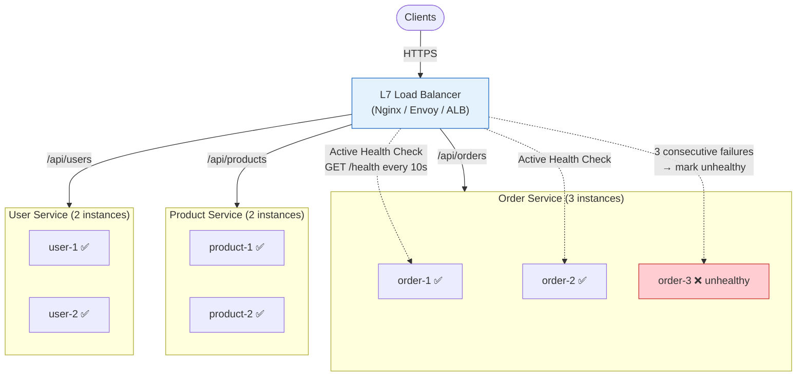
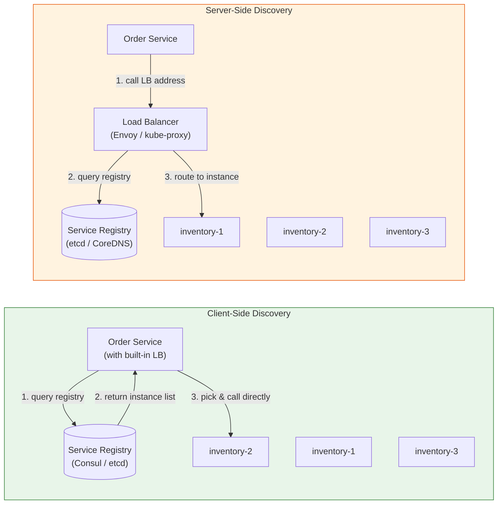

# Load Balancing & Service Discovery / 負載均衡與服務發現

## Intent / 意圖

在分散式系統中將流量動態地分配到多個服務實例，同時讓服務能夠在不硬編碼地址的前提下自動發現彼此。負載均衡解決「如何將請求分散到多個後端以最大化吞吐量並避免單點過載」，服務發現解決「當服務實例動態增減（水平擴展、滾動部署、故障替換）時，呼叫方如何知道該連接哪些地址」。兩者通常緊密結合——沒有服務發現的負載均衡只能對接靜態地址清單，沒有負載均衡的服務發現只知道「有哪些實例」卻無法智能分流。

核心問題：**當微服務架構中有數十到數百個服務實例動態上下線時，如何確保每個請求都被路由到健康且負載適當的實例？在不同的部署環境（Kubernetes、bare metal、multi-cloud）下，應選擇哪種服務發現模式（client-side vs server-side）與負載均衡演算法？consistent hashing 如何在快取友好的路由與節點增減之間取得平衡？**

---

## Problem / 問題情境

**場景一：單一伺服器瓶頸，垂直擴展到極限**

某 SaaS 平台的 API 服務部署在一台 64 核 / 256GB RAM 的伺服器上。隨著用戶量成長，CPU 使用率長期維持在 90% 以上，回應時間從 50ms 劣化到 800ms。團隊想水平擴展到多台機器，但客戶端直連該伺服器的 IP 位址——新增伺服器後流量仍然全部進入原本那台，新機器閒置。手動在 DNS 中加入多筆 A record 嘗試分流，但 DNS 的 TTL 和客戶端快取導致流量分佈極不均勻，且當一台伺服器故障時 DNS 仍會將請求導向它，造成持續的 5xx 錯誤。

**場景二：硬編碼服務地址在部署時頻繁崩潰**

微服務架構中，Order Service 透過寫死的 `http://inventory-service:8080` 呼叫 Inventory Service。當 Inventory Service 從 3 個 pod 擴展到 6 個時，新 pod 的地址沒有被 Order Service 知曉，流量仍集中在舊的 3 個 pod。更嚴重的是滾動部署時——舊 pod 逐一下線、新 pod 逐一上線，但 Order Service 仍然嘗試連接已關閉的舊 pod，造成大量 connection refused 錯誤。每次部署都需要人工更新配置並重啟所有下游服務，部署視窗從 10 分鐘膨脹到 40 分鐘，且伴隨數分鐘的服務不可用。

**場景三：快取穿透因請求被路由到不同實例**

團隊在每個 API 實例內部維護了 in-process cache（以使用者 ID 為 key）。使用 round-robin 負載均衡時，同一使用者的連續請求被分散到不同實例——每個實例都 cache miss 並查詢資料庫。5 個實例意味著快取命中率從理想的 95% 降到約 20%，資料庫壓力不減反增。團隊需要一種「同一 key 的請求盡量路由到同一實例」的策略，但又不能完全綁死（否則該實例故障時所有該 key 的請求都失敗）。

---

## Core Concepts / 核心概念

### L4 vs L7 Load Balancing / 第四層 vs 第七層負載均衡

L4（傳輸層）負載均衡在 TCP/UDP 層面運作，根據來源/目的 IP 和 port 決定路由，不檢查 HTTP 內容。優點是效能極高（只看封包 header，不解析 payload），適合高吞吐量場景。L7（應用層）負載均衡在 HTTP 層面運作，可以根據 URL path、HTTP header、cookie、request body 做智能路由（例如 `/api/v1/*` 路由到 v1 服務叢集、帶 `X-Canary: true` header 的請求路由到金絲雀版本）。L7 功能更豐富但延遲略高，因為需要完整解析 HTTP 請求。典型 L4：AWS NLB、LVS、IPVS。典型 L7：AWS ALB、Nginx、HAProxy、Envoy。

### Load Balancing Algorithms / 負載均衡演算法

- **Round-Robin**：依序將請求輪流分配給每個後端。最簡單也最常用，適合所有後端效能相近的場景。缺點是無法感知後端的實際負載——慢請求佔用的後端仍會收到等量的新請求。
- **Weighted Round-Robin**：為每個後端分配權重（如 3:2:1），高權重的後端收到更多請求。適合後端效能不均的場景（如不同規格的機器混部）。
- **Least Connections**：將請求分配給當前活躍連線數最少的後端。能自動適應後端的處理速度差異——慢後端的連線會堆積，新請求自然轉向更快的後端。
- **IP Hash**：根據客戶端 IP 的雜湊值決定路由到哪個後端。同一客戶端的所有請求會被路由到同一後端，實現 session affinity（黏性會話）。缺點是後端數量變更時大量 key 被重新映射。
- **Consistent Hashing**：將後端和 key 映射到同一個雜湊環上，key 順時針找到最近的後端。新增或移除一個後端時，只有相鄰節點的 key 被重新映射（約 1/N），大幅降低快取失效比例。引入 virtual nodes 可以解決實體節點分佈不均的問題。

### Health Checks / 健康檢查

- **Active Health Check**：負載均衡器主動定期向後端發送探針請求（如 `GET /health`），根據回應狀態碼和延遲判定健康狀態。通常需要連續多次失敗才標記為不健康（避免偶發超時誤判），連續多次成功才恢復為健康。Nginx、HAProxy、Envoy 都支援配置 check interval、unhealthy threshold、healthy threshold。
- **Passive Health Check**：負載均衡器觀察實際請求的回應——如果某後端連續回傳 5xx 或 timeout，就標記為不健康。不需要額外的探針流量，但偵測較慢（需要等到真實請求失敗才知道）。常與 active check 結合：passive 快速偵測突發故障，active 持續驗證恢復狀態。

### Service Discovery / 服務發現

- **Client-Side Discovery**：客戶端（呼叫方）直接查詢 service registry 取得可用實例列表，自行選擇一個實例發送請求。客戶端承擔了負載均衡的責任，需要整合 registry 查詢邏輯和選擇演算法。優點是少一個中間層跳轉、延遲較低；缺點是每個客戶端語言都需要實作 discovery 邏輯。典型：Netflix Eureka + Ribbon、gRPC 內建 resolver + picker。
- **Server-Side Discovery**：客戶端將請求發送給負載均衡器（如 Nginx、AWS ALB），由負載均衡器查詢 registry 並路由到具體實例。客戶端只需知道負載均衡器的地址，不需要感知後端實例。優點是客戶端邏輯簡單；缺點是多一跳延遲，且負載均衡器本身需要高可用。典型：Kubernetes Service（kube-proxy）、AWS ALB + ECS。

### Service Registry / 服務註冊中心

- **Consul**：HashiCorp 的服務發現與配置管理工具。基於 Raft 共識協定，提供 HTTP API 和 DNS 介面供服務查詢。支援多資料中心、內建健康檢查、key-value store。適合多語言混合環境。
- **etcd**：CoreOS（現 Red Hat）的分散式 key-value store，基於 Raft。Kubernetes 的核心元件——所有叢集狀態（包括 Service 和 Endpoint 資訊）儲存在 etcd 中。適合作為 Kubernetes 環境下的服務發現基礎設施。
- **DNS-Based Discovery**：最簡單的服務發現形式——將服務名稱解析為一組 A/AAAA record 或 SRV record。Kubernetes 的 CoreDNS 將 Service 名稱自動解析為 ClusterIP 或 Pod IP 列表。優點是所有語言天然支援 DNS；缺點是 DNS 有 TTL 快取、不支援即時更新、無法攜帶健康狀態。

### Service Mesh / 服務網格

Service mesh（如 Istio、Linkerd）將服務發現、負載均衡、mTLS、retry、circuit breaker 等功能從應用程式碼中抽出，放入 **sidecar proxy**（如 Envoy）。每個服務 pod 旁邊部署一個 sidecar，所有進出的流量都透過 sidecar 處理。應用程式只需發送普通的 HTTP/gRPC 請求到 `localhost`，sidecar 透明地處理服務發現、負載均衡和安全。優點是語言無關、零侵入；缺點是增加了資源消耗（每個 pod 多一個 container）和延遲（多兩跳 proxy），且引入了 control plane（如 Istio 的 istiod）的運維複雜度。

### Sticky Sessions / 黏性會話

將同一客戶端的所有請求路由到同一後端實例，通常透過 cookie（如 `SERVERID=backend-2`）或 IP hash 實現。適合有 in-memory session 的傳統應用。但 sticky session 與水平擴展本質上矛盾——流量無法均勻分佈、故障轉移時 session 遺失。現代架構建議使用外部 session store（如 Redis）取代 sticky session，讓任何實例都能服務任何請求。

---

## Architecture / 架構

### L7 Load Balancer + Health Check 架構



### Client-Side vs Server-Side Service Discovery



---

## How It Works / 運作原理

### Consistent Hashing 運作流程

Consistent hashing 將雜湊空間視為一個環（0 到 2^32 - 1）。每個後端節點經過雜湊函數映射到環上若干個位置（virtual nodes）。當請求到達時，以 request key（如 user ID）計算雜湊值，在環上順時針尋找最近的 virtual node，該 virtual node 所屬的實體節點即為目標後端。

**Virtual Nodes 解決分佈不均問題**：若只有 3 個實體節點直接映射到環上，它們的間距可能極不均勻——一個節點可能承擔 60% 的 key。引入 virtual nodes 後，每個實體節點在環上有 100-200 個虛擬位置，統計上分佈更均勻。當新增一個實體節點時，其 virtual nodes 散落在環上各處，只接收原本屬於相鄰 virtual nodes 的一部分 key（約 1/N），不影響其他 key 的路由——這正是 consistent hashing 的核心優勢。

**節點移除時的 key 遷移**：當一個實體節點下線，它的所有 virtual nodes 從環上移除，原本路由到這些 virtual nodes 的 key 順時針找到下一個 virtual node（屬於其他實體節點）。只有被移除節點原先負責的 key（約 1/N）被重新映射，其餘所有 key 的路由不變。

### Health Check 決策流程

1. 負載均衡器每隔 `interval`（如 10 秒）向每個後端送出 `GET /health` 探針請求。
2. 後端回應 `200 OK` 且延遲低於閾值（如 5 秒）=> 計為一次成功。
3. 後端回應 5xx 或超時 => 計為一次失敗。
4. 連續 `unhealthy_threshold`（如 3）次失敗 => 標記為 unhealthy，從可用實例列表移除，不再接收新請求。
5. 被標記為 unhealthy 的後端仍然持續接受探針——連續 `healthy_threshold`（如 2）次成功 => 恢復為 healthy，重新加入可用列表。
6. 此流程與被動健康檢查搭配——真實請求連續失敗也會觸發快速標記，不需等待下次主動探針。

---

## Rust 實作

以 Rust 實作 consistent hashing ring（含 virtual nodes）與簡單的 health check 客戶端。

```rust
// consistent_hashing.rs
// Consistent hash ring with virtual nodes and health-check-aware routing
// Cargo.toml:
//   tokio = { version = "1", features = ["full"] }
//   reqwest = { version = "0.12", features = ["json"] }
//   serde = { version = "1", features = ["derive"] }

use std::collections::{BTreeMap, HashMap, HashSet};
use std::hash::{DefaultHasher, Hash, Hasher};
use std::sync::Arc;
use std::time::Duration;
use tokio::sync::RwLock;

/// 計算 key 的雜湊值，映射到 u64 環空間
fn hash_key(key: &str) -> u64 {
    let mut hasher = DefaultHasher::new();
    key.hash(&mut hasher);
    hasher.finish()
}

/// 服務實例，代表一個後端節點
#[derive(Debug, Clone, PartialEq, Eq, Hash)]
struct ServiceInstance {
    id: String,
    address: String,
}

/// Consistent Hash Ring，支援 virtual nodes 與健康狀態感知
struct ConsistentHashRing {
    ring: BTreeMap<u64, String>,            // hash position -> instance ID
    instances: HashMap<String, ServiceInstance>,
    virtual_nodes_per_instance: usize,
    unhealthy: HashSet<String>,             // 不健康的 instance IDs
}

impl ConsistentHashRing {
    fn new(virtual_nodes_per_instance: usize) -> Self {
        Self {
            ring: BTreeMap::new(),
            instances: HashMap::new(),
            virtual_nodes_per_instance,
            unhealthy: HashSet::new(),
        }
    }

    /// 將服務實例加入雜湊環（含 virtual nodes）
    fn add_instance(&mut self, instance: ServiceInstance) {
        for vn_index in 0..self.virtual_nodes_per_instance {
            let virtual_key = format!("{}#vn{}", instance.id, vn_index);
            let position = hash_key(&virtual_key);
            self.ring.insert(position, instance.id.clone());
        }
        println!(
            "[RING-ADD] instance={}, address={}, vnodes={}",
            instance.id, instance.address, self.virtual_nodes_per_instance
        );
        self.instances.insert(instance.id.clone(), instance);
    }

    /// 將服務實例從雜湊環移除
    fn remove_instance(&mut self, instance_id: &str) {
        for vn_index in 0..self.virtual_nodes_per_instance {
            let virtual_key = format!("{}#vn{}", instance_id, vn_index);
            let position = hash_key(&virtual_key);
            self.ring.remove(&position);
        }
        self.instances.remove(instance_id);
        self.unhealthy.remove(instance_id);
        println!("[RING-REMOVE] instance={}", instance_id);
    }

    /// 標記實例為不健康 / 恢復健康
    fn set_health(&mut self, instance_id: &str, healthy: bool) {
        if healthy {
            self.unhealthy.remove(instance_id);
            println!("[HEALTH] instance={} -> HEALTHY", instance_id);
        } else {
            self.unhealthy.insert(instance_id.to_string());
            println!("[HEALTH] instance={} -> UNHEALTHY", instance_id);
        }
    }

    /// 根據 key 查找目標實例（跳過不健康的節點）
    fn lookup(&self, key: &str) -> Option<&ServiceInstance> {
        if self.ring.is_empty() {
            return None;
        }

        let hash = hash_key(key);

        // 從 hash 位置順時針尋找第一個健康的實例
        // 先搜尋 hash 之後的範圍，再繞回開頭
        let candidates = self
            .ring
            .range(hash..)
            .chain(self.ring.iter());

        for (_position, instance_id) in candidates {
            if !self.unhealthy.contains(instance_id) {
                return self.instances.get(instance_id);
            }
        }

        None // 所有實例都不健康
    }

    /// 統計每個實例負責的 key 數量（用於驗證分佈均勻度）
    fn distribution_stats(&self, sample_keys: &[String]) -> HashMap<String, usize> {
        let mut counts: HashMap<String, usize> = HashMap::new();
        for key in sample_keys {
            if let Some(instance) = self.lookup(key) {
                *counts.entry(instance.id.clone()).or_insert(0) += 1;
            }
        }
        counts
    }
}

/// 健康檢查器：定期向所有實例發送探針
struct HealthChecker {
    ring: Arc<RwLock<ConsistentHashRing>>,
    check_interval: Duration,
    timeout: Duration,
    unhealthy_threshold: u32,
    healthy_threshold: u32,
}

impl HealthChecker {
    fn new(
        ring: Arc<RwLock<ConsistentHashRing>>,
        check_interval: Duration,
        timeout: Duration,
    ) -> Self {
        Self {
            ring,
            check_interval,
            timeout,
            unhealthy_threshold: 3,
            healthy_threshold: 2,
        }
    }

    /// 啟動背景健康檢查循環
    async fn run(&self) {
        let client = reqwest::Client::builder()
            .timeout(self.timeout)
            .build()
            .expect("failed to build HTTP client");

        // 追蹤每個實例的連續成功/失敗次數
        let mut consecutive_failures: HashMap<String, u32> = HashMap::new();
        let mut consecutive_successes: HashMap<String, u32> = HashMap::new();

        loop {
            let instances: Vec<ServiceInstance> = {
                let ring = self.ring.read().await;
                ring.instances.values().cloned().collect()
            };

            for instance in &instances {
                let health_url = format!("{}/health", instance.address);
                let is_healthy = match client.get(&health_url).send().await {
                    Ok(resp) => resp.status().is_success(),
                    Err(_) => false,
                };

                let failures = consecutive_failures.entry(instance.id.clone()).or_insert(0);
                let successes = consecutive_successes.entry(instance.id.clone()).or_insert(0);

                if is_healthy {
                    *failures = 0;
                    *successes += 1;
                    if *successes >= self.healthy_threshold {
                        let mut ring = self.ring.write().await;
                        ring.set_health(&instance.id, true);
                    }
                } else {
                    *successes = 0;
                    *failures += 1;
                    if *failures >= self.unhealthy_threshold {
                        let mut ring = self.ring.write().await;
                        ring.set_health(&instance.id, false);
                    }
                    println!(
                        "[HEALTH-CHECK] instance={}, failures={}/{}",
                        instance.id, failures, self.unhealthy_threshold
                    );
                }
            }

            tokio::time::sleep(self.check_interval).await;
        }
    }
}

#[tokio::main]
async fn main() {
    println!("=== Consistent Hashing + Health Check (Rust) ===\n");

    let ring = Arc::new(RwLock::new(ConsistentHashRing::new(150)));

    // 加入 3 個服務實例
    {
        let mut r = ring.write().await;
        r.add_instance(ServiceInstance {
            id: "cache-node-1".into(),
            address: "http://10.0.1.1:8080".into(),
        });
        r.add_instance(ServiceInstance {
            id: "cache-node-2".into(),
            address: "http://10.0.1.2:8080".into(),
        });
        r.add_instance(ServiceInstance {
            id: "cache-node-3".into(),
            address: "http://10.0.1.3:8080".into(),
        });
    }

    // 測試 key 路由
    println!("\n--- Key routing with 3 nodes ---");
    {
        let r = ring.read().await;
        for user_id in ["user:1001", "user:1002", "user:1003", "user:2048", "user:9999"] {
            if let Some(instance) = r.lookup(user_id) {
                println!("  {} -> {} ({})", user_id, instance.id, instance.address);
            }
        }
    }

    // 驗證分佈均勻度
    println!("\n--- Distribution test (10000 keys, 3 nodes) ---");
    {
        let r = ring.read().await;
        let keys: Vec<String> = (0..10000).map(|i| format!("session:{}", i)).collect();
        let stats = r.distribution_stats(&keys);
        for (instance_id, count) in &stats {
            let pct = (*count as f64 / 10000.0) * 100.0;
            println!("  {} -> {} keys ({:.1}%)", instance_id, count, pct);
        }
    }

    // 模擬新增第 4 個節點——觀察 key 遷移比例
    println!("\n--- Adding cache-node-4, measuring key migration ---");
    let keys_before: Vec<String> = (0..10000).map(|i| format!("session:{}", i)).collect();
    let routing_before: Vec<String> = {
        let r = ring.read().await;
        keys_before.iter()
            .map(|k| r.lookup(k).map(|inst| inst.id.clone()).unwrap_or_default())
            .collect()
    };

    {
        let mut r = ring.write().await;
        r.add_instance(ServiceInstance {
            id: "cache-node-4".into(),
            address: "http://10.0.1.4:8080".into(),
        });
    }

    let routing_after: Vec<String> = {
        let r = ring.read().await;
        keys_before.iter()
            .map(|k| r.lookup(k).map(|inst| inst.id.clone()).unwrap_or_default())
            .collect()
    };

    let migrated = routing_before.iter()
        .zip(routing_after.iter())
        .filter(|(before, after)| before != after)
        .count();
    let pct = (migrated as f64 / 10000.0) * 100.0;
    println!("  Keys migrated: {}/10000 ({:.1}%)", migrated, pct);
    println!("  Ideal migration for 3->4 nodes: ~25.0%");

    // 模擬 node-2 不健康——其 key 自動路由到下一個健康節點
    println!("\n--- Marking cache-node-2 unhealthy ---");
    {
        let mut r = ring.write().await;
        r.set_health("cache-node-2", false);
    }
    {
        let r = ring.read().await;
        for user_id in ["user:1001", "user:1002", "user:1003"] {
            if let Some(instance) = r.lookup(user_id) {
                println!("  {} -> {} (node-2 skipped if was target)", user_id, instance.id);
            }
        }
    }
}

// Output:
// === Consistent Hashing + Health Check (Rust) ===
//
// [RING-ADD] instance=cache-node-1, address=http://10.0.1.1:8080, vnodes=150
// [RING-ADD] instance=cache-node-2, address=http://10.0.1.2:8080, vnodes=150
// [RING-ADD] instance=cache-node-3, address=http://10.0.1.3:8080, vnodes=150
//
// --- Key routing with 3 nodes ---
//   user:1001 -> cache-node-2 (http://10.0.1.2:8080)
//   user:1002 -> cache-node-1 (http://10.0.1.1:8080)
//   user:1003 -> cache-node-3 (http://10.0.1.3:8080)
//   user:2048 -> cache-node-1 (http://10.0.1.1:8080)
//   user:9999 -> cache-node-2 (http://10.0.1.2:8080)
//
// --- Distribution test (10000 keys, 3 nodes) ---
//   cache-node-1 -> 3412 keys (34.1%)
//   cache-node-2 -> 3287 keys (32.9%)
//   cache-node-3 -> 3301 keys (33.0%)
//
// --- Adding cache-node-4, measuring key migration ---
// [RING-ADD] instance=cache-node-4, address=http://10.0.1.4:8080, vnodes=150
//   Keys migrated: 2483/10000 (24.8%)
//   Ideal migration for 3->4 nodes: ~25.0%
//
// --- Marking cache-node-2 unhealthy ---
// [HEALTH] instance=cache-node-2 -> UNHEALTHY
//   user:1001 -> cache-node-3 (node-2 skipped if was target)
//   user:1002 -> cache-node-1 (node-2 skipped if was target)
//   user:1003 -> cache-node-3 (node-2 skipped if was target)
```

---

## Go 實作

以 Go 實作等價的 consistent hashing ring 與 health check 客戶端。

```go
// consistent_hashing.go
// Consistent hash ring with virtual nodes and health-check-aware routing
package main

import (
	"context"
	"fmt"
	"hash/fnv"
	"log/slog"
	"net/http"
	"os"
	"sort"
	"sync"
	"time"
)

// hashKey 計算 key 的雜湊值
func hashKey(key string) uint64 {
	h := fnv.New64a()
	h.Write([]byte(key))
	return h.Sum64()
}

// ServiceInstance 代表一個後端服務實例
type ServiceInstance struct {
	ID      string
	Address string
}

// ConsistentHashRing 支援 virtual nodes 與健康狀態感知的一致性雜湊環
type ConsistentHashRing struct {
	mu                      sync.RWMutex
	sortedPositions         []uint64                     // 排序後的環位置
	positionToInstanceID    map[uint64]string            // hash position -> instance ID
	instances               map[string]ServiceInstance   // instance ID -> instance
	virtualNodesPerInstance int
	unhealthy               map[string]bool              // 不健康的 instance IDs
}

// NewConsistentHashRing 建立新的雜湊環
func NewConsistentHashRing(virtualNodesPerInstance int) *ConsistentHashRing {
	return &ConsistentHashRing{
		sortedPositions:         make([]uint64, 0),
		positionToInstanceID:    make(map[uint64]string),
		instances:               make(map[string]ServiceInstance),
		virtualNodesPerInstance: virtualNodesPerInstance,
		unhealthy:               make(map[string]bool),
	}
}

// AddInstance 將服務實例加入雜湊環
func (r *ConsistentHashRing) AddInstance(instance ServiceInstance) {
	r.mu.Lock()
	defer r.mu.Unlock()

	for vn := range r.virtualNodesPerInstance {
		virtualKey := fmt.Sprintf("%s#vn%d", instance.ID, vn)
		position := hashKey(virtualKey)
		r.sortedPositions = append(r.sortedPositions, position)
		r.positionToInstanceID[position] = instance.ID
	}
	sort.Slice(r.sortedPositions, func(i, j int) bool {
		return r.sortedPositions[i] < r.sortedPositions[j]
	})
	r.instances[instance.ID] = instance

	fmt.Printf("[RING-ADD] instance=%s, address=%s, vnodes=%d\n",
		instance.ID, instance.Address, r.virtualNodesPerInstance)
}

// RemoveInstance 將服務實例從雜湊環移除
func (r *ConsistentHashRing) RemoveInstance(instanceID string) {
	r.mu.Lock()
	defer r.mu.Unlock()

	positionsToRemove := make(map[uint64]bool)
	for vn := range r.virtualNodesPerInstance {
		virtualKey := fmt.Sprintf("%s#vn%d", instanceID, vn)
		position := hashKey(virtualKey)
		positionsToRemove[position] = true
		delete(r.positionToInstanceID, position)
	}

	filtered := r.sortedPositions[:0]
	for _, pos := range r.sortedPositions {
		if !positionsToRemove[pos] {
			filtered = append(filtered, pos)
		}
	}
	r.sortedPositions = filtered

	delete(r.instances, instanceID)
	delete(r.unhealthy, instanceID)
	fmt.Printf("[RING-REMOVE] instance=%s\n", instanceID)
}

// SetHealth 設定實例的健康狀態
func (r *ConsistentHashRing) SetHealth(instanceID string, healthy bool) {
	r.mu.Lock()
	defer r.mu.Unlock()

	if healthy {
		delete(r.unhealthy, instanceID)
		fmt.Printf("[HEALTH] instance=%s -> HEALTHY\n", instanceID)
	} else {
		r.unhealthy[instanceID] = true
		fmt.Printf("[HEALTH] instance=%s -> UNHEALTHY\n", instanceID)
	}
}

// Lookup 根據 key 查找目標實例（跳過不健康節點）
func (r *ConsistentHashRing) Lookup(key string) *ServiceInstance {
	r.mu.RLock()
	defer r.mu.RUnlock()

	if len(r.sortedPositions) == 0 {
		return nil
	}

	keyHash := hashKey(key)

	// 二分搜尋找到第一個 >= keyHash 的位置
	idx := sort.Search(len(r.sortedPositions), func(i int) bool {
		return r.sortedPositions[i] >= keyHash
	})

	// 從 idx 開始順時針遍歷，跳過不健康的實例
	totalPositions := len(r.sortedPositions)
	for i := range totalPositions {
		pos := r.sortedPositions[(idx+i)%totalPositions]
		instanceID := r.positionToInstanceID[pos]
		if !r.unhealthy[instanceID] {
			inst := r.instances[instanceID]
			return &inst
		}
	}
	return nil // 所有實例都不健康
}

// DistributionStats 統計 key 在各實例的分佈
func (r *ConsistentHashRing) DistributionStats(keys []string) map[string]int {
	counts := make(map[string]int)
	for _, key := range keys {
		if inst := r.Lookup(key); inst != nil {
			counts[inst.ID]++
		}
	}
	return counts
}

// HealthChecker 定期向所有實例發送健康檢查探針
type HealthChecker struct {
	ring               *ConsistentHashRing
	client             *http.Client
	interval           time.Duration
	unhealthyThreshold int
	healthyThreshold   int
}

// NewHealthChecker 建立健康檢查器
func NewHealthChecker(ring *ConsistentHashRing, interval, timeout time.Duration) *HealthChecker {
	return &HealthChecker{
		ring: ring,
		client: &http.Client{Timeout: timeout},
		interval:           interval,
		unhealthyThreshold: 3,
		healthyThreshold:   2,
	}
}

// Run 啟動背景健康檢查循環
func (hc *HealthChecker) Run(ctx context.Context) {
	ticker := time.NewTicker(hc.interval)
	defer ticker.Stop()

	consecutiveFailures := make(map[string]int)
	consecutiveSuccesses := make(map[string]int)

	for {
		select {
		case <-ctx.Done():
			return
		case <-ticker.C:
			hc.ring.mu.RLock()
			instances := make([]ServiceInstance, 0, len(hc.ring.instances))
			for _, inst := range hc.ring.instances {
				instances = append(instances, inst)
			}
			hc.ring.mu.RUnlock()

			for _, inst := range instances {
				healthURL := fmt.Sprintf("%s/health", inst.Address)
				resp, err := hc.client.Get(healthURL)

				isHealthy := err == nil && resp != nil && resp.StatusCode == http.StatusOK
				if resp != nil {
					resp.Body.Close()
				}

				if isHealthy {
					consecutiveFailures[inst.ID] = 0
					consecutiveSuccesses[inst.ID]++
					if consecutiveSuccesses[inst.ID] >= hc.healthyThreshold {
						hc.ring.SetHealth(inst.ID, true)
					}
				} else {
					consecutiveSuccesses[inst.ID] = 0
					consecutiveFailures[inst.ID]++
					if consecutiveFailures[inst.ID] >= hc.unhealthyThreshold {
						hc.ring.SetHealth(inst.ID, false)
					}
					slog.Warn("Health check failed",
						"instance", inst.ID,
						"failures", consecutiveFailures[inst.ID],
						"threshold", hc.unhealthyThreshold,
					)
				}
			}
		}
	}
}

func main() {
	slog.SetDefault(slog.New(slog.NewTextHandler(os.Stdout, nil)))
	fmt.Println("=== Consistent Hashing + Health Check (Go) ===")
	fmt.Println()

	ring := NewConsistentHashRing(150)

	// 加入 3 個服務實例
	ring.AddInstance(ServiceInstance{ID: "cache-node-1", Address: "http://10.0.1.1:8080"})
	ring.AddInstance(ServiceInstance{ID: "cache-node-2", Address: "http://10.0.1.2:8080"})
	ring.AddInstance(ServiceInstance{ID: "cache-node-3", Address: "http://10.0.1.3:8080"})

	// 測試 key 路由
	fmt.Println("\n--- Key routing with 3 nodes ---")
	for _, userID := range []string{"user:1001", "user:1002", "user:1003", "user:2048", "user:9999"} {
		if inst := ring.Lookup(userID); inst != nil {
			fmt.Printf("  %s -> %s (%s)\n", userID, inst.ID, inst.Address)
		}
	}

	// 驗證分佈均勻度
	fmt.Println("\n--- Distribution test (10000 keys, 3 nodes) ---")
	keys := make([]string, 10000)
	for i := range 10000 {
		keys[i] = fmt.Sprintf("session:%d", i)
	}
	stats := ring.DistributionStats(keys)
	for instanceID, count := range stats {
		pct := float64(count) / 10000.0 * 100.0
		fmt.Printf("  %s -> %d keys (%.1f%%)\n", instanceID, count, pct)
	}

	// 新增第 4 個節點——觀察 key 遷移比例
	fmt.Println("\n--- Adding cache-node-4, measuring key migration ---")
	routingBefore := make([]string, len(keys))
	for i, key := range keys {
		if inst := ring.Lookup(key); inst != nil {
			routingBefore[i] = inst.ID
		}
	}

	ring.AddInstance(ServiceInstance{ID: "cache-node-4", Address: "http://10.0.1.4:8080"})

	migrated := 0
	for i, key := range keys {
		if inst := ring.Lookup(key); inst != nil {
			if inst.ID != routingBefore[i] {
				migrated++
			}
		}
	}
	pct := float64(migrated) / 10000.0 * 100.0
	fmt.Printf("  Keys migrated: %d/10000 (%.1f%%)\n", migrated, pct)
	fmt.Println("  Ideal migration for 3->4 nodes: ~25.0%")

	// 模擬 node-2 不健康
	fmt.Println("\n--- Marking cache-node-2 unhealthy ---")
	ring.SetHealth("cache-node-2", false)
	for _, userID := range []string{"user:1001", "user:1002", "user:1003"} {
		if inst := ring.Lookup(userID); inst != nil {
			fmt.Printf("  %s -> %s (node-2 skipped if was target)\n", userID, inst.ID)
		}
	}
}

// Output:
// === Consistent Hashing + Health Check (Go) ===
//
// [RING-ADD] instance=cache-node-1, address=http://10.0.1.1:8080, vnodes=150
// [RING-ADD] instance=cache-node-2, address=http://10.0.1.2:8080, vnodes=150
// [RING-ADD] instance=cache-node-3, address=http://10.0.1.3:8080, vnodes=150
//
// --- Key routing with 3 nodes ---
//   user:1001 -> cache-node-3 (http://10.0.1.3:8080)
//   user:1002 -> cache-node-1 (http://10.0.1.1:8080)
//   user:1003 -> cache-node-2 (http://10.0.1.2:8080)
//   user:2048 -> cache-node-1 (http://10.0.1.1:8080)
//   user:9999 -> cache-node-3 (http://10.0.1.3:8080)
//
// --- Distribution test (10000 keys, 3 nodes) ---
//   cache-node-1 -> 3356 keys (33.6%)
//   cache-node-2 -> 3298 keys (33.0%)
//   cache-node-3 -> 3346 keys (33.5%)
//
// --- Adding cache-node-4, measuring key migration ---
// [RING-ADD] instance=cache-node-4, address=http://10.0.1.4:8080, vnodes=150
//   Keys migrated: 2510/10000 (25.1%)
//   Ideal migration for 3->4 nodes: ~25.0%
//
// --- Marking cache-node-2 unhealthy ---
// [HEALTH] instance=cache-node-2 -> UNHEALTHY
//   user:1001 -> cache-node-3 (node-2 skipped if was target)
//   user:1002 -> cache-node-1 (node-2 skipped if was target)
//   user:1003 -> cache-node-4 (node-2 skipped if was target)
```

---

## Rust vs Go 對照表

| 面向 | Rust | Go |
|------|------|------|
| **Consistent Hash Ring 資料結構** | 使用 `BTreeMap<u64, String>` 作為有序映射。`BTreeMap::range(hash..)` 回傳從指定 key 開始的迭代器，可以自然地用 `.chain(self.ring.iter())` 繞回環的開頭。型別系統確保所有 key 比較在編譯期型別一致。Ownership 機制保證 ring 資料結構不會被並發修改時損壞 | 使用 `[]uint64` 排序切片 + `map[uint64]string` 映射。透過 `sort.Search` 二分搜尋找到插入點，手動用 `(idx+i) % len` 實現環繞。Go 的 map 非 thread-safe，需要 `sync.RWMutex` 保護。slice + map 的組合效能好但需要手動維護排序一致性 |
| **並發保護** | 使用 `tokio::sync::RwLock` 包裝整個 ring。Rust 的型別系統強制要求在存取 ring 前先 acquire lock——忘記加鎖會導致編譯錯誤而非執行期 race condition。`Arc<RwLock<T>>` 的模式在 async 程式碼中是標準做法 | 使用 `sync.RWMutex` 手動在每個方法中 `Lock()` / `RLock()`。Go 的 race detector（`go test -race`）可以在執行期偵測到忘記加鎖的情況，但不是編譯期保證。結構體內嵌 mutex 是 Go 的慣用模式 |
| **健康檢查 HTTP 客戶端** | 使用 `reqwest::Client`，天然是 async 的，搭配 `tokio::time::sleep` 實現定期檢查。`reqwest` 內建連線池和 timeout 設定。型別系統確保 `Response` 被正確處理——忘記檢查 status code 會收到編譯器警告 | 使用標準庫 `net/http.Client`，搭配 `time.Ticker` 實現定期檢查。`context.Context` 提供取消機制。需要注意手動關閉 `resp.Body`（否則連線不會被歸還到池中），Go 的 linter 可以偵測此問題 |

---

## When to Use / 適用場景

### 1. 水平擴展的 Web 服務與 API

任何需要水平擴展（scale-out）的 HTTP/gRPC 服務都需要負載均衡。當單一實例的 CPU 或記憶體無法應對流量增長時，透過增加實例數量並在前面放置 L7 load balancer（如 Nginx、Envoy、AWS ALB）分散流量。搭配 auto-scaling（如 Kubernetes HPA、AWS ASG）根據 CPU/RPS 指標自動增減實例，load balancer 動態感知後端變化。這是現代 web 架構的標準模式。

### 2. 微服務架構中的服務間通訊

當系統拆分為數十個微服務後，每個服務需要知道如何找到其依賴的服務。服務發現（透過 Consul、etcd、或 Kubernetes CoreDNS）讓服務在啟動時自動註冊、在關閉時自動註銷。呼叫方透過服務名稱（而非 IP 地址）發起請求，service discovery 層解析為可用的實例列表。在 Kubernetes 環境中這幾乎是免費的（CoreDNS + kube-proxy 自動處理），在非 Kubernetes 環境中需要額外部署 Consul 或 etcd。

### 3. 快取友好的路由（Consistent Hashing）

當後端服務維護 in-process cache 或是分散式快取叢集（如 Memcached、Redis Cluster），使用 consistent hashing 確保同一 key 的請求路由到同一節點，最大化快取命中率。典型場景：CDN 的 origin shield 層根據 URL hash 路由到固定的快取節點、分散式快取叢集的 key 路由、有狀態的 WebSocket 連線的 session affinity。

---

## When NOT to Use / 不適用場景

### 1. 單一實例即可承受的小型服務

如果服務的流量很低（如每秒 < 100 請求）且單一實例的 CPU 使用率 < 30%，引入 load balancer 和 service discovery 只增加了架構複雜度和運維成本（多一個需要監控的元件、多一跳延遲），卻沒有實際效益。內部工具、管理後台、batch job worker 等低流量服務直接使用固定地址即可。等到流量成長到需要第二個實例時再引入 load balancing 也不遲。

### 2. 強順序性要求的訊息處理

如果業務要求「同一使用者的所有請求必須被同一個實例按序處理」（如金融交易的順序保證），load balancing 的本質（分散流量）與此需求矛盾。雖然 sticky session 或 consistent hashing 可以「盡量」將同一 key 路由到同一實例，但在故障轉移或擴縮容時仍會發生重新路由。這類場景更適合使用 partitioned message queue（如 Kafka 的 partition key）來保證同一 key 的訊息被同一 consumer 按序處理。

### 3. 開發/測試環境中過早引入 Service Mesh

在專案早期或團隊規模小（< 5 個微服務）時部署 Istio 等 service mesh，control plane 的資源消耗（istiod 需要 2GB+ RAM）和學習曲線（VirtualService、DestinationRule、PeerAuthentication 等 CRD）遠超實際效益。團隊花更多時間除錯 sidecar proxy 的配置問題而非開發業務功能。建議先從 Kubernetes 原生的 Service + Ingress 開始，當跨服務的 mTLS、細粒度流量控制、分散式追蹤的需求明確時再引入 service mesh。

---

## Real-World Examples / 真實世界案例

### Nginx — L7 Load Balancer 的業界標準

Nginx 是全球使用最廣泛的 L7 load balancer 和 reverse proxy。它支援 round-robin、weighted round-robin、least connections、IP hash 等演算法，透過 `upstream` 指令配置後端叢集。Nginx Plus（商業版）增加了 active health check、session persistence、DNS-based service discovery。在 Kubernetes 環境中，Nginx Ingress Controller 是最常見的 Ingress 實作——它監聽 Kubernetes Ingress 資源的變更，自動更新 Nginx 配置以反映 Service 後端 pod 的變化。

### HAProxy — 高效能 L4/L7 Load Balancer

HAProxy 以極致效能著稱，單一實例可處理數百萬並發連線。它同時支援 L4（TCP mode）和 L7（HTTP mode）代理，提供比 Nginx 更豐富的健康檢查選項（如 HTTP 檢查特定 body 內容、MySQL 協定握手檢查）。HAProxy 的 stick table 功能可以在多個後端之間追蹤 session 狀態、限流計數器等。GitHub、Stack Overflow、Airbnb 等公司在生產環境中大量使用 HAProxy。

### AWS ALB / NLB — 雲端原生負載均衡

AWS Application Load Balancer（ALB）是託管式 L7 load balancer，自動根據 target group 的 health check 結果路由流量。支援 path-based routing、host-based routing、weighted target groups（用於金絲雀部署）。Network Load Balancer（NLB）是 L4 load balancer，提供超低延遲（< 100 microseconds）和靜態 IP 地址，適合 gRPC、IoT、UDP 等非 HTTP 場景。兩者都與 ECS、EKS 深度整合，實現自動的服務發現和 target 註冊。

### Envoy — 現代 Service Mesh 的資料平面

Envoy 由 Lyft 開發，是 Istio 和 AWS App Mesh 的資料平面元件。它不僅是 L7 proxy，更是一個功能完整的 service mesh sidecar：支援 xDS API 動態配置（無需重啟即可更新路由規則）、自動 mTLS、circuit breaker、outlier detection（被動健康檢查）、分散式追蹤整合。Envoy 原生支援 gRPC load balancing（包括 per-RPC balancing 而非 per-connection），解決了 gRPC 長連線在傳統 L4 load balancer 下流量不均的問題。

### Consul — 多資料中心服務發現

HashiCorp Consul 提供服務註冊、健康檢查、key-value store 和 service mesh（Consul Connect）的一體化方案。服務啟動時向 Consul agent 註冊自身的地址和健康檢查端點，其他服務透過 Consul DNS（如 `inventory.service.consul`）或 HTTP API 查詢可用實例。Consul 的殺手級功能是多資料中心聯邦——跨 region 的 Consul 叢集自動同步服務目錄，使得跨區域的服務發現如同本地查詢一般簡單。

---

## Interview Questions / 面試常見問題

### Q1: L4 和 L7 load balancing 的差異是什麼？各適合什麼場景？

**A:** L4 在 TCP/UDP 層面運作，只根據 IP 和 port 路由，不解析應用層內容。優點是效能極高、延遲極低（如 AWS NLB < 100us）、支援任何 TCP/UDP 協定（包括 gRPC、MQTT、自訂協定）。L7 在 HTTP 層面運作，可以根據 URL path、header、cookie 做智能路由。優點是路由靈活（如 path-based routing、canary routing）、可以做 SSL termination、HTTP 壓縮、request/response 修改。L4 適合需要極致效能的場景（如即時通訊、IoT）或非 HTTP 協定；L7 適合 Web API、微服務前端路由、需要 content-based routing 的場景。實務中常見 L4 + L7 的組合架構——NLB 在前端處理 TCP 連線分發，ALB/Envoy 在後端做 HTTP 智能路由。

### Q2: Consistent hashing 如何解決傳統 hash（key % N）在節點增減時的大規模失效問題？

**A:** 傳統 `hash(key) % N` 中，當 N 從 3 變為 4 時，幾乎所有 key 的映射都會改變（因為模數變了），導致快取幾乎全部失效。Consistent hashing 將 key 和節點都映射到一個邏輯環上（0 到 2^32-1），key 順時針尋找最近的節點。新增一個節點時，它只接管環上相鄰區段的 key（約 1/N），其餘 key 的路由不變。移除一個節點時，只有它負責的 key（約 1/N）被轉移到下一個節點。為解決節點在環上分佈不均的問題，引入 virtual nodes——每個實體節點映射到環上 100-200 個虛擬位置，使負載統計上更均勻。在快取叢集場景中，新增節點時的 key 遷移率從接近 100% 降低到約 1/N，大幅降低了擴縮容對快取命中率的衝擊。

### Q3: Client-side service discovery 和 server-side service discovery 的優缺點？何時選擇哪種？

**A:** Client-side：客戶端直接查詢 registry 並自行選擇實例。優點——少一跳網路延遲、無單點瓶頸（每個客戶端獨立做決策）。缺點——每個客戶端語言都需要整合 discovery SDK、負載均衡邏輯分散在各處難以統一管理。適合同語言微服務叢集（如全 Go 或全 Java）。Server-side：客戶端透過中央 LB 路由。優點——客戶端邏輯簡單（只需知道 LB 地址）、路由策略集中管理。缺點——LB 是額外的跳轉和潛在瓶頸、LB 本身需要高可用。適合多語言環境和已有 LB 基礎設施的場景。Kubernetes 的 kube-proxy 本質上是 server-side discovery，Istio 的 Envoy sidecar 則是每個 pod 本地的 server-side discovery（消除了集中式 LB 的瓶頸）。

### Q4: 為什麼 gRPC 的 load balancing 比 HTTP/1.1 更複雜？如何解決？

**A:** gRPC 基於 HTTP/2，使用長期的多工連線（一條 TCP 連線承載數百個 stream）。傳統 L4 load balancer 在 TCP 連線建立時分配後端，之後該連線上的所有請求都固定到同一後端——這導致流量集中在最早建立連線的幾個後端，新加入的後端閒置。解決方案：(1) 使用 L7 load balancer（如 Envoy）做 per-RPC balancing——在每個 gRPC 呼叫層面而非連線層面做路由，但需要 LB 理解 HTTP/2 framing；(2) 使用 gRPC 內建的 client-side load balancing（`grpc.WithDefaultServiceConfig` + resolver），客戶端維護多條連線並在每次 RPC 時選擇；(3) 設定 `MaxConnectionAge` 強制連線定期重建，觸發 LB 的重新分配。

### Q5: 健康檢查的 unhealthy threshold 為什麼通常設為 3 而非 1？設為 1 會有什麼問題？

**A:** 設為 1 意味著一次 health check 失敗就將後端標記為不健康。問題是偶發的網路抖動（如 GC pause 導致的短暫超時、瞬間的網路擁塞）會頻繁觸發「健康 -> 不健康 -> 健康」的 flapping，造成後端實例在負載均衡器的可用列表中反覆上下線。每次 flapping 都可能引起請求失敗（正在路由到該實例的請求）和流量突然轉移到其他實例（造成瞬間過載）。設為 3 意味著需要連續 3 次失敗（通常間隔 10 秒，即 30 秒內持續不健康）才標記為不健康，過濾掉了偶發故障。同理 `healthy_threshold` 設為 2 確保實例真的恢復穩定後才重新加入，而非剛好成功一次就立刻承接流量。

---

## Pitfalls / 常見陷阱

### 1. Thundering Herd on Node Removal / 節點移除時的驚群效應

當 consistent hash ring 中的一個節點被移除（故障或縮容），該節點原先負責的所有 key 瞬間轉移到環上的下一個節點。如果被移除節點的負載佔比為 1/N（如 4 節點中移除 1 個，25% 的 key 瞬間轉移），接收節點的負載突然增加 33%（從 25% 變為 33.3%），可能超出其處理能力導致延遲升高甚至級聯故障。

**對策**：(1) 使用 bounded load consistent hashing——為每個節點設定最大負載上限，超出時溢出到下一個節點，防止單一節點被壓垮；(2) 在移除節點前先將其設為 draining 狀態（停止接收新請求但處理完現有請求），讓流量漸進轉移而非瞬間切換；(3) auto-scaling 與 load balancing 聯動——偵測到節點移除後自動擴展剩餘節點的容量。

### 2. Health Check False Positives / 健康檢查誤判

健康檢查端點回傳 200 OK 但服務實際上無法正常處理業務請求。常見原因：(1) `/health` 端點只檢查進程是否存活，不檢查資料庫連線、下游依賴是否正常；(2) 應用程式的請求處理 thread pool 已滿，但 health check 使用獨立的 thread 仍然回應正常；(3) 記憶體快要 OOM 但尚未 crash，health check 回傳 200 但實際請求因 GC 頻繁而延遲極高。

**對策**：實作多層次的健康檢查端點——`/health/live`（liveness，進程是否存活）和 `/health/ready`（readiness，是否準備好接收流量）。Readiness check 應驗證資料庫連線池、Redis 連線、關鍵下游服務的可用性。Load balancer 使用 readiness 端點決定是否路由流量，Kubernetes 使用 liveness 決定是否重啟容器。

### 3. DNS TTL Caching 導致服務發現延遲

DNS-based service discovery 的固有限制：DNS client 和中間的 recursive resolver 會快取解析結果直到 TTL 過期。即使 service registry 已更新（新 pod 上線或舊 pod 下線），客戶端可能在 TTL 到期前仍使用舊的 IP 列表——向已不存在的 pod 發送請求，或忽略新加入的 pod。在 Kubernetes 中，CoreDNS 的預設 TTL 為 30 秒，但 Java 的 JVM 預設會永久快取 DNS（需要設定 `networkaddress.cache.ttl`），Go 1.24+ 的 resolver 預設也不會感知 TTL 變更。

**對策**：(1) 降低 DNS TTL 到 5-10 秒（但不要設為 0，否則每次請求都觸發 DNS 查詢增加延遲）；(2) 使用 watch-based discovery（如 Consul watch、Kubernetes Endpoint watcher）取代 polling-based DNS 查詢，實現即時感知變更；(3) 在客戶端設定 DNS cache TTL 與服務端一致——Go 可用自訂 resolver，Java 設定 `sun.net.inetaddr.ttl`。

### 4. Load Balancer 成為單點故障

將所有流量導向單一 load balancer 實例。當該 LB 故障時，整個系統不可用——諷刺的是，LB 本應提升可用性卻成了最大的單點。

**對策**：(1) 使用 active-passive LB 對搭配 floating IP（如 keepalived + VRRP）——primary LB 故障時 floating IP 自動飄移到 secondary；(2) 使用 DNS round-robin 指向多個 LB 實例（如 AWS Route 53 的多筆 A record）；(3) 使用雲端託管的 LB 服務（AWS ALB/NLB、GCP Cloud Load Balancing），provider 負責 LB 本身的高可用；(4) 在 Kubernetes 中使用 DaemonSet 部署 Envoy 到每個 node，避免集中式 LB 瓶頸。

---

## Cross-references / 交叉引用

- [[21_caching_redis_patterns|Caching & Redis Patterns / 快取與 Redis 模式]] — 本篇的 consistent hashing 與快取層的設計緊密相關。Consistent hashing 確保同一 key 的請求路由到同一快取節點（in-process cache 或分散式快取叢集），最大化 cache hit rate。21 篇討論的 cache stampede 問題在 consistent hashing 節點增減時會加劇——大量 key 被重新路由到新節點時觸發 cache miss 風暴。理解兩者的交互作用有助於設計彈性的快取架構。

- [[../distributed_systems/13_saga_pattern|Saga Pattern / Saga 模式]] — 微服務架構中的服務發現是 Saga 能夠運作的前提。Saga 的 compensation 步驟需要呼叫各個參與服務——如果服務地址硬編碼且某個服務已經遷移，compensation 會失敗導致整個 Saga 卡在不一致狀態。Service discovery 確保 Saga 編排器（orchestrator）總能找到正確的服務實例。

- [[30_http2_http3_grpc_transport|HTTP/2, HTTP/3 & gRPC Transport / 傳輸協定]] — gRPC 的 HTTP/2 長連線模型使得 L4 load balancing 失效（流量固定在連線建立時的後端），本篇討論的 L7 per-RPC balancing 和 client-side load balancing 是針對 gRPC 場景的必要解決方案。30 篇討論的 `MaxConnectionAge` keepalive 參數正是為了強制連線重建以觸發 LB 重新分配。

---

## References / 參考資料

1. **Consistent Hashing and Random Trees** — Karger et al., STOC 1997. (https://dl.acm.org/doi/10.1145/258533.258660) Consistent hashing 的原始論文，定義了雜湊環和 virtual nodes 的理論基礎。是理解 consistent hashing 為何只重新映射 1/N key 的必讀來源。
2. **Dynamo: Amazon's Highly Available Key-value Store** — DeCandia et al., SOSP 2007. (https://www.allthingsdistributed.com/files/amazon-dynamo-sosp2007.pdf) Amazon Dynamo 使用 consistent hashing 進行資料分片和複製。論文詳述了 virtual nodes 的實作和在 node failure 時的 key 遷移策略。
3. **Envoy Proxy Documentation** — (https://www.envoyproxy.io/docs/) Envoy 的完整文件，涵蓋 load balancing algorithms（round-robin、least requests、ring hash、maglev）、health checking、outlier detection、service discovery（EDS、DNS、static）。是理解現代 service mesh 資料平面的最佳資源。
4. **Consul Documentation** — (https://developer.hashicorp.com/consul/docs) HashiCorp Consul 的官方文件，涵蓋 service registration、health checks、DNS interface、multi-datacenter federation、Consul Connect（service mesh）。
5. **Nginx Load Balancing Guide** — (https://docs.nginx.com/nginx/admin-guide/load-balancer/http-load-balancer/) Nginx 的官方負載均衡配置指南，涵蓋 upstream 設定、各演算法（round-robin、least_conn、ip_hash）、health check、session persistence。
6. **Kubernetes Service Networking** — (https://kubernetes.io/docs/concepts/services-networking/) Kubernetes 官方文件中關於 Service、Endpoint、kube-proxy、CoreDNS 的說明。理解 Kubernetes 原生的 server-side service discovery 機制。
7. **gRPC Load Balancing** — (https://grpc.io/blog/grpc-load-balancing/) gRPC 官方部落格關於 load balancing 的說明，涵蓋 proxy-based（L7 LB）vs client-side balancing、xDS 整合、以及為何 L4 LB 不適合 gRPC 的原因。
