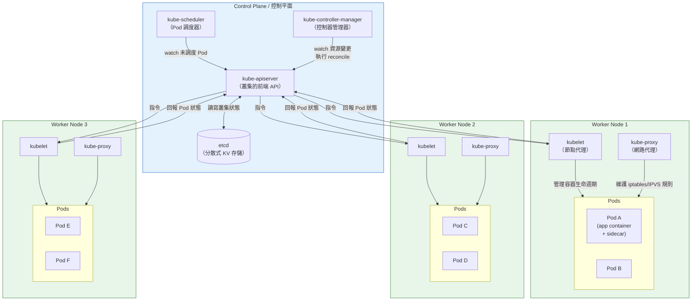
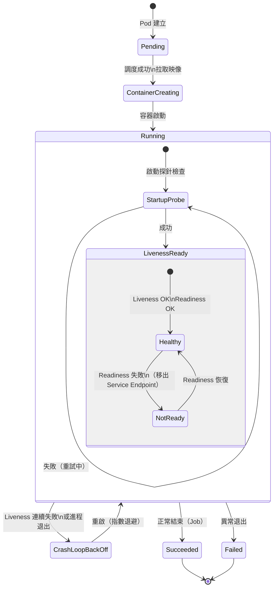
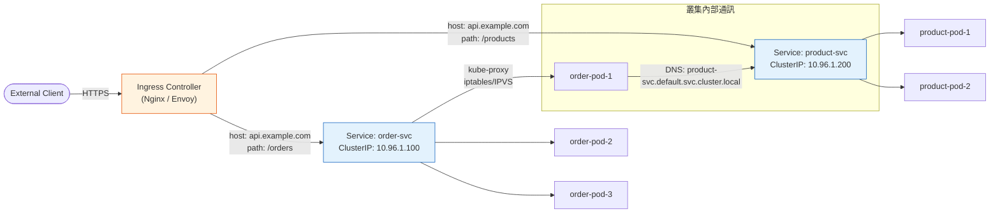
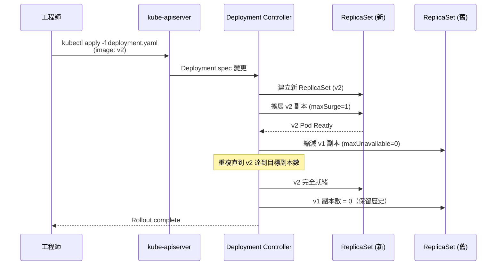

# Kubernetes Core Concepts / K8s 核心概念

## Intent / 意圖

Kubernetes（K8s）是容器編排的事實標準，解決「如何在大規模叢集中自動化地部署、擴縮、修復、更新容器化應用」。它提供聲明式（declarative）配置模型——你描述期望狀態（desired state），K8s 的控制迴圈（control loop）持續將實際狀態（actual state）調諧至期望狀態。

核心問題：**當系統從「幾個容器跑在單機」成長到「數百個微服務分散在數十台節點」時，如何確保每個服務被正確地調度、自動修復、水平擴展、安全暴露網路端點，並在滾動更新時維持零停機？Pod、Service、Deployment、StatefulSet、DaemonSet、HPA、ConfigMap/Secret、Health Probes、Resource Requests/Limits、Namespace 各自在這個編排體系中扮演什麼角色？**

---

## Problem / 問題情境

**場景一：手動管理容器的維運災難**

某團隊將 12 個微服務以 Docker 容器部署在 5 台 VM 上。每次部署由工程師手動 SSH 到各台機器執行 `docker pull && docker stop && docker run`。問題迅速浮現：(1) 某台 VM 的磁碟滿了導致容器無法啟動，但沒有人知道——直到用戶回報 500 錯誤；(2) 某個服務的容器在凌晨 OOM crash，沒有自動重啟機制，隔天早上才被發現；(3) 黑色星期五流量暴增 10 倍，手動在每台 VM 上啟動額外容器並更新 Nginx 配置花了 45 分鐘，期間大量請求 timeout；(4) 滾動更新時先停止舊容器再啟動新容器，中間有 30 秒的服務空窗。團隊每週花 20 小時在這類維運工作上，且每次部署都提心吊膽。

**場景二：資源分配不均導致級聯故障**

5 個微服務部署在 Kubernetes 叢集中，但都沒有設定 resource requests/limits。某個批次處理服務在凌晨觸發大量計算，消耗了整個節點的 CPU 和記憶體。同一節點上的 API 服務因 CPU throttling 回應時間從 50ms 劣化到 8 秒，健康檢查開始失敗。Kubernetes 認為 API 服務不健康而重啟它，但新啟動的容器立刻又因為資源不足而再次不健康——形成 CrashLoopBackOff 循環。連鎖效應擴散到其他節點（因為被驅逐的 pod 被調度到其他節點，帶來相同的資源壓力），最終整個叢集的 API 服務都不可用。根因只是一個 pod 沒有設定 resource limits。

**場景三：有狀態服務在 Kubernetes 上反覆資料遺失**

團隊將 PostgreSQL 以 Deployment 部署在 K8s 上。使用 `emptyDir` volume 存儲資料。第一次 pod 被重新調度到另一個節點時，所有資料遺失。改用 `hostPath` 後，pod 被綁定在特定節點——該節點故障時 pod 無法遷移。更嚴重的是，3 副本的 PostgreSQL Deployment 被分配到 `postgres-0`、`postgres-1`、`postgres-2` 三個隨機 hostname，每次重啟 hostname 都變，導致主從複製的配置（依賴穩定的節點身份）反覆斷裂。團隊這才意識到 Deployment 不適合有狀態服務——StatefulSet 才是正確的抽象。

---

## Core Concepts / 核心概念

### Pod / 容器組

Pod 是 Kubernetes 中最小的可調度單位——不是單一容器，而是一組共享網路命名空間（Network Namespace）和儲存卷（Volume）的容器。同一 Pod 內的容器共享 `localhost`（可透過 `127.0.0.1` 互相通訊）和掛載的 Volume，但與其他 Pod 完全隔離。設計理念源自「緊密耦合的協作進程」——主應用容器搭配 sidecar 容器（如 Envoy proxy、log collector、config reloader）。Pod 具有短暫性（ephemeral），隨時可能被終止並在其他節點重建，因此不應直接依賴 Pod 的 IP 地址或身份。一般不直接建立 Pod，而是透過 Deployment、StatefulSet 等高階控制器管理。

### Service / 服務

Service 為一組動態變化的 Pod 提供穩定的網路端點（Stable Network Endpoint）。Pod 的 IP 會隨著重建而改變，但 Service 的 ClusterIP 和 DNS 名稱保持不變。Service 透過 Label Selector 自動發現匹配的 Pod，並將流量負載均衡到這些 Pod。主要類型：(1) **ClusterIP**（預設）：叢集內部可存取的虛擬 IP；(2) **NodePort**：在每個節點上開放一個固定 port（30000-32767），外部可透過 `<NodeIP>:<NodePort>` 存取；(3) **LoadBalancer**：在雲環境中自動建立外部負載均衡器（如 AWS ALB/NLB）；(4) **Headless Service**（`clusterIP: None`）：不分配 ClusterIP，DNS 直接回傳所有 Pod IP，適合有狀態服務需要知道每個 Pod 地址的場景（如資料庫叢集）。

### Deployment / 部署

Deployment 是管理無狀態應用（Stateless Application）的聲明式控制器。它定義 Pod 的模板（template）和期望副本數（replicas），並透過 ReplicaSet 確保始終有指定數量的 Pod 在運行。Deployment 的核心能力是**滾動更新（Rolling Update）**——變更 Pod template 時，逐步建立新版本 Pod 並終止舊版本 Pod，確保更新過程中始終有足夠的 Pod 提供服務。透過 `maxUnavailable` 和 `maxSurge` 參數控制更新速度與資源消耗的平衡。支援一鍵回滾（`kubectl rollout undo`）到任何歷史版本。

### StatefulSet / 有狀態集

StatefulSet 專為有狀態應用（Stateful Application）設計，提供 Deployment 所缺乏的三項保證：(1) **穩定的網路身份**——Pod 名稱固定為 `<name>-0`、`<name>-1`、`<name>-2`，重啟後保持不變；(2) **穩定的持久化儲存**——每個 Pod 有自己的 PersistentVolumeClaim（PVC），pod 重建後自動重新掛載同一個 PV；(3) **有序部署與終止**——Pod 按序號依次建立（0 -> 1 -> 2），確保主節點在從節點之前啟動。適用場景：PostgreSQL、MySQL、MongoDB、Kafka、ZooKeeper、etcd 等需要穩定身份和持久化儲存的服務。通常搭配 Headless Service 使用，讓每個 Pod 有可預測的 DNS 記錄（如 `postgres-0.postgres-headless.default.svc.cluster.local`）。

### DaemonSet / 守護進程集

DaemonSet 確保每個節點（或符合條件的節點子集）上都運行一份指定 Pod 的副本。當新節點加入叢集時，DaemonSet 自動在新節點上部署 Pod；當節點被移除時，對應的 Pod 也被清除。典型用例：(1) **日誌收集器**（Fluentd、Filebeat）——每個節點收集本地容器日誌並轉送到集中式日誌系統；(2) **監控 Agent**（Prometheus Node Exporter、Datadog Agent）——收集節點級別的 CPU、記憶體、磁碟指標；(3) **網路插件**（Calico、Cilium）——在每個節點上管理 Pod 網路；(4) **儲存驅動**（CSI node plugin）——在每個節點上提供存取雲端儲存的能力。

### HPA (Horizontal Pod Autoscaler) / 水平 Pod 自動擴縮器

HPA 根據觀察到的指標（CPU 使用率、記憶體使用率、自訂指標如 RPS 或佇列深度）自動調整 Deployment 或 StatefulSet 的副本數。它實作了 control loop：每隔 15 秒（可配置）從 Metrics Server 或 Prometheus Adapter 收集指標，計算期望副本數（`ceil(currentMetricValue / desiredMetricValue * currentReplicas)`），然後調整 `.spec.replicas`。支援多指標決策——同時根據 CPU 和 RPS 擴縮，取兩者中要求副本數較多的結果。設定 `minReplicas` 和 `maxReplicas` 防止過度擴縮。HPA 與 Cluster Autoscaler 協同運作——HPA 擴展 Pod 數量，如果節點資源不足以調度新 Pod，Cluster Autoscaler 自動新增節點。

### ConfigMap & Secret / 配置映射與機密

ConfigMap 儲存非機密的配置資料（如資料庫連線字串格式、功能開關、應用程式設定檔），Secret 儲存機密資料（如密碼、API key、TLS 憑證）。兩者都將配置與容器映像解耦——同一個映像在不同環境（dev/staging/prod）使用不同的 ConfigMap/Secret。注入方式：(1) 環境變數——適合簡單的 key-value 配置；(2) 卷掛載（Volume Mount）——將 ConfigMap/Secret 作為檔案掛載到容器內，適合設定檔（如 `nginx.conf`、`application.yaml`）。Secret 在 etcd 中預設以 base64 編碼（非加密！）儲存，生產環境應啟用 Encryption at Rest（`EncryptionConfiguration`）或使用外部 secret 管理方案（如 HashiCorp Vault、AWS Secrets Manager + External Secrets Operator）。

### Health Probes / 健康探針

Kubernetes 提供三種健康探針來決定 Pod 的生命週期管理：(1) **Liveness Probe（存活探針）**——偵測容器是否仍在運行。失敗時 kubelet 會重啟容器。偵測的是不可恢復的故障（如 deadlock、無限迴圈）。(2) **Readiness Probe（就緒探針）**——偵測容器是否準備好接收流量。失敗時 Pod 從 Service 的 Endpoint 列表移除（不再接收新請求），但不會被重啟。用於暖機期間（如載入快取、建立連線池）或暫時無法服務的情況（如依賴的資料庫暫時不可用）。(3) **Startup Probe（啟動探針）**——專為慢啟動容器設計（如大型 Java 應用需要 60 秒以上啟動）。在 startup probe 成功之前，liveness 和 readiness probe 不會生效。避免慢啟動容器被 liveness probe 誤判為死亡而反覆重啟。探針類型：HTTP GET、TCP Socket、gRPC、Exec Command。

### Resource Requests & Limits / 資源請求與限制

每個容器可以設定兩層資源邊界：(1) **Requests（請求）**——調度器（Scheduler）保證節點上至少有這麼多可用資源才會將 Pod 調度到該節點。它代表「這個容器正常運行所需的最低資源」。(2) **Limits（限制）**——容器可使用的資源上限。CPU limit 以 CFS（Completely Fair Scheduler）throttling 實現——超過 limit 時容器不會被殺掉，但會被節流（throttled），回應變慢。記憶體 limit 以 OOM Killer 實現——超過 limit 時容器被直接殺掉（OOMKilled）。最佳實踐：CPU request = 基準使用量、CPU limit = 峰值的 2-3 倍（或不設 CPU limit，改用 request + HPA）；Memory request ≈ limit（記憶體不像 CPU 可以 throttle，超出就被殺，所以 request 和 limit 應接近）。

### Namespace / 命名空間

Namespace 是 Kubernetes 叢集內的邏輯分區，提供資源隔離、存取控制和資源配額的邊界。同一叢集中的不同 namespace 可以有同名的資源（如 `default/nginx` 和 `production/nginx` 是不同的 Deployment）。典型用途：(1) 環境隔離——`dev`、`staging`、`production` namespace；(2) 團隊隔離——不同團隊使用不同 namespace，搭配 RBAC 限制存取；(3) 資源配額——透過 `ResourceQuota` 限制每個 namespace 可使用的總 CPU、記憶體、Pod 數量，防止單一團隊耗盡叢集資源。預設 namespace：`default`（未指定時的預設位置）、`kube-system`（K8s 系統元件）、`kube-public`（公開配置）、`kube-node-lease`（節點心跳）。

---

## Architecture / 架構

### Kubernetes 叢集架構



### Pod 生命週期與探針交互



### Service 網路流量路由



### Deployment 滾動更新流程



---

## How It Works / 運作原理

### 一、Pod 調度流程（Scheduling）

1. 使用者透過 `kubectl apply` 或 CI/CD pipeline 向 `kube-apiserver` 提交 Pod spec（通常是透過 Deployment 間接建立）。
2. `kube-apiserver` 將 Pod 物件寫入 etcd，此時 Pod 的 `nodeName` 欄位為空——處於 `Pending` 狀態。
3. `kube-scheduler` 透過 watch 機制即時偵測到新的未調度 Pod。
4. Scheduler 執行**過濾（Filtering）**階段：排除不滿足 Pod 需求的節點——例如資源不足（CPU/Memory request 超過節點可用量）、不匹配的 nodeSelector、taints 不被 tolerations 接受、PV 不在該節點的可用區。
5. Scheduler 執行**評分（Scoring）**階段：對通過過濾的候選節點打分——考量因素包括資源均衡度（Balanced Resource Allocation）、Pod 拓撲分散（Topology Spread）、節點親和性（Node Affinity）、Pod 反親和性（Pod Anti-Affinity）。
6. Scheduler 選擇得分最高的節點，透過 `kube-apiserver` 更新 Pod 的 `nodeName` 欄位（binding）。
7. 目標節點上的 `kubelet` 偵測到被分配的 Pod，開始拉取映像、建立容器、設定網路和儲存。
8. 容器啟動後，kubelet 開始執行 startup probe（如有配置）。Startup probe 成功後，liveness 和 readiness probe 開始生效。
9. Readiness probe 成功後，`kube-proxy`（或 Endpoint Controller）將 Pod 的 IP 加入對應 Service 的 Endpoint 列表，Pod 開始接收流量。

### 二、自我修復（Self-Healing）

1. **容器層面**：kubelet 持續執行 liveness probe。當 liveness probe 連續失敗超過 `failureThreshold` 次後，kubelet 重啟該容器（根據 `restartPolicy`——Deployment 預設為 `Always`）。重啟使用指數退避（10s、20s、40s... 最長 5 分鐘），對應 `CrashLoopBackOff` 狀態。
2. **Pod 層面**：ReplicaSet Controller 持續監控符合 label selector 的 Pod 數量。若實際 Pod 數量 < 期望數量（因為 Pod 被驅逐、節點故障、或 OOM Kill），Controller 自動建立新 Pod 補齊。新 Pod 會被 Scheduler 調度到有足夠資源的健康節點上。
3. **節點層面**：kubelet 定期向 `kube-apiserver` 發送心跳（Node Lease 物件，預設每 10 秒一次）。如果 Node Controller 在 `node-monitor-grace-period`（預設 40 秒）內沒有收到心跳，將節點標記為 `NotReady`。再過 `pod-eviction-timeout`（預設 5 分鐘）後，該節點上的所有 Pod 被驅逐——對應的 ReplicaSet/StatefulSet Controller 在其他健康節點上重建 Pod。

### 三、水平自動擴縮（HPA Scaling）

1. HPA Controller 每隔 `--horizontal-pod-autoscaler-sync-period`（預設 15 秒）向 Metrics Server（或 Prometheus Adapter）查詢目標指標的當前值。
2. 對於 CPU 指標，計算公式為：`desiredReplicas = ceil(currentReplicas * (currentMetricValue / desiredMetricValue))`。例如當前 3 個副本、平均 CPU 使用率 80%、目標 50% => `ceil(3 * 80/50) = ceil(4.8) = 5`。
3. 如果配置了多個指標（如 CPU + 自訂的 requests-per-second），HPA 對每個指標獨立計算期望副本數，取**最大值**。
4. 計算結果受 `minReplicas` 和 `maxReplicas` 約束。如果計算值在當前副本數的 ±10% 以內（`--horizontal-pod-autoscaler-tolerance`），不觸發擴縮（避免 flapping）。
5. **Scale-up** 有 3 分鐘的穩定視窗（stabilization window）——在 3 分鐘內取最大建議值，確保不會因瞬間指標下降而過早縮減剛擴展的副本。
6. **Scale-down** 有 5 分鐘的穩定視窗——防止因流量短暫下降就過度縮減，導致下一波流量到來時容量不足。
7. HPA 透過修改 Deployment 的 `.spec.replicas` 欄位觸發 ReplicaSet Controller 建立或終止 Pod。如果節點資源不足以調度新 Pod，Cluster Autoscaler 偵測到 Pending Pod 並自動新增節點。

### 四、滾動更新（Rolling Update）

1. 使用者更新 Deployment 的 Pod template（如變更映像版本 `v1 -> v2`）。
2. Deployment Controller 建立新的 ReplicaSet（v2），同時保留舊的 ReplicaSet（v1）。
3. 根據 `maxSurge`（預設 25%）和 `maxUnavailable`（預設 25%）控制更新速度。例如 4 副本的 Deployment：`maxSurge=1` 表示最多可有 5 個 Pod 同時運行；`maxUnavailable=1` 表示最少要有 3 個 Pod 可用。
4. Controller 先在 v2 ReplicaSet 中建立 1 個新 Pod。等待新 Pod 的 readiness probe 成功後，從 v1 ReplicaSet 中終止 1 個舊 Pod。
5. 重複上述過程，直到 v2 ReplicaSet 達到目標副本數、v1 ReplicaSet 的副本數降為 0。
6. 如果新 Pod 持續未通過 readiness probe（例如新版本有 bug），更新暫停——舊版本的 Pod 仍在運行，流量不受影響。工程師可以 `kubectl rollout undo deployment/my-app` 回滾到前一個版本。
7. Deployment Controller 保留歷史 ReplicaSet（由 `revisionHistoryLimit` 控制，預設 10），支援回滾到任何歷史版本。

---

## Rust 實作

以 Rust 使用 `kube-rs` crate 建構一個自定義 Kubernetes Controller，監控 Pod 事件並根據 label 執行 reconciliation 邏輯。此 Controller 會監控帶有 `app.kubernetes.io/managed-by: rust-controller` label 的 Pod，追蹤其生命週期狀態，並在 Pod 進入 Failed 狀態時嘗試自動清理和上報。

```rust
// k8s_pod_controller.rs
// 自定義 Kubernetes Pod Controller：監控 Pod 生命週期、自動清理 Failed Pod
// Cargo.toml:
//   [dependencies]
//   kube = { version = "0.98", features = ["runtime", "client", "derive"] }
//   k8s-openapi = { version = "0.23", features = ["latest"] }
//   tokio = { version = "1", features = ["full"] }
//   futures = "0.3"
//   serde = { version = "1", features = ["derive"] }
//   serde_json = "1"
//   thiserror = "2"
//   tracing = "0.1"
//   tracing-subscriber = { version = "0.3", features = ["env-filter"] }

use futures::StreamExt;
use k8s_openapi::api::core::v1::Pod;
use kube::{
    api::{Api, DeleteParams, ListParams, ResourceExt},
    runtime::controller::{Action, Controller},
    Client,
};
use serde::Serialize;
use std::{collections::HashMap, sync::Arc, time::Duration};
use tokio::sync::RwLock;
use tracing::{error, info, warn};

/// Controller 管理的標籤鍵值
const MANAGED_BY_LABEL: &str = "app.kubernetes.io/managed-by";
const CONTROLLER_NAME: &str = "rust-controller";

/// Pod 狀態摘要，用於追蹤和上報
#[derive(Debug, Clone, Serialize)]
struct PodStatusSummary {
    name: String,
    namespace: String,
    phase: String,
    ready_containers: u32,
    total_containers: u32,
    restart_count: u32,
    node_name: Option<String>,
}

/// Controller 的共享狀態
struct ControllerState {
    /// 追蹤的 Pod 狀態快照
    pod_statuses: RwLock<HashMap<String, PodStatusSummary>>,
    /// 已清理的 Failed Pod 計數
    cleaned_failed_pods: RwLock<u64>,
    /// 處理過的事件總數
    total_reconciliations: RwLock<u64>,
}

impl ControllerState {
    fn new() -> Self {
        Self {
            pod_statuses: RwLock::new(HashMap::new()),
            cleaned_failed_pods: RwLock::new(0),
            total_reconciliations: RwLock::new(0),
        }
    }
}

/// 從 Pod 物件提取狀態摘要
fn extract_pod_summary(pod: &Pod) -> PodStatusSummary {
    let status = pod.status.as_ref();
    let phase = status
        .and_then(|s| s.phase.clone())
        .unwrap_or_else(|| "Unknown".to_string());

    // 計算 ready containers 數量
    let container_statuses = status
        .and_then(|s| s.container_statuses.as_ref())
        .map(|cs| cs.as_slice())
        .unwrap_or_default();

    let ready_containers = container_statuses
        .iter()
        .filter(|cs| cs.ready)
        .count() as u32;
    let total_containers = container_statuses.len() as u32;

    // 計算總重啟次數
    let restart_count: u32 = container_statuses
        .iter()
        .map(|cs| cs.restart_count as u32)
        .sum();

    let node_name = pod.spec.as_ref().and_then(|s| s.node_name.clone());

    PodStatusSummary {
        name: pod.name_any(),
        namespace: pod.namespace().unwrap_or_else(|| "default".to_string()),
        phase,
        ready_containers,
        total_containers,
        restart_count,
        node_name,
    }
}

/// 檢查 Pod 是否處於 CrashLoopBackOff 狀態
fn is_crash_loop_backoff(pod: &Pod) -> bool {
    pod.status
        .as_ref()
        .and_then(|s| s.container_statuses.as_ref())
        .map(|statuses| {
            statuses.iter().any(|cs| {
                cs.state
                    .as_ref()
                    .and_then(|state| state.waiting.as_ref())
                    .map(|waiting| {
                        waiting.reason.as_deref() == Some("CrashLoopBackOff")
                    })
                    .unwrap_or(false)
            })
        })
        .unwrap_or(false)
}

/// Reconciliation 邏輯：處理每個 Pod 事件
async fn reconcile_pod(pod: Arc<Pod>, ctx: Arc<ControllerState>) -> Result<Action, kube::Error> {
    let pod_key = format!(
        "{}/{}",
        pod.namespace().unwrap_or_else(|| "default".to_string()),
        pod.name_any()
    );

    // 更新 reconciliation 計數
    {
        let mut count = ctx.total_reconciliations.write().await;
        *count += 1;
    }

    let summary = extract_pod_summary(&pod);
    info!(
        pod = %pod_key,
        phase = %summary.phase,
        ready = %format!("{}/{}", summary.ready_containers, summary.total_containers),
        restarts = %summary.restart_count,
        node = ?summary.node_name,
        "Reconciling pod"
    );

    // 儲存 Pod 狀態快照
    ctx.pod_statuses
        .write()
        .await
        .insert(pod_key.clone(), summary.clone());

    match summary.phase.as_str() {
        "Running" => {
            // 檢查是否有容器處於 CrashLoopBackOff
            if is_crash_loop_backoff(&pod) {
                warn!(
                    pod = %pod_key,
                    restarts = %summary.restart_count,
                    "Pod is in CrashLoopBackOff — container keeps crashing"
                );

                // 如果重啟次數超過閾值，標記為需要人工介入
                if summary.restart_count > 10 {
                    warn!(
                        pod = %pod_key,
                        "Restart count exceeds threshold (>10), requires manual investigation"
                    );
                }
            }

            // 檢查是否所有容器都 ready
            if summary.ready_containers < summary.total_containers {
                info!(
                    pod = %pod_key,
                    "Not all containers ready, will recheck in 30s"
                );
                return Ok(Action::requeue(Duration::from_secs(30)));
            }

            // Pod 完全健康，較長的重新檢查間隔
            Ok(Action::requeue(Duration::from_secs(300)))
        }

        "Failed" => {
            warn!(
                pod = %pod_key,
                "Pod in Failed phase — scheduling cleanup"
            );

            // 上報 Failed Pod 資訊（實務中會發送到 Slack、PagerDuty 等）
            info!(
                pod = %pod_key,
                node = ?summary.node_name,
                "ALERT: Failed pod detected, details logged for incident response"
            );

            // 清理 Failed Pod（在生產中可能需要更複雜的決策邏輯）
            // 此處展示如何透過 kube-rs 刪除 Pod
            info!(
                pod = %pod_key,
                "Cleaning up failed pod (controller-managed pods will be recreated)"
            );

            // 更新清理計數
            {
                let mut count = ctx.cleaned_failed_pods.write().await;
                *count += 1;
            }

            Ok(Action::requeue(Duration::from_secs(60)))
        }

        "Pending" => {
            info!(
                pod = %pod_key,
                "Pod is Pending — waiting for scheduling or image pull"
            );
            // 較短的重新檢查間隔，密切關注 Pending 狀態
            Ok(Action::requeue(Duration::from_secs(15)))
        }

        "Succeeded" => {
            info!(pod = %pod_key, "Pod completed successfully");
            // 不需要再監控已成功完成的 Pod
            ctx.pod_statuses.write().await.remove(&pod_key);
            Ok(Action::await_change())
        }

        _ => {
            warn!(pod = %pod_key, phase = %summary.phase, "Unknown pod phase");
            Ok(Action::requeue(Duration::from_secs(60)))
        }
    }
}

/// 錯誤處理策略
fn error_policy(pod: Arc<Pod>, error: &kube::Error, _ctx: Arc<ControllerState>) -> Action {
    let pod_name = pod.name_any();
    error!(
        pod = %pod_name,
        error = %error,
        "Reconciliation failed, will retry in 30s"
    );
    Action::requeue(Duration::from_secs(30))
}

/// 定期印出 Controller 狀態摘要
async fn status_reporter(state: Arc<ControllerState>) {
    loop {
        tokio::time::sleep(Duration::from_secs(60)).await;

        let statuses = state.pod_statuses.read().await;
        let cleaned = *state.cleaned_failed_pods.read().await;
        let total = *state.total_reconciliations.read().await;

        info!(
            tracked_pods = %statuses.len(),
            cleaned_failed = %cleaned,
            total_reconciliations = %total,
            "Controller status report"
        );

        // 列出所有追蹤中的 Pod 及其狀態
        for (key, summary) in statuses.iter() {
            info!(
                pod = %key,
                phase = %summary.phase,
                ready = %format!("{}/{}", summary.ready_containers, summary.total_containers),
                restarts = %summary.restart_count,
                "  Tracked pod"
            );
        }
    }
}

#[tokio::main]
async fn main() -> Result<(), Box<dyn std::error::Error>> {
    // 初始化 tracing（structured logging）
    tracing_subscriber::fmt()
        .with_env_filter("info,kube=warn")
        .with_target(false)
        .init();

    info!("=== Kubernetes Pod Controller (Rust / kube-rs) ===");

    // 建立 Kubernetes 客戶端（自動讀取 kubeconfig 或 in-cluster config）
    let client = Client::try_default().await?;
    info!("Connected to Kubernetes cluster");

    // 建立 Pod API handle（監控 default namespace）
    let pods: Api<Pod> = Api::default_namespaced(client.clone());

    // 驗證連線：列出當前被管理的 Pod
    let managed_pods = pods
        .list(&ListParams::default().labels(&format!("{}={}", MANAGED_BY_LABEL, CONTROLLER_NAME)))
        .await?;
    info!(
        count = %managed_pods.items.len(),
        "Found existing managed pods"
    );

    // 建立共享狀態
    let state = Arc::new(ControllerState::new());

    // 啟動狀態報告背景任務
    let reporter_state = Arc::clone(&state);
    tokio::spawn(async move {
        status_reporter(reporter_state).await;
    });

    // 建立並啟動 Controller
    info!("Starting controller — watching pods with label {}={}", MANAGED_BY_LABEL, CONTROLLER_NAME);

    Controller::new(
        pods,
        kube::runtime::watcher::Config::default()
            .labels(&format!("{}={}", MANAGED_BY_LABEL, CONTROLLER_NAME)),
    )
    .shutdown_on_signal()
    .run(reconcile_pod, error_policy, state)
    .for_each(|result| async move {
        match result {
            Ok((_object_ref, action)) => {
                info!(action = ?action, "Reconciliation completed");
            }
            Err(error) => {
                error!(error = %error, "Reconciliation stream error");
            }
        }
    })
    .await;

    info!("Controller shutting down");
    Ok(())
}

// Output:
// === Kubernetes Pod Controller (Rust / kube-rs) ===
// Connected to Kubernetes cluster
// Found existing managed pods count=3
// Starting controller — watching pods with label app.kubernetes.io/managed-by=rust-controller
// Reconciling pod pod=default/web-server-7d4f8b6c9-abc12 phase=Running ready=2/2 restarts=0 node=Some("worker-1")
// Reconciling pod pod=default/web-server-7d4f8b6c9-def34 phase=Running ready=2/2 restarts=0 node=Some("worker-2")
// Reconciling pod pod=default/batch-job-x9k2m phase=Pending ready=0/1 restarts=0 node=None
//   Pod is Pending — waiting for scheduling or image pull
// Reconciling pod pod=default/batch-job-x9k2m phase=Running ready=1/1 restarts=0 node=Some("worker-1")
// Reconciling pod pod=default/flaky-worker-5b8c7d2e1-ghi56 phase=Running ready=0/1 restarts=5 node=Some("worker-3")
//   Pod is in CrashLoopBackOff — container keeps crashing
// Controller status report tracked_pods=4 cleaned_failed=0 total_reconciliations=5
//   Tracked pod pod=default/web-server-7d4f8b6c9-abc12 phase=Running ready=2/2 restarts=0
//   Tracked pod pod=default/web-server-7d4f8b6c9-def34 phase=Running ready=2/2 restarts=0
//   Tracked pod pod=default/batch-job-x9k2m phase=Running ready=1/1 restarts=0
//   Tracked pod pod=default/flaky-worker-5b8c7d2e1-ghi56 phase=Running ready=0/1 restarts=5
```

**重點說明**：

- `kube::runtime::controller::Controller` 實現了完整的 Kubernetes controller pattern：watch + informer cache + work queue + reconcile loop。
- `Action::requeue(Duration)` 讓 controller 在指定時間後重新 reconcile 該物件，實現週期性檢查。
- `Action::await_change()` 表示只在物件變更時才觸發 reconcile，適合已完成的物件。
- `shutdown_on_signal()` 優雅處理 SIGTERM/SIGINT，確保 controller 在 K8s 中被正確關閉。
- Rust 的 ownership 和 `Arc<RwLock<T>>` 確保共享狀態在多個 async 任務間安全存取。
- `kube-rs` 的 `watcher::Config::default().labels()` 實現了 server-side 過濾——只 watch 帶有特定 label 的 Pod，減少 API Server 壓力。

---

## Go 實作

以 Go 使用 `client-go` library 建構等價的 Kubernetes Controller，使用 SharedInformer + Work Queue 模式實現 Pod 監控與 reconciliation loop。

```go
// k8s_pod_controller.go
// 自定義 Kubernetes Pod Controller：使用 client-go informer + workqueue
// go.mod:
//   module k8s-pod-controller
//   go 1.24
//   require (
//     k8s.io/api v0.32.0
//     k8s.io/apimachinery v0.32.0
//     k8s.io/client-go v0.32.0
//   )

package main

import (
	"context"
	"fmt"
	"log/slog"
	"os"
	"os/signal"
	"sync"
	"syscall"
	"time"

	corev1 "k8s.io/api/core/v1"
	metav1 "k8s.io/apimachinery/pkg/apis/meta/v1"
	"k8s.io/apimachinery/pkg/labels"
	"k8s.io/client-go/informers"
	"k8s.io/client-go/kubernetes"
	"k8s.io/client-go/tools/cache"
	"k8s.io/client-go/tools/clientcmd"
	"k8s.io/client-go/util/workqueue"
)

const (
	managedByLabel = "app.kubernetes.io/managed-by"
	controllerName = "go-controller"
)

// PodStatusSummary 儲存 Pod 的狀態摘要
type PodStatusSummary struct {
	Name            string
	Namespace       string
	Phase           string
	ReadyContainers int32
	TotalContainers int32
	RestartCount    int32
	NodeName        string
}

// ControllerState 管理 Controller 的共享狀態
type ControllerState struct {
	mu                   sync.RWMutex
	podStatuses          map[string]PodStatusSummary
	cleanedFailedPods    int64
	totalReconciliations int64
}

// NewControllerState 建立新的 Controller 狀態
func NewControllerState() *ControllerState {
	return &ControllerState{
		podStatuses: make(map[string]PodStatusSummary),
	}
}

// PodController 實作 Kubernetes Pod Controller
type PodController struct {
	clientset  kubernetes.Interface
	informer   cache.SharedIndexInformer
	workqueue  workqueue.TypedRateLimitingInterface[string]
	state      *ControllerState
	logger     *slog.Logger
}

// NewPodController 建立並初始化 PodController
func NewPodController(
	clientset kubernetes.Interface,
	informer cache.SharedIndexInformer,
	logger *slog.Logger,
) *PodController {
	// 建立帶速率限制的工作佇列
	rateLimiter := workqueue.DefaultTypedControllerRateLimiter[string]()
	queue := workqueue.NewTypedRateLimitingQueue(rateLimiter)

	controller := &PodController{
		clientset: clientset,
		informer:  informer,
		workqueue: queue,
		state:     NewControllerState(),
		logger:    logger,
	}

	// 註冊 Informer 事件處理器
	informer.AddEventHandler(cache.ResourceEventHandlerFuncs{
		AddFunc: func(obj interface{}) {
			pod, ok := obj.(*corev1.Pod)
			if !ok {
				return
			}
			// 只處理帶有管理標籤的 Pod
			if pod.Labels[managedByLabel] != controllerName {
				return
			}
			key, err := cache.MetaNamespaceKeyFunc(obj)
			if err != nil {
				logger.Error("Failed to get key for added pod",
					"error", err)
				return
			}
			logger.Info("Pod added, enqueuing",
				"pod", key,
				"phase", pod.Status.Phase)
			queue.Add(key)
		},
		UpdateFunc: func(oldObj, newObj interface{}) {
			newPod, ok := newObj.(*corev1.Pod)
			if !ok {
				return
			}
			if newPod.Labels[managedByLabel] != controllerName {
				return
			}
			key, err := cache.MetaNamespaceKeyFunc(newObj)
			if err != nil {
				logger.Error("Failed to get key for updated pod",
					"error", err)
				return
			}
			logger.Info("Pod updated, enqueuing",
				"pod", key,
				"phase", newPod.Status.Phase)
			queue.Add(key)
		},
		DeleteFunc: func(obj interface{}) {
			key, err := cache.DeletionHandlingMetaNamespaceKeyFunc(obj)
			if err != nil {
				logger.Error("Failed to get key for deleted pod",
					"error", err)
				return
			}
			logger.Info("Pod deleted, enqueuing for cleanup",
				"pod", key)
			queue.Add(key)
		},
	})

	return controller
}

// Run 啟動 Controller 的主循環
func (c *PodController) Run(ctx context.Context, workers int) error {
	defer c.workqueue.ShutDown()

	c.logger.Info("Starting controller",
		"workers", workers,
		"label_selector", fmt.Sprintf("%s=%s", managedByLabel, controllerName))

	// 等待 Informer cache 同步完成
	c.logger.Info("Waiting for informer cache sync")
	if !cache.WaitForCacheSync(ctx.Done(), c.informer.HasSynced) {
		return fmt.Errorf("timed out waiting for cache sync")
	}
	c.logger.Info("Informer cache synced successfully")

	// 啟動 worker goroutines
	var workerWg sync.WaitGroup
	for range workers {
		workerWg.Add(1)
		go func() {
			defer workerWg.Done()
			c.runWorker(ctx)
		}()
	}

	// 啟動狀態報告
	go c.statusReporter(ctx)

	c.logger.Info("Controller started, processing events")

	// 等待停止信號
	<-ctx.Done()
	c.logger.Info("Shutdown signal received, draining workqueue")

	// 等待所有 worker 完成
	workerWg.Wait()
	c.logger.Info("All workers stopped, controller shutdown complete")
	return nil
}

// runWorker 從工作佇列取出 key 並處理
func (c *PodController) runWorker(ctx context.Context) {
	for {
		select {
		case <-ctx.Done():
			return
		default:
			if !c.processNextWorkItem(ctx) {
				return
			}
		}
	}
}

// processNextWorkItem 處理佇列中的下一個項目
func (c *PodController) processNextWorkItem(ctx context.Context) bool {
	key, shutdown := c.workqueue.Get()
	if shutdown {
		return false
	}
	defer c.workqueue.Done(key)

	// 執行 reconciliation
	err := c.reconcilePod(ctx, key)
	if err != nil {
		// 重試（有速率限制）
		c.workqueue.AddRateLimited(key)
		c.logger.Error("Reconciliation failed, will retry",
			"pod", key,
			"error", err)
		return true
	}

	// 成功——重設重試計數
	c.workqueue.Forget(key)
	return true
}

// reconcilePod 核心 reconciliation 邏輯
func (c *PodController) reconcilePod(ctx context.Context, key string) error {
	// 更新 reconciliation 計數
	c.state.mu.Lock()
	c.state.totalReconciliations++
	c.state.mu.Unlock()

	// 從 informer cache 取得 Pod（不直接打 API Server）
	obj, exists, err := c.informer.GetStore().GetByKey(key)
	if err != nil {
		return fmt.Errorf("fetching pod %s from cache: %w", key, err)
	}

	// Pod 已被刪除
	if !exists {
		c.logger.Info("Pod no longer exists, removing from tracking",
			"pod", key)
		c.state.mu.Lock()
		delete(c.state.podStatuses, key)
		c.state.mu.Unlock()
		return nil
	}

	pod, ok := obj.(*corev1.Pod)
	if !ok {
		return fmt.Errorf("unexpected object type for key %s", key)
	}

	// 提取 Pod 狀態摘要
	summary := extractPodSummary(pod)
	c.logger.Info("Reconciling pod",
		"pod", key,
		"phase", summary.Phase,
		"ready", fmt.Sprintf("%d/%d", summary.ReadyContainers, summary.TotalContainers),
		"restarts", summary.RestartCount,
		"node", summary.NodeName)

	// 更新追蹤狀態
	c.state.mu.Lock()
	c.state.podStatuses[key] = summary
	c.state.mu.Unlock()

	switch corev1.PodPhase(summary.Phase) {
	case corev1.PodRunning:
		return c.handleRunningPod(ctx, key, pod, summary)

	case corev1.PodFailed:
		return c.handleFailedPod(ctx, key, pod, summary)

	case corev1.PodPending:
		c.logger.Info("Pod is Pending — waiting for scheduling or image pull",
			"pod", key)
		// Pending Pod 會在下次 informer 事件時再處理
		return nil

	case corev1.PodSucceeded:
		c.logger.Info("Pod completed successfully",
			"pod", key)
		c.state.mu.Lock()
		delete(c.state.podStatuses, key)
		c.state.mu.Unlock()
		return nil

	default:
		c.logger.Warn("Unknown pod phase",
			"pod", key,
			"phase", summary.Phase)
		return nil
	}
}

// handleRunningPod 處理 Running 狀態的 Pod
func (c *PodController) handleRunningPod(
	_ context.Context,
	key string,
	pod *corev1.Pod,
	summary PodStatusSummary,
) error {
	// 檢查是否有容器處於 CrashLoopBackOff
	if isCrashLoopBackOff(pod) {
		c.logger.Warn("Pod is in CrashLoopBackOff — container keeps crashing",
			"pod", key,
			"restarts", summary.RestartCount)

		if summary.RestartCount > 10 {
			c.logger.Warn(
				"Restart count exceeds threshold (>10), requires manual investigation",
				"pod", key)
		}
	}

	// 檢查是否所有容器都 ready
	if summary.ReadyContainers < summary.TotalContainers {
		c.logger.Info("Not all containers ready",
			"pod", key,
			"ready", fmt.Sprintf("%d/%d",
				summary.ReadyContainers,
				summary.TotalContainers))
	}

	return nil
}

// handleFailedPod 處理 Failed 狀態的 Pod
func (c *PodController) handleFailedPod(
	ctx context.Context,
	key string,
	pod *corev1.Pod,
	summary PodStatusSummary,
) error {
	c.logger.Warn("Pod in Failed phase — scheduling cleanup",
		"pod", key,
		"node", summary.NodeName)

	// 上報（實務中發送到 Slack、PagerDuty 等告警系統）
	c.logger.Info("ALERT: Failed pod detected, details logged for incident response",
		"pod", key,
		"node", summary.NodeName)

	// 刪除 Failed Pod（由 Deployment/ReplicaSet Controller 自動重建）
	namespace := pod.Namespace
	name := pod.Name
	err := c.clientset.CoreV1().Pods(namespace).Delete(
		ctx,
		name,
		metav1.DeleteOptions{},
	)
	if err != nil {
		return fmt.Errorf("deleting failed pod %s: %w", key, err)
	}

	c.logger.Info("Cleaned up failed pod",
		"pod", key)

	c.state.mu.Lock()
	c.state.cleanedFailedPods++
	delete(c.state.podStatuses, key)
	c.state.mu.Unlock()

	return nil
}

// extractPodSummary 從 Pod 物件提取狀態摘要
func extractPodSummary(pod *corev1.Pod) PodStatusSummary {
	summary := PodStatusSummary{
		Name:      pod.Name,
		Namespace: pod.Namespace,
		Phase:     string(pod.Status.Phase),
	}

	if pod.Spec.NodeName != "" {
		summary.NodeName = pod.Spec.NodeName
	}

	for _, cs := range pod.Status.ContainerStatuses {
		summary.TotalContainers++
		if cs.Ready {
			summary.ReadyContainers++
		}
		summary.RestartCount += cs.RestartCount
	}

	return summary
}

// isCrashLoopBackOff 檢查 Pod 是否有容器處於 CrashLoopBackOff
func isCrashLoopBackOff(pod *corev1.Pod) bool {
	for _, cs := range pod.Status.ContainerStatuses {
		if cs.State.Waiting != nil &&
			cs.State.Waiting.Reason == "CrashLoopBackOff" {
			return true
		}
	}
	return false
}

// statusReporter 定期印出 Controller 狀態
func (c *PodController) statusReporter(ctx context.Context) {
	ticker := time.NewTicker(60 * time.Second)
	defer ticker.Stop()

	for {
		select {
		case <-ctx.Done():
			return
		case <-ticker.C:
			c.state.mu.RLock()
			trackedPods := len(c.state.podStatuses)
			cleaned := c.state.cleanedFailedPods
			total := c.state.totalReconciliations
			c.logger.Info("Controller status report",
				"tracked_pods", trackedPods,
				"cleaned_failed", cleaned,
				"total_reconciliations", total)

			for key, summary := range c.state.podStatuses {
				c.logger.Info("  Tracked pod",
					"pod", key,
					"phase", summary.Phase,
					"ready", fmt.Sprintf("%d/%d",
						summary.ReadyContainers,
						summary.TotalContainers),
					"restarts", summary.RestartCount)
			}
			c.state.mu.RUnlock()
		}
	}
}

func main() {
	logger := slog.New(slog.NewTextHandler(os.Stdout, &slog.HandlerOptions{
		Level: slog.LevelInfo,
	}))
	slog.SetDefault(logger)

	logger.Info("=== Kubernetes Pod Controller (Go / client-go) ===")

	// 建立 Kubernetes 客戶端
	// 優先使用 in-cluster config，否則使用 kubeconfig
	config, err := clientcmd.BuildConfigFromFlags("",
		clientcmd.RecommendedHomeFile)
	if err != nil {
		// 嘗試 in-cluster config
		config, err = clientcmd.BuildConfigFromFlags("", "")
		if err != nil {
			logger.Error("Failed to build kubeconfig", "error", err)
			os.Exit(1)
		}
	}

	clientset, err := kubernetes.NewForConfig(config)
	if err != nil {
		logger.Error("Failed to create clientset", "error", err)
		os.Exit(1)
	}

	logger.Info("Connected to Kubernetes cluster")

	// 建立帶 label selector 的 SharedInformerFactory
	// 只監控帶有管理標籤的 Pod，減少 API Server 壓力
	labelSelector := labels.Set{managedByLabel: controllerName}.AsSelector().String()
	factory := informers.NewSharedInformerFactoryWithOptions(
		clientset,
		30*time.Second, // resync period
		informers.WithTweakListOptions(func(opts *metav1.ListOptions) {
			opts.LabelSelector = labelSelector
		}),
	)

	// 取得 Pod Informer
	podInformer := factory.Core().V1().Pods().Informer()

	// 建立 Controller
	controller := NewPodController(clientset, podInformer, logger)

	// 設定優雅關閉
	ctx, cancel := signal.NotifyContext(context.Background(),
		syscall.SIGINT, syscall.SIGTERM)
	defer cancel()

	// 啟動 Informer
	factory.Start(ctx.Done())

	// 啟動 Controller（2 個 worker goroutines）
	if err := controller.Run(ctx, 2); err != nil {
		logger.Error("Controller run failed", "error", err)
		os.Exit(1)
	}

	logger.Info("Controller exited cleanly")
}

// Output:
// === Kubernetes Pod Controller (Go / client-go) ===
// Connected to Kubernetes cluster
// Starting controller workers=2 label_selector=app.kubernetes.io/managed-by=go-controller
// Waiting for informer cache sync
// Informer cache synced successfully
// Controller started, processing events
// Pod added, enqueuing pod=default/web-server-7d4f8b6c9-abc12 phase=Running
// Pod added, enqueuing pod=default/web-server-7d4f8b6c9-def34 phase=Running
// Pod added, enqueuing pod=default/batch-job-x9k2m phase=Pending
// Reconciling pod pod=default/web-server-7d4f8b6c9-abc12 phase=Running ready=2/2 restarts=0 node=worker-1
// Reconciling pod pod=default/web-server-7d4f8b6c9-def34 phase=Running ready=2/2 restarts=0 node=worker-2
// Reconciling pod pod=default/batch-job-x9k2m phase=Pending ready=0/1 restarts=0 node=
//   Pod is Pending — waiting for scheduling or image pull
// Pod updated, enqueuing pod=default/batch-job-x9k2m phase=Running
// Reconciling pod pod=default/batch-job-x9k2m phase=Running ready=1/1 restarts=0 node=worker-1
// Controller status report tracked_pods=3 cleaned_failed=0 total_reconciliations=4
//   Tracked pod pod=default/web-server-7d4f8b6c9-abc12 phase=Running ready=2/2 restarts=0
//   Tracked pod pod=default/web-server-7d4f8b6c9-def34 phase=Running ready=2/2 restarts=0
//   Tracked pod pod=default/batch-job-x9k2m phase=Running ready=1/1 restarts=0
```

**重點說明**：

- `client-go` 的 `SharedInformerFactory` 提供了 watch + local cache 機制——reconcile 時從本地 cache 讀取 Pod 物件而非直接打 API Server，大幅降低 API Server 壓力。
- `workqueue.TypedRateLimitingInterface[string]` 確保同一個 key 不會被並發處理，並在失敗時以指數退避重試。
- `cache.WaitForCacheSync` 確保 Controller 啟動時 informer cache 已與 API Server 同步完成——避免在 cache 為空時做出錯誤決策。
- `signal.NotifyContext` 實現優雅關閉——收到 SIGTERM 時先停止接收新事件，處理完佇列中的所有 item 後再退出。
- Go 的 interface 讓 `kubernetes.Interface` 可以輕鬆替換為 `fake.NewSimpleClientset()` 進行單元測試。

---

## Rust vs Go 對照表

| 面向 | Rust (kube-rs) | Go (client-go) |
|------|----------------|-----------------|
| **Controller Runtime** | `kube::runtime::controller::Controller` 提供高階抽象——只需實作 `reconcile` 函數和 `error_policy`，watch、cache、work queue、retry 全由框架處理。API 設計偏向函數式（傳入 async closure），型別安全由泛型保證（`Controller<Pod>` 只接收 Pod 物件）。缺點是生態較年輕，進階場景（如 multi-object watch with owner reference）文件較少 | `client-go` 是 Kubernetes 官方維護的 Go SDK，informer / work queue / leader election 等元件經過多年生產驗證。需要手動組裝 informer + event handler + work queue + reconcile loop，程式碼較冗長但靈活度高。所有 K8s 內建 controller 都使用 `client-go`，社群範例和除錯經驗豐富 |
| **並發模型** | 基於 `tokio` async runtime。每個 reconciliation 是一個 async task，由 tokio 的 work-stealing scheduler 調度。`Arc<RwLock<T>>` 保護共享狀態，Rust 編譯器確保不會遺漏鎖定（忘記 `.await` lock guard 會導致編譯錯誤）。適合高並發的 operator 場景——單一進程可處理數千個物件的 watch event | 基於 goroutine。每個 worker 是一個獨立的 goroutine，從 work queue 取出 key 處理。`sync.RWMutex` 保護共享狀態，但忘記 `Unlock()` 不會編譯錯誤（需 `go vet` 或 `-race` flag 偵測）。goroutine 的啟動成本極低（4KB stack），適合大量輕量並發任務 |
| **錯誤處理** | `Result<Action, kube::Error>` 強制在每個 reconciliation 中處理所有可能的錯誤。`thiserror` crate 提供結構化的錯誤類型。`?` 運算子讓錯誤傳播簡潔。編譯器確保所有 `Result` 都被處理——忽略錯誤會觸發 `#[must_use]` 警告 | 慣用的 `if err != nil { return err }` 模式。錯誤處理明確但冗長。`fmt.Errorf("context: %w", err)` 提供 error wrapping。Go 不強制檢查 error——忘記檢查 `err` 只會收到 linter 警告而非編譯錯誤 |
| **CRD / Custom Resource** | `kube::CustomResource` derive macro 從 Rust struct 自動產生 CRD schema（JSON Schema）和 K8s resource trait 實作。一個 `#[derive(CustomResource)]` 即可完成 CRD 定義、CRUD API、watch 能力。型別安全——CRD 的 spec 欄位在編譯期驗證 | 使用 `code-generator` 或 `controller-gen` 從 Go struct 產生 CRD YAML 和 typed client。需要額外的 code generation 步驟（`make generate`）。`kubebuilder` 框架簡化了整個流程，但仍需 marker comments（如 `// +kubebuilder:validation:Required`）驅動生成 |
| **生態系統成熟度** | `kube-rs` 由社群維護，v0.98+（2025）已相當穩定。用於 Linkerd2-proxy、kube-vip 等生產專案。但與 Go 生態相比，可用的 operator framework（如 Go 有 kubebuilder、operator-sdk）選擇較少。適合追求記憶體安全和低資源消耗的 operator | `client-go` + `kubebuilder` + `operator-sdk` 構成最成熟的 K8s operator 生態。幾乎所有 CNCF 專案的 operator 都以 Go 撰寫。豐富的社群範例、StackOverflow 問答、和 SIG 維護的官方指南。是 K8s operator 開發的首選語言 |

---

## When to Use / 適用場景

### 1. 微服務架構的容器編排

當系統包含 10 個以上的微服務，且每個服務有不同的擴縮需求、更新頻率、資源需求時，Kubernetes 提供統一的編排平台。Order Service 在促銷期間需要從 3 副本擴展到 20 副本，而 Notification Service 只需 2 副本——HPA 根據各自的 CPU 和 RPS 指標獨立擴縮。每個服務透過 Deployment 實現零停機滾動更新，透過 Service 和 Ingress 暴露網路端點，透過 ConfigMap/Secret 管理環境配置。團隊不再需要手動管理每個服務在哪台機器上運行、如何路由流量、如何處理故障——K8s 的 control loop 自動處理這一切。

### 2. 需要自我修復和高可用的生產環境

業務要求 99.9% 以上的 SLA，不能容忍人工介入的故障恢復。Kubernetes 的自我修復能力涵蓋：容器 crash 自動重啟（liveness probe）、節點故障自動遷移 Pod、readiness probe 在服務暖機期間自動摘除流量、PodDisruptionBudget 確保維護操作（如節點升級）不會同時終止太多副本。搭配 Cluster Autoscaler，在節點資源不足時自動新增雲端 VM。整個修復過程在分鐘級別內完成，無需 on-call 工程師介入。

### 3. 多團隊共享基礎設施與資源隔離

大型工程組織中多個團隊共享同一個 Kubernetes 叢集，但需要資源隔離和存取控制。每個團隊使用獨立的 Namespace，搭配 ResourceQuota 限制 CPU/Memory/Pod 數量配額、RBAC 限制只能操作自己 Namespace 內的資源、NetworkPolicy 限制跨 Namespace 的網路通訊。平台團隊管理叢集層級的元件（Ingress Controller、Monitoring Stack、Service Mesh），各團隊自主管理各自的 Deployment 和 Service。

### 4. 混合工作負載：無狀態 + 有狀態 + 批次處理

同一叢集中需要運行 API 服務（Deployment + HPA）、資料庫（StatefulSet + PVC）、日誌收集器（DaemonSet）、以及定時批次任務（CronJob）。K8s 為每種工作負載提供專門的控制器，透過統一的 YAML 聲明管理。資源調度器確保不同工作負載不會互相干擾——透過 resource requests/limits、node affinity、pod anti-affinity 實現資源隔離和最佳配置。

---

## When NOT to Use / 不適用場景

### 1. 小型團隊的簡單應用

團隊 3-5 人、1-3 個服務、流量穩定（每日 < 10 萬請求）。引入 Kubernetes 的學習曲線（YAML 配置、networking model、RBAC、storage class、troubleshooting）和維運成本（etcd 備份、K8s 版本升級、node 管理、monitoring stack）遠超其帶來的效益。一台 VM + Docker Compose + systemd 或一個 PaaS（如 Railway、Fly.io、Cloud Run）能以十分之一的維運成本達到相同效果。等到真正需要水平擴展、多服務編排、或自動修復時再引入 K8s 也不遲。

### 2. 對延遲極度敏感的高頻交易系統

高頻交易（HFT）系統要求微秒級延遲，每一層抽象都是不可接受的開銷。Kubernetes 的網路棧（kube-proxy iptables/IPVS 規則、CNI 插件的 overlay network、Service 的 NAT 轉換）增加了數十微秒到數百微秒的延遲。Pod 的調度和重新啟動引入的不確定性與 HFT 對確定性延遲的要求矛盾。這類系統通常需要 kernel bypass（DPDK）、CPU pinning、NUMA-aware memory allocation，直接在 bare metal 上運行並手動管理。

### 3. 邊緣裝置或嵌入式系統

IoT 邊緣裝置（如工業感測器、車載電腦）通常只有 512MB-2GB RAM。Kubernetes 的控制平面元件（etcd、API Server、Scheduler、Controller Manager）本身就需要數 GB 記憶體。即使使用輕量級的 K3s（控制平面約 512MB），也佔用了邊緣裝置大部分資源。這些裝置上的應用通常是單一用途程式，不需要容器編排的複雜性。更適合的方案是直接部署二進位檔、使用 systemd 管理生命週期、搭配 MQTT 與雲端通訊。

### 4. 實驗性專案或 Proof of Concept

快速驗證商業假說的 PoC 階段，重點是「能否解決問題」而非「如何可靠地運行」。花兩週設定 Kubernetes 叢集、寫 Helm chart、配置 monitoring，但 PoC 可能在三週後因為商業方向調整而廢棄。此階段應使用最低摩擦力的部署方式——直接 `docker run`、Vercel/Netlify 一鍵部署、或 AWS Lambda。等 PoC 驗證成功且準備進入生產時，再投資 Kubernetes 基礎設施。

---

## Real-World Examples / 真實世界案例

### Spotify — 從自建到全面擁抱 Kubernetes

Spotify 最初使用自建的容器編排系統（Helios），管理數千個微服務。隨著叢集規模成長到數萬個容器，自建系統的維護成本和功能缺口（缺乏自動擴縮、滾動更新、健康檢查）越來越難以承受。2018 年開始逐步遷移到 Google Kubernetes Engine（GKE），並開發了 Backstage（後來開源成為 CNCF 專案）作為開發者入口——工程師透過 Backstage 建立新服務、配置 CI/CD、部署到 K8s，無需直接操作 `kubectl`。遷移後，服務部署時間從 30 分鐘降至 5 分鐘，故障自動恢復率從需要人工介入提升到 95% 以上由 K8s 自動處理。Spotify 目前在 GKE 上運行超過 1000 個微服務，日處理數十億次請求。

### Airbnb — Kubernetes 上的多租戶平台

Airbnb 建構了基於 Kubernetes 的內部 PaaS 平台「OneTouch」，讓數百個工程團隊共享同一個大型 K8s 叢集。每個團隊透過 Namespace 隔離，搭配 ResourceQuota 和 LimitRange 確保公平的資源分配。OneTouch 封裝了 Kubernetes 的複雜性——工程師只需在 YAML 中定義服務名稱、映像、和流量需求，平台自動生成 Deployment、Service、HPA、PDB（PodDisruptionBudget）等資源。Airbnb 特別強調 HPA 的重要性——其搜尋服務的流量在週末和假期前夕可能暴增 5 倍，HPA 根據 CPU 和自訂的 QPS 指標在 2 分鐘內完成擴縮，無需人工介入。

### CERN — 大型強子對撞機的資料處理

歐洲核子研究組織（CERN）使用 Kubernetes 管理大型強子對撞機（LHC）產生的海量資料處理工作負載。他們在超過 300 個節點的 K8s 叢集上運行物理模擬和資料分析任務，混合使用 Job（批次處理）、CronJob（定時任務）、和 Deployment（持久服務）。StatefulSet 管理分散式存儲系統（如 Ceph），DaemonSet 部署 monitoring agent 到每個計算節點。K8s 的 resource requests/limits 確保高優先級的物理分析任務不會被低優先級的模擬任務搶佔資源。

---

## Interview Questions / 面試常見問題

**Q1: Pod 和 Container 的關係是什麼？為什麼 Kubernetes 的最小調度單位是 Pod 而不是 Container？**

A: Pod 是一組共享 Linux namespace（Network、IPC、UTS）和 Volume 的容器。同一 Pod 內的容器共享同一個 IP 地址和 port 空間——它們可以透過 `localhost` 互相通訊，也可以存取同一個掛載的 Volume。最小調度單位設為 Pod 而非 Container 的原因是：許多實際場景需要緊密協作的多容器組合——例如主應用容器 + Envoy sidecar proxy（處理 mTLS 和流量管理）、主容器 + log collector sidecar（收集日誌並轉送到 Elasticsearch）、或主容器 + config reloader（監控 ConfigMap 變更並動態重載設定）。這些輔助容器需要與主容器共享網路和檔案系統，作為一個原子單位被調度到同一個節點。如果最小單位是 Container，這種共享就需要額外的配置和協調。Pod 的 ephemeral 特性（隨時可被終止和重建）也是 K8s 自我修復機制的基礎。

**Q2: Liveness Probe、Readiness Probe、Startup Probe 三者的差異和使用場景？配置不當會造成什麼後果？**

A: Liveness Probe 檢查容器是否仍在正常運行——失敗時 kubelet 重啟容器。用於偵測不可恢復的故障（deadlock、無限迴圈）。Readiness Probe 檢查容器是否準備好接收流量——失敗時從 Service Endpoint 移除（不再路由流量），但不重啟容器。用於暖機期間（載入快取、建立連線池）或暫時不可服務的情況。Startup Probe 在容器啟動期間替代 liveness/readiness probe——成功後才讓 liveness/readiness 生效。用於啟動時間長的應用（大型 Java 應用可能需要 60 秒以上）。常見錯誤配置：(1) liveness probe 過於激進（`initialDelaySeconds` 太短、`failureThreshold=1`）——應用還在啟動就被 liveness probe 殺掉並重啟，陷入 CrashLoopBackOff 無限循環；(2) 只設 liveness 不設 readiness——容器重啟後立即被放入 Service Endpoint 接收流量，但實際上還沒完成暖機，導致前幾秒的請求全部失敗；(3) liveness probe 檢查了下游依賴——當資料庫暫時不可用時，所有 Pod 的 liveness probe 都失敗並被重啟，製造了更大的故障。正確做法是 liveness 只檢查進程本身，readiness 檢查是否能提供服務。

**Q3: Deployment 和 StatefulSet 的核心差異？什麼時候必須用 StatefulSet？**

A: Deployment 適合無狀態服務——Pod 是可互換的（fungible），名稱隨機（如 `web-7d4f8b-abc12`），重啟後可能被調度到任何節點，不保留任何本地狀態。StatefulSet 適合有狀態服務，提供三項額外保證：(1) 穩定的 Pod 名稱（`db-0`、`db-1`、`db-2`），重啟後保持不變——資料庫叢集的主從配置依賴穩定的節點身份；(2) 每個 Pod 有獨立的 PersistentVolumeClaim，重建後自動重新掛載同一個持久化卷——資料不會因 Pod 重新調度而遺失；(3) 有序部署和終止——`db-0` 先啟動，確認 Ready 後才啟動 `db-1`——確保主節點在從節點之前就緒。必須使用 StatefulSet 的場景：PostgreSQL/MySQL 叢集（需要穩定身份和持久化存儲）、Kafka broker（每個 broker 有唯一 ID 和對應的日誌目錄）、ZooKeeper/etcd（Raft 共識協定依賴穩定的成員身份）、Redis Cluster（slot 分配與節點 ID 綁定）。

**Q4: Kubernetes 的 Resource Requests 和 Limits 如何影響調度和運行時行為？設定不當的風險是什麼？**

A: Requests 是調度時的保證——Scheduler 只會將 Pod 調度到有足夠「剩餘 request capacity」的節點。Limits 是運行時的上限——CPU 超過 limit 時被 CFS throttle（不殺掉，但變慢），記憶體超過 limit 時被 OOM Killer 殺掉。風險：(1) 不設 requests——Scheduler 認為 Pod 不需要任何資源，可能將大量 Pod 調度到同一個節點，導致所有 Pod 因資源不足而互相干擾（noisy neighbor）；(2) requests 設太高——每個 Pod 預留了大量資源但實際只用 10%，節點利用率極低，浪費雲端成本；(3) CPU limit 設太低——正常流量下 Pod 被持續 throttle，延遲升高但看起來沒有 error（難以診斷）；(4) Memory request << limit——大量 Pod 的實際記憶體使用介於 request 和 limit 之間，節點的 request 總和未超出但實際使用量超出，觸發 kubelet 驅逐（eviction）。最佳實踐：Memory request ≈ limit（避免 OOM surprise），CPU request 根據基準負載設定、CPU limit 可設為 request 的 2-3 倍或不設（搭配 HPA 彈性擴縮）。

**Q5: HPA 的擴縮為什麼不是即時的？有哪些延遲因素？如何優化？**

A: HPA 的擴縮從指標變化到新 Pod 開始服務流量，涉及多段延遲：(1) 指標收集延遲（Metrics Server 每 15 秒收集一次 + HPA 每 15 秒查詢一次 = 最多 30 秒）；(2) 穩定視窗（scale-up 3 分鐘、scale-down 5 分鐘——防止 flapping）；(3) Pod 啟動時間（映像拉取 + 容器啟動 + readiness probe 通過 = 數十秒到數分鐘）；(4) 如果需要新節點（Cluster Autoscaler 新增 VM 需要 2-5 分鐘）。總延遲可能達 5-10 分鐘。優化策略：(1) 使用預測性擴縮（KEDA + Prometheus 趨勢指標），在流量到來前就開始擴展；(2) 預先拉取映像到所有節點（DaemonSet + init container），消除映像拉取延遲；(3) 調整 HPA sync period 到 5 秒（`--horizontal-pod-autoscaler-sync-period=5s`）；(4) 使用 Cluster Autoscaler 的 over-provisioning 功能（部署佔位 Pod，確保總有空閒節點容量）；(5) 縮短應用啟動時間（精簡映像大小、延遲載入非必要模組、優化 readiness probe 回應速度）。

---

## Pitfalls / 常見陷阱

### 1. Liveness Probe 檢查下游依賴導致級聯重啟

Liveness probe 的 HTTP 端點不僅檢查進程本身，還查詢了資料庫連線和 Redis 連線。當 Redis 因維護短暫不可用時，所有 Pod 的 liveness probe 同時失敗，kubelet 開始重啟所有 Pod。重啟後的 Pod 仍然無法連上 Redis，繼續失敗——形成 CrashLoopBackOff 風暴。更糟的是，大量 Pod 同時重啟向資料庫發起連線風暴（thundering herd），壓垮原本還正常的資料庫。

**對策**：嚴格區分 liveness 和 readiness 的職責。Liveness 只檢查進程本身是否存活（回應一個固定的 `200 OK`），readiness 才檢查是否能提供服務（包括下游依賴狀態）。下游不可用時，Pod 被從 Service Endpoint 移除（不接收流量）但不會被重啟，等待下游恢復後自動重新加入。

### 2. 未設 Resource Requests/Limits 的 Noisy Neighbor 問題

不設 resource requests 的 Pod 會被 Kubernetes 歸類為 `BestEffort` QoS 等級——在節點資源壓力下最先被驅逐。更危險的是，一個吃光 CPU 的 Pod 會影響同節點上所有其他 Pod 的效能。在沒有任何 requests 的環境中，Scheduler 無法做出合理的調度決策——它不知道每個 Pod 需要多少資源，可能將 10 個高耗用 Pod 全部放在同一個節點上。

```yaml
# 錯誤：完全不設 resources
# containers:
# - name: api-server
#   image: api:v1
#   # 沒有 resources 區段 => BestEffort QoS => 最先被驅逐

# 正確：根據負載測試結果設定合理的 requests/limits
containers:
- name: api-server
  image: api:v1
  resources:
    requests:
      cpu: "250m"        # 基準使用量
      memory: "256Mi"    # 正常記憶體用量
    limits:
      cpu: "1000m"       # 峰值的 2-4 倍
      memory: "512Mi"    # 接近 request（避免 OOM surprise）
```

### 3. Rust 特有陷阱：kube-rs Controller 中的 async lifetime 問題

在 kube-rs 的 `reconcile` 函數中，嘗試將從 informer cache 借用的資料跨 `.await` 點使用，觸發 Rust 的 lifetime checker 報錯。這在撰寫 Kubernetes controller 時特別容易遇到——reconcile 函數本身是 async 的，但從 cache 取得的引用不能跨越 suspend point。

```rust
// 錯誤：borrowed data 跨越 await point
async fn reconcile_pod(pod: Arc<Pod>, ctx: Arc<ControllerState>) -> Result<Action, kube::Error> {
    let pods: Api<Pod> = Api::default_namespaced(ctx.client.clone());

    // 從 list 取得引用——這個 list 的生命週期在 await 之前就結束了
    let pod_list = pods.list(&ListParams::default()).await?;

    // 錯誤！pod_ref 借用 pod_list，但如果在 async 中使用會導致
    // "borrow might be used across an await" 錯誤
    // for pod_ref in &pod_list.items {
    //     let status = check_remote_status(&pod_ref.name_any()).await;
    //     // pod_ref 跨越了 await point，pod_list 可能已被 drop
    // }

    // 正確：在 await 之前 clone 所需資料
    let pod_names: Vec<String> = pod_list
        .items
        .iter()
        .map(|p| p.name_any())
        .collect();

    // 現在 pod_names 擁有資料（owned），可以安全跨越 await
    for name in &pod_names {
        let _status = check_remote_status(name).await;
    }

    Ok(Action::requeue(std::time::Duration::from_secs(300)))
}

async fn check_remote_status(_name: &str) -> String {
    // 模擬遠端檢查
    "healthy".to_string()
}
```

**對策**：在 async 函數中，從集合中提取所需資料時，先 `.clone()` 或 `.collect()` 成 owned 型別，再跨越 `.await` 使用。kube-rs 的 `Arc<Pod>` 設計已考慮此問題——reconcile 接收 `Arc<Pod>`（owned）而非 `&Pod`（borrowed），但從 API 呼叫取得的 list 結果仍需注意。

### 4. Go 特有陷阱：Informer 事件處理器中的阻塞操作

在 `client-go` 的 informer event handler（`AddFunc`、`UpdateFunc`、`DeleteFunc`）中直接執行耗時操作（如 API 呼叫、資料庫寫入、外部 HTTP 請求）。Event handler 在 informer 的主 goroutine 中執行——阻塞 handler 會阻塞整個 informer 的事件處理，導致後續事件堆積、watch connection 超時。

```go
// 錯誤：在 event handler 中直接做耗時操作
informer.AddEventHandler(cache.ResourceEventHandlerFuncs{
    AddFunc: func(obj interface{}) {
        pod := obj.(*corev1.Pod)
        // 錯誤！HTTP 呼叫會阻塞 informer goroutine
        // resp, _ := http.Post("https://slack.webhook/...",
        //     "application/json",
        //     strings.NewReader(fmt.Sprintf(`{"text":"Pod %s added"}`, pod.Name)))
        // resp.Body.Close()

        // 正確：只將 key 放入 work queue，在 worker goroutine 中處理
        key, err := cache.MetaNamespaceKeyFunc(obj)
        if err != nil {
            slog.Error("Failed to get key", "error", err)
            return
        }
        workqueue.Add(key) // 非阻塞，立即返回
    },
})

// 在 worker goroutine 中處理耗時操作
func processItem(key string) error {
    obj, exists, err := informer.GetStore().GetByKey(key)
    if err != nil || !exists {
        return err
    }
    pod := obj.(*corev1.Pod)

    // 在 worker goroutine 中安全地做耗時操作
    resp, err := http.Post("https://slack.webhook/...",
        "application/json",
        strings.NewReader(fmt.Sprintf(`{"text":"Pod %s added"}`, pod.Name)))
    if err != nil {
        return fmt.Errorf("slack notification: %w", err)
    }
    defer resp.Body.Close()
    return nil
}
```

**對策**：Event handler 應該是**輕量且非阻塞的**——只做「計算 key + 放入 work queue」。所有耗時操作都在 worker goroutine 中透過 work queue 處理。這是 `client-go` 的標準 pattern，也是所有 Kubernetes 內建 controller 的實作方式。

### 5. ConfigMap/Secret 更新後 Pod 不自動重啟

更新了 ConfigMap 或 Secret 的內容（如更換資料庫密碼），但已運行的 Pod 仍使用舊值。如果 ConfigMap 以環境變數注入——環境變數在容器啟動時載入，之後不會動態更新。如果以 Volume 掛載——kubelet 會在 `sync-period`（預設 60 秒）後更新檔案內容，但應用程式可能已將設定載入記憶體不會重新讀取。

**對策**：(1) 使用 `configmap-hash` annotation——在 Deployment template 中加入 ConfigMap 的 hash 值作為 annotation，ConfigMap 變更時 hash 改變觸發滾動更新（Helm 的 `sha256sum` 函數常用此技巧）；(2) 使用 Reloader（stakater/Reloader）——自動 watch ConfigMap/Secret 變更並觸發相關 Deployment 的滾動重啟；(3) 應用程式內建 config watcher——定期檢查掛載的設定檔是否有變更，動態重載設定（如 Viper 的 `WatchConfig()`）。

---

## Cross-references / 交叉引用

- [[01_scalability_fundamentals|Scalability Fundamentals]] — K8s HPA 是水平擴展的自動化實現。HPA 根據 CPU/記憶體/自訂指標自動調整 Deployment 的副本數，與 Cluster Autoscaler 協同實現從 Pod 到 Node 的全棧自動擴縮。01 篇討論的 vertical vs horizontal scaling 在 K8s 中分別對應 VPA（Vertical Pod Autoscaler）和 HPA。

- [[07_microservices_vs_monolith|Microservices vs Monolith]] — Kubernetes 是微服務架構的事實標準編排平台。07 篇討論的微服務挑戰（服務發現、負載均衡、配置管理、健康檢查、自動擴縮）在 K8s 中都有內建解決方案——Service + CoreDNS 提供服務發現、kube-proxy 提供負載均衡、ConfigMap/Secret 提供配置管理、Health Probes 提供健康檢查、HPA 提供自動擴縮。07 篇提到的 Modular Monolith 在初期可以部署為單一 Deployment，拆分為微服務後每個服務成為獨立的 Deployment。

- [[32_load_balancing_service_discovery|Load Balancing & Service Discovery]] — K8s Service 是 server-side service discovery 的典型實現。32 篇討論的 L4/L7 負載均衡在 K8s 中分別對應 Service（L4，透過 kube-proxy 的 iptables/IPVS）和 Ingress Controller（L7，透過 Nginx/Envoy）。K8s 的 CoreDNS 實現了 DNS-based service discovery——每個 Service 自動獲得 `<svc>.<ns>.svc.cluster.local` 的 DNS 記錄。

- [[40_cicd_deployment|CI/CD & Deployment]] — K8s 的 Deployment 資源與 CI/CD pipeline 深度整合。40 篇討論的部署策略（rolling update、blue-green、canary）在 K8s 中透過 Deployment 的 `strategy`、多個 Service selector、和 Ingress 的流量權重實現。`kubectl rollout undo` 提供秒級回滾能力——CI/CD pipeline 在偵測到部署後的 error rate 升高時自動觸發回滾。

---

## References / 參考資料

1. **Kubernetes Official Documentation** — (https://kubernetes.io/docs/) Kubernetes 的官方文件，涵蓋所有核心概念（Pod、Service、Deployment、StatefulSet、DaemonSet、HPA、ConfigMap、Secret、Probes、Resource Management、Namespace）的權威說明。特別推薦 Concepts 和 Tasks 章節。
2. **Designing Data-Intensive Applications (DDIA)** — Kleppmann, M. (2017), O'Reilly, Chapter 6 (Partitioning) & Chapter 8 (Distributed Systems). 雖然不直接討論 K8s，但 DDIA 對分散式系統的基礎概念（partitioning、replication、consensus）的闡述是理解 K8s 內部運作（etcd 的 Raft、StatefulSet 的有序部署、Pod 的調度與容錯）的必要知識基礎。
3. **Kubernetes Patterns** — Ibryam, B. & Huss, R. (2023), 2nd Ed. O'Reilly. 系統化整理了 K8s 上的設計模式——Sidecar、Ambassador、Adapter、Init Container、Batch Job 等。每個模式都有完整的 YAML 範例和使用場景說明。
4. **kube-rs Documentation** — (https://kube.rs/) Rust 的 Kubernetes client library 官方文件。涵蓋 Controller Runtime、Custom Resource Definition（CRD）、Finalizers、Leader Election 的 Rust 實作指南。
5. **client-go Documentation** — (https://pkg.go.dev/k8s.io/client-go) Go 的 Kubernetes client library 官方文件。涵蓋 Informer、Work Queue、Leader Election、Dynamic Client 的 API 參考和範例。搭配 Kubernetes SIG 的 sample-controller (https://github.com/kubernetes/sample-controller) 學習效果最佳。
6. **Production Kubernetes** — Rosso, J., Lander, R., Brand, A., Harris, J. (2024), 2nd Ed. O'Reilly. 聚焦 K8s 的生產環境實踐——叢集架構設計、networking（CNI、Service Mesh）、storage（CSI、PV/PVC）、security（RBAC、Pod Security Standards）、monitoring（Prometheus + Grafana）、multi-tenancy（Namespace + ResourceQuota）。
7. **Kubernetes API Reference** — (https://kubernetes.io/docs/reference/kubernetes-api/) 所有 K8s API 物件的完整 field-level 參考文件。撰寫 YAML 或開發 controller 時查閱 spec 和 status 欄位的必備資源。
