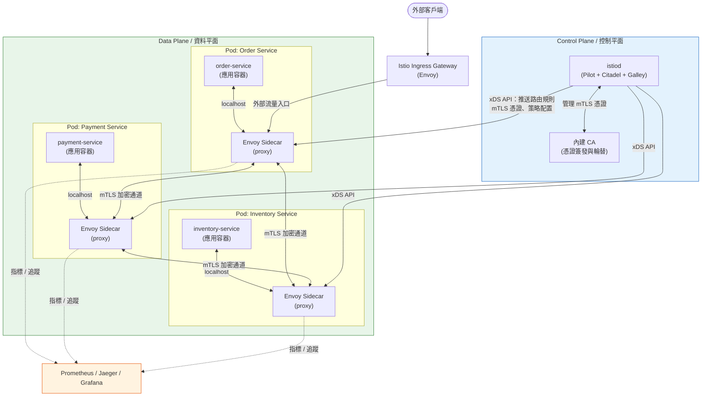
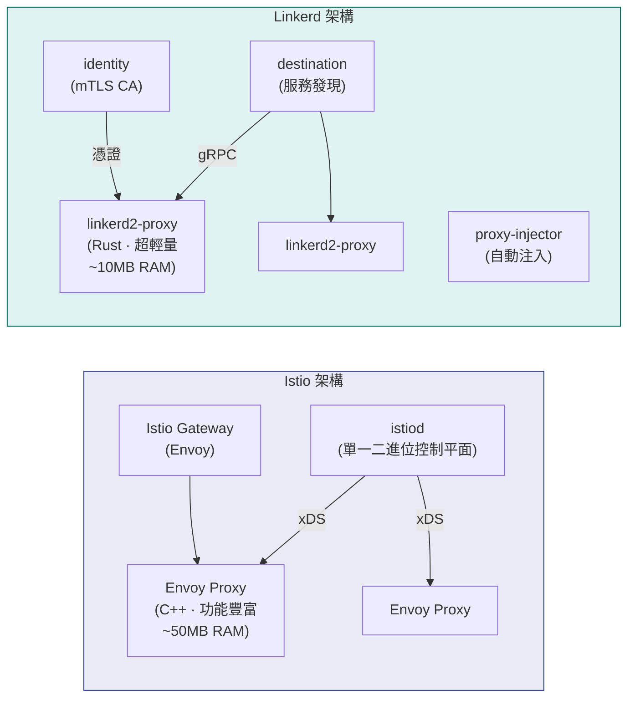
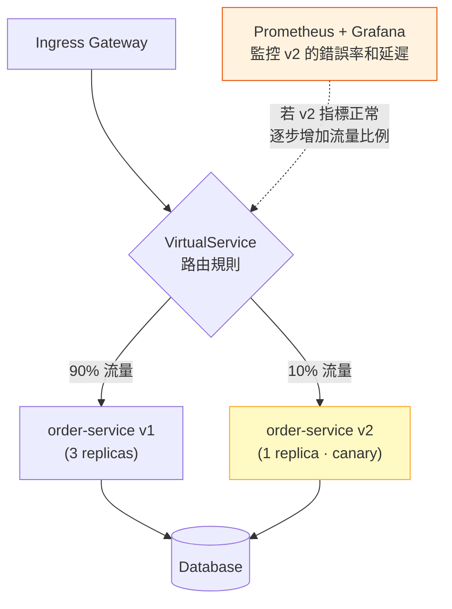

# Service Mesh / 服務網格

## Intent / 意圖

Service Mesh（服務網格）是一層專門處理服務間通訊的基礎設施層，將流量管理（路由、重試、超時、熔斷）、安全（mTLS 雙向認證）和可觀測性（分散式追蹤、指標、存取日誌）從應用程式碼中徹底抽離，以 sidecar proxy 的形式透明注入每個服務旁。核心問題：**當微服務數量從十幾個增長到數百個時，如何在不修改任何業務程式碼的前提下，統一管理所有服務間的加密認證、流量控制、故障恢復與可觀測性——而不是讓每個團隊各自在各自的語言和框架中重複實作這些橫切關注點（cross-cutting concerns）？**

---

## Problem / 問題情境

**場景一：跨服務 mTLS 管理的噩夢**

某金融科技公司有 80 個微服務，監管要求所有服務間通訊必須加密且雙向認證。最初由各團隊自行管理 mTLS：Java 團隊用 Spring Boot 的 TLS 配置、Go 團隊用 `crypto/tls` 手動載入憑證、Python 團隊用 `requests` 搭配自簽 CA。問題迅速爆發：(1) 憑證到期輪替需要逐一更新 80 個服務的配置並重新部署，每次耗時 2 天，期間頻繁出現 `certificate expired` 錯誤導致服務間呼叫失敗；(2) 某個團隊忘記配置 mTLS，導致其服務以明文通訊——稽核時被發現，罰款 50 萬美元；(3) 新服務上線時需要手動向 CA 申請憑證、配置信任鏈、測試連線，光是 mTLS 設定就耗掉每個新服務上線時間的 40%。引入 Istio 後，所有 mTLS 由 mesh 自動管理——憑證自動簽發、自動輪替、自動注入，應用程式完全不感知。

**場景二：重試與超時邏輯不一致引發連鎖故障**

電商平台的訂單服務呼叫庫存服務、支付服務和通知服務。各團隊獨立實作重試邏輯：訂單服務對庫存服務的重試次數設為 5 次、無退避（backoff）、超時 30 秒；而庫存服務本身對資料庫的重試也是 5 次。結果在資料庫短暫不可用時，一個原始請求被放大為 5 x 5 = 25 次資料庫查詢（retry amplification）。同時，訂單服務的 30 秒超時遠長於使用者的容忍上限——前端早已 timeout 並重送請求，但後端仍在重試，造成請求堆積。支付服務沒有設定任何重試——偶發的網路抖動直接回傳 500 給使用者，投訴量激增。這些問題的根因在於缺乏統一的流量管理策略——每個團隊的理解和實作都不同。

**場景三：缺乏可觀測性導致跨服務除錯耗時數小時**

使用者回報「結帳偶爾失敗」，但系統中沒有統一的分散式追蹤。SRE 團隊需要逐一登入 12 個服務查看日誌，靠時間戳記和猜測拼湊請求路徑。找到根因（第七層的推薦服務回傳了非預期的 JSON 格式導致序列化失敗）花了 4 小時。如果有 service mesh 提供的自動追蹤和指標，30 秒內就能看到完整的呼叫鏈和錯誤發生的確切位置。

---

## Core Concepts / 核心概念

### Data Plane / 資料平面

資料平面（Data Plane）是 service mesh 中實際處理服務間流量的元件集合——由部署在每個服務 Pod 旁的 **sidecar proxy** 組成。所有進出服務的網路流量都會被 iptables 規則（或 eBPF）透明地重定向到 sidecar proxy，由 proxy 執行負載均衡、mTLS 加密/解密、重試、超時、熔斷、指標收集和分散式追蹤 header 注入。應用程式認為自己在直接與其他服務通訊，實際上每個封包都經過了兩個 proxy（發送端 sidecar 和接收端 sidecar）。Envoy 是最廣泛使用的資料平面 proxy——Istio、AWS App Mesh 和 Consul Connect 都使用 Envoy 作為 sidecar。Linkerd 則使用自己用 Rust 撰寫的輕量 proxy `linkerd2-proxy`，資源佔用比 Envoy 低一個數量級。

### Control Plane / 控制平面

控制平面（Control Plane）是 service mesh 的「大腦」，負責配置和協調所有資料平面 proxy 的行為。它不直接處理服務間流量，而是：(1) 從 Kubernetes API Server 觀察服務拓撲的變化（新 Pod 上線、舊 Pod 下線）；(2) 將路由規則、重試策略、超時配置、mTLS 憑證等配置推送給所有 sidecar proxy；(3) 管理 CA（Certificate Authority），自動簽發和輪替 mTLS 憑證。在 Istio 中，控制平面是一個名為 `istiod` 的單一二進位——整合了 Pilot（配置下發）、Citadel（憑證管理）和 Galley（配置驗證）。在 Linkerd 中，控制平面由 `destination`（服務發現和路由策略）、`identity`（mTLS 憑證）和 `proxy-injector`（自動注入 sidecar）等微服務組成。

### Sidecar Proxy / 邊車代理

Sidecar 模式是指在每個應用程式 Pod 中額外部署一個 proxy container（如 Envoy 或 linkerd2-proxy），與主應用容器共享 network namespace。Sidecar 攔截所有進出流量的機制通常是透過 init container 注入 iptables 規則，將目的 port 的流量重定向到 sidecar 的監聽 port。Sidecar 的注入方式有兩種：(1) **自動注入**——mesh 的 admission webhook 在 Pod 建立時自動加入 sidecar container（Istio 的 `istio-injection=enabled` namespace label）；(2) **手動注入**——透過 CLI 工具修改 YAML（如 `istioctl kube-inject`、`linkerd inject`）。Sidecar 的優點是語言無關、零侵入；缺點是每個 Pod 多消耗 50-100MB 記憶體和額外的 CPU，且每次請求增加約 1-3ms 的延遲（兩跳 proxy）。

### mTLS (Mutual TLS) / 雙向 TLS

在傳統的 TLS 中，只有伺服器出示憑證（客戶端驗證伺服器身份）。mTLS 要求雙方都出示憑證——客戶端也必須向伺服器證明自己的身份。在 service mesh 中，mTLS 提供三層保護：(1) **加密**——所有服務間流量以 TLS 加密，防止中間人竊聽；(2) **身份驗證**——每個服務有唯一的 SPIFFE ID（如 `spiffe://cluster.local/ns/default/sa/order-service`），確保請求確實來自聲稱的服務；(3) **授權基礎**——基於身份的 AuthorizationPolicy 可以限制「只有 order-service 能呼叫 payment-service」。Service mesh 的 mTLS 是完全自動的——控制平面內建 CA 自動簽發短期憑證（通常 24 小時）並自動輪替，應用程式完全不需要處理任何憑證邏輯。Istio 支援 `PERMISSIVE` 模式（同時接受 mTLS 和明文，適合漸進式遷移）和 `STRICT` 模式（只接受 mTLS）。

### Traffic Management / 流量管理

Service mesh 提供細粒度的 L7 流量控制能力，所有配置透過聲明式 CRD（Custom Resource Definition）管理，不需要修改應用程式碼：

- **路由（Routing）**：根據 HTTP header、URI path、query parameter 將流量路由到不同版本的服務。Istio 使用 `VirtualService` 和 `DestinationRule` CRD 定義路由規則。
- **負載均衡（Load Balancing）**：支援 round-robin、least connections、random、consistent hashing（基於 header 或 cookie）。在 Istio 中透過 `DestinationRule` 的 `trafficPolicy.loadBalancer` 配置。
- **重試（Retries）**：自動重試失敗的請求，可配置重試次數、重試條件（如只重試 5xx 或 connect-failure）和退避策略。
- **超時（Timeouts）**：為每個路由設定請求超時，防止下游服務的慢回應拖垮上游。
- **熔斷（Circuit Breaking）**：當目標服務的錯誤率或延遲超過閾值時，自動斷開連線（快速失敗），避免故障擴散。Istio 透過 `DestinationRule` 的 `outlierDetection` 實現。
- **故障注入（Fault Injection）**：在不修改程式碼的情況下模擬延遲和錯誤，用於混沌工程測試。
- **流量鏡像（Traffic Mirroring）**：將生產流量複製一份到新版本服務（shadow deployment），用於驗證新版本行為而不影響使用者。

### Observability in Mesh / 網格中的可觀測性

Service mesh 的 sidecar proxy 位於所有服務間流量的路徑上，天然地能夠收集三大可觀測性信號，完全不需要應用程式碼的任何修改：

- **分散式追蹤（Distributed Tracing）**：Sidecar 自動為每個請求生成或傳播追蹤 header（如 `x-request-id`、`x-b3-traceid`、`x-b3-spanid`、W3C `traceparent`），將追蹤資料送往 Jaeger、Zipkin 或 Tempo。但注意——應用程式仍須負責**傳播**（propagate）這些 header 到下游呼叫，mesh 只負責生成和收集。
- **指標（Metrics）**：Sidecar 自動暴露 L7 指標——請求速率、錯誤率、延遲分佈（P50/P90/P99）、回應碼分佈。Istio 的標準指標包括 `istio_requests_total`、`istio_request_duration_milliseconds`、`istio_tcp_connections_opened_total` 等，直接被 Prometheus 抓取。
- **存取日誌（Access Logs）**：Sidecar 記錄每個請求的詳細資訊——來源/目標服務身份、HTTP method、path、回應碼、延遲、upstream cluster。Envoy 的存取日誌格式高度可配置。

---

## Architecture / 架構

### Service Mesh 整體架構（Istio 為例）



### Istio vs Linkerd 架構對比



### Canary Deployment with Service Mesh / 金絲雀部署



---

## How It Works / 運作原理

### 一、Sidecar 注入流程

1. 管理員為目標 namespace 加上 label `istio-injection=enabled`（Istio）或執行 `linkerd inject` 修改 Deployment YAML（Linkerd）。
2. 當 Kubernetes 收到 Pod 建立請求時，API Server 將請求轉發給 mesh 的 **Mutating Admission Webhook**。
3. Webhook 修改 Pod spec：(a) 加入一個 init container（`istio-init`），負責設定 iptables 規則將所有進出流量重定向到 sidecar 的監聽 port（inbound 15006、outbound 15001）；(b) 加入 sidecar container（Envoy 或 linkerd2-proxy）。
4. Pod 啟動時，init container 先執行，配置好 iptables 規則後退出。然後 sidecar container 和應用容器同時啟動。
5. Sidecar 啟動後透過 xDS API（Envoy 的動態配置協定）向控制平面請求初始配置——包括叢集中所有服務的 endpoint 列表、路由規則和 mTLS 憑證。

### 二、請求在 Mesh 中的流轉

1. 應用容器 A 發出 HTTP 請求到目標服務 B（例如 `http://payment-service:8080/charge`）。
2. 由於 iptables 規則，該請求被重定向到 Pod A 的 sidecar proxy（outbound listener，port 15001）。
3. Sidecar A 根據目標 hostname `payment-service` 查詢本地快取的服務發現資訊（由控制平面推送），取得所有健康的 payment-service pod endpoint。
4. Sidecar A 根據配置的負載均衡策略（如 round-robin 或 least connections）選擇一個目標 pod endpoint。
5. Sidecar A 與目標 Pod B 的 sidecar 建立 mTLS 連線（使用控制平面簽發的 SPIFFE 憑證），加密請求並發送。
6. Sidecar B 的 inbound listener（port 15006）接收請求，驗證客戶端憑證、解密，然後將明文請求轉發給 Pod B 中的應用容器（透過 localhost）。
7. 應用容器 B 處理請求並回傳回應。回應沿相反路徑經由兩個 sidecar 回到應用容器 A。
8. 在整個過程中，兩端的 sidecar 分別記錄指標（延遲、回應碼）和追蹤 span，並傳播追蹤 header。

### 三、mTLS 自動憑證管理

1. 控制平面的 CA 元件（Istio 的 Citadel / Linkerd 的 identity）在啟動時生成根 CA 憑證（或使用外部 CA）。
2. 每個 sidecar proxy 啟動時透過 SDS（Secret Discovery Service）向控制平面請求自己的服務憑證。
3. 控制平面驗證 sidecar 的 Kubernetes Service Account 身份，簽發短期 X.509 憑證（預設有效期 24 小時），其中 SAN（Subject Alternative Name）包含 SPIFFE ID。
4. Sidecar 使用此憑證與其他 sidecar 建立 mTLS 連線。
5. 在憑證到期前（通常在有效期的 80% 時），sidecar 自動向控制平面請求新憑證——整個輪替過程對應用程式透明，無需重啟。
6. 如果控制平面短暫不可用，sidecar 會使用快取的憑證繼續運行，直到憑證過期。

### 四、流量管理規則的下發

1. 管理員透過 `kubectl apply` 建立 Istio `VirtualService` 或 `DestinationRule` CRD（或 Linkerd 的 `ServiceProfile`、`TrafficSplit`）。
2. 控制平面監聽 Kubernetes API Server 的 CRD 變更事件。
3. 控制平面將 CRD 配置轉譯為 Envoy 原生的 xDS 配置（RDS = Route Discovery Service、CDS = Cluster Discovery Service、EDS = Endpoint Discovery Service、LDS = Listener Discovery Service）。
4. 透過 gRPC 串流（streaming），控制平面將更新的配置增量推送（incremental push）到所有受影響的 sidecar proxy。
5. Sidecar proxy 熱載入新配置（hot reload），無需重啟——流量規則在數秒內生效。

---

## Rust 實作

以 Rust（Axum 0.8+，Rust 2024 Edition）實作一個 mesh-aware HTTP 微服務。此服務設計為在 service mesh（Istio/Linkerd）環境中運行，具備以下能力：
- Kubernetes 健康檢查端點（liveness `/healthz` + readiness `/readyz`）供 sidecar 和 kubelet 使用
- 請求 header 傳播（`x-request-id`、`x-b3-traceid`、`x-b3-spanid`、`x-b3-sampled`）——mesh 只負責生成追蹤 header，應用必須在呼叫下游時傳播這些 header
- Graceful shutdown 配合 Kubernetes Pod 終止流程（收到 SIGTERM 後先等待一段時間讓 sidecar 排空連線，再關閉 HTTP server）
- 模擬呼叫下游服務並傳播追蹤上下文

```rust
// mesh_aware_service.rs
// Mesh-Aware HTTP 微服務：健康檢查、header 傳播、graceful shutdown
// Cargo.toml:
//   [package]
//   name = "mesh-aware-service"
//   version = "0.1.0"
//   edition = "2024"
//
//   [dependencies]
//   axum = "0.8"
//   tokio = { version = "1", features = ["full"] }
//   serde = { version = "1", features = ["derive"] }
//   serde_json = "1"
//   reqwest = { version = "0.12", features = ["json"] }
//   tracing = "0.1"
//   tracing-subscriber = { version = "0.3", features = ["env-filter", "json"] }
//   uuid = { version = "1", features = ["v4"] }

use axum::{
    Router,
    extract::State,
    http::{HeaderMap, HeaderName, HeaderValue, StatusCode},
    response::{IntoResponse, Json},
    routing::get,
};
use serde::{Deserialize, Serialize};
use std::{
    sync::{
        Arc,
        atomic::{AtomicBool, Ordering},
    },
    time::Duration,
};
use tokio::{net::TcpListener, signal};
use tracing::{info, warn, error};

/// 需要在服務間傳播的追蹤 header 列表
/// Service mesh (Envoy/Linkerd) 會在入口生成這些 header，
/// 但應用程式必須負責在呼叫下游服務時傳播它們
const PROPAGATION_HEADERS: &[&str] = &[
    "x-request-id",
    "x-b3-traceid",
    "x-b3-spanid",
    "x-b3-parentspanid",
    "x-b3-sampled",
    "x-b3-flags",
    "b3",
    "traceparent",
    "tracestate",
    "x-ot-span-context",
];

/// 應用程式共享狀態
#[derive(Clone)]
struct AppState {
    /// 服務是否已準備好接收流量（readiness）
    ready: Arc<AtomicBool>,
    /// HTTP client 用於呼叫下游服務（重用連線池）
    http_client: reqwest::Client,
    /// 服務名稱（從環境變數讀取，用於日誌和追蹤）
    service_name: String,
    /// 下游服務 URL（在 mesh 中通常是 K8s Service DNS 名稱）
    downstream_url: String,
}

/// 健康檢查回應格式
#[derive(Serialize)]
struct HealthResponse {
    status: String,
    service: String,
    checks: Vec<HealthCheck>,
}

#[derive(Serialize)]
struct HealthCheck {
    name: String,
    status: String,
}

/// 業務端點回應格式
#[derive(Serialize, Deserialize)]
struct OrderResponse {
    order_id: String,
    status: String,
    trace_id: Option<String>,
    downstream_response: Option<String>,
}

/// 從請求 header 中提取需要傳播的追蹤 header
fn extract_propagation_headers(headers: &HeaderMap) -> HeaderMap {
    let mut propagated = HeaderMap::new();
    for &header_name in PROPAGATION_HEADERS {
        if let Ok(name) = HeaderName::from_bytes(header_name.as_bytes()) {
            if let Some(value) = headers.get(&name) {
                propagated.insert(name, value.clone());
            }
        }
    }
    propagated
}

/// Liveness Probe 端點：只要行程還活著就回傳 200
/// Kubernetes 的 liveness probe 呼叫此端點——失敗時重啟容器
async fn liveness_handler(State(state): State<AppState>) -> impl IntoResponse {
    let response = HealthResponse {
        status: "alive".to_string(),
        service: state.service_name.clone(),
        checks: vec![HealthCheck {
            name: "process".to_string(),
            status: "up".to_string(),
        }],
    };
    (StatusCode::OK, Json(response))
}

/// Readiness Probe 端點：服務準備好接收流量時回傳 200
/// 在 graceful shutdown 期間回傳 503，讓 mesh sidecar 停止路由流量到此 pod
async fn readiness_handler(State(state): State<AppState>) -> impl IntoResponse {
    if state.ready.load(Ordering::Relaxed) {
        let response = HealthResponse {
            status: "ready".to_string(),
            service: state.service_name.clone(),
            checks: vec![
                HealthCheck {
                    name: "http_server".to_string(),
                    status: "up".to_string(),
                },
                HealthCheck {
                    name: "downstream_connectivity".to_string(),
                    status: "up".to_string(),
                },
            ],
        };
        (StatusCode::OK, Json(response))
    } else {
        let response = HealthResponse {
            status: "not_ready".to_string(),
            service: state.service_name.clone(),
            checks: vec![HealthCheck {
                name: "shutting_down".to_string(),
                status: "down".to_string(),
            }],
        };
        (StatusCode::SERVICE_UNAVAILABLE, Json(response))
    }
}

/// 業務端點：處理訂單請求，並呼叫下游服務（傳播追蹤 header）
async fn create_order_handler(
    State(state): State<AppState>,
    headers: HeaderMap,
) -> impl IntoResponse {
    // 從 mesh sidecar 注入的 header 中提取 trace ID 用於日誌關聯
    let trace_id = headers
        .get("x-b3-traceid")
        .or_else(|| headers.get("traceparent"))
        .and_then(|v| v.to_str().ok())
        .map(String::from);

    let request_id = headers
        .get("x-request-id")
        .and_then(|v| v.to_str().ok())
        .unwrap_or("unknown");

    info!(
        request_id = %request_id,
        trace_id = ?trace_id,
        "Processing order request"
    );

    // 提取需要傳播到下游服務的追蹤 header
    let propagation_headers = extract_propagation_headers(&headers);

    // 呼叫下游服務（在 mesh 環境中，sidecar 會自動處理 mTLS 和負載均衡）
    // 應用只需發送普通 HTTP 請求到 K8s Service DNS 名稱
    let downstream_result = call_downstream_service(
        &state.http_client,
        &state.downstream_url,
        &propagation_headers,
    )
    .await;

    let order_id = uuid::Uuid::new_v4().to_string();
    let response = OrderResponse {
        order_id,
        status: "created".to_string(),
        trace_id,
        downstream_response: downstream_result.ok(),
    };

    // 在回應 header 中包含 request-id，方便除錯
    let mut response_headers = HeaderMap::new();
    if let Some(req_id) = headers.get("x-request-id") {
        response_headers.insert("x-request-id", req_id.clone());
    }

    (StatusCode::CREATED, response_headers, Json(response))
}

/// 呼叫下游服務，傳播所有追蹤 header
async fn call_downstream_service(
    client: &reqwest::Client,
    url: &str,
    propagation_headers: &HeaderMap,
) -> Result<String, String> {
    // 建構帶有傳播 header 的請求
    let mut request = client.get(url);

    // 將所有追蹤 header 附加到下游請求中
    // 這是 mesh 環境中應用程式的關鍵責任——
    // mesh sidecar 在入口注入 header，但應用必須傳播到出口
    for (name, value) in propagation_headers.iter() {
        if let Ok(reqwest_name) = reqwest::header::HeaderName::from_bytes(name.as_str().as_bytes())
        {
            if let Ok(reqwest_value) = reqwest::header::HeaderValue::from_bytes(value.as_bytes()) {
                request = request.header(reqwest_name, reqwest_value);
            }
        }
    }

    match request.send().await {
        Ok(resp) => {
            let status = resp.status();
            let body = resp.text().await.unwrap_or_default();
            if status.is_success() {
                info!(status = %status, "Downstream call succeeded");
                Ok(body)
            } else {
                warn!(status = %status, "Downstream call returned error");
                Err(format!("downstream error: {status}"))
            }
        }
        Err(e) => {
            error!(error = %e, "Downstream call failed");
            Err(format!("downstream call failed: {e}"))
        }
    }
}

/// Graceful shutdown 處理：
/// 1. 收到 SIGTERM（K8s 發送）
/// 2. 立即將 readiness 設為 false → mesh sidecar 停止路由新流量到此 pod
/// 3. 等待一段時間（preStopHook 效果）讓進行中的請求完成
/// 4. 關閉 HTTP server
async fn graceful_shutdown(ready: Arc<AtomicBool>) {
    let ctrl_c = async {
        signal::ctrl_c()
            .await
            .expect("failed to install Ctrl+C handler");
    };

    #[cfg(unix)]
    let terminate = async {
        signal::unix::signal(signal::unix::SignalKind::terminate())
            .expect("failed to install signal handler")
            .recv()
            .await;
    };

    #[cfg(not(unix))]
    let terminate = std::future::pending::<()>();

    tokio::select! {
        _ = ctrl_c => info!("Received Ctrl+C"),
        _ = terminate => info!("Received SIGTERM"),
    }

    // 步驟 1：標記為 not ready，讓 mesh 停止發送新請求
    info!("Initiating graceful shutdown — marking service as not ready");
    ready.store(false, Ordering::Relaxed);

    // 步驟 2：等待 5 秒，讓 Kubernetes 和 mesh sidecar 更新 endpoint
    // 並讓進行中的請求完成
    info!("Waiting 5s for in-flight requests to drain and mesh to update endpoints...");
    tokio::time::sleep(Duration::from_secs(5)).await;

    info!("Shutdown complete");
}

#[tokio::main]
async fn main() {
    // 初始化 structured logging（JSON 格式適合 mesh 環境中的日誌收集）
    tracing_subscriber::fmt()
        .with_env_filter(
            tracing_subscriber::EnvFilter::try_from_default_env()
                .unwrap_or_else(|_| "info".into()),
        )
        .json()
        .init();

    // 從環境變數讀取配置（K8s 中透過 ConfigMap 注入）
    let service_name =
        std::env::var("SERVICE_NAME").unwrap_or_else(|_| "order-service".to_string());
    let listen_port = std::env::var("PORT").unwrap_or_else(|_| "8080".to_string());
    let downstream_url = std::env::var("DOWNSTREAM_URL")
        .unwrap_or_else(|_| "http://payment-service:8080/health".to_string());

    let ready = Arc::new(AtomicBool::new(true));

    // 建立 HTTP client（連線池由 reqwest 管理，在 mesh 中 sidecar 負責 mTLS）
    let http_client = reqwest::Client::builder()
        .timeout(Duration::from_secs(10))
        .pool_max_idle_per_host(10)
        .build()
        .expect("Failed to create HTTP client");

    let state = AppState {
        ready: Arc::clone(&ready),
        http_client,
        service_name: service_name.clone(),
        downstream_url,
    };

    // 建構路由
    let app = Router::new()
        // 健康檢查端點（Kubernetes probes + mesh health check）
        .route("/healthz", get(liveness_handler))
        .route("/readyz", get(readiness_handler))
        // 業務端點
        .route("/orders", get(create_order_handler))
        .with_state(state);

    let addr = format!("0.0.0.0:{listen_port}");
    info!(
        service = %service_name,
        addr = %addr,
        "Starting mesh-aware service"
    );

    let listener = TcpListener::bind(&addr)
        .await
        .expect("Failed to bind address");

    // 啟動 HTTP server，搭配 graceful shutdown
    axum::serve(listener, app)
        .with_graceful_shutdown(graceful_shutdown(ready))
        .await
        .expect("Server error");
}

// Output:
// {"timestamp":"2026-02-17T10:00:00.000Z","level":"INFO","message":"Starting mesh-aware service","service":"order-service","addr":"0.0.0.0:8080"}
//
// --- Liveness probe: GET /healthz ---
// HTTP/1.1 200 OK
// {"status":"alive","service":"order-service","checks":[{"name":"process","status":"up"}]}
//
// --- Readiness probe: GET /readyz ---
// HTTP/1.1 200 OK
// {"status":"ready","service":"order-service","checks":[{"name":"http_server","status":"up"},{"name":"downstream_connectivity","status":"up"}]}
//
// --- Business request with mesh-injected trace headers ---
// curl -H "x-request-id: abc-123" -H "x-b3-traceid: 463ac35c9f6413ad48485a3953bb6124" http://localhost:8080/orders
// {"timestamp":"2026-02-17T10:00:01.000Z","level":"INFO","message":"Processing order request","request_id":"abc-123","trace_id":"463ac35c9f6413ad48485a3953bb6124"}
// {"timestamp":"2026-02-17T10:00:01.050Z","level":"INFO","message":"Downstream call succeeded","status":"200"}
// HTTP/1.1 201 Created
// x-request-id: abc-123
// {"order_id":"f47ac10b-58cc-4372-a567-0e02b2c3d479","status":"created","trace_id":"463ac35c9f6413ad48485a3953bb6124","downstream_response":"..."}
//
// --- Graceful shutdown (SIGTERM from Kubernetes) ---
// {"timestamp":"2026-02-17T10:05:00.000Z","level":"INFO","message":"Received SIGTERM"}
// {"timestamp":"2026-02-17T10:05:00.001Z","level":"INFO","message":"Initiating graceful shutdown — marking service as not ready"}
// {"timestamp":"2026-02-17T10:05:00.002Z","level":"INFO","message":"Waiting 5s for in-flight requests to drain and mesh to update endpoints..."}
// --- During this 5s window, GET /readyz returns 503 ---
// {"timestamp":"2026-02-17T10:05:05.002Z","level":"INFO","message":"Shutdown complete"}
```

**重點說明**：

- `PROPAGATION_HEADERS` 列出了 Zipkin B3（`x-b3-*`）和 W3C Trace Context（`traceparent` / `tracestate`）兩套標準，確保與 Istio 和 Linkerd 都相容。
- Graceful shutdown 的關鍵是「先標記 not ready → 等待 → 再關閉」三步驟。如果直接關閉 server，mesh sidecar 可能仍在路由流量到此 pod，導致連線錯誤。
- 應用程式使用普通的 `http://payment-service:8080` 呼叫下游——sidecar 透明地將此連線升級為 mTLS。
- `reqwest::Client` 的連線池在 mesh 環境中仍然有效——連線池針對的是到 localhost sidecar 的連線，sidecar 再管理到上游的連線。

---

## Go 實作

以 Go（1.24+，stdlib `net/http`）實作等價的 mesh-aware HTTP 微服務，具備相同的健康檢查、追蹤 header 傳播和 graceful shutdown 能力。

```go
// mesh_aware_service.go
// Mesh-Aware HTTP 微服務：健康檢查、header 傳播、graceful shutdown
// go.mod:
//   module mesh-aware-service
//   go 1.24

package main

import (
	"context"
	"encoding/json"
	"fmt"
	"io"
	"log/slog"
	"net/http"
	"os"
	"os/signal"
	"sync/atomic"
	"syscall"
	"time"

	"crypto/rand"
)

// propagationHeaders 是需要在服務間傳播的追蹤 header 列表
// mesh sidecar 在入口生成，應用程式負責傳播到下游呼叫
var propagationHeaders = []string{
	"x-request-id",
	"x-b3-traceid",
	"x-b3-spanid",
	"x-b3-parentspanid",
	"x-b3-sampled",
	"x-b3-flags",
	"b3",
	"traceparent",
	"tracestate",
	"x-ot-span-context",
}

// HealthResponse 健康檢查回應格式
type HealthResponse struct {
	Status  string        `json:"status"`
	Service string        `json:"service"`
	Checks  []HealthCheck `json:"checks"`
}

// HealthCheck 單項健康檢查結果
type HealthCheck struct {
	Name   string `json:"name"`
	Status string `json:"status"`
}

// OrderResponse 業務端點回應格式
type OrderResponse struct {
	OrderID            string  `json:"order_id"`
	Status             string  `json:"status"`
	TraceID            *string `json:"trace_id,omitempty"`
	DownstreamResponse *string `json:"downstream_response,omitempty"`
}

// AppState 應用程式共享狀態
type AppState struct {
	ready         atomic.Bool
	httpClient    *http.Client
	serviceName   string
	downstreamURL string
	logger        *slog.Logger
}

// NewAppState 建立新的應用狀態
func NewAppState(serviceName, downstreamURL string, logger *slog.Logger) *AppState {
	state := &AppState{
		httpClient: &http.Client{
			Timeout: 10 * time.Second,
			Transport: &http.Transport{
				MaxIdleConnsPerHost: 10,
				IdleConnTimeout:     90 * time.Second,
			},
		},
		serviceName:   serviceName,
		downstreamURL: downstreamURL,
		logger:        logger,
	}
	state.ready.Store(true)
	return state
}

// extractPropagationHeaders 從入站請求提取需要傳播的追蹤 header
func extractPropagationHeaders(r *http.Request) http.Header {
	propagated := make(http.Header)
	for _, name := range propagationHeaders {
		if value := r.Header.Get(name); value != "" {
			propagated.Set(name, value)
		}
	}
	return propagated
}

// generateUUID 生成 UUID v4（純 stdlib 實作，避免外部依賴）
func generateUUID() string {
	var uuid [16]byte
	_, _ = rand.Read(uuid[:])
	uuid[6] = (uuid[6] & 0x0f) | 0x40 // version 4
	uuid[8] = (uuid[8] & 0x3f) | 0x80 // variant 1
	return fmt.Sprintf("%08x-%04x-%04x-%04x-%012x",
		uuid[0:4], uuid[4:6], uuid[6:8], uuid[8:10], uuid[10:16])
}

// writeJSON 寫入 JSON 回應
func writeJSON(w http.ResponseWriter, status int, v any) {
	w.Header().Set("Content-Type", "application/json")
	w.WriteHeader(status)
	json.NewEncoder(w).Encode(v)
}

// handleLiveness Liveness Probe：只要行程活著就回傳 200
// Kubernetes kubelet 呼叫此端點——連續失敗時重啟容器
func (s *AppState) handleLiveness(w http.ResponseWriter, _ *http.Request) {
	resp := HealthResponse{
		Status:  "alive",
		Service: s.serviceName,
		Checks: []HealthCheck{
			{Name: "process", Status: "up"},
		},
	}
	writeJSON(w, http.StatusOK, resp)
}

// handleReadiness Readiness Probe：服務準備好接收流量時回傳 200
// Graceful shutdown 時回傳 503，讓 mesh sidecar 停止路由到此 pod
func (s *AppState) handleReadiness(w http.ResponseWriter, _ *http.Request) {
	if s.ready.Load() {
		resp := HealthResponse{
			Status:  "ready",
			Service: s.serviceName,
			Checks: []HealthCheck{
				{Name: "http_server", Status: "up"},
				{Name: "downstream_connectivity", Status: "up"},
			},
		}
		writeJSON(w, http.StatusOK, resp)
	} else {
		resp := HealthResponse{
			Status:  "not_ready",
			Service: s.serviceName,
			Checks: []HealthCheck{
				{Name: "shutting_down", Status: "down"},
			},
		}
		writeJSON(w, http.StatusServiceUnavailable, resp)
	}
}

// handleCreateOrder 業務端點：處理訂單請求，呼叫下游並傳播追蹤 header
func (s *AppState) handleCreateOrder(w http.ResponseWriter, r *http.Request) {
	// 從 mesh sidecar 注入的 header 中提取 trace ID
	var traceID *string
	if tid := r.Header.Get("x-b3-traceid"); tid != "" {
		traceID = &tid
	} else if tp := r.Header.Get("traceparent"); tp != "" {
		traceID = &tp
	}

	requestID := r.Header.Get("x-request-id")
	if requestID == "" {
		requestID = "unknown"
	}

	s.logger.Info("Processing order request",
		"request_id", requestID,
		"trace_id", traceID,
	)

	// 提取需要傳播到下游的追蹤 header
	propagatedHeaders := extractPropagationHeaders(r)

	// 呼叫下游服務（mesh sidecar 自動處理 mTLS 和負載均衡）
	downstreamResp, err := s.callDownstreamService(r.Context(), propagatedHeaders)

	var downstreamResult *string
	if err != nil {
		s.logger.Warn("Downstream call failed", "error", err)
	} else {
		downstreamResult = &downstreamResp
	}

	orderID := generateUUID()
	resp := OrderResponse{
		OrderID:            orderID,
		Status:             "created",
		TraceID:            traceID,
		DownstreamResponse: downstreamResult,
	}

	// 在回應中包含 request-id
	if rid := r.Header.Get("x-request-id"); rid != "" {
		w.Header().Set("x-request-id", rid)
	}

	writeJSON(w, http.StatusCreated, resp)
}

// callDownstreamService 呼叫下游服務，傳播所有追蹤 header
func (s *AppState) callDownstreamService(
	ctx context.Context,
	propagatedHeaders http.Header,
) (string, error) {
	req, err := http.NewRequestWithContext(ctx, http.MethodGet, s.downstreamURL, nil)
	if err != nil {
		return "", fmt.Errorf("creating request: %w", err)
	}

	// 將所有追蹤 header 附加到下游請求
	for _, name := range propagationHeaders {
		if value := propagatedHeaders.Get(name); value != "" {
			req.Header.Set(name, value)
		}
	}

	resp, err := s.httpClient.Do(req)
	if err != nil {
		return "", fmt.Errorf("sending request: %w", err)
	}
	defer resp.Body.Close()

	body, err := io.ReadAll(resp.Body)
	if err != nil {
		return "", fmt.Errorf("reading response: %w", err)
	}

	if resp.StatusCode >= 400 {
		s.logger.Warn("Downstream returned error",
			"status", resp.StatusCode,
		)
		return "", fmt.Errorf("downstream error: %d", resp.StatusCode)
	}

	s.logger.Info("Downstream call succeeded", "status", resp.StatusCode)
	return string(body), nil
}

func main() {
	// 初始化 structured logging（JSON 格式適合 mesh 環境日誌收集）
	logger := slog.New(slog.NewJSONHandler(os.Stdout, &slog.HandlerOptions{
		Level: slog.LevelInfo,
	}))

	// 從環境變數讀取配置（K8s ConfigMap 注入）
	serviceName := getEnvOrDefault("SERVICE_NAME", "order-service")
	listenPort := getEnvOrDefault("PORT", "8080")
	downstreamURL := getEnvOrDefault("DOWNSTREAM_URL", "http://payment-service:8080/health")

	state := NewAppState(serviceName, downstreamURL, logger)

	// 建構路由
	mux := http.NewServeMux()
	mux.HandleFunc("GET /healthz", state.handleLiveness)
	mux.HandleFunc("GET /readyz", state.handleReadiness)
	mux.HandleFunc("GET /orders", state.handleCreateOrder)

	addr := fmt.Sprintf("0.0.0.0:%s", listenPort)
	server := &http.Server{
		Addr:         addr,
		Handler:      mux,
		ReadTimeout:  15 * time.Second,
		WriteTimeout: 15 * time.Second,
		IdleTimeout:  60 * time.Second,
	}

	logger.Info("Starting mesh-aware service",
		"service", serviceName,
		"addr", addr,
	)

	// 啟動 HTTP server（非阻塞）
	errCh := make(chan error, 1)
	go func() {
		if err := server.ListenAndServe(); err != nil && err != http.ErrServerClosed {
			errCh <- err
		}
		close(errCh)
	}()

	// 等待終止信號
	sigCh := make(chan os.Signal, 1)
	signal.Notify(sigCh, syscall.SIGINT, syscall.SIGTERM)

	select {
	case sig := <-sigCh:
		logger.Info("Received signal, initiating graceful shutdown",
			"signal", sig.String(),
		)
	case err := <-errCh:
		logger.Error("Server error", "error", err)
		os.Exit(1)
	}

	// Graceful shutdown 三步驟：
	// 1. 標記 not ready → mesh sidecar 停止路由新流量
	state.ready.Store(false)
	logger.Info("Marked service as not ready")

	// 2. 等待 5 秒讓 K8s endpoint controller 和 mesh 更新
	logger.Info("Waiting 5s for in-flight requests to drain and mesh to update endpoints...")
	time.Sleep(5 * time.Second)

	// 3. 關閉 HTTP server（等待進行中的請求完成，最多 10 秒）
	shutdownCtx, cancel := context.WithTimeout(context.Background(), 10*time.Second)
	defer cancel()

	if err := server.Shutdown(shutdownCtx); err != nil {
		logger.Error("Shutdown error", "error", err)
		os.Exit(1)
	}

	logger.Info("Shutdown complete")
}

// getEnvOrDefault 讀取環境變數，不存在時回傳預設值
func getEnvOrDefault(key, defaultValue string) string {
	if value := os.Getenv(key); value != "" {
		return value
	}
	return defaultValue
}

// Output:
// {"time":"2026-02-17T10:00:00.000Z","level":"INFO","msg":"Starting mesh-aware service","service":"order-service","addr":"0.0.0.0:8080"}
//
// --- Liveness probe: GET /healthz ---
// HTTP/1.1 200 OK
// {"status":"alive","service":"order-service","checks":[{"name":"process","status":"up"}]}
//
// --- Readiness probe: GET /readyz ---
// HTTP/1.1 200 OK
// {"status":"ready","service":"order-service","checks":[{"name":"http_server","status":"up"},{"name":"downstream_connectivity","status":"up"}]}
//
// --- Business request with mesh-injected trace headers ---
// curl -H "x-request-id: abc-123" -H "x-b3-traceid: 463ac35c9f6413ad48485a3953bb6124" http://localhost:8080/orders
// {"time":"2026-02-17T10:00:01.000Z","level":"INFO","msg":"Processing order request","request_id":"abc-123","trace_id":"463ac35c9f6413ad48485a3953bb6124"}
// {"time":"2026-02-17T10:00:01.050Z","level":"INFO","msg":"Downstream call succeeded","status":200}
// HTTP/1.1 201 Created
// x-request-id: abc-123
// {"order_id":"a1b2c3d4-e5f6-4a7b-8c9d-0e1f2a3b4c5d","status":"created","trace_id":"463ac35c9f6413ad48485a3953bb6124","downstream_response":"..."}
//
// --- Graceful shutdown (SIGTERM) ---
// {"time":"2026-02-17T10:05:00.000Z","level":"INFO","msg":"Received signal, initiating graceful shutdown","signal":"terminated"}
// {"time":"2026-02-17T10:05:00.001Z","level":"INFO","msg":"Marked service as not ready"}
// {"time":"2026-02-17T10:05:00.002Z","level":"INFO","msg":"Waiting 5s for in-flight requests to drain and mesh to update endpoints..."}
// --- During this 5s window, GET /readyz returns 503 ---
// {"time":"2026-02-17T10:05:05.002Z","level":"INFO","msg":"Shutdown complete"}
```

**重點說明**：

- Go 1.22+ 的 `http.NewServeMux` 支援 `"GET /path"` 語法，精確匹配 HTTP method 和 path。
- `atomic.Bool` 用於 readiness 狀態的無鎖讀寫——多個 goroutine 可安全並行存取（handler goroutines 讀、shutdown goroutine 寫）。
- `http.Client` 的 `Transport.MaxIdleConnsPerHost` 管理到 sidecar 的連線池——在 mesh 中，所有下游呼叫實際上都是先連到 localhost sidecar，sidecar 再管理到上游的連線。
- `server.Shutdown(ctx)` 優雅等待所有進行中的請求完成後再關閉，但受 context timeout 約束（防止請求無限等待）。
- Go 的 `crypto/rand` 用於 UUID 生成，避免在微服務場景中引入不必要的外部依賴。

---

## Rust vs Go 對照表

| 維度 | Rust（Axum 0.8） | Go（stdlib net/http） |
|------|-------------------|----------------------|
| **Readiness 狀態管理** | `Arc<AtomicBool>` 搭配 `Clone` trait 在 handler 間共享，所有權系統在編譯期保證不會有 data race | `atomic.Bool` 嵌入 struct，handler 透過 method receiver 存取；需要開發者自行確保只用 atomic 操作 |
| **Header 傳播** | 從 Axum 的 `HeaderMap` 提取，轉換為 `reqwest::HeaderMap`——涉及兩套不同的 HTTP header 型別轉換 | 直接使用 `http.Header`，入站和出站共用同一型別，傳播程式碼更簡潔直覺 |
| **Graceful shutdown** | Axum 的 `with_graceful_shutdown()` 接受 `Future`，搭配 `tokio::select!` 處理多重信號——宣告式且組合性強 | `signal.Notify` + `server.Shutdown(ctx)`——命令式但流程清晰，`context.WithTimeout` 提供明確的關閉期限 |
| **JSON 序列化** | `serde` + `serde_json` 的 `#[derive(Serialize)]` 在編譯期生成零開銷的序列化程式碼，JSON 處理效能極高 | `encoding/json` 使用 runtime reflection + struct tags，較慢但夠用；需注意 exported field names |
| **錯誤處理** | `Result<T, E>` 搭配 `?` 運算子和 `thiserror`/`anyhow` 強制處理所有錯誤路徑——漏掉錯誤無法編譯 | 慣用 `if err != nil` 模式，雖然冗長但明確；可能不小心忽略 error return value |
| **並行安全性** | 編譯器（borrow checker + `Send`/`Sync` trait）在編譯期阻止所有 data race，不可能出現 race condition | `go vet -race` 和 `sync/atomic` 在 runtime 偵測 race condition，但 compile-time 無法保證 |
| **Sidecar 資源影響** | 服務本身記憶體佔用極低（~5-10MB），與 sidecar 的 ~50MB 相比，sidecar 的 overhead 在 Rust 服務中更顯著 | 服務記憶體佔用較高（~20-50MB），sidecar overhead 佔整體 pod 的比例相對較低 |

---

## When to Use / 適用場景

### 1. 多語言微服務架構需要統一的通訊策略

當團隊使用 Go、Rust、Java、Python、Node.js 等多種語言撰寫微服務時，在每種語言中分別實作 mTLS、重試、熔斷、追蹤等功能既耗時又容易不一致。Service mesh 以 sidecar 的形式統一處理這些 cross-cutting concerns，讓所有語言的服務都獲得一致的流量管理、安全和可觀測性，而不需要每個團隊維護自己的 SDK 或 library。

### 2. 零信任網路架構的微服務間通訊

當組織的安全策略要求所有內部通訊都必須加密和認證（zero trust network）時，service mesh 的自動 mTLS 是最有效的實作方式。手動管理數百個服務的憑證簽發、分發和輪替幾乎不可能——而 mesh 的控制平面內建 CA 自動處理所有憑證生命週期。搭配 AuthorizationPolicy，可以細粒度地控制哪些服務能呼叫哪些服務。

### 3. 需要精細流量控制的漸進式部署

金絲雀部署（canary deployment）、A/B 測試、藍綠部署等場景需要按比例、按 header 或按使用者分群將流量路由到不同版本的服務。Service mesh 的流量管理能力（如 Istio 的 VirtualService 權重路由）讓這些部署策略可以在不修改程式碼、不依賴特定 CI/CD 工具的前提下實現。

### 4. 大規模微服務的可觀測性缺口

當系統有 50+ 微服務但缺乏統一的可觀測性基礎設施時，service mesh 可以在不修改任何應用程式碼的情況下提供全網格的分散式追蹤、L7 指標和存取日誌。這對於遺留系統（legacy system）的可觀測性改造特別有價值——不需要為每個遺留服務逐一添加 instrumentation code。

---

## When NOT to Use / 不適用場景

### 1. 少於 10 個微服務的小型系統

Service mesh 帶來的運維複雜度（控制平面的部署、升級、除錯）和資源開銷（每個 pod 多 50-100MB 記憶體、額外延遲）在小型系統中不值得。如果只有 5-10 個服務，用 application-level library（如 Go 的 `go-kit`、Rust 的 `tower` middleware）處理重試和超時，用簡單的 TLS + API key 處理安全性，成本效益比 mesh 高得多。當服務數量增長到難以手動管理時再考慮引入 mesh。

### 2. 對延遲極度敏感的高頻交易系統

Service mesh 的 sidecar proxy 在每個請求上增加約 1-3ms 的延遲（兩跳 proxy）。對於高頻交易（HFT）或即時遊戲伺服器等微秒級延遲敏感的場景，這個額外開銷可能不可接受。此類系統通常使用 kernel bypass（DPDK、io_uring）和直連通訊，根本不適合加入 proxy 層。

### 3. 單體架構或模組化單體

如果系統是單體架構（monolith），服務間通訊是進程內的函數呼叫，根本不存在需要 mesh 解決的網路通訊問題。即使是「模組化單體」（modular monolith），模組間透過 in-process event bus 通訊，也不需要 service mesh。先確認系統確實是分散式的微服務架構，再考慮 mesh。

### 4. 團隊缺乏 Kubernetes 運維經驗

Service mesh（尤其是 Istio）的除錯需要深厚的 Kubernetes 和網路知識——理解 iptables 規則、Envoy 配置、xDS 協定、mTLS 憑證鏈等。如果團隊對 Kubernetes 還不熟練，貿然引入 mesh 只會增加運維風險。建議先紮實 Kubernetes 基礎（Pod、Service、Deployment、Health Probes），再漸進式地引入輕量級 mesh（如 Linkerd，學習曲線遠低於 Istio）。

---

## Real-World Examples / 真實世界案例

### Lyft 與 Envoy 的誕生

Envoy proxy 最初由 Lyft 的工程師 Matt Klein 在 2015 年開發，解決的正是本文所描述的問題：Lyft 的微服務架構從數十個服務增長到數百個，每個團隊各自實作的重試、超時、熔斷邏輯不一致，導致頻繁的連鎖故障。最嚴重的一次事故中，一個下游服務的延遲升高觸發了上游服務的無限重試，重試流量放大了 100 倍，打垮了整個叢集。Lyft 意識到必須將流量管理從應用層抽離，於是建構了 Envoy——一個高效能的 L7 proxy，部署為 sidecar，透明地攔截所有服務間流量。Envoy 的核心設計原則包括：(1) 對應用透明（應用程式不需要知道 proxy 的存在）；(2) 可觀測性優先（內建豐富的指標和追蹤支援）；(3) 動態配置（透過 xDS API 即時更新路由規則，無需重啟）。Envoy 在 2017 年開源並捐贈給 CNCF，如今是 service mesh 生態系統中最核心的元件——Istio、AWS App Mesh 和 Consul Connect 都以 Envoy 為資料平面。Lyft 自身的 service mesh 管理超過 10,000 個 Envoy sidecar，每秒處理數百萬個請求。

### eBay 的 Istio 規模化部署

eBay 在 2020-2022 年間將 Istio service mesh 部署到其核心交易平台，管理超過 2,000 個微服務。主要挑戰包括：(1) **控制平面效能**——2,000+ 服務的 endpoint 更新會產生大量 xDS 推送，istiod 的記憶體和 CPU 消耗飆升。解決方案是使用 Sidecar CRD 限制每個 sidecar 能看到的服務範圍（只推送該服務實際需要呼叫的上游服務配置），將每個 sidecar 的配置大小從 ~100MB 降低到 ~5MB。(2) **mTLS 遷移**——eBay 採用漸進式策略，先以 PERMISSIVE 模式運行數月（同時接受 mTLS 和明文），監控流量來源確認所有合法呼叫都已經過 mesh，最後切換到 STRICT 模式。(3) **可觀測性整合**——Istio 生成的指標和追蹤資料量巨大，eBay 使用 tail-based sampling 和指標聚合來控制儲存成本，同時確保關鍵交易路徑的追蹤 100% 被保留。

---

## Interview Questions / 面試常見問題

### Q1：Service mesh 的 data plane 和 control plane 各自負責什麼？為什麼要分離？

Data plane 由部署在每個服務 Pod 旁的 sidecar proxy 組成，負責實際處理服務間的網路流量——包括負載均衡、mTLS 加密/解密、重試、超時、熔斷、指標收集和追蹤 header 注入。Control plane 則是 mesh 的管理層，負責觀察服務拓撲變化、向所有 sidecar 推送路由規則和 mTLS 憑證、管理 CA 進行憑證簽發和輪替。分離的原因類似於網路領域的「控制平面/資料平面分離」原則——data plane 處理的是高頻的每請求操作，必須極低延遲；control plane 處理的是低頻的配置變更，需要全域一致性。這種分離也讓兩者可以獨立擴展和升級——control plane 短暫不可用時，data plane 仍可用快取的配置繼續運作。

### Q2：為什麼 service mesh 使用 sidecar 模式而不是 shared library？各自的優缺點？

Shared library 方式（如 Netflix OSS 的 Ribbon + Hystrix）的優點是無額外的 proxy 延遲和資源消耗，缺點是每種程式語言都需要一套 library（Java 的 Hystrix 在 Go 或 Rust 中不可用），且 library 升級需要每個服務重新編譯和重新部署。Sidecar 方式的優點是語言無關（proxy 是獨立進程，任何語言的服務都能透過 localhost 與之通訊）、零侵入（應用程式碼不需要任何修改）、獨立升級（sidecar 可以在不重新部署應用的情況下更新）。缺點是每個 pod 額外消耗 50-100MB 記憶體、每個請求增加 1-3ms 延遲（兩跳 proxy）、以及 iptables 攔截帶來的調試複雜度。對於大規模多語言環境，sidecar 的語言無關性通常勝過其資源開銷。

### Q3：在 service mesh 環境中做金絲雀部署（canary deployment），具體流程是什麼？

以 Istio 為例：(1) 部署新版本服務作為獨立的 Deployment（如 `order-service-v2`），與舊版本 `order-service-v1` 共存；(2) 建立 `DestinationRule` 定義兩個 subset——`v1` 和 `v2`，透過 pod label 區分；(3) 建立 `VirtualService` 設定流量權重——初始 95% 路由到 v1、5% 路由到 v2；(4) 監控 v2 的指標（錯誤率、P99 延遲）——Istio 的 sidecar 自動收集這些指標，Prometheus + Grafana 可視化；(5) 如果指標正常，逐步調整權重（10%、25%、50%、100%）；如果指標異常，立即將 v2 權重設為 0% 回滾。整個過程不需要修改任何應用程式碼或 Kubernetes Service 配置——所有流量控制都在 mesh 層完成。進階做法是搭配 Flagger 或 Argo Rollouts 自動化整個金絲雀流程——根據指標閾值自動推進或回滾。

### Q4：Istio 和 Linkerd 的核心差異是什麼？如何選擇？

最核心的差異在 sidecar proxy：Istio 使用 Envoy（C++，功能極其豐富但資源佔用較高，每個 sidecar ~50MB RAM），Linkerd 使用 linkerd2-proxy（Rust，專為 service mesh 設計，極輕量 ~10MB RAM，功能有針對性地精簡）。功能面上，Istio 提供更多企業級功能——多叢集 mesh、Wasm 擴展、進階流量管理（fault injection、traffic mirroring）、Gateway API 整合；Linkerd 專注於核心能力——mTLS、負載均衡、重試、指標——做得更簡單、更可靠。運維複雜度上，Linkerd 的學習曲線和 day-2 運維負擔顯著低於 Istio。選擇建議：如果團隊規模小、希望快速上手且主要需求是 mTLS + 可觀測性，選 Linkerd；如果需要進階流量管理、多叢集支援、Wasm 擴展或已有 Envoy 使用經驗，選 Istio。

### Q5：Service mesh 如何處理 sidecar 故障？如果 sidecar crash 了會怎樣？

當 sidecar container crash 時，Kubernetes 會自動重啟它（基於 container restart policy）。在 sidecar 重啟期間，由於 iptables 規則仍然存在（由 init container 設定，不隨 sidecar 生命週期變化），所有進出流量仍然會被重定向到 sidecar 的監聽 port——但此時 sidecar 未運行，導致所有請求失敗（connection refused）。這意味著 sidecar crash 會導致該 pod 的所有服務通訊中斷，直到 sidecar 重新啟動。為了緩解這個風險：(1) 確保 sidecar container 有合理的 resource requests/limits，避免 OOM kill；(2) 設定 readiness probe 偵測 sidecar 健康——sidecar 不健康時讓 pod 從 Service endpoint 移除；(3) Istio 1.18+ 支援 ambient mesh 模式（ztunnel node-level proxy），避免 per-pod sidecar 的單點故障問題。

---

## Pitfalls / 常見陷阱

### 陷阱一：忘記傳播追蹤 header 導致追蹤鏈斷裂

這是最常見的 service mesh 使用錯誤。許多團隊以為「mesh 自動處理追蹤」就不需要在應用程式碼中做任何事。事實上，mesh sidecar 只負責在**入口**生成追蹤 header 和在**出口**收集 span——但 sidecar 無法知道入站請求和出站請求之間的因果關係（因為 sidecar 只看到獨立的 TCP 連線）。應用程式必須將入站請求中的追蹤 header（`x-b3-traceid`、`traceparent` 等）傳播到所有出站請求中，否則追蹤鏈會在此服務處斷裂——Jaeger 中看到的不是完整的呼叫鏈，而是一堆獨立的短 trace。

### 陷阱二：重試放大（Retry Amplification）

Service mesh 的自動重試功能如果配置不當，會導致嚴重的 retry amplification。假設 mesh 配置為重試 3 次，而呼叫鏈有 4 層：Service A → B → C → D。如果 D 故障，C 會重試 3 次呼叫 D，B 會重試 3 次呼叫 C（每次 C 又重試 3 次呼叫 D），A 會重試 3 次呼叫 B——結果是 3^3 = 27 次呼叫 D。正確做法是：(1) 只在最靠近故障源的一層設定重試；(2) 使用 retry budget（如 Istio 的 `retryBudget`）限制重試流量佔總流量的百分比；(3) 確保重試只對冪等操作（GET、DELETE）啟用，非冪等操作（POST）不應自動重試。

### 陷阱三（Rust 特有）：Axum handler 中的 reqwest Client 未重用

```rust
// 錯誤示範：每次請求都建立新的 reqwest::Client
async fn bad_handler(headers: HeaderMap) -> impl IntoResponse {
    // 每次呼叫都建立新的 Client，意味著每次都建立新的連線池和 TLS session
    // 在 mesh 環境中，這會導致到 sidecar 的連線無法重用，延遲顯著增加
    let client = reqwest::Client::new();  // 錯誤！
    let resp = client
        .get("http://downstream-service:8080/api")
        .send()
        .await;
    // ...
    StatusCode::OK
}

// 正確做法：將 Client 放入共享狀態，所有 handler 重用同一個 Client
// Client 內部的連線池會重用到 sidecar 的 TCP 連線
async fn good_handler(
    State(state): State<AppState>,  // Client 在 AppState 中共享
    headers: HeaderMap,
) -> impl IntoResponse {
    let resp = state.http_client  // 重用共享的 Client
        .get("http://downstream-service:8080/api")
        .send()
        .await;
    // ...
    StatusCode::OK
}
```

在 service mesh 環境中，每個請求實際上都經過 localhost sidecar。如果每次都建立新的 `reqwest::Client`，就無法重用到 sidecar 的 TCP 連線和 TLS session（即使 mesh 內部的 mTLS 由 sidecar 處理，client 到 sidecar 之間的 TCP 連線重用仍然重要）。Rust 的 ownership 系統讓 Client 的生命週期管理很明確——透過 Axum 的 `State` extractor 將 Client 包在 `Arc` 中共享。

### 陷阱四（Go 特有）：忘記關閉 HTTP response body 導致連線洩漏

```go
// 錯誤示範：忘記關閉 response body
func badCallDownstream(ctx context.Context, client *http.Client, url string) error {
    resp, err := client.Get(url)
    if err != nil {
        return err
    }
    // 忘記 defer resp.Body.Close()
    // 在 mesh 環境中，每個未關閉的 body 都會佔住一條到 sidecar 的 TCP 連線
    // 隨著流量增加，連線池耗盡，所有下游呼叫開始 timeout

    if resp.StatusCode != http.StatusOK {
        return fmt.Errorf("unexpected status: %d", resp.StatusCode)
    }
    return nil
}

// 正確做法：始終 defer close response body
func goodCallDownstream(ctx context.Context, client *http.Client, url string) error {
    req, err := http.NewRequestWithContext(ctx, http.MethodGet, url, nil)
    if err != nil {
        return fmt.Errorf("creating request: %w", err)
    }

    resp, err := client.Do(req)
    if err != nil {
        return fmt.Errorf("sending request: %w", err)
    }
    defer resp.Body.Close()  // 關鍵！確保連線可被重用

    // 即使不需要 body 內容，也必須讀取並丟棄，否則連線無法回到連線池
    _, _ = io.Copy(io.Discard, resp.Body)

    if resp.StatusCode != http.StatusOK {
        return fmt.Errorf("unexpected status: %d", resp.StatusCode)
    }
    return nil
}
```

在 service mesh 環境中，連線洩漏的後果比傳統部署更嚴重——因為所有出站連線都先經過 localhost sidecar，連線池的大小受到 sidecar 的 `max_connections` 配置限制。Go 的 `http.Client` 在 response body 未被完全讀取和關閉時不會將連線歸還連線池，最終導致所有下游呼叫堵塞在「等待可用連線」，表現為 timeout 錯誤。

### 陷阱五：mTLS STRICT 模式啟用前未確認所有流量來源

在將 namespace 或整個 mesh 從 PERMISSIVE 模式切換到 STRICT 模式前，必須確認所有合法的流量來源都已經在 mesh 中。常見的遺漏包括：(1) Kubernetes CronJob 或 Job 建立的 Pod 沒有 sidecar injection（因為短暫的 Job Pod 可能在 sidecar 啟動前就完成了）；(2) 外部系統（如第三方 webhook、legacy 服務）直接呼叫 mesh 內的服務而未經過 Ingress Gateway；(3) Prometheus 的 scrape 請求——Prometheus 通常部署在 mesh 外部，如果目標 pod 啟用了 STRICT mTLS，Prometheus 無法抓取指標。切換前應在 PERMISSIVE 模式下監控一段時間，分析存取日誌中哪些請求使用明文而非 mTLS，逐一解決後再切換。

---

## Istio vs Linkerd vs Consul Connect 對比

| 維度 | Istio | Linkerd | Consul Connect |
|------|-------|---------|----------------|
| **Sidecar Proxy** | Envoy (C++) | linkerd2-proxy (Rust) | Envoy (C++) 或內建 proxy |
| **每 Pod 記憶體開銷** | ~50-100MB | ~10-20MB | ~30-70MB |
| **每請求額外延遲** | ~2-3ms | ~1ms | ~2-3ms |
| **mTLS** | 自動，SPIFFE 身份 | 自動，SPIFFE 身份 | 自動，Consul ACL 身份 |
| **流量管理豐富度** | 極豐富（VirtualService, DestinationRule, fault injection, mirroring） | 中等（ServiceProfile, TrafficSplit） | 中等（service-router, service-splitter） |
| **多叢集支援** | 成熟（多種拓撲模式） | 支援（multi-cluster gateway） | 原生支援（WAN federation） |
| **Wasm 擴展** | 支援（Envoy Wasm filter） | 不支援 | 有限 |
| **學習曲線** | 陡峭（CRD 眾多、Envoy 配置複雜） | 平緩（CLI 友善、概念精簡） | 中等（整合 Consul 生態） |
| **社群與企業支援** | Google / Solo.io / Tetrate | Buoyant（原創公司） | HashiCorp |
| **最適場景** | 大規模企業、多叢集、需要進階流量管理 | 中小規模、快速上手、效能敏感 | 已使用 HashiCorp 生態（Vault, Nomad）、多平台（K8s + VM） |
| **CNCF 狀態** | Graduated | Graduated | 非 CNCF（HashiCorp BSL 授權） |

---

## Cross-references / 交叉引用

- [[07_microservices_vs_monolith|Microservices vs Monolith]] — Service mesh 是專為微服務架構設計的通訊基礎設施，在單體架構中無用武之地。微服務的服務間通訊複雜度催生了 mesh 的需求。
- [[31_websocket_tls_mtls|WebSocket, TLS & mTLS]] — Service mesh 中的 mTLS 建立在 TLS 基礎之上。理解 TLS handshake、憑證鏈驗證和 mTLS 的雙向認證機制是理解 mesh 安全模型的前提。
- [[32_load_balancing_service_discovery|Load Balancing & Service Discovery]] — Service mesh 的資料平面提供了 L7 負載均衡和服務發現能力，取代了傳統的 client-side library 或 server-side load balancer 方案。
- [[41_kubernetes_core_concepts|Kubernetes Core Concepts]] — Service mesh 幾乎都部署在 Kubernetes 之上，依賴 K8s 的 Pod、Service、Namespace、Admission Webhook 等核心概念。理解 K8s 的 Health Probes 對配置 mesh-aware 服務至關重要。

---

## References / 參考資料

- [Istio Official Documentation](https://istio.io/latest/docs/) — Istio 官方文件，涵蓋架構、流量管理、安全和可觀測性的完整指南。
- [Linkerd Official Documentation](https://linkerd.io/2/overview/) — Linkerd 官方文件，包含快速入門和架構概覽。
- [Envoy Proxy Documentation](https://www.envoyproxy.io/docs/envoy/latest/) — Envoy 官方文件，深入理解 xDS API、filter chain 和配置模型。
- [The Istio service mesh (O'Reilly)](https://www.oreilly.com/library/view/the-istio-workshop/9781803230917/) — 系統性學習 Istio 的書籍資源。
- Matt Klein, ["The universal data plane API"](https://blog.envoyproxy.io/the-universal-data-plane-api-d15cec7a) — Envoy 創作者解釋 xDS API 的設計哲學。
- William Morgan, ["What is a service mesh?"](https://buoyant.io/service-mesh-manifesto) — Linkerd 創作者定義 service mesh 的經典文章。
- [CNCF Service Mesh Landscape](https://landscape.cncf.io/card-mode?category=service-mesh) — CNCF 維護的 service mesh 生態全景圖。
