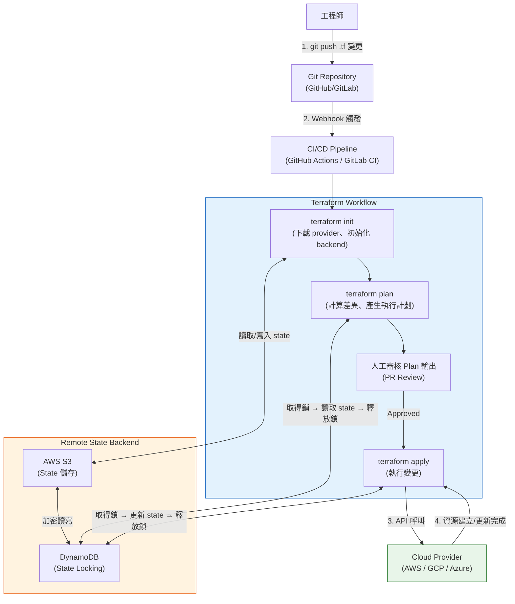
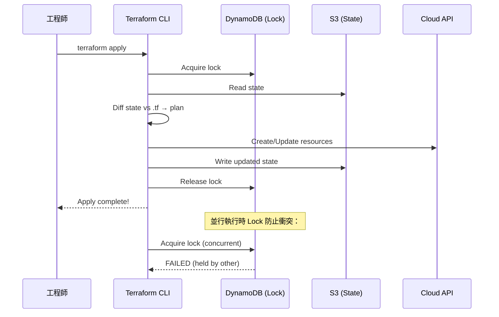

# Infrastructure as Code / 基礎設施即程式碼

## Intent / 意圖

Infrastructure as Code（IaC）是將基礎設施的建立、配置與管理以程式碼的形式定義、版本控制、自動化執行的實踐。核心理念：**基礎設施應與應用程式碼享有相同的工程紀律——版本控制（Git）、程式碼審查（Code Review）、自動化測試、CI/CD pipeline，並且任何環境都能從程式碼完全重現**。

核心問題：**當團隊管理數十個雲端服務跨多環境時，如何確保配置一致、變更可追溯、回滾可靠，避免組態漂移？Terraform 與 Pulumi 在聲明式 vs 程式化模型、狀態管理、模組化上有何差異？如何安全處理 IaC 中的 secrets？什麼是不可變基礎設施？如何透過 Policy-as-Code 確保合規性？**

---

## Problem / 問題情境

**場景一：手動管理雲端資源的維運噩夢**

某團隊將 AWS 資源全部透過 Web Console 手動建立。半年後問題浮現：(1) production Security Group 有條 port 9200 對外開放的規則——三個月前為了除錯臨時加的，忘記移除，安全漏洞暴露 90 天；(2) 新建 staging 環境耗時 3 天（「照著 production 手動再做一次」），結果 RDS instance type 選錯、Security Group 缺少規則，整合測試結果與 production 不一致；(3) production RDS 被誤刪——有人在整理測試資源時操作錯誤，無變更審核機制，從 snapshot 恢復花了 4 小時。

**場景二：Terraform state 管理不當導致資源重複建立**

State file 存放在本機。工程師 A 在筆電上 `terraform apply` 建立 production VPC 和 RDS。工程師 B 不知情，在自己機器上也 apply——B 的本機沒有 state，Terraform 認為所有資源不存在而重新建立。結果：兩個 VPC（CIDR 衝突）、兩個 RDS（資料分散兩處）、雙倍 AWS 帳單。根因：state 沒有集中管理，無 state locking。

**場景三：IaC 程式碼中的硬編碼機密洩漏**

`.tf` 檔案中直接寫入 RDS 密碼並推送到 GitHub。三個月後安全掃描偵測到明文密碼。雖然刪除了 commit，但 Git 歷史仍保留——攻擊者已在漏洞被發現前利用密碼存取 production 資料庫。事後花兩天輪換所有憑證、重建資料庫並通知客戶。

---

## Core Concepts / 核心概念

### Declarative vs Imperative / 聲明式 vs 命令式

- **聲明式（Declarative）**：描述「期望的最終狀態」（what），工具自動計算 diff 並執行。Terraform、K8s manifests 採用此模型。優點：冪等、自動處理相依性。缺點：DSL 表達力有限。
- **命令式（Imperative）**：描述「如何一步步達到期望狀態」（how），如 shell script、Ansible。優點：完全控制流程。缺點：難保證冪等性。

Terraform 是純聲明式。Pulumi 是混合模型——用 Go/Python/TypeScript 的控制流（if/for/function）動態生成聲明式資源圖。

### Terraform 核心概念

**HCL（HashiCorp Configuration Language）** 是 Terraform 的專屬 DSL，設計為人類可讀的聲明式配置語言。它支援變數（variables）、輸出（outputs）、資料來源（data sources）、條件表達式（conditional expressions）和 `for_each`/`count` 迴圈，但不是通用程式語言——沒有任意的 while 迴圈或例外處理。

**Provider** 是 Terraform 與外部 API（AWS、GCP、Azure、Kubernetes、GitHub...）互動的外掛。每個 provider 定義一組 resource types 和 data sources。Terraform Registry 上有數千個 community provider。Provider 配置包含認證資訊（API key、region 等）。

**State（狀態檔案）** 是 Terraform 最關鍵的概念。`terraform.tfstate` 是一個 JSON 檔案，記錄所有受管資源的 ID、屬性值和相依關係。Terraform 比較 state 與 `.tf` 程式碼的差異來決定需要建立、更新或刪除哪些資源。State 可能包含敏感資訊（如 RDS 密碼），必須加密儲存。

**Plan/Apply Workflow**：`terraform plan` 顯示將要執行的變更但不實際執行；`terraform apply` 確認後才真正執行。Plan 是安全審核的關鍵步驟——在 CI/CD 中，plan 輸出可作為 PR 的審核資訊。

**Modules（模組）** 是可重用的配置封裝——一個包含 `.tf` 檔案的目錄，透過 input variables 和 outputs 提供參數化介面。例如 `vpc` module 封裝 VPC + Subnet + Route Table + NAT Gateway，使用者只需提供 CIDR 和 AZ。

**Workspaces** 在同一份配置中管理多個 state 實例（如 dev/staging/prod）。更成熟的做法是目錄結構搭配不同的 `.tfvars` 檔案。

**Remote State + State Locking**：將 state 存儲在遠端（S3、GCS、Terraform Cloud），團隊共享且支援加密。State locking（DynamoDB）防止多人同時 `terraform apply` 造成衝突。異常終止時透過 `terraform force-unlock` 手動釋放鎖。

### Pulumi 核心概念

用通用程式語言（Go、Python、TypeScript、C#、Java）取代 DSL，以語言原生的控制流、函式、類別組織 IaC 程式碼。State 可存儲在 Pulumi Cloud、S3、Azure Blob 等。每個程式定義一個 **stack**（等同 Terraform workspace），代表獨立環境實例。

### OpenTofu

Terraform 的開源 fork，HashiCorp 於 2023 年將 Terraform 改為 BSL 授權後由社群發起、Linux Foundation 託管。與 Terraform 1.5.x 高度相容（語法、provider、state 格式），是在意授權風險組織的直接替代品。

### Drift Detection / 組態漂移偵測

實際雲端資源狀態偏離 IaC 定義——通常因 Console 手動修改。偵測：定期 `terraform plan`、Terraform Cloud 內建 drift detection、AWS Config Rules。修正：(a) `terraform apply` 覆蓋（IaC 為 source of truth）；(b) 將變更反映回程式碼（`terraform import`）。

### Immutable Infrastructure / 不可變基礎設施

核心原則：**一旦伺服器/容器被部署，就永不在原地修改——任何變更都透過建立全新實例並替換舊實例來實現**。實踐方式：Packer/Docker 預先建構映像，部署時啟動新實例並切換流量，最後終止舊實例。優點：消除組態漂移、簡化除錯（出問題直接替換）、回滾即切回舊映像。與 IaC 互補——IaC 管理資源生命週期，不可變映像管理實例內容。

### IaC Testing / IaC 測試

- **靜態分析**：`terraform validate`、`tflint`、`checkov`——不建立資源即可檢查語法、命名慣例、安全最佳實踐。
- **Plan 測試**：解析 `terraform plan` JSON 輸出，用 OPA/Rego 或 Sentinel 撰寫策略規則驗證。
- **整合測試**：Terratest（Go library）在真實雲端環境中建立資源 → 驗證行為 → destroy。
- **Policy-as-Code**：OPA/Rego（開源）或 Sentinel（HashiCorp 商業）定義合規策略——禁止公開 S3 bucket、限制 instance type、要求必要 tags。

### Secrets in IaC / IaC 中的機密處理

**絕不能將機密以明文寫入 `.tf` 檔案或提交到 Git**。正確做法：(1) 環境變數 `TF_VAR_db_password` 由 CI/CD secrets manager 注入；(2) `sensitive = true` 標記變數，遮蔽 plan/apply 輸出；(3) 整合 Vault/AWS SM data source 在 apply 時即時讀取；(4) Mozilla SOPS 加密 YAML/JSON 檔案；(5) State file 必須使用加密的 remote backend（S3 + KMS），因為 state 會包含明文密碼。

---

## Architecture / 架構

### Terraform Plan/Apply Workflow



### Terraform State 管理架構



---

## How It Works / 運作原理

### 一、Terraform 執行流程

1. **Init**：`terraform init` 下載 provider plugin 和 module 到 `.terraform/`，初始化 backend（連接 remote state）。
2. **Plan**：三方比對——(a) 讀取 state；(b) 呼叫 provider `Read` API refresh 實際狀態；(c) 與 `.tf` 期望狀態比較。差異產生 `+`（create）、`~`（update）、`-`（destroy）操作。可輸出 JSON 供 OPA/Sentinel 分析。
3. **Apply**：取得 state lock → 依相依關係圖的拓撲排序執行（被依賴者先建立）→ 平行執行無相依的資源（預設並行度 10）→ 增量更新 state → 釋放 lock。若某資源失敗，停止其下游但保留已成功的（partial apply）。
4. **Destroy**：以反向拓撲排序刪除所有資源。

### 二、State 的角色與風險

State 是 Terraform 的「記憶」，記錄每個資源的唯一 ID、屬性值和相依關係。風險：(1) state 損毀或遺失——Terraform 認為所有資源不存在而嘗試重建；(2) state 與實際不同步——手動刪除資源但 state 仍記錄，apply 時失敗；(3) state 中的敏感資訊——未加密即為安全漏洞。

### 三、Pulumi 的差異化運作

Pulumi Engine 比對程式碼定義的資源圖與 state，產生 diff。差異：資源宣告在通用語言 runtime 中——`for` 迴圈動態建立 N 個資源、`if` 條件選擇性建立、呼叫外部 API 取得參數。`pulumi preview` 等同 `terraform plan`，`pulumi up` 等同 `terraform apply`。

### 四、Drift Detection 與 Policy-as-Code

**Drift Detection**：定期在 CI/CD 中執行 `terraform plan`，若有差異即發送通知。修復策略：(a) `terraform apply` 覆蓋手動變更；(b) 將變更反映回程式碼並 `terraform import`。

**Policy-as-Code（OPA）**：`terraform plan -out=plan.tfplan` → `terraform show -json plan.tfplan > plan.json` → OPA 以 Rego 策略評估 plan.json → 違規時 CI 失敗，阻止 apply。Sentinel 流程類似但內建於 Terraform Cloud。

---

## Rust 實作

以 Rust 2024 edition + `serde` 建構一個 Terraform state file 解析器與驗證器。此工具讀取 Terraform state JSON 檔案，解析其中的資源，並執行一系列合規性檢查（如 S3 bucket 是否啟用加密、Security Group 是否開放 0.0.0.0/0、所有資源是否有必要的 tags）。

```rust
// terraform_state_validator.rs
// Terraform State File Parser & Compliance Validator
// Cargo.toml:
//   [package]
//   name = "tf-state-validator"
//   version = "0.1.0"
//   edition = "2024"
//
//   [dependencies]
//   serde = { version = "1", features = ["derive"] }
//   serde_json = "1"

use serde::{Deserialize, Serialize};
use std::collections::HashMap;
use std::fmt;

// ─── Terraform State 結構定義 ───

/// Terraform state file 的頂層結構（v4 格式）
#[derive(Debug, Deserialize)]
struct TerraformState {
    version: u32,
    terraform_version: String,
    serial: u64,
    lineage: String,
    outputs: HashMap<String, StateOutput>,
    resources: Vec<StateResource>,
}

/// State 中的 output value
#[derive(Debug, Deserialize)]
struct StateOutput {
    value: serde_json::Value,
    #[serde(rename = "type")]
    output_type: serde_json::Value,
    #[serde(default)]
    sensitive: bool,
}

/// State 中的資源
#[derive(Debug, Deserialize)]
struct StateResource {
    mode: String,           // "managed" or "data"
    #[serde(rename = "type")]
    resource_type: String,  // e.g., "aws_s3_bucket"
    name: String,           // resource name in .tf
    provider: String,       // e.g., "provider[\"registry.terraform.io/hashicorp/aws\"]"
    instances: Vec<ResourceInstance>,
}

/// 資源的實例（單一或 count/for_each 的每個）
#[derive(Debug, Deserialize)]
struct ResourceInstance {
    schema_version: u32,
    attributes: serde_json::Value,
    #[serde(default)]
    index_key: Option<serde_json::Value>,
    #[serde(default)]
    sensitive_attributes: Vec<serde_json::Value>,
    #[serde(default)]
    dependencies: Vec<String>,
}

// ─── 合規性檢查結果 ───

/// 違規的嚴重程度
#[derive(Debug, Clone, PartialEq, Eq, Serialize)]
enum Severity {
    Critical,
    High,
    Medium,
    Low,
    Info,
}

impl fmt::Display for Severity {
    fn fmt(&self, f: &mut fmt::Formatter<'_>) -> fmt::Result {
        match self {
            Severity::Critical => write!(f, "CRITICAL"),
            Severity::High     => write!(f, "HIGH"),
            Severity::Medium   => write!(f, "MEDIUM"),
            Severity::Low      => write!(f, "LOW"),
            Severity::Info     => write!(f, "INFO"),
        }
    }
}

/// 單一違規項目
#[derive(Debug, Clone, Serialize)]
struct Violation {
    severity: Severity,
    resource_type: String,
    resource_name: String,
    rule: String,
    message: String,
}

impl fmt::Display for Violation {
    fn fmt(&self, f: &mut fmt::Formatter<'_>) -> fmt::Result {
        write!(
            f,
            "[{}] {}.{}: {} — {}",
            self.severity, self.resource_type, self.resource_name,
            self.rule, self.message
        )
    }
}

/// 驗證報告
#[derive(Debug, Serialize)]
struct ValidationReport {
    total_resources: usize, managed_resources: usize, data_sources: usize,
    violations: Vec<Violation>, resource_type_counts: HashMap<String, usize>,
}
impl ValidationReport {
    fn has_critical(&self) -> bool {
        self.violations.iter().any(|v| v.severity == Severity::Critical)
    }
    fn has_high_or_above(&self) -> bool {
        self.violations.iter().any(|v| matches!(v.severity, Severity::Critical | Severity::High))
    }
    fn summary(&self) -> String {
        let cnt = |s: &Severity| self.violations.iter().filter(|v| &v.severity == s).count();
        format!("Resources: {} ({} managed, {} data) | Violations: {} crit, {} high, {} med, {} low, {} info",
            self.total_resources, self.managed_resources, self.data_sources,
            cnt(&Severity::Critical), cnt(&Severity::High), cnt(&Severity::Medium),
            cnt(&Severity::Low), cnt(&Severity::Info))
    }
}

// ─── 合規性規則引擎 ───

/// 規則 trait：每個合規性檢查實作此 trait
trait ComplianceRule {
    fn name(&self) -> &str;
    fn check(&self, resource: &StateResource, instance: &ResourceInstance) -> Vec<Violation>;
}

/// 規則：S3 bucket 必須啟用 server-side encryption
struct S3EncryptionRule;

impl ComplianceRule for S3EncryptionRule {
    fn name(&self) -> &str { "s3-encryption-enabled" }

    fn check(&self, resource: &StateResource, instance: &ResourceInstance) -> Vec<Violation> {
        if resource.resource_type != "aws_s3_bucket" {
            return vec![];
        }

        let attrs = &instance.attributes;

        // 檢查 server_side_encryption_configuration 是否存在
        let has_encryption = attrs
            .get("server_side_encryption_configuration")
            .and_then(|v| v.as_array())
            .map(|arr| !arr.is_empty())
            .unwrap_or(false);

        if !has_encryption {
            vec![Violation {
                severity: Severity::High,
                resource_type: resource.resource_type.clone(),
                resource_name: resource.name.clone(),
                rule: self.name().to_string(),
                message: "S3 bucket does not have server-side encryption enabled. \
                          Enable SSE-S3 or SSE-KMS to protect data at rest.".to_string(),
            }]
        } else {
            vec![]
        }
    }
}

/// 規則：S3 bucket 必須封鎖公開存取
struct S3PublicAccessRule;

impl ComplianceRule for S3PublicAccessRule {
    fn name(&self) -> &str { "s3-no-public-access" }

    fn check(&self, resource: &StateResource, instance: &ResourceInstance) -> Vec<Violation> {
        if resource.resource_type != "aws_s3_bucket" {
            return vec![];
        }

        let attrs = &instance.attributes;
        let bucket_name = attrs.get("bucket")
            .and_then(|v| v.as_str())
            .unwrap_or("unknown");

        // 檢查 ACL 是否設為公開
        let acl = attrs.get("acl").and_then(|v| v.as_str()).unwrap_or("private");
        if acl == "public-read" || acl == "public-read-write" {
            return vec![Violation {
                severity: Severity::Critical,
                resource_type: resource.resource_type.clone(),
                resource_name: resource.name.clone(),
                rule: self.name().to_string(),
                message: format!(
                    "S3 bucket '{}' has public ACL '{}'. Public buckets risk data exposure.",
                    bucket_name, acl
                ),
            }];
        }

        vec![]
    }
}

/// 規則：Security Group 不應對 0.0.0.0/0 開放敏感 port（SSH、RDP、DB 等）
struct SecurityGroupOpenPortRule;

impl ComplianceRule for SecurityGroupOpenPortRule {
    fn name(&self) -> &str { "sg-no-open-sensitive-ports" }

    fn check(&self, resource: &StateResource, instance: &ResourceInstance) -> Vec<Violation> {
        if resource.resource_type != "aws_security_group" { return vec![]; }
        let sensitive_ports: &[u16] = &[22, 3389, 5432, 3306, 6379, 27017, 9200];
        let mut violations = vec![];

        if let Some(rules) = instance.attributes.get("ingress").and_then(|v| v.as_array()) {
            for rule in rules {
                let from = rule.get("from_port").and_then(|v| v.as_u64()).unwrap_or(0) as u16;
                let to = rule.get("to_port").and_then(|v| v.as_u64()).unwrap_or(0) as u16;
                let open = rule.get("cidr_blocks").and_then(|v| v.as_array())
                    .map(|c| c.iter().any(|x| x.as_str() == Some("0.0.0.0/0")))
                    .unwrap_or(false);
                if open {
                    for &port in sensitive_ports {
                        if port >= from && port <= to {
                            violations.push(Violation {
                                severity: Severity::Critical,
                                resource_type: resource.resource_type.clone(),
                                resource_name: resource.name.clone(),
                                rule: self.name().to_string(),
                                message: format!("SG allows port {} from 0.0.0.0/0", port),
                            });
                        }
                    }
                }
            }
        }
        violations
    }
}

/// 規則：所有 managed 資源必須有必要的 tags
struct RequiredTagsRule { required_tags: Vec<String> }

impl ComplianceRule for RequiredTagsRule {
    fn name(&self) -> &str { "required-tags" }

    fn check(&self, resource: &StateResource, instance: &ResourceInstance) -> Vec<Violation> {
        if resource.mode != "managed" { return vec![]; }
        // 跳過不支援 tags 的資源類型
        let skip = ["aws_iam_policy", "aws_iam_role_policy_attachment"];
        if skip.contains(&resource.resource_type.as_str()) { return vec![]; }

        let tags = instance.attributes.get("tags").and_then(|v| v.as_object());
        let missing: Vec<&String> = match tags {
            None => self.required_tags.iter().collect(),
            Some(map) => self.required_tags.iter().filter(|t| !map.contains_key(*t)).collect(),
        };
        missing.into_iter().map(|tag| Violation {
            severity: Severity::Medium,
            resource_type: resource.resource_type.clone(),
            resource_name: resource.name.clone(),
            rule: self.name().to_string(),
            message: format!("Missing required tag: '{}'", tag),
        }).collect()
    }
}

/// 規則：RDS instance 必須啟用加密、自動備份、禁止公開存取
struct RdsSecurityRule;

impl ComplianceRule for RdsSecurityRule {
    fn name(&self) -> &str { "rds-encryption-and-backup" }

    fn check(&self, resource: &StateResource, instance: &ResourceInstance) -> Vec<Violation> {
        if resource.resource_type != "aws_db_instance" { return vec![]; }
        let attrs = &instance.attributes;
        let mut v = vec![];
        let mk = |sev, msg: &str| Violation {
            severity: sev, resource_type: resource.resource_type.clone(),
            resource_name: resource.name.clone(),
            rule: self.name().to_string(), message: msg.to_string(),
        };
        if !attrs.get("storage_encrypted").and_then(|v| v.as_bool()).unwrap_or(false) {
            v.push(mk(Severity::High, "RDS instance does not have storage encryption enabled."));
        }
        if attrs.get("backup_retention_period").and_then(|v| v.as_u64()).unwrap_or(0) == 0 {
            v.push(mk(Severity::High, "RDS automated backups disabled (retention=0)."));
        }
        if attrs.get("publicly_accessible").and_then(|v| v.as_bool()).unwrap_or(false) {
            v.push(mk(Severity::Critical, "RDS instance is publicly accessible."));
        }
        v
    }
}

// ─── State Validator（Builder pattern 註冊規則，逐一掃描所有 resource × instance）───

struct StateValidator { rules: Vec<Box<dyn ComplianceRule>> }

impl StateValidator {
    fn new() -> Self { Self { rules: vec![] } }
    fn add_rule(mut self, rule: Box<dyn ComplianceRule>) -> Self { self.rules.push(rule); self }

    fn validate(&self, state_json: &str) -> Result<ValidationReport, String> {
        let state: TerraformState = serde_json::from_str(state_json)
            .map_err(|e| format!("Failed to parse state file: {}", e))?;
        println!("Terraform State v{} (terraform {})", state.version, state.terraform_version);
        println!("Serial: {} | Lineage: {}", state.serial, state.lineage);
        println!("---");

        let mut violations = vec![];
        let mut type_counts: HashMap<String, usize> = HashMap::new();
        let (mut managed, mut data) = (0_usize, 0_usize);

        for res in &state.resources {
            *type_counts.entry(res.resource_type.clone()).or_insert(0) += 1;
            match res.mode.as_str() { "managed" => managed += 1, "data" => data += 1, _ => {} }
            for inst in &res.instances {
                for rule in &self.rules { violations.extend(rule.check(res, inst)); }
            }
        }
        // 依嚴重程度排序
        violations.sort_by_key(|v| match v.severity {
            Severity::Critical => 0, Severity::High => 1,
            Severity::Medium => 2, Severity::Low => 3, Severity::Info => 4,
        });
        // 稽核 sensitive outputs
        for (name, out) in &state.outputs {
            if out.sensitive {
                violations.push(Violation {
                    severity: Severity::Info, resource_type: "output".into(),
                    resource_name: name.clone(), rule: "sensitive-output-audit".into(),
                    message: "Output marked sensitive — verify not logged in CI/CD.".into(),
                });
            }
        }
        Ok(ValidationReport {
            total_resources: state.resources.len(), managed_resources: managed,
            data_sources: data, violations, resource_type_counts: type_counts,
        })
    }
}

fn main() {
    // 模擬的 Terraform state file（簡化版，實際 state 可達數 MB）
    let mock_state = r#"{
        "version": 4, "terraform_version": "1.9.5", "serial": 42,
        "lineage": "a1b2c3d4-e5f6-7890-abcd-ef1234567890",
        "outputs": {
            "db_endpoint": { "value": "mydb.abc123.rds.amazonaws.com", "type": "string", "sensitive": false },
            "db_password": { "value": "super-secret", "type": "string", "sensitive": true }
        },
        "resources": [
            { "mode": "managed", "type": "aws_s3_bucket", "name": "app_assets",
              "provider": "provider[\"registry.terraform.io/hashicorp/aws\"]",
              "instances": [{ "schema_version": 0, "attributes": {
                "bucket": "myapp-assets-prod", "acl": "private",
                "tags": { "team": "platform", "env": "prod" },
                "server_side_encryption_configuration": []
              }, "dependencies": [] }] },
            { "mode": "managed", "type": "aws_s3_bucket", "name": "public_data",
              "provider": "provider[\"registry.terraform.io/hashicorp/aws\"]",
              "instances": [{ "schema_version": 0, "attributes": {
                "bucket": "myapp-public-data", "acl": "public-read",
                "tags": { "team": "data" }
              }, "dependencies": [] }] },
            { "mode": "managed", "type": "aws_security_group", "name": "web_sg",
              "provider": "provider[\"registry.terraform.io/hashicorp/aws\"]",
              "instances": [{ "schema_version": 1, "attributes": {
                "name": "web-sg",
                "ingress": [
                  { "from_port": 443, "to_port": 443, "cidr_blocks": ["0.0.0.0/0"], "protocol": "tcp" },
                  { "from_port": 22, "to_port": 22, "cidr_blocks": ["0.0.0.0/0"], "protocol": "tcp" }
                ],
                "tags": { "team": "platform", "env": "prod" }
              }, "dependencies": [] }] },
            { "mode": "managed", "type": "aws_db_instance", "name": "main_db",
              "provider": "provider[\"registry.terraform.io/hashicorp/aws\"]",
              "instances": [{ "schema_version": 2, "attributes": {
                "identifier": "myapp-prod-db", "engine": "postgres", "engine_version": "16.2",
                "instance_class": "db.r6g.xlarge", "storage_encrypted": false,
                "backup_retention_period": 0, "publicly_accessible": true,
                "tags": { "env": "prod" }
              }, "sensitive_attributes": ["password"],
              "dependencies": ["aws_security_group.web_sg"] }] },
            { "mode": "data", "type": "aws_ami", "name": "ubuntu",
              "provider": "provider[\"registry.terraform.io/hashicorp/aws\"]",
              "instances": [{ "schema_version": 0, "attributes": {
                "id": "ami-0abcdef1234567890",
                "name": "ubuntu/images/hvm-ssd/ubuntu-jammy-22.04-amd64-server"
              }, "dependencies": [] }] }
        ]
    }"#;

    let validator = StateValidator::new()
        .add_rule(Box::new(S3EncryptionRule))
        .add_rule(Box::new(S3PublicAccessRule))
        .add_rule(Box::new(SecurityGroupOpenPortRule))
        .add_rule(Box::new(RequiredTagsRule {
            required_tags: vec!["team".into(), "env".into(), "managed-by".into()],
        }))
        .add_rule(Box::new(RdsSecurityRule));

    match validator.validate(mock_state) {
        Ok(report) => {
            println!("{}", report.summary());
            println!("---");
            for v in &report.violations { println!("  {}", v); }
            println!("---");
            if report.has_critical() { println!("RESULT: FAILED (critical)"); }
            else if report.has_high_or_above() { println!("RESULT: FAILED (high)"); }
            else { println!("RESULT: PASSED"); }
        }
        Err(e) => eprintln!("Validation error: {}", e),
    }
}

// Output:
// Terraform State v4 (terraform 1.9.5)
// Serial: 42 | Lineage: a1b2c3d4-...
// ---
// Resources: 5 (4 managed, 1 data) | Violations: 3 crit, 3 high, 3 med, 0 low, 1 info
// ---
//   [CRITICAL] aws_s3_bucket.public_data: s3-no-public-access — public ACL 'public-read'
//   [CRITICAL] aws_security_group.web_sg: sg-no-open-sensitive-ports — port 22 from 0.0.0.0/0
//   [CRITICAL] aws_db_instance.main_db: rds-encryption-and-backup — publicly accessible
//   [HIGH] aws_s3_bucket.app_assets: s3-encryption-enabled — no SSE
//   [HIGH] aws_db_instance.main_db: rds-encryption-and-backup — no storage encryption
//   [HIGH] aws_db_instance.main_db: rds-encryption-and-backup — backups disabled
//   [MEDIUM] aws_s3_bucket.app_assets: required-tags — missing 'managed-by'
//   [MEDIUM] aws_s3_bucket.public_data: required-tags — missing 'env', 'managed-by'
//   [INFO] output.db_password: sensitive-output-audit — verify not logged in CI/CD
// ---
// RESULT: FAILED (critical)
```

**重點說明：**
- `serde` 搭配 `#[serde(rename)]`、`#[serde(default)]` 在編譯期生成零成本反序列化，處理 state 中不固定的欄位。
- `ComplianceRule` trait 遵循開放封閉原則——新增規則只需實作 trait。
- 所有 JSON 導航使用 `Option` 鏈避免 panic，充分利用 Rust 型別安全。
- 可擴展為讀取真實 `.tfstate`、從 S3 下載 state、整合 GitHub Actions。

---

## Go 實作

以 Go 1.24+ 搭配 Pulumi Go SDK 撰寫一個完整的基礎設施程式，佈建 AWS VPC + Subnet + Security Group + RDS 資源，並展示 Pulumi 的程式化 IaC 能力（條件邏輯、迴圈、函式封裝）。

```go
// pulumi_infra.go
// Pulumi Go SDK Infrastructure Program: VPC + RDS + Security Group
// go.mod:
//   module pulumi-infra
//   go 1.24
//   require (
//     github.com/pulumi/pulumi/sdk/v3 v3.140.0
//     github.com/pulumi/pulumi-aws/sdk/v6 v6.65.0
//   )

package main

import (
	"fmt"

	"github.com/pulumi/pulumi-aws/sdk/v6/go/aws/ec2"
	"github.com/pulumi/pulumi-aws/sdk/v6/go/aws/rds"
	"github.com/pulumi/pulumi/sdk/v3/go/pulumi"
	"github.com/pulumi/pulumi/sdk/v3/go/pulumi/config"
)

// ─── 配置參數（Go 原生的 if/else 根據環境動態決定配置）───

type InfraConfig struct {
	Environment     string
	VpcCidr         string
	SubnetCidrs     []string
	AvailabilityZones []string
	DbInstanceClass string
	DbEngine, DbEngineVersion, DbName, DbUsername string
	EnableMultiAz   bool
	BackupRetention int
}

func LoadConfig(ctx *pulumi.Context) InfraConfig {
	cfg := config.New(ctx, "infra")
	env := cfg.Get("environment")
	if env == "" { env = "dev" }

	// Pulumi 的程式化優勢：用 Go if/else 而非 HCL 的 conditional expression
	multiAz := env == "prod" || env == "staging"
	retention := 7; if env == "prod" { retention = 30 }
	instanceClass := "db.t3.micro"; if env == "prod" { instanceClass = "db.r6g.xlarge" }

	return InfraConfig{
		Environment: env, VpcCidr: "10.0.0.0/16",
		SubnetCidrs: []string{"10.0.1.0/24", "10.0.2.0/24", "10.0.3.0/24"},
		AvailabilityZones: []string{"us-east-1a", "us-east-1b", "us-east-1c"},
		DbInstanceClass: instanceClass, DbEngine: "postgres", DbEngineVersion: "16.2",
		DbName: fmt.Sprintf("myapp_%s", env), DbUsername: "app_admin",
		EnableMultiAz: multiAz, BackupRetention: retention,
	}
}

// ─── 基礎設施建構函式 ───

// createVPC 建立 VPC + 多個 Subnet（for 迴圈是 Pulumi 程式化的核心優勢）
func createVPC(ctx *pulumi.Context, cfg InfraConfig) (*ec2.Vpc, []*ec2.Subnet, error) {
	vpc, err := ec2.NewVpc(ctx, fmt.Sprintf("vpc-%s", cfg.Environment), &ec2.VpcArgs{
		CidrBlock: pulumi.String(cfg.VpcCidr),
		EnableDnsHostnames: pulumi.Bool(true), EnableDnsSupport: pulumi.Bool(true),
		Tags: pulumi.StringMap{
			"Name": pulumi.Sprintf("vpc-%s", cfg.Environment),
			"managed-by": pulumi.String("pulumi"), "environment": pulumi.String(cfg.Environment),
		},
	})
	if err != nil { return nil, nil, fmt.Errorf("create VPC: %w", err) }

	// 用 Go for 迴圈動態建立 N 個 subnet（HCL 需用 count 或 for_each）
	subnets := make([]*ec2.Subnet, 0, len(cfg.SubnetCidrs))
	for i, cidr := range cfg.SubnetCidrs {
		az := cfg.AvailabilityZones[i%len(cfg.AvailabilityZones)]
		s, err := ec2.NewSubnet(ctx, fmt.Sprintf("subnet-%s-%d", cfg.Environment, i),
			&ec2.SubnetArgs{
				VpcId: vpc.ID(), CidrBlock: pulumi.String(cidr), AvailabilityZone: pulumi.String(az),
				Tags: pulumi.StringMap{
					"Name": pulumi.Sprintf("subnet-%s-%d-%s", cfg.Environment, i, az),
					"managed-by": pulumi.String("pulumi"),
				},
			})
		if err != nil { return nil, nil, fmt.Errorf("create subnet %d: %w", i, err) }
		subnets = append(subnets, s)
	}
	return vpc, subnets, nil
}

// createSecurityGroup 建立 RDS 用的 SG（只允許 VPC 內存取 5432）
func createSecurityGroup(ctx *pulumi.Context, cfg InfraConfig, vpc *ec2.Vpc) (*ec2.SecurityGroup, error) {
	sg, err := ec2.NewSecurityGroup(ctx, fmt.Sprintf("rds-sg-%s", cfg.Environment),
		&ec2.SecurityGroupArgs{
			VpcId: vpc.ID(), Description: pulumi.Sprintf("RDS SG for %s", cfg.Environment),
			Ingress: ec2.SecurityGroupIngressArray{
				&ec2.SecurityGroupIngressArgs{
					Protocol: pulumi.String("tcp"), FromPort: pulumi.Int(5432), ToPort: pulumi.Int(5432),
					CidrBlocks: pulumi.StringArray{vpc.CidrBlock}, // 只開放 VPC 內
					Description: pulumi.String("PostgreSQL from VPC only"),
				},
			},
			Egress: ec2.SecurityGroupEgressArray{
				&ec2.SecurityGroupEgressArgs{
					Protocol: pulumi.String("-1"), FromPort: pulumi.Int(0), ToPort: pulumi.Int(0),
					CidrBlocks: pulumi.StringArray{pulumi.String("0.0.0.0/0")},
				},
			},
			Tags: pulumi.StringMap{"Name": pulumi.Sprintf("rds-sg-%s", cfg.Environment), "managed-by": pulumi.String("pulumi")},
		})
	if err != nil { return nil, fmt.Errorf("create SG: %w", err) }
	return sg, nil
}

// createRDS 建立 RDS PostgreSQL instance（含 Subnet Group）
func createRDS(
	ctx *pulumi.Context, cfg InfraConfig,
	subnets []*ec2.Subnet, sg *ec2.SecurityGroup,
) (*rds.Instance, error) {
	subnetIDs := make(pulumi.StringArray, 0, len(subnets))
	for _, s := range subnets { subnetIDs = append(subnetIDs, s.ID()) }

	subnetGroup, err := rds.NewSubnetGroup(ctx, fmt.Sprintf("db-subnet-%s", cfg.Environment),
		&rds.SubnetGroupArgs{
			SubnetIds: subnetIDs, Description: pulumi.Sprintf("DB subnet group for %s", cfg.Environment),
			Tags: pulumi.StringMap{"managed-by": pulumi.String("pulumi"), "environment": pulumi.String(cfg.Environment)},
		})
	if err != nil { return nil, fmt.Errorf("create subnet group: %w", err) }

	// 密碼從 Pulumi secrets config 讀取（pulumi config set --secret infra:dbPassword <value>）
	dbPassword := config.NewConfig(ctx, "infra").RequireSecret("dbPassword")

	dbInstance, err := rds.NewInstance(ctx, fmt.Sprintf("db-%s", cfg.Environment),
		&rds.InstanceArgs{
			Identifier: pulumi.Sprintf("myapp-%s-db", cfg.Environment),
			Engine: pulumi.String(cfg.DbEngine), EngineVersion: pulumi.String(cfg.DbEngineVersion),
			InstanceClass: pulumi.String(cfg.DbInstanceClass),
			AllocatedStorage: pulumi.Int(20), MaxAllocatedStorage: pulumi.Int(100),
			DbName: pulumi.String(cfg.DbName), Username: pulumi.String(cfg.DbUsername),
			Password: dbPassword,
			// 安全：加密 + 禁止公開 + prod 啟用刪除保護
			StorageEncrypted: pulumi.Bool(true), PubliclyAccessible: pulumi.Bool(false),
			DeletionProtection: pulumi.Bool(cfg.Environment == "prod"),
			// 高可用與備份（條件邏輯在 LoadConfig 中由 Go if/else 處理）
			MultiAz: pulumi.Bool(cfg.EnableMultiAz),
			BackupRetentionPeriod: pulumi.Int(cfg.BackupRetention),
			BackupWindow: pulumi.String("03:00-04:00"), MaintenanceWindow: pulumi.String("Mon:04:00-Mon:05:00"),
			// 網路
			DbSubnetGroupName: subnetGroup.Name, VpcSecurityGroupIds: pulumi.StringArray{sg.ID()},
			Tags: pulumi.StringMap{
				"Name": pulumi.Sprintf("myapp-%s-db", cfg.Environment), "managed-by": pulumi.String("pulumi"),
				"environment": pulumi.String(cfg.Environment), "team": pulumi.String("platform"),
			},
			SkipFinalSnapshot: pulumi.Bool(cfg.Environment != "prod"),
		})
	if err != nil { return nil, fmt.Errorf("create RDS: %w", err) }
	return dbInstance, nil
}

func main() {
	pulumi.Run(func(ctx *pulumi.Context) error {
		cfg := LoadConfig(ctx)

		vpc, subnets, err := createVPC(ctx, cfg)
		if err != nil { return err }
		sg, err := createSecurityGroup(ctx, cfg, vpc)
		if err != nil { return err }
		db, err := createRDS(ctx, cfg, subnets, sg)
		if err != nil { return err }

		// 匯出 outputs（其他 stack 可透過 StackReference 引用）
		ctx.Export("vpcId", vpc.ID())
		ctx.Export("securityGroupId", sg.ID())
		ctx.Export("dbEndpoint", db.Endpoint)
		ctx.Export("dbName", pulumi.String(cfg.DbName))
		return nil
	})
}

// Output (pulumi up):
// Previewing update (dev):
//      Type                       Name                  Plan
//  +   pulumi:pulumi:Stack        pulumi-infra-dev      create
//  +   ├── aws:ec2:Vpc            vpc-dev               create
//  +   ├── aws:ec2:Subnet         subnet-dev-0          create
//  +   ├── aws:ec2:Subnet         subnet-dev-1          create
//  +   ├── aws:ec2:Subnet         subnet-dev-2          create
//  +   ├── aws:ec2:SecurityGroup  rds-sg-dev            create
//  +   ├── aws:rds:SubnetGroup    db-subnet-dev         create
//  +   └── aws:rds:Instance       db-dev                create
//
// Resources:
//     + 8 to create
//
// Outputs:
//     dbEndpoint    : "myapp-dev-db.abc123.us-east-1.rds.amazonaws.com:5432"
//     dbName        : "myapp_dev"
//     securityGroupId: "sg-0abcdef1234567890"
//     subnetIds     : ["subnet-0aaa...", "subnet-0bbb...", "subnet-0ccc..."]
//     vpcId         : "vpc-0abcdef1234567890"
```

**重點說明：**
- Go `if`/`for` 動態決定配置（prod 自動 Multi-AZ、更大 instance type）——比 HCL conditional 更直覺。
- `config.RequireSecret()` 加密存儲密碼，不出現在程式碼或日誌。
- `pulumi.StringOutput` 代表「尚未知道的值」，engine 自動處理資源相依。
- Go 強型別在編譯期檢查 provider 參數——非 `terraform apply` 時才發現錯誤。
- 函式封裝比 Terraform module 更自然。

---

## Rust vs Go 對照表

| 面向 | Rust (serde + state 解析) | Go (Pulumi SDK + 基礎設施佈建) |
|------|--------------------------|-------------------------------|
| **IaC 工具定位** | Rust 適合建構 IaC 的**周邊工具**——state 解析器、合規性掃描器、drift 偵測器、自定義 provider。效能優異且可編譯為單一二進位，適合 CI/CD pipeline 中高頻執行的掃描任務 | Go 是 IaC 的**一級公民語言**——Terraform 本身以 Go 撰寫，Pulumi Go SDK 提供原生支援，Terratest（整合測試）也是 Go library。Go 在 IaC 生態系中的支援度和成熟度遠超 Rust |
| **型別安全與反序列化** | `serde` 在編譯期生成零分配的反序列化程式碼，處理 Terraform state（可達數 MB）的效能比 Go 的 `encoding/json` 快 3-5 倍。`#[serde(rename)]`、`#[serde(default)]` 優雅處理 JSON 結構不一致的問題 | `encoding/json` 使用 reflect 在執行期處理，對大型 state file 效能較差但足夠使用。Go 1.24 的 `json/v2` 實驗性套件提升了效能。`json.RawMessage` 可延遲解析，避免反序列化不需要的欄位 |
| **錯誤處理** | `Result<T, E>` 搭配 `?` 運算子確保 JSON 解析中每個 `.get()`、`.as_str()` 的失敗路徑都被明確處理。`Option` 鏈讓遺失欄位的處理自然優雅，不會 panic | `if err != nil` 模式清晰但冗長。JSON 解析中的型別斷言（`value.(string)`）在型別不匹配時回傳零值而非錯誤，可能產生隱性 bug |
| **生態系整合** | Terraform/Pulumi 無官方 Rust SDK。社群的 `tf-provider-rs` 和 `pulumi-rust` 仍在早期階段。Rust 適合撰寫底層工具（如自定義的 state 管理器、provider 框架），但不適合直接撰寫 IaC 配置 | Terraform（Go 撰寫）、Pulumi（原生 Go SDK）、Terratest（Go library）、OPA（Go 撰寫）——整個 IaC 生態系以 Go 為中心。Go 是撰寫 Terraform custom provider 的唯一官方語言 |

---

## When to Use / 適用場景

### 1. 多環境一致性與可重現性

當團隊需要維護 dev、staging、production 等多個環境，且要求這些環境的基礎設施配置完全一致時，IaC 是唯一可靠的解決方案。用同一份程式碼搭配不同的變數檔案（`.tfvars`）或 Pulumi stack config 部署每個環境。新加入的工程師可以在 10 分鐘內從 IaC 程式碼重建完整的開發環境。災難復原（DR）時，從 IaC 程式碼重建整個基礎設施的時間可從「數天」縮短到「數十分鐘」。

### 2. 合規性與稽核要求

金融、醫療等受監管行業要求所有基礎設施變更可追溯、可審核。IaC + Git 提供了完整的變更歷史：誰在什麼時間變更了什麼、為什麼（commit message / PR description）、變更是否經過審核（PR review）。搭配 Policy-as-Code（OPA/Sentinel），可以在基礎設施變更被套用前自動驗證是否符合安全和合規策略。

### 3. 大規模基礎設施的團隊協作

IaC 的協作機制：module 讓不同團隊負責不同層（網路/資料庫/應用）；remote state + locking 防止並行衝突；CI/CD 中 plan 審核確保每個變更被理解和核准。

---

## When NOT to Use / 不適用場景

### 1. 一次性的實驗環境或原型驗證

如果只是快速驗證某個 AWS 服務的行為、或建立一個用完即丟的 PoC（Proof of Concept），直接使用 Console 或 CLI 更快。IaC 的初始設定成本（backend 配置、module 結構、CI/CD pipeline）在短生命週期的實驗中不值得投入。但要注意——很多「臨時」環境最終變成了長期環境，屆時再補 IaC 的成本更高。

### 2. 非常小型的團隊管理極少量資源

一個人管理 3 個 EC2 和 1 個 RDS 的小型專案，手動管理加上良好的文件記錄可能更務實。但即使在此情境下，至少使用 IaC 管理核心資源（VPC、Security Group、RDS）仍是好習慣——當專案成長時不需要從零開始。

### 3. 需要頻繁互動式除錯的基礎設施

反覆試錯調整配置（WAF 規則、CloudFront）時，plan/apply 流程會降低迭代速度。實務：先在 Console 完成除錯，確定後再反映回 IaC（`terraform import`）。

---

## Real-World Examples / 真實世界案例

### Shopify — Terraform 管理數千個微服務的基礎設施

Shopify 使用 Terraform 管理 GCP 上的大規模基礎設施（數千微服務、數百 GKE 叢集）。關鍵實踐：

1. **Monorepo + Module Registry**：所有 Terraform 程式碼在 monorepo 中，基礎模組（VPC、GKE、Cloud SQL）透過自建 registry 共享，各團隊在自己的目錄中組合使用。
2. **自動化 Plan Review**：PR 自動執行 `terraform plan`，輸出作為 PR comment 供 reviewer 審核。
3. **Policy-as-Code 閘門**：OPA 檢查所有 plan——禁止公開 Storage Bucket、Security Group 不開放 0.0.0.0/0、所有資源必須有必要 labels。
4. **Drift Detection**：每小時自動 plan，偵測到漂移即建立 Jira ticket 並通知 on-call。
5. **規模挑戰**：數千資源的 state 導致 plan 從秒級增長到分鐘級——透過拆分為 per-component state 解決，但引入 `terraform_remote_state` 交叉引用的複雜度。

---

## Interview Questions / 面試常見問題

### Q1: 什麼是 Terraform 的 state？state 損毀時怎麼辦？

State 是 JSON 檔案，記錄所有受管資源的 ID、屬性、相依關係。它是 plan/apply 的基礎——Terraform 比較 state 與 `.tf` 來決定變更內容。State 可能含敏感資訊。損毀處理：(a) S3 versioning 回復到上一版本；(b) `terraform import` 逐一匯入既有資源；(c) Terraform Cloud 歷史 state 備份。

### Q2: Terraform vs Pulumi？如何選擇？

Terraform 用 HCL（DSL），學習曲線低、社群和 provider 生態系最成熟，但複雜邏輯表達力有限。Pulumi 用 Go/TS/Python 通用語言，可用函式/類別/套件管理組織程式碼，但生態系不如 Terraform。選 Terraform 若團隊是 IaC 新手或需最廣 provider 支援；選 Pulumi 若有強軟體工程背景且需複雜邏輯封裝。

### Q3: 如何在 IaC 中安全地處理 secrets？

絕不能明文寫入 `.tf` 並提交 Git。做法：(1) `TF_VAR_*` 環境變數由 CI/CD 注入；(2) `sensitive = true` 遮蔽 plan/apply 輸出；(3) Vault/AWS SM data source 即時讀取；(4) Pulumi `config.RequireSecret()` 加密存儲；(5) State backend 啟用加密（S3 + KMS）。

### Q4: 如何設計好的 Terraform module？

Module 是可重用的配置封裝（一組 `.tf` 檔案 + variables + outputs）。設計原則：(1) 單一職責；(2) 最小化必填變數，提供合理預設值；(3) 暴露有用的 outputs（ID、ARN、endpoint）；(4) 版本控制（semver），消費者固定版本。

### Q5: 解釋 drift detection 及其處理策略。

Drift 是實際狀態偏離 IaC 定義——通常因 Console 手動修改。偵測：定期 `terraform plan`。處理：(a) `terraform apply` 覆蓋（IaC 為 source of truth）；(b) 將變更反映回 `.tf` 程式碼。最佳實踐：限制 Console 為 read-only，所有變更走 IaC + PR 流程。

---

## Pitfalls / 常見陷阱

### 1. State file 中的明文 secrets（安全性）

Terraform state 會以明文記錄某些資源的敏感屬性——例如 `aws_db_instance` 的 `password`、`aws_secretsmanager_secret_version` 的 `secret_string`。即使在 `.tf` 中使用 `sensitive = true`，state file 中仍是明文 JSON。如果 state 存儲在未加密的本機檔案或 S3 bucket 中，等同將密碼暴露給所有能存取 state 的人。

**解法：** (1) remote backend 必須啟用加密（S3 + SSE-KMS）；(2) 限制 S3 bucket 的 IAM policy 至最小權限；(3) 避免在 Terraform 中直接管理 secrets——改為用 Vault/AWS SM 管理，Terraform 只引用 secret ARN 而非 secret 值。

### 2. State 拆分不當導致循環依賴

巨大的 state 導致 plan 極慢（數千資源時 10-15 分鐘）。但過度拆分產生大量 `terraform_remote_state` 交叉引用，甚至循環依賴。**解法：** 以變更頻率和生命週期為單位拆分（網路層 vs 應用層），`terraform_remote_state` 做單向引用（下游引用上游）。

### 3. Rust 陷阱：serde 解析 Terraform state 的可選欄位處理

Terraform state 的 JSON 結構在不同版本和不同 provider 之間差異很大——某些欄位可能是 `null`、空陣列 `[]`、空物件 `{}`、或完全不存在。Rust 的 `serde` 預設要求 JSON 結構與 struct 定義完全匹配，遺漏的欄位會導致反序列化失敗。

```rust
// 錯誤寫法：假設 attributes 中一定有 tags
#[derive(Deserialize)]
struct BucketAttributes {
    bucket: String,
    tags: HashMap<String, String>,  // 如果 state 中 tags 為 null 或不存在 → 解析失敗！
}

// 正確寫法：所有可選欄位使用 Option 或 default
#[derive(Deserialize)]
struct BucketAttributes {
    bucket: String,
    #[serde(default)]  // 不存在時使用 HashMap::default()（空 map）
    tags: HashMap<String, String>,
    #[serde(default)]  // 不存在時為 None
    server_side_encryption_configuration: Option<Vec<serde_json::Value>>,
    #[serde(default)]  // null 或不存在時為 "private"
    acl: Option<String>,
}
```

### 4. Go 陷阱：Pulumi Output 的非同步特性與 Apply 時機

Pulumi 中的 `pulumi.StringOutput`、`pulumi.IDOutput` 等類型代表「尚未解析的值」——資源的 ID 只有在 Pulumi engine 實際建立資源後才知道。新手常犯的錯誤是嘗試在 Pulumi 程式中同步讀取 Output 的值來做邏輯判斷，這會得到空值或 panic。

```go
// 錯誤寫法：嘗試同步讀取 Output 值
vpc, _ := ec2.NewVpc(ctx, "vpc", &ec2.VpcArgs{
    CidrBlock: pulumi.String("10.0.0.0/16"),
})
// vpc.ID() 回傳 pulumi.IDOutput，不是 string！
// 以下程式碼在 pulumi preview 時 vpcID 為空字串
vpcID := vpc.ID()
fmt.Println(vpcID) // 印出的是 Output 物件，不是實際 ID

// 正確寫法：使用 Apply callback 在值解析後執行邏輯
vpc.ID().ApplyT(func(id string) error {
    fmt.Printf("VPC created with ID: %s\n", id)
    return nil
})

// 或在建立依賴資源時直接傳遞 Output（Pulumi 自動處理相依性）
_, _ = ec2.NewSubnet(ctx, "subnet", &ec2.SubnetArgs{
    VpcId:     vpc.ID(),  // 直接傳 Output，Pulumi 自動等待 VPC 建立完成
    CidrBlock: pulumi.String("10.0.1.0/24"),
})
```

### 5. Plan 與 Apply 的時間差導致衝突

Plan 在 PR 審核時執行，apply 在合併後——期間若有其他變更，apply 行為可能與 plan 不同。**解法：** saved plan（`terraform plan -out=plan.tfplan` → `terraform apply plan.tfplan`）、apply 前再次 plan、或用 Terraform Cloud run queue 排隊。

---

## Cross-references / 交叉引用

- [[29_secrets_management|Secrets Management]] — IaC 必須安全地處理 secrets，避免明文出現在程式碼和 state file 中。Vault/AWS SM 的整合方式詳見此篇。
- [[../engineering/40_cicd_deployment|CI/CD & Deployment]] — IaC 的 plan/apply workflow 深度整合於 CI/CD pipeline，PR 審核流程中自動執行 plan 並在合併後 apply。
- [[41_kubernetes_core_concepts|Kubernetes Core Concepts]] — K8s 的 Deployment、Service、ConfigMap 等資源可透過 Terraform Kubernetes provider 或 Pulumi 管理，實現「所有基礎設施都以程式碼定義」的目標。

---

## References / 參考資料

1. **Terraform: Up & Running** — Yevgeniy Brikman (O'Reilly, 3rd Edition). 涵蓋 Terraform 的 state 管理、模組化、測試策略與團隊工作流程，是 Terraform 最完整的實務指南
2. **Infrastructure as Code** — Kief Morris (O'Reilly, 2nd Edition). 不限定特定工具，涵蓋 IaC 的設計原則、模式與反模式、組織實踐
3. Terraform 官方文件: https://developer.hashicorp.com/terraform/docs
4. Pulumi 官方文件: https://www.pulumi.com/docs/
5. OpenTofu 官方文件: https://opentofu.org/docs/
6. Open Policy Agent (OPA): https://www.openpolicyagent.org/docs/
7. Terratest (Go IaC 測試): https://terratest.gruntwork.io/
8. serde (Rust 序列化): https://serde.rs/
