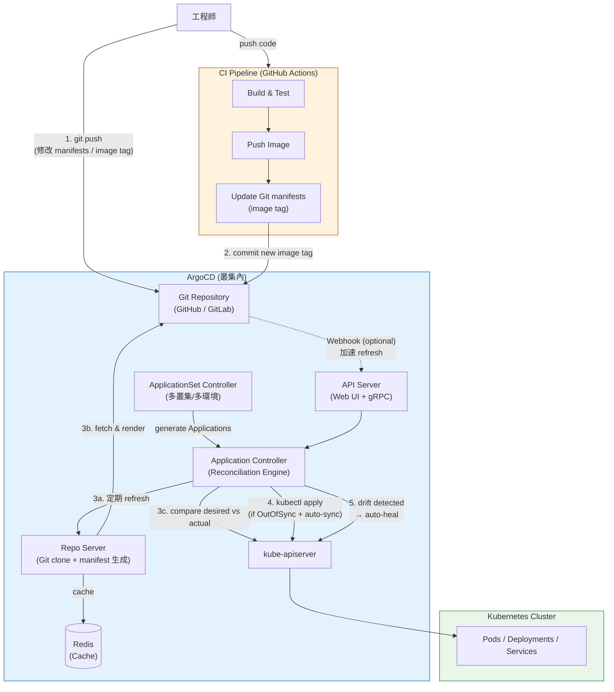
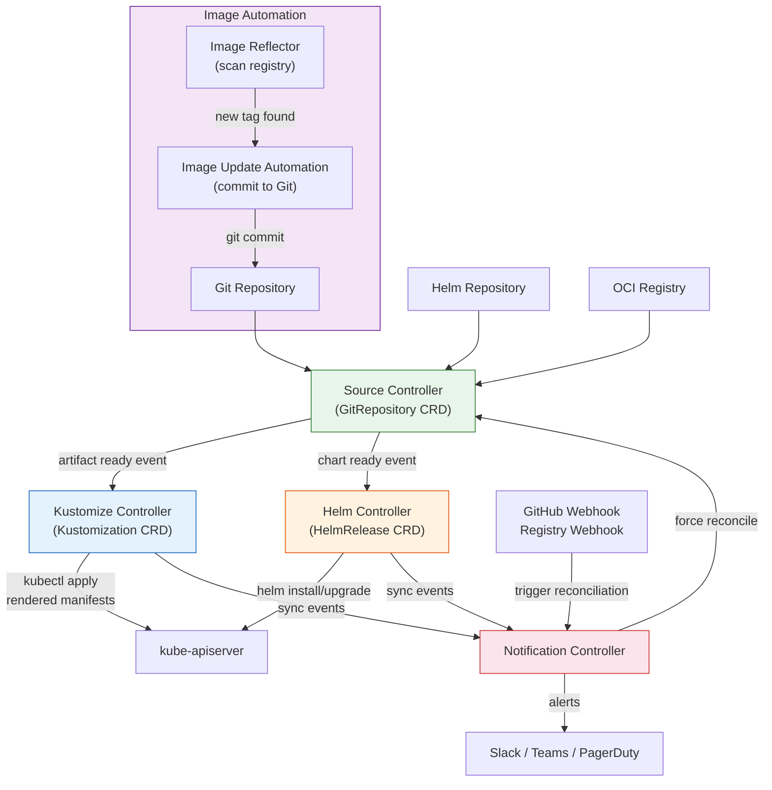
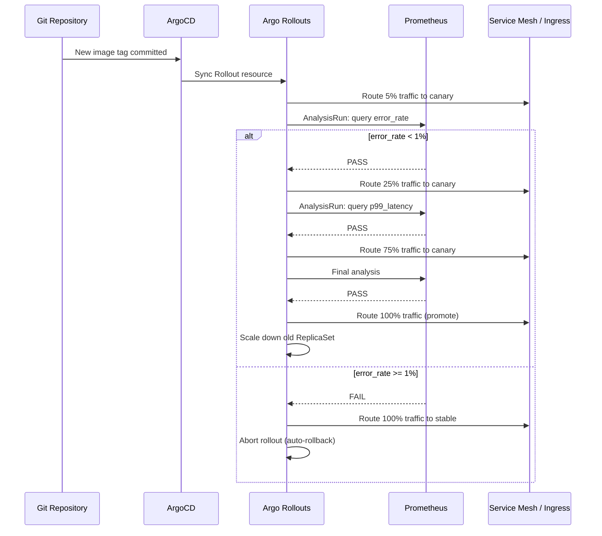

# GitOps / Git 即運維

## Intent / 意圖

GitOps 是一種以 Git 為唯一事實來源（Single Source of Truth）的運維模型——所有基礎設施和應用的期望狀態以聲明式配置存儲在 Git 倉庫中，由自動化的 reconciliation loop 持續將叢集的實際狀態調諧至 Git 中定義的期望狀態。核心理念：**Git commit 即是部署指令——任何環境變更都必須經過 Git commit → PR review → merge 流程，而非直接操作叢集；reconciliation agent 持續偵測 Git 與叢集之間的差異（drift），並自動修復偏差，實現自癒性（self-healing）**。

核心問題：**當團隊管理多個 Kubernetes 叢集、數百個微服務的部署時，如何確保每個環境的實際狀態與 Git 中定義的期望狀態完全一致？Push 模型與 Pull 模型的本質差異為何？ArgoCD 與 Flux CD 在架構設計上有何不同？如何在 GitOps 流程中安全處理 Secrets？如何跨多叢集管理部署？如何結合 Progressive Delivery 實現金絲雀部署與漸進式流量切換？**

---

## Problem / 問題情境

**場景一：kubectl apply 的維運混亂與組態漂移**

某團隊有 60 個微服務部署在 3 個 Kubernetes 叢集（dev/staging/prod）。部署方式：工程師在本機修改 YAML manifests，然後直接 `kubectl apply -f` 到目標叢集。半年後問題全面爆發：(1) production 的 payment-service 有一條 `HPA.maxReplicas=50` 的設定——三個月前為了應對黑色星期五臨時在 production 叢集中 `kubectl edit` 調高，但從未反映回 Git，下次部署時被覆蓋回 `maxReplicas=10`，流量高峰時服務 scale 不上去；(2) staging 與 production 的 ConfigMap 有 17 處不一致——因為不同工程師在不同時間對不同叢集做了臨時修改，沒有任何追蹤記錄；(3) 某工程師用自己筆電上的過時 YAML 做了 `kubectl apply`，意外將 production 的 Ingress 配置回滾到兩個月前的版本，導致 API 路由規則錯誤，影響客戶 45 分鐘；(4) 事後要回答「production 目前到底跑著什麼版本」這個問題，需要逐一 `kubectl get` 每個資源再與 Git 比對——沒有單一事實來源。

**場景二：CI/CD pipeline 直接推送部署的安全風險**

團隊使用傳統 CI/CD（GitHub Actions build → push image → kubectl apply）。CI pipeline 擁有 production Kubernetes 叢集的 `cluster-admin` 權限（存放在 GitHub Secrets）。某日，一個惡意的 PR 被合併——它在 CI script 中加入了 `kubectl exec` 指令，利用 CI 的 cluster-admin 權限讀取了 production 中所有 Secret（包含資料庫密碼、API key），並將資料 POST 到外部伺服器。根因：Push 模型要求 CI 系統持有叢集的寫入權限，而 CI 系統是外部系統（GitHub/GitLab 託管），攻擊面大。GitOps 的 Pull 模型中，是叢集內部的 agent（ArgoCD/Flux）主動從 Git 拉取配置——CI 只需要推送到 Git 的權限，永遠不需要持有叢集的存取權。

**場景三：多叢集部署版本不一致與回滾困難**

公司在三個 AWS region 各有一個 Kubernetes 叢集，部署由各 region 的 SRE 手動執行。某次部署新版 API gateway：US 叢集更新成功，EU 叢集在部署到一半時遇到 CrashLoopBackOff 而停止，APAC 叢集的 SRE 還在睡覺尚未開始部署。結果三個 region 跑著三個不同版本。回滾時 US 的 SRE 說「我不確定之前是什麼版本」——沒有 Git 記錄，只能從 `kubectl rollout history` 猜測。GitOps 模型中，Git 記錄了每個時間點的期望狀態，回滾即 `git revert`。

---

## Core Concepts / 核心概念

### GitOps Four Principles / GitOps 四大原則

GitOps 由 Weaveworks 於 2017 年提出，其核心是四大原則：

1. **聲明式（Declarative）**：整個系統的期望狀態必須以聲明式方式描述——Kubernetes YAML manifests、Helm charts、Kustomize overlays。不描述「如何做」，只描述「期望的最終狀態」。
2. **版本控制與不可變（Versioned and Immutable）**：期望狀態存儲在 Git 中，Git 提供完整的版本歷史、稽核軌跡（audit trail）和不可變性——每個 commit 代表一個不可變的系統狀態快照。
3. **自動拉取（Pulled Automatically）**：叢集中的 agent 持續從 Git 拉取期望狀態，偵測差異並自動套用。工程師不需要手動執行 `kubectl apply`——merge 到 main branch 即觸發部署。
4. **持續調諧/自癒（Continuously Reconciled / Self-healing）**：Agent 以 control loop 模式運行，持續比較實際狀態與期望狀態。任何偏差（drift）——無論是人為的 `kubectl edit` 還是系統故障——都會被自動修復回 Git 中定義的狀態。

### Push vs Pull Deployment Model / 推送 vs 拉取部署模型

**Push 模型（傳統 CI/CD）**：CI pipeline 在建置完成後，主動將變更推送到目標環境——`kubectl apply`、`helm upgrade`、`terraform apply`。CI 系統需要持有目標環境的寫入權限（kubeconfig、cloud credentials）。問題：(1) CI 系統成為高權限的攻擊面；(2) CI 不知道叢集的實際狀態——如果有人手動修改了叢集配置，CI 無法偵測；(3) CI 一次性推送後就不再關心——沒有持續的 reconciliation。

**Pull 模型（GitOps）**：叢集內部的 agent（ArgoCD / Flux）主動從 Git 拉取期望狀態，偵測差異後在叢集內部執行 `kubectl apply`。CI 只需要將新的 image tag 或配置更新推送到 Git——永遠不接觸叢集。優點：(1) CI 不需要叢集權限，攻擊面大幅縮小；(2) Agent 持續運行 reconciliation loop，偵測並修復 drift；(3) 回滾即 `git revert`——agent 會自動將叢集調諧到回滾後的狀態。

### ArgoCD

ArgoCD 是最廣泛使用的 Kubernetes GitOps 工具（CNCF graduated project）。它以 Kubernetes Application CRD 定義「哪個 Git repo 的哪個 path 部署到哪個叢集的哪個 namespace」。核心元件：

- **API Server**：提供 gRPC/REST API 和 Web UI，供使用者管理 Application、查看同步狀態、執行手動 sync 或 rollback。
- **Application Controller**：核心 reconciliation engine。持續監控每個 Application 的期望狀態（Git）與實際狀態（叢集），偵測差異（OutOfSync）並根據同步策略決定是否自動修復。
- **Repo Server**：負責從 Git 倉庫 clone/fetch 配置，並執行 manifest 生成——Helm template rendering、Kustomize build、plain YAML、Jsonnet 等。它是無狀態的，可水平擴展。
- **ApplicationSet Controller**：根據模板自動生成多個 Application——用於多叢集、多環境、monorepo 等場景。支援 generators（list、cluster、Git directory、matrix、merge）動態產生 Application。
- **Redis**：快取 Git repo 狀態和 manifest 渲染結果，減少 Repo Server 的負載。
- **Dex / OIDC**：整合企業身份認證（SSO），提供 RBAC 控制誰能同步哪個 Application。

### Flux CD

Flux CD（CNCF graduated project）是另一個主流的 GitOps 工具。與 ArgoCD 的「集中式控制器 + Web UI」不同，Flux 採用模組化的 controller 架構——每個 controller 負責一個關注點，透過 Kubernetes CRD 和 event 機制鬆耦合協作：

- **Source Controller**：管理「配置來源」——Git repositories、Helm chart repositories、OCI registries、S3 buckets。它負責定期拉取來源、偵測變更、產生 artifact。
- **Kustomize Controller**：監聽 Source Controller 的 artifact，將 Kustomize overlays 渲染為最終的 Kubernetes manifests 並 apply 到叢集。支援 health assessment（等待 rollout 完成）和依賴管理（先 apply namespace 再 apply deployment）。
- **Helm Controller**：監聽 Source Controller 的 Helm chart artifact，執行 `helm install/upgrade`。透過 `HelmRelease` CRD 定義 chart 的 values 和依賴。
- **Notification Controller**：雙向通知——(1) 接收外部 webhook（GitHub webhook、Container Registry webhook）觸發 reconciliation；(2) 將 Flux 事件（sync 成功/失敗）發送到外部系統（Slack、Teams、PagerDuty）。
- **Image Automation Controllers**：自動偵測 container registry 中的新 image tag，更新 Git repo 中的 manifest 並自動 commit/push。

### Reconciliation Loop / 調諧迴圈

Reconciliation loop 是 GitOps 的核心機制，借鑑自 Kubernetes 自身的 controller pattern：

```
while true {
    desired_state = fetch_from_git(repo, path, branch)
    actual_state  = fetch_from_cluster(namespace, resources)
    diff          = compute_diff(desired_state, actual_state)
    if diff.is_empty() {
        status = Synced
    } else {
        if auto_sync_enabled {
            apply(diff)
            status = Synced
        } else {
            status = OutOfSync
            notify(diff)
        }
    }
    sleep(reconciliation_interval)  // ArgoCD 預設 3 分鐘，Flux 預設 1 分鐘
}
```

ArgoCD 的 reconciliation 額外包含 **refresh**（從 Git 拉取最新 commit）和 **sync**（將差異 apply 到叢集）兩個階段。Flux 的 reconciliation 以 Kubernetes controller-runtime 的 event-driven 模型實現——Source Controller 偵測到 Git 新 commit 時發出 event，Kustomize/Helm Controller 收到 event 後觸發 reconciliation。

### Drift Detection & Auto-sync / 漂移偵測與自動同步

Drift（組態漂移）是實際叢集狀態偏離 Git 定義的期望狀態——通常因 `kubectl edit`、`kubectl patch`、Operator 自動修改、或 HPA 調整 replicas。GitOps agent 的 drift detection 有兩種處理策略：

- **自動修復（Auto-sync / Auto-prune）**：偵測到 drift 立刻將叢集狀態覆蓋回 Git 定義。ArgoCD 透過 `syncPolicy.automated` 配置，Flux 預設開啟。適合 production 環境——確保任何未經 Git 審核的變更都會被回滾。
- **通知但不修復**：偵測到 drift 發出告警，由人工決定如何處理。適合 drift 可能是合理的場景（如 HPA 調整 replicas）。

ArgoCD 的特殊機制：**Self-heal** 不僅偵測手動修改，還能偵測資源被意外刪除。啟用 `selfHeal: true` 後，如果有人 `kubectl delete` 了一個 GitOps 管理的 Deployment，ArgoCD 會在下一次 reconciliation 時自動重新建立它。**Auto-prune** 則處理反向情況——當 Git 中移除了一個資源定義，ArgoCD 自動從叢集中刪除對應的資源。

### Secrets Management in GitOps / GitOps 中的機密管理

GitOps 的核心原則是「所有配置存儲在 Git 中」，但 secrets 不能以明文存入 Git。三種主流解決方案：

1. **Sealed Secrets（Bitnami）**：在本機用 `kubeseal` CLI 將 Secret 加密為 `SealedSecret` CRD，加密後的 YAML 安全地提交到 Git。叢集中的 Sealed Secrets Controller 持有私鑰，自動解密並建立對應的 Kubernetes Secret。缺點：加密後的 SealedSecret 與特定叢集綁定（使用該叢集的公鑰加密），跨叢集需重新加密。
2. **Mozilla SOPS + age/PGP**：SOPS 加密 YAML/JSON 檔案中的 values（保留 keys 可讀），支援 age、PGP、AWS KMS、GCP KMS、Azure Key Vault 作為加密後端。Flux 原生支援 SOPS——Kustomize Controller 在 apply 前自動解密。ArgoCD 需要搭配 plugin（argocd-vault-plugin 或 KSOPS）。
3. **External Secrets Operator（ESO）**：不將 secret 存入 Git，而是在 Git 中存放 `ExternalSecret` CRD 定義，引用外部 secret store（AWS Secrets Manager、HashiCorp Vault、GCP Secret Manager）。ESO controller 在叢集內從外部 store 讀取 secret 值並自動建立 Kubernetes Secret。優點：secret 值完全不經過 Git，支援自動輪替。

### Multi-cluster Management / 多叢集管理

GitOps 天然適合多叢集管理——同一份 Git 配置可以部署到多個叢集：

- **ArgoCD ApplicationSet**：用 generators 動態產生 Application。例如 cluster generator 自動為 ArgoCD 中註冊的每個叢集建立一個 Application，Git directory generator 為 repo 中的每個子目錄建立一個 Application。支援 matrix generator 做叢集 x 應用的排列組合。
- **Flux multi-cluster**：每個叢集運行自己的 Flux instance，各自觀察同一個 Git repo 的不同路徑或分支。透過 Kustomize overlays 實現 base + per-cluster 覆蓋（不同的 replicas、resource limits、環境變數）。
- **Hub-spoke 模式**：一個管理叢集（hub）安裝 ArgoCD，透過 cluster credentials 遠端管理多個工作叢集（spoke）。Hub 叢集不跑業務負載，專職 GitOps 管理。

### Progressive Delivery / 漸進式交付

傳統的 Kubernetes rolling update 是全量式——所有 Pod 逐步更新到新版本，沒有流量比例控制。Progressive Delivery 透過 **Argo Rollouts** 或 **Flagger** 提供更精細的部署策略：

- **Canary Deployment（金絲雀部署）**：先將 5% 的流量導向新版本，觀察錯誤率和延遲指標。如果指標正常，逐步增加到 20% → 50% → 100%。任何階段指標異常自動回滾。
- **Blue-Green Deployment（藍綠部署）**：同時部署新舊兩個完整版本。新版本的所有 Pod 就緒後，一次性切換 100% 流量。回滾只需將流量切回舊版本。
- **Analysis**：Argo Rollouts 在每個步驟執行 `AnalysisRun`——從 Prometheus 查詢指標（如 `error_rate < 1%`、`p99_latency < 500ms`），自動決定 promote 或 rollback。

---

## Architecture / 架構

### ArgoCD 架構與 GitOps Reconciliation Flow



### Flux CD 模組化架構



### Progressive Delivery with Argo Rollouts



---

## How It Works / 運作原理

### 一、ArgoCD Reconciliation Loop 詳細流程

1. **Application 定義**：工程師建立 ArgoCD `Application` CRD，指定 source（Git repo URL + path + branch/tag）和 destination（叢集 + namespace）。Application Controller 開始監控此 Application。
2. **Refresh（定期拉取 Git）**：每 3 分鐘（可配置 `timeout.reconciliation`），Application Controller 請求 Repo Server 從 Git 拉取最新的 commit。Repo Server clone/fetch repo，根據配置執行 manifest 生成——`kustomize build`、`helm template`、plain YAML copy、或 Jsonnet evaluation。生成的最終 YAML manifests 被快取在 Redis。
3. **Compare（比較期望 vs 實際）**：Controller 從 Repo Server 取得期望狀態（Git manifests），同時從 Kubernetes API Server 讀取叢集中對應資源的實際狀態。執行三方合併差異計算（three-way diff）——比較 Git 定義、叢集實際狀態、以及上次同步時的狀態。忽略 Kubernetes 自動添加的欄位（如 `metadata.managedFields`、`status`）。
4. **狀態判定**：若無差異 → 標記為 `Synced`（綠色）。若有差異 → 標記為 `OutOfSync`（黃色）。若叢集中的資源不存在於 Git → 標記為 `Missing`。若 Git 中有資源但叢集中不存在 → 需要 create。
5. **Sync（同步到叢集）**：如果啟用了 `syncPolicy.automated`（auto-sync），Controller 自動執行 sync——按照 resource hook 順序（PreSync → Sync → PostSync）將差異 apply 到叢集。如果未啟用 auto-sync，Controller 只發出 OutOfSync 通知，等待人工在 Web UI 或 CLI 點擊 Sync。
6. **Health Assessment（健康評估）**：Sync 完成後，Controller 持續監控資源的健康狀態——Deployment 是否 rollout 完成、Pod 是否 Running、Service 是否有 endpoint。只有所有資源都健康（Healthy），Application 才標記為 `Healthy`。
7. **Self-heal（自癒）**：啟用 `selfHeal: true` 後，即使在兩次 refresh 之間，Controller 也會透過 Kubernetes watch 機制即時偵測資源變更。若有人 `kubectl edit` 修改了 GitOps 管理的資源，Controller 在秒級內偵測到 drift 並自動回復。
8. **Webhook 加速**：Git repo 配置 webhook → ArgoCD API Server。Git push 觸發 webhook，API Server 通知 Controller 立即執行 refresh，無需等待 3 分鐘的定期輪詢。

### 二、Flux CD Reconciliation 流程

1. **Source Controller** 根據 `GitRepository` CRD 的 `spec.interval`（如 1 分鐘）定期 `git fetch`。偵測到新 commit 時，clone repo 並打包為 tar.gz artifact，更新 `GitRepository` status 中的 artifact URL 和 revision。
2. **Kustomize Controller** 透過 Kubernetes watch 監聽 `GitRepository` 的 status 變更。收到新 artifact 後，下載、解壓、執行 `kustomize build`（或 SOPS 解密），然後以 server-side apply 將 manifests 套用到叢集。
3. **Health Check**：Kustomize Controller 在 apply 後監控資源健康狀態，等待所有 Deployment rollout 完成。若健康檢查失敗，標記 `Kustomization` status 為 `False`，Notification Controller 發出告警。
4. **依賴排序**：`Kustomization` 支援 `dependsOn` 欄位——先 apply 基礎元件（namespace、CRD、cert-manager），再 apply 依賴它們的應用。

### 三、GitOps Repository 結構設計

**Monorepo 策略**：應用程式碼和部署配置在同一個 repo。優點：變更原子性（code + config 在同一個 PR）。缺點：CI trigger 難以區分 code 變更 vs config 變更，且部署配置的 commit 歷史混入大量 code commit。

**雙 Repo 策略（推薦）**：應用程式碼在 `app-repo`，部署配置在 `gitops-repo`。CI pipeline 在 `app-repo` build 完成後，自動更新 `gitops-repo` 中的 image tag。GitOps agent 只監控 `gitops-repo`。優點：關注點分離——`gitops-repo` 的 Git 歷史完全是部署記錄，回滾即 `git revert` 最近的 image tag 更新 commit。

```
gitops-repo/
├── base/                      # 共用的 base manifests
│   ├── deployment.yaml
│   ├── service.yaml
│   ├── hpa.yaml
│   └── kustomization.yaml
├── overlays/
│   ├── dev/
│   │   ├── kustomization.yaml  # patches: replicas=1, resource limits 小
│   │   └── config.env
│   ├── staging/
│   │   ├── kustomization.yaml  # patches: replicas=2
│   │   └── config.env
│   └── prod/
│       ├── kustomization.yaml  # patches: replicas=5, resource limits 大
│       ├── config.env
│       └── sealed-secret.yaml  # 加密後的 secrets
└── clusters/
    ├── us-east/
    │   └── kustomization.yaml  # 引用 overlays/prod + region-specific patches
    ├── eu-west/
    │   └── kustomization.yaml
    └── ap-southeast/
        └── kustomization.yaml
```

### 四、GitOps vs 傳統 CI/CD 的差異

| 面向 | 傳統 CI/CD (Push) | GitOps (Pull) |
|------|-------------------|---------------|
| **部署觸發** | CI pipeline 主動 push 到叢集 | 叢集內 agent 主動 pull from Git |
| **叢集權限** | CI 需要 kubeconfig / cluster-admin | CI 只需 Git write 權限，agent 有叢集權限 |
| **事實來源** | CI pipeline 的最後一次執行 | Git repository（完整版本歷史） |
| **Drift Detection** | 無——推送後不再關心 | 持續 reconciliation，自動偵測並修復 |
| **回滾** | 重新執行舊版本的 pipeline 或 `kubectl rollout undo` | `git revert` → agent 自動 sync |
| **稽核** | 散落在 CI logs、kubectl history | Git commit history（who/when/what/why） |
| **安全性** | 外部系統持有叢集寫入權限 | 只有叢集內部 agent 有寫入權限 |

---

## Rust 實作

以 Rust 2024 edition + Axum 0.8 建構一個 ArgoCD Webhook Receiver——接收 ArgoCD 的 sync notification webhook，解析同步事件（sync succeeded / failed / running），根據狀態觸發不同的告警動作（Slack 通知、PagerDuty incident），並提供 `/health` 端點供 Kubernetes liveness probe 使用。

```rust
// argocd_webhook_receiver.rs
// ArgoCD Sync Event Webhook Receiver & Alert Dispatcher
// Cargo.toml:
//   [package]
//   name = "argocd-webhook-receiver"
//   version = "0.1.0"
//   edition = "2024"
//
//   [dependencies]
//   axum = "0.8"
//   tokio = { version = "1", features = ["full"] }
//   serde = { version = "1", features = ["derive"] }
//   serde_json = "1"
//   chrono = { version = "0.4", features = ["serde"] }

use axum::{
    Router,
    extract::State,
    http::StatusCode,
    response::IntoResponse,
    routing::{get, post},
};
use serde::{Deserialize, Serialize};
use std::collections::HashMap;
use std::sync::{Arc, Mutex};
use std::fmt;

// ─── ArgoCD Notification Webhook Payload 定義 ───

/// ArgoCD Application 同步狀態
#[derive(Debug, Clone, PartialEq, Eq, Deserialize, Serialize)]
#[serde(rename_all = "PascalCase")]
enum SyncStatus {
    Synced,
    OutOfSync,
    Unknown,
}

impl fmt::Display for SyncStatus {
    fn fmt(&self, f: &mut fmt::Formatter<'_>) -> fmt::Result {
        match self {
            SyncStatus::Synced => write!(f, "Synced"),
            SyncStatus::OutOfSync => write!(f, "OutOfSync"),
            SyncStatus::Unknown => write!(f, "Unknown"),
        }
    }
}

/// ArgoCD Application 健康狀態
#[derive(Debug, Clone, PartialEq, Eq, Deserialize, Serialize)]
#[serde(rename_all = "PascalCase")]
enum HealthStatus {
    Healthy,
    Progressing,
    Degraded,
    Suspended,
    Missing,
    Unknown,
}

impl fmt::Display for HealthStatus {
    fn fmt(&self, f: &mut fmt::Formatter<'_>) -> fmt::Result {
        match self {
            HealthStatus::Healthy     => write!(f, "Healthy"),
            HealthStatus::Progressing => write!(f, "Progressing"),
            HealthStatus::Degraded    => write!(f, "Degraded"),
            HealthStatus::Suspended   => write!(f, "Suspended"),
            HealthStatus::Missing     => write!(f, "Missing"),
            HealthStatus::Unknown     => write!(f, "Unknown"),
        }
    }
}

/// ArgoCD Sync 操作的階段
#[derive(Debug, Clone, PartialEq, Eq, Deserialize, Serialize)]
#[serde(rename_all = "PascalCase")]
enum SyncPhase {
    PreSync,
    Sync,
    PostSync,
    SyncFail,
}

/// ArgoCD notification payload（簡化版，涵蓋核心欄位）
#[derive(Debug, Clone, Deserialize)]
struct ArgoNotification {
    /// Application 名稱
    #[serde(alias = "app_name")]
    app_name: String,
    /// Application 所屬 project
    #[serde(alias = "app_project", default)]
    app_project: Option<String>,
    /// 目標叢集 URL
    #[serde(alias = "dest_server", default)]
    dest_server: Option<String>,
    /// 目標 namespace
    #[serde(alias = "dest_namespace", default)]
    dest_namespace: Option<String>,
    /// 同步狀態
    #[serde(alias = "sync_status", default)]
    sync_status: Option<SyncStatus>,
    /// 健康狀態
    #[serde(alias = "health_status", default)]
    health_status: Option<HealthStatus>,
    /// Sync 階段
    #[serde(alias = "sync_phase", default)]
    sync_phase: Option<SyncPhase>,
    /// Git commit SHA
    #[serde(alias = "revision", default)]
    revision: Option<String>,
    /// 通知訊息
    #[serde(alias = "message", default)]
    message: Option<String>,
    /// 時間戳記
    #[serde(alias = "timestamp", default)]
    timestamp: Option<String>,
}

// ─── Alert 系統 ───

/// 告警級別
#[derive(Debug, Clone, PartialEq, Eq, Serialize)]
enum AlertLevel {
    Info,
    Warning,
    Critical,
}

impl fmt::Display for AlertLevel {
    fn fmt(&self, f: &mut fmt::Formatter<'_>) -> fmt::Result {
        match self {
            AlertLevel::Info     => write!(f, "INFO"),
            AlertLevel::Warning  => write!(f, "WARNING"),
            AlertLevel::Critical => write!(f, "CRITICAL"),
        }
    }
}

/// 告警動作
#[derive(Debug, Clone, Serialize)]
struct Alert {
    level: AlertLevel,
    app_name: String,
    title: String,
    message: String,
    channels: Vec<String>,  // "slack", "pagerduty", "email"
}

impl fmt::Display for Alert {
    fn fmt(&self, f: &mut fmt::Formatter<'_>) -> fmt::Result {
        write!(
            f,
            "[{}] {} | {} | -> {:?}",
            self.level, self.app_name, self.title, self.channels
        )
    }
}

/// 根據 ArgoCD 事件判定告警級別和通道
fn classify_event(notif: &ArgoNotification) -> Alert {
    let app = &notif.app_name;
    let revision_short = notif.revision.as_deref()
        .map(|r| if r.len() > 7 { &r[..7] } else { r })
        .unwrap_or("unknown");

    // Sync 失敗 → Critical（觸發 PagerDuty + Slack）
    if notif.sync_phase == Some(SyncPhase::SyncFail) {
        return Alert {
            level: AlertLevel::Critical,
            app_name: app.clone(),
            title: format!("Sync FAILED for {}", app),
            message: format!(
                "Application '{}' sync failed at revision {}. {}",
                app, revision_short,
                notif.message.as_deref().unwrap_or("No details.")
            ),
            channels: vec!["slack".into(), "pagerduty".into()],
        };
    }

    // Health degraded → Critical
    if notif.health_status == Some(HealthStatus::Degraded) {
        return Alert {
            level: AlertLevel::Critical,
            app_name: app.clone(),
            title: format!("Health DEGRADED for {}", app),
            message: format!(
                "Application '{}' health is degraded (revision {}). Check pod status.",
                app, revision_short
            ),
            channels: vec!["slack".into(), "pagerduty".into()],
        };
    }

    // OutOfSync → Warning（僅 Slack）
    if notif.sync_status == Some(SyncStatus::OutOfSync) {
        return Alert {
            level: AlertLevel::Warning,
            app_name: app.clone(),
            title: format!("Drift detected for {}", app),
            message: format!(
                "Application '{}' is OutOfSync. Expected revision: {}. Drift may indicate manual cluster changes.",
                app, revision_short
            ),
            channels: vec!["slack".into()],
        };
    }

    // Sync 成功 + Healthy → Info
    if notif.sync_status == Some(SyncStatus::Synced)
        && notif.health_status == Some(HealthStatus::Healthy)
    {
        return Alert {
            level: AlertLevel::Info,
            app_name: app.clone(),
            title: format!("Sync succeeded for {}", app),
            message: format!(
                "Application '{}' successfully synced to revision {} and is healthy.",
                app, revision_short
            ),
            channels: vec!["slack".into()],
        };
    }

    // 其他（Progressing 等）→ Info
    Alert {
        level: AlertLevel::Info,
        app_name: app.clone(),
        title: format!("Status update for {}", app),
        message: format!(
            "Application '{}': sync={}, health={}, revision={}",
            app,
            notif.sync_status.as_ref().map(|s| s.to_string()).unwrap_or_default(),
            notif.health_status.as_ref().map(|h| h.to_string()).unwrap_or_default(),
            revision_short,
        ),
        channels: vec!["slack".into()],
    }
}

// ─── 應用程式狀態（追蹤最近的事件與告警統計）───

#[derive(Debug, Clone, Default, Serialize)]
struct AppState {
    total_events: u64,
    alerts_by_level: HashMap<String, u64>,
    recent_alerts: Vec<Alert>,
}

type SharedState = Arc<Mutex<AppState>>;

// ─── HTTP Handlers ───

/// POST /webhook/argocd — 接收 ArgoCD notification
async fn handle_argocd_webhook(
    State(state): State<SharedState>,
    axum::Json(payload): axum::Json<ArgoNotification>,
) -> impl IntoResponse {
    println!("Received ArgoCD notification for app: {}", payload.app_name);

    let alert = classify_event(&payload);
    println!("  Alert: {}", alert);

    // 模擬發送告警到各通道
    for channel in &alert.channels {
        println!("  -> Dispatching to {}: [{}] {}", channel, alert.level, alert.title);
    }

    // 更新狀態
    let mut app_state = state.lock().unwrap();
    app_state.total_events += 1;
    *app_state
        .alerts_by_level
        .entry(alert.level.to_string())
        .or_insert(0) += 1;
    app_state.recent_alerts.push(alert.clone());
    // 只保留最近 100 筆
    if app_state.recent_alerts.len() > 100 {
        app_state.recent_alerts.remove(0);
    }

    (StatusCode::OK, axum::Json(serde_json::json!({
        "status": "accepted",
        "alert_level": alert.level.to_string(),
        "alert_title": alert.title,
    })))
}

/// GET /health — Kubernetes liveness probe
async fn health() -> impl IntoResponse {
    (StatusCode::OK, axum::Json(serde_json::json!({
        "status": "healthy",
        "service": "argocd-webhook-receiver",
    })))
}

/// GET /metrics — 簡易指標端點
async fn metrics(State(state): State<SharedState>) -> impl IntoResponse {
    let app_state = state.lock().unwrap();
    (StatusCode::OK, axum::Json(serde_json::json!({
        "total_events": app_state.total_events,
        "alerts_by_level": app_state.alerts_by_level,
        "recent_count": app_state.recent_alerts.len(),
    })))
}

#[tokio::main]
async fn main() {
    let shared_state: SharedState = Arc::new(Mutex::new(AppState::default()));

    let app = Router::new()
        .route("/webhook/argocd", post(handle_argocd_webhook))
        .route("/health", get(health))
        .route("/metrics", get(metrics))
        .with_state(shared_state.clone());

    // 模擬接收幾個 ArgoCD notification events
    println!("=== ArgoCD Webhook Receiver (simulation) ===\n");

    let test_events = vec![
        ArgoNotification {
            app_name: "payment-service".into(),
            app_project: Some("production".into()),
            dest_server: Some("https://kubernetes.default.svc".into()),
            dest_namespace: Some("prod".into()),
            sync_status: Some(SyncStatus::Synced),
            health_status: Some(HealthStatus::Healthy),
            sync_phase: Some(SyncPhase::PostSync),
            revision: Some("a1b2c3d4e5f6789012345678".into()),
            message: Some("Successfully synced".into()),
            timestamp: Some("2026-02-18T10:30:00Z".into()),
        },
        ArgoNotification {
            app_name: "order-service".into(),
            app_project: Some("production".into()),
            dest_server: Some("https://kubernetes.default.svc".into()),
            dest_namespace: Some("prod".into()),
            sync_status: Some(SyncStatus::OutOfSync),
            health_status: Some(HealthStatus::Healthy),
            sync_phase: None,
            revision: Some("b2c3d4e5f67890abcdef1234".into()),
            message: Some("Manual kubectl edit detected".into()),
            timestamp: Some("2026-02-18T10:35:00Z".into()),
        },
        ArgoNotification {
            app_name: "inventory-service".into(),
            app_project: Some("production".into()),
            dest_server: Some("https://kubernetes.default.svc".into()),
            dest_namespace: Some("prod".into()),
            sync_status: Some(SyncStatus::OutOfSync),
            health_status: Some(HealthStatus::Degraded),
            sync_phase: Some(SyncPhase::SyncFail),
            revision: Some("c3d4e5f67890abcdef123456".into()),
            message: Some("CrashLoopBackOff: image pull failed".into()),
            timestamp: Some("2026-02-18T10:40:00Z".into()),
        },
    ];

    for event in &test_events {
        let alert = classify_event(event);
        println!("Event: app={}, sync={}, health={}",
            event.app_name,
            event.sync_status.as_ref().map(|s| s.to_string()).unwrap_or_default(),
            event.health_status.as_ref().map(|h| h.to_string()).unwrap_or_default(),
        );
        println!("  Alert: {}", alert);
        for ch in &alert.channels {
            println!("  -> Dispatch to {}", ch);
        }
        println!();
    }

    // 統計
    let mut state = shared_state.lock().unwrap();
    for event in &test_events {
        let alert = classify_event(event);
        state.total_events += 1;
        *state.alerts_by_level.entry(alert.level.to_string()).or_insert(0) += 1;
    }
    println!("--- Summary ---");
    println!("Total events: {}", state.total_events);
    println!("By level: {:?}", state.alerts_by_level);
    drop(state);

    println!("\nServer would listen on 0.0.0.0:8080");
    println!("  POST /webhook/argocd  — ArgoCD notification receiver");
    println!("  GET  /health          — Kubernetes liveness probe");
    println!("  GET  /metrics         — Alert statistics");

    // 在實際部署中，取消下方註解以啟動 HTTP server：
    // let listener = tokio::net::TcpListener::bind("0.0.0.0:8080").await.unwrap();
    // axum::serve(listener, app).await.unwrap();
}

// Output:
// === ArgoCD Webhook Receiver (simulation) ===
//
// Event: app=payment-service, sync=Synced, health=Healthy
//   Alert: [INFO] payment-service | Sync succeeded for payment-service | -> ["slack"]
//   -> Dispatch to slack
//
// Event: app=order-service, sync=OutOfSync, health=Healthy
//   Alert: [WARNING] order-service | Drift detected for order-service | -> ["slack"]
//   -> Dispatch to slack
//
// Event: app=inventory-service, sync=OutOfSync, health=Degraded
//   Alert: [CRITICAL] inventory-service | Sync FAILED for inventory-service | -> ["slack", "pagerduty"]
//   -> Dispatch to slack
//   -> Dispatch to pagerduty
//
// --- Summary ---
// Total events: 3
// By level: {"INFO": 1, "WARNING": 1, "CRITICAL": 1}
//
// Server would listen on 0.0.0.0:8080
//   POST /webhook/argocd  — ArgoCD notification receiver
//   GET  /health          — Kubernetes liveness probe
//   GET  /metrics         — Alert statistics
```

**重點說明：**
- Axum 0.8 的 `Router::with_state()` 搭配 `Arc<Mutex<T>>` 管理共享狀態，每個 request handler 透過 `State` extractor 取得。
- `#[serde(alias)]` 處理 ArgoCD notification 中欄位名稱可能不同的情況（camelCase vs snake_case）。
- `classify_event()` 以 pattern matching 將 ArgoCD 事件分類為告警級別——SyncFail 和 Degraded 觸發 PagerDuty，OutOfSync 只發 Slack，Synced+Healthy 為 Info 通知。
- 所有 `Option<T>` 欄位搭配 `#[serde(default)]` 確保遺漏欄位不會導致反序列化失敗——ArgoCD 不同版本的 webhook payload 欄位可能不同。

---

## Go 實作

以 Go 1.24+ 標準函式庫（`net/http`、`encoding/json`）建構等效的 ArgoCD Webhook Receiver——接收 sync notification、分類告警級別、模擬分發到不同通道。

```go
// argocd_webhook_receiver.go
// ArgoCD Sync Event Webhook Receiver & Alert Dispatcher
// Go 1.24+ stdlib only
package main

import (
	"encoding/json"
	"fmt"
	"net/http"
	"strings"
	"sync"
	"time"
)

// ─── ArgoCD Notification Payload ───

type SyncStatus string

const (
	SyncStatusSynced    SyncStatus = "Synced"
	SyncStatusOutOfSync SyncStatus = "OutOfSync"
	SyncStatusUnknown   SyncStatus = "Unknown"
)

type HealthStatus string

const (
	HealthHealthy     HealthStatus = "Healthy"
	HealthProgressing HealthStatus = "Progressing"
	HealthDegraded    HealthStatus = "Degraded"
	HealthSuspended   HealthStatus = "Suspended"
	HealthMissing     HealthStatus = "Missing"
	HealthUnknown     HealthStatus = "Unknown"
)

type SyncPhase string

const (
	PhasePreSync  SyncPhase = "PreSync"
	PhaseSync     SyncPhase = "Sync"
	PhasePostSync SyncPhase = "PostSync"
	PhaseSyncFail SyncPhase = "SyncFail"
)

// ArgoNotification represents an ArgoCD webhook notification payload.
type ArgoNotification struct {
	AppName       string       `json:"app_name"`
	AppProject    string       `json:"app_project,omitempty"`
	DestServer    string       `json:"dest_server,omitempty"`
	DestNamespace string       `json:"dest_namespace,omitempty"`
	SyncStatus    SyncStatus   `json:"sync_status,omitempty"`
	HealthStatus  HealthStatus `json:"health_status,omitempty"`
	SyncPhase     SyncPhase    `json:"sync_phase,omitempty"`
	Revision      string       `json:"revision,omitempty"`
	Message       string       `json:"message,omitempty"`
	Timestamp     string       `json:"timestamp,omitempty"`
}

// ─── Alert System ───

type AlertLevel string

const (
	AlertInfo     AlertLevel = "INFO"
	AlertWarning  AlertLevel = "WARNING"
	AlertCritical AlertLevel = "CRITICAL"
)

// Alert represents a classified notification with dispatch channels.
type Alert struct {
	Level    AlertLevel `json:"level"`
	AppName  string     `json:"app_name"`
	Title    string     `json:"title"`
	Message  string     `json:"message"`
	Channels []string   `json:"channels"`
}

func (a Alert) String() string {
	return fmt.Sprintf("[%s] %s | %s | -> %v", a.Level, a.AppName, a.Title, a.Channels)
}

// shortRevision returns first 7 chars of the Git revision.
func shortRevision(rev string) string {
	if len(rev) > 7 {
		return rev[:7]
	}
	if rev == "" {
		return "unknown"
	}
	return rev
}

// classifyEvent determines alert level and dispatch channels based on ArgoCD event.
func classifyEvent(n ArgoNotification) Alert {
	rev := shortRevision(n.Revision)

	// Sync failed → Critical (PagerDuty + Slack)
	if n.SyncPhase == PhaseSyncFail {
		msg := n.Message
		if msg == "" {
			msg = "No details."
		}
		return Alert{
			Level:   AlertCritical,
			AppName: n.AppName,
			Title:   fmt.Sprintf("Sync FAILED for %s", n.AppName),
			Message: fmt.Sprintf("Application '%s' sync failed at revision %s. %s",
				n.AppName, rev, msg),
			Channels: []string{"slack", "pagerduty"},
		}
	}

	// Health degraded → Critical
	if n.HealthStatus == HealthDegraded {
		return Alert{
			Level:   AlertCritical,
			AppName: n.AppName,
			Title:   fmt.Sprintf("Health DEGRADED for %s", n.AppName),
			Message: fmt.Sprintf("Application '%s' health is degraded (revision %s). Check pod status.",
				n.AppName, rev),
			Channels: []string{"slack", "pagerduty"},
		}
	}

	// OutOfSync → Warning (Slack only)
	if n.SyncStatus == SyncStatusOutOfSync {
		return Alert{
			Level:   AlertWarning,
			AppName: n.AppName,
			Title:   fmt.Sprintf("Drift detected for %s", n.AppName),
			Message: fmt.Sprintf("Application '%s' is OutOfSync. Expected revision: %s. "+
				"Drift may indicate manual cluster changes.", n.AppName, rev),
			Channels: []string{"slack"},
		}
	}

	// Synced + Healthy → Info
	if n.SyncStatus == SyncStatusSynced && n.HealthStatus == HealthHealthy {
		return Alert{
			Level:   AlertInfo,
			AppName: n.AppName,
			Title:   fmt.Sprintf("Sync succeeded for %s", n.AppName),
			Message: fmt.Sprintf("Application '%s' successfully synced to revision %s and is healthy.",
				n.AppName, rev),
			Channels: []string{"slack"},
		}
	}

	// Default → Info
	return Alert{
		Level:   AlertInfo,
		AppName: n.AppName,
		Title:   fmt.Sprintf("Status update for %s", n.AppName),
		Message: fmt.Sprintf("Application '%s': sync=%s, health=%s, revision=%s",
			n.AppName, n.SyncStatus, n.HealthStatus, rev),
		Channels: []string{"slack"},
	}
}

// ─── Application State ───

type AppState struct {
	mu            sync.Mutex
	TotalEvents   int64            `json:"total_events"`
	AlertsByLevel map[string]int64 `json:"alerts_by_level"`
	RecentAlerts  []Alert          `json:"recent_alerts"`
}

func NewAppState() *AppState {
	return &AppState{
		AlertsByLevel: make(map[string]int64),
		RecentAlerts:  make([]Alert, 0, 100),
	}
}

func (s *AppState) RecordAlert(a Alert) {
	s.mu.Lock()
	defer s.mu.Unlock()
	s.TotalEvents++
	s.AlertsByLevel[string(a.Level)]++
	s.RecentAlerts = append(s.RecentAlerts, a)
	if len(s.RecentAlerts) > 100 {
		s.RecentAlerts = s.RecentAlerts[1:]
	}
}

// ─── HTTP Handlers ───

func webhookHandler(state *AppState) http.HandlerFunc {
	return func(w http.ResponseWriter, r *http.Request) {
		if r.Method != http.MethodPost {
			http.Error(w, "method not allowed", http.StatusMethodNotAllowed)
			return
		}
		var notif ArgoNotification
		if err := json.NewDecoder(r.Body).Decode(&notif); err != nil {
			http.Error(w, "invalid JSON: "+err.Error(), http.StatusBadRequest)
			return
		}

		alert := classifyEvent(notif)
		fmt.Printf("Received: %s\n", alert)
		for _, ch := range alert.Channels {
			fmt.Printf("  -> Dispatching to %s: [%s] %s\n", ch, alert.Level, alert.Title)
		}

		state.RecordAlert(alert)

		w.Header().Set("Content-Type", "application/json")
		json.NewEncoder(w).Encode(map[string]string{
			"status":      "accepted",
			"alert_level": string(alert.Level),
			"alert_title": alert.Title,
		})
	}
}

func healthHandler(w http.ResponseWriter, r *http.Request) {
	w.Header().Set("Content-Type", "application/json")
	json.NewEncoder(w).Encode(map[string]string{
		"status":  "healthy",
		"service": "argocd-webhook-receiver",
		"time":    time.Now().UTC().Format(time.RFC3339),
	})
}

func metricsHandler(state *AppState) http.HandlerFunc {
	return func(w http.ResponseWriter, r *http.Request) {
		state.mu.Lock()
		defer state.mu.Unlock()
		w.Header().Set("Content-Type", "application/json")
		json.NewEncoder(w).Encode(map[string]any{
			"total_events":    state.TotalEvents,
			"alerts_by_level": state.AlertsByLevel,
			"recent_count":    len(state.RecentAlerts),
		})
	}
}

func main() {
	state := NewAppState()

	// 模擬接收 ArgoCD notification events
	fmt.Println("=== ArgoCD Webhook Receiver (simulation) ===")
	fmt.Println()

	testEvents := []ArgoNotification{
		{
			AppName: "payment-service", AppProject: "production",
			DestServer: "https://kubernetes.default.svc", DestNamespace: "prod",
			SyncStatus: SyncStatusSynced, HealthStatus: HealthHealthy,
			SyncPhase: PhasePostSync, Revision: "a1b2c3d4e5f6789012345678",
			Message: "Successfully synced", Timestamp: "2026-02-18T10:30:00Z",
		},
		{
			AppName: "order-service", AppProject: "production",
			DestServer: "https://kubernetes.default.svc", DestNamespace: "prod",
			SyncStatus: SyncStatusOutOfSync, HealthStatus: HealthHealthy,
			Revision: "b2c3d4e5f67890abcdef1234",
			Message: "Manual kubectl edit detected", Timestamp: "2026-02-18T10:35:00Z",
		},
		{
			AppName: "inventory-service", AppProject: "production",
			DestServer: "https://kubernetes.default.svc", DestNamespace: "prod",
			SyncStatus: SyncStatusOutOfSync, HealthStatus: HealthDegraded,
			SyncPhase: PhaseSyncFail, Revision: "c3d4e5f67890abcdef123456",
			Message: "CrashLoopBackOff: image pull failed", Timestamp: "2026-02-18T10:40:00Z",
		},
	}

	for _, event := range testEvents {
		alert := classifyEvent(event)
		fmt.Printf("Event: app=%s, sync=%s, health=%s\n",
			event.AppName, event.SyncStatus, event.HealthStatus)
		fmt.Printf("  Alert: %s\n", alert)
		for _, ch := range alert.Channels {
			fmt.Printf("  -> Dispatch to %s\n", ch)
		}
		fmt.Println()
		state.RecordAlert(alert)
	}

	fmt.Println("--- Summary ---")
	fmt.Printf("Total events: %d\n", state.TotalEvents)
	levels := []string{"INFO", "WARNING", "CRITICAL"}
	parts := make([]string, 0, len(levels))
	for _, l := range levels {
		if cnt, ok := state.AlertsByLevel[l]; ok {
			parts = append(parts, fmt.Sprintf("%s: %d", l, cnt))
		}
	}
	fmt.Printf("By level: {%s}\n", strings.Join(parts, ", "))

	fmt.Println()
	fmt.Println("Server would listen on :8080")
	fmt.Println("  POST /webhook/argocd  — ArgoCD notification receiver")
	fmt.Println("  GET  /health          — Kubernetes liveness probe")
	fmt.Println("  GET  /metrics         — Alert statistics")

	// 在實際部署中，取消下方註解以啟動 HTTP server：
	// mux := http.NewServeMux()
	// mux.HandleFunc("POST /webhook/argocd", webhookHandler(state))
	// mux.HandleFunc("GET /health", healthHandler)
	// mux.HandleFunc("GET /metrics", metricsHandler(state))
	// fmt.Println("Listening on :8080")
	// http.ListenAndServe(":8080", mux)
}

// Output:
// === ArgoCD Webhook Receiver (simulation) ===
//
// Event: app=payment-service, sync=Synced, health=Healthy
//   Alert: [INFO] payment-service | Sync succeeded for payment-service | -> [slack]
//   -> Dispatch to slack
//
// Event: app=order-service, sync=OutOfSync, health=Healthy
//   Alert: [WARNING] order-service | Drift detected for order-service | -> [slack]
//   -> Dispatch to slack
//
// Event: app=inventory-service, sync=OutOfSync, health=Degraded
//   Alert: [CRITICAL] inventory-service | Sync FAILED for inventory-service | -> [slack pagerduty]
//   -> Dispatch to slack
//   -> Dispatch to pagerduty
//
// --- Summary ---
// Total events: 3
// By level: {INFO: 1, WARNING: 1, CRITICAL: 1}
//
// Server would listen on :8080
//   POST /webhook/argocd  — ArgoCD notification receiver
//   GET  /health          — Kubernetes liveness probe
//   GET  /metrics         — Alert statistics
```

**重點說明：**
- Go 1.24 的 `http.NewServeMux` 支援 method-based routing（`"POST /webhook/argocd"`），不需要第三方 router。
- `sync.Mutex` 保護共享狀態——Go 的 mutex 模型比 Rust 的 `Mutex<T>` 更靈活但也更容易誤用（忘記 lock/unlock）。
- `json.NewDecoder(r.Body).Decode()` 串流式解析 JSON——比 `io.ReadAll` + `json.Unmarshal` 更節省記憶體。
- 型別定義使用 `type SyncStatus string` 搭配 `const`——Go 沒有 enum，用 string 常數模擬。

---

## Rust vs Go 對照表

| 面向 | Rust (Axum 0.8 + serde) | Go (stdlib net/http) |
|------|--------------------------|----------------------|
| **Enum 與狀態建模** | Rust enum（`SyncStatus`、`HealthStatus`）在編譯期保證窮舉匹配——`match` 不處理所有 variant 即編譯失敗。`#[serde(rename_all)]` 自動處理序列化命名慣例。型別安全使得不可能建立一個無效的 `SyncPhase` 值 | Go 用 `type SyncStatus string` + `const` 模擬 enum，但型別系統不阻止任意 string 賦值——`var s SyncStatus = "InvalidValue"` 合法且編譯通過。需要手動撰寫 validation 函式 |
| **共享狀態與並行安全** | `Arc<Mutex<AppState>>` 由型別系統在編譯期保證——不取得 lock 就無法存取 `AppState` 的欄位，忘記 lock 是編譯錯誤而非 runtime bug。但 `Mutex` poisoning（panic 時 lock 被 poison）需要額外處理 | `sync.Mutex` + 手動 `Lock()`/`Unlock()` 或 `defer Unlock()`。Go 不阻止在未 lock 狀態下存取欄位——這是 runtime 的 data race，只能靠 `-race` flag 偵測。更靈活但更容易出錯 |
| **HTTP 框架成熟度** | Axum 0.8 基於 `tower` 生態系，type-safe extractors（`State`、`Json`）、middleware 組合力強。但 Rust async 生態的 lifetime 和 trait bound 錯誤訊息常令新手困惑 | Go 1.24 stdlib 的 `net/http` 即可滿足大部分 HTTP server 需求，method-based routing 是新加入的功能。生態系成熟、文件豐富、錯誤訊息友善 |
| **JSON 處理** | `serde` 在編譯期生成零開銷的序列化/反序列化程式碼。`#[serde(alias)]`、`#[serde(default)]` 等 attribute 優雅處理不一致的 payload。遺漏的必填欄位是 `Result::Err`，不是靜默的零值 | `encoding/json` 使用 reflection 在 runtime 處理。遺漏的 JSON 欄位靜默初始化為零值（`""` / `0` / `false`），不回傳錯誤——可能導致隱性 bug |

---

## When to Use / 適用場景

### 1. 多叢集、多環境的 Kubernetes 部署管理

當團隊管理 3 個以上的 Kubernetes 叢集（dev/staging/prod 跨 region），且需要確保所有叢集的配置一致、變更可追溯、回滾可靠時，GitOps 是最佳實踐。ArgoCD ApplicationSet 或 Flux multi-cluster 模式可以從單一 Git repo 管理所有叢集的部署。Kustomize overlays 提供 base + per-environment 的配置管理。Git commit history 成為完整的部署稽核日誌——誰在什麼時間將什麼版本部署到哪個環境。

### 2. 合規性要求嚴格的環境

金融、醫療、政府等受監管行業要求所有基礎設施和應用變更可稽核、可追溯、經過審核。GitOps 天然提供這些保證：所有變更經過 PR review（四眼原則）、Git log 記錄完整的 who/when/what/why、自動 drift detection 確保實際狀態不偏離核准的配置。搭配 branch protection rules 和 CODEOWNERS，可以實現「production 部署必須經過 SRE 團隊 approve」的流程控制。

### 3. 需要自癒能力的 production 環境

Production 環境中的 drift 可能造成嚴重問題——手動修改的 HPA maxReplicas 在下次部署時被覆蓋、臨時的 ConfigMap 修改未反映回 Git 造成環境不一致。GitOps 的 self-healing 確保任何未經 Git 審核的變更在分鐘級內被自動回滾。

---

## When NOT to Use / 不適用場景

### 1. 非 Kubernetes 的基礎設施管理

GitOps 工具（ArgoCD、Flux）專為 Kubernetes 設計——它們理解 Kubernetes resource model、使用 kube-apiserver 作為介面、透過 CRD 擴展。如果基礎設施主要是 VM、雲端服務（RDS、S3、Lambda）而非 Kubernetes，Terraform/Pulumi + 傳統 CI/CD 更適合。雖然有 Crossplane 和 AWS Controllers for Kubernetes（ACK）將雲端資源抽象為 K8s CRD，但成熟度和 provider 覆蓋率仍不如 Terraform。

### 2. 快速迭代的早期原型階段

在 MVP 或 PoC 階段，只有 1-2 個服務部署在單一叢集，設定 ArgoCD/Flux + Git repo 結構 + Kustomize overlays + Sealed Secrets 的初始成本可能大於收益。直接 `kubectl apply` 或簡單的 CI/CD pipeline push 模型足夠。但隨著服務數量增長到 5 個以上、或開始有多環境需求時，應及早引入 GitOps——越晚遷移成本越高。

### 3. 高頻率的自動化配置變更

某些場景下，配置需要被非人類 actor 高頻率地自動修改——例如 HPA 每秒調整 replicas、Cluster Autoscaler 動態添加/移除節點、Operator 自動修改 CRD status。這些變更不應被 GitOps 管理（否則 agent 會持續偵測到 drift 並嘗試回滾）。正確做法：將這些動態欄位從 GitOps 管理中排除——ArgoCD 的 `ignoreDifferences` 設定忽略特定欄位（如 `spec.replicas`），讓 HPA 和 GitOps 共存。

---

## Real-World Examples / 真實世界案例

### Intuit (TurboTax) — ArgoCD at Scale

Intuit（美國最大的消費者報稅軟體公司，TurboTax 母公司）是 ArgoCD 的最早期採用者和主要貢獻者。他們的 GitOps 實踐：

1. **規模**：管理 100+ Kubernetes 叢集、數千個微服務的部署。每個叢集運行自己的 ArgoCD instance（而非集中式 hub），避免單點故障和 API Server 過載。
2. **ApplicationSet + Generators**：用 cluster generator 自動為每個新建叢集建立基礎元件（cert-manager、istio、monitoring stack）的 Application。開發團隊透過 Git directory generator 管理自己的服務——在 repo 中新增一個目錄即自動部署到所有目標叢集。
3. **Progressive Delivery**：深度整合 Argo Rollouts，所有 production 部署採用 canary 策略。AnalysisRun 從 Prometheus 和 Datadog 查詢 error rate、latency、business metric（如報稅成功率），自動 promote 或 rollback。每年報稅季（1-4 月）流量暴增 100 倍，canary 部署確保新版本不會在高峰期引入問題。
4. **Secrets**：使用 External Secrets Operator 整合 AWS Secrets Manager。Git repo 中只有 `ExternalSecret` CRD 的定義，secret 值由 ESO 在叢集內從 AWS SM 讀取。
5. **回滾**：2024 年報稅季期間，某次部署的新版本在 canary 階段偵測到 p99 latency 從 200ms 升至 1.2s，Argo Rollouts 自動回滾。同時，SRE 在 Git repo 中 `git revert` 了該 commit，確保後續的 reconciliation 不會再嘗試部署問題版本。整個過程從偵測到修復不到 5 分鐘，零人為介入。

---

## Interview Questions / 面試常見問題

### Q1: 什麼是 GitOps？它與傳統 CI/CD 有什麼不同？

GitOps 以 Git 為唯一事實來源，所有基礎設施和應用的期望狀態以聲明式配置存儲在 Git 中。與傳統 CI/CD 的核心差異在於部署方向——傳統 CI/CD 是 push 模型（CI pipeline 主動 push 到叢集），GitOps 是 pull 模型（叢集內的 agent 主動 pull from Git）。Pull 模型的優點：CI 不需要叢集寫入權限（降低攻擊面）、agent 持續 reconciliation 偵測 drift（傳統 CI/CD push 一次就不再關心）、回滾是 `git revert`（而非重新執行 pipeline）。GitOps 的四大原則：聲明式、版本控制、自動拉取、持續調諧/自癒。

### Q2: ArgoCD 與 Flux CD 的架構差異？如何選擇？

ArgoCD 採用集中式架構——API Server 提供 Web UI 和 gRPC API、Application Controller 執行 reconciliation、Repo Server 處理 Git fetch 和 manifest 生成。優點：強大的 Web UI（視覺化依賴圖、diff、rollback）、ApplicationSet 簡化多叢集管理。Flux 採用模組化 controller 架構——Source Controller、Kustomize Controller、Helm Controller 各司其職，透過 CRD 和 event 鬆耦合。優點：輕量、Kubernetes-native（完全用 CRD 管理，無額外 UI 伺服器）、原生支援 SOPS secrets。選 ArgoCD 若團隊需要 Web UI、視覺化管理和較低的學習曲線。選 Flux 若偏好 CLI-first、Kubernetes-native 的方式且想要更輕量的 footprint。

### Q3: GitOps 如何安全地管理 Secrets？

三種主流做法：(1) Sealed Secrets——`kubeseal` 用叢集的公鑰加密 Secret 為 `SealedSecret` CRD，加密後的 YAML 安全地提交到 Git，叢集中的 controller 自動解密。缺點：與特定叢集綁定。(2) SOPS + KMS——Mozilla SOPS 加密 YAML 中的 values（keys 保持可讀），用 AWS KMS/GCP KMS/age 作為加密後端。Flux 原生支援 SOPS 解密。(3) External Secrets Operator——Git 中只存放 `ExternalSecret` CRD 引用（如 AWS Secrets Manager 的 secret ARN），ESO controller 在叢集內從外部 store 讀取 secret 值並建立 K8s Secret。推薦 ESO，因為 secret 值完全不經過 Git 且支援自動輪替。

### Q4: 如何處理 GitOps 與 HPA 的衝突？

HPA 動態調整 `spec.replicas`，但 GitOps agent 偵測到 replicas 偏離 Git 定義時會嘗試回滾——形成「HPA scale up → ArgoCD revert → HPA scale up」的循環。解決方案：(1) ArgoCD 的 `ignoreDifferences` 設定忽略 `spec.replicas` 欄位——讓 HPA 全權管理副本數；(2) 從 Git manifests 中移除 `spec.replicas` 欄位，完全由 HPA 控制；(3) Flux 的 Kustomization 支援 `patches` 在 apply 前移除特定欄位。核心原則：將「人為決定的配置」交給 GitOps 管理，將「系統自動調整的欄位」排除在 GitOps 之外。

### Q5: 描述 GitOps 的 reconciliation loop 及其效能考量。

Reconciliation loop：agent 定期（ArgoCD 預設 3 分鐘、Flux 預設依 CRD interval）從 Git fetch 最新 commit → 渲染 manifests（Kustomize/Helm）→ 與叢集實際狀態做 three-way diff → 有差異則 sync（auto-sync）或通知（manual sync）。效能考量：(1) Git fetch 頻率——過高增加 Git server 負載，搭配 webhook 可以降低輪詢頻率；(2) Manifest 渲染——Helm template 在大量 chart 時消耗 CPU，ArgoCD Repo Server 可水平擴展並使用 Redis cache；(3) 大量 Application 的 controller 記憶體——每個 Application 的狀態在記憶體中維護，數千個 Application 時需要調整 controller 的 resource limits；(4) API Server 壓力——大量 kubectl apply 和 watch 增加 kube-apiserver 負載，可以透過分片（ArgoCD sharding）分散壓力。

---

## Pitfalls / 常見陷阱

### 1. Git Repo 結構設計不當導致維護噩夢

將所有環境（dev/staging/prod）和所有服務的 manifests 放在同一個扁平目錄中，沒有使用 Kustomize overlays 或 Helm values 區分環境。結果：(1) 修改 base 配置時不知道會影響哪些環境；(2) 環境間的差異分散在數十個檔案中難以追蹤；(3) 工程師在 prod overlay 中做了應該在 base 中做的修改，其他環境沒有同步。**解法：**採用 base + overlays 結構，base 包含環境無關的配置，overlays 只覆蓋環境特定的欄位（replicas、resource limits、image tag）。

### 2. Auto-sync 未搭配 Auto-prune 導致殭屍資源

開啟 ArgoCD auto-sync 但未開啟 auto-prune。當工程師從 Git 中移除一個不再需要的 Deployment 定義時，ArgoCD 偵測到該資源在 Git 中不存在，但不會自動從叢集中刪除它。結果：叢集中堆積大量孤兒資源（orphaned resources），消耗 CPU/記憶體、佔用 Service Mesh sidecar 資源、可能造成安全漏洞（過時的映像有未修補的 CVE）。**解法：**同時啟用 `syncPolicy.automated.selfHeal: true` 和 `syncPolicy.automated.prune: true`。初次啟用 prune 前，先以 `--dry-run` 確認會刪除哪些資源。

### 3. Rust 陷阱：Axum extractor 順序與 payload 消費

在 Axum 0.8 中，`Json<T>` extractor 會消費（consume）request body。如果在同一個 handler 中先使用 `String` extractor 讀取 raw body 做 HMAC 驗證，再使用 `Json<T>` 解析 payload，第二次讀取會失敗（body 已被消費）。

```rust
// 錯誤寫法：body 被 String extractor 消費後，Json 讀取到空 body
async fn handle_webhook(
    raw_body: String,                          // 消費了 body
    axum::Json(payload): axum::Json<ArgoNotification>,  // body 已空！反序列化失敗
) -> impl IntoResponse {
    verify_hmac(&raw_body, "secret")?;
    process(payload);
    StatusCode::OK
}

// 正確寫法：使用 Bytes extractor 讀取一次，手動反序列化
use axum::body::Bytes;

async fn handle_webhook(body: Bytes) -> impl IntoResponse {
    // 先用 raw bytes 做 HMAC 驗證
    // verify_hmac(&body, "secret")?;

    // 再手動反序列化
    let payload: ArgoNotification = serde_json::from_slice(&body)
        .map_err(|e| (StatusCode::BAD_REQUEST, e.to_string()))?;

    let alert = classify_event(&payload);
    println!("Alert: {}", alert);

    Ok::<_, (StatusCode, String)>(
        (StatusCode::OK, axum::Json(serde_json::json!({"status": "ok"})))
    )
}
```

### 4. Go 陷阱：JSON 零值與遺漏欄位混淆

Go 的 `encoding/json` 對遺漏的 JSON 欄位靜默初始化為零值——空字串 `""`、數字 `0`、布林 `false`。這在 ArgoCD webhook payload 中特別危險：遺漏的 `health_status` 欄位會被初始化為空字串 `""`，在 `classifyEvent` 中不會匹配任何 `const`，導致事件被錯誤分類為 Info 而非觸發告警。

```go
// 危險寫法：無法區分「JSON 中 health_status 為空字串」和「JSON 中沒有 health_status 欄位」
type ArgoNotification struct {
    HealthStatus HealthStatus `json:"health_status"`
    // HealthStatus 遺漏時 = ""，不會匹配 HealthDegraded 常數
    // 結果：Degraded 事件被靜默忽略！
}

// 安全寫法：用 pointer 區分「不存在」和「空值」
type ArgoNotificationSafe struct {
    HealthStatus *HealthStatus `json:"health_status,omitempty"`
}

func classifyEventSafe(n ArgoNotificationSafe) Alert {
    // 明確檢查 nil（欄位不存在）vs 空值
    if n.HealthStatus != nil && *n.HealthStatus == HealthDegraded {
        // 確實是 Degraded
        return Alert{Level: AlertCritical, Title: "Health DEGRADED"}
    }
    if n.HealthStatus == nil {
        // 欄位不存在——不應假設 healthy
        return Alert{Level: AlertWarning, Title: "Unknown health status"}
    }
    return Alert{Level: AlertInfo, Title: "Status update"}
}
```

### 5. Secrets 洩漏：加密的 Secret 被以明文形式 log

團隊使用 Sealed Secrets 加密了所有 Secret 並安全地提交到 Git。但 ArgoCD 的 sync 過程中，解密後的 Secret 值出現在 ArgoCD 的 event log 和 Kubernetes audit log 中——因為 `kubectl apply` 的 diff 輸出包含 Secret 的 `data` 欄位（base64 編碼但非加密）。**解法：**(1) ArgoCD 設定 `resource.customizations` 將 Secret 資源標記為 `ignoreDifferences` 中排除 `data` 欄位的 diff 顯示；(2) 使用 External Secrets Operator 而非 Sealed Secrets——ESO 在叢集內部建立 Secret，不經過 ArgoCD 的 sync diff。

---

## Cross-references / 交叉引用

- [[../engineering/40_cicd_deployment|CI/CD & Deployment]] — GitOps 延伸了傳統 CI/CD：CI 負責 build + test + push image，GitOps agent 接管 deployment 階段。理解 push vs pull 模型的差異是選擇部署策略的關鍵。
- [[41_kubernetes_core_concepts|Kubernetes Core Concepts]] — GitOps 工具（ArgoCD、Flux）以 Kubernetes 為目標平台，管理的對象是 K8s 資源（Deployment、Service、ConfigMap、CRD）。理解 K8s 的聲明式模型和 controller pattern 是理解 GitOps reconciliation loop 的基礎。
- [[50_infrastructure_as_code|Infrastructure as Code]] — GitOps 將 IaC 的核心原則（聲明式、版本控制、自動化）延伸到應用部署層面。IaC 管理基礎設施（VPC、RDS、K8s 叢集本身），GitOps 管理叢集上的應用部署——兩者互補。

---

## References / 參考資料

1. **GitOps and Kubernetes** — Billy Yuen, Alexander Matyushentsev, Todd Ekenstam, Jesse Suen (Manning, 2021). 涵蓋 GitOps 原則、ArgoCD 深入實踐、多叢集管理與 progressive delivery
2. **Argo CD in Practice** — Livio Zanol Puppim, Alexander Matyushentsev (O'Reilly, 2024). ArgoCD 核心架構、ApplicationSet、Argo Rollouts 整合與大規模部署最佳實踐
3. ArgoCD 官方文件: https://argo-cd.readthedocs.io/
4. Flux CD 官方文件: https://fluxcd.io/docs/
5. Argo Rollouts 官方文件: https://argoproj.github.io/argo-rollouts/
6. OpenGitOps (CNCF): https://opengitops.dev/ — GitOps 原則的正式定義
7. External Secrets Operator: https://external-secrets.io/
8. Sealed Secrets: https://github.com/bitnami-labs/sealed-secrets
