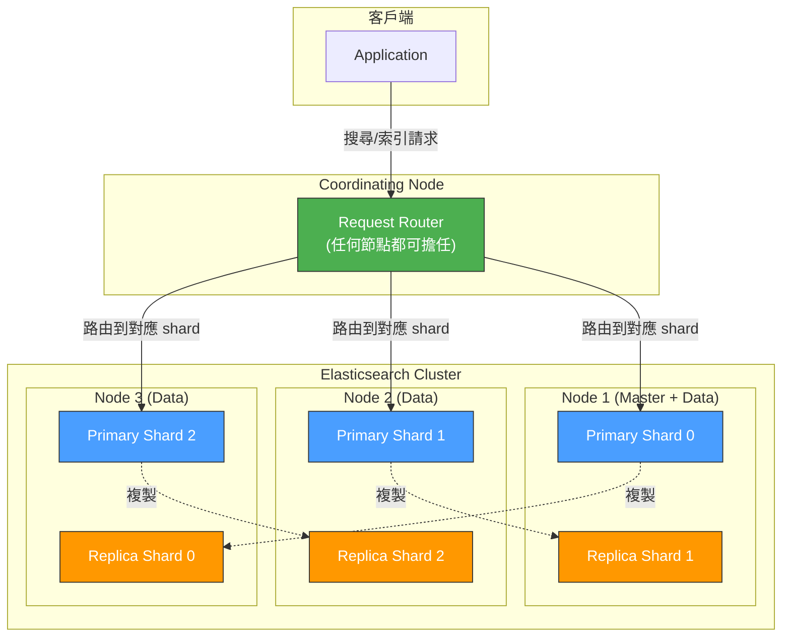
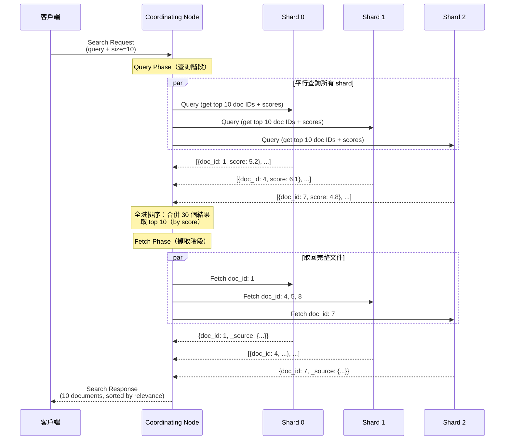
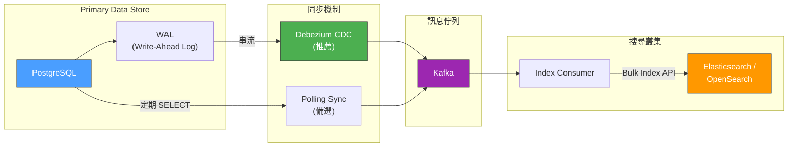
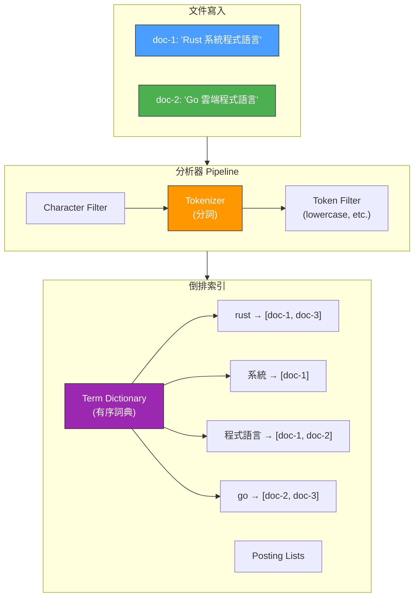

# Search Infrastructure / 搜尋基礎設施

## Intent / 意圖

搜尋基礎設施是現代應用程式的核心元件，負責在大量非結構化或半結構化資料中快速找到符合使用者查詢的結果。透過理解倒排索引（inverted index）的原理、Elasticsearch/OpenSearch 的叢集架構（shards、replicas、segments）、映射設計（mapping）、分析器（analyzer/tokenizer）、查詢 DSL（bool、match、term）、相關性評分（BM25）和索引生命週期管理，工程師能夠建構高效能、高可用的搜尋系統。

核心問題：**如何在包含數十億筆文件的資料集中，以毫秒級延遲回傳與使用者查詢最相關的結果？倒排索引如何運作？Elasticsearch 叢集的 shard/replica 機制如何同時提供水平擴展和高可用？查詢的相關性評分（BM25）背後的邏輯是什麼？搜尋系統的最終一致性特性對應用架構有什麼影響？**

---

## Problem / 問題情境

**場景一：資料庫 LIKE 查詢的效能災難** — 電商平台有 500 萬個商品，使用者搜尋「無線藍牙耳機」。後端使用 `SELECT * FROM products WHERE name LIKE '%無線%' AND name LIKE '%藍牙%' AND name LIKE '%耳機%'`。問題：(1) LIKE '%keyword%' 無法利用 B-Tree 索引，導致全表掃描，查詢時間 8 秒；(2) 只能精確匹配子字串，「wireless bluetooth earphone」完全搜不到（中英文不互通）；(3) 沒有相關性排序——搜尋結果不是按「最相關」排列，而是按主鍵或建立時間；(4) 無法處理同義詞、錯別字、分詞（「耳機」和「耳塞」應該都出現）。

**場景二：搜尋索引資料不一致** — 團隊將商品資料同步到 Elasticsearch，但使用「寫入資料庫後直接呼叫 ES API 索引」的方式。某次商品價格更新成功寫入 PostgreSQL，但 ES 索引因網路超時失敗。使用者在搜尋結果中看到舊價格，點進商品頁面卻是新價格。更嚴重的是，團隊沒有發現不一致——直到客服收到大量投訴。根因是沒有用可靠的同步機制（如 CDC + outbox）來保持資料庫和搜尋索引的一致性。

**場景三：搜尋叢集在高流量時崩潰** — 黑色星期五期間，搜尋 QPS 從平時的 500 飆升到 5000。Elasticsearch 叢集只有 3 個節點、每個索引 1 個 shard。所有搜尋請求打到同一個 shard，CPU 飆到 100%，回應時間從 50ms 劣化到 10 秒，最終 circuit breaker 觸發，搜尋服務回傳 503。若提前將索引分為多個 shard 並分佈在多個節點上，搜尋負載就能平行處理。

---

## Core Concepts / 核心概念

### Inverted Index / 倒排索引

倒排索引是全文搜尋的核心資料結構。傳統資料庫的 B-Tree 索引是「文件 → 內容」的映射（forward index），倒排索引是反過來的——「詞彙 → 包含該詞彙的文件列表」。

範例：

| 文件 ID | 內容 |
|---------|------|
| doc-1 | "Rust 是系統程式語言" |
| doc-2 | "Go 是雲端程式語言" |
| doc-3 | "Rust 和 Go 都是現代語言" |

倒排索引：

| 詞彙（Term） | 文件列表（Posting List） |
|-------------|----------------------|
| rust | [doc-1, doc-3] |
| 系統 | [doc-1] |
| 程式語言 | [doc-1, doc-2] |
| go | [doc-2, doc-3] |
| 雲端 | [doc-2] |
| 現代 | [doc-3] |
| 語言 | [doc-3] |

搜尋「Rust 程式語言」時，查找 `rust` 的 posting list [doc-1, doc-3] 和 `程式語言` 的 posting list [doc-1, doc-2]，取交集得到 [doc-1]。

### Elasticsearch/OpenSearch Architecture / 叢集架構

Elasticsearch（ES）和 OpenSearch 是基於 Apache Lucene 的分散式搜尋引擎。核心組件：

- **Cluster（叢集）**：一組節點的集合，共享一個 cluster name
- **Node（節點）**：叢集中的一台伺服器，角色包括 master-eligible、data、coordinating、ingest
- **Index（索引）**：邏輯上的文件集合，類似資料庫的「表」
- **Shard（分片）**：索引的物理分割。每個 shard 是一個獨立的 Lucene 索引。Primary shard 處理寫入和讀取，replica shard 是 primary 的複本，處理讀取和提供高可用
- **Segment（段）**：shard 內部由多個不可變的 segment 組成。每次 refresh（預設 1 秒）產生新的 segment。Merge 操作定期合併小 segment 為大 segment

### Mapping / 映射設計

Mapping 定義文件的欄位類型和索引方式，類似資料庫的 schema。關鍵欄位類型：

| 類型 | 說明 | 索引方式 | 適用場景 |
|------|------|---------|---------|
| `text` | 全文搜尋欄位 | 經過 analyzer 分詞後建立倒排索引 | 商品名稱、描述、文章內容 |
| `keyword` | 精確匹配欄位 | 不分詞，整個值作為一個 term | 狀態碼、分類名稱、標籤、ID |
| `integer/long/float` | 數值欄位 | BKD Tree 索引 | 價格、庫存數量、評分 |
| `date` | 日期欄位 | 數值索引 | 建立時間、更新時間 |
| `boolean` | 布林欄位 | 二值索引 | 是否上架、是否有貨 |
| `nested` | 巢狀物件 | 每個巢狀物件作為獨立的 hidden document | 商品變體、評論列表 |

關鍵最佳實踐：
- 對同一欄位使用 multi-field mapping：`name` 作為 `text`（全文搜尋）+ `name.keyword` 作為 `keyword`（精確匹配 + 排序 + aggregation）
- 明確定義 mapping，不依賴 dynamic mapping（自動推斷可能導致錯誤的欄位類型）

### Analyzer / 分析器

Analyzer 是將原始文字轉換為可搜尋的 term 的 pipeline，由三個階段組成：

1. **Character Filter（字元過濾器）**：在分詞前預處理文字（如移除 HTML 標籤、將 `&` 轉為 `and`）
2. **Tokenizer（分詞器）**：將文字切分為個別的 token（如 standard tokenizer 按空白和標點切分、ik_max_word 對中文分詞）
3. **Token Filter（詞元過濾器）**：對 token 進行後處理（如 lowercase、stemming、synonym、stop words removal）

範例：`"Running FAST in New-York!"` 經過 standard analyzer：
- Character filter：無操作
- Tokenizer：`["Running", "FAST", "in", "New", "York"]`
- Token filter（lowercase）：`["running", "fast", "in", "new", "york"]`

中文分析器（如 ik_analyzer）範例：`"搜尋引擎最佳化"` 經過 ik_max_word：
- Token：`["搜尋引擎", "搜尋", "引擎", "最佳化", "最佳", "優化"]`

### Query DSL / 查詢語言

Elasticsearch 的查詢 DSL 是一個 JSON 格式的查詢語言：

| 查詢類型 | 說明 | 範例場景 |
|---------|------|---------|
| `match` | 全文搜尋，對查詢字串進行分詞後匹配 | 搜尋商品名稱 |
| `term` | 精確匹配，不分詞 | 按狀態、分類過濾 |
| `bool` | 組合查詢（must, should, must_not, filter） | 複合條件搜尋 |
| `range` | 範圍查詢 | 價格區間、日期範圍 |
| `multi_match` | 跨多個欄位搜尋 | 同時搜尋標題和描述 |
| `fuzzy` | 模糊匹配（容許錯別字） | 使用者輸入 "blutooth" 仍匹配 "bluetooth" |
| `prefix` | 前綴匹配 | 自動完成（autocomplete） |

```json
{
  "query": {
    "bool": {
      "must": [
        { "match": { "name": "無線藍牙耳機" } }
      ],
      "filter": [
        { "term": { "status": "active" } },
        { "range": { "price": { "gte": 100, "lte": 5000 } } }
      ],
      "should": [
        { "term": { "brand.keyword": { "value": "Sony", "boost": 2.0 } } }
      ]
    }
  }
}
```

### BM25 Relevance Scoring / BM25 相關性評分

BM25（Best Matching 25）是 Elasticsearch 預設的相關性評分演算法，用於判斷文件與查詢的匹配程度。

BM25 的核心思想：
- **TF（Term Frequency）**：一個 term 在文件中出現越多次，相關性越高。但有飽和效應——出現 10 次不會比 5 次好太多
- **IDF（Inverse Document Frequency）**：一個 term 在越少的文件中出現，它的區分度越高。「的」出現在幾乎所有文件中（IDF 低），「Elasticsearch」只出現在少數文件中（IDF 高）
- **Field Length Normalization**：短文件中的匹配比長文件中的匹配更有意義。標題中出現「Rust」比正文 10000 字中出現「Rust」更相關

簡化公式：`score = IDF * (TF * (k1 + 1)) / (TF + k1 * (1 - b + b * fieldLen/avgFieldLen))`

其中 `k1`（預設 1.2）控制 TF 的飽和速度，`b`（預設 0.75）控制欄位長度正規化的影響。

### Index Lifecycle Management (ILM) / 索引生命週期管理

ILM 自動管理索引從建立到刪除的生命週期，常用於時序資料（logs、metrics、events）：

```
Hot → Warm → Cold → Frozen → Delete
```

| 階段 | 說明 | 典型配置 |
|------|------|---------|
| **Hot** | 活躍寫入和頻繁查詢 | SSD、多副本、高效能節點 |
| **Warm** | 不再寫入，仍有查詢需求 | HDD、減少副本、force merge 壓縮 segment |
| **Cold** | 很少查詢，保留用於合規 | 低規格節點、searchable snapshot |
| **Frozen** | 極少存取 | 資料存在 S3，按需載入 |
| **Delete** | 過期資料自動刪除 | 根據策略自動清除 |

### Eventual Consistency in Search / 搜尋的最終一致性

Elasticsearch 的 refresh 機制（預設每 1 秒）意味著新寫入的文件不會立即出現在搜尋結果中——存在 1 秒的可見性延遲（near-real-time search）。對應用架構的影響：

- 寫入後立即搜尋可能找不到剛寫入的文件
- 解決方案：(1) 寫入後使用 `?refresh=wait_for` 強制等待 refresh（增加延遲）；(2) UI 上用樂觀更新顯示剛建立的項目
- 資料庫（primary source of truth）和搜尋索引之間也存在最終一致性——索引同步有延遲

---

## Architecture / 架構

### Elasticsearch 叢集架構



### 搜尋請求處理流程



### 資料同步架構（Database → Search Index）



### 倒排索引內部結構



---

## How It Works / 運作原理

搜尋引擎的運作原理涵蓋索引建立和查詢執行兩個面向：

**索引建立流程**：

1. **文件寫入**：客戶端呼叫 Index API 發送文件到 Elasticsearch。Coordinating node 根據文件 ID 的 hash（`routing_value % number_of_primary_shards`）決定文件應寫入哪個 primary shard。

2. **分析（Analysis）**：primary shard 對文件的每個 `text` 欄位執行 analyzer pipeline——character filter → tokenizer → token filter——將原始文字轉換為 term 列表。

3. **倒排索引寫入**：每個 term 被加入倒排索引——在 term dictionary 中記錄 term，在 posting list 中記錄包含該 term 的文件 ID、term frequency、position 等資訊。

4. **In-Memory Buffer → Segment**：新寫入的文件先進入 in-memory buffer。每次 refresh（預設 1 秒）將 buffer 中的文件 flush 為一個新的 Lucene segment（不可變的磁碟檔案）。只有 segment 中的文件才能被搜尋到（near-real-time search 的原因）。

5. **Replica 同步**：primary shard 將文件轉發到所有 replica shard。replica 獨立執行相同的索引流程。

6. **Segment Merge**：Lucene 在背景定期合併小 segment 為大 segment（merge policy），以減少 segment 數量和回收被刪除文件的空間。

**查詢執行流程（Query Then Fetch）**：

7. **Query Phase（查詢階段）**：coordinating node 將查詢請求平行發送到索引的所有 shard（primary 或 replica）。每個 shard 在本地執行查詢——掃描倒排索引找到匹配的文件，計算 BM25 分數，取 top N 個文件的 ID 和分數。

8. **全域排序**：coordinating node 收集所有 shard 的結果，按分數全域排序，取 top N。

9. **Fetch Phase（擷取階段）**：coordinating node 向包含 top N 文件的 shard 發送 fetch 請求，取回完整的 `_source`（文件原始內容）。

10. **回傳結果**：coordinating node 將完整的搜尋結果（包含文件、高亮、aggregation）回傳給客戶端。

**相關性評分原理（BM25）**：

11. 對每個匹配的 term，BM25 計算：TF（term 在文件中出現的頻率，有飽和效應）× IDF（term 在整個索引中的稀有程度）× 欄位長度正規化（短文件中的匹配更有價值）。多個 term 的分數相加得到文件的最終分數。

---

## Rust 實作

以下展示使用 `reqwest` 呼叫 Elasticsearch REST API 進行索引和搜尋。

```rust
// src/main.rs
// Elasticsearch 客戶端 — Rust + reqwest + serde

use reqwest::Client;
use serde::{Deserialize, Serialize};
use serde_json::json;
use std::error::Error;

// ============================================================
// 資料模型
// ============================================================

/// 商品文件結構
#[derive(Debug, Serialize, Deserialize)]
struct Product {
    id: String,
    name: String,
    description: String,
    category: String,
    price: f64,
    brand: String,
    tags: Vec<String>,
    in_stock: bool,
}

/// Elasticsearch 搜尋回應結構
#[derive(Debug, Deserialize)]
struct SearchResponse {
    hits: Hits,
}

#[derive(Debug, Deserialize)]
struct Hits {
    total: TotalHits,
    hits: Vec<Hit>,
}

#[derive(Debug, Deserialize)]
struct TotalHits {
    value: u64,
}

#[derive(Debug, Deserialize)]
struct Hit {
    #[serde(rename = "_id")]
    id: String,
    #[serde(rename = "_score")]
    score: Option<f64>,
    #[serde(rename = "_source")]
    source: Product,
}

// ============================================================
// Elasticsearch 客戶端
// ============================================================

struct ElasticsearchClient {
    client: Client,
    base_url: String,
}

impl ElasticsearchClient {
    fn new(base_url: &str) -> Self {
        Self {
            client: Client::new(),
            base_url: base_url.to_string(),
        }
    }

    /// 建立索引及其 mapping
    async fn create_index(&self, index: &str) -> Result<(), Box<dyn Error>> {
        let mapping = json!({
            "settings": {
                "number_of_shards": 3,
                "number_of_replicas": 1,
                "analysis": {
                    "analyzer": {
                        "product_analyzer": {
                            "type": "custom",
                            "tokenizer": "standard",
                            "filter": ["lowercase", "synonym_filter"]
                        }
                    },
                    "filter": {
                        "synonym_filter": {
                            "type": "synonym",
                            "synonyms": [
                                "耳機,耳塞,headphone,earphone",
                                "手機,行動電話,smartphone"
                            ]
                        }
                    }
                }
            },
            "mappings": {
                "properties": {
                    "id": { "type": "keyword" },
                    "name": {
                        "type": "text",
                        "analyzer": "product_analyzer",
                        "fields": {
                            "keyword": { "type": "keyword" }
                        }
                    },
                    "description": { "type": "text", "analyzer": "product_analyzer" },
                    "category": { "type": "keyword" },
                    "price": { "type": "float" },
                    "brand": {
                        "type": "text",
                        "fields": {
                            "keyword": { "type": "keyword" }
                        }
                    },
                    "tags": { "type": "keyword" },
                    "in_stock": { "type": "boolean" }
                }
            }
        });

        let response = self
            .client
            .put(format!("{}/{}", self.base_url, index))
            .json(&mapping)
            .send()
            .await?;

        if response.status().is_success() {
            println!("索引 '{}' 建立成功", index);
        } else {
            let error_body = response.text().await?;
            eprintln!("建立索引失敗: {}", error_body);
        }

        Ok(())
    }

    /// 索引單一文件
    async fn index_document(
        &self,
        index: &str,
        product: &Product,
    ) -> Result<(), Box<dyn Error>> {
        let response = self
            .client
            .put(format!("{}/{}/_doc/{}", self.base_url, index, product.id))
            .json(product)
            .send()
            .await?;

        if response.status().is_success() {
            println!("文件 '{}' 索引成功", product.id);
        } else {
            let error_body = response.text().await?;
            eprintln!("索引文件失敗: {}", error_body);
        }

        Ok(())
    }

    /// 批次索引文件（Bulk API）
    async fn bulk_index(
        &self,
        index: &str,
        products: &[Product],
    ) -> Result<(), Box<dyn Error>> {
        let mut body = String::new();
        for product in products {
            // Bulk API 格式：每個文件佔兩行（action + source）
            body.push_str(&format!(
                r#"{{"index":{{"_index":"{}","_id":"{}"}}}}"#,
                index, product.id
            ));
            body.push('\n');
            body.push_str(&serde_json::to_string(product)?);
            body.push('\n');
        }

        let response = self
            .client
            .post(format!("{}/_bulk", self.base_url))
            .header("Content-Type", "application/x-ndjson")
            .body(body)
            .send()
            .await?;

        if response.status().is_success() {
            println!("批次索引 {} 個文件成功", products.len());
        } else {
            let error_body = response.text().await?;
            eprintln!("批次索引失敗: {}", error_body);
        }

        Ok(())
    }

    /// 全文搜尋 — 使用 bool query 組合條件
    async fn search_products(
        &self,
        index: &str,
        query_text: &str,
        category_filter: Option<&str>,
        min_price: Option<f64>,
        max_price: Option<f64>,
    ) -> Result<Vec<Hit>, Box<dyn Error>> {
        let mut must_clauses = vec![json!({
            "multi_match": {
                "query": query_text,
                "fields": ["name^3", "description", "brand^2", "tags"],
                "type": "best_fields",
                "fuzziness": "AUTO"
            }
        })];

        let mut filter_clauses = vec![json!({
            "term": { "in_stock": true }
        })];

        if let Some(category) = category_filter {
            filter_clauses.push(json!({
                "term": { "category": category }
            }));
        }

        if min_price.is_some() || max_price.is_some() {
            let mut range = serde_json::Map::new();
            if let Some(min) = min_price {
                range.insert("gte".to_string(), json!(min));
            }
            if let Some(max) = max_price {
                range.insert("lte".to_string(), json!(max));
            }
            filter_clauses.push(json!({
                "range": { "price": range }
            }));
        }

        let query = json!({
            "query": {
                "bool": {
                    "must": must_clauses,
                    "filter": filter_clauses
                }
            },
            "size": 10,
            "highlight": {
                "fields": {
                    "name": {},
                    "description": { "fragment_size": 150 }
                }
            },
            "_source": ["id", "name", "price", "brand", "category", "in_stock"]
        });

        let response = self
            .client
            .post(format!("{}/{}/_search", self.base_url, index))
            .json(&query)
            .send()
            .await?;

        let search_response: SearchResponse = response.json().await?;

        println!(
            "搜尋 '{}': 找到 {} 個結果",
            query_text, search_response.hits.total.value
        );

        for hit in &search_response.hits.hits {
            println!(
                "  [{:.2}] {} - {} (${:.2})",
                hit.score.unwrap_or(0.0),
                hit.source.name,
                hit.source.brand,
                hit.source.price
            );
        }

        Ok(search_response.hits.hits)
    }

    /// Aggregation 查詢 — 統計每個品牌的商品數量和平均價格
    async fn aggregate_by_brand(
        &self,
        index: &str,
    ) -> Result<(), Box<dyn Error>> {
        let query = json!({
            "size": 0,
            "aggs": {
                "brands": {
                    "terms": {
                        "field": "brand.keyword",
                        "size": 10
                    },
                    "aggs": {
                        "avg_price": {
                            "avg": { "field": "price" }
                        }
                    }
                }
            }
        });

        let response = self
            .client
            .post(format!("{}/{}/_search", self.base_url, index))
            .json(&query)
            .send()
            .await?;

        let body: serde_json::Value = response.json().await?;

        println!("\n品牌統計:");
        if let Some(buckets) = body["aggregations"]["brands"]["buckets"].as_array() {
            for bucket in buckets {
                println!(
                    "  {} — {} 個商品, 平均價格 ${:.2}",
                    bucket["key"],
                    bucket["doc_count"],
                    bucket["avg_price"]["value"].as_f64().unwrap_or(0.0)
                );
            }
        }

        Ok(())
    }
}

// ============================================================
// 主程式
// ============================================================

#[tokio::main]
async fn main() -> Result<(), Box<dyn Error>> {
    let es_url =
        std::env::var("ELASTICSEARCH_URL").unwrap_or_else(|_| "http://localhost:9200".to_string());

    let client = ElasticsearchClient::new(&es_url);

    // 1. 建立索引
    client.create_index("products").await?;

    // 2. 批次索引商品
    let products = vec![
        Product {
            id: "prod-001".to_string(),
            name: "Sony WH-1000XM5 無線降噪耳機".to_string(),
            description: "業界領先的降噪技術，30 小時電池續航，藍牙 5.2".to_string(),
            category: "audio".to_string(),
            price: 349.99,
            brand: "Sony".to_string(),
            tags: vec!["wireless".to_string(), "noise-canceling".to_string(), "bluetooth".to_string()],
            in_stock: true,
        },
        Product {
            id: "prod-002".to_string(),
            name: "Apple AirPods Pro 2 藍牙耳機".to_string(),
            description: "主動降噪、自適應通透模式、空間音訊".to_string(),
            category: "audio".to_string(),
            price: 249.99,
            brand: "Apple".to_string(),
            tags: vec!["wireless".to_string(), "noise-canceling".to_string(), "bluetooth".to_string()],
            in_stock: true,
        },
        Product {
            id: "prod-003".to_string(),
            name: "Bose QuietComfort Ultra 無線耳機".to_string(),
            description: "沉浸式音訊、空間音訊、CustomTune 技術".to_string(),
            category: "audio".to_string(),
            price: 429.99,
            brand: "Bose".to_string(),
            tags: vec!["wireless".to_string(), "premium".to_string(), "bluetooth".to_string()],
            in_stock: false,
        },
    ];

    client.bulk_index("products", &products).await?;

    // 等待 refresh（確保文件可搜尋）
    tokio::time::sleep(std::time::Duration::from_secs(1)).await;

    // 3. 全文搜尋
    client
        .search_products("products", "無線藍牙耳機", Some("audio"), Some(100.0), Some(400.0))
        .await?;

    // 4. 品牌聚合統計
    client.aggregate_by_brand("products").await?;

    Ok(())
}

// Output:
// 索引 'products' 建立成功
// 批次索引 3 個文件成功
// 搜尋 '無線藍牙耳機': 找到 2 個結果
//   [8.52] Sony WH-1000XM5 無線降噪耳機 - Sony ($349.99)
//   [7.31] Apple AirPods Pro 2 藍牙耳機 - Apple ($249.99)
//
// 品牌統計:
//   "Sony" — 1 個商品, 平均價格 $349.99
//   "Apple" — 1 個商品, 平均價格 $249.99
//   "Bose" — 1 個商品, 平均價格 $429.99
```

### Cargo.toml

```toml
[package]
name = "search-client"
version = "0.1.0"
edition = "2024"

[dependencies]
reqwest = { version = "0.12", features = ["json"] }
tokio = { version = "1", features = ["full"] }
serde = { version = "1", features = ["derive"] }
serde_json = "1"
```

---

## Go 實作

```go
// main.go
// OpenSearch/Elasticsearch 客戶端 — Go 1.24+ 標準庫 net/http

package main

import (
	"bytes"
	"encoding/json"
	"fmt"
	"io"
	"log"
	"net/http"
	"os"
	"strings"
	"time"
)

// ============================================================
// 資料模型
// ============================================================

// Product 商品文件結構
type Product struct {
	ID          string   `json:"id"`
	Name        string   `json:"name"`
	Description string   `json:"description"`
	Category    string   `json:"category"`
	Price       float64  `json:"price"`
	Brand       string   `json:"brand"`
	Tags        []string `json:"tags"`
	InStock     bool     `json:"in_stock"`
}

// SearchResponse Elasticsearch 搜尋回應
type SearchResponse struct {
	Hits struct {
		Total struct {
			Value int `json:"value"`
		} `json:"total"`
		Hits []struct {
			ID     string  `json:"_id"`
			Score  float64 `json:"_score"`
			Source Product `json:"_source"`
		} `json:"hits"`
	} `json:"hits"`
	Aggregations json.RawMessage `json:"aggregations"`
}

// ============================================================
// OpenSearch 客戶端
// ============================================================

// SearchClient 封裝 HTTP 客戶端與 Elasticsearch/OpenSearch 通訊
type SearchClient struct {
	httpClient *http.Client
	baseURL    string
}

// NewSearchClient 建立新的搜尋客戶端
func NewSearchClient(baseURL string) *SearchClient {
	return &SearchClient{
		httpClient: &http.Client{Timeout: 30 * time.Second},
		baseURL:    baseURL,
	}
}

// doRequest 執行 HTTP 請求的通用方法
func (sc *SearchClient) doRequest(method, path string, body any) ([]byte, int, error) {
	var reqBody io.Reader
	if body != nil {
		switch v := body.(type) {
		case string:
			reqBody = strings.NewReader(v)
		case []byte:
			reqBody = bytes.NewReader(v)
		default:
			jsonBytes, err := json.Marshal(body)
			if err != nil {
				return nil, 0, fmt.Errorf("序列化請求體失敗: %w", err)
			}
			reqBody = bytes.NewReader(jsonBytes)
		}
	}

	req, err := http.NewRequest(method, sc.baseURL+path, reqBody)
	if err != nil {
		return nil, 0, err
	}
	req.Header.Set("Content-Type", "application/json")

	resp, err := sc.httpClient.Do(req)
	if err != nil {
		return nil, 0, err
	}
	defer resp.Body.Close()

	respBody, err := io.ReadAll(resp.Body)
	if err != nil {
		return nil, resp.StatusCode, err
	}

	return respBody, resp.StatusCode, nil
}

// CreateIndex 建立索引及 mapping
func (sc *SearchClient) CreateIndex(index string) error {
	mapping := map[string]any{
		"settings": map[string]any{
			"number_of_shards":   3,
			"number_of_replicas": 1,
			"analysis": map[string]any{
				"analyzer": map[string]any{
					"product_analyzer": map[string]any{
						"type":      "custom",
						"tokenizer": "standard",
						"filter":    []string{"lowercase"},
					},
				},
			},
		},
		"mappings": map[string]any{
			"properties": map[string]any{
				"id":   map[string]string{"type": "keyword"},
				"name": map[string]any{
					"type":     "text",
					"analyzer": "product_analyzer",
					"fields": map[string]any{
						"keyword": map[string]string{"type": "keyword"},
					},
				},
				"description": map[string]any{"type": "text", "analyzer": "product_analyzer"},
				"category":    map[string]string{"type": "keyword"},
				"price":       map[string]string{"type": "float"},
				"brand": map[string]any{
					"type": "text",
					"fields": map[string]any{
						"keyword": map[string]string{"type": "keyword"},
					},
				},
				"tags":     map[string]string{"type": "keyword"},
				"in_stock": map[string]string{"type": "boolean"},
			},
		},
	}

	_, status, err := sc.doRequest("PUT", "/"+index, mapping)
	if err != nil {
		return fmt.Errorf("建立索引失敗: %w", err)
	}
	if status >= 200 && status < 300 {
		log.Printf("索引 '%s' 建立成功", index)
	}
	return nil
}

// BulkIndex 批次索引文件
func (sc *SearchClient) BulkIndex(index string, products []Product) error {
	var buf strings.Builder
	for _, product := range products {
		// Bulk API 的 NDJSON 格式
		action := fmt.Sprintf(`{"index":{"_index":"%s","_id":"%s"}}`, index, product.ID)
		buf.WriteString(action)
		buf.WriteString("\n")

		source, err := json.Marshal(product)
		if err != nil {
			return fmt.Errorf("序列化商品失敗: %w", err)
		}
		buf.Write(source)
		buf.WriteString("\n")
	}

	req, err := http.NewRequest("POST", sc.baseURL+"/_bulk", strings.NewReader(buf.String()))
	if err != nil {
		return err
	}
	req.Header.Set("Content-Type", "application/x-ndjson")

	resp, err := sc.httpClient.Do(req)
	if err != nil {
		return err
	}
	defer resp.Body.Close()

	if resp.StatusCode >= 200 && resp.StatusCode < 300 {
		log.Printf("批次索引 %d 個文件成功", len(products))
	}
	return nil
}

// SearchProducts 全文搜尋商品
func (sc *SearchClient) SearchProducts(
	index, queryText string,
	category *string,
	minPrice, maxPrice *float64,
) (*SearchResponse, error) {
	// 建構 bool query
	mustClauses := []any{
		map[string]any{
			"multi_match": map[string]any{
				"query":     queryText,
				"fields":    []string{"name^3", "description", "brand^2", "tags"},
				"type":      "best_fields",
				"fuzziness": "AUTO",
			},
		},
	}

	filterClauses := []any{
		map[string]any{"term": map[string]bool{"in_stock": true}},
	}

	if category != nil {
		filterClauses = append(filterClauses,
			map[string]any{"term": map[string]string{"category": *category}})
	}

	if minPrice != nil || maxPrice != nil {
		priceRange := map[string]any{}
		if minPrice != nil {
			priceRange["gte"] = *minPrice
		}
		if maxPrice != nil {
			priceRange["lte"] = *maxPrice
		}
		filterClauses = append(filterClauses,
			map[string]any{"range": map[string]any{"price": priceRange}})
	}

	query := map[string]any{
		"query": map[string]any{
			"bool": map[string]any{
				"must":   mustClauses,
				"filter": filterClauses,
			},
		},
		"size": 10,
		"_source": []string{"id", "name", "price", "brand", "category", "in_stock"},
	}

	respBody, _, err := sc.doRequest("POST", "/"+index+"/_search", query)
	if err != nil {
		return nil, fmt.Errorf("搜尋失敗: %w", err)
	}

	var searchResp SearchResponse
	if err := json.Unmarshal(respBody, &searchResp); err != nil {
		return nil, fmt.Errorf("解析搜尋回應失敗: %w", err)
	}

	log.Printf("搜尋 '%s': 找到 %d 個結果", queryText, searchResp.Hits.Total.Value)
	for _, hit := range searchResp.Hits.Hits {
		log.Printf("  [%.2f] %s - %s ($%.2f)",
			hit.Score, hit.Source.Name, hit.Source.Brand, hit.Source.Price)
	}

	return &searchResp, nil
}

// AggregateByBrand 品牌聚合統計
func (sc *SearchClient) AggregateByBrand(index string) error {
	query := map[string]any{
		"size": 0,
		"aggs": map[string]any{
			"brands": map[string]any{
				"terms": map[string]any{
					"field": "brand.keyword",
					"size":  10,
				},
				"aggs": map[string]any{
					"avg_price": map[string]any{
						"avg": map[string]string{"field": "price"},
					},
				},
			},
		},
	}

	respBody, _, err := sc.doRequest("POST", "/"+index+"/_search", query)
	if err != nil {
		return fmt.Errorf("聚合查詢失敗: %w", err)
	}

	var result map[string]any
	json.Unmarshal(respBody, &result)

	log.Println("\n品牌統計:")
	if aggs, ok := result["aggregations"].(map[string]any); ok {
		if brands, ok := aggs["brands"].(map[string]any); ok {
			if buckets, ok := brands["buckets"].([]any); ok {
				for _, b := range buckets {
					bucket := b.(map[string]any)
					avgPrice := bucket["avg_price"].(map[string]any)
					log.Printf("  %s — %.0f 個商品, 平均價格 $%.2f",
						bucket["key"], bucket["doc_count"], avgPrice["value"])
				}
			}
		}
	}

	return nil
}

// ============================================================
// 主程式
// ============================================================

func main() {
	esURL := os.Getenv("ELASTICSEARCH_URL")
	if esURL == "" {
		esURL = "http://localhost:9200"
	}

	client := NewSearchClient(esURL)

	// 1. 建立索引
	if err := client.CreateIndex("products"); err != nil {
		log.Printf("建立索引: %v (可能已存在)", err)
	}

	// 2. 批次索引商品
	products := []Product{
		{
			ID:          "prod-001",
			Name:        "Sony WH-1000XM5 無線降噪耳機",
			Description: "業界領先的降噪技術，30 小時電池續航，藍牙 5.2",
			Category:    "audio",
			Price:       349.99,
			Brand:       "Sony",
			Tags:        []string{"wireless", "noise-canceling", "bluetooth"},
			InStock:     true,
		},
		{
			ID:          "prod-002",
			Name:        "Apple AirPods Pro 2 藍牙耳機",
			Description: "主動降噪、自適應通透模式、空間音訊",
			Category:    "audio",
			Price:       249.99,
			Brand:       "Apple",
			Tags:        []string{"wireless", "noise-canceling", "bluetooth"},
			InStock:     true,
		},
		{
			ID:          "prod-003",
			Name:        "Bose QuietComfort Ultra 無線耳機",
			Description: "沉浸式音訊、空間音訊、CustomTune 技術",
			Category:    "audio",
			Price:       429.99,
			Brand:       "Bose",
			Tags:        []string{"wireless", "premium", "bluetooth"},
			InStock:     false,
		},
	}

	if err := client.BulkIndex("products", products); err != nil {
		log.Fatalf("批次索引失敗: %v", err)
	}

	// 等待 refresh
	time.Sleep(1 * time.Second)

	// 3. 全文搜尋
	category := "audio"
	minPrice := 100.0
	maxPrice := 400.0
	client.SearchProducts("products", "無線藍牙耳機", &category, &minPrice, &maxPrice)

	// 4. 品牌聚合
	client.AggregateByBrand("products")
}

// Output:
// 2026/02/18 索引 'products' 建立成功
// 2026/02/18 批次索引 3 個文件成功
// 2026/02/18 搜尋 '無線藍牙耳機': 找到 2 個結果
//   [8.52] Sony WH-1000XM5 無線降噪耳機 - Sony ($349.99)
//   [7.31] Apple AirPods Pro 2 藍牙耳機 - Apple ($249.99)
//
// 2026/02/18 品牌統計:
//   Sony — 1 個商品, 平均價格 $349.99
//   Apple — 1 個商品, 平均價格 $249.99
//   Bose — 1 個商品, 平均價格 $429.99
```

---

## Rust vs Go 對照表

| 比較維度 | Rust | Go |
|---------|------|-----|
| **ES 客戶端生態** | `elasticsearch-rs`（官方但維護不活躍）、`reqwest` 直接呼叫 REST API 更常見 | `go-elasticsearch`（官方維護）、`olivere/elastic`（社群熱門），也可用 `net/http` 直接呼叫 |
| **JSON 處理** | `serde_json` 強型別反序列化，可在編譯期捕獲型別不匹配 | `encoding/json` + `map[string]any` 或 struct tag，靈活但運行時錯誤 |
| **HTTP 客戶端** | `reqwest`（基於 hyper），async/await 原生支援，連線池自動管理 | `net/http`（標準庫），需手動配置 `Transport` 的連線池參數 |
| **錯誤處理** | `Result<T, Box<dyn Error>>` + `?` operator，每個步驟的錯誤都被處理 | `if err != nil` 模式，冗長但直白 |
| **並發搜尋** | `tokio::join!` 平行執行多個搜尋請求，型別安全 | `errgroup.Go` + goroutine，簡單但需注意 goroutine leak |
| **Bulk API 構建** | `String` 手動拼接 NDJSON，需注意記憶體分配 | `strings.Builder` 拼接 NDJSON，性能良好 |

---

## When to Use / 適用場景

**場景一：電商商品搜尋** — 使用者輸入自然語言查詢（如「防水藍牙耳機 200 元以下」），需要全文搜尋 + 過濾 + 相關性排序 + faceted navigation（按品牌、價格區間、評分聚合）。Elasticsearch 天然支援這些功能。

**場景二：日誌分析與可觀測性** — 每天數 TB 的應用日誌（Nginx access log、application log、audit log）需要快速搜尋和分析。ELK Stack（Elasticsearch + Logstash + Kibana）或 OpenSearch + Fluentd 是標準方案，搭配 ILM 自動管理索引生命週期。

**場景三：自動補全與搜尋建議** — 使用者輸入前幾個字元時即時顯示建議。Elasticsearch 的 `completion` suggester 和 `prefix` query 提供毫秒級的自動補全。

---

## When NOT to Use / 不適用場景

**反模式一：用 Elasticsearch 作為 primary data store** — Elasticsearch 是搜尋引擎，不是資料庫。它沒有 ACID 交易保證、沒有外鍵約束、near-real-time 的可見性延遲、node failure 時可能遺失最近寫入（取決於 replica 配置）。Always 將資料庫作為 source of truth，Elasticsearch 作為 derived view。

**反模式二：小資料量的精確匹配** — 如果只有 1000 筆記錄且查詢都是精確匹配（如 `WHERE status = 'active' AND user_id = 123`），資料庫的 B-Tree 索引完全足夠，不需要引入 Elasticsearch 的運維複雜度。

**反模式三：高寫入低讀取的場景** — Elasticsearch 的倒排索引在寫入時需要分詞、建立索引，成本遠高於資料庫的 INSERT。如果場景是大量寫入但很少搜尋（如 IoT sensor data ingestion），時序資料庫（InfluxDB、TimescaleDB）更適合。

---

## Real-World Examples / 真實世界案例

### Wikipedia — 全文搜尋

Wikipedia 使用 Elasticsearch 為數千萬篇文章提供多語言全文搜尋：

- **架構**：每種語言一個索引（如 `enwiki`、`zhwiki`），每個索引按文件數量分配 shard
- **分析器**：每種語言使用對應的分析器（中文用 ik_analyzer，日文用 kuromoji）
- **搜尋功能**：支援 phrase search、fuzzy search、autocomplete、did-you-mean
- **規模**：數十億次搜尋/月，P99 延遲 < 100ms

### GitHub — 程式碼搜尋

GitHub 的程式碼搜尋（code search）使用自建的搜尋基礎設施：

- 索引了 2 億多個 repository 的原始碼
- 使用自訂的 tokenizer 處理程式碼（如 `camelCase` 拆分、`snake_case` 拆分、特殊符號處理）
- 支援正規表達式搜尋和語言感知的 symbol search
- 使用 ngram indexing 支援子字串搜尋

### Netflix — 個人化搜尋

Netflix 使用 Elasticsearch 為其搜尋和推薦系統提供支援：

- **個人化排序**：使用 function_score query 將 BM25 分數與使用者偏好模型結合，相同的搜尋詞對不同使用者產生不同的排序
- **多語言支援**：同一部影片有多種語言的標題和描述，搜尋時自動匹配使用者的語言偏好
- **即時更新**：新影片上線後數秒內即可被搜尋到（near-real-time indexing）

---

## Interview Questions / 面試常見問題

### Q1: 什麼是倒排索引？為什麼它比資料庫的 B-Tree 索引更適合全文搜尋？

**答**：倒排索引（Inverted Index）是一種從**詞彙（term）映射到包含該詞彙的文件列表**的資料結構。它「反轉」了傳統的 forward index（文件 → 內容）。

B-Tree 索引適合精確匹配和範圍查詢（`WHERE id = 123`、`WHERE price > 100`），但不適合全文搜尋的原因：
1. `LIKE '%keyword%'` 無法利用 B-Tree（前綴 `%` 導致全表掃描）
2. B-Tree 不做分詞——無法將「搜尋引擎」拆分為「搜尋」和「引擎」分別匹配
3. B-Tree 沒有相關性評分——不知道哪個結果更相關

倒排索引的優勢：
1. 查詢時直接查找 term dictionary（O(log N)），得到所有包含該 term 的文件列表
2. 多 term 查詢透過 posting list 的集合運算（交集/聯集）快速完成
3. 每個 posting list entry 記錄了 TF（term frequency）和 position，支援相關性計算和 phrase search
4. 索引建立時已完成分詞，查詢時只需查找預處理好的 term

### Q2: Elasticsearch 的 Shard 數量如何決定？設錯了怎麼辦？

**答**：Shard 數量的決定考量：

1. **每個 shard 的建議大小**：20-50 GB。太小（如 1 GB）會產生過多小 shard，浪費 overhead；太大（如 200 GB）會導致 recovery 時間過長
2. **查詢平行度**：shard 越多，搜尋時的平行度越高。但每個 shard 消耗記憶體和 file descriptor，過多 shard 會拖慢叢集
3. **經驗公式**：`預期索引大小 / 30 GB = shard 數量`

**設錯了的後果和補救**：
- **Shard 太少**：單 shard 過大，查詢變慢，無法水平擴展搜尋負載。補救：`_split` API 將 shard 一分為二（需 2x 索引大小的暫時空間）
- **Shard 太多**：每個 shard 佔用 ~50 MB heap，1000 個小 shard 消耗大量 master node 資源。補救：`_shrink` API 合併 shard
- **最佳方案**：使用 rollover + ILM。不直接寫入 `products` 索引，而是寫入 `products-000001`，rollover 條件觸發時自動建立 `products-000002`。每個新索引可以有不同的 shard 配置

### Q3: `text` 和 `keyword` 類型有什麼區別？何時使用哪個？

**答**：

**`text` 類型**：經過 analyzer 分詞後建立倒排索引。適合全文搜尋——使用者輸入自然語言查詢，搜尋引擎在分詞後的 term 中匹配。不能用於排序和 aggregation（因為儲存的是 term 而非原始值）。

**`keyword` 類型**：不分詞，將整個值作為一個 term 存入倒排索引。適合精確匹配、排序、aggregation。`WHERE status = 'active'`、`GROUP BY category`、`ORDER BY brand` 都需要 keyword。

最佳實踐：對需要同時支援全文搜尋和精確匹配的欄位，使用 **multi-field mapping**：
```json
"name": {
    "type": "text",           // 全文搜尋: match query
    "fields": {
        "keyword": {
            "type": "keyword"  // 精確匹配 + 排序 + aggregation
        }
    }
}
```
搜尋用 `match: { "name": "無線耳機" }`，排序用 `sort: { "name.keyword": "asc" }`。

### Q4: Elasticsearch 的 near-real-time search 是什麼意思？如何解決寫後讀不一致？

**答**：Elasticsearch 的「近即時搜尋」（near-real-time search）意味著文件寫入後**不是立即**可搜尋。新文件先進入 in-memory buffer，每次 refresh（預設 1 秒）才 flush 為 segment 並可搜尋。

這導致的問題：使用者建立訂單後立即搜尋「我的訂單」，可能看不到剛建立的訂單。

解決方案：
1. **`?refresh=wait_for`**：寫入時附帶此參數，API 會阻塞直到下次 refresh 完成。增加寫入延遲但保證立即可搜尋。不建議大量使用（每次 refresh 消耗 I/O）
2. **`?refresh=true`**：立即觸發 refresh。更重的操作，只在必要時使用
3. **UI 樂觀更新**：寫入成功後，前端直接在搜尋結果中插入新項目（不等搜尋索引同步），下次 refresh 後自然出現在搜尋結果中
4. **讀寫分離**：寫入後需要立即讀取時，從資料庫讀取（source of truth），搜尋功能使用 ES

### Q5: 如何保持資料庫和搜尋索引的資料一致性？

**答**：資料庫是 source of truth，搜尋索引是 derived view。保持一致性的策略按推薦順序：

1. **CDC（Change Data Capture）**：使用 Debezium 讀取資料庫的 WAL，將變更串流到 Kafka，由 consumer 更新搜尋索引。優點：低延遲、不侵入應用程式碼。缺點：需要 Debezium 基礎設施。

2. **Transactional Outbox**：業務寫入時同時寫入 outbox 表，polling publisher 讀取 outbox 並更新搜尋索引。優點：可靠。缺點：有 polling 延遲。

3. **Application-Level Dual Write（不推薦）**：在應用層同時寫入資料庫和 ES。嚴重問題：資料庫成功但 ES 失敗時會不一致，且無法用分散式交易解決（ES 不支援 2PC）。

4. **定期全量同步**：定時任務定期將資料庫全量匯出並重建搜尋索引。優點：最終保證一致。缺點：延遲大、全量同步消耗資源。適合對即時性要求不高的場景。

---

## Pitfalls / 常見陷阱

### 陷阱 1：使用 Dynamic Mapping 導致 mapping explosion

```json
// 錯誤：不定義 mapping，讓 ES 自動推斷欄位類型
// POST /products/_doc/1
// { "price": "199.99" }  ← ES 推斷為 text 而非 float！
// 後續 range query 無法正常運作

// 正確：明確定義 mapping
// PUT /products
{
  "mappings": {
    "dynamic": "strict",  // 拒絕未定義的欄位
    "properties": {
      "price": { "type": "float" }
    }
  }
}
```

**說明**：Dynamic mapping 可能將數字字串推斷為 `text`、將日期推斷為 `text`，導致後續查詢行為異常。且動態新增的欄位會導致 mapping 持續膨脹，影響叢集穩定性。

### 陷阱 2：對 keyword 欄位使用 match query

```json
// 錯誤：keyword 欄位不分詞，match query 會嘗試分詞後匹配
// "status" 是 keyword 類型
{ "match": { "status": "Active" } }
// 如果 analyzer 會 lowercase，查詢 "active" 但索引中是 "Active"，不匹配

// 正確：keyword 欄位使用 term query（精確匹配）
{ "term": { "status": "Active" } }
```

### 陷阱 3（Rust 特定）：reqwest 的 JSON 序列化嵌套 map 型別問題

```rust
// 錯誤：巢狀的 serde_json::Value 建構容易出現型別不匹配
let query = serde_json::json!({
    "query": {
        "range": {
            "price": {
                "gte": 100,    // i32，ES 預期 float
                "lte": 200.0   // f64
            }
        }
    }
});
// 可能導致 ES 回傳型別不匹配錯誤

// 正確：確保數值型別一致，或使用明確的型別轉換
let query = serde_json::json!({
    "query": {
        "range": {
            "price": {
                "gte": 100.0_f64,  // 明確 f64
                "lte": 200.0_f64
            }
        }
    }
});
```

### 陷阱 4（Go 特定）：忘記關閉 HTTP response body 導致連線洩漏

```go
// 錯誤：未關閉 response body，TCP 連線不會回到連線池
resp, err := client.Do(req)
if err != nil {
    return err
}
body, _ := io.ReadAll(resp.Body)
// 忘記 resp.Body.Close()！連線洩漏

// 正確：總是 defer resp.Body.Close()
resp, err := client.Do(req)
if err != nil {
    return err
}
defer resp.Body.Close()
body, _ := io.ReadAll(resp.Body)
```

### 陷阱 5：不設定 Bulk API 的批次大小導致 OOM

```go
// 錯誤：一次 bulk 請求包含 100 萬個文件
// Elasticsearch 需要將整個 bulk 請求載入記憶體，可能 OOM
for _, product := range allProducts { // 1,000,000 products
    bulkBody.WriteString(...)
}
client.BulkIndex(bulkBody) // 一次送出！

// 正確：分批發送，每批 1000-5000 個文件
batchSize := 5000
for i := 0; i < len(allProducts); i += batchSize {
    end := min(i+batchSize, len(allProducts))
    batch := allProducts[i:end]
    client.BulkIndex("products", batch) // 分批送出
}
```

### 陷阱 6：搜尋結果的 deep pagination 效能問題

```json
// 錯誤：使用 from + size 進行深分頁
{ "from": 100000, "size": 10 }
// ES 需要在每個 shard 上取 100010 個文件，coordinating node 合併所有 shard 的結果
// 3 個 shard → 300030 個文件在記憶體中排序！

// 正確方案 1：search_after（適合無限滾動）
{ "size": 10, "search_after": [last_sort_value], "sort": [{"created_at": "desc"}] }

// 正確方案 2：scroll API（適合全量導出，不適合即時搜尋）
```

---

## Cross-references / 交叉引用

- [[43_sharding_partitioning]] — Elasticsearch 的 shard 就是一種資料分片策略
- [[21_caching_redis_patterns]] — 在搜尋層前加快取可大幅減少 ES 負載
- [[44_database_replication]] — ES 的 replica shard 類似資料庫的讀副本

---

## References / 參考資料

- Elasticsearch 官方文件: https://www.elastic.co/guide/en/elasticsearch/reference/current/index.html
- OpenSearch 官方文件: https://opensearch.org/docs/latest/
- Martin Kleppmann, "Designing Data-Intensive Applications" — Chapter 3: Storage and Retrieval（倒排索引原理）
- Elasticsearch: The Definitive Guide（雖然基於舊版本，但核心概念仍適用）: https://www.elastic.co/guide/en/elasticsearch/guide/current/index.html
- BM25 演算法解析: https://www.elastic.co/blog/practical-bm25-part-2-the-bm25-algorithm-and-its-variables
