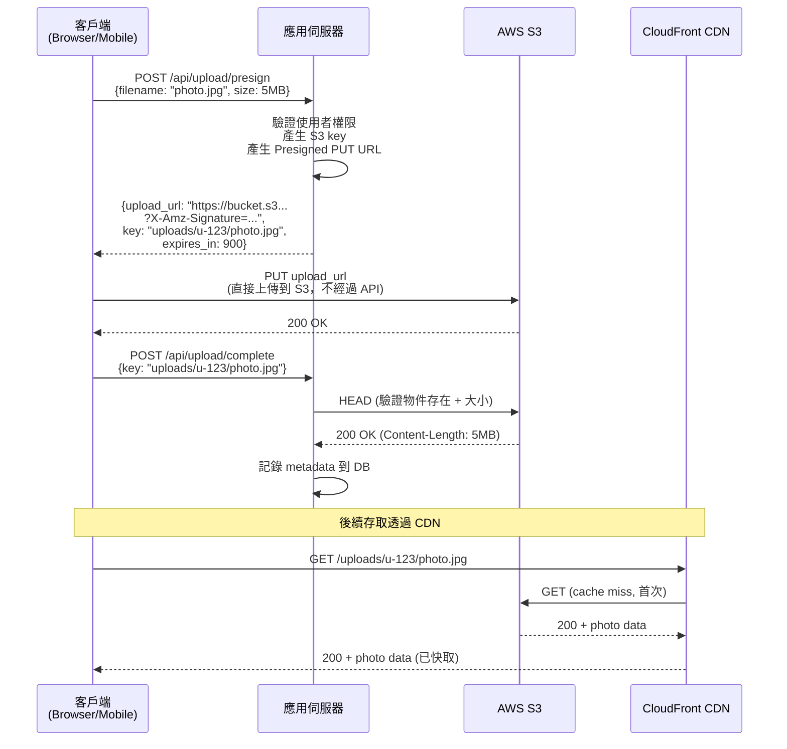
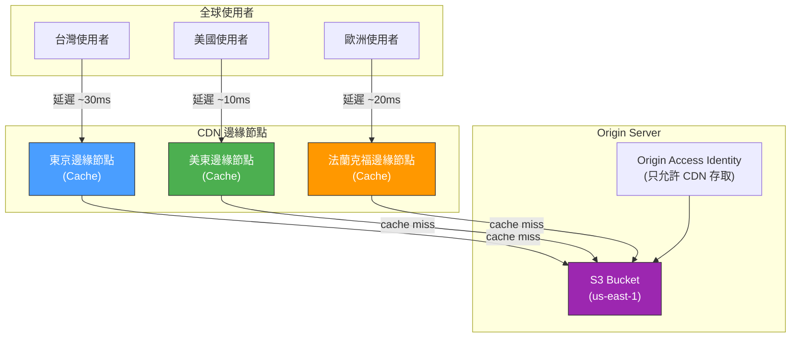
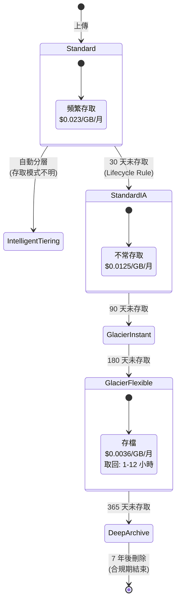

# Object Storage & CDN / 物件儲存與 CDN

## Intent / 意圖

物件儲存（Object Storage）和 CDN（Content Delivery Network）是現代後端系統處理非結構化資料（圖片、影片、文件、備份）的核心基礎設施。物件儲存（如 AWS S3、MinIO）提供近乎無限的儲存容量和 99.999999999%（11 個 9）的持久性；CDN 將內容快取到全球邊緣節點（edge），讓使用者從最近的節點取得資料。透過 Presigned URL，後端可以安全地讓客戶端直接上傳/下載物件儲存中的檔案，無需將流量經過應用伺服器。

核心問題：**如何設計一個安全、高效能、低成本的靜態資源（圖片、影片、文件）管理系統——讓使用者能快速上傳大檔案（不經過應用伺服器）、全球使用者都能低延遲下載、儲存成本隨資料溫度自動最佳化、且未授權的使用者無法存取私有資源？**

---

## Problem / 問題情境

**場景一：應用伺服器成為檔案上傳的瓶頸** — 社群平台的使用者上傳照片流程：客戶端將 5 MB 的照片 POST 到應用伺服器，應用伺服器接收完整檔案後再上傳到 S3。問題：(1) 應用伺服器的記憶體被佔用（100 個並發上傳 = 500 MB 記憶體）；(2) 應用伺服器的頻寬被消耗在「中轉」檔案上，壓縮了處理 API 請求的頻寬；(3) 上傳大檔案（如 1 GB 的影片）時，HTTP 連線長時間佔用，容易超時。若使用 Presigned URL，客戶端直接上傳到 S3，應用伺服器只負責產生 URL（微秒級），完全不經手檔案流量。

**場景二：全球使用者存取延遲差異巨大** — 線上教育平台的影片存在美國東部的 S3 bucket。台灣使用者觀看影片的首次載入需要 8 秒（跨太平洋的延遲 + 頻寬限制），而美國使用者只需 1 秒。若在 S3 前面放 CloudFront CDN，台灣使用者的首次請求從 CDN 的東京邊緣節點快取取得（如果有快取），或由東京節點從 S3 拉取並快取。後續請求直接命中邊緣快取，延遲從 8 秒降到 0.5 秒。

**場景三：儲存成本失控** — 團隊將所有使用者上傳的檔案（包括 3 年前的歷史資料）都存在 S3 Standard 儲存類別。每月帳單 $50,000。分析後發現 80% 的檔案在過去 90 天內從未被存取。若使用 S3 Lifecycle Policy 將 30 天未存取的檔案遷移到 S3 Infrequent Access（成本降低 40%），90 天未存取的遷移到 S3 Glacier（成本降低 80%），每月帳單可降至 $15,000。

**場景四：私有檔案被未授權存取** — 團隊將使用者的私人文件上傳到公開的 S3 bucket（為了方便前端直接用 URL 存取）。某天發現所有使用者的身分證照片可以被任何人透過 URL 直接下載。若使用 Presigned URL with expiration，每個下載 URL 只在 15 分鐘內有效，且只有被授權的使用者才能取得 URL。

---

## Core Concepts / 核心概念

### Object Storage / 物件儲存

物件儲存是一種以「物件（object）」為基本單位的儲存系統，每個物件由三部分組成：

1. **Key（鍵）**：物件的唯一識別符，類似檔案路徑（如 `uploads/2026/02/user-123/avatar.jpg`）
2. **Value（值）**：物件的內容（binary data），可以是任何大小（S3 最大 5 TB）
3. **Metadata（元資料）**：附加資訊，如 Content-Type、Content-Length、自訂標頭（如 `x-amz-meta-user-id`）

與檔案系統的差異：

| 特性 | 檔案系統 | 物件儲存 |
|------|---------|---------|
| 結構 | 階層式目錄樹 | 扁平的 key-value（「目錄」只是 key 的前綴） |
| 修改 | 支援 in-place 修改（seek + write） | 只能整體替換（PUT 整個物件） |
| 擴展性 | 受限於單台伺服器或 NFS | 近乎無限（跨多個節點自動分散） |
| 存取方式 | POSIX API（open/read/write） | HTTP REST API（GET/PUT/DELETE） |
| 持久性 | 取決於 RAID/備份策略 | 11 個 9（S3 跨 3 個 AZ 冗餘） |

### Presigned URL / 預簽名 URL

Presigned URL 是一個帶有臨時授權簽名的 URL，允許未經 AWS 認證的客戶端（如瀏覽器、Mobile App）直接對 S3 執行指定操作（GET 或 PUT），在指定的時間內有效。

生成流程：
1. 客戶端向應用伺服器請求上傳 URL
2. 應用伺服器使用 AWS credentials 生成 Presigned PUT URL（設定過期時間、Content-Type 限制等）
3. 客戶端使用此 URL 直接 PUT 檔案到 S3
4. S3 驗證 URL 中的簽名和過期時間，若合法則允許操作

安全考量：
- **過期時間**：設定合理的短時間（如上傳 15 分鐘、下載 1 小時）
- **操作限制**：Presigned PUT URL 只能上傳，不能讀取或刪除
- **Content-Type 限制**：可在 presign 時指定允許的 Content-Type，防止上傳惡意檔案
- **大小限制**：可透過 Presigned POST（with conditions）限制檔案大小

### Multipart Upload / 分段上傳

對大檔案（>100 MB），S3 提供 Multipart Upload 機制：

1. **Initiate**：開始分段上傳，取得 upload ID
2. **Upload Parts**：將檔案切分為多個 part（每個 5 MB - 5 GB），平行上傳
3. **Complete**：通知 S3 合併所有 part 為完整物件

優勢：
- **可恢復**：單個 part 失敗只需重傳該 part，不需要從頭開始
- **平行上傳**：多個 part 同時上傳，充分利用網路頻寬
- **支援超大檔案**：最大 5 TB（10,000 parts × 5 GB/part）

### Storage Classes / 儲存類別

S3 提供多種儲存類別，根據存取頻率和成本需求選擇：

| 類別 | 存取延遲 | 存取成本 | 儲存成本 | 適用場景 |
|------|---------|---------|---------|---------|
| **Standard** | 毫秒 | 低 | $0.023/GB/月 | 頻繁存取的活躍資料 |
| **Intelligent-Tiering** | 毫秒 | 自動 | $0.023-0.0036/GB/月 | 存取模式不確定的資料 |
| **Standard-IA** | 毫秒 | 中 | $0.0125/GB/月 | 不常存取但需要快速取得 |
| **Glacier Instant** | 毫秒 | 高 | $0.004/GB/月 | 很少存取但需要毫秒級取得 |
| **Glacier Flexible** | 1-12 小時 | 中 | $0.0036/GB/月 | 備份、合規存檔 |
| **Glacier Deep Archive** | 12-48 小時 | 高 | $0.00099/GB/月 | 極少存取的長期存檔 |

### CDN / 內容傳遞網路

CDN 是分佈在全球的邊緣伺服器（edge server / PoP）網路，將內容快取到離使用者最近的節點，減少延遲和 origin server 的負載。

CDN 的工作原理：
1. 使用者請求 `https://cdn.example.com/images/hero.jpg`
2. DNS 將請求解析到距離使用者最近的邊緣節點（Anycast routing）
3. 邊緣節點檢查本地快取——若命中，直接回傳（cache hit）
4. 若未命中，邊緣節點向 origin（S3 bucket）發起請求
5. Origin 回傳內容，邊緣節點快取並回傳給使用者
6. 後續相同請求直接從邊緣節點快取回傳

### Cache Invalidation / 快取失效

CDN 快取失效是靜態資源更新時的核心挑戰：

| 策略 | 說明 | 優缺點 |
|------|------|--------|
| **TTL（Time-To-Live）** | 設定 `Cache-Control: max-age=86400` | 簡單；過期前看到舊內容 |
| **版本化 URL** | `hero-v2.jpg` 或 `hero.jpg?v=abc123` | 即時更新；需要更新所有引用 |
| **Content Hash** | `hero.a1b2c3d4.jpg`（build 時產生） | 最佳化——內容不變則 URL 不變；需要 build pipeline 支援 |
| **Manual Invalidation** | CloudFront `CreateInvalidation` API | 可以立即清除快取；API 呼叫有成本（每月前 1000 次免費） |

最佳實踐：靜態資產（CSS/JS/圖片）使用 content hash URL + 長 TTL（1 年）；API 回應使用短 TTL 或不快取。

### Signed URL for CDN / CDN 簽名 URL

CDN 簽名 URL 讓你可以控制誰能透過 CDN 存取私有內容：

- **CloudFront Signed URL**：使用 RSA 私鑰簽名，支援設定過期時間、IP 限制、起始時間
- **Signed Cookie**：對整個路徑（如 `/premium/*`）設定存取權限，適合串流影片（多個 segment 檔案）

與 S3 Presigned URL 的區別：
- S3 Presigned URL 直接存取 S3（不經過 CDN）
- CDN Signed URL 透過 CDN 邊緣節點存取（享受 CDN 快取和加速）
- 生產環境應使用 CDN Signed URL（效能更好）+ Origin Access Identity（OAI）限制 S3 只接受來自 CDN 的請求

### Image/Video Processing Pipeline / 圖片/影片處理管線

生產級的靜態資源系統通常包含處理管線：

```
Upload → Validate → Process → Store → Distribute
```

- **Validate**：檢查檔案類型（magic bytes, not just extension）、大小限制、病毒掃描
- **Process**：圖片壓縮（WebP/AVIF）、生成多種尺寸（thumbnail, medium, large）、影片轉碼（HLS/DASH）
- **Store**：原始檔案 + 處理後的變體都存入 S3
- **Distribute**：透過 CDN 分發，可搭配 Lambda@Edge 或 CloudFront Functions 做即時圖片變換

---

## Architecture / 架構

### Presigned URL 上傳流程



### CDN + Origin 架構



### 圖片處理管線

```mermaid
flowchart LR
    UPLOAD["客戶端上傳<br/>(Presigned URL)"]
    S3_RAW["S3: raw/<br/>原始檔案"]
    TRIGGER["S3 Event<br/>Notification"]
    LAMBDA["Image Processor<br/>(Lambda / Worker)"]
    S3_PROC["S3: processed/<br/>thumbnail, medium, large"]
    CDN2["CDN<br/>(邊緣快取)"]
    USER["使用者<br/>(低延遲存取)"]

    UPLOAD --> S3_RAW
    S3_RAW --> TRIGGER
    TRIGGER --> LAMBDA
    LAMBDA -->|"生成多種尺寸<br/>+ WebP/AVIF 壓縮"| S3_PROC
    S3_PROC --> CDN2
    CDN2 --> USER

    style UPLOAD fill:#4a9eff,stroke:#333,color:#fff
    style LAMBDA fill:#ff9800,stroke:#333,color:#fff
    style S3_PROC fill:#4caf50,stroke:#333,color:#fff
    style CDN2 fill:#9c27b0,stroke:#333,color:#fff
```



### 儲存類別生命週期



---

## How It Works / 運作原理

**物件儲存的內部運作**：

1. **資料分散儲存**：S3 將物件拆分為 chunk，使用 erasure coding（糾刪碼）在同一 region 的至少 3 個 Availability Zone（AZ）中冗餘存儲。即使同時有 2 個 AZ 故障，資料仍然完整。這就是 11 個 9 持久性的保證。

2. **Key-Based 路由**：物件的 key 經過 hash 決定儲存在哪個底層分區。S3 自動處理分區的擴展和再平衡——不需要使用者管理。

3. **Strong Consistency**：自 2020 年起，S3 提供 strong read-after-write consistency——PUT 成功後，任何後續的 GET 都會回傳最新版本。DELETE 後，GET 會回傳 404。

**Presigned URL 的安全機制**：

4. **簽名生成**：應用伺服器使用 AWS Secret Access Key 對請求參數（bucket、key、expiration、HTTP method）生成 HMAC-SHA256 簽名。簽名嵌入 URL 的 query parameter 中。

5. **簽名驗證**：S3 收到請求後，使用相同的 Secret Key 重新計算簽名。若簽名匹配且未過期，執行操作；否則回傳 403 Forbidden。

6. **安全屬性**：(1) 簽名無法偽造（不知道 Secret Key）；(2) URL 過期後無法使用；(3) 修改 URL 中任何參數（如 key、Content-Type）都導致簽名不匹配；(4) 同一 URL 在有效期內可重複使用（適合重試）。

**CDN 的快取機制**：

7. **DNS Anycast 路由**：CDN 使用 Anycast IP——全球所有邊緣節點共享同一個 IP 地址。BGP routing 自動將使用者的 DNS 查詢導向最近的邊緣節點。

8. **快取層級**：CDN 通常有兩層快取——邊緣節點（Edge PoP，全球數百個）和區域邊緣快取（Regional Edge Cache，十幾個）。邊緣節點 cache miss 時先查區域快取，區域快取 miss 才回源。

9. **快取鍵（Cache Key）**：決定哪些請求被視為「相同」的規則——通常是 URL path + query string。可以配置忽略某些 query parameter（如 tracking params）或根據 header（如 Accept-Encoding）區分。

10. **Cache-Control 指令**：Origin 透過 `Cache-Control` header 控制 CDN 和瀏覽器的快取行為：
    - `max-age=3600`：快取 1 小時
    - `s-maxage=86400`：CDN 快取 1 天（覆寫 max-age 給 CDN）
    - `no-cache`：每次都向 origin 驗證（conditional request），但可快取
    - `no-store`：完全不快取
    - `immutable`：內容永不變（搭配 content hash URL）

11. **Cache Invalidation**：當需要立即更新 CDN 快取時，呼叫 CloudFront CreateInvalidation API 發送失效請求。CDN 會在數分鐘內清除全球所有邊緣節點上的指定資源快取。

---

## Rust 實作

以下展示使用 `aws-sdk-s3` 生成 Presigned URL 進行上傳和下載。

```rust
// src/main.rs
// S3 Presigned URL — Rust + aws-sdk-s3

use aws_config::BehaviorVersion;
use aws_sdk_s3::{
    config::Region,
    presigning::PresigningConfig,
    Client as S3Client,
};
use axum::{
    extract::{Query, State},
    http::StatusCode,
    routing::{get, post},
    Json, Router,
};
use serde::{Deserialize, Serialize};
use std::time::Duration;
use tokio::net::TcpListener;
use uuid::Uuid;

// ============================================================
// 配置與狀態
// ============================================================

#[derive(Clone)]
struct AppState {
    s3_client: S3Client,
    bucket_name: String,
    cdn_domain: String,
}

// ============================================================
// 請求/回應模型
// ============================================================

#[derive(Deserialize)]
struct PresignUploadRequest {
    filename: String,
    content_type: String,
    file_size: u64, // bytes
}

#[derive(Serialize)]
struct PresignUploadResponse {
    upload_url: String,
    key: String,
    expires_in_seconds: u64,
}

#[derive(Deserialize)]
struct PresignDownloadRequest {
    key: String,
}

#[derive(Serialize)]
struct PresignDownloadResponse {
    download_url: String,
    cdn_url: String,
    expires_in_seconds: u64,
}

#[derive(Deserialize)]
struct CompleteUploadRequest {
    key: String,
}

#[derive(Serialize)]
struct CompleteUploadResponse {
    key: String,
    size: i64,
    cdn_url: String,
}

// ============================================================
// 上傳相關
// ============================================================

/// 驗證檔案類型是否允許
fn is_allowed_content_type(content_type: &str) -> bool {
    let allowed = [
        "image/jpeg",
        "image/png",
        "image/webp",
        "image/gif",
        "video/mp4",
        "application/pdf",
    ];
    allowed.contains(&content_type)
}

/// 產生安全的 S3 key — 避免使用者控制的檔名直接作為 key
fn generate_s3_key(user_id: &str, filename: &str) -> String {
    let ext = filename
        .rsplit('.')
        .next()
        .unwrap_or("bin")
        .to_lowercase();
    let unique_id = Uuid::new_v4();
    format!("uploads/{}/{}.{}", user_id, unique_id, ext)
}

/// 生成 Presigned PUT URL — 客戶端用此 URL 直接上傳到 S3
async fn presign_upload(
    State(state): State<AppState>,
    Json(request): Json<PresignUploadRequest>,
) -> Result<Json<PresignUploadResponse>, (StatusCode, String)> {
    // 驗證檔案類型
    if !is_allowed_content_type(&request.content_type) {
        return Err((
            StatusCode::BAD_REQUEST,
            format!("不支援的檔案類型: {}", request.content_type),
        ));
    }

    // 驗證檔案大小（最大 100 MB）
    let max_size: u64 = 100 * 1024 * 1024;
    if request.file_size > max_size {
        return Err((
            StatusCode::BAD_REQUEST,
            format!("檔案大小超過限制: {} bytes > {} bytes", request.file_size, max_size),
        ));
    }

    // 模擬取得當前使用者 ID（生產環境從 JWT 中取得）
    let user_id = "user-123";
    let key = generate_s3_key(user_id, &request.filename);

    // 設定 Presigned URL 有效期限（15 分鐘）
    let expires_in = Duration::from_secs(900);
    let presigning_config = PresigningConfig::builder()
        .expires_in(expires_in)
        .build()
        .map_err(|e| (StatusCode::INTERNAL_SERVER_ERROR, e.to_string()))?;

    // 生成 Presigned PUT URL
    let presigned_request = state
        .s3_client
        .put_object()
        .bucket(&state.bucket_name)
        .key(&key)
        .content_type(&request.content_type)
        .content_length(request.file_size as i64)
        .presigned(presigning_config)
        .await
        .map_err(|e| (StatusCode::INTERNAL_SERVER_ERROR, e.to_string()))?;

    println!("產生上傳 Presigned URL: key={}", key);

    Ok(Json(PresignUploadResponse {
        upload_url: presigned_request.uri().to_string(),
        key,
        expires_in_seconds: 900,
    }))
}

/// 確認上傳完成 — 驗證物件存在並記錄 metadata
async fn complete_upload(
    State(state): State<AppState>,
    Json(request): Json<CompleteUploadRequest>,
) -> Result<Json<CompleteUploadResponse>, (StatusCode, String)> {
    // 驗證物件確實存在於 S3
    let head_result = state
        .s3_client
        .head_object()
        .bucket(&state.bucket_name)
        .key(&request.key)
        .send()
        .await
        .map_err(|e| {
            (
                StatusCode::NOT_FOUND,
                format!("物件不存在或上傳未完成: {}", e),
            )
        })?;

    let size = head_result.content_length().unwrap_or(0);
    let cdn_url = format!("https://{}/{}", state.cdn_domain, request.key);

    println!(
        "上傳完成: key={}, size={} bytes, cdn_url={}",
        request.key, size, cdn_url
    );

    // 生產環境：將 metadata 記錄到資料庫
    // db.insert_file_record(key, size, user_id, content_type).await?;

    Ok(Json(CompleteUploadResponse {
        key: request.key,
        size,
        cdn_url,
    }))
}

// ============================================================
// 下載相關
// ============================================================

/// 生成 Presigned GET URL — 用於私有檔案的安全下載
async fn presign_download(
    State(state): State<AppState>,
    Query(request): Query<PresignDownloadRequest>,
) -> Result<Json<PresignDownloadResponse>, (StatusCode, String)> {
    // 生產環境：驗證使用者是否有權限存取此 key
    // if !authorize_file_access(user_id, &request.key).await { return Err(403); }

    let expires_in = Duration::from_secs(3600); // 1 小時
    let presigning_config = PresigningConfig::builder()
        .expires_in(expires_in)
        .build()
        .map_err(|e| (StatusCode::INTERNAL_SERVER_ERROR, e.to_string()))?;

    let presigned_request = state
        .s3_client
        .get_object()
        .bucket(&state.bucket_name)
        .key(&request.key)
        .presigned(presigning_config)
        .await
        .map_err(|e| (StatusCode::INTERNAL_SERVER_ERROR, e.to_string()))?;

    let cdn_url = format!("https://{}/{}", state.cdn_domain, request.key);

    Ok(Json(PresignDownloadResponse {
        download_url: presigned_request.uri().to_string(),
        cdn_url,
        expires_in_seconds: 3600,
    }))
}

// ============================================================
// S3 Lifecycle 配置範例
// ============================================================

/// 設定 S3 Lifecycle Policy — 自動遷移到低成本儲存類別
async fn configure_lifecycle(state: &AppState) -> Result<(), Box<dyn std::error::Error>> {
    use aws_sdk_s3::types::{
        LifecycleRule, LifecycleRuleFilter, ExpirationStatus, Transition,
        TransitionStorageClass,
    };

    let rules = vec![
        LifecycleRule::builder()
            .id("move-to-ia-after-30-days")
            .status(ExpirationStatus::Enabled)
            .filter(LifecycleRuleFilter::Prefix("uploads/".to_string()))
            .transitions(
                Transition::builder()
                    .days(30)
                    .storage_class(TransitionStorageClass::StandardIa)
                    .build(),
            )
            .transitions(
                Transition::builder()
                    .days(90)
                    .storage_class(TransitionStorageClass::GlacierIr)
                    .build(),
            )
            .transitions(
                Transition::builder()
                    .days(365)
                    .storage_class(TransitionStorageClass::DeepArchive)
                    .build(),
            )
            .build()
            .unwrap(),
    ];

    state
        .s3_client
        .put_bucket_lifecycle_configuration()
        .bucket(&state.bucket_name)
        .lifecycle_configuration(
            aws_sdk_s3::types::BucketLifecycleConfiguration::builder()
                .set_rules(Some(rules))
                .build()
                .unwrap(),
        )
        .send()
        .await?;

    println!("S3 Lifecycle Policy 設定完成");
    Ok(())
}

// ============================================================
// 主程式
// ============================================================

#[tokio::main]
async fn main() {
    let config = aws_config::defaults(BehaviorVersion::latest())
        .region(Region::new("us-east-1"))
        .load()
        .await;

    let s3_client = S3Client::new(&config);

    let state = AppState {
        s3_client,
        bucket_name: std::env::var("S3_BUCKET").unwrap_or_else(|_| "my-app-uploads".to_string()),
        cdn_domain: std::env::var("CDN_DOMAIN")
            .unwrap_or_else(|_| "cdn.example.com".to_string()),
    };

    let app = Router::new()
        .route("/api/upload/presign", post(presign_upload))
        .route("/api/upload/complete", post(complete_upload))
        .route("/api/download/presign", get(presign_download))
        .with_state(state);

    let addr = "0.0.0.0:8080";
    println!("File Service 啟動於 {}", addr);

    let listener = TcpListener::bind(addr).await.unwrap();
    axum::serve(listener, app).await.unwrap();
}

// Output:
// File Service 啟動於 0.0.0.0:8080
//
// (curl -X POST http://localhost:8080/api/upload/presign \
//   -H "Content-Type: application/json" \
//   -d '{"filename":"photo.jpg","content_type":"image/jpeg","file_size":5242880}')
// {
//   "upload_url": "https://my-app-uploads.s3.amazonaws.com/uploads/user-123/550e8400-...jpg?X-Amz-Algorithm=...",
//   "key": "uploads/user-123/550e8400-...jpg",
//   "expires_in_seconds": 900
// }
//
// (客戶端使用 upload_url 直接 PUT 到 S3)
// (curl -X PUT "upload_url" -H "Content-Type: image/jpeg" --data-binary @photo.jpg)
//
// (curl -X POST http://localhost:8080/api/upload/complete \
//   -d '{"key":"uploads/user-123/550e8400-...jpg"}')
// {
//   "key": "uploads/user-123/550e8400-...jpg",
//   "size": 5242880,
//   "cdn_url": "https://cdn.example.com/uploads/user-123/550e8400-...jpg"
// }
```

### Cargo.toml

```toml
[package]
name = "file-service"
version = "0.1.0"
edition = "2024"

[dependencies]
axum = "0.8"
tokio = { version = "1", features = ["full"] }
serde = { version = "1", features = ["derive"] }
serde_json = "1"
aws-config = "1"
aws-sdk-s3 = "1"
uuid = { version = "1", features = ["v4"] }
```

---

## Go 實作

```go
// main.go
// S3 Presigned URL — Go 1.24+ aws-sdk-go-v2

package main

import (
	"context"
	"encoding/json"
	"fmt"
	"log"
	"net/http"
	"os"
	"os/signal"
	"path/filepath"
	"strings"
	"syscall"
	"time"

	"github.com/aws/aws-sdk-go-v2/aws"
	"github.com/aws/aws-sdk-go-v2/config"
	"github.com/aws/aws-sdk-go-v2/service/s3"
	"github.com/google/uuid"
)

// ============================================================
// 配置
// ============================================================

// AppConfig 應用配置
type AppConfig struct {
	BucketName string
	CDNDomain  string
	Region     string
}

// App 應用狀態
type App struct {
	s3Client       *s3.Client
	presignClient  *s3.PresignClient
	config         AppConfig
}

// ============================================================
// 請求/回應模型
// ============================================================

// PresignUploadRequest 上傳預簽名請求
type PresignUploadRequest struct {
	Filename    string `json:"filename"`
	ContentType string `json:"content_type"`
	FileSize    int64  `json:"file_size"`
}

// PresignUploadResponse 上傳預簽名回應
type PresignUploadResponse struct {
	UploadURL       string `json:"upload_url"`
	Key             string `json:"key"`
	ExpiresInSeconds int    `json:"expires_in_seconds"`
}

// CompleteUploadRequest 上傳完成請求
type CompleteUploadRequest struct {
	Key string `json:"key"`
}

// CompleteUploadResponse 上傳完成回應
type CompleteUploadResponse struct {
	Key    string `json:"key"`
	Size   int64  `json:"size"`
	CDNURL string `json:"cdn_url"`
}

// PresignDownloadResponse 下載預簽名回應
type PresignDownloadResponse struct {
	DownloadURL      string `json:"download_url"`
	CDNURL           string `json:"cdn_url"`
	ExpiresInSeconds int    `json:"expires_in_seconds"`
}

// ============================================================
// 核心邏輯
// ============================================================

// NewApp 建立新的應用實例
func NewApp(ctx context.Context, appConfig AppConfig) (*App, error) {
	cfg, err := config.LoadDefaultConfig(ctx, config.WithRegion(appConfig.Region))
	if err != nil {
		return nil, fmt.Errorf("載入 AWS config 失敗: %w", err)
	}

	s3Client := s3.NewFromConfig(cfg)
	presignClient := s3.NewPresignClient(s3Client)

	return &App{
		s3Client:      s3Client,
		presignClient: presignClient,
		config:        appConfig,
	}, nil
}

// allowedContentTypes 允許的檔案類型
var allowedContentTypes = map[string]bool{
	"image/jpeg":      true,
	"image/png":       true,
	"image/webp":      true,
	"image/gif":       true,
	"video/mp4":       true,
	"application/pdf": true,
}

// generateS3Key 產生安全的 S3 key
func generateS3Key(userID, filename string) string {
	ext := strings.ToLower(filepath.Ext(filename))
	if ext == "" {
		ext = ".bin"
	}
	uniqueID := uuid.New().String()
	return fmt.Sprintf("uploads/%s/%s%s", userID, uniqueID, ext)
}

// ============================================================
// HTTP Handlers
// ============================================================

// handlePresignUpload 產生上傳 Presigned URL
func (app *App) handlePresignUpload(w http.ResponseWriter, r *http.Request) {
	var req PresignUploadRequest
	if err := json.NewDecoder(r.Body).Decode(&req); err != nil {
		http.Error(w, `{"error":"invalid request body"}`, http.StatusBadRequest)
		return
	}

	// 驗證檔案類型
	if !allowedContentTypes[req.ContentType] {
		http.Error(w, fmt.Sprintf(`{"error":"unsupported content type: %s"}`, req.ContentType),
			http.StatusBadRequest)
		return
	}

	// 驗證檔案大小（最大 100 MB）
	maxSize := int64(100 * 1024 * 1024)
	if req.FileSize > maxSize {
		http.Error(w, `{"error":"file too large"}`, http.StatusBadRequest)
		return
	}

	// 模擬取得當前使用者 ID
	userID := "user-123"
	key := generateS3Key(userID, req.Filename)

	// 產生 Presigned PUT URL（有效期 15 分鐘）
	presignResult, err := app.presignClient.PresignPutObject(r.Context(),
		&s3.PutObjectInput{
			Bucket:        aws.String(app.config.BucketName),
			Key:           aws.String(key),
			ContentType:   aws.String(req.ContentType),
			ContentLength: aws.Int64(req.FileSize),
		},
		s3.WithPresignExpires(15*time.Minute),
	)
	if err != nil {
		log.Printf("產生 Presigned URL 失敗: %v", err)
		http.Error(w, `{"error":"failed to generate presigned URL"}`, http.StatusInternalServerError)
		return
	}

	log.Printf("產生上傳 Presigned URL: key=%s", key)

	resp := PresignUploadResponse{
		UploadURL:        presignResult.URL,
		Key:              key,
		ExpiresInSeconds: 900,
	}

	w.Header().Set("Content-Type", "application/json")
	w.WriteHeader(http.StatusOK)
	json.NewEncoder(w).Encode(resp)
}

// handleCompleteUpload 確認上傳完成
func (app *App) handleCompleteUpload(w http.ResponseWriter, r *http.Request) {
	var req CompleteUploadRequest
	if err := json.NewDecoder(r.Body).Decode(&req); err != nil {
		http.Error(w, `{"error":"invalid request body"}`, http.StatusBadRequest)
		return
	}

	// 驗證物件存在
	headResult, err := app.s3Client.HeadObject(r.Context(), &s3.HeadObjectInput{
		Bucket: aws.String(app.config.BucketName),
		Key:    aws.String(req.Key),
	})
	if err != nil {
		http.Error(w, `{"error":"object not found or upload incomplete"}`, http.StatusNotFound)
		return
	}

	size := aws.ToInt64(headResult.ContentLength)
	cdnURL := fmt.Sprintf("https://%s/%s", app.config.CDNDomain, req.Key)

	log.Printf("上傳完成: key=%s, size=%d bytes", req.Key, size)

	resp := CompleteUploadResponse{
		Key:    req.Key,
		Size:   size,
		CDNURL: cdnURL,
	}

	w.Header().Set("Content-Type", "application/json")
	json.NewEncoder(w).Encode(resp)
}

// handlePresignDownload 產生下載 Presigned URL
func (app *App) handlePresignDownload(w http.ResponseWriter, r *http.Request) {
	key := r.URL.Query().Get("key")
	if key == "" {
		http.Error(w, `{"error":"key parameter required"}`, http.StatusBadRequest)
		return
	}

	// 生產環境：驗證使用者權限
	// if !authorizeAccess(userID, key) { return 403 }

	presignResult, err := app.presignClient.PresignGetObject(r.Context(),
		&s3.GetObjectInput{
			Bucket: aws.String(app.config.BucketName),
			Key:    aws.String(key),
		},
		s3.WithPresignExpires(1*time.Hour),
	)
	if err != nil {
		log.Printf("產生下載 Presigned URL 失敗: %v", err)
		http.Error(w, `{"error":"failed to generate presigned URL"}`, http.StatusInternalServerError)
		return
	}

	cdnURL := fmt.Sprintf("https://%s/%s", app.config.CDNDomain, key)

	resp := PresignDownloadResponse{
		DownloadURL:      presignResult.URL,
		CDNURL:           cdnURL,
		ExpiresInSeconds: 3600,
	}

	w.Header().Set("Content-Type", "application/json")
	json.NewEncoder(w).Encode(resp)
}

// ============================================================
// 主程式
// ============================================================

func main() {
	ctx := context.Background()

	appConfig := AppConfig{
		BucketName: getEnv("S3_BUCKET", "my-app-uploads"),
		CDNDomain:  getEnv("CDN_DOMAIN", "cdn.example.com"),
		Region:     getEnv("AWS_REGION", "us-east-1"),
	}

	app, err := NewApp(ctx, appConfig)
	if err != nil {
		log.Fatalf("初始化失敗: %v", err)
	}

	mux := http.NewServeMux()
	mux.HandleFunc("POST /api/upload/presign", app.handlePresignUpload)
	mux.HandleFunc("POST /api/upload/complete", app.handleCompleteUpload)
	mux.HandleFunc("GET /api/download/presign", app.handlePresignDownload)
	mux.HandleFunc("GET /health", func(w http.ResponseWriter, _ *http.Request) {
		w.Header().Set("Content-Type", "application/json")
		json.NewEncoder(w).Encode(map[string]string{"status": "healthy"})
	})

	port := getEnv("PORT", "8080")
	server := &http.Server{
		Addr:         ":" + port,
		Handler:      mux,
		ReadTimeout:  15 * time.Second,
		WriteTimeout: 15 * time.Second,
	}

	shutdownCh := make(chan os.Signal, 1)
	signal.Notify(shutdownCh, syscall.SIGINT, syscall.SIGTERM)

	go func() {
		log.Printf("File Service 啟動於 :%s\n", port)
		if err := server.ListenAndServe(); err != nil && err != http.ErrServerClosed {
			log.Fatalf("啟動失敗: %v\n", err)
		}
	}()

	<-shutdownCh
	log.Println("收到停止信號，開始優雅關閉...")
	shutdownCtx, cancel := context.WithTimeout(context.Background(), 30*time.Second)
	defer cancel()
	server.Shutdown(shutdownCtx)
	log.Println("File Service 已關閉")
}

func getEnv(key, fallback string) string {
	if value := os.Getenv(key); value != "" {
		return value
	}
	return fallback
}

// Output:
// 2026/02/18 File Service 啟動於 :8080
//
// (curl -X POST http://localhost:8080/api/upload/presign \
//   -H "Content-Type: application/json" \
//   -d '{"filename":"photo.jpg","content_type":"image/jpeg","file_size":5242880}')
// {
//   "upload_url": "https://my-app-uploads.s3.us-east-1.amazonaws.com/uploads/user-123/...?X-Amz-Algorithm=...",
//   "key": "uploads/user-123/550e8400-...jpg",
//   "expires_in_seconds": 900
// }
//
// (curl -X PUT "upload_url" -H "Content-Type: image/jpeg" --data-binary @photo.jpg)
// 200 OK
//
// (curl -X POST http://localhost:8080/api/upload/complete \
//   -d '{"key":"uploads/user-123/550e8400-...jpg"}')
// {"key":"uploads/user-123/550e8400-...jpg","size":5242880,"cdn_url":"https://cdn.example.com/..."}
```

---

## Rust vs Go 對照表

| 比較維度 | Rust | Go |
|---------|------|-----|
| **AWS SDK** | `aws-sdk-s3` v1.x（官方，基於 Smithy codegen），API 風格 builder pattern | `aws-sdk-go-v2`（官方），API 風格 struct input/output |
| **Presign API** | `presigned(PresigningConfig)` 方法鏈，回傳 `PresignedRequest` | `s3.NewPresignClient` + `PresignPutObject/PresignGetObject`，回傳 `PresignedHTTPRequest` |
| **錯誤處理** | `Result<T, SdkError<E>>` + `?` operator，型別安全的錯誤傳播 | `error` interface，需手動 `if err != nil` 檢查 |
| **非同步模型** | `async/await` + tokio runtime，所有 S3 呼叫都是 async | goroutine + channel，S3 呼叫是同步但在 goroutine 中不阻塞其他請求 |
| **JSON 處理** | `serde` derive 巨集，型別安全的序列化/反序列化 | `encoding/json` + struct tags，靈活但運行時錯誤 |
| **配置管理** | `aws_config::defaults(BehaviorVersion::latest())` 自動讀取環境變數/profile | `config.LoadDefaultConfig` 自動讀取環境變數/profile |

---

## When to Use / 適用場景

**場景一：使用者生成內容（UGC）平台** — 社群媒體、電商、線上教育等需要使用者上傳圖片/影片/文件的平台。Presigned URL 讓客戶端直接上傳到 S3，避免應用伺服器成為瓶頸。CDN 加速全球存取。

**場景二：靜態資源分發** — Web 應用的 CSS/JS bundle、圖片、字型等靜態資源。部署時上傳到 S3，透過 CDN 分發。搭配 content hash URL + 長 TTL 最佳化快取命中率。

**場景三：備份與合規存檔** — 資料庫備份、審計日誌、法規要求的長期保存資料。使用 S3 Lifecycle Policy 自動遷移到 Glacier/Deep Archive，大幅降低儲存成本。

---

## When NOT to Use / 不適用場景

**反模式一：需要 POSIX 檔案系統語義的場景** — 物件儲存不支援 in-place 修改（append、seek write）、不支援目錄 listing 的效能（因為「目錄」是假的）。如果應用需要傳統檔案系統操作（如資料庫的資料檔案），應使用 EBS（block storage）或 EFS（network file system）。

**反模式二：頻繁小檔案寫入** — S3 的每次 PUT 請求都有固定的延遲（~10-50ms）和成本（$0.005 per 1000 PUT）。如果場景是每秒寫入數千個 1 KB 的小檔案，成本和延遲都不划算。應先在本地聚合（batch），再定期上傳大檔案到 S3。

**反模式三：CDN 不適合個性化動態內容** — CDN 快取的前提是多個使用者請求相同的內容。如果每個使用者看到的內容都不同（如個性化推薦結果、使用者的私人 dashboard），CDN 的 cache hit rate 趨近 0，反而增加了一個網路跳轉。

---

## Real-World Examples / 真實世界案例

### Netflix — 影片分發架構

Netflix 的影片分發系統是 CDN + Object Storage 的極致應用：

- **Open Connect CDN**：Netflix 自建的 CDN，在全球 ISP 機房中部署了數千台 Open Connect Appliance（OCA）伺服器
- **影片編碼**：每部影片被編碼為數百個不同的 bitrate/resolution 組合（adaptive bitrate streaming），所有版本儲存在 S3
- **預載策略**：根據使用者行為預測，將即將熱門的影片預先推送到全球 OCA
- **結果**：全球 2 億使用者觀看影片，95%+ 的流量由邊緣 OCA 服務，不經過 origin

### Dropbox — 從 S3 到自建物件儲存

Dropbox 最初使用 AWS S3 儲存所有使用者檔案：

- **初期**：完全依賴 S3，簡單且可靠
- **遷移**：當儲存量到達 exabyte 級別時，S3 的成本成為最大的支出項目（數億美元/年）
- **自建 Magic Pocket**：Dropbox 建立了自己的物件儲存系統（Magic Pocket），使用自有硬體，將單位儲存成本降低了 50%+
- **教訓**：在小規模時使用雲端服務（快速啟動），在超大規模時考慮自建（成本最佳化）

### Cloudflare — R2 Object Storage

Cloudflare R2 是一個 S3 兼容的物件儲存服務，其獨特之處：

- **零出口費用（Zero Egress Fees）**：S3 的資料傳出費用是主要成本之一（$0.09/GB），R2 完全免費
- **自動 CDN 整合**：R2 bucket 可直接掛載到 Cloudflare CDN，無需額外配置
- **Workers 整合**：Cloudflare Workers（edge compute）可以直接在邊緣節點處理 R2 中的檔案（如即時圖片變換）

---

## Interview Questions / 面試常見問題

### Q1: 什麼是 Presigned URL？它解決了什麼問題？

**答**：Presigned URL 是一個帶有臨時授權簽名的 URL，允許沒有 AWS credentials 的客戶端（如瀏覽器）直接對 S3 執行指定操作。

它解決的問題是**檔案上傳/下載不經過應用伺服器**：
- 傳統方式：客戶端 → 應用伺服器（接收完整檔案）→ S3。應用伺服器成為瓶頸，消耗 CPU、記憶體和頻寬
- Presigned URL：客戶端 → S3（直接）。應用伺服器只產生 URL（微秒級），不碰檔案內容

安全保證：
1. URL 由擁有 AWS credentials 的應用伺服器生成，簽名包含 bucket、key、操作、過期時間
2. 修改 URL 中任何參數都會導致簽名不匹配（403）
3. URL 到期後無法使用
4. 可以限制 Content-Type 和檔案大小

### Q2: CDN 的快取命中率（Cache Hit Rate）如何提升？

**答**：快取命中率是 CDN 效能的核心指標。提升策略：

1. **使用 Content Hash URL**：`image.a1b2c3.jpg` 而非 `image.jpg?v=2`。內容不變則 URL 不變（永遠命中快取），內容改變則 URL 改變（不需要 invalidation）
2. **設定長 TTL**：對不可變的靜態資源設定 `Cache-Control: max-age=31536000, immutable`（1 年）
3. **統一化 Cache Key**：移除不影響回應的 query parameter（如 UTM tracking params）、統一 URL 大小寫
4. **增加邊緣節點容量**：更大的快取空間 = 更少的快取淘汰（eviction）
5. **預熱（Cache Warming）**：在流量高峰前主動推送熱門內容到邊緣節點
6. **按 Accept-Encoding 區分**：為不同的壓縮格式（gzip/br）分別快取，避免相互覆蓋

### Q3: S3 的 Storage Class 如何選擇？Lifecycle Policy 如何設計？

**答**：選擇取決於兩個維度：**存取頻率**和**取回延遲要求**。

決策流程：
1. 頻繁存取（每天多次）→ **Standard**
2. 存取模式不確定 → **Intelligent-Tiering**（自動根據實際存取模式調整）
3. 不常存取但需要毫秒級取回 → **Standard-IA**（儲存成本低 40%，但有每次取回的最低收費）
4. 很少存取，毫秒級取回 → **Glacier Instant Retrieval**
5. 很少存取，1-12 小時取回可接受 → **Glacier Flexible Retrieval**
6. 極少存取，12-48 小時可接受 → **Deep Archive**（最便宜，$0.00099/GB/月）

Lifecycle Policy 設計範例（UGC 平台）：
```
0-30 天 → Standard（活躍內容，使用者頻繁瀏覽）
30-90 天 → Standard-IA（較少瀏覽，但需要毫秒級取回）
90-365 天 → Glacier Instant Retrieval（偶爾瀏覽）
365 天+ → Deep Archive（合規保留）
7 年後 → 自動刪除（合規期結束）
```

### Q4: 如何確保使用者只能存取自己的私有檔案？

**答**：多層防禦策略：

1. **S3 Bucket Policy — Block Public Access**：關閉所有公開存取，確保沒有匿名使用者可以存取任何物件
2. **Presigned URL + 權限驗證**：客戶端請求下載時，應用伺服器先驗證使用者身份和權限（如檔案的 owner_id 是否等於當前 user_id），驗證通過後才產生 Presigned GET URL
3. **S3 Key 設計**：使用 `uploads/{user_id}/{file_id}` 的 key 結構，結合 IAM policy 限制只能存取特定 prefix
4. **CDN Signed URL / Signed Cookie**：若使用 CDN，透過 CloudFront Signed URL 限制存取。Signed URL 使用 RSA 私鑰簽名，設定過期時間和 IP 限制
5. **Origin Access Identity（OAI）**：配置 S3 bucket 只接受來自 CloudFront 的請求，使用者無法繞過 CDN 直接存取 S3

### Q5: Multipart Upload 如何處理失敗和孤兒 part？

**答**：Multipart Upload 的失敗處理需要特別注意：

1. **單個 Part 失敗**：只需重傳失敗的 part（每個 part 有獨立的 ETag），不影響已成功上傳的 part
2. **整個上傳取消**：呼叫 `AbortMultipartUpload` API，S3 會清理所有已上傳的 part
3. **孤兒 Part（Orphaned Parts）**：如果 Initiate 後客戶端 crash，既沒有 Complete 也沒有 Abort，已上傳的 part 會一直佔用儲存空間。解決方案：設定 S3 Lifecycle Rule 自動清理未完成的 multipart upload（如 7 天後自動 abort）

```json
{
  "Rules": [{
    "ID": "cleanup-incomplete-uploads",
    "Status": "Enabled",
    "AbortIncompleteMultipartUpload": {
      "DaysAfterInitiation": 7
    }
  }]
}
```

---

## Pitfalls / 常見陷阱

### 陷阱 1：使用者控制的檔名直接作為 S3 key

```go
// 錯誤：使用者控制的檔名可能包含惡意路徑或特殊字元
key := fmt.Sprintf("uploads/%s", request.Filename)
// 使用者傳入 "../../../etc/passwd" 或 "file name with spaces.jpg"

// 正確：生成隨機 key，只保留副檔名
key := fmt.Sprintf("uploads/%s/%s%s",
    userID,
    uuid.New().String(),
    filepath.Ext(request.Filename), // 只取副檔名
)
```

**說明**：使用者控制的輸入不應直接用於 S3 key。惡意使用者可以嘗試路徑遍歷（雖然 S3 是扁平的 key-value，但某些整合服務可能將 key 視為路徑）。此外，含空格和特殊字元的檔名會導致 URL 編碼問題。

### 陷阱 2：Presigned URL 的過期時間設太長

```go
// 錯誤：Presigned URL 有效期 7 天 — URL 洩漏後無法撤銷
presignResult, _ := presignClient.PresignGetObject(ctx, input,
    s3.WithPresignExpires(7*24*time.Hour))

// 正確：設定合理的短過期時間
presignResult, _ := presignClient.PresignGetObject(ctx, input,
    s3.WithPresignExpires(1*time.Hour))  // 1 小時
```

**說明**：Presigned URL 一旦生成就無法撤銷（因為簽名是自包含的，不需要 server-side 狀態）。如果 URL 在有效期內被洩漏（如被截圖、分享到社群），任何人都可以存取。過期時間越短，洩漏風險越低。

### 陷阱 3（Rust 特定）：aws-sdk-s3 的 builder pattern 遺漏必要欄位

```rust
// 錯誤：忘記設定 bucket 或 key，在 runtime 才報錯
let presigned = s3_client
    .put_object()
    // .bucket(&bucket_name)  ← 忘了！
    .key(&key)
    .presigned(config)
    .await?;
// Runtime error: missing required field 'bucket'

// 正確：確保所有必要欄位都設定
let presigned = s3_client
    .put_object()
    .bucket(&bucket_name)  // 必要
    .key(&key)             // 必要
    .content_type("image/jpeg")  // 可選但建議
    .presigned(config)
    .await?;
```

**說明**：Rust 的 aws-sdk-s3 使用 builder pattern，缺少必要欄位在 compile time 不會報錯（因為 builder 接受 `Option<String>`），而是在 runtime 回傳 `BuildError`。這是 Rust SDK 中少見的「非編譯期安全」的情況。

### 陷阱 4（Go 特定）：忘記設定 S3 Client 的 Region

```go
// 錯誤：未設定 Region，SDK 可能使用預設 Region 或報錯
cfg, _ := config.LoadDefaultConfig(ctx)
// 如果沒有 AWS_REGION 環境變數或 ~/.aws/config，Region 為空

s3Client := s3.NewFromConfig(cfg)
// Presigned URL 的 Host 可能指向錯誤的 Region endpoint

// 正確：明確設定 Region
cfg, _ := config.LoadDefaultConfig(ctx, config.WithRegion("us-east-1"))
```

### 陷阱 5：S3 Bucket 設為公開

```json
// 錯誤：Bucket Policy 允許公開讀取 — 所有檔案都可被任何人存取
{
  "Effect": "Allow",
  "Principal": "*",
  "Action": "s3:GetObject",
  "Resource": "arn:aws:s3:::my-bucket/*"
}

// 正確：Block Public Access + 只允許 CloudFront OAI
{
  "Effect": "Allow",
  "Principal": {
    "AWS": "arn:aws:iam::cloudfront:user/CloudFront Origin Access Identity E1234567"
  },
  "Action": "s3:GetObject",
  "Resource": "arn:aws:s3:::my-bucket/*"
}
```

**說明**：永遠不要將包含使用者資料的 bucket 設為公開。使用 CloudFront OAI / OAC（Origin Access Control）確保只有 CDN 可以存取 S3。

### 陷阱 6：未清理孤兒 Multipart Upload

```yaml
# 錯誤：沒有 Lifecycle Rule 清理未完成的 multipart upload
# 客戶端 crash 後，已上傳的 part 永久佔用儲存空間

# 正確：設定 Lifecycle Rule 自動清理
lifecycle_configuration:
  rules:
    - id: cleanup-incomplete-uploads
      status: Enabled
      abort_incomplete_multipart_upload:
        days_after_initiation: 7
```

### 陷阱 7（Rust 特定）：Presigned URL 的 Content-Type 不匹配

```rust
// 錯誤：Presign 時設定了 Content-Type，但客戶端上傳時用了不同的 Content-Type
// S3 回傳 403 SignatureDoesNotMatch
let presigned = s3_client
    .put_object()
    .bucket(&bucket)
    .key(&key)
    .content_type("image/jpeg")  // 簽名包含此值
    .presigned(config)
    .await?;
// 客戶端上傳時用了 Content-Type: image/png → 403!

// 正確：確保客戶端知道必須使用完全相同的 Content-Type
// 或者不在 presign 時設定 Content-Type（放寬限制）
```

---

## Cross-references / 交叉引用

- [[01_scalability_fundamentals]] — CDN 和 Object Storage 是系統擴展性的基礎元件
- [[28_owasp_api_security]] — Presigned URL 的安全考量、bucket 的存取控制
- [[26_oauth2_jwt]] — 在產生 Presigned URL 前驗證使用者身份和權限

---

## References / 參考資料

- AWS S3 官方文件: https://docs.aws.amazon.com/s3/
- AWS S3 Presigned URLs: https://docs.aws.amazon.com/AmazonS3/latest/userguide/using-presigned-url.html
- CloudFront 開發者指南: https://docs.aws.amazon.com/AmazonCloudFront/latest/DeveloperGuide/
- Martin Kleppmann, "Designing Data-Intensive Applications" — Chapter 3: Storage and Retrieval
- AWS Well-Architected Framework — Storage Best Practices: https://docs.aws.amazon.com/wellarchitected/latest/framework/storage.html
- Cloudflare R2 文件: https://developers.cloudflare.com/r2/
